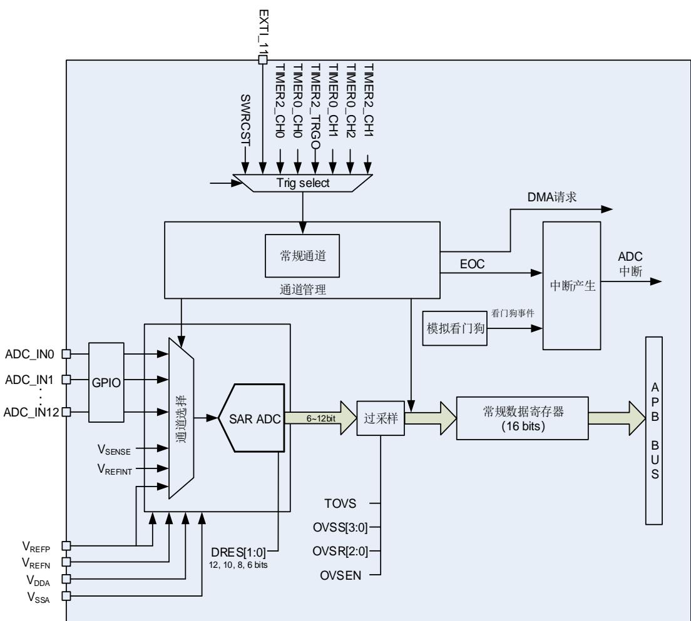
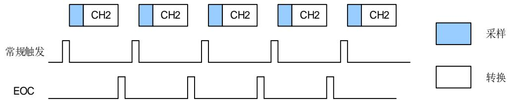
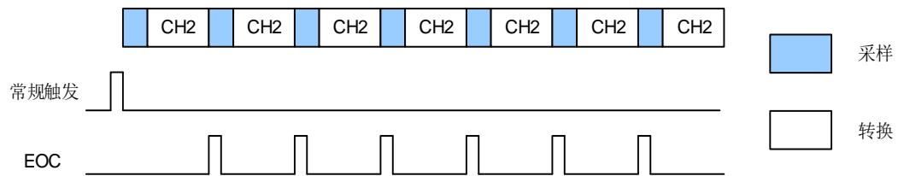
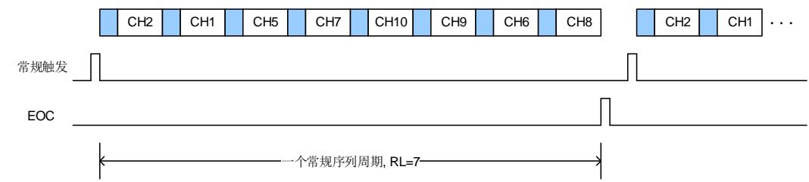
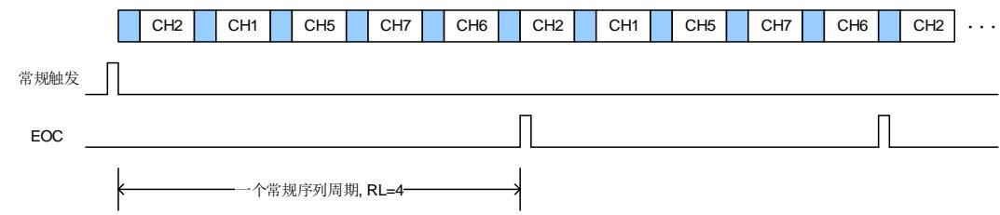
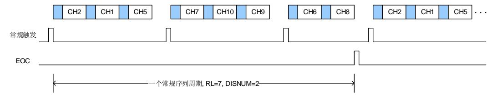
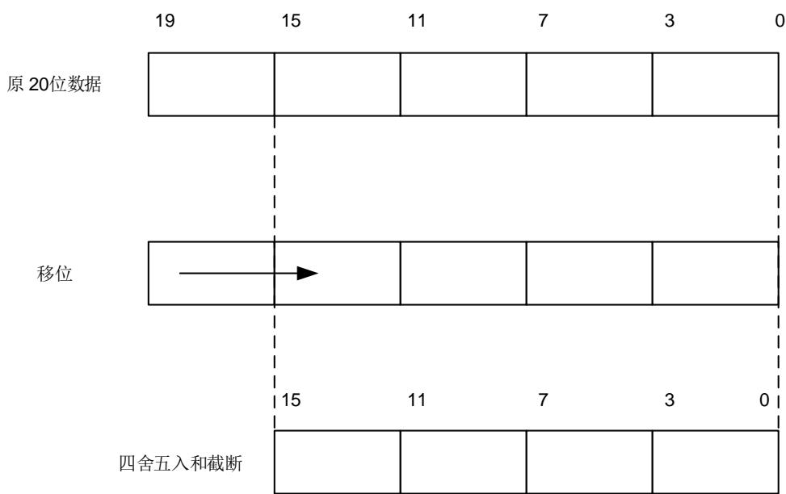

## 11. 模数转换器（ADC）

## 11.1. 简介

MCU 片上集成了 12 位逐次逼近式模数转换器模块（ADC），可以采样来自于 13 个外部通道和 3 个内部通道上的模拟信号。这些 ADC 采样通道都支持多种运行模式，采样转换后，转换结果可以按照最低有效位对齐或最高有效位对齐的方式保存在相应的数据寄存器中。片上的硬件过采样机制可以通过减少来自 MCU 的相关计算负担来提高性能。

对于电机、电源等对 ADC 有更高需求的应用，可以联系我们的销售，获取更多的 ADC 详细资料。

## 11.2. 主要特征

◼ 高性能：

ADC采样分辨率：12位、10位、8位、或者6位分辨率；

可编程采样时间；

数据存储模式：最高有效位对齐和最低有效位对齐；

支持DMA请求。

◼ 多时钟域架构：

- CK_SYS系统时钟，CK_HIRCDIV_PER时钟；

◼ 模拟输入通道：

– 多达13个外部模拟输入通道；

– 1个内部温度传感器通道（VSENSE）；

– 1个内部参考电压输入通道（VREFINT）；

1个内部正参考电压输入通道（VREFP）

◼ 转换开始的发起：

– 软件；

硬件触发。

◼ 运行模式：

– 转换单个通道，或者扫描一序列的通道；

– 单次运行模式，每次触发转换一次选择的输入通道；

连续运行模式，连续转换所选择的输入通道；

– 间断运行模式；

◼ 转换结果阈值监测功能：模拟看门狗。

◼ 中断产生：

常规序列转换结束；

– 模拟看门狗事件；

◼ 过采样：

16位的数据寄存器；

可调整的过采样率，从2x到256x；

高达8位的可编程数据移位。

◼ ADC输入范围：VREFN ≤VIN ≤VREFP。

## 11.3. 引脚和内部信号

11-1. ADC 给出了ADC模块框图。 11-1. ADC 给出了ADC内部信号。 11-2.ADC 给出了ADC引脚说明。

表 11-1. ADC 内部输入/输出信号

<table><tr><td>内部信号名称</td><td>说明</td></tr><tr><td><eq>V_{SENSE}</eq></td><td>内部温度传感器输出电压</td></tr><tr><td><eq>V_{REFINT}</eq></td><td>内部参考输出电压</td></tr><tr><td>ADC_WDx_OUT</td><td>模拟看门狗x输出信号,被连接到TIMER模块(x=0,1,2)</td></tr></table>

表 11-2. ADC 引脚定义

<table><tr><td>名称</td><td>注释</td></tr><tr><td><eq>V_{DDA}</eq></td><td>模拟电源输入,等于<eq>V_{DD}</eq></td></tr><tr><td><eq>V_{SSA}</eq></td><td>模拟地,等于<eq>V_{SS}</eq></td></tr><tr><td><eq>V_{REFP}</eq></td><td>ADC正参考电压</td></tr><tr><td><eq>V_{REFN}</eq></td><td>ADC负参考电压</td></tr><tr><td>ADCx_IN[12:0]</td><td>多达13路外部通道</td></tr></table>

注意：VDDA和VSSA必须分别连接到VDD和VSS。

## 11.4. 功能描述

图 11-1. ADC 模块框图

## 11.4.1. 多时钟域架构

除了系统时钟CK_SYS，ADC模块的时钟还可以由CK_HIRCDIV_PER分频后提供。使用CK_HIRCDIV_PER或HXTAL时钟分频作为ADC时钟，可以实现降低系统时钟频率后，应用程序在低功耗运行的同时，ADC仍保持最佳运行状态。ADC的最大频率为24Mhz。

想要更多ADC时钟产生的信息，可以参考RCU章节。

## 11.4.2. ADC 使能

ADC_CTL1 寄存器中的 ADCON 位是 ADC 模块的使能开关。如果该位为 0，则 ADC 模块保持复位状态。为了省电，当 ADCON 位为 0 时，ADC 模拟子模块将会进入掉电模式。ADC 使能后需等待 tST(ADC)时间后才能采样，tST(ADC)数值详见芯片相关型号 Datasheet。

## 11.4.3. 常规序列

通道管理电路把采样通道组织成一个常规序列。

ADC常规序列支持高达16个通道。每个通道称为常规通道。ADC_RSQ0寄存器的RL[3:0]位规定了整个常规序列的长度。ADC_RSQ0~ADC_RSQ2寄存器规定了常规序列的通道选择。

## 11.4.4. 运行模式

## 单次运行模式

单次运行模式下，ADC_RSQ2 寄存器的 RSQ0[3:0]位规定了 ADC 的转换通道。当 ADCON 位被置 1，一旦相应软件触发或者外部触发发生，ADC 就会采样和转换一个通道。

图 11-2. 单次运行模式

常规序列的通道单次转换结束后，转换数据将被存放于 ADC_RDATA 寄存器中，EOC 将会置1。如果 EOCIE 位被置 1，将产生一个中断。

常规序列单次运行模式的软件流程：

1. 确保ADC_CTL0寄存器的DISRC和SM位以及ADC_CTL1寄存器的CTN位为0；

2. 用模拟通道编号来配置ADC_RSQ2寄存器的RSQ0[3:0]位域；

3. 配置ADC_SAMPTx寄存器；

4. 如果有需要，可以配置ADC_CTL1寄存器的ETERC和ETSRC位；

5. 设置SWRCST位，或者为常规序列产生一个外部触发信号；

6. 等到EOC置1；

7. 从ADC_RDATA寄存器中读ADC转换结果；

8. 写0清除EOC标志位。

注意：当 EOC 置 1 后，需延迟一个 CK_ADC 再读取 ADC 转换结果。

## 连续运行模式

将 ADC_CTL1 寄存器的 CTN 位置 1 可以使能连续运行模式。在此模式下，ADC 执行由RSQ0[3:0]规定的转换通道。当 ADCON 位被置 1，一旦相应软件触发或者外部触发产生，ADC就会采样和转换规定的通道。转换数据保存在 ADC_RDATA 寄存器中。

图 11-3. 连续运行模式

常规序列连续运行模式的软件流程：

1. 设置ADC_CTL1寄存器的CTN位为1；

2. 用模拟通道编号来配置ADC_RSQ2寄存器的RSQ0[3:0]位域；

3. 配置ADC_SAMPTx寄存器；

4. 如果有需要，配置ADC_CTL1寄存器的ETERC和ETSRC位；

5. 设置SWRCST位，或者给常规序列产生一个外部触发信号；

6. 等待EOC标志位置1；

7. 从ADC_RDATA寄存器中读ADC转换结果；

8. 写0清除EOC标志位；

9. 只要还需要进行连续转换，重复步骤6~8。

注意：当 EOC 置 1 后，需延迟一个 CK_ADC 再读取 ADC 转换结果。

可以使用 DMA 来传输转换数据，不需循环查询 EOC 标志位，软件流程如下：

1. 设置ADC_CTL1寄存器的CTN位和DMA位为1；

2. 用模拟通道编号来配置ADC_RSQ2寄存器的RSQ0[3:0]位域；

3. 配置ADC_SAMPTx寄存器；

4. 如果有需要，配置ADC_CTL1寄存器的ETERC和ETSRC位；

5. 准备DMA模块，用于传输来自ADC_RDATA的数据；

6. 设置SWRCST位，或者给常规序列产生一个外部触发。

## 扫描运行模式

扫描运行模式可以通过将 ADC_CTL0 寄存器的 SM 位置 1 来使能。在此模式下，ADC 扫描转换所有被 ADC_RSQ0~ADC_RSQ2 寄存器选中的所有通道。一旦 ADCON 位被置 1，当相应软件触发或者外部触发产生，ADC 就会一个接一个的采样和转换常规序列通道。转换数据存储在 ADC_RDATA 寄存器中。常规序列转换结束后，EOC 位将被置 1。如果 EOCIE 位被置1，将产生中断。当常规序列工作在扫描模式下时，ADC_CTL1 寄存器的 DMA 位必须设置为1。

如果 ADC_CTL1 寄存器的 CTN 位也被置 1，则在常规序列转换完之后，这个转换自动重新开始。

图 11-4. 扫描运行模式，且连续运行模式禁能

常规序列扫描运行模式的软件流程：

1. 设置 ADC_CTL0 寄存器的 SM 位和 ADC_CTL1 寄存器的 DMA 位为 1；

2. 配置 ADC_RSQx 和 ADC_SAMPTx 寄存器；

3. 如果有需要，配置 ADC_CTL1 寄存器中的 ETERC 和 ETSRC 位；

4. 准备 DMA 模块，用于传输来自 ADC_RDATA 的数据；

5. 设置 SWRCST 位，或者给常规序列产生一个外部触发；

图 11-5. 扫描运行模式，连续运行模式使能

## 间断运行模式

对于常规序列，当 ADC_CTL0 寄存器的 DISRC 位置 1 时，常规序列间断运行模式使能。该模式下可以执行一次 n 个通道的短序列转换（n<=8），这个短序列是 ADC_RSQ0~RSQ2 寄存器所选择的转换序列的一部分。数值 n 由 ADC_CTL0 寄存器的 DISCNUM[2:0]位给出。当相应的软件触发或外部触发发生，ADC 就会采样和转换在 ADC_RSQ0~RSQ2 寄存器所选择通道中接下来的 n 个通道，直到常规序列中所有的通道转换完成。每个常规序列转换周期结束后，EOC 位将置 1。如果 EOCIE 位置 1 将产生一个中断。

图 11-6. 间断运行模式

常规序列间断模式的软件流程：

1. 设置 ADC_CTL0 寄存器的 DISRC 位和 ADC_CTL1 寄存器的 DMA 位为 1；

2. 配置 ADC_CTL0 寄存器的 DISNUM[2:0]位；

3. 配置 ADC_RSQx 和 ADC_SAMPTx 寄存器；

4. 如果有需要，配置 ADC_CTL1 寄存器中的 ETERC 和 ETSRC 位；

5. 准备 DMA 模块，用于传输来自 ADC_RDATA 的数据；

6. 设置 SWRCST 位，或者给常规序列产生一个外部触发；

7. 如果需要，重复步骤 6；

## 11.4.5. 转换结果阈值监测功能

## 模拟看门狗 0

ADC_CTL0 寄存器的 RWD0EN 位置 1 将使能常规序列的模拟看门狗 0 功能。该功能用于监测转换结果是否超过设定的阈值。如果 ADC 的模拟转换电压低于低阈值或高于高阈值时，ADC_STAT 状态寄存器的 WD0E 位将被置 1。如果 WD0EIE 位被置 1，将产生中断。ADC_WD0HT 和 ADC_WD0LT 寄存器用来设定高低阈值。内部数据的比较在对齐之前完成，因此阈值与ADC_CTL0寄存器的DAL位确定的对齐方式无关。ADC_CTL0寄存器的RWD0EN，WD0SC 和 WD0CHSEL[3:0]位可以用来选择模拟看门狗 0 监控单一通道或者多通道。

常规通道数据

常规通道数据

## 模拟看门狗 1/2

模拟看门狗 1/2 更加的灵活，可以进行单个或多个通道的看门狗功能配置。

通过配置 ADC_WD1SR 寄存器中的 AWD1CS 位域中的相应位，可以使能相应通道的模拟看门狗 1 功能，同理，可以配置看门狗 2 功能。模拟看门狗 1/2 的高/低阈值可在 ADC_WD1HT/ ADC_WD1LT 寄存器和 ADC_WD2HT / ADC_WD2LT 寄存器中进行配置。

## ADC_WDx_OUT 输出信号

每个模拟看门狗会生成对应的 ADC_WDx_OUT（x=0,1,2）信号，该信号连接至定时器（TIMER）模块。在定时器模块中，可选择 ADC_WDx_OUT 信号或其他信号作为外部触发输入（ETI）的信号源（详见 TIMER 模块）。

当被监测通道的转换结果超过阈值时，ADC_WDx_OUT 信号会被置为 1。即使软件清除了WDxE标志位，也不会影响ADC_WDx_OUT信号的状态。当转换结果重新回到阈值范围内时，ADC_WDx_OUT 信号会被复位为 0。

## 11.4.6. 数据存储模式

ADC_CTL1 寄存器的 DAL 位确定转换后数据存储的对齐方式。

注入序列通道转换的数据值已经减去了在 ADC_IOFFx 寄存器中定义的偏移量，因此结果可能是一个负值。符号值是一个扩展值。

图 11-7. 12 位数据存储模式

<table><tr><td>0</td><td>0</td><td>0</td><td>0</td><td>D11</td><td>D10</td><td>D9</td><td>D8</td><td>D7</td><td>D6</td><td>D5</td><td>D4</td><td>D3</td><td>D2</td><td>D1</td><td>D0</td></tr></table>

常规通道数据

<table><tr><td>D11</td><td>D10</td><td>D9</td><td>D8</td><td>D7</td><td>D6</td><td>D5</td><td>D4</td><td>D3</td><td>D2</td><td>D1</td><td>D0</td><td>0</td><td>0</td><td>0</td><td>0</td></tr></table>

DAL=1 

图 11-8. 10 位数据存储模式

常规通道数据

<table><tr><td>0</td><td>0</td><td>0</td><td>0</td><td>D9</td><td>D8</td><td>D7</td><td>D6</td><td>D5</td><td>D4</td><td>D3</td><td>D2</td><td>D1</td><td>D0</td><td>0</td><td>0</td></tr></table>

<table><tr><td>D9</td><td>D8</td><td>D7</td><td>D6</td><td>D5</td><td>D4</td><td>D3</td><td>D2</td><td>D1</td><td>D0</td><td>0</td><td>0</td><td>0</td><td>0</td><td>0</td><td>0</td></tr></table>

DAL=1 

图 11-9. 8 位数据存储模式

常规通道数据

<table><tr><td>0</td><td>0</td><td>0</td><td>0</td><td>D7</td><td>D6</td><td>D5</td><td>D4</td><td>D3</td><td>D2</td><td>D1</td><td>D0</td><td>0</td><td>0</td><td>0</td><td>0</td></tr></table>

<table><tr><td>D7</td><td>D6</td><td>D5</td><td>D4</td><td>D3</td><td>D2</td><td>D1</td><td>D0</td><td>0</td><td>0</td><td>0</td><td>0</td><td>0</td><td>0</td><td>0</td><td>0</td></tr></table>

DAL=1 

6 位分辨率的数据存储模式不同于 12 位/10 位/8 位分辨率数据存储模式，如 11-10. 6据存储模式

图 11-10. 6 位数据存储模式

<table><tr><td>0</td><td>0</td><td>0</td><td>0</td><td>0</td><td>0</td><td>0</td><td>0</td><td>0</td><td>0</td><td>D5</td><td>D4</td><td>D3</td><td>D2</td><td>D1</td><td>D0</td></tr></table>

常规通道数据

<table><tr><td>0</td><td>0</td><td>0</td><td>0</td><td>0</td><td>0</td><td>0</td><td>0</td><td>D5</td><td>D4</td><td>D3</td><td>D2</td><td>D1</td><td>D0</td><td>0</td><td>0</td></tr></table>

DAL=1 

## 11.4.7. 采样时间配置

ADC 使用若干个 CK_ADC 周期对输入电压采样，采样周期数目可以通过 ADC_SAMPT0 和ADC_SAMPT1 寄存器的 SPTn[2:0]位更改。每个通道可以用不同的时间采样。在 12 位分辨率的情况下，总采样转换时间=采样时间+12.5 个 CK_ADC 周期。

例如：

CK_ADC = 24MHz，采样时间为 2.5 个周期，那么总的转换时间为：“2.5+12.5”个 CK_ADC 周期，即 0.625us。

## 11.4.8. 外部触发

外部触发输入的上升沿可以触发常规序列的转换。常规序列的外部触发源由 ADC_CTL1 寄存器的 ETSRC[2:0]位控制。

表11-3.常规序列外部触发源

<table><tr><td>ETSRC[2:0]</td><td>触发源</td><td>触发类型</td></tr><tr><td>000</td><td>TIMER2_CH1</td><td rowspan="7">硬件触发</td></tr><tr><td>001</td><td>TIMER0_CH2</td></tr><tr><td>010</td><td>TIMER0_CH1</td></tr><tr><td>011</td><td>TIMER2_TRGO</td></tr><tr><td>100</td><td>TIMER0_CH0</td></tr><tr><td>101</td><td>TIMER2_CH0</td></tr><tr><td>110</td><td>EXTI_11</td></tr><tr><td>111</td><td>SWRCST</td><td>软件触发</td></tr></table>

## 11.4.9. DMA 请求

DMA请求，可以通过设置 ADC_CTL1 寄存器的 DMA 位来使能，它用于传输常规序列多个通道的转换结果。ADC 在常规序列的一个通道转换结束后产生一个 DMA 请求，DMA 接受到请求后可以将转换的数据从 ADC_RDATA寄存器传输到用户指定的目的地址。

## 11.4.10. ADC 内部通道

ADC 模拟输入通道 13、14 和 15 分别连接到温度传感器、V 和 V 模拟输入。

将 $\mathsf { A D C \_ C T L 1 }$ 寄存器的 TSVEN 位置 1 可以使能温度传感器通道。温度传感器可以用来测量器件周围的温度。传感器输出电压能被 ADC 转换成数字量。建议温度传感器的采样时间至少设置为 $\mathrm { \bf t _ { s \_ t e m p } }$ （具体数值请参考 Datasheet）。温度传感器不用时，复位 TSVEN 位可以将其置于掉电模式。

温度传感器的输出电压随温度会发生线性变化，由于芯片生产过程的多样化，温度变化曲线的偏移在不同的芯片上会有不同（最多相差 $45 \textdegree C )$ ）。内部温度传感器更适合于检测温度的变化，而不是测量绝对温度。如果需要测量精确的温度，应该使用一个外置的温度传感器来校准这个偏移错误。

## 使用温度传感器：

1. 配置温度传感器通道的转换序列和采样时间大于ts_temp；

2. 置位ADC_CTL1寄存器的TSVEN位，使能温度传感器；

3. 由软件或外部触发启动ADC转换；

4. 读取内部温度传感器输出电压Vtemperature，并由下面公式计算出实际温度：

$$
\mathrm{温度} (^ {\circ} \mathrm{C}) = \frac {\mathrm{V} _ {2 5} - \mathrm{V} _ {\mathrm{temperature}}}{\mathrm {Avg\_Slope}} + 2 5\tag{11-1}
$$

Vtemperature：温度传感器的输出电压。

$\vee _ { 2 5 } \colon$ 内部温度传感器在 $\boldsymbol { 2 5 ^ { \circ } \mathrm { C } }$ 时的输出电压，典型值请参考相关型号 Datasheet。

Avg_Slope：温度与内部温度传感器输出电压曲线的均值斜率，典型值请参考相关型号datasheet。

将 ADC_CTL1 寄存器的 INREFEN 位置 1 可以使能 VREFINT通道。内部电压参考（VREFINT）提供了一个稳定的（带隙基准）电压输出给 ADC 和比较器。VREFINT内部连接到 ADC_IN14 输入通道。

V 通道内部连接到正参考电压引脚 VREFP。部分封装不存在 VREFP 引脚时， $V _ { R E F P }$ 通道内部连接到 VDDA。

## 11.4.11. 可编程分辨率（DRES）

对寄存器 ADC_OVSAMPCTL 中的 DRES[1:0]位进行编程即可配置分辨率为 6、8、10、12 位。对于那些不需要高精度数据的应用，可以使用较低的分辨率来实现更快速地转换。只有在ADCON 位为 0 时，才能修改 DRES[1:0]的值。ADC 转换的结果只有 12 位，其余没有被用到的低位读出来都是为 0。较低的分辨率能够减少逐次逼近步骤所需的转换时间，如 11-4.tCONV 所示。

表 11-4. 不同分辨率对应的 tCONV 时间

<table><tr><td>DRES[1:0]位域</td><td>tCONV(ADC时钟周期)</td><td>tCONV(ns) at fADC=24MHz</td><td>tSMPL(min)(ADC时钟周期)</td><td>tADC(ADC时钟周期)</td><td>tADC(ns) at fADC=24MHz</td></tr><tr><td>12</td><td>12.5</td><td>521ns</td><td>2.5</td><td>15</td><td>625ns</td></tr><tr><td>10</td><td>10.5</td><td>438ns</td><td>2.5</td><td>13</td><td>542ns</td></tr><tr><td>8</td><td>8.5</td><td>354ns</td><td>2.5</td><td>11</td><td>458ns</td></tr><tr><td>6</td><td>6.5</td><td>271ns</td><td>2.5</td><td>9</td><td>375ns</td></tr></table>

## 11.4.12. 片上硬件过采样

片上硬件过采样单元执行数据预处理以减轻 CPU 负担。它能够处理多个转换，并将多个转换的结果取平均，得出一个 16 位宽的数据。其结果根据如下公式计算得出，其中 N 和 M 的值可以被调整。 $\sf D _ { 0 u t } \mathrm { ~ \Omega ~ } ( \sf n )$ 是指 ADC 输出的第 n 个数字信号：

$$
\mathrm{Result} = \frac {1}{M} * \sum_ {n = 0} ^ {N - 1} D _ {\mathrm{out}} (n)\tag{11-2}
$$

片上硬件过采样单元执行两个功能：求和和位右移。过采样率N是在ADC_OVSAMPCTL寄存器的OVSR[2:0]位定义，它的取值范围为2x到256x。除法系数M定义一个多达8位的右移，它通过ADC_OVSAMPCTL寄存器OVSS[3:0]位进行配置。

求和单元能够生成一个多达 20 位（256*12 位）的值。首先，将这个值要进行右移，将移位后剩余的部分再通过取整转化一个近似值，最后将高位会被截断，仅保留最低 16 位有效位作为最终值传入对应的数据寄存器中。

图 11-11. 20 位到 16 位的结果截断

注意：如果移位后的中间结果还是超过 16 位，那么该结果的高位就会被直接截掉。

11-12. 5 描述一个从原始 20 位的累积数值处理成 16 位结果值的例子。

<table><tr><td>15</td><td>11</td><td>7</td><td>3</td><td>0</td></tr></table>

图 11-12. 右移 5 位和取整的数例

<table><tr><td>19</td><td>15</td><td>11</td><td>7</td><td>3</td><td>0</td></tr><tr><td>2</td><td>A</td><td>C</td><td>D</td><td>6</td><td></td></tr></table>

四舍五入取近似值以及右移5位之后的结果

<table><tr><td>1</td><td>5</td><td>6</td><td>6</td></tr></table>

11-5. N M 给出了 N 和 M 各种组合的数据格式，初始转换值为 0xFFF。

表 11-5. N 和 M 的最大输出值（灰色部分表示截断）

<table><tr><td>Oversampling ratio</td><td>Max Raw data</td><td>No-shift OVSS=0000</td><td>1-bit shift OVSS=0001</td><td>2-bit shift OVSS=0010</td><td>3-bit shift OVSS=0011</td><td>4-bit shift OVSS=0100</td><td>5-bit shift OVSS=0101</td><td>6-bit shift OVSS=0110</td><td>7-bit shift OVSS=0111</td><td>8-bit shift OVSS=1000</td></tr><tr><td>2x</td><td>0x1FFE</td><td>0x1FFE</td><td>0x0FFF</td><td>0x07FF</td><td>0x03FF</td><td>0x01FF</td><td>0x00FF</td><td>0x007F</td><td>0x003F</td><td>0x001F</td></tr><tr><td>4x</td><td>0x3FFC</td><td>0x3FFC</td><td>0x1FFE</td><td>0x0FFF</td><td>0x07FF</td><td>0x03FF</td><td>0x01FF</td><td>0x00FF</td><td>0x007F</td><td>0x003F</td></tr><tr><td>8x</td><td>0x7FF8</td><td>0x7FF8</td><td>0x3FFC</td><td>0x1FFE</td><td>0x0FFF</td><td>0x07FF</td><td>0x03FF</td><td>0x01FF</td><td>0x00FF</td><td>0x007F</td></tr><tr><td>16x</td><td>0xFFFF0</td><td>0xFFFF0</td><td>0x7FF8</td><td>0x3FFC</td><td>0x1FFE</td><td>0x0FFF</td><td>0x07FF</td><td>0x03FF</td><td>0x01FF</td><td>0x00FF</td></tr><tr><td>32x</td><td>0x1FFE0</td><td>0xFFE0</td><td>0xFFFF0</td><td>0x7FF8</td><td>0x3FFC</td><td>0x1FFE</td><td>0x0FFF</td><td>0x07FF</td><td>0x03FF</td><td>0x01FF</td></tr><tr><td>64x</td><td>0x3FFC0</td><td>0xFFC0</td><td>0xFFE0</td><td>0xFFF0</td><td>0x7FF8</td><td>0x3FFC</td><td>0x1FFE</td><td>0x0FFF</td><td>0x07FF</td><td>0x03FF</td></tr><tr><td>128x</td><td>0x7FF80</td><td>0xFF80</td><td>0xFFC0</td><td>0xFFE0</td><td>0xFFF0</td><td>0x7FF8</td><td>0x3FFC</td><td>0x1FFE</td><td>0x0FFF</td><td>0x07FF</td></tr><tr><td>256x</td><td>0xFFFF00</td><td>0xFF00</td><td>0xFF80</td><td>0xFFC0</td><td>0xFFE0</td><td>0xFFF0</td><td>0x7FF8</td><td>0x3FFC</td><td>0x1FFE</td><td>0x0FFF</td></tr></table>

和标准的运行模式相比，过采样模式的转换时间不会改变：在整个过采样序列的过程中采样时间仍然保持相等。每 N 个转换就会产生一个新的数据，一个等价的延迟为：

$$
N \times t _ {A D C} = N \times (t _ {S M P L} + t _ {C O N V})\tag{11-3}
$$

## 11.5. 中断

以下任一个事件发生都可以产生中断：

◼ 常规序列转换结束；

◼ 模拟看门狗事件；

单独的中断使能位可使得使用更灵活。

