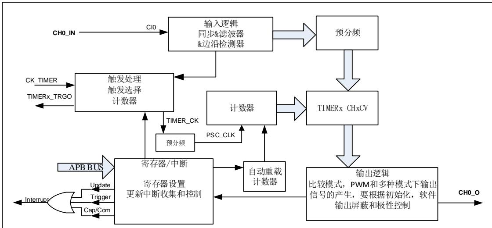
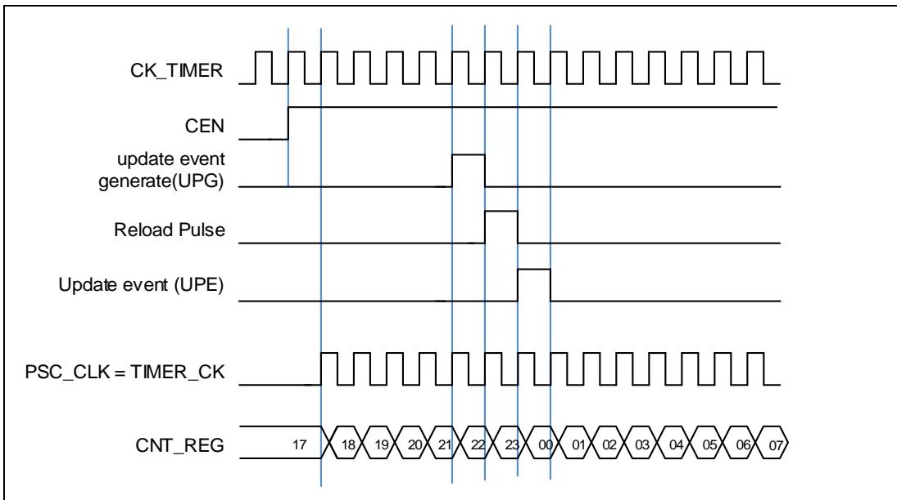
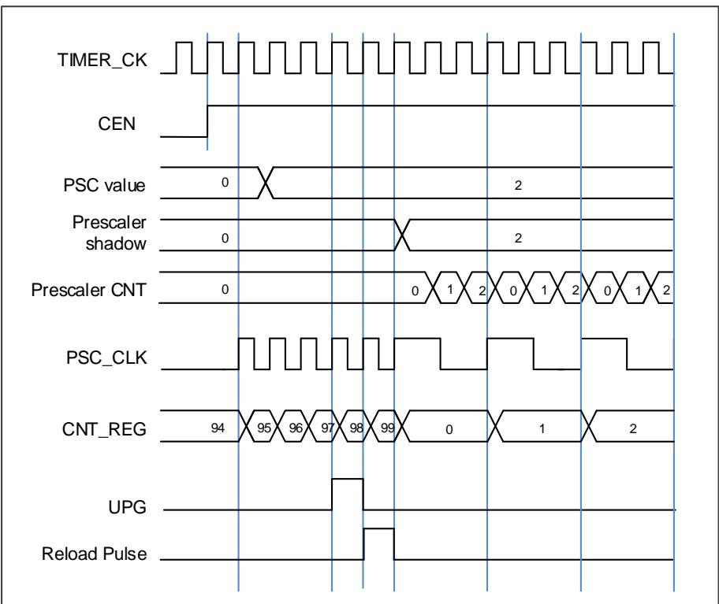
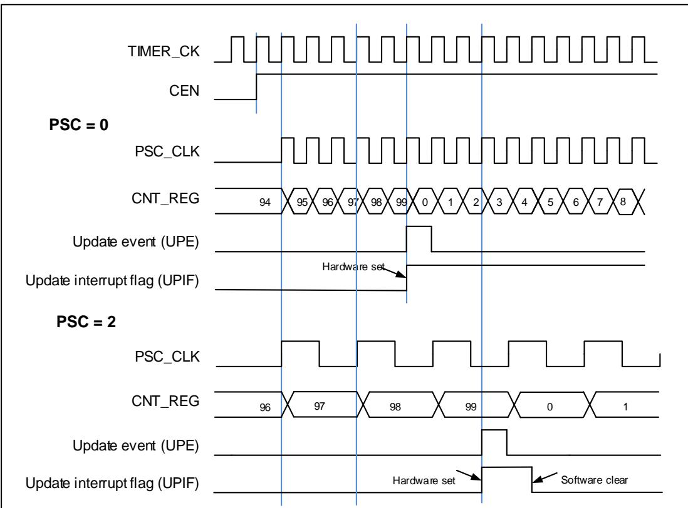
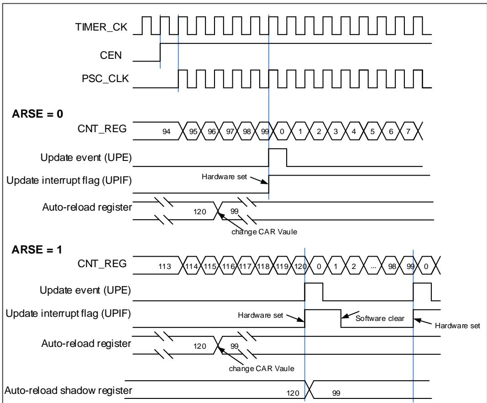
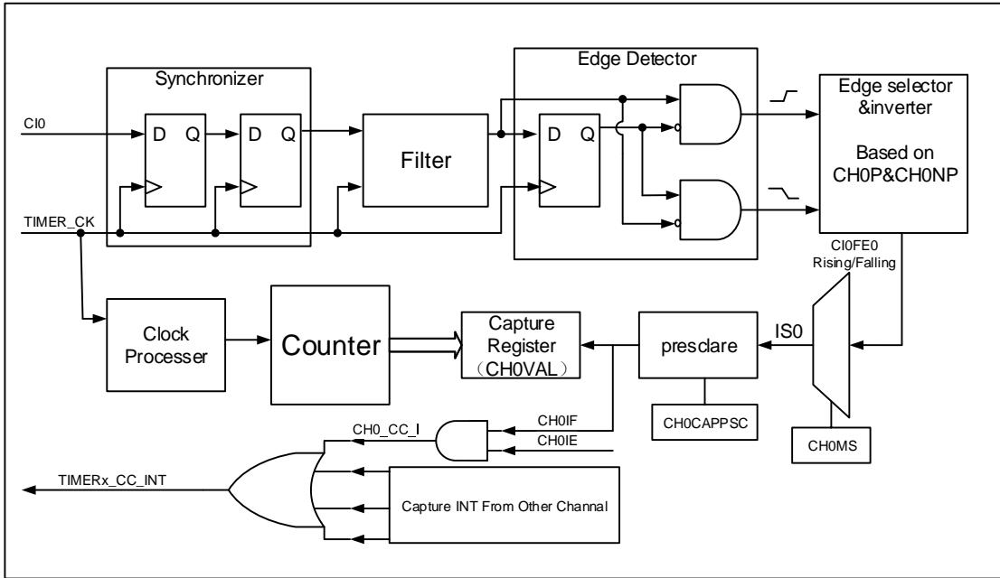
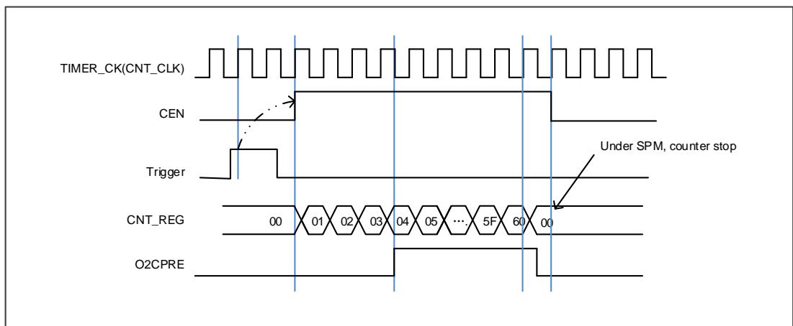

## 14.3. 通用定时器 L2（TIMERx, x= 13）

## 14.3.1. 简介

通用定时器L2 (TIMERx，x= 13)是单通道定时器，支持输入捕获和输出比较。可以产生PWM信号控制电机和电源管理。通用定时器L2含有一个16位无符号计数器。

通用定时器L2是可编程的，可以用来计数，其外部事件可以驱动其他定时器。

## 14.3.2. 主要特征

◼ 总通道数：1；

◼ 计数器宽度：16位；

◼ 时钟源：内部时钟；

◼ 计数模式：向上计数；

◼ 可编程的预分频器：16位，运行时可以被改变；

◼ 每个通道可配置：输入捕获模式，输出比较模式，可编程的PWM模式；

◼ 自动重装载功能；

◼ 中断输出：更新事件，比较/捕获事件。

## 14.3.3. 结构框图

14-61. L2 提供了通用定时器L2的内部配置细节

图 14-61. 通用定时器 L2结构框图

## 14.3.4. 功能描述

## 时钟源配置

通用定时器L2由内部时钟源CK_TIMER驱动

◼ 定时器时钟TIMER_CK连接到RCU模块的CK_TIMER通用定时器L2仅有一个时钟源CK_TIMER，用来驱动计数器预分频器。当CEN置位，CK_TIMER经过预分频器（预分频值由TIMERx_PSC寄存器确定）产生PSC_CLK。

图 14-62. 内部时钟分频为 1 时，计数器的时序图

## 时钟预分频器

预分频器可以将定时器的时钟（TIMER_CK)频率按1到65536之间的任意值分频，分频后的时钟PSC_CLK驱动计数器计数。分频系数受预分频寄存器TIMERx_PSC控制，这个控制寄存器带有缓冲器，它能够在运行时被改变。新的预分频器的参数在下一次更新事件到来时被采用。

图 14-63. 当 PSC 数值从 0 变到 2 时，计数器的时序图

## 计数器向上计数模式

在这种模式，计数器的计数方向是向上计数。计数器从 0 开始向上连续计数到自动加载值（定义在 TIMERx_CAR 寄存器中），一旦计数器计数到自动加载值，会重新从 0 开始向上计数并产生上溢事件。在向上计数模式中，TIMERx_CTL0 寄存器中的计数方向控制位 DIR 应该被设置成 0。

当通过 TIMERx_SWEVG 寄存器的 UPG 位置 1 来设置更新事件时，计数值会被清 0，并产生更新事件。

如果 TIMERx_CTL0 寄存器的 UPDIS 置 1，则禁止更新事件。

当发生更新事件时，所有影子寄存器(计数器自动重载寄存器，预分频寄存器)都将被更新。

14-64.        PSC=0/2 和 14-65.TIMERx_CAR 给出了一些例子，当TIMERx_CAR=0x99时，计数器在不同预分频因子下的行为。

图 14-64. 向上计数时序图，PSC=0/2

图 14-65. 向上计数时序图，在运行时改变 TIMERx_CAR 寄存器的值

## 输入捕获和输出比较通道

通用定时器 L2 只有一个独立的通道用于捕获输入或比较输出是否匹配。该通道通道都围绕一个通道捕获比较寄存器建立，包括一个输入级，通道控制器和输出级。

## ◼ 通道输入捕获功能

捕获模式允许通道测量一个波形时序，频率，周期，占空比等。输入级包括一个数字滤波器，一个通道极性选择，边沿检测和一个通道预分频器。如果在输入引脚上出现被选择的边沿，TIMERx_CHxCV 寄存器会捕获计数器当前的值，同时 CHxIF 位被置 1，如果 CHxIE = 1 则产生通道中断。

图 14-66. 通道输入捕获原理

通道输入信号 CIx 先被 TIMER_CK 信号同步，然后经过数字滤波器采样，产生一个被滤波后的信号。通过边沿检测器，可以选择检测上升沿或者下降沿。通过配置 CHxP 选择使用上升沿或者下降沿。配置 CHxMS.，可以选择其他通道的输入信号，内部触发信号。配置 IC 预分频器，使得若干个输入事件后才产生一个有效的捕获事件。捕获事件发生，TIMERx_CHxCV 存储计数器的值。

配置步骤如下：

第一步：滤波器配置（TIMERx_CHCTL0寄存器中CHxCAPFLT）：

根据输入信号和请求信号的质量，配置相应的CHxCAPFLT。

第二步：边沿选择（TIMERx_CHCTL2寄存器中CHxP/CHxNP）：

配置CHxP/CHxNP选择上升沿或者下降沿。

第三步：捕获源选择（TIMERx_CHCTL0寄存器中CHxMS）：

一旦通过配置CHxMS选择输入捕获源，必须确保通道配置在输入模式（CHxMS!=0x0），而且TIMERx_CHxCV寄存器不能再被写。

第四步：中断使能（TIMERx_DMAINTEN寄存器中CHxIE）：

使能相应中断，可以获得中断。

第五步：捕获使能（TIMERx_CHCTL2寄存器中CHxEN）。

结果：当期望的输入信号发生时，TIMERx_CHxCV被设置成当前计数器的值，CHxIF为置1。如果CHxIF位已经为1，则CHxOF位置1。根据TIMERx_DMAINTEN寄存器中CHxIE的配置，相应的中断会被提出。

直接产生：软件设置CHxG位，会直接产生中断。

输入捕获模式也可用来测量 TIMERx_CHx 引脚上信号的脉冲波宽度。例如，一个 PWM 波连接到 CI0。配置 TIMERx_CHCTL0 寄存器中 CH0MS 为 2’b01，选择通道 0 的捕获信号为 CI0并设置上升沿捕获。计数器配置为复位模式，在通道 0 的上升沿复位。TIMERX_CH0CV 寄存器测量 PWM 的周期值，TIMERx_CH1CV 寄存器测量 PWM 占空比值。

◼ 通道输出比较功能
在通道输出比较功能，TIMERx 可以产生时控脉冲，其位置，极性，持续时间和频率都是可编程的。当一个输出通道的 TIMERx_CHxCV 寄存器与计数器的值匹配时，根据 CHxCOMCTL的配置，这个通道的输出可以被置高电平，被置低电平或者反转。当计数器的值与TIMERx_CHxCV 寄存器的值匹配时，CHxIF 位被置 1，如果 CHxIE = 1 则会产生中断，如果CxCDE=1 则会产生 DMA 请求。

配置步骤如下：

第一步：时钟配置：

配置定时器时钟源，预分频器等。

第二步：比较模式配置：

设置CHxCOMSEN位来配置输出比较影子寄存器；

设置CHxCOMCTL位来配置输出模式（置高电平/置低电平/反转）；

设置CHxP/CHxNP位来选择有效电平的极性；

设置CHxEN使能输出。

第三步：通过CHxIE位配置中断使能。

第四步：通过TIMERx_CAR寄存器和TIMERx_CHxCV寄存器配置输出比较时基：TIMERx_CHxCV可以在运行时根据你所期望的波形而改变。

第五步：设置CEN位使能定时器。

14-67. 显示了三种比较输出模式：反转/置高电平/置低电平，CAR=0x63,CHxVAL=0x3。

图 14-67. 三种输出比较模式

<table><tr><td rowspan="4"></td><td colspan="101">CNT_CLK</td><td></td><td></td><td></td><td></td><td></td><td></td><td></td><td></td><td></td><td></td><td></td><td></td><td></td><td></td><td></td><td></td><td></td><td></td><td></td><td></td><td></td><td></td><td></td><td></td><td></td><td></td><td></td><td></td><td></td><td></td><td></td><td></td><td></td><td></td><td></td><td></td><td></td><td></td><td></td><td></td><td></td><td></td><td></td><td></td><td></td><td></td><td></td><td></td><td></td><td></td><td></td><td></td><td></td><td></td><td></td><td></td><td></td><td></td><td></td><td></td><td></td><td></td><td></td><td></td><td></td><td></td><td></td><td></td><td></td><td></td><td></td><td></td><td></td><td></td><td></td><td></td><td></td><td></td><td></td><td></td><td></td><td></td><td></td><td></td><td></td><td></td><td></td><td></td><td></td><td></td><td></td><td></td><td></td><td></td><td></td><td></td><td></td><td></td><td></td><td></td><td></td><td></td><td></td><td></td><td></td><td></td><td></td><td></td><td></td><td></td><td></td><td></td><td></td><td></td><td></td><td></td><td></td><td></td><td></td><td></td><td></td><td></td><td></td><td></td><td></td><td></td><td></td><td></td><td></td><td></td><td></td><td></td><td></td><td></td><td></td><td></td><td></td><td></td><td></td><td></td><td></td><td></td><td></td><td></td><td></td><td></td><td></td><td></td><td></td><td></td><td></td><td></td><td></td><td></td><td></td><td></td><td></td><td></td><td></td><td></td><td></td><td></td><td></td><td></td><td></td><td></td><td></td><td></td><td></td><td></td><td></td><td></td><td></td><td></td><td></td><td></td><td></td><td></td><td></td><td></td><td></td><td></td><td></td><td></td><td></td><td></td><td></td><td></td><td></td><td></td><td></td><td></td><td></td><td></td><td></td><td></td><td></td><td></td><td></td><td></td><td></td><td></td><td></td><td></td><td></td><td></td><td></td><td></td><td></td><td></td><td></td><td></td><td></td><td></td><td></td><td></td><td></td><td></td><td></td><td></td><td></td><td></td><td></td><td></td><td></td><td></td><td></td><td></td><td></td><td></td><td></td><td></td><td></td><td></td><td></td><td></td><td></td><td></td><td></td><td></td><td></td><td></td><td></td><td></td><td></td><td></td><td></td><td></td><td></td><td></td><td></td><td></td><td></td><td></td><td></td><td></td><td></td><td></td><td></td><td></td><td></td><td></td><td></td><td></td><td></td><td></td><td></td><td></td><td></td><td></td><td></td><td></td><td></td><td></td><td></td><td></td><td></td><td></td><td></td><td></td><td></td><td></td><td></td><td></td><td></td><td></td><td></td><td></td><td></td><td></td><td></td><td></td><td></td><td></td><td></td><td></td><td></td><td></td><td></td><td></td><td></td><td></td><td></td><td></td><td></td><td></td><td></td><td></td><td></td><td></td><td></td><td></td><td></td><td></td><td></td><td></td><td></td><td></td><td></td><td></td><td></td><td></td><td></td><td></td><td></td><td></td><td></td><td></td><td></td><td></td><td></td><td></td><td></td><td></td><td></td><td></td><td></td><td></td><td></td><td></td><td></td><td></td><td></td><td></td><td></td><td></td><td></td><td></td><td></td><td></td><td></td><td></td><td></td><td></td><td></td><td></td><td></td><td></td><td></td><td></td><td></td><td></td><td></td><td></td><td></td><td></td><td></td><td></td><td></td><td></td><td></td><td></td><td></td><td></td><td></td><td></td><td></td><td></td><td></td><td></td><td></td><td></td><td></td><td></td><td></td><td></td><td></td><td></td><td></td><td></td><td></td><td></td></tr><tr><td colspan="100">CEN</td><td>00</td><td>01</td><td>02</td><td>03</td><td>04</td><td>05</td><td>...</td><td>62</td><td>63</td><td>00</td><td>01</td><td>02</td><td>03</td><td>04</td><td>05</td><td>...</td><td>62</td><td>63</td><td>00</td><td>01</td><td>02</td><td>03</td><td>04</td><td>05</td><td>...</td><td>62</td><td>63</td><td>00</td><td>01</td><td>02</td><td>03</td><td>04</td><td>05</td><td>...</td><td>62</td><td>63</td><td>00</td><td>01</td><td>02</td><td>03</td><td>04</td><td>05</td><td>...</td><td>.</td><td>.</td><td>.</td><td>.</td><td>.</td><td>.</td><td>.</td><td>.</td><td>.</td><td>.</td><td>.</td><td>.</td><td>.</td><td>.</td><td>.</td><td>.</td><td>.</td><td>.</td><td>.</td><td>.</td><td>.</td><td>.</td><td>.</td><td>.</td><td>.</td><td>.</td><td>.</td><td>.</td><td>.</td><td>.</td><td>.</td><td>.</td><td>.</td><td>.</td><td>.</td><td>.</td><td>.</td><td>.</td><td>.</td><td>.</td><td>.</td><td>.</td><td>.</td><td>.</td><td>.</td><td>.</td><td>.</td><td>.</td><td>.</td><td>.</td><td>...</td><td>.</td><td>.</td><td>.</td><td>.</td><td>.</td><td>.</td><td>.</td><td>.</td><td>.</td><td>.</td><td>.</td><td>.</td><td>.</td><td>.</td><td>.</td><td>.</td><td>.</td><td>.</td><td>.</td><td>.</td><td>.</td><td>.</td><td>.</td><td>.</td><td>.</td><td>.</td><td>.</td><td>.</td><td>.</td><td>.</td><td>.</td><td>.</td><td>.</td><td>.</td><td>.</td><td>.</td><td>.</td><td>.</td><td>.</td><td>.</td><td>.</td><td>.</td><td>.</td><td>.</td><td>.</td><td>.</td><td>.</td><td>.</td><td>...</td><td>...</td><td>.</td><td>.</td><td>.</td><td>.</td><td>.</td><td>.</td><td>.</td><td>.</td><td>.</td><td>.</td><td>.</td><td>.</td><td>.</td><td>.</td><td>.</td><td>.</td><td>.</td><td>.</td><td>.</td><td>.</td><td>.</td><td>.</td><td>.</td><td>.</td><td>.</td><td>.</td><td>.</td><td>.</td><td>.</td><td>.</td><td>.</td><td>.</td><td>.</td><td>.</td><td>.</td><td>.</td><td>.</td><td>.</td><td>.</td><td>.</td><td>.</td><td>.</td><td>.</td><td>.</td><td>.</td><td>.</td><td>.</td><td>.</td><td>..</td><td>.</td><td>.</td><td>.</td><td>.</td><td>.</td><td>.</td><td>.</td><td>.</td><td>.</td><td>.</td><td>.</td><td>.</td><td>.</td><td>.</td><td>.</td><td>.</td><td>.</td><td>.</td><td>.</td><td>.</td><td>.</td><td>.</td><td>.</td><td>.</td><td>.</td><td>.</td><td>.</td><td>.</td><td>.</td><td>.</td><td>.</td><td>.</td><td>.</td><td>.</td><td>.</td><td>.</td><td>.</td><td>.</td><td>.</td><td>.</td><td>.</td><td>.</td><td>.</td><td>.</td><td>.</td><td>.</td><td>.</td><td>.</td><td>.</td><td>..</td><td>...</td><td>.</td><td>.</td><td>.</td><td>.</td><td>.</td><td>.</td><td>.</td><td>.</td><td>.</td><td>.</td><td>.</td><td>.</td><td>.</td><td>.</td><td>.</td><td>.</td><td>.</td><td>.</td><td>.</td><td>.</td><td>.</td><td>.</td><td>.</td><td>.</td><td>.</td><td>.</td><td>.</td><td>.</td><td>.</td><td>.</td><td>.</td><td>.</td><td>.</td><td>.</td><td>.</td><td>.</td><td>.</td><td>.</td><td>.</td><td>.</td><td>.</td><td>.</td><td>.</td><td>.</td><td>.</td><td>.</td><td>.</td><td>.</td><td>( )</td><td>.</td><td>.</td><td>.</td><td>.</td><td>.</td><td>.</td><td>.</td><td>.</td><td>.</td><td>.</td><td>.</td><td>.</td><td>.</td><td>.</td><td>.</td><td>.</td><td>.</td><td>.</td><td>.</td><td>.</td><td>.</td><td>.</td><td>.</td><td>.</td><td>.</td><td>.</td><td>.</td><td>.</td><td>.</td><td>.</td><td>.</td><td>.</td><td>.</td><td>.</td><td>.</td><td>.</td><td>.</td><td>.</td><td>.</td><td>.</td><td>.</td><td>.</td><td>.</td><td>.</td><td>.</td><td>.</td><td>.</td><td>.</td><td>.</td><td>( ) 1</td><td>1</td><td>1</td><td>1</td><td>1</td><td>1</td><td>1</td><td>1</td><td>1</td><td>1</td><td>1</td><td>1</td><td>1</td><td>1</td><td>1</td><td>1</td><td>1</td><td>1</td><td>1</td><td>1</td><td>1</td><td>1</td><td>1</td><td>1</td><td>1</td><td>1</td><td>1</td><td>1</td><td>1</td><td>1</td><td>1</td><td>1</td><td>1</td><td>1</td><td>1</td><td>1</td><td>1</td><td>1</td><td>1</td><td>1</td><td>1</td><td>1</td><td>1</td><td>1</td><td>1</td><td>1</td><td>1</td><td>1</td><td>1</td><td>1</td><td>1</td></tr><tr><td colspan="100">Overflow</td><td></td><td></td><td></td><td></td><td></td><td></td><td></td><td></td><td></td><td></td><td></td><td></td><td></td><td></td><td></td><td></td><td></td><td></td><td></td><td></td><td></td><td></td><td></td><td></td><td></td><td></td><td></td><td></td><td></td><td></td><td></td><td></td><td></td><td></td><td></td><td></td><td></td><td></td><td></td><td></td><td></td><td></td><td></td><td></td><td></td><td></td><td></td><td></td><td></td><td></td><td></td><td></td><td></td><td></td><td></td><td></td><td></td><td></td><td></td><td></td><td></td><td></td><td></td><td></td><td></td><td></td><td></td><td></td><td></td><td></td><td></td><td></td><td></td><td></td><td></td><td></td><td></td><td></td><td></td><td></td><td></td><td></td><td></td><td></td><td></td><td></td><td></td><td></td><td></td><td></td><td></td><td></td><td></td><td></td><td></td><td></td><td></td><td></td><td></td><td></td><td></td><td></td><td></td><td></td><td></td><td></td><td></td><td></td><td></td><td></td><td></td><td></td><td></td><td></td><td></td><td></td><td></td><td></td><td></td><td></td><td></td><td></td><td></td><td></td><td></td><td></td><td></td><td></td><td></td><td></td><td></td><td></td><td></td><td></td><td></td><td></td><td></td><td></td><td></td><td></td><td></td><td></td><td></td><td></td><td></td><td></td><td></td><td></td><td></td><td></td><td></td><td></td><td></td><td></td><td></td><td></td><td></td><td></td><td></td><td></td><td></td><td></td><td></td><td></td><td></td><td></td><td></td><td></td><td></td><td></td><td></td><td></td><td></td><td></td><td></td><td></td><td></td><td></td><td></td><td></td><td></td><td></td><td></td><td></td><td></td><td></td><td></td><td></td><td></td><td></td><td></td><td></td><td></td><td></td><td></td><td></td><td></td><td></td><td></td><td></td><td></td><td></td><td></td><td></td><td></td><td></td><td></td><td></td><td></td><td></td><td></td><td></td><td></td><td></td><td></td><td></td><td></td><td></td><td></td><td></td><td></td><td></td><td></td><td></td><td></td><td></td><td></td><td></td><td></td><td></td><td></td><td></td><td></td><td></td><td></td><td></td><td></td><td></td><td></td><td></td><td></td><td></td><td></td><td></td><td></td><td></td><td></td><td></td><td></td><td></td><td></td><td></td><td></td><td></td><td></td><td></td><td></td><td></td><td></td><td></td><td></td><td></td><td></td><td></td><td></td><td></td><td></td><td></td><td></td><td></td><td></td><td></td><td></td><td></td><td></td><td></td><td></td><td></td><td></td><td></td><td></td><td></td><td></td><td></td><td></td><td></td><td></td><td></td><td></td><td></td><td></td><td></td><td></td><td></td><td></td><td></td><td></td><td></td><td></td><td></td><td></td><td></td><td></td><td></td><td></td><td></td><td></td><td></td><td></td><td></td><td></td><td></td><td></td><td></td><td></td><td></td><td></td><td></td><td></td><td></td><td></td><td></td><td></td><td></td><td></td><td></td><td></td><td></td><td></td><td></td><td></td><td></td><td></td><td></td><td></td><td></td><td></td><td></td><td></td><td></td><td></td><td></td><td></td><td></td><td></td><td></td><td></td><td></td><td></td><td></td><td></td><td></td><td></td><td></td><td></td><td></td><td></td><td></td><td></td><td></td><td></td><td></td><td></td><td></td><td></td><td></td><td></td><td></td><td></td><td></td><td></td><td></td><td></td><td></td><td></td><td></td><td></td><td></td><td></td><td></td><td></td><td></td><td></td><td></td><td></td><td></td><td></td><td></td><td></td><td></td><td></td><td></td><td></td></tr><tr><td colspan="100">match toggle</td><td></td><td></td><td></td><td></td><td></td><td></td><td></td><td></td><td></td><td></td><td></td><td></td><td></td><td></td><td></td><td></td><td></td><td></td><td></td><td></td><td></td><td></td><td></td><td></td><td></td><td></td><td></td><td></td><td></td><td></td><td></td><td></td><td></td><td></td><td></td><td></td><td></td><td></td><td></td><td></td><td></td><td></td><td></td><td></td><td></td><td></td><td></td><td></td><td></td><td></td><td></td><td></td><td></td><td></td><td></td><td></td><td></td><td></td><td></td><td></td><td></td><td></td><td></td><td></td><td></td><td></td><td></td><td></td><td></td><td></td><td></td><td></td><td></td><td></td><td></td><td></td><td></td><td></td><td></td><td></td><td></td><td></td><td></td><td></td><td></td><td></td><td></td><td></td><td></td><td></td><td></td><td></td><td></td><td></td><td></td><td></td><td></td><td></td><td></td><td></td><td></td><td></td><td></td><td></td><td></td><td></td><td></td><td></td><td></td><td></td><td></td><td></td><td></td><td></td><td></td><td></td><td></td><td></td><td></td><td></td><td></td><td></td><td></td><td></td><td></td><td></td><td></td><td></td><td></td><td></td><td></td><td></td><td></td><td></td><td></td><td></td><td></td><td></td><td></td><td></td><td></td><td></td><td></td><td></td><td></td><td></td><td></td><td></td><td></td><td></td><td></td><td></td><td></td><td></td><td></td><td></td><td></td><td></td><td></td><td></td><td></td><td></td><td></td><td></td><td></td><td></td><td></td><td></td><td></td><td></td><td></td><td></td><td></td><td></td><td></td><td></td><td></td><td></td><td></td><td></td><td></td><td></td><td></td><td></td><td></td><td></td><td></td><td></td><td></td><td></td><td></td><td></td><td></td><td></td><td></td><td></td><td></td><td></td><td></td><td></td><td></td><td></td><td></td><td></td><td></td><td></td><td></td><td></td><td></td><td></td><td></td><td></td><td></td><td></td><td></td><td></td><td></td><td></td><td></td><td></td><td></td><td></td><td></td><td></td><td></td><td></td><td></td><td></td><td></td><td></td><td></td><td></td><td></td><td></td><td></td><td></td><td></td><td></td><td></td><td></td><td></td><td></td><td></td><td></td><td></td><td></td><td></td><td></td><td></td><td></td><td></td><td></td><td></td><td></td><td></td><td></td><td></td><td></td><td></td><td></td><td></td><td></td><td></td><td></td><td></td><td></td><td></td><td></td><td></td><td></td><td></td><td></td><td></td><td></td><td></td><td></td><td></td><td></td><td></td><td></td><td></td><td></td><td></td><td></td><td></td><td></td><td></td><td></td><td></td><td></td><td></td><td></td><td></td><td></td><td></td><td></td><td></td><td></td><td></td><td></td><td></td><td></td><td></td><td></td><td></td><td></td><td></td><td></td><td></td><td></td><td></td><td></td><td></td><td></td><td></td><td></td><td></td><td></td><td></td><td></td><td></td><td></td><td></td><td></td><td></td><td></td><td></td><td></td><td></td><td></td><td></td><td></td><td></td><td></td><td></td><td></td><td></td><td></td><td></td><td></td><td></td><td></td><td></td><td></td><td></td><td></td><td></td><td></td><td></td><td></td><td></td><td></td><td></td><td></td><td></td><td></td><td></td><td></td><td></td><td></td><td></td><td></td><td></td><td></td><td></td><td></td><td></td><td></td><td></td><td></td><td></td><td></td><td></td><td></td><td></td><td></td><td></td><td></td><td></td><td></td><td></td><td></td><td></td><td></td><td></td><td></td><td></td><td></td><td></td><td></td><td></td><td></td><td></td></tr></table>

## 通道输出参考信号

当 TIMERx 用于输出匹配比较模式下，设置 CHxCOMCTL 位可以定义 OxCPRE 信号(通道 x准备信号)类型。OxCPRE 信号有若干类型的输出功能，包括，设置 CHxCOMCTL=0x00 可以保持原始电平；设置 CHxCOMCTL=0x01 可以将 OxCPRE 信号设置为高电平；设置CHxCOMCTL=0x02 可以将 OxCPRE 信号设置为低电平；设置 CHxCOMCTL=0x03，在计数器值和 TIMERx_CHxCV 寄存器的值匹配时，可以翻转输出信号。

PWM 模式 0 和 PWM 模式 1 是 OxCPRE 的另一种输出类型，设置 CHxCOMCTL 位域位 0x06或0x07可以配置 PWM模式0/PWM 模式1。在这些模式中，根据计数器值和 TIMERx_CHxCV寄存器值的关系以及计数方向，OxCPRE 信号改变其电平。具体细节描述，请参考相应的位。设置 CHxCOMCTL =0x04 或 0x05 可以实现 OxCPRE 信号的强制输出功能。输出比较信号能够直接由软件强置为有效或无效状态，而不依赖于 TIMERx_CHxCV 的值和计数器值之间间的比较结果。

## 单脉冲模式

单脉冲模式与重复模式是相反的，设置 TIMERx_CTL0 寄存器的 SPM 位置 1，则使能单脉冲模式。当 SPM 置 1，计数器在下次更新事件到来后清零并停止计数。为了得到脉冲波，可以通过设置 CHxCOMCTL 配置 TIMERx 为 PWM 模式或者比较模式。

一旦设置定时器运行在单脉冲模式下，没有必要设置 TIMERx_CTL0 寄存器的定时器使能位CEN=1 来使能计数器。触发信号沿或者软件写 CEN=1 都可以产生一个脉冲，此后 CEN 位一直保持为 1 直到更新事件发生或者 CEN 位被软件写 0。如果 CEN 位被软件清 0，计数器停止工作，计数值被保持。如果 CEN 值被硬件更新事件自动清 0，计数器将被再次初始化。

在单脉冲模式下，有效的外部触发边沿会将 CEN 位置 1，使能计数器。然而，执行计数值和TIMERx_CHxCV 寄存器值的比较结果依然存在一些时钟延迟。为了最大限度减少延迟，用户可以将 TIMERx_CHCTL0/1 寄存器的 CHxCOMFEN 位置 1。单脉冲模式下，触发上升沿产生之后， OxCPRE 信号将被立即强制转换为与发生比较匹配时相同的电平，但是不用考虑比较结果。只有输出通道配置为 PWM0 或 PWM1 输出运行模式下时 CHxCOMFEN 位才可用，触发源来源于触发信号

图 14-68. 单脉冲模式，TIMERx_CHxCV = 0x04 TIMERx_CAR=0x60

## 定时器互连

参考定时器互连

## 定时器调试模式

当Cortex®-M23内核停止，DBG_CTL0寄存器中的TIMERx_HOLD配置位被置1，定时器计数器停止。

