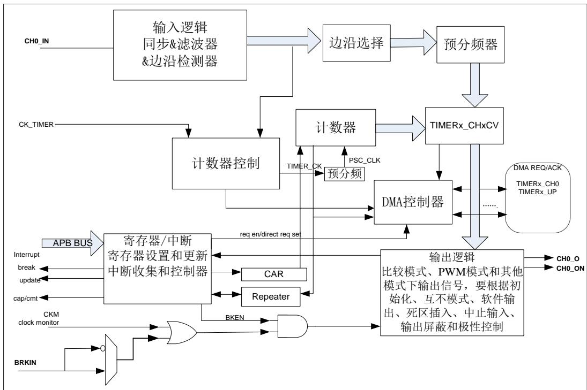
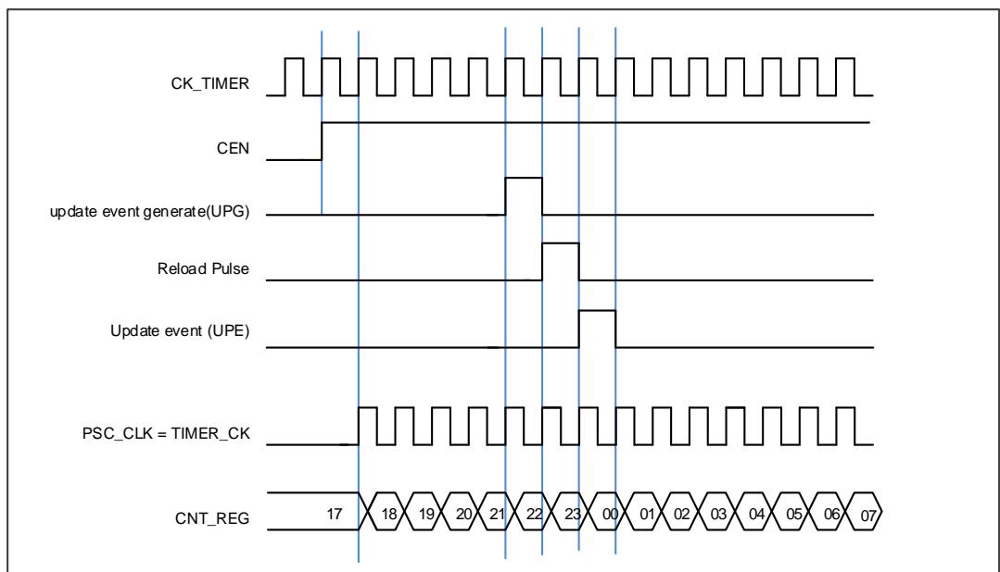
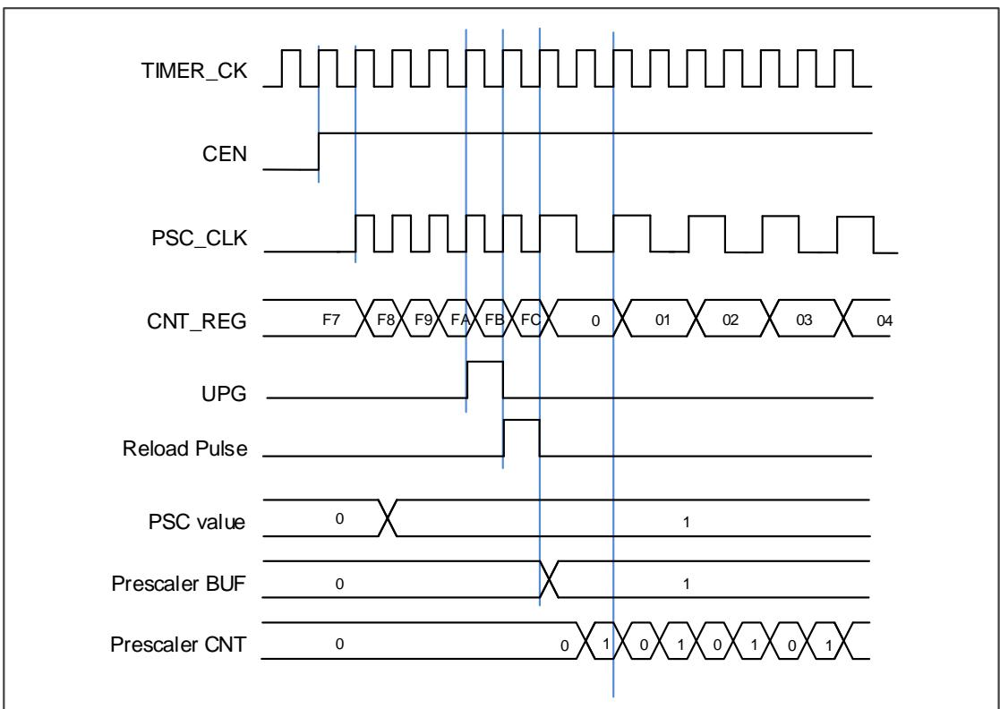
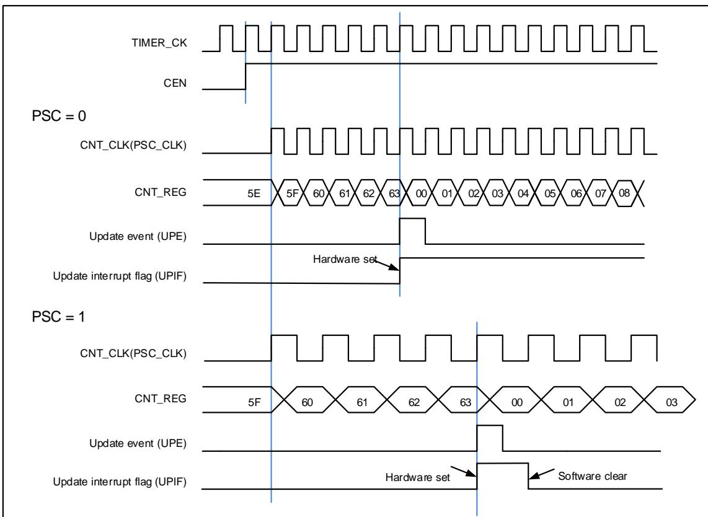
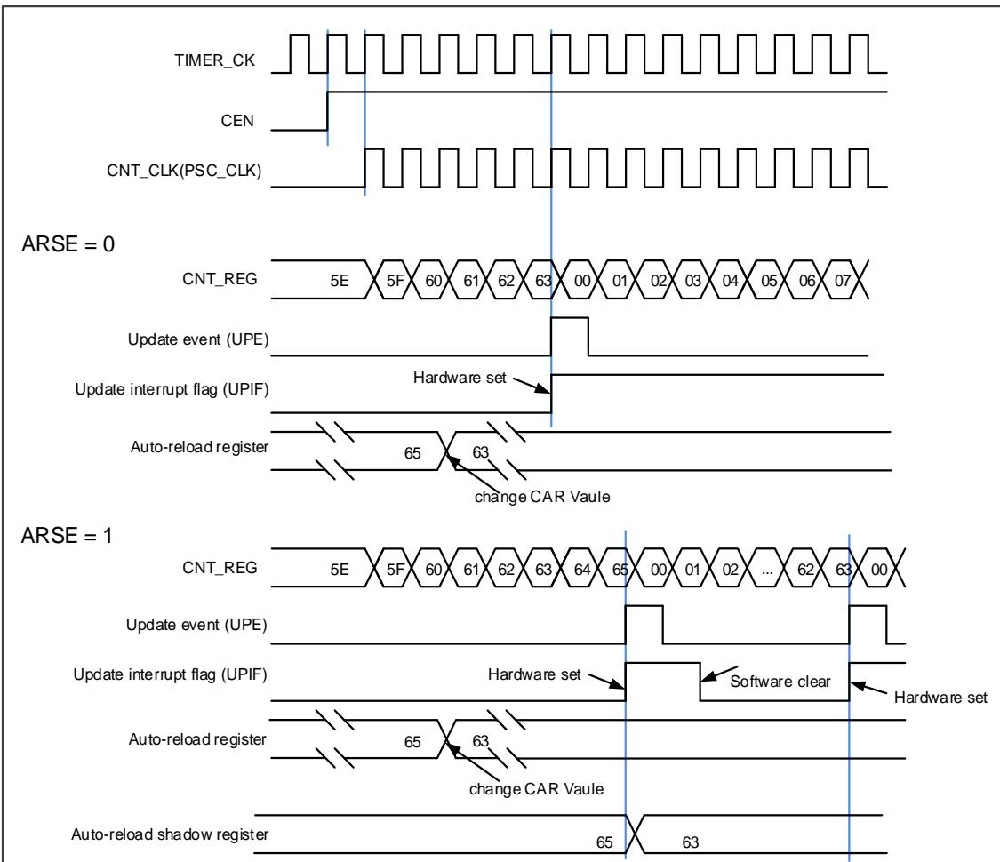
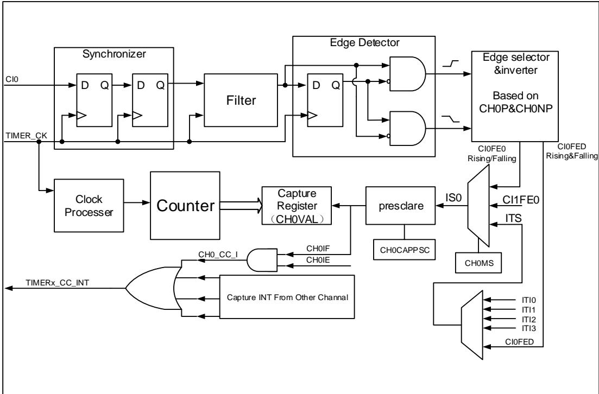
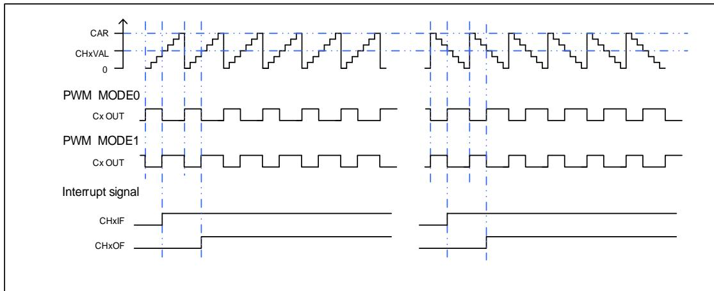
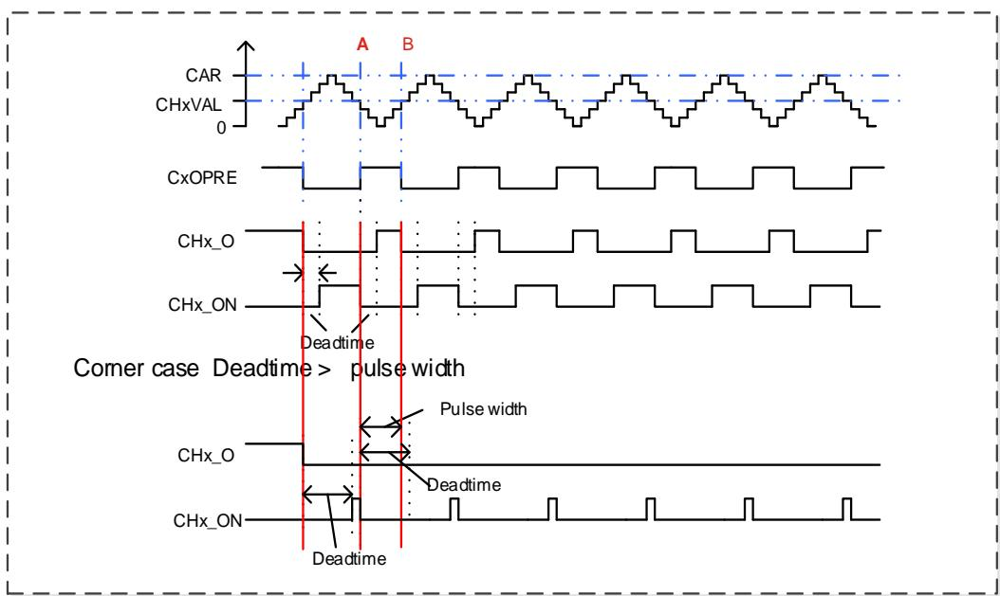
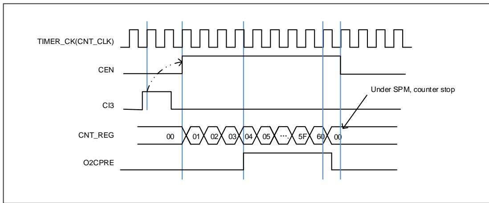

## 14.4. 通用定时器 L4（TIMERx,x=15,16）

## 14.4.1. 简介

通用定时器 L4（TIMER15/16）是单通道定时器，支持输入捕获和输出比较。可以产生 PWM信号控制电机和电源管理。通用定时器 L4 含有一个 16 位无符号计数器。

通用定时器 L4 是可编程的，可以被用来计数，其外部事件可以驱动其他定时器

通用定时器 L4 包含了一个死区时间插入模块，非常适合电机控制。

## 14.4.2. 主要特性

◼ 总通道数：1；

◼ 计数器宽度：16位；

◼ 时钟源可选：内部时钟；

◼ 计数模式：向上计数；

◼ 可编程的预分频器：16位，运行时可以被改变；

◼ 每个通道可配置：输入捕获模式，输出比较模式，可编程的PWM模式，单脉冲模式；

◼ 可编程的死区时间；

◼ 自动重装载功能；

◼ 可编程的计数器重复功能；

◼ 中止输入功能；

◼ 中断输出和DMA请求：更新事件，比较/捕获事件和中止事件；

## 14.4.3. 结构框图

14-69. L4 提供了通用定时器L4的内部配置细节

图 14-69. 通用定时器 L4结构框图

## 14.4.4. 功能描述

## 时钟源选择

通用定时器 L4 由内部时钟源 TIMER_CK.

◼ 定时器选择内部时钟源（连接到RCU模块的CK_TIMER）

通用定时器 L4 只有一个时钟源：内部时钟源。用来驱动计数器预分频器的是内部时钟源CK_TIMER。当 CEN 置位，CK_TIMER 经过预分频器（预分频值由 TIMERx_PSC 寄存器确定）产生 PSC_CLK。

驱动预分频器计数的 TIMER_CK 等于来自于 RCU 模块的 CK_TIMER

图 14-70. 内部时钟分频为 1 时正常模式下的控制电路

## 预分频器

预分频器可以将定时器的时钟（TIMER_CK)频率按 1 到 65536 之间的任意值分频，分频后的时钟 PSC_CLK 驱动计数器计数。分频系数受预分频寄存器 TIMERx_PSC 控制，这个控制寄存器带有缓冲器，它能够在运行时被改变。新的预分频器的参数在下一次更新事件到来时被采用。

图 14-71. 当预分频器的参数从 1 变到 2 时，计数器的时序图

## 向上计数模式

在这种模式，计数器的计数方向是向上计数。计数器从 0 开始向上连续计数到自动加载值（定义在 TIMERx_CAR 寄存器中），一旦计数器计数到自动加载值，会重新从 0 开始向上计数。如果设置了重复计数器，在(TIMERx_CREP+1)次上溢后产生更新事件，否则在每次上溢时都会产生更新事件。在向上计数模式中，TIMERx_CTL0 寄存器中的计数方向控制位 DIR 应该被设置成 0。

当通过 TIMERx_SWEVG 寄存器的 UPG 位置 1 来设置更新事件时，计数值会被清 0，并产生更新事件。

如果 TIMERx_CTL0 寄存器的 UPDIS 置 1，则禁止更新事件。

当发生更新事件时，所有的寄存器(重复计数器，自动重载寄存器，预分频寄存器)都将被更新。

14-72. PSC=0/1 给出了一些例子，当 TIMERx_CAR=0x63 时，计数器在不同预分频因子下的行为。

图 14-72. 向上计数时序图，PSC=0/1

图 14-73. 向上计数时序图，在运行时改变 TIMERx_CAR 寄存器的值

## 重复计数器

重复计数器是用来在 N+1 个计数周期之后产生更新事件，更新定时器的寄存器，N 为TIMERx_CREP 寄存器的 CREP。向上计数模式下，重复计数器在每次计数器上溢时递减。将 TIMERx_SWEVG 寄存器的 UPG 位置 1 可以重载 TIMERx_CREP 寄存器中 CREP 的值并产生一个更新事件。

图 14-74. 在向上计数模式下计数器重复时序图

<table><tr><td>TIMER_CK</td><td></td></tr><tr><td>CEN</td><td></td></tr><tr><td>CNT_CLK</td><td></td></tr><tr><td>CNT_REG</td><td>60 61 62 63 00 01 ... 62 63 00 01 ... 62 63 00 01 ... 62 63 00 01 ... 62 63 00 01</td></tr><tr><td>Underflow</td><td></td></tr><tr><td>Overflow</td><td></td></tr><tr><td>TIMERx_CREP = 0x0</td><td></td></tr><tr><td>UPIF</td><td></td></tr><tr><td>TIMERx_CREP = 0x1</td><td></td></tr><tr><td>UPIF</td><td></td></tr><tr><td>TIMERx_CREP = 0x2</td><td></td></tr><tr><td>UPIF</td><td></td></tr></table>

## 捕获/比较通道

通用定时器 L4 拥有一个独立的通道用于捕获输入或比较输出是否匹配。每个通道都围绕一个通道捕获比较寄存器建立，包括一个输入级，通道控制器和输出级。

## ◼ 输入捕获模式

捕获模式允许通道测量一个波形时序，频率，周期，占空比等。输入级包括一个数字滤波器，一个通道极性选择，边沿检测和一个通道预分频器。如果在输入引脚上出现被选择的边沿，TIMERx_CHxCV 寄存器会捕获计数器当前的值，同时 CHxIF 位被置 1，如果 CHxIE = 1 则产生通道中断。

图 14-75. 输入捕获逻辑

通 道 输 入 信 号 CIx 有 两 种 选 择 ， 一 种 是 TIMERx_CHx 信 号 ， 另 一 种 是TIMERx_CH0,TIMERx_CH1 和 TIMERx_CH2 异或之后的信号。通道输入信号 CIx 先被TIMER_CK 信号同步，然后经过数字滤波器采样，产生一个被滤波后的信号。通过边沿检测器，可以选择检测上升沿或者下降沿。通过配置 CHxP 选择使用上升沿或者下降沿。配置CHxMS.，可以选择其他通道的输入信号，内部触发信号。配置 IC 预分频器，使得若干个输入事件后才产生一个有效的捕获事件。捕获事件发生，CHxVAL 存储计数器的值。

配置步骤如下：

第一步：滤波器配置（TIMERx_CHCTL0寄存器中CHxCAPFLT）：

根据输入信号和请求信号的质量，配置相应的CHxCAPFLT。

第二步：边沿选择（TIMERx_CHCTL2寄存器中CHxP/CHxNP）：配置CHxP/CHxNP选择上升沿或者下降沿。

第三步：捕获源选择（TIMERx_CHCTL0寄存器中CHxMS）：一旦通过配置CHxMS选 择 输 入 捕 获 源 ， 必 须 确 保 通 道 配 置 在 输 入 模 式（CHxMS!=0x0），而且TIMERx_CHxCV寄存器不能再被写。

第四步：中断使能（TIMERx_DMAINTEN寄存器中CHxIE和CHxDEN）：使能相应中断，可以获得中断和DMA请求。

第五步：捕获使能（TIMERx_CHCTL2寄存器中CHxEN）。

结果：当期望的输入信号发生时，TIMERx_CHxCV被设置成当前计数器的值，CHxIF为置1。如果CHxIF位已经为1，则CHxOF位置1。根据TIMERx_DMAINTEN寄存器中CHxIE和CHxDEN的配置，相应的中断和DMA请求会被提出。

直接产生：软件设置CHxG位，会直接产生中断和DMA请求。

◼ 输出比较模式

在输出比较模式，TIMERx 可以产生时控脉冲，其位置，极性，持续时间和频率都是可编程的。

当一个输出通道的 CHxVAL 寄存器与计数器的值匹配时，根据 CHxCOMCTL 的配置，这个通道的输出可以被置高电平，被置低电平或者反转。当计数器的值与 CHxVAL 寄存器的值匹配时，CHxIF 位被置 1，如果 CHxIE = 1 则会产生中断，如果 CHxDEN=1 则会产生 DMA 请求。配置步骤如下：

第一步：时钟配置：

配置定时器时钟源，预分频器等。

第二步：比较模式配置：

设置CHxCOMSEN位来配置输出比较影子寄存器；

设置CHxCOMCTL位来配置输出模式（置高电平/置低电平/反转）；

设置CHxP/CHxNP位来选择有效电平的极性；

设置CHxEN使能输出。

第三步：通过CHxIE/CHxDEN位配置中断/DMA请求使能。

第四步：通过TIMERx_CAR寄存器和TIMERx_CHxCV寄存器配置输出比较时基：

CHxVAL可以在运行时根据你所期望的波形而改变。

第五步：设置CEN位使能定时器。

14-76. 显示了三种比较输出模式：反转/置高电平/置低电平，CAR=0x63, CHxVAL=0x3。

图 14-76. 三种输出比较模式

<table><tr><td colspan="101">CNT_CLK</td></tr><tr><td colspan="100">CEN</td><td></td></tr><tr><td colspan="96">CNT_REG</td><td></td><td></td><td></td><td></td><td></td></tr><tr><td colspan="95">Overflow</td><td></td><td></td><td></td><td></td><td></td><td></td></tr><tr><td colspan="90">match toggle</td><td></td><td></td><td></td><td></td><td></td><td></td><td></td><td></td><td></td><td></td><td></td></tr><tr><td colspan="85">OxCPRE</td><td></td><td></td><td></td><td></td><td></td><td></td><td></td><td></td><td></td><td></td><td></td><td></td><td></td><td></td><td></td><td></td></tr><tr><td colspan="81">match set</td><td></td><td></td><td></td><td></td><td></td><td></td><td></td><td></td><td></td><td></td><td></td><td></td><td></td><td></td><td></td><td></td><td></td><td></td><td></td><td></td></tr><tr><td colspan="13">OxCPRE</td><td></td><td></td><td></td><td></td><td></td><td></td><td></td><td></td><td></td><td></td><td></td><td></td><td></td><td></td><td></td><td></td><td></td><td></td><td></td><td></td><td></td><td></td><td></td><td></td><td></td><td></td><td></td><td></td><td></td><td></td><td></td><td></td><td></td><td></td><td></td><td></td><td></td><td></td><td></td><td></td><td></td><td></td><td></td><td></td><td></td><td></td><td></td><td></td><td></td><td></td><td></td><td></td><td></td><td></td><td></td><td></td><td></td><td></td><td></td><td></td><td></td><td></td><td></td><td></td><td></td><td></td><td></td><td></td><td></td><td></td><td></td><td></td><td></td><td></td><td></td><td></td><td></td><td></td><td></td><td></td><td></td><td></td><td></td><td></td><td></td><td></td><td></td><td></td></tr><tr><td colspan="13">match clear</td><td></td><td></td><td></td><td></td><td></td><td></td><td></td><td></td><td></td><td></td><td></td><td></td><td></td><td></td><td></td><td></td><td></td><td></td><td></td><td></td><td></td><td></td><td></td><td></td><td></td><td></td><td></td><td></td><td></td><td></td><td></td><td></td><td></td><td></td><td></td><td></td><td></td><td></td><td></td><td></td><td></td><td></td><td></td><td></td><td></td><td></td><td></td><td></td><td></td><td></td><td></td><td></td><td></td><td></td><td></td><td></td><td></td><td></td><td></td><td></td><td></td><td></td><td></td><td></td><td></td><td></td><td></td><td></td><td></td><td></td><td></td><td></td><td></td><td></td><td></td><td></td><td></td><td></td><td></td><td></td><td></td><td></td><td></td><td></td><td></td><td></td><td></td><td></td></tr><tr><td colspan="13">OxCPRE</td><td></td><td></td><td></td><td></td><td></td><td></td><td></td><td></td><td></td><td></td><td></td><td></td><td></td><td></td><td></td><td></td><td></td><td></td><td></td><td></td><td></td><td></td><td></td><td></td><td></td><td></td><td></td><td></td><td></td><td></td><td></td><td></td><td></td><td></td><td></td><td></td><td></td><td></td><td></td><td></td><td></td><td></td><td></td><td></td><td></td><td></td><td></td><td></td><td></td><td></td><td></td><td></td><td></td><td></td><td></td><td></td><td></td><td></td><td></td><td></td><td></td><td></td><td></td><td></td><td></td><td></td><td></td><td></td><td></td><td></td><td></td><td></td><td></td><td></td><td></td><td></td><td></td><td></td><td></td><td></td><td></td><td></td><td></td><td></td><td></td><td></td><td></td><td></td></tr></table>

## PWM 模式

在 PWM 输出模式下（PWM 模式 0 是配置 CHxCOMCTL 为 3’b110，PWM 模式 1 是配置CHxCOMCTL 为 3’b111），通道根据 TIMERx_CAR 寄存器和 TIMERx_CHxCV 寄存器的值，输出 PWM 波形。

根据计数模式，我们可以分为两种 PWM 波：EAPWM(边沿对齐 PWM)和 CAPWM(中央对齐PWM)。

EAPWM 的周期由 TIMERx_CAR 寄存器值决定，占空比由 TIMERx_CHxCV 寄存器值决定。14-77. PWM 显示了 PWM 的输出波形和中断。

在 PWM0 模式下 $( \mathsf { C H x C O M C T L } = = 3 ^ { \prime } \mathsf { b } 1 1 0 )$ ，如果 TIMERx_CHxCV 寄 存 器 的 值 大 于TIMERx_CAR 寄存器的值，通道输出一直为有效电平。

在 PWM0 模式下(CHxCOMCTL==3’b110)，如果 TIMERx_CHxCV 寄存器的值等于 0，通道输出一直为无效电平。

图 14-77. PWM 时序图

## 通道输出参考信号

当 TIMERx 用于输出匹配比较模式下，设置 CHxCOMCTL 位可以定义 OxCPRE 信号(通道 x准备信号)类型。OxCPRE 信号有若干类型的输出功能，包括，设置 CHxCOMCTL=0x00 可以保持原始电平；设置 CHxCOMCTL=0x01 可以将 OxCPRE 信号设置为高电平；设置CHxCOMCTL=0x02 可以将 OxCPRE 信号设置为低电平；设置 CHxCOMCTL=0x03，在计数器值和 TIMERx_CHxCV 寄存器的值匹配时，可以翻转输出信号。

PWM 模式 0 和 PWM 模式 1 是 OxCPRE 的另一种输出类型，设置 CHxCOMCTL 位域位 0x06或0x07可以配置 PWM模式0/PWM 模式1。在这些模式中，根据计数器值和 TIMERx_CHxCV寄存器值的关系以及计数方向，OxCPRE 信号改变其电平。具体细节描述，请参考相应的位。

设置 CHxCOMCTL =0x04 或 0x05 可以实现 OxCPRE 信号的强制输出功能。输出比较信号能够直接由软件强置为有效或无效状态，而不依赖于 TIMERx_CHxCV 的值和计数器值之间间的比较结果。

## 互补输出

CHx_O 和 CHx_ON 是一对互补输出通道，这两个信号不能同时有效。TIMERx 有两路通道，只有一路有互补输出通道。互补信号 CHx_O 和 CHx_ON 是由一组参数来决定：TIMERx_CHCTL2 寄存器 中的 CHxEN 和 CHxNEN 位，TIMERx_CCHP 寄存器中和TIMERx_CTL1 寄 存 器 中 的 POEN, ROS, IOS, ISOx 和 ISOxN 位 。 输 出 极 性 由TIMERx_CHCTL2 寄存器中的 CHxP 和 CHxNP 位来决定。

表 14-7. 由参数控制的互补输出表

<table><tr><td colspan="5">互补参数</td><td colspan="2">输出状态</td></tr><tr><td>POEN</td><td>ROS</td><td>IOS</td><td>CHxEN</td><td>CHxNEN</td><td>CHx_O</td><td>CHx_ON</td></tr><tr><td rowspan="8">0</td><td rowspan="8">0/1</td><td rowspan="4">0</td><td rowspan="2">0</td><td>0</td><td colspan="2">CHx_O / CHx_ON = LOWCHx_O / CHx_ON 输出禁用.</td></tr><tr><td>1</td><td rowspan="3" colspan="2">CHx_O = CHxP CHx_ON = CHxNPCHx_O/CHx_ON 输出禁用.如果时钟使能:CHx_O = ISOx CHx_ON = ISOxN</td></tr><tr><td rowspan="2">1</td><td>0</td></tr><tr><td>1</td></tr><tr><td rowspan="4">1</td><td rowspan="2">0</td><td>0</td><td colspan="2">CHx_O = CHxP CHx_ON = CHxNPCHx_O/CHx_ON输出禁用.</td></tr><tr><td>1</td><td rowspan="3" colspan="2">CHx_O = CHxP CHx_ON = CHxNPCHx_O/CHx_ON 输出使能.如果时钟使能:CHx_O = ISOx CHx_ON = ISOxN</td></tr><tr><td rowspan="2">1</td><td>0</td></tr><tr><td>1</td></tr><tr><td rowspan="8">1</td><td rowspan="4">0</td><td rowspan="8">0/1</td><td rowspan="2">0</td><td>0</td><td colspan="2">CHx_O/CHx_ON = LOWCHx_O/CHx_ON 输出禁用.</td></tr><tr><td>1</td><td>CHx_O = LOWCHx_O 输出禁用.</td><td>CHx_ON=OxCPRE ⊕ CHxNPCHx_ON 输出使能</td></tr><tr><td rowspan="2">1</td><td>0</td><td>CHx_O=OxCPRE ⊕CHxPCHx_O输出使能</td><td>CHx_ON = LOWCHx_ON输出禁用.</td></tr><tr><td>1</td><td>CHx_O=OxCPRE ⊕CHxPCHx_O输出使能</td><td>CHx_ON=(!OxCPRE) ⊕CHxNPCHx_ON输出使能</td></tr><tr><td rowspan="4">1</td><td rowspan="2">0</td><td>0</td><td>CHx_O = CHxPCHx_O输出禁用.</td><td>CHx_ON = CHxNPCHx_ON输出禁用.</td></tr><tr><td>1</td><td>CHx_O = CHxPCHx_O输出使能</td><td>CHx_ON=OxCPRE ⊕ CHxNPCHx_ON输出使能</td></tr><tr><td rowspan="2">1</td><td>0</td><td>CHx_O=OxCPRE ⊕CHxPCHx_O输出使能</td><td>CHx_ON = CHxNPCHx_ON输出使能</td></tr><tr><td>1</td><td>CHx_O=OxCPRE ⊕CHxPCHx_O输出使能</td><td>CHx_ON=(!OxCPRE) ⊕CHxNPCHx_ON输出使能</td></tr></table>

注意：

(1) 输出禁能：CHx_O / CHx_ON 输出与对应引脚断开，对应引脚电平受 GPIO 上下拉配置控制，无上下拉时为悬空高阻态；

(2) 输出关闭状态：CHx_O / CHx_ON 输出无效电平（CHx_O = 0⊕CHxP = CHxP）；

(3) 详情见中止模式章节。

(4) ⊕：异或操作；

(5) (!OxCPRE)：OxCPRE 信号的互补信号。

## 死区时间插入

设置 CHxEN 和 CHxNEN 为 1’b1 同时设置 POEN，死区插入就会被使能。DTCFG 位域定义了死区时间，死区时间对通道 0 有效。死区时间的细节，请参考 TIMERx_CCHP 寄存器。

死区时间的插入，确保了通道互补的两路信号不会同时有效。

在 PWM0 模式，当通道 x 匹配发生时（TIMERx 计数器= CHxVAL），OxCPRE 反转。在14-78. 中的 A点，CHx_O 信号在死区时间内为低电平，直到死区时间过后才变为高电平，而CHx_ON信号立刻变为低电平。同样，在 B点，计数器再次匹配（TIMERx计数器= CHxVAL），OxCPRE 信号被清 0，CHx_O 信号被立即清零，CHx_ON 信号在死区时间内仍然是低电平，在死区时间过后才变为高电平。

有时会有一些死角事件发生，例如：

◼ 如果死区延时大于或者等于CHx_O信号的占空比，CHx_O信号一直为无效值（如 14-78.带死区时间的互补输出)。

◼ 如果死区延时大于或者等于CHx_ON信号的占空比，CHx_ON信号一直为无效值。

图 14-78. 带死区时间的互补输出

## 中止功能

使用中止功能时，输出 CHx_O 和 CHx_ON 信号电平被以下位控制，TIMERx_CCHP 寄存器的 POEN, IOS 和 ROS 位，TIMERx_CTL1 寄存器的 ISOx 和 ISOxN 位。当中止事件发生时，CHx_O 和 CHx_ON 信号输出不能同时设置为有效电平。中止源可以选择中止输入引脚，也可以选择 HXTAL 时钟失效事件。时钟失败事件由 RCU 中的时钟监视器(CKM)产生。将TIMERx_CCHP 寄存器的 BRKEN 位置 1 可以使能中止功能。TIMERx_CCHP 寄存器的 BRKP位决定了中止输入极性。

发生中止时，POEN 位被异步清除，一旦 POEN 位为 0，CHx_O 和 CHx_ON 被 TIMERx_CTL1寄存器中的 ISOx 位和 ISOxN 驱动。如果 IOS=0，定时器释放输出使能，否则输出使能仍然为高。起初互补输出被置于复位状态，然后死区时间产生器重新被激活，以便在一个死区时间后驱动输出，输出电平由 ISOx 和 ISOxN 位配置。

发生中止时，TIMERx_INTF 寄存器的 BRKIF 位被置 1。如果 BRKIE=1，中断产生。

图 14-79. 通道响应中止输入（高电平有效）时，输出信号的行为

<table><tr><td rowspan="2"></td><td>BRKIN</td><td></td><td></td><td></td></tr><tr><td>OxCPRE</td><td></td><td></td><td></td></tr><tr><td rowspan="2">CHxEN: 1 CHxNEN: 1CHxP : 0 CHxNP : 0ISOx = ~ISOxN</td><td>CHx_O</td><td></td><td colspan="2">= ISOx</td></tr><tr><td>CHx_ON</td><td></td><td colspan="2">= ISOxN</td></tr><tr><td rowspan="2">CHxEN: 1 CHxNEN: 0CHxP: 0 CHxNP : 0ISOx = ~ISOxN</td><td>CHx_O</td><td></td><td colspan="2">= ISOx</td></tr><tr><td>CHx_ON</td><td></td><td colspan="2">= ISOxN</td></tr><tr><td rowspan="2">CHxEN: 1 CHxNEN: 0CHxP : 0 CHxNP : 0ISOx = ISOxN</td><td>CHx_O</td><td></td><td></td><td></td></tr><tr><td>CHx_ON</td><td></td><td></td><td></td></tr></table>

## 单脉冲模式

单脉冲模式与重复模式是相反的，设置 TIMERx_CTL0 寄存器的 SPM 位置 1，则使能单脉冲模式。当 SPM 置 1，计数器在下次更新事件到来后清零并停止计数。为了得到脉冲波，可以通过设置 CHxCOMCTL 配置 TIMERx 为 PWM 模式或者比较模式。

一旦设置定时器运行在单脉冲模式下，没有必要设置 TIMERx_CTL0 寄存器的定时器使能位CEN=1 来使能计数器。触发信号沿或者软件写 CEN=1 都可以产生一个脉冲，此后 CEN 位一直保持为 1 直到更新事件发生或者 CEN 位被软件写 0。如果 CEN 位被软件清 0，计数器停止工作，计数值被保持。如果 CEN 值被硬件更新事件自动清 0，计数器将被再次初始化。

在单脉冲模式下，有效的外部触发边沿会将 CEN 位置 1，使能计数器。然而，执行计数值和TIMERx_CHxCV 寄存器值的比较结果依然存在一些时钟延迟。为了最大限度减少延迟，用户可以将 TIMERx_CHCTL0/1 寄存器的 CHxCOMFEN 位置 1。单脉冲模式下，触发上升沿产生之后， OxCPRE 信号将被立即强制转换为与发生比较匹配时相同的电平，但是不用考虑比较结果。只有输出通道配置为 PWM0 或 PWM1 输出运行模式下时 CHxCOMFEN 位才可用，触发源来源于触发信号

图 14-80. 单脉冲模式，TIMERx_CHxCV = 0x04 TIMERx_CAR=0x60

## 定时器 DMA模式

定时器 DMA 模式是指通过 DMA 模块配置定时器的寄存器。有两个跟定时器 DMA 模式相关的寄存器：TIMERx_DMACFG 和 TIMERx_DMATB。当然，必须要使能 DMA 请求，一些内部中断事件可以产生 DMA请求。当中断事件发生，TIMERx 会给 DMA发送请求。DMA配置成M2P 模式，PADDR 是 TIMERx_DMATB 寄存器地址，DMA 就会访问 TIMERx_DMATB 寄存器。实际上，TIMERx_DMATB 寄存器只是一个缓冲，定时器会将 TIMERx_DMATB 映射到一个内部寄存器，这个内部寄存器由 TIMERx_DMACFG 寄存器中的 DMATA 来指定。如果TIMERx_DMACFG 寄存器的 DMATC 位域值为 0，表示 1 次传输，定时器的发送 1 个 DMA请求就可以完成。如果 TIMERx_DMACFG 寄存器的 DMATC 位域值不为 1，例如其值为 3，表示4次传输，定时器就需要再多发3次DMA请求。在这3次请求下，DMA对TIMERx_DMATB寄存器的访问会映射到访问定时器的DMATA+0x4, DMATA+0x8, DMATA+0xc寄存器。总之，发生一次 DMA 内部中断请求，定时器会连续发送（DMATC+1）次请求。

如果再来 1 次 DMA请求事件，TIMERx 将会重复上面的过程。

## 定时器调试模式

当 Cortex®-M23 内核停止，DBG_CTL1 寄存器中的 TIMERx_HOLD 配置位被置 1，定时器计数器停止。

