## 15. 通用同步异步收发器（USART）

## 15.1. 简介

通用同步 / 异步收发器（USART）提供了一个灵活方便的串行数据交换接口。数据帧可以通过全双工或半双工，同步或异步的方式进行传输。USART提供了可编程的波特率发生器，能对UCLK（PCLK，CK_SYS，LXTAL或HIRCDIV_PER）时钟进行分频产生USART发送和接收所需的特定频率。

USART不仅支持标准的异步收发模式，还实现了一些其他类型的串行数据交换模式，如红外编码规范，SIR，智能卡协议，LIN，半双工以及同步模式。它还支持多处理器通信和硬件流控操作（CTS / RTS）。数据帧支持从LSB或者MSB开始传输。数据位的极性和TX/ RX引脚都可以灵活配置。

所有USART都支持DMA功能，以实现高速率的数据通信。

## 15.2. 主要特征

◼ NRZ标准格式。

◼ 全双工异步通信。

◼ 半双工单线通信。

◼ 接收FIFO功能。

◼ 双时钟域：

互为异步关系的PCLK和独立于PCLK时钟的USART时钟。

不依赖UCLK设置的波特率设置。

可编程的波特率产生器，当时钟频率为48MHz，过采样为8，最高速度可达6Mbits/s。

◼ 完全可编程的串口特性：

数据位（8或9位）低位或高位在前。

偶校验位，奇校验位，无校验位的生成或检测。

– 产生0.5，1，1.5或者2个停止位。

◼ 可互换的Tx / Rx引脚。

◼ 可配置的数据极性。

◼ 支持硬件Modem流控操作（CTS / RTS）和RS485驱动使能。

◼ 可配置的多级缓存通信DMA访问数据缓冲区。

◼ 发送器和接收器可分别使能。

◼ 奇偶校验位控制：

发送奇偶校验位。

检测接收的数据字节的奇偶校验位。

◼ LIN断开帧的产生和检测。

◼ 支持红外数据协议（IrDA）。

◼ 同步传输模式以及为同步传输输出发送时钟。

◼ 支持兼容ISO7816-3的智能卡接口：

字节模式（T=0）。

– 块模式（T=1）。

– 直接和反向转换。

◼ 多处理器通信：

如果地址不匹配，则进入静默模式。

通过线路空闲检测或者地址标记检测从静默模式唤醒。

◼ 支持ModBus通信：

– 超时功能。

– CR/LF字符识别。

◼ 从深度睡眠模式唤醒：

通过标准的RBNE中断。

通过WUF中断。

◼ 多种状态标志：

– 传输检测标志：接收缓冲区不为空（RBNE），接收FIFO满（RFF），发送缓冲区为空（TBE），传输完成（TC）。

– 错误检测标志：过载错误（ORERR），噪声错误（NERR），帧格式错误

（FERR），奇偶校验错误（PERR）。

硬件流控操作标志：CTS变化（CTSF）。

LIN模式标志：LIN断开检测（LBDF）。

多处理器通信模式标志：IDLE帧检测（IDLEF）。

ModBus通信标志：地址 / 字符匹配（AMF），接收超时（RTF）。

– 智能卡模式标志：块结束（EBF）和接收超时（RTF）。

从深度睡眠模式唤醒标志。

– 若相应的中断使能，这些事件发生将会触发中断。

USART0完全实现上述功能，但是USART1/USART2只实现了上面所介绍的部分功能，下面这些功能在USART1/USART2中没有实现：

◼ 自动波特率检测；

◼ 接收FIFO功能；

◼ 智能卡模式；

◼ IrDA SIR ENDEC模块；

◼ LIN模式；

◼ 双时钟域和从深度睡眠模式唤醒；

◼ 接收超时中断；

◼ ModBus通信；

## 15.3. 功能描述

USART 接口通过 15-1. USART 中主要引脚从外部连接到其他设备。

表 15-1. USART 重要引脚描述

<table><tr><td>引脚</td><td>类型</td><td>描述</td></tr><tr><td>RX</td><td>输入</td><td>接收数据</td></tr><tr><td>TX</td><td>输出I/O(单线模式/智能卡模式)</td><td>发送数据。当USART使能后,若无数据发送,默认为高电平</td></tr><tr><td>nCTS</td><td>输入</td><td>硬件流控模式发送使能信号</td></tr><tr><td>nRTS / CK</td><td>输出</td><td>硬件流控模式发送请求信号 /用于同步通信的串行时钟信号</td></tr></table>

图 15-1. USART 模块内部框图

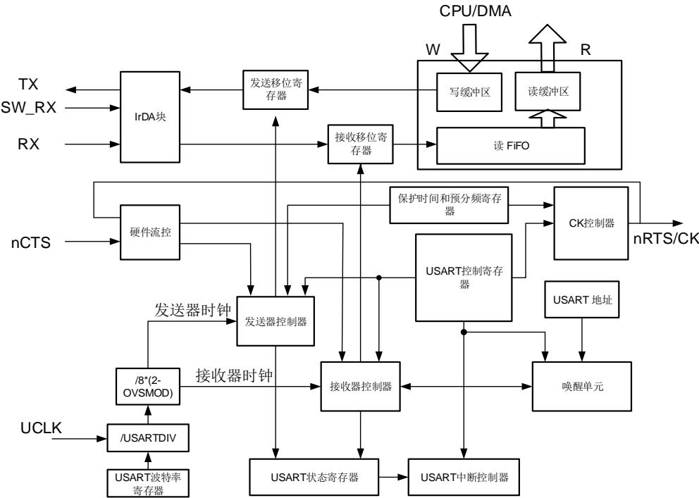

## 15.3.1. USART 帧格式

USART数据帧开始于起始位，结束于停止位。USART_CTL0寄存器中WL位可以设置数据长度。将USART_CTL0寄存器中PCEN置位，最后一个数据位可以用作校验位。若WL位为0，第七位为校验位。若WL位置1，第八位为校验位。USART_CTL0寄存器中PM位用于选择校验位的计算方法。

图15-2. USART字符帧（8数据位和1停止位）

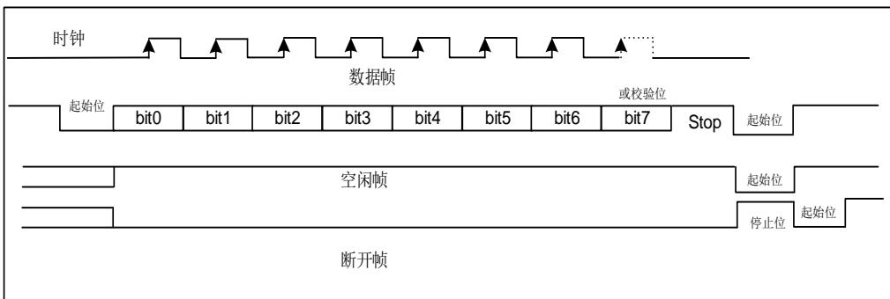

在发送和接收中，停止位可以在USART_CTL1寄存器中STB[1:0]位域中配置。

表 15-2. 停止位配置

<table><tr><td>STB[1:0]</td><td>停止位长度(位)</td><td>功能描述</td></tr><tr><td>00</td><td>1</td><td>默认值</td></tr><tr><td>01</td><td>0.5</td><td>智能卡模式接收</td></tr><tr><td>10</td><td>2</td><td>标准 USART 和单线模式</td></tr><tr><td>11</td><td>1.5</td><td>智能卡模式发送和接收</td></tr></table>

在一个空闲帧中，所有位都为1。数据帧长度与正常USART数据帧长度相同。

紧随停止位后多个低电平为中断帧。USART数据帧的传输速度由UCLK时钟频率，波特率发生器的配置，以及过采样模式共同决定。

## 15.3.2. 波特率发生

波特率分频系数是一个 位的数字，包含 位整数部分和 位小数部分。波特率发生器使用这两部分组合所得的数值来确定波特率。由于具有小数部分的波特率分频系数，将使USART能够产生所有标准波特率。

波特率分频系数（USARTDIV）与系统时钟具有如下关系：

如果过采样率是16，公式为：

$$
\text { USARTDIV } = \frac {\text { UCLK }}{1 6 \times \text { Baud   Rate }}\tag{15-1}
$$

如果过采样是8，公式为：

$$
\text { USARTDIV } = \frac {\text { UCLK }}{8 \times \text { Baud   Rate }}\tag{15-2}
$$

注意：只有USART0支持双时钟域。对于USART1和 USART2，UCLK仅为PCLK。

例如，当过采样是16：

1. 由USART_BAUD寄存器的值得到USARTDIV：假设USART_BAUD=0x21D，则INTDIV=33（0x21），FRADIV=13（0xD）。UASRTDIV=33+13/16=33.81。

2. 由USARTDIV得到USART_BAUD寄存器的值：假设要求UASRTDIV=30.37，INTDIV=30（0x1E）。16*0.37=5.92，接近整数6，所以FRADIV=6（0x6）。USART_BAUD=0x1E6。

注意：若取整后FRADIV=16（溢出），则进位必须加到整数部分。

## 15.3.3. USART 发送器

如果USART_CTL0寄存器的发送使能位（TEN）被置位，当发送数据缓冲区不为空时，发送器将会通过TX引脚发送数据帧。TX引脚的极性可以通过USART_CTL1寄存器中TINV位来配置。时钟脉冲通过CK引脚输出。

TEN置位后发送器会发出一个空闲帧。TEN位在数据发送过程中是不可以被复位的。

系统上电后，TBE默认为高电平。在USART_STAT寄存器中TBE置位时，数据可以在不覆盖前一个数据的情况下写入USART_TDATA寄存器。当数据写入USART_TDATA寄存器，TBE位将被清0。在数据由USART_TDATA移入移位寄存器后，该位由硬件置1。如果数据在一个发送过程正在进行时被写入USART_TDATA寄存器，它将首先被存入发送缓冲区，在当前发送过程完成时传输到发送移位寄存器中。如果数据在写入USART_TDATA寄存器时，没有发送过程正在进行，TBE位将被清零然后迅速置位，原因是数据被立刻传输到发送移位寄存器。

假如一帧数据已经被发送出去，并且TBE位已被置位，那么USART_STAT寄存器中TC位将被置1。如果USART_CTL0寄存器中的中断使能位（TCIE）为1，将会产生中断。

15-3. USART 给出了 USART 发送步骤。软件操作按以下流程进行：

1. 通过USART_CTL0寄存器的WL设置字长；

2. 在USART_CTL1寄存器中写STB[1:0]位来设置停止位的长度；

3. 如果选择了多级缓存通信方式，应该在USART_CTL2寄存器中使能DMA（DENT位）；

4. 在USART_BAUD寄存器中设置波特率；

5. 在USART_CTL0寄存器中置位UEN位，使能USART；

6. 在USART_CTL0寄存器中设置TEN位；

7. 等待TBE置位；

8. 向USART_TDATA寄存器写数据；

9. 若DMA未使能，每发送一个字节都需重复步骤7-8；

10. 等待TC=1，发送完成。

图 15-3. USART 发送步骤

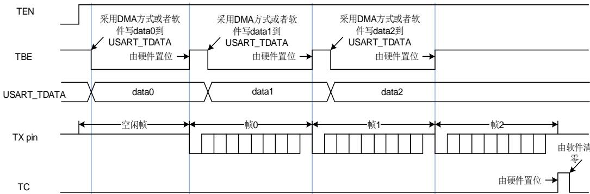

在禁用USART或进入低功耗状态之前，必须等待TC置位。通过将USART_INTC寄存器的TCC位置1可以将TC位清零。

当SBKCMD置位时，会发送一个断开帧，发送完成后，SBKCMD将被清0。

## 15.3.4. USART 接收器

上电后，按以下步骤使能USART接收器：

1. 写USART_CTL0寄存器的WL位去设置字长；

2. 在USART_CTL1寄存器中写STB[1:0]位来设置停止位的长度；

3. 如果选择了多级缓存通信方式，应该在USART_CTL2寄存器中使能DMA（DENR位）；

4. 在USART_BAUD寄存器中设置波特率；

5. 在USART_CTL0寄存器中置位UEN位，使能USART；

6. 在USART_CTL0中设置REN位。

接收器在使能后若检测到一个有效的起始脉冲便开始接收码流。在接收一个数据帧的过程中会检测噪声错误，奇偶校验错误，帧错误和过载错误。

当接收到一个数据帧，USART_STAT寄存器中的RBNE置位，如果设置了USART_CTL0寄存器中相应的中断使能位RBNEIE，将会产生中断。在USART_STAT寄存器中可以观察接收状态标志。

软件可以通过读USART_RDATA寄存器或者DMA方式获取接收到的数据。不管是直接读寄存器还是通过DMA，只要是对USART_RDATA寄存器的一个读操作都可以清除RBNE位。

在接收过程中，需使能REN位，不然当前的数据帧将会丢失。

在默认情况下，接收器通过获取三个采样点的值来估计该位的值。如果是8倍过采样模式，选择第3、4、5个采样点；如果是16倍过采样模式，选择第7、8、9个采样点。如果在3个采样点中有2个或3个为0，该数据位被视为0，否则为1。如果3个采样点中有一个采样点的值与其他两个不同，不管是起始位，数据位，奇偶校验位或者停止位，都将产生噪声错误（NERR）。如果使能DMA，并置位USART_CTL2寄存器中ERRIE，将会产生中断。如果在USART_CTL2中置位OSB，接收器将仅获取一个采样点来估计一个数据位的值。在这种情况下将不会检测到噪声错误。

图 15-4. 过采样方式接收一个数据位（OSB=0）

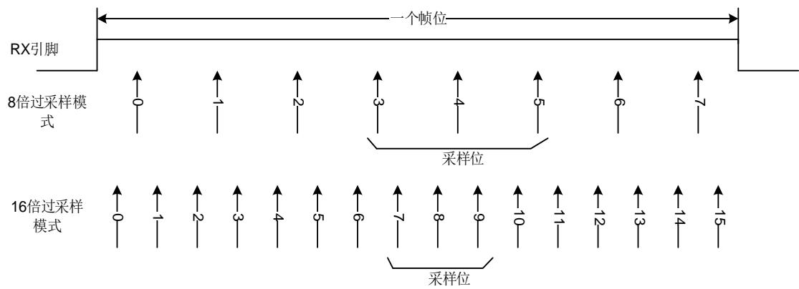

通过置位USART_CTL0寄存器中的PCEN位使能奇偶校验功能，接收器在接收一个数据帧时计算预期奇偶校验值，并将其与接收到的奇偶校验位进行比较。如果不相等，USART_STAT寄存器中PERR被置位。如果置位了USART_CTL0寄存器中的PERRIE位，将产生中断。

如果在停止位传输过程中RX引脚为0，将产生帧错误，USART_STAT寄存器中FERR置位。如果使能DMA并置位USART_CTL2寄存器中ERRIE位，将产生中断。根据停止位的配置，有以下几种情形：

0.5个停止位：0.5个停止位时，停止位不采样

1个停止位：1个停止位时，在停止位的中间进行采样

1.5个停止位：1.5个停止位时，1.5个停止位可以分为两个部分：0.5个停止位的部分不采样和1个停止位的中间进行采样

2个停止位：2个停止位时，如果在第一个停止位期间检测到帧错误，帧错误标志置位，则第二个停止位不检测帧错误。如果第一个停止位期间没有检测到帧错误，则在第二个停止位继续检测帧错误。

当接收到一帧数据，而RBNE位还没有被清零，随后的数据帧将不会存储在数据接收缓冲区中。USART_STAT寄存器中的溢出错误标志位ORERR将置位。如果使能DMA并置位USART_CTL2寄存器中ERRIE位或者置位RBNEIE，将产生中断。

在一个接收过程中，NERR、PERR、FERR、ORERR总是分别和RBNE同时置位。如果没有使能DMA，软件需检查RBNE中断是否由NERR、PERR、FERR或者ORERR置位产生。

## 15.3.5. DMA方式访问数据缓冲区

为减轻处理器的负担，可以采用DMA访问发送缓冲区或者接收缓冲区。置位USART_CTL2寄存器中DENT位可以使能DMA发送，置位USART_CTL2寄存器中DENR位可以使能DMA接收。

当 DMA 用于 USART 发送时，DMA 将数据从片内 SRAM 传送到 USART 的数据缓冲区。配置步骤如 15-5. DMA USART 所示。

图 15-5. 采用 DMA 方式实现 USART 数据发送配置步骤

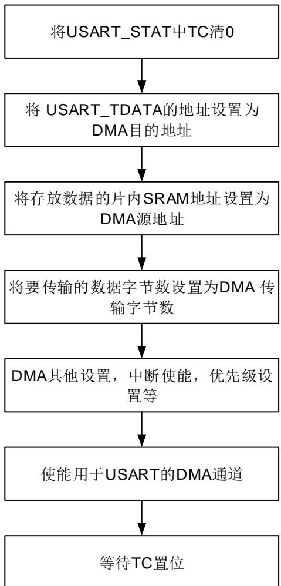

所有数据帧都传输完成后，USART_STAT寄存器中TC位置1。如果USART_CTL0寄存器中TCIE置位，将产生中断。

当 DMA用于USART 接收时，DMA 将数据从接收缓冲区传送到片内 SRAM。配置步骤如15-6. DMA USART 所示。如果将 USART_CTL2 寄存器中 ERRIE 位置 1，USART_STAT 寄存器中的错误标志位（FERR、ORERR 和 NERR）置位时将产生中断。

图 15-6. 采用 DMA 方式实现 USART 数据接收配置步骤

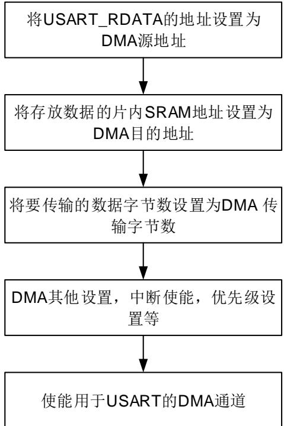

当USART接收到的数据数量达到了DMA传输数据数量，DMA模块将产生传输完成中断。

## 15.3.6. 硬件流控制

硬件流控制功能通过nCTS和nRTS引脚来实现。通过将USART_CTL2寄存器中RTSEN位置1来使能RTS流控，将USART_CTL2寄存器中CTSEN位置1来使能CTS流控。

图 15-7. 两个 USART 之间的硬件流控制

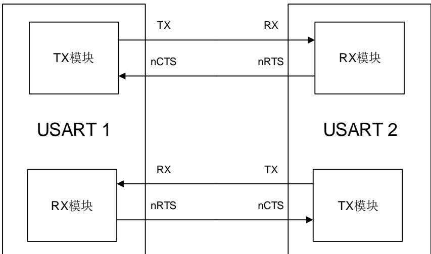

## RTS 流控

USART接收器输出nRTS，它用于反映接收缓冲区状态。当一帧数据接收完成，nRTS变成高电平，这样是为了阻止发送器继续发送下一帧数据。当接收缓冲区满时，nRTS保持高电平。

## CTS 流控

USART发送器监视nCTS输入引脚来决定数据帧是否可以发送。如果USART_STAT寄存器中TBE位是0且nCTS为低电平，发送器发送数据帧。在发送期间，若nCTS信号变为高电平，发送器将会在当前数据帧发送完成后停止发送。

图 15-8. 硬件流控制

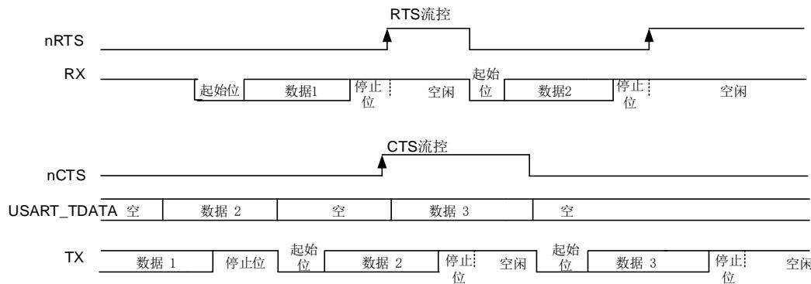

## RS485 驱动使能

驱动使能功能通过设置USART_CTL2控制寄存器的DEM位来打开。它允许用户通过DE（DriveEnable）信号激活外部收发器控制。提前时间是驱动使能信号和第一个字节的起始位之间的时间间隔。这个时间可以在USART_CTL0控制器的DEA[4:0]位域中进行设置。滞后时间是一个发送信息最后一个字节的停止位与释放DE信号之间的时间间隔。这个时间可以在USART_CTL0控制寄存器的DED[4:0]位域中进行设置。DE信号的极性可以通过USART_CTL2控制寄存器的DEP位进行设置。

## 15.3.7. 多处理器通信

在多处理器通信中，多个USART被连接成一个网络。对于一个设备来说，监视所有来自RX引脚的消息，是一种巨大的负担。为减轻设备负担，软件可以通过将USART_CMD寄存器中MMCMD位置1使USART进入静默模式。

如果USART处于静默模式，所有的接收状态标志位将不会被置位。此外，USART可以由硬件用以下两种方式中的一种来唤醒：空闲总线检测和地址匹配检测。

设备默认使用空闲总线检测方法唤醒USART。如果RWU位为0，RX引脚检测到空闲帧，USART_STAT寄存器中的IDLEF位会置位。如果RWU位置位，RX引脚检测到空闲帧时，硬件会将RWU清零，从而退出静默模式，当它是被空闲帧唤醒时，USART_STAT寄存器中IDLEF位不会被置1。

当USART_CTL0寄存器中WM被置位，数据最高位会被认为是地址标志位。如果地址标志位为1，该字节被认为是地址字节。如果地址标志位是0，该字节被认为是数据字节。如果地址字节的低4位或低7位与USART_CTL1寄存器中的ADDR位相同，硬件会将RWU清零，并退出静默模式。接收到将USART唤醒的数据帧，RBNE将置位。状态标志可以从USART_STAT寄存器中获取。如果地址字节的低4位或低7位与USART_CTL1寄存器中的ADDR位不相同，硬件会置位RWU并自动进入静默模式。在这种情况下，RBNE不会被置位。

如果USART_CTL0寄存器中PCEN位被置位，地址字节最高位被视为校验位，其余位被视为地址位。如果ADDM位被置位，且接收帧为7位的数据，其中最低的6位将与ADDR[5:0]比较。如果ADDM位被置位，且接收帧为9位的数据，其中低8位将与ADDR[7:0]进行比较。

## 15.3.8. LIN 模式

将USART_CTL1寄存器的LMEN置 位 即 可 使 能 本 地 互 联 网 络 模 式 。 在LIN模式下，USART_CTL1寄存器中CKEN，STB[1:0]和USART_CTL2的SCEN，HDEN，IREN位都应该被清0。

在发送一个普通数据帧时，LIN发送过程与普通发送过程相同。数据位的长度只能为8。一个停止位后连续13个0为断开帧。

断开检测功能完全独立于普通USART接收器。因此，断开检测可以是在空闲状态下，也可以在数据传输过程中。USART_CTL1寄存器中LBLEN位可以选择断开帧的长度。如果在RX引脚检测到大于或等于与预期的断开帧长度的0（LBLEN=0时，10个0；LBLEN=1时，11个0），USART_STAT寄存器中LBDF置位。如果USART_CTL1寄存器中LBDIE被置位，将产生中断。

如 15-9. 所示，如果断开帧发生在空闲状态下，USART 接收器会接收到一个全 0 数据帧，同时 FERR 置位。

图 15-9. 空闲状态下检测断开帧

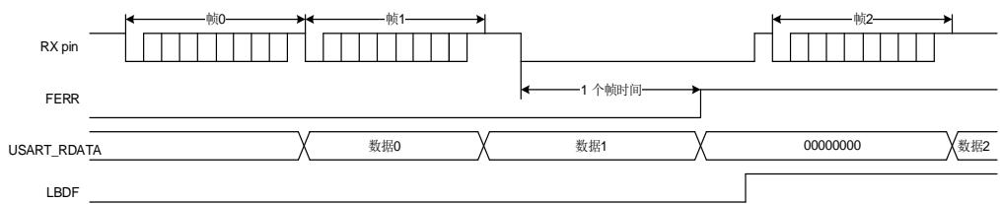

如 15-10. 所示，如果断开帧发生在数据传输过程中，当前传输帧发生错误， 置位。

图 15-10. 数据传输过程中检测断开帧

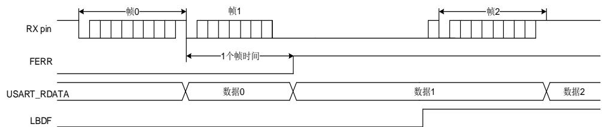

## 15.3.9. 同步通信模式

USART支持主机模式下的全双工同步串行通信，可以通过置位USART_CTL1的CKEN位来使能。在同步模式下，USART_CTL1的LMEN和USART_CTL2的SCEN，HDEN，IREN位应被清0。CK引脚作为USART同步发送器的时钟输出，仅当TEN位被使能时，它才被激活。在起始位和停止位传送期间，不会从CK引脚输出时钟脉冲。USART_CTL1的CLEN位用来决定在最低位（地址索引位）发送期间是否有时钟信号输出。在空闲状态和断开帧的发送过程中，也不会有时钟信号产生。USART_CTL1的CPH位用来决定数据在第一个时钟沿被采样还是在第二个时钟沿被采样。USART_CTL1的CPL位用来决定在USART同步模式空闲状态下，时钟引脚的电平。

CK引脚输出波形由USART_CTL1寄存器中CPL，CPH，CLEN位决定。软件仅在USART禁用（UEN=0）时才可以改变它们的值。

时钟与已发送的数据同步。同步模式下的接收器按照发送器的时钟进行采样，并无任何过采样。

图 15-11. 同步模式下的 USART 示例

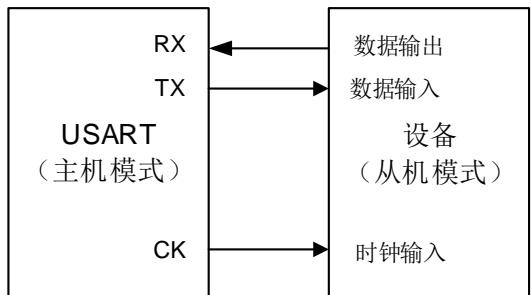

图 15-12. 8-bit 格式的 USART 同步通信波形（CLEN=1）

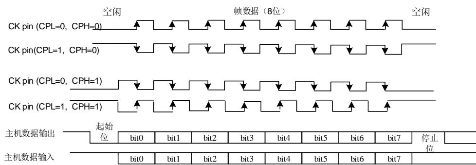

## 15.3.10. 串行红外（IrDA SIR）编解码功能模块

串 行 红 外 编 解 码 功 能 通 过 置 位USART_CTL2寄 存 器 中IREN使 能 。 在IrDA模 式 下，USART_CTL1寄存器的LMEN，STB[1:0]，CKEN位和USART_CTL2寄存器的HDEN，SCEN位应被清0。

在IrDA模式下，USART数据帧由SIR发送编码器进行调制，调制后的信号经由红外LED进行发送，经解调后将数据发送至USART接收器。对于编码器而言，波特率应小于115200。

图 15-13. IrDA SIR ENDEC 模块

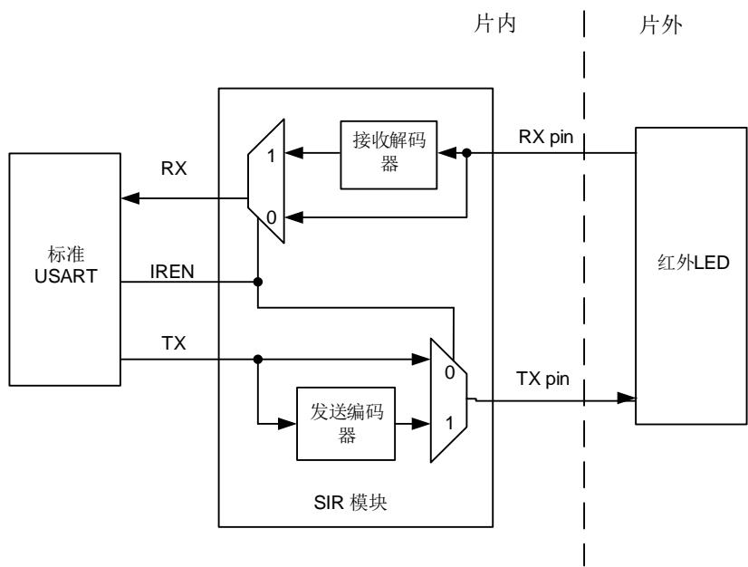

在IrDA模式下，TX引脚与RX引脚电平不同。TX引脚通常为低电平，RX引脚通常为高电平。IrDA引脚电平保持稳定代表逻辑‘1’，红外光源脉冲（RTZ信号）代表逻辑‘0’。其脉冲宽度通常占一个位时间的3/16。IrDA无法检测到宽度小于1个PSC时钟的脉冲。如果脉冲宽度大于1但是小于2倍PSC时钟，IrDA则无法可靠地检测到。

由于IrDA是一种半双工协议，因此在IrDA SIR ENDEC模块中，发送和接收不得同时进行。

图 15-14. IrDA 数据调制

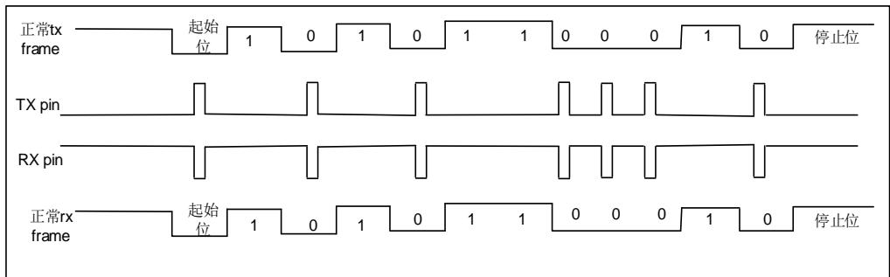

将USART_CTL2寄存器中IRLP置位可以使SIR子模块工作在低功耗模式下。发送编码器由PCLK分频得到的低速时钟来驱动。分频系数在USART_GP寄存器中PSC[7:0]位配置，USART_BAUD寄存器需配置为16*PSC[7:0]。TX引脚脉冲宽度可以为低功耗波特率的3倍。接收解码器工作模式与正常IrDA模式相同。

## 15.3.11. 半双工通信模式

通过设置USART_CTL2寄存器的HDEN位，可以使能半双工模式。在半双工通信模式下，USART_CTL1寄存器的LMEN，CKEN位和USART_CTL2寄存器的SCEN，IREN位应被清零。

半双工模式下仅用单线通信。TX引脚和RX引脚从内部连接到一起，RX引脚不再使用。TX引脚应被配置为开漏模式，通信冲突应由软件处理。

## 15.3.12. 智能卡（ISO7816-3）模式

智能卡模式是一种异步通信模式，支持ISO7816-3协议。支持字节模式（T=0）和块模式（T=1）。将USART_CTL2寄存器的SCEN位置1，即可使能智能卡模式。在智能卡模式下，USART_CTL1寄存器的LMEN位和USART_CTL2的HDEN，IREN位应该清0。

如果CKEN位被置位，USART将向智能卡提供一个时钟。该时钟可以分频用于其他用途。

智能卡模式下的帧格式为：1起始位+9数据位（包括1个奇偶校验位）+1.5停止位。

智能卡模式是一种半双工通信协议模式。当与智能卡连接时，TX引脚须被设置成开漏模式，这个引脚将会与智能卡驱动同一条双向连线。

图 15-15. ISO7816-3 数据帧格式

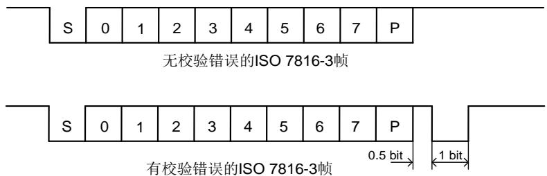

有校验错误的ISO 7816-3帧

## 字节模式（T=0）

相较于正常操作模式下的时序，从发送移位寄存器到TX引脚的传递时间延迟了半个波特率时钟，并且TC标志的置位将根据USART_GP寄存器的GUAT[7:0]设置延迟某一特定时间。在智能卡模式下，在最后一帧数据的停止位之后，内部保护时间计数器将开始计数，GUAT[7:0]的值配置为ISO7816-3协议的CGT减12。在保护时间寄存器向上计数这段时间TC将被强制拉低，当计数达到设定值时，TC被置位。

在USART发送期间，如果检测到有奇偶校验错误，TX引脚在停止位最后一个位时间内被拉低，智能卡发送一个NACK信号。根据协议，USART会自动重发SCRTNUM次。在重发数据帧前面会插入2位的帧间隔。最后一次重发字节后，TC会立即被置位。如果在最大重发次数后仍然收到NACK信号，USART将会停止发送，帧错误标志被置位。USART不会将NACK信号作为起始位。

在USART接收期间，如果在当前数据帧检测到校验错误，TX引脚在停止位的最后一个位时间内会被拉低。智能卡会接收到NACK信号。然后在智能卡端会产生一个帧错误。如果接收到的字节是错误的，RBNE中断和接收DMA请求都不会被激活。根据协议，智能卡将重新发送数据。如果在最大的重新发送次数后（这个次数的具体值在SCRTNUM位域），接收到的字符仍然是错误的，USART停止发送NACK信号和标注这个错误为奇偶校验错误。将USART_CTL2寄存器中的NKEN置位可以使能NACK信号。

空闲帧和断开帧在智能卡模式下不适用。

## 块模式（T=1）

在T=1（块模式）下，USART_CTL2寄存器的NKEN位应该清零来关闭校验错误发送。

当要从智能卡读取数据时，软件必须将USART_RT寄存器的RT[23:0]位域设置成BWT（块等待时间）-11的值，并将RBNEIE置位。如果到了这个时间，还没有从智能卡收到应答，将引起超时中断。如果在超时之前收到了第一个字节，则会引起RBNE中断。块模式下，如果用DMA从智能卡读取数据，也只能在第一个字节接收完后再去使能DMA。

在接收到第一个字节之后（RBNE中断）必须将USART_RT寄存器设置为CWT（字节等待时间）-11之间的某个值（这个时间以波特时间作为单位），这是为了自动检测两个连续字符之间的最大等待时间。如果智能卡在前一个字符发送结束后到设定的CWT周期之间没有发送字符，USART会通过RTF标志提醒软件，当RTIE被置位时，会引起中断。

USART用一个块长度计数器统计收到的字节数，这个计数器在USART开始发送的时候自动清0（TBE=0）。这个块长度信息位于智能卡发出数据的第三个字节（序言部分）。这个值必须写入USART_RT寄存器的BL[7:0]。当使用DMA模式时，在块开始之前，这个寄存器必须被设定为最小值（0x0）。为了得到这个值，在收到第四个字节后，会引起一个中断。软件可以从接收缓冲区读取第三个字节作为块长度。

在中断驱动接收模式，块的长度可以由软件提取出来并做检测或者通过设置BL的值得到。但是在块开始之前，BL（0xFF）可以被设置为最大值。实际值则要在接收到第三个字节后写到寄存器中。

整个块的长度（包括序言区，收尾区和信息区）等于BL+4。块尾通过EBF标志和相应中断提醒给软件（当EBIE位置1时）。如果块长度出错，将会引起一个RT中断。

## 直接和反向转换

智能卡协议定义了两种转换方式：直接转换和反向转换。

如果选择直接转换，从数据帧的最低位开始传输，TX引脚高电平代表逻辑‘1’，偶校验。在这种情况下，MSBF位和DINV位都应设置为0（默认值）。

如果选择反向转换，从数据帧的最高位开始传输，TX引脚低电平代表逻辑‘1’，偶校验。在这种情况下，MSBF位和DINV位都应设置为1。

## 15.3.13. 自动波特率检测

自动波特率检测功能通过测量接收数据的波特率，自动设置 USART_BAUD 寄存器。通过设置USART_CTL1 寄存器的 ABDEN 位，可以使能 USART 的自动波特率检测功能。自动波特率检测有两种测量方式，通过 USART_CTL1 寄存器的 ABDM 位域进行配置，检测方式如下：

1. 测量起始位的持续时间（下降沿至上升沿），在这种情况下，接收模式应该是以 1xxx 位开头的任何字符。

2. 测量起始位和第一位数据位的持续时间，该过程是在下降沿到下降沿之间进行的，这样可以确保在信号斜率较慢的情况下获得更高的准确性。在这种情况下，接收模式应该是以10xx 位开头的任何字符。

波特率检测完成后，硬件会设置 USART_STAT 寄存器中的 ABDF 位。向 USART_CMD 寄存器中的 ABDCMD 位写入 1 将清除 ABDF 和 ABDE两位，并启动新的波特率检测过程。

如果检测的通信速率超出范围，硬件会自动设置 USART_STAT 寄存器的 ABDE位。波特率检测的有效范围是指每位数据的持续时间需落在以下两个区间内：一是 16 至 65536 个时钟周期之间，此时采用 16 倍过采样；二是 8 至 32768 个时钟周期之间，此时采用 8 倍过采样。

## 注意：

1. 当过采样为 16 时，波特率范围为 uclk/65535 到 uclk/16；当过采样为 8 时，波特率范围为 uclk/65535 到 uclk/8。

2. 如果在自动波特率操作期间禁用 USART（UEN = 0），BRR 值可能会被破坏。

3. 如果启用了 FIFO 模式，自动波特率检测应使用第一个 RXFIFO 位置的数据。因此，在启动自动波特率检测之前，请通过检查 USART_RFCS 寄存器中的 RFE 标志确保 RXFIFO为空。

## 15.3.14. ModBus 通信

通过实现块尾检测功能，USART提供实现ModBus / RTU和ModBus / ASCII协议的基本支持。

在ModBus/RTU模式下，通过一个超过2个字符长度的空闲状态来识别块尾。这个功能是通过一个可编程的超时检测功能来实现的。

为了检测空闲状态，必须置位USART_CTL1寄存器的RTEN位和USART_CTL0寄存器的RTIE位。USART_RT寄存器必须被设置成与2个字节超时所对应的值。在最后一个停止位被接收后，当接收线在这期间是空闲的，将产生一个中断，通知软件当前块接收已经完成。

在ModBus /ASCII模式下，块尾被认为是一个特定的字符（CR / LF）串。USART用字符匹配机制实现这个功能。具体是通过将LF的ASCII码配置到ADDR区域并激活地址匹配中断（AMIE=1）来实现。软件将在收到LF或可以在DMA缓存中查找到CR / LF时得到提示。

## 15.3.15. 接收 FIFO

通过将USART_RFCS寄存器的RFEN置位使能接收FIFO，可以避免当CPU无法迅速响应RBNE中断时，发生过载错误。接收FIFO和接收缓存区可储存多至5帧的数据。若接收FIFO满，RFFINT位将被置位。如果RFFIE被置位，将产生中断。

图 15-16. USART 接收 FIFO 结构

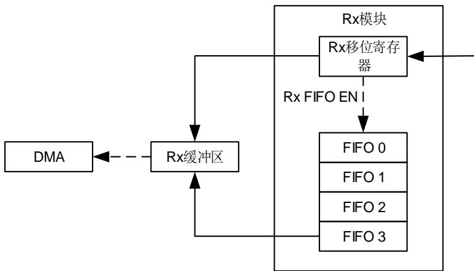

如果软件在响应RBNE中断时读数据接收缓冲区，在响应开始时，RBNEIE位应清0。当所有接

收的数据被读出后，RBNEIE位应置位。在读出接收的数据前，PERR，NERR，FERR，EBF都应被清0。

## 15.3.16. 从 Deepsleep 模式唤醒

通过标准RBNE中断或WUM中断USART能从深度睡眠模式唤醒MCU。

UESM位必须置1并且USART时钟必须设置为HIRCDIV_PER或LXTAL（请参考 1RCU_CFG1 ）。

当使用RBNE标准中断时，必须在进入深度睡眠模式前将RBNEIE位置位。

当使用WUIE中断时，WUIE中断源可以通过WUM位来选择。

在进入深度睡眠模式前，必须禁用DMA。在进入深度睡眠模式前，软件必须检测USART是否正在传送数据。这可以通过USART_STAT寄存器中的BSY标志来判断。REA位必须被检测以确保USART是使能的。

当检测到唤醒事件时，无论MCU工作在深度睡眠模式还是正常模式，WUF标志位通过硬件被置1，并且在WUIE被置位的情况下，触发一个唤醒中断。

## 15.3.17. USART 中断

USART 中断事件和标志如 15-3. USART 所示：

表 15-3. USART 中断请求

<table><tr><td>中断事件</td><td>事件标志</td><td>使能控制位</td></tr><tr><td>发送数据寄存器空</td><td>TBE</td><td>TBEIE</td></tr><tr><td>CTS标志</td><td>CTSF</td><td>CTSIE</td></tr><tr><td>发送结束</td><td>TC</td><td>TCIE</td></tr><tr><td>接收到的数据可以读取</td><td>RBNE</td><td rowspan="2">RBNEIE</td></tr><tr><td>检测到过载错误</td><td>ORERR</td></tr><tr><td>接收FIFO满</td><td>RFFINT</td><td>RFFIE</td></tr><tr><td>检测到线路空闲</td><td>IDLEF</td><td>IDLEIE</td></tr><tr><td>奇偶校验错误</td><td>PERR</td><td>PERRIE</td></tr><tr><td>LIN模式下,检测到断开标志</td><td>LBDF</td><td>LBDIE</td></tr><tr><td>当DMA接收使能时,接收错误(噪声错误、溢出错误、帧错误)</td><td>NERR或ORERR或FERR</td><td>ERRIE</td></tr><tr><td>字符匹配</td><td>AMF</td><td>AMIE</td></tr><tr><td>接收超时错误</td><td>RTF</td><td>RTIE</td></tr><tr><td>发现块尾</td><td>EBF</td><td>EBIE</td></tr><tr><td>从Deepsleep模式唤醒</td><td>WUF</td><td>WUIE</td></tr></table>

在发送给中断控制器之前，所有的中断事件是逻辑或的关系。因此在任何时候 USART 只能向控制器产生一个中断请求。不过软件可以在一个中断服务程序里处理多个中断事件。

图 15-17. USART 中断映射框图

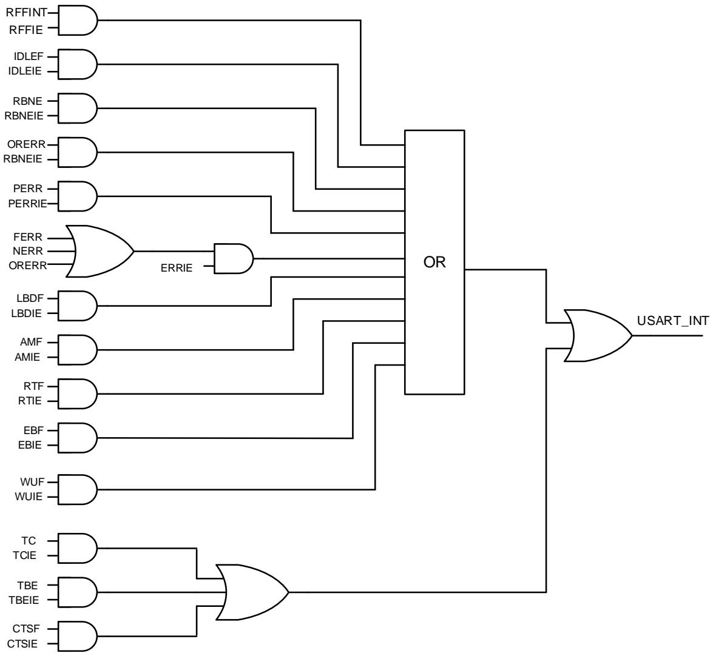


