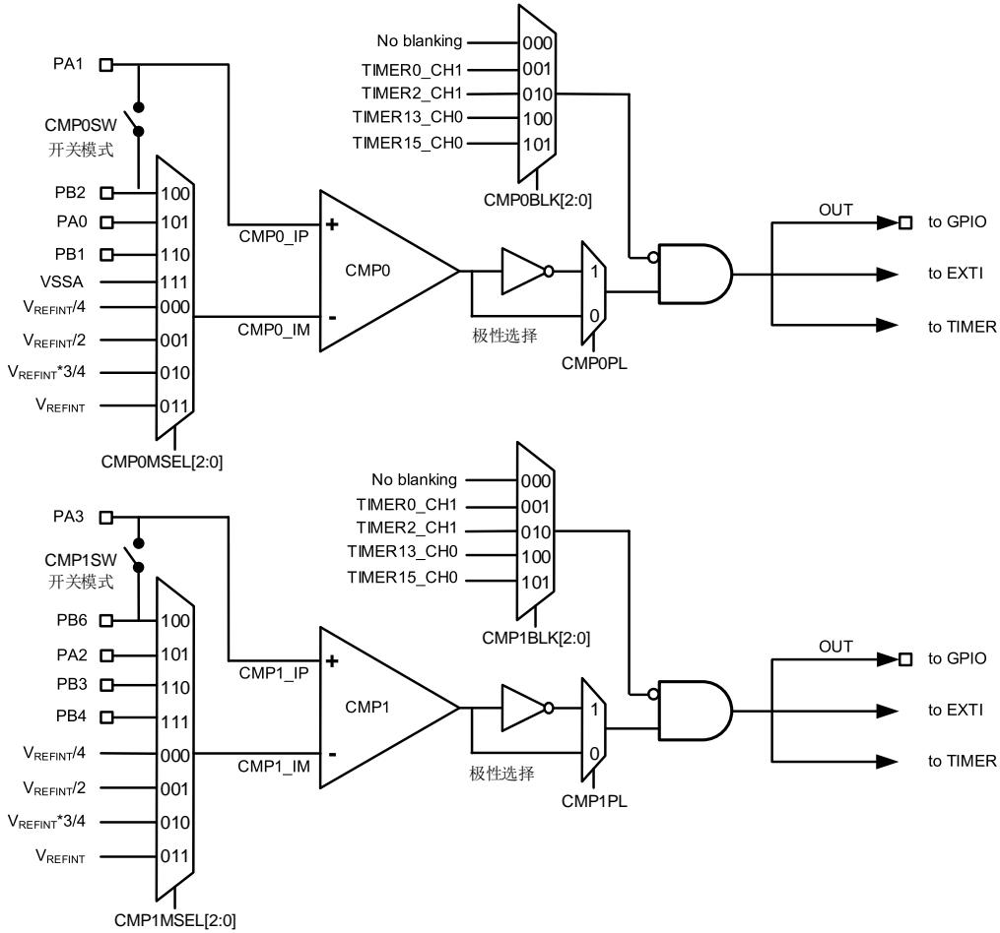
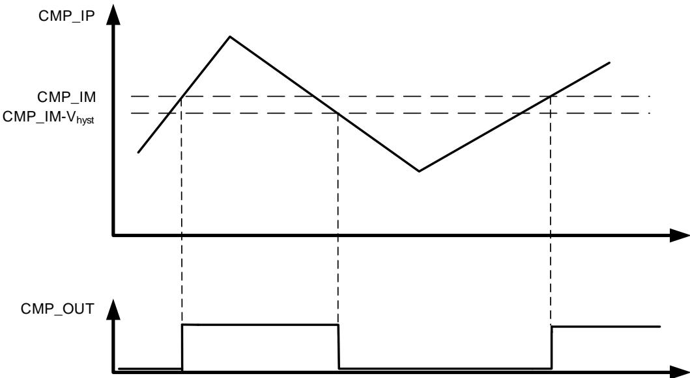
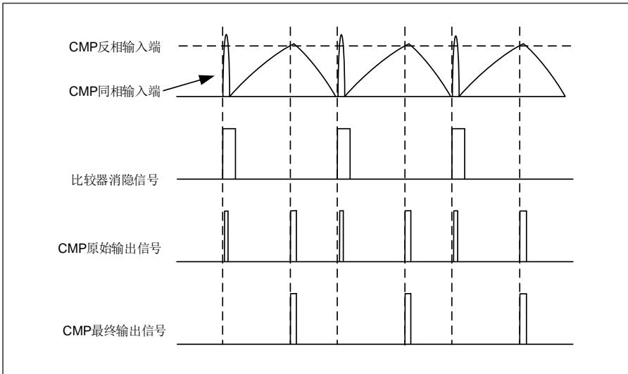

## 18. 比较器（CMP）

## 18.1. 简介

通用比较器可独立工作，其输出端可用于 I / O 口，也可和定时器结合使用。

比较器可通过模拟信号将 MCU 从低功耗模式中唤醒，在一定的条件下，可将模拟信号作为TIMER 的触发源。

## 18.2. 主要特征

◼ 轨对轨比较器；

◼ 迟滞可配置；

◼ 速度、功耗可配置；

◼ 每个比较器可配置以下模拟信号作为输入源；

DAC 输出；

多路复用 I / O 引脚；

0.25、0.5、0.75、1 倍的内部参考电压；

◼ 比较器输出消隐；

◼ 窗口比较器；

◼ 输出到 I / O 口；

◼ 作为触发源输出到定时器；

◼ 输出到 EXTI。

## 18.3. 功能描述

比较器的框图展示如下：

图 18-1. 比较器框图

注意：VREFINT 是 1.2V。

## 18.3.1. 比较器时钟

比较器与 APB 总线连接，时钟与 PCLK 同步。

## 18.3.2. 比较器的 I / O配置

在被选为比较器输入端之前，相应管脚必须配置为模拟模式。

比较器的输出可同时实现内部和外部输出。

参考 Datasheet 的引脚定义，比较器输出可以通过 GPIO 的备用功能连接到对应的 I / O 口。

比较器输出内部连接到定时器，他们的连接关系如下：

◼ CMP输出连接到定时器输入捕获通道，由 TIMER0_INSEL 寄存器配置。

为了在深度睡眠模式下工作，比较器端口的极性选择和输出重定向不会因为 PCLK 关闭。

18-1 详细描述了 CMP 的输入和输出。

表 18-1 比较器的输入和输出

<table><tr><td></td><td>CMP0</td><td>CMP1</td></tr><tr><td>CMP 同相输入连接到 I/O</td><td>PA1</td><td>PA3</td></tr><tr><td rowspan="4">CMP 反相输入连接到 I/O</td><td>PA0</td><td>PA2</td></tr><tr><td>PB1</td><td>PB3</td></tr><tr><td>PB2</td><td>PB4</td></tr><tr><td>VSSA</td><td>PB6</td></tr><tr><td>CMP 反相输入连接到内部信号</td><td><eq>V_{REFINT}/4</eq>,<eq>V_{REFINT}/2</eq>,<eq>V_{REFINT}^{*}3/4</eq>,<eq>V_{REFINT}</eq></td><td><eq>V_{REFINT}/4</eq>,<eq>V_{REFINT}/2</eq>,<eq>V_{REFINT}^{*}3/4</eq>,<eq>V_{REFINT}</eq></td></tr><tr><td rowspan="5">CMP 输出连接到 I/O</td><td>PA0</td><td>PA2</td></tr><tr><td>PA6</td><td>PA7</td></tr><tr><td>PB0</td><td>PB11</td></tr><tr><td>PB10</td><td>PA12</td></tr><tr><td>PA11</td><td>PB5</td></tr><tr><td>CMP 输出连接到EXTI</td><td colspan="2">●</td></tr><tr><td>CMP 输出连接到内部信号</td><td>TIMER0_CH0</td><td>TIMER0_CH1</td></tr></table>

## 18.3.3. 比较器供电模式

对于给定的程序，在比较器功耗和传输迟滞之间存在着权衡，可通过寄存器 CMPx_CS 的位CMPxM [1:0]的配置进行调整。当 CMPxM [1:0]为 2’b 00 时，比较器以运行速度最快和功耗最大模式工作，但当 CMPxM [1:0]位 2’b 11 时，比较器以运行速度最慢和功耗最小的模式工作。

## 18.3.4. 比较器迟滞

为了避免噪声信号所引起的假输出，电路设计了可编程的迟滞功能，通过配置控制状态寄存器来控制迟滞电压值。该功能可以在无需要时关闭。

图 18-2. 比较器迟滞

## 18.3.5. 比较器寄存器写保护

比较器的控制状态寄存器（CMPx_CS）可通过设置 CMPxLK位为 1 来进行写保护，CMPx_CS寄存器，包含 CMPxLK 位，就会变为只读位，只有在 MCU 复位时才可以复位。

## 18.3.6. 比较器输出消隐

比较器输出消隐功能可以避免比较器输入信号中的短脉冲对输出信号的干扰。如果 CMPx_CS寄存器中的 CMPxBLK[2:0]位域设置为有效值，则比较器最终输出的信号由所选消隐信号的互补信号和比较器的原始输出进行“与”运算获得。

18-3. 比较器的输出消隐显示了比较器的输出消隐功能。

图 18-3. 比较器的输出消隐

## 18.3.7. 电压定标器功能

电压定标器功能可为 CMP 输入提供可选择的 1 / 4、1 / 2、3 / 4 参考电压。它由位于 CMPx 控制状态寄存器中的 CMPxSEN 位和 CMPxBEN 位控制，CMPxSEN 位和 CMPxBEN 位分别用于使能 V 电压输出和分压电路，以产生所选择的电压。

## 18.3.8. 比较器中断

CMP输出连接到 EXTI，EXTI 线对每个 CMP都是独占的。通过这个功能，可以产生中断或者事件，用于退出省电模式。

