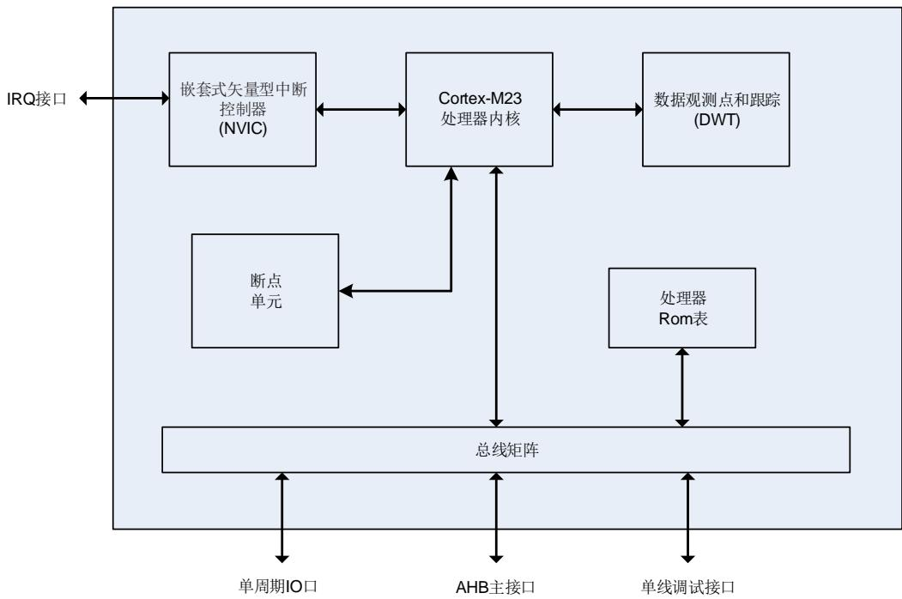
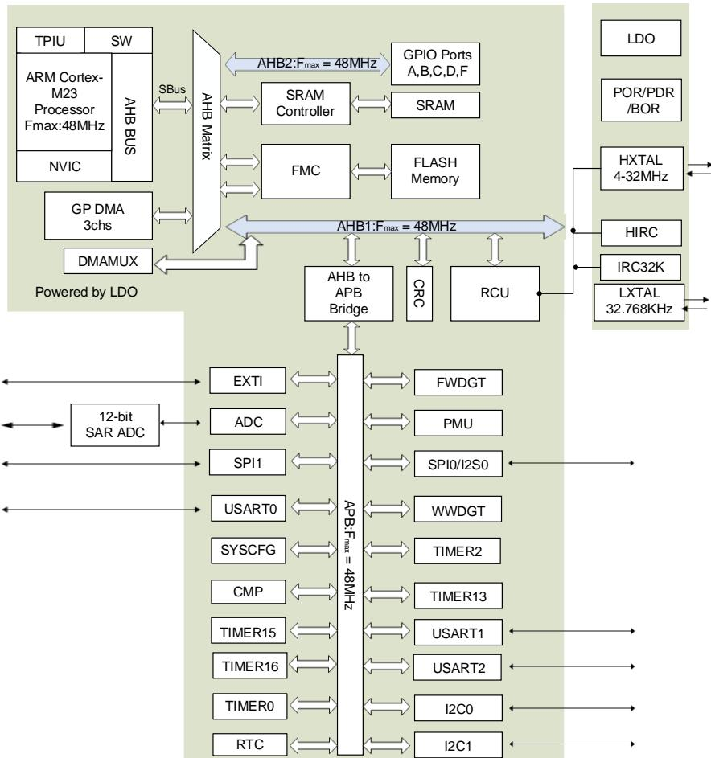
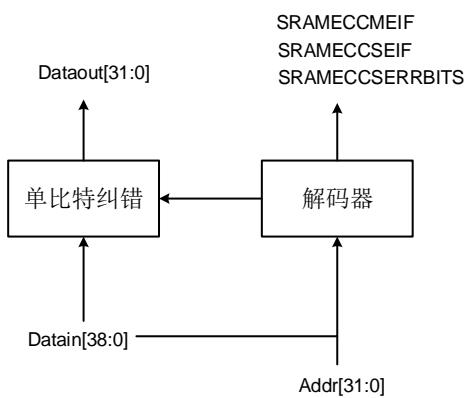

## 1. 系统及存储器架构

GD32C2x1系列器件是基于Arm® Cortex®-M23处理器的32位通用微控制器。Arm® Cortex®-M23处理器的所有存储访问，根据不同的目的和目标存储空间，都会在AHB总线上执行。存储器的组织采用了ARMv8M结构，预先定义的存储器映射和高达4 GB的存储空间，充分保证了系统的灵活性和可扩展性。

## 1.1. Arm® Cortex®-M23 处理器

Arm® Cortex®-M23处理器是一个低功耗32位处理器。适用于需要一个区域优化处理器来进行深度嵌入式应用的场景。Arm® Cortex®-M23处理器为开发人员提供了显著的好处，包括：

◼ 一个简单的体系结构，易于学习和编程；

◼ 超低功耗、高效节能；

◼ 优秀的代码密度；

◼ 确定性、高性能中断处理；

◼ 向上兼容Cortex-M处理器家族系列。

Arm® Cortex®-M23处理器通过精简强大的指令集和广泛优化的设计提供高效处理能力，提供包括单周期乘法器和17周期分频器的高端处理硬件。

Arm® Cortex®-M23处理器高度集成了一个可配置的嵌套矢量中断控制器（NVIC），以提供业界领先的中断性能。

下面列出由Arm® Cortex®-M23提供的一些系统外设：

◼ 低延迟，高速外设I/O端口；

◼ 向量表偏移寄存器；

◼ 断点单元；

◼ 数据观测点；

◼ 串行调试接口。

1-1. Arm® Cortex®-M23 显示了Arm® Cortex®-M23处理器结构框图。欲了解更多信息，请参阅Arm® Cortex®-M23技术参考手册。

图 1-1. Arm® Cortex®-M23 处理器结构框图

## 1.2. 系统架构

GD32C2x1 设备实现了总线矩阵，它被用于管理主机之间的访问仲裁，仲裁采用的是 RoundRobin 算法。总线矩阵提供了从主机到从机的访问，即使多个高速外围设备同时工作，也可以进行并发访问和高效运行。GD32C2x1 设备采用 32 位多层总线结构，该结构可使系统中的多个主机和从机之间的并行通信成为可能。多层总线结构包括一个 AHB 互联矩阵、两个 AHB总线。AHB 互联矩阵的互联关系接下来将进行说明。在 1-1. AHB ，”1”表示相应的主机可以通过 AHB 互联矩阵访问对应的从机，空白的单元格表示相应的主机不可以通过 AHB 互联矩阵访问对应的从机。

表 1-1. AHB 互联矩阵的互联关系列表

<table><tr><td></td><td>SBUS</td><td>DMA</td></tr><tr><td>FMC</td><td>1</td><td>1</td></tr><tr><td>SRAM</td><td>1</td><td>1</td></tr><tr><td>AHB1</td><td>1</td><td>1</td></tr><tr><td>AHB2</td><td>1</td><td>1</td></tr></table>

如上表所示，AHB 互联矩阵共连接两个主机，分别为：SBUS 和 DMA。CPU SBUS 将 Cortex®-M23 内核的系统总线（外设总线）连接到管理内核与 DMA 之间的仲裁的总线矩阵。DMA 总线将 DMA 的 AHB 主接口连接到总线矩阵，该矩阵管理 CPU 和 DMA 对 SRAM，FLASH 和AHB / APB 外设的访问。

AHB 互联矩阵也连接了一些从机，分别为：FMC、SRAM、AHB1 和 AHB2。FMC 是闪存存储器控制器的总线。SRAM 是片上静态随机存取存储器。AHB1 是连接所有 AHB 从机和 AHB到 APB 桥的 AHB 总线，AHB2 是连接 AHB2 从机的 AHB 总线。AHB 到 APB 的桥接器是与所有 APB从机连接的 APB 总线。APB总线与所有 APB外设相连。APB 速度限制为 48MHz。

GD32C2x1 系列器件的系统架构如下图所示。该 AHB 矩阵是一个基于 AMBA 5.0 AHB-LITE的多层总线，这个结构使得系统中的多个主机和从机之间的并行通信成为可能。该 AHB 矩阵中包含属于 Arm® Cortex®-M23 内核的 AHB 总线，以及内核外的 DMA 共 2 个主机。该 AHB矩阵还连接了 4 个从机，分别为：FMC、内部 SRAM、AHB1 和 AHB2。

AHB2 连接 GPIO 端口。AHB1 连接 AHB 外设，包括 AHB-APB 总线桥。AHB-APB 总线桥提供了 AHB1 和 APB总线之间的全同步连。APB总线连接了所有的 APB 外设。

图 1-2. GD32C2x1 系列器件的系统架构示意图

## 1.3. 存储器映射

程序存储器，数据存储器，寄存器和 I/O 端口都在同一个线性的 4 GB 的地址空间之内。这是® ® 的最大地址范围，因为它的地址总线宽度是 位。此外，为了降低不同客户在相同应用时的软件复杂度，存储映射是按 Arm® Cortex®-M23 处理器提供的规则预先定义的。同时，一部分地址空间由 $\mathsf { A r m } ^ { \otimes } \mathsf { C o r t e x } ^ { \otimes } \mathbf { - } \mathsf { M } 2 3$ 的系统外设所占用。下表显示了 GD32C2x1系列器件的存储器映射，包括代码、SRAM、外设和其他预先定义的区域。几乎每个外设都分配了 1KB的地址空间，这样可以简化每个外设的地址译码。

表 1-2. GD32C2x1 系列器件的存储器映射表

<table><tr><td>预定义的区域</td><td>总线</td><td>地址范围</td><td>外设</td></tr><tr><td></td><td></td><td>0xE000 0000 - 0xE00F FFFF</td><td>Cortex M23 内部外设</td></tr><tr><td>外部设备</td><td></td><td>0xA000 0000 - 0xDFFF FFFF</td><td>保留</td></tr><tr><td>外部 RAM</td><td></td><td>0x60000000 - 0x9FFFFFFF</td><td>保留</td></tr><tr><td rowspan="37">外设</td><td rowspan="9">AHB2</td><td>0x5004 0000 - 0x5FFF FFFF</td><td>保留</td></tr><tr><td>0x5000 0000 - 0x5003 FFFF</td><td>保留</td></tr><tr><td>0x4800 1800 - 0x4FFF FFFF</td><td>保留</td></tr><tr><td>0x4800 1400 - 0x4800 17FF</td><td>GPIOF</td></tr><tr><td>0x4800 1000 - 0x4800 13FF</td><td>保留</td></tr><tr><td>0x4800 0C00 - 0x4800 0FFF</td><td>GPIOD</td></tr><tr><td>0x4800 0800 - 0x4800 0BFF</td><td>GPIOC</td></tr><tr><td>0x4800 0400 - 0x4800 07FF</td><td>GPIOB</td></tr><tr><td>0x4800 0000 - 0x4800 03FF</td><td>GPIOA</td></tr><tr><td rowspan="13">AHB1</td><td>0x4003 8400 - 0x47FF FFFF</td><td>保留</td></tr><tr><td>0x4003 8000 - 0x4003 83FF</td><td>保留</td></tr><tr><td>0x4002 4000 - 0x4003 7FFF</td><td>保留</td></tr><tr><td>0x4002 3400 - 0x4002 3FFF</td><td>保留</td></tr><tr><td>0x4002 3000 - 0x4002 33FF</td><td>CRC</td></tr><tr><td>0x4002 2400 - 0x4002 2FFF</td><td>保留</td></tr><tr><td>0x4002 2000 - 0x4002 23FF</td><td>FMC</td></tr><tr><td>0x4002 1400 - 0x4002 1FFF</td><td>保留</td></tr><tr><td>0x4002 1000 - 0x4002 13FF</td><td>RCU</td></tr><tr><td>0x4002 0C00 - 0x4002 0FFF</td><td>保留</td></tr><tr><td>0x4002 0800 - 0x4002 0BFF</td><td>DMAMUX</td></tr><tr><td>0x4002 0400 - 0x4002 07FF</td><td>保留</td></tr><tr><td>0x4002 0000 - 0x4002 03FF</td><td>DMA</td></tr><tr><td rowspan="15">APB</td><td>0x4001 8000 - 0x4001 FFFF</td><td>保留</td></tr><tr><td>0x4001 7C00 - 0x4001 7FFF</td><td>CMP</td></tr><tr><td>0x4001 7800 - 0x4001 7BFF</td><td>保留</td></tr><tr><td>0x4001 7400 - 0x4001 77FF</td><td>保留</td></tr><tr><td>0x4001 7000 - 0x4001 73FF</td><td>保留</td></tr><tr><td>0x4001 6C00 - 0x4001 6FFF</td><td>保留</td></tr><tr><td>0x4001 6800 - 0x4001 6BFF</td><td>保留</td></tr><tr><td>0x4001 5C00 - 0x4001 67FF</td><td>保留</td></tr><tr><td>0x4001 5800 - 0x4001 5BFF</td><td>DBG</td></tr><tr><td>0x4001 5400 - 0x4001 57FF</td><td>保留</td></tr><tr><td>0x4001 5000 - 0x4001 53FF</td><td>保留</td></tr><tr><td>0x4001 4C00 - 0x4001 4FFF</td><td>保留</td></tr><tr><td>0x4001 4800 - 0x4001 4BFF</td><td>TIMER16</td></tr><tr><td>0x4001 4400 - 0x4001 47FF</td><td>TIMER15</td></tr><tr><td>0x4001 3C00 - 0x4001 43FF0x4001 3800 - 0x4001 3BFF</td><td>保留USART0</td></tr><tr><td rowspan="34"></td><td rowspan="34"></td><td>0x4001 3400 - 0x4001 37FF</td><td>保留</td></tr><tr><td>0x4001 3000 - 0x4001 33FF</td><td>SPI0/I2S0</td></tr><tr><td>0x4001 2C00 - 0x4001 2FFF</td><td>TIMER0</td></tr><tr><td>0x4001 2800 - 0x4001 2BFF</td><td>保留</td></tr><tr><td>0x4001 2400 - 0x4001 27FF</td><td>ADC</td></tr><tr><td>0x4001 2000 - 0x4001 23FF</td><td>保留</td></tr><tr><td>0x4001 1C00 - 0x4001 1FFF</td><td>保留</td></tr><tr><td>0x4001 1800 - 0x4001 1BFF</td><td>保留</td></tr><tr><td>0x4001 1400 - 0x4001 17FF</td><td>保留</td></tr><tr><td>0x4001 1000 - 0x4001 13FF</td><td>保留</td></tr><tr><td>0x4001 0C00 - 0x4001 0FFF</td><td>保留</td></tr><tr><td>0x4001 0800 - 0x4001 23FF</td><td>保留</td></tr><tr><td>0x4001 0400 - 0x4001 07FF</td><td>EXTI</td></tr><tr><td>0x4001 0000 - 0x4001 03FF</td><td>SYSCFG</td></tr><tr><td>0x4000 C000 - 0x4000 FFFF</td><td>保留</td></tr><tr><td>0x4000 7400 - 0x4000 BFFF</td><td>保留</td></tr><tr><td>0x4000 7000 - 0x4000 73FF</td><td>PMU</td></tr><tr><td>0x4000 5C00 - 0x4000 6FFF</td><td>保留</td></tr><tr><td>0x4000 5800 - 0x4000 5BFF</td><td>I2C1</td></tr><tr><td>0x4000 5400 - 0x4000 57FF</td><td>I2C0</td></tr><tr><td>0x4000 4C00 - 0x4000 53FF</td><td>保留</td></tr><tr><td>0x4000 4800 - 0x4000 4BFF</td><td>USART2</td></tr><tr><td>0x4000 4400 - 0x4000 47FF</td><td>USART1</td></tr><tr><td>0x4000 3C00 - 0x4000 43FF</td><td>保留</td></tr><tr><td>0x4000 3800 - 0x4000 3BFF</td><td>SPI1</td></tr><tr><td>0x4000 3400 - 0x4000 37FF</td><td>保留</td></tr><tr><td>0x4000 3000 - 0x4000 33FF</td><td>FWDGT</td></tr><tr><td>0x4000 2C00 - 0x4000 2FFF</td><td>WWDGT</td></tr><tr><td>0x4000 2800 - 0x4000 2BFF</td><td>RTC</td></tr><tr><td>0x4000 2400 - 0x4000 27FF</td><td>保留</td></tr><tr><td>0x4000 2000 - 0x4000 23FF</td><td>TIMER13</td></tr><tr><td>0x4000 0800 - 0x4000 1FFF</td><td>保留</td></tr><tr><td>0x4000 0400 - 0x4000 07FF</td><td>TIMER2</td></tr><tr><td>0x4000 0000 - 0x4000 03FF</td><td>保留</td></tr><tr><td rowspan="2">SRAM</td><td rowspan="2"></td><td>0x2000 3000 - 0x3FFF FFFF</td><td>保留</td></tr><tr><td>0x2000 0000 - 0x2000 2FFF</td><td>SRAM(12KB)</td></tr><tr><td rowspan="4">Code</td><td rowspan="4"></td><td>0x1FFF 7880 - 0x1FFF FFFF</td><td>保留</td></tr><tr><td>0x1FFF 7800 - 0x1FFF 787F</td><td>Option bytes(128B)</td></tr><tr><td>0x1FFF 7400 - 0x1FFF 77FF</td><td>保留</td></tr><tr><td>0x1FFF 7000 - 0x1FFF 73FF</td><td>OTP bytes(1KB)</td></tr><tr><td rowspan="5"></td><td rowspan="5"></td><td>0x1FFF 0C00 - 0x1FFF 6FFF</td><td>保留</td></tr><tr><td>0x1FFE F400 - 0x1FFF 0BFF</td><td>System memory(6KB)</td></tr><tr><td>0x0801 0000 - 0x1FFE F3FF</td><td>保留</td></tr><tr><td>0x0800 0000 - 0x0800 FFFF</td><td>Main Flash memory(64KB)</td></tr><tr><td>0x0000 0000 - 0x07FF FFFF</td><td>Aliased to Flash or system memory</td></tr></table>

## 1.3.1. 片上 SRAM 存储器

GD32C2x1系列微控制器含有高达12KB的片上SRAM，起始地址为0x2000 0000，支持字节、半字(16比特)和整字(32比特)访问。

ECC 

SRAM 支持 7 比特的 ECC 功能。可纠错 1 比特，发现多比特（两比特）错误。

读之前必须先写入，否则很可能会导致 ECC 错误。非对齐的读操作会按照 32 比特的读操作来执行。非对齐的写操作会产生一个读改写的流程。例如，16 比特写，首先会先读 16 比特，再和需要写入的 16 比特一起写入。所以初始化 SRAM 时，只能按照 32 位的来写入。

ECC 模块由编码器和解码器两部分构成：

编码器：在进行 SRAM 写操作时，会产生一个 7 比特的 ECC 码，和数据一起写入 SRAM。

解码器：在进行 SRAM 读操作时，使用与编码器相同的算法，解码生成一个 7 比特的 ECC 码。ECC 码包括 ECC 错误状态和 32 位数据中哪位存在单比特位错误的信息。

解码器如下图所示： 1-3 ECC

图 1-3 ECC 解码器示意图

## EEIC

EEIC（ECC Error Interrupt Control）模块提供了 ECC 错误状态管理和 ECC 中断配置的功能。通过设置 SYSCFG_CFG1 寄存器和选项字节中的 SRAM_ECCEN 位，从而实现 SRAM 的

ECC 错误检测。

## 单比特可纠错事件

当检测到发生了单比特可纠错的事件时，EEIC 模块有如下配置：

（1） SYSCFG_STAT 寄存器中的 ECCSEIF 位置位，软件写 1 可以清除。

（2） SYSCFG_CFG2 寄存器中的 ECCEADDR[11:0]记录发生单比特可纠错 ECC 事件的地址。

## 多比特（两比特）不可纠错事件

当在 SRAM 中检测到发生了多比特（两比特）不可纠错的事件时，EEIC 模块有如下配置：

（1） SYSCFG_STAT 寄存器中的 ECCMEIF 位置位，软件写 1 可以清除。

（2） SYSCFG_SRAM0ECC 寄存器中的 ECCADDR[11:0]记录发生两比特不可纠错 ECC事件的地址。

## 单比特可纠错中断

在 SYSCFG_CFG2 寄存器中设置 ECCSEIE 位，当检测到一个单比特可纠正错误事件时，将产生一个相应的 NMI 中断。

## 多比特（两比特）不可纠错事件

在 SYSCFG_CFG2 寄存器中设置 ECCMEIE 位。当检测到一个多比特（两比特）不可纠错错误事件时，将产生一个 NMI 中断。

## 1.3.2. 片上闪存

GD32C2x1 系列微控制器可以提供高密度片上 FLASH 存储器，按以下分类进行组织：

◼ 高达64KB主FLASH存储器

◼ 器件配置的选项字节

◼ 支持EFLASH ECC

更多详细说明请参考 FMC 章节。

## 1.4. 引导配置

## 主闪存闪空检查

当配置从主Flash启动时，通过检查FMC_WS寄存器中的MFPE位，对原始设备进行编程变得更加方便。当设置MFPE位时，设备被认为是空的，并且引导装载程序从系统内存开始，允许在此时进行Flash编程。在加载选项字节期间，如果地址0x0800 0000处的内容被读取为0xFFFFFFFF，则会设置MFPE标志;否则，它将被清除。在对原始设备编程后，MFPE标志可以通过电源复位或设置FMC_CTL寄存器中的OBRLD位来清除，使设备在系统复位后执行用户代码。MFPE标志也可以通过软件修改。

注意：如果设备是首次编程，但没有重新加载选项字节，在系统复位后，设备仍然会选择系统内存作为启动区。

## 引导模式

GD32C2x1系列微控制器提供了三种引导源，可以通过BOOT0引脚和用户选项字节中的引导模式配置位（BOOTLK比特位，nBOOT1比特位，SWBT0比特位，nBOOT0比特位）来进行选择，详细说明见 1-3. 。当SWBT0置零时，BOOT0引脚的电平状态会在复位后的第四个CK_SYS(系统时钟)的上升沿进行锁存。上电复位或系统复位后，由用户设置引导模式配置，选择所需的启动源。当SWBT0置零时，一旦这个引脚电平被采样，它可以被释放并用于其他用途。

表 1-3. 引导模式

<table><tr><td rowspan="2">引导源选择</td><td colspan="5">启动模式配置</td></tr><tr><td>BOOTLK</td><td>nBOOT1 位</td><td>BOOT0 引脚</td><td>SWBT0 位</td><td>nBOOT0 位</td></tr><tr><td>主 Flash 存储器</td><td>0</td><td>x</td><td>0</td><td>0</td><td>x</td></tr><tr><td>System 存储器</td><td>0</td><td>1</td><td>1</td><td>0</td><td>x</td></tr><tr><td>片上 SRAM</td><td>0</td><td>0</td><td>1</td><td>0</td><td>x</td></tr><tr><td>主 Flash 存储器</td><td>0</td><td>x</td><td>x</td><td>1</td><td>1</td></tr><tr><td>System 存储器</td><td>0</td><td>1</td><td>x</td><td>1</td><td>0</td></tr><tr><td>片上 SRAM</td><td>0</td><td>0</td><td>x</td><td>1</td><td>0</td></tr><tr><td>主 Flash 存储器</td><td>1</td><td>x</td><td>x</td><td>x</td><td>x</td></tr></table>

上电序列或系统复位后，Arm® Cortex®-M23处理器先从0x0000 0000地址获取栈顶值，再从0x0000 0004地址获得引导代码的基地址，然后从引导代码的基地址开始执行程序。

根据所选的引导源，片上闪存的主存（开始于0x0800 0000的存储空间）或系统存储器（开始于0x1FFF 0000的存储空间）会被映射到引导空间，即从0x0000 0000开始的地址空间。如果片上SRAM（开始于0x2000 0000的存储空间）被选为引导源，用户必须在应用程序初始化代码中通过修改NVIC异常向量表和偏移寄存器将向量表重置到SRAM中。

芯片内嵌的引导装载程序位于系统存储器中，用来对片上闪存的主存进行重编程。对于GD32C2x1产品，该引导装载程序可通过以下接口之一工作：USART0/1，I2C0。

无论其他模式如何配置，都可以通过配BOOTLK位从主Flash存储器的唯一入口进行强制引导。

## ◼ 重映射配置

当选择启动模式配置时，软件可以通过内存重映射配置寄存器(SYSCFG_CFG0)中的BOOT_MODE 位配置内存重映射功能。存储器包括主 Flash 存储器，System 存储器，片上 SRAM 可以重新映射。

## 1.5. 系统配置控制器（SYSCFG）

系统配置控制器（SYSCFG）的主要用途如下：

◼ 配置 I2C Fm+和 I/O 模拟开关的电压增强器

◼ 重映射某些I / O口

◼ 管理与GPIO的外部中断线连接

## 1.7. 设备电子签名

设备的电子签名中包含的存储容量信息和96位的唯一设备ID。它被存储在片上Flash的信息模块中。96位唯一设备ID对于每颗芯片而言都是唯一的。它可以用作序列号，或安全密钥的一部分，等等。

## 1.7.1. 存储容量信息

基地址：0x1FFF 0BE0

该值是原厂设定的，不能由用户修改。

该寄存器只能按字（32位）访问

<table><tr><td>31</td><td>30</td><td>29</td><td>28</td><td>27</td><td>26</td><td>25</td><td>24</td><td>23</td><td>22</td><td>21</td><td>20</td><td>19</td><td>18</td><td>17</td><td>16</td></tr><tr><td colspan="16">SRAM_DENSITY[15:0]</td></tr><tr><td>15</td><td>14</td><td>13</td><td>12</td><td>11</td><td>10</td><td>9</td><td>8</td><td>7</td><td>6</td><td>5</td><td>4</td><td>3</td><td>2</td><td>1</td><td>0</td></tr><tr><td colspan="16">FLASH_DENSITY[15:0]</td></tr></table>

<table><tr><td>位/位域</td><td>名称</td><td>描述</td></tr><tr><td>31:16</td><td>SRAM_DENSITY[15:0]</td><td>SRAM存储器容量该值表明芯片的片上SRAM存储器容量,以Kbytes为单位例如:0x0008表示8Kbytes。</td></tr><tr><td>15:0</td><td>FLASH_DENSITY[15:0]</td><td>Flash存储器容量该值表明芯片的片上Flash容量,以Kbytes为单位例如:0x0020表示32Kbytes。</td></tr></table>

## 1.7.2. 设备唯一 ID（96 位/位域）

基地址：0x1FFF 0BE8

该值是原厂设定的，不能由用户修改。

该寄存器只能按字（32位）访问

<table><tr><td>31</td><td>30</td><td>29</td><td>28</td><td>27</td><td>26</td><td>25</td><td>24</td><td>23</td><td>22</td><td>21</td><td>20</td><td>19</td><td>18</td><td>17</td><td>16</td></tr><tr><td colspan="16">UNIQUE_ID[31:16]</td></tr><tr><td colspan="16">r</td></tr><tr><td>15</td><td>14</td><td>13</td><td>12</td><td>11</td><td>10</td><td>9</td><td>8</td><td>7</td><td>6</td><td>5</td><td>4</td><td>3</td><td>2</td><td>1</td><td>0</td></tr><tr><td colspan="16">UNIQUE_ID[15:0]</td></tr></table>

<table><tr><td>位/位域</td><td>名称</td><td>描述</td></tr><tr><td>31:0</td><td>UNIQUE_ID[31:0]</td><td>设备唯一ID</td></tr></table>

该寄存器只能按字（32位）访问

<table><tr><td>31</td><td>30</td><td>29</td><td>28</td><td>27</td><td>26</td><td>25</td><td>24</td><td>23</td><td>22</td><td>21</td><td>20</td><td>19</td><td>18</td><td>17</td><td>16</td></tr><tr><td colspan="16">UNIQUE_ID[63:48]</td></tr><tr><td colspan="16">r</td></tr><tr><td>15</td><td>14</td><td>13</td><td>12</td><td>11</td><td>10</td><td>9</td><td>8</td><td>7</td><td>6</td><td>5</td><td>4</td><td>3</td><td>2</td><td>1</td><td>0</td></tr><tr><td colspan="16">UNIQUE_ID[47:32]</td></tr></table>

<table><tr><td>位/位域</td><td>名称</td><td>描述</td></tr><tr><td>31:0</td><td>UNIQUE_ID[63:32]</td><td>设备唯一ID</td></tr><tr><td></td><td colspan="2">基地址: 0x1FFF 0BF0</td></tr><tr><td></td><td colspan="2">该值是原厂设定的,不能由用户修改。</td></tr><tr><td></td><td colspan="2">该寄存器只能按字(32位)访问</td></tr></table>

<table><tr><td>31</td><td>30</td><td>29</td><td>28</td><td>27</td><td>26</td><td>25</td><td>24</td><td>23</td><td>22</td><td>21</td><td>20</td><td>19</td><td>18</td><td>17</td><td>16</td></tr><tr><td colspan="16">UNIQUE_ID[95:80]</td></tr><tr><td colspan="16">r</td></tr><tr><td>15</td><td>14</td><td>13</td><td>12</td><td>11</td><td>10</td><td>9</td><td>8</td><td>7</td><td>6</td><td>5</td><td>4</td><td>3</td><td>2</td><td>1</td><td>0</td></tr><tr><td colspan="16">UNIQUE_ID[79:64]</td></tr></table>

<table><tr><td>位/位域</td><td>名称</td><td>描述</td></tr><tr><td>31:0</td><td>UNIQUE_ID[95:64]</td><td>唯一设备ID</td></tr></table>

