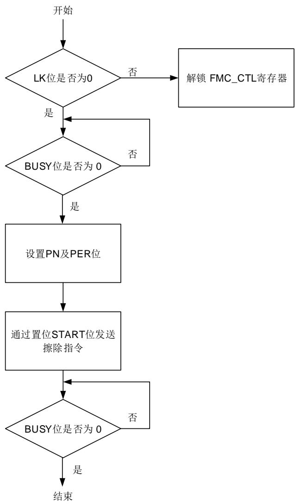
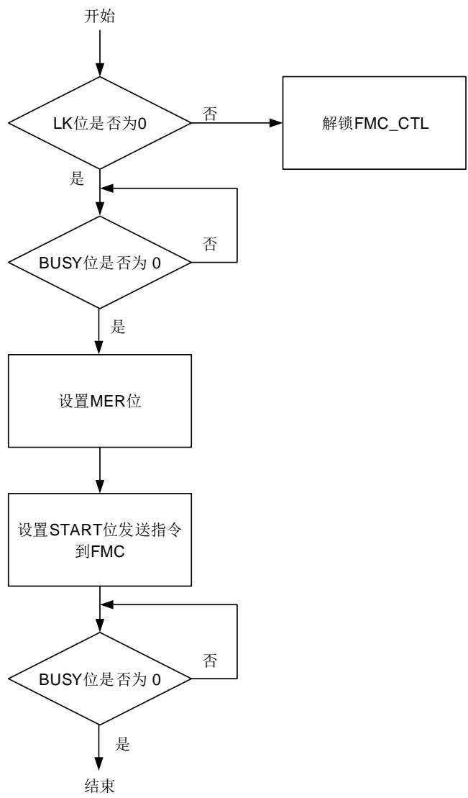
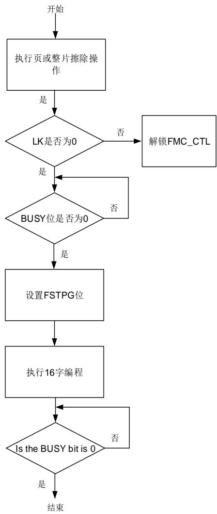
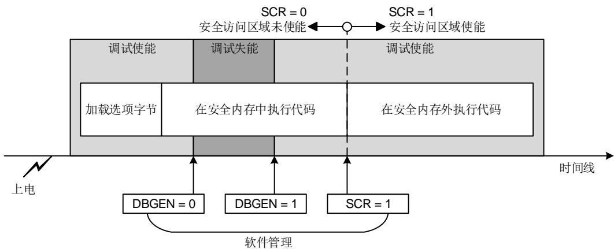

## 2. 闪存控制器（FMC）

## 2.1. 简介

闪存控制器（FMC），提供了片上闪存需要的所有功能。在主闪存空间内，CPU执行指令需要少量等待时间。FMC提供了页擦除，整片擦除，编程操作，读写保护，以及闪存安全机制等。

## 2.2. 主要特性

◼ 高达64KB字节的片上闪存可用于存储指令或数据，高达1KB一次性编程块，3KB信息块。主闪存块：64KB。

- 信息块：3KB。

- 一次性编程块：1KB。

- 选项字节块：128B。

◼ 在闪存空间内，CPU执行指令和读取数据需要0~1个等待时间。

◼ 闪存支持64位宽数据读取；

◼ 预取缓冲区以加速读操作。

◼ 指令缓存：2条64位的ICode缓存线（16字节RAM）

◼ 支持64位双字编程，页擦除和整片擦除操作。

◼ 1K字节OTP块（一次性编程），用于存储用户数据。

◼ 大小为128字节的选项字节可根据用户需求配置。

◼ 在上电复位后，选项字节被上载到选项字节控制寄存器。

◼ 具有安全保护状态，可阻止对代码或数据的非法读访问。

◼ 具有 2 块仅执行的专用代码读保护区域

◼ 提供页擦除/写保护功能（WP）。

◼ 提供用户安全区（SCR）。

## 2.3. 功能说明

## 2.3.1. 闪存结构

主存储闪存高达 64KB，由 64 页组成，每页 1KB，还包含 3KB的用于引导装载程序的信息块。主存储闪存的每页都可以单独擦除。基地址和大小如 2-1. 所示。

表 2-1. 闪存基地址和构成

<table><tr><td>闪存块</td><td>名称</td><td>地址范围</td><td>大小(字节)</td></tr><tr><td rowspan="5">主存储闪存块</td><td>第0页</td><td>0x0800 0000 - 0x0800 03FF</td><td>1KB</td></tr><tr><td>第1页</td><td>0x0800 0400 - 0x0800 07FF</td><td>1KB</td></tr><tr><td>第2页</td><td>0x0800 0800 - 0x0800 0BFF</td><td>1KB</td></tr><tr><td>.</td><td>.</td><td>.</td></tr><tr><td>.</td><td>.</td><td>.</td></tr><tr><td rowspan="2"></td><td>.</td><td>.</td><td>.</td></tr><tr><td>第63页</td><td>0x0800 FC00 - 0x0800 FFFF</td><td>1KB</td></tr><tr><td>信息块</td><td>引导装载程许(1)</td><td>0x1FFF 0000 - 0x1FFF 0BFF</td><td>3KB</td></tr><tr><td>选项字节块</td><td>选项字节</td><td>0x1FFF 7800 - 0x1FFF 787F</td><td>128B</td></tr><tr><td>一次性编程块</td><td>一次性编程字节(2)</td><td>0x1FFF 7000~0x1FFF 73FF</td><td>1KB</td></tr></table>

注意：1.信息块存储了引导装载程序（bootloader），不能被用户编程或擦除。

2.1KB（128双字）OTP（一次性编程）数据区域供用户使用。OTP数据不能被擦除，只能写一次。如果任何位被写为0，则该位所在的整个双字都不能被改写。

## 2.3.2. 错误检查与纠正（ECC）

ECC机制支持：

◼ 单个位错误检测和纠错

◼ 双位错误检测

当单个位错误被检测与纠正时：

◼ 当ECC错 误 发 生 时 ，FMC_ECCCS寄 存 器 中 的ECCCOR位 将 置 位 。 如 果 设 置 了FMC_ECCCS寄存器中的ECCCORIE位，则会产生对应中断。ECCADDR表示各个存储空间出现ECC错误的地址。向FMC_ECCCS寄存器ECCCOR位写1可以清除ECCCOR位。

当检测到双位错误时：

◼ 当ECC错误发生时，FMC_ECCCS寄存器中的ECCDET位将置位。如果设置了FMC_ECCCS寄存器中的ECCDETIE位，则会产生NMI中断。ECCADDR位表示各个存储空间出现ECC错误的地址。数据返回全F。向FMC_ECCCS寄存器ECCDET位写1可以清除ECCDET位。

## 注意：

1. 当启用ECC功能时，闪存中的数据是按72位存储的，每双字（64位）后增加了8位纠错码。但增加的8位纠错码由硬件自动计算，用户不可访问。

2. 对于原始数据0xFF FFFF FFFF FFFF FFFF，不支持ECC。

3. 当出现新的ECC错误时，ECCADDR会更新为最新的错误地址。

4. 当上报ECC错误时，如果数据仍然存在于当前的缓冲区或预取缓冲区中，即使清除ECCCOR和ECCDET，重新读取该错误地址也不会产生ECC错误。

5. 预取buffer读取数据或指令也可能生成ECC错误，即使数据或指令未被CPU使用。为了正确显示ECC错误地址寄存器的值，需禁用预取功能；否则，显示的错误地址可能会因为预取而往前推。

6. 当编程原始数据为全F时，ECC计算会bypass本次操作。不需要擦除，再次编程其他值可正常写入。

## 2.3.3. 主闪存空校验

闪存接口提供主闪存空校验机制，该机制通过检查主闪存的第一个位置是否已被编程来实现。这个空校验状态的结果可以从 FMC_WS 寄存器的 MFPE 位读取。与 boot0 和 boot1 信息结合使用，用于确定系统从何处启动。它防止系统在没有用户代码时从主闪存区启动。软件可以通过在 FMC_WS 寄存器的 MFPE 位上写入适当的值来修改主闪存的空状态。

## 2.3.4. 读操作

闪存可以像普通存储空间一样直接寻址访问。对闪存取指令和取数据使用CPU的CBUS总线。

增加等待状态

读取闪存时，需要根据 AHB 时钟频率正确配置 FMC_WS 寄存器中的 WSCNT 位。WSCNT与 AHB 时钟频率的关系如 2-2. WSCNT AHB 所示。

表 2-2. WSCNT 与 AHB 时钟频率对应关系

<table><tr><td>AHB时钟频率</td><td>WSCNT配置</td></tr><tr><td>&lt;= 24MHz</td><td>0(添加0个等待状态)</td></tr><tr><td>&lt;= 48MHz</td><td>1(添加1个等待状态)</td></tr></table>

如果发生系统复位，AHB时钟频率为12MHz，此时WSCNT置为0。

## 注意：

1. 如果希望增加 AHB 时钟频率。首先，参考 2-2. WSCNT AHB ，根据目标 AHB 时钟频率配置 WSCNT 位。然后，增加 AHB 时钟频率至目标频率。禁止在配置 WSCNT 位之前增加 AHB时钟频率。

2. 如果希望降低 AHB 时钟频率。首先，降低 AHB 时钟频率至目标频率。然后，参考 2-2.WSCNT AHB ，根据目标 AHB 时钟频率配置 WSCNT 位。禁止在降低 AHB 时钟频率之前配置 WSCNT 位。

由于添加了等待状态，读效率较低（例如：48MHz 时需添加 1 个等待状态）。为了加速读操作，需要用到以下功能。

## 当前缓存区

当前缓存区总是被使能的。每次从闪存中读取数据时，当前缓存区可以缓存 64 位数据。因为CPU 每次读操作只需要 32 位或 16 位数据。因此在顺序代码下，CPU 所需数据可以从当前缓存区获取而不必重复从闪存中获取。

## 预取缓存区

置位 FMC_WS 寄存器中 PFEN 位来使能预取缓存区。在顺序代码下，当 CPU 执行来自当前缓存区的数据时（64 位），按 32 位执行时需要至少 2 个时钟周期，按 16 位执行时需要至少 4个时钟周期。在这种情况下，从 flash 闪存中预取下一个双字地址的数据并存储在预取缓存区。当 CPU 执行完当前缓存区的数据时，预取缓存区提供下次需要执行的数据。

## 指令缓存区

置位 FMC_WS 寄存器中 ICEN 位来使能指令缓存区。指令缓存区仅在 CBUS 取数据时使用。指令缓存区为 16 个字节，由 2 条缓存线组成，每条缓存线为 64 位。

当指令在指令缓存区时（缓存命中），CPU 从指令缓存区读取指令无延迟。当指令不在指令缓存区并且也不在当前缓存区/预取缓存区时（缓存未命中），指令缓存区从闪存中读取指令并复制到指令缓存区。当所有指令缓存线被填充，LRU（最近最少使用）策略被用于转移指令缓存线中的代码。

## 2.3.5. FMC_CTL/FMC_OBCTL 寄存器解锁

复位后，FMC_CTL 寄存器进入锁定状态，该寄存器中的 LK 位为 1。通过先后向 FMC_KEY寄存器写入 0x45670123 和 0xCDEF89AB，可以使得 FMC_CTL 解锁。两次写操作后，FMC_CTL 寄存器的 LK 位被硬件清 0。可以通过软件设置 FMC_CTL 寄存器的 LK 位为 1 再次锁定 FMC_CTL 寄存器。任何对 FMC_KEY 寄存器的错误操作都会将 LK位置 1，从而锁定FMC_CTL 寄存器，并引发一个总线错误。

FMC_OBCTL 寄存器、FMC_CTL 中的 OBRLD 位和 OBSTART 位在 FMC_CTL 被解锁后仍然处于被保护状态。解锁过程为两次写操作，向 FMC_OBKEY 寄存器先后写入 0x08192A3B和 0x4C5D6E7F，然后硬件将 FMC_CTL 寄存器中的 OBLK 位清零。软件可以将 FMC_CTL的 OBLK 位置 1 来锁定 FMC_OBCTL 寄存器、FMC_CTL 中的 OBRLD 位和 OBSTART 位。

## 2.3.6. 页擦除

FMC 的页擦除功能使得主存储闪存的页内容初始化为高电平。每一页都可以被独立擦除，而不影响其他页内容。页擦除页操作，寄存器设置具体步骤如下：

◼ 确保 FMC_CTL 寄存器不处于锁定状态。

检查FMC_STAT寄存器的BUSY位来判定闪存是否正处于擦写访问状态，若BUSY位为1，则需等待该操作结束，BUSY位变为0。

◼ 选择要擦除的页（PN）。

◼ 将页擦除命令写入到FMC_CTL寄存器的PER位。

◼ 通过将FMC_CTL寄存器的START位置1来发送页擦除命令到FMC。

◼ 等待擦除指令执行完毕，FMC_STAT寄存器的BUSY位清0。

◼ 如果需要，使用CBUS读并验证该页是否擦除成功。

当页擦除操作成功执行时，FMC_STAT 寄存器中的 ENDF 将被置位。如果 FMC_CTL 寄存器中的 ENDIE位被置位，FMC 将触发中断。需要注意的是，用户需确保写入的是正确的擦除页，否则当待擦除页的地址被用来取指令或访问数据时，软件将会“跑飞”。该情况下，FMC 不会有任何出错提示。另一方面，对擦写保护的页进行擦除操作将无效。此时如果 FMC_CTL 寄存器中的 ERRIE 位置位，则 FMC 将触发闪存操作错误中断。软件可以在中断处理程序中检查FMC_STAT 寄存器中的 WPERR 位来检测这种情况。页擦除操作流程如 2-1.所示。

图 2-1. 页擦除操作流程

## 2.3.7. 整片擦除

FMC提供了整片擦除功能可以初始化主存储闪存块的内容。整片擦除操作，寄存器设置具体步骤如下：

◼ 确保FMC_CTL寄存器不处于锁定状态。

◼ 检查FMC_STAT寄存器的BUSY位来判定闪存是否正处于擦写访问状态，若BUSY位为1，则需等待该操作结束，BUSY位变为0。

◼ 将整片擦除命令写入到FMC_CTL寄存器的MER位。

◼ 通过将FMC_CTL寄存器的START位置1来发送整片擦除命令到FMC。

◼ 等待擦除指令执行完毕，FMC_STAT寄存器的BUSY位清0。

◼ 如果需要，使用CBUS读并验证是否擦除成功。

当整片擦除成功执行，FMC_STAT 寄存器的 ENDF 位置位。若 FMC_CTL 寄存器的 ENDIE 位被置 1，FMC 将触发一个中断。由于所有的闪存数据都将被复位为 0xFFFF FFFF，可以通过运行在 SRAM 中的程序或使用调试工具直接访问 FMC 寄存器来实现整片擦除操作。整片擦除操作流程如 2-2. 所示

图 2-2. 整片擦除操作流程

## 2.3.8. 主闪存编程

FMC 提供了用于修改主闪存的双字编程功能（2 x 32 位）。下面的步骤显示了编程操作的寄存器设置顺序。

◼ 确保FMC_CTL寄存器不处于锁定状态。

◼ 检查FMC_STAT寄存器的BUSY位来判定闪存是否正处于擦写访问状态，若BUSY位为1，则需等待该操作结束，BUSY位变为0。

◼ 置位FMC_CTL寄存器的PG位。

◼ SBUS将待编程数据写入到绝对地址（0x08XX XXXX）。SBUS写入2次组成一个64位数据，然后将64位数据写入到闪存。待编程数据必须双字对齐

◼ 等待编程指令执行完毕，FMC_STAT寄存器的BUSY位清0。

◼ 如果需要，使用SBUS读并验证是否编程成功。

当主存储块编程执行成功时，FMC_STAT 寄存器中的 ENDF 置位，如果 FMC_CTL 寄存器中的 ENDIE 位置位，FMC 将触发中断。双字编程操作之前需要检查目的地址是否已经被擦除。

如果该地址没有被擦除，即使编程 0x0，FMC_STAT 寄存器的 PGERR 位也将被置 1。另外，在擦写保护页上的编程操作会被忽略，同时 FMC_STAT 中的 WPERR 位将置位。在这些情况下，如果 FMC_CTL 寄存器中的 ERRIE 位被置位，则 FMC 将产生一个闪存操作错误中断。软件可以检查 FMC_STAT 寄存器中的 PGERR、PGSERR、PGMERR、PGAERR 和 RPERR位，以检测出现哪种错误。主闪存块双字编程操作流程如 2-3. 所示。

图 2-3. 双字编程操作流程

注意：当编程/擦除操作正在进行时，应避免读取闪存。

如果编程/擦除操作被掉电、复位等意外中断，闪存中的内容将无法保证并处在一种不确定的状态。因此，应采取适当的措施，以避免由于程序中断/擦除而造成数据丢失。

## 2.3.9. 主闪存快速编程

FMC提供快速编程功能，用于修改主闪存内容。在这种模式下，一行（16字 = 64字节）可一次编程到主闪存中，因为在编程前无需对闪存位置进行验证，避免了每个字的高电压上升和下降时间，从而减少了页编程时间。在快速编程时，闪存时钟（HCLK）频率至少为8MHz。

下面的步骤说明了快速编程操作寄存器的访问顺序：

◼ 执行一次页或整片擦除。否则PGSERR将会被置位。

◼ 确保FMC_CTL寄存器不处于锁定状态。

检查FMC_STAT寄存器的BUSY位来判定闪存是否正处于擦写访问状态，若BUSY位为1，

则需等待该操作结束，BUSY位变为0。

◼ 置位FMC_CTL寄存器的FSTPG位。

◼ 向要编程的绝对地址（0x08XX XXXX）处写入一行数据（16个字）。

◼ 等待所有编程指令执行完毕，FMC_STAT寄存器的BUSY位清0。

在快速编程中：如果要编程的数据与之前编程的字不在同一行，或者要编程的地址不大于之前的地址，则FMC_STAT中的PGAERR和FSTPERR位将置位，同时将快速编程请求转为普通编程，完成写请求。当操作成功执行时，FMC_STAT寄存器中的ENDF位将被设置，如果FMC_CTL寄存器中的ENDIE位被置位，将产生一个中断。

在后续的快速编程中，如果确认某一行被擦除，则重复以上所有步骤来快速编程下一行。如果不再有编程请求，清除FMC_CTL寄存器中的FSTPG位。

如果在保护页上进行擦除/编程操作，该请求将被忽略，并且FMC_STAT中的WPERR位将被置位。

在这种情况下，如果设置了FMC_CTL寄存器的ERRIE位，则会产生闪存操作的错误中断。软件可以检查FMC_STAT寄存器中的PGSERR / PGAERR / WPERR / PGERR位，以检测中断处理程序中发生的以上哪种情况。快速编程操作流程如 2-4. 所示。

图 2-4. 快速编程操作流程

注意：1.16个字必须连续写。

2.16个字必须对齐。

3.由于快速编程不通过硬件检测闪存中的0xFF，所以必须先软件检测0xFF，不能在两次擦除之间对一行进行两次或多次编程。如果对一行进行两次或两次以上的擦除，可能会发生不可预测的结果。

4.快速编程的代码在SRAM中运行。如果在闪存中运行，由于读取闪存代码，快速编程请求将变成普通编程。

## 2.3.10. OTP 编程

OTP 编程方法与主闪存编程相同。OTP 块只能被编程一次并且不能被擦除。

注意：必须确保在 OTP 编程操作时不会发生任何意外中断，例如系统复位或掉电。如果发生意外中断，闪存中的数据有很小可能性会出错。

## 2.3.11. 选项字节

## 选项字节说明

每次上电复位或在 FMC_CTL 寄存器中 OBRLD 位置 1 后，闪存的选项字节寄存器重新加载到相应选项字节块中，选项字节生效。选项补码字节与选项字节相反。当选项字节重新加载时，如果选项字节补码与选项字节不匹配，则 FMC_STAT 寄存器中的 OBERR 位将被置 1。选项字节详情见下表 2-3. 。

表 2-3. 选项字节

<table><tr><td>地址</td><td>名称</td><td>出厂值</td><td>说明</td></tr><tr><td>0x1fff 7800</td><td>OB_SPC[7:0]</td><td>0xA5</td><td>选项字节安全保护值0xA5:未保护状态0xCC:保护级别高除0xA5和0xCC外的任何值:保护级别低</td></tr><tr><td>0x1fff 7801</td><td>OB_USER[7:0]</td><td>0xFE</td><td>[7]:保留[6]:nRST_STDBY0:进入待机模式时产生复位1:进入待机模式时不产生复位[5]:nRST_DPSLP0:进入深度睡眠模式时产生复位1:进入深度睡眠模式时不产生复位[4:3]:BORF_TH00:BOR下降等级1,阈值在2.0V左右01:BOR下降等级2,阈值在2.2V左右10:BOR下降等级3,阈值在2.5V左右11:BOR下降等级4,阈值在2.8V左右[2:1]:BORR_TH00:BOR上升等级1,阈值在2.1V左右01:BOR上升等级2,阈值在2.3V左右10:BOR上升等级3,阈值在2.6V左右11:BOR上升等级4,阈值在2.9V左右[0]:BORST_EN0:电压波动复位失能,上电复位由POR/PDR级别定义1:电压波动复位使能,阈值参考BORR_TH和BORF_TH</td></tr><tr><td>0x1fff 7802</td><td>OB_USER[15:8]</td><td>0xFF</td><td>[7]:保留[6]:SRAM_ECCEN0:SRAMECC使能1:SRAMECC失能[5]:HXTAL_REMAP0:重映射使能1:重映射失能[4]:保留[3]:nWWDG_HW0:硬件窗口看门狗1:软件窗口看门狗[2:1]:保留[0]:nFWDG_HW0:硬件独立看门狗1:软件独立看门狗</td></tr><tr><td>0x1fff 7803</td><td>OB_USER[23:16]</td><td>0xFF</td><td>[7:5]:保留[4:3]:NRST_MDSEL00:保留01:NRST引脚上的低电平可以复位系统,内部复位不能驱动NRST引脚10:NRST引脚功能与普通GPIO相同,只有内部复位11:NRST引脚配置为复位输入/输出模式[2]:nBOOT00:BOOT0为11:BOOT0为0[1]:nBOOT10:BOOT1为11:BOOT1为0它与BOOT0引脚共同决定boot模式[0]:SWBT00:BOOT0取决于PA14/BOOT0引脚1:BOOT0取决于nBOOT0选项位</td></tr><tr><td>0x1fff 7804</td><td>OB_SPC_N</td><td>0x5A</td><td>OB_SPC补码字节</td></tr><tr><td>0x1fff 7805</td><td>OB_USER_N[7:0]</td><td>0x01</td><td>OB_USER补码字节7到0位</td></tr><tr><td>0x1fff 7806</td><td>OB_USER_N[15:8]</td><td>0x00</td><td>OB_USER补码字节15到8位</td></tr><tr><td>0x1fff 7807</td><td>OB_USER_N[23:16]</td><td>0x00</td><td>OB_USER补码字节23到16位</td></tr><tr><td>0x1fff 7808</td><td>DCRP0_SADDR</td><td>0xFF</td><td>[6:0]:DCRP区域0起始地址</td></tr><tr><td>0x1fff 780c</td><td>DCRP0_SADDR_N</td><td>0x00</td><td>DCRP0_SADDR补码字节6到0位</td></tr><tr><td>0x1fff 7810</td><td>DCRP0_EADDR</td><td>0x00</td><td>[6:0]:DCRP区域0结束地址</td></tr><tr><td>0x1fff 7813</td><td>DCRP_EREN</td><td>0xFF</td><td>[7]:DCRP_EREN0:当SPC等级从1降低到0时,DCRP不会被擦除1:当SPC等级从1降低到0时,DCRP会被擦除[6:0]:保留</td></tr><tr><td>0x1fff 7814</td><td>DCRP0_EADDR_N</td><td>0xFF</td><td>DCRP0_EADDR 补码字节6到0位</td></tr><tr><td>0x1fff 7817</td><td>DCRP_EREN_N</td><td>0x00</td><td>DCRP_EREN 补码字节第7位</td></tr><tr><td>0x1fff 7818</td><td>WP0_SADDR</td><td>0xFF</td><td>[5:0]: WP0_SADDR 表示WP区域0的第一页</td></tr><tr><td>0x1fff 781a</td><td>WP0_EADDR</td><td>0x00</td><td>[5:0]: WP0_EADDR 表示WP区域0的最后一页</td></tr><tr><td>0x1fff 781c</td><td>WP0_SADDR_N</td><td>0x00</td><td>WP0_SADDR 补码字节5到0位</td></tr><tr><td>0x1fff 781e</td><td>WP0_EADDR_N</td><td>0xFF</td><td>WP0_EADDR 补码字节5到0位</td></tr><tr><td>0x1fff 7820</td><td>WP1_SADDR</td><td>0xFF</td><td>[5:0]: WP1_SADDR 表示WP区域1的第一页</td></tr><tr><td>0x1fff 7822</td><td>WP1_EADDR</td><td>0x00</td><td>[5:0]: WP1_EADDR 表示WP区域1的最后一页</td></tr><tr><td>0x1fff 7824</td><td>WP1_SADDR_N</td><td>0x00</td><td>WP1_SADDR 补码字节5到0位</td></tr><tr><td>0x1fff 7826</td><td>WP1_EADDR_N</td><td>0xFF</td><td>WP1_EADDR 补码字节5到0位</td></tr><tr><td>0x1fff 7828</td><td>DCRP1_SADDR</td><td>0xFF</td><td>[6:0]: DCRP 区域1起始地址</td></tr><tr><td>0x1fff 782c</td><td>DCRP1_SADDR_N</td><td>0x00</td><td>DCRP1_SADDR 补码字节6到0位</td></tr><tr><td>0x1fff 7830</td><td>DCRP1_EADDR</td><td>0x00</td><td>[6:0]: DCRP 区域1结束地址</td></tr><tr><td>0x1fff 7834</td><td>DCRP1_EADDR_N</td><td>0xFF</td><td>DCRP1_EADDR 补码字节6到0位</td></tr><tr><td>0x1fff 7870</td><td>SCR_PAGE_CNT</td><td>0x00</td><td>[6:0]: 配置安全用户区域的页数</td></tr><tr><td>0x1fff 7872</td><td>BOOTLK</td><td>0x00</td><td>[0]: 该位置1后强制从用户闪存区启动0: 支持闪存,RAM和系统启动1: 只能从主闪存启动</td></tr><tr><td>0x1fff 7874</td><td>SCR_PAGE_CNT_N</td><td>0xFF</td><td>SCR_PAGE_CNT 补码字节6到0位</td></tr><tr><td>0x1fff 7876</td><td>BOOTLK_N</td><td>0xFF</td><td>BOOTLK 补码字节位0</td></tr></table>

## 选项字节编程

编程操作流程如以下步骤所示：

◼ 确保FMC_CTL寄存器不处于锁定状态。

◼ 检查FMC_STAT寄存器的BUSY位来判定闪存是否正处于擦写访问状态，若BUSY位为1，则需等待该操作结束，BUSY位变为0。

◼ 将正确的序列写入FMC_OBKEY寄存器来解锁FMC_CTL寄存器中的OBLK位。

◼ 等待FMC_CTL寄存器的OBLK位清0。

◼ 在选项字节寄存器中写选项字节值到对应的寄存器地址。

◼ 置位FMC_CTL寄存器中的OBSTART位来发送选项字节编程命令。

◼ 检查FMC_STAT寄存器中BUSY位的值，若BUSY位为1，则需等待该操作结束。

◼ 启动系统上电/下电复位（或从待机模式退出）或设置FMC_CTL寄存器中的OBRLD位来加载到选项字节。

## 注意：

1.一旦执行了一个选项字节的修改，首先用户选项字节将自动擦除。当操作执行成功时，FMC_STAT 寄存器中的 ENDF 被置位，如果 FMC_CTL 寄存器中的 ENDIE 位被置位，FMC将触发中断。

2.Bits 63:32 是 Bits 31:0 的补码。每个选项字节位在相应的补码中都有它的补位。只有当选项字节与其补码匹配时，才可以将选项字节写入相应的寄存器。

3. 如果选项字节与它的补码不匹配，则 FMC_STAT 寄存器中的 OBERR 位将置位。选项字节被强制转换为以下值:

所有的 OB_USER 字节都强制置为 0xFF，除了 BORST_EN 为 0（电压波动复位失能）。WP页的状态为“无保护”，DCRP 的状态是“所有区域受保护”，BOOTLK 为 1（仅从主闪存启动）。

## 2.3.12. 仅执行区域（DCRP）

在主闪存块中，FMC 可以定义仅可执行区域，只允许来自系统的指令事务，而不允许数据访问。DCRP区域具有 512 字节的子页粒度。

注意：当使用仅可执行区域功能时，用户需要相应地使用仅执行选项去编译其原生代码。

DCRP区域 x（x = 0，1）由起始地址偏移量和结束地址偏移量来定义：

◼ 从基地址+ [DCRPx_SADDR x 0x200]（包含）到基地址 +地址[（DCRPx_EADDR+ 1）x 0x200]（不包含）。最小 DCRP 区域大小为两个 DCRP 子页 2×512 字节。

例如，通过 DCRP 保护从地址 0x0800 0A00（包含）到地址 0x0800 17FF（包含），选项字节必须设置如下:

◼ FMC_DCRPx_SADDR = 0x05 

$$
F M C \_ D C R P x \_ E A D D R = 0 x 0 B
$$

在此区域执行代码时，将忽略调试事件。只有 CPU 可以访问 DCRP区域，只使用指令读取任务。在所有其他情况下，访问 DCRP区域都是非法的。例如，读操作将返回 0 并置位 FMC_STAT寄存器中的 RPERR 标志，而写操作将被忽略并置位 FMC_STAT 寄存器中的 WPERR 标志。

DCRP 区域受擦除保护，无法擦除该区域内的页。如果设置了有效的 DCRP 区域，则除非执行 SPC 保护等级低到无保护状态的降级擦除，否则无法执行整片擦除。

只有 CPU 可以修改 DCRP 区域定义位和 DCRP_EREN 位。如果 DCRP 区域有效，在 SPC等级低到无保护降级期间，DCRP_EREN 位置 0，则 DCRP 区域不被擦除，否则该区域将被擦除。

## 2.3.13. 页擦除/编程保护（WP）

FMC 提供页擦除/编程保护功能以防止对闪存进行的误操作。在受保护的页上，FMC 不会接受页擦除或编程操作。如果将页擦除或编程命令发送到 FMC 受保护的页上，那么 FMC_STAT 寄存器中的 WPERR 位将被 FMC 置位。WP 区域由起始地址偏移量和结束地址偏移量定义。页保护功能可以通过配置 WP 地址寄存器单独启用：FMC_WPx（x = 0，1）。

可以在主闪存中以 1 Kbytes 的粒度定义两个 WP区域。WP 区域定义如下:

◼ 从基地址 + [（WPx_SADDR） x 0x400]（包含）到基地址 + [（WPx_EADDR + 1） x0x400]（不包含）。

例如，通过 WP 从地址 0x0800 2000（包含）保护到地址 0x0800 2FFF（包含），选项字节设置如下：

$$
\text { WPx\_SADDR } = 0 x 0 8
$$

$$
W P x \_ E A D D R = 0 x 0 B
$$

擦除/编程保护页不能被擦除或编程。因此，如果页是受擦除/编程保护的，则无法进行大规模擦除。

如果安全保护（SPC）级别设置为高，则 WP 区域不能修改，否则 WP区域可以无限制地修改注意：DCRP 或安全用户区是擦除/编程保护的。

## 2.3.14. 安全保护（SPC）

FMC 提供了一个安全保护功能来阻止非法的指令/数据读取闪存。此功能可以很好地保护软件和固件免受非法的用户操作。

安全保护等级划分为以下三种：

未保护状态：当将 OB_SPC 字节及其补字节被设置为 0xA55A，系统复位以后，闪存将处于非安全保护状态。主存储块和选项字节可以被所有操作模式访问。

低等级保护：当设置 OB_SPC 字节值为任何除 0xA5 或 0xCC 外的值，系统复位以后，低安全保护状态生效。注意，如果在调试器保持连接到 JTAG/SWD 设备时执行了 SPC 修改，则应该进行电源重置，而不是系统重置。在低等级保护下，主闪存只能通过用户代码访问。在调试模式下，从 SRAM 或引导加载程序模式启动，禁止对主闪存进行所有操作。如果在调试模式、从 SRAM 启动或引导加载程序模式下对主闪存进行读操作，则会产生总线错误。如果在调试模式、从SRAM引导或从引导加载程序引导模式下对主闪存进行编程/擦除操作，则FMC_STAT寄存器中的 WPERR 位将被置 1。但这些模式下都可以对选项字节进行操作，从而可以通过该方式失能安全保护功能。通过将 OB_SPC 字节及其补码值设置为 0xA55A，返回到无保护级别，然后自动触发一次主闪存和数据闪存的擦除操作。注意如果配置了低级别保护且没有定义DCRP 区域，则必须设置 DCRP_EREN 位。

高等级保护：将 OB_SPC 字节及其补字节设置为 0xCC33 时，激活高等级安全保护。当选择该保护等级时，调试模式，从 SRAM 中启动，或者从 boot loader 启动都被禁止。主闪存块可由用户代码的所有操作进行访问。用户选项位只能读取，但不能修改。也可以进入其他安全区域。OB_SPC 字节及其补字节禁止再次编程。所以，如果高等级保护被激活，将不能再降回到低等级保护或未保护状态。

## 2.3.15. 安全用户区域（SCR）

在主闪存块中，FMC 可以定义安全用户区域，这些安全用户区域只能在引导时执行一次，除非发生复位，否则不会再次执行。

安全用户区域可以将安全代码与应用程序非安全代码隔离开来。安全用户区域可用于保护自定义安全引导库、固件更新代码或第三方安全库。当使能了安全区域（FMC_CTL 寄存器中的 SCR置位）时，对 SCR 区域的擦除操作将设置 FMC_STAT 寄存器中的 WPERR 位，写操作将在设置 WPERR 位后立即触发硬故障异常，对 SCR 区域的读操作将产生一个总线故障而不设置RDERR 位。

安全用户区域的大小由 FMC_SCR 寄存器的 SCR_PAGE_CNT[6:0]位定义。只能在 SPC 级为无保护下修改。安全用户区域的内容在从 OB_SPC 低保护等级更改为无保护等级时被擦除，即使它与 DCRP 页重叠。

安全用户区域定义如下：

◼ 从基地址（0x0800 0000）到基地址+ [SCR_PAGE_CNT x 0x400]（不包含）。

## 2.3.16. 禁用内核调试访问

FMC提供了一种临时禁用对内核调试访问的方法，以执行敏感代码或操作安全内存区域中的敏感数据。 2-1. 给出了管理FMC_WS寄存器的DBGEN位和管理FMC_CTL寄存器的SCR位的示例。

图 2-1.禁用内核调试访问示例

## 2.3.17. 强制从闪存启动

FMC_SCR 寄存器中的 BOOTLK 位可以配置强制系统从主闪存引导启动。该位只能在以下情况下复位：

1. SPC 为无保护等级。

2. SPC 为低保护级别，发出无保护等级修改请求后执行了全片擦除。

## 2.3.18. FMC 中断

表 2-1. FMC 中断请求

<table><tr><td>中断事件</td><td>标志</td><td>清除条件</td><td>中断使能位</td></tr><tr><td>操作结束</td><td>ENDF</td><td>写1到ENDF</td><td>ENDIE</td></tr><tr><td>操作失败错误</td><td>OPRERR</td><td>写1到OPRERR</td><td>ERRIE</td></tr><tr><td>读保护错误</td><td>RPERR</td><td>写1到RPERR</td><td>RPERRIE</td></tr><tr><td>写保护错误</td><td>WPERR</td><td>写1到WPERR</td><td>N/A</td></tr><tr><td>编程大小不匹配错误</td><td>PGMERR</td><td>写1到PGMERR</td><td>N/A</td></tr><tr><td>编程错误</td><td>PGERR</td><td>写1到PGERR</td><td>N/A</td></tr><tr><td>编程对齐错误</td><td>PGAERR</td><td>写1到PGAERR</td><td>N/A</td></tr><tr><td>编程顺序错误</td><td>PGSERR</td><td>写1到PGSERR</td><td>N/A</td></tr><tr><td>快速编程错误</td><td>FSTPERR</td><td>写1到FSTPERR</td><td>N/A</td></tr></table>

