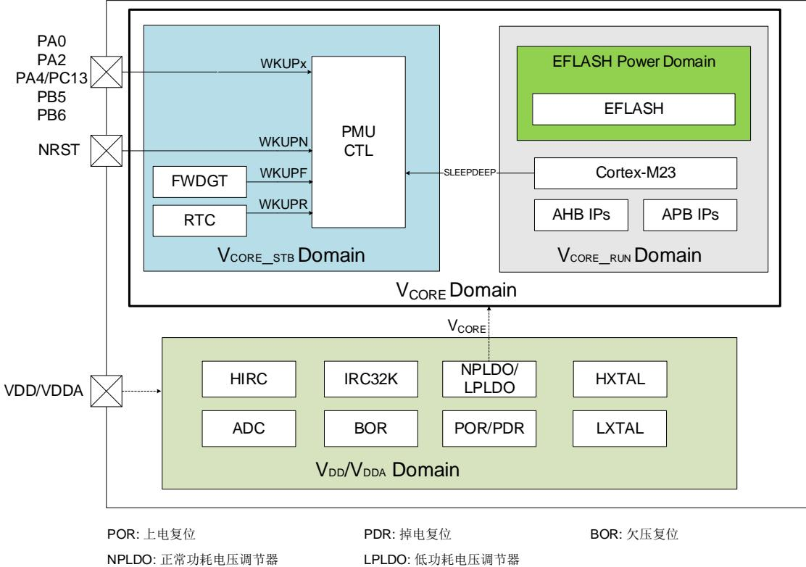
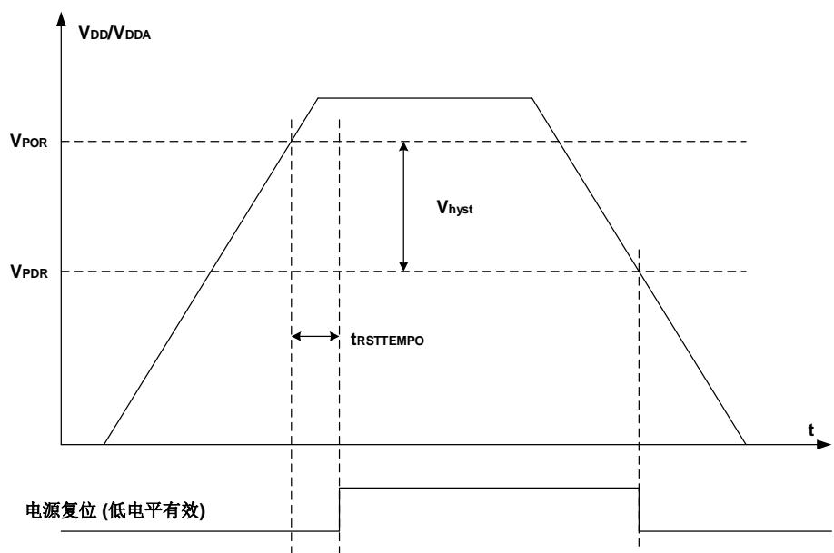
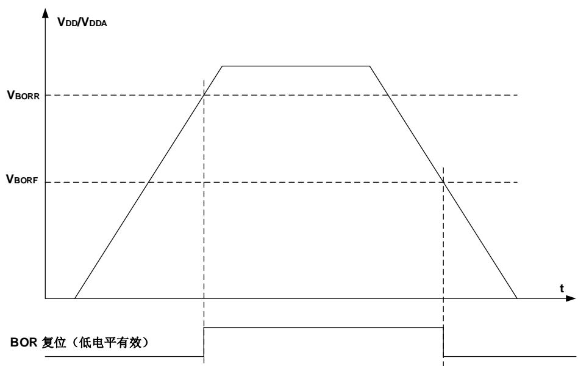
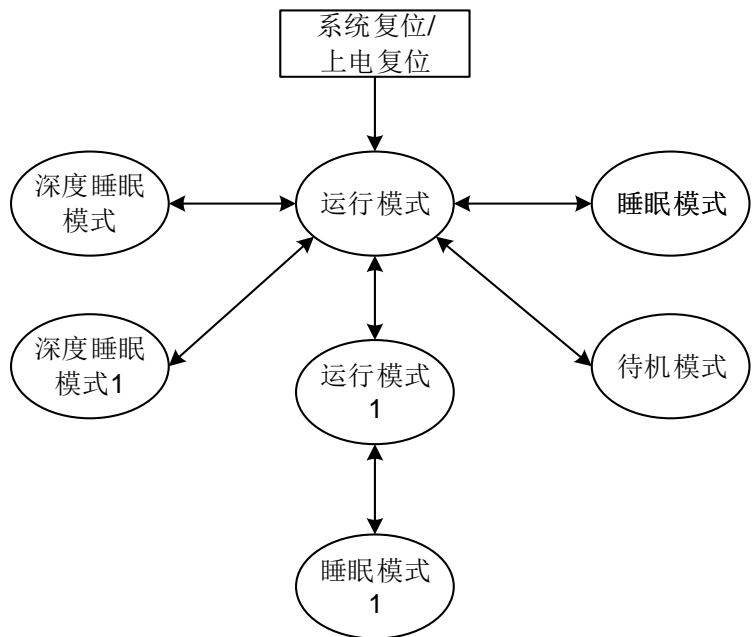

## 3. 电源管理单元（PMU）

## 3.1. 简介

功耗设计是GD32C2x1系列产品比较注重的问题之一。电源管理单元提供了六种省电模式，包括运行模式1，睡眠模式，睡眠模式1，深度睡眠模式，深度睡眠模式1和待机模式。这些模式能减少电源能耗，且使得应用程序可以在CPU运行时间要求、速度和功耗的相互冲突中获得最佳折衷。GD32C2x1系列设备有两个电源域，包括VDD / VDDA域，VCORE域。VDD / VDDA域由电源直接供电。在VDD / VDDA域中嵌入了一个LDO，用来为VCORE域供电。

## 3.2. 主要特征

◼ 两个电源域：V / V 域和V 电源域；

■ 六种省电模式：运行模式1、睡眠模式、睡眠模式1、深度睡眠模式、深度睡眠模式1和待机模式；

◼ 在运行模式、睡眠模式和深度睡眠模式下，内部正常功耗电压调节器（NPLDO）为VCORE电源域提供VCORE电源；

◼ 在运行模式1、睡眠模式1、深度睡眠模1和待机模式下，内部低功耗电压调节器（LPLDO）为VCORE电源域提供VCORE电源；

◼ 在运行模式 / 运行模式1 / 深度睡眠模式 / 深度睡眠模式1下，EFLASH可单独断电；

◼ 提供电压检测器：POR/PDR检测器、BOR检测器。

## 3.3. 功能说明

3-1. 提供了 PMU 及相关电源域的内部结构框图。

图 3-1. 电源域概览

## 3.3.1. VDD / VDDA 电源域

V / V 域包括 HXTAL（高速外部晶体振荡器）、LXTAL（低速外部晶体振荡器）、NPLDO/LPLDO、POR / PDR（上电 / 掉电复位）、BOR（欠压复位）、ADC（A/D 转换器）、HIRC（高速内部 RC 振荡器）、IRC32K（内部 32KHz RC 振荡器）等等。

为 V 域供电的 LDO，其复位后保持使能。可以被配置为 NPLDO 或 LPLDO 的工作状态。NPLDO 为工作模式 / 睡眠模式/ 深度睡眠模式供电，LPLDO 为运行模式 1/ 睡眠模式 1 / 深度睡眠模式 1 和待机模式供电。

POR / PDR（上电 / 掉电复位）电路检测 V / V 并在电压低于特定阈值时产生电源复位信号复位除 V 域之外的整个芯片。 3-2. / 显示了供电电压和电源复位信号之间的关系。V 表示上电复位的阈值电压，V 表示掉电复位的阈值电压，迟滞电压为 Vhyst值。

图 3-2. 上电 / 掉电复位波形图

BOR 电路用于检测 VDD / VDDA。在电压低于选项字节的 BORR_TH 和 BORF_TH 定义的阈值时，BOR 会产生电源复位信号复位除 VCORE_STB域的整个芯片。注意 POR / PDR（上电 / 掉电复位）电路总是处于检测状态。BOR 通过置位选项字节中的 BORST_EN 位使能。 3-3.BOR 显示了供电电压和 BOR 复位信号之间的关系。VBORR和 VBORF表示 BOR 复位的阈值电压，该值在选项字节 BORR_TH 和 BORF_TH 中定义。

图 3-3. BOR 波形图

## 3.3.2. VCORE 电源域

主要功能包括 Cortex®-M23 内核逻辑、AHB / APB 外设、V / V 域的 APB 接口等。当 V电压上电后，POR 将在 VCORE 域中产生一个复位序列。复位完成后，如果要进入指定的省电模式，须先配置相关的控制位，之后一旦执行 WFI 或 WFE指令，设备便进入该省电模式。详

细内容将在以下章节予以说明。

MCU 的数字逻辑有两个电源域。当 MCU 在运行模式/运行模式 1/睡眠模式/睡眠模式 1/深度睡眠模式/深度睡眠模式 1 时，VCORE_RUN域工作。当 MCU 在待机模式时，VCORE_RUN 域掉电。当 MCU 上电后，VCORE_STB域总是上电的。

两个 LDO 能够为数据逻辑域提供 VCORE电压。NPLDO 提供 MCU 运行在全性能模式。LPLDO用于在低性能模式下为 MCU 供电。VCORE电压值请参考数据手册。

## EFLASH电源域

EFLASH 能够独立掉电，系统复位后默认上电。在运行模式/运行模式 1 下，EFLASH 通过置位 PMU_CTL1 寄存器的 EFPSLEEP 位来掉电。当 MCU 进入深度睡眠模式，EFLASH 能够通过置位 PMU_CTL1 寄存器的 EFDSPSLEEP 位来切换。

当仅有 LPLDO 开而 NPLDO 关闭时，EFLASH 无法正常工作。这种情况下，代码应当保存在SRAM 中。

## 3.3.3. 省电模式

系统复位/电源复位或从待机模式唤醒后，MCU 进入运行模式。所有电源域处于供电状态，NPLDO 工作在 1.2V模式。用户可以通过减慢系统时钟（HCLK和 PCLK）或关闭未使用的外设的时钟。此外，六种省电模式可以实现更低的功耗，它们是运行模式 1，睡眠模式，睡眠模式 1，深度睡眠模式，深度睡眠模式 1 和待机模式。

## 运行模式1

在运行模式 1 下，NPLDO 关闭而 LPLDO 开启，系统时钟源必须为 IRC32K。

## 睡眠模式

睡眠模式与 Cortex®-M23 的 SLEEPING 模式相对应。在睡眠模式下，仅关闭 Cortex®-M23 的时钟。如需进入睡眠模式，只要清除 Cortex®-M23 系统控制寄存器中的 SLEEPDEEP 位，并执行一条 WFI 或 WFE 指令即可。如果睡眠模式是通过执行 WFI 指令进入的，任何中断都可以唤醒系统。如果睡眠模式是通过执行 WFE 指令进入的，任何唤醒事件都可以唤醒系统（如果 SEVONPEND 为 1，任何中断都可以唤醒系统，请参考 Cortex®-M23 技术手册）。由于无需在进入或退出中断上消耗时间，该模式所需的唤醒时间最短。

根据 Cortex®-M23 中 SCR（系统控制寄存器）的 SLEEPONEXIT 位，有两种睡眠进入机制可选：

◼ Sleep-now：如果SLEEPONEXIT位被清零，一旦执行WFI或WFE指令，MCU立即进入睡眠模式；

■ Sleep-on-exit：如果SLEEPONEXIT位被置位，当系统从最低优先级的中断处理程序离开后，MCU立即进入睡眠模式。

## 睡眠模式1

睡眠模式 1 对应于运行模式 1 的 Cortex®-M23 的 SLEEPING 模式。在该模式下，NPLDO 关闭而 LPLDO 开启，系统时钟源为 IRC32K。

## 深度睡眠模式

深度睡眠模式与 Cortex®-M23 的 SLEEPDEEP 模式相对应。在深度睡眠模式下，VCORE_RUN域中的所有时钟全部关闭，HIRC 和 HXTAL 也全部被禁用。SRAM 和寄存器中的内容被保留。NPLDO 开启。进入深度睡眠模式之前，先将 Cortex®-M23 系统控制寄存器的 SLEEPDEEP 位置 1，再将 PMU_CTL0 寄存器的 LPMOD 位域配置为“00”，然后执行 WFI 或 WFE 指令即可进入深度睡眠模式。如果睡眠模式是通过执行 WFI 指令进入的，任何来自 EXTI 的中断可以将系统从深度睡眠模式中唤醒。如果睡眠模式是通过执行 WFE 指令进入的，任何来自 EXTI 的事件可以将系统从深度睡眠模式中唤醒（如果 SEVONPEND 为 1，任何来自 EXTI 的中断都可以唤醒系统，请参考 Cortex®-M23 技术手册）。当退出深度睡眠模式时，HIRC 被选中作为系统时钟。

注意：为了顺利进入深度睡眠模式，所有 EXTI 线上的挂起状态（在 EXTI_PD 寄存器中）和相关外设标志位必须被复位，参考 5-3. EXTI 。否则，程序将直接跳过深度睡眠模式进入过程而继续执行下面的程序。

## 深度睡眠模式1

深度睡眠模式 1 与 Cortex®-M23 的 SLEEPDEEP 模式相对应。在深度睡眠模式 1 下，VCORE_RUN域中的所有时钟全部关闭，HIRC 和 HXTAL 也全部被禁用。NPLDO 关闭而 LPLDO 开启。SRAM 和寄存器中的内容被保留。进入深度睡眠模式 1 之前，先将 Cortex®-M23 系统控制寄存器的 SLEEPDEEP 位置 1，再将 PMU_CTL0 寄存器的 LPMOD 位域配置为“01”,然后执行 WFI 或 WFE 指令即可进入深度睡眠模式 1。如果睡眠模式是通过执行 WFI 指令进入的，任何来自 EXTI 的中断可以将系统从深度睡眠模式 1 中唤醒。如果睡眠模式是通过执行 WFE 指令进入的，任何来自 EXTI 的事件可以将系统从深度睡眠模式 1 中唤醒（如果 SEVONPEND为 1，任何来自 EXTI 的中断都可以唤醒系统，请参考 Cortex®-M23 技术手册）。当退出深度睡眠模式 1 时，HIRC 被选中作为系统时钟。

注意：为了顺利进入深度睡眠模式，所有 EXTI 线上的挂起状态（在 EXTI_PD 寄存器中）和相关外设标志位必须被复位，参考 5-3. EXTI 。否则，程序将直接跳过深度睡眠模式进入过程而继续执行下面的程序。

## 待机模式

待机模式是基于 Cortex®-M23 的 SLEEPDEEP 模式实现的。在待机模式下，整个 V域全部掉电，NPLDO 关闭，HIRC 和 HXTAL 也会被关闭。进入待机模式前，先将 PMU_CTL0寄存器的 LPMOD 位域配置为“11”，再清除 PMU_CS 寄存器的 WUF 位，再将 Cortex®-M23系统控制寄存器的 SLEEPDEEP 位置 1，然后执行 WFI 或 WFE 指令，系统进入待机模式。PMU_CS寄存器的 STBF 位状态表示 MCU 是否已进入待机模式。待机模式有四个唤醒源，包括来自 NRST 引脚的外部复位，RTC 闹钟，FWDGT 复位，LXTAL 时钟失败检测和 WKUPx引脚的上升沿。待机模式可以达到最低的功耗，但唤醒时间最长。另外，一旦进入待机模式，SRAM 和 VCORE_RUN域寄存器的内容都会丢失。退出待机模式时，会发生上电复位，复位之后Cortex®-M23 将从 0x00000000 地址开始执行指令代码。

表 3-1. 省电模式总结

<table><tr><td>模式</td><td>描述</td><td>LDO 状态</td><td>进入指令</td><td>唤醒</td><td>唤醒后模式</td><td>唤醒延时</td></tr><tr><td>运行</td><td>对所有时钟无影响,全部开启</td><td>NPLDO 开启LPLDO 开启</td><td>系统 / 上电复位或从待机模式唤醒</td><td>-</td><td>-</td><td>-</td></tr><tr><td>运行1</td><td>系统时钟=IRC32K</td><td>NPLDO关闭LPLDO开启</td><td>置位LPLDOEN</td><td>清除LPLDOEN</td><td>-</td><td>NPLDO唤醒时间+Flash唤醒时间</td></tr><tr><td>睡眠</td><td>仅关闭CPU时钟</td><td>NPLDO开启LPLDO开启</td><td>SLEEPDEEP=0,在运行模式下执行WFI或WFE</td><td>若通过WFI进入,则任何中断均可唤醒;若通过WFE进入,则任何事件(或SEVONPEND=1时的中断)均可唤醒</td><td>运行模式</td><td>-</td></tr><tr><td>睡眠1</td><td>仅关闭CPU时钟系统时钟=IRC32K</td><td>NPLDO关闭LPLDO开启</td><td>SLEEPDEEP=0,在运行模式1下执行WFI或WFE</td><td>若通过WFI进入,则任何中断均可唤醒;若通过WFE进入,则任何事件(或SEVONPEND=1时的中断)均可唤醒</td><td>运行模式1</td><td>-</td></tr><tr><td>深度睡眠</td><td>1、关闭VCORE_RUN域的所有时钟2、关闭HIRC、HXTAL</td><td>NPLDO开启LPLDO开启</td><td>SLEEPDEEP=1,LPMOD=00,执行WFI或WFE</td><td>若通过WFI进入,来自EXTI的任何中断可唤醒;若通过WFE进入,来自EXTI的任何事件(或SEVONPEND=1时的中断)可唤醒</td><td>运行模式</td><td>HIRC唤醒时间+Flash唤醒时间</td></tr><tr><td>深度睡眠1</td><td>1、关闭VCORE_RUN域的所有时钟2、关闭HIRC、HXTAL</td><td>NPLDO关闭LPLDO开启</td><td>SLEEPDEEP=1,LPMOD=01,执行WFI或WFE</td><td>若通过WFI进入,来自EXTI的任何中断可唤醒;若通过WFE进入,来自EXTI的任何事件(或SEVONPEND=1时的中断)可唤醒</td><td>运行模式</td><td>HIRC唤醒时间+NPLDO唤醒时间+Flash唤醒时间</td></tr><tr><td>待机</td><td>1、VCORE_RUN域掉电2、关闭HIRC、HXTAL</td><td>NPLDO关闭LPLDO开启</td><td>SLEEPDEEP=1,LPMOD=11,执行WFI或WFE</td><td>1、NRST引脚2、WKUP引脚3、FWDGT复位4、RTC闹钟</td><td>运行模式</td><td>HIRC唤醒时间+NPLDO唤醒时间+Flash唤醒时间</td></tr></table>

注意：

不允许从运行模式1直接进入睡眠模式/深度睡眠模式/深度睡眠模式1/待机模式。不同模式间转换如 3-4. 所示；

■ 如果MCU要从运行模式进入睡眠模式/深度睡眠模式/深度睡眠模式1/待机模式，软件应清除LPLDOEN位。

图 3-4. 省电模式转换图

◼ 在待机模式下，除了NRST引脚，配置为RTC功能的PC13，用作LXTAL晶振引脚的PC14和PC15，使能的WKUPx引脚，其他所有I/O都处于高阻态。

◼ 各模块在不同操作模式下的状态如 3-2. 所示。

表 3-2. 不同模式下模块状态

<table><tr><td rowspan="2">模块</td><td>运行</td><td>运行1</td><td>睡眠</td><td>睡眠1</td><td colspan="2">深度睡眠</td><td colspan="2">深度睡眠1</td><td colspan="2">待机</td></tr><tr><td>-</td><td>-</td><td>-</td><td>-</td><td>-</td><td><eq>唤醒^{(0)}</eq></td><td>-</td><td><eq>唤醒^{(0)}</eq></td><td>-</td><td><eq>唤醒^{(0)}</eq></td></tr><tr><td>CPU</td><td>1</td><td>1</td><td>-</td><td>-</td><td>-</td><td>-</td><td>-</td><td>-</td><td>-</td><td>-</td></tr><tr><td>Flash</td><td>1</td><td>-</td><td>1</td><td>-</td><td>4</td><td>-</td><td>-</td><td>-</td><td>-</td><td>-</td></tr><tr><td>SRAM</td><td>1</td><td>1</td><td>1</td><td>1</td><td>3</td><td>-</td><td>3</td><td>-</td><td>-</td><td>-</td></tr><tr><td>Vcore 供电</td><td>1</td><td>1</td><td>1</td><td>1</td><td>1</td><td>-</td><td>1</td><td>-</td><td>-</td><td>-</td></tr><tr><td>POR/PDR</td><td>1</td><td>1</td><td>1</td><td>1</td><td>1</td><td>1</td><td>1</td><td>1</td><td>1</td><td>1</td></tr><tr><td>BOR</td><td>2</td><td>2</td><td>2</td><td>2</td><td>3</td><td>3</td><td>3</td><td>3</td><td>3</td><td>3</td></tr><tr><td>NRST</td><td>1</td><td>1</td><td>1</td><td>1</td><td>1</td><td>1</td><td>1</td><td>1</td><td>1</td><td>1</td></tr><tr><td>DMA/DMAMUX</td><td>2</td><td>2</td><td>3</td><td>3</td><td>-</td><td>-</td><td>-</td><td>-</td><td>-</td><td>-</td></tr><tr><td>HIRC</td><td>1</td><td>1</td><td>3</td><td>3</td><td>-</td><td>-</td><td>-</td><td>-</td><td>-</td><td>-</td></tr><tr><td>HXTAL</td><td>2</td><td>2</td><td>3</td><td>3</td><td>-</td><td>-</td><td>-</td><td>-</td><td>-</td><td>-</td></tr><tr><td>IRC32K</td><td>2</td><td>2</td><td>3</td><td>3</td><td>3</td><td>-</td><td>3</td><td>-</td><td>3</td><td>-</td></tr><tr><td>LXTAL</td><td>2</td><td>2</td><td>3</td><td>3</td><td>3</td><td>-</td><td>3</td><td>-</td><td>3</td><td>-</td></tr><tr><td>CKM</td><td>2</td><td>2</td><td>3</td><td>3</td><td>-</td><td>-</td><td>-</td><td>-</td><td>-</td><td>-</td></tr><tr><td>LCKM</td><td>2</td><td>2</td><td>3</td><td>3</td><td>3</td><td>2</td><td>3</td><td>2</td><td>3</td><td>2</td></tr><tr><td>RTC</td><td>2</td><td>2</td><td>3</td><td>3</td><td>3</td><td>2</td><td>3</td><td>2</td><td>3</td><td>2</td></tr><tr><td>USART0</td><td>2</td><td>2</td><td>3</td><td>3</td><td>3</td><td>2</td><td>3</td><td>2</td><td>-</td><td>-</td></tr><tr><td>USART1</td><td>2</td><td>2</td><td>3</td><td>3</td><td>-</td><td>-</td><td>-</td><td>-</td><td>-</td><td>-</td></tr><tr><td>USART2</td><td>2</td><td>2</td><td>3</td><td>3</td><td>-</td><td>-</td><td>-</td><td>-</td><td>-</td><td>-</td></tr><tr><td>I2C0</td><td>2</td><td>2</td><td>3</td><td>3</td><td>3</td><td>2</td><td>3</td><td>2</td><td>-</td><td>-</td></tr><tr><td>I2C1</td><td>2</td><td>2</td><td>3</td><td>3</td><td>3</td><td>2</td><td>3</td><td>2</td><td>-</td><td>-</td></tr><tr><td>SPI0/I2S</td><td>2</td><td>2</td><td>3</td><td>3</td><td>-</td><td>-</td><td>-</td><td>-</td><td>-</td><td>-</td></tr><tr><td>SPI1</td><td>2</td><td>2</td><td>3</td><td>3</td><td>-</td><td>-</td><td>-</td><td>-</td><td>-</td><td>-</td></tr><tr><td>ADC</td><td>2</td><td>2</td><td>3</td><td>3</td><td>-</td><td>-</td><td>-</td><td>-</td><td>-</td><td>-</td></tr><tr><td>内部温度传感器</td><td>2</td><td>2</td><td>3</td><td>3</td><td>-</td><td>-</td><td>-</td><td>-</td><td>-</td><td>-</td></tr><tr><td>TIMERx</td><td>2</td><td>2</td><td>3</td><td>3</td><td>-</td><td>-</td><td>-</td><td>-</td><td>-</td><td>-</td></tr><tr><td>FWDGT</td><td>2</td><td>2</td><td>3</td><td>3</td><td>3</td><td>2</td><td>3</td><td>2</td><td>3</td><td>2</td></tr><tr><td>WWDGT</td><td>2</td><td>2</td><td>3</td><td>3</td><td>-</td><td>-</td><td>-</td><td>-</td><td>-</td><td>-</td></tr><tr><td>SysTick</td><td>2</td><td>2</td><td>3</td><td>3</td><td>-</td><td>-</td><td>-</td><td>-</td><td>-</td><td>-</td></tr><tr><td>CRC</td><td>2</td><td>2</td><td>3</td><td>3</td><td>-</td><td>-</td><td>-</td><td>-</td><td>-</td><td>-</td></tr><tr><td>CMP</td><td>2</td><td>2</td><td>3</td><td>3</td><td>-</td><td>-</td><td>-</td><td>-</td><td>-</td><td>-</td></tr><tr><td>GPIOs</td><td>2</td><td>2</td><td>3</td><td>3</td><td>3</td><td>2</td><td>3</td><td>2</td><td>-</td><td><eq>2^{(1)}</eq></td></tr><tr><td>单个外设时钟</td><td>2</td><td>2</td><td><eq>4^{(2)}</eq></td><td><eq>4^{(2)}</eq></td><td><eq>4^{(2)}</eq></td><td>-</td><td><eq>4^{(2)}</eq></td><td>-</td><td>-</td><td>-</td></tr></table>

'-'：模块不可用或无关；

'1'：复位或从深度睡眠/深度睡眠 1/待机中唤醒后，模块使能；

'2'：默认失能，可由软件配置是否使能；

'3'：状态与进入低功耗模式前相同；

'4'：软件可配置在进入低功耗模式时是否自动失能/掉电。

(0). 模块是否有唤醒能力。

(1). 仅 WKUPx 引脚可唤醒。

(2). 可由 RCU_AHB1SPDPEN/RCU_AHB2SPDPEN/RCU_APBSPDPE 寄存器配置。

