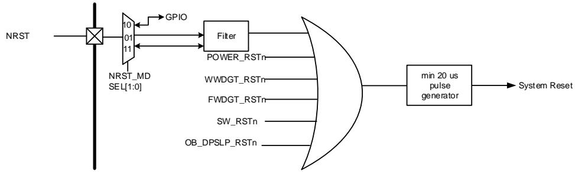
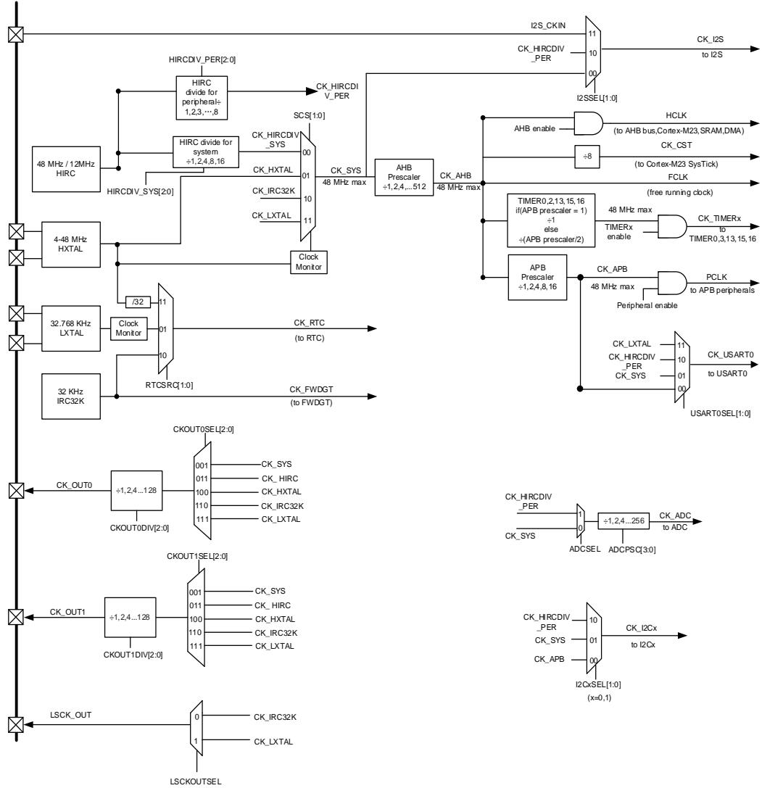
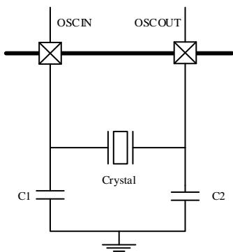
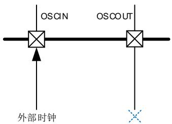

## 4. 复位和时钟单元（RCU）

## 4.1. 复位控制单元（RCTL）

## 4.1.1. 简介

GD32C2x1复位控制包括三种控制方式：电源复位、系统复位和备份域（VCORE_STB）复位。电源复位又称为冷复位，其复位除了备份域的所有系统。系统复位将复位除了SW-DP控制器和备份域之外的其余部分，包括处理器内核和外设IP。备份域复位将复位备份区域。复位能够被外部信号、内部事件和复位发生器触发。后续章节将介绍关于这些复位的详细信息。

## 4.1.2. 功能描述

电源复位

当发生以下任一事件时，产生电源复位：上电/掉电复位（POR/PDR复位），从待机模式中返回后由内部复位发生器产生。电源复位复位所有的寄存器除了备份域。电源复位为低电平有效，当内部LDO电源基准准备好提供1.2V电压时，电源复位电平将变为无效。复位入口向量被固定在存储器映射的地址0x0000_0004。

## 系统复位

当发生以下任一事件时，产生一个系统复位：

◼ 上电复位（POWER_RSTn）

◼ 外部引脚复位（NRST）

◼ 窗口看门狗计数终止（WWDGT_RSTn）

◼ 独立看门狗计数终止（FWDGT_RSTn）

◼ Cortex®-M23的中断应用和复位控制寄存器中的SYSRESETREQ位置‘1’（SW_RSTn）

◼ 选项字节重载复位（OBL_RSTn）

◼ 用户选择字节寄存器nRST_STDBY设置为0，并且进入待机模式时将产生复位（OB_STDBY_RSTn）

◼ 用户选择字节寄存器nRST_DPSLP设置为0，并且进入深度睡眠模式时（OB_DPSLP_RSTn）

注意：NRST引脚可以在以下三种模式下配置选项字节NRST_MDSEL[1:0]：

1. 输入/输出模式（默认模式）：在这种模式下，NRST引脚的GPIO功能不可用。复位信号可以从NRST引脚传输到MCU，导致MCU复位，复位脉冲信号可以通过NRST引脚反应出来,最小复位脉冲持续时间为20us。

2. 输入模式：在这种模式下，NRST引脚的GPIO功能不可用，复位信号可以从NRST引脚传输到MCU，导致MCU复位，但在NRST引脚上不可见该MCU的内部复位。

3. GPIO模式：NRST引脚只能作为标准GPIO使用，复位功能不可用，复位信号仅在MCU内

部，不反映在NRST引脚上。

系统复位将复位除了 SW-DP控制器和备份域之外的其余部分，包括处理器内核和外设 IP。系统复位脉冲发生器保证每一个复位源（外部或内部）都能有至少 20μs 的低电平脉冲延时。

图 4-1. 系统复位电路

## 备份域（VCORE_STB）复位

以下事件之一发生时，产生备份域复位：1、设置备份域控制寄存器中的 BKPRST 位为‘1’；2、电源上电复位（VDD 上电）。

## 4.2. 时钟控制单元（CCTL）

## 4.2.1. 简介

时钟控制单元提供了一系列频率的时钟功能，包括一个高速内部 RC 振荡器（48M/36M）时钟（HIRC）、一个外部高速晶体振荡器时钟（HXTAL）、一个内部 32K RC 振荡器时钟（IRC32K）、一个外部低速晶体振荡器时钟（LXTAL）、一个 HXTAL 时钟监视器、一个 LXTAL 时钟监视器、时钟预分频器、时钟多路复用器和时钟门控电路。

AHB、APB 和 Cortex®-M23 时钟都源自系统时钟（CK_SYS），系统时钟的时钟源可以选择HIRCDIV_SYS、HXTAL、IRC32K 或 LXTAL。系统时钟的最大运行时钟频率可以达到 48MHz。

图 4-2. 时钟树

预分频器可以配置 AHB和 APB 域的时钟频率。AHB 和 APB 域的最高时钟频率分别为 48MHz/ 48MHz。RCU 通过 AHB 时钟（HCLK）8 分频后作为 Cortex®系统定时器（SysTick）的外部时钟。通过对 SysTick 控制和状态寄存器的设置，可选择上述时钟或 AHB（HCLK）时钟作为SysTick 时钟。

ADC 的时钟由 CK_SYS 经 1、2、4、…、256 分频或者 CK_HIRCDIV_PER 经 1、2、4、…、256 分频获得，通过配置 RCU_CFG1 寄存器中的 ADCSEL 位和 ADCPSC 位来选择。

USART0 的时钟由 HIRCDIV_PER 时钟或者 LXTAL 时钟或者系统时钟或者 APB 时钟提供，通过配置 RCU_CFG1 寄存器中的 USART0SEL 位来选择。

I2Cx（x = 0，1）的时钟由 HIRCDIV_PER 时钟或者系统时钟或者 APB 时钟提供，通过配置RCU_CFG1 寄存器中的 I2CxSEL（x = 0，1）位来选择。

RTC 的时钟由 LXTAL 时钟或者 IRC32K 时钟或者 HXTAL/32 时钟提供，通过配置 RCU_CTL1寄存器中的 RTCSRC 位来选择。

当 FWDGT 启动时，FWDGT 时钟被强制选择由 IRC32K 时钟做为时钟源。

I2S 的时钟由 I2S_CKIN 时钟或者 CK_HIRCDIV_PER 时钟或者 CK_SYS 时钟提供，通过配置 RCU_CFG1 寄存器中的 I2SSEL 位来选择。

TIMER 时钟由 CK_APB 时钟分频获得，如果 APB的分频系数为 1，则 TIMER 时钟频率等于CK_APB。如果 APB 的分频系数不为 1，则 TIMER 时钟频率为 CK_APB 的两倍。

## 4.2.2. 主要特性

◼ 4到48MHz外部高速晶体振荡器（HXTAL）；

◼ 高速内部RC振荡器（48M / 36M）（HIRC）

◼ 32768 Hz外部低速晶体振荡器（LXTAL）；

◼ 内部32KHz RC振荡器（IRC32K）；

◼ HXTA和LXTAL时钟监视器。

## 4.2.3. 功能描述

## 外部高速晶体振荡时钟（HXTAL）

4 到 48M 的外部高速晶体振荡器可为系统时钟提供更为精确时钟源。带有特定频率的晶体必须靠近两个 HXTAL 的引脚连接。和晶体连接的外部电阻和电容必须根据所选择的振荡器来调整。

图 4-3. HXTAL 时钟源

HXTAL 晶体振荡器可以通过设置控制寄存器 RCU_CTL 的 HXTALEN 位来启动或关闭，在控制寄存器 RCU_CTL 中的 HXTALSTB 位用来指示外部高速振荡器是否已稳定。在启动时，直到这一位被硬件置‘1’，时钟才被释放出来。这个特定的延迟时间被称为振荡器的启动时间。当HXTAL 时钟稳定后，如果在中断寄存器 RCU_INT 中的相应中断使能位 HXTALSTBIE 位被置‘1’，将会产生相应中断。此时，HXTAL 时钟可以被直接用作系统时钟源或者 PLL 输入时钟。

将控制寄存器 RCU_CTL 的 HXTALBPS 和 HXTALEN 位置‘1’可以设置外部时钟旁路模式。旁路输入时，信号接至 OSCIN，OSCOUT 保持悬空状态，如 4-4. HXTAL所示。此时，CK_HXTAL 等于驱动 OSCIN 管脚的外部时钟。

图 4-4. 旁路模式下 HXTAL 时钟源

## 高速内部 RC振荡器（HIRC）

高速内部 RC 振荡器 IRC48M / IRC12M 频率固定为 48MHz 或 12MHz。高速内部 RC 振荡器提供了一种无需外部元件的低成本时钟源。通过 RCU_CTL0 寄存器中的 HIRCSEL 位可以选择 IRC48M 或 IRC12M。HIRC 振荡器可通过 RCU_CTL0寄存器中的 HIRCEN 位开启或关闭。RCU_CTL0 寄存器中的 HIRCSTB 标志用于指示高速内部 RC 振荡器是否稳定。当相关中断使能位 HIRCSTBIE 被置位后，HIRC 稳定时可以生成中断。

## 外部低速晶体振荡器时钟（LXTAL）

LXTAL 是一个频率为 32.768kHz 的外部低速晶体或陶瓷谐振器。它为实时时钟电路提供一个低功耗且高精准的时钟源。LXTAL 振荡器可以通过设置控制寄存器 1（RCU_CTL1）中的LXTALEN 位被启动和关闭。控制寄存器 1 RCU_CTL1 中的 LXTALSTB 位用来指示 LXTAL 时钟是否稳定。如果中断寄存器 RCU_INT 中的相应中断使能位 LXTALSTBIE 被置‘1’，在 LXTAL稳定以后，将产生一个中断。

将控制寄存器 1 RCU_CTL1 的 LXTALBPS 和 LXTALEN 位置‘1’可以选择外部时钟旁路模式。CK_LXTAL 与连到 OSC32IN 脚上外部时钟信号一致。

## 内部 32K RC 振荡器时钟（IRC32K）

IRC32K 内部 RC 振荡器时钟担当一个低功耗时钟源的角色，不需要外部器件，它的时钟频率大约 32kHz，为独立看门狗和实时时钟电路提供时钟。IRC32K RC 振荡器可以通过设置复位源/时钟寄存器 RCU_RSTSCK 中的 IRC32KEN 位被启动和关闭。复位源/时钟寄存器RCU_RSTSCK 中的 IRC32KSTB 位用来指示 IRC32K 时钟是否已稳定。如果复位源/时钟寄存器 RCU_RSTSCK 中的相应中断使能位 IRC32KSTBIE 被置‘1’，在 IRC32K 稳定以后，将产生一个中断。

## 系统时钟（CK_SYS）选择

系统复位后，HIRC/4 时钟默认做为 CK_SYS 的时钟源，改变配置寄存器 0（RCU_CFG0）中的系统时钟变换位 SCS 可以切换系统时钟源为 HXTAL 或 HIRCDIV_SYS 或者 LXTAL。当SCS 的值被改变，系统时钟将使用原来的时钟源继续运行直到转换的目标时钟源稳定。当一个时钟源被直接作为系统时钟时，它将不能被停止。

## HXTAL 时钟监视器（CKM）

设置控制寄存器 RCU_CTL 中的 HXTAL 时钟监视使能位 CKMEN，HXTAL 可以使能时钟监视功能。该功能必须在 HXTAL 启动延迟完毕后使能，在 HXTAL 停止后禁止。一旦监测到 HXTAL故障，HXTAL 将自动被禁止，中断寄存器 RCU_INT 中的 HXTAL 时钟阻塞中断标志位 CKMIF将被置‘1’，产生 HXTAL 故障事件。这个故障引发的中断和 Cortex®-M23 的不可屏蔽中断 NMI相连。如果 HXTAL 被选作系统，HXTAL 故障将促使选择 HIRCDIV_SYS 为系统时钟源。

## LXTAL 时钟监视器（LCKM）

设置时钟控制寄存器 RCU_CTL 中的 LXTAL 时钟监视使能位 LCKMEN，LXTAL 可以使能时钟监视功能。该功能必须在 LXTAL 启动延迟完毕和 IRC32K 使能后使能。

LXTAL 上的时钟监视器在除 VCORE_STB以外的所有模式下工作。如果在外部 32 KHz 振荡器上检测到故障，可以向 CPU 发送中断。这个故障引发的中断和 Cortex®-M23 的不可屏蔽中断NMI 相连。如果选择 LXTAL 作为 CK_SYS 的时钟源，则 LXTAL 故障将强制 CK_SYS 的时钟源切换为 IRC32K。

然后，软件必须禁用 LCKMEN 位，停止有缺陷的 32 KHz 振荡器，并更改 RTC 时钟源，或采取任何必要的措施来保护应用程序。

当 LCKMEN 启用时，一个 4 位加一个计数器将在 IRC32K 域工作。如果 LXTAL 时钟卡在 0/1错误或时钟减慢约 20KHz，计数器将溢出。将发现 LXTAL 时钟故障。

## 时钟输出功能

时钟输出功能输出从 32KHz 到 48MHz 的时钟。通过设置时钟配置寄存器 0（RCU_CFG0）中的 CK_OUT 时钟源选择位域 CKOUTxSEL（x = 0,1）能够选择不同的时钟信号。相应的GPIO 引脚应该被配置成备用功能 I/O（AFIO）模式来输出选择的时钟信号。

表 4-1. 时钟输出的时钟源选择

<table><tr><td>时钟输出的时钟源选择位域</td><td>时钟源</td></tr><tr><td>000</td><td>没有时钟</td></tr><tr><td>001</td><td>CK_SYS</td></tr><tr><td>010</td><td>保留</td></tr><tr><td>011</td><td>CK_HIRC</td></tr><tr><td>100</td><td>CK_HXTAL</td></tr><tr><td>101</td><td>保留</td></tr><tr><td>110</td><td>CK_IRC32K</td></tr><tr><td>111</td><td>CK_LXTAL</td></tr></table>

通过配置时钟配置寄存器 RCU_CFG0 的 CKOUTxDIV[2:0] （x = 0,1）位，可以将输出时钟按比例分频，进而降低 CK_OUT 频率。

通过设置 RCU_CTL1 寄存器的 LSCKOUTSEL 位，CK_LXTAL 和 CK_IRC32K 时钟可以通过LSCK_OUT 引脚输出，即使在深度睡眠模式、深度睡眠 1 模式和待机模式。

表 4-2. 低速时钟输出的时钟源选择

<table><tr><td>时钟输出的时钟源选择位域</td><td>时钟源</td></tr><tr><td>0</td><td>CK_IRC32K</td></tr><tr><td>1</td><td>LXTAL</td></tr></table>

## 深度睡眠模式时钟控制

当 MCU 处于深度睡眠/深度睡眠 1 模式时，USART0 外设时钟由 LXTAL 提供且 LXTAL 时钟使能时，则 USART0 外设可以唤醒 MCU。

如果 USART0 时钟选择 HIRCDIV_PER 处于深度睡眠/深度睡眠 1 模式时，则它们能够打开HIRC 时钟或关闭 HIRC 时钟，从而使 USART0 从深度睡眠模式唤醒。

如果 USART0 时钟选择 LXTAL 处于深度睡眠/深度睡眠 1 模式时，则它们能够打开 LXTAL 时钟或关闭 LXTAL 时钟（如果 LXTAL 由软件打开，则 USART0 不能关闭 LXTAL）。

如果 I2C0 / I2C1 选择 HIRCDIV_PER 作为时钟源并处于深度睡眠/深度睡眠 1 模式，则它们能够打开或关闭 HIRC 时钟，从而使 I2C0 / I2C1 从深度睡眠/深度睡眠 1 模式唤醒。

如果 FMC 和 PMU 在深度睡眠/深度睡眠 1 模式下工作时，可以打开或关闭 HIRC 时钟。

为了在深度睡眠/深度睡眠 1 模式下省电，如果 FMC 和 USART0 未在深度睡眠/深度睡眠 1 模式下工作，则它们的时钟可以单独选通。但 I2C0 / I2C1 / ADC、PMU 功能时钟不能由硬件选通，可以由软件禁用。

