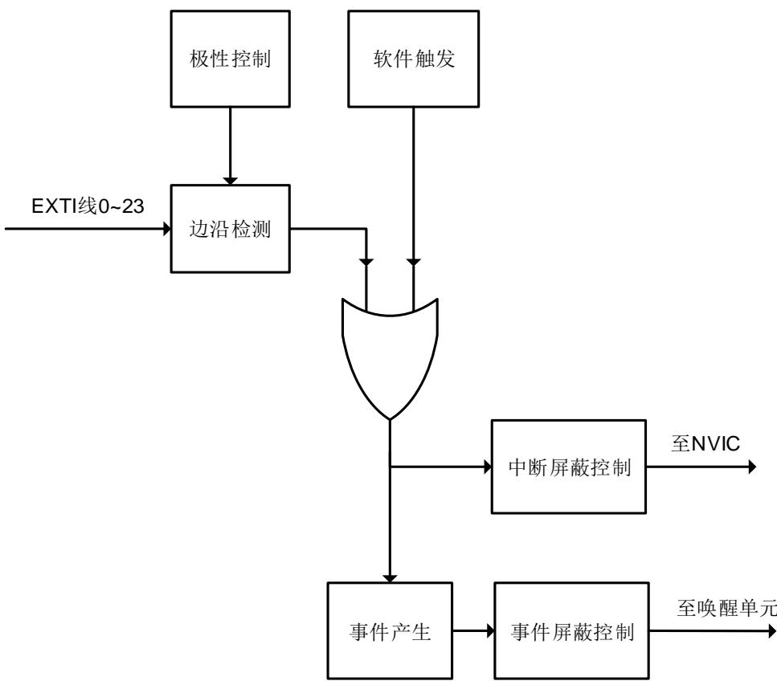

## 5. 中断 / 事件控制器（EXTI）

## 5.1. 简介

Cortex®-M23集成了嵌套式矢量型中断控制器（Nested Vectored Interrupt Controller（NVIC））来实现高效的异常和中断处理。NVIC实现了低延迟的异常和中断处理，以及电源管理控制。它和内核是紧密耦合的。更多关于NVIC的说明请参考《Cortex®-M23技术参考手册》。

EXTI（中断 / 事件控制器）包括24个相互独立的边沿检测电路并且能够向处理器内核产生中断请求或唤醒事件。EXTI有三种触发类型：上升沿触发、下降沿触发和任意沿触发。EXTI中的每一个边沿检测电路都可以独立配置和屏蔽。

## 5.2. 主要特征

◼ Cortex®-M23系统异常；

◼ 多达39种可屏蔽的外设中断；

◼ 2位中断优先级配置位——共提供4个中断优先等级；

◼ 高效的中断处理；

◼ 支持异常抢占和咬尾中断；

◼ 将系统从省电模式唤醒；

◼ EXTI中有24个相互独立的边沿检测电路；

◼ 3种触发类型：上升沿触发，下降沿触发和任意沿触发；

◼ 软件中断或事件触发；

◼ 可配置的触发源。

## 5.3. 功能说明

ARM® Cortex®-M23处理器和嵌套式矢量型中断控制器（NVIC）在处理（Handler）模式下对所有异常进行优先级区分以及处理。当异常发生时，系统自动将当前处理器工作状态压栈，在执行完中断服务子程序（ISR）后自动将其出栈。

取向量是和当前工作态压栈并行进行的，从而提高了中断入口效率。处理器支持咬尾中断，可实现背靠背中断，大大削减了反复切换工作态所带来的开销。 5-1. Cortex®-M23 NVIC和 5-2. 列出了所有的异常类型。

表 5-1. Cortex®-M23 中的 NVIC 异常类型

<table><tr><td>异常类型</td><td>向量编号</td><td>优先级(a)</td><td>向量地址</td><td>描述</td></tr><tr><td>-</td><td>0</td><td>-</td><td>0x0000_0000</td><td>保留</td></tr><tr><td>复位</td><td>1</td><td>-3</td><td>0x0000_0004</td><td>复位</td></tr><tr><td>NMI</td><td>2</td><td>-2</td><td>0x0000_0008</td><td>不可屏蔽中断</td></tr><tr><td>硬件故障</td><td>3</td><td>-1</td><td>0x0000_000C</td><td>各种硬件级别的故障</td></tr><tr><td>-SVCall 服务调用</td><td>4-1011</td><td>-可编程设置</td><td>0x0000_0010 - 0x0000_002B0x0000_002C</td><td>保留通过 SWI 指令实现系统服务调用</td></tr><tr><td>-</td><td>12-13</td><td>-</td><td>0x0000_0030 - 0x0000_0034</td><td>保留</td></tr><tr><td>PendSV 挂起服务</td><td>14</td><td>可编程设置</td><td>0x0000_0038</td><td>可挂起的系统服务请求</td></tr><tr><td>系统节拍</td><td>15</td><td>可编程设置</td><td>0x0000_003C</td><td>系统节拍定时器</td></tr></table>

表 5-2. 中断向量表

<table><tr><td>中断编号</td><td>向量编号</td><td>外设中断描述</td><td>向量地址</td></tr><tr><td>IRQ 0</td><td>16</td><td>窗口看门狗中断</td><td>0x0000_0040</td></tr><tr><td>IRQ 1</td><td>17</td><td>连接到EXTI线的RTC时间戳中断</td><td>0x0000_0044</td></tr><tr><td>IRQ 2</td><td>18</td><td>保留</td><td>0x0000_0048</td></tr><tr><td>IRQ 3</td><td>19</td><td>FMC全局中断</td><td>0x0000_004C</td></tr><tr><td>IRQ 4</td><td>20</td><td>RCU全局中断</td><td>0x0000_0050</td></tr><tr><td>IRQ 5</td><td>21</td><td>EXTI线0中断</td><td>0x0000_0054</td></tr><tr><td>IRQ 6</td><td>22</td><td>EXTI线1中断</td><td>0x0000_0058</td></tr><tr><td>IRQ 7</td><td>23</td><td>EXTI线2中断</td><td>0x0000_005C</td></tr><tr><td>IRQ 8</td><td>24</td><td>EXTI线3中断</td><td>0x0000_0060</td></tr><tr><td>IRQ 9</td><td>25</td><td>EXTI线4中断</td><td>0x0000_0064</td></tr><tr><td>IRQ 10</td><td>26</td><td>DMA通道0全局中断</td><td>0x0000_0068</td></tr><tr><td>IRQ 11</td><td>27</td><td>DMA通道1全局中断</td><td>0x0000_006C</td></tr><tr><td>IRQ 12</td><td>28</td><td>DMA通道2全局中断</td><td>0x0000_0070</td></tr><tr><td>IRQ 13</td><td>29</td><td>ADC中断</td><td>0x0000_0074</td></tr><tr><td>IRQ 14</td><td>30</td><td>USART0全局中断</td><td>0x0000_0078</td></tr><tr><td>IRQ 15</td><td>31</td><td>USART1全局中断</td><td>0x0000_007C</td></tr><tr><td>IRQ 16</td><td>32</td><td>USART2全局中断</td><td>0x0000_0080</td></tr><tr><td>IRQ 17</td><td>33</td><td>I2C0事件中断</td><td>0x0000_0084</td></tr><tr><td>IRQ 18</td><td>34</td><td>I2C0错误中断</td><td>0x0000_0088</td></tr><tr><td>IRQ 19</td><td>35</td><td>I2C1事件中断</td><td>0x0000_008C</td></tr><tr><td>IRQ 20</td><td>36</td><td>I2C1错误中断</td><td>0x0000_0090</td></tr><tr><td>IRQ 21</td><td>37</td><td>SPI0全局中断</td><td>0x0000_0094</td></tr><tr><td>IRQ 22</td><td>38</td><td>SPI1全局中断</td><td>0x0000_0098</td></tr><tr><td>IRQ 23</td><td>39</td><td>连接到EXTI线的RTC闹钟中断</td><td>0x0000_009C</td></tr><tr><td>IRQ 24</td><td>40</td><td>EXTI线[9:5]中断</td><td>0x0000_00A0</td></tr><tr><td>IRQ 25</td><td>41</td><td>TIMER0触发与通道换相中断或TIMER0更新中断或TIMER0中止中断</td><td>0x0000_00A4</td></tr><tr><td>IRQ 26</td><td>42</td><td>TIMER0捕获比较中断</td><td>0x0000_00A8</td></tr><tr><td>IRQ 27</td><td>43</td><td>TIMER2全局中断</td><td>0x0000_00AC</td></tr><tr><td>IRQ 28</td><td>44</td><td>TIMER13全局中断</td><td>0x0000_00B0</td></tr><tr><td>IRQ 29</td><td>45</td><td>TIMER15全局中断</td><td>0x0000_00B4</td></tr><tr><td>IRQ 30</td><td>46</td><td>TIMER16全局中断</td><td>0x0000_00B8</td></tr><tr><td>IRQ 31</td><td>47</td><td>EXTI 线[15:10]中断</td><td>0x0000_00BC</td></tr><tr><td>IRQ 32</td><td>48</td><td>保留</td><td>0x0000_00C0</td></tr><tr><td>IRQ 33</td><td>49</td><td>DMA MUX 中断</td><td>0x0000_00C4</td></tr><tr><td>IRQ 34</td><td>50</td><td>连接到 EXTI 线的 CMP0 输出中断</td><td>0x0000_00C8</td></tr><tr><td>IRQ 35</td><td>51</td><td>连接到 EXTI 线的 CMP1 输出中断</td><td>0x0000_00CC</td></tr><tr><td>IRQ 36</td><td>52</td><td>连接到 EXTI 线的 I2C0 唤醒中断</td><td>0x0000_00D0</td></tr><tr><td>IRQ 37</td><td>53</td><td>连接到 EXTI 线的 I2C1 唤醒中断</td><td>0x0000_00D4</td></tr><tr><td>IRQ 38</td><td>54</td><td>连接到 EXTI 中断线的 USART0 唤醒中断</td><td>0x0000_00D8</td></tr></table>

## 5.4. 外部中断及事件（EXTI）结构框图

图 5-1. EXTI 结构框图

## 5.5. 外部中断及事件功能概述

EXTI包含24个相互独立的边沿检测电路并且可以向处理器产生中断请求或事件唤醒。EXTI提供3种触发类型：上升沿触发，下降沿触发和任意沿触发。EXTI中每个边沿检测电路都可以分别予以配置或屏蔽。

EXTI触发源包括来自 I / O 管脚的 16根线以及来自内部模块的 8根线详情请参考 5-3. EXTI。通过配置 SYSCFG 模块的 SYSCFG_EXTISSx 寄存器，所有的 GPIO 管脚都可以被选作 EXTI 的触发源，具体细节请参考 。

除了中断，EXTI还可以向处理器提供事件信号。Cortex®-M23内核完全支持等待中断（WFI），等待事件（WFE）和发送事件（SEV）指令。唤醒中断控制器（WIC）可以让处理器和NVIC进入功耗极低的省电模式，由WIC来识别中断和事件以及判断优先级。当某些预期的事件发生时，EXTI能唤醒处理器及整个系统，例如一个特定的I / O管脚电平翻转或者RTC闹钟。

## 硬件触发

硬件触发被用来检测外部或内部信号的电压变化。软件需要按如下步骤配置来使用这项功能：

1. 根据应用需要配置 SYSCFG 模块中的 EXTI 触发源；

2. 配置 EXTI_RTEN 寄存器和 EXTI_FTEN 寄存器以使能相应引脚的上升沿或下降沿检测（软件应当同时配置引脚对应的 RTENx 和 FTENx 位以检测该引脚上升沿和下降沿的变化）；

3. 通过配置引脚对应的 EXTI_INTEN 或 EXTI_EVEN 位，使能中断或事件；

4. EXTI 开始检测被配置的引脚上的电平变化，当这些引脚上期望的变化被检测到时，相对应的 EXTI_PD 寄存器的 PDx 位将被置位。使能的中断或事件将被触发，软件需要响应该中断或事件并清除相应 PDx 位。

## 软件触发

按照如下步骤软件也可以触发 EXTI 中断或事件：

1. 配置对应的 EXTI_INTEN 或 EXTI_EVEN 位使能中断或事件；

2. 配置 EXTI_SWIEV 寄存器的对应 SWIEVx 位，对应的 PD 位将立刻被置 1，使能的中断或事件将被触发，软件需要响应该中断或事件并清除相应 PDx 位。

表 5-3. EXTI 触发源

<table><tr><td>EXTI 线编号</td><td>触发源</td></tr><tr><td>0</td><td>PA0 / PB0 / PD0 / PF0</td></tr><tr><td>1</td><td>PA1 / PB1 / PD1 / PF1</td></tr><tr><td>2</td><td>PA2 / PB2 / PD2 / PF2</td></tr><tr><td>3</td><td>PA3 / PB3 / PD3 / PF3</td></tr><tr><td>4</td><td>PA4 / PB4</td></tr><tr><td>5</td><td>PA5 / PB5</td></tr><tr><td>6</td><td>PA6 / PB6 / PC6</td></tr><tr><td>7</td><td>PA7 / PB7 / PC7</td></tr><tr><td>8</td><td>PA8 / PB8</td></tr><tr><td>9</td><td>PA9 / PB9</td></tr><tr><td>10</td><td>PA10 / PB10</td></tr><tr><td>11</td><td>PA11 / PB11</td></tr><tr><td>12</td><td>PA12 / PB12</td></tr><tr><td>13</td><td>PA13 / PB13 / PC13</td></tr><tr><td>14</td><td>PA14 / PB14 / PC14</td></tr><tr><td>15</td><td>PA15 / PB15 / PC15</td></tr><tr><td>16</td><td>RTC 闹钟</td></tr><tr><td>17</td><td>RTC 时间戳</td></tr><tr><td>18</td><td>CMP0 输出</td></tr><tr><td>19</td><td>CMP1 输出</td></tr><tr><td>20</td><td>I2C0 唤醒</td></tr><tr><td>21</td><td>I2C1 唤醒</td></tr><tr><td>22</td><td>USART0 唤醒</td></tr><tr><td>23</td><td>LXTALCS</td></tr></table>

