## 12. 模数转换器（ADC）

## 12.1. 简介

MCU 片上集成了 12 位逐次逼近式模数转换器模块（ADC），可以采样来自于 16 个外部通道和 2 个内部通道上的模拟信号。这 18 个 ADC 采样通道都支持多种运行模式，采样转换后，转换结果可以按照最低有效位对齐或最高有效位对齐的方式保存在相应的数据寄存器中。片上的硬件过采样机制可以通过减少来自 MCU 的相关计算负担来提高性能。

## 12.2. 主要特征

## 高性能：

ADC分辨率：12位、10位、8位、或者6位分辨率；

前置校准功能；

可编程采样时间；

数据存储模式：最高有效位对齐和最低有效位对齐；

DMA请求。

## 模拟输入通道：

16个外部模拟输入通道；

1个内部温度传感通道(VSENSE)；

1个内部参考电压输入通道(VREFINT)。

## 运行模式：

软件；

硬件触发。

## 转换模式：

转换单个通道，或者扫描一序列的通道；

单次运行模式，每次触发转换一次选择的输入通道；

连续运行模式，连续转换所选择的输入通道；

间断运行模式；

同步模式（适用于具有两个或多个ADC的设备）。

## 转换结果阈值监测器功能：模拟看门狗。

## 中断的产生：

常规序列转换结束；

模拟看门狗事件。

## 过采样：

16位的数据寄存器；

可调整的过采样率，从2x到256x；

高达8位的可编程数据移位。

## 模块供电要求：2.6V到3.6V，一般电源电压为3.3V。

## 通道输入范围：VREF- ≤VIN ≤VREF+。

## 12.3. 引脚和内部信号

12-1. ADC 给出了 ADC 框图。 12-1. ADC 给出了 ADC 内部信号。12-2. ADC 给出了 ADC 引脚说明。

表 12-1. ADC 内部输入信号

<table><tr><td>内部信号名称</td><td>说明</td></tr><tr><td><eq>V_{SENSE}</eq></td><td>内部温度传感器输出电压</td></tr><tr><td><eq>V_{REFINT}</eq></td><td>内部参考输出电压</td></tr></table>

表 12-2. ADC 引脚输入定义

<table><tr><td>名称</td><td>注释</td></tr><tr><td><eq>V_{DDA}</eq></td><td>模拟电源输入等于<eq>V_{DD}</eq>,<eq>2.6V \leq V_{DDA} \leq 3.6V</eq></td></tr><tr><td><eq>V_{SSA}</eq></td><td>模拟地,等于<eq>V_{SS}</eq></td></tr><tr><td><eq>V_{REF+}</eq></td><td>ADC正参考电压,<eq>2.6V \leq V_{REF+} \leq V_{DDA}</eq></td></tr><tr><td><eq>V_{REF-}</eq></td><td>ADC负参考电压,<eq>V_{REF-} = V_{SSA}</eq></td></tr><tr><td>ADCx_IN[15:0]</td><td>多达16路外部模拟通道</td></tr></table>

注意：VDDA和VSSA必须分别连接到VDD和VSS。

## 12.4. 功能说明

图 12-1. ADC 模块框图

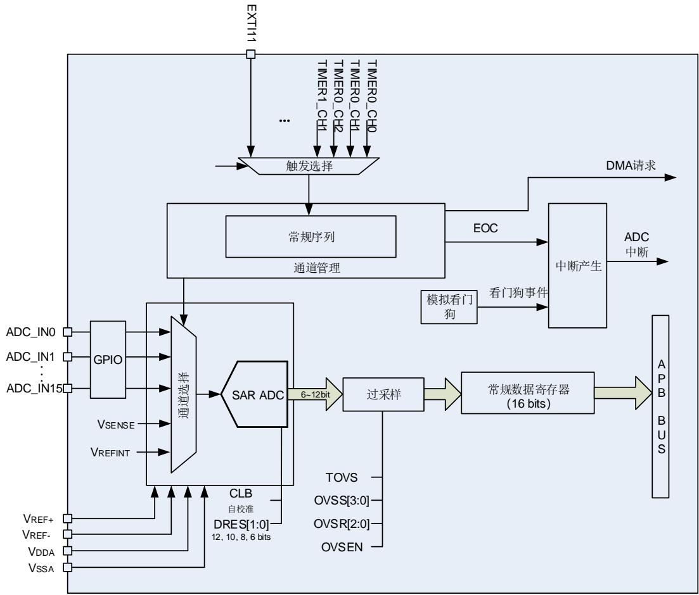

## 12.4.1. 前置校准功能

在前置校准期间，ADC 计算一个校准系数，这个系数是应用于 ADC 内部的，它直到 ADC 下次掉电才无效。在校准期间，应用不能使用 ADC，它必须等到校准完成。在 A/D 转换前应执行校准操作。通过软件设置 CLB=1 来对校准进行初始化，在校准期间 CLB 位会一直保持 1，直到校准完成，该位由硬件清 0。

当 ADC 运行条件改变(例如，VDDA、VREF+ 以及温度等)，建议重新执行一次校准操作。

内部的模拟校准通过设置 ADC_CTL1 寄存器的 RSTCLB位来重置。

软件校准过程：

1. 确保ADCON=1；

2. 延迟14个CK_ADC以等待ADC稳定；

3. 设置RSTCLB (可选的)；

4. 设置CLB=1；

5. 等待直到CLB=0。

## 12.4.2. ADC 时钟

CK_ADC 时钟是由时钟控制器提供的，它和 AHB、APB2 时钟保持同步。ADC 时钟可以在 RCU时钟控制器中进行分配和配置。

## 12.4.3. ADCON 使能

ADC_CTL1 寄存器中的 ADCON 位是 ADC 模块的使能开关。如果该位为 0，则 ADC 模块保持复位状态。为了省电，当 ADCON 位为 0 时，ADC 模拟子模块将会进入掉电模式。ADC 使能后需要等待 $\mathrm { \Delta t _ { u s } }$ 时间后才能采样， $\mathrm { \bf t _ { s u } }$ 数值详见芯片数据手册。

## 12.4.4. 常规序列

通道管理电路可以将采样通道组织成一个序列：常规序列。常规序列支持最多16个通道，每个通道称为常规通道。

ADC_RSQ0寄存器的RL[3:0]位规定了整个常规序列的长度。ADC_RSQ0~ADC_RSQ2寄存器规定了常规序列的通道选择。

注意：尽管ADC支持18个通道，但常规序列一次最多转换16个通道。

## 12.4.5. 运行模式

## 单次运行模式

单次运行模式下，ADC_RSQ2 寄存器的 RSQ0[4:0]位规定了 ADC 的转换通道。当 ADCON 位被置 1，一旦相应软件触发或者外部触发发生，ADC 就会采样和转换一个通道。

图 12-2. 单次运行模式

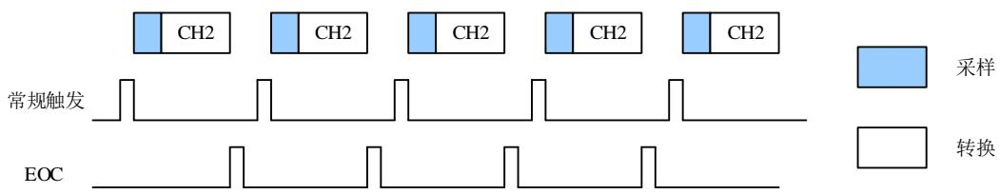

常规通道单次转换结束后，转换数据将被存放于 ADC_RDATA 寄存器中，EOC 将会置 1。如果 EOCIE 位被置 1，将产生一个中断。

常规序列单次运行模式的软件流程：

1. 确保ADC_CTL0寄存器的DISRC和SM位以及ADC_CTL1寄存器的CTN位为0；

2. 用模拟通道编号来配置RSQ0；

3. 配置ADC_SAMPTx寄存器；

4. 如果有需要，可以配置ADC_CTL1寄存器的ETERC和ETSRC位；

5. 设置SWRCST位，或者为常规序列产生一个外部触发信号；

6. 等到EOC置1；

7. 延迟一个CK_ADC后，从ADC_RDATA寄存器中读ADC转换结果；

8. 写0清除EOC标志位。

注意：当EOC置1后，需延迟一个CK_ADC再读取ADC转换结果。

## 连续运行模式

对 ADC_CTL1 寄存器的 CTN 位置 1 可以使能连续运行模式。在此模式下，ADC 执行由RSQ0[4:0]规定的转换通道。当 ADCON 位被置 1，一旦相应软件触发或者外部触发产生，ADC就会采样和转换规定的通道。转换数据保存在 ADC_RDATA 寄存器中。

图 12-3. 连续运行模式

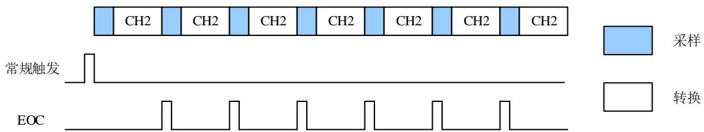

常规序列连续运行模式的软件流程：

1. 设置ADC_CTL1寄存器的CTN位为1；

2. 根据模拟通道编号配置RSQ0；

3. 配置ADC_SAMPTx寄存器；

4. 如果有需要，配置ADC_CTL1寄存器的ETERC和ETSRC位；

5. 设置SWRCST位，或者给常规序列产生一个外部触发信号；

6. 等待EOC标志位置1；

7. 延迟一个CK_ADC后，从ADC_RDATA寄存器中读ADC转换结果；

8. 写0清除EOC标志位；

9. 只要还需要进行连续转换，重复步骤6~8。

注意：当EOC置1后，需延迟一个CK_ADC再读取ADC转换结果。

由于要循环查询 EOC 标志位，DMA可以被用来传输转换数据，软件流程如下：

1. 设置ADC_CTL1寄存器的CTN位为1；

2. 根据模拟通道编号配置RSQ0；

3. 配置ADC_SAMPTx寄存器；

4. 如果有需要，配置ADC_CTL1寄存器的ETERC和ETSRC位；

5. 准备DMA模块，用于传输来自ADC_RDATA的数据；

6. 设置SWRCST位，或者给常规序列产生一个外部触发。

## 扫描运行模式

扫描运行模式可以通过将 ADC_CTL0 寄存器的 SM 位置 1 来使能。在此模式下，ADC 扫描转换所有被 ADC_RSQ0~ADC_RSQ2 寄存器选中的所有通道。一旦 ADCON 位被置 1，当相应软件触发或者外部触发产生，ADC 就会一个接一个的采样和转换常规序列通道。转换数据存储在 ADC_RDATA 寄存器中。常规序列转换结束后，EOC 位将被置 1。如果 EOCIE 位被置1，将产生中断。当常规序列工作在扫描模式下时，ADC_CTL1 寄存器的 DMA 位必须设置为1。

如果 ADC_CTL1 寄存器的 CTN 位也被置 1，则在常规序列转换完之后，这个转换自动重新开始。

图 12-4. 扫描运行模式，且连续转换模式失能

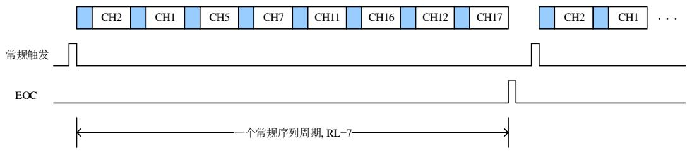

常规序列扫描运行模式的软件流程：

1. 设置 ADC_CTL0 寄存器的 SM 位和 ADC_CTL1 寄存器的 DMA 位为 1；

2. 配置 ADC_RSQx 和 ADC_SAMPTx 寄存器；

3. 如果有需要，配置 ADC_CTL1 寄存器中的 ETERC 和 ETSRC 位；

4. 准备 DMA模块，用于传输来自 ADC_RDATA 的数据；

5. 设置 SWRCST 位，或者给常规序列产生一个外部触发；

6. 等待 EOC 标志位置 1；

7. 写 0 清除 EOC 标志位。

图 12-5. 扫描运行模式，连续运行模式使能

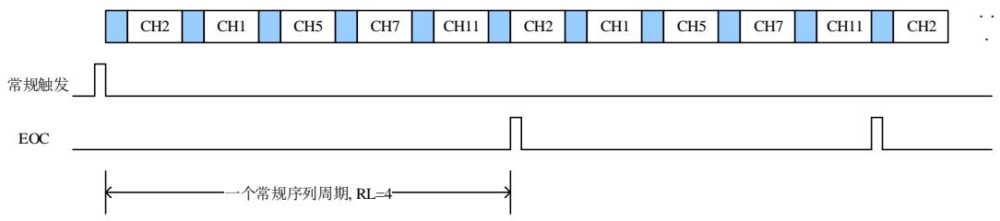

## 间断运行模式

当 ADC_CTL0 寄存器的 DISRC 位置 1 时，常规序列使能间断运行模式。该模式下可以执行一次 n 个通道的短序列转换(n 不超过 8)，该序列是 ADC_RSQ0~RSQ2 寄存器所选择的序列的一部分。数值 n 由 ADC_CTL0 寄存器的 DISCNUM[2:0]位配置。当相应的软件触发或外部触发发生，ADC 就会采样和转换在 ADC_RSQ0~RSQ2 寄存器所配置通道中接下来的 n 个通道，直到常规序列中所有的通道转换完成。每个常规序列转换周期结束后，EOC 位将被置 1。如果 EOCIE 位被置 1 将产生一个中断。

图 12-6. 间断转换模式

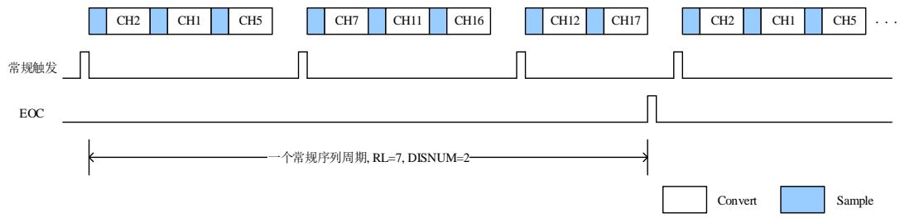

常规序列间断运行模式的软件流程：

1. 设置 ADC_CTL0 寄存器的 DISRC 位和 ADC_CTL1 寄存器的 DMA 位为 1；

2. 配置 ADC_CTL0 寄存器的 DISNUM[2:0]位；

3. 配置 ADC_RSQx 和 ADC_SAMPTx 寄存器；

4. 如果有需要，配置 ADC_CTL1 寄存器中的 ETERC 和 ETSRC 位；

5. 准备 DMA模块，用于传输来自 ADC_RDATA 的数据；

6. 设置 SWRCST 位，或者给常规序列产生一个外部触发；

7. 如果需要，重复步骤 6；

8. 等待 EOC 标志位置 1；

9. 写 0 清除 EOC 标志位。

## 12.4.6. 转换结果阈值监测功能

ADC_CTL0 寄存器的 RWDEN 位置 1 将使能常规序列的模拟看门狗功能。该功能用于监测转换结果是否超过设定的阈值。如果 ADC 的模拟转换电压低于低阈值或高于高阈值时，ADC_STAT 状态寄存器的 WDE 位将被置 1。如果 WDEIE 位被置 1，将产生中断。ADC_WDHT和 ADC_WDLT 寄存器用来设定高低阈值。内部数据的比较在对齐之前完成，因此阀值与ADC_CTL1 寄存器的 DAL 位确定的对齐方式无关。ADC_CTL0 寄存器的 RWDEN，WDSC和WDCHSEL[4:0]位可以用来选择模拟看门狗监控单一通道或者多通道。

## 12.4.7. 数据存储模式

ADC_CTL1 寄存器的 DAL 位确定转换后数据存储的对齐方式。

图 12-7. 12 位数据存储模式

常规通道数据

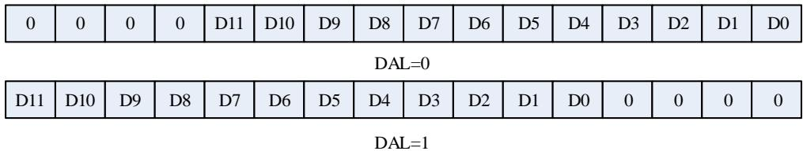

6 位分辨率的数据存储模式不同于 12 位/10 位/8 位分辨率数据存储模式，如图 12-10 所示。

图 12-8. 6 位数据存储模式

常规通道数据

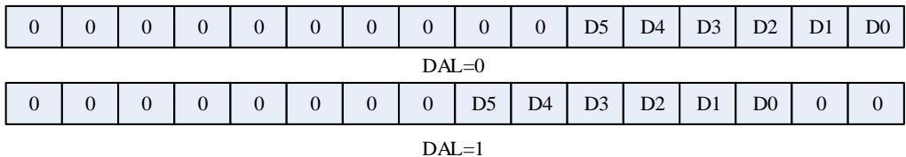

## 12.4.8. 采样时间配置

ADC 使用多个 CK_ADC 周期对输入电压采样，采样周期数目可以通过 ADC_SAMPT0 和ADC_SAMPT1 寄存器的 SPTn[2:0]位配置。每个通道可以用不同的采样时间。在 12 位分辨率的情况下，总转换时间=采样时间+12.5 个 CK_ADC 周期。

例如：

CK_ADC = 30MHz，采样时间为 1.5 个周期，那么总的转换时间为：“1.5+12.5”个 CK_ADC周期，即 0.467us。

## 12.4.9. 外部触发配置

外部触发输入的上升沿可以触发常规序列的转换。常规序列的外部触发源由 ADC_CTL1 寄存器的 ETSRC[2:0]位控制。

表 12-3. ADC0 和 ADC1 的外部触发源

<table><tr><td>ETSRC[2:0]</td><td>触发源</td><td>触发类型</td></tr><tr><td>000</td><td>TIMER0_CH0</td><td rowspan="7">硬件触发</td></tr><tr><td>001</td><td>TIMER0_CH1</td></tr><tr><td>010</td><td>TIMER0_CH2</td></tr><tr><td>011</td><td>TIMER1_CH1</td></tr><tr><td>100</td><td>TIMER2_TRGO</td></tr><tr><td>101</td><td>TIMER3_CH3</td></tr><tr><td>110</td><td>EXTI11/TIMER7_TRGO</td></tr><tr><td>111</td><td>SWRCST</td><td>软件触发</td></tr></table>

表 12-4. ADC2 的外部触发源

<table><tr><td>ETSRC[2:0]</td><td>触发源</td><td>触发类型</td></tr><tr><td>000</td><td>TIMER2_CH0</td><td rowspan="7">硬件触发</td></tr><tr><td>001</td><td>TIMER1_CH2</td></tr><tr><td>010</td><td>TIMER0_CH2</td></tr><tr><td>011</td><td>TIMER7_CH0</td></tr><tr><td>100</td><td>TIMER7_TRGO</td></tr><tr><td>101</td><td>TIMER4_CH0</td></tr><tr><td>110</td><td>TIMER4_CH2</td></tr><tr><td>111</td><td>SWRCST</td><td>软件触发</td></tr></table>

## 12.4.10. DMA 请求

DMA请求，可以通过设置 ADC_CTL1 寄存器的 DMA 位来使能，它用于常规序列多个通道的转换结果。ADC 在常规序列一个通道转换结束后产生一个 DMA 请求，DMA 接受到请求后可以将转换的数据从 ADC_RDATA 寄存器传输到用户指定的目的地址。

## 12.4.11. ADC 内部通道

将 ADC_CTL1 寄存器的 TSVREN 位置 1 可以使能温度传感器通道(ADC0_CH16)和 VREFINT通道(ADC0_CH17)。温度传感器可以用来测量器件周围的温度。传感器输出电压能被 ADC 转换成数字量。建议温度传感器的采样时间至少设置为 ts_temp µs（具体数值请参考 datasheet 文档）。温度传感器不用时，复位 TSVREN 位可以将其置于掉电模式。

温度传感器的输出电压随温度线性变化，由于生产过程的多样化，温度变化曲线的偏移在不同的芯片上会有不同(最多相差 $4 5 ^ { \circ } \mathsf { C } )$ 。内部温度传感器更适合于检测温度的变化，而不是测量绝对温度。如果需要测量精确的温度，应该使用一个外置的温度传感器来校准这个偏移错误。

内部电压参考(V )提供了一个稳定的（带隙基准）电压输出给 ADC 和比较器。V 内

部连接到 ADC0_CH17 输入通道。

使用温度传感器：

1. 配置温度传感器通道（ADC_IN16）的转换序列和采样时间为 ts_temp µs

2. 置位 ADC_CTL1 寄存器中的 TSVREN 位，使能温度传感器

3. 置位 ADC_CTL1 寄存器的 ADCON 位，或者由外部触发启动 ADC 转换

4. 读取内部温度传感器输出电压 Vtemperature，并由下面公式计算出实际温度：

$$
\text { 温度 } \left(^ {\circ} \mathrm{C}\right) = \left\{\left(\mathrm{V} _ {2 5} - \mathrm{V} _ {\text { temperature }}\right) / \text { Avg\_Slope } \right\} + 2 5
$$

$\vee _ { 2 5 } \colon$ ：内部温度传感器在 $\boldsymbol { 2 5 ^ { \circ } \mathrm { C } }$ 下的电压，典型值请参考相关型号 datasheet。

Avg_Slope：温度与内部温度传感器输出电压曲线的均值斜率，典型值请参考相关型号 datasheet。

## 12.4.12. 可编程分辨率(DRES)

ADC 分辨率可以通过寄存器 ADC_OVSAMPCTL 中的 DRES[1:0]位进行配置。对于那些不需要高精度数据的应用，可以使用较低的分辨率来实现更快速地转换。只有在 ADCON 比特为 0时，才能修改 DRES[1:0]的值。较低的分辨率能够减少转换时间。如 12-5.tCONV 所示，较低的分辨率能够减少逐次逼近步骤所需的转换时间 tADC。

表 12-5. 不同分辨率对应的 tCONV时间

<table><tr><td>DRES[1:0] bits</td><td>tCONV(ADC clock cycles)</td><td>tCONV(ns) at fADC=30MHz</td><td>tSMPL(min)(ADC clock cycles)</td><td>tADC(ADC clock cycles)</td><td>tADC(ns) at fADC=30MHz</td></tr><tr><td>12</td><td>12.5</td><td>417 ns</td><td>1.5</td><td>14</td><td>467ns</td></tr><tr><td>10</td><td>10.5</td><td>350 ns</td><td>1.5</td><td>12</td><td>400ns</td></tr><tr><td>8</td><td>8.5</td><td>283 ns</td><td>1.5</td><td>10</td><td>333ns</td></tr><tr><td>6</td><td>6.5</td><td>217 ns</td><td>1.5</td><td>8</td><td>267ns</td></tr></table>

## 12.4.13. 片上硬件过采样

片上硬件过采样单元执行数据预处理以减轻 CPU 负担。它能够处理多个转换，并将多个转换的结果取平均，得出一个 16 位宽的数据。其结果值根据如下公式计算得出，其中 N 和 M 的值可以被调整，过采样单元可以通过设置 ADC_OVSAMPCTL 寄存器的 OVSEN 位来使能，它是以降低数据输出率为代价，换取较高的数据分辨率。 $\sf { D _ { o u t } ( n ) }$ 是指 ADC 输出的第 n 个数字信号：

$$
\text { Result } = \frac {1}{M} * \sum_ {n = 0} ^ {N - 1} D _ {\text { out }} (n) \tag {12-1}
$$

片上硬件过采样单元执行两个功能：求和和位右移。过采样率 N 是在 ADC_OVSAMPCTL 寄存器的 OVSR[2:0]位定义，它的取值范围为 2x 到 256x。除法系数 M 定义一个多达 8 位的右移，它通过 ADC_OVSAMPCTL 寄存器 OVSS[3:0]位进行配置。

求和单元能够生成一个多达 20 位 $( 2 5 6 ^ { \star } 1 2$ 位)的值。首先，将这个值要进行右移，将移位后剩余的部分再通过取整转化一个近似值，最后将高位会被截断，仅保留最低 16 位有效位作为最终值传入对应的数据寄存器中。

图 12-9. 20 位到 16 位的结果截断

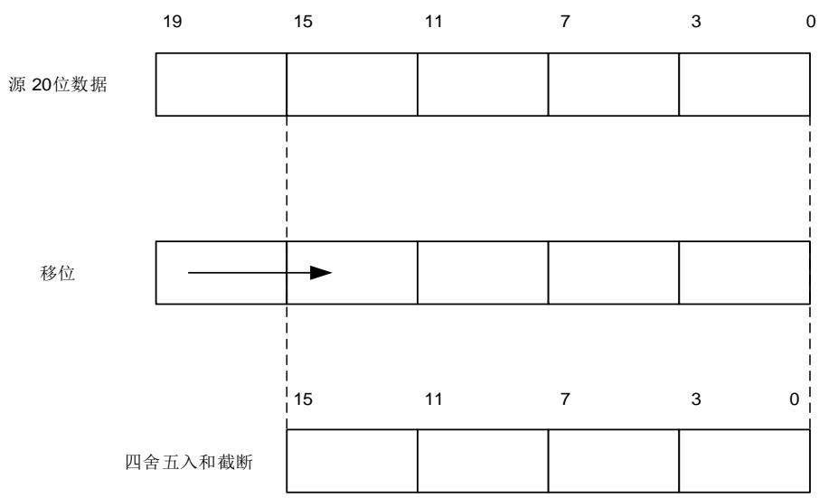

注意：如果移位后的中间结果还是超过 16 位，那么该结果的高位就会被直接截掉。

12-10. 5 描述一个从原始 20 位的累积数值处理成 16 位结果值的例子。

图 12-10. 右移 5 位和取整的数例

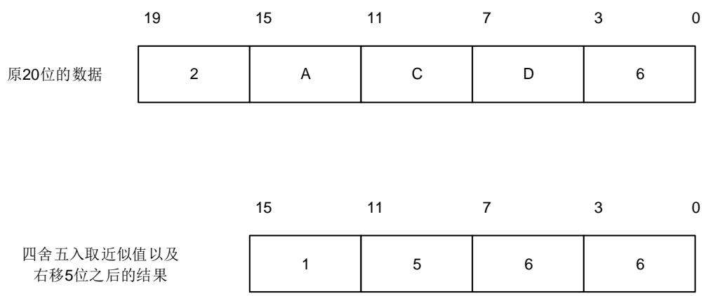

12-6. N M 给出了 N 和 M 各种组合的数据格式，初始转换值为 0xFFF。

表 12-6. N 和 M 的最大输出值（灰色部分表示截断）

<table><tr><td>Oversampling ratio</td><td>Max Raw data</td><td>No-shift OVSS=0000</td><td>1-bit shift OVSS=0001</td><td>2-bit shift OVSS=0010</td><td>3-bit shift OVSS=0011</td><td>4-bit shift OVSS=0100</td><td>5-bit shift OVSS=0101</td><td>6-bit shift OVSS=0110</td><td>7-bit shift OVSS=0111</td><td>8-bit shift OVSS=1000</td></tr><tr><td>2x</td><td>0x1FFE</td><td>0x1FFE</td><td>0x0FFF</td><td>0x07FF</td><td>0x03FF</td><td>0x01FF</td><td>0x00FF</td><td>0x007F</td><td>0x003F</td><td>0x001F</td></tr><tr><td>4x</td><td>0x3FFC</td><td>0x3FFC</td><td>0x1FFE</td><td>0x0FFF</td><td>0x07FF</td><td>0x03FF</td><td>0x01FF</td><td>0x00FF</td><td>0x007F</td><td>0x003F</td></tr><tr><td>8x</td><td>0x7FF8</td><td>0x7FF8</td><td>0x3FFC</td><td>0x1FFE</td><td>0x0FFF</td><td>0x07FF</td><td>0x03FF</td><td>0x01FF</td><td>0x00FF</td><td>0x007F</td></tr><tr><td>16x</td><td>0xFFFF0</td><td>0xFFFF0</td><td>0x7FF8</td><td>0x3FFC</td><td>0x1FFE</td><td>0x0FFF</td><td>0x07FF</td><td>0x03FF</td><td>0x01FF</td><td>0x00FF</td></tr><tr><td>32x</td><td>0x1FFE0</td><td>0xFFE0</td><td>0xFFFF0</td><td>0x7FF8</td><td>0x3FFC</td><td>0x1FFE</td><td>0x0FFF</td><td>0x07FF</td><td>0x03FF</td><td>0x01FF</td></tr><tr><td>64x</td><td>0x3FFC0</td><td>0xFFC0</td><td>0xFFE0</td><td>0xFFFF0</td><td>0x7FF8</td><td>0x3FFC</td><td>0x1FFE</td><td>0x0FFF</td><td>0x07FF</td><td>0x03FF</td></tr><tr><td>128x</td><td>0x7FF80</td><td>0xFF80</td><td>0xFFC0</td><td>0xFFE0</td><td>0xFFFF0</td><td>0x7FF8</td><td>0x3FFC</td><td>0x1FFE</td><td>0x0FFF</td><td>0x07FF</td></tr><tr><td>256x</td><td>0xFFFF00</td><td>0xFF00</td><td>0xFF80</td><td>0xFFC0</td><td>0xFFE0</td><td>0xFFFF0</td><td>0x7FF8</td><td>0x3FFC</td><td>0x1FFE</td><td>0x0FFF</td></tr></table>

和标准的转换模式相比，过采样模式的转换时间不会改变：在整个过采样序列的过程中采样时间仍然保持相等。每 N 个转换就会产生一个新的数据，一个等价的延迟为：

$$
N ^ {*} t _ {A D C} = N ^ {*} \left(t _ {S M P L} + t _ {C O N V}\right) \tag {3-1}
$$

## 12.5. ADC 同步模式

在有多个ADC模块的产品中，可以使用ADC同步模式。在ADC同步模式下，根据ADC_CTL0寄存器中SYNCM[3:0]位所选的模式，转换的启动可以是ADC0和ADC1的交替触发或同步触发。

在同步模式下，当配置由外部事件触发的转换时，ADC1必须通过软件来配置触发来，从而避免错误的触发引起不必要的转换。此外，对于ADC0和ADC1的外部触发必须被使能。

ADC同步模式如 12-7. ADC 示。

表 12-7. ADC 同步模式表

<table><tr><td>SYNCM[3: 0]</td><td>模式</td></tr><tr><td>0000</td><td>独立模式</td></tr><tr><td>0110</td><td>常规并行模式</td></tr><tr><td>0111</td><td>常规快速交叉模式</td></tr><tr><td>1000</td><td>常规慢速交叉模式</td></tr></table>

在ADC同步模式下，即使DMA不用，也要将DMA置位，ADC1的转换数据可以通过ADC0数据寄存器读取。

ADC 同步框图如 12-11. ADC 所示。

图 12-11. ADC 同步框图

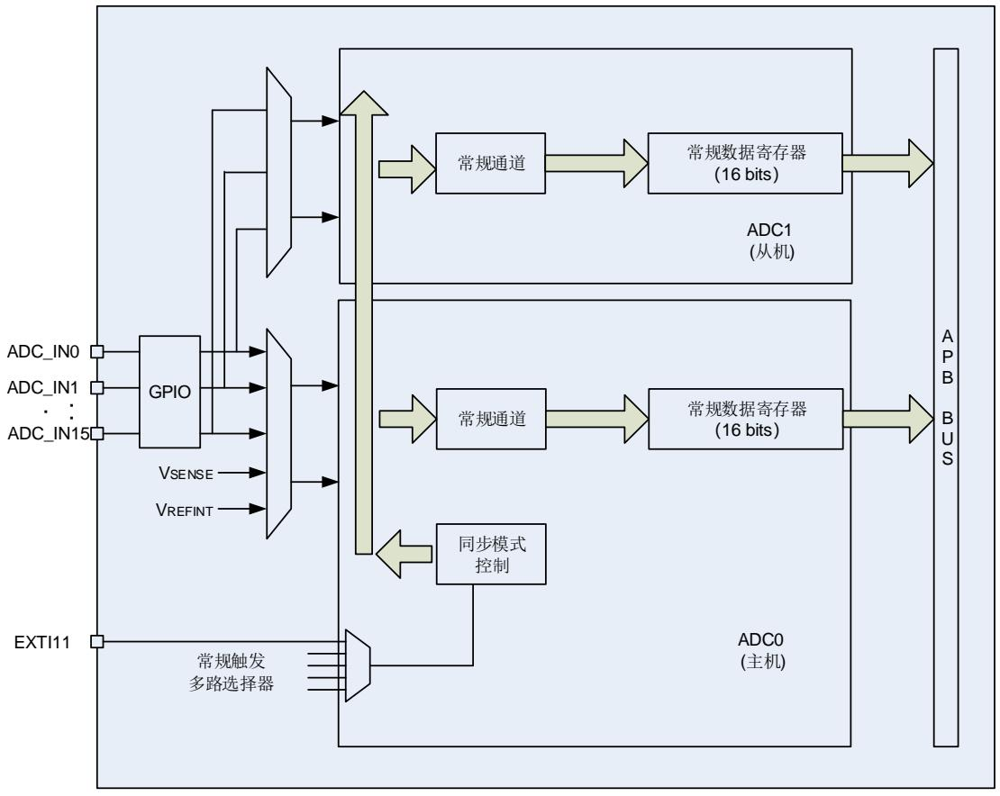

## 12.5.1. 独立模式

在这种模式下，每个 ADC 都独立工作，互不干扰。

## 12.5.2. 常规并行模式

此模式可并行转换常规序列，外部触发来源于 ADC0 常规序列触发（由 ADC_CTL1 寄存器的ETSRC[2:0]决定），ADC1 常规序列配置为软件触发模式。

在 ADC0 或 ADC1 的转换事件结束时，即 ADC0 或 ADC1 的常规序列转换完毕，会产生一个EOC 中断（如果某个 ADC 中断使能）。常规并行模式请参考 12-12. 10并行模式。

32 位 ADC_RDATA 寄存器（ [15: 0]位域用于保存 ADC0 常规通道采样数据，[31: 16]位域用于保存 ADC1 常规通道采样数据），32 位的 DMA 被用来将 ADC_RDATA 中的数据传送到SRAM。

## 注意：

1．若两个 ADC 模块使用了相同的采样通道，应保证不在同一时间使用该通道。

2．两个 ADC 在同一时刻采样的两个通道，应该配置相同的采样时间。

图 12-12. 基于 10 个通道的常规并行模式

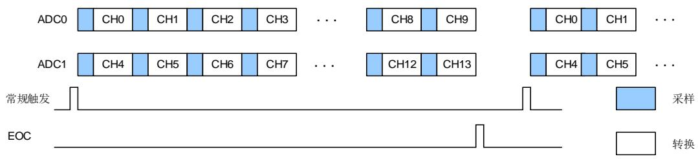

## 12.5.3. 常规快速交叉模式

快速交叉模式适用于两个 ADC 的常规序列采样同一个通道，，外部触发来源于 ADC0 常规序列（由 ADC_CTL1 寄存器的 ETSRC[2:0]决定）。当触发产生时，ADC1 立刻启动，而 ADC0在 7 个 ADC 时钟周期后启动。

如果 ADC0 和 ADC1 的 CTN 位被置位，所选的常规序列在两个 ADC 中被不停的转换。如12-13. 所示。

32 位 ADC_RDATA 寄存器（[15: 0]位域用于保存 ADC0 常规通道采样数据，[31: 16]位域用于保存 ADC1 常规通道采样数据）。在 ADC0 产生 EOC 中断后(可通过置位 EOCIE 位)，可通过 32 位 DMA 将 ADC_RDATA 中数据传送到 SRAM。

注意：两个 ADC 模块常规通道的采样时间都应小于 7 个 ADC 时钟周期。

图 12-13. 常规序列上的快速交叉模式（两个 ADC 的 CTN=1）

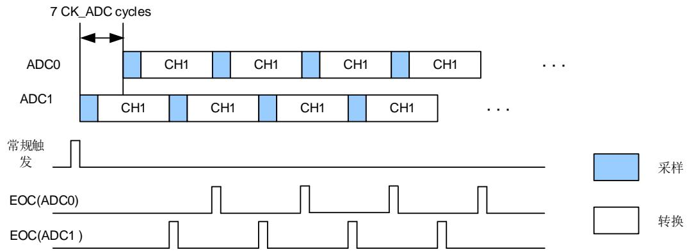

## 12.5.4. 常规慢速交叉模式

此模式应用于两个 ADC 的常规序列（通常一个常规通道），外部触发来源于 ADC0 常规序列（由 ADC_CTL1 寄存器的 ETSRC[2:0]决定）。当触发产生时，ADC1 立刻启动，而 ADC0 在14 个 ADC 时钟周期后启动，在 ADC0 启动后的 14 个时钟周期，ADC1 再次启动。

在这种模式下，不能使用连续转换模式，因为在这种模式下所选的常规通道在两个 ADC 中被不停的转换，如 12-14. 所示。

32 位 ADC_RDATA 寄存器（[15: 0]位域用于保存 ADC0 常规通道采样数据，[31: 16]位域用于保存 ADC1 常规通道采样数据）。在 ADC0 产生 EOC 中断后(可通过置位 EOCIE 位)，可通过 32 位 DMA 将 ADC_RDATA 中数据传送到 SRAM。

注意：可允许的最大采样时间必须小于 14 个 CK_ADC 采样时钟，从而避免 ADC0 和 ADC1在转换相同通道时出现采样时钟重叠。

图 12-14. 常规序列上的慢速交叉模式

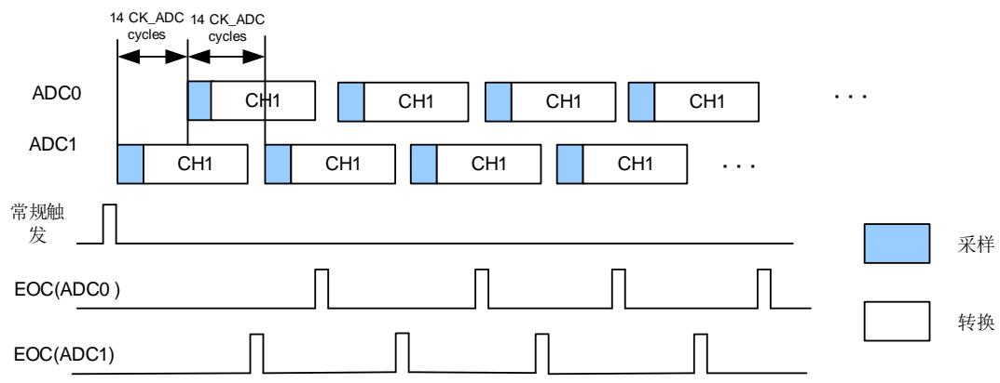

## 12.6. 中断

以下任一个事件发生都可以产生中断：

常规序列转换结束；

模拟看门狗事件；

