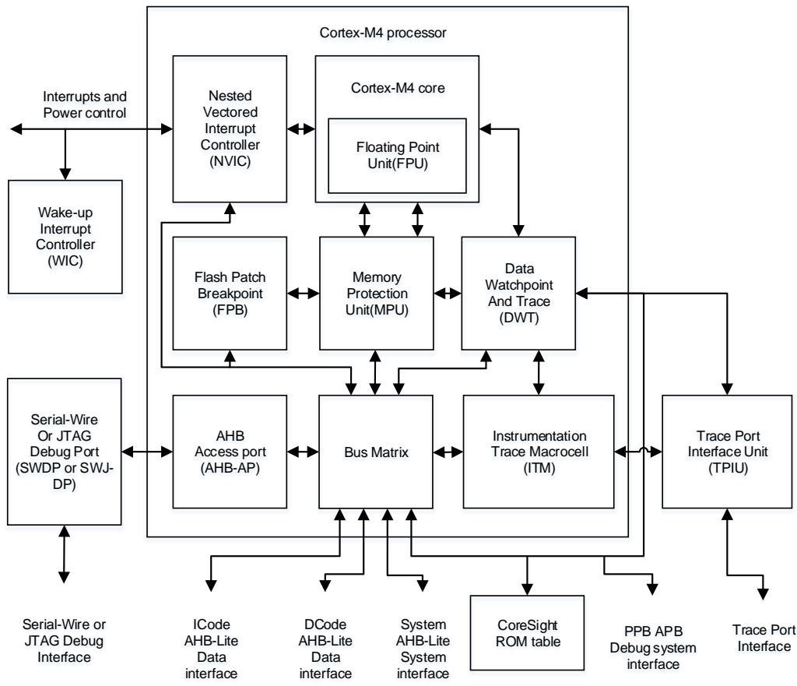
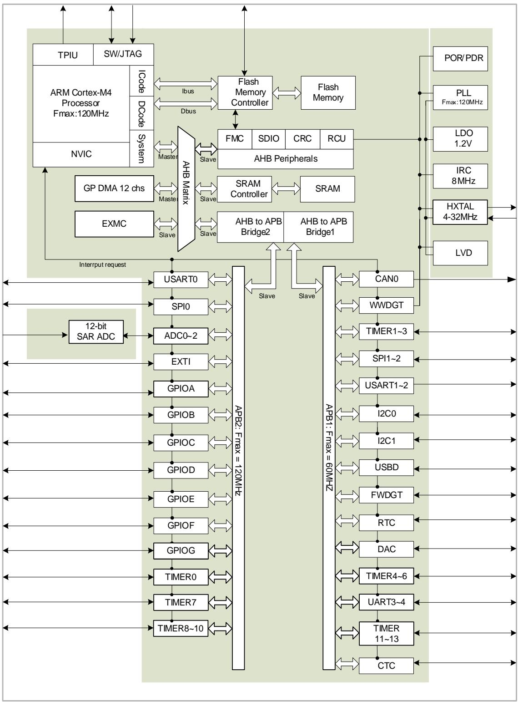
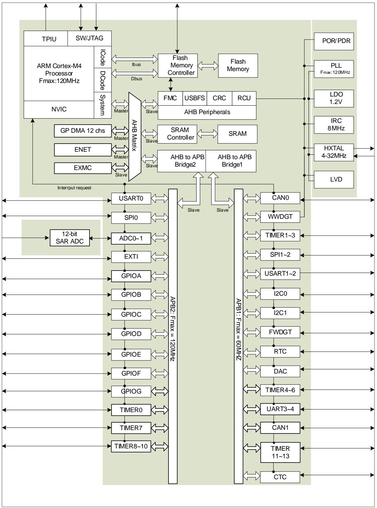

## 1. 系统及存储器架构

GD32F30x系列器件是基于Arm® Cortex®-M4处理器的32位通用微控制器。Arm® Cortex®-M4处理器包括三条AHB总线分别称为I-CODE总线、D-Code总线和系统总线。Cortex®-M4处理器的所有存储访问，根据不同的目的和目标存储空间，都会在这三条总线上执行。存储器的组织采用了哈佛结构，预先定义的存储器映射和高达4 GB的存储空间，充分保证了系统的灵活性和可扩展性。

## 1.1. Arm® Cortex®-M4 处理器

Cortex®-M4处理器是一个具有低中断延迟时间和低成本调试特性的32位处理器。高集成度和增强的特性使Cortex®-M4处理器适合于那些需要高性能和低功耗微控制器的市场领域。Cortex®-M4处理器基于Armv7架构，并且支持一个强大且可扩展的指令集，包括通用数据处理I/O控制任务、增强的数据处理位域操作、DSP(数字信号处理)和浮点运算指令。下面列出由Cortex®-M4提供的一些系统外设：

■ 内部总线矩阵，用于实现I-Code总线、D-Code总线、系统总线、专用总线(PPB)以及调试专用总线(AHB-AP)的互联；

■ 嵌套式向量型中断控制器 (NVIC);

■ 闪存地址重载及断点单元 (FPB);

■ 数据观测点及跟踪单元 (DWT);

■ 指令跟踪宏单元 (ITM);

■ 串行线和JTAG调试接口 (SWJ-DP);

■ 跟踪端口接口单元 (TPIU);

■ 内存保护单元 (MPU);

■ 浮点运算单元 (FPU)。

图1-1. Cortex®-M4结构框图显示了Cortex®-M4处理器结构框图。欲了解更多信息，请参阅Arm® Cortex®-M4技术参考手册。

图 1-1. Cortex®-M4 结构框图

## 1.2. 系统架构

GD32F30x系列器件采用32位多层总线结构，该结构可使系统中的多个主机和从机之间的并行通信成为可能。多层总线结构包括一个AHB互联矩阵、一个AHB总线和两个APB总线。AHB互联矩阵的互联关系接下来将进行说明。在表1-1. AHB互联矩阵的互联关系列表中，“1”表示相应的主机可以通过AHB互联矩阵访问对应的从机，空白的单元格表示相应的主机不可以通过AHB互联矩阵访问对应的从机。

表 1-1. AHB 互联矩阵的互联关系列表

<table><tr><td></td><td>IBUS</td><td>DBUS</td><td>SBUS</td><td>DMA0</td><td>DMA1</td><td>ENET</td></tr><tr><td>FMC-I</td><td>1</td><td></td><td></td><td></td><td></td><td></td></tr><tr><td>FMC-D</td><td></td><td>1</td><td></td><td>1</td><td>1</td><td></td></tr><tr><td>SRAM</td><td>1</td><td>1</td><td>1</td><td>1</td><td>1</td><td>1</td></tr><tr><td>EXMC</td><td>1</td><td>1</td><td>1</td><td>1</td><td>1</td><td>1</td></tr><tr><td>AHB</td><td></td><td></td><td>1</td><td>1</td><td>1</td><td></td></tr><tr><td>APB1</td><td></td><td></td><td>1</td><td>1</td><td>1</td><td></td></tr><tr><td>APB2</td><td></td><td></td><td>1</td><td>1</td><td>1</td><td></td></tr></table>

如表1-1. AHB互联矩阵的互联关系列表所示，AHB互联矩阵连接了几个主机，分别为：IBUS、DBUS、SBUS、DMA0、DMA1和ENET。IBUS是Cortex®-M4内核的指令总线，用于从代码区域(0x0000 0000～0x1FFF FFFF)中取指令和向量。DBUS是Cortex®-M4内核的数据总线，用于加载和存储数据，以及代码区域的调试访问。同样，SBUS是Cortex®-M4内核的系统总线，用于指令和向量获取、数据加载和存储以及系统区域的调试访问。系统区域包括内部SRAM区域和外设区域。DMA0和DMA1分别是DMA0和DMA1的存储器总线。ENET是以太网。

AHB互联矩阵也连接了几个从机，分别为：FMC-I、FMC-D、SRAM、EXMC、AHB、APB1和APB2。FMC-I是闪存存储器控制器的指令总线，而FMC-D是闪存存储器的数据总线。SRAM是片上静态随机存取存储器。EXMC是外部存储器控制器。AHB是连接所有AHB从机的AHB总线，而APB1和APB2是连接所有APB从机的两条APB总线。两条APB总线连接所有的APB外设。APB1操作速度限制在60MHz，APB2操作于全速（这取决于设备，可高达120MHz）。

互联的多层AHB总线架构如下图所示。

图 1-2. GD32F303 系列的系统架构

图 1-3. GD32F305 和 GD32F307 系列的系统架构

## 1.3. 存储器映射

Arm® Cortex®-M4处理器采用哈佛结构，可以使用相互独立的总线来读取指令和加载/存储数据。指令代码和数据都位于相同的存储器地址空间，但在不同的地址范围。程序存储器，数据存储器，寄存器和I/O端口都在同一个线性的4 GB的地址空间之内。这是Cortex®-M4的最大地址范围，因为它的地址总线宽度是32位。此外，为了降低不同器件供应商重复应用的软件复杂度，Cortex®-M4处理器提供预先定义的存储器映射。在存储器映射表中，一部分地址空间由

Arm® Cortex®-M4的系统外设所占用，且不可更改。此外，其余部分地址空间可由芯片供应商定义使用。表1-2. GD32F30x系列器件的存储器映射表显示了GD32F30x系列器件的存储器映射，包括代码、SRAM、外设和其他预先定义的区域。几乎每个外设都分配了1KB的地址空间，这样可以简化每个外设的地址译码。

表 1-2. GD32F30x 系列器件的存储器映射表

<table><tr><td>预定义的区域</td><td>总线</td><td>地址范围</td><td>外设</td></tr><tr><td>外部设备</td><td rowspan="4">AHB3</td><td>0xA000 0000 - 0xA000 0FFF</td><td>EXMC - SWREG</td></tr><tr><td rowspan="3">外部 RAM</td><td>0x9000 0000 - 0x9FFF FFFF</td><td>EXMC - PC CARD</td></tr><tr><td>0x7000 0000 - 0x8FFF FFFF</td><td>EXMC - NAND</td></tr><tr><td>0x6000 0000 - 0x6FFF FFFF</td><td>EXMC - NOR/PSRAM/SRAM</td></tr><tr><td rowspan="31">外设</td><td rowspan="30">AHB1</td><td>0x5000 0000 - 0x5003 FFFF</td><td>USBFS</td></tr><tr><td>0x4008 0000 - 0x4FFF FFFF</td><td>保留</td></tr><tr><td>0x4004 0000 - 0x4007 FFFF</td><td>保留</td></tr><tr><td>0x4002 BC00 - 0x4003 FFFF</td><td>保留</td></tr><tr><td>0x4002 B000 - 0x4002 BBFF</td><td>保留</td></tr><tr><td>0x4002 A000 - 0x4002 AFFF</td><td>保留</td></tr><tr><td>0x4002 8000 - 0x4002 9FFF</td><td>ENET</td></tr><tr><td>0x4002 6800 - 0x4002 7FFF</td><td>保留</td></tr><tr><td>0x4002 6400 - 0x4002 67FF</td><td>保留</td></tr><tr><td>0x4002 6000 - 0x4002 63FF</td><td>保留</td></tr><tr><td>0x4002 5000 - 0x4002 5FFF</td><td>保留</td></tr><tr><td>0x4002 4000 - 0x4002 4FFF</td><td>保留</td></tr><tr><td>0x4002 3C00 - 0x4002 3FFF</td><td>保留</td></tr><tr><td>0x4002 3800 - 0x4002 3BFF</td><td>保留</td></tr><tr><td>0x4002 3400 - 0x4002 37FF</td><td>保留</td></tr><tr><td>0x4002 3000 - 0x4002 33FF</td><td>CRC</td></tr><tr><td>0x4002 2C00 - 0x4002 2FFF</td><td>保留</td></tr><tr><td>0x4002 2800 - 0x4002 2BFF</td><td>保留</td></tr><tr><td>0x4002 2400 - 0x4002 27FF</td><td>保留</td></tr><tr><td>0x4002 2000 - 0x4002 23FF</td><td>FMC</td></tr><tr><td>0x4002 1C00 - 0x4002 1FFF</td><td>保留</td></tr><tr><td>0x4002 1800 - 0x4002 1BFF</td><td>保留</td></tr><tr><td>0x4002 1400 - 0x4002 17FF</td><td>保留</td></tr><tr><td>0x4002 1000 - 0x4002 13FF</td><td>RCU</td></tr><tr><td>0x4002 0C00 - 0x4002 0FFF</td><td>保留</td></tr><tr><td>0x4002 0800 - 0x4002 0BFF</td><td>保留</td></tr><tr><td>0x4002 0400 - 0x4002 07FF</td><td>DMA1</td></tr><tr><td>0x4002 0000 - 0x4002 03FF</td><td>DMA0</td></tr><tr><td>0x4001 8400 - 0x4001 FFFF</td><td>保留</td></tr><tr><td>0x4001 8000 - 0x4001 83FF</td><td>SDIO</td></tr><tr><td>APB2</td><td>0x4001 7C00 - 0x4001 7FFF0x4001 7800 - 0x4001 7BFF</td><td>保留保留</td></tr><tr><td rowspan="40"></td><td rowspan="28"></td><td>0x4001 7400 - 0x4001 77FF</td><td>保留</td></tr><tr><td>0x4001 7000 - 0x4001 73FF</td><td>保留</td></tr><tr><td>0x4001 6C00 - 0x4001 6FFF</td><td>保留</td></tr><tr><td>0x4001 6800 - 0x4001 6BFF</td><td>保留</td></tr><tr><td>0x4001 5C00 - 0x4001 67FF</td><td>保留</td></tr><tr><td>0x4001 5800 - 0x4001 5BFF</td><td>保留</td></tr><tr><td>0x4001 5400 - 0x4001 57FF</td><td>TIMER10</td></tr><tr><td>0x4001 5000 - 0x4001 53FF</td><td>TIMER9</td></tr><tr><td>0x4001 4C00 - 0x4001 4FFF</td><td>TIMER8</td></tr><tr><td>0x4001 4800 - 0x4001 4BFF</td><td>保留</td></tr><tr><td>0x4001 4400 - 0x4001 47FF</td><td>保留</td></tr><tr><td>0x4001 4000 - 0x4001 43FF</td><td>保留</td></tr><tr><td>0x4001 3C00 - 0x4001 3FFF</td><td>ADC2</td></tr><tr><td>0x4001 3800 - 0x4001 3BFF</td><td>USART0</td></tr><tr><td>0x4001 3400 - 0x4001 37FF</td><td>TIMER7</td></tr><tr><td>0x4001 3000 - 0x4001 33FF</td><td>SPI0</td></tr><tr><td>0x4001 2C00 - 0x4001 2FFF</td><td>TIMER0</td></tr><tr><td>0x4001 2800 - 0x4001 2BFF</td><td>ADC1</td></tr><tr><td>0x4001 2400 - 0x4001 27FF</td><td>ADC0</td></tr><tr><td>0x4001 2000 - 0x4001 23FF</td><td>GPIOG</td></tr><tr><td>0x4001 1C00 - 0x4001 1FFF</td><td>GPIOF</td></tr><tr><td>0x4001 1800 - 0x4001 1BFF</td><td>GPIOE</td></tr><tr><td>0x4001 1400 - 0x4001 17FF</td><td>GPIOD</td></tr><tr><td>0x4001 1000 - 0x4001 13FF</td><td>GPIOC</td></tr><tr><td>0x4001 0C00 - 0x4001 0FFF</td><td>GPIOB</td></tr><tr><td>0x4001 0800 - 0x4001 0BFF</td><td>GPIOA</td></tr><tr><td>0x4001 0400 - 0x4001 07FF</td><td>EXTI</td></tr><tr><td>0x4001 0000 - 0x4001 03FF</td><td>AFIO</td></tr><tr><td rowspan="12">APB1</td><td>0x4000 CC00 - 0x4000 FFFF</td><td>保留</td></tr><tr><td>0x4000 C800 - 0x4000 CBFF</td><td>CTC</td></tr><tr><td>0x4000 C400 - 0x4000 C7FF</td><td>保留</td></tr><tr><td>0x4000 C000 - 0x4000 C3FF</td><td>保留</td></tr><tr><td>0x4000 8000 - 0x4000 BFFF</td><td>保留</td></tr><tr><td>0x4000 7C00 - 0x4000 7FFF</td><td>保留</td></tr><tr><td>0x4000 7800 - 0x4000 7BFF</td><td>保留</td></tr><tr><td>0x4000 7400 - 0x4000 77FF</td><td>DAC</td></tr><tr><td>0x4000 7000 - 0x4000 73FF</td><td>PMU</td></tr><tr><td>0x4000 6C00 - 0x4000 6FFF</td><td>BKP</td></tr><tr><td>0x4000 6800 - 0x4000 6BFF</td><td>CAN1</td></tr><tr><td>0x4000 6400 - 0x4000 67FF</td><td>CAN0</td></tr><tr><td rowspan="25"></td><td rowspan="25"></td><td>0x4000 6000 - 0x4000 63FF</td><td>Shared USBD/CAN SRAM512 bytes</td></tr><tr><td>0x4000 5C00 - 0x4000 5FFF</td><td>USBD</td></tr><tr><td>0x4000 5800 - 0x4000 5BFF</td><td>I2C1</td></tr><tr><td>0x4000 5400 - 0x4000 57FF</td><td>I2C0</td></tr><tr><td>0x4000 5000 - 0x4000 53FF</td><td>UART4</td></tr><tr><td>0x4000 4C00 - 0x4000 4FFF</td><td>UART3</td></tr><tr><td>0x4000 4800 - 0x4000 4BFF</td><td>USART2</td></tr><tr><td>0x4000 4400 - 0x4000 47FF</td><td>USART1</td></tr><tr><td>0x4000 4000 - 0x4000 43FF</td><td>保留</td></tr><tr><td>0x4000 3C00 - 0x4000 3FFF</td><td>SPI2/I2S2</td></tr><tr><td>0x4000 3800 - 0x4000 3BFF</td><td>SPI1/I2S1</td></tr><tr><td>0x4000 3400 - 0x4000 37FF</td><td>保留</td></tr><tr><td>0x4000 3000 - 0x4000 33FF</td><td>FWDGT</td></tr><tr><td>0x4000 2C00 - 0x4000 2FFF</td><td>WWDGT</td></tr><tr><td>0x4000 2800 - 0x4000 2BFF</td><td>RTC</td></tr><tr><td>0x4000 2400 - 0x4000 27FF</td><td>保留</td></tr><tr><td>0x4000 2000 - 0x4000 23FF</td><td>TIMER13</td></tr><tr><td>0x4000 1C00 - 0x4000 1FFF</td><td>TIMER12</td></tr><tr><td>0x4000 1800 - 0x4000 1BFF</td><td>TIMER11</td></tr><tr><td>0x4000 1400 - 0x4000 17FF</td><td>TIMER6</td></tr><tr><td>0x4000 1000 - 0x4000 13FF</td><td>TIMER5</td></tr><tr><td>0x4000 0C00 - 0x4000 0FFF</td><td>TIMER4</td></tr><tr><td>0x4000 0800 - 0x4000 0BFF</td><td>TIMER3</td></tr><tr><td>0x4000 0400 - 0x4000 07FF</td><td>TIMER2</td></tr><tr><td>0x4000 0000 - 0x4000 03FF</td><td>TIMER1</td></tr><tr><td rowspan="5">SRAM</td><td rowspan="5">AHB</td><td>0x2007 0000 - 0x3FFF FFFF</td><td>保留</td></tr><tr><td>0x2006 0000 - 0x2006 FFFF</td><td>保留</td></tr><tr><td>0x2003 0000 - 0x2005 FFFF</td><td>保留</td></tr><tr><td>0x2001 8000 - 0x2002 FFFF</td><td>保留</td></tr><tr><td>0x2000 0000 - 0x2001 7FFF</td><td>SRAM</td></tr><tr><td rowspan="7">Code</td><td rowspan="7">AHB</td><td>0x1FFF F810 - 0x1FFF FFFF</td><td>保留</td></tr><tr><td>0x1FFF F800 - 0x1FFF F80F</td><td>Option Bytes</td></tr><tr><td>0x1FFF B000 - 0x1FFF F7FF</td><td>Boot loader</td></tr><tr><td>0x1FFF 7A10 - 0x1FFF AFFF</td><td>保留</td></tr><tr><td>0x1FFF 7800 - 0x1FFF 7A0F</td><td>保留</td></tr><tr><td>0x1FFF 0000 - 0x1FFF 77FF</td><td>保留</td></tr><tr><td>0x1FFE C010 - 0x1FFE FFFF0x1FFE C000 - 0x1FFE C00F</td><td>保留保留</td></tr><tr><td rowspan="9"></td><td rowspan="9"></td><td>0x1001 0000 - 0x1FFE BFFF</td><td>保留</td></tr><tr><td>0x1000 0000 - 0x1000 FFFF</td><td>保留</td></tr><tr><td>0x083C 0000 - 0x0FFF FFFF</td><td>保留</td></tr><tr><td>0x0830 0000 - 0x083B FFFF</td><td>保留</td></tr><tr><td>0x0800 0000 - 0x082F FFFF</td><td>Main Flash</td></tr><tr><td>0x0030 0000 - 0x07FF FFFF</td><td>保留</td></tr><tr><td>0x0010 0000 - 0x002F FFFF</td><td rowspan="3">Aliased to Main Flash or Boot loader</td></tr><tr><td>0x0002 0000 - 0x000F FFFF</td></tr><tr><td>0x0000 0000 - 0x0001 FFFF</td></tr></table>

## 1.3.1. 位带操作

为了减少“读-改-写”操作的次数，Cortex®-M4处理器提供了一个可以执行单原子比特操作的位带功能。存储器映射包含了两个支持位带操作的区域，分别位于SRAM和外设中。位带区域将存储器别名区的每个字映射到存储器位带区的某个位上。

下面的映射公式表明了别名区中的每个字如何对应到位带区的相应比特或目标比特。

$$
\text { bit\_word\_addr } = \text { bit\_band\_base } + (\text { byte\_offset } \times 3 2) + (\text { bit\_number } \times 4) \tag {式1-1}
$$

其中：

■ bit_word_addr指的是映射到位带区目标比特的别名存储器区字地址；

■ bit_band_base指的是别名区的起始地址；

byte_offset指的是位带区目标比特所在的字节的字节地址偏移量；

■ bit_number指的是目标比特在对应字节中的位置(0-7)。

例如，要想访问0x2000 0200地址的第7位，可访问的位带别名区地址是：

$$
\text { bit\_word\_addr } = 0 \times 2 2 0 0 0 0 0 0 + (0 \times 2 0 0 * 3 2) + (7 * 4) = 0 \times 2 2 0 0 4 0 1 C \tag {式1-2}
$$

如果对0x2200 401C进行写操作，那么0x2000 0200的第7位将会相应变化；如果对0x2200 401C进行读操作，那么根据SRAM中0x2000 0200地址的第7位的值来返回0x01或0x00。

## 1.3.2. 片上 SRAM 存储器

GD32F30x系列微控制器的片上SRAM起始地址是0x2000 0000，最大容量可达96KB。它支持字节、半字（16位）以及字（32位）访问。

## 1.3.3. 片上 FLASH 存储器概述

GD32F30x系列微控制器提供高密度片上FLASH存储器，按以下分类进行组织：

■ 高达3072KB主FLASH存储器；

■ 高达18KB引导装载程序(boot loader)信息块存储器；

■ 器件配置的选项字节。

GD32F303xx 的闪存存储器容量 128K 到 512K 字节之间的产品称作高密度产品 (GD32F30X_HD)。

GD32F303xx的闪存存储器容量大于512K字节的产品称作超高密度产品 (GD32F30X_XD)。

GD32F305xx和GD32F307xx微控制器称作互联型产品(GD32F30X_CL)。

更多详细说明请参考闪存控制器（FMC）章节。

## 1.4. 引导配置

GD32F30x系列微控制器提供了三种引导源，可以通过BOOT0和BOOT1引脚来进行选择，详细说明见表1-3. 引导模式。该两个引脚的电平状态会在复位后的第四个CK_SYS(系统时钟)的上升沿进行锁存。用户可自行选择所需要的引导源，通过设置上电复位和系统复位后的BOOT0和BOOT1的引脚电平。一旦这两个引脚电平被采样，它们可以被释放并用于其他用途。

表 1-3. 引导模式

<table><tr><td rowspan="2">引导源选择</td><td colspan="2">启动模式选择引脚</td></tr><tr><td>Boot1</td><td>Boot0</td></tr><tr><td>主FLASH存储器</td><td>x</td><td>0</td></tr><tr><td>引导装载程序</td><td>0</td><td>1</td></tr><tr><td>片上SRAM</td><td>1</td><td>1</td></tr></table>

上电序列或系统复位后，Arm®Cortex®-M4处理器先从0x0000 0000地址获取栈顶值，再从0x0000 0004地址获得引导代码的基地址，然后从引导代码的基地址开始执行程序。

根据所选择的引导源，主FLASH存储器（开始于0x0800 0000的原始存储空间）或系统存储器（HD系列开始于0x1FFF F000的原始存储空间，其它系列地址请参考表2-1.GD32F30x CL和GD32F30x HD，GD32F30x XD闪存基地址和构成）被映射到引导存储空间（起始于0x0000 0000）。片上SRAM存储空间的起始地址是0x2000 0000，当它被选择为引导源时，在应用初始化代码中，你必须使用NVIC异常表和偏移寄存器来将向量表重定向到SRAM中。

嵌入式的Bootloader存放在系统存储空间，用于对FLASH存储器进行重新编程。

GD32F30x芯片支持嵌入式引导程序通过多种接口方式来更新Flash。可以有1或2个USART端口和标准USB端口用于GD32F30x系列产品。如下表所示。

表1-4. 引导程序支持外设

<table><tr><td>产品线</td><td>产品</td><td>支持串行外设</td></tr><tr><td>HD</td><td>GD32F303xx</td><td>USART0(PA9 PA10)</td></tr><tr><td>XD</td><td>GD32F303xx</td><td>USART0(PA9 PA10)USART1(PA2 PA3)</td></tr><tr><td>CL</td><td>GD32F305xxGD32F307xx</td><td>USART0(PA9 PA10)USART1(PD5 PD6)USB(PA9 PA11 PA12)USART0(PA9 PA10)USART1(PD5 PD6)USB(PA9 PA11 PA12)</td></tr></table>

## 1.5. 设备电子签名

设备的电子签名中包含的存储容量信息和96位的唯一设备ID，它位于Flash存储器的信息块中。96位设备唯一ID对任何设备来说都是独一无二的，可以用作序列号，或秘钥的一部分，等等。

## 1.5.1. 存储器容量信息

基地址：0x1FFF F7E0

其值出厂已设置，不可由用户更改。

<table><tr><td>31</td><td>30</td><td>29</td><td>28</td><td>27</td><td>26</td><td>25</td><td>24</td><td>23</td><td>22</td><td>21</td><td>20</td><td>19</td><td>18</td><td>17</td><td>16</td></tr><tr><td colspan="16">SRAM_DENSITY[15:0]</td></tr><tr><td colspan="16">r</td></tr><tr><td>15</td><td>14</td><td>13</td><td>12</td><td>11</td><td>10</td><td>9</td><td>8</td><td>7</td><td>6</td><td>5</td><td>4</td><td>3</td><td>2</td><td>1</td><td>0</td></tr><tr><td colspan="16">FLASH_DENSITY[15:0]</td></tr></table>

r 

<table><tr><td>位/位域</td><td>名称</td><td>描述</td></tr><tr><td>31:16</td><td>SRAM_DENSITY[15:0]</td><td>SRAM容量该值表示器件的片上SRAM容量,以Kbytes为单位。例如:0x0008表示8Kbytes。</td></tr><tr><td>15:0</td><td>FLASH_DENSITY[15:0]</td><td>FLASH存储器容量该值表示器件的FLASH存储器容量,以Kbytes为单位。例如:0x0020表示32Kbytes。</td></tr></table>

## 1.5.2. 设备唯一 ID（96 位）

基地址：0x1FFF F7E8

其值出厂已设置，不可由用户更改。

<table><tr><td>31</td><td>30</td><td>29</td><td>28</td><td>27</td><td>26</td><td>25</td><td>24</td><td>23</td><td>22</td><td>21</td><td>20</td><td>19</td><td>18</td><td>17</td><td>16</td></tr><tr><td colspan="16">UNIQUE_ID[31:16]</td></tr><tr><td colspan="16">r</td></tr><tr><td>15</td><td>14</td><td>13</td><td>12</td><td>11</td><td>10</td><td>9</td><td>8</td><td>7</td><td>6</td><td>5</td><td>4</td><td>3</td><td>2</td><td>1</td><td>0</td></tr><tr><td colspan="16">UNIQUE_ID[15:0]</td></tr></table>

r 

<table><tr><td>位/位域</td><td>名称</td><td>描述</td></tr><tr><td>31:0</td><td>UNIQUE_ID[31:0]</td><td>设备唯一 ID</td></tr></table>

基地址：0x1FFF F7EC

其值出厂已设置，不可由用户更改。

<table><tr><td>31</td><td>30</td><td>29</td><td>28</td><td>27</td><td>26</td><td>25</td><td>24</td><td>23</td><td>22</td><td>21</td><td>20</td><td>19</td><td>18</td><td>17</td><td>16</td></tr><tr><td colspan="16">UNIQUE_ID[63:48]</td></tr><tr><td colspan="16">r</td></tr><tr><td>15</td><td>14</td><td>13</td><td>12</td><td>11</td><td>10</td><td>9</td><td>8</td><td>7</td><td>6</td><td>5</td><td>4</td><td>3</td><td>2</td><td>1</td><td>0</td></tr><tr><td colspan="16">UNIQUE_ID[47:32]</td></tr></table>

r 

<table><tr><td>位/位域</td><td>名称</td><td>描述</td></tr><tr><td>31:0</td><td>UNIQUE_ID[63:32]</td><td>设备唯一 ID</td></tr></table>

基地址：0x1FFF F7F0

其值出厂已设置，不可由用户更改。

<table><tr><td>31</td><td>30</td><td>29</td><td>28</td><td>27</td><td>26</td><td>25</td><td>24</td><td>23</td><td>22</td><td>21</td><td>20</td><td>19</td><td>18</td><td>17</td><td>16</td></tr><tr><td colspan="16">UNIQUE_ID[95:80]</td></tr><tr><td colspan="16">r</td></tr><tr><td>15</td><td>14</td><td>13</td><td>12</td><td>11</td><td>10</td><td>9</td><td>8</td><td>7</td><td>6</td><td>5</td><td>4</td><td>3</td><td>2</td><td>1</td><td>0</td></tr><tr><td colspan="16">UNIQUE_ID[79:64]</td></tr></table>

r 

<table><tr><td>位/位域</td><td>名称</td><td>描述</td></tr><tr><td>31:0</td><td>UNIQUE_ID[95:64]</td><td>设备唯一 ID</td></tr></table>

