## 20. SDIO 接口（SDIO）

## 20.1. 简介

安全的数字输入/输出接口（SDIO）定义了 SD 卡、SD I/O 卡、多媒体卡（MMC）和 CE-ATA卡主机接口，提供 AHB 系统总线与 SD 存储卡、SD I/O 卡、MMC 和 CE-ATA 设备之间的数据传输。

所支持的 SD 存储卡和 SD I/O 卡系统规格书可以通过 SD 卡协会网站（www.sdcard.org）获取。

所支持的多媒体卡（MMC）系统规格书可以通过多媒体卡协会网站（www.jedec.org） 获取，由 JEDEC 固态技术协会出版。

所支持的 CE-ATA 系统规格书可以通过 CE-ATA 工作组网站（www.ce-ata.org）获取。

## 20.2. 主要特性

SDIO 的主要特征如下：

MMC：与多媒体卡系统规格书 V4.2 及之前的版本全兼容。有三种不同的数据总线模式：1 位(默认)、4 位和 8 位；

SD 卡：与 SD 存储卡规格版本 2.0 全兼容；

SD I/O：与 SD I/O 卡规格版本 2.0 全兼容，有两种不同的数据总线模式：1 位(默认)和 4位；

CE-ATA：与 CE-ATA 数字协议版本 1.1 全兼容；

48MHz数据传输频率和 8 位数据传输模式；

中断和 DMA 请求；

完成信号使能和失能(CE-ATA)。

注意：SDIO 在同一时间仅支持一个 SD、SD I/O、MMC4.2 或 CE-ATA 设备，但可支持多个MMC4.1 或以前版本的卡。

## 20.3. SDIO 总线拓扑

上电复位之后，主机必须通过特殊的基于消息的总线协议来初始化卡。

每个消息是由以下部分中的一个来表示：

命令：命令是启动一个操作的令牌，从主机发送到卡。命令串行传输在 CMD 线上。

响应：响应是从卡发送到主机，作为先前接收到的命令的回应。响应串行传输在 CMD 线上。

数据：数据可以从卡传输到主机或者从主机传输到卡。数据通过数据线传送。用于数据传输的数据线的数目可以是 1（DAT0）、4（DAT0-DAT3）或 8（DAT0-DAT7）。

命令，响应和数据块的结构在 章节中介绍。一次数据传输就是一个总线操作。

有几种不同类型的操作。一般操作总是包含一个命令和响应。此外，一些操作还有一个数据令牌。还有一些其他操作直接将他们的信息包含在命令或响应结构中。在这种情况下，操作没有数据令牌。在 DAT0-DAT7 和 CMD 信号线上的比特位根据主机时钟同步传输。

两种类型的数据传输命令定义如下：

流命令：这些命令发起连续的数据流，只有当 CMD 信号线上出现停止命令时，数据传输终止。该模式将命令的开销减少到最低（仅支持 MMC）。

面向块的命令：这些命令成功发送一个数据块后紧跟一个 CRC 校验。读和写操作允许单个或多个块传输。与连续读相同，当 CMD 信号线上出现停止命令时，多块传输终止。

总线上的基本操作是命令/响应操作（参考 20-1. SDIO “ ” “ ” 。这种类型的总线事务直接在命令或响应结构中传递它们的信息。此外，有些操作还有数据令牌。卡与设备之间的数据传输通过块完成。

图 20-1. SDIO “无响应” 和 “无数据” 操作

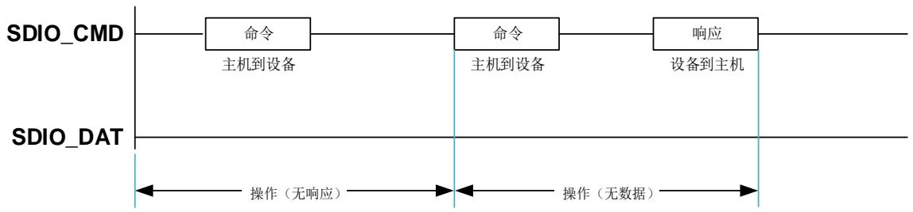

多块操作模式比单块操作速度更快。当 CMD 信号线上出现停止命令时，多块传输终止。主机数据传输可以使用单个或多个数据线。多个块的读操作如 20-2. SDIO 所示，多个块的写操作如 20-3.SDIO 所示。块的写操作在数据（DAT0）信号线上使用忙信号。CE-ATA 设备在准备接收数据之前有一个可选的忙信号。

图 20-2. SDIO 多块读操作

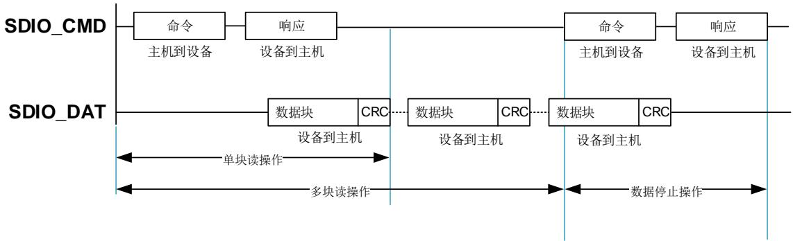

图 20-3. SDIO 多块写操作

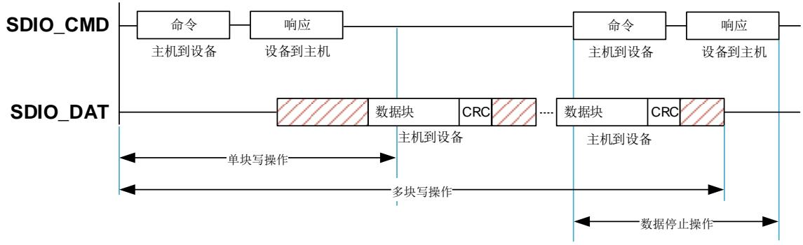

SD 存储卡、SD I/O 卡（包括仅 IO 卡和组合卡）和 CE-ATA 设备直接的数据传输是以数据块的方式完成的。MMC 卡以数据块或数据流方式进行数据传输。 20-4.SDIO 和20-5. SDIO 分别是数据流的读和写操作。

图 20-4. SDIO 数据流读操作

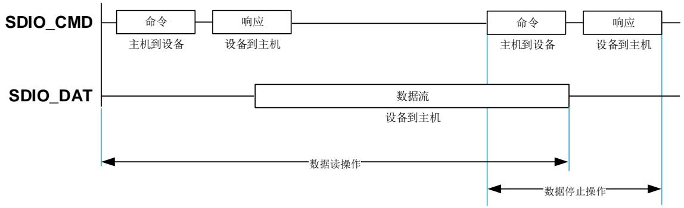

图 20-5. SDIO 数据流写操作

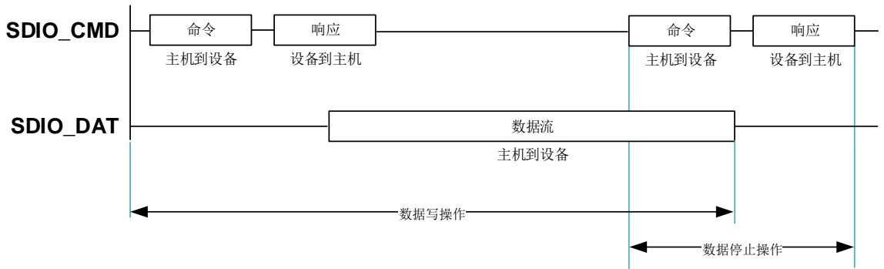

## 20.4. SDIO 功能描述

20-6. SDIO 显示了 SDIO 的结构框图，主要有两大部分：

SDIO 适配器：由控制单元、命令单元和数据单元组成。控制单元管理时钟信号，命令单元管理命令的传输，数据单元管理数据的传输。

AHB 接口：包括通过 AHB 总线访问的寄存器、用于数据传输的 FIFO 单元以及产生中断

和 DMA 请求信号。

图 20-6. SDIO 框图

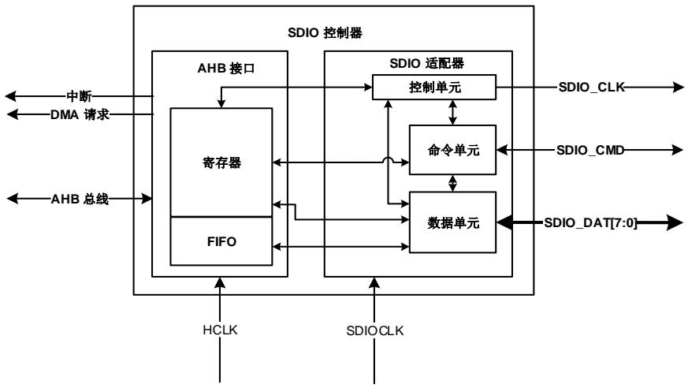

## 20.4.1. SDIO 适配器

SDIO 适配器包括控制单元、命令单元和数据单元，并且可以向卡生成信号。这些信号的具体描述如下：

SDIO_CLK：SDIO 控制器提供给卡的时钟。每个时钟周期在命令线(SDIO_CMD)和所有的数据线(SDIO_DAT)上直接发送一位命令或数据。对于 MMC 卡 V3.31 版本，SDIO_CLK 频率可以在 0 MHz 到 20 MHz 之间，对于 MMC 卡 V4.2 版本可以在 0 MHz 到 48MHz 之间，对于SD 或 SD I/O 卡可以在 0 MHz 到 25 MHz。

SDIO 使用两个时钟信号：SDIO 适配器时钟(SDIOCLK = HCLK)和 AHB 总线时钟(HCLK)。

SDIO_CMD：该信号是双向命令通道，用于卡的初始化和命令的传输。命令从 SDIO 控制器发送到卡，响应从卡发送到主机。CMD 信号有两种操作模式：用于初始化的开漏模式（仅用于MMC 卡 V3.31 及之前版本）和用于命令传送的推挽模式（SD 卡/SD I/O 卡和 MMC 卡 4.2 版本初始化时也是用推挽模式）。

SDIO_DAT[7:0]：这些信号线都是双向数据通道。数据信号线操作在推挽模式。每次只有卡或者主机会驱动这些信号。默认情况下，上电或者复位后仅 DAT0 用于数据传输。SDIO 适配器可以配置更宽的数据总线用于数据传输，使用 DAT0-DAT3 或者 DAT0-DAT7(仅适用于 MMCV4.2)。SDIO 对数据信号线 DAT1-DAT7 有内部上拉。在进入 4 位模式后，卡断开 DAT1 和DAT2 的内部上拉（DAT3 内部上拉保持不变是由于 SPI 模式下 CS片选的使用）。相应地，在进入 8 位模式后，断开 DAT1，DAT2 和 DAT4-DAT7 的内部上拉。

表 20-1. SDIO I/O 定义

<table><tr><td>引脚功能</td><td>方向</td><td>描述</td></tr><tr><td>SDIO_CLK</td><td>O</td><td>SD/SD I/O /MMC 时钟</td></tr><tr><td>SDIO_CMD</td><td>I/O</td><td>命令的输入/输出</td></tr><tr><td>SDIO_DAT[7:0]</td><td>I/O</td><td>数据线 DAT[7:0]的数据输入/输出</td></tr></table>

SDIO 适配器是 SD/SD I/O /MMC/CE-ATA 的接口，它由 3 个子单元组成：

## 控制单元

控制单元包含电源管理功能和时钟管理功能用于存储卡时钟。电源管理是由 SDIO_PWRCTL寄存器控制的，实现电源的掉电和上电。通过设置 SDIO_CLKCTL 的 CLKPWRSAV 位来配置省电模式，实现当总线空闲时，关闭 SDIO_CLK。时钟管理向卡生成 SDIO_CLK 时钟信号。当 SDIO_CLKCTL 寄存器的 CLKBYP 位为 0 时，SDIO_CLK 由 SDIOCLK 分频得到；当SDIO_CLKCTL 寄存器的 CLKBYP 位为 1 时，SDIO_CLK 直接为 SDIOCLK。

通过设置 SDIO_CLKCTL 寄存器的 HWCLKEN 位使能硬件时钟控制。该功能用于避免 FIFO下溢和上溢错误，硬件根据系统总线是否繁忙，控制 SDIO_CLK 的开关。当 FIFO 不能接收或发送数据，主机将会关闭 SDIO_CLK 并冻结 SDIO 状态机来避免相关错误。只有状态机能被冻结，但 AHB 接口仍在工作。所以，FIFO 可以通过 AHB 总线访问。

## 命令单元

命 令 单 元 实 现 向 卡 发 送 和 接 收 命 令 。 数 据 传 输 流 由 命 令 状 态 机(CSM)控 制 。 在 对SDIO_CMDCTL寄存器进行一次写操作并设置该寄存器的CSMEN位为1后，命令传输开始。首先向卡发送一个命令，这个命令包含 48 位，通过 SDIO_CMD 线发出，每个 SDIO_CLK发送一个比特数据。这 48 位命令包含 1 位起始位、1 位传输位、6 位命令索引（由 SDIO_CMDCTL寄存器的 CMDIDX 位定义）、32 位参数（由 SDIO_CMDAGMT 定义）、7 位 CRC 和 1 位停止位。然后接收来自卡的响应（在 SDIO_CMDCTL 寄存器的 CMDIDX 位不为 0b00 或 0b10 的情况下），响应分为 48 位的短响应和 136 位的长响应，响应都存在 SDIO_RESP0 -SDIO_RESP3 寄存器中。命令单元同样可以产生命令状态标志（在 SDIO_STAT 寄存器中定义）。

命令状态机

<table><tr><td colspan="2">CS_Idle</td><td colspan="3">复位后准备发送命令</td></tr><tr><td rowspan="4"></td><td colspan="2">1.CSM 被使能并且 WAITDEND 使能</td><td>→</td><td>CS_Pend</td></tr><tr><td colspan="2">2.CSM 被使能并且 WAITDEND 失能</td><td>→</td><td>CS_Send</td></tr><tr><td colspan="2">3.CSM 被关闭</td><td>→</td><td>CS_Idle</td></tr><tr><td colspan="4">注意:命令状态机在空闲状态至少保持 8 个 SDIO_CLK 周期,以满足 Ncc 和 NRC 时序限制。Ncc 是两个主机命令之间的最小时间间隔,NRC 是主机命令与卡响应之间的最小时间间隔。</td></tr></table>

<table><tr><td colspan="2">CS_Pend</td><td colspan="3">等待数据传输结束</td></tr><tr><td rowspan="2"></td><td colspan="2">1.数据传送完成</td><td>→</td><td>CS_Send</td></tr><tr><td colspan="2">2.CSM 被关闭</td><td>→</td><td>CS_Idle</td></tr></table>

<table><tr><td colspan="2">CS_Send</td><td colspan="3">发送命令</td></tr><tr><td rowspan="3"></td><td colspan="2">1.命令发送后有响应</td><td>→</td><td>CS_Wait</td></tr><tr><td colspan="2">2.命令发送后无响应</td><td>→</td><td>CS_Idle</td></tr><tr><td colspan="2">3.CSM 被关闭</td><td>→</td><td>CS_Idle</td></tr></table>

<table><tr><td>CS_Wait</td><td>等待响应起始位</td></tr></table>

<table><tr><td>1.接收到响应(检测到起始位)</td><td>→</td><td>CS_Receive</td></tr><tr><td>2.接收响应超时</td><td>→</td><td>CS_Idle</td></tr><tr><td>3.CSM 被关闭</td><td>→</td><td>CS_Idle</td></tr><tr><td colspan="3">注意:命令超时时间固定为 64 个 SDIO_CLK 时钟周期。</td></tr></table>

<table><tr><td colspan="2">CS_Receive</td><td colspan="3">接收响应并检测 CRC</td></tr><tr><td rowspan="5"></td><td colspan="2">1.在 CE-ATA 模式下收到响应,失能 CE-ATA 中断并且等待 CE-ATA 设备命令完成信号使能</td><td>→</td><td>CS_Waitcompl</td></tr><tr><td colspan="2">2.在 CE-ATA 模式下收到响应,失能 CE-ATA 中断并且等待 CE-ATA 设备命令完成信号失能</td><td>→</td><td>CS_Pend</td></tr><tr><td colspan="2">3.CSM 被关闭</td><td>→</td><td>CS_Idle</td></tr><tr><td colspan="2">4.收到响应</td><td>→</td><td>CS_Idle</td></tr><tr><td colspan="2">5.命令 CRC 检测失败</td><td>→</td><td>CS_Idle</td></tr></table>

<table><tr><td colspan="2">CS_Waitcompl</td><td colspan="3">等待 CE-ATA 设备命令完成信号</td></tr><tr><td rowspan="3"></td><td colspan="2">1.收到 CE-ATA 命令完成信号</td><td>→</td><td>CS_Idle</td></tr><tr><td colspan="2">2.CSM 被关闭</td><td>→</td><td>CS_Idle</td></tr><tr><td colspan="2">3.命令 CRC 检测失败</td><td>→</td><td>CS_Idle</td></tr></table>

## 数据单元

数据单元实现主机与卡之间的数据传输。当数据宽度为 8 位（SDIO_CLKCTL 寄存器的BUSMODE 位为 0b10）时，数据传输使用 SDIO_DAT[7:0]信号线；当数据宽度为 4 位（SDIO_CLKCTL 寄存器的 BUSMODE 位为 0b01）时，数据传输使用 SDIO_DAT[3:0]信号线；当数据宽度为 1 位（SDIO_CLKCTL 寄存器的 BUSMODE 位为 0b00）时，数据传输使用SDIO_DAT[0]信号线。数据传输流由数据状态机(DSM)控制。在对 SDIO_DATACTL 寄存器进行一次写操作并将 SDIO_DATACTL 寄存器的 DATAEN 位为 1，数据传输开始。当SDIO_DATACTL 寄存器的 DATADIR 位为 0 时，数据是从控制器到卡；当 DATADIR 位为 1时，数据是从卡到控制器。数据单元同样可以产生数据状态标志（在 SDIO_STAT 寄存器中定义）。

数据状态机

<table><tr><td colspan="2">DS_Idle</td><td colspan="3">数据单元不工作,等待发送和接收数据</td></tr><tr><td rowspan="3"></td><td colspan="2">1.DSM 使能并且数据传输方向为主机到卡</td><td>→</td><td>DS_WaitS</td></tr><tr><td colspan="2">2.DSM 使能并且数据传输方向为卡到主机</td><td>→</td><td>DS_WaitR</td></tr><tr><td colspan="2">3.DSM 使能并且读等待已经开始并且使能 SD I/O 模式</td><td>→</td><td>DS_Readwait</td></tr></table>

<table><tr><td colspan="2">DS_WaitS</td><td colspan="3">等待数据 FIFO 为空标志无效或者数据传输结束</td></tr><tr><td rowspan="3"></td><td colspan="2">1.数据传输结束</td><td>→</td><td>DS_Idle</td></tr><tr><td colspan="2">2.DSM 被关闭</td><td>→</td><td>DS_Idle</td></tr><tr><td colspan="2">3.数据 FIFO 为空标志无效</td><td>→</td><td>DS_Send</td></tr><tr><td colspan="2">DS_Send</td><td colspan="3">发送数据到卡</td></tr><tr><td rowspan="4"></td><td colspan="2">1.数据块已发送</td><td>→</td><td>DS_Busy</td></tr><tr><td colspan="2">2.DSM 被关闭</td><td>→</td><td>DS_Idle</td></tr><tr><td colspan="2">3.数据 FIFO 下溢错误发生</td><td>→</td><td>DS_Idle</td></tr><tr><td colspan="2">4.内部 CRC 错误</td><td>→</td><td>DS_Idle</td></tr></table>

<table><tr><td colspan="2">DS_Busy</td><td colspan="3">等待 CRC 状态标志</td></tr><tr><td rowspan="5"></td><td colspan="2">1.接收到正确 CRC 状态并且卡不繁忙</td><td>→</td><td>DS_WaitS</td></tr><tr><td colspan="2">2.没有接收到正确 CRC 状态</td><td>→</td><td>DS_Idle</td></tr><tr><td colspan="2">3.DSM 被关闭</td><td>→</td><td>DS_Idle</td></tr><tr><td colspan="2">4.数据超时发生</td><td>→</td><td>DS_Idle</td></tr><tr><td colspan="4">注意:命令超时时间设置在数据超时寄存器(SDIO_DATATO)中。</td></tr></table>

<table><tr><td colspan="2">DS_WaitR</td><td colspan="3">等待接收数据的起始位</td></tr><tr><td rowspan="5"></td><td colspan="2">1.数据接收结束</td><td>→</td><td>DS_Idle</td></tr><tr><td colspan="2">2.DSM 被关闭</td><td>→</td><td>DS_Idle</td></tr><tr><td colspan="2">3.数据超时</td><td>→</td><td>DS_Idle</td></tr><tr><td colspan="2">4.在超时前收到起始位</td><td>→</td><td>DS_Receive</td></tr><tr><td colspan="4">注意:命令超时时间设置在数据超时寄存器(SDIO_DATATO)中。</td></tr></table>

<table><tr><td colspan="2">DS_Receive</td><td colspan="3">接收卡的数据并将其写入数据 FIFO</td></tr><tr><td rowspan="5"></td><td colspan="2">1.数据块已接收</td><td>→</td><td>DS_WaitR</td></tr><tr><td colspan="2">2.数据传输结束</td><td>→</td><td>DS_WaitR</td></tr><tr><td colspan="2">3.数据FIFO下溢发送</td><td>→</td><td>DS_Idle</td></tr><tr><td colspan="2">4.数据已经接收并且读等待开始并且使能SD I/O模式</td><td>→</td><td>DS_Readwait</td></tr><tr><td colspan="2">5.DSM被关闭或CRC错误</td><td>→</td><td>DS_Idle</td></tr></table>

<table><tr><td colspan="2">DS_Readwait</td><td colspan="3">等待“读等待停止”指令</td></tr><tr><td rowspan="2"></td><td colspan="2">1.“读等待停止”使能</td><td>→</td><td>DS_WaitR</td></tr><tr><td colspan="2">2.DSM 被关闭</td><td>→</td><td>DS_Idle</td></tr></table>

## 20.4.2. AHB 接口

AHB 接口实现了访问 SDIO 寄存器、数据 FIFO 和生成中断和 DMA 请求。它包括数据 FIFO单元、寄存器单元和中断/DMA逻辑。

至少一个已经被选中的状态标志为高时，中断逻辑产生中断。中断使能寄存器允许中断逻辑产生相应的中断。

DMA接口提供一种方法，可以快速地在 SDIO 数据 FIFO 和存储器直接进行数据传输。下面的

例子描述了如何实现这种方法：

1. 完成卡识别的过程。

2. 提高 SDIO_CLK 时钟频率。

3. 发送 CMD7 用于选择卡并配置总线宽度。

4. DMA1 的配置过程如下：

打开 DMA1 控制器并清除任何中断标志。用存储器基地址来配置 DMA1 通道 3 的源地址寄存器，用 SDIO_FIFO 寄存器的地址来配置 DMA1 通道 3 的目的地址寄存器。配置 DMA1 通道3 的控制寄存器（存储器地址指针递增，外设地址指针固定，存储器和外设的数据宽度为字）。

5. 写数据块（CMD24）到卡的过程如下：

以字节的形式将数据大小写入到 SDIO_DATALEN 寄存器中。以字节的形式将块大小(BLKSZ)写入到 SDIO_DATACTL 寄 存 器 中 ， 然 后 主 机 以 每 个 块 BLKSZ 大 小 发 送 数 据 。 向SDIO_CMDAGMT 中写入数据的地址，该地址是卡中需要传输的数据地址。配置 SDIO 命令控制寄存器(SDIO_CMDCTL)：CMDIDX 置为 24， CMDRESP 置为 1（SDIO 卡主机等待短响应），CSMEN 置为 1（发送命令使能）。其他字段为其复位值。

当 CMDRECV 标志被置位，配置 SDIO 数据控制寄存器(SDIO_DATACTL)：DATAEN 置为 1（发送数据使能），DATADIR 置为 0（传输方向从控制器到卡），TRANSMOD 置为 0（块传输），DMAEN 置为 1（DMA使能），BLKSZ 置为 0x9（512 字节）。其他字段不用设置。

等待 DTBLKEND 标志位置位。通过轮询 DMA 中断标志寄存器，检查没有通道处于使能状态。

它还包括下面两个子单元：

## 寄存器单元

寄存器单元包含所有的系统寄存器，生成信号用于控制卡与控制器之间的通信。

## 数据 FIFO

数据 FIFO 单元有一个数据缓冲区，用于发送和接收 FIFO。FIFO 包含一个每个字的宽度为 32位，深度为 32 字的数据缓冲区。发送 FIFO 被用在当需要写数据到卡上并且 SDIO_STAT 寄存器的 TXRUN 位为 1 时。待传输的数据通过 AHB总线写入到发送 FIFO 中，SDIO 适配器中的数据单元从发送 FIFO 中读取数据，然后发送到卡上。接收 FIFO 被用在当需要从卡中读取数据并且 SDIO_STAT 寄存器的 RXRUN 为 1 时。从卡读取数据，然后将待传输的数据写入到接收 FIFO。在需要的时候，通过 AHB 总线读取接收 FIFO 中的数据。这个单元同样可以生成不同的 FIFO 标志（在 SDIO_STAT 寄存器中定义）。

## 20.5. 卡功能描述

## 20.5.1. 卡寄存器

卡内部定义了接口寄存器：OCR，CID，CSD，EXT_CSD，RCA，DSR 和 SCR。这些寄存器只能通过相应的命令来访问。OCR，CID，CSD 和 SCR 寄存器包含卡的一些特定信息，而 RCA和 DSR 寄存器是配置寄存器，存储实际的配置参数。EXT_CSD 寄存器同时包含卡的特定信息和实际的结构参数。有关具体信息，请参考相关的规范。

OCR 寄存器：32 位操作条件寄存器（OCR）储存卡的 VDD电压描述和存取模式指示（MMC）。另外，该寄存器包括一个状态信息位。如果卡上电过程已经完成该状态位被置位。该寄存器在MMC 和 SD 卡之间有一点不同。主机可以使用 CMD1（MMC），ACMD41（SD 存储卡），CMD5（SD I/O）来获取该寄存器的内容。

CID 寄存器：卡识别寄存器（CID）是 128 位宽。它包含在卡识别阶段使用的卡识别信息。每个读/写（RW）卡应具有唯一的标识号。主机可以使用 CMD2 和 CMD10 得到这个寄存器的内容。

CSD 寄存器：卡特定数据寄存器提供访问卡中的内容信息。CSD 定义了数据格式、错误校正类型、最大数据访问时间、数据传输速度、DSR 寄存器是否可以使用等。寄存器的可编程部分可通过 CMD27 来修改。主机可以使用 CMD9 得到这个寄存器的内容。

扩展 CSD 寄存器：只有 MMC4.2 有该寄存器。扩展 CSD 寄存器定义卡属性和选择模式。它的长度为 512 字节。最高 320 字节为属性段，定义了卡的功能，并且不能由主机修改。最低192 字节是模式段，定义了卡工作在哪种配置下。这些模式可以由主机通过 SWITCH 命令来修改。主机可以使用 CMD8（仅 MMC 支持这个命令），以获取该寄存器的内容。

RCA寄存器：可写的 16 位相对卡地址寄存器存放卡地址，该地址在卡的初始化期间由卡向外发布。这个地址用于卡识别过程之后，所寻址的主机和卡通信。主机可以使用 CMD3 要求卡发布一个新的相对地址（RCA）。

注意：RCA 的寄存器的缺省值是 0x0001（MMC）或 0x0000（SD/SD I/O）。这个数值是保留值，用于通过 CMD7 设置所有卡到待机（Stand-by）状态。

DSR 寄存器 (可选)：16 位驱动阶段寄存器是可选的，可用于在扩展操作条件中提高总线性能（取决于类似于总线长度，传输速率和卡数目这些参数）。CSD 寄存器中有 DSR 寄存器使用情况的信息。DSR 寄存器的默认值是 0x404。主机可以使用 CMD4 得到这个寄存器的内容。

SCR 寄存器：仅 SD/ SD I/O（如果有存储模块）有这个寄存器。除了 CSD 寄存器，除了 CSD寄存器，还有另一种配置寄存器名为 SD 卡配置寄存器（SCR），它仅用于 SD 卡。SCR 提供了被配置到特定 SD 存储卡的特殊功能的信息。SCR 寄存器的大小是 64 位。该寄存器应在出厂前通过 SD 存储卡制造商进行设置。主机可以使用 ACMD51 得到这个寄存器的内容。

## 20.5.2. 命令

## 命令类型

有四种控制卡的命令：

广播命令（bc），发送到所有卡，没有响应；

带响应的广播命令（bcr），发送到所有卡，同时从所有卡收到响应；

寻址（点对点）命令（ac），发送到寻址的卡上，DAT 信号线没有数据传输；

寻址（点对点）的数据传输的命令（adtc），发送到寻址的卡上，DAT 信号线进行数据传输。

## 命令格式

所有命令都是 48 位的固定码长，如 20-7. 所示，需要 1.92 us（25 MHz）0.96us（50 MHz）和 0.92us（52 MHz）的发送时间。

图 20-7. 命令标记格式

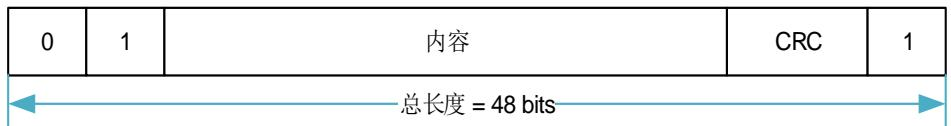

表 20-2. 命令格式

<table><tr><td>位</td><td>47</td><td>46</td><td>[45:40]</td><td>[39:8]</td><td>[7:1]</td><td>0</td></tr><tr><td>宽度</td><td>1</td><td>1</td><td>6</td><td>32</td><td>7</td><td>1</td></tr><tr><td>数值</td><td>‘0’</td><td>‘1’</td><td>x</td><td>x</td><td>x</td><td>‘1’</td></tr><tr><td>描述</td><td>起始位</td><td>传输位</td><td>命令索引</td><td>参数</td><td>CRC7</td><td>结束位</td></tr></table>

一个命令总是从一个起始位（始终为 0）开始，随后的位表示传输的方向（主机=1）。接下来的6 位表示命令的索引，该值被解释为一个二进制编码的数字（0 到 63 之间）。一些命令需要一个参数（例如，一个地址），由 32 位编码。上面表中的表示为“x”的值表示这个变量依赖于该命令。所有的命令有一个 CRC 7 位校验，由结束位（总是 1）终止。

## 命令分类

卡的命令集分为几类（见 20-3.  (CCCs)）。每类支持一组卡的功能。 20-3.(CCCs)根据卡支持的命令来决定 CCC 的设置。

对于 SD 卡，类别为 0，2，4，5 和 8 的命令是强制的，应被 SD 卡支持。类别 7 中除了 CMD40以外都是强制性用于 SDHC。其他类是可选的。所支持的卡命令类（CCC）被编码为参数，设置在每个卡的卡特定数据（CSD）寄存器，提供给主机如何访问该卡信息。

对于 MMC 卡，类别为 0 的命令是强制性的，应被 MMC 卡支持。其他类只对特定类型的卡是强制或是可选的。通过使用不同的类，可以选择几种配置（例如，一个块可写的卡或流可读的卡）。所支持的卡命令类（CCC）被编码为参数，设置在每个卡的卡的特定数据（CSD）寄存器，提供给主机如何访问该卡信息。

对于CE-ATA设备，设备必须支持MMC命令，这些命令需要在设备初始化阶段完成传输状态。其它接口配置的设置，如总线宽度，可能需要额外的 MMC 命令来支持，具体请参考 MMC 引用 。 CE-ATA 利 用 以 下 的 MMC 命 令 ： CMD0 - GO_IDLE_STATE ， CMD12 -STOP_TRANSMISSION，CMD39 - FAST_IO，CMD60 - RW_MULTIPLE_REGISTER，CMD61 - RW_MULTIPLE_BLOCK。 GO_IDLE_STATE（CMD0），STOP_TRANSMISSION（CMD12）和FAST_IO（CMD39）由MMC引用定义。RW_MULTIPLE_REGISTER（CMD60）和 RW_MULTIPLE_BLOCK（CMD61）是 CE-ATA 协议定义的 MMC 命令。

表 20-3. 卡命令类 (CCCs)

<table><tr><td></td><td>卡命令类(CCC)</td><td>0</td><td>1</td><td>2</td><td>3</td><td>4</td><td>5</td><td>6</td><td>7</td><td>8</td><td>9</td><td>10</td><td>11</td></tr><tr><td>支持的命令</td><td>类描述</td><td>basic</td><td>Stream read</td><td>Block read</td><td>Stream write</td><td>Block write</td><td>erase</td><td>write protection</td><td>Lock card</td><td>application specific</td><td>I/O mode</td><td>switch</td><td>reserved</td></tr><tr><td>CMD0</td><td>M</td><td>+</td><td></td><td></td><td></td><td></td><td></td><td></td><td></td><td></td><td></td><td></td><td></td></tr><tr><td>CMD1</td><td>M</td><td>+</td><td></td><td></td><td></td><td></td><td></td><td></td><td></td><td></td><td></td><td></td><td></td></tr><tr><td>CMD2</td><td>M</td><td>+</td><td></td><td></td><td></td><td></td><td></td><td></td><td></td><td></td><td></td><td></td><td></td></tr><tr><td>CMD3</td><td>M</td><td>+</td><td></td><td></td><td></td><td></td><td></td><td></td><td></td><td></td><td></td><td></td><td></td></tr><tr><td>CMD4</td><td>M</td><td>+</td><td></td><td></td><td></td><td></td><td></td><td></td><td></td><td></td><td></td><td></td><td></td></tr><tr><td>CMD5</td><td>O</td><td></td><td></td><td></td><td></td><td></td><td></td><td></td><td></td><td></td><td>+</td><td></td><td></td></tr><tr><td>CMD6</td><td>M</td><td></td><td></td><td></td><td></td><td></td><td></td><td></td><td></td><td></td><td></td><td>+</td><td></td></tr><tr><td>CMD7</td><td>M</td><td>+</td><td></td><td></td><td></td><td></td><td></td><td></td><td></td><td></td><td></td><td></td><td></td></tr><tr><td>CMD8</td><td>M</td><td>+</td><td></td><td></td><td></td><td></td><td></td><td></td><td></td><td></td><td></td><td></td><td></td></tr><tr><td>CMD9</td><td>M</td><td>+</td><td></td><td></td><td></td><td></td><td></td><td></td><td></td><td></td><td></td><td></td><td></td></tr><tr><td>CMD10</td><td>M</td><td>+</td><td></td><td></td><td></td><td></td><td></td><td></td><td></td><td></td><td></td><td></td><td></td></tr><tr><td>CMD11</td><td>M</td><td></td><td>+</td><td></td><td></td><td></td><td></td><td></td><td></td><td></td><td></td><td></td><td></td></tr><tr><td>CMD12</td><td>M</td><td>+</td><td></td><td></td><td></td><td></td><td></td><td></td><td></td><td></td><td></td><td></td><td></td></tr><tr><td>CMD13</td><td>M</td><td>+</td><td></td><td></td><td></td><td></td><td></td><td></td><td></td><td></td><td></td><td></td><td></td></tr><tr><td>CMD14</td><td>M</td><td>+</td><td></td><td></td><td></td><td></td><td></td><td></td><td></td><td></td><td></td><td></td><td></td></tr><tr><td>CMD15</td><td>M</td><td>+</td><td></td><td></td><td></td><td></td><td></td><td></td><td></td><td></td><td></td><td></td><td></td></tr><tr><td>CMD16</td><td>M</td><td></td><td></td><td>+</td><td></td><td>+</td><td></td><td></td><td>+</td><td></td><td></td><td></td><td></td></tr><tr><td>CMD17</td><td>M</td><td></td><td></td><td>+</td><td></td><td></td><td></td><td></td><td></td><td></td><td></td><td></td><td></td></tr><tr><td>CMD18</td><td>M</td><td></td><td></td><td>+</td><td></td><td></td><td></td><td></td><td></td><td></td><td></td><td></td><td></td></tr><tr><td>CMD19</td><td>M</td><td>+</td><td></td><td></td><td></td><td></td><td></td><td></td><td></td><td></td><td></td><td></td><td></td></tr><tr><td>CMD20</td><td>M</td><td></td><td></td><td></td><td>+</td><td></td><td></td><td></td><td></td><td></td><td></td><td></td><td></td></tr><tr><td>CMD23</td><td>M</td><td></td><td></td><td>+</td><td></td><td>+</td><td></td><td></td><td></td><td></td><td></td><td></td><td></td></tr><tr><td>CMD24</td><td>M</td><td></td><td></td><td></td><td></td><td>+</td><td></td><td></td><td></td><td></td><td></td><td></td><td></td></tr><tr><td>CMD25</td><td>M</td><td></td><td></td><td></td><td></td><td>+</td><td></td><td></td><td></td><td></td><td></td><td></td><td></td></tr><tr><td>CMD26</td><td>M</td><td></td><td></td><td></td><td></td><td>+</td><td></td><td></td><td></td><td></td><td></td><td></td><td></td></tr><tr><td>CMD27</td><td>M</td><td></td><td></td><td></td><td></td><td>+</td><td></td><td></td><td></td><td></td><td></td><td></td><td></td></tr><tr><td>CMD28</td><td>M</td><td></td><td></td><td></td><td></td><td></td><td></td><td>+</td><td></td><td></td><td></td><td></td><td></td></tr><tr><td>CMD29</td><td>M</td><td></td><td></td><td></td><td></td><td></td><td></td><td>+</td><td></td><td></td><td></td><td></td><td></td></tr><tr><td>CMD30</td><td>M</td><td></td><td></td><td></td><td></td><td></td><td></td><td>+</td><td></td><td></td><td></td><td></td><td></td></tr><tr><td>CMD32</td><td>M</td><td></td><td></td><td></td><td></td><td></td><td>+</td><td></td><td></td><td></td><td></td><td></td><td></td></tr><tr><td>CMD33</td><td>M</td><td></td><td></td><td></td><td></td><td></td><td>+</td><td></td><td></td><td></td><td></td><td></td><td></td></tr><tr><td>CMD34</td><td>O</td><td></td><td></td><td></td><td></td><td></td><td></td><td></td><td></td><td></td><td></td><td>+</td><td></td></tr><tr><td>CMD35</td><td>O</td><td></td><td></td><td></td><td></td><td></td><td></td><td></td><td></td><td></td><td></td><td>+</td><td></td></tr></table>

<table><tr><td>CMD36</td><td>O</td><td></td><td></td><td></td><td></td><td></td><td></td><td></td><td></td><td></td><td>+</td><td></td></tr><tr><td>CMD37</td><td>O</td><td></td><td></td><td></td><td></td><td></td><td></td><td></td><td></td><td></td><td>+</td><td></td></tr><tr><td>CMD38</td><td>M</td><td></td><td></td><td></td><td></td><td>+</td><td></td><td></td><td></td><td></td><td></td><td></td></tr><tr><td>CMD39</td><td></td><td></td><td></td><td></td><td></td><td></td><td></td><td></td><td></td><td>+</td><td></td><td></td></tr><tr><td>CMD40</td><td></td><td></td><td></td><td></td><td></td><td></td><td></td><td></td><td></td><td>+</td><td></td><td></td></tr><tr><td>CMD42</td><td></td><td></td><td></td><td></td><td></td><td></td><td></td><td>+</td><td></td><td></td><td></td><td></td></tr><tr><td>CMD50</td><td>O</td><td></td><td></td><td></td><td></td><td></td><td></td><td></td><td></td><td></td><td>+</td><td></td></tr><tr><td>CMD52</td><td>O</td><td></td><td></td><td></td><td></td><td></td><td></td><td></td><td></td><td>+</td><td></td><td></td></tr><tr><td>CMD53</td><td>O</td><td></td><td></td><td></td><td></td><td></td><td></td><td></td><td></td><td>+</td><td></td><td></td></tr><tr><td>CMD55</td><td>M</td><td></td><td></td><td></td><td></td><td></td><td></td><td></td><td>+</td><td></td><td></td><td></td></tr><tr><td>CMD56</td><td>M</td><td></td><td></td><td></td><td></td><td></td><td></td><td></td><td>+</td><td></td><td></td><td></td></tr><tr><td>CMD57</td><td>O</td><td></td><td></td><td></td><td></td><td></td><td></td><td></td><td></td><td></td><td>+</td><td></td></tr><tr><td>CMD60</td><td>M</td><td></td><td></td><td></td><td></td><td></td><td></td><td></td><td>+</td><td></td><td></td><td></td></tr><tr><td>CMD61</td><td>M</td><td></td><td></td><td></td><td></td><td></td><td></td><td></td><td>+</td><td></td><td></td><td></td></tr><tr><td>ACMD6</td><td>M</td><td></td><td></td><td></td><td></td><td></td><td></td><td></td><td>+</td><td></td><td></td><td></td></tr><tr><td>ACMD13</td><td>M</td><td></td><td></td><td></td><td></td><td></td><td></td><td></td><td>+</td><td></td><td></td><td></td></tr><tr><td>ACMD22</td><td>M</td><td></td><td></td><td></td><td></td><td></td><td></td><td></td><td>+</td><td></td><td></td><td></td></tr><tr><td>ACMD23</td><td>M</td><td></td><td></td><td></td><td></td><td></td><td></td><td></td><td>+</td><td></td><td></td><td></td></tr><tr><td>ACMD41</td><td>M</td><td></td><td></td><td></td><td></td><td></td><td></td><td></td><td>+</td><td></td><td></td><td></td></tr><tr><td>ACMD42</td><td>M</td><td></td><td></td><td></td><td></td><td></td><td></td><td></td><td>+</td><td></td><td></td><td></td></tr><tr><td>ACMD51</td><td>M</td><td></td><td></td><td></td><td></td><td></td><td></td><td></td><td>+</td><td></td><td></td><td></td></tr></table>

注意： 1. CMD1, CMD11, CMD14, CMD19, CMD20, CMD23, CMD26, CMD39 和 CMD40 仅用于MMC 卡。CMD5, CMD32-34, CMD50, CMD52, CMD53, CMD57 和 ACMDx 仅用于 SD 存储卡。CMD60,CMD61 仅用于 CE-ATA 设备。

2. 在使用 ACMD 命令之前发送 APP_CMD 命令(CMD55)。

3. CMD8 对于 MMC 卡和 SD 卡有不同的含义。

## 详细的命令描述

下列表详细描述了所有的总线命令。响应 R1-R7 将在 章节说明。寄存器 CID，CSD 和 DSR在 介绍。卡应忽略参数中填充位和保留位。

表 20-4. 基本命令(class 0)

<table><tr><td>命令索引</td><td>类型</td><td>参数</td><td>响应格式</td><td>简称</td><td>描述</td></tr><tr><td>CMD0</td><td>bc</td><td>[31:0] 填充位</td><td>-</td><td>GO_IDLE_STATE</td><td>复位所有的卡到空闲状态。</td></tr><tr><td>CMD1</td><td>bc</td><td>[31:0] OCR</td><td>R3</td><td>SEND_OP_COND</td><td>在空闲状态,请求卡通过 CMD 线发送响应(包含操作条件寄存器的内容)。</td></tr><tr><td>CMD2</td><td>bcr</td><td>[31:0] 填充位</td><td>R2</td><td>ALL_SEND_CID</td><td>请求任何卡通过 CMD 线发送发送CID 数据(任何连接到主机的卡都会响应)。</td></tr><tr><td>CMD3</td><td>bcr</td><td>[31:0] 填充位</td><td>R6</td><td>SEND_RELATIVE_ADDR</td><td>请求卡发布新的相对卡地址(RCA)。</td></tr><tr><td>CMD4</td><td>bc</td><td>[31:16] DSR[15:0] 填充位</td><td>-</td><td>SET_DSR</td><td>设置所有卡的DSR寄存器。</td></tr><tr><td>CMD5</td><td>bcr</td><td>[31:25]保留位[24]S18R[23:0] I/O OCR</td><td>R4</td><td>IO_SEND_OP_COND</td><td>仅适用于I/O卡。它类似于用于SD存储卡的ACMD41命令,用于查询所需要的I/O卡的电压范围。</td></tr><tr><td>CMD6</td><td>ac</td><td>[31:26]设为0[25:24]访问[23:16]索引[15:8]值[7:3]设为0[2:0]命令集</td><td>R1b</td><td>SWITCH</td><td>仅适用于MMC卡。切换所选卡的操作模式,或修改EXT_CSD寄存器。</td></tr><tr><td>CMD7</td><td>ac</td><td>[31:16] RCA[15:0]填充位</td><td>R1b</td><td>SELECT/DESELECT_CARD</td><td>这个命令用于卡在待机(stand-by)状态和发送(transfer)状态之间切换,或编程(programming)状态和断开(disconnects)状态之间切换。在两种情况下,要选中该卡用它自己的相对地址,若不选中该卡用任何其他地址。地址0用于取消选择该卡。</td></tr><tr><td>CMD8</td><td>bcr</td><td>[31:12]保留位[11:8]工作电压(VHS)[7:0]检查模式</td><td>R7</td><td>SEND_IF_COND</td><td>向SD存储卡发送接口条件,包括主机供电电压信息和询问卡是否支持电压。保留位应设为0。</td></tr><tr><td>CMD8</td><td>adtc</td><td>[31:0]填充位</td><td>R1</td><td>SEND_EXT_CSD</td><td>仅用于MMC卡。卡发送自己的EXT_CSD寄存器作为数据块。</td></tr><tr><td>CMD9</td><td>ac</td><td>[31:16] RCA[15:0]填充位</td><td>R2</td><td>SEND_CSD</td><td>被选定的卡通过CMD线发送它的卡特定数据(CSD)。</td></tr><tr><td>CMD10</td><td>ac</td><td>[31:16] RCA[15:0]填充位</td><td>R2</td><td>SEND_CID</td><td>被选定的卡通过CMD线发送它的卡标识(CID)。</td></tr><tr><td>CMD12</td><td>ac</td><td>[31:0]填充位</td><td>R1b</td><td>STOP TRANSMISSION</td><td>强制卡停止传输。</td></tr><tr><td>CMD13</td><td>ac</td><td>[31:16] RCA[15:0]填充位</td><td>R1</td><td>SEND_STATUS</td><td>被选定的卡发送它的状态寄存器。</td></tr><tr><td>CMD14</td><td>adtc</td><td>[31:0]填充位</td><td>R1</td><td>BUSTEST_R</td><td>主机从卡中读取反向的总线测试数据模式。</td></tr><tr><td>CMD15</td><td>ac</td><td>[31:16] RCA[15:0]保留位</td><td>-</td><td>GO_INACTIVE_STATE</td><td>将被选定的卡转换到非激活(Inactive)状态。这个命令被用于当主机明确地想停用一张卡的时候。</td></tr><tr><td>CMD19</td><td>adtc</td><td>[31:0]填充位</td><td>R1</td><td>BUSTEST_W</td><td>主机向卡发送总线测试模式。</td></tr></table>

表 20-5. 面向块的读命令(class 2)

<table><tr><td>命令索引</td><td>类型</td><td>参数</td><td>响应格式</td><td>简称</td><td>描述</td></tr><tr><td>CMD16</td><td>ac</td><td>[31:0]块长度</td><td>R1</td><td>SET_BLOCKLEN</td><td>在标准容量SD卡和MMC卡的情况下,该命令为所有后续块命令(读,写,锁)设置块长度(以字节为单位)。默认值是512字节。只有在CSD中局部块读操作被允许时,设置长度对于存储器访问命令有效。在高容量SD存储卡的情况下,块长度是由CMD16命令设置,不会影响内存读和写命令。总是使用512字节的固定块长度。在这两种情况下,如果块长度设置大于512字节,BLOCK_LEN_ERROR位会被卡置位。</td></tr><tr><td>CMD17</td><td>adtc</td><td>[31:0]数据地址</td><td>R1</td><td>READ_SINGLE_BLOCK</td><td>在标准容量SD卡和MMC卡的情况下,通过SET_BLOCKLEN命令读取所选择大小的块。在高容量存储卡的情况下,块长度是固定的512字节,忽略SET_BLOCKLEN命令。</td></tr><tr><td>CMD18</td><td>adtc</td><td>[31:0]数据地址</td><td>R1</td><td>READ_MULTIPLE_BLOCK</td><td>不断从卡传输数据块到主机,直到收到STOP_TRANSMISSION命令才中断。块长度规定和READ_SINGLE_BLOCK命令是一样的。</td></tr><tr><td colspan="6">注意:传输的数据不能跨越物理块边界,除非READ_BLK_MISALIGN在CSD寄存器中被设置。</td></tr></table>

表 20-6. 流读取命令(class 1)和流写入命令(class 3)

<table><tr><td>命令索引</td><td>类型</td><td>参数</td><td>响应格式</td><td>简称</td><td>描述</td></tr><tr><td>CMD11</td><td>adtc</td><td>[31:0]数据地址</td><td>R1</td><td>READ_DAT_UNTIL_STOP</td><td>从卡中读取数据流,起始于给定的地址,直至收到STOP_TRANSMISSION命令。</td></tr><tr><td>CMD20</td><td>adtc</td><td>[31:0]数据地址</td><td>R1</td><td>WRITE_DAT_UNTIL_STOP</td><td>从主机写数据流,起始于给定的地址,直至收到STOP_TRANSMISSION命令。</td></tr><tr><td colspan="6">注意:传输的数据不能跨越物理块边界,除非READ_BLK_MISALIGN在CSD寄存器中被设置。</td></tr></table>

表 20-7. 面向块的写命令(class 4)

<table><tr><td>命令索引</td><td>类型</td><td>参数</td><td>响应格式</td><td>简称</td><td>描述</td></tr><tr><td>CMD16</td><td>ac</td><td>[31:0] 块长度</td><td>R1</td><td>SET_BLOCKLEN</td><td>见表20-5.面向块的读命令(class 2)描述。</td></tr><tr><td>CMD23</td><td>ac</td><td>[31:16] 设为0[15:0] 块数目</td><td>R1</td><td>SET_BLOCK_COUNT</td><td>定义了将要在后续多个块的读或写命令被传输块的数目。如果参数为全0,随后的读/写操作将被被认为无终止的。</td></tr><tr><td>CMD24</td><td>adtc</td><td>[31:0] 数据地址</td><td>R1</td><td>WRITE_BLOCK</td><td>在标准容量SD卡的情况下,该命令写入由SET_BLOCKLEN命令所选择的块长度。在高容量SD卡的情况下,块长度是固定的512字节忽略SET_BLOCKLEN命令。</td></tr><tr><td>CMD25</td><td>adtc</td><td>[31:0] 数据地址</td><td>R1</td><td>WRITE_MULTIPLE_BLOCK</td><td>连续写入数据块,直至收到STOP_TRANSMISSION命令。块长度是和WRITE_BLOCK命令规定一样的。</td></tr><tr><td>CMD26</td><td>adtc</td><td>[31:0] 填充位</td><td>R1</td><td>PROGRAM_CID</td><td>对卡识别寄存器进行编程。此命令必须一次发出。该编程涉及硬件,以防止首次编程以后的操作。通常情况下这个命令是针对厂家保留。</td></tr><tr><td>CMD27</td><td>adtc</td><td>[31:0] 填充位</td><td>R1</td><td>PROGRAM_CSD</td><td>对CSD的可编程位编程。</td></tr><tr><td colspan="6">注意:1.传输的数据不得跨越物理块边界。除非是在CSD设置WRITE_BLK_MISALIGN。在写入部分块不支持的情况下,块长度=默认块长度(CSD中给出)。2.标准容量SD存储卡数据地址以字节为单位,高容量SD存储卡数据地址以块(512字节)为单位。</td></tr></table>

表 20-8. 擦除命令(class 5)

<table><tr><td>命令索引</td><td>类型</td><td>参数</td><td>响应格式</td><td>简称</td><td>描述</td></tr><tr><td>CMD32</td><td>ac</td><td>[31:0]数据地址</td><td>R1</td><td>ERASE_WR_BLK_START</td><td>设置要被擦除数据的第一个块的地址。(SD)</td></tr><tr><td>CMD33</td><td>ac</td><td>[31:0]数据地址</td><td>R1</td><td>ERASE_WR_BLK_END</td><td>设置要被擦除数据的最后一个块地址。(SD)</td></tr><tr><td>CMD35</td><td>ac</td><td>[31:0]数据地址</td><td>R1</td><td>ERASE_GROUP_START</td><td>在选择的擦除范围内,设置第一个擦除组的地址。(MMC)</td></tr><tr><td>CMD36</td><td>ac</td><td>[31:0]数据地址</td><td>R1</td><td>ERASE_GROUP_END</td><td>在选择的连续擦除范围内,设置最后一个擦除组的地址。(MMC)</td></tr><tr><td>CMD38</td><td>ac</td><td>[31:0]填充位</td><td>R1b</td><td>ERASE</td><td>擦除所有之前选择的数据块.</td></tr><tr><td colspan="6">注意: 1. CMD34 和 CMD37 被保留,以便保持与旧版本 MMC 的兼容性2. 标准容量 SD 存储卡数据地址以字节为单位,高容量 SD 存储卡数据地址以块(512 字节)为单位。</td></tr></table>

表 20-9. 面向块的写保护命令(class 6)

<table><tr><td>命令索引</td><td>类型</td><td>参数</td><td>响应格式</td><td>简称</td><td>描述</td></tr><tr><td>CMD28</td><td>ac</td><td>[31:0] 数据地址</td><td>R1b</td><td>SET_WRITE_PROT</td><td>如果卡有写保护功能,该命令将设置地址组的写保护位。写保护的特性被编码在卡的特定数据(WP_GRP_SIZE)中。高容量SD存储卡不支持此命令。</td></tr><tr><td>CMD29</td><td>ac</td><td>[31:0] 数据地址</td><td>R1b</td><td>CLR_WRITE_PROT</td><td>如果卡有写保护功能,该命令将清除寻址组的写保护位。</td></tr><tr><td>CMD30</td><td>adtc</td><td>[31:0] 写保护数据地址</td><td>R1</td><td>SEND_WRITE_PROT</td><td>如果卡有写保护功能,该命令请求卡发送写保护位状态。</td></tr><tr><td colspan="6">注意: 1. 高容量 SD 存储卡不支持这三个命令。</td></tr></table>

表 20-10. 锁卡命令(class 7)

<table><tr><td>命令索引</td><td>类型</td><td>参数</td><td>响应格式</td><td>简称</td><td>描述</td></tr><tr><td>CMD16</td><td>ac</td><td>[31:0] 块长度</td><td>R1</td><td>SET_BLOCK_LEN</td><td>见表20-5.面向块的读命令(class 2)描述。</td></tr><tr><td>CMD42</td><td>adtc</td><td>[31:0] 保留位(所有位设为0)</td><td>R1</td><td>LOCK_UNLOCK</td><td>用于设置/重置密码或者对卡上锁/解锁。数据块长度由命令SET_BLOCK_LEN设置。参数及锁卡数据结构里的保留位应设为0。</td></tr></table>

表 20-11. 特定应用命令(class 8)

<table><tr><td>命令索引</td><td>类型</td><td>参数</td><td>响应格式</td><td>简称</td><td>描述</td></tr><tr><td>ACMD41</td><td>bcr</td><td>[31]保留位[30]HCS[29:24]保留位[23:0]<eq>V_{DD}</eq>电压窗口(OCR[23:0])</td><td>R3</td><td>SD_SEND_OP_COND</td><td>发送给主机容量支持信息(HCS),并请求访问的卡在响应中发送操作条件寄存器(OCR)的内容。当卡接收到SEND_IF_COND命令,HCS是有效的。CCS位被分配到OCR[30]。</td></tr><tr><td>ACMD42</td><td>ac</td><td>[31:1]填充位[0]set_cd</td><td>R1</td><td>SET_CLR_CARD_DETECT</td><td>在卡的CD/DAT3(引脚1)上连接[1]/断开[0]50K上拉电阻。</td></tr><tr><td>ACMD51</td><td>adtc</td><td>[31:0]填充位</td><td>R1</td><td>SEND_SCR</td><td>读SD卡配置寄存器(SCR)。</td></tr><tr><td>CMD55</td><td>ac</td><td>[31:16] RCA[15:0]填充位</td><td>R1</td><td>APP_CMD</td><td>表明卡的下一个命令是特定应用命令而不是标准命令。</td></tr><tr><td>CMD56</td><td>adtc</td><td>[31:1]填充位[0]RD/WR</td><td>R1</td><td>GEN_CMD</td><td>对于通用/特定应用命令,该命令用于向卡传输一个数据块,或从卡读取一个数据块。主机设RD/WR=1时是从卡中读数据,RD/WR=0时啊写数据到卡中。</td></tr><tr><td>CMD60</td><td>adtc</td><td>[31]WR[23:18]地址[7:2] 字节数其他位为保留位</td><td>R1(read)/R1b(write)</td><td>RW_MULTIPLE_REGISTER</td><td>在地址范围内,读或写寄存器。</td></tr><tr><td>CMD61</td><td>adtc</td><td>[31] WR[15:0] 数据单元数其他位为保留位</td><td>R1(read)/R1b(write)</td><td>RW_MULTIPLE_BLOCK</td><td>在地址范围内,读或写寄存器。</td></tr><tr><td colspan="6">注意: 1. ACMDx 是针对 SD 存储卡的特定应用命令2. CMD60, CMD61 针对 CE-ATA 设备的特定应用命令</td></tr></table>

表 20-12. I/O 模式命令(class 9)

<table><tr><td>命令索引</td><td>类型</td><td>参数</td><td>响应格式</td><td>简称</td><td>描述</td></tr><tr><td>CMD39</td><td>ac</td><td>[31:16] RCA[15] 寄存器写标志[14:8] 寄存器地址[7:0] 寄存器数据</td><td>R4</td><td>FAST_IO</td><td>用于写入和读取8位(寄存器)的数据字段。如果写标志被设置,该命令寻址寄存器,并提供数据写入。如果写标志被清为0,R4的响应中包含从寻址寄存器中读取的数据。该命令用于访问未在MMC标准定义的应用程序相关的寄存器。</td></tr><tr><td>CMD40</td><td>bcr</td><td>[31:0] 填充位</td><td>R5</td><td>GO_IRQ_STATE</td><td>设置系统进入中断模式。</td></tr><tr><td>CMD52</td><td>adtc</td><td>[31] R/W 标志[30:28] 功能数目[27] RAW 标志[26] 填充位[25:9] 寄存器地址[8] 填充位[7:0] 写数据/填充位</td><td>R5</td><td>IO_RW_DIRECT</td><td>IO_RW_DIRECT命令提供简单的方式访问任意I/O功能的128K存储空间的寄存器。此命令可以实现使用单个命令对寄存器的读写。一个常见的用途是初始化寄存器或查询I/O功能状态。这个命令是读或写单I/O寄存器最快的方法,因为它仅需要一对单一的命令/响应。</td></tr><tr><td>CMD53</td><td>adtc</td><td>[31] R/W 标志[30:28] 功能数目[27] 块模式[26] OP码[25:9] 寄存器地址[8:0] 字节/块数</td><td></td><td>IO_RW_EXTENDED</td><td>该命令允许用一个简单命令读取或写入大量的I/O寄存器。</td></tr><tr><td colspan="6">注意: 1.CMD39, CMD40 仅用于MMC卡2. CMD52, CMD53 仅用于SD I/O卡</td></tr></table>

表 20-13. 切换功能命令(class 10)

<table><tr><td>命令索引</td><td>类型</td><td>参数</td><td>响应格式</td><td>简称</td><td>描述</td></tr><tr><td>CMD6</td><td>adtc</td><td>[31] 模式0:检测功能1:切换功能[30:24] 保留[23:20] 为功能组 6保留(0h 或 Fh)[19:16] 为功能组 5保留(0h 或 Fh)[15:12] 为功能组 4保留(0h 或 Fh)[11:8] 为功能组 3 保留(0h 或 Fh)[7:4] 功能组 2 命令系统[3:0] 功能组 1 访问模式</td><td>R1</td><td>SWITCH_FUNC</td><td>仅用于 SD 存储卡和 SD I/O 卡。检测可切换功能(模式 0)和切换卡功能(模式 1)。</td></tr></table>

## 20.5.3. 响应

所有的响应都是通过 CMD 信号线发送。响应传输总是从对应响应字串的最左位开始。响应字串的长度依赖于响应类型。

## 响应类型

响应的类型有七种，分别如下：

R1 / R1b : 普通命令响应

R2 : CID, CSD 寄存器

R3 : OCR 寄存器

R4 : Fast I/O 

R5 : 中断请求

R6 : 发布的 RCA 响应

R7 : 卡接口条件

SD 存储卡支持其中的五种响应，R1 / R1b, R2, R3, R6, R7。SD I/O 卡和 MMC 卡支持支持额外的响应类型，名为 R4 和 R5，但对于 SD I/O 卡和 MMC 卡，这两种响应并不完全相同。

## 响应格式

响应有两种格式，如 20-8. 所示，所有响应经由 CMD 线发出。代码的长度取决于响应类型。除了 R2 的长度是 136 位，其他的长度均为 48 位。

图 20-8. 响应令牌格式

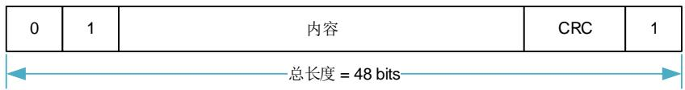

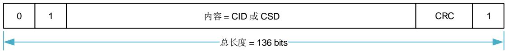

响应总是从一个起始位（始终为 0）开始，随后第二位表示传输的方向（卡= 0）。下面表中的“x”的值表示为可变的部分。除了 R3 类型的所有响应由 CRC 校验。每个响应字段由结束位（总是 1）终止。

## R1 (普通命令响应)

代码长度为 48 位。位 45:40 指示要响应的命令索引，该值被解释为一个二进制编码的数字（0到 63 之间）。卡的状态被 32 位编码。注意，如果写数据到卡上，在每个数据块传输之后会出现 BUSY 信号，在每个数据块传输完成后主机需要检查 BUSY 信号。卡状态在章节中描述。

表 20-14. R1 响应

<table><tr><td>位</td><td>47</td><td>46</td><td>[45:40]</td><td>[39:8]</td><td>[7:1]</td><td>0</td></tr><tr><td>位宽</td><td>1</td><td>1</td><td>6</td><td>32</td><td>7</td><td>1</td></tr><tr><td>数值</td><td>‘0’</td><td>‘0’</td><td>x</td><td>x</td><td>x</td><td>‘1’</td></tr><tr><td>描述</td><td>起始位</td><td>传输位</td><td>命令索引</td><td>卡状态</td><td>CRC7</td><td>结束位</td></tr></table>

## R1b

R1b 格式与 R1 相同，但可以在数据线 DAT0 上发送忙信号。收到命令后，依据收到命令之前的状态，卡可能变为忙状态。主机应在响应中检查忙状态。

## R2 (CID, CSD 寄存器)

代码长度为 136 位。CID 寄存器的内容作为对命令 CMD2 和 CMD10 的响应被发送。CSD 寄存器的内容将作为以 CMD9 响应被发送。卡只响应发送 CID 和 CSD 的位[127.. 1]，这两个寄存器保留位[0]被替换为响应的结束位。

表 20-15. R2 响应

<table><tr><td>位</td><td>135</td><td>134</td><td>[133:128]</td><td>[127:1]</td><td>0</td></tr><tr><td>位宽</td><td>1</td><td>1</td><td>6</td><td>127</td><td>1</td></tr><tr><td>数值</td><td>‘0’</td><td>‘0’</td><td>‘111111’</td><td>x</td><td>‘1’</td></tr><tr><td>描述</td><td>起始位</td><td>传输位</td><td>保留</td><td>CID或CSD寄存器,内部CRC7</td><td>结束位</td></tr></table>

## R3 (OCR 寄存器)

代码长度为 48 位。该 OCR 寄存器的内容作为 ACMD41（SD 存储卡），CMD1（MMC）的响应被发送。不同卡的响应可能有一点不同。

表 20-16. R3 响应

<table><tr><td>位</td><td>47</td><td>46</td><td>[45:40]</td><td>[39:8]</td><td>[7:1]</td><td>0</td></tr><tr><td>位宽</td><td>1</td><td>1</td><td>6</td><td>32</td><td>7</td><td>1</td></tr><tr><td>数值</td><td>‘0’</td><td>‘0’</td><td>‘111111’</td><td>x</td><td>‘1111111’</td><td>‘1’</td></tr><tr><td>描述</td><td>起始位</td><td>传输位</td><td>保留</td><td>OCR 寄存器</td><td>保留</td><td>结束位</td></tr></table>

## R4 (Fast I/O)

仅适用于 MMC 卡。代码长度为 48 位。参数域包括选定卡的 RCA，被读取或写入寄存器的地址，和它的内容。如果操作成功，参数域状态位置位。

表 20-17. R4 响应(MMC)

<table><tr><td>位</td><td>47</td><td>46</td><td>[45:40]</td><td colspan="4">[39:8] 参数域</td><td>[7:1]</td><td>0</td></tr><tr><td>位宽</td><td>1</td><td>1</td><td>6</td><td>16</td><td>1</td><td>7</td><td>8</td><td>7</td><td>1</td></tr><tr><td>数值</td><td>‘0’</td><td>‘0’</td><td>‘100111’</td><td>x</td><td>x</td><td>x</td><td>x</td><td>x</td><td>‘1’</td></tr><tr><td>描述</td><td>起始位</td><td>传输位</td><td>CMD39</td><td>RCA[31:16]</td><td>状态[15]</td><td>寄存器地址[14:8]</td><td>读寄存器的内容[7:0]</td><td>CRC7</td><td>结束位</td></tr></table>

## R4b

仅适用于 SD I/O 卡。代码长度为 48 位。SD I/O 卡接收到 CMD5 命令后会返回一个唯一的 SDI/O 卡响应 R4。

表 20-18. R4 响应(SD I/O)

<table><tr><td>位</td><td>47</td><td>46</td><td>[45:40]</td><td>39</td><td>[38:36]</td><td>35</td><td>[34:32]</td><td>31</td><td>[30:8]</td><td>[7:1]</td><td>0</td></tr><tr><td>位宽</td><td>1</td><td>1</td><td>6</td><td>1</td><td>3</td><td>1</td><td>3</td><td>1</td><td>23</td><td>7</td><td>1</td></tr><tr><td>数值</td><td>‘0’</td><td>‘0’</td><td>‘111111’</td><td>x</td><td>x</td><td>x</td><td>‘000’</td><td>x</td><td>x</td><td>‘1111111’</td><td>1</td></tr><tr><td>描述</td><td>起始位</td><td>传输位</td><td>保留</td><td>C</td><td>I/O 功能数目</td><td>当前存储</td><td>填充位</td><td>S18A</td><td>I/OOCR</td><td>保留</td><td>结束位</td></tr></table>

## R5 (中断请求)

仅适用于 MMC 卡。代码长度为 48 位。若这个响应由主机产生，参数中 RCA 域为 0x0。

表 20-19. R5 响应(MMC)

<table><tr><td>位</td><td>47</td><td>46</td><td>[45:40]</td><td colspan="2">[39:8] 参数域</td><td>[7:1]</td><td>0</td></tr><tr><td>位宽</td><td>1</td><td>1</td><td>6</td><td>16</td><td>16</td><td>7</td><td>1</td></tr><tr><td>数值</td><td>‘0’</td><td>‘0’</td><td>‘101000’</td><td>x</td><td>x</td><td>x</td><td>‘1’</td></tr><tr><td>描述</td><td>起始位</td><td>传输位</td><td>CMD40</td><td>成功的卡或主机的RCA [31:16]</td><td>[15:0]未定义,可能作为中断数据</td><td>CRC7</td><td>结束位</td></tr></table>

## R5b

仅适用于 SD I/O 卡。SD I/O 卡对于 CMD52 和 CMD53 命令的响应是 R5。如果卡和主机之间的通信是在 1 位或 4 位 SD 模式下，响应应是 48 位响应（R5）。

表 20-20. R5 响应(SD I/O)

<table><tr><td>位</td><td>47</td><td>46</td><td>[45:40]</td><td>[39:24]</td><td>[23:16]</td><td>[15:8]</td><td>[7:1]</td><td>0</td></tr><tr><td>位宽</td><td>1</td><td>1</td><td>6</td><td>16</td><td>8</td><td>8</td><td>7</td><td>1</td></tr><tr><td>数值</td><td>‘0’</td><td>‘0’</td><td>‘11020X’</td><td>‘0’</td><td>x</td><td>x</td><td>x</td><td>‘1’</td></tr><tr><td>描述</td><td>起始位</td><td>传输位</td><td>CMD52/53</td><td>填充位</td><td>响应标志</td><td>读或写的数据</td><td>CRC7</td><td>结束位</td></tr></table>

## R6 (发布的 RCA 响应)

代码长度为 48 位。位[45:40]表示对 CMD3 响应的命令索引。参数字段的 16 个最高位比特用于已发布的 RCA 号。

表 20-21. R6 响应

<table><tr><td>位</td><td>47</td><td>46</td><td>[45:40]</td><td colspan="2">[39:8] 参数域</td><td>[7:1]</td><td>0</td></tr><tr><td>位宽</td><td>1</td><td>1</td><td>6</td><td>16</td><td>16</td><td>7</td><td>1</td></tr><tr><td>数值</td><td>‘0’</td><td>‘0’</td><td>‘000011’</td><td>x</td><td>x</td><td>x</td><td>‘1’</td></tr><tr><td>描述</td><td>起始位</td><td>传输位</td><td>CMD3</td><td>新发布卡的RCA</td><td>卡的状态位:23,22,19,12:0</td><td>CRC7</td><td>结束位</td></tr></table>

## R7 (卡接口条件)

仅适用于 SD 存储卡。代码长度为 48 位。卡支持电压信息由 CMD8 的响应发送。位[19:16]表明该卡支持的电压范围。接受了供电电压的卡返回 R7 响应。在响应中，卡回送的参数设置电压范围和检查模式。

表 20-22. R7 响应

<table><tr><td>位</td><td>47</td><td>46</td><td>[45:40]</td><td>[39:20]</td><td>[19:16]</td><td>[15:8]</td><td>[7:1]</td><td>0</td></tr><tr><td>位宽</td><td>1</td><td>1</td><td>6</td><td>20</td><td>4</td><td>8</td><td>7</td><td>1</td></tr><tr><td>数值</td><td>‘0’</td><td>‘0’</td><td>‘001000’</td><td>‘00000h’</td><td>x</td><td>x</td><td>x</td><td>‘1’</td></tr><tr><td>描述</td><td>起始位</td><td>传输位</td><td>CMD8</td><td>保留位</td><td>可接受电压</td><td>回送检查模式</td><td>CRC7</td><td>结束位</td></tr></table>

## 20.5.4. 数据包格式

数据总线模式有三种，1 位、4 位和 8 位宽度。1 位模式是强制的，4 位和 8 位模式是可选的。虽然使用 1 位模式，当卡复位和初始化时，DAT3 还需要通知卡当前的工作模式是 SDIO 或SPI。

## 1位数据包格式

卡复位和初始化之后，只有 DAT0 被用于传输数据。其他引脚可以用于其他用处。 20-9. 1， 20-10. 4 和 20-11. 8 显示了数据宽度是 1 位，4 位和 8 位时的数据包格式。

图 20-9. 1 位数据总线宽度

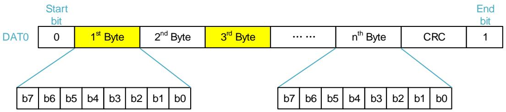

## 4 位数据包格式

图 20-10. 4 位数据总线宽度

<table><tr><td></td><td>Start bit</td><td colspan="2"><eq>{1}^{\text{st }}</eq> Byte</td><td colspan="2"><eq>{2}^{\text{nd }}</eq> Byte</td><td colspan="2"><eq>{3}^{\text{rd }}</eq> Byte</td><td></td><td colspan="2"><eq>{\mathrm{n}}^{\text{th }}</eq> Byte</td><td></td><td>End bit</td></tr><tr><td>DAT3</td><td>0</td><td>b7</td><td>b3</td><td>b7</td><td>b3</td><td>b7</td><td>b3</td><td>... ...</td><td>b7</td><td>b3</td><td>CRC</td><td>1</td></tr><tr><td>DAT2</td><td>0</td><td>b6</td><td>b2</td><td>b6</td><td>b2</td><td>b6</td><td>b2</td><td>... ...</td><td>b6</td><td>b2</td><td>CRC</td><td>1</td></tr><tr><td>DAT1</td><td>0</td><td>b5</td><td>b1</td><td>b5</td><td>b1</td><td>b5</td><td>b1</td><td>... ...</td><td>b5</td><td>b1</td><td>CRC</td><td>1</td></tr><tr><td>DAT0</td><td>0</td><td>b4</td><td>b0</td><td>b4</td><td>b0</td><td>b4</td><td>b0</td><td>... ...</td><td>b4</td><td>b0</td><td>CRC</td><td>1</td></tr></table>

## 8 位数据包格式

图 20-11. 8 位数据总线宽度

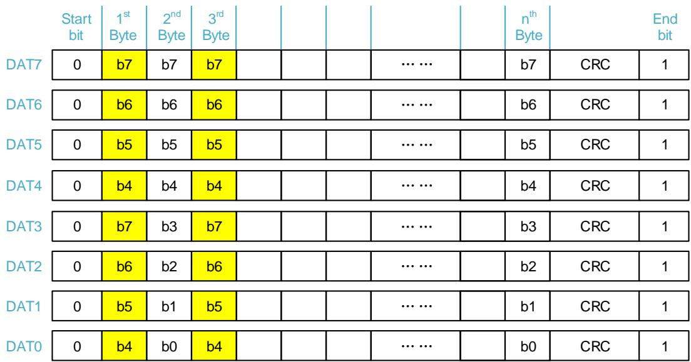

## 20.5.5. 卡的两种状态

SD 存储卡支持两种状态字段，而其他的卡只支持第一种：

卡状态：执行命令的错误和状态信息，在响应中指示。

SD 状态：512 位的扩展状态信息，支持特定功能的 SD 存储卡和未来应用特定功能。

## 卡状态

响应格式 R1 包含一个名为卡状态的 32 位字段。该字段用来传送该卡的状态的信息（可以存储在本地状态寄存器）到主机。除非特别说明，卡的状态信息总是与之前发出的命令相关。

表中的类型和清除条件的缩写如下：

## 类型

•E: 错误位。向主机发送错误条件。这些位一旦响应（报告错误）被发出去就会清除。

•S: 状态位。这些位仅作为信息字段，并不因为对命令的响应而改变。这些位是持久性的，它们根据卡状态被设置或被清除。

•R: 卡在命令解释和验证阶段（响应模式）检测到异常。

•X: 卡在命令执行阶段（执行模式）检测到异常。

## 清除条件

•A: 根据卡当前状态。

•B: 始终与之前命令相关。接收到有效命令可清除该状态（有命令延迟）。

•C: 读可清除。

表 20-23. 卡状态

<table><tr><td>位</td><td>标识符</td><td>类型</td><td>数值</td><td>说明</td><td>清除条件</td></tr><tr><td>31</td><td>OUT_OF_RANGE</td><td>ERX</td><td>'0'=无错误'1'=错误</td><td>命令的参数超出卡的允许范围。</td><td>C</td></tr><tr><td>30</td><td>ADDRESS_ERROR</td><td>ERX</td><td>'0'=无错误'1'=错误</td><td>在命令中使用与块长度不匹配的未对齐地址。</td><td>C</td></tr><tr><td>29</td><td>BLOCK_LEN_ERROR</td><td>ERX</td><td>'0'=无错误'1'=错误</td><td>所传输的块长度是卡不允许的,或者传输的字节数不匹配块的长度。</td><td>C</td></tr><tr><td>28</td><td>ERASE_SEQ_ERROR</td><td>ER</td><td>'0'=无错误'1'=错误</td><td>擦除命令顺序发生错误。</td><td>C</td></tr><tr><td>27</td><td>ERASE_PARAM</td><td>ERX</td><td>'0'=无错误'1'=错误</td><td>擦除时选择了无效的擦除块。</td><td>C</td></tr><tr><td>26</td><td>WP_VIOLATION</td><td>ERX</td><td>'0'=未保护'1'=已保护</td><td>当主机试图写一个受保护的块或暂时或永久写保护卡时置位。</td><td>C</td></tr><tr><td>25</td><td>CARD_IS_LOCKED</td><td>SX</td><td>'0'=卡未锁'1'=卡已锁</td><td>当设置该位,表示卡已经被主机锁住。</td><td>A</td></tr><tr><td>24</td><td>LOCK_UNLOCK_FAILED</td><td>ERX</td><td>'0'=无错误'1'=错误</td><td>在上锁/解锁中有命令的顺序错误或检测到密码错误时置位。</td><td>C</td></tr><tr><td>23</td><td>COM_CRC_ERROR</td><td>ER</td><td>'0'=无错误'1'=错误</td><td>之前命令的CRC校验错误。</td><td>B</td></tr><tr><td>22</td><td>ILLEGAL_COMMAND</td><td>ER</td><td>'0'=无错误'1'=错误</td><td>对于当前状态,命令非法。</td><td>B</td></tr><tr><td>21</td><td>CARD_ECC_FAILED</td><td>ERX</td><td>'0'=成功'1'=失败</td><td>卡的内部实施了ECC校验,但在更正数据时失败。</td><td>C</td></tr><tr><td>20</td><td>CC_ERROR</td><td>ERX</td><td>'0'=无错误'1' = 错误</td><td>卡内部控制器错误。</td><td>C</td></tr><tr><td>19</td><td>ERROR</td><td>ERX</td><td>'0' = 无错误'1' = 错误</td><td>在操作过程中发生一般的或者未知的错误。</td><td>C</td></tr><tr><td>18</td><td>UNDERRUN</td><td>ERX</td><td>'0' = 无错误'1' = 错误</td><td>仅针对MMC。该卡不支持在流读取模式下的数据传输。</td><td>C</td></tr><tr><td>17</td><td>OVERRUN</td><td>ERX</td><td>'0' = 无错误'1' = 错误</td><td>仅针对MMC.该卡不支持在流写入模式下的数据编程。</td><td>C</td></tr><tr><td>16</td><td>CID/CSD_OVERWRITE</td><td>ERX</td><td>'0' = 无错误'1' = 错误</td><td>可能是下面两种错误之一:- CSD 的只读部分与卡内容不匹配- 试图进行拷贝或永久写保护的反向操作,即恢复原状或解除写保护</td><td>C</td></tr><tr><td>15</td><td>WP_ERASE_SKIP</td><td>ERX</td><td>'0' = 未保护'1' = 已保护</td><td>若置位,因为存在写保护数据块仅有部分地址空间被擦除;被暂时或者永久写保护的卡被擦除。</td><td>C</td></tr><tr><td>14</td><td>CARD_ECC_DISABLED</td><td>SX</td><td>'0' = 使能'1' = 失能</td><td>执行命令时未使用内部ECC。</td><td>A</td></tr><tr><td>13</td><td>ERASE_RESET</td><td>SR</td><td>'0' = 清除'1' = 设置</td><td>因为收到一个擦除顺序之外的命令,擦除序列在执行前被清除。</td><td>C</td></tr><tr><td>[12:9]</td><td>CURRENT_STATE</td><td>SX</td><td>0 = 空闲1 = 就绪2 = 识别3 = 待机4 = 传输5 = 发送数据6 = 接收数据7 = 编程8 = 断开9-14 = 保留15 = 保留(I/O 模式)</td><td>当收到命令时卡的状态。如果命令的执行导致状态的变化,这个变化将会在下个命令的响应中反映出来。这四个位按十进制数0至15解释。</td><td>B</td></tr><tr><td>8</td><td>READY_FOR_DATA</td><td>SX</td><td>'0' = 未就绪'1' = 就绪</td><td>与总线上的缓冲器空的信号一致。</td><td>A</td></tr><tr><td>7</td><td>SWITCH_ERROR</td><td>EX</td><td>'0' = 无错误'1' = 切换错误</td><td>如果置位,卡没有通过 SWITCH 命令切换到期望的模式。</td><td>B</td></tr><tr><td>6</td><td colspan="5">保留</td></tr><tr><td>5</td><td>APP_CMD</td><td>SR</td><td>'0' = 使能'1' = 失能</td><td>卡期望ACMD,或指示命令已经被解释为ACMD命令。</td><td>C</td></tr><tr><td>4</td><td colspan="5">保留</td></tr><tr><td>3</td><td>AKE_SEQ_ERROR</td><td>ER</td><td>'0' = 无错误'1' = 错误</td><td>仅针对SD存储卡。验证过程的顺序有错误。</td><td>C</td></tr><tr><td>2</td><td colspan="5">保留给与应用特定命令。</td></tr><tr><td>[1:0]</td><td colspan="5">保留给厂商测试模式。</td></tr></table>

注意：18, 17, 7 位仅适用于 MMC。14, 3 位仅适用于 SD 存储卡。

## SD状态寄存器

在 SD 状态寄存器中含有与 SD 存储卡的专有特征相关的状态位，并且可以被用于未来的特定应用使用。SD状态寄存器是大小是一个数据块 512 比特。该寄存器的内容连同一个 16位CRC通过 DAT 总线被发送到主机上。SD 状态通过 DAT 总线被发送到主机上，作为 ACMD13 的响应（CMD55 接着用 CMD13）。ACMD13 只能在“传送状态”被发送到存储卡（卡被选中）。SD 状态结构将在下面描述。

“类型”和“清除条件”的缩写与上述卡状态描述相同。

表 20-24. SD 状态

<table><tr><td>位</td><td>标识符</td><td>类型</td><td>数值</td><td>描述</td><td>清除条件</td></tr><tr><td>[511: 510]</td><td>DAT_BUS_WIDTH</td><td>SR</td><td>'00'=1(默认)'01'=保留'10'=4位宽'11'=保留</td><td>由SET_BUS_WIDTH命令显示当前定义的数据总线宽度</td><td>A</td></tr><tr><td>509</td><td>SECURED_MODE</td><td>SR</td><td>'0'=未处于安全模式'1'=处于安全模式</td><td>卡处于操作的安全模式(参考“SD安全规范”)。</td><td>A</td></tr><tr><td>[508: 496]</td><td colspan="5">保留</td></tr><tr><td>[495: 480]</td><td>SD_CARD_TYPE</td><td>SR</td><td>下列卡目前被定义为:'0000'=通用 SD读/写卡'0001'=SD ROM卡'0002'=OTP</td><td>低8位在未来被用来定义SD存储卡的不同变种(每个位将定义不同的SD卡类型)。高8位将被用来定义不符合当前SD物理层规范的SD卡。</td><td>A</td></tr><tr><td>[479: 448]</td><td>SIZE_OF_PROTECTED_AREA</td><td>SR</td><td>受保护区域的大小。</td><td>(见下面描述)</td><td>A</td></tr><tr><td>[447: 440]</td><td>SPEED_CLASS</td><td>SR</td><td>卡的速度类型。</td><td>(见下面描述)</td><td>A</td></tr><tr><td>[439: 432]</td><td>PERFORMANCE_MOVE</td><td>SR</td><td>以1MB/s为单位的传输性能。</td><td>(见下面描述)</td><td>A</td></tr><tr><td>[431: 428]</td><td>AU_SIZE</td><td>SR</td><td>AU大小</td><td>(见下面描述)</td><td>A</td></tr><tr><td>[427: 424]</td><td colspan="5">保留</td></tr><tr><td>[423:408]</td><td>ERASE_SIZE</td><td>SR</td><td>一次要被擦除的AU 数目。</td><td>(见下面描述)</td><td>A</td></tr><tr><td>[407: 402]</td><td>ERASE_TIMEOUT</td><td>SR</td><td>UNIT_OF_ERASE_AU 指定的擦除区域的超时时间。</td><td>(见下面描述)</td><td>A</td></tr><tr><td>[401: 400]</td><td>ERASE_OFFSET</td><td>SR</td><td>擦除时间增加固定偏移值。</td><td>(见下面描述)</td><td>A</td></tr><tr><td>[399: 312]</td><td colspan="5">保留</td></tr><tr><td>[311: 0]</td><td colspan="5">保留给生产厂商</td></tr></table>

## SIZE_OF_PROTECTED_AREA

对于标准容量卡（SDSC）和高容量卡（SDHC/SDXC）设置该位域不同。

对于标准容量卡（SDSC），受保护区域容量计算方式如下：

受保护区域 = SIZE_OF_PROTECTED_AREA_* MULT * BLOCK_LEN。

SIZE_OF_PROTECTED_AREA 以 MULT*BLOCK_LEN 为单位。

对于高容量卡（SDHC/SDXC），受保护区域容量计算方式如下：

受保护区域 = SIZE_OF_PROTECTED_AREA 。

SIZE_OF_PROTECTED_AREA 以字节为单位。

## SPEED_CLASS

这 8 位字段表示速度等级。

00h: Class 0 

01h: Class 2 

02h: Class 4 

03h: Class 6 

04h: Class 10 

05h–FFh: 保留

## PERFORMANCE_MOVE

这 8 位域指示 Pm，该值可被设为以 1MB/秒为单位。如果卡不用 RU 移动数据，应该认为 Pm是无穷大。设置这个域为 FFh 表示无穷大。Pm 的最小值由 20-25. 中定义。

表 20-25. 移动性能字段

<table><tr><td>PERFORMANCE_MOVE</td><td>数值定义</td></tr><tr><td>00h</td><td>顺序写入</td></tr><tr><td>01h</td><td>1 [MB/sec]</td></tr><tr><td>02h</td><td>2 [MB/sec]</td></tr><tr><td>......</td><td>......</td></tr><tr><td>FEh</td><td>254 [MB/sec]</td></tr><tr><td>FFh</td><td>无穷大</td></tr></table>

## AU_SIZE

这 4 位字段指示 AU 大小，数值是 16K字节为单位 2 的幂次的倍数。

表 20-26. AU_SIZE 字段

<table><tr><td>AU_SIZE</td><td>数值定义</td></tr><tr><td>0h</td><td>未定义</td></tr><tr><td>1h</td><td>16 KB</td></tr><tr><td>2h</td><td>32 KB</td></tr><tr><td>3h</td><td>64 KB</td></tr><tr><td>4h</td><td>128 KB</td></tr><tr><td>5h</td><td>256 KB</td></tr><tr><td>6h</td><td>512 KB</td></tr><tr><td>7h</td><td>1 MB</td></tr><tr><td>8h</td><td>2 MB</td></tr><tr><td>9h</td><td>4 MB</td></tr><tr><td>Ah</td><td>8 MB</td></tr><tr><td>Bh</td><td>12 MB</td></tr><tr><td>Ch</td><td>16 MB</td></tr><tr><td>Dh</td><td>24 MB</td></tr><tr><td>Eh</td><td>32 MB</td></tr><tr><td>Fh</td><td>64 MB</td></tr></table>

最大 AU 大小，取决于卡的容量，由 20-26. AU_SIZE 中定义。卡可以任意的设置 AU大小（由 20-27. AU 定义），只要小于或等于该卡容量所允许的最大 AU 大小。卡应该尽可能小地设置 AU 尺寸。

表 20-27. 最大 AU 大小

<table><tr><td>卡容量</td><td>最大 64MB</td><td>最大 256MB</td><td>最大 512MB</td><td>最大 32GB</td><td>最大 2TB</td></tr><tr><td>最大 AU 大小</td><td>512 KB</td><td>1 MB</td><td>2 MB</td><td>4 MB</td><td>64MB</td></tr></table>

## ERASE_SIZE

这 16 位字段表示 NERASE。当 NERASE个数的 AU 被擦除，超时时间由 ERASE_TIMEOUT 规定（参考 ERASE_TIMEOUT）。主机应确定在一次操作中要被擦除的 AU 的适当数目，以便主机可以预示擦除操作的进度。如果该字段设置为 0，则不支持擦除的超时计算。

表 20-28. 擦除大小字段

<table><tr><td>ERASE_SIZE</td><td>数值定义</td></tr><tr><td>0000h</td><td>不支持擦除的超时计算。</td></tr><tr><td>0001h</td><td>1 AU</td></tr><tr><td>0002h</td><td>2 AU</td></tr><tr><td>0003h</td><td>3 AU</td></tr><tr><td>......</td><td>......</td></tr><tr><td>FFFFh</td><td>65535 AU</td></tr></table>

## ERASE_TIMEOUT

这 6 位字段表示 TERASE，当 ERASE_SIZE 指示的多个 AU 被擦除时，这个数值给出了从偏移量算起的擦除超时时间。ERASE_TIMEOUT 的范围可以被定义为最多 63 秒，卡的制造商可以 根 据 具 体 实 现 选 择 ERASE_SIZE 和 ERASE_TIMEOUT 的 任 意 组 合 。 一 旦ERASE_TIMEOUT 被确定下来，那么 ERASE_SIZE 也确定了。主机可以通过以下公式计算任意数目的 AU 的擦除超时时间：

$$
\text {Erase timeout of X AU} = \frac {\mathrm{T} _ {\text {ERASE}}}{\mathrm{N} _ {\text {ERASE}}} * \mathrm{X} + \mathrm{T} _ {\text {OFFSET}} \tag {式20-1}
$$

表 20-29. 擦除超时字段

<table><tr><td>ERASE_TIMEOUT</td><td>数值定义</td></tr><tr><td>00</td><td>不支持擦除的超时计算</td></tr><tr><td>01</td><td>1 秒</td></tr><tr><td>02</td><td>2 秒</td></tr><tr><td>03</td><td>3 秒</td></tr><tr><td>......</td><td>......</td></tr><tr><td>63</td><td>63 秒</td></tr></table>

如果 ERASE_SIZE 字段被设置为 0，则该字段应该设置为 0。

## ERASE_OFFSET

这 2 位字段表示 TOFFSET，可以选择如 20-30. 所示的四个数值之一。若ERASE_SIZE 和 ERASE_TIMEOUT 字段都设为 0，该字段无意义。

表 20-30. 擦除偏移字段

<table><tr><td>ERASE_OFFSET</td><td>数值定义</td></tr><tr><td>0h</td><td>0 秒</td></tr><tr><td>1h</td><td>1 秒</td></tr><tr><td>2h</td><td>2 秒</td></tr><tr><td>3h</td><td>3 秒</td></tr></table>

## 20.6. 编程序列

## 20.6.1. 卡识别

主机复位后进入卡识别模式，寻找总线上的新卡。在卡识别模式下，主机复位所有的卡，验证工作电压范围，识别卡并询问每个卡的相对卡地址（RCA）。这个操作是在每个卡自己的命令信号线 CMD 上分别完成的。在卡识别模式中的所有数据通信只使用命令信号线（CMD）。

在卡识别过程中，卡应该工作在时钟频率为时钟速率 FOD (400 kHz)的情况下。

## 卡复位

命令 GO_IDLE_STATE（CMD0）是软件复位命令，并设置 MMC 和 SD 存储卡进入空闲状态（Idle State），不管当前卡的状态是什么。复位命令（CMD0）仅用于存储器或组合卡的存储器部分。为了重置只有 I/O 卡或组合卡的 I/O 部分，使用 CMD52 写 1 到 CCCR 的 RES 位。

在非激活状态（Inactive State）的卡不受此命令的影响。

主机上电后，所有的卡都处于空闲状态（Idle State），包括之前已在非激活状态（Inactive State）的卡。上电或 CMD0 后，所有卡的 CMD 线处于输入模式，等待下一个命令的起始位。这些卡都是用缺省的相对卡地址（RCA）初始化，并用默认 400 kHz 的时钟频率驱动器。

## 工作电压范围验证

在主机和卡之间开始通信时，主机可能不知道卡支持的电压，并且卡可能不知道主机能否提供其支持的电压。为了验证电压，下面的命令都在相关规范中定义。

在 协 议 规 范 中 定 义 的 命 令 包 括 ： SEND_OP_COND (CMD1 用 于 MMC),SD_SEND_OP_COND (ACMD41 用于 SD 存储卡)，IO_SEND_OP_COND (CMD5 用于 SDI/O 卡)，这些命令提供给主机一种机制去识别和拒绝那些不匹配主机所需的 VDD范围的卡。这是由主机发送所需的 VDD电压窗口作为此命令的操作数来实现的。如果卡不能在指定的范围内进行数据传输，必须从总线断开并进入非激活状态（Inactive State）。否则，该卡将响应返回它的 VDD范围。

如果该卡可以工作在所提供的电压下，响应将返回供电电压和在命令参数中设置的检查模式。

如果该卡不能在提供的电压下工作，它不返回响应，并保持在空闲状态。初始化 SDHC 卡时强制性的在 ACMD41 命令之前发送 CMD8。收到 CMD8 是让该卡知道主机支持物理层 2.00 协议及卡支持高版本的功能。

## 卡识别过程

对于不同的卡，卡的识别过程不同。这些卡包括 MMC、CE-ATA、SD，或 SD I/O 卡。支持所有类型的 SD I/O 卡，即 SDIO_IO_ONLY 卡、SDIO_MEM_ONLY 卡和 SDIO COMBO 卡。卡识别过程步骤如下：

## 1. 检测卡是否连接。

## 2. 识别卡的类型：SD 卡、MMC(CE-ATA)或 SD I/O 卡。

– 发送 CMD5 命令。如果主机接收到响应，则是 SD I/O 卡；

– 如果没有响应，发送 ACMD41。如果主机接收到响应，则是 SD 卡；

– 否则，是 MMC 或者 CE-ATA 设备。

## 3. 根据卡的类型初始化卡。

使用 FOD (400 KHz)为时钟源，并按照下列命令顺序发送命令：

– SD 卡 - 发送 CMD0，ACMD41，CMD2，CMD3；

– SDHC 卡 - 发送 CMD0，CMD8，ACMD41，CMD2，CMD3；

– SD I/O 卡 - 如果卡没有存储器端口，发送 CMD52，CMD0，CMD5，CMD3；否则，发送 CMD52，CMD0，CMD5，ACMD41，CMD11 (可选)，CMD2，CMD3；

– MMC/CE-ATA - 发送 CMD0，CMD1，CMD2，CMD3。

## 4. 识别 MMC/CE-ATA 设备。

– CPU 应该通过发送 CMD8 查询 EXT_CSD 寄存器的 504 字节（S_CMD_SET）。如果第 4 位被设置为 1，则该设备支持 ATA 模式；

– 如果支持 ATA 模式，CPU 应通过设置 EXT_CSD 寄存器的 191 字节（CMD_SET）的

（第 4 位）ATA 位选择 ATA模式，以激活使用 ATA 命令集。CPU 使用 SWITCH（CMD6）命令选择命令集；

– 如果CE-ATA设备存在，FAST_IO（CMD39）和RW_MULTIPLE_REGISTER（CMD60）命令将会成功，并且返回的数据将会是 CE-ATA复位签名。

## 20.6.2. 无数据命令

发 送 任 何 无 数 据 命 令 时 ， 软 件 需 要 用 适 当 的 参 数 设 置 SDIO_CMDCTL 寄 存 器 和SDIO_CMDAGMT 寄存器。通过这两个寄存器，主机形成命令，并将其发送到命令总线上。主机通过 SDIO_STAT 寄存器的错误标志来反映命令响应的错误。

当接收到响应时，主机设置 SDIO_STAT 寄存器 CMDRECV（CRC 校验通过）位或 CCRCERR（CRC 校验失败）位为 1。短响应被复制到 SDIO_RESP0，而长响应被复制到所有四个响应寄存器。SDIO_RESP3 寄存器的第 31 位代表的长响应的最高位，而 SDIO_RESP0 寄存器的第 0 位表示长响应最低位。

## 20.6.3. 单个数据块或多个数据块写

在发送块写入命令（CMD24 - CMD27）时，一个或多个数据块从主机传到卡。数据块由起始位（1 位或 4 位低电平），数据块，CRC 和结束位（1 位或 4 位高电平）组成。如果 CRC 失败，则卡通过 SDIO_DAT 线指示传输失败，传送数据被丢弃而不写入，并且后续发送的数据块将被忽略。

如果主机传输的部分数据累积长度不是数据块对齐，并且块错位是不允许的（未设置 CSD 参数WRITE_BLK_MISALIGN），卡将在第一个未对齐块的开始之前检测块错位错误（设置状态寄存器的 ADDRESS_ERROR 错误位），并同时忽略后续的数据传输。如果主机试图写一个写保护区的数据，写操作也将被终止。在这种情况下，卡将设置状态寄存器中 WP_VIOLATION位。

设置 CID 和 CSD 寄存器不需要先设置块长度，传送的数据也通过 CRC 保护。如果 CSD 或CID 寄存器的一部分被存储在 ROM 中，那么不可改变部分必须与接收缓冲区的对应部分相匹配。如果匹配失败，卡将报告一个错误同时不改变任何寄存器的内容。

一些卡可能需要很长的或者不可预测的时间写入一个数据块。接收一个数据块并完成 CRC 校验后，卡将开始写操作，如果写缓冲区已满则保持 DAT0 线拉低，并且无法通过新的命令WRITE_BLOCK 接收新的数据。主机可以在任何时间用 SEND_STATUS 命令（CMD13）查询卡的状态，并且卡将返回当前状态。状态位 READY_FOR_DATA 表示卡是否可以接受新的数据或写入操作是否仍在进行中。主机可以通过发出CMD7命令不选中该卡（选择另外的卡），将该卡置于断开状态（Disconnect State），并释放 DAT 信号线而不中断写操作。当重新选择卡，如果写操作仍在进行中并且写缓冲区不可用，它会拉低 DAT 信号线重新激活忙指示。

对于 SD 卡。设置一些块被预擦除（ACMD23）操作将使多块写操作比没有 ACMD23 操作更快。主机将使用此命令来定义下一次操作将会有多少个数据块被发送。

单块或多块写操作步骤为：

1. 在 SDIO_DATALEN 寄存器中设置数据大小（以字节为单位）。

2. 在 SDIO_DATACTL 寄存器中设置数据块大小（BLKSZ，以字节为单位）；主机每次发送

BLKSZ 大小的数据块。

3. 在 SDIO_CMDAGMT 寄存器中设置数据应该被写入的地址。

4. 设置 SDIO_CMDCTL 寄存器。对于 SD 存储卡和 MMC 卡，使用 CMD24 命令为单块写和CMD25 命令为多块写。对于 SD I/O 卡，使用 CMD53 命令来进行单块和多块传输。对于 CE-ATA，先用 CMD60 写 ATA 任务文件，然后使用 CMD61 命令写入数据。在写 CMD 寄存器之后，主机开始执行一个命令，当该命令被发送到总线时，CMDRECV 标志被设置。

5. 将数据写入 SDIO_FIFO。

6. 软件应查询数据错误中断。如果需要，软件可以通过发送停止命令（CMD12）终止数据传输。

7. 当收到 DTEND 中断时，数据传送结束。对于开放式的块传输，如果字节计数为 0，则软件必须发送 STOP 命令。如果字节计数不为 0，则在给定的字节数传送结束时，主机应该发送停止命令。

## 20.6.4. 单个数据块或多个数据块读

读 数 据 块 是 基 于 块 的 数 据 传 输 。 数 据 传 输 的 基 本 单 位 是 块 ， 最 大 块 大 小 在 CSD（READ_BL_LEN）中被定义，块的大小始终是 512 字节。如果 READ_BL_PARTIAL（在 CSD中）被设置时，更小的块也可以被传输，其开始和结束地址被完全包含在 512 个字节的边界中。

CMD17（READ_SINGLE_BLOCK）表示开始读一个数据块，完成传输后卡返回发送状态。CMD18（READ_MULTIPLE_BLOCK）开始读连续的数据块。为了确保数据传输的完整性，每个数据块后都有一个 CRC 校验。

块长度由 CMD16 设置，可以设置为 512 字节而忽略 READ_BL_LEN 的设置。

数据块将不断传输，直到主机发出 STOP_TRANSMISSION 命令（CMD12）。由于串行命令传输原因，停止命令有一个执行的延迟。在停止命令的结束位之后停止数据传输。

当使用 CMD18 读到用户区的最后一个块时，主机应该忽略可能会出现的 OUT_OF_RANGE错误，即使序列是正确的。

如果主机传输的部分块的累积长度不是块对齐并且不允许块错位，卡将在第一个未对齐块的开始检测出块错位，并设置状态寄存器的 ADDRESS_ERROR 错误位，中断传输和等待在数据状态的停止命令。

单块或多块读操作步骤为：

1. 在 SDIO_DATALEN 寄存器中设置数据大小的字节数。

2. 在 SDIO_DATACTL 寄存器中设置块大小（BLKSZ）。主机每次从卡中读取 BLKSZ 大小的数据。

3. 在 SDIO_ CMDAGMT 寄存器中设置需要读取数据的开始地址。

4. 设置 SDIO_ CMDCTL 寄存器。对于 SD 和 MMC 卡，使用 CMD17 用于单块读取和 CMD18为多块读取。对于 SD I/O 卡，使用 CMD53 用于单块和多块传输。对于 CE-ATA，先用 CMD60写 ATA任务文件，然后使用 CMD61 来读取数据。设置 CMD 寄存器之后，主机开始执行该命令，当该命令被发送到总线时，CMDRECV 标志被设置。

5. 软件应查询数据错误中断。如果需要，软件可以通过发送停止命令（CMD12）终止数据传输。

6. 软件应从 FIFO 中读数据，并腾出 FIFO 的空间用于接收更多的数据。

7. 当收到 DTEND 中断时，软件应读出 FIFO 中剩余的数据。

## 20.6.5. 数据流写和数据流读 (仅适用于 MMC)

## 数据流写

数据流写（CMD20）开始从主机将数据传送到卡，从起始地址开始，直到主机发出停止命令。如果允许部分块传输（如果 CSD 参数WRITE_BL_PARTIAL 被设置），数据流可以在卡地址空间内的任何地址启动和停止，否则应仅在块边界启动和停止。由于不预先确定要传输的数据量，CRC 不能使用。

如果主机提供了一个超出范围的地址作为参数传递给 CMD20，卡将拒绝该命令，留在传输状态，并将 ADDRESS_OUT_OF_RANGE 置位。

需要注意的是数据流写命令只适用于 1 位总线配置（DAT0 信号线上）。如果 CMD20 在其它总线配置中发出的，它被认为是非法的命令。

为了使卡保持在流模式的数据传输，接收数据所花费的时间（由总线时钟速率定义）必须比它需要写入到主存储器字段（由卡定义在 CSD 寄存器）的时间少。因此，流写入操作最大的时钟频率由下面给出的公式计算：

$$
\max \text {write frequency} = \min \left(\text {TRAN\_SPEED}, \frac {8 * 2 ^ {\text {WRITE\_BL\_LEN}} - 1 0 0 * \text {NSAC}}{\text {TAAC} * \text {R2W\_FACTOR}}\right) \tag {式20-2}
$$

其中，TRAN_SPEED：最大的总线时钟频

WRITE_BL_LEN：最大写数据块长度

NSAC：以 CLK 周期计算的数据读访问时间 2

TAAC：数据读访问时间 1

R2W_FACTOR：写速度因子

所有的参数在 CSD 寄存器中定义。如果主机试图使用更高频率，卡可能不能够对数据进行处理，并将停止编程，同时忽略所有后续的数据传输并等待（在接收数据状态）一个停止指令。由于主机发送 CMD12，该卡将 TXURE 位置位并返回传输状态。

## 数据流读

由 READ_DAT_UNTIL_STOP（CMD11）控制数据流的数据传输。此命令指示卡从指定地址发送数据，直到主机发送一个 STOP_TRANSMISSION（CMD12）命令。由于串行命令传输停止的原因，命令有一个执行的延迟。停止命令的结束位之后数据传输停止。

如果主机提供了一个超出范围的地址作为参数传递给 CMD11，该卡将拒绝该命令，留在传输状态，并将 ADDRESS_OUT_OF_RANGE 位置位。

需要注意的是数据流读取命令只工作在 1 位总线配置（DAT0 信号线）。如果 CMD11 在其它总线配置中发出的，它被认为是非法的命令。

如果数据传输的地址到达存储范围的结束处时，主机还没有发送停止命令，则后续传输的有效载荷的内容是不确定的。由于主机发送 CMD12 命令，卡将 ADDRESS_OUT_OF_RANGE 位置位并返回传输状态。

为了使卡保持在流模式的数据传输，传输数据所花费的时间（由总线时钟速率定义）必须比它需要从主存储器字段（在 CSD 寄存器中由卡定义）读出的时间少。因此，流读取操作最大的时钟频率由下面给出的公式计算：

$$
\max \text {   read   frequency   } = \min \left(\text { TRAN\_SPEED }, \frac {8 * 2 ^ {\text { READ\_BL\_LEN }} - 1 0 0 * \text { NSAC }}{\text { TAAC*R2W\_FACTOR }}\right) \tag {式20-3}
$$

其中，TRAN_SPEED: 最大总线时钟频率

READ_BL_LEN: 最大读数据块长度

NSAC: 以 CLK 周期计算的数据读访问时间 2

TAAC: 数据读访问时间 1

R2W_FACTOR: 写速度因子

所有的参数在 CSD 寄存器中定义。如果主机试图使用更高频率，卡可能不能够对数据进行处理，并将停止编程，同时忽略所有后续的数据传输并等待（在接收数据状态）一个停止指令。由于主机发送 CMD12，该卡将 RXORE 位置位并返回传输状态。

## 20.6.6. 擦除

MMC/ SD 存储卡的可擦除单位是“擦除组”，擦除组是以写数据块计算的，写数据块是卡的基本写入单元。擦除组的大小是一个卡特定的参数，在 CSD 中定义。

主 机 可 以 擦 除 连 续 范 围 的 擦 除 组 。 开 始 擦 除 操 作 有 三 个 步 骤 。 首 先 ， 主 机 使 用ERASE_GROUP_START（CMD35）/ ERASE_WR_BLK_START（CMD32）命令定义了连续范围内的开始地址，然后使用 ERASE_GROUP_END（CMD36）/ ERASE_WR_BLK_END（CMD33）命令定义了连续范围内的结束地址，最后发送 ERASE（CMD38）命令启动擦除操作。在擦除命令中的地址字段是以字节为单位的擦除组地址。卡会舍弃未与擦除组大小对齐的部分，把地址边界对齐到擦除组的边界。

如果未按照定义的步骤接收到擦除命令（CMD35，CMD36 和 CMD38），卡应设置状态寄存器的 ERASE_SEQ_ERROR 位，并重置整个序列。

如果主机提供了一个超出范围的地址作为参数传递给 CMD35 或 CMD36，卡将拒绝该命令，同时设置 ADDRESS_OUT_OF_RANGE 位，并重置整个擦除序列。

如果收到“非擦除”命令（既不是 CMD35，CMD36，CMD38 也不是 CMD13），卡应该设置ERASE_RESET 位，重置擦除序列并执行最后一个命令。

如果擦除范围包括写保护块，它们应不被擦除，只有非保护块被擦除。应设置状态寄存器的WP_ERASE_SKIP 状态位。

如上所述，对于块写入，卡将通过保持 DAT0 为低来指示擦除过程正在进行。实际擦除时间可能很长，主机可以发送 CMD7 命令以取消选择该卡。

## 20.6.7. 总线宽度选择

在主机已经验证了总线上的功能引脚后，卡初始化后可以改变总线宽度的配置。

对于 MMC 卡，使用 SWITCH 命令（CMD6）。总线宽度的配置是通过在 EXT_CSD 寄存器模式字段的 BUS_WIDTH 字节设置而改变的。上电或软件复位后，BUS_WIDTH 字节的内容为

0x00。如果主机试图写一个无效的值时，BUS_WIDTH 字 节 不 会 改 变 ， 同 时 设 置SWITCH_ERROR 位，另外该寄存器是只写的。

对于 SD 存储卡，使用 SET_BUS_WIDTH 命令（ACMD6）改变总线宽度。上电或GO_IDLE_STATE 命令（CMD0）后默认总线宽度为 1 位。 SET_BUS_WIDTH（ACMD6）仅在传送状态有效，这表明仅在由 SELECT/DESELECT_CARD (CMD7)命令选择卡之后总线宽度才可以改变。

## 20.6.8. 保护管理

为了允许主机保护数据，使得其不被擦除或改写，有三种卡保护方式：

## CSD 寄存器用于卡保护 (可选的)

通过在CSD寄存器中设置永久或临时的写保护位，整个卡可以被写保护。一些卡通过设置CSD的 WP_GRP_ENABLE 位 支 持 一 组 扇 区 的 写 保 护 。 它 的 大 小 在 CSD 寄存器中的WP_GRP_SIZE 单 元 定 义 。 SET_WRITE_PROT 命 令 设 置 指 定 写 保 护 组 的 写 保 护 ，CLR_WRITE_PROT 命令清除指定写保护组的写保护。

高容量 SD 存储卡不支持写保护，不响应写保护命令（CMD28，CMD29 和 CMD30）。

## 写保护开关 (SD 存储卡和 SD I/O 卡)

在卡的侧面有一个机械的滑动开关，提供给用户设置是否对卡进行写保护。如果滑动片处在窗口打开的位置表明该卡被写保护。如果在窗口关闭的位置则卡没有写保护。

## Password Card Lock/Unlock Operation

卡密码上锁/解锁的保护方式在章节 / 中描述。

## 20.6.9. 卡上锁/解锁操作

密码保护的功能允许主机使用密码锁住卡，当解锁卡的时候也使用该密码。其中密码存储在128 位的 PWD 寄存器当中，密码的长度存储在 PWD_LEN 的 8 位寄存器中。这些寄存器是非易失性的，以至于电源开关不会清除他们。

已经上锁的卡支持所有的基本命令（class 0），ACMD41，CMD16 和锁卡命令（class 7）。因此主机可以对卡进行复位，初始化，选择，状态查询，但是无法获取卡上的数据。如果卡之前被设置过密码（PWD_LEN 的值为 0），卡在每次上电后会自动上锁。

与存在的 CSD 寄存器写命令相同，上锁/解锁命令也只在卡的传输态有效。这意味着，上锁/解锁命令不包含地址参数，且必须在使用该命令前卡必须被选中。

卡上锁/解锁命令与卡单块写命令有着相同的结构和总线事务类型。传输的数据块包含命令所有需要的信息（密码设置模式，密码本身，卡上锁/解锁等）。 20-31. / 为上锁/解锁命令的结构。

表 20-31. 上锁/解锁数据结构

<table><tr><td>Byte</td><td>Bit 7</td><td>Bit 6</td><td>Bit 5</td><td>Bit 4</td><td>Bit 3</td><td>Bit 2</td><td>Bit 1</td><td>Bit 0</td></tr><tr><td>0</td><td colspan="4">保留(全设置为0)</td><td>ERASE</td><td>LOCK_UNLOCK</td><td>CLR_PWD</td><td>SET_PWD</td></tr></table>

<table><tr><td>1</td><td>PWDS_LEN</td></tr><tr><td>2</td><td rowspan="3">密码数据(PWD)</td></tr><tr><td>......</td></tr><tr><td>PWDS_LEN+1</td></tr></table>

ERASE: 该位为 1 时定义了强制擦除操作。字节 0 的位 3 将被设为 1（其他位应为 0）。所有该命令的其他字节将被卡忽略。

LOCK/UNLOCK: 1 = 上锁，0 = 解锁。注意，此位可以和 SET_PWD 一起设置，不可以和CLR_PWD 一起设置。

$\mathsf { C L R \_ P W D : } \mathrm { \boldsymbol { 1 } } = \mathrm { \boldsymbol { j } } _ { \boxed { \mathsf { H } } } ^ { \pm } \mathrm { \boldsymbol { \beta } } _ { \mp } ^ { \pm } \mathsf { P W D } .$ 

$\mathsf { S E T \_ P W D : \uparrow } = \mathsf { i X E \_ E D } \mathsf { I } [ \mathsf { H } ^ { \prime } ] \mathsf { I } [ \mathsf { I } ] \mathsf { P W D }$ 

PWDS_LEN: 定义密码长度（字节）。在改变密码的情况下，这个长度应该是新旧密码长度之和。密码长度可达 16 个字节。在密码替换的情况下，新旧密码长度总和可达 32 个字节。

密码数据(PWD): 在设置一个新密码的情况下，它包含这个新的密码。如果修改密码，它包含旧的密码，后面是设置的新密码。

## 设置密码

如果卡之前未被选中，使用 CMD7 选中卡。

• 使用 CMD16 定义数据块长度，8 位卡上锁/解锁模式，8 位密码长度（字节为单位），新密码的字节数。在密码替换完成的情况下，块的大小应考虑新旧密码都会与命令一起被发送出去。

• 在数据线上，以合适的数据块大小发送卡上锁/解锁命令，包含 16 位的 CRC。数据块应指示模式（SET_PWD），密码长度（PWDS_LEN）和密码本身。在密码替换完成的情况下，密码长度值（PWDS_LEN）应为新旧密码长度之和，密码数据字段应包括旧的密码（当前使用），后面是新的密码。需要注意的是卡需要内部处理新密码长度的计算，通过从 PWDS_LEN 字段减去旧密码长度。

• 当发送的旧密码不正确（大小和内容不相同），状态寄存器中的 LOCK_UNLOCK_FAILED会被置位，并且旧的密码不会改变。如果发送的旧密码正确（大小和内容相同），新的密码数据及其长度会分别保存在 PWD 和 PWD_LEN 中。

## 复位密码

如果卡之前未被选中，使用 CMD7 选中卡。

. 使用 CMD16 定义数据块长度，8 位卡上锁/解锁模式，8 位密码长度（字节为单位），当前使用的密码的字节数。

在数据线上，以合适的数据块大小发送卡上锁/解锁命令，包含 16 位的 CRC。数据块指示模式（SET_PWD），密码长度（PWDS_LEN）和密码本身。如果 PWD 和 PWD_LEN的内容与发送的密码和其大小匹配，PWD 寄存器的内容会被清除，同时 PWD_LEN 被设为 0。如果密码不正确，状态寄存器中的 LOCK_UNLOCK_FAILED 会被置位。

## 卡上锁

如果卡之前未被选中，使用 CMD7 选中卡。

. 使用 CMD16 定义数据块长度，8 位卡上锁/解锁模式，8 位密码长度（字节为单位），当前

使用的密码的字节数。

• 在数据线上，以合适的数据块大小发送卡上锁/解锁命令，包含 16 位的 CRC。数据块指示 LOCK 模式，密码长度（PWDS_LEN）和密码本身。

如果 PWD 内容等于发送的密码，卡将会被上锁，并且状态寄存器中卡上锁状态位（CARD_IS_LOCKED）会被置位。如果密码不正确，状态寄存器中 LOCK_UNLOCK_FAILED会被置位。

## 卡解锁

如果卡之前未被选中，使用 CMD7 选中卡。

• 使用 CMD16 定义数据块长度，8 位卡上锁/解锁模式，8 位密码长度（字节为单位），当前使用的密码的字节数。

在数据线上，以合适的数据块大小发送卡上锁/解锁命令，包含 16 位的 CRC。数据块指示UNLOCK 模式，密码长度（PWDS_LEN）和密码本身。

如果 PWD 内容等于发送的密码，卡将会被解锁，并且状态寄存器中卡上锁状态位（CARD_IS_LOCKED）会被清除。如果密码不正确，状态寄存器中 LOCK_UNLOCK_FAILED会被置位。

## 20.7. 特定操作

## 20.7.1. SD I/O 特定操作

SD I/O 卡（包括仅 IO 卡和组合卡）支持这些特定操作：

读等待操作

暂停/恢复操作

中断

只有在 SDIO_DATACTL[11]位被设置时，SD I/O 才支持这些操作，但暂停读操作除外，因为它不需要特定的硬件实现。

## SD I/O 读等待操作

读等待（RW）操作是可选择的，仅用于 SD I/O 的 1 位和 4 位模式。读等待操作允许一个主机给卡在执行一个读多个块（CMD53）操作时发信号，以暂时停止数据传输，同时允许主机发送命令到 SD I/O 卡内任何功能函数。如果要判断一个卡是否支持读等待协议，主机应测试 CCCR的卡功能字节的 SRW 功能位。读等待时序是基于中断周期的。如果卡不支持读等待协议，只能表明主机在读取多个命令控制 SDIO_CLK 时已经暂停（不中止）数据。这种方法的局限是，随着时钟停止，主机不能发出任何命令，所以在延迟期间不能执行其他操作。支持读等待的卡是强制性支持暂停和恢复的。 20-12. SDIO_CLK 和 20-13.SDIO_DAT[2] 所示为通过停止 SDIO_CLK 和使用 SDIO_DAT[2]读等待模

式。

图 20-12. 通过停止 SDIO_CLK 的读等待操作

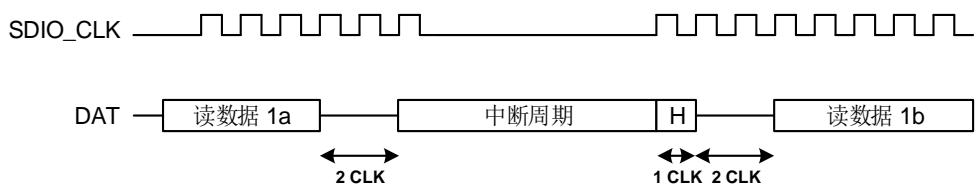

图 20-13. 使用 SDIO_DAT[2]信号线的读等待操作

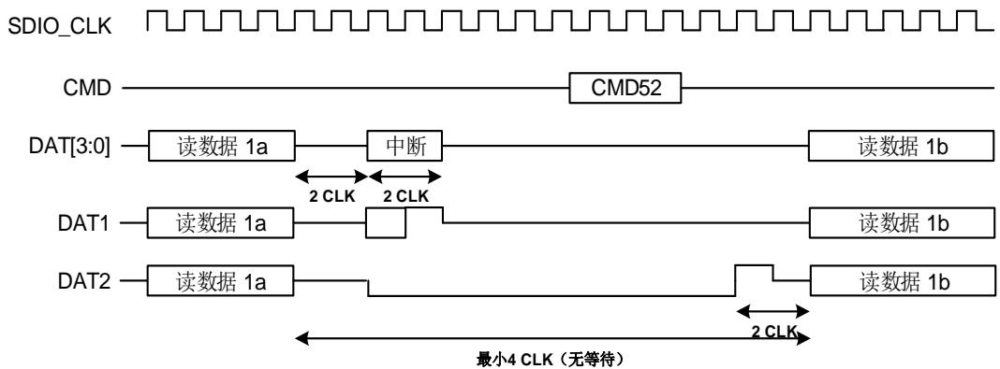

在接收到数据块之前就可以开始读等待：当数据单元使能(设置 SDIO_DATACTL[0]位)，SD I/O特定操作使能(设置 SDIO_DATACTL[11]位)，开始读等待(SDIO_DATACTL[10] = 0 并且SDIO_DATACTL[8] = 1)，数据方向为从卡到 SD I/O 主机 (SDIO_DATACTL[1] = 1)，DSM 直接从空闲状态到读等待状态。在读等待时，2 个SDIO_CLK时钟周期后，DSM驱动SDIO_DAT[2]为 0。在这种状态下，当设置了 RWSTOP 位(SDIO_DATACTL[9])时，DSM 会在等待状态多停留 2 个 SDIO_CLK 时钟周期，并在一个时钟周期中驱动 SDIO_DAT[2]为 1。然后 DSM 再次开始等待直到从卡里接收到数据。在接收数据块时，即使设置了开始读等待，DSM 也不会开始一个读等待间隔，读等待将在收到 CRC 后开始。必须清除 RWSTOP 才能开始新的读等待操作。在读等待期间，SDIO 主机可以在 SDIO_DAT[1]上监测 SD I/O 中断。

## SD I/O 暂停/恢复操作

对于多功能 SD I/O 或组合卡，它们有多个设备（I/O 和存储）共享 SD 总线。为了允许主机同时访问多个设备，SD I/O 和组合卡可以实现可选的暂停/恢复操作。如果卡支持暂停/恢复，为了给其他的功能或者存储器提供更高优先级的传输而释放总线，主机可以暂停某个功能或者存储器的数据传输。一旦高优先级的传输完成后，原来的传输在暂停处重新开始。

20-14. 1 2 显示第一次暂停请求没有立即接受的条件。然后主机检查一个读请求的状态，并确定该总线已被释放（BS = 0）。此时，功能 2 的读操作被启动。一旦读取单个块完成，恢复发送功能，从而恢复数据传输（DF = 1）。

图 20-14. 在功能 1 的多块读周期期间插入功能 2 读周期

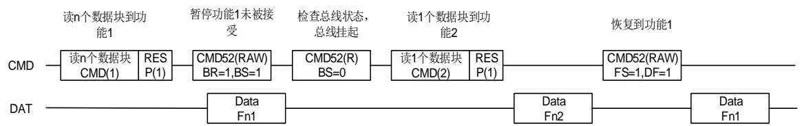

当主机向卡发送数据时，主机可以暂停写操作。设置 SDIO_CMDCTL[11]位并指示 CSM 当前的命令是一个暂停命令。CSM 分析响应，当从卡收到响应时(暂停被接受)，它确认 DSM 在收到当前数据块的 CRC 后进入空闲状态。

为了暂停读操作，DSM 在 WaitR 状态等待，在停止数据传输之前，当功能被挂起时一个完整的数据包。随后应用程序继续读出接收 FIFO 直到 FIFO 为空，最后 DSM 自动地进入空闲状态。

## 中断

为了允许 SD I/O 卡中断主机，SD 接口增加了一个中断功能的引脚。在 4 位模式下，引脚 8被用作 SDIO_DAT[1]，它被用于卡到主机的中断信号。对于每张卡中断的功能是可选的。SDI/O 中断“电平敏感”，即中断线应保持有效（低）直到卡要么被主机认可并采取行动，要么或者由于中断周期结束而解除有效状态。一旦主机服务中断，通过函数的唯一 I/O 操作清除中断。

当设置 SDIO_DATACTL[11]位，SD I/O 中断可以在 SDIO_DAT[1]信号线上检测到。

20-15. 显示单个数据读周期的中断周期时序。

图 20-15. 读中断周期时序

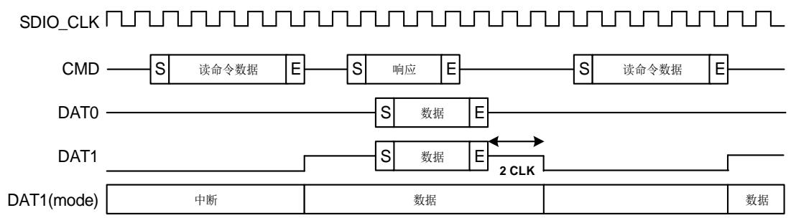

图 20-16. 写中断周期时序

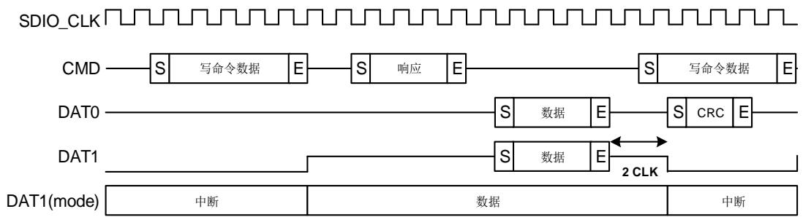

当在 4 位 SD 模式传送数据的多个块时，需要中断周期的特定的定义。为了运行通信的最高速度，中断周期限制在 2 个时钟周期。卡如果想向主机发送一个中断信号，应该在第一个时钟周期设置 DAT1 为低，第二个时钟周期设置 DAT1 为高。然后卡应释放 DAT1 进入 Hi-Z 状态。

20-17. 4 显示了 4 位的多块读取时中断操作， 20-18. 4显示了 4 位的多块写入时的中断操作。

图 20-17. 4 位模式下多块读中断周期时序

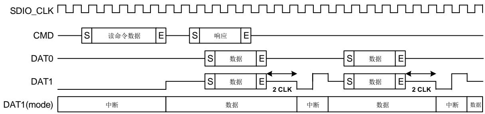

图 20-18. 4 位模式下多块写中断周期时序

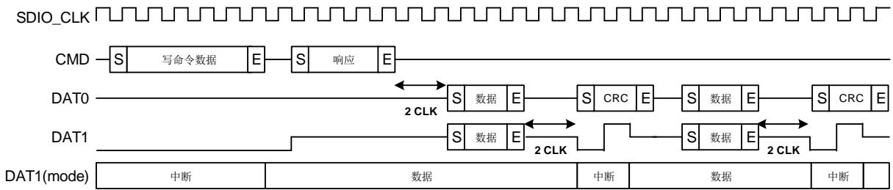

## 20.7.2. CE-ATA 特定操作

CE-ATA设备支持下述特定操作：

接收命令完成信号

发送命令完成关闭信号

只有当设置了 SDIO_CMDCTL[14]位时，SDIO 才支持这些操作。

## 命令完成信号

CE-ATA 定义了命令完成信号，设备使用该信号通知主机正常 ATA 命令完成或者由于设备遇到一个错误条件，ATA命令终止。

如果“启用 CMD 完成”位 SDIO_CMDCTL[12]被设置并且“不中断使能'位 SDIO_CMDCTL[13]被设置，CSM 等待在Waitcompl状态的命令完成信号。

当在 CMD 线上接收到起始位，CSM 进入空闲状态。在 7 位周期之内不能发送新的命令。然后，在 5 个时钟周期内，把 CMD 信号变为 1（推挽模式）。

在主机从设备检测到一个命令完成信号之后，应该发送 FAST_IO（CMD39）命令来读取 ATA状态寄存器以确定 ATA命令的结束状态。

## 命令完成关闭信号

主机可以通过发送命令完成关闭信号来取消设备返回命令完成信号的功能。只有当主机在发送RW_MULTIPLE_BLOCK (CMD61)之后接收到 R1b 响应后才能发送命令完成关闭信号。

如果未设置 SDIO_CMDCTL[12]中的“使能命令完成信号”并且重置了 SDIO_CMDCTL[13]中的“非中断使能位”，则在收到一个短响应后的 8 位周期之后，发出命令完成关闭信号。

图 20-19. 命令完成信号关闭操作

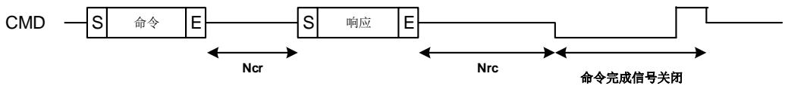

