## 21. 外部存储器控制器（EXMC）

## 21.1. 简介

外部存储器控制器EXMC，用来访问各种片外存储器，通过配置寄存器，EXMC可以把AMBA协议转换为专用的片外存储器通信协议，包括SRAM，ROM，NOR Flash，NAND Flash，PC卡。用户还可以调整配置寄存器中的时间参数来提高通信效率。EXMC的访问空间被划分为许多个块（Bank），每个块支持特定的存储器类型，用户可以通过对Bank的控制寄存器配置来控制外部存储器。

## 21.2. 主要特性

支持片外存储器类型：

SRAM； 

PSRAM； 

ROM； 

NOR Flash； 

8 位或 16 位 NAND Flash；

16 位 PC Card；

AMBA协议与各种片外存储器协议转换；

时序参数可编程可以满足用户特定需求；

每个 Bank 有独立的片选信号；

对于部分存储器类型支持独立的读写时序；

对于 NAND Flash 内置硬件 ECC；

支持 8 位，或 16 位总线带宽；

NOR Flash 和 PSRAM 支持地址总线和数据总线的复用；

提供写使能和字节选择信号；

当 AMBA 总线宽度与外部存储器数据宽度不同时，会自动分割操作。

## 21.3. 功能描述

## 21.3.1. 结构框图

EXMC由5个模块组成：AHB总线接口，EXMC配置寄存器，NOR/PSRAM控制器，NAND/PCCard控制器和外部设备接口。AHB时钟（HCLK）是参考时钟。

图 21-1. 系统架构

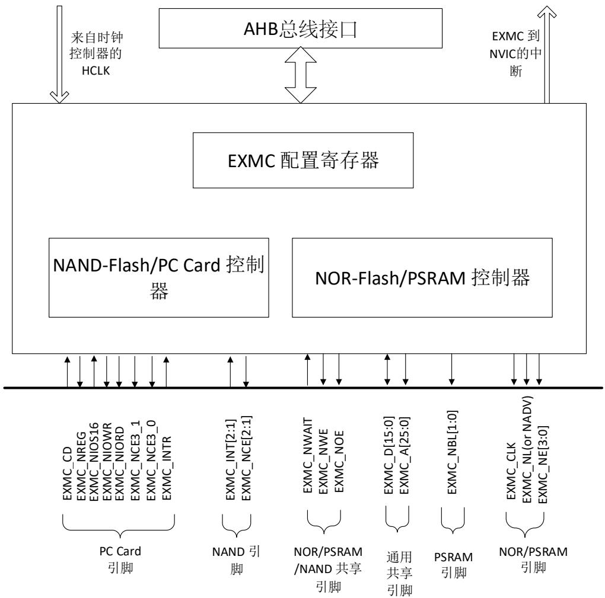

## 21.3.2. EXMC 访问基本规范

EXMC是AHB总线至外部设备协议的转换接口。32位的AHB读写操作可以转化为几个连续的8位或16位读写操作。在数据传输的过程中，AHB数据宽度和存储器数据宽度可能不相同。为了保证数据传输的一致性，EXMC读写访问需要遵从以下规范：

AHB 访问宽度等于存储器宽度，则没有问题；

AHB 访问宽度大于存储器宽度，则自动将 AHB 访问分割成几个连续的存储器数据宽度的传输；

AHB 访问宽度小于存储器宽度。如果外部存储设备具有字节选择功能，如 SRAM、ROM、PSRAM，则可通过它的字节通道 EXMC_NBL[1:0]来访问对应的字节。否则禁止写操作，只允许读操作。

## 21.3.3. 外部设备地址映射

图 21-2. EXMC Bank 划分

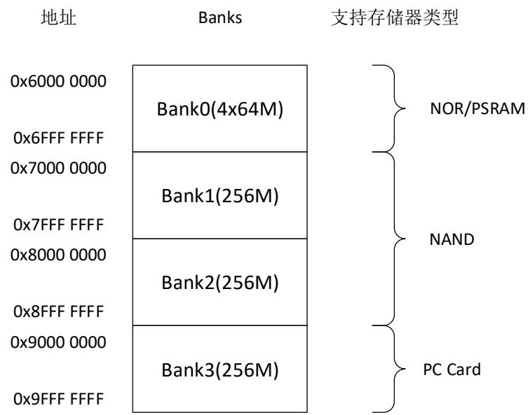

EXMC将外部存储器分成多个Bank，每个Bank占256M字节，其中Bank0又分为4个Region，每个Region占64M字节。Bank1和Bank2又都被分成2个Section，分别是属性存储空间和通用存储空间。Bank3分成3个Section，分别是属性存储空间，通用存储空间和I/O存储空间。

每个Bank或Region都有独立的片选控制信号，也都能进行独立的配置。

Bank0用于访问NOR、PSRAM设备。

Bank1和Bank2用于连接NAND Flash，且每个Bank连接一个NAND。

Bank3用于连接PC卡。

## NOR 和 PSRAM 的地址映射

21-3. Bank0 是Bank0四个Region的地址映射。AHB地址线HADDR[27:26]作为四个Region的片选信号。

图 21-3. Bank0 地址映射

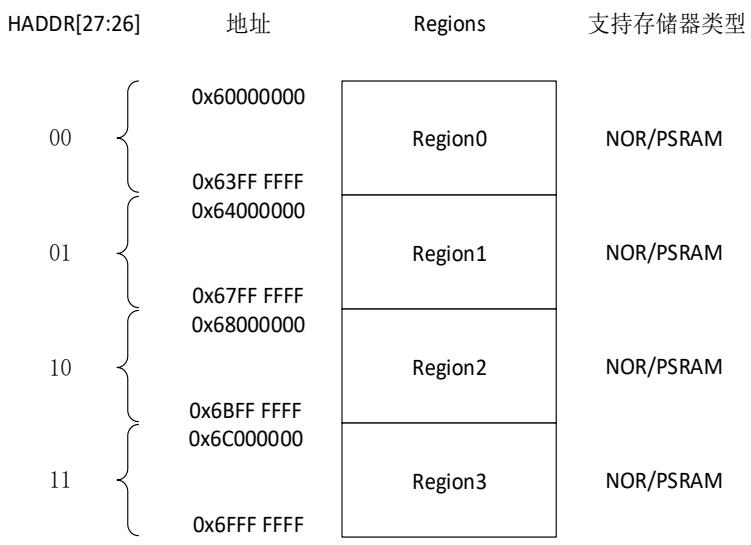

由于HADDR[25:0]是字节地址，而外部存储器访问有可能不是按字节访问的，所以会出现地址不一致的情况，但EXMC能实现对HADDR的调整以适应外部存储器的数据宽度。具体规则如下：

如果外部存储器的数据宽度是 8 位按字节对齐，EXMC 内部将 HADDR[25:0]与EXMC_A[25:0]相连，然后 EXMC_A[25:0]与外部存储器的地址线相连；

如果外部存储器的数据宽度是 16 位按半字对齐，就需要将 HADDR 的字节地址转化为半字地址之后再连接外存储器，EXMC 内部将 HADDR[25:1]与 EXMC_A[24:0]相连，然后EXMC_A[24:0]与外部存储器的地址线相连。

## NAND/PC Card 地址映射

Bank1和Bank2用来访 问 NAND Flash ，Bank3用 来访问 PC Card 。每个 Bank 如 21-4.NAND/PC Card 被分为多个存储空间。

图 21-4. NAND/PC Card 地址映射

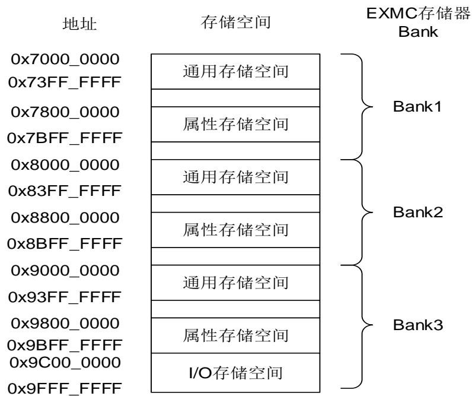

## NAND 地址映射

对于 NAND Flash，通用和属性空间又可以细划分为 3 个区域。 21-5. Bank1 为Bank1 通用存储空间的数据区域，指令区域和地址区域的划分。

图 21-5. Bank1 通用空间

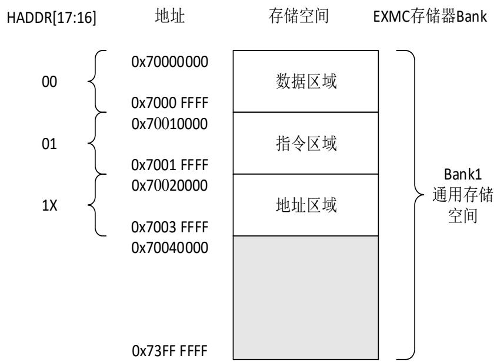

AHB利用HADDR[17:16]来实现对以上三个区的选择：

HADDR[17:16]=00,即选择数据区；

HADDR[17:16]=01 即选择命令区；

HADDR[17:16]=1X 即选择地址区。

应用软件使用这3个区访问NAND Flash。操作规则如下：

指令区：指定NAND Flash将要执行的指令，软件在命令区写入指令。在指令传输过程中，EXMC会使能命令锁存信号（CLE），CLE映射到EXMC_A[16]。

地址区：指定操作NAND Flash的地址，软件在地址区写入地址。在地址传输过程中，EXMC会使能地址锁存信号（ALE），ALE映射到EXMC_A[17]。

数据区：NAND Flash读写数据，软件在数据区读出或写入数据。当EXMC在数据发送模式，软件需要在数据区写入数据，当EXMC在数据接收模式，软件需要在数据区读取数据。由于NANDFlash会自动累加其内部操作地址，故在读写时不需要软件修改操作地址。

## 21.3.4. NOR/PSRAM 控制器

EXMC模块的NOR/PSRAM控制器控制Bank0，它可以支持NOR Flash、PSRAM、SRAM、ROM和CRAM外部存储器。EXMC对Bank0每个Region输出一个唯一的片选信号，NE[x](x=0..3)，用于在4个Region中进行片选，所有其他的信号都是共享的。每个Region 都有专门的寄存器控制。

## 注意：

在异步模式下，所有控制器输出信号在内部AHB总线时钟（HCLK）的上升沿改变。

在同步模式下，所有控制器输出数据在外部存储器时钟（EXMC_CLK）的下降沿改变。

## NOR/PSRAM 接口描述

表 21-1. NOR Flash 接口信号描述

<table><tr><td>EXMC 引脚</td><td>传输方向</td><td>模式</td><td>功能描述</td></tr><tr><td>EXMC_CLK</td><td>输出</td><td>同步</td><td>同步时钟信号</td></tr><tr><td>Non-muxed EXMC_A[25:0]</td><td rowspan="2">输出</td><td rowspan="2">异步/同步</td><td rowspan="2">地址总线</td></tr><tr><td>Muxed EXMC_A[25:16]</td></tr><tr><td rowspan="2">EXMC_D[15:0]</td><td>输入/输出</td><td>异步/同步(复用)</td><td>地址/数据总线</td></tr><tr><td>输入/输出</td><td>异步/同步(非复用)</td><td>数据总线</td></tr><tr><td>EXMC_NE[x]</td><td>输出</td><td>异步/同步</td><td>片选, x=0/1/2/3</td></tr><tr><td>EXMC_NOE</td><td>输出</td><td>异步/同步</td><td>读使能</td></tr><tr><td>EXMC_NWE</td><td>输出</td><td>异步/同步</td><td>写使能</td></tr><tr><td>EXMC_NWAIT</td><td>输入</td><td>异步/同步</td><td>等待输入信号</td></tr><tr><td>EXMC_NL(NADV)</td><td>输出</td><td>异步/同步</td><td>地址有效</td></tr></table>

表 21-2. PSRAM 非复用接口信号描述

<table><tr><td>EXMC 引脚</td><td>传输方向</td><td>模式</td><td>功能描述</td></tr><tr><td>EXMC_CLK</td><td>输出</td><td>同步</td><td>同步时钟信号</td></tr><tr><td>EXMC_A[25:0]</td><td>输出</td><td>异步/同步</td><td>地址总线</td></tr><tr><td>EXMC_D[15:0]</td><td>输入/输出</td><td>异步/同步</td><td>数据总线</td></tr><tr><td>EXMC_NE[x]</td><td>输出</td><td>异步/同步</td><td>片选, x=0/1/2/3</td></tr><tr><td>EXMC_NOE</td><td>输出</td><td>异步/同步</td><td>读使能</td></tr><tr><td>EXMC_NWE</td><td>输出</td><td>异步/同步</td><td>写使能</td></tr><tr><td>EXMC_NWAIT</td><td>输入</td><td>异步/同步</td><td>等待输入信号</td></tr><tr><td>EXMC_NL(NADV)</td><td>输出</td><td>异步/同步</td><td>地址锁存信号</td></tr><tr><td>EXMC_NBL[1]</td><td>输出</td><td>异步/同步</td><td>高字节使能</td></tr><tr><td>EXMC_NBL[0]</td><td>输出</td><td>异步/同步</td><td>低字节使能</td></tr></table>

## 支持的存储器访问模式

21-3. EXMC Bank0 列出了EXMC对NOR，PSRAM和SRAM支持的访问模式。

表 21-3. EXMC 的 Bank0 支持的所有处理

<table><tr><td>存储器类型</td><td>访问模式</td><td>读/写</td><td>AHB传输宽度</td><td>存储器传输宽度</td><td>注释</td></tr><tr><td rowspan="7">NOR Flash</td><td>异步</td><td>R</td><td>8</td><td>16</td><td></td></tr><tr><td>异步</td><td>R</td><td>16</td><td>16</td><td></td></tr><tr><td>异步</td><td>W</td><td>16</td><td>16</td><td></td></tr><tr><td>异步</td><td>R</td><td>32</td><td>16</td><td>分成2次EXMC访问</td></tr><tr><td>异步</td><td>W</td><td>32</td><td>16</td><td>分成2次EXMC访问</td></tr><tr><td>同步</td><td>R</td><td>16</td><td>16</td><td></td></tr><tr><td>同步</td><td>R</td><td>32</td><td>16</td><td></td></tr><tr><td rowspan="11">PSRAM</td><td>异步</td><td>R</td><td>8</td><td>16</td><td></td></tr><tr><td>异步</td><td>W</td><td>8</td><td>16</td><td>使用字节信号NBL[1:0]</td></tr><tr><td>异步</td><td>R</td><td>16</td><td>16</td><td></td></tr><tr><td>异步</td><td>W</td><td>16</td><td>16</td><td></td></tr><tr><td>异步</td><td>R</td><td>32</td><td>16</td><td>分成2次EXMC访问</td></tr><tr><td>异步</td><td>W</td><td>32</td><td>16</td><td>分成2次EXMC访问</td></tr><tr><td>同步</td><td>R</td><td>16</td><td>16</td><td></td></tr><tr><td>同步</td><td>R</td><td>32</td><td>16</td><td>使用字节信号NBL[1:0]</td></tr><tr><td>同步</td><td>W</td><td>8</td><td>16</td><td></td></tr><tr><td>同步</td><td>W</td><td>16</td><td>16</td><td></td></tr><tr><td>同步</td><td>W</td><td>32</td><td>16</td><td></td></tr><tr><td rowspan="5">SRAM and ROM</td><td>异步</td><td>R</td><td>8</td><td>8</td><td></td></tr><tr><td>异步</td><td>R</td><td>8</td><td>16</td><td></td></tr><tr><td>异步</td><td>R</td><td>16</td><td>8</td><td>分成2次EXMC访问</td></tr><tr><td>异步</td><td>R</td><td>16</td><td>16</td><td></td></tr><tr><td>异步异步</td><td>RR</td><td>3232</td><td>816</td><td>分成4次EXMC访问分成2次EXMC访问</td></tr><tr><td rowspan="6"></td><td>异步</td><td>W</td><td>8</td><td>8</td><td></td></tr><tr><td>异步</td><td>W</td><td>8</td><td>16</td><td>使用字节信号NBL[1:0]</td></tr><tr><td>异步</td><td>W</td><td>16</td><td>8</td><td></td></tr><tr><td>异步</td><td>W</td><td>16</td><td>16</td><td></td></tr><tr><td>异步</td><td>W</td><td>32</td><td>8</td><td></td></tr><tr><td>异步</td><td>W</td><td>32</td><td>16</td><td></td></tr></table>

## NOR Flash/PSRAM 控制时序

EXMC为SRAM、ROM、PSRAM、NOR Flash等外部静态存储器提供可编程的时序参数以及多种时序模型以满足不同的需求。

表 21-4. NOR/PSRAM 控制时序参数

<table><tr><td>参数</td><td>功能</td><td>访问模式</td><td>单位</td><td>最小值</td><td>最大值</td></tr><tr><td>CKDIV</td><td>同步时钟分频比</td><td>同步</td><td>HCLK</td><td>2</td><td>16</td></tr><tr><td>DLAT</td><td>数据延迟</td><td>异步</td><td>EXMC_CLK</td><td>2</td><td>17</td></tr><tr><td>BUSLAT</td><td>总线延迟</td><td>异步/同步读</td><td>HCLK</td><td>1</td><td>16</td></tr><tr><td>DSET</td><td>数据建立时间</td><td>异步</td><td>HCLK</td><td>2</td><td>256</td></tr><tr><td>AHLD</td><td>地址保持时间</td><td>异步(复用)</td><td>HCLK</td><td>2</td><td>16</td></tr><tr><td>ASET</td><td>地址建立时间</td><td>异步</td><td>HCLK</td><td>1</td><td>16</td></tr></table>

表 21-5. EXMC 时序模型

<table><tr><td colspan="2">时序模型</td><td>扩展模式</td><td>模式描述</td><td>写时序参数</td><td>读时序参数</td></tr><tr><td rowspan="7">异步</td><td>模式1</td><td>0</td><td>SRAM/PSRAM/CRAM</td><td>DSETASET</td><td>DSETASET</td></tr><tr><td>模式2</td><td>0</td><td>NOR Flash</td><td>DSETASET</td><td>DSETASET</td></tr><tr><td>模式A</td><td>1</td><td>SRAM/PSRAM/CRAM 在数据阶段 EXMC_NOE 翻转</td><td>WDSETWASET</td><td>DSETASET</td></tr><tr><td>模式B</td><td>1</td><td>NOR Flash</td><td>WDSETWASET</td><td>DSETASET</td></tr><tr><td>模式C</td><td>1</td><td>NOR Flash 在数据阶段 EXMC_NOE 翻转</td><td>WDSETWASET</td><td>DSETASET</td></tr><tr><td>模式D</td><td>1</td><td>有地址保持功能</td><td>WDSETWAHLDWASET</td><td>DSETAHLDASET</td></tr><tr><td>模式AM</td><td>0</td><td>NOR Flash 数据/地址复用</td><td>DSETAHLDASETBUSLAT</td><td>DSETAHLDASETBUSLAT</td></tr><tr><td>同步</td><td>模式E</td><td>0</td><td>NOR/PSRAM/CRAM 同步读 PSRAM/CRAM同步写</td><td>DLATCKDIV</td><td>DLATCKDIV</td></tr><tr><td></td><td>模式 SM</td><td>0</td><td>NOR Flash 数据/地址复用</td><td>DLATCKDIV</td><td>DLATCKDIV</td></tr></table>

如 21-5. EXMC 所示，EXMC 模块 NOR Flash/PSRAM 控制器可以提供多种时序模型。用户可以通过修改 21-4. NOR/PSRAM 中列出的参数来使 C 之适合不同类型外部存储器的时序以及满足用户的要求。当将寄存器 EXMC_SNCTLx 位 EXMODEN 置1 使能扩展模式后，可以通过寄存器 EXMC_SNTCFGx 和 EXMC_SNWTCFGx 将读写配置成独立的时序。

## 异步访问时序

模式1 – SRAM/CRAM

图 21-6. 模式 1 读时序

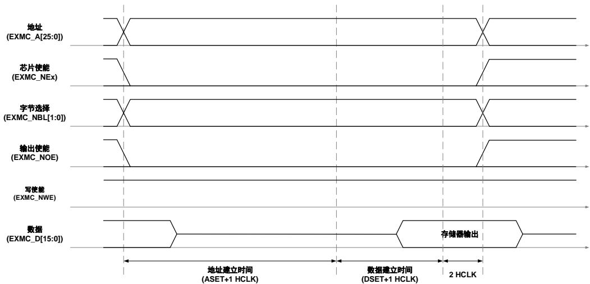

图 21-7. 模式 1 写时序

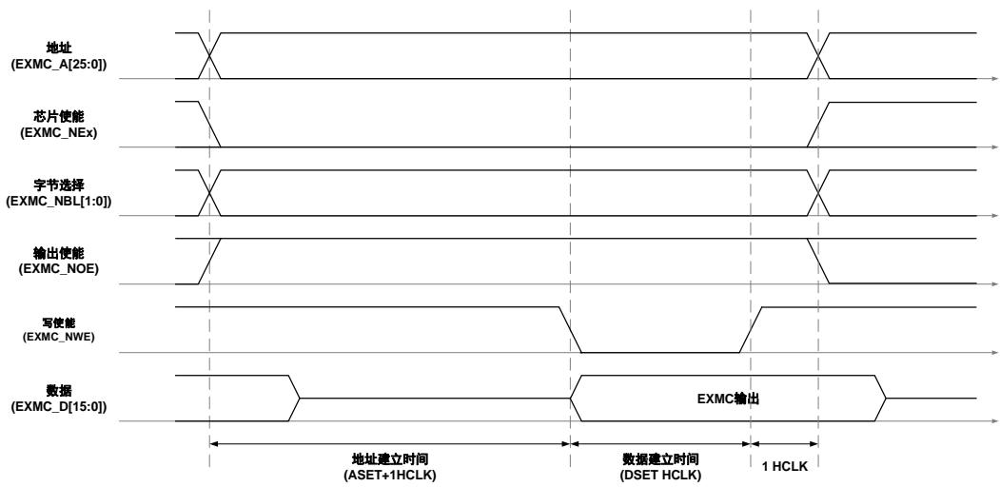

表 21-6. 模式 1 相关寄存器配置

<table><tr><td>位域/位</td><td>名称</td><td>参考设定值</td></tr><tr><td colspan="3">EXMC_SNCTLx</td></tr><tr><td>31-20</td><td>保留</td><td>0x000</td></tr><tr><td>19</td><td>SYNCWR</td><td>0x0</td></tr><tr><td>18-16</td><td>CPS</td><td>0x0</td></tr><tr><td>15</td><td>ASYNCWAIT</td><td>取决于存储器</td></tr><tr><td>14</td><td>EXMODEN</td><td>0x0</td></tr><tr><td>13</td><td>NRWTEN</td><td>0x0</td></tr><tr><td>12</td><td>WEN</td><td>取决于用户</td></tr><tr><td>11</td><td>NRWTCFG</td><td>无影响</td></tr><tr><td>10</td><td>WRAPEN</td><td>0x0</td></tr><tr><td>9</td><td>NRWTPOL</td><td>仅当位15为1时有效</td></tr><tr><td>8</td><td>SBRSTEN</td><td>0x0</td></tr><tr><td>7</td><td>保留</td><td>0x1</td></tr><tr><td>6</td><td>NREN</td><td>无影响</td></tr><tr><td>5-4</td><td>NRW</td><td>取决于存储器</td></tr><tr><td>3-2</td><td>NRTP</td><td>取决于存储器,Nor Flash: 2</td></tr><tr><td>1</td><td>NRMUX</td><td>0x0</td></tr><tr><td>0</td><td>NRBKEN</td><td>0x1</td></tr><tr><td colspan="3">EXMC_SNTCFGx</td></tr><tr><td>31-30</td><td>保留</td><td>0x0000</td></tr><tr><td>29-28</td><td>ASYNCMOD</td><td>无影响</td></tr><tr><td>27-24</td><td>DLAT</td><td>无影响</td></tr><tr><td>23-20</td><td>CKDIV</td><td>无影响</td></tr><tr><td>19-16</td><td>BUSLAT</td><td>EXMC_NE[x]上升沿到下降沿的时间</td></tr><tr><td>15-8</td><td>DSET</td><td>取决于存储器与用户(写操作为DSET+1 HCLK时钟周期,读操作为DSET +3HCLK时钟周期)</td></tr><tr><td>7-4</td><td>AHLD</td><td>无影响</td></tr><tr><td>3-0</td><td>ASET</td><td>取决于存储器与用户</td></tr></table>

模式A – SRAM/PSRAM(CRAM) OE翻转

图 21-8. 模式 A 读时序

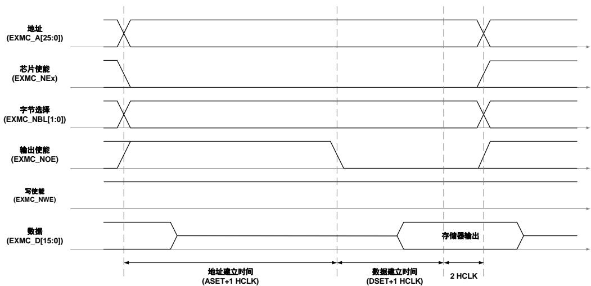

图 21-9. 模式 A 写时序

模式A和模式1的区别在于写时序，当两个模式的寄存器有相同的时序配置时，模式A的写时序独立于读时序。

表 21-7. 模式 A相关寄存器配置

<table><tr><td>位域/位</td><td>名称</td><td>参考设定值</td></tr><tr><td colspan="3">EXMC_SNCTLx</td></tr><tr><td>31-20</td><td>保留</td><td>0x000</td></tr><tr><td>19</td><td>SYNCWR</td><td>0x0</td></tr><tr><td>18-16</td><td>CPS</td><td>0x0</td></tr><tr><td>15</td><td>ASYNCWTEN</td><td>取决于存储器</td></tr><tr><td>14</td><td>EXMODEN</td><td>0x1</td></tr><tr><td>13</td><td>NRWTEN</td><td>0x0</td></tr><tr><td>12</td><td>WEN</td><td>取决于用户</td></tr><tr><td>11</td><td>NRWTCFG</td><td>无影响</td></tr><tr><td>10</td><td>WRAPEN</td><td>0x0</td></tr><tr><td>9</td><td>NRWTPOL</td><td>仅当位 15 为 1 时有效</td></tr><tr><td>8</td><td>SBRSTEN</td><td>0x0</td></tr><tr><td>7</td><td>保留</td><td>0x1</td></tr><tr><td>6</td><td>NREN</td><td>无影响</td></tr><tr><td>5-4</td><td>NRW</td><td>取决于存储器</td></tr><tr><td>3-2</td><td>NRTP</td><td>取决于存储器,Nor Flash: 2</td></tr><tr><td>1</td><td>NRMUX</td><td>0x0</td></tr><tr><td>0</td><td>NRBKEN</td><td>0x1</td></tr><tr><td colspan="3">EXMC_SNTCFGx(Read)</td></tr><tr><td>31-30</td><td>保留</td><td>0x0</td></tr><tr><td>29-28</td><td>ASYNCMOD</td><td>0x0</td></tr><tr><td>27-24</td><td>DLAT</td><td>无影响</td></tr><tr><td>23-20</td><td>CKDIV</td><td>无影响</td></tr><tr><td>19-16</td><td>BUSLAT</td><td>EXMC_NE[x]上升沿到下降沿的时间</td></tr><tr><td>15-8</td><td>DSET</td><td>取决于存储器与用户(读操作为 DSET+3HCLK 时钟周期)</td></tr><tr><td>7-4</td><td>AHLD</td><td>无影响</td></tr><tr><td>3-0</td><td>ASET</td><td>取决于存储器与用户</td></tr><tr><td colspan="3">EXMC_SNWTCFGx(Write)</td></tr><tr><td>31-30</td><td>保留</td><td>0x0</td></tr><tr><td>29-28</td><td>WASYNCMOD</td><td>0x0</td></tr><tr><td>27-20</td><td>保留</td><td>0x00</td></tr><tr><td>19-16</td><td>WBUSLAT</td><td>EXMC_NE[x]上升沿到下降沿的时间</td></tr><tr><td>15-8</td><td>WDSET</td><td>取决于存储器与用户(写操作为 WDSET+1HCLK 时钟周期)</td></tr><tr><td>7-4</td><td>WAHLD</td><td>0x0</td></tr><tr><td>3-0</td><td>WASET</td><td>取决于存储器与用户</td></tr></table>

模式2/B – NOR Flash

图 21-10. 模式 2/B 读时序

图 21-11. 模式 2 写时序

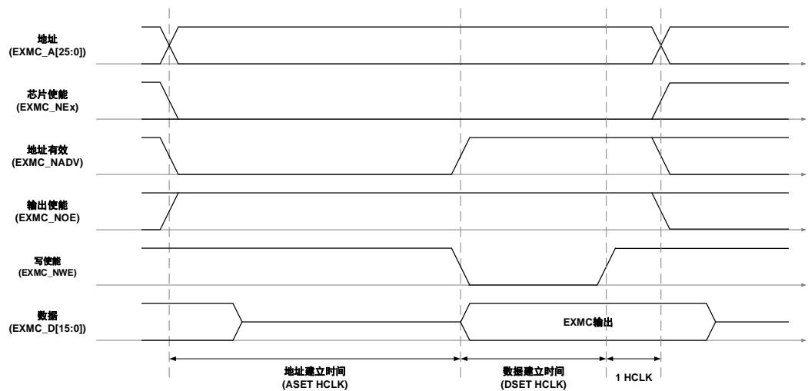

图 21-12. 模式 B 写时序

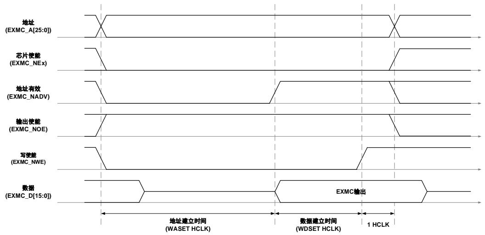

表 21-8. 模式 2/B 相关寄存器配置

<table><tr><td>位域/位</td><td>名称</td><td>参考设定值</td></tr><tr><td colspan="3">EXMC_SNCTLx(模式2,模式B)</td></tr><tr><td>31-20</td><td>保留</td><td>0x000</td></tr><tr><td>19</td><td>SYNCWR</td><td>0x0</td></tr><tr><td>18-16</td><td>CPS</td><td>0x0</td></tr><tr><td>15</td><td>ASYNCWTEN</td><td>取决于存储器</td></tr><tr><td>14</td><td>EXMODEN</td><td>模式2:0x0,模式B:0x1</td></tr><tr><td>13</td><td>NRWTEN</td><td>0x0</td></tr><tr><td>12</td><td>WEN</td><td>取决于用户</td></tr><tr><td>11</td><td>NRWTCFG</td><td>无影响</td></tr><tr><td>10</td><td>WRAPEN</td><td>0x0</td></tr><tr><td>9</td><td>NRWTPOL</td><td>仅当位15为1时有效</td></tr><tr><td>8</td><td>SBRSTEN</td><td>0x0</td></tr><tr><td>7</td><td>保留</td><td>0x1</td></tr><tr><td>6</td><td>NREN</td><td>0x1</td></tr><tr><td>5-4</td><td>NRW</td><td>取决于存储器</td></tr><tr><td>3-2</td><td>NRTP</td><td>Nor Flash:2</td></tr><tr><td>1</td><td>NRMUX</td><td>0x0</td></tr><tr><td>0</td><td>NRBKEN</td><td>0x1</td></tr><tr><td colspan="3">EXMC_SNTCFGx(模式2读/写操作,模式B读操作)</td></tr><tr><td>31-30</td><td>保留</td><td>0x0000</td></tr><tr><td>29-28</td><td>ASYNCMOD</td><td>模式B:0x1</td></tr><tr><td>27-24</td><td>DLAT</td><td>无影响</td></tr><tr><td>23-20</td><td>CKDIV</td><td>无影响</td></tr><tr><td>19-16</td><td>BUSLAT</td><td>EXMC_NE[x]上升沿到下降沿的时间</td></tr><tr><td>15-8</td><td>DSET</td><td>取决于存储器与用户(读操作为DSET+3HCLK时钟周期)</td></tr><tr><td>7-4</td><td>AHLD</td><td>0x0</td></tr><tr><td>3-0</td><td>ASET</td><td>取决于存储器与用户</td></tr><tr><td colspan="3">EXMC_SNWTCFGx(模式B写操作)</td></tr><tr><td>31-30</td><td>保留</td><td>0x0000</td></tr><tr><td>29-28</td><td>WASYNCMOD</td><td>模式B:0x1</td></tr><tr><td>27-20</td><td>保留</td><td>0x000</td></tr><tr><td>19-16</td><td>WBUSLAT</td><td>EXMC_NE[x]上升沿到下降沿的时间</td></tr><tr><td>15-8</td><td>WDSET</td><td>取决于存储器与用户(写操作为WDSET+1HCLk时钟周期)</td></tr><tr><td>7-4</td><td>WAHLD</td><td>0x0</td></tr><tr><td>3-0</td><td>WASET</td><td>取决于存储器与用户</td></tr></table>

模式C – NOR Flash OE翻转

图 21-13. 模式 C 读时序

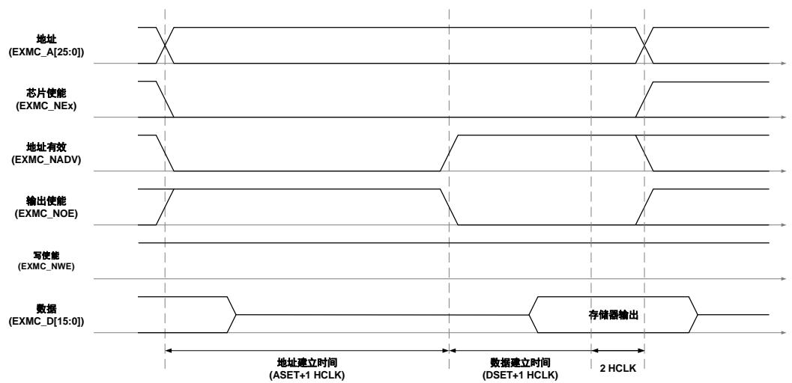

图 21-14. 模式 C 写时序

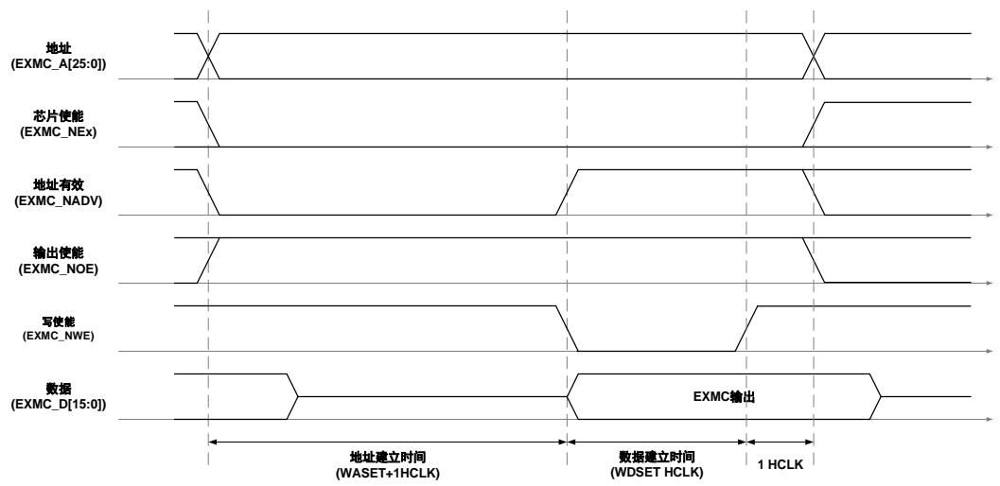

模式C和模式1的区别在于写时序，当两个模式的寄存器有相同的时序配置时，模式C的写时序独立于读时序。

表 21-9. 模式 C 相关寄存器配置

<table><tr><td>位域/位</td><td>名称</td><td>参考设定值</td></tr><tr><td colspan="3">EXMC_SNCTLx</td></tr><tr><td>31-20</td><td>保留</td><td>0x000</td></tr><tr><td>19</td><td>SYNCWR</td><td>0x0</td></tr><tr><td>18-16</td><td>CPS</td><td>0x0</td></tr><tr><td>15</td><td>ASYNCWTEN</td><td>取决于存储器</td></tr><tr><td>14</td><td>EXMODEN</td><td>0x1</td></tr><tr><td>13</td><td>NRWTEN</td><td>0x0</td></tr><tr><td>12</td><td>WEN</td><td>取决于用户</td></tr><tr><td>11</td><td>NRWTCFG</td><td>无影响</td></tr><tr><td>10</td><td>WRAPEN</td><td>0x0</td></tr><tr><td>9</td><td>NRWTPOL</td><td>仅当位15为1时有效</td></tr><tr><td>8</td><td>SBRSTEN</td><td>0x0</td></tr><tr><td>7</td><td>保留</td><td>0x1</td></tr><tr><td>6</td><td>NREN</td><td>0x1</td></tr><tr><td>5-4</td><td>NRW</td><td>取决于存储器</td></tr><tr><td>3-2</td><td>NRTP</td><td>Nor Flash: 2</td></tr><tr><td>1</td><td>NRMUX</td><td>0x0</td></tr><tr><td>0</td><td>NRBKEN</td><td>0x1</td></tr><tr><td colspan="3">EXMC_SNTCFGx</td></tr><tr><td>31-30</td><td>保留</td><td>0x0000</td></tr><tr><td>29-28</td><td>ASYNCMOD</td><td>模式C: 0x2</td></tr><tr><td>27-24</td><td>DLAT</td><td>无影响</td></tr><tr><td>23-20</td><td>CKDIV</td><td>无影响</td></tr><tr><td>19-16</td><td>BUSLAT</td><td>EXMC_NE[x]上升沿到下降沿的时间</td></tr><tr><td>15-8</td><td>DSET</td><td>取决于存储器与用户(读操作为DSET+3HCLk时钟周期)</td></tr><tr><td>7-4</td><td>AHLD</td><td>0x0</td></tr><tr><td>3-0</td><td>ASET</td><td>取决于存储器与用户</td></tr><tr><td colspan="3">EXMC_SNWTCFGx</td></tr><tr><td>31-30</td><td>保留</td><td>0x0</td></tr><tr><td>29-28</td><td>WASYNCMOD</td><td>模式C: 0x2</td></tr><tr><td>27-20</td><td>保留</td><td>0x000</td></tr><tr><td>19-16</td><td>WBUSLAT</td><td>EXMC_NE[x]上升沿到下降沿的时间</td></tr><tr><td>15-8</td><td>WDSET</td><td>取决于存储器与用户(写操作为WDSET+1HCLK时钟周期)</td></tr><tr><td>7-4</td><td>WAHLD</td><td>0x0</td></tr><tr><td>3-0</td><td>WASET</td><td>取决于存储器与用户</td></tr></table>

模式D – 带地址扩展的异步操作

图 21-15. 模式 D 读时序

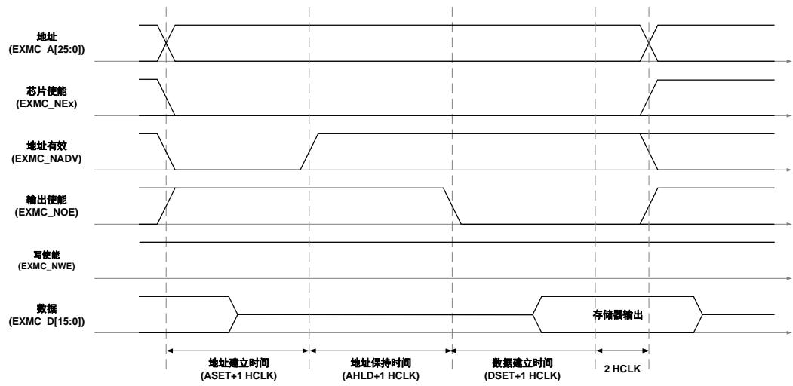

图 21-16. 模式 D 写时序

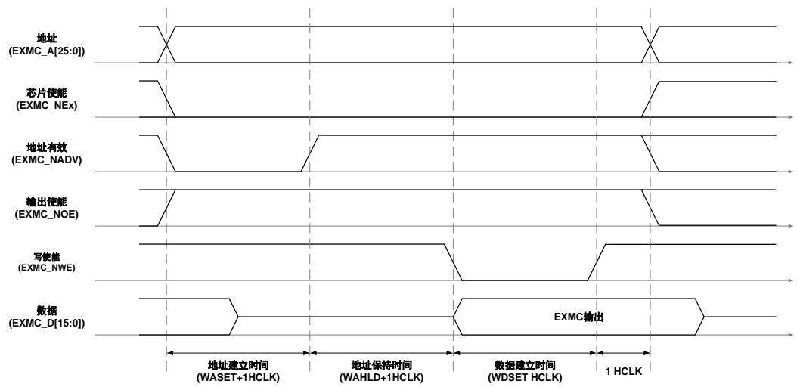

表 21-10. 模式 D 相关寄存器配置

<table><tr><td>位域/位</td><td>名称</td><td>参考设定值</td></tr><tr><td colspan="3">EXMC_SNCTLx</td></tr><tr><td>31-20</td><td>保留</td><td>0x000</td></tr><tr><td>19</td><td>SYNCWR</td><td>0x0</td></tr><tr><td>18-16</td><td>CPS</td><td>0x0</td></tr><tr><td>15</td><td>ASYNCWTEN</td><td>取决于存储器</td></tr><tr><td>14</td><td>EXMODEN</td><td>0x1</td></tr><tr><td>13</td><td>NRWTEN</td><td>0x0</td></tr><tr><td>12</td><td>WEN</td><td>取决于用户</td></tr><tr><td>11</td><td>NRWTCFG</td><td>无影响</td></tr><tr><td>10</td><td>WRAPEN</td><td>0x0</td></tr><tr><td>9</td><td>NRWTPOL</td><td>仅当位 15 为 1 时有效</td></tr><tr><td>8</td><td>SBRSTEN</td><td>0x0</td></tr><tr><td>7</td><td>保留</td><td>0x1</td></tr><tr><td>6</td><td>NREN</td><td>取决于存储器</td></tr><tr><td>5-4</td><td>NRW</td><td>取决于存储器</td></tr><tr><td>3-2</td><td>NRTP</td><td>取决于存储器</td></tr><tr><td>1</td><td>NRMUX</td><td>0x0</td></tr><tr><td>0</td><td>NRBKEN</td><td>0x1</td></tr><tr><td colspan="3">EXMC_SNTCFGx</td></tr><tr><td>31-30</td><td>保留</td><td>0x0</td></tr><tr><td>29-28</td><td>ASYNCMOD</td><td>模式D: 0x3</td></tr><tr><td>27-24</td><td>DLAT</td><td>无关</td></tr><tr><td>23-20</td><td>CKDIV</td><td>无影响</td></tr><tr><td>19-16</td><td>BUSLAT</td><td>EXMC_NE[x]上升沿到下降沿的时间</td></tr><tr><td>15-8</td><td>DSET</td><td>取决于存储器与用户(读操作为DSET+3HCLK时钟周期)</td></tr><tr><td>7-4</td><td>AHLD</td><td>取决于存储器与用户</td></tr><tr><td>3-0</td><td>ASET</td><td>取决于存储器与用户</td></tr><tr><td colspan="3">EXMC_SNWTCFGx</td></tr><tr><td>31-30</td><td>保留</td><td>0x0</td></tr><tr><td>29-28</td><td>WASYNCMOD</td><td>模式D: 0x3</td></tr><tr><td>27-20</td><td>保留</td><td>0x00</td></tr><tr><td>19-16</td><td>WBUSLAT</td><td>EXMC_NE[x]上升沿到下降沿的时间</td></tr><tr><td>15-8</td><td>WDSET</td><td>取决于存储器与用户(写操作为WSET+1HCLk时钟周期)</td></tr><tr><td>7-4</td><td>WAHLD</td><td>取决于存储器与用户</td></tr><tr><td>3-0</td><td>WASET</td><td>取决于存储器与用户</td></tr></table>

模式AM – NOR Flash地址/数据总线复用

图 21-17. 复用模式读时序

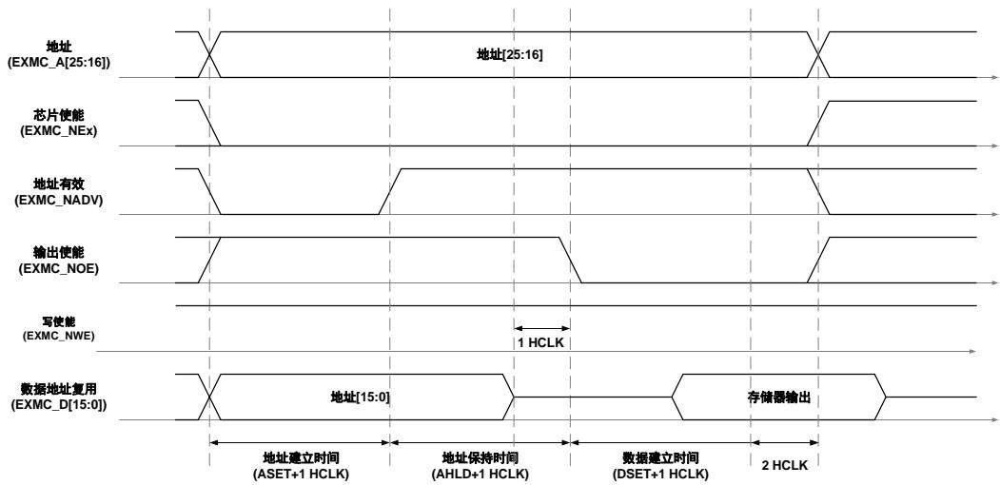

图 21-18. 复用模式写时序

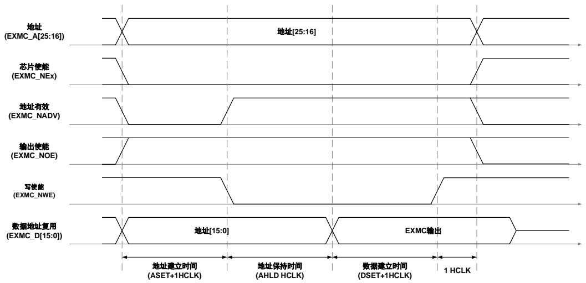

表 21-11. 复用模式相关寄存器配置

<table><tr><td>位域/位</td><td>名称</td><td>参考设定值</td></tr><tr><td colspan="3">EXMC_SNCTLx</td></tr><tr><td>31-20</td><td>保留</td><td>0x000</td></tr><tr><td>19</td><td>SYNCWR</td><td>0x0</td></tr><tr><td>18-16</td><td>CPS</td><td>0x0</td></tr><tr><td>15</td><td>ASYNCWTEN</td><td>取决于存储器</td></tr><tr><td>14</td><td>EXMODEN</td><td>0x0</td></tr><tr><td>13</td><td>NRWTEN</td><td>0x0</td></tr><tr><td>12</td><td>WEN</td><td>取决于存储器</td></tr><tr><td>11</td><td>NRWTCFG</td><td>无影响</td></tr><tr><td>10</td><td>WRAPEN</td><td>0x0</td></tr><tr><td>9</td><td>NRWTPOL</td><td>仅当位15为1时有效</td></tr><tr><td>8</td><td>SBRSTEN</td><td>0x0</td></tr><tr><td>7</td><td>保留</td><td>0x1</td></tr><tr><td>6</td><td>NREN</td><td>0x1</td></tr><tr><td>5-4</td><td>NRW</td><td>取决于存储器</td></tr><tr><td>3-2</td><td>NRTP</td><td>0x2:NOR Flash</td></tr><tr><td>1</td><td>NRMUX</td><td>0x1</td></tr><tr><td>0</td><td>NRBKEN</td><td>0x1</td></tr><tr><td colspan="3">EXMC_SNTCFGx</td></tr><tr><td>31-30</td><td>保留</td><td>0x0</td></tr><tr><td>29-28</td><td>ASYNCMOD</td><td>0x0</td></tr><tr><td>27-24</td><td>DLAT</td><td>无影响</td></tr><tr><td>23-20</td><td>CKDIV</td><td>无影响</td></tr><tr><td>19-16</td><td>BUSLAT</td><td>EXMC_NE[x]上升沿到下降沿的时间</td></tr><tr><td>15-8</td><td>DSET</td><td>取决于存储器与用户(写操作为DSET+2HCLK时钟周期,读操作为DSET+3HCLK时钟周期)</td></tr><tr><td>7-4</td><td>AHLD</td><td>取决于存储器与用户</td></tr><tr><td>3-0</td><td>ASET</td><td>取决于存储器与用户</td></tr></table>

异步通信的等待时间：

等待功能由寄存器EXMC_SNCTLx位ASYNCWAIT控制。在访问外部存储器期间，若使能异步等待功能（ASYNCWAIT=1），数据建立时间将会自动延长。延长时间的计算如下：

若存储器等待信号与EXMC_NOE/ EXMC_NWE信号对齐：

$$
T _ {\text { DATA\_SETUP }} \geq \max T _ {\text { WAIT\_ASSERTION }} + 4 H C L K \tag {21-1}
$$

若存储器等待信号与EXMC_NE信号对齐：

如果

$$
\max T _ {\text { WAIT\_ASSERTION }} \geq T _ {\text { ADDRES\_PHASE }} + T _ {\text { HOLD\_PHASE }} \tag {21-2}
$$

则

$$
T _ {\text { DATA\_SETUP }} \geq (\max T _ {\text { WAIT\_ASSERTION }} - T _ {\text { ADDRES\_PHASE }} - T _ {\text { HOLD\_PHASE }}) + 4 H C L K \tag {21-3}
$$

否则

$$
T _ {\text { DATA\_SETUP }} \geq 4 \text { HCLK } \tag {21-4}
$$

图 21-19. 异步等待有效时的读时序

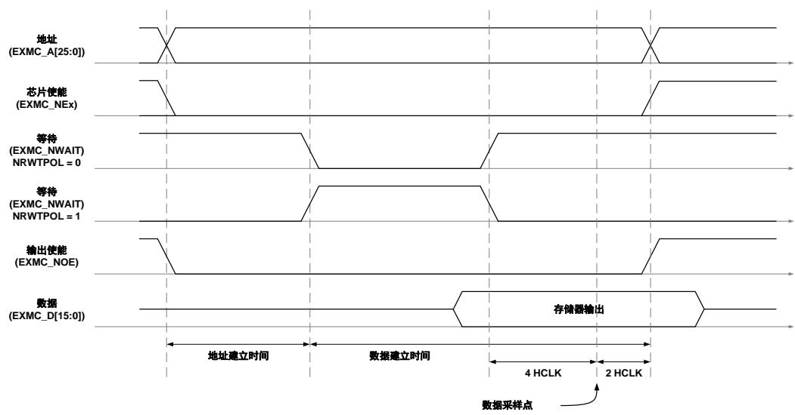

图 21-20. 异步等待有效时的写时序

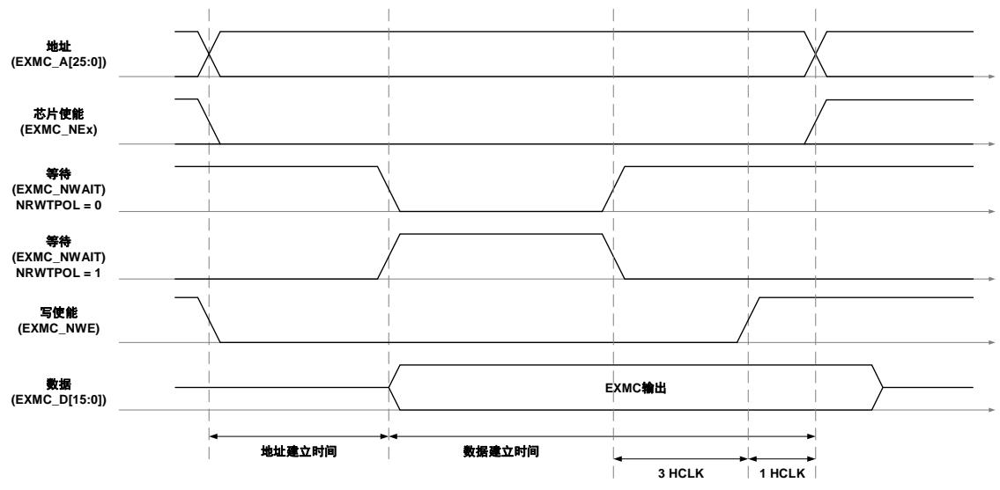

## 同步访问时序

同步访问模式中，存储器时钟（EXMC_CLK）与系统时钟（HCLK）关系如下：

$$
\text { EXMC\_CLK } = \frac {\text { HCLK }}{\text { CKDIV } + 1} \tag {21-5}
$$

其中CKDIV是同步时钟分频比，通过配置寄存器EXMC_SNTCFGx中的CKDIV位来设置不同的值。

## 1. 数据延迟与 NOR Flash 延迟

数据延迟 DLAT 是指在采样数据之前需要等待的 EXMC_CLK 周期数。它和 NOR 闪存延迟的关系如下：

NOR闪存延迟不包含NADV，二者之间的关系为：

$$
\text { NOR   闪存延迟 } = \mathrm{DLAT} + 2 \tag {21-6}
$$

NOR闪存延迟包含NADV，二者之间的关系为：

$$
\text { NOR   闪存延迟 } = \mathrm{DLAT} + 3 \tag {21-7}
$$

## 2. 数据等待

用户需要保证 EXMC_NWAIT 信号与外部设备一致。该信号通过寄存器 EXMC_SNCTLx 来设置，位 NRWTEN 使能，位 NRWTCFG 决定 EXMC_NWAIT 信号是等待状态同时有效，或者比等待状态提前一个时钟周期有效，位 NRWTPOL 设置 EXMC_NWAIT 信号极性。

在 NOR Flash 的同步突发模式中，当寄存器 EXMC_SNCTLx 位 NRWTEN 置 1，在数据延迟之后后检测到 EXMC_NWAIT 信号。如果 EXMC_NWAIT 有效，在 EXMC_NWAIT 无效之前会一直插入等待时钟。

EXMC_NWAIT 有效极性：

NRWTPOL = 1，EXMC_NWAIT 高电平有效

NRWTPOL = 0，EXMC_NWAIT 低电平有效

在同步突发模式中，EXMC_NWAIT 信号有两种配置：

NRWTCFG = 1，EXMC_NWAIT 信号有效时，当前时钟周期数据无效

NRWTCFG = 0，EXMC_NWAIT 信号有效时，下一个时钟周期数据无效，这是复位后的默认配置。

在 EXMC_NWAIT 信号有效的等待周期内，EXMC 会持续的给存储器发送时钟信号，保持片选和输出使能有效，并且忽视总线上的无效数据。

## 3. CRAM 页边界突发传输的自动分组

CRAM1.5 中禁止突发传输跨越页边界，EXMC 遇到边界会进行传输的自动分组。为了保证正确的突发分组操作，用户需要在寄存器EXMC_SNCTLx位CPS中需要设定CRAM的页大小。

## 4. 模式 SM – 单次突发传输

对于同步突发传输，如果 AHB 需要的数据为 16 位，则 EXMC 会执行一次长度为 1 的成组传输；如果 AHB 需要的数据为 32 位，则 EXMC 会把这次传输分成 2 次 16 位的传输，即执行一次长度为 2 的突发传输。

对于其他的配置，请参考 21-3. EXMC Bank0 .

同步复用突发读时序 – NOR,PSRAM(CRAM)

图 21-21. 同步复用突发传输读时序

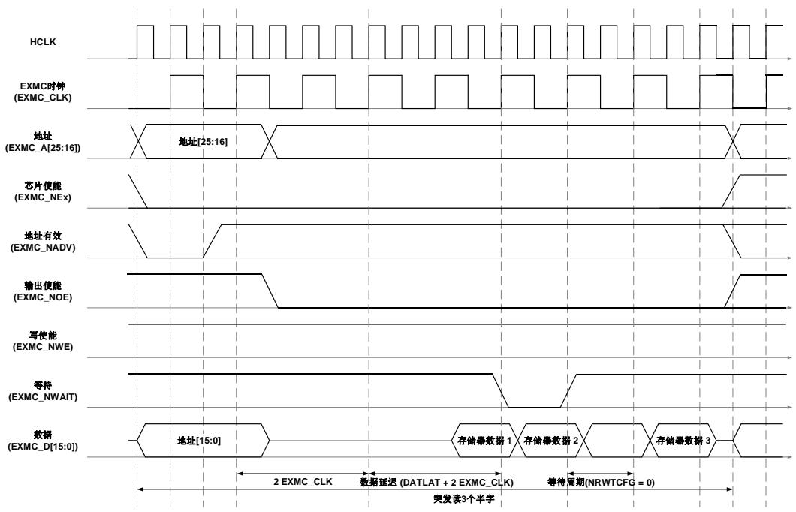

表 21-12. 同步复用模式读时序配置

<table><tr><td>位域/位</td><td>名称</td><td>参考设定值</td></tr><tr><td colspan="3">EXMC_SNCTLx</td></tr><tr><td>31-20</td><td>保留</td><td>0x000</td></tr><tr><td>19</td><td>SYNCWR</td><td>无影响</td></tr><tr><td>18-16</td><td>CPS</td><td>0x0</td></tr><tr><td>15</td><td>ASYNCWTEN</td><td>0x0</td></tr><tr><td>14</td><td>EXMODEN</td><td>0x0</td></tr><tr><td>13</td><td>NRWTEN</td><td>取决于存储器</td></tr><tr><td>12</td><td>WEN</td><td>无影响</td></tr><tr><td>11</td><td>NRWTCFG</td><td>取决于存储器</td></tr><tr><td>10</td><td>WRAPEN</td><td>0x0</td></tr><tr><td>9</td><td>NRWTPOL</td><td>取决于存储器</td></tr><tr><td>8</td><td>SBRSTEN</td><td>0x1,突发读使能</td></tr><tr><td>7</td><td>保留</td><td>0x1</td></tr><tr><td>6</td><td>NREN</td><td>取决于存储器</td></tr><tr><td>5-4</td><td>NRW</td><td>0x1</td></tr><tr><td>3-2</td><td>NRTP</td><td>取决于存储器,0x1/0x2</td></tr><tr><td>1</td><td>NRMUX</td><td>0x1,取决于存储器与用户</td></tr><tr><td>0</td><td>NRBKEN</td><td>0x1</td></tr><tr><td colspan="3">EXMC_SNTCFGx(Read)</td></tr><tr><td>31-30</td><td>保留</td><td>0x0</td></tr><tr><td>29-28</td><td>ASYNCMOD</td><td>0x0</td></tr><tr><td>27-24</td><td>DLAT</td><td>数据延迟</td></tr><tr><td>23-20</td><td>CKDIV</td><td>上图设置:0x1,EXMC_CLK=2HCLK</td></tr><tr><td>19-16</td><td>BUSLAT</td><td>EXMC_NE[x]上升沿到下降沿的时间</td></tr><tr><td>15-8</td><td>DSET</td><td>无影响</td></tr><tr><td>7-4</td><td>AHLD</td><td>无影响</td></tr><tr><td>3-0</td><td>ASET</td><td>无影响</td></tr></table>

同步复用突发写时序 – NOR,PSRAM(CRAM)

图 21-22. 同步复用突发传输写时序

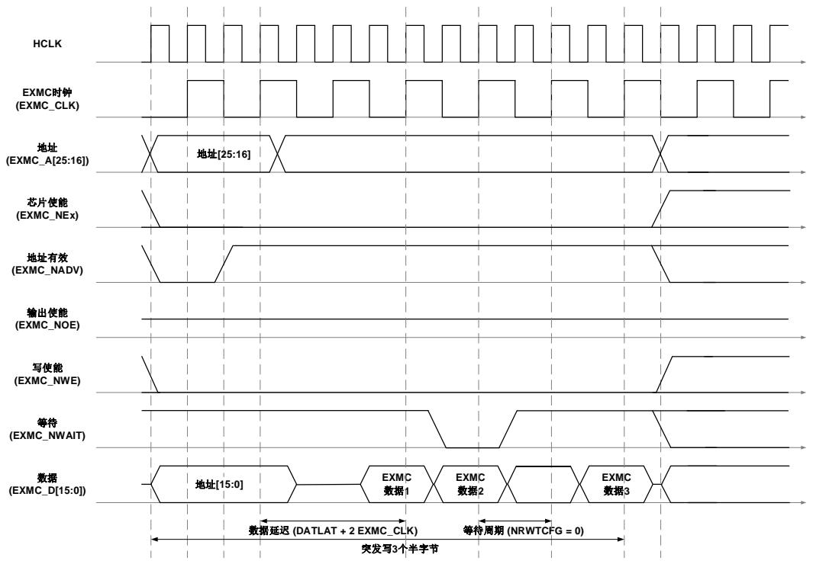

表 21-13. 同步复用模式写时序配置

<table><tr><td>位域/位</td><td>名称</td><td>参考设定值</td></tr><tr><td colspan="3">EXMC_SNCTLx</td></tr><tr><td>31-20</td><td>保留</td><td>0x000</td></tr><tr><td>19</td><td>SYNCWR</td><td>0x1,同步写使能</td></tr><tr><td>18-16</td><td>CPS</td><td>0x0</td></tr><tr><td>15</td><td>AYSNCWAIT</td><td>0x0</td></tr><tr><td>14</td><td>EXMODEN</td><td>0x0</td></tr><tr><td>13</td><td>NRWTEN</td><td>取决于存储器</td></tr><tr><td>12</td><td>WREN</td><td>0x1</td></tr><tr><td>11</td><td>NRWTCFG</td><td>0x0(这里必须为0)</td></tr><tr><td>10</td><td>WRAPEN</td><td>0x0</td></tr><tr><td>9</td><td>NTWTPOL</td><td>取决于存储器</td></tr><tr><td>8</td><td>SBRSTEN</td><td>无影响</td></tr><tr><td>7</td><td>保留</td><td>0x1</td></tr><tr><td>6</td><td>NREN</td><td>取决于存储器</td></tr><tr><td>5-4</td><td>NRW</td><td>0x1</td></tr><tr><td>3-2</td><td>NRTP</td><td>0x1</td></tr><tr><td>1</td><td>NRMUX</td><td>0x1,取决于用户</td></tr><tr><td>0</td><td>NRBKEN</td><td>0x1</td></tr><tr><td colspan="3">EXMC_SNTCFGx(Write)</td></tr><tr><td>31-30</td><td>保留</td><td>0x0</td></tr><tr><td>29-28</td><td>ASYNCMOD</td><td>0x0</td></tr><tr><td>27-24</td><td>DLAT</td><td>数据延迟</td></tr><tr><td>23-20</td><td>CKDIV</td><td>上图设置:0x1,EXMC_CLK=2HCLK</td></tr><tr><td>19-16</td><td>BUSLAT</td><td>EXMC_NE[x]上升沿到下降沿的时间</td></tr><tr><td>15-8</td><td>DSET</td><td>无影响</td></tr><tr><td>7-4</td><td>AHLD</td><td>无影响</td></tr><tr><td>3-0</td><td>ASET</td><td>无影响</td></tr></table>

## 21.3.5. NAND Flash 或 PC Card 控制器

EXMC模块Bank1、Bank2支持NAND Flash，Bank3支持PC Card设备。对于每个Bank，EXMC提供独立的寄存器来配置访问时序，支持8位、16位的NAND Flash以及16位PC卡。对于NANDFlash，EXMC还提供ECC计算模块，保证数据传输和保存的鲁棒性。

## NAND Flash/PC Card 接口功能

表 21-14. 8 位/16 位 NAND 接口信号描述

<table><tr><td>EXMC 引脚</td><td>传输方向</td><td>功能描述</td></tr><tr><td>EXMC_A[17]</td><td>输出</td><td>NAND Flash 地址锁存(ALE)</td></tr><tr><td>EXMC_A[16]</td><td>输出</td><td>NAND Flash 命令锁存(CLE)</td></tr><tr><td rowspan="2">EXMC_D[7:0]/EXMC_D[15:0]</td><td rowspan="2">输入 /输出</td><td>8 位复用,双向地址/数据总线</td></tr><tr><td>16 位复用,双向地址/数据总线</td></tr><tr><td>EXMC_NCE[x]</td><td>输出</td><td>片选,x=1,2</td></tr><tr><td>EXMC_NOE(NRE)</td><td>输出</td><td>输出使能</td></tr><tr><td>EXMC_NWE</td><td>输出</td><td>写使能</td></tr><tr><td>EXMC_NWAIT/EXMC_INT[x]</td><td>输入</td><td>NAND Flash 就绪/忙输入信号 EXMC,x=1,2</td></tr></table>

表 21-15. 16 位 PC Card 接口信号描述

<table><tr><td>EXMC 引脚</td><td>传输方向</td><td>功能描述</td></tr><tr><td>EXMC_A[10:0]</td><td>输出</td><td>地址总线</td></tr><tr><td>EXMC_NIOS16</td><td>输入</td><td>仅适合 16 位传输的 I/O 空间的数据传输宽度(必须接地)</td></tr><tr><td>EXMC_NIORD</td><td>输出</td><td>I/O 空间输出使能</td></tr><tr><td>EXMC_NIOWR</td><td>输出</td><td>I/O 空间写使能</td></tr><tr><td>EXMC_NREG</td><td>输出</td><td>决定访问通用空间还是属性空间</td></tr><tr><td>EXMC_D[15:0]</td><td>输入/输出</td><td>双向数据总线</td></tr><tr><td>EXMC_NCE3_x</td><td>输出</td><td>片选(x=0,1)</td></tr><tr><td>EXMC_NOE</td><td>输出</td><td>输出使能</td></tr><tr><td>EXMC_NWE</td><td>输出</td><td>写使能</td></tr><tr><td>EXMC_NWAIT</td><td>输入</td><td>PC Card 等待信号</td></tr><tr><td>EXMC_INTR</td><td>输入</td><td>PC Card 中断输入信号</td></tr><tr><td>EXMC_CD</td><td>输入</td><td>PC Card 卡存在检测信号,高有效</td></tr></table>

## 支持的存储器访问模式

表 21-16. Bank1/2/3 支持的访问模式

<table><tr><td>存储器</td><td>模式</td><td>读/写</td><td>AHB传输宽度</td><td>注释</td></tr><tr><td rowspan="6">8位NAND</td><td>异步</td><td>R</td><td>8</td><td></td></tr><tr><td>异步</td><td>W</td><td>8</td><td></td></tr><tr><td>异步</td><td>R</td><td>16</td><td rowspan="2">分成2次EXMC访问</td></tr><tr><td>异步</td><td>W</td><td>16</td></tr><tr><td>异步</td><td>R</td><td>32</td><td rowspan="2">分成4次EXMC访问</td></tr><tr><td>异步</td><td>W</td><td>32</td></tr><tr><td rowspan="6">16位NAND/PC Card</td><td>异步</td><td>R</td><td>8</td><td></td></tr><tr><td>异步</td><td>W</td><td>8</td><td>不支持此操作</td></tr><tr><td>异步</td><td>R</td><td>16</td><td></td></tr><tr><td>异步</td><td>W</td><td>16</td><td></td></tr><tr><td>异步</td><td>R</td><td>32</td><td rowspan="2">分成2次EXMC访问</td></tr><tr><td>异步</td><td>W</td><td>32</td></tr></table>

## NAND Flash/PC Card 的控制时序

EXMC能够为NAND Flash、PC卡等设备产生合适的时序信号。每个Bank都有相应的寄存器来对外部存储器进行管理和控制，EXMC_NPCTLx、EXMC_NPINTENx、EXMC_NPCTCFGx、EXMC_NPATCFGx、EXMC_PIOTCFG3、EXMC_NECCx，其中寄存器EXMC_NPINTENx、EXMC_NPCTCFGx、EXMC_NPATCFGx都可以配置4个时序参数，可以根据用户需求和外部存储器的特性来进行相应的配置。

表 21-17. NADN/PC Card 可编程参数

<table><tr><td rowspan="2">参数</td><td rowspan="2">读/写</td><td rowspan="2">单位</td><td rowspan="2">功能描述</td><td colspan="2">NAND Flash/PC Card</td></tr><tr><td>最小值</td><td>最大值</td></tr><tr><td>存储器数据总线高阻时间(HIZ)</td><td>W/R</td><td>HCLK</td><td>启动写操作之后保持数据总线为高阻态的时间</td><td>0</td><td>255</td></tr><tr><td>存储器保持时间(HLD)</td><td>W/R</td><td>HCLK</td><td>在发送命令结束后保持地址的(HCLK)时钟周期数目,写操作时也是数据的保持时间</td><td>1</td><td>254</td></tr><tr><td>存储器等待时间(WAIT)</td><td>W/R</td><td>HCLK</td><td>发出命令的最短持续时间(HCLK)时钟周期数目</td><td>2</td><td>256</td></tr><tr><td>存储器建立时间(SET)</td><td>W/R</td><td>HCLK</td><td>发出命令之前建立地址的(HCLK)时钟周期数目</td><td>1</td><td>255</td></tr></table>

21-23. PC Card 给出了在通用存储空间中操作的可编程参数定义，属性

存储空间和 I/O 空间(只适用于 PC Card)中操作与此相似。

图 21-23. PC Card 通用空间操作时序

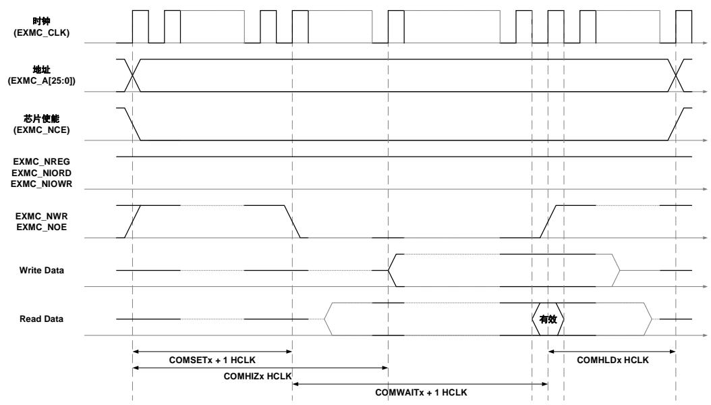

## NAND Flash 操作

EXMC在对NAND Flash发送命令或地址时，需要利用其命令锁存信号（A[16]）或地址锁存信号（A[17]）这两条地址线，即CPU需要在特定的地址进行写操作。

示例：NAND Flash读操作步骤：

1) 配 置 EXMC_NPCTLx 、 EXMC_NPCTCFGx ， 若 需 要 预 等 待 功 能 ， 还 需 配 置EXMC_NPATCFGx；

2) 往通用空间写入 NAND Flash 读数据命令，即在 EXMC_NCE 和 EXMC_NWE 有效期间，EXMC_CLE（A[16]）变为有效电平（高），则被 NAND 认为写入命令；

3) 往通用空间写入读操作的起始地址，即在 EXMC_NCE 和 EXMC_NWE 有效期间，EXMC_ALE（A[17]）变为有效电平（高），则被 NAND 认为写入地址；

4) 等待 NAND 就绪信号，NAND 控制器会在这期间将和 EXMC_NCE 一直保持有效；

5) 从通用空间的数据区逐字节的读出数据；

6) 在不写入新的命令和地址，可以自动读出 NAND 下一页数据；或转到 3）写入新的地址进行下一页的读取；或转到 2）写入新的命令和地址。

## NAND Flash 预等待功能

某些NAND Flash要求在输入最后一个地址字节后，控制器等待NAND Flash就绪，并且还有一些对EXMC_NCE敏感型的NAND Flash还要求在其就绪前NCE必须保持有效。

下面以TOSHIBA128M*8bit NADN Flash为例：

图 21-24. NCE 敏感 NAND Flash 访问时序

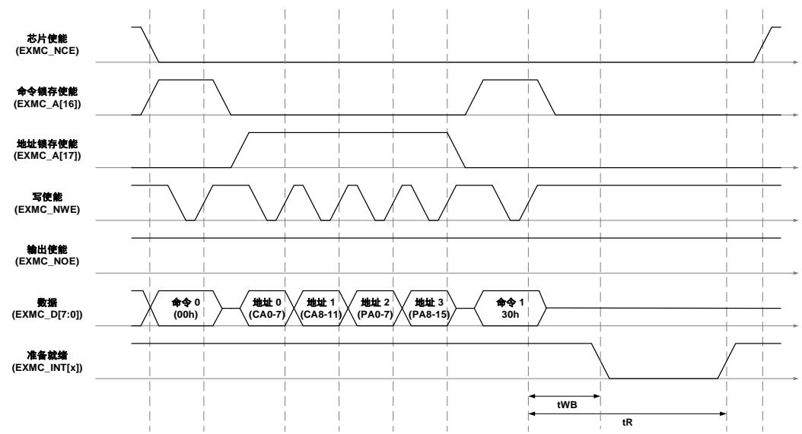

1) 往 NAND 的通用空间命令区写入命令 CMD0

2) 往 NAND 的通用空间地址区写入操作地址 ADD0

3) 往 NAND 的通用空间地址区写入操作地址 ADD1

4) 往 NAND 的通用空间地址区写入操作地址 ADD2

5) 往 NAND 的通用空间地址区写入操作地址 ADD3

6) 往 NAND 的属性空间命令区写入命令 CMD1

在 6)中写命令操作，EXMC 使用的是寄存器 EXMC_NPATCFGx 定义的时序。经过 ATTHLD时间后，NAND Flash 等待 EXMC_INTx 信号，ATTHLD 要大于 tWB（EXMC_NWE 高到EXMC_INTx 低）。对于那些对 EXMC_NCE 敏感的 NAND Flash，

对于那些对片选信号敏感的 NAND Flash，在地址字节之后的第一个地址字节输入后，一直到B/NB 就绪状态到来的这段时间中，要求片选信号 NCE一直保持低电平。这里可以通过配置属性存储空间的 ATTHT 的值来满足 tWB的时序，这样 CPU 只有在地址字节之后写入第一个命令字节时才使用属性存储空间的时序，而在其他时候都使用通用存储空间的时序。

## NAND Flash 的 ECC 计数模块

EXMC模块中的Bank1和Bank2各有一个ECC计算的硬件模块，用户可以根据EXMC_NPCTLx中的ECCSZ来选择ECC计算的页面大小，通过ECC计算可以矫正1个bit的错误并且能检测2个bit的错误。

当NAND存储器块使能，ECC模块就会检测D[15:0]以及EXMC_NCE、EXMC_NWE信号。当已经完成ECCSZ大小字节的读写操作时，软件必须读出EXMC_NECCx中的结果值。如果需要再次开始ECC计算，软件需要先将EXMC_NECCx中ECCEN清0来清除EXMC_NPCTLx中的值，再将ECCEN置1来重新启动ECC计算。

## PC/CF Card 访问

EXMC 的 Bank3 用来访问 PC/CF Card，同时支持存储器和 IO 模式。Bank3 分为 3 个子空间，分别为存储空间，属性空间和 IO 空间。

EXMC_NCE3_0 和 EXMC_NCE3_1 是字节选择信号，当仅有 EXMC_NCE3_0 有效时，低字节或高字节的选择取决于 EXMC_A[0]，当仅有 EXMC_NCE3_1 有效时，硬件不支持，当EXMC_NCE3_0 和 EXMC_NCE3_1 都有效时，16 位操作。复位 NDTP 来选择 PC/CF Card作为外部存储器，寄存器 EXMC_NPCTLx 位 NDW 必须设置为 01 来保证 EXMC 的正确操作。

下面是对不同空间的访问：

1. 通用空间：EXMC_NCE3_x(x= 0,1)是片选信号，表示同时支持 8 位和 16 位的访问操作。在 EXMC_NREG 位高电平时，EXMC_NWE 为低电平时写操作，EXMC_NOE 为低电平时读操作。

2. 属性空间：EXMC_NCE3_x(x= 0,1)是片选信号，表示同时支持 8 位和 16 位的访问操作。在 EXMC_NREG 位低电平时，EXMC_NWE 为低电平时写操作，EXMC_NOE 为低电平时读操作。

3. IO 空间：EXMC_NCE3_x(x= 0,1)是片选信号，表示同时支持 8 位和 16 位的访问操作。在 EXMC_NREG 位低电平时，EXMC_NIOWR 为低电平时写操作，EXMC_NIORD 为低电平时读操作。

AHB 访问 16 位的 PC/CF Card：

1. 通用空间：数据存储的位置，支持字节和半字访问，奇地址禁止字节访问。当 AHB进行字访问，EXMC会自动分成两次连续的半字操作。在EXMC_NREG位高电平时，EXMC_NWE为低电平时写操作，EXMC_NOE为低电平时读操作。

2. 属性空间：配置信息存储的位置，仅偶地址支持字节访问，半字访问会被转换为单次字节操作，字访问会被转换为两次字节访问。半字与字访问时，只有 EXMC_NCE3_0 有效。在 EXMC_NREG 位低电平时，EXMC_NWE 为低电平时写操作，EXMC_NOE 为低电平时读操作。

4. IO 空间：同时支持字节和半字访问，EXMC_NREG 位低电平时，EXMC_NIOWR 为低电平时写操作，EXMC_NIORD 为低电平时读操作。

