## 22. 控制器局域网络（CAN）

## 22.1. 简介

CAN（Controller Area Network）总线是一种可以在无主机情况下实现微处理器或者设备之间相互通信的总线标准。

CAN 总线控制器作为 CAN 网络接口，遵循 CAN 总线协议 2.0A和 2.0B。CAN 总线控制器可以处理总线上的数据收发，非 GD32F30x CL 系列产品中，具有 14 个过滤器，在 GD32F30xCL 系列产品中，CAN 具有 28 个过滤器，过滤器用于筛选并接收用户需要的消息。用户可以通过 3 个发送邮箱将待发送数据传输至总线，邮箱发送的顺序由发送调度器决定。并通过 2 个深度为 3 的接收 FIFO 获取总线上的数据，接收 FIFO 的管理完全由硬件控制。同时 CAN 总线控制器硬件支持时间触发通信（Time-trigger communication）功能。

## 22.2. 主要特征

支持 CAN 总线协议 2.0A 和 2.0B；

通信波特率最大为 1Mbit/s；

支持时间触发通信（Time-triggered communication）；

中断使能和清除。

## 发送功能

3 个发送邮箱；

支持发送优先级；

支持发送时间戳。

## 接收功能

2 个深度为 3 的接收 FIFO；

在非 GD32F30x CL 系列产品中，具有 14 个过滤器；

在 GD32F30x CL 系列产品中，具有 28 个过滤器；

FIFO 锁定功能。

## 时间触发通信

在时间触发通信模式下禁用自动重传；

16 位定时器；

接收时间戳；

发送时间戳。

## 22.3. 功能说明

CAN 模块结构框图如 22-1. CAN 所示。

图 22-1. CAN 模块结构框图

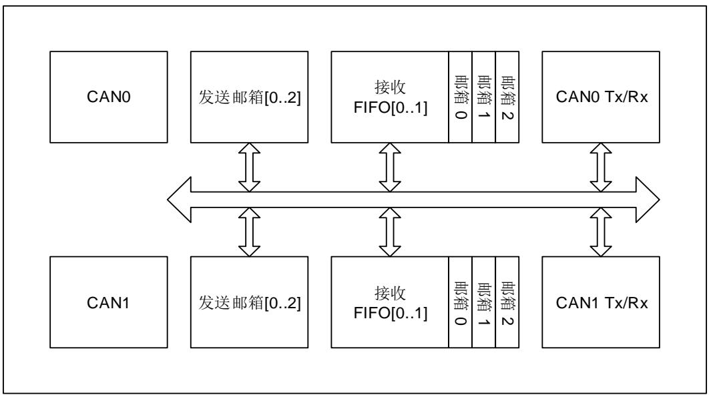

## 22.3.1. 工作模式

CAN 总线控制器有 3 种工作模式：

睡眠工作模式；

初始化工作模式；

正常工作模式。

## 睡眠工作模式

芯片复位后，CAN总线控制器处于睡眠工作模式。该模式下CAN总线控制器的时钟停止工作并处于一种低功耗状态。

将CAN_CTL寄存器的SLPWMOD位置1，可以使CAN总线控制器进入睡眠工作模式。当进入睡眠工作模式后，CAN_STAT寄存器的SLPWS位将被硬件置1。

将CAN_CTL寄存器的AWU位置1，并当CAN检测到总线活动时，CAN总线控制器将自动退出睡眠工作模式。将CAN_CTL寄存器的SLPWMOD位清0，也可以退出睡眠工作模式。

由睡眠模式进入初始化工作模式：将CAN_CTL寄存器的IWMOD位置1，SLPWMOD位清0。

由睡眠模式进入正常工作模式：将CAN_CTL寄存器的IWMOD位和SLPWMOD位清0。

## 初始化工作模式

如果需要配置 CAN 总线通信参数，CAN 总线控制器必须进入初始化工作模式。将 CAN_CTL寄存器的 IWMOD 位置 1，使 CAN 总线控制器进入初始化工作模式，将其清 0 则离开初始化工作模式。在进入初始化工作模式后，CAN_STAT 寄存器的 IWS位将被硬件置 1。

由初始化模式进入睡眠模式：CAN_CTL 寄存器的 SLPWMOD 位置 1，IWMOD 位清 0。

由初始化模式进入正常工作模式：CAN_CTL 寄存器的 SLPWMOD 位和 IWMOD位清 0。

## 正常工作模式

在初始化工作模式中配置完 CAN 总线通信参数后，将 CAN_CTL 寄存器的 IWMOD 位清 0 可以进入正常工作模式并与 CAN 总线网络中的节点进行正常通信。

由正常工作模式进入睡眠工作模式：CAN_CTL 寄存器的 SLPWMOD 位置 1，并等待当前数据收发过程结束。

由正常工作模式初始化工作模式：CAN_CTL 寄存器的 IWMOD 位置 1，并等待当前数据收发过程结束。

## 22.3.2. 通信模式

CAN 总线控制器有 4 种通信模式：

静默（Silent）通信模式；

回环（Loopback）通信模式；

回环静默（Loopback and Silent）通信模式；

正常（Normal）通信模式。

## 静默（Silent）通信模式

在静默通信模式下，可以从 CAN 总线接收数据，但不向总线发送任何数据。将 CAN_BT 寄存器中的 SCMOD 位置 1，使 CAN 总线控制器进入静默通信模式，将其清 0 可以退出静默通信模式。

静默通信模式可以用来监控 CAN 网络上的数据传输。

## 回环（Loopback）通信模式

在回环通信模式下，由 CAN 总线控制器发送的数据可以被自己接收并存入接收 FIFO，同时这些发送数据也送至 CAN 网络。将 CAN_BT 寄存器中的 LCMOD 位置 1，使 CAN 总线控制器进入回环通信模式，将其清 0 可以退出回环通信模式。

回环通信模式通常用来进行 CAN 通信自测。

## 回环静默（Loopback and Silent）通信模式

在回环静默通信模式下，CAN 的 RX 和 TX 引脚与 CAN 网络断开。CAN 总线控制器既不从CAN 网络接收数据，也不向 CAN 网络发送数据，其发送的数据仅可以被自己接收。将 CAN_BT寄存器中的 LCMOD 位和 SCMOD 位置 1，使 CAN 总线控制器进入回环静默通信模式，将它们清 0 可以退出回环静默通信模式。

回环静默通信模式通常用来进行 CAN 通信自测。对外 TX 引脚保持隐性状态（逻辑 1），RX 引

脚保持高阻态。

## 正常（Normal）通信模式

CAN 总线控制器通常工作在正常通信模式下，可以从 CAN 总线接收数据，也可以向 CAN 总线发送数据。这时需要将 CAN_BT 寄存器的 LCMOD 位和 SCMOD 位清 0。

## 22.3.3. 数据发送

## 发送寄存器

数据发送通过 3 个发送邮箱进行，可以通过寄存器 CAN_TMIx，CAN_TMPx，CAN_TMDATA0x和 CAN_TMDATA1x 对发送邮箱进行配置。如 22-2. 所示。

图 22-2. 发送寄存器

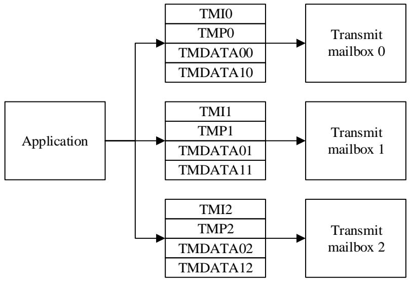

## 发送邮箱状态转换

当发送邮箱处于 empty 状态时，应用程序才可以对邮箱进行配置。当邮箱被配置完成后，可以将 CAN_TMIx 寄存器的 TEN 位置 1，从而向 CAN 总线控制器提交发送请求，这时发送邮箱处于 pending 状态。当超过 1 个邮箱处于 pending 状态时，需要对多个邮箱进行调度，这时发送邮箱处于 scheduled 状态。当调度完成后，发送邮箱中的数据开始向 CAN 总线上发送，这时发送邮箱处于 transmit 状态。当数据发送完成，邮箱变为空闲，可以再次交给应用程序使用，这时发送邮箱重新变为 empty 状态。如 22-3. 所示。

图 22-3. 发送邮箱状态转换

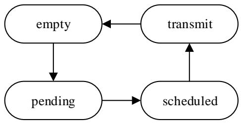

## 发送状态和错误信息

CAN_TSTAT寄存器中的MTF，MTFNERR，MAL和MTE位用来说明发送状态和错误信息。

MTF：发送完成标志位。当数据发送完成时，MTF 置 1。

MTFNERR：无错误发送完成标志位。当数据发送完成且没有错误时，MTFNERR 置 1。

MAL：仲裁失败标志位。当发送数据过程中出现仲裁失败时，MAL置1。

MTE：发送错误标志位。当发送过程中检测到总线错误时，MTE置1。

## 数据发送步骤

数据发送步骤如下：

第1步：选择一个空闲发送邮箱；

第2步：根据应用程序要求，配置4个发送寄存器；

第3步：将CAN_TMIx寄存器的TEN置1；

第4步：检测发送状态和错误信息。典型情况是检测到MTF和MTFNERR置1，说明数据被成功发送。

## 发送选项

## 中止数据发送

将CAN_TSTAT寄存器的MST置1，可以中止数据发送。

当发送邮箱处于pending和scheduled状态，CAN_TSTAT寄存器的MST置1可以立即中止数据发送。

当发送邮箱处于transmit状态，则面临两种情况。一种情况是数据发送被成功地完成，MTF和MTFNERR为1，这时发送邮箱将转换为empty状态。相对的，如果数据发送过程中出现了问题，这时发送邮箱将转换为scheduled状态，这时数据发送被中止。

## 发送优先级

当有2个及其以上发送邮箱等待发送时，寄存器CAN_CTL的TFO位的值可以决定发送顺序。

当TFO为1，所有等待发送的邮箱按照先来先发送（FIFO）的顺序进行。

当TFO为0，具有最小标识符（Identifier）的邮箱最先发送。如果所有的标识符（Identifier）相等，具有最小邮箱编号的邮箱最先发送。

## 22.3.4. 数据接收

## 接收寄存器

应用程序通过2个深度为3的FIFO接收来自CAN网络的数据。

寄 存 器 CAN_RFIFOx 可 以 操 作 FIFO ， 也 包 含 FIFO 状 态 。 寄 存 器 CAN_RFIFOMIx ，CAN_RFIFOMPx，CAN_RFIFOMDATA0x和CAN_RFIFOMDATA1x用于接收数据帧。

如 22-4. 所示。

图 22-4. 接收寄存器

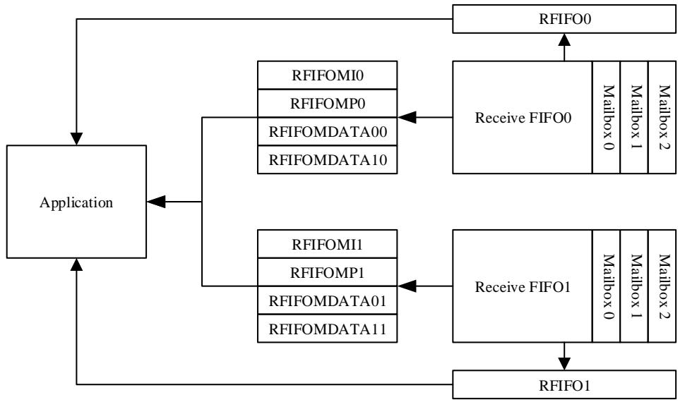

## 接收 FIFO

每个接收FIFO包含3个接收邮箱，用来接收存储数据帧。这些邮箱按照先进先出方式进行组织，最早从CAN网络接收的数据，最早被应用程序处理。

寄存器CAN_RFIFOx包含FIFO状态信息和帧的数量。当FIFO中包含数据时，可以通过寄存器CAN_RFIFOMIx，CAN_RFIFOMPx，CAN_RFIFOMDATA0x和CAN_RFIFOMDATA1x读取数据，之后将寄存器CAN_RFIFOx的RFD置1释放邮箱。

## 接收 FIFO 状态信息

接收FIFO状态信息包含在寄存器CAN_RFIFOx中。

RFL：FIFO中包含的帧数量。FIFO为空时，RFL为0；FIFO为满时，RFL为3。

RFF：FIFO满状态标志位。这时RFL为3。

RFO：FIFO溢出标志位。当FIFO已经包含了3个数据帧时，新的数据帧到来使FIFO发生溢出。如果CAN_CTL寄存器的RFOD位被置1，新的数据帧将丢弃。如果该位被清0，新的数据帧将覆盖接收FIFO中最后一帧数据。

## 数据接收步骤

第1步：查看FIFO中帧的数量。

第 2 步 ： 通 过 CAN_RFIFOMIx ， CAN_RFIFOMPx ， CAN_RFIFOMDATA0x 和CAN_RFIFOMDATA1x读取数据。

第3步：将寄存器CAN_RFIFOx的RFD置1释放邮箱，并且等待其由硬件自动清0。

## 22.3.5. 过滤功能

一个待接收的数据帧会根据其标识符（Identifier）进行过滤：硬件会将通过过滤的帧送至接收FIFO，并丢弃没有通过过滤的帧。

## 过滤器位宽

在非GD32F30x CL系列产品中，过滤器由14个单元（ Bank）组成，它们是bank0到bank13。在GD32F30x CL系列产品中，过滤器包含28个单元，它们是bank0到bank27。

每一个过滤器单元有2个寄存器CAN_FxDATA0和CAN_ FxDATA1，它们可以配置为2种位宽：32-bit位宽和16-bit位宽。

32-bit 位宽 CAN_FDATAx 包含字段：SFID[10:0]，EFID[17:0]，FF 和 FT。如 22-5. 32-bit所示。

图 22-5. 32-bit 位宽过滤器

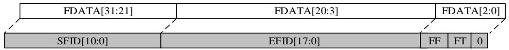

16-bit 位宽 CAN_FDATAx 包含字段：SFID[10:0]，FT，FF 和 EFID[17:15]。如 22-6. 16-bit所示。

图 22-6. 16-bit 位宽过滤器

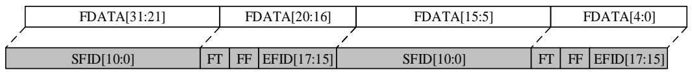

## 掩码模式

对于一个待过滤的数据帧的标识符（Identifier），掩码模式用来指定哪些位必须与预设的标识符相同，哪些位无需判断。

一个 32-bit 位宽掩码模式过滤器如 22-7. 32-bit 所示。

图 22-7. 32-bit 位宽掩码模式过滤器

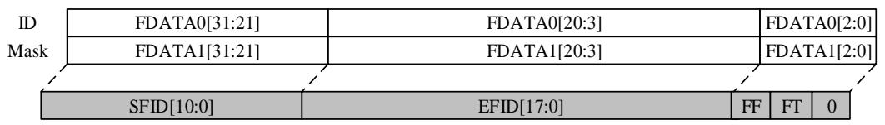

图 22-8. 16-bit 位宽掩码模式过滤器

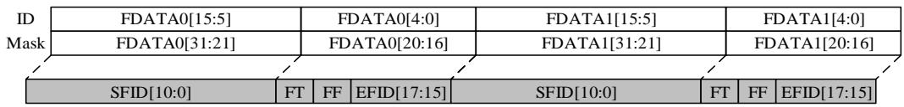

## 列表模式

对于一个待过滤的数据帧的标识符（Identifier），列表模式用来表示与预设的标识符列表中能够匹配则通过，否则丢弃。

一个 32-bit 位宽列表模式过滤器如 22-9. 32-bit 所示。

图 22-9. 32-bit 位宽列表模式过滤器

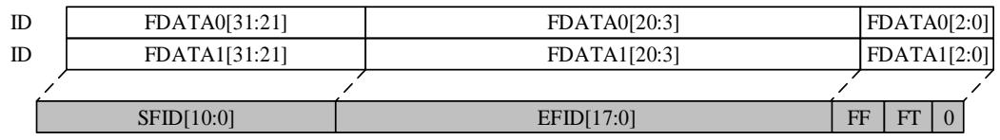

图 22-10. 16-bit 位宽列表模式过滤器

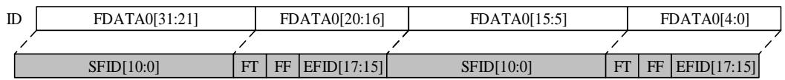

## 过滤序号

过滤器由若干过滤单元（Bank）组成，每个过滤单元因为位宽和模式的选择不同，而具有不同的过滤效果。例如 22-1. 32-bit 所示的 2 个过滤单元，Bank0 是 32-bit 位宽掩码模式，Bank1 是 32-bit 位宽列表模式。

表 22-1. 32-bit 过滤序号

<table><tr><td>过滤单元</td><td>过滤器数据寄存器</td><td>过滤序号</td></tr><tr><td rowspan="2">0</td><td>F0DATA0-32bit-ID</td><td rowspan="2">0</td></tr><tr><td>F0DATA1-32bit-Mask</td></tr><tr><td rowspan="2">1</td><td>F1DATA0-32bit-ID</td><td>1</td></tr><tr><td>F1DATA1-32bit-ID</td><td>2</td></tr></table>

## 过滤器关联的 FIFO

28个过滤单元均可以关联接收FIFO0或接收FIFO1。一旦一个过滤单元关联到接收FIFO，只有通过这个过滤单元的帧才会被传送到接收FIFO中存储。

## 过滤器激活控制

一个过滤单元如果被应用程序用到，就必须激活。通过CAN_FW寄存器可以进行配置。

## 过滤索引

一个包含过滤序号（Fiter Number）N 的过滤单元通过了某个帧，则该帧数据的过滤索引（Filtering Index）为 N。这时 CAN_RFIFOMPx 中 FI 的值为 N。 22-2. 是一个过滤索引的例子。

在 22-2. 中，如果一个帧通过了 FIFO0 中过滤序号 10（Filter Number=10）的过滤单元，那么该帧的过滤索引为 10。这时 CAN_RFIFOMPx 中 FI 的值为 10。

过滤序号不关心对应的过滤单元（Bank）是否处于工作状态。例如Bank3被关联到FIFO0，且为“不激活”状态，但它仍然包含过滤序号3和4。

表 22-2. 过滤索引

<table><tr><td>过滤单元</td><td>FIFO0</td><td>激活</td><td>过滤序号</td><td>过滤单元</td><td>FIFO1</td><td>激活</td><td>过滤序号</td></tr><tr><td rowspan="2">0</td><td>F0DATA0-32bits-ID</td><td rowspan="2">是</td><td rowspan="2">0</td><td rowspan="4">2</td><td>F2DATA0[15:0]-16bits-ID</td><td rowspan="4">是</td><td rowspan="2">0</td></tr><tr><td>F0DATA1-32bits-Mask</td><td>F2DATA0[31:16]-16bits-Mask</td></tr><tr><td rowspan="2">1</td><td>F1DATA0-32bits-ID</td><td rowspan="2">是</td><td>1</td><td>F2DATA1[15:0]-16bits-ID</td><td rowspan="2">1</td></tr><tr><td>F1DATA1-32bits-ID</td><td>2</td><td>F2DATA1[31:16]-16bits-Mask</td></tr><tr><td rowspan="4">3</td><td>F3DATA0[15:0]-16bits-ID</td><td rowspan="4">否</td><td rowspan="2">3</td><td rowspan="2">4</td><td>F4DATA0-32bits-ID</td><td rowspan="2">否</td><td rowspan="2">2</td></tr><tr><td>F3DATA0[31:16]-16bits-Mask</td><td>F4DATA1-32bits-Mask</td></tr><tr><td>F3DATA1[15:0]-16bits-ID</td><td rowspan="2">4</td><td rowspan="2">5</td><td>F5DATA0-32bits-ID</td><td rowspan="2">否</td><td>3</td></tr><tr><td>F3DATA1[31:16]-16bits-Mask</td><td>F5DATA1-32bits-ID</td><td>4</td></tr><tr><td rowspan="4">7</td><td>F7DATA0[15:0]-16bits-ID</td><td rowspan="4">否</td><td>5</td><td rowspan="4">6</td><td>F6DATA0[15:0]-16bits-ID</td><td rowspan="4">是</td><td>5</td></tr><tr><td>F7DATA0[31:16]-16bits-ID</td><td>6</td><td>F6DATA0[31:16]-16bits-ID</td><td>6</td></tr><tr><td>F7DATA1[15:0]-16bits-ID</td><td>7</td><td>F6DATA1[15:0]-16bits-ID</td><td>7</td></tr><tr><td>F7DATA1[31:16]-16bits-ID</td><td>8</td><td>F6DATA1[31:16]-16bits-ID</td><td>8</td></tr><tr><td rowspan="4">8</td><td>F8DATA0[15:0]-16bits-ID</td><td rowspan="4">是</td><td>9</td><td rowspan="4">10</td><td>F10DATA0[15:0]-16bits-ID</td><td rowspan="4">否</td><td rowspan="2">9</td></tr><tr><td>F8DATA0[31:16]-16bits-ID</td><td>10</td><td>F10DATA0[31:16]-16bits-Mask</td></tr><tr><td>F8DATA1[15:0]-16bits-ID</td><td>11</td><td>F10DATA1[15:0]-16bits-ID</td><td rowspan="2">10</td></tr><tr><td>F8DATA1[31:16]-16bits-ID</td><td>12</td><td>F10DATA1[31:16]-16bits-Mask</td></tr><tr><td rowspan="4">9</td><td>F9DATA0[15:0]-16bits-ID</td><td rowspan="4">是</td><td rowspan="2">13</td><td rowspan="4">11</td><td>F11DATA0[15:0]-16bits-ID</td><td rowspan="4">否</td><td>11</td></tr><tr><td>F9DATA0[31:16]-16bits-Mask</td><td>F11DATA0[31:16]-16bits-ID</td><td>12</td></tr><tr><td>F9DATA1[15:0]-16bits-ID</td><td rowspan="2">14</td><td>F11DATA1[15:0]-16bits-ID</td><td>13</td></tr><tr><td>F9DATA1[31:16]-16bits-Mask</td><td>F11DATA1[31:16]-16bits-ID</td><td>14</td></tr><tr><td rowspan="2">12</td><td>F12DATA0-32bits-ID</td><td rowspan="2">是</td><td rowspan="2">15</td><td rowspan="2">13</td><td>F13DATA0-32bits-ID</td><td rowspan="2">是</td><td>15</td></tr><tr><td>F12DATA1-32bits-Mask</td><td>F13DATA1-32bits-ID</td><td>16</td></tr></table>

## 优先级

过滤器优先级规则如下：

1、32-bits位宽模式高于16-bits位宽模式；

2、列表模式高于掩码模式；

3、较小的过滤序号（Filter Number）具有较高的优先级。

## 22.3.6. 时间触发通信

时间触发通信是CAN数据链路层应用协议。CAN网络中的所有节点都按照一个预先设定的时间序列进行通信，尤其适合于时间周期性应用和时间确定性应用。

在这种通信模式下，一个内部的16-bit计数器开始工作，在每一个CAN位时间（Bit time）增1。这 个 内 部 计 数 器 为 数 据 发 送 和 数 据 接 收 提 供 时 间 戳 ， 这 些 时 间 戳 存 放 在 寄 存 器CAN_RFIFOMPx和CAN_TMPx中。

在这种通信模式下，自动重发功能是禁止的。

## 22.3.7. 通信参数

## 自动重发禁止模式

在时间触发通信模式下，要求自动重发必须是禁止的，可以通过将CAN_CTL寄存器的ARD位置1满足要求。

在这种模式下，数据只会被发送一次，如果因为仲裁失败或者总线错误而导致发送失败，CAN总线控制器不会像通常那样进行数据自动重发。

发送结束时，寄存器CAN_TSTAT的MTF位被硬件置1，而发送状态信息可以通过MTFNERR，MAL和MTE获得。

## 位时序（Bit time）

CAN协议采用位同步传输方式。这种方式不仅增大了传输容量，而且意味着需要一种复杂的位同步方法。面向字节传输的位同步方式适用于接收在每个字节前都有起始位的情况，而同步传输协议只要求数据帧的最开始有一个起始位。为保证接收器能正确读取信息，需要不断地进行重新同步。因此，在相位缓冲段采样点前面和后面都应该插入一个帧间隔。

可以通过位操作仲裁方式访问CAN总线。信号从发送器到接收器，再回到发送器必须在一个位时间内完成。为了达到同步的目的，除了相位缓冲段外，还需要一个传输延时段。在信号传输过程中，传输延时段被视为发送或接收延时。

CAN总线控制器将位时间分为3个部分。

同步段（Synchronization segment），记为SYNC_SEG。该段占用1个时间单元 $( 1 \times t _ { q } )$ ）。

位段1（Bit segment 1），记为BS1。该段占用1到16个时间单元。相对于CAN协议而言，BS1相当于传播时间段（Propagation delay segment）和相位缓冲段1（Phase buffer segment 1）。

位段2（Bit segment 2），记为BS2。该段占用1到8个时间单元。相对于CAN协议而言，BS2相当于相位缓冲段2（Phase buffer segment 2）。

对比与 CAN 协议，位时序如 22-11. 所示。

图 22-11. 位时序

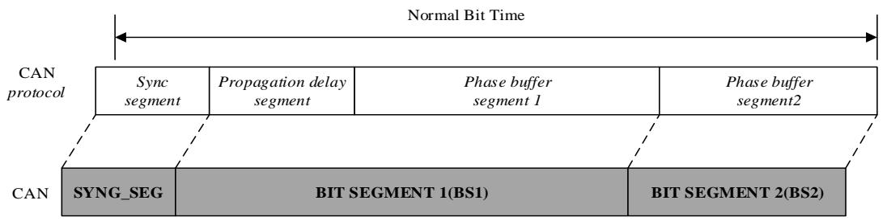

再同步补偿宽度SJW（resynchronization Jump Width）对CAN网络节点同步误差进行补偿，占用1到4个时间单元。

有效跳变定义为，在CAN控制器，没有发送隐性位时，一个位时间内显性位到隐性位的第一次转变。

如果有效跳变在BS1期间被检测到，而不是SYNC_SEG期间，BS1将会最多被延长SJW，因此采样点延时。

相反，如果有效跳变在BS2期间被检测到，而不是SYNC_SEG期间，BS2将会最多被缩短SJW，因此采样点提前。

## 波特率

波特率计算公式如下：

$$
B a u d R a t e = \frac {1}{\text {Normal Bit Time}} \tag {式22-1}
$$

$$
\text { Normal   Bit   Time } = t _ {\text { SYNC\_SEG }} + t _ {B S 1} + t _ {B S 2} \tag {式22-2}
$$

其中：

$$
t _ {S Y N C \_ S E G} = 1 \times t _ {q} \tag {式22-3}
$$

$$
t _ {B S 1} = (1 + B T. B S 1) \times t _ {q} \tag {式22-4}
$$

$$
t _ {B S 2} = (1 + B T. B S 2) \times t _ {q} \tag {式22-5}
$$

$$
t _ {q} = (1 + B T. B A U D P S C) \times t _ {P C L K 1} \tag {式22-6}
$$

## 22.3.8. 错误标志

CAN总线的状态可以通过CAN_ERR寄存器的发送错误计数值（Transmit Error Counter，记为TECNT）和接收错误计数值（Receive Error Counter，记为RECNT）反映，其值会根据错误的情况由硬件增加或减少，软件可以通过这些值判断CAN网络的稳定性。关于错误计数值的详细信息请参考CAN协议相关章节。

通过使能CAN_INTEN寄存器中的相应位（ERRIE等），软件可以在检测到错误时产生相应中断。

## 离线恢复

当TECNT大于255时，CAN总线控制器进入离线状态，这时寄存器CAN_ERR中的BOERR置1，并且发送和接收失效。

根据寄存器CAN_CTL中的ABOR配置，离线恢复（变为主动错误状态）有2种方式。这两种方式都要求处于离线状态的CAN总线控制器检测到CAN协议所定义的离线恢复序列（在CAN_RX检测到128次连续11个位的隐性位）时，才会自动恢复。

如果ABOR为1，将在检测到离线恢复序列后自动恢复。

如果ABOR为0，则必须先将CAN_CTL中的IWMOD置1进入初始化工作模式，然后进入正常工作模式并在检测到离线恢复序列后恢复。

## 22.3.9. 中断

CAN总线控制器占用4个中断向量，通过寄存器CAN_INTEN进行控制。这4个中断向量对应4类中断源：

发送中断；

FIFO0 中断；

FIFO1 中断；

错误和状态改变中断。

## 发送中断

发送中断包括：

寄存器CAN_TSTAT中的MTF0置1：发送邮箱0变为空闲。

寄存器CAN_TSTAT中的MTF1置1：发送邮箱1变为空闲。

寄存器CAN_TSTAT中的MTF2置1：发送邮箱2变为空闲。

## FIFO0 中断

FIFO0中断包括：

FIFO0中包含待接收数据：寄存器CAN_RFIFO0中的RFL0不为0，CAN_INTEN寄存器中RFNEIE0被置位；

FIFO0满：寄存器CAN_RFIFO0中的RFF0为1，CAN_INTEN寄存器中RFFIE0被置位；

FIFO0溢出：寄存器CAN_RFIFO0中的RFO0为1，CAN_INTEN寄存器中RFOIE0被置位。

## FIFO1 中断

FIFO1中断包括：

FIFO1中包含待接收数据：寄存器CAN_RFIFO1中的RFL1不为0，CAN_INTEN寄存器中RFNEIE1被置位；

FIFO1满：寄存器CAN_RFIFO1中的RFF1为1，CAN_INTEN寄存器中RFFIE1被置位；

FIFO1溢出：寄存器CAN_RFIFO1中的RFO1为1，CAN_INTEN寄存器中RFOIE1被置位。

## 错误和工作模式改变中断

错误和工作模式改变中断可由以下条件触发：

错误：CAN_STAT寄存器的ERRIF和CAN_INTEN寄存器的ERRIE被置位，请参考CAN_STAT寄存器中ERRIF位描述；

唤醒：CAN_STAT寄存器中的WUIF和CAN_INTEN寄存器的WIE被置位；

– 进入睡眠模式：CAN_STAT寄存器中的SLPIF和CAN_INTEN寄存器的SLPWIE被置位。

CAN总线控制器的中断产生条件可参考 22-3. CAN / 。

表 22-3. CAN 事件/中断标志

<table><tr><td>中断事件</td><td colspan="2">事件/中断标志</td><td colspan="2">使能控制位</td></tr><tr><td rowspan="3">发送中断</td><td colspan="2">发送邮箱0空闲标志MTF0</td><td rowspan="3" colspan="2">TMEIE</td></tr><tr><td colspan="2">发送邮箱1空闲标志MTF1</td></tr><tr><td colspan="2">发送邮箱2空闲标志MTF2</td></tr><tr><td rowspan="3">FIFO0中断</td><td colspan="2">接收FIFO0中帧的数量RFL0[1:0]</td><td colspan="2">RFNEIE0</td></tr><tr><td colspan="2">接收FIFO0满RFF0</td><td colspan="2">RFFIE0</td></tr><tr><td colspan="2">接收FIFO0溢出RFO0</td><td colspan="2">RFOIE0</td></tr><tr><td rowspan="3">FIFO1中断</td><td colspan="2">接收FIFO1中帧的数量RFL1[1:0]</td><td colspan="2">RFNEIE1</td></tr><tr><td colspan="2">接收FIFO1满RFF1</td><td colspan="2">RFFIE1</td></tr><tr><td colspan="2">接收FIFO1溢出RFO1</td><td colspan="2">RFOIE1</td></tr><tr><td rowspan="6">EWMC中断</td><td>警告错误WERR</td><td rowspan="4">错误中断标志ERRIF</td><td>WERRIE</td><td rowspan="4">ERRIE</td></tr><tr><td>被动错误PERR</td><td>PERRIE</td></tr><tr><td>离线错误BOERR</td><td>BOIE</td></tr><tr><td>错误种类1&lt;=ERRN[2:0]&lt;=6</td><td>ERRNIE</td></tr><tr><td colspan="2">从睡眠工作模式唤醒的状态改变中断标志WUIF</td><td colspan="2">WIE</td></tr><tr><td colspan="2">进入睡眠工作模式的状态改变中断标志SLPIF</td><td colspan="2">SLPWIE</td></tr></table>

