## 23. 以太网（ENET）

## 23.1. 简介

本章描述的以太网外设模块只适用于 GD32F307xx 互联型产品。

本章描述以太网外设模块。该以太网模块包含 10/100Mbps 以太网 MAC（媒体访问控制器），采用 DMA 优化数据帧的发送与接收性能，支持 MII（媒体独立接口）与 RMII（简化的媒体独立接口）两种与物理层(PHY)通讯的标准接口，实现以太网数据帧的发送与接收。以太网模块遵守 IEEE 802.3-2002 标准和 IEEE 1588-2008 标准。

## 23.2. 主要特征

## MAC特性

支持10Mbps或100Mbps数据传输速率；

支持MII和RMII接口；

支持调试用回环模式；

支持符合CSMA/CD协议的半双工背压通讯；

支持符合IEEE 802.3x的流控通讯。在当前帧发送完毕后，根据接收的暂停帧中暂停时间延迟发送。在全双工/半双工模式下，MAC根据RxFIFO的填充程度自动发送暂停帧/背压信号；

支持符合IEEE 802.3x的全双工流控通讯，当输入流控信号失效时，自动发送零时间片暂停帧。支持符合IEEE 802.3x的半双工流控通讯，支持根据RxFIFO的填充程度（直通模式）自动发送背压信号；

可选择在发送操作时自动生成校验/填充位；

可选择在接收操作时自动去除校验/填充位；

帧长度可配置；

帧间隙可配置；

支持多种模式的接收过滤；

支持检测接收帧的IEEE 802.1Q VLAN标签；

支持强制网络统计标准(RFC2819/RFC2665)；

支持两种唤醒帧检测：LAN远程唤醒帧和AMD的Magic PacketTM帧；

• 支持校验和检查（IPv4报头，IPv4或IPv6数据格式封装的TCP、UDP或ICMP）；

支持IEEE 1588-2008标准定义的以太网帧时间戳，并将其按64位记录于帧状态中；

相互独立的两个FIFO分别用于发送与接收；

在延迟冲突、过度冲突、过度顺延和下溢情况下丢弃帧；

帧传输时，支持存储转发模式下的硬件校验和的计算和插入。

## DMA特性

支持环结构或链结构两种形式的描述符列表；

发送和接收描述符均可传输最高为8194字节的数据；

中断可配置，适用于多种工作状态；

支持轮询或固定优先级两种方式仲裁DMA发送和接收控制器的请求。

## PTP特性

支持符合IEEE1588的时间同步功能；

支持粗/精调两种校正方法；

输出秒脉冲；

达到预设目标时间时触发中断。

## 23.2.1. 模块框图

以太网模块由MAC（介质访问控制器）模块、MII/RMII模块和一个以描述符形式控制的DMA模块组成。在使用以太网模块时，用户应确保配置的时钟频率不小于25MHz。


图 23-1. 以太网模块框图


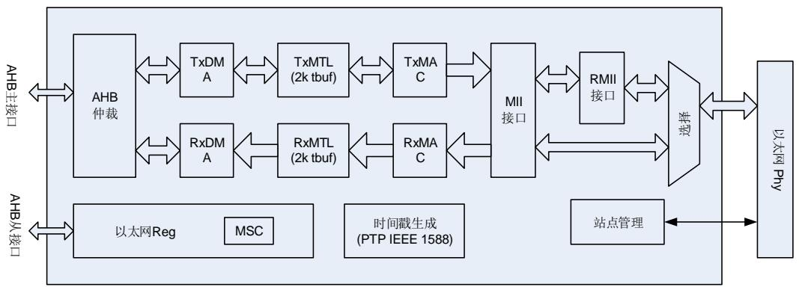


MAC 模块通过 MII 或 RMII 与片外 PHY 连接。通过对 AFIO_PCF0 寄存器的 ENET_PHY_SEL位进行设置，可以选择使用哪种接口。SMI 站点管理接口）用于配置和管理外部 PHY。

发送数据模块包括：

• TxDMA控制器，用于从存储器中读取描述符和数据，以及将状态写入存储器；

TxMTL，用于对发送数据的控制，管理和存储。TxMTL内含TxFIFO，用于缓存待MAC发送的数据；

MAC发送控制寄存器组，用于管理和控制数据帧的发送。

接收数据模块包括：

• RxDMA控制器，用于从存储器中读取描述符，以及将数据与状态写入存储器；

RxMTL，用于对接收数据的控制，管理和存储。RxMTL实现了RxFIFO，用于存储待转发到系统存储的帧数据；

1 MAC接收控制寄存器组，用于管理数据帧的接收和标示接收状态。MAC内含接收过滤器，采用多种过滤机制，滤除特定的以太网帧。

## 23.2.2. MAC 802.3 以太网数据包描述

MAC的数据通信可使用两种帧格式：

基本帧格式；

带标签的帧格式。

23-2. MAC/ MAC 描述了帧结构（基本的和带标签的）：


图 23-2. MAC/带标签的 MAC 帧格式


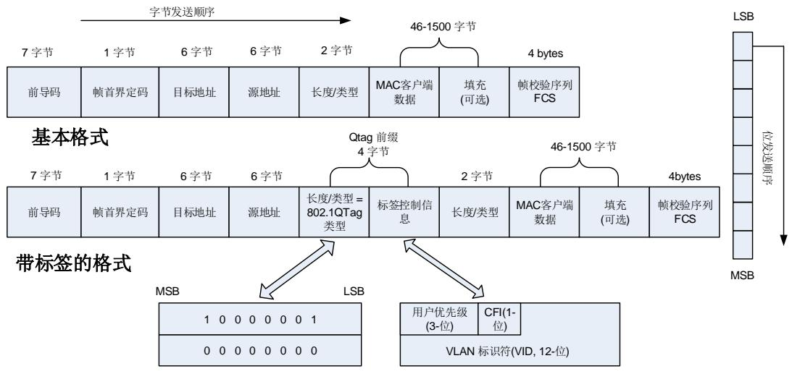


注意：除了帧校验序列，以太网控制器发送每个字节时都按照低位先出的次序进行传输。


CRC计算包括帧数据的所有字节除去前导码和帧首界定码域。以太网帧的32位CRC生成多项式为0x04C11DB7，且此多项式用于以太网模块中所有的32位CRC计算，如下式所示：

$$
G (x) = x ^ {3 2} + x ^ {2 6} + x ^ {2 3} + x ^ {2 2} + x ^ {1 6} + x ^ {1 2} + x ^ {1 1} + x ^ {1 0} + x ^ {8} + x ^ {7} + x ^ {5} + x ^ {4} + x ^ {2} + x + 1
$$

## 23.2.3. 以太网信号描述

23-1. MII 和 23-2. MII 列出了MAC模块所用引脚在MII模式下默认及重映射的功能和具体配置。


表 23-1. 以太网信号（MII默认）


<table><tr><td>信号</td><td>引脚</td><td>引脚模式</td></tr><tr><td>MDC</td><td>PC1</td><td>推挽复用输出</td></tr><tr><td>MII_TXD2</td><td>PC2</td><td>推挽复用输出</td></tr><tr><td>MII_TX_CLK</td><td>PC3</td><td>浮空输入(复位状态)</td></tr><tr><td>MII_CRS</td><td>PA0</td><td>浮空输入(复位状态)</td></tr><tr><td>MII_RX_CLK</td><td>PA1</td><td>浮空输入(复位状态)</td></tr><tr><td>MDIO</td><td>PA2</td><td>推挽复用输出</td></tr><tr><td>MII_COL</td><td>PA3</td><td>浮空输入(复位状态)</td></tr><tr><td>MII_RX_DV</td><td>PA7</td><td>浮空输入(复位状态)</td></tr><tr><td>MII_RXD0</td><td>PC4</td><td>浮空输入(复位状态)</td></tr><tr><td>MII_RXD1</td><td>PC5</td><td>浮空输入(复位状态)</td></tr><tr><td>MII_RXD2</td><td>PB0</td><td>浮空输入(复位状态)</td></tr><tr><td>MII_RXD3</td><td>PB1</td><td>浮空输入(复位状态)</td></tr><tr><td>PPS_OUT</td><td>PB5</td><td>推挽复用输出</td></tr><tr><td>MII_TXD3</td><td>PB8</td><td>推挽复用输出</td></tr><tr><td>MII_RX_ER</td><td>PB10</td><td>浮空输入(复位状态)</td></tr><tr><td>MII_TX_EN</td><td>PB11</td><td>推挽复用输出</td></tr><tr><td>MII_TXD0</td><td>PB12</td><td>推挽复用输出</td></tr><tr><td>MII_TXD1</td><td>PB13</td><td>推挽复用输出</td></tr></table>


表 23-2. 以太网信号（MII重映射）


<table><tr><td>信号</td><td>引脚</td><td>引脚模式</td></tr><tr><td>MDC</td><td>PC1</td><td>推挽复用输出</td></tr><tr><td>MII_TXD2</td><td>PC2</td><td>推挽复用输出</td></tr><tr><td>MII_TX_CLK</td><td>PC3</td><td>浮空输入(复位状态)</td></tr><tr><td>MII_CRS</td><td>PA0</td><td>浮空输入(复位状态)</td></tr><tr><td>MII_RX_CLK</td><td>PA1</td><td>浮空输入(复位状态)</td></tr><tr><td>MDIO</td><td>PA2</td><td>推挽复用输出</td></tr><tr><td>MII_COL</td><td>PA3</td><td>浮空输入(复位状态)</td></tr><tr><td>MII_RX_DV</td><td>PD8</td><td>浮空输入(复位状态)</td></tr><tr><td>MII_RXD0</td><td>PD9</td><td>浮空输入(复位状态)</td></tr><tr><td>MII_RXD1</td><td>PD10</td><td>浮空输入(复位状态)</td></tr><tr><td>MII_RXD2</td><td>PD11</td><td>浮空输入(复位状态)</td></tr><tr><td>MII_RXD3</td><td>PD12</td><td>浮空输入(复位状态)</td></tr><tr><td>PPS_OUT</td><td>PB5</td><td>推挽复用输出</td></tr><tr><td>MII_TXD3</td><td>PB8</td><td>推挽复用输出</td></tr><tr><td>MII_RX_ER</td><td>PB10</td><td>浮空输入(复位状态)</td></tr><tr><td>MII_TX_EN</td><td>PB11</td><td>推挽复用输出</td></tr><tr><td>MII_TXD0</td><td>PB12</td><td>推挽复用输出</td></tr><tr><td>MII_TXD1</td><td>PB13</td><td>推挽复用输出</td></tr></table>

23-3. RMII 和 23-4. RMII 列出了MAC模块所用引脚在MII模式下默认及重映射的功能和具体配置。


表 23-3. 以太网信号（RMII 默认）


<table><tr><td>信号</td><td>引脚</td><td>引脚模式</td></tr><tr><td>MDC</td><td>PC1</td><td>推挽复用输出</td></tr><tr><td>REF_CLK</td><td>PA1</td><td>浮空输入(复位状态)</td></tr><tr><td>MDIO</td><td>PA2</td><td>推挽复用输出</td></tr><tr><td>CRS_DV</td><td>PA7</td><td>浮空输入(复位状态)</td></tr><tr><td>RMII_RXD0</td><td>PC4</td><td>浮空输入(复位状态)</td></tr><tr><td>RMII_RXD1</td><td>PC5</td><td>浮空输入(复位状态)</td></tr><tr><td>PPS_OUT</td><td>PB5</td><td>推挽复用输出</td></tr><tr><td>RMII_TX_EN</td><td>PB11</td><td>推挽复用输出</td></tr><tr><td>RMII_TXD0</td><td>PB12</td><td>推挽复用输出</td></tr><tr><td>RMII_TXD1</td><td>PB13</td><td>推挽复用输出</td></tr></table>


表 23-4. 以太网信号（RMII 重映射）


<table><tr><td>信号</td><td>引脚</td><td>引脚模式</td></tr><tr><td>MDC</td><td>PC1</td><td>推挽复用输出</td></tr><tr><td>REF_CLK</td><td>PA1</td><td>浮空输入(复位状态)</td></tr><tr><td>MDIO</td><td>PA2</td><td>推挽复用输出</td></tr><tr><td>CRS_DV</td><td>PD8</td><td>浮空输入(复位状态)</td></tr><tr><td>RMII_RXD0</td><td>PD9</td><td>浮空输入(复位状态)</td></tr><tr><td>RMII_RXD1</td><td>PD10</td><td>浮空输入(复位状态)</td></tr><tr><td>PPS_OUT</td><td>PB5</td><td>推挽复用输出</td></tr><tr><td>RMII_TX_EN</td><td>PB11</td><td>推挽复用输出</td></tr><tr><td>RMII_TXD0</td><td>PB12</td><td>推挽复用输出</td></tr><tr><td>RMII_TXD1</td><td>PB13</td><td>推挽复用输出</td></tr></table>

## 23.3. 功能说明

## 23.3.1. 接口配置

以太网模块通过MII/RMII接口与片外PHY连接，传送与接收以太网包。MII或RMII模式由软件选择并通过SMI接口对PHY进行管理。

## SMI：站点管理接口

SMI用于访问和设置PHY的配置。

站点管理接口(SMI)通过MDC时钟线与MDIO数据线与外部PHY通讯，可以通过其访问任意PHY的任意寄存器。SMI接口支持的最大PHY数量为32，但在同一时刻只能访问一个PHY的一个寄存器。

MDC时钟线和MDIO数据线具体作用如下：

MDC：最高频率为2.5MHz的时钟信号，在空闲状态下该引脚保持为低电平状态。在传输数据时该信号的高电平和低电平的最短保持时间为160ns，信号的最小周期为400ns；

MDIO：用于与PHY之间的数据传输，与MDC时钟线配合，接收/发送数据。


图 23-3. 站点管理接口信号


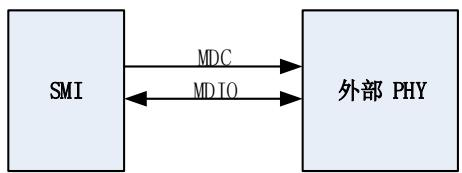


## 写操作

应 用 程 序 需 将 要 传 输 的 数 据 写 入 ENET_MAC_PHY_DATA 寄 存 器 中 ， 并 对ENET_MAC_PHY_CTL寄存器相关位进行操作：

1) 设置PHY设备地址和将要操作的PHY寄存器地址，并将PW位置为1，使能写模式；

2) 将PB位置1开始传输。在传输过程中PB位一直为高，直到传输完成，硬件将会自动清除PB位。

应用程序可以通过PB位判断传输是否完成。在PB位置1期间，由于操作正在运行，因此不能修改PHY控制寄存器和PHY数据寄存器的内容。在将PB位置位之前，应用程序必须确保该位读出为’0’。

## 读操作

应用程序对ENET_MAC_PHY_CTL寄存器相关位进行操作：

1) 设置PHY设备地址和将要操作的PHY寄存器地址，并将PW位置为0，使能读模式；

2) 将PB位置1开始数据接收。在接收过程中PB位一直为高，直到接收完成，硬件将会自动清除PB位。

应用程序可以通过PB位判断传输是否完成。在PB位置1期间，由于操作正在运行，因此不能修改PHY控制寄存器和PHY数据寄存器的内容。在将PB位置位之前，应用程序必须确保该位读出为’0’。

注意：由于PHY寄存器地址16-31的寄存器内容由各厂商自由定义，所以在访问不同PHY设备的这部分寄存器时，需要根据厂商手册对应用程序进行不同的设置。固件库当前支持的PHY设备详情请参考固件库相关手册说明。

## 时钟配置

SMI接口的时钟源由AHB时钟分频得到。为了保证MDC时钟频率不超过2.5MHz，需根据AHB时钟频率对PHY控制寄存器中相关位进行设置，选择合适的分频系数。 23-5. 列出了对应AHB时钟范围的分频系数的选择。


表 23-5. 时钟范围


<table><tr><td>AHB时钟</td><td>MDC 时钟</td><td>ENET_MAC_PHY_CTL 位CLR[2:0]</td></tr><tr><td>35~60MHz</td><td>AHB clock/26</td><td>0x3</td></tr><tr><td>20~35MHz</td><td>AHB clock/16</td><td>0x2</td></tr><tr><td>100~120 MHz</td><td>AHB clock/62</td><td>0x1</td></tr><tr><td>60~100MHz</td><td>AHB clock/42</td><td>0x0</td></tr></table>

## MII/RMII 的选择

当使能以太网控制器时钟前或以太网控制器处于复位状态时，应用程序可通过配置AFIO_PCF0 寄存器中的 ENET_PHY_SEL 位来选择 MII 或 RMII 模式。默认为 MII 模式。

## MII：媒体独立接口


图 23-4. 媒体独立接口(MII)信号线


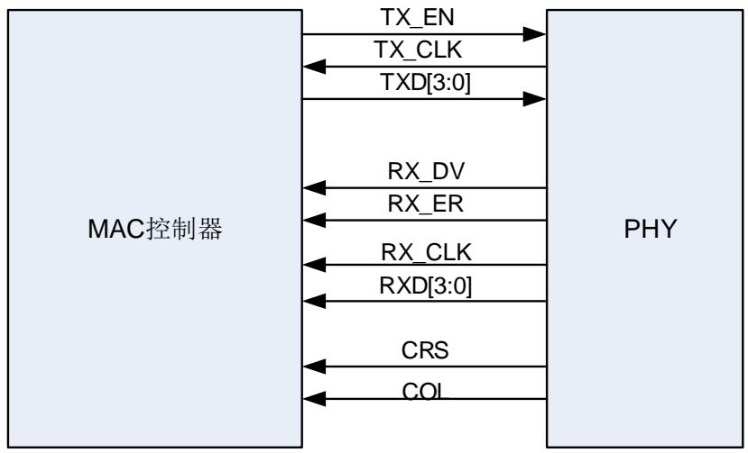


- MII_TX_CLK：发送数据使用的时钟信号，对于 10Mbit/s 的数据传输，此时钟为 2.5MHz，对于 100M 位/s 的数据传输，此时钟为 25MHz。

- MII_RX_CLK：接收数据使用的时钟信号，对于10Mbit/s的数据传输，此时钟为2.5MHz，对于100Mbit/s的数据传输，此时钟为25MHz。

- MII_TX_EN：发送使能信号，当数据前导码的起始位出现时，该信号必须有效，并且需要在传输完毕前保持有效。

- MII_TXD[3:0]：发送数据线，每次传输 4 位数据，数据在 MII_TX_EN 信号有效时有效。当MII_TX_EN 信号无效时，PHY将忽略传输的数据。

-MII_CRS：载波侦听信号，仅工作在半双工模式下，由PHY控制。该信号不需要与MII_TX_CLK和 MII_RX_CLK 保持同步。当它处于有效状态时，意味着发送或接收介质不处于空闲状态。MII_CRS信号一直保持有效，直到发送和接收介质都处于空闲状态。

-MII_COL：冲突检测信号，仅工作在半双工模式下，由PHY控制。该信号不需要与MII_TX_CLK和 MII_RX_CLK 保持同步。当检测到介质发生冲突时，此信号有效，并且在整个冲突的持续时间内，保持此信号有效。

- MII_RXD[3:0]：接收数据线，每次接收 4 位数据，数据在 MII_RX_DV 信号有效时有效。根据 MII_RX_DV 和 MII_RX_ER 信号的状态，MII_RXD[3:0]数据值可被用来传达一些特定信息（请参考 23-6. ）。

- MII_RX_DV：接收数据使能信号，由 PHY 控制，当 PHY准备好数据供 MAC 接收时，该信号有效。当帧数据的第一个 4 位出现时，该信号必须有效，并且需要在传输完毕前保持有效。在传送最后 4 位数据后的第一个时钟之前，此信号必须变为无效状态。为确保正确地接收帧，MII_RX_DV 信号应该在 SFD 字段出现之前有效。

-MII_RX_ER：接收出错信号，为了表明 MAC 在接收过程中检测到错误，MII_RX_ER 信号必须在一个或多个时钟周期（MII_RX_CLK）内保持有效。具体错误原因需结合 MII_RX_DV 的状态及 MII_RXD[3:0]的数据值，详见 23-6. 。


表 23-6. 接收接口信号编码


<table><tr><td>信号</td><td colspan="2">正常的帧间隔</td><td>正常的数据接收</td><td>载波错误指示</td><td>数据接收出错</td></tr><tr><td>MII_RX_ER</td><td>0</td><td>1</td><td>0</td><td>1</td><td>1</td></tr><tr><td>MII_RX_DV</td><td>0</td><td>0</td><td>1</td><td>0</td><td>1</td></tr><tr><td>MII_RXD[3:0]</td><td>0000 to 1111</td><td>0000</td><td>0000 to 1111</td><td>1110</td><td>0000 to 1111</td></tr></table>

## MII 时钟源

用户需要给外部 PHY提供一个外部的 25MHz 时钟来产生 TX_CLK和 RX_CLK 时钟信号。该时钟不需要与 MAC 时钟相同。可以使用外部的 25MHz 晶振或者微控制器的时钟输出引脚CK_OUT0 提供这一时钟。当时钟来源为 CK_OUT0 引脚时需配置合适的 PLL，保证 CK_OUT0引脚输出的时钟为 25MHz。

## RMII：精简媒体独立接口

精简媒体独立接口(RMII)规范减少了以太网通信所需要的引脚数。根据IEEE 802.3标准，MII接口需要16个引脚用于数据和控制信号，而RMII标准则将引脚数减少到了7个。

RMII特性：

只有一个时钟信号，且该时钟信号需要提高到50MHz

MAC和外部的以太网PHY需要使用同样的时钟源

使用2位宽度的数据收发


图 23-5. 精简媒体独立接口(RMII)信号线


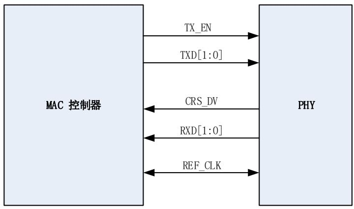


## RMII 时钟源

通过将相同的时钟源接到 MAC 和以太网 PHY 的 REF_CLK 引脚保证两者时钟源的同步。可以通过外部的 50MHz 信号或者微控制器的 CK_OUT0 引脚提供这一时钟。当时钟来源CK_OUT0 引脚时需配置合适的 PLL，保证 CK_OUT0 引脚输出的时钟为 50MHz。

## MII/RMII 位传输顺序

不论选择的是MII还是RMII接口，发送接收的次序都是低位先出。

MII和RMII之间的区别主要是数据位数和发送次数的不同。MII上是先发送/接收低4位数据，再发送/接收高4位。在RMII上则是先发送/接收最低2位数据，再次低2位数据，次高2位数据，和

最高2位数据。

例如：一个字节数据为10011101b（从左到右顺序：高位到低位）

使用MII发送需2个时钟周期：1101 -> 1001（从左到右顺序：高位到低位，其中1101对应MII_T/RXD[3] - MII_T/RXD[0]）

使用 RMII 发送需 4 个时钟周期：01 -> 11 -> 01 -> 10（从左到右顺序：高位到低位，其中 01对应 RMII_T/RXD[1] - RMII_T/RXD[0]）

## 23.3.2. MAC 功能简介

MAC 模块可以在两种模式（半双工模式和全双工模式）下工作。半双工模式下，通过 CSMA/CD算法来抢占对物理介质的访问，在同一时间只有一个传输方向的两个站点有效。全双工模式下，满足以下条件时，可同时进行收发而不发生冲突：1）物理介质支持同时进行收发操作。2）只有两个站点接入 LAN，且两个站点都配置为全双工模式。

MAC 模块能够实现以下功能：1）数据封装（发送和接收），包括检测/解码帧、帧边界定界、寻址（管理源地址和目的地址）、错误检测。2）半双工模式下的介质访问管理，包括介质分配和冲突解决。

## MAC的发送流程

所有的发送均由以太网模块中专用 DMA 控制器和 MAC 控制。在收到应用程序发送指令后，DMA将发送帧从系统存储区读出并存入深度为 2K的 TxFIFO 中，之后根据选择的模式（直通或者存储转发模式，具体定义请查看下段）将数据取出到 MAC 控制器，通过 MII/RMII 接口发送到以太网 PHY，并可以选择配置使 MAC 控制器自动将硬件计算的 CRC 值添加到数据帧的帧校验序列中。当 MAC 控制器收到来自 TxFIFO 的帧结束信号后，完成整个传输过程。传输完毕后，传输状态信息将会由 MAC 控制器生成并写回到 DMA 控制器中，应用程序可以通过DMA当前发送描述符查询发送状态。

TxFIFO 取出数据到 MAC 控制器的操作有两种模式：

在直通模式下，一旦FIFO中的数据字节数等于或超过设置的阈值，或者描述符中的帧结束标志被写入，FIFO中的数据就会被送入到MAC控制器中。用户可通过ENET_DMA_CTL中的TTHC[2:0]配置阈值。

在存储转发模式下，只有当一个完整的帧写入FIFO之后，FIFO中的数据才会被送入到MAC控制器中。但还有一种情况，帧没有被完整写入FIFO，FIFO也会取出数据。这种情况为TxFIFO的大小小于要发送的以太网帧长度，那么在TxFIFO即将全满时，数据会被送入到MAC控制器。

## 特殊情况处理

在传输过程中，如果空闲的 DMA 发送描述符不足，或者误操作了 ENET_DMA_CTL 的 FTF位清空了 FIFO（此位置 1 时将清空 TxFIFO 中的数据并将 FIFO 的指针复位，清空操作完成后由硬件将此位清零），则将导致不能及时连续的发送数据，此时 MAC 控制器会标识数据下溢状态。对于只收到帧起始信号却没有收到帧结束信号的情况，MAC 会忽略第二帧数据的帧起始，而将第二帧作为前一帧的延续。

若被发送的一帧占用两个 DMA 发送描述符，则第一个描述符的首段位(FSG)和末段位(LSG)应为 10b，第二个描述符的应为 01b。若第一个描述符与第二个描述符的 FSG 位都置位了，且第一个描述符的 LSG 位复位了，则将忽略第二个描述符的 FSG 位，并认为这两个描述符为只发送一个帧。

若发送 MAC 帧的数据域长度小于 46 或者带标签的 MAC 帧的数据域长度小于 42，可以选择配置 MAC 控制器自动填充内容为 0 的数据，使帧数据域的长度符合 IEEE 802.3 规范的相关定义。若执行了自动填充 0 功能，则 MAC 将忽略 DMA描述符 DCRC 位的配置，自动计算并添加 CRC 值到帧的帧校验序列中。

## MAC 的发送管理

## Jabber 定时器

为了防止出现一个站点长时间占用 PHY的情况，以太网内置的 Jabber 定时器会在以太网帧发送超过 2048 字节后终止发送。默认情况下，Jabber 定时器是使能的，因此当以太网帧发送超过 2048 字节，则 MAC 将只发送 2048 字节，并丢弃剩余的帧数据。

## 冲突处理机制：重发

在半双工模式下，MAC 发送数据帧时可能会发生冲突。当发生冲突事件的时候如果 FIFO 中只有不超过 96 个字节的帧数据被取出到了 MAC 中，那么帧重发功能将被激活。重发功能激活后，MAC 会中止当前的传输，然后重新从 FIFO 中读取数据并发送。当发生冲突事件的时候如果已有超过 96 个字节的数据从 FIFO 中取出到 MAC 中，那么 MAC 会中止当前的传输但不会激活重发功能，然后在描述符中置位 LCO 以通知应用程序。

## 清空 TxFIFO 操作

将 ENET_DMA_CTL 寄存器的 FTF 位置 1 将清空 TxFIFO，并将 FIFO 数据指针复位。无论TxFIFO 是否正在取出数据到 MAC 中，清空操作都会立刻执行。因此这也将导致 MAC 控制器产生数据下溢事件，并终止发送当前帧，同时返回该帧的状态信息和发送状态信息字到应用程序。并标记数据下溢位和清空位（发送描述符 0 的 FRMF 和 UFE 位）。在应用程序(DMA)接收到所有被清空帧的状态信息字以后，清空操作完成。清空操作完成后，ENET_DMA_CTL 寄存器的FTF位将自动清’0’。当收到清空操作指令，所有从FIFO取出到MAC的数据都将被丢弃，直到收到 FSG 位为 1 的描述符。

## 帧间隔管理

MAC 管理两个帧之间的时间间隔。两个帧之间的时间间隔称为帧间隙时间。在全双工模式下，在完成帧发送后，或者 MAC 进入空闲状态时，帧间隙计数器开始计数。如果在帧间隙时间未到达 ENET_MAC_CFG 寄存器中 IGBS 位所配置的值时，来了新的发送帧，则这个发送帧将被延迟发送直到达到帧间隙时间值。若这个新的发送帧在帧间隙时间之后到达，则会立即发送该帧。在半双工模式下，MAC 遵循截断二进制指数退让算法，简要来说，就是在前一个发送帧发送完成之后，或者 MAC 进入空闲状态时，帧间隙计数器开始计数。在帧间隙时间内，可能会有 3 种情况会发生：

1) 如果在帧间隙时间的前 2/3 时间检测到载波信号，帧间隙计数器将复位并重新计数；

2) 如果在帧间隙时间的后1/3时间里检测到载波信号，帧间隙计数器不会复位，将继续计数，

当帧间隙时间到达后，MAC 发送新的帧；

3) 如果在整个帧间隙时间内都没有检测到载波信号，则在到达帧间隙时间后停止帧时隙计数器，并在之前有帧被延迟的情况下立即发送新的帧。

## 地址过滤模块

MAC过滤分为错误过滤（诸如过短帧、CRC错误以及坏帧的过滤）和地址过滤。此部分主要讨论地址过滤。

地址过滤利用静态物理地址（MAC地 址）过 滤 和 多 播HASH列 表 过 滤 实 现。若ENET_MAC_FRMF过滤器寄存器的FAR位为’0’（默认值），则只有通过地址过滤的帧才会被接收。该功能会根据应用程序设定的参数(帧过滤器寄存器)对单播帧或多播帧的目的与/或源地址进行过滤（通过目标地址的I/G位可判断是单播帧还是多播帧）并报告相应的地址过滤结果,所有不能通过过滤器的帧将被丢弃。

注意：若ENET_MAC_FRMF过滤器寄存器的FAR位为’1’，则所有帧都会被接收。在这种情况下，帧过滤结果仍会更新到接收描述符中，但帧过滤结果不会影响到帧是否会被过滤。

## 单播目标地址过滤器

通过对ENET_MAC_FRMF寄存器HUF位的设置，可以选择使用静态物理地址（HUF位为’0’）或者HASH列表（HUF位为’1’）的方式实现单播过滤。

## 静态物理地址过滤

MAC 控制器支持多达 4 个 MAC 地址对单播地址进行完美过滤。在这种方式下，MAC 会把接收到帧的 6 个字节单播地址与设好的 MAC 地址寄存器逐位比较，检查是否相符。对于 MAC地址 0 寄存器始终使能,对于 MAC 地址 1-MAC 地址 3 寄存器分别有对应的使能位。MAC 地址 1-MAC 地址 3 寄存器的每一个字节都可以通过相应 MAC 地址的高寄存器的屏蔽字节控制位（MB位）来设置是否与接收帧的目标地址相应字节比较。

## HASH列表过滤

这种过滤使用一种HASH机制。MAC利用64位的HASH列表对单播地址进行不完美过滤。这种过滤模式遵循以下两个过滤步骤：

1) MAC计算接收帧的目标地址的CRC值；

2) 取CRC计算结果高6位作为索引检索HASH列表。如果CRC值对应的HASH列表上的相应位为’1’，则该帧能通过HASH过滤器，反之则该帧不能通过HASH过滤器。

这种类型过滤器的优点是可以仅用一个小表就覆盖任何可能的地址。缺点是过滤不完全，即有时应该丢弃的帧也会被接收。

## 单播源地址过滤器

使能 MAC 地址 1-MAC 地址 3 寄存器，并设置其对应 MAC 地址高寄存器的 SAF 位为’1’，MAC 可以将 MAC 地址 1-MAC 地址 3 寄存器中设置的物理(MAC)地址与接收帧的源地址进行比较并过滤。MAC 也支持对源地址的成组过滤。若设置帧过滤寄存器 ENET_MAC_FRMF 的SAFLT 位为’1’，MAC 会丢弃没能通过源地址过滤的帧，同时过滤结果会通过 DMA 接收描述符 0 的 SAFF 位反映出来。当 SAFLT 位为’1’的同时，目标地址过滤器也在工作，此时 MAC 控制器以两个滤波器结果的逻辑“与”形式判定帧是否通过。这意味着，只要帧没能通过其中一个过滤器，就会被丢弃。MAC 只会把通过全部过滤器的帧转发给应用程序。

## 多播目标地址过滤器

将帧过滤寄存器 ENET_MAC_FRMF 的 MFD 位清零， 可以开启 MAC 多播地址过滤功能。此时根据帧过滤寄存器ENET_MAC_FRMF的HMF位的取值可以选择类似于单播目标地址过滤的两种方式进行地址过滤。

## 广播地址过滤器

默认情况下，MAC 无条件的接收任何广播帧。但当设置帧过滤寄存器 ENET_MAC_FRMF 的BFRMD 位为’1’时，MAC 将丢弃接收到的所有广播帧。

## HASH 或者完美地址过滤器

设置帧过滤器寄存器 ENET_MAC_FRMF 的 HPFLT 位为’1’，并设置相应的 HUF 位（对单播帧）或者 HMF 位（对多播帧）为’1’，则可以将过滤器配置成只要接收帧的目标地址匹配 HASH过滤器或者物理地址过滤器之一，就令帧通过。

## 逆转过滤操作

无论是目标地址过滤还是源地址过滤，都能在过滤器输出端逆转过滤结果。即地址与过滤器匹配时，帧不通过；不匹配时帧通过。通过设置帧过滤寄存器 ENET_MAC_FRMF 的 DAIFLT 位和SAIFLT位为’1’可以实现这一功能。DAIFLT位作用于单播和多播帧的目标地址的过滤结果，SAIFLT 位作用于单播和多播帧的源地址的过滤结果。

下面 23-7. 和 23-8. 总结了目标地址和源地址过滤器在不同设置下的工作状态。


表 23-7. 目标地址过滤器结果列表


<table><tr><td>帧类型</td><td>PM</td><td>HPFLT</td><td>HUF</td><td>DAIFLT</td><td>HMF</td><td>MFD</td><td>BFRMD</td><td>目标地址过滤器操作</td></tr><tr><td rowspan="3">广播帧</td><td>1</td><td>-</td><td>-</td><td>-</td><td>-</td><td>-</td><td>-</td><td>通过</td></tr><tr><td>0</td><td>-</td><td>-</td><td>-</td><td>-</td><td>-</td><td>0</td><td>通过</td></tr><tr><td>0</td><td>-</td><td>-</td><td>-</td><td>-</td><td>-</td><td>1</td><td>不通过</td></tr><tr><td rowspan="7">单播帧</td><td>1</td><td>-</td><td>-</td><td>-</td><td>-</td><td>-</td><td>-</td><td>所有帧通过</td></tr><tr><td>0</td><td>-</td><td>0</td><td>0</td><td>-</td><td>-</td><td>-</td><td>匹配完美/组过滤器时通过</td></tr><tr><td>0</td><td>-</td><td>0</td><td>1</td><td>-</td><td>-</td><td>-</td><td>匹配完美/组过滤器时不通过</td></tr><tr><td>0</td><td>0</td><td>1</td><td>0</td><td>-</td><td>-</td><td>-</td><td>匹配HASH过滤器时通过</td></tr><tr><td>0</td><td>0</td><td>1</td><td>1</td><td>-</td><td>-</td><td>-</td><td>匹配HASH过滤器时不通过</td></tr><tr><td>0</td><td>1</td><td>1</td><td>0</td><td>-</td><td>-</td><td>-</td><td>匹配HASH或者完美/组过滤器时通过</td></tr><tr><td>0</td><td>1</td><td>1</td><td>1</td><td>-</td><td>-</td><td>-</td><td>匹配HASH或者完美/组过滤器时不通过</td></tr><tr><td rowspan="3">多播帧</td><td>1</td><td>-</td><td>-</td><td>-</td><td>-</td><td>-</td><td>-</td><td>所有帧通过</td></tr><tr><td>-</td><td>-</td><td>-</td><td>-</td><td>-</td><td>1</td><td>-</td><td>所有帧通过</td></tr><tr><td>0</td><td>-</td><td>-</td><td>0</td><td>0</td><td>0</td><td>-</td><td>匹配完美/组过滤器时通过,如果PCFRM=0x,丢弃暂停控制帧</td></tr><tr><td rowspan="5"></td><td>0</td><td>0</td><td>-</td><td>0</td><td>1</td><td>0</td><td>-</td><td>匹配HASH过滤器时通过,如果PCFRM=0x,丢弃暂停控制帧</td></tr><tr><td>0</td><td>1</td><td>-</td><td>0</td><td>1</td><td>0</td><td>-</td><td>匹配HASH或者完美/组过滤器时通过,如果PCFRM=0x,丢弃暂停控制帧</td></tr><tr><td>0</td><td>-</td><td>-</td><td>1</td><td>0</td><td>0</td><td>-</td><td>匹配完美/组过滤器时不通过,如果PCFRM=0x,丢弃暂停控制帧</td></tr><tr><td>0</td><td>0</td><td>-</td><td>1</td><td>1</td><td>0</td><td>-</td><td>匹配HASH过滤器时不通过,如果PCFRM=0x,丢弃暂停控制帧</td></tr><tr><td>0</td><td>1</td><td>-</td><td>1</td><td>1</td><td>0</td><td>-</td><td>匹配HASH或者完美/组过滤器时不通过,如果PCFRM=0x,丢弃暂停控制帧</td></tr></table>


表 23-8. 源地址过滤器结果列表


<table><tr><td>帧类型</td><td>PM</td><td>SAIFLT</td><td>SAFLT</td><td>源地址过滤器操作</td></tr><tr><td rowspan="5">单播帧</td><td>1</td><td>-</td><td>-</td><td>所有帧通过</td></tr><tr><td>0</td><td>0</td><td>0</td><td>匹配完美/组过滤器时返回通过状态,不匹配时状态为不通过,但不丢弃不通过的帧</td></tr><tr><td>0</td><td>1</td><td>0</td><td>匹配完美/组过滤器时返回不通过状态,但不丢弃帧</td></tr><tr><td>0</td><td>0</td><td>1</td><td>匹配完美/组过滤器时通过,丢弃不通过的帧</td></tr><tr><td>0</td><td>1</td><td>1</td><td>匹配完美/组过滤器时不通过,丢弃不通过的帧</td></tr></table>

## 混杂模式

若设置 ENET_MAC_FRMF 寄存器的 PM 位为’1’将使能混杂模式，此时地址过滤器无效，所有帧均可通过过滤器。同时接收状态信息的目标地址/源地址错误位总是为’0’。

## 暂停控制帧过滤

MAC 会检测接收到的控制帧内的 6 字节目标地址域，若 ENET_MAC_FCTL 寄存器的 UPFDT位设为 0，则判断目标地址域的值是否符合 IEEE 802.3 规范控制帧的唯一值(0x0180 C2000001)。若 ENET_MAC_FCTL 寄存器的 UPFDT 位设为 1，则在与 IEEE 802.3 规范定义的唯一值比较外，同时与控制器所设置的 MAC 地址逐位比较。如果目标地址域比较通过且接收流控制被使能（ENET_MAC_FCTL 的 RFCEN 位被置 1），则相应暂停控制帧功能将被触发。这个通过过滤的暂停帧是否会被转发给应用取决于 ENET_MAC_FRMF 寄存器的 PCFRM[1:0]位设置。

## MAC的接收流程

MAC 接收到的帧都会被送入 RxFIFO 中。MAC 接收到帧后会剥离其前导码和帧首界定码，并从帧首界定码后的第一个字节（目标地址）开始向 FIFO 发送帧数据。如果使能了 IEEE 1588时间戳，MAC 会在检测到帧的帧首界定码的时候记录下系统的当前时间。如果这个帧通过地址过滤器的检查，MAC 会把这个时间戳通过接收描述符一并发给应用程序。

若ENET_MAC_CFG寄存器的APCD位置位，且接收到的帧长度/类型域的值小于0x600时，MAC 将自动剥离填充域和帧校验序列。MAC 会在向 RxFIFO 发送完帧长度/类型域规定字节数后，丢弃包括帧校验序列在内的余下字节。如果长度/类型域的值大于或等于 0x600，，则忽略 APCD 位，由 TFCD 位来确定是否自动剥离帧校验序列。

若看门狗定时器被使能（ENET_MAC_CFG 寄存器中的 WDD 位被复位），当帧长度超过 2048字节时将被切断。即使看门狗定时器被禁能，MAC 仍然会切断长度大于 16384 字节帧。

当 RxFIFO 工作于直通模式时，如果 FIFO 中的数据量大于门限值（可通过 ENET_DMA_CTL寄存器的 RTHC 位设置），就开始从 FIFO 中取出数据，并通知 DMA接收。当 FIFO 完成取出整个帧后，MAC 控制器将接收状态信息字发送给 DMA 控制器以回写到接收描述符中。在这种模式下，假如一个帧开始由 FIFO 取出由 DMA 发送到应用程序，则即使检测到错误，帧也会一直接收直到整个帧接收完毕。由于错误信息也要等到此时才会发送给 DMA 控制器，此时帧的前部分已经被 DMA 接收，所以在这种模式下将 MAC 设置成将所有错误帧丢弃将无效。

当 RxFIFO 工作于存储转发模式（通过 ENET_DMA_CTL 寄存器的 RSFD 位设置）时，DMA只在 RxFIFO 完整地收到一帧后，才将其读出。此模式下，如果 MAC 设置成将所有错误帧丢弃，那么 DMA 只会读出合法的帧，并转发给应用程序。一旦 MAC 在接口上检测到帧首界定码就会启动接收过程。MAC 控制器在处理帧之前会剥离前导码和帧首界定码。会通过过滤器检查帧的报头，并用帧校验序列核对帧的 CRC 值。如果帧没能通过地址滤波器，MAC 控制器就会丢弃该帧。

## MAC 的接收管理

## 多个帧的接收处理

与 TxFIFO 不同，由于帧的状态信息紧随在帧数据之后，MAC 可以判断接受帧的状态，因此第二个接收帧的传送是紧接着第一个接收帧的数据与状态信息的，只要 RxFIFO 未满，就可以存放任意数量的帧。

## 错误处理

在从MAC接收到EOF之前，RxFIFO已满。则MAC控制器会将整个帧丢弃并返回一个溢出状态。同时将溢出计数器加1；

若RxFIFO设 置 成 存 储 转 发 模 式 ，MAC可 以 过 滤 并 丢 弃 所 有 的 错 误 帧 。 但 根 据ENET_DMA_CTL寄存器的FERF和FUF位的设置，RxFIFO仍可以接收错误帧和长度低于最小帧长的帧；

若RxFIFO设置成直通模式，并不能将所有的错误帧都丢弃，仅当DMA从RxFIFO读出帧的SOF时，RxFIFO也已获得了该帧的错误状态时可以丢弃错误帧。

## 流控模块

MAC 控制器主要通过背压（半双工模式）和暂停控制帧（全双工模式）来管理帧的发送流控。

半双工模式流控：背压

当 MAC 采用半双工模式进行通讯时，如果设置了发送流控使能位(ENET_MAC_FCTL 寄存器的 TFCEN 位)，有两种情况可以触发背压流控。背压流控是通过发送一个 32 位的堵塞信号0x5555 5555，通知所有其他站点发生了冲突。两种触发情况中，第一种是通过置位ENET_MAC_FCTL 寄存器的 FLCB/BKPA 位来使能发送流控。第二种情况在接收帧时发生，MAC 在接收帧的过程中，RxFIFO 中字节数不断增大，当接收数目超过流控激活阈值（ENET_MAC_FCTH 寄存器中的 RFA 位），MAC 将置位背压挂起标志。若背压挂起标志置位了，且又有新的帧到来，MAC 将发送堵塞信号以延迟一段背压时间再接收帧。在背压时间结束后，PHY 会重新发送这个新的帧。若在背压期间，RxFIFO 中字节数大于等于流控失活阈值（ENET_MAC_FCTH 寄存器中的 RFD 位），则 MAC 会再次发送背压信号；反之，则 MAC将复位背压挂起标志，并可以接收新的帧，不再发送堵塞信号。

## 全双工模式流控：暂停帧

对于全双工模式，MAC 控制器使用“暂停帧”进行流控制。这种方式可以使接收端能够命令发送端暂停一段时间再发送，如当接收缓冲区快要溢出的情况。如果设置了发送流控使能位(ENET_MAC_FCTL 寄存器的 TFCEN 位)，在全双工模式下，MAC 会在以下两种情况下产生并发送暂停帧。两种情况分别为：

1) 应用程序把 ENET_MAC_FCTL 寄存器的 FLCB/BKPA 位置位，将立即发送一个暂停帧。这个暂停帧指定的暂停时间为ENET_MAC_FCTL寄存器中PTM位配置好的暂停时间值。如果应用程序前面要求了一段时间的暂停，但在这段时间内，应用程序准备好了，可以不需要剩余的暂停时间了，这时应用程序需要发一个零时间片暂停帧来通知发送方可以继续发送了。零时间片暂停帧是通过设置 ENET_MAC_FCTL 寄存器中的 PTM 位为 0，并将FLCB/BKPA 位置位来发送的；

2) 在 RxFIFO 满足一定的条件下，MAC 会自动发送暂停帧。在接收过程中，RxFIFO 不停地有数据进来，同时 RxFIFO 也取出数据给 RxDMA，如果 RxFIFO 取出数据的频率小于其接收数据的频率，RxFIFO 中的数据就会越来越多。一旦 RxFIFO 中的数据量超过了流控的激活阈值（ENET_MAC_FCTH寄存器中的 RFA位），MAC 将发送一个暂停时间为PTM位定义的值的暂停帧。发送暂停帧之后，MAC 将启动一个计数器，计数器的时间由ENET_MAC_FCTL 寄存器的 PLTS位定义，当到了计数器规定的时间，MAC 将重新检查RxFIFO。此时若 RxFIFO 中的数据量仍然大于流控激活阈值，MAC 将再次发送一个暂停帧。若RxFIFO中的数据量小于流控失活阈值，并且ENET_MAC_FCTL寄存器中的DZQP位被复位，则 MAC 将发送一个零时间片暂停帧。这个零时间片暂停帧用于指示远程站点结束暂停，本地缓存区已经准备好接收新的数据帧。

MAC 通过如下方式管理帧的接收流控：

在全双工模式下，MAC 能够检测暂停帧，并按照暂停帧中的暂停时间域参数，在暂停一定时间后再发送数据。可以通过设置 ENET_MAC_FCTL 寄存器的 RFCEN 位，使能或者取消暂停帧检测功能。如果没有使能该功能，则 MAC 会忽略接收到的暂停帧。若使能了该功能，MAC将能够对接收到的暂停帧进行解码。类型域、操作数域和暂停时间域都将能够被 MAC 识别。在暂停期间，如果收到一个新的暂停帧，则新的暂停时间将立即被加载到暂停时间计数器中。如果接到收的暂停时间域值为 0，则 MAC 会停止暂停时间计数器，恢复数据的发送。通过配置 ENET_MAC_FRMF 寄存器的 PCFRM 位值，来处理这些接收到的控制帧。

## 校验和引擎

以太网控制器具有发送校验和的功能，支持计算校验和，并在发送时插入计算结果，以及在接收时侦测校验和错误。

如下描述了发送帧的校验和的操作功能。

注意：只有将 ENET_DMA_CTL 寄存器的 TSFD 位置为’1’（TxFIFO 设置成存储转发模式），同时必须保证 TxFIFO 的深度足够容纳将要发送的完整帧时，才能使能此功能。若 FIFO 深度小于帧长度，则仅仅计算和插入 IPv4 报头的校验和域。

欲了解 IPv4、TCP、UDP、ICMP、IPv6 和 ICMPv6 报头的规范，请分别查阅 IETF 规范 RFC

791、RFC 793、RFC 768、RFC 792、RFC 2460 和 RFC 4443。

## IP头校验和

若以太网帧的类型域值为 0x0800 同时 IP 数据包的版本域值为 0x4，则校验和模块标记其为IPv4 数据包并会用计算结果取代帧的校验和域的内容。IPv6 的报头不包含校验和域，因此校验和模块不会改变 IPv6 报头的值。IP头校验和计算完毕之后，其结果会写到发送描述符 0 的IPHE 位。当发生下述情况时，IPHE 错误状态位会被硬件置’1’：

## 1) 对于IPv4数据帧：

a) 接收到的以太网类型域值为0x0800，但IP报头版本域的值不等于0x4；

b) IPv4报头长度域的值大于帧的总长度；

c) IPv4报头长度域值小于IP报头总长0x5（20字节）。

## 2) 对于IPv6数据帧：

a) 接收到的以太网类型域值为0x86dd，但IP报头版本域的值不等于0x6；

b) 帧在完全接收IPv6报头或者扩展报头之前结束。IPv6标准报头长度为40字节，扩展报头包含相应的报头长度字段。

## TCP/UDP/ICMP校验和

校验和模块通过分析IPv4或IPv6报头(包括扩展报头)来判断帧的类型（TCP、UDP或ICMP）。

当帧发生以下情况时，将绕过校验和功能，校验和模块不对这些帧进行处理：

1) 不完整的IPv4或IPv6帧；

2) 包含安全功能的IP帧(如验证报头或者封装有安全数据)；

3) 非TCP/UDP/ICMPv4/ICMPv6数据的IP帧；

4) 带路由报头的IPv6帧。

校验和模块会对TCP、UDP或者ICMP的数据进行计算，并插入报头的相应域。它有以下2种工作模式：

1) 校验和计算不包括TCP、UDP或者ICMPv6的伪首部。并假定输入帧的校验和字段已有值。校验和字段包含在校验和计算中，在计算完成后插入并替换原校验和域的值；

2) 校验和计算包括TCP、UDP或者ICMPv6的伪首部。将传输帧的校验和字段清零。进行校验和的计算，计算完成后插入传输帧的原校验和域。

校验和计算完毕之后，其结果会写到发送描述符0的IPPE位。当发生下述情况时，IPPE错误状态位会被硬件置’1’：

1) 在存储转发模式下，帧未被完整写入FIFO之前就被转发给MAC控制器；

2) 帧已发送完毕，但MAC从FIFO中取出的数据包字节数小于IP报头中数据长度域标明的字节数。

如果数据包长度大于标明的长度，不会报告错误，之后的数据会被当成填充字节而丢弃。如果检测到第一类错误情况，校验和的值不会插入TCP、UDP或者ICMP报头。如果检测到第二类错误情况，仍然会把校验和计算结果插入报头的相应域。

注意：无论采用哪种模式，对于 IPv4 上的 ICMP 数据包，由于这类数据包没有定义伪报头，为正确计算其校验和，校验和域内容必须为 0x0000。

接收帧校验和的操作功能描述如下所述。

置位 ENET_MAC_CFG 寄存器的 IPFCO 位，可以使能接收校验和模块。接收校验和模块可以计算 IPv4 报头的校验和，并检查它是否与 IPv4 报头的校验和域的内容相匹配以外。MAC 可根据检查接收到的以太网帧类型域是 0x0800 还是 0x86dd，来判别是 IPv4 帧还是 IPv6 帧，这个方法也用于带 VLAN 标签的帧识别。DMA 接收描述符的报头校验和错误位（接收描述符0 中的 IPHERR 位）反映了对报头的校验和结果，该位在接收到的 IP 报头出现下述错误时被置 1：

计算的IPv4报头的校验和值与其校验和域的内容不匹配；

以太网类型域值指示的数据类型与IP报头版本域不匹配；

• 接收到的帧长少于IPv4报头长度域指示的长度，或者IPv4/IPv6报头少于20字节。

接收校验和模块还能识别IP数据包的数据类型是TCP、UDP还是ICMP，并按照TCP、UDP或ICMP的规范计算它们的校验和。计算过程包括TCP/UDP/ICMPv6伪报头的数据。DMA接收描述符（接收描述符0的PCERR位）的数据校验和错误位反映了对数据的校验和结果，该位在接收到的IP数据包数据出现下述错误时被置1：

• 计算的TCP、UDP或ICMP校验和与其帧的TCP、UDP或ICMP校验和域值不匹配；

收到的TCP、UDP或者ICMP数据长度与IP报头给出的长度不符。

接收校验和模块不计算下列情况：不完整的IP数据包、带安全功能的IP数据包、IPv6路由报头以及数据类型不是TCP、UDP或者ICMP的数据包。

## MAC回环模式

通常地，回环模式用于应用程序对系统硬件和软件的测试与调试。通过将ENET_MAC_CFG寄存器的LBM位置’1’，可以使能MAC回环模式。在该模式下，MAC发射端把帧发送到自身的接收端上。该模式默认为关闭。

## 23.3.3. DMA控制器描述

为了减少CPU的干预，设计了以太网专用DMA控制器，用于实现FIFO和系统存储之间的帧数据传输。CPU和DMA之间的的通讯通过2种数据结构实现。分别是：1）描述符列表（链结构或环结构）和数据缓存；2）控制和状态寄存器。

应用程序需要开辟存储描述符列表及数据缓存用到的物理内存。在存储器里，描述符是以指向缓存的指针的形式存放。有2个描述符队列，一个用作发送，另一个用作接收。两个队列的基地址分别存放在ENET_DMA_TDTADDR寄存器和ENET_DMA_RDTADDR寄存器中。当DFM位位0时，发送描述符由四个描述符字（发送描述符0-3）组成，当DFM位为1时，发送描述符由四个描述符字（发送描述符0-7）组成。同样的，接收描述符由四个描述符字（接收描述符0-3）组成。每个描述符可以指向最多2个缓存用来存储帧的数据。根据描述符列表类型是环结构还是链结构，来决定第二个缓存是被配置为第二个数据存储地址，还是下一个描述符地址。数据缓存存放在MCU的物理内存里，可以存放一个帧的全部或者部分，但是不允许存放不属于同一个帧的数据。描述符队列可以是显性(链结构)或者隐性(环结构)的方式前向连接的。通过设置接收描述符1的RCHM位和发送描述符的TCHM位为’1’，可以实现描述符的显性连接，此时接收描述符2及发送描述符2中将存放缓存地址，接收描述符3及发送描述符3中将存放下一个描述符的地址，这种链接的描述符也可以称为描述符的链结构。通过设置接收描述符1的RCHM位和发送描述符的TCHM位为’0’，可以实现描述符的隐性连接，此时接收描述符2/发送描述符2，接收描述符3/发送描述符3中都将存放缓存地址，这种链接的描述符也可以称为描述符的环结构。在使用当前的描述符所指向的缓存地址时，描述符指针就指向下一个描述符。当使用链结构时，描述符指针指向的是第二个缓存。当使用环结构，根据下式计算描述符指针下一个所指向的地址：

$$
\mathrm{DFM} = 0: \text { 下个描述符地址 } = \text { 当前描述符地址 } + 1 6 + \mathrm{DPSL} ^ {*} 4
$$

$$
\mathrm{DFM} = 1: \text { 下个描述符地址 } = \text { 当前描述符地址 } + 3 2 + \mathrm{DPSL} ^ {*} 4
$$

若当前描述符是描述符列表的最后一个描述符，环结构下必须设置发送描述符0的TERM位或接收描述符1的RERM位以标识当前描述符为列表的最后一个。此时下一个描述符又指向描述符列表的第一个。链结构下还可以通过设置发送描述符3或接收描述符3的值指向描述符列表中第一个的地址。DMA一旦检测到帧结束就会跳到下一个帧的缓存。


图 23-6. 描述符的环结构和链结构


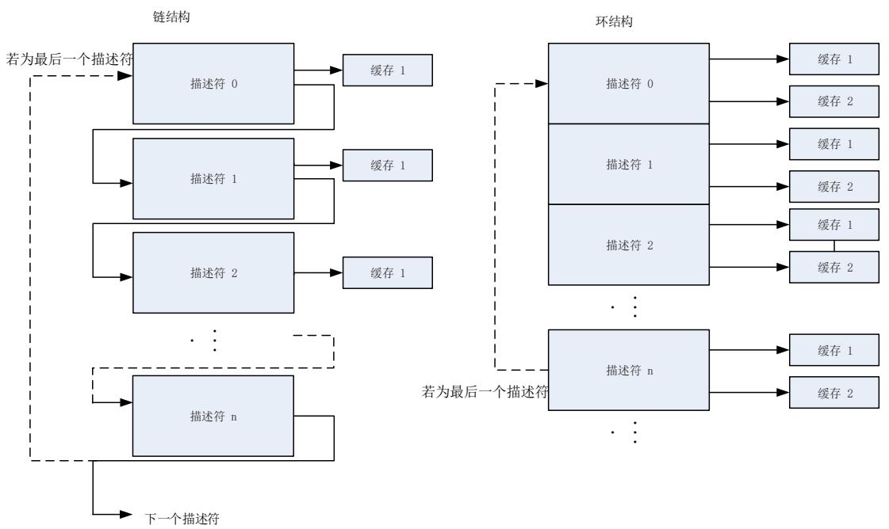


## 数据缓存地址对齐

以太网DMA控制器支持所有对齐类型：字节对齐，半字对齐，字对齐。这意味着应用程序可将发送和接收数据缓存地址配置到任意地址。但是，在DMA发起传输的时候，总是以字对齐的方式访问地址。对于读和写缓存的访问也不一样。示例如下：

读缓存示例：如果发送缓存的地址为0x2000 0AB2，并需要传输15字节。在开始读操作后，DMA实际会从地址0x2000 0AB0，0x2000 0AB4，0x2000 0AB8，0x2000 0ABC和0x20000AC0先读5个字，但是在往FIFO发送数据的时候，会丢弃头2个字节(0x2000 0AB0和0x2000 0AB1)和最后3个字节（0x2000 0AC1，0x2000 0AC2和0x2000 0AC3）。

写缓存示例：如果接收缓存的地址为0x2000 0CD2，并需要传输16字节。在开始写操作后，DMA实际会从地址0x2000 0CD0到0x2000 0CE0先写5个32位数据。但是头2个字节（0x2000 0CD0和0x2000 0CD1）和末尾的2个字节（0x2000 0CE2和0x2000 0CE3）会用虚拟字节替代。

注意：DMA控制器不会写任何数据到定义的缓存区之外的地址。

## 缓冲区有效长度

发送帧的过程中，TxDMA会传输与发送描述符1中标明的缓存有效长度的字节给MAC控制器。如前所述，一个发送帧可以用多个描述符来描述一个帧，即一个帧的数据可以处于多个不同的缓存中。如果DMA控制器读取的发送描述符0的FSG位为’1’，那么DMA就明确了当前缓存存储的是一个新的帧，并标记发送的第一个字节是帧首。如果DMA控制器读取的描述符发送描述符0的LSG位为’1’，则DMA就明确了当前缓存存储的是当前帧的最后一部分数据。通常来说一个帧只存在一个缓存里（因为缓存的大小对于一个正常的帧来说足够大了），因此FSG和LSG位会在一个相同的描述符中同时置位。

接收帧的过程中，接收帧的缓存长度域值必须是字对齐的。对于字对齐或非字对齐的缓存地址，接收操作与发送操作不大相同。如果接收缓存地址是字对齐的，则与发送流程是类似的，缓存的有效长度为由接收描述符1中配置的值。如果接收缓存地址是非字对齐的，则缓存的有效长度将小于接收描述符1中配置的值。缓存有效长度值应为接收描述符1中配置的值减去缓存地址的低2位值。例如，假设缓存的总大小为2048字节，缓存地址为0x2000 0001，地址的低2位值为0b01，那么缓存有效长度为2047个字节，范围从0x2000 0001（帧首）到0x2000 07FF。

当收到了一个帧起始SOF，则DMA控制器将FSG位置位，当收到一个帧结束EOF时，则LSG位被置位。如果接收缓存长度域值配置的足够大，能放下整个帧，则FSG和LSG位将在同个描述符中被置位。实际接收的帧长度可从接收描述符0的FRML位域获取。从而应用程序可计算未被使用的缓存空间。RxDMA总是用新的描述符来接收下一帧。

## TxDMA 和 RxDMA 的仲裁器

DMA的仲裁器设计了两种仲裁方式用于提高DMA发送与接收控制器的效率：固定和轮询优先级。设置ENET_DMA_BCTL寄存器DAB位为’0’，选择轮询优先级，在TxDMA和RxDMA同时要求访问数据总线的时候，按照ENET_DMA_BCTL寄存器RTPR位设定的比例对其访问进行分配。设置DAB位为’1’选择固定优先级，此时RxDMA和TxDMA同时要求访问时，RxDMA总是对总线拥有更高的访问优先级。

## DMA错误状态

若DMA在传输过程中出现了错误的总线响应，那么DMA控制器认为发生了一个致命错误，会立刻停止所有操作，并更新状态寄存器ENET_DMA_STAT。在发生类似的致命错误（响应错误）之后，应用程序必须复位以太网外设并重新初始化DMA，DMA才能恢复操作。

## TxDMA 与 RxDMA 控制器的初始化

在使用DMA控制器之前，必须按如下步骤对DMA进行初始化：

1) 对ENET_DMA_BCTL寄存器进行总线访问参数的相关设置；

2) 对ENET_DMA_INTEN寄存器进行设置，屏蔽不需要的中断源；

3) 将发送描述符列表和接收描述符列表的基地址分别写入ENET_DMA_TDTADDR寄存器与ENET_DMA_RDTADDR寄存器中；

4) 对相关的寄存器进行期望的过滤器配置；

5) 根据从PHY读出的自协商的结果，设置SPD位和DPM位的值，来选择通讯模式（半/全双

工）及通讯速度（10Mbit/s或100Mbit/s）。将ENET_MAC_CFG寄存器的TEN和REN位置’1’，使能MAC的发送和接收操作；

6) 设置ENET_DMA_CTL寄存器的位STE和位SRE为’1’，使能DMA发送和接收器。

注意：如果HCLK频率过低，应用程序可以先使能DMA接收器，再将ENET_MAC_CFG寄存器的REN位置’1’，以避免RxFIFO在启动的时候溢出。

## DMA发送帧处理

如前所述，一个帧可以分散在不同缓存内，这意味着需要多个描述符。当FSG位置位，表示当前描述符指向的缓存为帧头，当LSG位置位，表示当前描述符指向的缓存为帧尾。对于当前帧其他描述符（LSG位为’0’的描述符），TxDMA控制器仅修改清零其DAV位。在这最后一个缓存的数据发送完毕以后，DMA会将整个帧的发送状态信息，写入最后一个的发送描述符0并返回。将数据从系统存储传输到FIFO，开始发送数据，但实际上真正的数据发送是由TxDMA模式决定的：直通模式和存储转发模式。直通模式在FIFO中的字节数大于所配置的阈值时，数据将取出到MAC发送。存储转发模式在整个帧数据都传入FIFO后或FIFO快要填满时再取出数据给MAC进行发送。

## DMA 发送管理

## 发送缓存区中第二帧操作

如果ENET_DMA_CTL寄存器中OSF位为’0’，则发送顺序为：首先读取发送描述符，然后从系统存储读取数据写到FIFO，再将帧数据通过MAC放到接口上，最后等待数据发送完毕后将发送状态写回描述符。

上述是TxDMA的标准发送流程，但当HCLK远远大于TX_CLK时，在发送两个帧时发送效率将显著降低。

为避免上述提及的情况，应用程序可将OSF位置位。在此情况下，第二帧的数据可以不等待第一帧的描述符状态信息被写回，就先读取内存里的第二帧数据，并把它们送进FIFO。OSF功能仅在两相邻帧之间起作用。

## TxDMA 操作模式(A)（默认）：非 OSF

在默认模式下，TxDMA控制器的工作流程如下：

1) 初始化帧数据到发送缓存，并对发送描述符(发送描述符0-3)进行设置，置发送描述符0的DAV位为’1’；

2) 将ENET_DMA_CTL寄存器的STE位置为’1’，使能TxDMA控制器；

3) TxDMA控制器开始轮询发送描述符列表来获取待发送的帧。如果TxDMA检测到发送描述符0的位DAV为0，或者发生了错误，则控制器就会终止传输进入挂起状态，并设置ENET_DMA_STAT寄存器的发送缓存不可用位(位2)和正常中断汇总位(位16)为’1’。如果处于挂起状态，则发送控制器操作跳至步骤8；

4) 如果取到的描述符标志位显示该描述符由DMA占有(DAV位被置’1’)，那么DMA从描述符中解析出所配置的发送帧以及发送数据缓存的地址；

5) DMA从内存中取出数据并将数据存入TxFIFO；

6) TxDMA控制器会一直轮询描述符列表直到帧结尾被传送出去（LSG位置位）。如果当前描述符的LSG位为’0’，则在所有缓存数据送入TxFIFO之后，将DAV位清零以关闭这个描述符。然后TxDMA控制器等待写回描述符状态，以及IEEE 1588时间戳值（如果使能了时间戳功能）；

7) 在 整 个 帧 发 送 完 成 以 后 ， 仅 当 发 送 描 述 符 0 位 INTC 为 ’1’ 时 ， 发 送 状 态 位（ENET_DMA_STAT寄存器中的TS位）会被置位。此时若使能了DMA中断，将进入相应中断。然后DMA控制器返回步骤3，继续处理下一帧；

8) 在挂起状态下，如果向发送查询使能寄存器ENET_DMA_TPEN写入任意值，并清除发送溢出标志位，TxDMA将重新回到运行状态，尝试重新获取描述符。发送控制器操作回到步骤3。

## TxDMA 操作模式(B)：OSF

在操作第二帧(OSF)模式下，TxDMA可以不必等到前一帧的状态信息写回，就发送下一帧。如果系统时钟频率远远大于MAC频率（10Mbit/s或100Mbit/s），这种情况OSF模式可以提高发送效率。设置ENET_DMA_CTL寄存器的位OSF为’1’，进入此模式。DMA在发送完前一帧数据后，不必等到前一阵的状态写回，而是立即查询第二帧的发送描述符，如果第二帧发送描述符的DAV位与FSG位都置1，那么TxDMA立即读取第二帧的帧数据并将其存入MAC FIFO。

在OSF模式下，TxDMA的操作流程如下：

1) 按照TxDMA默认模式的步骤1-6操作；

2) DMA不等到关闭前一帧的最后一个描述符（LSG位为’1’），就直接取下一个描述符；

3) 如果取到的描述符标明被DMA占有(DAV位为’1’)，那么就从解析的发送缓存地址中读取下一帧的数据。如果DAV位为’0’即DMA不占有这个描述符，则TxDMA进入挂起状态并跳到步骤7；

4) TxDMA控制器会一直轮询描述符列表直到帧结尾被传送出去。如果一个帧由多个描述符描述，则中间描述符会在获取之后就被关闭；

TxDMA等待前一帧的发送状态信息和时间戳（如果使能了时间戳功能），在接收到状态信息后，DMA会把DAV位为’0’的状态信息写入发送描述符0，将该描述符的占有权交还给CPU进行操作；

6) 在 整 个 帧 发 送 完 成 以 后 ， 仅 当 发 送 描 述 符 0 位 INTC 为 ’1’ 时 ， 发 送 状 态 位（ENET_DMA_STAT寄存器中的TS位）会被置位。此时若使能了DMA中断，将进入相应中断。如果前一个帧返回的状态信息正常则跳到步骤3。若显示有数据下溢错误，TxDMA进入挂起状态，并跳到步骤7；

7) 在挂起状态下，如果TxDMA收到一个发送帧的待处理的状态信息和时间戳（若使能了时间戳），则TxDMA将这些信息写入发送描述符，并将相应描述符的的DAV位清零。随后设置相关的中断标志位并回到暂停状态；

8) 在挂起状态下，如果向发送查询使能寄存器ENET_DMA_TPEN写入任意值并将溢出中断标志位清零，TxDMA将回到运行状态，尝试重新获取描述符。发送控制器操作根据是否有待处理的状态信息跳到步骤1或者步骤2。

## 发送帧格式

根据前述的IEEE 802.3规范，一个正常的发送帧应该由以下及部分构成：前导码，帧首界定码SFD，目标地址DA，源地址SA，QTAG前缀（可选），长度/类型域LT，数据，PAD填充域（可

选），和帧校验序列FCS。

前导码和帧首界定码都是由MAC自动生成的，因此应用程序只需要存储目标地址，源地址，QTAG（若需要），长度/类型，数据，填充域（若需要），帧校验序列（若需要）。如果帧需要填充位，即缓存中没有存储填充位和帧校验序列部分，则应用程序可配置自动生成帧校验序列和填充位功能。如果帧仅需帧校验序列，即缓存中没有存储帧校验序列部分，则应用程序可配置自动生成帧校验序列。DPAD位和DCRC位用于配置填充位和帧校验序列的自动生成。

## 发送查询挂起后的处理

当传输开始后DMA会不断对发送描述符进行查询，当发生如下情况时，会导致DMA进入挂起状态，并暂停发送。此时当前描述符固定为暂停前的最后一个描述符。

DMA检测到发送描述符0的DAV位为0，此时CPU占有描述符，则会进入挂起状态，并暂停查询。同时设置ENET_DMA_STAT寄存器的正常中断总结位NI和发送缓存不可用位TBU为’1’；

当接口在发送帧的过程中MAC FIFO为空，意味着检测到了数据下溢错误。在此情况下，设置ENET_DMA_STAT寄存器的异常中断总结位AI和发送数据下溢位TU为’1’，同时把该信息写入发送描述符0。

## 带 IEEE 1588 时间戳的 TxDMA 描述符格式

如果设置TTSEN位为’1’，则使能了IEEE1588功能。TxDMA控制器会在帧发送完成后，将时间戳写入描述符同时设置TTMSS位为’1’。写时间戳值的地址由ENET_DMA_BCTL寄存器的DFM位决定。如果DFM位为’0’即描述符格式为常规模式，则时间戳将覆盖写到发送描述符2和发送描述符3上。如果DFM位为’1’即描述符格式为增强型模式，则时间戳将写到发送描述符6和发送描述符7上，发送描述符2和发送描述符3中的值保持不变。

## 常规 TxDMA描述符

常规TxDMA描述符结构体包含4个32位字，发送描述符0~发送描述符3。发送描述符0~发送描述符3的位定义如下：

注意：若一个帧由多个描述符表示，则对于描述符的控制位（除了INTC位）只有第一个描述符的才有效。状态信息和时间戳（若使能了时间戳功能）只写回到最后一个描述符。


图 23-7. 常规发送描述符


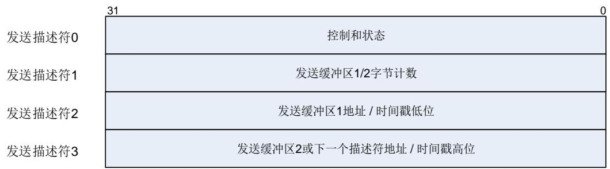


发送描述符0


<table><tr><td>31</td><td>30</td><td>29</td><td>28</td><td>27</td><td>26</td><td>25</td><td>24</td><td>23</td><td>22</td><td>21</td><td>20</td><td>19</td><td>18</td><td>17</td><td>16</td></tr><tr><td>DAV</td><td>INTC</td><td>LSG</td><td>FSG</td><td>DCRC</td><td>DPAD</td><td>TTSEN</td><td>保留</td><td colspan="2">CM[1:0]</td><td>TERM</td><td>TCHM</td><td colspan="2">保留</td><td>TTMSS</td><td>IPHE</td></tr><tr><td>rw</td><td>rw</td><td>rw</td><td>rw</td><td>rw</td><td>rw</td><td>rw</td><td></td><td colspan="2">rw</td><td>rw</td><td>rw</td><td colspan="2"></td><td>rw</td><td>rw</td></tr><tr><td>15</td><td>14</td><td>13</td><td>12</td><td>11</td><td>10</td><td>9</td><td>8</td><td>7</td><td>6</td><td>5</td><td>4</td><td>3</td><td>2</td><td>1</td><td>0</td></tr><tr><td>ES</td><td>JT</td><td>FRMF</td><td>IPPE</td><td>LCA</td><td>NCA</td><td>LCO</td><td>ECO</td><td>VFRM</td><td colspan="4">COCNT[3:0]</td><td>EXD</td><td>UFE</td><td>DB</td></tr><tr><td>rw</td><td>rw</td><td>rw</td><td>rw</td><td>rw</td><td>rw</td><td>rw</td><td>rw</td><td colspan="2">rw</td><td colspan="3">rw</td><td>rw</td><td>rw</td><td>rw</td></tr></table>

<table><tr><td>位/位域</td><td>名称</td><td>描述</td></tr><tr><td>31</td><td>DAV</td><td>DAV 位DMA 会在将帧完整传输或者描述符指向的缓存里的数据全部被读出以后把该位清'0'。当一个帧位于多个缓存中时,第一个缓存描述符的 DAV 位,必须在后面缓存描述符的 DAV 位全部置'1'以后,才能置'1'0:表示 CPU 占有描述符1:表示 DMA 占有描述符</td></tr><tr><td>30</td><td>INTC</td><td>完成时中断位LSG 位置位后,此位才有效。0:帧发送完成时,ENET_DMA_STAT 寄存器的 TS 位不被置位1:帧发送完成时,ENET_DMA_STAT 寄存器的 TS 位被置位</td></tr><tr><td>29</td><td>LSG</td><td>最后分块位此位指示缓存是否包含帧的最后一个分块0:该描述符缓存中没有存放帧的最后一个分块1:该描述符缓存中存放有帧的最后一个分块</td></tr><tr><td>28</td><td>FSG</td><td>第一分块位此位指示缓存是否包含帧的第一个分块0:该描述符缓存中没有存放帧的第一个分块1:该描述符缓存中存放有帧的第一个分块</td></tr><tr><td>27</td><td>DCRC</td><td>不计算 CRC 位只有在 FSG 位置位时,此位才有效。0:MAC 在传输帧末尾自动插入 CRC 域1:MAC 不在传输帧末尾自动插入 CRC 域</td></tr><tr><td>26</td><td>DPAD</td><td>不填充位只有在 FSG 位置位时,此位才有效。0:DMA 对传输帧自动添加填充字节,并且插入 CRC 数值。发生填充时,CRC 会被插入,忽略 DCRC 位的值。1:MAC 不对传输帧自动填充字节注意:此处的传输帧小于 64 字节。</td></tr><tr><td>25</td><td>TTSEN</td><td>使能发送时间戳位只有在 FSG 位置位时,此位才有效。0:发送时间戳功能失能1:当 ENET_PTP_TSCTL 寄存器的 TMSEN 位为'1'时,传输帧的 IEEE1588 硬件时间戳功能使能。</td></tr><tr><td>24</td><td>保留</td><td>必须保持复位值。</td></tr><tr><td>23:22</td><td>CM[1:0]</td><td>校验和插入模式位0x0:不插入校验和0x1:只使能硬件IP报头的校验和计算和插入0x2:使能硬件IP报头和数据域的校验和计算和插入,但是不计算伪报头的校验和0x3:使能硬件IP报头和数据域的校验和计算和插入,也计算伪报头的校验和</td></tr><tr><td>21</td><td>TERM</td><td>环形发送结束模式位该位仅在环模式下使用,且比TCHM位具有更高优先级0:当前描述符还不是描述符队列的最后一个1:当前描述符到达描述符队列的最后一个,DMA返回列表的基地址</td></tr><tr><td>20</td><td>TCHM</td><td>第二地址链表模式位该位在链模式下使用。该位为'1'时,忽略TB2S[12:0]的值。0:描述符里的第二个地址是第二缓存的地址1:描述符里的第二个地址是下一个描述符的地址,而不是第二个缓存的地址</td></tr><tr><td>19:18</td><td>保留</td><td>必须保持复位值。</td></tr><tr><td>17</td><td>TTMSS</td><td>发送时间戳状态位只有在LSG位置位时,此位才有效。0:还未记录帧的时间戳信息1:记录下了描述符对应的帧时间戳,记录的时间戳放在发送描述符2(或发送描述符6,假如DFM=1)和发送描述符3(或发送描述符7,假如DFM=1)处。</td></tr><tr><td>16</td><td>IPHE</td><td>IP报头错误位发生下列任意一种情况,则产生IP报头错误:IPv4帧:1)报头长度域值小于0x52)报头长度域值与报头的长度不符3)报头版本域值与帧长度/类型域值不匹配IPv6帧:1)主报头长度不足40字节2)报头版本域值与帧长度/类型域值不匹配0:未发现IP数据包报头的错误1:MAC发送端发现了IP数据包报头的错误</td></tr><tr><td>15</td><td>ES</td><td>错误汇总该位为下列位的逻辑“或”:IPHE:IP报头错误JT:Jabber超时FRMF:帧清空IPPE:IP数据错误LCA:载波丢失NCA:无载波LCO:延迟冲突ECO:过度冲突</td></tr></table>

EXD：过度顺延

UFE：数据下溢错误

14 JT 

Jabber 超时位

该位仅当 JBD 位复位时才会被置’1’

0：未发生 Jabber 超时

1：MAC 发送端发生了 Jabber 超时

13 FRMF 

帧清空位

置 1 时，清空 TxFIFO 中的数据

12 IPPE 

IP 数据错误位

发送端会核对 IPv4 或者 IPv6报头的数据长度域值与实际收到的 TCP、UDP 和

ICMP 数据数目，不符合就置’1’报错

0：未发生 IP 数据错误

1：MAC 发送端发现了 IP 数据包的 TCP、UDP 或者 ICMP 的 IP 数据错误

11 LCA 

载波丢失位

在发送时，如果 CRS 信号在一个或一个以上发送时钟周期中为无效状态，并且没有发生冲突，则载波丢失将概率性发生

该位只有在半双工模式下有效

0：未发生载波丢失

1：帧发送的时候发生了载波丢失

10 NCA 

无载波位

0：PHY的载波侦听信号有效

1：帧发送的时候 PHY的载波侦听信号无效

9 LCO 

延迟冲突位

如果冲突在 64 字节（包括前导符）发送之后发生，则这种情况称作延迟冲突

0：未发生延迟冲突

1：发生了延迟冲突

注意：如果溢出错误位 UFE 置’1’，该位无效

8 ECO 

过度冲突位

如果 MAC 设置寄存器的 RTD(不进行重试)位为’1’，那么在发生一次冲突后，该位就置’1’

如果 MAC 设置寄存器的 RTD(不进行重试)位为’0’，那么在连续发生 16 次冲突后，该位置’1’

若该位置位，则中止当前帧的发送

0：未发生过度冲突

1：发生了过度冲突

7 VFRM 

VLAN 帧位

0：发送帧为普通帧

1：发送的帧是 VLAN 帧\
<table><tr><td>6:3</td><td>COCNT[3:0]</td><td>冲突计数位只有在 ECO 位为 0 时,此位才有效。该 4 位计数值记录了帧发送出去前出现的冲突次数。</td></tr><tr><td>2</td><td>EXD</td><td>过度顺延位当 MAC 设置寄存器的顺延位 DFC 为&#x27;1&#x27;时有效0:未发生过度顺延1:由于顺延超过 3036 字节的时间而结束发送</td></tr><tr><td>1</td><td>UFE</td><td>数据下溢错误位数据下溢错误表示由于从系统存储传输数据到 FIFO 的速度过慢,导致 DMA 在发送帧的时候遇到了空的缓存。发送过程进入挂起状态,并将 ENET_DMA_STAT 寄存器的发送数据下溢位 TU(位 5)和发送状态位 TS(位 0)都置&#x27;1&#x27;0:未发生数据下溢错误1:发生了数据下溢错误,MAC 中止帧的发送</td></tr><tr><td>0</td><td>DB</td><td>顺延位该位指示了是否由于载波侦听信号 CRS 在 MAC 发送帧之前被占用,而导致发生帧的顺延该位只在半双工模式下有效0:未发生发送顺延1:MAC 发生了顺延,推迟发送</td></tr></table>


发送描述符1


<table><tr><td>31</td><td>30</td><td>29</td><td>28</td><td>27</td><td>26</td><td>25</td><td>24</td><td>23</td><td>22</td><td>21</td><td>20</td><td>19</td><td>18</td><td>17</td><td>16</td></tr><tr><td colspan="3">保留</td><td colspan="13">TB2S[12:0]</td></tr><tr><td colspan="16">rw</td></tr><tr><td>15</td><td>14</td><td>13</td><td>12</td><td>11</td><td>10</td><td>9</td><td>8</td><td>7</td><td>6</td><td>5</td><td>4</td><td>3</td><td>2</td><td>1</td><td>0</td></tr><tr><td colspan="3">保留</td><td colspan="13">TB1S[12:0]</td></tr></table>


rw 


<table><tr><td>位/位域</td><td>名称</td><td>描述</td></tr><tr><td>31:29</td><td>保留</td><td>必须保持复位值。</td></tr><tr><td>28:16</td><td>TB2S[12:0]</td><td>发送缓存2大小第二个数据缓存的大小(以字节记)。</td></tr><tr><td>15:13</td><td>保留</td><td>必须保持复位值。</td></tr><tr><td>12:0</td><td>TB1S[12:0]</td><td>发送缓存1大小第一个数据缓存的大小(以字节记)。</td></tr></table>


发送描述符2


<table><tr><td>31</td><td>30</td><td>29</td><td>28</td><td>27</td><td>26</td><td>25</td><td>24</td><td>23</td><td>22</td><td>21</td><td>20</td><td>19</td><td>18</td><td>17</td><td>16</td></tr><tr><td colspan="16">TB1AP/TTSL[31:16]</td></tr></table>


rw 


<table><tr><td>15</td><td>14</td><td>13</td><td>12</td><td>11</td><td>10</td><td>9</td><td>8</td><td>7</td><td>6</td><td>5</td><td>4</td><td>3</td><td>2</td><td>1</td><td>0</td></tr><tr><td colspan="16">TB1AP/TTSL[15:0]</td></tr></table>


rw


<table><tr><td>位/位域</td><td>名称</td><td>描述</td></tr><tr><td>31:0</td><td>TB1AP/TTSL[31:0]</td><td>发送缓存1地址指针/发送帧时间戳低32位在发送帧之前,应用程序必须对这些位进行配置发生缓存1地址(TB1AP),等到数据发送完后,DMA可以用它们存放帧的时间戳低32位(若DFM=0)。但若DFM=1,这些位将不会被修改,保持为缓存地址。当这些位的值表示缓存1的物理地址(TTSL)时,对缓存的地址对齐不做限制。当这些位的值表示时间戳低32位(TB1AP)时,当前描述符的TTSEN位和LSG位必须置位。</td></tr></table>


发送描述符3


<table><tr><td>31</td><td>30</td><td>29</td><td>28</td><td>27</td><td>26</td><td>25</td><td>24</td><td>23</td><td>22</td><td>21</td><td>20</td><td>19</td><td>18</td><td>17</td><td>16</td></tr><tr><td colspan="16">TB2AP/TTSH[31:16]</td></tr><tr><td colspan="16">rw</td></tr><tr><td>15</td><td>14</td><td>13</td><td>12</td><td>11</td><td>10</td><td>9</td><td>8</td><td>7</td><td>6</td><td>5</td><td>4</td><td>3</td><td>2</td><td>1</td><td>0</td></tr><tr><td colspan="16">TB2AP/TTSH[15:0]</td></tr></table>


rw


<table><tr><td>位/位域</td><td>名称</td><td>描述</td></tr><tr><td>31:0</td><td>TB2AP/TTSH[31:0]</td><td>发送缓存2地址指针(下个描述符地址)/发送帧时间戳高32位在发送帧之前,应用程序必须对这些位进行配置发生缓存2地址(TB2AP),或者配置下一个描述符地址(由描述符类型是链型还是环型决定)。等到数据发送完后,DMA可以用它们存放帧的时间戳高32位TTSH(若DFM=0,且TTSEN=1)。但若DFM=1或TTSEN=0,这些位将不会被修改。当这些位的值表示缓存2的物理地址时(TCHM=0),对缓存的地址对齐不做限制。当这些位的值表示下个描述符地址时(TCHM=1),这些位必须是字对齐的。当这些位的值表示时间戳高32位时,当前描述符的TTSEN位和LSG位必须置位。</td></tr></table>

## 增强 TxDMA描述符

增强TxDMA描述符结构体包含8个32位字：发送描述符0~7。发送描述符0~3的位定义与常规TxDMA描述符相同，发送描述符4~7的位定义如下：

注意：若一个帧由多个描述符表示，则对于描述符的控制位（除了INTC位）只有第一个描述符的才有效。状态信息和时间戳（若使能了时间戳功能）只写回到最后一个描述符。


图 23-8. 增强发送描述符


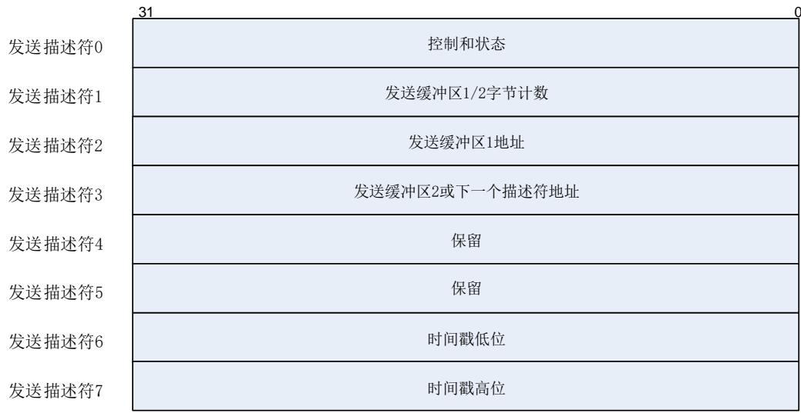


发送描述符4所有位保留。

发送描述符5所有位保留。

发送描述符6

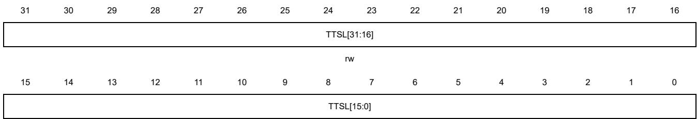


rw


<table><tr><td>位/位域</td><td>名称</td><td>描述</td></tr><tr><td>31:0</td><td>TTSL[31:0]</td><td>发送时间戳低 32 位当 TTSEN 位和 LSG 位都为 1 时,这些位用于记录当前发送帧的时间戳低 32 位值。</td></tr></table>


发送描述符7


<table><tr><td>31</td><td>30</td><td>29</td><td>28</td><td>27</td><td>26</td><td>25</td><td>24</td><td>23</td><td>22</td><td>21</td><td>20</td><td>19</td><td>18</td><td>17</td><td>16</td></tr><tr><td colspan="16">TTSH[31:16]</td></tr><tr><td colspan="16">rw</td></tr><tr><td>15</td><td>14</td><td>13</td><td>12</td><td>11</td><td>10</td><td>9</td><td>8</td><td>7</td><td>6</td><td>5</td><td>4</td><td>3</td><td>2</td><td>1</td><td>0</td></tr><tr><td colspan="16">TTSH[15:0]</td></tr></table>


rw


<table><tr><td>位/位域</td><td>名称</td><td>描述</td></tr><tr><td>31:0</td><td>TTSH[31:0]</td><td>发送时间戳高 32 位</td></tr></table>

当 TTSEN 位和 LSG位都为 1 时，这些位用于记录当前发送帧的时间戳高 32 位值。

## DMA 接收帧处理

当接口上出现一个帧的时候，MAC开始接收帧。同时，地址过滤模块开始工作，如果这个帧没有通过地址过滤，则MAC RxFIFO将忽略该帧，不会将其通过RxDMA转发给接收缓存。如果这个帧通过了地址过滤，则其在不同的转发条件满足时会被转发给接收缓存。在直通模式下，这个转发条件是指接收的帧长大于等于设好的接收阈值。在存储转发模式下，这个转发条件是指FIFO里存入了完整的帧时。在接收帧的过程中，当发生以下任意一种情况时，将丢弃RxFIFO中的数据，并且不转发数据：1）RxFIFO中数据少于64字节。2）在接收过程中发生了冲突。3）提前终止接收帧。

当满足转发条件时，RxDMA控制器开始将数据从RxFIFO中传输到接收缓存中。若当前缓存中包含了帧起始，则在RxDMA控制器写回帧接收状态的时候会将接收描述符0中的FDES位置位，以表明这个描述符中存储的是帧的第一部分。若当前缓存中包含了帧结尾，则在RxDMA控制器写回帧接收状态的时候会将接收描述符0中的LDES位置位，以表明这个描述符中存储的是帧的最后一部分。通常当接收缓存大小大于接收帧的长度时，FDES位和LDES位会在同一个描述符中置位。当缓存接收到了帧结尾，或者当前描述符的缓存不足以存储整个帧时，RxDMA将获取下一个接收描述符，并将上一个描述符的接收描述符0的DAV位清零以关闭上个描述符。当LDES位置位时，描述符其他状态也会更新，并且ENET_DMA_STAT寄存器中的RS位将置位（当DINTC=0时RS位置位，当DINTC=1时RS位不会置位）。当接收到一个新的帧时，如果描述符的DAV位为’1’，则重复上述的RxDMA控制器操作。如果描述符的DAV位为’0’，则DMA控制器进入挂起状态，并设置ENET_DMA_STAT寄存器的RBU位为’1’。记录描述符列表地址指针当前值，并在退出挂起状态后作为描述符开始的地址。

## DMA接收管理

RxDMA控制器的工作流程如下：

1) DMA接收描述符初始化，置接收描述符0的DAV位为’1’；

2) 将ENET_DMA_CTL寄存器的SRE位置为’1’，使能RxDMA控制器。DMA进入运行状态后，会从ENET_DMA_RDTADDR寄存器配置的描述符列表基地址获取接收描述符。如果获取的描述符DAV位为1，则当前描述符开始接收帧。但如果检测到取到的描述符正在被CPU操作而不可用(DAV=0)，则DMA进入挂起状态，跳到步骤9；

3) 如果获取的描述符显示描述符由DMA占有(DAV=1)，那么该描述符的控制位和缓存地址就会被DMA所记录；

4) 处理接收到的帧，并从RxFIFO将数据传输到接收缓存；

5) 如果缓存被填满或者帧传输结束，接收控制器会从描述符队列中获取下一个接收描述符；

6) 如果当前帧传输结束，DMA操作跳到步骤7。如果当前帧传输没有结束(未接收到帧尾EOF)，则可能发生两种情况：

下一个描述符的DAV位为’0’。如果接收帧清空功能使能，则RxDMA控制器将接收描述符0的描述符错误位DERR位置位。然后RxDMA控制器将当前描述符的DAV位清零以关闭描述符，并根据帧清空功能是否使能来确定是否置位LSG位（若使能则置位LSG，反之则不置位LSG）。之后DMA操作跳到步骤8；

下一个描述符的DAV位为’1’。那么RxDMA将DAV位清零以关闭当前描述符，之后操作退回步骤4。

7) 如果使能了IEEE 1588时间戳功能，在接收帧完成后DMA控制器会把获取的时间戳的低位和高位（如果接收帧符合需要记录时间戳的帧的条件），分别写入当前描述符的接收描述符2和接收描述符3（当DFM=0时），或者写入当前描述符的接收描述符6和接收描述符7（当DFM=1时）。同时DMA把从MAC处返回的接收状态信息写入接收描述符0，并把DAV位清’0’，把LSG位置’1’；

8) 如果新获取的描述符DAV位为’1’，则RxDMA控制器操作跳动步骤4。如果DAV位为’0‘，则RxDMA控制器进入挂起状态，并设ENET_DMA_STAT寄存器的RBU位为1。如果使能了接收帧清空功能，则在DMA进入挂起状态之前，控制器会清空接收帧；

9) 在挂起状态下，有两种方法退出该状态。一种方法是向接送查询使能寄存器ENET_DMA_RPEN中写入任意值。另一种方法是RxFIFO收到下一帧数据，这意味着在直通模式下时，帧数据字节数需要大于设置的阈值，或者在存储转发模式下，需要收到整个帧。当DMA退出暂停状态后，DMA会获取下一个描述符，并跳到步骤2。

## 获取接收描述符

只要满足下列条件任意一个或多个，DMA就会尝试获取接收描述符：

在寄存器ENET_DMA_CTL的接收开始/停止位SRE从’0’变为’1’，使DMA控制器进入运行状态的时候；

当前描述符的整个缓存大小（对于链结构为缓存1，对于环结构为缓存1和2）不足以接收整个帧，也就是说在接收到帧的结尾之前，当前描述符的缓存已满；

在一个完整的帧传送到接收缓存之后，并在当前描述符关闭之前；

在挂起状态时，MAC接收到新的帧；

向接送查询使能寄存器ENET_DMA_RPEN写入任意值。

## 挂起状态时接收到新的帧时的处理

在挂起状态时，当接收到一个新的帧，并且满足转发条件时（转发条件如上所述），RxDMA将获取帧的描述符。如果接收描述符0的DAV位为’1’，则RxDMA控制器退出挂起状态，返回运行状态开始接收帧。但当接收描述符0的DAV位为’0’，则应用程序可以通过配置ENET_DMA_CTL寄存器中DAFRF位来选择是否清空RxFIFO中的帧。如果DAFRF=0，则RxDMA控制器将丢弃FIFO所接收的帧数据，并将丢失帧计数器MSFC加1。若DAFRF=1，则可以阻止丢弃RxFIFO顶部的帧，除非RxFIFO满，丢失帧计数器MSFC的值不会增加。在DAV位为’0’时，ENET_DMA_STAT寄存器中的RBU位将被置位，RxDMA控制器仍处于挂起状态。

## 带 IEEE1588 时间戳的 RxDMA 描述符格式

如果使能了IEEE 1588功能，则MAC控制器会在带时间戳的帧接收完成之后，DMA关闭描述符之前（DAV位清’0’），将时间戳写入接收描述符2和接收描述符3(DFM=0)，或接收描述符6和接收描述符7(DFM=1)。

## 常规 RxDMA描述符

常规RxDMA描述符结构体包含4个32位字，接收描述符0~接收描述符3。接收描述符0~接收描述符3的位定义如下：


图 23-9. 接收描述符


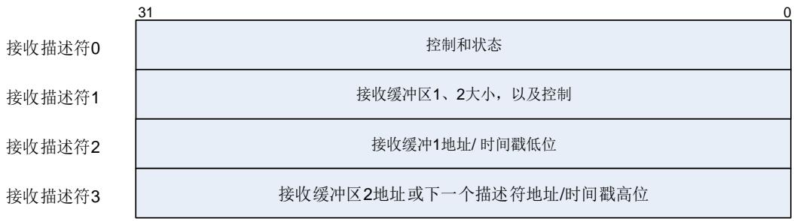


接收描述符0


<table><tr><td>31</td><td>30</td><td>29</td><td>28</td><td>27</td><td>26</td><td>25</td><td>24</td><td>23</td><td>22</td><td>21</td><td>20</td><td>19</td><td>18</td><td>17</td><td>16</td></tr><tr><td>DAV</td><td>DAFF</td><td colspan="14">FRML[13:0]</td></tr><tr><td>rw</td><td>rw</td><td colspan="14">rw</td></tr><tr><td>15</td><td>14</td><td>13</td><td>12</td><td>11</td><td>10</td><td>9</td><td>8</td><td>7</td><td>6</td><td>5</td><td>4</td><td>3</td><td>2</td><td>1</td><td>0</td></tr><tr><td>ERRS</td><td>DERR</td><td>SAFF</td><td>LERR</td><td>OERR</td><td>VTAG</td><td>FDES</td><td>LDES</td><td>IPHERR / TSV</td><td>LCO</td><td>FRMT</td><td>RWDT</td><td>RERR</td><td>DBERR</td><td>CERR</td><td>PCERR / EXSV</td></tr><tr><td>rw</td><td>rw</td><td>rw</td><td>rw</td><td>rw</td><td>rw</td><td>rw</td><td>rw</td><td>rw</td><td>rw</td><td>rw</td><td>rw</td><td>rw</td><td>rw</td><td>rw</td><td>rw</td></tr></table>

<table><tr><td>位/位域</td><td>名称</td><td>描述</td></tr><tr><td>31</td><td>DAV</td><td>描述符转发条件位该位指示了DMA控制器是否可以占有该描述符。DMA会在帧完整接收或者描述符指向的缓存被填满以后把该位清&#x27;0&#x27;0:表示CPU占有描述符1:表示DMA占有描述符</td></tr><tr><td>30</td><td>DAFF</td><td>未通过目标地址过滤器位0:接收帧通过目标地址过滤器1:接收帧没有通过目标地址过滤器</td></tr><tr><td>29:16</td><td>FRML</td><td>帧长位这些位表示了传送到输入缓存的接受帧字节长度(如果输入帧不是类型帧则包括CRC部分,如果输入帧是类型帧,则是否包括CRC部分由ENET_MAC_CFG寄存器的TFCD位决定)。只有LDES位为1且DERR位为0时,此位才有效。若LDES位和错误汇总位ERRS位都为&#x27;0&#x27;,则这些位表示当前接收帧已经传送到内存里的累计字节数注意:帧长度值为0意味着由于某种原因(例如FIFO溢出或在接收过程中动态地修改了过滤器的值,导致未通过过滤器的情况等)造成写入FIFO的帧不完整。</td></tr><tr><td>15</td><td>ERRS</td><td>错误汇总位只有在LDES位置位时,此位才有效。当DFM=0时,该位为下列位的逻辑“或”:DERR:描述符错误OERR:溢出错误LCO:延迟冲突</td></tr></table>

RWDT：看门狗超时

RERR：接收错误

CERR：CRC错误

IPHERR = 0, FRMT = 1且PCERR = 1：数据校验和错误

IPHERR = 1, FRMT = 1且PCERR = 0：报头校验和错误

IPHERR = 1, FRMT = 1 且 PCERR = 1：报头及数据校验和错误

当DFM = 1时，该位为下列位的逻辑“或”：

IPPLDERR：IP帧数据错误

IPHERR：IP帧报头错误

DERR：描述符错误

OERR：溢出错误

LCO：延迟冲突

RWDT：看门狗超时

RERR：接收错误

CERR：CRC 错误

14 DERR 描述符错误位

只有在 LDES 位置位时，此位才有效。

当当前描述符的缓存大小小于接收帧帧长同时 DMA 又无法占有下一个描述符，将发生描述符错误

0：未发生描述符错误

1：发生了描述符错误

13 SAFF 未通过源地址过滤器位

0：未发生未通过源地址过滤器事件

1：帧没有通过源地址过滤器

12 LERR 长度错误位

只有在 FRMT位为’0’时，此位才有效。

该位指示了接收到的以太网帧头长度/类型域的值是否与接收帧的实际长度匹配。

0：未发生长度错误

1：发生了长度错误

11 OERR 溢出错误位

当 RxFIFO 发生了溢出，而接收帧已有部分被传送到输入缓存时，溢出错误位置位

0：未发生溢出错误

1：发生了 RxFIFO 溢出，帧数据无效

10 VTAG VLAN 标签位

0：接收帧非 VLAN 帧

1：当前的接收帧为 VLAN 帧

9 FDES 第一个描述符

该位表示当前描述符是否存放了接收帧的第一部分

0：当前描述符未存放帧的第一部分

1：当前描述符存放了帧的第一部分

8 LDES 最后一个描述符

<table><tr><td></td><td></td><td>该位表示当前描述符是否存放了接收帧最后一部分0: 当前描述符未存放帧的最后一部分1: 当前描述符存放了帧的最后一部分</td></tr><tr><td>7</td><td>IPHERR/TSV</td><td>IP帧报头错误/时间戳有效位当DFM=0时,则将位7结合位5和位0,查询错误状态表,判断发生了什么错误。当DFM=1时,则表示已获取时间戳并将时间戳值写到了接收描述符6和接收描述符中,该位仅在LDES位置位时有效。</td></tr><tr><td>6</td><td>LCO</td><td>延迟冲突位该位表示在接收到64字节数据后是否发生了冲突该位仅在半双工模式下有效0: 未发生延迟冲突1: 接收帧的过程发生了延迟冲突</td></tr><tr><td>5</td><td>FRMT</td><td>帧类型0: 接收到的帧是IEEE802.3帧1: 接收到的帧是以太网类型的帧(以太网帧头长度/类型域的值大于等于0x0600,只有当接收到的帧长度不小于14字节时,此位才有效)。</td></tr><tr><td>4</td><td>RWDT</td><td>接收看门狗超时当WDD=0,该位表示已接收到超过2048字节的帧数据当WDD=1,该位表示已接收到超过16384字节的帧数据0: 未发生接收看门狗超时1: 在接收帧的过程中发生了看门狗超时,当前接收帧将被截断</td></tr><tr><td>3</td><td>RERR</td><td>接收错误该位表示帧接收过程中,在RX_DV信号有效时是否收到有效接口信号RX_ER0: 未发生接收错误1: 发生了接收错误</td></tr><tr><td>2</td><td>DBERR</td><td>Dribble位错误该位表示接收到的数据帧中是否存在半字节,只有MII模式时该位有效。0: 未发生Dribble位错误1: 发生了Dribble位错误</td></tr><tr><td>1</td><td>CERR</td><td>CRC错误该位表示接受帧的帧校验序列是否与硬件计算结果不匹配,只有在LDES位为&#x27;1&#x27;时该位有效。0: 未发生CRC错误1: 检测到接收帧发生了CRC错误</td></tr><tr><td>0</td><td>PCERR/EXSV</td><td>数据校验和错误/扩展状态有效位当DFM=0时,则将位7结合位5和位0,查询错误状态表,判断发生了什么错误。当DFM=1时,该位表示接收描述符4有效。该位仅在LDES位置位时有效。0: 接收描述符4无效1: 接收描述符4有效</td></tr></table>

23-9. 0 显示了接收描述符0中位IPHERR、FRMT、PCERR取值的含义：


表 23-9. 接收描述符 0 错误状态描述，仅适用于常规描述符（DFM=0）


<table><tr><td>位7:IPHERR</td><td>位5:FRMT</td><td>位0:PCERR</td><td>帧状态</td></tr><tr><td>0</td><td>0</td><td>0</td><td>IEEE802.3类型帧(长度域值小于0x0600或非标签帧)</td></tr><tr><td>0</td><td>0</td><td>1</td><td>IPv4/IPv6类型帧,未检测到IP报头校验和错误;由于不支持的数据格式,未执行数据校验和检测</td></tr><tr><td>0</td><td>1</td><td>0</td><td>IPv4/IPv6类型帧,未检测到校验和错误</td></tr><tr><td>0</td><td>1</td><td>1</td><td>IPv4/IPv6类型帧,检测到数据校验和错误。该错误可能原因:1)计算的校验和值与接收帧中的校验和域值不匹配2)接收帧长度域值与实际接收帧字节数不符</td></tr><tr><td>1</td><td>0</td><td>0</td><td>保留</td></tr><tr><td>1</td><td>0</td><td>1</td><td>类型帧(长度/类型域值大于等于0x600)或标签帧,但非IPv4/IPv6帧,不检测数据校验和</td></tr><tr><td>1</td><td>1</td><td>0</td><td>IPv4/IPv6类型帧,检测到报头校验和错误。该错误可能原因:1)类型域值与数据包中的版本值不一致2)计算的报头校验和值与报头校验和域值不匹配3)IP报头字节数不足</td></tr><tr><td>1</td><td>1</td><td>1</td><td>IPv4/IPv6类型帧,检测到IP报头校验和错误和数据校验和错误</td></tr></table>


接收描述符1


<table><tr><td>31</td><td>30</td><td>29</td><td>28</td><td>27</td><td>26</td><td>25</td><td>24</td><td>23</td><td>22</td><td>21</td><td>20</td><td>19</td><td>18</td><td>17</td><td>16</td></tr><tr><td>DINTC</td><td colspan="2">保留</td><td colspan="13">RB2S[12:0]</td></tr><tr><td>rw</td><td></td><td></td><td></td><td></td><td></td><td></td><td></td><td></td><td>rw</td><td></td><td></td><td></td><td></td><td></td><td></td></tr><tr><td>15</td><td>14</td><td>13</td><td>12</td><td>11</td><td>10</td><td>9</td><td>8</td><td>7</td><td>6</td><td>5</td><td>4</td><td>3</td><td>2</td><td>1</td><td>0</td></tr><tr><td>RERM</td><td>RCHM</td><td>保留</td><td colspan="13">RB1S[12:0]</td></tr><tr><td>Rw</td><td>rw</td><td></td><td></td><td></td><td></td><td></td><td></td><td></td><td>rw</td><td></td><td></td><td></td><td></td><td></td><td></td></tr></table>

<table><tr><td>位/位域</td><td>名称</td><td>描述</td></tr><tr><td>31</td><td>DINTC</td><td>0:接收完成后ENET_DMA_STAT寄存器的RS位(位6)会立即置1,此时若使能了相应中断则会触发中断。1:在接收帧成功接收完成后,ENET_DMA_STAT寄存器的RS位(位6)不会立即置1,但会在可配置的延时(由ENET_DMA_RSWDC寄存器配置)之后置位。</td></tr><tr><td>30:29</td><td>保留</td><td>必须保持复位值。</td></tr><tr><td>28:16</td><td>RB2S[12:0]</td><td>接收缓存2大小表示接收缓存2的大小(以字节为单位)。缓存大小必须被设为4的倍数。这些位在RCHM位为&#x27;1&#x27;时被忽略</td></tr><tr><td>15</td><td>RERM</td><td>接收描述符环形结构结尾该位表示到达的是描述符列表中的最后一个描述符,下个描述符自动返回列表的基地址</td></tr></table>

0：当前描述符不是最后一个描述符

1：到达描述符列表的最后一个描述符

<table><tr><td>14</td><td>RCHM</td><td>第二地址链表0:描述符里的第二个地址指向第二缓存的地址1:描述符里的第二个地址是下一个描述符的地址,该位仅在在链模式下使用。忽略RBS2[12:0]的值。注意:当 RERM=1,则即使该位置位,下个描述符也将返回列表基地址</td></tr><tr><td>13</td><td>保留</td><td>必须保持复位值。</td></tr><tr><td>12:0</td><td>RB1S[12:0]</td><td>接收缓存 1 大小表示接收缓存 1 的大小(以字节为单位)。缓存大小必须被设为 4 的倍数。</td></tr></table>


接收描述符2


<table><tr><td>31</td><td>30</td><td>29</td><td>28</td><td>27</td><td>26</td><td>25</td><td>24</td><td>23</td><td>22</td><td>21</td><td>20</td><td>19</td><td>18</td><td>17</td><td>16</td></tr><tr><td colspan="16">RB1AP/RTSL[31:16]</td></tr><tr><td colspan="16">rw</td></tr><tr><td>15</td><td>14</td><td>13</td><td>12</td><td>11</td><td>10</td><td>9</td><td>8</td><td>7</td><td>6</td><td>5</td><td>4</td><td>3</td><td>2</td><td>1</td><td>0</td></tr><tr><td colspan="16">RB1AP/RTSL[15:0]</td></tr></table>


rw


<table><tr><td>位/位域</td><td>名称</td><td>描述</td></tr><tr><td>31:0</td><td>RBAP1/RTSL[31:0]</td><td>接收缓存 1 地址指针/发送帧时间戳低 32 位这些位有 2 个功能:缓冲区 1 的地址指针(RB1AP)和时间戳低 32 位(RTSL)。RB1AP:在 DMA 控制器获取该描述符之前,配置该位为缓存区 1 的地址。如果位 RB1S 不为&#x27;0&#x27;,则用该位的地址来存储接收的数据帧。对缓存的地址对齐不做限制。RTSL:当使能了时间戳功能同时 LDES 位为&#x27;1&#x27;时,如果接收帧通过了地址过滤,并且置位了对应的帧类型使能位,则 DMA 会将时间戳低 32 位写入这些位。如果接收帧没有置位对应的帧类型使能位,则这些位会保持 RB1AP 的值。</td></tr></table>


接收描述符3


<table><tr><td>31</td><td>30</td><td>29</td><td>28</td><td>27</td><td>26</td><td>25</td><td>24</td><td>23</td><td>22</td><td>21</td><td>20</td><td>19</td><td>18</td><td>17</td><td>16</td></tr><tr><td colspan="16">RB2AP/RTSH[31:16]</td></tr><tr><td colspan="16">rw</td></tr><tr><td>15</td><td>14</td><td>13</td><td>12</td><td>11</td><td>10</td><td>9</td><td>8</td><td>7</td><td>6</td><td>5</td><td>4</td><td>3</td><td>2</td><td>1</td><td>0</td></tr><tr><td colspan="16">RB2AP/RTSH[15:0]</td></tr></table>


rw


<table><tr><td>位/位域</td><td>名称</td><td>描述</td></tr><tr><td>31:0</td><td>RB2AP/RTSH[31:0]</td><td>接收缓存 2 地址指针(或者下一个描述符地址指针)/接收帧时间戳高 32 位这些位有 2 个功能:数据接收时这些位存放缓冲区 2 的地址或下个描述符的地址(RB2AP),或帧时间戳高 32 位(RTSH)</td></tr></table>

RB2AP：在 DMA 控制器获取该描述符之前，配置该位为缓存区 2 的地址

(RCHM=0)或下个描述符地址(RCHM=1)。如果 RCHM=1，且 RERM=1，则忽略这些位。

如果该地址表示下个描述符地址，则地址需为字对齐的，没有其他的限制条件。

RTSH：当使能了时间戳功能同时帧的最后部分 LDES 位为’1’时，如果接收帧通过了地址过滤，并且置位了对应的帧类型使能位，则 DMA 会将时间戳高 32 位写入这些位。如果接收帧没有置位对应的帧类型使能位，则这些位会保持 RB2AP 的值。

## 增强 RxDMA描述符

增强RxDMA描述符结构体包含8个32位字：接收描述符0~接收描述符7。接收描述符0~接收描述符3的位定义与常规RxDMA描述符相同，接收描述符4~接收描述符7的位定义如下：


图 23-10. 增强接收描述符


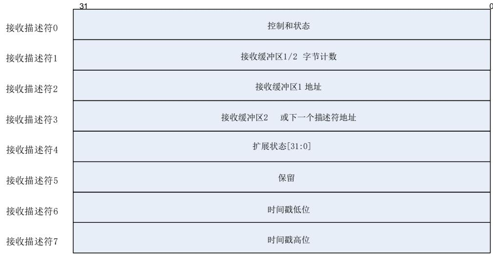


接收描述符4


<table><tr><td>31</td><td>30</td><td>29</td><td>28</td><td>27</td><td>26</td><td>25</td><td>24</td><td>23</td><td>22</td><td>21</td><td>20</td><td>19</td><td>18</td><td>17</td><td>16</td></tr><tr><td colspan="16">保留</td></tr><tr><td>15</td><td>14</td><td>13</td><td>12</td><td>11</td><td>10</td><td>9</td><td>8</td><td>7</td><td>6</td><td>5</td><td>4</td><td>3</td><td>2</td><td>1</td><td>0</td></tr><tr><td colspan="2">保留</td><td>PTPVF</td><td>PTPOEF</td><td colspan="4">PTPMT[3:0]</td><td>IPF6</td><td>IPF4</td><td>IPCKSB</td><td>IPPLDERR</td><td>IPHERR</td><td colspan="3">IPPLDT[2:0]</td></tr><tr><td colspan="2"></td><td>rw</td><td>rw</td><td colspan="4">rw</td><td>Rw</td><td>rw</td><td>rw</td><td>rw</td><td>rw</td><td colspan="3">rw</td></tr></table>

<table><tr><td>位/位域</td><td>名称</td><td>描述</td></tr><tr><td>31:14</td><td>保留</td><td>必须保持复位值。</td></tr><tr><td>13</td><td>PTPVF</td><td>PTP 版本格式位0:版本1格式1:版本2格式</td></tr><tr><td>12</td><td>PTPOEF</td><td>以太网PTP帧0:当PTPMT不为0时,接收的PTP帧是IP-UDP帧。1:接收的PTP帧是IEEE802.3以太网帧</td></tr><tr><td>11:8</td><td>PTPMT[3:0]</td><td>PTP消息类型PTP消息类型解码为以下几种:0x0:未收到PTP消息0x1:SYNC0x2:FOLLOW_UP0x3:DELAY_REQ0x4:DELAY_RESP0x5:对于点对点透明时钟:PDELAY_REQ对于普通时钟或边界时钟:ANNOUNCE0x6:对于点对点透明时钟:PDELAY_RESP对于普通时钟或边界时钟:MANAGEMENT0x7:对于点对点透明时钟:PDELAY_RESP_FOLLOW_UP对于普通时钟或边界时钟: SIGNALING</td></tr><tr><td>7</td><td>IPF6</td><td>IPv6帧位0:接收帧不是IPv6帧1:接收帧是IPv6帧</td></tr><tr><td>6</td><td>IPF4</td><td>IPv4帧位0:接收帧不是IPv4帧1:接收帧是IPv4帧</td></tr><tr><td>5</td><td>IPCKSB</td><td>绕过IP帧校验和该位仅在接收帧为IPv6或IPv4帧时有效。0:没有绕过接收帧校验和功能1:绕过了接收帧校验和功能</td></tr><tr><td>4</td><td>IPPLDERR</td><td>IP帧数据错误位在以下任意情形中,该位会被置位:1)硬件计算的校验和域TCP,UDP或ICMP帧校验和域值不匹配2)IP报头数据长度域值与接收到的帧数据长度不符。0:在接收帧中没有发生帧数据错误1:在接收帧中发生了帧数据错误</td></tr><tr><td>3</td><td>IPHERR</td><td>IP报头错误在以下任意情形中,该位会被置位:1)硬件计算的校验和值与IP报头校验和域值不匹配2)以太网帧类型域值与IP数据包中版本域值不一致(例如类型域值为0x800,但版本域值不为0x4;类型域值为0x86dd,但版本域值不为0x6)。0:没有发生IP报头错误1:发生了IP报头错误</td></tr><tr><td>2:0</td><td>IPPLDT[2:0]</td><td>IP帧数据类型位仅在IPFCO=1,IPHERR=0且LDES=1时,这些位有效。0x0:不支持的数据类型或忽略的IP数据类型0x1:数据类型为UDP0x2:数据类型为TCP0x3:数据类型为ICMP</td></tr></table>

0x4~0x7：保留

接收描述符5所有位保留。

接收描述符6

<table><tr><td>31</td><td>30</td><td>29</td><td>28</td><td>27</td><td>26</td><td>25</td><td>24</td><td>23</td><td>22</td><td>21</td><td>20</td><td>19</td><td>18</td><td>17</td><td>16</td></tr><tr><td colspan="16">RTSL[31:16]</td></tr><tr><td colspan="16">rw</td></tr><tr><td>15</td><td>14</td><td>13</td><td>12</td><td>11</td><td>10</td><td>9</td><td>8</td><td>7</td><td>6</td><td>5</td><td>4</td><td>3</td><td>2</td><td>1</td><td>0</td></tr><tr><td colspan="16">RTSL[15:0]</td></tr></table>


rw


<table><tr><td>位/位域</td><td>名称</td><td>描述</td></tr><tr><td>31:0</td><td>RTSL[31:0]</td><td>接收时间戳低 32 位当使能了时间戳功能同时帧的最后部分 LDES 位为&#x27;1&#x27;时,如果接收帧通过了地址过滤,并且置位了对应的帧类型使能位,则 DMA 会将时间戳低 32 位写入这些位。</td></tr><tr><td colspan="3">■ 接收描述符7</td></tr><tr><td>31</td><td>30</td><td>29 28 27 26 25 24 23 22 21 20 19 18 17 16</td></tr><tr><td colspan="3">RTSH[31:16]</td></tr><tr><td colspan="3">rw</td></tr><tr><td>15</td><td>14</td><td>13 12 11 10 9 8 7 6 5 4 3 2 1 0</td></tr><tr><td colspan="3">RTSH[15:0]</td></tr></table>


rw


<table><tr><td>位/位域</td><td>名称</td><td>描述</td></tr><tr><td>31:0</td><td>RTSH[31:0]</td><td>接收时间戳高32位当使能了时间戳功能同时帧的最后部分LDES位为&#x27;1&#x27;时,如果接收帧通过了地址过滤,并且置位了对应的帧类型使能位,则DMA会将时间戳高32位写入这些位。</td></tr></table>

## 23.3.4. MAC 统计计数器：MSC

为了了解发送和接收帧的统计情况，利用一组计数器来收集相关的统计数据。这些MAC计数器被称为MAC统计计数器(MSC)。在章节”ENET ”中有这些寄存器的详细功能说明。

当发送帧没有出现帧下溢、没有载波、载波丢失、顺延(Deferral)过多、延迟冲突，过度冲突和jabber超时等情况时，可以称为“好帧”，MSC发送计数器会自动更新。

当接收帧没有出现对齐错误、CRC错误、过短帧、长度错误、超出范围和MII_RX_ER引脚上的错误信号有效等情况时，可以称为“好帧”，MSC接收计数器会自动更新。其中，CRC错误是指CRC计算结果与帧校验序列值不一致，过短帧表示帧长少于64字节，长度错误表示长度域值与实际接收到的字节数不符，超出范围表示长度域值超过IEEE 802.3所规定的最大值，即对于非标签帧最大值为1518字节，对于VLAN标签帧最大值为1522字节。

注意：当被丢弃的帧是长度小于6字节的过短帧(没有完整接收到目标地址)时，MSC接收计数器也会更新。

## 23.3.5. 唤醒管理：WUM

以太网模块支持两种将系统从深度睡眠模式唤醒的方法。分别为远程唤醒帧和Magic Packet唤醒帧。为了减小功耗，可以使主机系统和以太网模块进入低功耗状态，从而可以停止由HCLK驱动的电路以及发送时钟。但由接收时钟驱动的电路将继续工作，以监听唤醒帧。如果将ENET_MAC_WUM寄存器的PWD位置1，则以太网模块进入低功耗状态。在低功耗状态下，MAC会丢弃所有的帧，直到退出低功耗状态。此时可以采用上述的两种方式能够退出低功耗状态。将ENET_MAC_WUM寄存器的WFEN置1，以设置当收到远程唤醒帧时唤醒以太网模块，或将ENET_MAC_WUM寄存器的MPEN置1，以设置当收到Magic Packet唤醒帧时唤醒以太网模块。当任一个唤醒功能被使能，一旦MAC接收到相应的唤醒帧，以太网模块将产生一个唤醒中断，并退出低功耗状态。

## 远程唤醒帧检测

将ENET_MAC_WUM寄存器的WFEN置1可以使能远程唤醒检测。当MAC处于低功耗状态，且远程唤醒使能位为’1’时，MAC会进行唤醒帧过滤。如果输入帧通过了过滤器命令的地址过滤，而且过滤器CRC-16与被检查的输入帧匹配，则认为接收到唤醒帧，随后MAC即恢复正常工作。即便唤醒帧的长度超过了512字节，只要该帧有正确的CRC值，它仍然被认为是有效的。在接收到远程唤醒帧时还会将ENET_MAC_WUM寄存器的WUFR位置1。如果远程唤醒中断没有被屏蔽，那么此时还将产生一个WUM中断。

## Magic Packet 检测

另一种唤醒方法是检测Magic Packet唤醒帧（见AMD公司的“Magic Packet技术”）。一个MagicPacket帧是一种特殊构成的数据包，专门用于唤醒。这种包可以被以太网模块接收、分析和识别，并用于触发一个唤醒事件。设置ENET_MAC_WUM寄存器的MPEN位为’1’可以使能此功能。这种类型的帧格式如下：目的和源地址域之后的任何位置连续6字节全1(0xFFFF FFFFFFFF)，接着是在没有任何中断和暂停的情况下有16个重复的MAC地址；如果这16次重复间有任何的间断，则需要重新在输入帧里检测0xFFFF FFFF FFFF。WUM模块会持续监视每一个发向本节点的帧，那些通过地址过滤的Magic Packet帧，MAC会进一步检测其是否符合MagicPacket的格式，一旦通过检测将会使MAC从低功耗状态下唤醒。设备也接受多播帧作为MagicPacket帧。

下面是一个站地址为0xAABB CCDD EEFF的Magic Packet帧实例（MISC表示包内各种附加的数据字节）：

```txt
<DESTINATION><SOURCE><MISC> 
```

```txt
......FF FF FF FF FF FF 
```

```txt
AABB CCDD EEFF AABB CCDD EEFF AABB CCDD EEFF AABB CCDD EEFF 
```

```txt
AABB CCDD EEFF AABB CCDD EEFF AABB CCDD EEFF AABB CCDD EEFF 
```

AABB CCDD EEFF AABB CCDD EEFF AABB CCDD EEFF AABB CCDD EEFF 

AABB CCDD EEFF AABB CCDD EEFF AABB CCDD EEFF AABB CCDD EEFF 

```txt
<MISC><FCS> 
```

一旦检测到Magic Packet帧，ENET_MAC_WUM寄存器的位MPKR会被置1。如果使能了MagicPacket中断，此时还将产生对应中断。

## 系统在低功耗期间注意事项

在MCU处于深度睡眠模式时，若使能外部中断线19，则以太网的WUM模块仍能够检测帧。 由于MAC在低功耗状态也需要进行Magic Packet/远程唤醒帧检测，因此ENET_MAC_CFG寄存器的REN位必须保持为’1’。在低功耗状态时需要把ENET_MAC_CFG寄存器的TEN位清’0’来关闭发送功能。此外，由于不需要把Magic Packet/远程唤醒帧转发给应用，因此在低功耗状态时也要关闭以太网DMA模块，可以通过设置ENET_DMA_CTL寄存器的STE位和SRE位（分别对应TxDMA和RxDMA）为’0’来关闭以太网DMA。

推荐的进入低功耗状态和唤醒步骤如下：

1) 等待当前帧发送完毕，然后将ENET_DMA_CTL寄存器的STE位复位来关闭TxDMA；

2) 把ENET_MAC_CFG寄存器的TEN位和REN位清’0’，来关闭MAC发射器和MAC接收器；

3) 观察ENET_DMA_STAT寄存器位RS，等待RxDMA把RxFIFO里的所有帧读出，再关闭RxDMA；

4) 配置并使能外部中断线19，使其能产生事件或者中断。如果配置了外部中断线19产生中断，则还需要编写中断处理程序ENET_WKUP_IRQ，在其中清除外部中断线19的中断标志位；

5) 设置ENET_MAC_WUM寄存器的MPEN或WFEN位（或两位）为’1’，使能Magic Packet/远程唤醒帧检测（或两种功能）；

6) 设置ENET_MAC_WUM寄存器的PWD位为’1’，使能低功耗模式；

7) 设置ENET_MAC_CFG寄存器的REN位为’1’，打开MAC接收器；

8) 设置使MCU进入深度睡眠模式；

9) 在接收到有效的唤醒帧后，以太网模块退出低功耗状态；

10) 读取ENET_MAC_WUM寄存器来清除电源管理事件标志位，打开MAC发送器，以及TxDMA和RxDMA；

11) 设置系统时钟：使能HXTAL并配置RCU时钟参数。

## 远程唤醒帧过滤器寄存器

唤醒帧过滤器寄存器一共有8个，但这些寄存器共用一个相同的偏移地址。在完成对某个过滤器寄存器的读或写的时候，内部的指针会自动指到下一个过滤器寄存器。不论是读还是写操作，强烈建议连续8次的操作。也就是说，对其设置时需要将设置的值分为8次逐一写入唤醒帧过滤器寄存器地址，读取的时候也是需要连续读8次唤醒帧过滤器寄存器，才能将所有值读出。


图 23-11. 唤醒帧过滤器寄存器


<table><tr><td>唤醒帧过滤器寄存器0</td><td colspan="8">过滤器0字节屏蔽</td></tr><tr><td>唤醒帧过滤器寄存器1</td><td colspan="8">过滤器1字节屏蔽</td></tr><tr><td>唤醒帧过滤器寄存器2</td><td colspan="8">过滤器2字节屏蔽</td></tr><tr><td>唤醒帧过滤器寄存器3</td><td colspan="8">过滤器3字节屏蔽</td></tr><tr><td>唤醒帧过滤器寄存器4</td><td>保留</td><td>过滤器3
命令</td><td>保留</td><td>过滤器2
命令</td><td>保留</td><td>过滤器1
命令</td><td>保留</td><td>过滤器0
命令</td></tr><tr><td>唤醒帧过滤器寄存器5</td><td colspan="2">过滤器3偏移</td><td colspan="2">过滤器2偏移</td><td colspan="2">过滤器1偏移</td><td colspan="2">过滤器0偏移</td></tr><tr><td>唤醒帧过滤器寄存器6</td><td colspan="4">过滤器1 CRC-16</td><td colspan="4">过滤器0 CRC-16</td></tr><tr><td>唤醒帧过滤器寄存器7</td><td colspan="4">过滤器3 CRC-16</td><td colspan="4">过滤器2 CRC-16</td></tr></table>

## 过滤器n字节屏蔽

该寄存器定义了过滤器n（n=0，1，2，3）使用帧的哪些字节来检查判断是否为唤醒帧。其第31位必须为’0’,位[30:0]是字节屏蔽位。如果过滤器n（n=0，1，2，3）的第m位（m=0~30）为’1’，则唤醒帧检测的CRC模块会处理输入帧的第[过滤器n偏移+m]字节，否则忽略之。

## 过滤器n命令

共4位控制过滤器n的工作模式。最高位位3为地址类型选择，如果该位为’1’，则只检测多播帧；如果该位为’0’，则只检测单播帧。位2和位1必须保持为0。位0是过滤器n的使能位，置位时使能过滤器n，反之禁能过滤器n。

## 过滤器n偏移

与过滤器n字节屏蔽配合使用。该寄存器定义了过滤器n要检查的首字节在帧内的偏移量。最小允许取值是12，代表了帧的第13个字节（偏移值为0表示帧的第1个字节）。

## 过滤器n CRC-16

该寄存器包含了预先写入的CRC-16码，用于与帧数据（考虑了过滤器n偏移以后且对应的字节屏蔽为1的时候的帧字节）计算的CRC-16值进行比较。CRC-16的生成多项式为0x8005。

## 23.3.6. 精确时间协议：PTP

协议的大部分是通过UDP层之上的应用程序软件实现的。MAC的PTP模块主要是支持记录PTP包从以太网端口发出和收到的准确时间，并将其返回给应用程序。

关于精确时间协议(PTP)的具体内容可参见IEEE 1588™相关文档。

## 基准时钟源

IEEE 1588协议规定，通过一个64位寄存器来获得系统基准时间，其中高32位提供秒级的时间信息，低32位提供纳秒级的时间信息。

PTP基准时钟输入用来生成系统基准时间（也称为系统时间），以及获取PTP帧的时间戳值。其频率必须大于或等于时间戳计数器的分辨率。主节点和从节点之间的时间同步精度在0.1us左右。

## 同步精度

时间同步的精度取决于以下几个因素：

1) PTP基准时钟输入的频率；

2) 所用晶体振荡器的特性（频漂）；

3) 同步流程的执行频度。

## 系统时间校准

64位PTP系统时间由PTP输入基准时钟来更新。这个PTP系统时间用来作为记录发送/接收时间戳的依据。该系统时间的初始化和校准支持两种模式：粗调和精调。校准的目的是纠正频率偏移。

若 选 择 了 粗 调 的 方 式 ， 则 可 通 过 配 置PTP时 间 戳 更 新 寄 存 器(ENET_PTP_TSUH和ENET_PTP_TSUL)，来进行系统时间初始化和校准。如果TMSSTI位被置位，则PTP时间戳更新寄存器被用于初始化。如果TMSSTU位被置位，则PTP时间戳更新寄存器被用于系统时间的调整，加上或者减去这个寄存器值进行校准。

若选择了精调的方式，则需要一段时间才能完成。由应用程序确定精调的频率，以确保从时钟能线性地同步于主时钟，避免不可预知的大的抖动。

这种方法是指，在每个HCLK周期把加数寄存器ENET_PTP_TSADDEND中的值加入累加器。当累加器溢出时会产生脉冲令时间戳低寄存器ENET_PTP_TSL的值增加。增加的值由亚秒递增寄存器ENET_PTP_SSINC中的值决定。


23-12. 演示了精调算法的流程：


图 23-12. 系统时钟精细校准方法


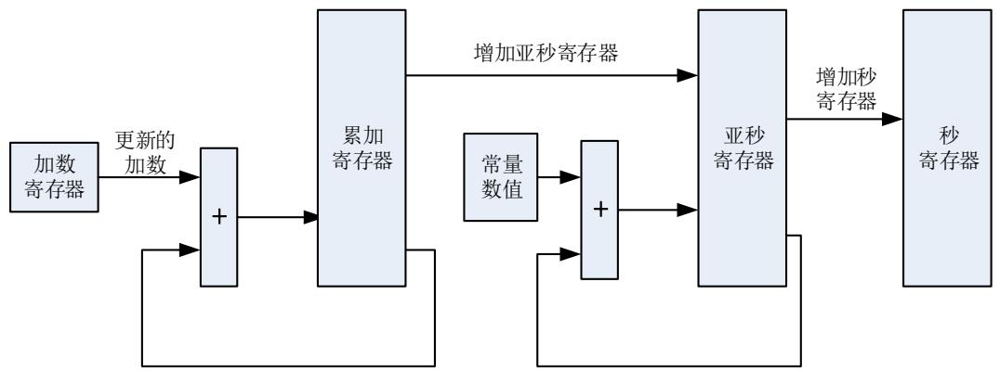


下面是一个具体例子用于说明精调方式如何更新系统时间：

假设系统时钟更新电路的精度需要达到25ns，即更新的频率为40MHz。假设基准时钟HCLK是72MHz，计算频率比得72 / 40 = 1.8。因此，写入ENET_PTP_TSADDEND寄存器的值应当是232 / 1.8，等于0x8E38 E38E。如果基准时钟频率漂低，假设降至68MHz，此时频率比变成68/40= 1.7，写入ENET_PTP_TSADDEND寄存器的值应当是232 / 1.7 = 0x9696 9697。如果基准时钟漂高，假设升到76MHz，写入到ENET_PTP_TSADDEND寄存器的值应当是 $2 ^ { 3 2 } / \ 1 . 9 \ =$ 0x86BC A1AF。初始时，将加数寄存器设为从时钟频率Clock Addend Value(0)，该值按上述进行计算。除了配置加数计数器之外，还需对亚秒递增寄存器进行设置才能保证达到25ns的精度 。 每 次 累 加 寄 存 器 溢 出 后 ， 该 寄 存 器 的 值 会 对 时 间 戳 低 寄 存 器 进 行 更 新 。因 为ENET_PTP_TSL寄存器中的STMSS[30:0]位表示系统时间的亚秒值，其精度为109ns / 231 =0.46ns。所以为了使系统时间精度达到25ns，亚秒递增寄存器的值应该设为25 / 0.46 = 0d54。

注意：下文描述的算法是以主从设备之间传输的时延Master-to-Slave-Delay恒定为基础的，通过该算法在若干个Sync周期内确定同步频率比。

算法如下：

定义主设备发送一个SYNC消息到从设备时的时间：MSYNCT(n)

定义从设备的本地时间SLOCALT(n)

定义主设备的本地时间MLOCALT(n)

$\mathtt { i } + \mathtt { i } \mathtt { E F } : \ \mathsf { M L O C A L T } ( \mathsf { n } ) = \mathsf { M S Y N C T } ( \mathsf { n } ) + \mathsf { M a s t e r - t o - S l a v e - D e l a y } ( \mathsf { n } )$ 

定义发送两次SYNC消息之间的主设备时钟计数：MCLOCKC(n)

计算：MCLOCKC(n) = MLOCALT(n) – MLOCALT(n-1)

定义接收两次SYNC消息之间的从设备时钟计数：SCLOCKC(n)

计算：SCLOCKC (n) = SLOCALT (n) - SLOCALT (n-1)

定义两个计算之间的差值：DIFFCC(n)

计算：DIFFCC(n) = MCLOCKC(n) - SCLOCKC(n)

定义从时钟频率调整系数：SCFAF(n)

$\mathtt { i } \mathtt { i } \mathtt { E q } : \mathtt { S C F A F ( n ) } = \left( \mathsf { M C L O C K C ( n ) } + \mathsf { D I F F C C ( n ) } \right) / \mathtt { S C L O C K C ( n ) }$ 

定义加数寄存器的时钟加数值：Clock Addend Value(n)

Clock Addend Value (n) = SCFAF (n) * Clock Addend Value (n-1) 

注意：实际操作中，可能需要多个SYNC消息来完成主从设备的同步。

## 系统时间初始化流程

设置ENET_PTP_TSCTL寄存器的位TMSEN为’1’，可以使能时间戳功能。不过在把该位置’1’以后，必须首先初始化时间戳计数器来开始时间戳操作。初始化步骤如下：

1) 置位ENET_MAC_INTMSK寄存器的TMSTIM位，以屏蔽时间戳触发中断；

2) 置位ENET_PTP_TSCTL寄存器的TMSEN位，以使能时间戳；

3) 根据期望时钟精度配置亚秒递增寄存器；

4) 若希望采用精调校准方式，则配置时间戳加数寄存器，并置位ENET_PTP_TSCTL寄存器的TMSARU位。若希望采用粗调校准方式，则忽略第4-6步，直接跳至第7步；

5) 轮询ENET_PTP_TSCTL寄存器的位TMSARU，直到其变为’0’；

6) 将ENET_PTP_TSCTL寄存器的TMSFCU位置位，来选择使用精调校准方式；

7) 把希望设置的系统时间值写入时间戳更新高寄存器和时间戳更新低寄存器；

8) 置位ENET_PTP_TSCTL寄存器的TMSSTI位，以初始化时间戳；

9) 一旦初始化成功后，时间戳计数器就开始工作。

## 系统时间更新步骤

## 粗调方式

1) 在时间戳更新高寄存器和时间戳更新低寄存器中写入偏移值（可以是负值）；

2) 置位ENET_PTP_TSCTL寄存器的TMSSTU位，以更新时间戳寄存器；

3) 轮询TMSSTU位，直到其被清’0’后完成。

## 精调方式

1) 利用前述” ”介绍的算法，计算出期望的系统时钟频率所对应的加数寄存器的值；

2) 将值写入加数计数器，并设置ENET_PTP_TSCTL寄存器的TMSARU位为’1’将该值更新到PTP模块；

3) 把要求的期望时间写入期望时间高和期望时间低寄存器，并设置ENET_MAC_INTMSK寄存器的TMSTIM位为’0’来允许时间戳中断；

4) 设置ENET_PTP_TSCTL寄存器的TMSITEN位为’1’使能时间戳中断；

5) 在这个事件产生中断时，读出ENET_MAC_INTF寄存器的值以清除相应的中断标志位；

6) 重新用旧值编写时间戳加数寄存器，并设置ENET_PTP_TSCTL寄存器的TMSARU位为’1’将值更新到PTP模块。

## 带 PTP功能的帧的发送与接收

在使能了IEEE 1588(PTP)时间戳功能后，在发送帧的帧首界定码从MAC输出或者MAC接收到帧的帧首界定码的时候，时间戳值被记录。每一个等待发送的帧在DMA发送描述符中都有一个标志，指示是否需要记录这个帧的时间戳，这与发送的帧是否为PTP帧无关。若ENET_PTP_TSCTL寄存器的位ARFSEN为’1’，则所有接收到的帧的时间戳都将被记录。如果ARFSEN位为’0’，则通过地址过滤的接收帧需要与ENET_PTP_TSCTL寄存器的配置进行匹配。换句话说，只有与PTP配置相匹配的帧才标记为一个PTP帧，并且同时记录时间戳值到描述符中。鉴别接收帧是否为PTP帧，接收帧中的PTP版本需要与PFSV位相符，并且对应的帧类型使能位（寄存器ENET_PTP_TSCTL中的位13到位11）要置位。特殊地，对于非IP数据包的PTP帧（普通802.3以太网帧的PTP），以太网帧的目标地址域需要为特殊的MAC地址（比如对于PDELAY_REQ / PDELAY_RESP / PDELAY_RESP_ FOLLOW_UP消息类型，目标地址应为0x0E00 00C2 8001，对于其他的消息类型，目标地址应为0x0000 0019 1B01，详细信息请参考IEEE1588-2008规范）。同时，为了增强灵活性，如果MAFEN位置位，除了上述两个特殊地址以外，MAC1-3寄存器中SAF位为复位状态的地址也可以认为是特殊地址。

记录下来的时间戳会和帧的发送/接收状态信息一起，存放在相应的发送/接收描述符里。64位的发送帧时间戳写入DMA发送描述符，64位的接收帧时间戳写入DMA接收描述符。具体描述见后续的” IEEE 1588 TxDMA ”和” IEEE1588 RxDMA”。

## 内部连接触发

MAC可以在系统时间大于等于期望时间的时候提供触发中断。使用中断会引入一段已知的中断时延再加上不确定的命令执行时间。为了计算这部分已知的中断时延时间，在系统时间大于期望值的时候，PTP会将一个输出信号置高。将AFIO_PCF0寄存器的TIMER1ITI1_REMAP位设为0，可将此输出信号内部连接到TIMER1的ITI1输入上。利用这个信号，由于TIMER1的时钟与PTP基准时钟(HCLK)是同步的，因此不再有任何不确定的误差。

## PPS 输出信号

将AFIO_PCF0寄存器中的PTP_PPS_REMAP位置1，可以使能PPS输出功能。该功能可以输出脉冲宽度为默认125ms的脉冲，用于检查网络全部节点之间的同步。为了测试本地从时钟和主时钟之间的差别，可以把主从设备的PPS（秒脉冲）输出都连接到示波器，以测量2个时钟之间的差别。

## 23.3.7. 典型的以太网配置流程示例

在上电复位或系统复位之后，应用程序可按以下的典型操作流程来配置并启动以太网模块：

使能以太网时钟：

配置RCU模块来使能HCLK时钟和以太网发送/接收时钟。

配置通讯接口：

配置AFIO_PCF0，选择接口模式(MII或RMII)；

配置GPIO模块，将相应的功能脚映射到复用功能上。

等待复位完成：

轮询 ENET_DMA_BCTL 寄存器直到 SWR 位复位（SWR 位在上电复位后或系统复位后默认置位）。

获取并配置PHY寄存器参数：

根据 HCLK 频率，配置 SMI 时钟频率，并访问 PHY 寄存器获取 PHY 的信息（例如是否支持半/全双工，是否支持 10M/100Mbit 速度等等）。根据外部 PHY 支持的模式，配置ENET_MAC_CFG 寄存器使与 PHY 寄存器信息一致。

初始化以太网DMA模块用于数据传输：

配 置 ENET_DMA_BCTL ， ENET_DMA_RDTADDR ， ENET_DMA_TDTADDR 和ENET_DMA_CTL 寄存器，完成 DMA 模块初始化（详细信息请参考 DMA 章节）。

初始化用于存放描述符列表以及数据缓存的物理内存空间：

根据 ENET_DMA_RDTADDR 和 ENET_DMA_TDTADDR 寄存器中的地址，初始化发送和接收描述符(DAV=1)，以及数据缓存。

使能MAC和DMA模块，开始发送和接收：

置位 ENET_MAC_CFG 寄存器中的 TEN 和 REN 位，开启 MAC 发送器和接收器。置位ENET_DMA_CTL 寄存器中的 STE 位和 SRE 位，使能 DMA 的发送和接收。

如果有帧要发送：

1) 选择一个或多个描述符发送描述符，将发送帧数据写到发送描述符中指定的缓存地址中；

2) 将这些发送帧描述符中的 DAV位置位；

3) 写入任意值到 ENET_DMA_TPEN 寄存器中，使 TxDMA退出挂起模式，开始发送数

据；

4) 有两种方法来确定当前帧是否发送完毕。第一种方法为轮询当前描述符的 DAV 位直到其复位；第二种方法仅适用于当 INTC 位为 1 的情况，应用程序可以轮询ENET_DMA_STAT 寄存器的 TS 位直到其置位。

## 如果有帧要接收：

1) 查看描述符列表中的第一个接收描述符（其地址在 ENET_DMA_RDTADDR 寄存器中配置）；

2) 如果接收描述符 0 的 DAV 位复位，则说明描述符已被使用过，且接收缓存空间已存储了接收帧；

3) 处理接收帧数据；

4) 置位当前描述符的 DAV位，以复用当前描述符接收新的帧；

5) 查看列表中的下一个描述符，跳到步骤 2。

## 23.3.8. 以太网中断

以太网部分一共有2个中断向量，一个用于以太网正常操作，另一个用于映射到EXTI线19的以太网唤醒事件(检测唤醒帧或者Magic Packet)。

第一个中断向量用于由MAC和DMA产生的中断。关于MAC 和DMA 的详细介绍请看下文。

第二个中断向量用于WUM模块在唤醒事件时产生的中断，唤醒事件为远程唤醒帧接收事件或Magic Packet唤醒帧接收事件。唤醒事件映射到EXTI线19上，若使能了EXTI线19的上升沿中断，则唤醒事件可以使微控制器退出深度睡眠模式。此外，若使能了WUM中断，则EXTI线19中断和以太网中断都会被触发。

注意：由于WUM寄存器位于RX_CLK域，在应用程序读WUM寄存器后，到这些标志位被清除可能会有可观的延迟（延迟由HCLK和RX_CLK时钟频率之间差异决定）。为避免两次进入同一个中断，强烈建议应用程序在中断里等待唤醒帧接收标志位WUFR和Magic Packet接收标志位MPKR变为0后，再退出中断服务程序。

## MAC 中断

MAC控制器有多个中断触发源。ENET_MAC_INTF寄存器描述了所有可产生的MAC中断类型，每个位都有对应的中断屏蔽位来防止某一事件引发中断。MAC中断信号为MAC所有中断的逻辑或。


图 23-13. MAC 控制器中断示意图


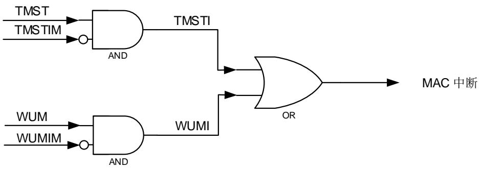


## DMA 中断

DMA控制器有两种类型中断事件：正常类和异常类。

无论什么类型的中断事件，都具有相应的中断使能位（屏蔽位）来控制是否产生中断。当所有中断事件都被清除，或中断使能位被清除，则相应的中断汇总位也被清除。如果正常类和异常类中断都被清除，则DMA中断将被清除。

23-14. 示意了以太网模块的中断连接：


图 23-14. 以太网中断示意图


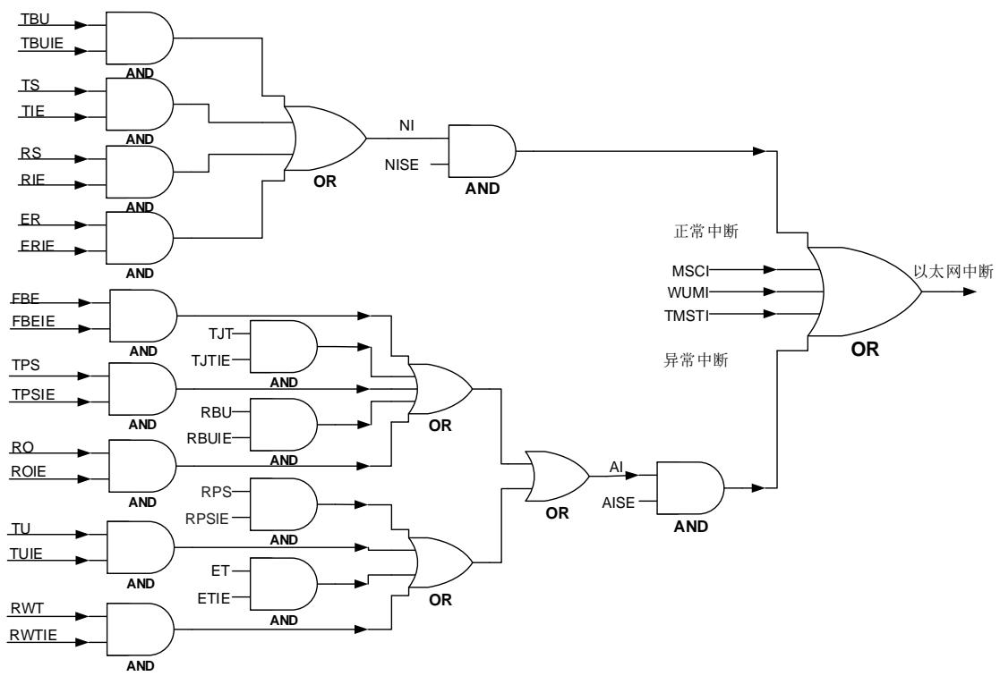


## 1：复位 MAC 所有内核寄存器

## 23.4.46. DMA 发送查询使能寄存器（ENET_DMA_TPEN）

地址偏移：0x1004

复位值：0x0000 0000

该寄存器可以按字节（8位）、半字（16位）或字（32位）访问。

该寄存器用于TxDMA对发送描述符列表的查询。TxDMA通常因为发送帧的数据下溢错误或者描述符被CPU占有(DAV=0)而进入暂停状态。可以对该寄存器写任意值使能发送查询。

<table><tr><td>31</td><td>30</td><td>29</td><td>28</td><td>27</td><td>26</td><td>25</td><td>24</td><td>23</td><td>22</td><td>21</td><td>20</td><td>19</td><td>18</td><td>17</td><td>16</td></tr><tr><td colspan="16">TPE[31:16]</td></tr><tr><td colspan="16">rw_wt</td></tr><tr><td>15</td><td>14</td><td>13</td><td>12</td><td>11</td><td>10</td><td>9</td><td>8</td><td>7</td><td>6</td><td>5</td><td>4</td><td>3</td><td>2</td><td>1</td><td>0</td></tr><tr><td colspan="16">TPE[15:0]</td></tr></table>


rw_wt 


<table><tr><td>位/位域</td><td>名称</td><td>描述</td></tr><tr><td>31:0</td><td>TPE[31:0]</td><td>发送查询使能位对这些位写任意值,DMA使能发送查询,将查询当前描述符(描述符地址在ENET_DMA_CTDADDR寄存器中)是否被CPU占有。如果不是(DAV=1),则描述符可用,DMA退出暂停状态并恢复工作。如果是(DAV=0),则TxDMA回到暂停状态,并把ENET_DMA_STAT的位TBU置’1’。</td></tr></table>

## 23.4.47. DMA 接收查询使能寄存器（ENET_DMA_RPEN）

地址偏移：0x1008

复位值：0x0000 0000

该寄存器可以按字节（8位）、半字（16位）或字（32位）访问。

该寄存器用于RxDMA对接收描述符列表的查询。对该寄存器写任意值可以使能接收查询。

<table><tr><td>31</td><td>30</td><td>29</td><td>28</td><td>27</td><td>26</td><td>25</td><td>24</td><td>23</td><td>22</td><td>21</td><td>20</td><td>19</td><td>18</td><td>17</td><td>16</td></tr><tr><td colspan="16">RPE[31:16]</td></tr><tr><td colspan="16">rw_wt</td></tr><tr><td>15</td><td>14</td><td>13</td><td>12</td><td>11</td><td>10</td><td>9</td><td>8</td><td>7</td><td>6</td><td>5</td><td>4</td><td>3</td><td>2</td><td>1</td><td>0</td></tr><tr><td colspan="16">RPE[15:0]</td></tr></table>


rw_wt 


<table><tr><td>位/位域</td><td>名称</td><td>描述</td></tr><tr><td>31:0</td><td>RPE[31:0]</td><td>接收查询使能位对这些位写任意值,DMA使能接收查询,将查询当前描述符(描述符地址在ENET_DMA_CRDADDR寄存器中)是否被CPU占有。如果不是(DAV=1),则描述符可用,DMA退出暂停状态并恢复工作。如果是(DAV=0),则TxDMA回到暂停</td></tr></table>

状态，并把 ENET_DMA_STAT 的位 RBU 置’1’。

## 23.4.48. DMA 接收描述符列表地址寄存器（ENET_DMA_RDTADDR）

地址偏移：0x100C

复位值：0x0000 0000

该寄存器可以按字节（8位）、半字（16位）或字（32位）访问。

接收描述符列表寄存器指向接收描述符队列的开始。描述符队列位于物理内存，并且其地址必须字对齐。只有在接收停止的时候，才允许写该寄存器。在开启RxDMA接收流程之前，必须正确配置该寄存器。

<table><tr><td>31</td><td>30</td><td>29</td><td>28</td><td>27</td><td>26</td><td>25</td><td>24</td><td>23</td><td>22</td><td>21</td><td>20</td><td>19</td><td>18</td><td>17</td><td>16</td></tr><tr><td colspan="16">SRT[31:16]</td></tr><tr><td colspan="16">rw</td></tr><tr><td>15</td><td>14</td><td>13</td><td>12</td><td>11</td><td>10</td><td>9</td><td>8</td><td>7</td><td>6</td><td>5</td><td>4</td><td>3</td><td>2</td><td>1</td><td>0</td></tr><tr><td colspan="16">SRT[15:0]</td></tr></table>


rw


<table><tr><td>位/位域</td><td>名称</td><td>描述</td></tr><tr><td>31:0</td><td>SRT[31:0]</td><td>接收队列基址这些位包含了接收描述符队列第一个描述符的地址。SRT[1:0]的取值默认为&#x27;0&#x27;,因此 SRT[1:0]这两个最低位是只读的。</td></tr></table>

## 23.4.49. DMA 发送描述符列表地址寄存器（ENET_DMA_TDTADDR）

地址偏移：0x1010

复位值：0x0000 0000

该寄存器可以按字节（8位）、半字（16位）或字（32位）访问。

该寄存器指向发送描述符队列的起始。描述符队列位于物理内存，并且其地址必须字对齐。

只有在发送停止的时候，才允许写该寄存器。在开启TxDMA发送流程之前，必须正确配置该寄存器。

<table><tr><td>31</td><td>30</td><td>29</td><td>28</td><td>27</td><td>26</td><td>25</td><td>24</td><td>23</td><td>22</td><td>21</td><td>20</td><td>19</td><td>18</td><td>17</td><td>16</td></tr><tr><td colspan="16">STT[31:16]</td></tr><tr><td colspan="16">rw</td></tr><tr><td>15</td><td>14</td><td>13</td><td>12</td><td>11</td><td>10</td><td>9</td><td>8</td><td>7</td><td>6</td><td>5</td><td>4</td><td>3</td><td>2</td><td>1</td><td>0</td></tr><tr><td colspan="16">STT[15:0]</td></tr></table>


rw


<table><tr><td>位/位域</td><td>名称</td><td>描述</td></tr><tr><td>31:0</td><td>STT[31:0]</td><td>发送队列基址这些位包含了发送描述符列表第一个描述符的地址。STT[1:0]的取值默认为&#x27;0&#x27;,因此 STT[1:0]这两个最低位是只读的。</td></tr></table>

## 23.4.50. DMA 状态寄存器（ENET_DMA_STAT）

地址偏移：0x1014

复位值：0x0000 0000

该寄存器可以按字节（8位）、半字（16位）或字（32位）访问。

该寄存器表示DMA的状态位。读ENET_DMA_STAT寄存器并不能清除其中的标志位。对寄存器位[16:0]（除保留位）需要写’1’才能清除，而写’0’是无效的。通过设置ENET_DMA_INTEN寄存器里的相应位，可以屏蔽位[16:0]触发的中断。

<table><tr><td>31</td><td>30</td><td>29</td><td>28</td><td>27</td><td>26</td><td>25</td><td>24</td><td>23</td><td>22</td><td>21</td><td>20</td><td>19</td><td>18</td><td>17</td><td>16</td></tr><tr><td colspan="2">保留</td><td>TST</td><td>WUM</td><td>MSC</td><td>保留</td><td colspan="3">EB[2:0]</td><td colspan="3">TP[2:0]</td><td colspan="3">RP[2:0]</td><td>NI</td></tr><tr><td colspan="2"></td><td>r</td><td>r</td><td>r</td><td></td><td colspan="3">r</td><td colspan="3">r</td><td colspan="3">r</td><td>rc_w1</td></tr><tr><td>15</td><td>14</td><td>13</td><td>12</td><td>11</td><td>10</td><td>9</td><td>8</td><td>7</td><td>6</td><td>5</td><td>4</td><td>3</td><td>2</td><td>1</td><td>0</td></tr><tr><td>AI</td><td>ER</td><td>FBE</td><td colspan="2">保留</td><td>ET</td><td>RWT</td><td>RPS</td><td>RBU</td><td>RS</td><td>TU</td><td>RO</td><td>TJT</td><td>TBU</td><td>TPS</td><td>TS</td></tr><tr><td>rc_w1</td><td>rc_w1</td><td>rc_w1</td><td colspan="2"></td><td>rc_w1</td><td>rc_w1</td><td>rc_w1</td><td>rc_w1</td><td>rc_w1</td><td>rc_w1</td><td>rc_w1</td><td>rc_w1</td><td>rc_w1</td><td>rc_w1</td><td>rc_w1</td></tr></table>

<table><tr><td>位/位域</td><td>名称</td><td>描述</td></tr><tr><td>31:30</td><td>保留</td><td>必须保持复位值。</td></tr><tr><td>29</td><td>TST</td><td>时间戳触发状态该位指示发生了一个时间戳中断事件。通过清除TMST标志,可以清零该位。当该位置&#x27;1&#x27;时,如果相应中断屏蔽位复位,则产生中断。0:未发生时间戳中断事件1:发生了时间戳中断事件</td></tr><tr><td>28</td><td>WUM</td><td>WUM状态该位指示发生了一个WUM事件。当两个事件触发源状态都被清除时,可以清零该位。当该位置&#x27;1&#x27;时,如果相应中断屏蔽位复位,则产生中断。0:WUM模块未发生中断事件1:WUM模块发生了中断事件</td></tr><tr><td>27</td><td>MSC</td><td>MSC状态该位指示发生了一个MSC事件。当所有事件触发源状态都被清除时,可以清零该位。当该位置&#x27;1&#x27;时,如果相应中断屏蔽位复位,则产生中断。0:MSC模块未发生中断事件1:MSC模块发生了中断事件</td></tr><tr><td>26</td><td>保留</td><td>必须保持复位值。</td></tr><tr><td>25:23</td><td>EB[2:0]</td><td>错误位状态当FBE=1时,这些位将对AHB总线上的总线响应错误进行错误类型解析。EB[0]:1:TxDMA传输数据时出错0:RxDMA传输数据时出错EB[1]:1:读数据转发时出错0:写数据转发时出错</td></tr></table>

## EB[2]：

1：访问描述符时出错

0：访问数据缓存时出错

## 22:20 TP[2:0]

## 发送流程状态

这些位表示 TxDMA 的状态

0x0：停止，接到复位或者停止发送命令。

0x1：运行，正在取发送描述符。

0x2：运行，正在等待状态信息。

0x3：运行，正在读取内存中数据并存入 TxFIFO 中。

0x4，0x5：保留

0x6：暂停，发送描述符不可用或发送缓存数据下溢。

0x7：运行，正在关闭发送描述符。

## 19:17 RP[2:0]

## 接收流程状态

这些位表示 RxDMA 的状态

0x0：停止，接到复位或者停止接收命令。

0x1：运行，正在取接收描述符。

0x2：保留

0x3：运行，正在等待接收数据包。

0x4：暂停，接收描述符不可用。

0x5：运行，正在关闭接收描述符。

0x6：保留

0x7：运行，正在把接收到数据包从 RxFIFO 转发到内存中。

## 16 NI

## 正常中断汇总

该位是下列位在相应中断使能位（ENET_DMA_INTEN 寄存器）使能了的情况下，其各取值的逻辑或：

TS：发送中断

TBU：发送缓存不可用

RS：接收中断

ER：提前接收中断

注意：该位置’1’后，只有把造成该位置’1’的位清’0’(写’1’)，才能把该位清’0’。

## 15 AI

## 异常中断汇总

该位是下列位在相应中断使能位（ENET_DMA_INTEN 寄存器）使能了的情况下，其各取值的逻辑或：

TPS：发送流程停止

TJT：发送 Jabber 超时

RO：RxFIFO 上溢

TU：发送数据下溢

RBU：接收缓存不可用

RPS：接收流程停止

RWT：接收看门狗超时

ET：提前发送中断

FBE：总线致命错误

注意：该位置’1’后，只有把造成该位置’1’的位清’0’(写’1’)，才能把该位清’0’。

14 ER 提前接收状态

在接收中断位 RS 置’1’时，该位自动清’0’

0：未接收到帧数据

1：接收到的数据帧已由 DMA 填满了第一个缓存

13 FBE 总线致命错误状态

该位指示发生了一个 AHB 接口响应错误，其错误类型可以由 EB[2:0]位进行解释。

0：未发生总线错误

1：发生了总线错误，相应的 DMA 控制器停止所有操作

12:11 保留 必须保持复位值。

10 ET 提前发送状态

0：发送的帧还未完全传输到 TxFIFO 中

1：发送的帧已经完全传输到 TxFIFO 中

9 RWT 接收看门狗超时状态

0：接收到的帧长度小于 2048字节

1：接收到的帧长度超过 2048字节

8 RPS 接收流程停止状态

0：接收流程未停止

1：接收流程进入停止状态

7 RBU 接收缓存不可用状态

0：下一个接收描述符的 DAV位为’1’

1：下一个接收描述符的 DAV位为’0’，RxDMA 进入暂停状态。

6 RS 接收状态

0：帧接收未完成

1：帧接收完成

5 TU 发送数据下溢状态

0：未发生发送数据下溢错误

1：发送帧的过程中发生数据下溢，同时发送进入暂停状态。

4 RO 接收上溢状态

0：未发生接收数据上溢错误

1：接收帧的过程中发生上溢错误。如果已有一部分帧数据转发到内存，则设置接收描述符 0 的上溢错误位 OERR为’1’。

3 TJT 发送 Jabber 超时状态

0：未发生发送 Jabber 定时器超时事件

1：发送 Jabber 定时器超时。此时中止发送进程并进入停止状态，同时设置发送描述符 0 的 Jabber 超时位 JT 为’1’。

2 TBU 发送缓存不可用状态

0：下一个发送描述符的 DAV位为’1’

1：下一个发送描述符的 DAV位为’0’，TxDMA 进入暂停状态。

1 TPS 发送流程停止状态

0：发送未停止

1：发送停止

0 TS 发送状态

该位仅在发送描述符 0 中 LSG和 INTC 位都置位时，才可被置位。

0：当前帧发送未完成

1：当前帧发送完成

## 23.4.51. DMA 控制寄存器（ENET_DMA_CTL）

地址偏移：0x1018

复位值：0x0000 0000

该寄存器可以按字节（8位）、半字（16位）或字（32位）访问。

该寄存器设定了接收和发送的工作模式和命令。在整个DMA的初始化流程中，应当最后写该寄存器。

<table><tr><td>31</td><td>30</td><td>29</td><td>28</td><td>27</td><td>26</td><td>25</td><td>24</td><td>23</td><td>22</td><td>21</td><td>20</td><td>19</td><td>18</td><td>17</td><td>16</td></tr><tr><td colspan="5">保留</td><td>DTCERFD</td><td>RSFD</td><td>DAFRF</td><td colspan="2">保留</td><td>TSFD</td><td>FTF</td><td colspan="3">保留</td><td>TTHC[2]</td></tr><tr><td colspan="5"></td><td>rw</td><td>rw</td><td>rw</td><td colspan="2"></td><td>rw</td><td>rs</td><td colspan="3"></td><td>rw</td></tr><tr><td>15</td><td>14</td><td>13</td><td>12</td><td>11</td><td>10</td><td>9</td><td>8</td><td>7</td><td>6</td><td>5</td><td>4</td><td>3</td><td>2</td><td>1</td><td>0</td></tr><tr><td colspan="2">TTHC[1:0]</td><td>STE</td><td colspan="5">保留</td><td>FERF</td><td>FUF</td><td>保留</td><td colspan="2">RTHC[1:0]</td><td>OSF</td><td>SRE</td><td>保留</td></tr><tr><td colspan="2">rw</td><td>rw</td><td colspan="5"></td><td>rw</td><td>rw</td><td></td><td colspan="2">rw</td><td>rw</td><td>rw</td><td></td></tr></table>


位/位域 名称 描述


<table><tr><td>31:27</td><td>保留</td><td>必须保持复位值。</td></tr><tr><td>26</td><td>DTCERFD</td><td>不丢弃 TCP/IP 校验和错误帧0:如果 FERF 位为'0',MAC 丢弃所有有错的帧。1:如果接收到帧仅有校验和错误时,MAC 不会丢弃该帧。</td></tr><tr><td>25</td><td>RSFD</td><td>接收存储转发0:RxFIFO 工作在直通模式,转发阈值由 RTHC 位决定。1:节后 FIFO 工作在存储转发模式,只有在帧完整写入 RxFIFO 后,RxDMA 才会把它转发给应用程序,此时 RTHC 位的取值会被忽略。</td></tr><tr><td>24</td><td>DAFRF</td><td>不清空接收帧0:当接收描述符不可用时,RxDMA 就清空 RxFIFO 里的接收帧。1:RxDMA 不清空接收帧,即使接收描述符不可用。</td></tr><tr><td>23:22</td><td>保留</td><td>必须保持复位值。</td></tr><tr><td>21</td><td>TSFD</td><td>发送存储转发0:TxFIFO 工作在直通模式,发送阈值由 ENET_DMA_CTL 寄存器中的 TTHC 位决定。1:TxFIFO 工作在存储转发模式,只有在帧完整写入 TxFIFO 后,MAC 才会把其发送出去,TTHC位的取值会被忽略。注意:在发送处于停止状态时,可以修改该位。</td></tr><tr><td>20</td><td>FTF</td><td>清空TxFIFO当此位为1时,TxFIFO控制逻辑电路被复位到初始状态,TxFIFO里所有的数据被清空/丢失。在清空操作完成后该位被自动清'0'。注意:在该位为'0'之前,不允许写ENET_DMA_CTL寄存器。</td></tr><tr><td>19:17</td><td>保留</td><td>必须保持复位值。</td></tr><tr><td>16:14</td><td>TTHC[2:0]</td><td>发送阈值控制这三位控制直通模式下TxFIFO的阈值。当TSFD=1时,忽略这些位。0x0:640x1:1280x2:1920x3:2560x4:400x5:320x6:240x7:16</td></tr><tr><td>13</td><td>STE</td><td>开始/停止发送0:在发送完当前帧或TxDMA进入暂停状态后,发送进程进入停止模式。保存发送描述符队列里下一发送描述符的位置,在传输重新开始时,这个描述符就变成当前描述符。1:TxDMA进入运行状态。DMA获取当前发送描述符,发送帧描述符可从ENET_DMA_TDTADDR基址获取,若上一次发送为停止状态,则也可从发送描述符队列的指针位置获取。如果当前描述符的DAV位为'0',则TxDMA进入暂停状态,并设置TBU位为'1'。如果在未设置完其他DMA寄存器的情况下就置位该位,则会引起不可预料的后果。</td></tr><tr><td>12:8</td><td>保留</td><td>必须保持复位值。</td></tr><tr><td>7</td><td>FERF</td><td>转发错误帧0:当RxFIFO工作于直通模式(RSFD=0)时,如果在将RxFIFO数据转发到内存之前检测到了帧错误(CRC错误、冲突错误、校验和错误、看门狗超时、溢出),则RxFIFO会丢弃这个错误的帧。但如果在将RxFIFO数据转发到内存之后才检测到了帧错误,则就不会丢弃该帧。当RxFIFO工作于存储转发模式时,在接收过程中一旦检测到帧错误,就会丢弃该帧。1:除了过短帧外的所有帧都会转发给DMA</td></tr><tr><td>6</td><td>FUF</td><td>转发长度不够的"好"帧0:RxFIFO丢弃所有长度小于64字节的帧,但如果在检测到过短帧之前,帧已开始转发该帧给应用程序(例如在直通模式下,帧长小于接收阈值),则将转发整个帧。1:RxFIFO把长度不够的"好"帧(帧长小于64字节但没有错误)转发给应用程序</td></tr><tr><td>5</td><td>保留</td><td>必须保持复位值。</td></tr><tr><td>4:3</td><td>RTHC[1:0]</td><td>接收阈值控制这两位设置了在直通模式下 RxFIFO 的阈值。注意:只有在 RSFD 位(位 21)为'0'时,这些位才有效。在 RSFD 位为'1'时忽略这些位。0x0:640x1:320x2:960x3:128</td></tr><tr><td>2</td><td>OSF</td><td>操作第二帧0:TxDMA 仅在接收到前一个帧的发送状态信息后,才开始发送下一个帧的数据。1:TxDMA 在前一帧数据全部存入到 TxFIFO 之后,在接收到前一个帧的发送状态信息前,就开始发送下一个帧的数据。</td></tr><tr><td>1</td><td>SRE</td><td>开始/停止接收0:在转发完当前接收帧后,RxDMA 进入停止模式。保存接收描述符队列里下一接收描述符的位置,在传输重新开始时,这个描述符就变成当前描述符。只有在接收运行时或接收暂停时,可"停止接收"。1:把接收进程置为运行状态,DMA 检查接收描述符队列的当前位置,用来处理下一个收到的帧。接收帧描述符可从 ENET_DMA_RDTADDR 基址获取,若上一次接收为停止状态,则也可从接收描述符队列的指针位置获取。如果获取的描述符DAV=0,那么接收进程进入暂停状态,并设置 RBU 位为'1'。只有在接收停止时或接收暂停时,"开始接收"命令才有效。在未设置完所有其他 DMA 寄存器之前发出"开始接收"命令,会引起不可预料的后果。</td></tr><tr><td>0</td><td>保留</td><td>必须保持复位值。</td></tr></table>

## 23.4.52. DMA 中断使能寄存器（ENET_DMA_INTEN）

地址偏移：0x101C

复位值：0x0000 0000

该寄存器可以按字节（8位）、半字（16位）或字（32位）访问。

该寄存器可以使能ENET_DMA_STAT寄存器反映的中断。

<table><tr><td>31</td><td>30</td><td>29</td><td>28</td><td>27</td><td>26</td><td>25</td><td>24</td><td>23</td><td>22</td><td>21</td><td>20</td><td>19</td><td>18</td><td>17</td><td>16</td></tr><tr><td colspan="15">保留</td><td>NIE</td></tr><tr><td></td><td></td><td></td><td></td><td></td><td></td><td></td><td></td><td></td><td></td><td></td><td></td><td></td><td></td><td></td><td>rw</td></tr><tr><td>15</td><td>14</td><td>13</td><td>12</td><td>11</td><td>10</td><td>9</td><td>8</td><td>7</td><td>6</td><td>5</td><td>4</td><td>3</td><td>2</td><td>1</td><td>0</td></tr><tr><td>AIE</td><td>ERIE</td><td>FBEIE</td><td colspan="2">保留</td><td>ETIE</td><td>RWTIE</td><td>RPSIE</td><td>RBUIE</td><td>RIEN</td><td>TUIE</td><td>ROIE</td><td>TJTIE</td><td>TBUIE</td><td>TPSIE</td><td>TIE</td></tr><tr><td>rw</td><td>rw</td><td>rw</td><td></td><td></td><td>rw</td><td>rw</td><td>rw</td><td>rw</td><td>rw</td><td>rw</td><td>rw</td><td>rw</td><td>rw</td><td>rw</td><td>rw</td></tr></table>

<table><tr><td>位/位域</td><td>名称</td><td>描述</td></tr><tr><td>31:17</td><td>保留</td><td>必须保持复位值。</td></tr><tr><td>16</td><td>NIE</td><td>正常中断汇总使能</td></tr><tr><td></td><td></td><td>0:屏蔽正常中断1:使能正常中断该位使能下列位:TS:发送中断TBU:发送缓存不可用RS:接收中断ER:提前接收中断</td></tr><tr><td>15</td><td>AIE</td><td>异常中断汇总使能0:屏蔽异常中断1:使能异常中断该位使能下列位:TPS:发送流程停止TJT:发送Jabber超时RO:RxFIFO上溢TU:发送下溢RBU:接收缓存不可用RPS:接收流程停止RWT:接收看门狗超时ET:提前发送中断FBE:总线致命错误</td></tr><tr><td>14</td><td>ERIE</td><td>提前接收中断使能0:屏蔽提前接收中断1:使能早接收中断</td></tr><tr><td>13</td><td>FBEIE</td><td>总线致命错误中断使能0:屏蔽总线致命错误中断1:使能总线致命错误中断</td></tr><tr><td>12:11</td><td>保留</td><td>必须保持复位值。</td></tr><tr><td>10</td><td>ETIE</td><td>提前发送中断使能0:屏蔽提前发送中断1:使能提前发送中断</td></tr><tr><td>9</td><td>RWTIE</td><td>接收看门狗超时中断使能0:屏蔽接收看门狗超时中断1:使能接收看门狗超时中断</td></tr><tr><td>8</td><td>RPSIE</td><td>接收流程停止中断使能0:屏蔽接收流程停止中断1:使能接收流程停止中断</td></tr><tr><td>7</td><td>RBUIE</td><td>接收缓存不可用中断使能0:屏蔽接收缓存不可用中断1:使能接收缓存不可用中断</td></tr><tr><td>6</td><td>RIE</td><td>接收中断使能0:屏蔽接收中断1:使能接收中断</td></tr><tr><td>5</td><td>TUIE</td><td>发送下溢中断使能0:屏蔽发送数据下溢中断1:使能发送下溢中断</td></tr><tr><td>4</td><td>ROIE</td><td>接收上溢中断使能0:屏蔽接收上溢中断1:使能接收上溢中断</td></tr><tr><td>3</td><td>TJTIE</td><td>发送Jabber超时中断使能0:屏蔽发送Jabber超时中断1:使能发送Jabber超时中断</td></tr><tr><td>2</td><td>TBUIE</td><td>发送缓存不可用中断使能0:屏蔽发送缓存不可用中断1:使能发送缓存不可用中断</td></tr><tr><td>1</td><td>TPSIE</td><td>发送流程停止中断使能0:屏蔽发送流程停止中断1:使能发送流程停止中断</td></tr><tr><td>0</td><td>TIE</td><td>发送中断使能0:屏蔽发送中断1:使能发送中断</td></tr></table>

## 23.4.53. DMA 丢失帧和缓存溢出计数器寄存器（ENET_DMA_MFBOCNT）

地址偏移：0x1020

复位值：0x0000 0000

该寄存器可以按字节（8位）、半字（16位）或字（32位）访问。

DMA有2个计数器，用来统计接收过程中丢失帧的数目。可通过读本寄存器来获取计数器的当前值。这个计数器通常用作故障诊断。

<table><tr><td>31</td><td>30</td><td>29</td><td>28</td><td>27</td><td>26</td><td>25</td><td>24</td><td>23</td><td>22</td><td>21</td><td>20</td><td>19</td><td>18</td><td>17</td><td>16</td></tr><tr><td colspan="4">保留</td><td colspan="11">MSFA[10:0]</td><td>保留</td></tr><tr><td colspan="16">rc_r</td></tr><tr><td>15</td><td>14</td><td>13</td><td>12</td><td>11</td><td>10</td><td>9</td><td>8</td><td>7</td><td>6</td><td>5</td><td>4</td><td>3</td><td>2</td><td>1</td><td>0</td></tr><tr><td colspan="16">MSFC[15:0]</td></tr></table>


rc_r


<table><tr><td>位/位域</td><td>名称</td><td>描述</td></tr><tr><td>31:28</td><td>保留</td><td>必须保持复位值</td></tr><tr><td>27:17</td><td>MSFA[10:0]</td><td>应用程序丢失的帧</td></tr></table>


这些位指示了RxFIFO丢失的帧数目


<table><tr><td>16</td><td>保留</td><td>必须保持复位值。</td></tr><tr><td>15:0</td><td>MSFC[15:0]</td><td>控制器丢失的帧这些位表示了由于MCU的接收缓存不可用而导致RxDMA丢失的帧的数目。每当DMA清空一个输入帧时,这个计数器加1。</td></tr></table>

## 23.4.54. DMA 接收状态看门狗计数器寄存器 (ENET_DMA_RSWDC)

地址偏移：0x1024

复位值：0x0000 0000

该寄存器可以按字节（8位）、半字（16位）或字（32位）访问。

向该寄存器写入一个值，可在延时一段可配置的时间之后，使能针对RS位（ENET_DMA_STAT寄存器）的看门狗定时器。

<table><tr><td>31</td><td>30</td><td>29</td><td>28</td><td>27</td><td>26</td><td>25</td><td>24</td><td>23</td><td>22</td><td>21</td><td>20</td><td>19</td><td>18</td><td>17</td><td>16</td></tr><tr><td colspan="16">保留</td></tr><tr><td>15</td><td>14</td><td>13</td><td>12</td><td>11</td><td>10</td><td>9</td><td>8</td><td>7</td><td>6</td><td>5</td><td>4</td><td>3</td><td>2</td><td>1</td><td>0</td></tr><tr><td colspan="8">保留</td><td colspan="8">WDCFRS[7:0]</td></tr></table>


rw


<table><tr><td>位/位域</td><td>名称</td><td>描述</td></tr><tr><td>31:8</td><td>保留</td><td>必须保持复位值。</td></tr><tr><td>7:0</td><td>WDCFRS[7:0]</td><td>接收状态看门狗计数器这些位仅在DINTC位(RDES1)置位时有效。当DINTC=1时,并接收到一个帧,则RS位会在接收完毕后延时WDCFRS*256个HCLK时钟周期再置位。</td></tr></table>

## 23.4.55. DMA 当前发送描述符地址寄存器（ENET_DMA_CTDADDR）

地址偏移：0x1048

复位值：0x0000 0000

该寄存器可以按字节（8位）、半字（16位）或字（32位）访问。

当前发送描述符寄存器指向TxDMA正在读取的发送描述符起始地址。

<table><tr><td>31</td><td>30</td><td>29</td><td>28</td><td>27</td><td>26</td><td>25</td><td>24</td><td>23</td><td>22</td><td>21</td><td>20</td><td>19</td><td>18</td><td>17</td><td>16</td></tr><tr><td colspan="16">TDAP[31:16]</td></tr><tr><td colspan="16">r</td></tr><tr><td>15</td><td>14</td><td>13</td><td>12</td><td>11</td><td>10</td><td>9</td><td>8</td><td>7</td><td>6</td><td>5</td><td>4</td><td>3</td><td>2</td><td>1</td><td>0</td></tr><tr><td colspan="16">TDAP[15:0]</td></tr></table>

<table><tr><td>位/位域</td><td>名称</td><td>描述</td></tr></table>

<table><tr><td>31:0</td><td>TDAP[31:0]</td><td>发送描述符地址指针这些位在复位时清&#x27;0&#x27;,由 TxDMA 在操作过程中自动更新</td></tr></table>

## 23.4.56. DMA 当前接收描述符地址寄存器（ENET_DMA_CRDADDR）

地址偏移：0x104C

复位值：0x0000 0000

该寄存器可以按字节（8位）、半字（16位）或字（32位）访问。

当前接收描述符寄存器指向RxDMA正在读取的接收描述符起始地址。

<table><tr><td>31</td><td>30</td><td>29</td><td>28</td><td>27</td><td>26</td><td>25</td><td>24</td><td>23</td><td>22</td><td>21</td><td>20</td><td>19</td><td>18</td><td>17</td><td>16</td></tr><tr><td colspan="16">RDAP[31:16]</td></tr><tr><td colspan="16">r</td></tr><tr><td>15</td><td>14</td><td>13</td><td>12</td><td>11</td><td>10</td><td>9</td><td>8</td><td>7</td><td>6</td><td>5</td><td>4</td><td>3</td><td>2</td><td>1</td><td>0</td></tr><tr><td colspan="16">RDAP[15:0]</td></tr></table>

<table><tr><td>位/位域</td><td>名称</td><td>描述</td></tr><tr><td>31:0</td><td>RDAP[31:0]</td><td>接收描述符地址指针这些位在复位时清&#x27;0&#x27;,由 RxDMA 在操作过程中自动更新。</td></tr></table>

## 23.4.57. DMA 当前发送缓存地址寄存器（ENET_DMA_CTBADDR）

地址偏移：0x1050

复位值：0x0000 0000

该寄存器可以按字节（8位）、半字（16位）或字（32位）访问。

该寄存器指向TxDMA正在读取的发送缓存的地址。

<table><tr><td>31</td><td>30</td><td>29</td><td>28</td><td>27</td><td>26</td><td>25</td><td>24</td><td>23</td><td>22</td><td>21</td><td>20</td><td>19</td><td>18</td><td>17</td><td>16</td></tr><tr><td colspan="16">TBAP[31:16]</td></tr><tr><td colspan="16">r</td></tr><tr><td>15</td><td>14</td><td>13</td><td>12</td><td>11</td><td>10</td><td>9</td><td>8</td><td>7</td><td>6</td><td>5</td><td>4</td><td>3</td><td>2</td><td>1</td><td>0</td></tr><tr><td colspan="16">TBAP[15:0]</td></tr></table>

<table><tr><td>位/位域</td><td>名称</td><td>描述</td></tr><tr><td>31:0</td><td>TBAP[31:0]</td><td>发送缓存地址指针这些位在复位时清&#x27;0&#x27;,由 TxDMA 在工作过程中更新。</td></tr></table>

## 23.4.58. DMA 当前接收缓存地址寄存器（ENET_DMA_CRBADDR）

地址偏移：0x1054

复位值：0x0000 0000

该寄存器可以按字节（8位）、半字（16位）或字（32位）访问。

该寄存器地址指向RxDMA正在读取的接收缓存地址。

<table><tr><td>31</td><td>30</td><td>29</td><td>28</td><td>27</td><td>26</td><td>25</td><td>24</td><td>23</td><td>22</td><td>21</td><td>20</td><td>19</td><td>18</td><td>17</td><td>16</td></tr><tr><td colspan="16">RBAP[31:16]</td></tr><tr><td colspan="16">r</td></tr><tr><td>15</td><td>14</td><td>13</td><td>12</td><td>11</td><td>10</td><td>9</td><td>8</td><td>7</td><td>6</td><td>5</td><td>4</td><td>3</td><td>2</td><td>1</td><td>0</td></tr><tr><td colspan="16">RBAP[15:0]</td></tr></table>

<table><tr><td>位/位域</td><td>名称</td><td>描述</td></tr></table>

31:0 

RBAP[31:0] 

接收缓存地址指针

这些位在复位时清’0’，由 RxDMA 在工作过程中更新。

