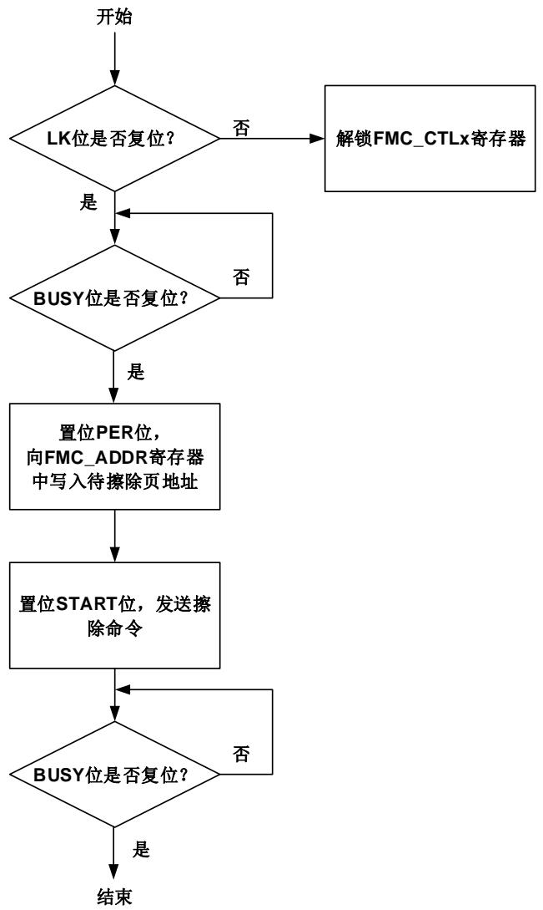
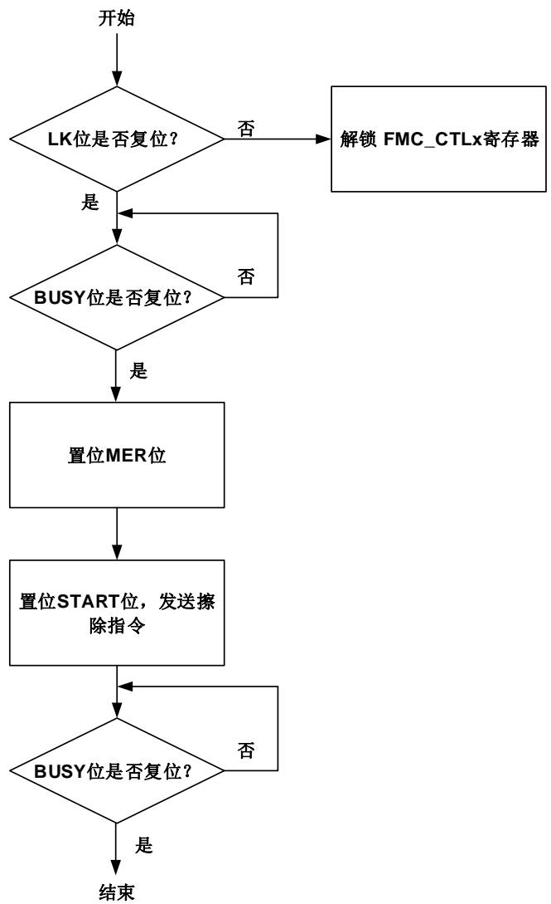
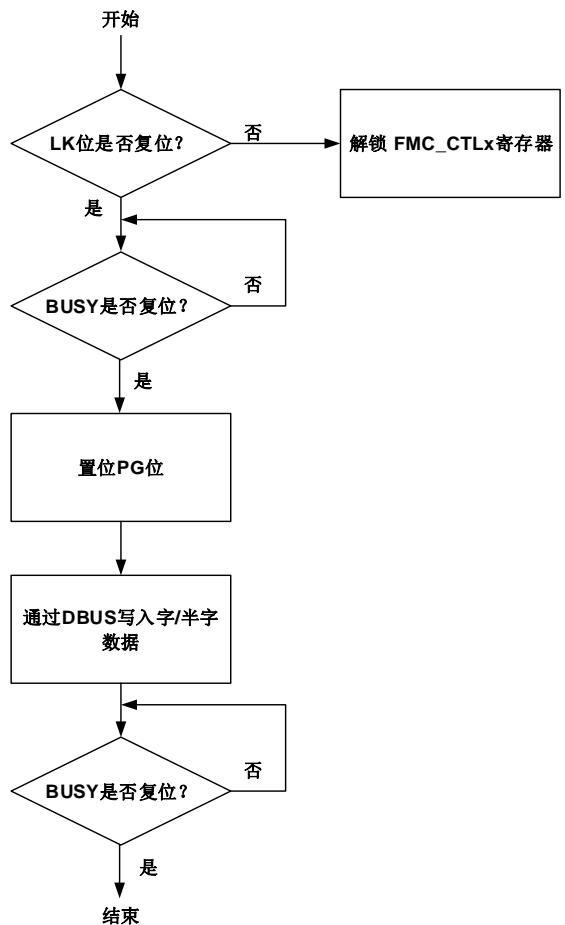

## 2. 闪存控制器（FMC）

## 2.1. 简介

闪存控制器（FMC），提供了片上闪存需要的所有功能。在闪存的前256K字节空间内，CPU执行指令零等待。FMC也提供了页擦除，整片擦除，以及32位整字/16位半字/位编程等闪存操作。

## 2.2. 主要特征

■ 高达3M字节的片上闪存可用于存储指令或数据；

在闪存的前256K字节空间内，CPU执行指令零等待，在此范围外，CPU读取指令存在较长延时；

■ 对于GD32F30x_CL和GD32F30x_XD，使用了两片闪存，前512KB容量在第一片闪存（bank0）中，后续的容量在第二片闪存（bank1）中；

对于主存储闪存容量不多于512KB的GD32F30x_CL和GD32F30x_HD，只使用了bank0。

对于GD32F30x_CL和GD32F30x_HD，GD32F30x_XD，bank0的闪存页大小为2KB，bank1的闪存页大小为4KB；

■ 支持32位整字/16位半字/位编程，页擦除和整片擦除操作；

■ 大小为16字节的可选字节块可根据用户需求配置；

■ 每次系统复位后选项字节中的内容将重新加载到选项字节控制寄存器中；

■ 具有安全保护状态，可阻止对代码或数据的非法读访问；

■ 具有擦除和编程保护状态，可阻止意外写操作。

## 2.3. 功能说明

## 2.3.1. 闪存结构

对于主存储闪存容量不多于512KB的GD32F30x_CL和GD32F30x_HD，闪存页大小为2KB。对于GD32F30x_CL和GD32F30x_XD，使用了两片闪存；前512KB容量在第一片闪存（bank0）中，后续的容量在第二片闪存（bank1）中。其中bank0的闪存页大小为2KB，bank1的闪存页大小为4KB。主存储闪存的每页都可以单独擦除。闪存结构见表2-1. GD32F30x_CL和GD32F30x_HD，GD32F30x_XD闪存基地址和构成。

表 2-1. GD32F30x_CL 和 GD32F30x_HD, GD32F30x_XD 闪存基地址和构成

<table><tr><td colspan="2">闪存块</td><td>名称</td><td>地址范围</td><td>大小(字节)</td></tr><tr><td rowspan="13" colspan="2">主存储闪存块</td><td>第0页</td><td>0x0800 0000 - 0x0800 07FF</td><td>2KB</td></tr><tr><td>第1页</td><td>0x0800 0800 - 0x0800 0FFF</td><td>2KB</td></tr><tr><td>第2页</td><td>0x0800 1000 - 0x0800 17FF</td><td>2KB</td></tr><tr><td>.</td><td>.</td><td>.</td></tr><tr><td>.</td><td>.</td><td>.</td></tr><tr><td>.</td><td>.</td><td>.</td></tr><tr><td>第255页</td><td>0x0807 F800 - 0x0807 FFFF</td><td>2KB</td></tr><tr><td>第256页</td><td>0x0808 0000 - 0x0808 0FFF</td><td>4KB</td></tr><tr><td>第257页</td><td>0x0808 1000 - 0x0808 1FFF</td><td>4KB</td></tr><tr><td>.</td><td>.</td><td>.</td></tr><tr><td>.</td><td>.</td><td>.</td></tr><tr><td>.</td><td>.</td><td>.</td></tr><tr><td>第895页</td><td>0x082F F000 - 0x082F FFFF</td><td>4KB</td></tr><tr><td rowspan="3">信息块</td><td>GD32F30x_HD</td><td rowspan="3">Boot loader区</td><td>0x1FFF F000- 0x1FFF F7FF</td><td>2KB</td></tr><tr><td>GD32F30x_XD</td><td>0x1FFF E000- 0x1FFF F7FF</td><td>6KB</td></tr><tr><td>GD32F30x_CL</td><td>0x1FFF B000- 0x1FFF F7FF</td><td>18KB</td></tr><tr><td colspan="2">可选字节块</td><td>可选字节</td><td>0x1FFF F800 - 0x1FFF F80F</td><td>16B</td></tr></table>

注意：信息块存储了引导装载程序（boot loader），不能被用户编程或擦除。

## 2.3.2. 读操作

闪存可以像普通存储空间一样直接寻址访问。对闪存取指令和取数据分别使用CPU的IBUS或DBUS总线。

## 2.3.3. FMC_CTLx 寄存器解锁

复位后，FMC_CTL0寄存器进入锁定状态，LK位置为1。通过先后向FMC_KEY0寄存器写入0x45670123和0xCDEF89AB，可以使得FMC_CTL0寄存器解锁。两次写操作后，FMC_CTL0寄存器的LK位被硬件清0。可以通过软件设置FMC_CTL0寄存器的LK位为1再次锁定FMC_CTL0寄存器。任何对FMC_KEY0寄存器的错误操作都会将LK位置1，从而锁定FMC_CTL0寄存器，并引发一个总线错误。

FMC_CTL0寄存器的OBPG位和OBER位在FMC_CTL0寄存器第一层解锁后，仍然需要第二层解锁。第二层解锁过程也是两次写操作，向FMC_OBKEY寄存器先后写入0x45670123和0xCDEF89AB，然后硬件将FMC_CTL0寄存器的OBWEN位置1。软件可以将FMC_CTL0的OBWEN位清0来锁定FMC_CTL0的OBPG位和OBER位。

对于GD32F30x_CL和GD32F30x_XD，FMC_CTL0寄存器用来设置对bank0和选项字节块的操作，FMC_CTL1寄存器用来设置对bank1的擦写操作。FMC_CTL1的解锁和锁定机制和FMC_CTL0类似。对FMC_KEY1写解锁序列可解除FMC_CTL1的锁定。

## 2.3.4. 页擦除

FMC的页擦除功能使得主存储闪存的页内容初始化为高电平。每一页都可以被独立擦除，而不影响其他页内容。FMC擦除页步骤如下：

1. 确保FMC_CTLx寄存器不处于锁定状态;

2. 检查FMC_STATx寄存器的BUSY位来判定闪存是否正处于擦写访问状态，若BUSY位为1，则需等待该操作结束，BUSY位变为0；

3. 置位FMC_CTLx寄存器的PER位;

4. 将待擦除页的绝对地址（0x08XX XXXX）写到FMC_ADDRx寄存器；

5. 通过将FMC_CTLx寄存器的START位置1来发送页擦除命令到FMC;

6. 等待擦除指令执行完毕，FMC_STATx寄存器的BUSY位清0;

7. 如果需要，使用DBUS读并验证该页是否擦除成功。

当页擦除成功执行，FMC_STATx寄存器的ENDF位将置位。若FMC_CTLx寄存器的ENDIE位被置1，则FMC将触发一个中断。需要注意的是，用户需确保写入的是正确的擦除地址，否则当待擦除页的地址被用来取指令或访问数据时，软件将会跑飞。该情况下，FMC不会提供任何出错通知。另一方面，对擦写保护的页进行擦除操作将无效。如果FMC_CTLx寄存器的ERRIE位被置位，该操作将触发操作出错中断。中断服务程序可通过检测FMC_STATx寄存器的WPERR位来判断该中断是否发生。图2-1. 页擦除操作流程显示了页擦除操作流程。

图 2-1. 页擦除操作流程

对于GD32F30x_CL和GD32F30x_XD，FMC_STAT0寄存器反应对bank0和选项字节块的操作状态，FMC_STAT1反应对bank1的操作状态。对bank1的页擦除操作与对bank0的页擦除操作类似。需要注意的是，在安全保护状态下，对bank1的页擦除，需将地址同时写至FMC_ADDR1和FMC_ADDR0寄存器。

## 2.3.5. 整片擦除

FMC提供了整片擦除功能可以初始化主存储闪存块的内容。当设置FMC_CTL0寄存器中MER为1时，擦除过程仅作用于Bank0，当设置FMC_CTL1寄存器中MER为1时，擦除过程仅作用于Bank1，当设置FMC_CTL0和FMC_CTL1寄存器中MER为1时，擦除过程作用于整片闪存。整片擦除操作，寄存器设置具体步骤如下：

1. 确保FMC_CTLx寄存器不处于锁定状态；

2. 等待FMC_STATx寄存器的BUSY位变为0;

3. 如果单独擦除Bank0，置位FMC_CTL0寄存器的MER位。如果单独擦除Bank1，置位FMC_CTL1寄存器的MER位。如果整片擦除闪存，同时置位FMC_CTL0和FMC_CTL1寄存器的MER位；

4. 通过将FMC_CTLx寄存器的START位置1来发送整片擦除命令到FMC;

5. 等待擦除指令执行完毕，FMC_STATx寄存器的BUSY位清0；

6. 如果需要，使用DBUS读并验证是否擦除成功。

当整片擦除成功执行，FMC_STATx寄存器的ENDF位置位。若FMC_CTLx寄存器的ENDIE位被置1，FMC将触发一个中断。由于所有的闪存数据都将被复位为0xFFFF_FFFF，可以通过运行在SRAM中的程序或使用调试工具直接访问FMC寄存器来实现整片擦除操作。

对于GD32F30x_CL和GD32F30x_XD，对bank1的整片擦除操作与对bank0的整片擦除操作类似。

图2-2. 整片擦除操作流程显示了整片擦除操作流程。

图 2-2. 整片擦除操作流程

## 2.3.6. 主存储闪存块编程

FMC提供了一个32位整字/16位半字/位编程功能，用来修改主存储闪存块内容。编程操作使用各寄存器流程如下：

1. 确保FMC_CTLx寄存器不处于锁定状态;

2. 等待FMC_STATx寄存器的BUSY位变为0;

3. 置位FMC_CTLx寄存器的PG位;

4. DBUS写一个32位整字/16位半字到目的绝对地址（0x08XX XXXX）；

5. 等待编程指令执行完毕，FMC_STATx寄存器的BUSY位清0;

6. 如果需要，使用DBUS读并验证是否编程成功。

当主存储块编程成功执行，FMC_STATx寄存器的ENDF位置位。若FMC_CTLx寄存器的ENDIE位被置1，FMC将触发一个中断。需要注意的是，执行整字/半字编程操作时需要检查目的地址是否已经被擦除。如果该地址没有被擦除，对该地址写一个非0x0值，FMC_STATx寄存器的PGERR位将被置1，对该地址的编程操作无效（当写内容为0x0时，即使目的地址没有被正常擦除，也可以正确编程）。另一方面，如果目的地址在一个处于擦除和编程保护的页中，编程不会成功且FMC_STATx寄存器的WPERR位将会置位。在这两种情形下，如果FMC_CTLx寄存器的ERRIE位被置1，FMC将触发一次闪存操作错误中断。在中断服务程序中，可以检查FMC_STATx寄存器的PGERR位和WPERR位来判断哪一种错误发生了。图2-3. 字编程操作流程显示了主存储块编程操作流程。

图 2-3. 字编程操作流程

对于GD32F30x_CL和GD32F30x_XD，对bank1的编程操作与对bank0的编程操作类似。

注意：当CPU进入省电模式时，对闪存的操作将失败。

## 2.3.7. 可选字节块擦除

FMC提供了一个擦除功能用来初始化闪存中的可选字节块。可选字节块擦除过程如下所示：

1. 确保FMC_CTL0寄存器不处于锁定状态；

2. 等待FMC_STAT0寄存器的BUSY位变为0;

3. 解锁FMC_CTL0寄存器的可选字节操作位；

4. 等待FMC_CTL0寄存器的OBWEN位置1;

5. 置位FMC_CTL0寄存器的OBER位;

6. 通过将FMC_CTL0寄存器的START位置1来发送可选字节块擦除命令到FMC;

7. 等待擦除指令执行完毕，FMC_STAT0寄存器的BUSY位清0;

8. 如果需要，使用DBUS读并验证是否擦除成功。

当可选字节块擦除成功执行，FMC_STAT0寄存器的ENDF位置位。若FMC_CTL0寄存器的ENDIE位被置1，FMC将触发一个中断。

## 2.3.8. 可选字节块编程

FMC提供擦写编程功能用来修改可选字节块内容。可选字节块共有8对可选字节。每对可选字节的高字节是低字节的补。当低字节被修改时，FMC自动生成该选项字节的高字节。字节块编程操作过程如下。

1. 确保FMC_CTL0寄存器不处于锁定状态；

2. 等待FMC_STAT0寄存器的BUSY位变为0;

3. 解锁FMC_CTL0寄存器的可选字节操作位；

4. 等待FMC_CTL0寄存器的OBWEN位置1;

5. 置位FMC_CTL0寄存器的OBPG位；

6. DBUS写一个32位整字/16位半字到目的地址；

7. 等待编程指令执行完毕，FMC_STAT寄存器的BUSY位清0;

8. 如果需要，使用DBUS读并验证是否编程成功。

当可选字节块编程成功执行，FMC_STAT0寄存器的ENDF位置位。若FMC_CTL0寄存器的ENDIE位被置1，FMC将触发一个中断。需要注意的是，执行整字/半字编程操作需要检查目的地址是否已经被擦除。如果该地址没有被擦除，对该地址写一个非0x0值，FMC_STAT0寄存器的PGERR位将被置1，对该地址的编程操作无效（当写内容为0x0时，即使目的地址没有被正常擦除，也可以正确编程）。

## 2.3.9. 可选字节块说明

每次系统复位后，闪存的可选字节块被重加载到FMC_OBSTAT和FMC_WP寄存器，可选字节生效。可选字节的补字节具体为可选字节取反。当可选字节被重装载时，如果可选字节的补字节和可选字节不匹配，FMC_OBSTAT寄存器的OBERR位将被置1，可选字节被强制设置为0xFF。若可选字节和其补字节同为0xFF，则OBERR位不置位。可选字节详情见表2-2. 选项字节。

表 2-2. 选项字节

<table><tr><td>地址</td><td>名称</td><td>说明</td></tr><tr><td>0x1fff f800</td><td>SPC</td><td>可选字节安全保护值0xA5:未保护状态除0xA5外的任何值:已保护状态</td></tr><tr><td>0x1fff f801</td><td>SPC_N</td><td>SPC补字节</td></tr><tr><td>0x1fff f802</td><td>USER</td><td>[7:4]:保留[3]:BB0:当配置为从主存储块启动时,若bank1有启动程序,从bank1启动,否则从bank0启动;1:当配置为从主存储块启动时,从bank0启动。[2]:nRST_STDBY0:设置待机模式时产生复位而不是进入待机模式;1:设置待机模式时进入待机模式而不产生复位。[1]:nRST_DPSLP0:设置深度睡眠模式时产生复位而不进入深度睡眠模式1:设置深度睡眠模式时进入深度睡眠模式而不产生复位[0]:nWDG_HW0:硬件使能独立看门狗功能1:软件使能独立看门狗功能</td></tr><tr><td>0x1fff f803</td><td>USER_N</td><td>USER补字节值</td></tr><tr><td>0x1fff f804</td><td>DATA[7:0]</td><td>用户定义数据7到0位</td></tr><tr><td>0x1fff f805</td><td>DATA_N[7:0]</td><td>DATA补字节值的7到0位</td></tr><tr><td>0x1fff f806</td><td>DATA[15:8]</td><td>用户定义数据15到8位</td></tr><tr><td>0x1fff f807</td><td>DATA_N[15:8]</td><td>DATA补字节值的15到8位</td></tr><tr><td>0x1fff f808</td><td>WP[7:0]</td><td>页擦除/编程保护值的7到0位0:保护生效1:未保护</td></tr><tr><td>0x1fff f809</td><td>WP_N[7:0]</td><td>WP补字节值的7到0位</td></tr><tr><td>0x1fff f80a</td><td>WP[15:8]</td><td>页擦除/编程的保护值的15到8位</td></tr><tr><td>0x1fff f80b</td><td>WP_N[15:8]</td><td>WP补字节值的15到8位</td></tr><tr><td>0x1fff f80c</td><td>WP[23:16]</td><td>页擦除/编程的保护值的23到16位</td></tr><tr><td>0x1fff f80d</td><td>WP_N[23:16]</td><td>WP补字节值的23到16位</td></tr><tr><td>0x1fff f80e</td><td>WP[31:24]</td><td>页擦除/编程的保护值的31到24位WP[30:24]:每个bit可设置4KB闪存的保护状态,对于GD32F30x_CL、GD32F30x_HD和GD32F30x_XD是2页闪存。第0位设置前4KB闪存的保护状态,以此类推。这31位总计可设置前124KB的闪存保护状态。WP[31]:第31位可设置闪存剩下部分的保护状态。</td></tr><tr><td>0x1fff f80f</td><td>WP_N[31:24]</td><td>WP补字节值的31到24位</td></tr></table>

## 2.3.10. 页擦除/编程保护

FMC的页擦除/编程保护功能可以阻止对闪存的意外操作。当FMC对被保护页进行页擦除或编程操作时，操作本身无效且FMC_STAT寄存器的WPERR位将被置1。如果WPERR位被置1且FMC_CTL寄存器的ERRIE位也被置1来使能相应的中断，FMC将触发闪存操作出错中断，等待CPU处理。配置可选字节块的WP[31:0]某位为0可以单独使能某几页的保护功能。如果在可选字节块执行了擦除操作，所有的闪存页擦除和编程保护功能都将失效。当可选字节的WP被改变时，需要系统复位使之生效。

## 2.3.11. 安全保护

FMC提供了一个安全保护功能来阻止非法读取闪存。此功能可以很好地保护软件和固件免受非法的用户操作。

未保护状态：当将SPC字节和它的补字节被设置为0x5AA5，系统复位以后，闪存将处于非安全保护状态。主存储块和可选字节块可以被所有操作模式访问。

已保护状态：当设置SPC字节和它的补字节值为任何除0x5AA5外的值，系统复位以后，安全保护状态生效。需要注意的是，若该修改过程中，MCU的调试模块依然和外部JTAG/SWD设备相连，需要用上电复位代替系统复位以使得修改后的保护状态生效。在安全保护状态下，主存储闪存块仅能被用户代码访问且前4KB的闪存自动处于页擦除/编程保护状态下。在调试模式下，或从SRAM中启动时，以及从boot loader区启动时，这些模式下对主存储块的操作都被禁止。如果在这些模式下读主存储块，将产生总线错误。如果在这些模式下，对主存储块进行编程或擦除操作，FMC_STAT寄存器的WPERR位将被置1。但这些模式下都可以对可选字节块进行操作，从而可以通过该方式失能安全保护功能。如果将SPC字节和它的补字节设置为0x5AA5，安全保护功能将失效，并自动触发一次整片擦除操作。

