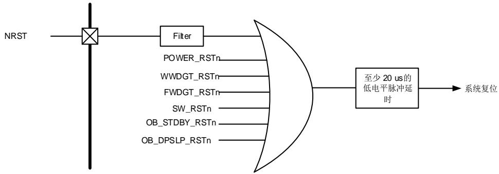
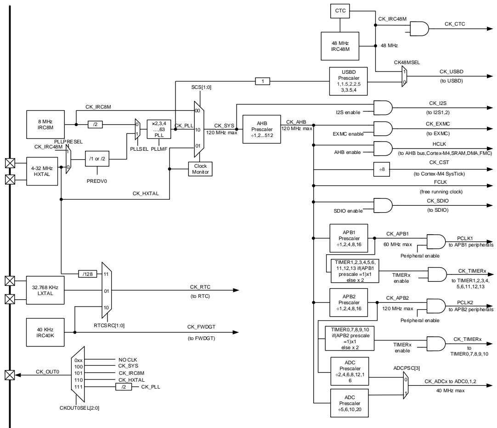
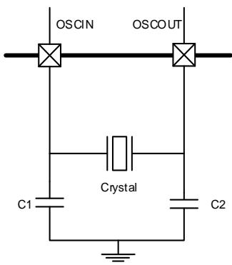
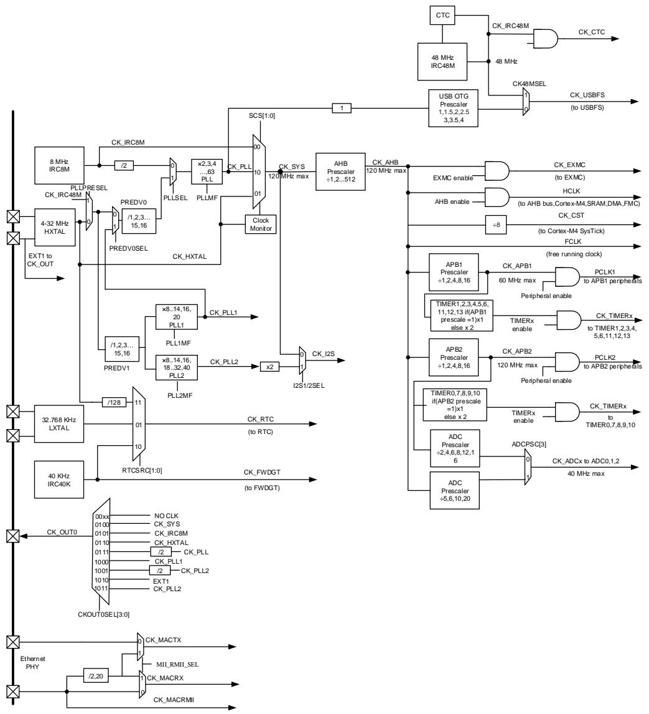
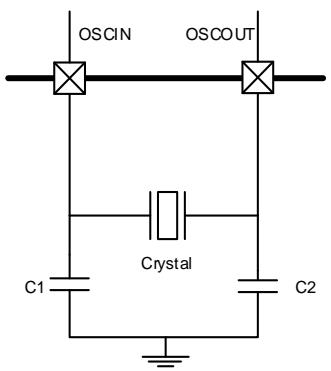
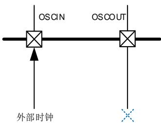

## 5. 复位和时钟单元（RCU）

高密度，超高密度的复位和时钟控制单元（RCU）

## 5.1. 复位控制单元（RCTL）

## 5.1.1. 简介

GD32F30x复位控制包括三种控制方式：电源复位、系统复位和备份域复位。电源复位又称为冷复位，其复位除了备份域的所有系统。系统复位将复位除了SW-DP控制器和备份域之外的其余部分，包括处理器内核和外设IP。备份域复位将复位备份区域。复位能够被外部信号、内部事件和复位发生器触发。后续章节将介绍关于这些复位的详细信息。

## 5.1.2. 功能描述

## 电源复位

当发生以下任一事件时，产生电源复位：上电/掉电复位（POR/PDR 复位），从待机模式中返回后由内部复位发生器产生。电源复位复位所有的寄存器除了备份域。电源复位为低电平有效，当内部LDO电源基准准备好提供1.2V电压时，电源复位电平将变为无效。复位入口向量被固定在存储器映射的地址0x0000_0004。

## 系统复位

当发生以下任一事件时，产生一个系统复位：

■ 上电复位（POWER_RSTn）;

■ 外部引脚复位（NRST）;

■ 窗口看门狗计数终止（WWDGT_RSTn）;

■ 独立看门狗计数终止（FWDGT_RSTn）;

■ Cortex®-M4的中断应用和复位控制寄存器中的SYSRESETREQ位置‘1’（SW_RSTn）;

■ 用户选择字节寄存器nRST_STDBY设置为0，并且进入待机模式时将产生复位（OB_STDBY_RSTn）；

■ 用户选择字节寄存器 nRST_DPSLP 设置为 0，并且进入深度睡眠模式时（OB_DPSLP_RSTn）。

系统复位将复位除了SW-DP控制器和备份域之外的其余部分，包括处理器内核和外设IP。

系统复位脉冲发生器保证每一个复位源（外部或内部）都能有至少20μs的低电平脉冲延时。

图5-1. 系统复位电路

## 备份域复位

以下事件之一发生时，产生备份域复位：1、设置备份域控制寄存器中的BKPRST位为‘1’；2、备份域电源上电复位（在 $V_{DD}$ 和 $V_{BAT}$ 两者都掉电的前提下， $V_{DD}$ 或 $V_{BAT}$ 上电）。

## 5.2. 时钟控制单元（CCTL）

## 5.2.1. 简介

时钟控制单元提供了一系列频率的时钟功能，包括一个内部8M RC振荡器时钟（IRC8M）、一个内部48M RC 振荡器时钟（IRC48M）、一个外部高速晶体振荡器时钟（HXTAL）、一个内部40K RC振荡器时钟（IRC40K）、一个外部低速晶体振荡器时钟（LXTAL）、一个锁相环（PLL）、一个HXTAL时钟监视器、时钟预分频器、时钟多路复用器和时钟门控电路。

AHB、APB和Cortex®-M4时钟都源自系统时钟(CK_SYS)，系统时钟的时钟源可以选择IRC8M、HXTAL或PLL。系统时钟的最大运行时钟频率可以达到120MHz。

图5-2. 时钟树

预分频器可以配置AHB、APB2和APB1域的时钟频率。AHB、APB2、APB1域的最高时钟频率分别为120MHz、120MHz、60MHz。RCU通过AHB时钟（HCLK）8分频后作为Cortex系统定时器（SysTick）的外部时钟。通过对SysTick控制和状态寄存器的设置，可选择上述时钟或AHB（HCLK）时钟作为SysTick时钟。

ADC时钟由APB2时钟经2、4、6、8、12、16分频或由AHB时钟经5、6、10、20分频获得，它们是通过设置RCU_CFG0和RCU_CFG1寄存器的ADCPSC位来选择。

SDIO, EXMC的时钟由CK_AHB提供。

TIMER时钟由CK_APB1和CK_APB2时钟分频获得，如果APBx（x = 0，1）的分频系数不为1，则TIMER时钟为CK_APBx（x = 0，1）的两倍。

USBD 的时钟由 CK48M 时钟提供。通过配置 RCU_ADDCTL 寄存器的 CK48MSEL 及 PLL48MSEL 位可以选择 CK_PLL 时钟或 IRC48M 时钟做为 CK48M 的时钟源。

CTC时钟由IRC48M时钟提供，通过CTC单元，可以实现IRC48M时钟精度的自动调整。

I2S的时钟由CK_SYS提供。

通过配置RCU_BDCTL寄存器的RTCSRC位，RTC时钟可以选择由LXTAL时钟、IRC40K时钟或HXTAL时钟的128分频提供。RTC时钟选择HXTAL时钟的128分频做为时钟源后，当1.2V内核电压域掉电时，时钟将停止。RTC时钟选择IRC40K时钟做为时钟源后，当 $V_{DD}$ 掉电时，时钟将停止。RTC时钟选择LXTAL时钟做为时钟源后，当 $V_{DD}$ 和 $V_{BAT}$ 都掉电时，时钟将停止。

当FWDGT启动时，FWDGT时钟被强制选择由IRC40K时钟做为时钟源。

## 5.2.2. 主要特性

■ 4到32MHz外部高速晶体振荡器（HXTAL）；

■ 内部8MHz RC振荡器（IRC8M）；

■ 内部48MHz RC振荡器（IRC48M）；

■ 32,768 Hz外部低速晶体振荡器（LXTAL）；

■ 内部40KHz RC振荡器（IRC40K）；

■ PLL时钟源可选HXTAL、IRC8M或IRC48M;

■ HXTAL时钟监视器。

## 5.2.3. 功能描述

## 外部高速晶体振荡器时钟（HXTAL）

4到32M的外部高速晶体振荡器可为系统时钟提供更为精确时钟源。带有特定频率的晶体必须靠近两个HXTAL的引脚连接。和晶体连接的外部电阻和电容必须根据所选择的振荡器来调整。

图5-3. HXTAL时钟源

HXTAL晶体振荡器可以通过设置控制寄存器RCU_CTL的HXTALEN位来启动或关闭，在控制寄存器RCU_CTL中的HXTALSTB位用来指示外部高速振荡器是否已稳定。在启动时，直到这一位被硬件置‘1’，时钟才被释放出来。这个特定的延迟时间被称为振荡器的启动时间。当HXTAL时钟稳定后，如果在中断寄存器RCU_INT中的相应中断使能位HXTALSTBIE位被置‘1’，将会产生相应中断。此时，HXTAL时钟可以被直接用作系统时钟源或者PLL输入时钟。

将控制寄存器RCU_CTL的HXTALBPS和HXTALEN位置‘1’可以设置外部时钟旁路模式。路输入时，信号接至OSCIN，OSCOUT保持悬空状态，如图5-4. 旁路模式下HXTAL时钟源所示。此时，CK_HXTAL等于驱动OSCIN管脚的外部时钟。

图5-4. 旁路模式下HXTAL时钟源

## 内部 8M RC 振荡器时钟（IRC8M）

内部8MHz RC振荡器时钟，简称IRC8M时钟，拥有8MHz的固定频率，设备上电后CPU默认选择其做为系统时钟源。IRC8M RC振荡器能够在不需要任何外部器件的条件下为用户提供更低成本类型的时钟源。IRC8M RC振荡器可以通过设置控制寄存器（RCU_CTL）中的IRC8MEN位被启动和关闭。控制寄存器RCU_CTL中的IRC8MSTB位用来指示IRC8M内部RC振荡器是否稳定。IRC8M振荡器的启动时间比HXTAL晶体振荡器要更短。如果中断寄存器RCU_INT中的相应中断使能位IRC8MSTBIE被置‘1’，在IRC8M稳定以后，将产生一个中断。IRC8M时钟也可用作系统时钟源或PLL输入时钟。

工厂会校准IRC8M时钟频率的精度，但是它的精度仍然比HXTAL时钟要差。用户可以根据需求、环境条件和成本决定选择哪个时钟作为系统时钟源。

如果HXTAL或者PLL被选择为系统时钟源，为了最大程度减小系统从深度睡眠模式恢复的时间，当系统从深度睡眠模式初始唤醒时，硬件会强制IRC8M时钟作为系统时钟。

## 内部 48M RC 振荡器时钟（IRC48M）

内部48MHz RC振荡器时钟，简称IRC48M时钟，拥有48MHz的固定频率，当使用USBD模块时，IRC48M振荡器在不需要任何外部器件的条件下为用户提供了一种成本更低的时钟源选择。IRC48M RC振荡器可以通过设置RCU_ADDCTL寄存器中的IRC48MEN位被启动和关闭。RCU_ADDCTL寄存器中的IRC48MSTB位用来指示内部48MHz RC振荡器是否稳定。如果RCU_ADDINT寄存器中的相应中断使能位IRC48MSTBIE被置‘1’，在IRC48M稳定以后，将产生一个中断。IRC48M时钟可做为USBD的系统时钟。

工厂会校准IRC48M时钟频率的精度，但是它的精度仍然不够精准。因为USB模块需要的时钟频率必须满足48MHz（500ppm）。CTC单元提供了一种硬件自动执行动态调整的功能将IRC48M时钟调整到需要的频率。

## 锁相环（PLL）

内部有一个锁相环。

PLL可以通过设置RCU_CTL寄存器中的PLLEN位被启动和关闭。RCU_CTL寄存器中的PLLSTB位用来指示PLL时钟是否稳定。如果RCU_INT寄存器中的相应中断使能位PLLSTBIE被置‘1’，在PLL稳定以后，将产生一个中断。

当进入Deepsleep/Standby模式或者HXTAL监视器检测到时钟阻塞时（HXTAL做为锁相环的输入时钟），PLL将被关闭。

## 外部低速晶体振荡器时钟（LXTAL）

LXTAL是一个频率为32.768kHz的外部低速晶体或陶瓷谐振器。它为实时时钟电路提供一个低功耗且高精准的时钟源。LXTAL振荡器可以通过设置备份域控制寄存器（RCU_BDCTL）中的LXTALEN位被启动和关闭。备份域控制寄存器RCU_BDCTL中的LXTALSTB位用来指示LXTAL时钟是否稳定。如果中断寄存器RCU_INT中的相应中断使能位LXTALSTBIE被置‘1’，在LXTAL稳定以后，将产生一个中断。

将备份域控制寄存器RCU_BDCTL的LXTALBPS和LXTALEN位置‘1’可以选择外部时钟旁路模式。CK_LXTAL与连到OSC32IN脚上外部时钟信号一致。

## 内部 40K RC 振荡器时钟（IRC40K）

IRC40K内部RC振荡器时钟担当一个低功耗时钟源的角色，不需要外部器件，它的时钟频率大约40kHz，为独立看门狗和实时时钟电路提供时钟。IRC40K RC振荡器可以通过设置复位源/时钟寄存器RCU_RSTSCK中的IRC40KEN位被启动和关闭。复位源/时钟寄存器RCU_RSTSCK中的IRC40KSTB位用来指示IRC40K时钟是否已稳定。如果复位源/时钟寄存器RCU_RSTSCK中的相应中断使能位IRC40KSTBIE被置‘1’，在IRC40K稳定以后，将产生一个中断。

TIMER4_CH3可以捕获IRC40K的时钟，进而对RTC和FWDGT的计数器进行校准，详细的信息可以参考AFIO_PCF0寄存器的位TIMER4CH3_IREMAP。

## 系统时钟（CK_SYS）选择

系统复位后，IRC8M时钟默认做为CK_SYS的时钟源，改变配置寄存器0（RCU_CFG0）中的系统时钟变换位SCS可以切换系统时钟源为HXTAL或CK_PLL。当SCS的值被改变，系统时钟将使用原来的时钟源继续运行直到转换的目标时钟源稳定。当一个时钟源被直接或通过PLL间接作为系统时钟时，它将不能被停止。

## HXTAL 时钟监视器（CKM）

设置控制寄存器RCU_CTL中的HXTAL时钟监视使能位CKMEN，HXTAL可以使能时钟监视功能。该功能必须在HXTAL启动延迟完毕后使能，在HXTAL停止后禁止。一旦监测到HXTAL故障，HXTAL将自动被禁止，中断寄存器RCU_INT中的HXTAL时钟阻塞中断标志位CKMIF将被置'1'，产生HXTAL故障事件。这个故障引发的中断和Cortex-M4的不可屏蔽中断NMI相连。如果HXTAL被选作系统，PLL或是RTC的时钟源，HXTAL故障将促使选择IRC8M为系统时钟源，PLL将被自动禁止，RTC的时钟源需要重新配置。

## 时钟输出功能

时钟输出功能输出从4MHz到120MHz的时钟。通过设置时钟配置寄存器0（RCU_CFG0）中的CK_OUT0时钟源选择位域CKOUT0SEL能够选择不同的时钟信号。相应的GPIO引脚应该被配置成备用功能I/O（AFIO）模式来输出选择的时钟信号。

表5-1. 时钟输出0的时钟源选择

<table><tr><td>时钟输出 0 的时钟源选择位域</td><td>时钟源</td></tr><tr><td>0xx</td><td>NO CLK</td></tr><tr><td>100</td><td>CK_SYS</td></tr><tr><td>101</td><td>CK_IRC8M</td></tr><tr><td>110</td><td>CK_HXTAL</td></tr><tr><td>111</td><td>CK_PLL/2</td></tr></table>

## 电压控制

深度睡眠模式电压寄存器（RCU_DSV）中的DSLPVS[2:0]位域可以控制1.2V域在深度睡眠模式下的电压。

表5-2. 深度睡眠模式下1.2V域电压选择

<table><tr><td>DSLPVS[2:0]</td><td>深度睡眠模式电压(V)</td></tr><tr><td>000</td><td>1.0</td></tr><tr><td>001</td><td>0.9</td></tr><tr><td>010</td><td>0.8</td></tr><tr><td>011</td><td>0.7</td></tr></table>

## 5.4. 复位控制单元（RCTL）

## 5.4.1. 简介

GD32F30x复位控制包括三种控制方式：电源复位、系统复位和备份域复位。电源复位又称为冷复位，其复位除了备份域的所有系统。系统复位将复位除了SW-DP控制器和备份域之外的其余部分，包括处理器内核和外设IP。备份域复位将复位备份区域。复位能够被外部信号、内部事件和复位发生器触发。后续章节将介绍关于这些复位的详细信息。

## 5.4.2. 功能描述

## 电源复位

当发生以下任一事件时，产生电源复位：上电/掉电复位（POR/PDR 复位），从待机模式中返回后由内部复位发生器产生。电源复位复位所有的寄存器除了备份域。电源复位为低电平有效，当内部LDO电源基准准备好提供1.2V电压时，电源复位电平将变为无效。复位入口向量被固定在存储器映射的地址0x0000_0004。

## 系统复位

当发生以下任一事件时，产生一个系统复位：

■ 上电复位（POWER_RSTn）；

■ 外部引脚复位（NRST）；

■ 窗口看门狗计数终止（WWDGT_RSTn）；

■ 独立看门狗计数终止（FWDGT_RSTn）;

■ Cortex®-M4的中断应用和复位控制寄存器中的SYSRESETREQ位置‘1’（SW_RSTn）;

■ 用户选择字节寄存器nRST_STDBY设置为0，并且进入待机模式时将产生复位（OB_STDBY_RSTn）；

■ 用户选择字节寄存器nRST_DPSLP设置为0，并且进入深度睡眠模式时（OB_DPSLP_RSTn）。

系统复位将复位除了SW-DP控制器和备份域之外的其余部分，包括处理器内核和外设IP。

系统复位脉冲发生器保证每一个复位源（外部或内部）都能有至少20μs的低电平脉冲延时。

图5-5. 系统复位电路

## 备份域复位

以下事件之一发生时，产生备份域复位：1、设置备份域控制寄存器中的BKPRST位为‘1’；2、备份域电源上电复位（在 $V_{DD}$ 和 $V_{BAT}$ 两者都掉电的前提下， $V_{DD}$ 或 $V_{BAT}$ 上电）。

## 5.5. 时钟控制单元（CCTL）

## 5.5.1. 简介

时时钟控制单元提供了一系列频率的时钟功能，包括一个内部8M RC振荡器时钟（IRC8M）、一个内部48M RC 振荡器时钟（IRC48M）、一个外部高速晶体振荡器时钟（HXTAL）、一个内部40K RC振荡器时钟（IRC40K）、一个外部低速晶体振荡器时钟（LXTAL）、三个锁相环（PLL）、一个HXTAL时钟监视器、时钟预分频器、时钟多路复用器和时钟门控电路。

AHB、APB和Cortex®-M4时钟都源自系统时钟(CK_SYS)，系统时钟的时钟源可以选择IRC8M、HXTAL或PLL。系统时钟的最大运行时钟频率可以达到120MHz。

图5-6. 时钟树

预分频器可以配置AHB、APB2和APB1域的时钟频率。AHB、APB2、APB1域的最高时钟频率分别为120MHz、120MHz、60MHz。RCU通过AHB时钟（HCLK）8分频后作为Cortex系统定时器（SysTick）的外部时钟。通过对SysTick控制和状态寄存器的设置，可选择上述时钟或AHB（HCLK）时钟作为SysTick时钟。

ADC时钟由APB2时钟经2、4、6、8、12、16分频或由AHB时钟经5、6、10、20分频获得，它们是通过设置RCU_CFG0和RCU_CFG1寄存器的ADCPSC位来选择。

TIMER时钟由CK_APB1和CK_APB2时钟分频获得，如果APBx（x = 0，1）的分频系数不为1，则TIMER时钟为CK_APBx（x = 0，1）的两倍。

USBFS的时钟由CK48M时钟提供。通过配置RCU_ADDCTL寄存器的CK48MSEL及PLL48MSEL位可以选择CK_PLL时钟或IRC48M时钟做为CK48M的时钟源。

CTC时钟由IRC48M时钟提供，通过CTC单元，可以实现IRC48M时钟精度的自动调整。

I2S的时钟由CK_SYS或PLL2*2提供，通过配置RCU_CFG1寄存器的I2SxSEL来选择。

通过配置AFIO_PCF0寄存器的ENET_PHY_SEL位，以太网TX/RX时钟可以选择由外部引脚

(ENET_TX_CLK / ENET_RX_CLK) 输入时钟提供。

通过配置RCU_BDCTL寄存器的RTCSRC位，RTC时钟可以选择由LXTAL时钟、IRC40K时钟或HXTAL时钟的128分频提供。RTC时钟选择HXTAL时钟的128分频做为时钟源后，当1.2V内核电压域掉电时，时钟将停止。RTC时钟选择IRC40K时钟做为时钟源后，当 $V_{DD}$ 掉电时，时钟将停止。RTC时钟选择LXTAL时钟做为时钟源后，当 $V_{DD}$ 和 $V_{BAT}$ 都掉电时，时钟将停止。

当FWDGT启动时，FWDGT时钟被强制选择由IRC40K时钟做为时钟源。

## 5.5.2. 主要特性

■ 4到32MHz外部高速晶体振荡器（HXTAL）；

■ 内部8MHz RC振荡器（IRC8M）；

■ 内部48MHz RC振荡器（IRC48M）；

■ 32,768 Hz外部低速晶体振荡器（LXTAL）；

■ 内部40KHz RC振荡器（IRC40K）；

■ PLL时钟源可选HXTAL、IRC8M或IRC48M;

■ HXTAL时钟监视器。

## 5.5.3. 功能描述

## 外部高速晶体振荡时钟（HXTAL）

4到32M的外部高速晶体振荡器可为系统时钟提供更为精确时钟源。带有特定频率的晶体必须靠近两个HXTAL的引脚连接。和晶体连接的外部电阻和电容必须根据所选择的振荡器来调整。

图5-7. HXTAL时钟源

HXTAL晶体振荡器可以通过设置控制寄存器RCU_CTL的HXTALEN位来启动或关闭，在控制寄存器RCU_CTL中的HXTALSTB位用来指示外部高速振荡器是否已稳定。在启动时，直到这一位被硬件置‘1’，时钟才被释放出来。这个特定的延迟时间被称为振荡器的启动时间。当HXTAL时钟稳定后，如果在中断寄存器RCU_INT中的相应中断使能位HXTALSTBIE位被置‘1’，将会产生相应中断。此时，HXTAL时钟可以被直接用作系统时钟源或者PLL输入时钟。

将控制寄存器RCU_CTL的HXTALBPS和HXTALEN位置‘1’可以设置外部时钟旁路模式。旁路输入时，信号接至OSCIN，OSCOUT保持悬空状态，如图5-8. 旁路模式下HXTAL时钟源所示。此时，CK_HXTAL等于驱动OSCIN管脚的外部时钟。

图5-8. 旁路模式下HXTAL时钟源

## 内部 8M RC 振荡器时钟（IRC8M）

内部8MHz RC振荡器时钟，简称IRC8M时钟，拥有8MHz的固定频率，设备上电后CPU默认选择其做为系统时钟源。IRC8M RC振荡器能够在不需要任何外部器件的条件下为用户提供更低成本类型的时钟源。IRC8M RC振荡器可以通过设置控制寄存器（RCU_CTL）中的IRC8MEN位被启动和关闭。控制寄存器RCU_CTL中的IRC8MSTB位用来指示IRC8M内部RC振荡器是否稳定。IRC8M振荡器的启动时间比HXTAL晶体振荡器要更短。如果中断寄存器RCU_INT中的相应中断使能位IRC8MSTBIE被置‘1’，在IRC8M稳定以后，将产生一个中断。IRC8M时钟也可用作系统时钟源或PLL输入时钟。

工厂会校准IRC8M时钟频率的精度，但是它的精度仍然比HXTAL时钟要差。用户可以根据需求、环境条件和成本决定选择哪个时钟作为系统时钟源。

如果HXTAL或者PLL被选择为系统时钟源，为了最大程度减小系统从深度睡眠模式恢复的时间，当系统从深度睡眠模式初始唤醒时，硬件会强制IRC8M时钟作为系统时钟。

## 内部 48M RC 振荡器时钟（IRC48M）

内部48MHz RC振荡器时钟，简称IRC48M时钟，拥有48MHz的固定频率，当使用USBFS模块时，IRC48M振荡器在不需要任何外部器件的条件下为用户提供了一种成本更低的时钟源选择。IRC48M RC振荡器可以通过设置RCU_ADDCTL寄存器中的IRC48MEN位被启动和关闭。RCU_ADDCTL寄存器中的IRC48MSTB位用来指示内部48MHz RC振荡器是否稳定。如果RCU_ADDINT寄存器中的相应中断使能位IRC48MSTBIE被置‘1’，在IRC48M稳定以后，将产生一个中断。IRC48M时钟可做为USBFS的系统时钟。

工厂会校准IRC48M时钟频率的精度，但是它的精度仍然不够精准。因为USB模块需要的时钟频率必须满足48MHz（500ppm）。CTC单元提供了一种硬件自动执行动态调整的功能将IRC48M时钟调整到需要的频率。

## 锁相环（PLL）

CL系列的芯片，内部有三个锁相环，PLL，PLL1，PLL2。

PLL可以通过设置RCU_CTL寄存器中的PLLEN位被启动和关闭。RCU_CTL寄存器中的PLLSTB位用来指示PLL时钟是否稳定。如果RCU_INT寄存器中的相应中断使能位PLLSTBIE被置‘1’，在PLL稳定以后，将产生一个中断。

PLL1可以通过设置RCU_CTL寄存器中的PLL1EN位被启动和关闭。RCU_CTL寄存器中的PLL1STB位用来指示PLL1时钟是否稳定。如果RCU_INT寄存器中的相应中断使能位

PLL1STBIE被置‘1’，在PLL1稳定以后，将产生一个中断。

PLL2可以通过设置RCU_CTL寄存器中的PLL2EN位被启动和关闭。RCU_CTL寄存器中的PLL2STB位用来指示PLL2时钟是否稳定。如果RCU_INT寄存器中的相应中断使能位PLL2STBIE被置‘1’，在PLL2稳定以后，将产生一个中断。

当进入Deepsleep/Standby模式或者HXTAL监视器检测到时钟阻塞时（HXTAL做为锁相环的输入时钟），三个PLL将被关闭。

## 外部低速晶体振荡器时钟（LXTAL）

LXTAL是一个频率为32.768kHz的外部低速晶体或陶瓷谐振器。它为实时时钟电路提供一个低功耗且高精准的时钟源。LXTAL振荡器可以通过设置备份域控制寄存器（RCU_BDCTL）中的LXTALEN位被启动和关闭。备份域控制寄存器RCU_BDCTL中的LXTALSTB位用来指示LXTAL时钟是否稳定。如果中断寄存器RCU_INT中的相应中断使能位LXTALSTBIE被置‘1’，在LXTAL稳定以后，将产生一个中断。

将备份域控制寄存器RCU_BDCTL的LXTALBPS和LXTALEN位置‘1’可以选择外部时钟旁路模式。CK_LXTAL与连到OSC32IN脚上外部时钟信号一致。

## 内部 40K RC 振荡器时钟（IRC40K）

IRC40K内部RC振荡器时钟担当一个低功耗时钟源的角色，不需要外部器件，它的时钟频率大约40kHz，为独立看门狗和实时时钟电路提供时钟。IRC40K RC振荡器可以通过设置复位源/时钟寄存器RCU_RSTSCK中的IRC40KEN位被启动和关闭。复位源/时钟寄存器RCU_RSTSCK中的IRC40KSTB位用来指示IRC40K时钟是否已稳定。如果复位源/时钟寄存器RCU_RSTSCK中的相应中断使能位IRC40KSTBIE被置‘1’，在IRC40K稳定以后，将产生一个中断。

TIMER4_CH3可以捕获IRC40K的时钟，进而对RTC和FWDGT的计数器进行校准，详细的信息可以参考AFIO_PCF0寄存器的位TIMER4CH3_IREMAP。

## 系统时钟（CK_SYS）选择

系统复位后，IRC8M时钟默认做为CK_SYS的时钟源，改变配置寄存器0（RCU_CFG0）中的系统时钟变换位SCS可以切换系统时钟源为HXTAL或CK_PLL。当SCS的值被改变，系统时钟将使用原来的时钟源继续运行直到转换的目标时钟源稳定。当一个时钟源被直接或通过PLL间接作为系统时钟时，它将不能被停止。

## HXTAL 时钟监视器（CKM）

设置控制寄存器RCU_CTL中的HXTAL时钟监视使能位CKMEN，HXTAL可以使能时钟监视功能。该功能必须在HXTAL启动延迟完毕后使能，在HXTAL停止后禁止。一旦监测到HXTAL故障，HXTAL将自动被禁止，中断寄存器RCU_INT中的HXTAL时钟阻塞中断标志位CKMIF将被置‘1’，产生HXTAL故障事件。这个故障引发的中断和Cortex-M4的不可屏蔽中断NMI相连。如果HXTAL被选作系统，PLL或是RTC的时钟源，HXTAL故障将促使选择IRC8M为系统时钟源，PLL将被自动禁止，RTC的时钟源需要重新配置。

## 时钟输出功能

时钟输出功能输出从0.09375MHz到120MHz的时钟。通过设置时钟配置寄存器0（RCU_CFG0）中的CK_OUT0时钟源选择位域CKOUT0SEL能够选择不同的时钟信号。相应的GPIO引脚应该被配置成备用功能I/O（AFIO）模式来输出选择的时钟信号。

表5-3. 时钟输出0的时钟源选择

<table><tr><td>时钟输出 0 的时钟源选择位域</td><td>时钟源</td></tr><tr><td>00xx</td><td>NO CLK</td></tr><tr><td>0100</td><td>CK_SYS</td></tr><tr><td>0101</td><td>CK_IRC8M</td></tr><tr><td>0110</td><td>CK_HXTAL</td></tr><tr><td>0111</td><td>CK_PLL/2</td></tr><tr><td>1000</td><td>CK_PLL1</td></tr><tr><td>1001</td><td>CK_PLL2/2</td></tr><tr><td>1010</td><td>EXT1</td></tr><tr><td>1011</td><td>CK_PLL2</td></tr></table>

## 电压控制

深度睡眠模式电压寄存器（RCU_DSV）中的DSLPVS[2:0]位域可以控制1.2V域在深度睡眠模式下的电压。

表5-4. 深度睡眠模式下1.2V域电压选择

<table><tr><td>DSLPVS[2:0]</td><td>深度睡眠模式电压(V)</td></tr><tr><td>000</td><td>1.0</td></tr><tr><td>001</td><td>0.9</td></tr><tr><td>010</td><td>0.8</td></tr><tr><td>011</td><td>0.7</td></tr></table>

