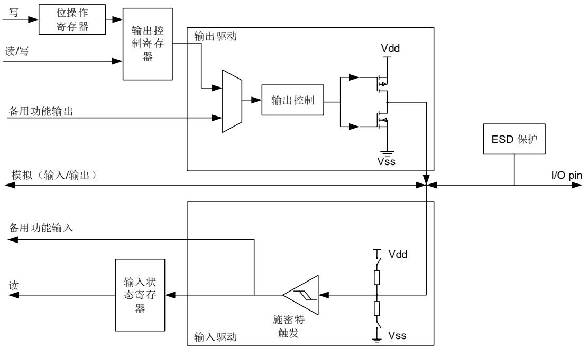
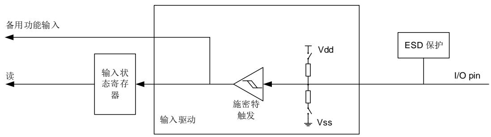
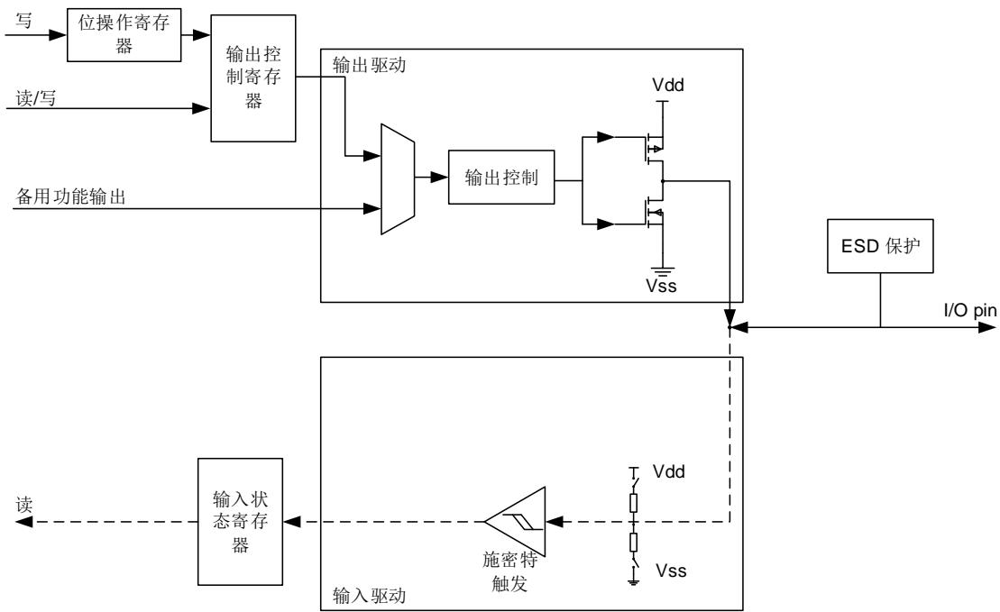
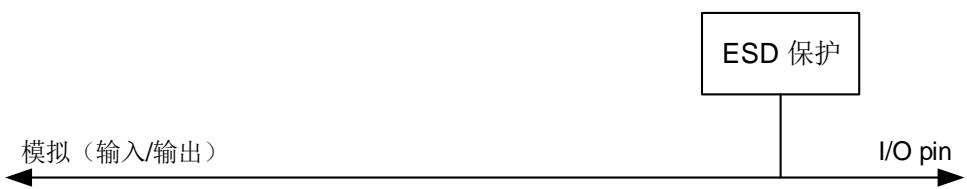
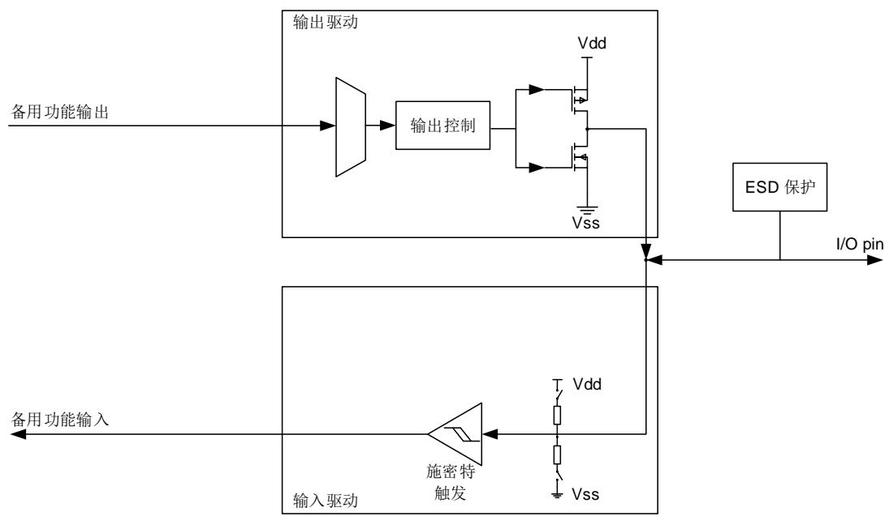

## 8. 通用和备用输入/输出接口（GPIO 和 AFIO）

## 8.1. 简介

最多可支持 112 个通用 I/O 引脚(GPIO)，分别为 PA0 ~ PA15，PB0 ~ PB15，PC0 ~ PC15，PD0 ~ PD15，PE0 ~ PE15，PF0 ~ PF15 和 PG0 ~ PG15，各片上设备用其来实现逻辑输入/输出功能。每个 GPIO 端口有相关的控制和配置寄存器以满足特定应用的需求。外设 GPIO 引脚上的外部中断在中断/事件控制器（EXIT）中有相关的控制和配置寄存器。

GPIO 端口和其他的备用功能(AFs)共用引脚，在特定的封装下获得最大的灵活性。GPIO 引脚通过配置相关的寄存器可以用作备用功能输入/输出。

每个 GPIO 引脚可以由软件配置为输出(推挽或开漏)、输入、外设备用功能或者模拟模式。每个 GPIO 引脚都可以配置为上拉、下拉或浮空。除模拟模式外，所有的 GPIO 引脚都具备大电流驱动能力。

## 8.2. 主要特性

输入/输出方向控制；

施密特触发器输入功能使能控制；

每个引脚都具有弱上拉/下拉功能；

推挽/开漏输出使能控制；

置位/复位输出使能；

可编程触发沿的外部中断—使用EXTI配置寄存器

模拟输入/输出配置；

备用功能输入/输出配置；

端口锁定配置；

## 8.3. 功能描述

每个通用 I/O 端口都可以通过两个 32 位的控制寄存器(GPIOx_CTL0/ GPIOx_CTL1)和一个 32位的数据寄存器(GPIOx_OCTL)配置为 8 种模式：模拟输入，浮空输入，上拉输入，下拉输入，GPIO 推挽输出，GPIO 开漏输出，AFIO 推挽输出和 AFIO 开漏输出。详情请见 8-1. GPIO配置表。

表 8-1. GPIO 配置表

<table><tr><td colspan="2">配置模式</td><td>CTL[1:0]</td><td>SPDy: MD[1:0]</td><td>OCTL</td></tr><tr><td rowspan="4">输入</td><td>模拟</td><td>00</td><td rowspan="4">x 00</td><td>不使用</td></tr><tr><td>浮空输入</td><td>01</td><td>不使用</td></tr><tr><td>下拉输入</td><td>10</td><td>0</td></tr><tr><td>上拉输入</td><td>10</td><td>1</td></tr><tr><td colspan="2">配置模式</td><td>CTL[1:0]</td><td>SPDy: MD[1:0]</td><td>OCTL</td></tr><tr><td rowspan="2">普通输出 (GPIO)</td><td>推挽</td><td>00</td><td rowspan="4">x 00:保留 x 01:最大速度到10MHz x 10:最大速度到2MHz 0 11:最大速度到50MHz 1 11:最大速度到<eq>{120}{\mathrm{{MHz}}}^{\left( 1\right) }</eq> (同时设置SPDy值为1)</td><td>0或1</td></tr><tr><td>开漏</td><td>01</td><td>0或1</td></tr><tr><td rowspan="2">备用功能输出 (AFIO)</td><td>推挽</td><td>10</td><td>不使用</td></tr><tr><td>开漏</td><td>11</td><td>不使用</td></tr></table>

1、当 GPIO 输出速度超过 50MHz时，需要使能 GPIO 的补偿单元，参考 IO 补偿控制寄存器（AFIO_CPSCTL）。

8-1. I/O 为标准 I/O 端口位的基本结构图。

图 8-1. 标准 I/O 端口位的基本结构

## 8.3.1. GPIO 引脚配置

在复位期间或复位之后，备用功能并未激活，所有 GPIO 端口都被配置成输入浮空模式，这种输入模式禁用上拉(PU)/下拉(PD)电阻。但是复位后，串行线调试端口（JTAG/Serial-WiredDebug pins）为输入 PU/PD 模式：

PA15：JTDI 为上拉模式；

PA14：JTCK / SWCLK 为下拉模式；

PA13：JTMS / SWDIO 为上拉模式；

PB4：NJTRST 为上拉模式。

PB3：JTDO 为浮空模式。

GPIO 引脚可以配置为输入或输出模式，当 GPIO 引脚可配置为输入引脚时，所有的 GPIO 引脚内部都有一个可选择的弱上拉和弱下拉电阻。外部引脚上的数据在每个 APB2 时钟周期时都会装载到数据输入寄存器(GPIOx_ISTAT)。

当 GPIO 引脚配置为输出引脚，用户可以配置端口的输出速度和选择输出驱动模式：推挽或开

漏模式，输出寄存器(GPIOx_OCTL)的值将会从相应 I/O 引脚上输出。

当对 GPIOx_OCTL 进行位操作时，不需要先读再写，用户可以通过写‘1’到位操作寄存器(GPIOx_BOP，或用于清 0 的 GPIOx_BC)修改一位或几位，该过程仅需要一个最小的 APB2写访问周期，而其他位不受影响。

## 8.3.2. 外部中断/事件线

所有的端口都有外部中断能力，为了使用外部中断线，端口必须配置为输入模式。

## 8.3.3. 备用功能(AF)

当端口配置为 AFIO（设置GPIOx_CTL0/GPIOx_CTL1 寄存器中的CTLy值为“0b10”或“0b11”，MDy位值为“0b01”，“0b10”或“0b11”）时，该端口用作外设备用功能。端口备用功能分配的详细介绍见芯片数据手册。

## 8.3.4. 输入配置

当 GPIO 引脚配置为输入时：

施密特触发输入使能；

可选择的弱上拉和下拉电阻；

1 当前I/O引脚上的数据在每个APB2时钟周期都会被采样并存入端口输入状态寄存器；

输出缓冲器禁用。

8-2. 显示 I/O引脚的输入配置。

图 8-2. 输入配置

## 8.3.5. 输出配置

当 GPIO 配置为输出时：

施密特触发输入使能；

弱上拉和下拉电阻禁用；

输出缓冲器使能；

开漏模式：输出控制寄存器设置为“0”时，相应引脚输出低电平；输出控制寄存器设置 为“1”，相应管脚处于高阻状态；

推挽模式：输出控制寄存器设置为“0”时，相应引脚输出低电平；输出控制寄存器设置为“1”，

相应引脚输出高电平；

对端口输出控制寄存器进行读操作，将返回上次写入的值；

对端口输入状态寄存器进行读操作，将获得当前I/O口的状态。

8-3. 是 I/O 端口的输出配置。

图 8-3. 输出配置

## 8.3.6. 模拟配置

当 GPIO 引脚用于模拟模式时：

弱上拉和下拉电阻禁用；

输出缓冲器禁用；

施密特触发输入禁用；

端口输入状态寄存器相应位为“0”。

8-4. 是 I/O 端口的模拟模式配置。

图 8-4. 模拟配置

## 8.3.7. 备用功能(AF)配置

为了适应不同的器件封装，GPIO 端口支持软件配置将一些备用功能应用到其他引脚上。当引脚配置为备用功能时：

使用开漏或推挽功能时，可使能输出缓冲器；

输出缓冲器由外设驱动；

施密特触发输入使能；

在输入配置时，可选择弱上拉/下拉电阻；

I/O引脚上的数据在每个APB2时钟周期采样并存入端口输入状态寄存器；

对端口输入状态寄存器进行读操作，将获得I/O口的状态；

对端口输出控制寄存器进行读操作，将返回上次写入的值。

8-5. 是 I/O 端口备用功能配置图。

图 8-5. 备用功能配置

## 8.3.8. GPIO 锁定功能

GPIO 的锁定机制可以保护 I/O 端口的配置。

被保护的寄存器有GPIOx_CTL0和GPIOx_CTL1。通过配置32位锁定寄存器（GPIOx_LOCK）可以锁定 I/O 端口的配置。通过特定的锁定序列配置 GPIOx_LOCK 中的 LKK 位和 LKy 位，相应的端口位被锁定，直到下一个复位前，相应端口位的配置都不能修改。建议在电源驱动模块的配置中使用锁定功能。

## 8.3.9. GPIO I/O 补偿单元

当 I/O 端口输出速度大于 50MHz时，建议使用 I/O 补偿单元对 I/O 端口进行斜率控制，从而降低 I/O 端口噪声对工作电源的影响。

I/O 补偿单元在系统复位后，默认是关闭状态，需要用户根据需要开启。

在使能 I/O 补偿单元后，将产生一个准备完成标志位 CPS_RDY，用于指示补偿单元已经准备好，可以使用。如果电源电压超过 2.4V~3.6V，不能使用 I/O 补偿单元，必须关闭该功能。

## 8.4. I/O 重映射功能和调试配置

## 8.4.1. 介绍

为了扩展 GPIO 的灵活性或外设功能使用，通过配置 AFIO 端口配置寄存器（AFIO_PCF0/AFIO_PCF1），每个 I/O 引脚都可以配置多达 4 种不同的功能。通过使用外设 IO 的重映射功能可以选择合适的引脚位置。另外，通过配置相应的 EXTI 源选择寄存器（AFIO_EXTISSx）选择触发中断或事件，GPIO 引脚可以用作 EXTI 中断线。

## 8.4.2. 主要特性

EXTI 源选择

每个引脚具有多达4种备用功能的配置

## 8.4.3. JTAG/SWD 备用功能重映射

调试接口信号映射在 GPIO 端口的情况如下表所示。

表 8-2. 调试接口信号

<table><tr><td>GPIO 端口</td><td>备用功能</td></tr><tr><td>PA13</td><td>JTMS / SWDIO</td></tr><tr><td>PA14</td><td>JTCK / SWCLK</td></tr><tr><td>PA15</td><td>JTDI</td></tr><tr><td>PB3</td><td>JTDO / TRACESWO</td></tr><tr><td>PB4</td><td>NJTRST</td></tr><tr><td>PE2</td><td>TRACECK</td></tr><tr><td>PE3</td><td>TRACED0</td></tr><tr><td>PE4</td><td>TRACED1</td></tr><tr><td>PE5</td><td>TRACED2</td></tr><tr><td>PE6</td><td>TRACED3</td></tr></table>

为了减少用于调试的 GPIO 端口，用户可以配置 AFIO_PCF0 寄存器中的 SWJ_CFG [2:0]位为不同的值。具体情况参照下表。

表 8-3. 调试端口映射

<table><tr><td rowspan="2">SWJ_CFG[2:0]</td><td rowspan="2">JTAG-DP and SW-DP</td><td colspan="5">Pin availability</td></tr><tr><td>PA13</td><td>PA14</td><td>PA15</td><td>PB3</td><td>PB4</td></tr><tr><td>000</td><td>JTAG-DP 开启SW-DP 开启(复位状态)</td><td>X</td><td>X</td><td>X</td><td>X</td><td>X</td></tr><tr><td>001</td><td>JTAG-DP 开启SW-DP 开启没有 NJTRST</td><td>X</td><td>X</td><td>X</td><td>X</td><td>√</td></tr><tr><td>010</td><td>JTAG-DP 关闭SW-DP 开启</td><td>X</td><td>X</td><td>√</td><td>√</td><td>√</td></tr><tr><td>100</td><td>JTAG-DP 关闭SW-DP 关闭</td><td>√</td><td>√</td><td>√</td><td>√</td><td>√</td></tr><tr><td>Other</td><td>禁用</td><td></td><td></td><td></td><td></td><td></td></tr></table>

1， 只有在不使用异步跟踪时，I/O才能使用。

2， $" \surd "$ 指示相应的引脚可被用作通用 IO 引脚

3， $" \times "$ 指示相应的引脚不可被用作通用 IO 引脚

## 8.4.4. ADC AF 重映射

参考 AFIO 端口配置寄存器 0（AFIO_ PCF0）。

表 8-4. ADC 常规转换外部触发备用功能重映射(1)

<table><tr><td>寄存器</td><td>ADC0</td><td>ADC1</td></tr><tr><td>ADC0_ETRGRER_REMAP = 0</td><td>ADC0 外部信号触发常规转换连接到 EXTI11</td><td>-</td></tr><tr><td>ADC0_ETRGRER_REMAP = 1</td><td>ADC0 外部信号触发常规转换连接到 TIMER7_TRGO</td><td>-</td></tr><tr><td>ADC1_ETRGRER_REMAP = 0</td><td>-</td><td>ADC1 外部信号触发常规转换连接到 EXTI11</td></tr><tr><td>ADC1_ETRGRER_REMAP = 1</td><td>-</td><td>ADC1 外部信号触发常规转换连接到 TIMER7_TRGO</td></tr></table>

1. 重映射仅仅适用于高密度和超高密度的产品。

## 8.4.5. TIMER AF 重映射

表 8-5. TIMERx 备用功能重映射

<table><tr><td rowspan="3">备用功能</td><td colspan="4">TIMERx_REMAP [1:0](x = 0, 1, 2)</td></tr><tr><td colspan="2">TIMERx_REMAP(x = 3, 8, 9, 10, 12, 13)</td><td colspan="2">-</td></tr><tr><td>“0”/“00”(没有映射)</td><td>“1”/“01”(部分映射)</td><td>“10”(部分映射)</td><td>“11”(全映射)</td></tr><tr><td>TIMER0_ETI</td><td colspan="2">PA12</td><td>-</td><td>PE7</td></tr><tr><td>TIMER0_CH0</td><td colspan="2">PA8</td><td>-</td><td>PE9</td></tr><tr><td>TIMER0_CH1</td><td colspan="2">PA9</td><td>-</td><td>PE11</td></tr><tr><td>TIMER0_CH2</td><td colspan="2">PA10</td><td>-</td><td>PE13</td></tr><tr><td>TIMER0_CH3</td><td colspan="2">PA11</td><td>-</td><td>PE14</td></tr><tr><td>TIMER0_BRKI N</td><td>PB12</td><td>PA6</td><td>-</td><td>PE15</td></tr><tr><td>TIMER0_CH0_ON</td><td>PB13</td><td>PA7</td><td>-</td><td>PE8</td></tr><tr><td>TIMER0_CH1_ON</td><td>PB14</td><td>PB0</td><td>-</td><td>PE10</td></tr><tr><td>TIMER0_CH2_ON</td><td>PB15</td><td>PB1</td><td>-</td><td>PE12</td></tr><tr><td>TIMER1_CH0/TIMER1_ETI (1)</td><td>PA0</td><td>PA15</td><td>PA0</td><td>PA15</td></tr><tr><td>TIMER1_CH1</td><td>PA1</td><td>PB3</td><td>PA1</td><td>PB3</td></tr><tr><td>TIMER1_CH2</td><td colspan="2">PA2</td><td colspan="2">PB10</td></tr><tr><td>TIMER1_CH3</td><td colspan="2">PA3</td><td colspan="2">PB11</td></tr><tr><td>TIMER2_CH0</td><td>PA6</td><td>-</td><td>PB4</td><td>PC6</td></tr><tr><td>TIMER2_CH1</td><td>PA7</td><td>-</td><td>PB5</td><td>PC7</td></tr><tr><td>TIMER2_CH2</td><td>PB0</td><td>-</td><td>PB0</td><td>PC8</td></tr><tr><td>TIMER2_CH3</td><td>PB1</td><td>-</td><td>PB1</td><td>PC9</td></tr><tr><td>TIMER3_CH0</td><td>PB6</td><td>PD12</td><td>-</td><td>-</td></tr><tr><td>TIMER3_CH1</td><td>PB7</td><td>PD13</td><td>-</td><td>-</td></tr><tr><td>TIMER3_CH2</td><td>PB8</td><td>PD14</td><td>-</td><td>-</td></tr><tr><td>TIMER3_CH3</td><td>PB9</td><td>PD15</td><td>-</td><td>-</td></tr><tr><td>TIMER8_CH0</td><td>PA2</td><td>PE5</td><td>-</td><td>-</td></tr><tr><td>TIMER8_CH1</td><td>PA3</td><td>PE6</td><td>-</td><td>-</td></tr><tr><td>TIMER9_CH0</td><td>PB8</td><td>PF6</td><td>-</td><td>-</td></tr><tr><td>TIMER10_CH0</td><td>PB9</td><td>PF7</td><td>-</td><td>-</td></tr><tr><td>TIMER12_CH0</td><td>PA6</td><td>PF8</td><td>-</td><td>-</td></tr><tr><td>TIMER13_CH0</td><td>PA7</td><td>PF9</td><td>-</td><td>-</td></tr></table>

1. TIMER0 全映射仅仅适用于 100 引脚和 144 引脚的封装

2. TIMER1_CH0 和 TIMER1_ETI 共用一个引脚，但不能同时使用。

3. TIMER2 全映射仅仅适用于 64 引脚，100 引脚和 144 引脚的封装.

4. TIMER3 重映射仅仅适用于 100 引脚和 144 引脚的封装.

5. TIMER8/9/10/12/13 参考备用功能映射和调试 I/O 配置寄存器 1(AFIO_ PCF1).

表 8-6. TMER4 备用功能重映射(1)

<table><tr><td>备用功能</td><td>TIMER4CH3_IREMAP = 0</td><td>TIMER4CH3_IREMAP = 1</td></tr><tr><td>TIMER4_CH3</td><td>TIMER4_CH3 与 PA3 相连</td><td>IRC40K 内部时钟与 TIMER4_CH3 输入相连,用于校正</td></tr></table>

1. 重映射适用于高密度、超高密度和互联型的产品。

## 8.4.6. USART AF 重映射

参考 AFIO 端口配置寄存器 0 (AFIO_ PCF0)。

表 8-7. USART 备用功能重映射

<table><tr><td>寄存器</td><td>USART0</td><td>USART1</td><td>USART2</td></tr><tr><td>USART0_REMAP = 0</td><td>PA9(USART0_TX)PA10(USART0_RX)</td><td></td><td>-</td></tr><tr><td>USART0_REMAP = 1</td><td>PB6(USART0_TX)PB7(USART0_RX)</td><td></td><td>-</td></tr><tr><td>USART1_REMAP = 0</td><td>-</td><td>PA0(USART1_CTS)PA1(USART1_RTS)PA2(USART1_TX)PA3(USART1_RX)PA4(USART1_CK)</td><td>-</td></tr><tr><td>USART1_REMAP = 1(1)</td><td>-</td><td>PD3(USART1_CTS)PD4(USART1_RTS)PD5(USART1_TX)PD6(USART1_RX)PD7(USART1_CK)</td><td>-</td></tr><tr><td>USART2_REMAP[1:0] = “00” (没有映射)</td><td>-</td><td>-</td><td>PB10(USART2_TX)PB11(USART2_RX)PB12(USART2_CK)PB13(USART2_CTS)PB14(USART2_RTS)</td></tr><tr><td>USART2_REMAP[1:0] =“01” (部分映射)(2)</td><td>-</td><td>-</td><td>PC10(USART2_TX)PC11(USART2_RX)PC12(USART2_CK)PB13(USART2_CTS)PB14(USART2_RTS)</td></tr><tr><td>USART2_REMAP[1:0] =“11” (全映射)(3)</td><td>-</td><td>-</td><td>PD8(USART2_TX)PD9(USART2_RX)PD10(USART2_CK)PD11(USART2_CTS)PD12(USART2_RTS)</td></tr></table>

1. 重映射仅仅适用于 100 引脚和 144 引脚的封装

2. 重映射仅仅适用于64引脚，100引脚和144引脚的封装。

3. 重映射仅仅适用于 100 引脚和 144 引脚的封装

## 8.4.7. I2C0 备用功能重映射

参考 AFIO 端口配置寄存器 0 (AFIO_ PCF0)。

表 8-8. I2C0 备用功能重映射

<table><tr><td>寄存器</td><td>I2C0_SCL</td><td>I2C0_SDA</td></tr><tr><td>I2C0_REMAP = 0</td><td>PB6</td><td>PB7</td></tr><tr><td>I2C0_REMAP = 1</td><td>PB8</td><td>PB9</td></tr></table>

## 8.4.8. SPI/I2S 备用功能重映射

参考 AFIO 端口配置寄存器 0 (AFIO_ PCF0)。

表 8-9. SPI/I2S 备用功能重映射

<table><tr><td>寄存器</td><td>SPI0</td><td>SPI2/I2S</td></tr><tr><td>SPI0_REMAP = 0</td><td>PA4(SPI0_NSS)PA5(SPI0_SCK)PA6(SPI0_MISO)PA7(SPI0_MOSI)PA2(SPI0_IO2)PA3(SPI0_IO3)</td><td>-</td></tr><tr><td>SPI0_REMAP = 1</td><td>PA15(SPI0_NSS)PB3(SPI0_SCK)PB4(SPI0_MISO)PB5(SPI0_MOSI)PB6(SPI0_IO2)PB7(SPI0_IO3)</td><td>-</td></tr><tr><td>SPI2_REMAP = 0</td><td>-</td><td>PA15(SPI2_NSS/ I2S2_WS)PB3(SPI2_SCK/ I2S2_CK)PB4(SPI2_MISO)PB5(SPI2_MOSI/I2S2_SD)</td></tr><tr><td>SPI2_REMAP = 1</td><td>-</td><td>PA4(SPI2_NSS/ I2S2_WS)PC10(SPI2_SCK/ I2S2_CK)PC11(SPI2_MISO)PC12(SPI2_MOSI/I2S2_SD)</td></tr></table>

## 8.4.9. CAN 备用功能重映射

如下表所示，CAN0 的信号引脚可以映射到端口 A，端口 B或端口 D。对于端口 D，重映射不适用与 64 引脚的封装中。

表 8-10. CAN0 备用功能重映射

<table><tr><td>寄存器(1)</td><td>CAN0</td><td>CAN1</td></tr><tr><td>CAN0_REMAP[1:0] =“00”</td><td>PA11(CAN0_RX) PA12(CAN0_TX)</td><td>-</td></tr><tr><td>CAN0_REMAPI[1:0] =“10”</td><td>PB8(CAN0_RX)PB9(CAN0_TX)</td><td>-</td></tr><tr><td>CAN0_REMAP[1:0] =“11”(2)</td><td>PD0(CAN0_RX)PD1(CAN0_TX)</td><td>-</td></tr><tr><td>CAN1_REMAP = “0”</td><td>-</td><td>PB12(CAN1_RX)PB13(CAN1_TX)</td></tr><tr><td>CAN1_REMAP = “1”</td><td>-</td><td>PB5(CAN1_RX)PB6(CAN1_TX)</td></tr></table>

1. CAN0_RX 和 CAN0_TX 用于互联型产品中；CAN_RX 在 CAN_TX 用于其他具有单个CAN 接口的产品线中。

2. 该重映射仅适用于 100 引脚的封装。

## 8.4.10. ENET 备用功能重映射

表 8-11. ENET 备用功能重映射

<table><tr><td>寄存器</td><td>ENET</td></tr><tr><td>ENET_REMAP = “0”</td><td>PA7(RX_DV-CRS_DV)PC4(RXD0)PC5(RXD1)PB0(RXD2)PB1(RXD3)</td></tr><tr><td>ENET_REMAP = “1”</td><td>PD8(RX_DV-CRS_DV)PD9(RXD0)PD10(RXD1)PD11(RXD2)PD12(RXD3)</td></tr></table>

## 8.4.11. CTC 备用功能重映射

参考 AFIO 端口配置寄存器 1(AFIO_PCF1)。

表 8-12. CTC 备用功能重映射

<table><tr><td>寄存器</td><td>CTC_SYNC</td></tr><tr><td>CTC_REMAP [1:0] = “00”</td><td>PA8</td></tr><tr><td>CTC_REMAP [1:0] = “01”</td><td>PD15</td></tr><tr><td>CTC_REMAP [1:0] = “10” or “11”</td><td>PF0</td></tr></table>

## 8.4.12. CLK 引脚 AF 重映射

当 LXTAL 关闭的时候，OSC32_IN 和 OSC32_OUT 分别可以用做普通的 I/O 端口 PC14 和PC15。HXTAL 的优先级比其他普通 IO 功能高。

注意：

1.当1.8V区域关掉（进入待机模式）或备份区域由 VBAT 供电（不使用 VDD 供电），PC14/PC15不能用于普通 IO 功能，将会被设置为模拟模式。

2.参考 3.3.1 电池备份域章节中的 IO 口用法。

表 8-13. OSC32 引脚配置

<table><tr><td>备用功能</td><td>LXTAL= ON</td><td>LXTAL= OFF</td></tr><tr><td>PC14</td><td>OSC32_IN</td><td>PC14</td></tr><tr><td>PC15</td><td>OSC32_OUT</td><td>PC15</td></tr></table>

HXTAL 晶振引脚 OSC_IN/OSC_OUT 可以用做普通的 I/O 端口 PD0/PD1。

表 8-14. OSC 引脚配置

<table><tr><td>备用功能</td><td>HXTAL= ON</td><td>HXTAL= OFF</td></tr><tr><td>PD0</td><td>OSC_IN</td><td>PD0</td></tr><tr><td>PD1</td><td>OSC_OUT</td><td>PD1</td></tr></table>

