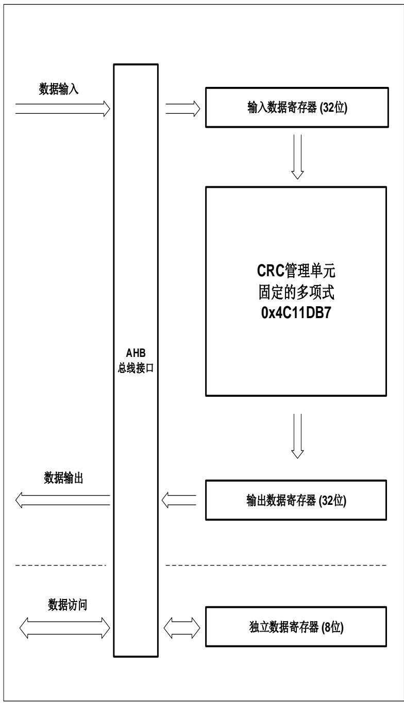

## 9. 循环冗余校验管理单元（CRC）

## 9.1. 简介

循环冗余校验码是一种用在数字网络和存储设备上的差错校验码，可以校验原始数据的偶然差错。

CRC 管理单元使用固定多项式计算 32 位 CRC 校验码。

## 9.2. 主要特征

32位数据输入/输出寄存器。对于32位的输入数据，从数据输入到得出计算结果，需要4个AHB的时钟周期；

配有与计算无关的独立8位寄存器，可以供其他任何外设使用；

固定的计算多项式：0x4C11DB7：

$$
X ^ {3 2} + X ^ {2 6} + X ^ {2 3} + X ^ {2 2} + X ^ {1 6} + X ^ {1 2} + X ^ {1 1} + X ^ {1 0} + X ^ {8} + X ^ {7} + X ^ {5} + X ^ {4} + X ^ {2} + X + 1
$$

该 32 位 CRC 多项式与以太网 CRC 计算多项式相同。

图 9-1. CRC 管理单元框图

## 9.3. 功能说明

CRC管理单元可以用来计算32位的原始数据，CRC_DATA寄存器接收原始数据并存储计算结果。

如果不通过软件设置CRC_CTL寄存器的方式来清除CRC_DATA寄存器，CRC管理单元将基于新输入的原始数据和前一次CRC_DATA寄存器中的结果进行计算。

对于32位的数据长度的CRC计算，因为32位输入缓存的原因，AHB总线将不会被挂起。

此模块提供了一个8位的独立数据寄存器CRC_FDATA。

CRC_FDATA与CRC计算无关，任何时候都可以进行独立的读写操作。

