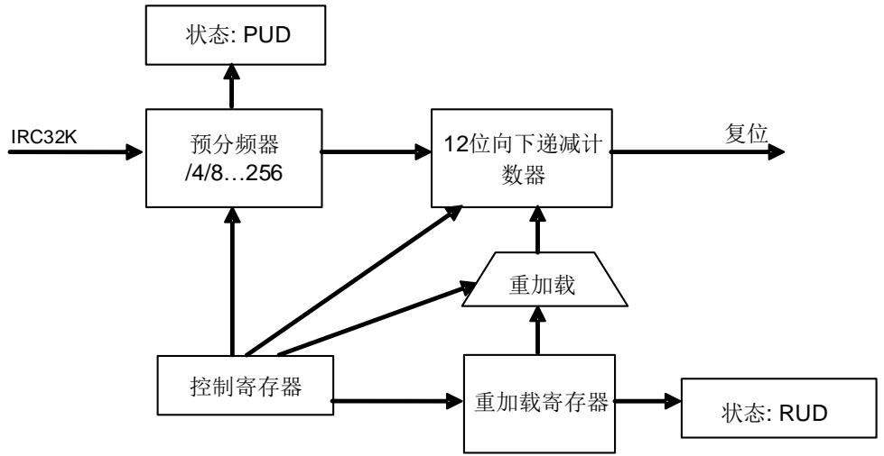

## 16.1. 独立看门狗定时器（FWDGT）

## 16.1.1. 简介

独立看门狗定时器（FWDGT）有独立时钟源（IRC32K）。即使主时钟失效，FWDGT依然能保持正常工作状态，适用于需要独立环境且对计时精度要求不高的场合。

当内部向下计数器的计数值达到0，独立看门狗会产生一个系统复位。使能独立看门狗的寄存器写保护功能可以避免寄存器的值被意外的配置篡改。

## 16.1.2. 主要特征

独立运行的12位向下计数器；

使能看门狗定时器，当向下计数器的值达到0时产生系统复位；

独立时钟源，独立看门狗定时器在主时钟故障（例如待机和深度睡眠模式下）时仍能工作；

◼ 独立看门狗定时器硬件控制位，用来控制是否在上电时自动启动独立看门狗定时器；

可以配置独立看门狗定时器在调试模式下选择停止还是继续工作。

## 16.1.3. 功能说明

独立看门狗定时器带有一个 8 级预分频器和一个 12 位的向下递减计数器。参考 16-1.的独立看门狗定时器的功能模块。

图 16-1. 独立看门狗定时器框图

向控制寄存器（FWDGT_CTL）中写0xCCCC可以开启独立看门狗定时器，计数器开始向下计数。当计数器记到0x000，产生一次系统复位。

在任何时候向FWDGT_CTL中写0xAAAA都可以重装载计数器，重装载值来源于重装载寄存器（FWDGT_RLD）。软件可以在计数器计数值达到0x000之前可以通过重装载计数器来阻止看门狗定时器产生系统复位。

如果在选项字节中打开了“硬件看门狗定时器”功能，那么在上电的时候看门狗定时器就被自动打开。为了避免系统复位，软件应该在计数器达到0x000之前重装载计数器。

预分频寄存器（FWDGT_PSC）和FWDGT_RLD寄存器都有写保护功能。在写数据到这些寄存器之前，需要写0x5555到FWDGT_CTL中。写其他任何值到控制寄存器中将会再次启动对这些寄存器的写保护。当FWDGT_PSC或者FWDGT_RLD更新时，FWDGT_STAT寄存器的状态位被置1。

如果DBG中控制寄存器0（DBG_CTL0）中FWDGT_HOLD位被清0，即使Cortex®-M4内核停止（调试模式下）独立看门狗定时器依然工作。如果FWDGT_HOLD位置1，独立看门狗定时器将在Cortex®-M4内核停止时（调试模式下）停止工作。

表 16-1. 独立看门狗定时器在 32kHz（IRC32K）时的最小 / 最大超时周期

<table><tr><td>预分频系数</td><td>PSC[2:0] 位</td><td>最小超时(ms)RLD[11:0]=0x000</td><td>最大超时(ms)RLD[11:0]=0xFFFF</td></tr><tr><td>1/4</td><td>000</td><td>0.03125</td><td>511.90625</td></tr><tr><td>1/8</td><td>001</td><td>0.03125</td><td>1023.7812</td></tr><tr><td>1/16</td><td>010</td><td>0.03125</td><td>2047.53125</td></tr><tr><td>1/32</td><td>011</td><td>0.03125</td><td>4095.03125</td></tr><tr><td>1/64</td><td>100</td><td>0.03125</td><td>8190.03125</td></tr><tr><td>1/128</td><td>101</td><td>0.03125</td><td>16380.03125</td></tr><tr><td>1/256</td><td>110 or 111</td><td>0.03125</td><td>32760.03125</td></tr></table>

通过校准IRC32K可以使自由看门狗定时器超时更加精确。

注意：1.当执行完喂狗reload操作之后，如需要立即进入deepsleep / standby模式时，必须通过软件设置，在reload命令及deepsleep / standby模式命令中间插入（3个以上）IRC32K时钟间隔。2.两次连续喂狗之间需插入7个及以上IRC32K时钟间隔。

