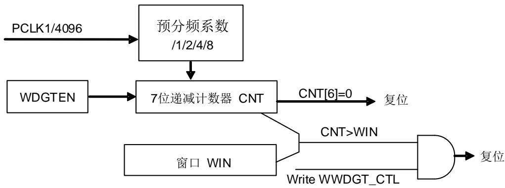
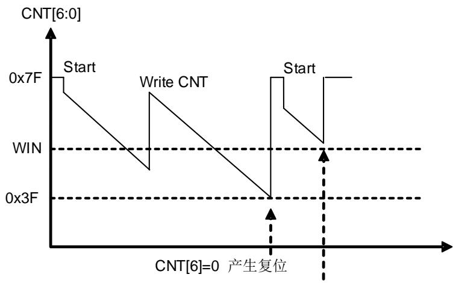

## 16.2. 窗口看门狗定时器（WWDGT）

## 16.2.1. 简介

窗口看门狗定时器（WWDGT）用来监测由软件故障导致的系统故障。窗口看门狗定时器开启后，7位向下递减计数器值逐渐减小。计数值达到0x3F时会产生系统复位（CNT[6]位被清0）。在计数器计数值达到窗口寄存器值之前，计数器的更新也会产生复位。因此软件需要在给定的区间内更新计数器。窗口看门狗定时器在计数器计数值达到0x40会产生一个提前唤醒标志，如果使能中断将会产生中断。

窗口看门狗定时器时钟是由APB1时钟预分频而来。窗口看门狗定时器适用于需要精确计时的场合。

## 16.2.2. 主要特征

可编程的7位自由运行向下递减计数器。

当窗口看门狗使能后，有以下两种情况会产生复位：

当计数器达到0x3F时产生复位；

当计数器的值大于窗口寄存器的值时，更新计数器会产生复位。

提前唤醒中断（EWI）：看门狗定时器打开，中断使能，当计数值达到0x40时将会产生中断。

可以配置窗口看门狗定时器在调试模式下选择停止还是继续工作。

## 16.2.3. 功能说明

如果窗口看门狗定时器使能（将WWDGT_CTL寄存器的WDGTEN位置1），计数值达到0x3F的时候产生系统复位（CNT[6]位被清0）。或是在计数值达到窗口寄存器值之前，更新计数器也会产生系统复位。

图 16-2. 窗口看门狗定时器框图

上电复位之后窗口看门狗定时器总是关闭的。软件可以向WWDGT_CTL的WDGTEN写1开启窗口看门狗定时器。窗口看门狗定时器打开后，计数器始终递减计数，计数器配置的值应该大于0x3F，也就是说CNT[6]位应该被置1。CNT[5:0]决定了两次重装载之间的最大间隔时间。计数器的递减速度取决于APB1时钟和预分频器（WWDGT_CFG寄存器的PSC[1:0]位）。

配置寄存器（WWDGT_CFG）中的WIN[6:0]位用来设定窗口值。当计数器的值小于窗口值，且大于0x3F的时候，重装载向下计数器可以避免复位，否则在其他时候进行重加载就会引起复位。

对WWDGT_CFG寄存器的EWIE位置1可以使能提前唤醒中断（EWI），当计数值达到0x40的时候该中断产生。同时可以用相应的中断服务程序（ISR）来触发特定的行为（例如通信或数据记录），来分析软件故障的原因以及在器件复位的时候挽救重要数据。此外，在ISR中软件可以重装载计数器来管理软件系统检查等。在这种情况下，窗口看门狗定时器将永远不会复位但是可以用于其他地方。

通过将WWDGT_STAT寄存器的EWIF位写0可以清除EWI中断。

图 16-3. 窗口看门狗定时器时序图

当 CNT>WIN 时，写 WWDGT_CTL，引起一次复位

窗口看门狗定时器超时的计算公式如下：

$$
t _ {W W D G T} = t _ {P C L K 1} \times 4 0 9 6 \times 2 ^ {P S C} \times (C N T [ 5: 0 ] + 1) \quad (m s) \tag {式16-1}
$$

其中：

tWWDGT：窗口看门狗定时器的超时时间

t ：APB1以ms为单位的时钟周期

tWWDGT 的最大值和最小值请参考 16-2. 60MHz (fPCLK1) / 。

表 16-2. 在 60MHz (fPCLK1) 时的最大/最小超时值

<table><tr><td>预分频系数</td><td>PSC[1:0]</td><td>最小超时CNT[6:0] =0x40</td><td>最大超时CNT[6:0]=0x7F</td></tr><tr><td>1/1</td><td>00</td><td>68.27 μs</td><td>4.37 ms</td></tr><tr><td>1/2</td><td>01</td><td>136.54 μs</td><td>8.74 ms</td></tr><tr><td>1/4</td><td>10</td><td>273.08 μs</td><td>17.48 ms</td></tr><tr><td>1/8</td><td>11</td><td>546.16 μs</td><td>34.96 ms</td></tr></table>

如果MCU调试模块中的WWDGT_HOLD位被清0，即使Cortex®-M4内核停止工作（调试模式下），窗口看门狗定时器也可以继续工作。当WWDGT_HOLD位被置1时，窗口看门狗定时器在调试模式下停止。

