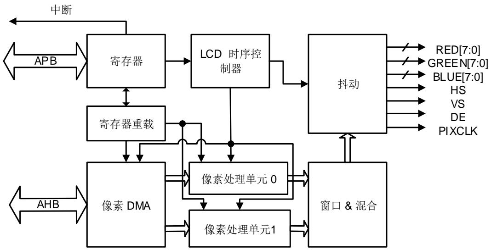
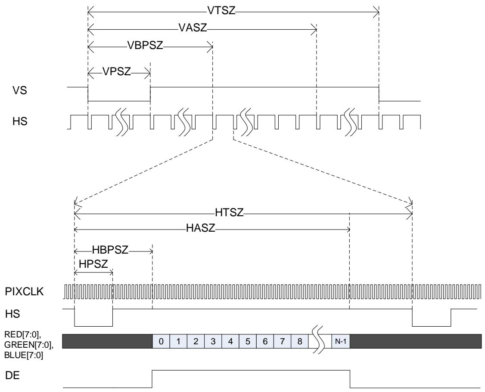
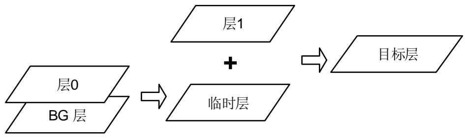

## 23. TFT-LCD 接口（TLI）

## 23.1. 简介

TLI(TFT-LCD接口)连接同步的LCD接口，并且为无源LCD显示屏提供像素数据，时钟以及时序信号。它支持不同的完全可编程的时序参数显示。一个内嵌的DMA不断的从系统存储器搬移数据到TLI然后输出到外部的LCD显示。TLI支持两个独立的显示层，并支持层窗口和层混叠功能。

## 23.2. 主要特点

每像素最多24位并行数据输出；

支持高达2048*2048的分辨率；

完全可编程的时序参数；

内嵌DMA处理像素数据拷贝；

带有窗口和混合功能的两个独立的层；

支持多种像素格式：ARGB8888，RGB888，RGB565等；

支持CLUT(颜色查找表)和色键格式；

像素低位的抖动操作。

## 23.3. 结构框图

23-1. TLI 展示了TLI模块的结构框图。在TLI模块有3个时钟域。寄存器工作在APB时钟域，通过APB总线访问。像素DMA模块工作在AHB时钟域，从系统存储器获取像素数据需要使用AHB总线。剩下的模块工作在TLI时钟域。TLI时钟由PLLSAI-R 分频而得到。PLLSAI参数和分频因子在RCU模块配置。

图 23-1. TLI 模块框图

## 23.4. 信号线描述

TLI提供一个24位RGB并行显示接口，如 23-1. TLI 所示。

表 23-1. TLI 提供的显示接口的引脚

<table><tr><td>方向</td><td>名称</td><td>位宽</td><td>描述</td></tr><tr><td>O</td><td>HS</td><td>1</td><td>水平同步</td></tr><tr><td>O</td><td>VS</td><td>1</td><td>垂直同步</td></tr><tr><td>O</td><td>DE</td><td>1</td><td>数据使能</td></tr><tr><td>O</td><td>PIXCLK</td><td>1</td><td>像素时钟</td></tr><tr><td>O</td><td>RED[7:0]</td><td>8</td><td>红色像素数据</td></tr><tr><td>O</td><td>GREEN[7:0]</td><td>8</td><td>绿色像素数据</td></tr><tr><td>O</td><td>BLUE[7:0]</td><td>8</td><td>蓝色像素数据</td></tr></table>

## 23.5. 功能描述

## 23.5.1. LCD显示时序

LCD接口是一个同步数据接口，包括像素时钟，像素数据以及水平和垂直同步信号。 23-2.展示了一帧的HS和VS信号时序。时序参数在TLI_SPSZ，TLI_BPSZ，TLI_ASZ和TLI_TSZ寄存器中配置。这些时序值寄存器假设第一个点的位置是(0, 0)。

图 23-2. 显示时序图

## 23.5.2. 像素 DMA 功能

根据寄存器模块的配置，像素DMA不断的从存储器读像素数据到内部PPU(像素处理单元)像素缓冲区。

使能之后，像素DMA开始从系统取像素数据，只要像素缓冲区未满，就将这些数据压进像素缓冲区。TLI总是用AHB BURST16方式取像素数据。

TLI支持两个独立的帧层，在系统中每层有不同的帧缓冲区地址。像素DMA仅有一个AHB访问端口，所以如果都使能的话，在取像素的时候，它将交替读取两层的数据。

TLI_LxFBADDR寄存器的FBADD位定义了每层的帧缓冲区地址。

TLI_LxFLLEN寄存器的FLL定义了一行的长度，以字节为单位。如果一行的长度是N，FLL=N+3。

在系统存储器里，两行之间可能有一些间隔存储空间，这一间隔空间信息在TLI_LxFLLEN寄存器的STDOFF位域定义。如果某行第一个像素的地址是M，那么下一行第一个像素的地址将是M+STDOFF。如果两行之间无间隔存储空间，则STDOFF=FLL-3。

TLI_LxFTLN寄存器的FTLN位域定义了一帧的行数。

## 23.5.3. 像素格式

像素DMA以字为单位，将像素数据压入PPU，然后由PPU负责将各种像素格式转换成内部ARGB8888格式。如 23-2. 所示，TLI支持多达8种像素格式。TLI_LxPPF寄存器的PPF[2:0]位域定义了像素格式。

ARGB8888格式要求每通道(Alpha, Red, Green和Blue)有8位数据。但是ARGB1555和ARGB4444格式的某些通道是少于8位的。 PPU通过拷贝高位填充到低位的方式，将其转换成ARGB8888。当处理RGB888和RGB565格式时，PPU假设Alpha=255，并且如果通道的位数少于8，也将拷贝高位填充到低位。

AL88, AL44和L8格式是LUT(颜色查找表)格式。在这些通道里， L是颜色查找表的地址。 TLI有两个内部颜色查找表：每层各一个。内部颜色查找表的大小是256x24bits (256个节点，每节点存储24位RGB值)。当处理LUT格式像素时，PPU从颜色查找表读出一个节点，并用这个节点值作为RGB值。由于颜色查找表的地址是8位的，如果L通道的位数少于8位，PPU也将拷贝高位填充到低位。颜色查找表的节点在复位后是不会被初始化的，因此在显示一个颜色查找表格式层之前，应用程序应该用TLI_LxLUT 寄存器，写入适当的值初始化颜色查找表。

每层都支持色键模式。TLI_LxCKEY 寄存器定义了一个RGB值。当某层的色键模式使能，PPU将会把该层每一个像素的RGB值与TLI_LxCKEY中的值相比较，如果值匹配，将会置该像素的ARGB值为0。

表 23-2. 八种像素格式

<table><tr><td>PPF[2:0]</td><td>像素格式</td></tr><tr><td>000</td><td>ARGB8888</td></tr><tr><td>001</td><td>RGB888</td></tr><tr><td>010</td><td>RGB565</td></tr><tr><td>011</td><td>ARGB1555</td></tr><tr><td>100</td><td>ARGB4444</td></tr><tr><td>111</td><td>AL88</td></tr><tr><td>101</td><td>L8</td></tr><tr><td>110</td><td>AL44</td></tr></table>

## 23.5.4. 层窗口和混合功能

TLI每层都支持窗口功能以及两层的混合功能。TLI首先执行每层的窗口操作，然后将两层混合成一帧。

窗口功能定义了一个显示窗口，每层有独立的窗口参数定义寄存器TLI_LxHPOS和TLI_LxVPOS。窗口参数定义了一层内的显示窗。窗口内的像素将保持它的原值，但是窗口外的像素值将被TLI_LxDC 寄存器定义的像素值替代。

混合单元首先混合层0和BG层得到一个临时层，然后混合层1和临时层，得到目的层。BG层的ARGB值在TLI_BGC寄存器定义。如果某层被禁止，混合功能使用该层的默认颜色。

图 23-3. 混合过程框图

## 混合公式

通用混合公式:

$$
\mathrm{BC} = \mathrm{BF} _ {1} ^ {*} \mathrm{C} + \mathrm{BF} _ {2} ^ {*} \mathrm{C} _ {\mathrm{S}} \tag {23-1}
$$

BC 混合的颜色

BF1 混合因子 1

⚫ C 当前层颜色

BF2混合因子 2

CS下一级层混合的颜色

当前像素的混合因子有两种取值，由寄存器配置。一种是归一化的像素Alpha乘以归一化的恒定Alpha，另一种是归一化的恒定Alpha。

## 23.5.5. Layer 配置重载

如上面所描述的，每层有自己的帧缓冲区，像素格式，窗口，默认颜色配置寄存器并且每个寄存器都有影子寄存器。影子寄存器与真正的寄存器共享相同的地址。每次当应用程序对层相关的寄存器地址执行写操作，相应的影子寄存器立即更新，但是直到一个重载操作前真正寄存器的值是不会改变的，而只有真正寄存器的值才是影响TLI功能的。

应用程序有两种方法触发一个重载操作：请求重载和帧消隐重载。对于请求重载模式，在应用程序设置TLI_RL寄存器的RQR位之后，TLI立即加载影子寄存器的值到真正寄存器。对于帧消隐重载模式，设置TLI_RL寄存器的FBR位之后，TLI等待帧垂直消隐，然后加载影子寄存器的值到真正寄存器。在两种模式下，重载成功完成之后，硬件自动清除RQR或FBR位。

## 23.5.6. 抖动

抖动模块为每一个像素通道加一个2位的伪随机值当18位接口用来显示24位数据的时候，该功能能够使图像更平滑。应用程序可以用TLI_CTL寄存器的DFEN位开启这一功能。

## 23.6. 中断

TLI中有以下错误和状态标志位。中断可以从这些状态判定，状态标志可以触发一个全局中断，错误标志将触发错误中断。

表 23-3. 状态标志

<table><tr><td>状态标志位</td><td>描述</td></tr><tr><td>LMF</td><td>行标记标志</td></tr><tr><td>LCRF</td><td>层配置重载标志</td></tr></table>

表 23-4. 错误标志

<table><tr><td>错误标志位</td><td>描述</td></tr><tr><td>TEF</td><td>传输错误标志</td></tr><tr><td>FEF</td><td>FIFO 错误标志</td></tr></table>

