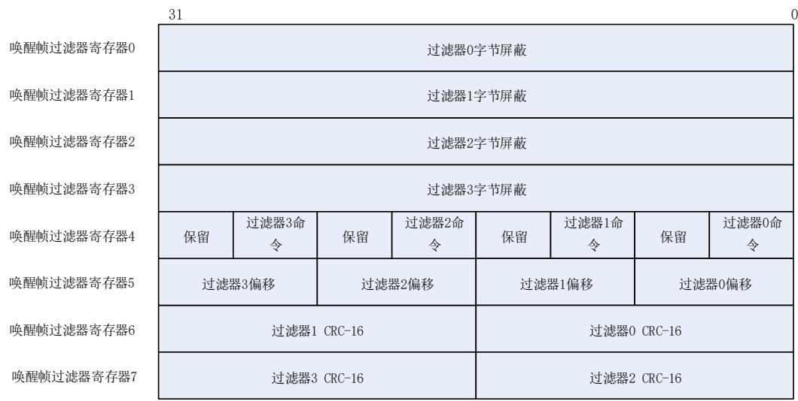

# 27.4. ENET 寄存器

ENET 基地址：0x4002 8000

支持字节，半字和字访问方式。

# 27.4.1. MAC 配置寄存器（ENET_MAC_CFG）

地址偏移：0x0000

复位值：0x0000 8000

MAC配置寄存器是MAC的工作模式寄存器。它定义了接收和发送的工作模式。

该寄存器可以按字节（8位）、半字（16位）或字（32位）访问。

<table><tr><td>31</td><td>30</td><td>29</td><td>28</td><td>27</td><td>26</td><td>25</td><td>24</td><td>23</td><td>22</td><td>21</td><td>20</td><td>19</td><td>18</td><td>17</td><td>16</td></tr><tr><td colspan="6">保留</td><td>TFCD</td><td>保留</td><td>WDD</td><td>JBD</td><td colspan="2">保留</td><td colspan="3">IGBS[2:0]</td><td>CSD</td></tr><tr><td colspan="6"></td><td>rw</td><td></td><td>rw</td><td>rw</td><td colspan="2"></td><td></td><td>rw</td><td></td><td>rw</td></tr><tr><td>15</td><td>14</td><td>13</td><td>12</td><td>11</td><td>10</td><td>9</td><td>8</td><td>7</td><td>6</td><td>5</td><td>4</td><td>3</td><td>2</td><td>1</td><td>0</td></tr><tr><td>保留</td><td>SPD</td><td>ROD</td><td>LBM</td><td>DPM</td><td>IPFCO</td><td>RTD</td><td>保留</td><td>APCD</td><td colspan="2">BOL[1:0]</td><td>DFC</td><td>TEN</td><td>REN</td><td colspan="2">保留</td></tr><tr><td></td><td>rw</td><td>rw</td><td>rw</td><td>rw</td><td>rw</td><td>rw</td><td></td><td>rw</td><td>rw</td><td></td><td>rw</td><td>rw</td><td>rw</td><td></td><td></td></tr></table>

<table><tr><td>位/位域</td><td>名称</td><td>描述</td></tr><tr><td>31:26</td><td>保留</td><td>必须保持复位值。</td></tr><tr><td>25</td><td>TFCD</td><td>类型帧CRC剥离位0: 帧的帧校验序列(最后4字节)在转发之前不会被剥离1: 帧的帧校验序列(最后4字节)在转发之前会被剥离注意: 该位仅在帧的LT域大于0x0600时有效。</td></tr><tr><td>24</td><td>保留</td><td>必须保持复位值。</td></tr><tr><td>23</td><td>WDD</td><td>关闭看门狗该位表示已接收到了最大字节数的数据,超过的部分将被切断。0: MAC允许接收小于或等于2048字节的帧1: MAC关闭接收看门狗定时器,此时最多可接收16384字节的帧。</td></tr><tr><td>22</td><td>JBD</td><td>不检测Jabber该位表示发送帧最大允许的发送字节数,超过的部分将被截断。0: MAC允许的最大发送字节数为2048字节1: MAC关闭发送Jabber定时器,此时最多可发送16384字节的帧。</td></tr><tr><td>21:20</td><td>保留</td><td>必须保持复位值。</td></tr><tr><td>19:17</td><td>IGBS[2:0]</td><td>帧间间隙选择位这些位用于选择2个相邻发送帧之间的最短发送间隙。0x0: 96位时间0x1: 88位时间</td></tr></table>

0x2：80位时间

0x3：72位时间

0x4：64位时间

0x5：56位时间（半双工模式下不可用）

0x6：48位时间（半双工模式下不可用）

0x7：40位时间（半双工模式下不可用）

16 CSD 关闭载波侦听功能

0：MAC载波信号错误时会报错，并终止发送。

1：在半双工模式下，MAC在发送帧过程中忽略MII的CRS信号，发送过程中载波丢失或者没有载波都不会报错。

15 保留 必须保持复位值。

14 SPD 快速以太网速度

该位表示快速以太网模式下的速度：

0：10 Mbit/s 

1：100 Mbit/s 

13 ROD 关闭自接收功能

该位在全双工模式下可忽略

0：MAC在发送时接收所有来自PHY的数据包

1：MAC在半双工模式下不接受帧

12 LBM 回环模式

0：MAC在普通模式下工作

1：MAC在MII的回环模式下工作

11 DPM 双工模式

0：半双工模式使能

1：全双工模式使能

10 IPFCO IP帧数据校验和

0：禁止接收端TCP/UDP/ICMP报头的校验和检验功能

1：使能接收端的帧数据校验和检测功能

9 RTD 不尝试重试

全双工模式下该位可被忽略

0：MAC会在发生冲突后按照BOL位的设定重发高达16次

1：帧仅发送一次

8 保留 必须保持复位值。

自动填充/CRC剥离

该位仅在非标签帧，且其长度域值小于等于1536时有效。

0：MAC会转发所有接收到的帧，而不改变帧的内容。

1：MAC会去除帧的填充字节和CRC域

6:5 BOL[1:0] 退后限制

<table><tr><td></td><td></td><td>在全双工模式下这些位可被忽略</td></tr><tr><td></td><td></td><td>在发生冲突后,MAC在重发当前帧之前需要延迟一段时间。这个延迟时间(dt)的时基单元称为时间间隙,一个时间间隙为512位时间。这个延迟时间(dt)是由下式计算得的随机整数值:0≤dt&lt;2k。</td></tr><tr><td></td><td></td><td>0x0:k=min(n,10)</td></tr><tr><td></td><td></td><td>0x1:k=min(n,8)</td></tr><tr><td></td><td></td><td>0x2:k=min(n,4)</td></tr><tr><td></td><td></td><td>0x3:k=min(n,1)</td></tr><tr><td></td><td></td><td>其中n=重发次数。</td></tr><tr><td>4</td><td>DFC</td><td>顺延检验</td></tr><tr><td></td><td></td><td>在全双工模式下这些位可被忽略</td></tr><tr><td></td><td></td><td>0:禁止MAC顺延检验功能。MAC会延迟发送直到CRS信号失效。</td></tr><tr><td></td><td></td><td>1:MAC顺延检验功能使能。如果延迟超过24288位时间,则会发生过度顺延错误,并且MAC将中止发送。但如果在顺延时间内检测到有效的CRS(载波侦听)信号,则会将顺延计数器重置为0,重新启动顺延计时。</td></tr><tr><td>3</td><td>TEN</td><td>使能发送器</td></tr><tr><td></td><td></td><td>0:MAC关闭发送状态机,若当前帧正在发送则在完成发送后关闭。</td></tr><tr><td></td><td></td><td>1:MAC使能发送状态机</td></tr><tr><td>2</td><td>REN</td><td>使能接收器</td></tr><tr><td></td><td></td><td>0:MAC关闭接收状态机,若当前帧正在接收则在接收完成后关闭。</td></tr><tr><td></td><td></td><td>1:MAC使能接收状态机</td></tr><tr><td>1:0</td><td>保留</td><td>必须保持复位值。</td></tr></table>

# 27.4.2. MAC 帧过滤器寄存器（ENET_MAC_FRMF）

地址偏移：0x0004

复位值：0x0000 0000

MAC帧过滤器寄存器包含了接收帧的过滤模式位。

该寄存器可以按字节（8位）、半字（16位）或字（32位）访问。

<table><tr><td>31</td><td>30</td><td>29</td><td>28</td><td>27</td><td>26</td><td>25</td><td>24</td><td>23</td><td>22</td><td>21</td><td>20</td><td>19</td><td>18</td><td>17</td><td>16</td></tr><tr><td>FAR</td><td colspan="15">保留</td></tr><tr><td>rw</td><td></td><td></td><td></td><td></td><td></td><td></td><td></td><td></td><td></td><td></td><td></td><td></td><td></td><td></td><td></td></tr><tr><td>15</td><td>14</td><td>13</td><td>12</td><td>11</td><td>10</td><td>9</td><td>8</td><td>7</td><td>6</td><td>5</td><td>4</td><td>3</td><td>2</td><td>1</td><td>0</td></tr><tr><td colspan="5">保留</td><td>HPFLT</td><td>SAFLT</td><td>SAIFLT</td><td colspan="2">PCFRM[1:0]</td><td>BFRMD</td><td>MFD</td><td>DAIFLT</td><td>HMF</td><td>HUF</td><td>PM</td></tr><tr><td colspan="5"></td><td>rw</td><td>rw</td><td>rw</td><td colspan="2">rw</td><td>rw</td><td>rw</td><td>rw</td><td>rw</td><td>rw</td><td>rw</td></tr></table>

<table><tr><td>位/位域</td><td>名称</td><td>描述</td></tr><tr><td>31</td><td>FAR</td><td>接收所有帧该位控制帧过滤器功能。0:只有通过了地址过滤器的接收帧才会被转发给应用程序1:所有接收到的帧都会被转发给应用程序,但过滤的结果会反映在更新接收描述符状态信息的相应标志位。</td></tr><tr><td>30:11</td><td>保留</td><td>必须保持复位值。</td></tr><tr><td>10</td><td>HPFLT</td><td>HASH或者完美过滤0:如果HMF位或者HUF位置'1',符合HASH过滤器的帧才能通过接收地址过滤。1:如果HMF位或者HUF位置'1',接收帧通过HASH过滤器或者完美过滤器中任一种,就认为通过接收地址过滤。</td></tr><tr><td>9</td><td>SAFLT</td><td>源地址过滤器除了目标地址过滤之外,使能源地址过滤器。过滤器将接收帧的源地址域值与使能的源地址寄存器中配置的值进行比较。如果源地址值相匹配,则接收描述符中的源地址匹配状态位将置位。0:源地址过滤器关闭1:源地址过滤器使能</td></tr><tr><td>8</td><td>SAIFLT</td><td>源地址过滤结果逆转该位将源地址比较结果逆转。0:仅在源地址过滤器结果逆转1:使能源地址过滤器结果逆转,所有源地址符合源地址寄存器的帧会被标记为未通过源地址过滤。</td></tr><tr><td>7:6</td><td>PCFRM[1:0]</td><td>控制帧转发位这些位用于设置所有控制帧的转发条件(包括单播和多播暂停帧)。对于是否处理暂停控制帧,只取决于RFCEN位(ENET_MAC_FCTL[2])的值。0x0:MAC不转发任何控制帧给应用程序0x1:MAC转发除了暂停帧以外的其他控制帧给应用程序0x2:MAC转发所有的控制帧给应用程序,即使是没通过地址过滤器的控制帧。0x3:MAC转发通过地址过滤器的控制帧给应用程序</td></tr><tr><td>5</td><td>BFRMD</td><td>不接收广播帧0:过滤器接收所有广播帧1:过滤器不接收所有广播帧</td></tr><tr><td>4</td><td>MFD</td><td>关闭多播过滤器0:是否对多播帧进行过滤,取决于HMF位的取值。1:所有的带多播目标地址的帧(帧的目标地址域中第一位为'1',但不是所有位都为'1')都能通过过滤器。</td></tr><tr><td>3</td><td>DAIFLT</td><td>目标地址过滤结果逆转该位将目标地址过滤结果逆转。0:禁用目标地址过滤结果逆转1:使能目标地址过滤结果逆转</td></tr><tr><td>2</td><td>HMF</td><td>多播HASH过滤器0:MAC会将接收到的多播帧的目标地址域和目标地址寄存器的设定值比较1:MAC根据HASH列表对接收到的多播帧进行目标地址过滤</td></tr><tr><td>1</td><td>HUF</td><td>单播HASH过滤器0:MAC会将接收到的单播帧目标地址域和目标地址寄存器的设定值比较1:MAC根据HASH列表对接收到的单播帧进行目标地址过滤</td></tr><tr><td>0</td><td>PM</td><td>混杂模式</td></tr><tr><td></td><td></td><td>该位使地址过滤器无效,这意味着所有帧均可通过过滤器,同时接收描述符中状态信息的目标地址/源地址错误位总是为'0'。</td></tr><tr><td></td><td></td><td>0:禁用混杂模式</td></tr><tr><td></td><td></td><td>1:使能混杂模式</td></tr></table>

# 27.4.3. MAC hash 列表高寄存器（ENET_MAC_HLH）

地址偏移：0x0008

复位值：0x0000 0000

该寄存器可以按字节（8位）、半字（16位）或字（32位）访问。

<table><tr><td>31</td><td>30</td><td>29</td><td>28</td><td>27</td><td>26</td><td>25</td><td>24</td><td>23</td><td>22</td><td>21</td><td>20</td><td>19</td><td>18</td><td>17</td><td>16</td></tr><tr><td colspan="16">HLH[31:16]</td></tr><tr><td colspan="16">rw</td></tr><tr><td>15</td><td>14</td><td>13</td><td>12</td><td>11</td><td>10</td><td>9</td><td>8</td><td>7</td><td>6</td><td>5</td><td>4</td><td>3</td><td>2</td><td>1</td><td>0</td></tr><tr><td colspan="16">HLH[15:0]</td></tr><tr><td colspan="16">rw</td></tr></table>

<table><tr><td>位/位域</td><td>名称</td><td>描述</td></tr><tr><td>31:0</td><td>HLH[31:0]</td><td>HASH列表高位这些位是HASH列表的高32位。</td></tr></table>

# 27.4.4. MAC hash 列表低寄存器（ENET_MAC_HLL）

地址偏移：0x000C

复位值：0x0000 0000

该寄存器可以按字节（8位）、半字（16位）或字（32位）访问。

<table><tr><td>31</td><td>30</td><td>29</td><td>28</td><td>27</td><td>26</td><td>25</td><td>24</td><td>23</td><td>22</td><td>21</td><td>20</td><td>19</td><td>18</td><td>17</td><td>16</td></tr><tr><td colspan="16">HLL[31:16]</td></tr><tr><td colspan="16">rw</td></tr><tr><td>15</td><td>14</td><td>13</td><td>12</td><td>11</td><td>10</td><td>9</td><td>8</td><td>7</td><td>6</td><td>5</td><td>4</td><td>3</td><td>2</td><td>1</td><td>0</td></tr><tr><td colspan="16">HLL[15:0]</td></tr><tr><td colspan="16">rw</td></tr></table>

<table><tr><td>位/位域</td><td>名称</td><td>描述</td></tr><tr><td>31:0</td><td>HLL[31:0]</td><td>HASH列表低位这些位是HASH列表的低32位。</td></tr></table>

# 27.4.5. MAC PHY 控制寄存器（ENET_MAC_PHY_CTL）

地址偏移：0x0010

复位值：0x0000 0000

<table><tr><td colspan="15">该寄存器可以按字节(8位)、半字(16位)或字(32位)访问。</td><td></td></tr><tr><td>31</td><td>30</td><td>29</td><td>28</td><td>27</td><td>26</td><td>25</td><td>24</td><td>23</td><td>22</td><td>21</td><td>20</td><td>19</td><td>18</td><td>17</td><td>16</td></tr><tr><td colspan="16">保留</td></tr><tr><td>15</td><td>14</td><td>13</td><td>12</td><td>11</td><td>10</td><td>9</td><td>8</td><td>7</td><td>6</td><td>5</td><td>4</td><td>3</td><td>2</td><td>1</td><td>0</td></tr><tr><td colspan="5">PA[4:0]</td><td colspan="5">PR[4:0]</td><td>保留</td><td colspan="3">CLR[2:0]</td><td>PW</td><td>PB</td></tr><tr><td colspan="5">rw</td><td colspan="5">rw</td><td colspan="3">rw</td><td>rw</td><td colspan="2">rc_w1</td></tr></table>

<table><tr><td>位/位域</td><td>名称</td><td>描述</td></tr><tr><td>31:16</td><td>保留</td><td>必须保持复位值。</td></tr><tr><td>15:11</td><td>PA[4:0]</td><td>PHY地址这些位选择想要访问的PHY地址。</td></tr><tr><td>10:6</td><td>PR[4:0]</td><td>PHY寄存器这些位选择想要访问的PHY寄存器。</td></tr><tr><td>5</td><td>保留</td><td>必须保持复位值。</td></tr><tr><td>4:2</td><td>CLR[2:0]</td><td>时钟范围根据HCLK的频率来决定MDC的时钟分频系数。0x0:HCLK/42(HCLK范围:60-100 MHz)0x1:HCLK/62(HCLK范围:100-150 MHz)0x2:HCLK/16(HCLK范围:20-35 MHz)0x3:HCLK/26(HCLK范围:35-60 MHz)0x4:HCLK/102(HCLK范围:150-240 MHz)其他:保留。</td></tr><tr><td>1</td><td>PW</td><td>PHY写该位指示了PHY的操作模式。0:对PHY进行读操作1:对PHY进行写操作</td></tr><tr><td>0</td><td>PB</td><td>PHY忙该位指示了对PHY操作的状态。由应用程序置&#x27;1&#x27;后开始对PHY的进行读或者写操作,并需等到该位在操作完成后由硬件清&#x27;0&#x27;。在写ENET_MAC_PHY_CTL寄存器和读ENET_MAC_PHY_DATA寄存器之前,该位应当为&#x27;0&#x27;。</td></tr></table>

# 27.4.6. MAC PHY 数据寄存器（ENET_MAC_PHY_DATA）

地址偏移：0x0014

复位值：0x0000 0000

该寄存器可以按字节（8位）、半字（16位）或字（32位）访问。

<table><tr><td>31</td><td>30</td><td>29</td><td>28</td><td>27</td><td>26</td><td>25</td><td>24</td><td>23</td><td>22</td><td>21</td><td>20</td><td>19</td><td>18</td><td>17</td><td>16</td></tr><tr><td colspan="16">保留</td></tr><tr><td>15</td><td>14</td><td>13</td><td>12</td><td>11</td><td>10</td><td>9</td><td>8</td><td>7</td><td>6</td><td>5</td><td>4</td><td>3</td><td>2</td><td>1</td><td>0</td></tr><tr><td colspan="16">PD[15:0]</td></tr></table>

rw 

<table><tr><td>位/位域</td><td>名称</td><td>描述</td></tr><tr><td>31:16</td><td>保留</td><td>必须保持复位值。</td></tr><tr><td>15:0</td><td>PD[15:0]</td><td>PHY数据位对于读操作,这些位为从PHY中读取的数据。对于写操作,这些位为将要写到PHY中的数据。</td></tr></table>

# 27.4.7. MAC 流控寄存器（ENET_MAC_FCTL）

地址偏移：0x0018

复位值：0x0000 0000

该寄存器用于配置控制帧的生成和接收。

该寄存器可以按字节（8位）、半字（16位）或字（32位）访问。

<table><tr><td colspan="15">PTM[15:0]</td><td></td></tr><tr><td colspan="15">rw</td><td></td></tr><tr><td>15</td><td>14</td><td>13</td><td>12</td><td>11</td><td>10</td><td>9</td><td>8</td><td>7</td><td>6</td><td>5</td><td>4</td><td>3</td><td>2</td><td>1</td><td>0</td></tr><tr><td colspan="8">保留</td><td>DZQP</td><td>保留</td><td colspan="2">PLTS[1:0]</td><td>UPFDT</td><td>RFCEN</td><td>TFCEN</td><td>FLCB/BK PA</td></tr><tr><td colspan="8"></td><td>rw</td><td></td><td colspan="2">rw</td><td>rw</td><td>rw</td><td>rw</td><td>rw</td></tr></table>

<table><tr><td>位/位域</td><td>名称</td><td>描述</td></tr><tr><td>31:16</td><td>PTM[15:0]</td><td>暂停时间这些位用来设置暂停控制帧时间域的值。</td></tr><tr><td>15:8</td><td>保留</td><td>必须保持复位值。</td></tr><tr><td>7</td><td>DZQP</td><td>关闭零时间片暂停功能0:打开零时间片暂停控制帧自动生成功能1:关闭零时间片暂停控制帧的自动生成</td></tr><tr><td>6</td><td>保留</td><td>必须保持复位值。</td></tr><tr><td>5:4</td><td>PLTS[1:0]</td><td>暂停低阈值这些位设置了自动重发暂停帧的定时器阈值。这个阈值应当大于0,小于位[31:16]定义的暂停时间。低阈值的计算公式为PTM-PLTS。例如,PTM=0x80(128个时间间隙),PLTS=0x1(28个时间间隙),那么在第一个暂停帧发出100(128-28)个时间间隙后,将自动重发第二个暂停帧。0x0:暂停时间-4个时间间隙0x1:暂停时间-28个时间间隙0x2:暂停时间-144个时间间隙</td></tr></table>

0x3：暂停时间 – 256个时间间隙

注意：一个时间间隙是指MII接口发送512位（64字节）数据所需要的时间。

3 UPFDT 

单播暂停帧检测

0：MAC只接收符合IEEE802.3规范定义的唯一多播地址的暂停帧

1 ： 除 了 唯 一 多 播 地 址 的 暂 停 帧 ， MAC 同 时 还 会 使 用 MAC0 地 址（ENET_MAC_ADDR0H寄存器和ENET_MAC_ADDR0L寄存器）来检测暂停帧。

2 RFCEN 

接收流控使能位

0：MAC不解析暂停帧

1：MAC解析并处理接收到的暂停帧。MAC关闭发送器一段指定的时间（接收帧中的暂停时间域值）。

1 TFCEN 

发送流控使能位

0：MAC关闭发送流控功能。在全双工模式下，MAC不发送暂停帧；在半双工模式下，MAC关闭背压功能。

1：MAC开启发送流控功能。在全双工模式下，MAC使能暂停帧发送；在半双工模式下，MAC使能背压功能。

0 FLCB/BKPA 

流控忙/背压激活

该位仅在TFCEN位置位时有效。

在全双工模式下，该位可发送暂停帧；在半双工模式下，该位可激活背压功能。

在全双工模式下，应用程序要确保在写ENET_MAC_FCTL寄存器之前该位为’0’。置位该位后，MAC将发送一个暂停帧到接口，在发送控制帧的过程中，该位始终为’1’，直到暂停控制帧发送完成以后，MAC将该位重置为’0’。

在半双工模式下，设置该位为’1’可以激活背压功能。在背压功能有效时，如果MAC接收到新的帧，就会在发送端发送阻塞信号，通知有冲突发生。

# 27.4.8. MAC VLAN 标签寄存器（ENET_MAC_VLT）

地址偏移：0x001C

复位值：0x0000 0000

该寄存器包含了用来识别VLAN帧的IEEE802.1Q VLAN标签。MAC把接收到帧的第13，14字节（长度/类型域）与0x8100比较，再把之后的2个字节（第15，16字节）和VLAN标签比较。

该寄存器可以按字节（8位）、半字（16位）或字（32位）访问。

<table><tr><td>31</td><td>30</td><td>29</td><td>28</td><td>27</td><td>26</td><td>25</td><td>24</td><td>23</td><td>22</td><td>21</td><td>20</td><td>19</td><td>18</td><td>17</td><td>16</td></tr><tr><td colspan="15">保留</td><td>VLTC</td></tr><tr><td colspan="16">rw</td></tr><tr><td>15</td><td>14</td><td>13</td><td>12</td><td>11</td><td>10</td><td>9</td><td>8</td><td>7</td><td>6</td><td>5</td><td>4</td><td>3</td><td>2</td><td>1</td><td>0</td></tr><tr><td colspan="16">VLTI[15:0]</td></tr></table>

rw

<table><tr><td>位/位域</td><td>名称</td><td>描述</td></tr><tr><td>31:17</td><td>保留</td><td>必须保持复位值。</td></tr><tr><td>16</td><td>VLTC</td><td>12位VLAN标签比较位该位选择用12位或16位VLAN标签来进行比较。</td></tr></table>

0：接收到的VLAN帧的全部16位数据（第15和16字节）都用来与VLTI位比对1：仅用VLTI位[11:0]12位数据和接收到VLAN帧的相应域比对

15:0 VLTI[15:0] 

VLAN标签标识符位

这些位用来识别VLAN帧的802.1Q VLAN标签格式。格式如下：

VLTI[15:13]：UP（用户优先级）

VLTI[12]：CFI（标准格式指示符）

VLTI[11:0]：VID（VLAN标识符）

如果比较的位（当VLTC=1，则为VLTI[11:0]；当VLTC=0，则为VLTI[15:0]）值是全’0’，则MAC不再比对检验VLAN帧的第15、16字节，并将接收帧的类型域值是0x8100的帧都直接视为VLAN帧。

如果用于比较的位不是全为’0’，则使用VLTI[11:0]（VLTC=1）或VLTI[15:0]（VLTC=0）进行比较。

# 27.4.9. MAC 远程唤醒帧过滤器寄存器（ENET_MAC_RWFF）

地址偏移：0x0028

复位值：0x0000 0000

该寄存器实质上是指向8个不透明的唤醒帧过滤器寄存器的指针（使用同一个偏移地址）。对该寄存器地址(偏移为0x0028)的8次连续写操作，可以写入全部8个唤醒帧过滤器寄存器；对该寄存器地址（偏移为0x0028）的8次连续读操作，可以读出全部8个唤醒帧过滤器寄存器。

该寄存器可以按字节（8位）、半字（16位）或字（32位）访问。

图 27-15. 远程唤醒帧过滤器寄存器

# 27.4.10. MAC 唤醒管理寄存器（ENET_MAC_WUM）

地址偏移：0x002C

复位值：0x0000 0000

该寄存器设置并监控唤醒事件。

<table><tr><td colspan="15">该寄存器可以按字节(8位)、半字(16位)或字(32位)访问。</td><td></td></tr><tr><td>31</td><td>30</td><td>29</td><td>28</td><td>27</td><td>26</td><td>25</td><td>24</td><td>23</td><td>22</td><td>21</td><td>20</td><td>19</td><td>18</td><td>17</td><td>16</td></tr><tr><td>WUFFRPR</td><td colspan="15">保留</td></tr><tr><td>rs</td><td></td><td></td><td></td><td></td><td></td><td></td><td></td><td></td><td></td><td></td><td></td><td></td><td></td><td></td><td></td></tr><tr><td>15</td><td>14</td><td>13</td><td>12</td><td>11</td><td>10</td><td>9</td><td>8</td><td>7</td><td>6</td><td>5</td><td>4</td><td>3</td><td>2</td><td>1</td><td>0</td></tr><tr><td colspan="6">保留</td><td>GU</td><td colspan="2">保留</td><td>WUFR</td><td>MPKR</td><td colspan="2">保留</td><td>WFEN</td><td>MPEN</td><td>PWD</td></tr><tr><td></td><td></td><td></td><td></td><td></td><td></td><td>rw</td><td></td><td></td><td>rc_r</td><td>rc_r</td><td></td><td></td><td>rw</td><td>rw</td><td>rs</td></tr></table>

<table><tr><td>位/位域</td><td>名称</td><td>描述</td></tr><tr><td>31</td><td>WUFFRPR</td><td>唤醒帧过滤器寄存器指针复位向该位写&#x27;1&#x27;,将会把远程唤醒帧过滤器寄存器指针ENET_MAC_RWFF复位,该位在指针复位完成后自动清&#x27;0&#x27;。0:无作用1:复位ENET_MAC_RWFF寄存器指针</td></tr><tr><td>30:10</td><td>保留</td><td>必须保持复位值。</td></tr><tr><td>9</td><td>GU</td><td>全局单播向该位写1,所有能通过MAC地址过滤器的单播帧,都被认为是唤醒帧。0:不是所有接收的单播帧都被认为是唤醒帧1:所有能通过MAC地址过滤器的单播帧,都被认为是唤醒帧。</td></tr><tr><td>8:7</td><td>保留</td><td>必须保持复位值。</td></tr><tr><td>6</td><td>WUFR</td><td>接收到唤醒帧读本寄存器可以清&#x27;0&#x27;该位。0:没有接收到唤醒帧1:接收到唤醒帧,并发生唤醒事件。</td></tr><tr><td>5</td><td>MPKR</td><td>接收到Magic Packet读本寄存器可以清&#x27;0&#x27;该位。0:没有接收到Magic Packet1:接收到Magic Packet帧,并发生唤醒事件。</td></tr><tr><td>4:3</td><td>保留</td><td>必须保持复位值。</td></tr><tr><td>2</td><td>WFEN</td><td>唤醒帧使能位0:禁能在接收到唤醒帧时产生唤醒事件1:使能在接收到唤醒帧时产生唤醒事件</td></tr><tr><td>1</td><td>MPEN</td><td>Magic Packet使能位0:禁能在接收到Magic Packet唤醒帧时产生唤醒事件1:使能在接收到Magic Packet唤醒帧时产生唤醒事件</td></tr><tr><td>0</td><td>PWD</td><td>低功耗位该位由软件置位,由硬件复位。当该位置位,MAC丢弃所有接收到的帧。当发生了唤醒事件,使得退出低功耗模式,硬件会自动将该位清&#x27;0&#x27;。</td></tr></table>

# 27.4.11. MAC 调试寄存器（ENET_MAC_DBG）

地址偏移：0x0034

复位值：0x0000 0000

该寄存器可以按字节（8位）、半字（16位）或字（32位）访问。

<table><tr><td>31</td><td>30</td><td>29</td><td>28</td><td>27</td><td>26</td><td>25</td><td>24</td><td>23</td><td>22</td><td>21</td><td>20</td><td>19</td><td>18</td><td>17</td><td>16</td></tr><tr><td colspan="6">保留</td><td>TXFF</td><td>TXFNE</td><td>保留</td><td>TXFW</td><td colspan="2">TXFRS[1:0]</td><td>PCS</td><td colspan="2">SOMT[1:0]</td><td>MTNI</td></tr><tr><td></td><td></td><td></td><td></td><td></td><td></td><td>ro</td><td>ro</td><td></td><td>ro</td><td colspan="2">ro</td><td>ro</td><td colspan="2">ro</td><td>ro</td></tr><tr><td>15</td><td>14</td><td>13</td><td>12</td><td>11</td><td>10</td><td>9</td><td>8</td><td>7</td><td>6</td><td>5</td><td>4</td><td>3</td><td>2</td><td>1</td><td>0</td></tr><tr><td colspan="6">保留</td><td colspan="2">RXFS[1:0]</td><td>保留</td><td colspan="2">RXFRS[1:0]</td><td>RXFW</td><td>保留</td><td colspan="2">RXAFS[1:0]</td><td>MRNI</td></tr><tr><td></td><td></td><td></td><td></td><td></td><td></td><td colspan="2">ro</td><td></td><td>ro</td><td colspan="2">ro</td><td></td><td colspan="2">ro</td><td>ro</td></tr></table>

<table><tr><td>位/位域</td><td>名称</td><td>描述</td></tr><tr><td>31:26</td><td>保留</td><td>必须保持复位值。</td></tr><tr><td>25</td><td>TXFF</td><td>TxFIFO满标志位0: TxFIFO未满1: TxFIFO已满</td></tr><tr><td>24</td><td>TXFNE</td><td>TxFIFO非空标志位0: TxFIFO空1: TxFIFO不为空</td></tr><tr><td>23</td><td>保留</td><td>必须保持复位值。</td></tr><tr><td>22</td><td>TXFW</td><td>正在写TxFIFO0: 没有向TxFIFO写帧数据1: 正在向TxFIFO写帧数据</td></tr><tr><td>21:20</td><td>TXFRS[1:0]</td><td>TxFIFO读操作状态0x0: 空闲状态0x1: 读状态0x2: 等待MAC发送器返回Tx状态0x3: 写发送描述符状态,或清空TxFIFO。</td></tr><tr><td>19</td><td>PCS</td><td>暂停状态0: MAC发送器不处于暂停状态1: MAC发送器处于暂停状态,并暂停发送帧。</td></tr><tr><td>18:17</td><td>SOMT[1:0]</td><td>MAC发送器状态0x0: 空闲状态0x1: 等待前一帧的状态返回或IFG/BACKOFF周期结束0x2: 对于全双工模式,表示正在发送暂停控制帧。0x3: 从FIFO读取待发送的帧</td></tr><tr><td>16</td><td>MTNI</td><td>MAC发送器不空闲位0: MAC发送器处于空闲状态1: MAC发送器处于非空闲状态</td></tr><tr><td>15:10</td><td>保留</td><td>必须保持复位值。</td></tr><tr><td>9:8</td><td>RXFS</td><td>RxFIFO状态0x0: RxFIFO空0x1: RxFIFO中字节数低于流控下阈值0x2: RxFIFO中字节数高于流控上阈值0x3: RxFIFO满</td></tr><tr><td>7</td><td>保留</td><td>必须保持复位值。</td></tr><tr><td>6:5</td><td>RXFRS[1:0]</td><td>RxFIFO读操作状态0x0: 空闲状态0x1: 读数据帧状态0x2: 读帧状态(包括时间戳)0x3: 清空帧</td></tr><tr><td>4</td><td>RXFW</td><td>正在写RxFIFO0: 没有向RxFIFO中写帧数据1: 正在向RxFIFO写帧数据</td></tr><tr><td>3</td><td>保留</td><td>必须保持复位值。</td></tr><tr><td>2:1</td><td>RXAFS[1:0]</td><td>Rx异步FIFO状态RXAFS[1]: Rx异步FIFO在HCLK时钟域进行读操作(MAC取出数据)RXAFS[0]: Rx异步FIFO在MAC RX_CLK时钟域进行写操作(MAC存入数据)</td></tr><tr><td>0</td><td>MRNI</td><td>MAC接收器不空闲位0: MAC接收器处于空闲状态1: MAC接收器处于非空闲状态</td></tr></table>

# 27.4.12. MAC 中断状态寄存器（ENET_MAC_INTF）

地址偏移：0x0038

复位值：0x0000 0000

该寄存器可以按字节（8位）、半字（16位）或字（32位）访问。

<table><tr><td>31</td><td>30</td><td>29</td><td>28</td><td>27</td><td>26</td><td>25</td><td>24</td><td>23</td><td>22</td><td>21</td><td>20</td><td>19</td><td>18</td><td>17</td><td>16</td></tr><tr><td colspan="16">保留</td></tr><tr><td>15</td><td>14</td><td>13</td><td>12</td><td>11</td><td>10</td><td>9</td><td>8</td><td>7</td><td>6</td><td>5</td><td>4</td><td>3</td><td>2</td><td>1</td><td>0</td></tr><tr><td colspan="6">保留</td><td>TMST</td><td colspan="2">保留</td><td>MSCT</td><td>MSCR</td><td>MSC</td><td>WUM</td><td colspan="3">保留</td></tr><tr><td colspan="6"></td><td colspan="3">rc_r</td><td>r</td><td>r</td><td>r</td><td>r</td><td colspan="3"></td></tr></table>

<table><tr><td>位/位域</td><td>名称</td><td>描述</td></tr><tr><td>31:10</td><td>保留</td><td>必须保持复位值。</td></tr><tr><td>9</td><td>TMST</td><td>时间戳触发状态读ENET_PTP_TSF寄存器可以清'0'该位。0:系统时间值小于期望时间值1:系统时间值等于或者超过期望时间值</td></tr><tr><td>8:7</td><td>保留</td><td>必须保持复位值。</td></tr><tr><td>6</td><td>MSCT</td><td>MSC发送状态0:没有产生任一ENET_MSC_TINTF寄存器中的中断1:产生任一ENET_MSC_TINTF寄存器中的中断</td></tr><tr><td>5</td><td>MSCR</td><td>MSC接收状态0:没有产生任一ENET_MSC_RINTF寄存器中的中断1:产生任一ENET_MSC_RINTF寄存器中的中断</td></tr><tr><td>4</td><td>MSC</td><td>MSC状态该位为MSCT位与MSCR位的逻辑或。0:MSCT位和MSCR位均为'0'1:MSCT位和MSCR位中有位为'1'</td></tr><tr><td>3</td><td>WUM</td><td>WUM状态该位为ENET_MAC_WUM寄存器中的WUFR和MPKR位的逻辑或。0:未接收到唤醒帧或者Magic Packet帧1:在低功耗模式下,接收到唤醒帧或者Magic Packet。</td></tr><tr><td>2:0</td><td>保留</td><td>必须保持复位值。</td></tr></table>

# 27.4.13. MAC 中断屏蔽寄存器（ENET_MAC_INTMSK）

地址偏移：0x003C

复位值：0x0000 0000

该寄存器可以按字节（8位）、半字（16位）或字（32位）访问。

<table><tr><td>31</td><td>30</td><td>29</td><td>28</td><td>27</td><td>26</td><td>25</td><td>24</td><td>23</td><td>22</td><td>21</td><td>20</td><td>19</td><td>18</td><td>17</td><td>16</td></tr><tr><td colspan="16">保留</td></tr><tr><td>15</td><td>14</td><td>13</td><td>12</td><td>11</td><td>10</td><td>9</td><td>8</td><td>7</td><td>6</td><td>5</td><td>4</td><td>3</td><td>2</td><td>1</td><td>0</td></tr><tr><td colspan="6">保留</td><td>TMSTIM</td><td colspan="5">保留</td><td>WUMIM</td><td colspan="3">保留</td></tr><tr><td colspan="12">rw</td><td colspan="4">rw</td></tr></table>

<table><tr><td>位/位域</td><td>名称</td><td>描述</td></tr><tr><td>31:10</td><td>保留</td><td>必须保持复位值。</td></tr><tr><td>9</td><td>TMSTIM</td><td>时间戳触发中断屏蔽位0:允许产生时间戳中断1:禁止产生时间戳中断</td></tr><tr><td>8:4</td><td>保留</td><td>必须保持复位值。</td></tr><tr><td>3</td><td>WUMIM</td><td>WUM中断屏蔽位0:允许由于ENET_MAC_INTF寄存器的WUM状态位置位而引发的中断1:禁止由于ENET_MAC_INTF寄存器的WUM状态位置1而引发的中断</td></tr><tr><td>2:0</td><td>保留</td><td>必须保持复位值。</td></tr></table>

# 27.4.14. MAC 地址 0 高寄存器（ENET_MAC_ADDR0H）

地址偏移：0x0040

复位值：0x8000 FFFF

该寄存器可以按字节（8位）、半字（16位）或字（32位）访问。

<table><tr><td>31</td><td>30</td><td>29</td><td>28</td><td>27</td><td>26</td><td>25</td><td>24</td><td>23</td><td>22</td><td>21</td><td>20</td><td>19</td><td>18</td><td>17</td><td>16</td></tr><tr><td>MO</td><td colspan="15">保留</td></tr><tr><td>rw</td><td></td><td></td><td></td><td></td><td></td><td></td><td></td><td></td><td></td><td></td><td></td><td></td><td></td><td></td><td></td></tr><tr><td>15</td><td>14</td><td>13</td><td>12</td><td>11</td><td>10</td><td>9</td><td>8</td><td>7</td><td>6</td><td>5</td><td>4</td><td>3</td><td>2</td><td>1</td><td>0</td></tr><tr><td colspan="16">ADDR0H[15:0]</td></tr></table>

rw

<table><tr><td>位/位域</td><td>名称</td><td>描述</td></tr><tr><td>31</td><td>MO</td><td>该位总是为&#x27;1&#x27;。</td></tr><tr><td>30:16</td><td>保留</td><td>必须保持复位值。</td></tr><tr><td>15:0</td><td>ADDR0H[15:0]</td><td>MAC地址0高16位这些位包含了6字节MAC地址0的高16位,这些位用于作为接收帧的地址过滤,还用于发送流控中发送暂停帧时插入作为帧的源地址。</td></tr></table>

# 27.4.15. MAC 地址 0 低寄存器（ENET_MAC_ADDR0L）

地址偏移：0x0044

复位值：0xFFFF FFFF

该寄存器可以按字节（8位）、半字（16位）或字（32位）访问。

<table><tr><td>31</td><td>30</td><td>29</td><td>28</td><td>27</td><td>26</td><td>25</td><td>24</td><td>23</td><td>22</td><td>21</td><td>20</td><td>19</td><td>18</td><td>17</td><td>16</td></tr><tr><td colspan="16">ADDR0L[31:16]</td></tr><tr><td colspan="16">rw</td></tr><tr><td>15</td><td>14</td><td>13</td><td>12</td><td>11</td><td>10</td><td>9</td><td>8</td><td>7</td><td>6</td><td>5</td><td>4</td><td>3</td><td>2</td><td>1</td><td>0</td></tr><tr><td colspan="16">ADDR0L[15:0]</td></tr></table>

rw

<table><tr><td>位/位域</td><td>名称</td><td>描述</td></tr><tr><td>31:0</td><td>ADDR0L[31:0]</td><td>MAC地址0低32位这些位包含了6字节MAC地址0的低32位,这些位用于作为接收帧的地址过滤,</td></tr></table>

还用于发送流控中发送暂停帧时插入作为帧的源地址。

# 27.4.16. MAC 地址 1 高寄存器（ENET_MAC_ADDR1H）

地址偏移：0x0048

复位值：0x0000 FFFF

该寄存器可以按字节（8位）、半字（16位）或字（32位）访问。

<table><tr><td>31</td><td>30</td><td>29</td><td>28</td><td>27</td><td>26</td><td>25</td><td>24</td><td>23</td><td>22</td><td>21</td><td>20</td><td>19</td><td>18</td><td>17</td><td>16</td></tr><tr><td>AFE</td><td>SAF</td><td colspan="6">MB[5:0]</td><td colspan="8">保留</td></tr><tr><td>rw</td><td>rw</td><td colspan="14">rw</td></tr><tr><td>15</td><td>14</td><td>13</td><td>12</td><td>11</td><td>10</td><td>9</td><td>8</td><td>7</td><td>6</td><td>5</td><td>4</td><td>3</td><td>2</td><td>1</td><td>0</td></tr><tr><td colspan="16">ADDR1H[15:0]</td></tr></table>

rw 

<table><tr><td>位/位域</td><td>名称</td><td>描述</td></tr><tr><td>31</td><td>AFE</td><td>地址过滤使能0:不使用MAC地址1进行地址过滤1:地址过滤器使用MAC地址1来进行完美过滤</td></tr><tr><td>30</td><td>SAF</td><td>源地址过滤器0:MAC地址1[47:0]用来和接收帧的目标地址进行比对1:MAC地址1[47:0]用来和接收帧的源地址进行比对</td></tr><tr><td>29:24</td><td>MB[5:0]</td><td>屏蔽字节位当某个位置&#x27;1&#x27;时,MAC不再把接收帧目标地址/源地址的对应字节与MAC地址1的相应字节进行比较。每个控制位对应的MAC地址字节如下:MB[5]:ENET_MAC_ADDR1H [15:8]MB[4]:ENET_MAC_ADDR1H [7:0]MB[3]:ENET_MAC_ADDR1L [31:24]MB[2]:ENET_MAC_ADDR1L[23:16]MB[1]:ENET_MAC_ADDR1L[15:8]MB[0]:ENET_MAC_ADDR1L [7:0]</td></tr><tr><td>23:16</td><td>保留</td><td>必须保持复位值。</td></tr><tr><td>15:0</td><td>ADDR1H[15:0]</td><td>MAC地址1高[47:32]位这些位包含了6字节的MAC地址1的高16位。</td></tr></table>

# 27.4.17. MAC 地址 1 低寄存器（ENET_MAC_ADDR1L）

地址偏移：0x004C

复位值：0xFFFF FFFF

该寄存器可以按字节（8位）、半字（16位）或字（32位）访问。

<table><tr><td>31</td><td>30</td><td>29</td><td>28</td><td>27</td><td>26</td><td>25</td><td>24</td><td>23</td><td>22</td><td>21</td><td>20</td><td>19</td><td>18</td><td>17</td><td>16</td></tr><tr><td colspan="16">ADDR1L[31:16]</td></tr><tr><td colspan="16">rw</td></tr><tr><td>15</td><td>14</td><td>13</td><td>12</td><td>11</td><td>10</td><td>9</td><td>8</td><td>7</td><td>6</td><td>5</td><td>4</td><td>3</td><td>2</td><td>1</td><td>0</td></tr><tr><td colspan="16">ADDR1L[15:0]</td></tr></table>

rw

<table><tr><td>位/位域</td><td>名称</td><td>描述</td></tr><tr><td>31:0</td><td>ADDR1L[31:0]</td><td>MAC 地址 1 低 32 位这些位包含了 6 字节 MAC 地址 1 的低 32 位。</td></tr></table>

# 27.4.18. MAC 地址 2 高寄存器（ENET_ MAC_ADDR2H）

地址偏移：0x0050

复位值：0x0000 FFFF

该寄存器可以按字节（8位）、半字（16位）或字（32位）访问。

<table><tr><td>31</td><td>30</td><td>29</td><td>28</td><td>27</td><td>26</td><td>25</td><td>24</td><td>23</td><td>22</td><td>21</td><td>20</td><td>19</td><td>18</td><td>17</td><td>16</td></tr><tr><td>AFE</td><td>SAF</td><td colspan="6">MB[5:0]</td><td colspan="8">保留</td></tr><tr><td>rw</td><td>rw</td><td colspan="14">rw</td></tr><tr><td>15</td><td>14</td><td>13</td><td>12</td><td>11</td><td>10</td><td>9</td><td>8</td><td>7</td><td>6</td><td>5</td><td>4</td><td>3</td><td>2</td><td>1</td><td>0</td></tr><tr><td colspan="16">ADDR2H[15:0]</td></tr></table>

rw

<table><tr><td>位/位域</td><td>名称</td><td>描述</td></tr><tr><td>31</td><td>AFE</td><td>地址过滤使能0:不使用MAC地址2进行地址过滤1:地址过滤器使用MAC地址2来进行完美过滤</td></tr><tr><td>30</td><td>SAF</td><td>源地址过滤器0:MAC地址2[47:0]用来和接收帧的目标地址进行比对1:MAC地址2[47:0]用来和接收帧的源地址进行比对</td></tr><tr><td>29:24</td><td>MB[5:0]</td><td>屏蔽字节位当某个位置&#x27;1&#x27;时,MAC不再把接收帧目标地址/源地址的对应字节与MAC地址2的相应字节进行比较。每个控制位对应的MAC地址字节如下:MB[5]:ENET_MAC_ADDR2H [15:8]MB[4]:ENET_MAC_ADDR2H [7:0]MB[3]:ENET_MAC_ADDR2L [31:24]MB[2]:ENET_MAC_ADDR2L[23:16]MB[1]:ENET_MAC_ADDR2L[15:8]MB[0]:ENET_MAC_ADDR2L [7:0]</td></tr><tr><td>23:16</td><td>保留</td><td>必须保持复位值。</td></tr></table>

15:0 ADDR2H[15:0] MAC 地址 2 高[47:32]位

这些位包含了 6 字节的 MAC地址 2 的高 16 位。

# 27.4.19. MAC 地址 2 低寄存器（ENET_MAC_ADDR2L）

地址偏移：0x0054

复位值：0xFFFF FFFF

该寄存器可以按字节（8位）、半字（16位）或字（32位）访问。

<table><tr><td>31</td><td>30</td><td>29</td><td>28</td><td>27</td><td>26</td><td>25</td><td>24</td><td>23</td><td>22</td><td>21</td><td>20</td><td>19</td><td>18</td><td>17</td><td>16</td></tr><tr><td colspan="16">ADDR2L[31:16]</td></tr><tr><td colspan="16">rw</td></tr><tr><td>15</td><td>14</td><td>13</td><td>12</td><td>11</td><td>10</td><td>9</td><td>8</td><td>7</td><td>6</td><td>5</td><td>4</td><td>3</td><td>2</td><td>1</td><td>0</td></tr><tr><td colspan="16">ADDR2L[15:0]</td></tr></table>

rw

<table><tr><td>位/位域</td><td>名称</td><td>描述</td></tr><tr><td>31:0</td><td>ADDR2L[31:0]</td><td>MAC 地址 2 低 32 位这些位包含了 6 字节 MAC 地址 2 的低 32 位。</td></tr></table>

# 27.4.20. MAC 地址 3 高寄存器（ENET_MAC_ADDR3H）

地址偏移：0x0058

复位值：0x0000 FFFF

该寄存器可以按字节（8位）、半字（16位）或字（32位）访问。

<table><tr><td>31</td><td>30</td><td>29</td><td>28</td><td>27</td><td>26</td><td>25</td><td>24</td><td>23</td><td>22</td><td>21</td><td>20</td><td>19</td><td>18</td><td>17</td><td>16</td></tr><tr><td>AFE</td><td>SAF</td><td colspan="6">MB[5:0]</td><td colspan="8">保留</td></tr><tr><td>rw</td><td>rw</td><td colspan="14">rw</td></tr><tr><td>15</td><td>14</td><td>13</td><td>12</td><td>11</td><td>10</td><td>9</td><td>8</td><td>7</td><td>6</td><td>5</td><td>4</td><td>3</td><td>2</td><td>1</td><td>0</td></tr><tr><td colspan="16">ADDR3H[15:0]</td></tr></table>

rw

<table><tr><td>位/位域</td><td>名称</td><td>描述</td></tr><tr><td>31</td><td>AFE</td><td>地址过滤使能0:不使用 MAC 地址 3 进行地址过滤1:地址过滤器使用 MAC 地址 3 来进行完美过滤</td></tr><tr><td>30</td><td>SAF</td><td>源地址过滤器0:MAC 地址 3[47:0]用来和接收帧的目标地址进行比对1:MAC 地址 3[47:0]用来和接收帧的源地址进行比对</td></tr><tr><td>29:24</td><td>MB[5:0]</td><td>屏蔽字节位当某个位置’1’时,MAC 不再把接收帧目标地址/源地址的对应字节与 MAC 地址 3 的</td></tr></table>

相应字节进行比较。每个控制位对应的 MAC 地址字节如下：

MB[5]：ENET_MAC_ADDR3H [15:8] 

MB[4]：ENET_MAC_ADDR3H [7:0] 

MB[3]：ENET_MAC_ADDR3L [31:24] 

MB[2]：ENET_MAC_ADDR3L[23:16] 

MB[1]：ENET_MAC_ADDR3L[15:8] 

MB[0]：ENET_MAC_ADDR3L [7:0] 

23:16 保留 必须保持复位值。

15:0 ADDR3H[15:0] MAC 地址 3 高[47:32]位

这些位包含了 6 字节的 MAC地址 3 的高 16 位。

# 27.4.21. MAC 地址 3 低寄存器（ENET_MAC_ADDR3L）

地址偏移：0x005C

复位值：0xFFFF FFFF

该寄存器可以按字节（8位）、半字（16位）或字（32位）访问。

<table><tr><td>31</td><td>30</td><td>29</td><td>28</td><td>27</td><td>26</td><td>25</td><td>24</td><td>23</td><td>22</td><td>21</td><td>20</td><td>19</td><td>18</td><td>17</td><td>16</td></tr><tr><td colspan="16">ADDR3L[31:16]</td></tr><tr><td colspan="16">rw</td></tr><tr><td>15</td><td>14</td><td>13</td><td>12</td><td>11</td><td>10</td><td>9</td><td>8</td><td>7</td><td>6</td><td>5</td><td>4</td><td>3</td><td>2</td><td>1</td><td>0</td></tr><tr><td colspan="16">ADDR3L[15:0]</td></tr></table>

rw

<table><tr><td>位/位域</td><td>名称</td><td>描述</td></tr><tr><td>31:0</td><td>ADDR3L[31:0]</td><td>MAC 地址 3 低 32 位这些位包含了 6 字节 MAC 地址 3 的低 32 位。</td></tr></table>

# 27.4.22. MAC 流控阈值寄存器（ENET_MAC_FCTH）

地址偏移：0x1080

复位值：0x0000 0015

该寄存器可以按字节（8位）、半字（16位）或字（32位）访问。

<table><tr><td>31</td><td>30</td><td>29</td><td>28</td><td>27</td><td>26</td><td>25</td><td>24</td><td>23</td><td>22</td><td>21</td><td>20</td><td>19</td><td>18</td><td>17</td><td>16</td></tr><tr><td colspan="16">保留</td></tr><tr><td>15</td><td>14</td><td>13</td><td>12</td><td>11</td><td>10</td><td>9</td><td>8</td><td>7</td><td>6</td><td>5</td><td>4</td><td>3</td><td>2</td><td>1</td><td>0</td></tr><tr><td colspan="9">保留</td><td colspan="3">RFD[2:0]</td><td>保留</td><td colspan="3">RFA[2:0]</td></tr><tr><td colspan="9"></td><td colspan="4">rw</td><td colspan="3">rw</td></tr></table>

位/位域 名称 描述

<table><tr><td>31:7</td><td>保留</td><td>必须保持复位值。</td></tr><tr><td>6:4</td><td>RFD[2:0]</td><td>流控失效阈值这些位设置了流控失效的阈值。这个值应当小于位[2:0]定义的流控激活阈值。当RxFIFO中未处理的数据低于这些位所设置的值,流控功能将自动失效。0x0:256字节0x1:512字节0x2:768字节0x3:1024字节0x4:1280字节0x5:1536字节0x6,0x7:1792字节</td></tr><tr><td>3</td><td>保留</td><td>必须保持复位值。</td></tr><tr><td>2:0</td><td>RFA[2:0]</td><td>流控激活阈值这些位设置了流控激活的阈值。若使能了流控功能,当RxFIFO中未处理的数据超过了这些位所设置的值,流控功能将被激活。0x0:256字节0x1:512字节0x2:768字节0x3:1024字节0x4:1280字节0x5:1536字节0x6,0x7:1792字节</td></tr></table>

# 27.4.23. MSC 控制寄存（ENET_MSC_CTL）

地址偏移：0x0100

复位值：0x0000 0000

该寄存器可以按字节（8位）、半字（16位）或字（32位）访问。

<table><tr><td>31</td><td>30</td><td>29</td><td>28</td><td>27</td><td>26</td><td>25</td><td>24</td><td>23</td><td>22</td><td>21</td><td>20</td><td>19</td><td>18</td><td>17</td><td>16</td></tr><tr><td colspan="16">保留</td></tr></table>

<table><tr><td>15</td><td>14</td><td>13</td><td>12</td><td>11</td><td>10</td><td>9</td><td>8</td><td>7</td><td>6</td><td>5</td><td>4</td><td>3</td><td>2</td><td>1</td><td>0</td></tr><tr><td colspan="10">保留</td><td>AFHPM</td><td>PMC</td><td>MCFZ</td><td>RTOR</td><td>CTSR</td><td>CTR</td></tr></table>

rw wo rw rw rw rw 

<table><tr><td>位/位域</td><td>名称</td><td>描述</td></tr><tr><td>31:6</td><td>保留</td><td>必须保持复位值。</td></tr><tr><td>5</td><td>AFHPM</td><td>近似全值或半值预设模式0:预设 MSC 计数器的值为近似半值(0x7FFF FFF0)1:预设 MSC 计数器的值为近似全值(0xFFFF FFF0)注意:该位仅在PMC位置位时有效。</td></tr><tr><td>4</td><td>PMC</td><td>MAC计数器预设位0:无作用1:将MSC计数器预设为一个预设值。预设值取决于AFHPM位。</td></tr><tr><td>3</td><td>MCFZ</td><td>MSC计数器冻结位0:MSC计数器正常工作1:冻结MSC计数器,保持它们的当前值。RTOR位可在计数器冻结状态时工作。</td></tr><tr><td>2</td><td>RTOR</td><td>读时复位0:读MSC计数器后,计数器不复位。1:读MSC计数器后,计数器复位。</td></tr><tr><td>1</td><td>CTSR</td><td>计数器停止回转0:计数器在计数到最大值后,会重新从0开始计数。1:计数器在计数到最大值后,不会重新从0开始计数。</td></tr><tr><td>0</td><td>CTR</td><td>计数器复位该位置位后,会在1个时钟周期后由硬件自动清零。0:无作用1:复位所有计数器</td></tr></table>

# 27.4.24. MSC 接收中断状态寄存器（ENET_MSC_RINTF）

地址偏移：0x0104

复位值：0x0000 0000

该寄存器可以按字节（8位）、半字（16位）或字（32位）访问。

<table><tr><td>31</td><td>30</td><td>29</td><td>28</td><td>27</td><td>26</td><td>25</td><td>24</td><td>23</td><td>22</td><td>21</td><td>20</td><td>19</td><td>18</td><td>17</td><td>16</td></tr><tr><td colspan="14">保留</td><td>RGUF</td><td>保留</td></tr><tr><td colspan="16">rc_r</td></tr><tr><td>15</td><td>14</td><td>13</td><td>12</td><td>11</td><td>10</td><td>9</td><td>8</td><td>7</td><td>6</td><td>5</td><td>4</td><td>3</td><td>2</td><td>1</td><td>0</td></tr><tr><td colspan="9">保留</td><td>RFAE</td><td>RFCE</td><td colspan="5">保留</td></tr></table>

rc_r rc_r 

<table><tr><td>位/位域</td><td>名称</td><td>描述</td></tr><tr><td>31:18</td><td>保留</td><td>必须保持复位值。</td></tr><tr><td>17</td><td>RGUF</td><td>接收到“好”的单播帧0:接收“好”单播帧计数器值小于最大值的一半1:接收“好”单播帧计数器值达到最大值的一半</td></tr><tr><td>16:7</td><td>保留</td><td>必须保持复位值。</td></tr><tr><td>6</td><td>RFAE</td><td>接收到帧对齐错误0:对齐错误接收帧计数器值小于最大值的一半</td></tr></table>

1：对齐错误接收帧计数器值达到最大值的一半

5 

RFCE 

接收到帧 CRC 错误

0：CRC 错误接收帧计数器值小于最大值的一半

1：CRC 错误接收帧计数器值达到最大值的一半

4:0 

保留

必须保持复位值。

# 27.4.25. MSC 发送中断状态寄存器（ENET_MSC_TINTF）

地址偏移：0x0108

复位值：0x0000 0000

该寄存器可以按字节（8位）、半字（16位）或字（32位）访问。

<table><tr><td>31</td><td>30</td><td>29</td><td>28</td><td>27</td><td>26</td><td>25</td><td>24</td><td>23</td><td>22</td><td>21</td><td>20</td><td>19</td><td>18</td><td>17</td><td>16</td></tr><tr><td colspan="10">保留</td><td>TGF</td><td colspan="5">保留</td></tr><tr><td colspan="16">rc_r</td></tr><tr><td>15</td><td>14</td><td>13</td><td>12</td><td>11</td><td>10</td><td>9</td><td>8</td><td>7</td><td>6</td><td>5</td><td>4</td><td>3</td><td>2</td><td>1</td><td>0</td></tr><tr><td>TGFMSC</td><td>TGFSC</td><td colspan="14">保留</td></tr></table>

rc_r rc_r 

位/位域

名称

描述

<table><tr><td>31:22</td><td>保留</td><td>必须保持复位值。</td></tr><tr><td>21</td><td>TGF</td><td>发送&quot;好&quot;的帧0:发送“好”单播帧计数器值小于最大值的一半1:发送“好”单播帧计数器值达到最大值的一半</td></tr><tr><td>20:16</td><td>保留</td><td>必须保持复位值。</td></tr><tr><td>15</td><td>TGFMSC</td><td>发送&quot;好&quot;的帧时遇到1个以上冲突0:1次以上冲突后发送&quot;好&quot;帧计数器值小于最大值的一半1:1次以上冲突后发送&quot;好&quot;帧计数器值达到最大值的一半</td></tr><tr><td>14</td><td>TGFSC</td><td>发送&quot;好&quot;的帧时仅遇到1个冲突0:1次冲突后发送&quot;好&quot;帧计数器值小于最大值的一半1:1次冲突后发送&quot;好&quot;帧计数器值达到最大值的一半</td></tr><tr><td>13:0</td><td>保留</td><td>必须保持复位值。</td></tr></table>

# 27.4.26. MSC 接收中断屏蔽寄存器（ENET_MSC_RINTMSK）

地址偏移：0x010C

复位值：0x0000 0000

该寄存器包含当接收统计计数器达到其最大值的一半时所产生的中断的屏蔽位。

该寄存器可以按字节（8位）、半字（16位）或字（32位）访问。

<table><tr><td>31</td><td>30</td><td>29</td><td>28</td><td>27</td><td>26</td><td>25</td><td>24</td><td>23</td><td>22</td><td>21</td><td>20</td><td>19</td><td>18</td><td>17</td><td>16</td></tr><tr><td colspan="14">保留</td><td>RGUFIM</td><td>保留</td></tr><tr><td colspan="16">rw</td></tr><tr><td>15</td><td>14</td><td>13</td><td>12</td><td>11</td><td>10</td><td>9</td><td>8</td><td>7</td><td>6</td><td>5</td><td>4</td><td>3</td><td>2</td><td>1</td><td>0</td></tr><tr><td colspan="9">保留</td><td>RFAEIM</td><td>RFCEIM</td><td colspan="5">保留</td></tr></table>

rw rw 

<table><tr><td>位/位域</td><td>名称</td><td>描述</td></tr><tr><td>31:18</td><td>保留</td><td>必须保持复位值。</td></tr><tr><td>17</td><td>RGUFIM</td><td>接收到&quot;好&quot;的单播帧的中断屏蔽位0:不屏蔽当 RGUF 位为&#x27;1&#x27;时发生的中断1:屏蔽当 RGUF 位为&#x27;1&#x27;时发生的中断</td></tr><tr><td>16:7</td><td>保留</td><td>必须保持复位值。</td></tr><tr><td>6</td><td>RFAEIM</td><td>接收帧对齐错误中断屏蔽位0:不屏蔽当 RFAE 位为&#x27;1&#x27;时发生的中断1:屏蔽当 RFAE 位为&#x27;1&#x27;时发生的中断</td></tr><tr><td>5</td><td>RFCEIM</td><td>接收帧 CRC 错误中断屏蔽位0:不屏蔽当 RFCE 位为&#x27;1&#x27;时发生的中断1:屏蔽当 RFCE 位为&#x27;1&#x27;时发生的中断</td></tr><tr><td>4:0</td><td>保留</td><td>必须保持复位值。</td></tr></table>

# 27.4.27. MSC 发送中断屏蔽寄存器（ENET_MSC_TINTMSK）

地址偏移：0x0110

复位值：0x0000 0000

该寄存器可以设置相应中断的屏蔽位。

该寄存器可以按字节（8位）、半字（16位）或字（32位）访问。

<table><tr><td>31</td><td>30</td><td>29</td><td>28</td><td>27</td><td>26</td><td>25</td><td>24</td><td>23</td><td>22</td><td>21</td><td>20</td><td>19</td><td>18</td><td>17</td><td>16</td></tr><tr><td colspan="10">保留</td><td>TGFIM</td><td colspan="5">保留</td></tr><tr><td colspan="16">rw</td></tr><tr><td>15</td><td>14</td><td>13</td><td>12</td><td>11</td><td>10</td><td>9</td><td>8</td><td>7</td><td>6</td><td>5</td><td>4</td><td>3</td><td>2</td><td>1</td><td>0</td></tr><tr><td>TGFMSCIM</td><td>TGFSCIM</td><td colspan="14">保留</td></tr></table>

rw rw 

<table><tr><td>位/位域</td><td>名称</td><td>描述</td></tr><tr><td>31:22</td><td>保留</td><td>必须保持复位值。</td></tr><tr><td>21</td><td>TGFIM</td><td>发送&quot;好&quot;的帧的中断屏蔽位0:不屏蔽当 TGF 位为&#x27;1&#x27;时发生的中断</td></tr></table>

<table><tr><td></td><td></td><td>1:屏蔽当TGF位为&#x27;1&#x27;时发生的中断</td></tr><tr><td>20:16</td><td>保留</td><td>必须保持复位值。</td></tr><tr><td>15</td><td>TGFMSCIM</td><td>遇到1个以上冲突后发送&quot;好&quot;帧中断屏蔽位0:不屏蔽当TGFMSC位为&#x27;1&#x27;时发生的中断1:屏蔽当TGFMSC位为&#x27;1&#x27;时发生的中断</td></tr><tr><td>14</td><td>TGFSCIM</td><td>仅遇到1个冲突后发送&quot;好&quot;帧中断屏蔽位0:不屏蔽当TFGSC位为&#x27;1&#x27;时发生的中断1:屏蔽当TFGSC位为&#x27;1&#x27;时发生的中断</td></tr><tr><td>13:0</td><td>保留</td><td>必须保持复位值。</td></tr></table>

# 27.4.28. MSC 1 次冲突后发送”好”帧的计数器寄存器（ENET_MSC_SCCNT）

地址偏移：0x014C

复位值：0x0000 0000

该寄存器统计在半双工模式下，在只遇到一次冲突后发送帧成功时的帧的数目。

该寄存器可以按字节（8位）、半字（16位）或字（32位）访问。

<table><tr><td>31</td><td>30</td><td>29</td><td>28</td><td>27</td><td>26</td><td>25</td><td>24</td><td>23</td><td>22</td><td>21</td><td>20</td><td>19</td><td>18</td><td>17</td><td>16</td></tr><tr><td colspan="16">SCC[31:16]</td></tr><tr><td colspan="16">r</td></tr><tr><td>15</td><td>14</td><td>13</td><td>12</td><td>11</td><td>10</td><td>9</td><td>8</td><td>7</td><td>6</td><td>5</td><td>4</td><td>3</td><td>2</td><td>1</td><td>0</td></tr><tr><td colspan="16">SCC[15:0]</td></tr></table>

<table><tr><td>位/位域</td><td>名称</td><td>描述</td></tr><tr><td>31:0</td><td>SCC[31:0]</td><td>1 次</td></tr></table>

这些位是 1 次冲突后发送的”好”帧的计数器。

# 27.4.29. MSC 1 次以上冲突后发送”好”帧的计数器寄存器（ENET_MSC_MSCCNT）

地址偏移：0x0150

复位值：0x0000 0000

该寄存器统计在半双工模式下，遇到一次以上冲突后发送帧成功时的帧的数目。

该寄存器可以按字节（8位）、半字（16位）或字（32位）访问。

<table><tr><td>31</td><td>30</td><td>29</td><td>28</td><td>27</td><td>26</td><td>25</td><td>24</td><td>23</td><td>22</td><td>21</td><td>20</td><td>19</td><td>18</td><td>17</td><td>16</td></tr><tr><td colspan="16">MSCC[31:16]</td></tr><tr><td colspan="16">r</td></tr><tr><td>15</td><td>14</td><td>13</td><td>12</td><td>11</td><td>10</td><td>9</td><td>8</td><td>7</td><td>6</td><td>5</td><td>4</td><td>3</td><td>2</td><td>1</td><td>0</td></tr><tr><td colspan="16">MSCC[15:0]</td></tr></table>

r 

<table><tr><td>位/位域</td><td>名称</td><td>描述</td></tr><tr><td>31:0</td><td>MSCC[31:0]</td><td>1次以上冲突后发送&quot;好&quot;帧计数器这些位是1次以上冲突后发送&quot;好&quot;帧的计数器。</td></tr></table>

# 27.4.30. MSC 发送”好”帧计数器寄存器（ENET_MSC_TGFCNT）

地址偏移：0x0168

复位值：0x0000 0000

该寄存器统计发送”好”帧的数目。

该寄存器可以按字节（8位）、半字（16位）或字（32位）访问。

<table><tr><td>31</td><td>30</td><td>29</td><td>28</td><td>27</td><td>26</td><td>25</td><td>24</td><td>23</td><td>22</td><td>21</td><td>20</td><td>19</td><td>18</td><td>17</td><td>16</td></tr><tr><td colspan="16">TGF[31:16]</td></tr><tr><td colspan="16">r</td></tr><tr><td>15</td><td>14</td><td>13</td><td>12</td><td>11</td><td>10</td><td>9</td><td>8</td><td>7</td><td>6</td><td>5</td><td>4</td><td>3</td><td>2</td><td>1</td><td>0</td></tr><tr><td colspan="16">TGF[15:0]</td></tr></table>

<table><tr><td>位/位域</td><td>名称</td><td>描述</td></tr><tr><td>31:0</td><td>TGF[31:0]</td><td>发送“好”帧计数器这些位是发送“好”帧的计数器。</td></tr></table>

# 27.4.31. MSC CRC 错误接收帧计数器寄存器（ENET_MSC_RFCECNT）

地址偏移：0x0194

复位值：0x0000 0000

该寄存器统计接收帧中有CRC错误的帧的数目。

该寄存器可以按字节（8位）、半字（16位）或字（32位）访问。

<table><tr><td>31</td><td>30</td><td>29</td><td>28</td><td>27</td><td>26</td><td>25</td><td>24</td><td>23</td><td>22</td><td>21</td><td>20</td><td>19</td><td>18</td><td>17</td><td>16</td></tr><tr><td colspan="16">RFCER[31:16]</td></tr><tr><td colspan="16">r</td></tr><tr><td>15</td><td>14</td><td>13</td><td>12</td><td>11</td><td>10</td><td>9</td><td>8</td><td>7</td><td>6</td><td>5</td><td>4</td><td>3</td><td>2</td><td>1</td><td>0</td></tr><tr><td colspan="16">RFCER[15:0]</td></tr></table>

<table><tr><td>位/位域</td><td>名称</td><td>描述</td></tr><tr><td>31:0</td><td>RFCER[31:0]</td><td>CRC 错误接收帧计数器这些位是接收帧中有 CRC 错误的帧的计数器。</td></tr></table>

# 27.4.32. MSC 对齐错误接收帧计数器寄存器（ENET_MSC_RFAECNT）

地址偏移：0x0198

复位值：0x0000 0000

该寄存器统计接收帧中有对齐错误帧的数目。

该寄存器可以按字节（8位）、半字（16位）或字（32位）访问。

<table><tr><td>31</td><td>30</td><td>29</td><td>28</td><td>27</td><td>26</td><td>25</td><td>24</td><td>23</td><td>22</td><td>21</td><td>20</td><td>19</td><td>18</td><td>17</td><td>16</td></tr><tr><td colspan="16">RFAER[31:16]</td></tr><tr><td colspan="16">r</td></tr><tr><td>15</td><td>14</td><td>13</td><td>12</td><td>11</td><td>10</td><td>9</td><td>8</td><td>7</td><td>6</td><td>5</td><td>4</td><td>3</td><td>2</td><td>1</td><td>0</td></tr><tr><td colspan="16">RFAER[15:0]</td></tr></table>

<table><tr><td>位/位域</td><td>名称</td><td>描述</td></tr><tr><td>31:0</td><td>RFAER[31:0]</td><td>对齐错误接收帧计数器</td></tr></table>

这些位是接收帧中有对齐错误的帧的计数器。

# 27.4.33. MSC“好”单播帧接收帧计数器寄存器（ENET_MSC_RGUFCNT）

地址偏移：0x01C4

复位值：0x0000 0000

该寄存器统计接收到”好”单播帧的数目。

该寄存器可以按字节（8位）、半字（16位）或字（32位）访问。

<table><tr><td>31</td><td>30</td><td>29</td><td>28</td><td>27</td><td>26</td><td>25</td><td>24</td><td>23</td><td>22</td><td>21</td><td>20</td><td>19</td><td>18</td><td>17</td><td>16</td></tr><tr><td colspan="16">RGUF[31:16]</td></tr><tr><td colspan="16">r</td></tr><tr><td>15</td><td>14</td><td>13</td><td>12</td><td>11</td><td>10</td><td>9</td><td>8</td><td>7</td><td>6</td><td>5</td><td>4</td><td>3</td><td>2</td><td>1</td><td>0</td></tr><tr><td colspan="16">RGUF[15:0]</td></tr></table>

<table><tr><td>位/位域</td><td>名称</td><td>描述</td></tr><tr><td>31:0</td><td>RGUF[31:0]</td><td>“好”单播帧接收帧计数器</td></tr></table>

这些位是接收到”好“的单播帧的计数器。

# 27.4.34. PTP 时间戳控制寄存器（ENET_PTP_TSCTL）

地址偏移：0x0700

复位值：0x0000 2000

该寄存器用于配置时间戳的产生和更新。

该寄存器可以按字节（8位）、半字（16位）或字（32位）访问。

<table><tr><td>31</td><td>30</td><td>29</td><td>28</td><td>27</td><td>26</td><td>25</td><td>24</td><td>23</td><td>22</td><td>21</td><td>20</td><td>19</td><td>18</td><td>17</td><td>16</td></tr><tr><td colspan="13">保留</td><td>MAFEN</td><td colspan="2">CKNT[1:0]</td></tr><tr><td></td><td></td><td></td><td></td><td></td><td></td><td></td><td></td><td></td><td></td><td></td><td></td><td></td><td>rw</td><td>rw</td><td></td></tr><tr><td>15</td><td>14</td><td>13</td><td>12</td><td>11</td><td>10</td><td>9</td><td>8</td><td>7</td><td>6</td><td>5</td><td>4</td><td>3</td><td>2</td><td>1</td><td>0</td></tr><tr><td>MNMSSEN</td><td>ETMSEN</td><td>IP4SEN</td><td>IP6SEN</td><td>ESEN</td><td>PFSV</td><td>SCROM</td><td>ARFSEN</td><td colspan="2">保留</td><td>TMSARU</td><td>TMSITEN</td><td>TMSSTU</td><td>TMSSTI</td><td>TMSFCU</td><td>TMSEN</td></tr><tr><td>rw</td><td>rw</td><td>rw</td><td>rw</td><td>rw</td><td>rw</td><td>rw</td><td>rw</td><td></td><td></td><td>rw</td><td>rw</td><td>rw</td><td>rw</td><td>rw</td><td>rw</td></tr></table>

<table><tr><td>位/位域</td><td>名称</td><td>描述</td></tr><tr><td>31:19</td><td>保留</td><td>必须保持复位值。</td></tr><tr><td>18</td><td>MAFEN</td><td>PTP 帧 MAC 地址过滤使能0:无作用1:当接收帧的类型域值为 0x88f7,则使能 MAC 地址 1-3 用于 PTP 帧过滤。</td></tr><tr><td>17:16</td><td>CKNT[1:0]</td><td>时间戳时钟节点类型0x0:普通类型时钟0x1:边界类型时钟0x2:端对端透明类型时钟0x3:点对点透明类型时钟</td></tr><tr><td>15</td><td>MNMSN</td><td>接收主节点消息时时间戳快照使能该位仅在 CKNT=0x0 或 0x1 时有效。0:从节点消息时间戳快照使能1:主节点消息时间戳快照使能</td></tr><tr><td>14</td><td>ETMSEN</td><td>接收事件类型的消息时时间戳快照使能0:接收到除了 Announce,Management 和 Signaling 以外的所有其他类型的消息时,时间戳快照使能。1:只有接收到事件类型的消息(SYNC,DELAY_REQ,PDELAY_REQ 和 PDELAY_RESP)时,时间戳快照使能。</td></tr><tr><td>13</td><td>IP4SEN</td><td>接收 IPv4 帧时时间戳使能0:接收到 IPv4 帧时,时间戳失能。1:接收到 IPv4 帧时,时间戳使能。</td></tr><tr><td>12</td><td>IP6SEN</td><td>接收 IPv6 帧时时间戳使能0:接收到 IPv6 帧时,时间戳失能。1:接收到 IPv6 帧时,时间戳使能。</td></tr><tr><td>11</td><td>ESEN</td><td>接收以太网帧时时间戳使能0:接受到非类型帧时,时间戳失能。1:接受到非类型帧时,时间戳使能。</td></tr><tr><td>10</td><td>PFSV</td><td>监听 PTP 帧版本0:版本 1(版本为 IEEE STD. 1588-2002/1588-2008)1: 版本2(版本为IEEE STD. 1588-2008)</td></tr><tr><td>9</td><td>SCROM</td><td>亚秒计数器回转模式0: 二进制回转模式,亚秒计数器在达到0x7FFF FFFF以后重新从0计数。1: 十进制回转模式,亚秒计数器在达到0x3B9A C9FF(0d999 999 999)以后重新从0计数。</td></tr><tr><td>8</td><td>ARFSEN</td><td>所有接收帧时间戳快照使能0: 不对所有接收帧使能时间戳功能1: 对所有接收帧使能时间戳功能</td></tr><tr><td>7:6</td><td>保留</td><td>必须保持复位值。</td></tr><tr><td>5</td><td>TMSARU</td><td>时间戳加数寄存器更新位该位在更新完成后清'0'。该位在置位前必须确保读出为'0'。0: 不将时间戳加数寄存器的值更新到PTP模块进行精调1: 将时间戳加数寄存器的值更新到PTP模块进行精调</td></tr><tr><td>4</td><td>TMSITEN</td><td>时间戳中断触发使能0: 禁止时间戳中断1: 使能时间戳中断,当系统时间超过期望时间寄存器的值时将会产生中断。注意:产生时间戳中断后,该位将会清'0'。</td></tr><tr><td>3</td><td>TMSSTU</td><td>时间戳系统时间更新位置位该位之前,必须确保TMSSTU位和TMSSTI位读出为'0'。0: 系统时间保持不变1: 更新系统时间,在原有系统时间上加上或者减去时间戳高和低更新寄存器的值。完成更新后,硬件将会清除该位。</td></tr><tr><td>2</td><td>TMSSTI</td><td>时间戳系统时间初始化位置位该位之前,必须确保该位读出为'0'。0: 系统时间保持不变1: 初始化系统时间,将原有系统时间替换为时间戳高和低更新寄存器的值。在初始化完成后,硬件将会清除该位。</td></tr><tr><td>1</td><td>TMSFCU</td><td>时间戳粗调或者精调更新位0: 用粗调的方式更新系统时间戳1: 用精调的方式更新系统时间戳</td></tr><tr><td>0</td><td>TMSEN</td><td>时间戳使能位0: 禁止时间戳功能1: 使能接收和发送帧的时间戳功能注意:每次设置该位为'1'后,都需要重新初始化系统时间。</td></tr></table>

表 27-8. 支持的 PTP时间戳及其寄存器配置

<table><tr><td>CKNT(位 17:16)</td><td>0X</td><td>10</td><td>11</td></tr></table>

<table><tr><td>MNMSEN(位15)</td><td>X(*)</td><td>1</td><td>0</td><td colspan="4">X</td></tr><tr><td>ETMSEN(位14)</td><td>0</td><td>1</td><td>1</td><td>0</td><td>1</td><td>0</td><td>1</td></tr><tr><td>支持的时间戳消息类型</td><td>SYNC,FOLLOW_UP,DELAY_REQ,DELAY_RESP</td><td>DELAY_REQ</td><td>SYNC</td><td>SYNC,FOLLOW_UP,DELAY_REQ,DELAY_RESP</td><td>SYNC,FOLLOW_UP</td><td>SYNC,FOLLOW_UP,DELAY_REQ,DELAY_RESP,PDELAY_REQ,PDELAY_RESP</td><td>SYNC,PDELAY_REQ,PDELAY_RESP</td></tr></table>

*：指无关值。

# 27.4.35. PTP 亚秒递增寄存器（ENET_PTP_SSINC）

地址偏移：0x0704

复位值：0x0000 0000

该寄存器用于配置亚秒递增寄存器的8位递增值。在粗调模式下，每个HCLK时钟周期，系统时间就加一次该寄存器的值。在精调模式下，在累加器溢出时，系统时间才加一次该寄存器的值。

该寄存器可以按字节（8位）、半字（16位）或字（32位）访问。

<table><tr><td>31</td><td>30</td><td>29</td><td>28</td><td>27</td><td>26</td><td>25</td><td>24</td><td>23</td><td>22</td><td>21</td><td>20</td><td>19</td><td>18</td><td>17</td><td>16</td></tr><tr><td colspan="16">保留</td></tr><tr><td>15</td><td>14</td><td>13</td><td>12</td><td>11</td><td>10</td><td>9</td><td>8</td><td>7</td><td>6</td><td>5</td><td>4</td><td>3</td><td>2</td><td>1</td><td>0</td></tr><tr><td colspan="8">保留</td><td colspan="8">STMSSI[7:0]</td></tr></table>

rw 

<table><tr><td>位/位域</td><td>名称</td><td>描述</td></tr><tr><td>31:8</td><td>保留</td><td>必须保持复位值。</td></tr><tr><td>7:0</td><td>STMSSI[7:0]</td><td>系统时间亚秒递增在每次系统时间递增时,把这些位的值加到系统时间的亚秒值上。</td></tr></table>

# 27.4.36. PTP 时间戳高寄存器（ENET_PTP_TSH）

地址偏移：0x0708

复位值：0x0000 0000

该寄存器可以按字节（8位）、半字（16位）或字（32位）访问。

<table><tr><td>31</td><td>30</td><td>29</td><td>28</td><td>27</td><td>26</td><td>25</td><td>24</td><td>23</td><td>22</td><td>21</td><td>20</td><td>19</td><td>18</td><td>17</td><td>16</td></tr><tr><td colspan="16">STMS[31:16]</td></tr></table>

<table><tr><td>15</td><td>14</td><td>13</td><td>12</td><td>11</td><td>10</td><td>9</td><td>8</td><td>7</td><td>6</td><td>5</td><td>4</td><td>3</td><td>2</td><td>1</td><td>0</td></tr><tr><td colspan="16">STMS[15:0]</td></tr></table>

r 

<table><tr><td>位/位域</td><td>名称</td><td>描述</td></tr><tr><td>31:0</td><td>STMS[31:0]</td><td>系统时间秒位这些位表示了当前系统时间的秒值。</td></tr></table>

# 27.4.37. PTP 时间戳低寄存器（ENET_PTP_TSL）

地址偏移：0x070C

复位值：0x0000 0000

该寄存器可以按字节（8位）、半字（16位）或字（32位）访问。

<table><tr><td>31</td><td>30</td><td>29</td><td>28</td><td>27</td><td>26</td><td>25</td><td>24</td><td>23</td><td>22</td><td>21</td><td>20</td><td>19</td><td>18</td><td>17</td><td>16</td></tr><tr><td>STS</td><td colspan="15">STMSS[30:16]</td></tr><tr><td>r</td><td></td><td></td><td></td><td></td><td></td><td></td><td>r</td><td></td><td></td><td></td><td></td><td></td><td></td><td></td><td></td></tr><tr><td>15</td><td>14</td><td>13</td><td>12</td><td>11</td><td>10</td><td>9</td><td>8</td><td>7</td><td>6</td><td>5</td><td>4</td><td>3</td><td>2</td><td>1</td><td>0</td></tr><tr><td colspan="16">STMSS[15:0]</td></tr></table>

r 

<table><tr><td>位/位域</td><td>名称</td><td>描述</td></tr><tr><td>31</td><td>STS</td><td>系统时间符号位0: 时间值是正的1: 时间值是负的</td></tr><tr><td>30:0</td><td>STMSS[30:0]</td><td>系统时间亚秒位这些位表示了当前系统时间的亚秒值,亚秒精度为 0.46ns。</td></tr></table>

# 27.4.38. PTP 时间戳高更新寄存器（ENET_PTP_TSUH）

地址偏移：0x0710

复位值：0x0000 0000

使用该寄存器的值对当前系统时间替换、加或减。时间戳高和低更新寄存器可以用来初始化或更新MAC的当前系统时间。应当先写这2个寄存器，再置位时间戳控制寄存器的TMSSTI位或TMSSTU位。

该寄存器可以按字节（8位）、半字（16位）或字（32位）访问。

<table><tr><td>31</td><td>30</td><td>29</td><td>28</td><td>27</td><td>26</td><td>25</td><td>24</td><td>23</td><td>22</td><td>21</td><td>20</td><td>19</td><td>18</td><td>17</td><td>16</td></tr><tr><td colspan="16">TMSUS[31:16]</td></tr><tr><td colspan="16">rw</td></tr><tr><td>15</td><td>14</td><td>13</td><td>12</td><td>11</td><td>10</td><td>9</td><td>8</td><td>7</td><td>6</td><td>5</td><td>4</td><td>3</td><td>2</td><td>1</td><td>0</td></tr><tr><td colspan="16">TMSUS[15:0]</td></tr></table>

rw 

<table><tr><td>位/位域</td><td>名称</td><td>描述</td></tr><tr><td>31:0</td><td>TMSUS[31:0]</td><td>时间戳秒更新位这些位表示的值在初始化时用于替换系统时间,在更新时表示在系统时间上加上或减去的秒值。</td></tr></table>

# 27.4.39. PTP 时间戳低更新寄存器（ENET_PTP_TSUL）

地址偏移：0x0714

复位值：0x0000 0000

该寄存器可以按字节（8位）、半字（16位）或字（32位）访问。

<table><tr><td>31</td><td>30</td><td>29</td><td>28</td><td>27</td><td>26</td><td>25</td><td>24</td><td>23</td><td>22</td><td>21</td><td>20</td><td>19</td><td>18</td><td>17</td><td>16</td></tr><tr><td>TMSUPNS</td><td colspan="15">TMSUSS[30:16]</td></tr><tr><td>rw</td><td colspan="15">rw</td></tr><tr><td>15</td><td>14</td><td>13</td><td>12</td><td>11</td><td>10</td><td>9</td><td>8</td><td>7</td><td>6</td><td>5</td><td>4</td><td>3</td><td>2</td><td>1</td><td>0</td></tr><tr><td colspan="16">TMSUSS[15:0]</td></tr></table>

rw 

<table><tr><td>位/位域</td><td>名称</td><td>描述</td></tr><tr><td>31</td><td>TMSUPNS</td><td>时间戳更新正或者负符号位TMSSTI位置&#x27;1&#x27;时,该位应当为&#x27;0&#x27;。0:在系统时间上加上时间戳更新值1:从系统时间中减去时间戳更新值</td></tr><tr><td>30:0</td><td>TMSUSS[30:0]</td><td>时间戳更新亚秒位这些位表示的值在初始化时用于替换系统时间,在更新时表示在系统时间上加上或减去的亚秒值。</td></tr></table>

# 27.4.40. PTP 时间戳加数寄存器（ENET_PTP_TSADDEND）

地址偏移：0x0718

复位值：0x0000 0000

该寄存器只用于系统时间更新方式为精调模式。该寄存器的值在每个时钟周期都会累加到32位累加器上，一旦该累加器溢出就更新系统时间。

该寄存器可以按字节（8位）、半字（16位）或字（32位）访问。

<table><tr><td>31</td><td>30</td><td>29</td><td>28</td><td>27</td><td>26</td><td>25</td><td>24</td><td>23</td><td>22</td><td>21</td><td>20</td><td>19</td><td>18</td><td>17</td><td>16</td></tr><tr><td colspan="16">TMSA[31:16]</td></tr><tr><td colspan="16">rw</td></tr><tr><td>15</td><td>14</td><td>13</td><td>12</td><td>11</td><td>10</td><td>9</td><td>8</td><td>7</td><td>6</td><td>5</td><td>4</td><td>3</td><td>2</td><td>1</td><td>0</td></tr><tr><td colspan="16">TMSA[15:0]</td></tr></table>

rw 

<table><tr><td>位/位域</td><td>名称</td><td>描述</td></tr><tr><td>31:0</td><td>TMSA[31:0]</td><td>时间戳加数这些位用于时钟同步时加到累加器上的值,以实现时间同步。</td></tr></table>

# 27.4.41. PTP 期望时间高寄存器（ENET_PTP_ETH）

地址偏移：0x071C

复位值：0x0000 0000

该寄存器可以按字节（8位）、半字（16位）或字（32位）访问。

<table><tr><td>31</td><td>30</td><td>29</td><td>28</td><td>27</td><td>26</td><td>25</td><td>24</td><td>23</td><td>22</td><td>21</td><td>20</td><td>19</td><td>18</td><td>17</td><td>16</td></tr><tr><td colspan="16">ETSH[31:16]</td></tr><tr><td colspan="16">rw</td></tr><tr><td>15</td><td>14</td><td>13</td><td>12</td><td>11</td><td>10</td><td>9</td><td>8</td><td>7</td><td>6</td><td>5</td><td>4</td><td>3</td><td>2</td><td>1</td><td>0</td></tr><tr><td colspan="16">ETSH[15:0]</td></tr></table>

rw 

<table><tr><td>位/位域</td><td>名称</td><td>描述</td></tr><tr><td>31:0</td><td>ETSH[31:0]</td><td>期望时间戳高位</td></tr></table>

这些位表示了期望时间的秒值。

# 27.4.42. PTP 期望时间低寄存器（ENET_PTP_ETL）

地址偏移：0x0720

复位值：0x0000 0000

该寄存器可以按字节（8位）、半字（16位）或字（32位）访问。

<table><tr><td>31</td><td>30</td><td>29</td><td>28</td><td>27</td><td>26</td><td>25</td><td>24</td><td>23</td><td>22</td><td>21</td><td>20</td><td>19</td><td>18</td><td>17</td><td>16</td></tr><tr><td colspan="16">ETSL[31:16]</td></tr><tr><td colspan="16">rw</td></tr><tr><td>15</td><td>14</td><td>13</td><td>12</td><td>11</td><td>10</td><td>9</td><td>8</td><td>7</td><td>6</td><td>5</td><td>4</td><td>3</td><td>2</td><td>1</td><td>0</td></tr><tr><td colspan="16">ETSL[15:0]</td></tr></table>

rw 

<table><tr><td>位/位域</td><td>名称</td><td>描述</td></tr><tr><td>31:0</td><td>ETSL[31:0]</td><td>期望时间戳低位这些位表示了期望时间的纳秒值。</td></tr></table>

# 27.4.43. PTP 时间戳标志寄存器（ENET_PTP_TSF）

地址偏移：0x0728

复位值：0x0000 0000

该寄存器可以按字节（8位）、半字（16位）或字（32位）访问。

<table><tr><td>31</td><td>30</td><td>29</td><td>28</td><td>27</td><td>26</td><td>25</td><td>24</td><td>23</td><td>22</td><td>21</td><td>20</td><td>19</td><td>18</td><td>17</td><td>16</td></tr><tr><td colspan="16">保留</td></tr><tr><td>15</td><td>14</td><td>13</td><td>12</td><td>11</td><td>10</td><td>9</td><td>8</td><td>7</td><td>6</td><td>5</td><td>4</td><td>3</td><td>2</td><td>1</td><td>0</td></tr><tr><td colspan="14">保留</td><td>TTM</td><td>TSSCO</td></tr><tr><td colspan="14"></td><td>ro</td><td>ro</td></tr></table>

<table><tr><td>位/位域</td><td>名称</td><td>描述</td></tr><tr><td>31:2</td><td>保留</td><td>必须保持复位值。</td></tr><tr><td>1</td><td>TTM</td><td>期望时间比较位0:系统时间小于期望时间1:系统时间大于或等于期望时间注意:读ENET_PTP_TSF寄存器将清除该位。</td></tr><tr><td>0</td><td>TSSCO</td><td>时间戳秒计数器上溢位0:时间戳秒计数器没有发生上溢1:时间戳秒计数器值大于0xFFFF FFFF</td></tr></table>

# 27.4.44. PTP PPS 控制寄存器（ENET_PTP_PPSCTL）

地址偏移：0x072C

复位值：0x0000 0000

该寄存器可以按字节（8位）、半字（16位）或字（32位）访问。

<table><tr><td>31</td><td>30</td><td>29</td><td>28</td><td>27</td><td>26</td><td>25</td><td>24</td><td>23</td><td>22</td><td>21</td><td>20</td><td>19</td><td>18</td><td>17</td><td>16</td></tr><tr><td colspan="16">保留</td></tr><tr><td>15</td><td>14</td><td>13</td><td>12</td><td>11</td><td>10</td><td>9</td><td>8</td><td>7</td><td>6</td><td>5</td><td>4</td><td>3</td><td>2</td><td>1</td><td>0</td></tr><tr><td colspan="12">保留</td><td colspan="4">PPSOFC[3:0]</td></tr></table>

rw 

<table><tr><td>位/位域</td><td>名称</td><td>描述</td></tr><tr><td>31:4</td><td>保留</td><td>必须保持复位值。</td></tr><tr><td>3:0</td><td>PPSOFC[3:0]</td><td>PPS 输出频率配置位0x0: 1Hz(脉冲宽度:二进制回转模式下为 125ms,十进制回转模式下为 100ms)0x1: 2Hz(脉冲宽度:二进制回转模式下 50%占空比)0x2: 4Hz(脉冲宽度:二进制回转模式下 50%占空比)....0xF: 32768(<eq>2^{15}</eq>)Hz(脉冲宽度:二进制回转模式下 50%占空比)</td></tr></table>\
注意： 如果选择的是十进制回转模式，则建议仅使用 PPSOFC=0。

## 27.4.45. DMA 总线控制寄存器（ENET_DMA_BCTL）

地址偏移：0x1000

复位值：0x0002 0101

该寄存器可以按字节（8位）、半字（16位）或字（32位）访问。

<table><tr><td>31</td><td>30</td><td>29</td><td>28</td><td>27</td><td>26</td><td>25</td><td>24</td><td>23</td><td>22</td><td>21</td><td>20</td><td>19</td><td>18</td><td>17</td><td>16</td></tr><tr><td colspan="5">保留</td><td>MB</td><td>AA</td><td>FPBL</td><td>UIP</td><td colspan="6">RXDP[5:0]</td><td>FB</td></tr><tr><td colspan="5"></td><td>rw</td><td>rw</td><td>rw</td><td>rw</td><td colspan="2"></td><td colspan="4">rw</td><td>rw</td></tr><tr><td>15</td><td>14</td><td>13</td><td>12</td><td>11</td><td>10</td><td>9</td><td>8</td><td>7</td><td>6</td><td>5</td><td>4</td><td>3</td><td>2</td><td>1</td><td>0</td></tr><tr><td colspan="2">RTPR[1:0]</td><td colspan="6">PGBL[5:0]</td><td>DFM</td><td colspan="5">DPSL[4:0]</td><td>DAB</td><td>SWR</td></tr><tr><td colspan="4">rw</td><td colspan="4">rw</td><td>rw</td><td colspan="5">rw</td><td>rw</td><td>rs</td></tr></table>

<table><tr><td>位/位域</td><td>名称</td><td>描述</td></tr><tr><td>31:27</td><td>保留</td><td>必须保持复位值。</td></tr><tr><td>26</td><td>MB</td><td>混合传输位0:AHB主接口仅传输小于或等于16固定长度的传输1:AHB主接口将以INCR传输大于16长度的传输注意:MB和FB位应当且必须只有其中一位为‘1’。</td></tr><tr><td>25</td><td>AA</td><td>地址对齐0:关闭传输地址对齐功能1:使能传输地址对齐,如果FB位为‘1’,AHB接口对齐所有连续传输至起始地址的LS位(位1到位0)。如果FB位为‘0’,除第一次AHB访问的地址(访问数据缓存的起始地址)不对齐,后续的传输与地址均对齐。</td></tr><tr><td>24</td><td>FPBL</td><td>4xPGBL模式0:PGBL值(位[22:17]和位[13:8])作为DMA传输长度值1:PGBL值(位[22:17]和位[13:8])乘以4作为DMA传输长度值</td></tr><tr><td>23</td><td>UIP</td><td>使用分散PGBL0:PGBL值(位[13:8])对DMA接收和发送控制器都有效1:RXDP[5:0]位用于RxDMA的传输长度值,PGBL[5:0]位用于TxDMA的传输长度值。</td></tr><tr><td>22:17</td><td>RXDP[5:0]</td><td>RxDMA PGBL位如果UIP=0,则这些位无效。仅当UIP=1时,这些位定义了一次DMA转发的最大数据传输次数。0x01:最大数据传输次数为10x02:最大数据传输次数为20x04:最大数据传输次数为40x08:最大数据传输次数为80x10:最大数据传输次数为160x20: 最大数据传输次数为32其他: 保留。</td></tr><tr><td>16</td><td>FB</td><td>固定传输位0: AHB在连续传输时,只用SINGLE和INCR数据传输操作。1: AHB在连续传输时,用SINGLE,INCR4,INCR8和INCR16数据传输操作。注意: MB和FB位应当且必须只有其中一位为'1'。</td></tr><tr><td>15:14</td><td>RTPR[1:0]</td><td>接收发送优先级比率这些位表示RxDMA和TxDMA之间的访问优先级比率。0x0: RxDMA: TxDMA = 1: 10x1: RxDMA: TxDMA = 2: 10x2: RxDMA: TxDMA = 3: 10x3: RxDMA: TxDMA = 4: 1注意: 该位只在DMA仲裁模式为循环模式(DAB=0)时有效。</td></tr><tr><td>13:8</td><td>PGBL[5:0]</td><td>可编程的数据传输长度位这些位定义了一次DMA转发的最大数据传输次数。如果UIP=1,则这些位仅用于TxDMA传输。如果UIP=0时,则这些位同时用于TxDMA和RxDMA传输。0x01: 最大数据传输次数为10x02: 最大数据传输次数为20x04: 最大数据传输次数为40x08: 最大数据传输次数为80x10: 最大数据传输次数为160x20: 最大数据传输次数为32其他: 保留。</td></tr><tr><td>7</td><td>DFM</td><td>描述符模式0: 常规描述符模式1: 增强描述符模式</td></tr><tr><td>6:2</td><td>DPSL[4:0]</td><td>描述符跳跃长度这些位仅对于环模式的两个描述符有效,定义了两个无链接的描述符之间从当前描述符的结尾到下一个描述符开头的地址差值,单位为字(32位)。若DPSL域为0则DMA认为描述符是相邻地连续排列的。</td></tr><tr><td>1</td><td>DAB</td><td>DMA仲裁位该位指示了TxDMA和RxDMA之间的仲裁模式。0: 根据RTPR位的值以循环方式仲裁1: 固定模式,接收的优先级高于发送</td></tr><tr><td>0</td><td>SWR</td><td>软件复位在所有时钟域的复位操作完成之后,该位将由硬件清零。注意: 在写任何MAC的寄存器前,应当确保该位为'0'。0: MAC内部寄存器正常工作1: 复位MAC所有内核寄存器</td></tr></table>

## 27.4.46. DMA 发送查询使能寄存器（ENET_DMA_TPEN）

地址偏移：0x1004

复位值：0x0000 0000

该寄存器用于TxDMA对发送描述符列表的查询。TxDMA通常因为发送帧的数据下溢错误或者描述符被CPU占有(DAV=0)而进入暂停状态。可以对该寄存器写任意值使能发送查询。

该寄存器可以按字节（8位）、半字（16位）或字（32位）访问。

<table><tr><td>31</td><td>30</td><td>29</td><td>28</td><td>27</td><td>26</td><td>25</td><td>24</td><td>23</td><td>22</td><td>21</td><td>20</td><td>19</td><td>18</td><td>17</td><td>16</td></tr><tr><td colspan="16">TPE[31:16]</td></tr><tr><td colspan="16">rw_wt</td></tr><tr><td>15</td><td>14</td><td>13</td><td>12</td><td>11</td><td>10</td><td>9</td><td>8</td><td>7</td><td>6</td><td>5</td><td>4</td><td>3</td><td>2</td><td>1</td><td>0</td></tr><tr><td colspan="16">TPE[15:0]</td></tr></table>

rw_wt 

<table><tr><td>位/位域</td><td>名称</td><td>描述</td></tr><tr><td>31:0</td><td>TPE[31:0]</td><td>发送查询使能位对这些位写任意值,DMA使能发送查询,将查询当前描述符(描述符地址在ENET_DMA_CTDADDR寄存器中)是否被CPU占有。如果不是(DAV=1),则描述符可用,DMA退出暂停状态并恢复工作。如果是(DAV=0),则TxDMA回到暂停状态,并把ENET_DMA_STAT的位TBU置&#x27;1&#x27;。</td></tr></table>

## 27.4.47. DMA 接收查询使能寄存器（ENET_DMA_RPEN）

地址偏移：0x1008

复位值：0x0000 0000

该寄存器用于RxDMA对接收描述符列表的查询。对该寄存器写任意值可以使能接收查询。

该寄存器可以按字节（8位）、半字（16位）或字（32位）访问。

<table><tr><td>31</td><td>30</td><td>29</td><td>28</td><td>27</td><td>26</td><td>25</td><td>24</td><td>23</td><td>22</td><td>21</td><td>20</td><td>19</td><td>18</td><td>17</td><td>16</td></tr><tr><td colspan="16">RPE[31:16]</td></tr><tr><td colspan="16">rw_wt</td></tr><tr><td>15</td><td>14</td><td>13</td><td>12</td><td>11</td><td>10</td><td>9</td><td>8</td><td>7</td><td>6</td><td>5</td><td>4</td><td>3</td><td>2</td><td>1</td><td>0</td></tr><tr><td colspan="16">RPE[15:0]</td></tr></table>

rw_wt 

<table><tr><td>位/位域</td><td>名称</td><td>描述</td></tr><tr><td>31:0</td><td>RPE[31:0]</td><td>接收查询使能位对这些位写任意值,DMA使能接收查询,将查询当前描述符(描述符地址在ENET_DMA_CRDADDR寄存器中)是否被CPU占有。如果不是(DAV=1),则描述符可用,DMA退出暂停状态并恢复工作。如果是(DAV=0),则TxDMA回到暂停状态,并把ENET_DMA_STAT的位RBU置&#x27;1&#x27;。</td></tr></table>

## 27.4.48. DMA 接收描述符列表地址寄存器（ENET_DMA_RDTADDR）

地址偏移：0x100C

复位值：0x0000 0000

接收描述符列表寄存器指向接收描述符队列的开始。描述符队列位于物理内存，并且其地址必须字对齐。只有在接收停止的时候，才允许写该寄存器。在开启RxDMA接收流程之前，必须正确配置该寄存器。

该寄存器可以按字节（8位）、半字（16位）或字（32位）访问。

<table><tr><td>31</td><td>30</td><td>29</td><td>28</td><td>27</td><td>26</td><td>25</td><td>24</td><td>23</td><td>22</td><td>21</td><td>20</td><td>19</td><td>18</td><td>17</td><td>16</td></tr><tr><td colspan="16">SRT[31:16]</td></tr><tr><td colspan="16">rw</td></tr><tr><td>15</td><td>14</td><td>13</td><td>12</td><td>11</td><td>10</td><td>9</td><td>8</td><td>7</td><td>6</td><td>5</td><td>4</td><td>3</td><td>2</td><td>1</td><td>0</td></tr><tr><td colspan="16">SRT[15:0]</td></tr></table>

rw

<table><tr><td>位/位域</td><td>名称</td><td>描述</td></tr><tr><td>31:0</td><td>SRT[31:0]</td><td>接收队列基址这些位包含了接收描述符队列第一个描述符的地址。SRT[1:0]的取值默认为&#x27;0&#x27;,因此 SRT[1:0]这两个最低位是只读的。</td></tr></table>

## 27.4.49. DMA 发送描述符列表地址寄存器（ENET_DMA_TDTADDR）

地址偏移：0x1010

复位值：0x0000 0000

该寄存器指向发送描述符队列的起始。描述符队列位于物理内存，并且其地址必须字对齐。只有在发送停止的时候，才允许写该寄存器。在开启TxDMA发送流程之前，必须正确配置该寄存器。

该寄存器可以按字节（8位）、半字（16位）或字（32位）访问。

<table><tr><td>31</td><td>30</td><td>29</td><td>28</td><td>27</td><td>26</td><td>25</td><td>24</td><td>23</td><td>22</td><td>21</td><td>20</td><td>19</td><td>18</td><td>17</td><td>16</td></tr><tr><td colspan="16">STT[31:16]</td></tr><tr><td colspan="16">rw</td></tr><tr><td>15</td><td>14</td><td>13</td><td>12</td><td>11</td><td>10</td><td>9</td><td>8</td><td>7</td><td>6</td><td>5</td><td>4</td><td>3</td><td>2</td><td>1</td><td>0</td></tr><tr><td colspan="16">STT[15:0]</td></tr></table>

rw

<table><tr><td>位/位域</td><td>名称</td><td>描述</td></tr><tr><td>31:0</td><td>STT[31:0]</td><td>发送队列基址这些位包含了发送描述符列表第一个描述符的地址。STT[1:0]的取值默认为&#x27;0&#x27;,因此STT[1:0]这两个最低位是只读的。</td></tr></table>

## 27.4.50. DMA 状态寄存器（ENET_DMA_STAT）

地址偏移：0x1014

复位值：0x0000 0000

该寄存器表示DMA的状态位。读ENET_DMA_STAT寄存器并不能清除其中的标志位。对寄存器位[16:0]（除保留位）需要写’1’才能清除，而写’0’是无效的。通过设置ENET_DMA_INTEN寄存器里的相应位，可以屏蔽位[16:0]触发的中断。

该寄存器可以按字节（8位）、半字（16位）或字（32位）访问。

<table><tr><td>31</td><td>30</td><td>29</td><td>28</td><td>27</td><td>26</td><td>25</td><td>24</td><td>23</td><td>22</td><td>21</td><td>20</td><td>19</td><td>18</td><td>17</td><td>16</td></tr><tr><td colspan="2">保留</td><td>TST</td><td>WUM</td><td>MSC</td><td>保留</td><td colspan="3">EB[2:0]</td><td colspan="3">TP[2:0]</td><td colspan="3">RP[2:0]</td><td>NI</td></tr><tr><td colspan="2"></td><td>r</td><td>r</td><td>r</td><td></td><td colspan="3">r</td><td colspan="3">r</td><td colspan="3">r</td><td>rc_w1</td></tr><tr><td>15</td><td>14</td><td>13</td><td>12</td><td>11</td><td>10</td><td>9</td><td>8</td><td>7</td><td>6</td><td>5</td><td>4</td><td>3</td><td>2</td><td>1</td><td>0</td></tr><tr><td>AI</td><td>ER</td><td>FBE</td><td colspan="2">保留</td><td>ET</td><td>RWT</td><td>RPS</td><td>RBU</td><td>RS</td><td>TU</td><td>RO</td><td>TJT</td><td>TBU</td><td>TPS</td><td>TS</td></tr><tr><td>rc_w1</td><td>rc_w1</td><td>rc_w1</td><td colspan="2"></td><td>rc_w1</td><td>rc_w1</td><td>rc_w1</td><td>rc_w1</td><td>rc_w1</td><td>rc_w1</td><td>rc_w1</td><td>rc_w1</td><td>rc_w1</td><td>rc_w1</td><td>rc_w1</td></tr></table>

<table><tr><td>位/位域</td><td>名称</td><td>描述</td></tr><tr><td>31:30</td><td>保留</td><td>必须保持复位值。</td></tr><tr><td>29</td><td>TST</td><td>时间戳触发状态该位指示发生了一个时间戳中断事件。通过清除TMST标志,可以清零该位。当该位置&#x27;1&#x27;时,如果相应中断屏蔽位复位,则产生中断。0:未发生时间戳中断事件1:发生了时间戳中断事件</td></tr><tr><td>28</td><td>WUM</td><td>WUM状态该位指示发生了一个WUM事件。当两个事件触发源状态都被清除时,可以清零该位。当该位置&#x27;1&#x27;时,如果相应中断屏蔽位复位,则产生中断。0:WUM模块未发生中断事件1:WUM模块发生了中断事件</td></tr><tr><td>27</td><td>MSC</td><td>MSC状态该位指示发生了一个MSC事件。当所有事件触发源状态都被清除时,可以清零该位。当该位置&#x27;1&#x27;时,如果相应中断屏蔽位复位,则产生中断。0:MSC模块未发生中断事件1:MSC模块发生了中断事件</td></tr><tr><td>26</td><td>保留</td><td>必须保持复位值。</td></tr><tr><td>25:23</td><td>EB[2:0]</td><td>错误位状态当FBE=1时,这些位将对AHB总线上的总线响应错误进行错误类型解析。EB[0]1:TxDMA传输数据时出错0:RxDMA传输数据时出错EB[1]</td></tr></table>

1：读数据转发时出错

0：写数据转发时出错

## EB[2]

1：访问描述符时出错

0：访问数据缓存时出错

22:20 TP[2:0] 发送流程状态

这些位表示 TxDMA 的状态。

0x0：停止，接到复位或者停止发送命令。

0x1：运行，正在取发送描述符。

0x2：运行，正在等待状态信息。

0x3：运行，正在读取内存中数据并存入 TxFIFO 中。

0x4，0x5：保留。

0x6：暂停，发送描述符不可用或发送缓存数据下溢。

0x7：运行，正在关闭发送描述符。

19:17 RP[2:0] 接收流程状态

这些位表示 RxDMA 的状态。

0x0：停止，接到复位或者停止接收命令。

0x1：运行，正在取接收描述符。

0x2：保留。

0x3：运行，正在等待接收数据包。

0x4：暂停，接收描述符不可用。

0x5：运行，正在关闭接收描述符。

0x6：保留。

0x7：运行，正在把接收到数据包从 RxFIFO 转发到内存中。

16 NI 正常中断汇总

该位是下列位在相应中断使能位（ENET_DMA_INTEN 寄存器）使能了的情况下，其各取值的逻辑或：

TS：发送中断

TBU：发送缓存不可用

RS：接收中断

ER：提前接收中断

注意：该位置’1’后，只有把造成该位置’1’的位清’0’（写’1’），才能把该位清’0’。

15 AI 异常中断汇总

该位是下列位在相应中断使能位（ENET_DMA_INTEN 寄存器）使能了的情况下，其各取值的逻辑或：

TPS：发送流程停止

TJT：发送 Jabber 超时

RO：RxFIFO 上溢

TU：发送数据下溢

RBU：接收缓存不可用

RPS：接收流程停止

RWT：接收看门狗超时

ET：提前发送中断

FBE：总线致命错误

注意：该位置’1’后，只有把造成该位置’1’的位清 $\because 0 ^ { \prime }$ （写’1’），才能把该位清’0’。

14 ER 提前接收状态

在接收中断位 RS 置’1’时，该位自动清’0’。

$0 { : }$ ：未接收到帧数据

1：接收到的数据帧已由 DMA填满了第一个缓存

13 FBE 总线致命错误状态

该位指示发生了一个 AHB 接口响应错误，其错误类型可以由 EB[2:0]位进行解释。

$0 { : }$ ：未发生总线错误

1：发生了总线错误，相应的 DMA 控制器停止所有操作。

12:11 保留 必须保持复位值。

提前发送状态

$0 { : }$ ：发送的帧还未完全传输到 TxFIFO 中

1：发送的帧已经完全传输到 TxFIFO 中

9 RWT 接收看门狗超时状态

$0 { : }$ ：接收到的帧长度小于 2048字节

1：接收到的帧长度超过 2048字节

8 RPS 接收流程停止状态

0：接收流程未停止

1：接收流程进入停止状态

7 RBU 接收缓存不可用状态

0：下一个接收描述符的 DAV位为’1’

1：下一个接收描述符的 DAV位为’0’，RxDMA 进入暂停状态。

6 RS 接收状态

0：帧接收未完成

1：帧接收完成

5 TU 发送数据下溢状态

0：未发生发送数据下溢错误

1：发送帧的过程中发生数据下溢，同时发送进入暂停状态。

4 RO 接收上溢状态

0：未发生接收数据上溢错误

1：接收帧的过程中发生上溢错误。如果已有一部分帧数据转发到内存，则设置接收描述符 0 的上溢错误位 OERR为’1’。

3 TJT 发送 Jabber 超时状态

0：未发生发送 Jabber 定时器超时事件

1：发送 Jabber 定时器超时。此时中止发送进程并进入停止状态，同时设置发送描述

符 0 的 Jabber 超时位 JT 为’1’。

2 TBU 

发送缓存不可用状态

0：下一个发送描述符的 DAV 位为’1’

1：下一个发送描述符的 DAV位为’0’，TxDMA 进入暂停状态。

1 TPS 

发送流程停止状态

0：发送未停止

1：发送停止

0 TS 

发送状态

该位仅在发送描述符 0 中 LSG和 INTC 位都置位时，才可被置位。

0：当前帧发送未完成

1：当前帧发送完成

## 27.4.51. DMA 控制寄存器（ENET_DMA_CTL）

地址偏移：0x1018

复位值：0x0000 0000

该寄存器设定了接收和发送的工作模式和命令。在整个DMA的初始化流程中，应当最后写该寄存器。

该寄存器可以按字节（8位）、半字（16位）或字（32位）访问。

<table><tr><td>31</td><td>30</td><td>29</td><td>28</td><td>27</td><td>26</td><td>25</td><td>24</td><td>23</td><td>22</td><td>21</td><td>20</td><td>19</td><td>18</td><td>17</td><td>16</td></tr><tr><td colspan="5">保留</td><td>DTCERFD</td><td>RSFD</td><td>DAFRF</td><td colspan="2">保留</td><td>TSFD</td><td>FTF</td><td colspan="3">保留</td><td>TTHC[2]</td></tr><tr><td colspan="5"></td><td>rw</td><td>rw</td><td>rw</td><td colspan="2"></td><td>rw</td><td>rs</td><td colspan="3"></td><td>rw</td></tr><tr><td>15</td><td>14</td><td>13</td><td>12</td><td>11</td><td>10</td><td>9</td><td>8</td><td>7</td><td>6</td><td>5</td><td>4</td><td>3</td><td>2</td><td>1</td><td>0</td></tr><tr><td colspan="2">TTHC[1:0]</td><td>STE</td><td colspan="5">保留</td><td>FERF</td><td>FUF</td><td>保留</td><td colspan="2">RTHC[1:0]</td><td>OSF</td><td>SRE</td><td>保留</td></tr><tr><td colspan="2">rw</td><td>rw</td><td colspan="5"></td><td>rw</td><td>rw</td><td></td><td colspan="2">rw</td><td>rw</td><td>rw</td><td></td></tr></table>

位/位域 名称 描述

<table><tr><td>31:27</td><td>保留</td><td>必须保持复位值。</td></tr><tr><td>26</td><td>DTCERFD</td><td>不丢弃 TCP/IP 校验和错误帧0:当 FERF 位为'0',MAC 丢弃所有有错的帧。1:当 FERF 位为'1',接收到帧仅有校验和错误时,MAC 不会丢弃该帧。</td></tr><tr><td>25</td><td>RSFD</td><td>接收存储转发0:RxFIFO 工作在直通模式,转发阈值由 RTHC 位决定。1:RxFIFO 工作在存储转发模式,只有在帧完整写入 RxFIFO 后,RxDMA 才会把它转发给应用程序,此时 RTHC 位的取值会被忽略。</td></tr><tr><td>24</td><td>DAFRF</td><td>不清空接收帧0:当接收描述符不可用时,RxDMA 就清空 RxFIFO 里的接收帧。1:RxDMA 不清空接收帧,即使接收描述符不可用。</td></tr><tr><td>23:22</td><td>保留</td><td>必须保持复位值。</td></tr><tr><td>21</td><td>TSFD</td><td>发送存储转发0:TxFIFO工作在直通模式,发送阈值由ENET_DMA_CTL寄存器中的TTHC位决定。1:TxFIFO工作在存储转发模式,只有在帧完整写入TxFIFO后,MAC才会把其发送出去,TTHC位的取值会被忽略。注意:在发送处于停止状态时,可以修改该位。</td></tr><tr><td>20</td><td>FTF</td><td>清空TxFIFO当此位为1时,TxFIFO控制逻辑电路被复位到初始状态,TxFIFO里所有的数据被清空/丢失。在清空操作完成后该位被自动清'0'。注意:在该位为'0'之前,不允许写ENET_DMA_CTL寄存器。</td></tr><tr><td>19:17</td><td>保留</td><td>必须保持复位值。</td></tr><tr><td>16:14</td><td>TTHC[2:0]</td><td>发送阈值控制这三位控制直通模式下TxFIFO的阈值。当TSFD=1时,忽略这些位。0x0:640x1:1280x2:1920x3:2560x4:400x5:320x6:240x7:16</td></tr><tr><td>13</td><td>STE</td><td>开始/停止发送0:在发送完当前帧或TxDMA进入暂停状态后,发送进程进入停止模式。保存发送描述符队列里下一发送描述符的位置,在传输重新开始时,这个描述符就变成当前描述符。1:TxDMA进入运行状态。DMA获取当前发送描述符,发送帧描述符可从ENET_DMA_TDTADDR基址获取,若上一次发送为停止状态,则也可从发送描述符队列的指针位置获取。如果当前描述符的DAV位为'0',则TxDMA进入暂停状态,并设置TBU位为'1'。如果在未设置完其他DMA寄存器的情况下就置位该位,则会引起不可预料的后果。</td></tr><tr><td>12:8</td><td>保留</td><td>必须保持复位值。</td></tr><tr><td>7</td><td>FERF</td><td>转发错误帧0:当RxFIFO工作于直通模式(RSFD=0)时,如果在将RxFIFO数据转发到内存之前检测到了帧错误(CRC错误、冲突错误、校验和错误、看门狗超时、溢出),则RxFIFO会丢弃这个错误的帧。但如果在将RxFIFO数据转发到内存之后才检测到了帧错误,则就不会丢弃该帧。当RxFIFO工作于存储转发模式时,在接收过程中一旦检测到帧错误,就会丢弃该帧。1:除了过短帧外的所有帧都会转发给DMA</td></tr><tr><td>6</td><td>FUF</td><td>转发长度不够的"好"帧0:RxFIFO丢弃所有长度小于64字节的帧,但如果在检测到过短帧之前,帧已开始转发该帧给应用程序(例如在直通模式下,帧长小于接收阈值),则将转发整个帧。1:RxFIFO把长度不够的"好"帧(帧长小于64字节但没有错误)转发给应用程序</td></tr><tr><td>5</td><td>保留</td><td>必须保持复位值。</td></tr><tr><td>4:3</td><td>RTHC[1:0]</td><td>接收阈值控制这两位设置了在直通模式下RxFIFO的阈值。注意:只有在RSFD位(位21)为'0'时,这些位才有效。在RSFD位为'1'时忽略这些位。0x0:640x1:320x2:960x3:128</td></tr><tr><td>2</td><td>OSF</td><td>操作第二帧0:TxDMA仅在接收到前一个帧的发送状态信息后,才开始发送下一个帧的数据。1:TxDMA在前一帧数据全部存入到TxFIFO之后,在接收到前一个帧的发送状态信息前,就开始发送下一个帧的数据。</td></tr><tr><td>1</td><td>SRE</td><td>开始/停止接收0:在转发完当前接收帧后,RxDMA进入停止模式。保存接收描述符队列里下一接收描述符的位置,在传输重新开始时,这个描述符就变成当前描述符。只有在接收运行时或接收暂停时,可“停止接收”。1:把接收进程置为运行状态,DMA检查接收描述符队列的当前位置,用来处理下一个收到的帧。接收帧描述符可从ENET_DMA_RDTADDR基址获取,若上一次接收为停止状态,则也可从接收描述符队列的指针位置获取。如果获取的描述符DAV=0,那么接收进程进入暂停状态,并设置RBU位为'1'。只有在接收停止时或接收暂停时,"开始接收"命令才有效。在未设置完所有其他DMA寄存器之前发出"开始接收"命令,会引起不可预料的后果。</td></tr><tr><td>0</td><td>保留</td><td>必须保持复位值。</td></tr></table>

## 27.4.52. DMA 中断使能寄存器（ENET_DMA_INTEN）

地址偏移：0x101C

复位值：0x0000 0000

该寄存器可以使能ENET_DMA_STAT寄存器反映的中断。

该寄存器可以按字节（8位）、半字（16位）或字（32位）访问。

<table><tr><td>31</td><td>30</td><td>29</td><td>28</td><td>27</td><td>26</td><td>25</td><td>24</td><td>23</td><td>22</td><td>21</td><td>20</td><td>19</td><td>18</td><td>17</td><td>16</td></tr><tr><td colspan="15">保留</td><td>NIE</td></tr></table>

rw 

<table><tr><td>15</td><td>14</td><td>13</td><td>12</td><td>11</td><td>10</td><td>9</td><td>8</td><td>7</td><td>6</td><td>5</td><td>4</td><td>3</td><td>2</td><td>1</td><td>0</td></tr><tr><td>AIE</td><td>ERIE</td><td>FBEIE</td><td colspan="2">保留</td><td>ETIE</td><td>RWTIE</td><td>RPSIE</td><td>RBIUE</td><td>RIEN</td><td>TUIE</td><td>ROIE</td><td>TJTIE</td><td>TBUIE</td><td>TPSIE</td><td>TIE</td></tr><tr><td>rw</td><td>rw</td><td>rw</td><td></td><td></td><td>rw</td><td>rw</td><td>rw</td><td>rw</td><td>rw</td><td>rw</td><td>rw</td><td>rw</td><td>rw</td><td>rw</td><td>rw</td></tr></table>

<table><tr><td>位/位域</td><td>名称</td><td>描述</td></tr><tr><td>31:17</td><td>保留</td><td>必须保持复位值。</td></tr><tr><td>16</td><td>NIE</td><td>正常中断汇总使能0:屏蔽正常中断1:使能正常中断该位使能下列位:TS:发送中断TBU:发送缓存不可用RS:接收中断ER:提前接收中断</td></tr><tr><td>15</td><td>AIE</td><td>异常中断汇总使能0:屏蔽异常中断1:使能异常中断该位使能下列位:TPS:发送流程停止TJT:发送Jabber超时RO:RxFIFO上溢TU:发送下溢RBU:接收缓存不可用RPS:接收流程停止RWT:接收看门狗超时ET:提前发送中断FBE:总线致命错误</td></tr><tr><td>14</td><td>ERIE</td><td>提前接收中断使能0:屏蔽提前接收中断1:使能早接收中断</td></tr><tr><td>13</td><td>FBEIE</td><td>总线致命错误中断使能0:屏蔽总线致命错误中断1:使能总线致命错误中断</td></tr><tr><td>12:11</td><td>保留</td><td>必须保持复位值。</td></tr><tr><td>10</td><td>ETIE</td><td>提前发送中断使能0:屏蔽提前发送中断1:使能提前发送中断</td></tr><tr><td>9</td><td>RWTIE</td><td>接收看门狗超时中断使能0:屏蔽接收看门狗超时中断</td></tr></table>

<table><tr><td></td><td></td><td>1:使能接收看门狗超时中断</td></tr><tr><td>8</td><td>RPSIE</td><td>接收流程停止中断使能0:屏蔽接收流程停止中断1:使能接收流程停止中断</td></tr><tr><td>7</td><td>RBUIE</td><td>接收缓存不可用中断使能0:屏蔽接收缓存不可用中断1:使能接收缓存不可用中断</td></tr><tr><td>6</td><td>RIE</td><td>接收中断使能0:屏蔽接收中断1:使能接收中断</td></tr><tr><td>5</td><td>TUIE</td><td>发送下溢中断使能0:屏蔽发送数据下溢中断1:使能发送下溢中断</td></tr><tr><td>4</td><td>ROIE</td><td>接收上溢中断使能0:屏蔽接收上溢中断1:使能接收上溢中断</td></tr><tr><td>3</td><td>TJTIE</td><td>发送Jabber超时中断使能0:屏蔽发送Jabber超时中断1:使能发送Jabber超时中断</td></tr><tr><td>2</td><td>TBUIE</td><td>发送缓存不可用中断使能0:屏蔽发送缓存不可用中断1:使能发送缓存不可用中断</td></tr><tr><td>1</td><td>TPSIE</td><td>发送流程停止中断使能0:屏蔽发送流程停止中断1:使能发送流程停止中断</td></tr><tr><td>0</td><td>TIE</td><td>发送中断使能0:屏蔽发送中断1:使能发送中断</td></tr></table>

## 27.4.53. DMA 丢失帧和缓存溢出计数器寄存器（ENET_DMA_MFBOCNT）

地址偏移：0x1020

复位值：0x0000 0000

DMA有2个计数器，用来统计接收过程中丢失帧的数目。可通过读本寄存器来获取计数器的当前值。这个计数器通常用作故障诊断。

该寄存器可以按字节（8位）、半字（16位）或字（32位）访问。

<table><tr><td>31</td><td>30</td><td>29</td><td>28</td><td>27</td><td>26</td><td>25</td><td>24</td><td>23</td><td>22</td><td>21</td><td>20</td><td>19</td><td>18</td><td>17</td><td>16</td></tr><tr><td colspan="4">保留</td><td colspan="11">MSFA[10:0]</td><td>保留</td></tr></table>

<table><tr><td colspan="9"></td><td colspan="8">rc_r</td></tr><tr><td>15</td><td>14</td><td>13</td><td>12</td><td>11</td><td>10</td><td>9</td><td>8</td><td>7</td><td>6</td><td>5</td><td>4</td><td>3</td><td>2</td><td>1</td><td>0</td><td></td></tr><tr><td colspan="17">MSFC[15:0]</td></tr></table>

rc_r 

<table><tr><td>位/位域</td><td>名称</td><td>描述</td></tr><tr><td>31:28</td><td>保留</td><td>必须保持复位值。</td></tr><tr><td>27:17</td><td>MSFA[10:0]</td><td>应用程序丢失的帧这些位指示了 RxFIFO 丢失的帧数目。</td></tr><tr><td>16</td><td>保留</td><td>必须保持复位值。</td></tr><tr><td>15:0</td><td>MSFC[15:0]</td><td>控制器丢失的帧这些位表示了由于 MCU 的接收缓存不可用而导致 RxDMA 丢失的帧的数目。每当 DMA 清空一个输入帧时,这个计数器加 1。</td></tr></table>

## 27.4.54. DMA 接收状态看门狗计数器寄存器（ENET_DMA_RSWDC）

地址偏移：0x1024

复位值：0x0000 0000

向该寄存器写入一个值，可在延时一段可配置的时间之后，使能针对RS位（ENET_DMA_STAT寄存器）的看门狗定时器。

该寄存器可以按字节（8位）、半字（16位）或字（32位）访问。

<table><tr><td>31</td><td>30</td><td>29</td><td>28</td><td>27</td><td>26</td><td>25</td><td>24</td><td>23</td><td>22</td><td>21</td><td>20</td><td>19</td><td>18</td><td>17</td><td>16</td></tr><tr><td colspan="16">保留</td></tr><tr><td>15</td><td>14</td><td>13</td><td>12</td><td>11</td><td>10</td><td>9</td><td>8</td><td>7</td><td>6</td><td>5</td><td>4</td><td>3</td><td>2</td><td>1</td><td>0</td></tr><tr><td colspan="8">保留</td><td colspan="8">WDCFRS[7:0]</td></tr></table>

rw 

<table><tr><td>位/位域</td><td>名称</td><td>描述</td></tr><tr><td>31:8</td><td>保留</td><td>必须保持复位值。</td></tr><tr><td>7:0</td><td>WDCFRS[7:0]</td><td>接收状态看门狗计数器这些位仅在接收描述符1的DINTC位置位时有效。当DINTC=1时,并接收到一个帧,则RS位会在接收完毕后延时WDCFRS*256个HCLK时钟周期再置位。</td></tr></table>

## 27.4.55. DMA 当前发送描述符地址寄存器（ENET_DMA_CTDADDR）

地址偏移：0x1048

复位值：0x0000 0000

当前发送描述符寄存器指向TxDMA正在读取的发送描述符起始地址。

<table><tr><td colspan="15">该寄存器可以按字节(8位)、半字(16位)或字(32位)访问。</td><td></td></tr><tr><td>31</td><td>30</td><td>29</td><td>28</td><td>27</td><td>26</td><td>25</td><td>24</td><td>23</td><td>22</td><td>21</td><td>20</td><td>19</td><td>18</td><td>17</td><td>16</td></tr><tr><td colspan="15">TDAP[31:16]</td><td></td></tr><tr><td colspan="15">r</td><td></td></tr><tr><td>15</td><td>14</td><td>13</td><td>12</td><td>11</td><td>10</td><td>9</td><td>8</td><td>7</td><td>6</td><td>5</td><td>4</td><td>3</td><td>2</td><td>1</td><td>0</td></tr><tr><td colspan="15">TDAP[15:0]</td><td></td></tr><tr><td colspan="15">r</td><td></td></tr></table>

<table><tr><td>位/位域</td><td>名称</td><td>描述</td></tr><tr><td>31:0</td><td>TDAP[31:0]</td><td>发送描述符地址指针</td></tr></table>

这些位在复位时清’0’，由 TxDMA 在操作过程中自动更新。

## 27.4.56. DMA 当前接收描述符地址寄存器（ENET_DMA_CRDADDR）

地址偏移：0x104C

复位值：0x0000 0000

当前接收描述符寄存器指向RxDMA正在读取的接收描述符起始地址。

该寄存器可以按字节（8位）、半字（16位）或字（32位）访问。

<table><tr><td>31</td><td>30</td><td>29</td><td>28</td><td>27</td><td>26</td><td>25</td><td>24</td><td>23</td><td>22</td><td>21</td><td>20</td><td>19</td><td>18</td><td>17</td><td>16</td></tr><tr><td colspan="16">RDAP[31:16]</td></tr><tr><td colspan="16">r</td></tr><tr><td>15</td><td>14</td><td>13</td><td>12</td><td>11</td><td>10</td><td>9</td><td>8</td><td>7</td><td>6</td><td>5</td><td>4</td><td>3</td><td>2</td><td>1</td><td>0</td></tr><tr><td colspan="16">RDAP[15:0]</td></tr></table>

<table><tr><td>位/位域</td><td>名称</td><td>描述</td></tr><tr><td>31:0</td><td>RDAP[31:0]</td><td>接收描述符地址指针这些位在复位时清&#x27;0&#x27;,由 RxDMA 在操作过程中自动更新。</td></tr></table>

## 27.4.57. DMA 当前发送缓存地址寄存器（ENET_DMA_CTBADDR）

地址偏移：0x1050

复位值：0x0000 0000

该寄存器指向TxDMA正在读取的发送缓存的地址。

该寄存器可以按字节（8位）、半字（16位）或字（32位）访问。

<table><tr><td>31</td><td>30</td><td>29</td><td>28</td><td>27</td><td>26</td><td>25</td><td>24</td><td>23</td><td>22</td><td>21</td><td>20</td><td>19</td><td>18</td><td>17</td><td>16</td></tr><tr><td colspan="16">TBAP[31:16]</td></tr><tr><td colspan="16">r</td></tr><tr><td>15</td><td>14</td><td>13</td><td>12</td><td>11</td><td>10</td><td>9</td><td>8</td><td>7</td><td>6</td><td>5</td><td>4</td><td>3</td><td>2</td><td>1</td><td>0</td></tr><tr><td colspan="16">TBAP[15:0]</td></tr></table>

r 

<table><tr><td>位/位域</td><td>名称</td><td>描述</td></tr><tr><td>31:0</td><td>TBAP[31:0]</td><td>发送缓存地址指针这些位在复位时清&#x27;0&#x27;,由 TxDMA 在工作过程中更新。</td></tr></table>

## 27.4.58. DMA 当前接收缓存地址寄存器（ENET_DMA_CRBADDR）

地址偏移：0x1054

复位值：0x0000 0000

该寄存器地址指向RxDMA正在读取的接收缓存地址。

该寄存器可以按字节（8位）、半字（16位）或字（32位）访问。

<table><tr><td>31</td><td>30</td><td>29</td><td>28</td><td>27</td><td>26</td><td>25</td><td>24</td><td>23</td><td>22</td><td>21</td><td>20</td><td>19</td><td>18</td><td>17</td><td>16</td></tr><tr><td colspan="16">RBAP[31:16]</td></tr><tr><td colspan="16">r</td></tr><tr><td>15</td><td>14</td><td>13</td><td>12</td><td>11</td><td>10</td><td>9</td><td>8</td><td>7</td><td>6</td><td>5</td><td>4</td><td>3</td><td>2</td><td>1</td><td>0</td></tr><tr><td colspan="16">RBAP[15:0]</td></tr></table>

<table><tr><td>位/位域</td><td>名称</td><td>描述</td></tr></table>

<table><tr><td>31:0</td><td>RBAP[31:0]</td><td>接收缓存地址指针这些位在复位时清&#x27;0&#x27;,由 RxDMA 在工作过程中更新。</td></tr></table>

