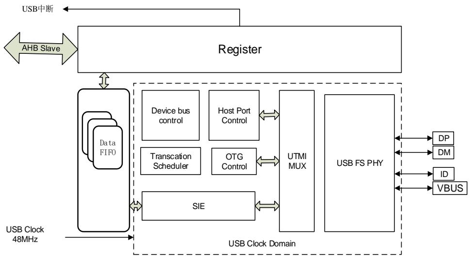
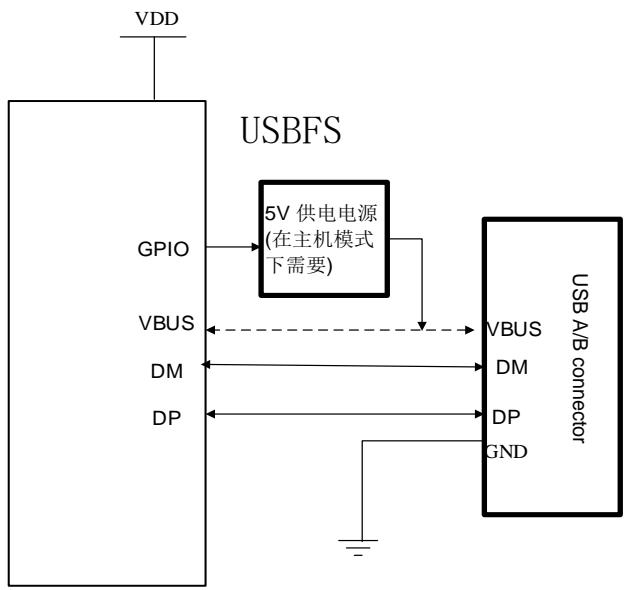
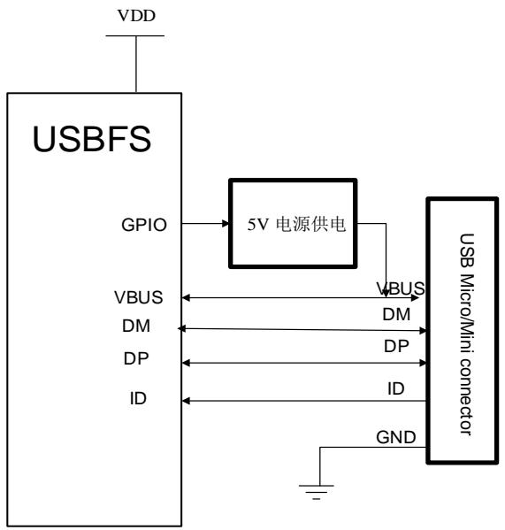
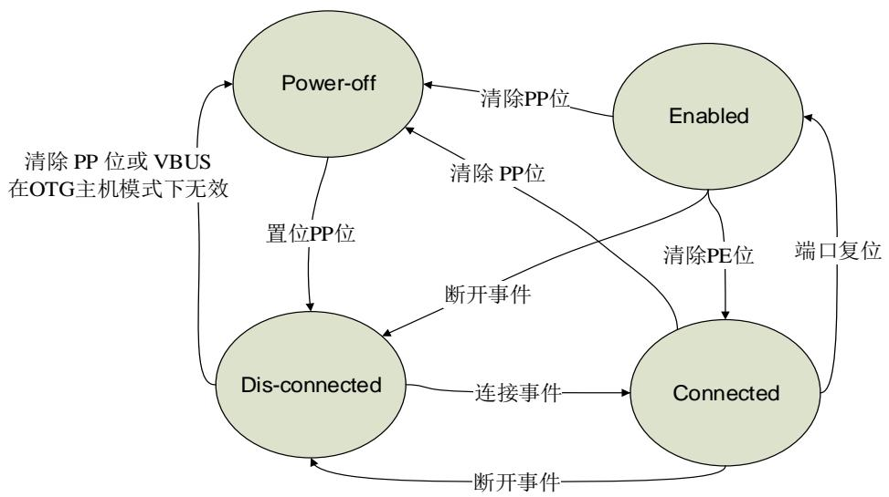
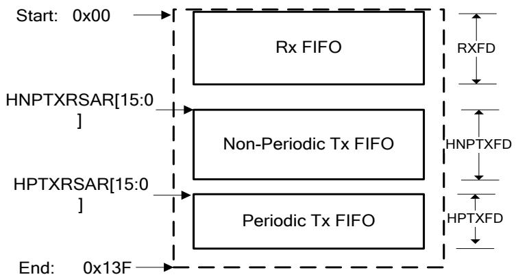
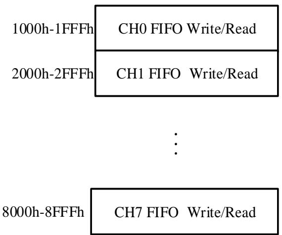
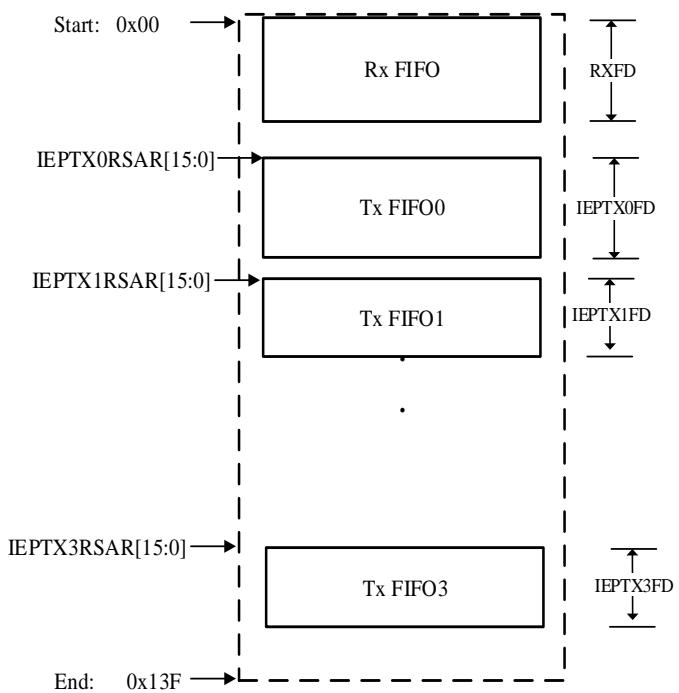
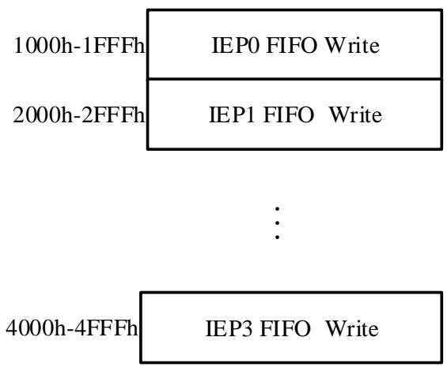

## 28. 通用串行总线全速接口（USBFS）

## 28.1. 概述

USB全速（USBFS）控制器为便携式设备提供了一套USB通信解决方案。USBFS不仅提供了主机模式和设备模式，也提供了遵循HNP（主机协商协议）和SRP（会话请求协议）的OTG模式。USBFS包含了一个内部的全速USB PHY，并且不再需要外部PHY芯片。USBFS可提供USB2.0协议所定义的所有四种传输方式（控制传输、批量传输、中断传输和同步传输）。

## 28.2. 主要特性

支持USB 2.0全速（12Mb/s）/低速（1.5Mb/s）主机模式；

支持USB 2.0全速（12Mb/s）设备模式；

支持遵循HNP（主机协商协议）和SRP（会话请求协议）的OTG协议；

支持所有的4种传输方式：控制传输、批量传输、中断传输和同步传输；

在主机模式下，包含USB事务调度器，用于有效地处理USB事务请求；

包含一个1.25KB的FIFO RAM；

在主机模式下，支持8个通道；

在主机模式下，包含2个发送FIFO（周期性发送FIFO和非周期性发送FIFO）和1个接收FIFO（由所有的通道共享）；

在设备模式下，包含4个发送FIFO（每个IN端点一个发送FIFO）和1个接收FIFO（由所有的OUT端点共享）；

在设备模式下，支持4个OUT端点和4个IN端点；

在设备模式下，支持远程唤醒功能；

包含一个支持USB协议的全速USB PHY；

在主机模式下，SOF的时间间隔可动态调节；

可将SOF脉冲输出到PAD；

可检测ID引脚电平和VBUS电压；

◼ 在主机模式或者OTG A设备模式下，需要外部部件为连接的USB设备提供电源。

## 28.3. 结构框图

图 28-1. USBFS 结构框图

## 28.4. 信号线描述

表 28-1. USBFS 信号线描述

<table><tr><td>I/O 端口</td><td>类型</td><td>描述</td></tr><tr><td>VBUS</td><td>输入</td><td>总线电源端口</td></tr><tr><td>DM</td><td>输入/输出</td><td>差分信号 - 端口</td></tr><tr><td>DP</td><td>输入/输出</td><td>差分信号 + 端口</td></tr><tr><td>ID</td><td>输入</td><td>USB 识别:微连接器识别接口</td></tr></table>

## 28.5. 功能描述

## 28.5.1. USBFS 时钟及工作模式

USBFS可以作为一个主机、一个设备或者一个DRD（双角色设备），并且包含一个内部全速PHY。

内部PHY支持主机模式下的全速和低速、设备模式下全速以及具备HNP和SRP的OTG协议。USBFS所使用的USB时钟需要配置为48MHz。该48MHz USB时钟从系统内部时钟产生，并且其时钟源和分频器需要在RCU模块中配置。

上拉或下拉电阻已经集成在内部全速 PHY 的内部，并且 USBFS 可根据当前模式（主机、设备或 OTG 模式）和连接状态进行自动选择。一个利用内部全速 PHY 的典型连接示意图如

## 28-2. 所示。

图 28-2. 在主机或设备模式下连接示意图

当USBFS工作在主机模式下时（FHM控制位置位、PDM控制位清除），VBUS为USB协议所定义的5V电源检测引脚。内部PHY不能提供5V VBUS电源，仅在VBUS信号线上具有电压比较器和充电放电电路。所以，如果应用需要提供VBUS电源，那么则需要一个外部的供电电源IC。在主机模式下，USBFS和USB连接头之间的VUBS连接可以被忽略，这是由于USBFS并不检测VBUS引脚的电平状态，并假定5V供电电源一直存在。

当USBFS工作在设备模式下时（FHM控制位清除、FDM控制位置位），VBUS检测电路由USBFS_GCCFG寄存器中的VBUSIG控制位所配置。所以，如果设备不需要检测VBUS引脚电压，可以置位VBUSIG控制位，并可释放VBUS引脚作为其他用途。否则，VBUS引脚的连接不能够被忽略，并且USBFS需要不断的检测VBUS电平状态，一旦VBUS电压降至所需有效值以下，需要立即关闭DP信号线上的上拉电阻，从而产生一个断开状态。

OTG 模式连接示意图如 28-3. OTG 所示。当 USBFS 工作在 OTG 模式下时，USBFS_GUSBCS 寄存器内的 FHM、FDM 控制位应该被清除。在这种模式下，USBFS需要以下四个引脚：DM、DP、VBUS和 ID，并且需要使用若干个电压比较器检测这些引脚的电压。USBFS 也包含 VBUS 充电和放电电路，用以完成 OTG 协议中所描述的 SRP 请求。OTG A 设备或 B 设备由 ID 引脚的电平状态所决定。在实现 HNP 协议的过程中，USBFS 控

制上拉和下拉电阻。

图 28-3. OTG 模式下连接示意图

## 28.5.2. USB 主机功能

## USB主机端口状态

主机应用可以通过USBFS_HPCS寄存器控制USB端口状态。系统初始化之后，USB端口保持掉电状态。通过软件置位PP控制位后，USB PHY（内部或外部）将被上电，并且USB端口变为断开状态。检测到连接后，USB端口变为连接状态。在USB总线上产生一个复位后，USB端口将变为使能状态。

图 28-4. 主机端口状态转移图

## 连接、复位和速度识别

作为USB主机，在检测到一个连接事件后，USBFS会为应用触发一个连接标志；同样，若检测

到一个断开事件后，将会触发一个断开标志。

PRST控制位用于实现USB复位序列。应用可以置位该控制位以启动一个USB复位序列，或者清除该控制位以结束USB复位序列。仅当端口在连接或使能状态时，该控制位有效。

USBFS在对设备连接和复位时执行速度检测，并且速度检测的结果会反馈在USBFS_HPCS寄存器的PS[1:0]标志位中。USBFS从DM或DP的电平状态决定设备速度。就像USB协议中所描述的那样，全速设备上拉DP信号线，而低速设备上拉DM信号线。

## 挂起和复位

USBFS支持挂起和复位状态，当USBFS端口在使能状态时，向USBFS_HPCS寄存器的PSP控制位写1，USBFS会进入到挂起状态。在挂起状态，USBFS停止在USB总线上发送SOF，并且这样会让连接的USB设备在3ms后进入到挂起状态。应用程序能够置位USBFS_HPCS寄存器中的PREM控制位以启动一个恢复序列，用以唤醒挂起的设备，当清除该控制位可以停止恢复序列。如果主机在挂起状态检测到一个远程唤醒信号，将会置位USBFS_GINTF寄存器的WKUPIF标志位，并且触发USBFS唤醒中断。

## SOF产生器

在主机模式下，USBFS向USB总线发送SOF令牌包。如USB2.0协议所描述，全速连接下，SOF令牌包每1ms产生一次(由主机控制器或者HUB事务转换器产生)。

每次USBFS进入到使能状态后，它将会按照USB2.0所定义的周期发送SOF令牌包。然而，应用程序可以通过写USBFS_HFT寄存器中的FRI[15:0]位来调整一帧的间隔。FRI控制位定义了在一帧中的USB时钟周期个数，并且应用程序应该基于USBFS所使用的USB时钟频率计算该值。FRT[14:0]位反映了当前帧剩余的时钟周期个数，并且在挂起状态时，该值将停止改变。

USBFS能够在每个SOF令牌包中产生一个脉冲信号，并且将其输出至一个引脚。该脉冲信号长度为12个HCLK周期。如果应用程序希望使用该功能，需要置位USBFS_GCCFG寄存器的SOFOEN控制位，并且配置相应的引脚寄存器为GPIO功能。

## USB通道和事务

USBFS在主机模式下包含8个独立的通道。每个通道能够与一个USB设备端点通信。通道的传输类型、方向、包长和其他信息都在通道相应的寄存器中配置，例如USBFS_HCHxCTL和USBFS_HCHxLEN寄存器。

USBFS支持所有的四种传输类型：控制、批量、中断和同步。USB2.0协议将这些传输类型划分为两类：非周期性传输（控制和批量）和周期性传输（中断和同步）。基于此，为了有效地进行事务调度，USBFS包含两种请求队列：周期性请求队列和非周期性请求队列。在请求队列上方描述的请求条目可能代表一个USB事务请求或者一个通道操作请求。

若应用程序需要在USB总线上启动一个OUT事务，需要通过AHB寄存器接口向数据FIFO中写入数据包。USBFS硬件会在应用写完整包数据后，自动产生一个事务请求并进入请求队列。

请求队列中的请求条目通过USBFS中的事务控制模块按顺序处理。USBFS通常首先尝试处理周期性请求队列，然后处理非周期性请求队列。

帧起始后，USBFS首先开始处理周期性队列，直到队列为空或者当前周期性请求队列所需时间不够，然后处理非周期性队列。这种做法保证了一帧中周期性传输的带宽。每次USBFS从请求队列中读取并取出一个请求条目。如果取出的是通道禁用请求，这将直接禁用通道并准备处理下个条目。

如果当前请求是一个事务请求并且USB总线时间能够处理这个请求，USBFS会使用SIE在USB总线上产生该事务。

在当前帧内，当前请求所需的总线时间不足时，如果当前请求为周期性请求，USBFS停止处理该周期性请求队列，并启动处理非周期性请求。如果当前请求为非周期性请求，USBFS会停止处理任何队列，并等待直到当前帧结束。

## 28.5.3. USB 设备功能

## USB设备连接

在设备模式下，USBFS在初始化后保持掉电状态。利用VBUS引脚上的5V电源连接USB主机后或者置位USBFS_GCCFG寄存器中VBUSIG控制位，USBFS将进入供电状态。USBFS首先打开DP信号线上的上拉电阻，之后主机将会检测到一个连接事件。

## 复位和速度识别

USB主机在检测到设备连接之后，总是会启动一个USB复位序列，并且在设备模式下，检测到USB总线复位事件后，USBFS会为软件触发一个复位中断。

在复 位序 列 后，USBFS将会 触发USBFS_GINTF寄存 器中 的ENUMF中 断 ，并 且利 用USBFS_DSTAT寄存器内的ES标志位反映当前枚举设备速度，该段位域一直为11（全速）。

如USB2.0协议所需要，USBFS在外设模式下不支持低速。

## 挂起和唤醒

USB总线保持IDLE状态并且数据线3ms无变化，USB设备将会进入挂起状态。当USB设备在挂起状态时，软件能够关闭大部分的时钟以节省电能。USB主机可以通过在USB总线上产生恢复信号，来唤醒挂起的设备。USBFS检测到恢复信号后，将置位USBFS_GINTF寄存器的WKUPIF标志位并且触发USBFS唤醒中断。

在挂起设备模式，USBFS也能够远程唤醒USB总线。软件可以通过置位USBFS_DCTL寄存器的RWKUP控制位来发送一个远程唤醒信号，并且如果USB主机支持远程唤醒，主机会在USB总线上启动发送一个恢复信号。

## 软件断开

USBFS支持软件断开。设备进入到供电状态后，USBFS会打开DP信号线的上拉电阻，并且这样主机会检测到设备连接。然后，软件可以通过置位USBFS_DCTL寄存器中SD控制位进行强制断开。SD控制位置位后，USBFS将会直接关闭上拉电阻。这样，USB主机将会在USB总线上检测到设备断开。

## SOF跟踪

当USBFS在USB总线上接收到一个SOF令牌包时，将触发一个SOF中断，并且开始利用本地

USB时钟计算总线时间。当前帧的帧号将会反应在USBFS_DSTAT寄存器的FNRSOF[13:0]位域中。当USB总线时间达到EOF1或EOF2点（帧结束，在USB2.0协议中描述），USBFS会触发USBFS_GINTF寄存器中的EOPFIF中断。软件能够使用这些标志位和寄存器以获得当前总线时间和位置信息。

## 28.5.4. OTG 功能概述

USBFS支持OTG协议1.3中所描述的OTG功能，OTG功能包括SRP和HNP。

## A设备和B设备

当标准A或微型A插头插入相应的插座时，具有OTG能力的USB设备为A设备。A设备向VBUS供电，并且在会话开始时默认为主机。当标准B、微型B、迷你B插头插入相应的插座或采用一端为标准A插头的不可分离电缆时，具有OTG能力的USB设备为B设备。B设备在会话开始时默认为外设。USBFS使 用ID引 脚 电 平 状 态 决 定A设备或B设 备 。ID引 脚 状 态 反 馈 在USBFS_GOTGCS寄存器的IDPS状态位。为了了解A设备和B设备之间传输的详细状态，请参考OTG1.3协议。

## HNP

主机协商协议（HNP）允许主机功能在两个直接连接的OTG设备之间转换，并且用户不需要为了设备之间通信控制的改变而切换电缆线的连接。典型地，HNP协议是由B设备上的用户或应用启动，HNP只能通过设备上的微型AB插座执行。

一旦OTG设备具有一个微型AB插座，该OTG设备可通过插入的插头类型决定默认为主机或设备（微型A插头插入为主机，微型B插头插入为设备）。通过使用主机协商协议（HNP），一个默认为外设的OTG设备可以请求成为主机。主机角色切换的过程在下段中描述。此协议使用户不需要为了更改连接设备的角色而切换电缆线的连接。

当USBFS工作在OTG A主机模式时，并且其想放弃主机角色，可以首先置位USBFS_HPCS寄存器的PSP控制位来使USB总线进入挂起状态，然后B设备在3ms后进入挂起状态。如果B设备想要变为主机，软件需要置位USBFS_GOTGCS寄存器的HNPREQ控制位，然后USBFS会开始在总线上执行HNP协议，最后，HNP的结果会反馈在USBFS_GOTGCS寄存器的HNPS状态位。另外，软件总能从USBFS_GINTF寄存器的COPM状态位获取当前设备角色（主机或外设）。

## SRP

会话请求协议（SRP）允许B设备请求A设备打开VBUS并启动一个会话。该协议允许A设备（或许是电池供电）当总线无活动时通过关闭VBUS以节省电能，并为B设备启动总线活动提供了一种方法。如OTG协议中所描述，OTG设备必须和几个阈值比较VBUS电压，并且将比较结果反馈在USBFS_GOTGCS寄存器的ASV和BSV状态位中。

当USBFS工作在B设备OTG模式时，软件可以通过置位USBFS_GOTGCS寄存器的SRPREQ控制位来启动一个SRP请求，并且如果SRP请求成功，USBFS会在USBFS_GOTGCS寄存器中产生一个成功标志位SRPS。

当USBFS工作在OTG A设备模式且从B设备检测到一个SRP请求时，USBFS将会置位USBFS_GINTF寄存器中的SESIF标志位。软件获取该标志位后，需要准备为VBUS引脚打开

5V供电电源。

## 28.5.5. 数据 FIFO

USBFS中采用1.25K字节数据FIFO存储包数据，数据FIFO是通过USBFS的内部SRAM实现的。

## 主机模式

主机模式下，数据 FIFO 空间分为三个部分，分别是：用于接收数据包的 Rx FIFO、用于非周期性发送数据包的非周期性 Tx FIFO 和用于周期性发送数据包的周期性 Tx FIFO。所有的 IN通道通过共享 Rx FIFO 接收数据。所有的周期性 OUT 通道通过共享周期性 Tx FIFO 来发送数据，所有的非周期性 OUT 通道通过共享非周期性 Tx FIFO 来发送数据。通过寄存器USBFS_GRFLEN、USBFS_HNPTFLEN 和 USBFS_HPTFLEN，软件可以配置以上数据 FIFO的大小和起始偏移地址。 28-5. FIFO 所描述的是 SRAM 中各 FIFO 的结构，图中的数值是以 32 位为单位。

图 28-5. 主机模式 FIFO 空间

USBFS 为程序提供了专有寄存器空间来读写数据 FIFO。 28-6. FIFO所描述的是数据 FIFO 所访问的寄存器存储空间，图中的数值是以字节为单位寻址。尽管所有的非周期通道共享相同的 FIFO 以及所有的周期通道共享相同的 FIFO，每个通道都拥有它们的 FIFO 访问寄存器空间。对 USBFS 而言，获知当前压入数据包的通道号是非常重要的，通过寄存器 USBFS_GRXTATR/USBFS_GRSTATP 来访问数据包所从属的 Rx FIFO。

图 28-6. 主机模式 FIFO 访问寄存器映射表

## 设备模式

在设备模式下，数据 FIFO 分为多个部分，其中包含 1 个 Rx FIFO 和 4 个 Tx FIFO，每个 TxFIFO 对应着一个 IN 端点，所有的 OUT 端点通过共享 Rx FIFO 接收数据包。通过寄存器USBFS_GRFLEN 和 USBFS_DIEPxTFLEN (x=0…3)，程序可配置数据 FIFO 的大小和起始偏移地址。 28-7.  FIFO 所描述的是 SRAM 中各 FIFO 的结构，图中的数值是以 32 位为单位。

图 28-7. 设备模式 FIFO 空间

USBFS 为程序提供了专有寄存器空间来读写数据 FIFO。 28-8. FIFO所描述的是数据 FIFO 所访问的寄存器存储空间，图中的数值是以字节为单位寻址。每个 端 点 都 拥 有 它 们 的 FIFO 访 问 寄 存 器 空 间 。 通 过 寄 存 器USBFS_GRXTATR/USBFS_GRSTATP 来访问 Rx FIFO。

图 28-8. 设备模式 FIFO 访问寄存器映射表

## 28.5.6. 操作手册

该部分描述的是USBFS的操作手册。

## 主机模式

## 全局寄存器初始化顺序：

1、 根据应用的需求，如Tx FIFO的空阈值等，设置寄存器USBFS_GAHBCS，此时，GINTEN位需要保持清零状态。

2、根据应用的需求，如操作模式（主机、设备或OTG）、某些OTG参数和USB协议，设置寄存器USBFS_GUSBCS。

3、根据应用的需求，设置寄存器USBFS_GCCFG。

4、 根据应用的需求，设置寄存器USBFS_GRFLEN、USBFS_HNPTFLEN_DIEP0TFLEN、USBFS_HPTFLEN，配置数据FIFO。

5、 通过设置寄存器USBFS_GINTEN使能模式错误和主机端口中断，置位USBFS_GAHBCS寄存器的GINTEN位使能全局中断。

6、 设置寄存器USBFS_HPCS，置位PP位。

7、等待设备连接，当设备连接后，触发寄存器USBFS_HPCS的PCD位，然后置位PRST位，执行一次端口复位，等待至少10毫秒后，清除PRST位。

8、等待USBFS_HPCS寄存器的PEDC中断，然后读取PE位以确认端口被成功地使能，读取PS位以获取连接的设备速度，之后，如果软件需要改变SOF间隔，设置USBFS_HFT寄存器。

## 通道初始化和使能顺序：

1、 根据期望的传输类型、方向、包大小等信息，设置寄存器USBFS_HCHxCTL，在设置期间，要保证位CEN和CDIS保持清除。

2、 设置寄存器USBFS_HCHxINTEN，设置期望的中断使能位。

3、 设置寄存器USBFS_HCHxLEN，PCNT表示一次传输中的包数，TLEN表示一次传输中发送或接收的包数据的总字节数。

对于OUT通道，如果PCNT为1，单包的大小等于TLEN。如果PCNT大于1，前PCNT-1个包被认定为最大包长度的包，其大小是由寄存器USBFS_HCHxCTL的位MPL所定义。最后一包的大小可通过PCNT、TLEN和MPL计算得到。如果程序想要发出一个零长度的包，应该设定TLEN为0，PCNT位1。

对于IN通道，因为在IN事务结束之前，程序不知道实际接收的数据大小，程序可将TLEN设定为Rx FIFO所支持的最大值。

4、 置位寄存器USBFS_HCHxCTL中的CEN位以使能通道。

## 通道除能顺序：

程序可以通过同时置位CEN和CDIS除能通道。在寄存器操作后，USBFS将在请求队列中产生一个通道除能请求条目。当这个请求条目到达请求队列的顶部时，USBFS立即进行处理。

对于OUT通道而言，特定的通道将被立即除能。然后，会产生CH标志，USBFS将清除CEN和CDIS位。

对于IN通道而言，USBFS将通道除能状态条目压入Rx FIFO，然后，程序应该处理Rx FIFO非空事件：读和取出该状态条目，然后会产生CH标志，USBFS将清除CEN和CDIS位。

## IN传输操作顺序：

1、 初始化USBFS全局寄存器。

2、初始化相应的通道。

3、使能相应的通道。

4、通过软件使能IN通道后，USBFS在相应请求队列中生成一个Rx请求条目。

5、当Rx请求条目到达请求队列的顶部时，USBFS开始执行该请求条目。对于由请求条目所指示的事务而言，如果总线时间足够，USBFS在USB总线上开始IN事务。

6、当IN事务结束时（收到ACK握手包），USBFS将接收到的数据包压入RxFIFO，ACK标志位被触发，否则，状态标志（NAK）会指示事务结果。

7、如果步骤5所描述的IN事务完成后，步骤2的PCNT的数值比1大，程序将会返回步骤3，继续接收剩下的数据包。如果步骤5中描述的IN事务没有成功完成，程序将会返回步骤3来再次发送该数据包。

8、在所有的传输中的所有事务都被成功接收后，USBFS将TF状态条目压入Rx FIFO的最后的数据包的顶部，这样，软件在读取所有接收的数据包后，再读取TF状态条目。USBFS生成TF标志来指示传输成功结束。

9、除能通道，当通道处于空闲状态，即可为其他传输做准备。

## OUT传输操作顺序：

1、 初始化USBFS全局寄存器。

2、初始化及使能相应通道。

3、将数据包写入通道的Tx FIFO（周期性Tx FIFO或非周期性Tx FIFO）。在所有的数据包都被写入FIFO后，USBFS在相应的请求队列中产生一个Tx请求条目，并且将USBFS_HCHxTLEN中的TLEN值减少，减少的数值等于已写的包大小。

4、当请求条目到达请求队列的顶部时，USBFS开始执行该请求条目。如果请求条目对应的事务的总线时间足够，USBFS在USB总线上开展OUT事务。

5、当由请求条目所指示的OUT事务结束时，寄存器USBFS_HCHnTLEN的位PCNT减1。如果该事务完成（收到ACK握手包），ACK标志位被触发，否则，状态标志（NAK）会指示事务结果。

6、如果步骤5所描述的OUT事务完成后且步骤2的PCNT的数值比1大，程序将会返回步骤3，继续发送剩下的数据包。如果步骤5中描述的OUT事务没有成功完成，程序将会返回步骤3来再次发送该包。

7、在所有的传输中的所有事务都被成功送达后，USBFS生成TF标志来指示传输成功结束。

8、除能通道，当通道处于空闲状态，即可为其他传输做准备。

## 设备模式

## 全局寄存器初始化顺序：

1、 根据应用的需求，如Tx FIFO的空阈值等，设置寄存器USBFS_GAHBCS，此时，GINTEN位需要保持清零状态。

2、根据应用的需求，如操作模式（主机、设备或OTG）、某些OTG参数、USB协议，设置寄存器USBFS_GUSBCS。

3、 根据应用的需求，设置寄存器USBFS_GCCFG。

4、 根据应用的需求，设置寄存器USBFS_GRFLEN、USBFS_HNPTFLEN_DIEP0TFLEN、USBFS_HPTFLEN，配置数据FIFO。

5、通过设置寄存器USBFS_GINTEN使能模式错误、挂起、SOF、枚举完成和USB复位中断，置位USBFS_GAHBCS寄存器的GINTEN位使能全局中断。

6、根据应用的需求，如设备的地址和设备的速度等，设置寄存器USBFS_DCFG。

7、 在设备连接上主机上后，主机在USB总线上执行端口复位，触发寄存器USBFS_GINTF的RST中断。

8、 等待寄存器USBFS_GINTF的ENUMF中断。

## 端点初始化和使能顺序：

1、 根 据 预 期 的 传 输 类 型 、 包 大 小 等 信 息 ， 设 置 寄 存 器 USBFS_DIEPnCTL 或USBFS_DOEPxCTL。

2、 设定寄存器 USBFS_DIEPINTEN 或 USBFS_DOEPINTEN，置位相应中断使能位。

3、 设定寄存器USBFS_DIEPxLEN或USBFS_DOEPxLEN，PCNT表示一次传输中的包数，TLEN 表示一次传输中发送或接收的数据包的总字节数。

4、 对于 IN 端点，如果 PCNT 等于 1，单数据包的大小等于 TLEN。如果 PCNT 大于 1，前PCNT-1个包被认定为最大包长度的包，其大小是由寄存器USBFS_DIEPxCTL的位MPL所定义。最后一包的大小可通过 PCNT、TLEN 和 MPL 计算得到。如果程序想要发出一个零长度的包，应该设定 TLEN 为 0，PCNT 位 1。

5、 对于 OUT 端点，因为在 IN 事务结束之前，程序不知道实际接收的数据大小，程序可将TLEN 设定为 Rx FIFO 所支持的最大值。

6、 置位 USBFS_DIEPxCTL 或 USBFS_DOEPxCTL 寄存器 EPEN 位使能端点。

## 端点除能顺序：

当USBFS_DIEPnCTL或USBFS_DOEPnCTL寄存器的EPEN位被清除时，程序可以在任何时候除能端点

## IN传输操作顺序：

1、 初始化USBFS全局寄存器。

2、初始化和使能IN端点。

3、 将数据包写入端点的Tx FIFO，每当包数据写入FIFO，USBFS减少USBFS_DIEPxLEN寄存器的TLEN域的数值，其减少的数值等于已写的包数据大小。

4、 当IN令牌接收后，USBFS发送数据包，在USB总线上的事务完成后，USBFS_DIEPxLEN寄存器的PCNT值减1。如果事务成功完成（接收到ACK握手包），ACK标志被触发，或者，其他状态标志表示事务的结果。

5、在一次传输的所有数据包都被成功发送，USBFS生成一个TF标志位表明传输成功结束，除能相应IN端点。

## OUT传输操作顺序：

1、 初始化USBFS全局寄存器。

2、初始化和使能端点。

3、当OUT令牌接收后，USBFS接收包数据或基于Rx FIFO状态和寄存器配置回复NAK握手包。

如 果 事 务 成 功 完 成 （ USBFS接 收 并 保 存 数 据 到 Rx FIFO ，发送 ACK握 手 包 ），USBFS_DOEPxLEN寄存器的PCNT值减1。如果事务成功完成（接收到ACK握手包），ACK标志被触发，或者，其他状态标志表示事务的结果。

4、在一次传输的所有数据包都被成功接收，USBFS将TF状态条目压入Rx FIFO的最后的数据包的顶部，这样，软件在读取所有接收的包数据后，再读取TF状态条目。USBFS生成TF标志来指示传输成功结束。USBFS生成一个TF标志位表明传输成功结束，除能相应OUT端点。

## 28.6. 中断

USBFS有两种中断：全局中断、唤醒中断。

全局中断是软件需要处理的主要中断，全局中断的标志位可在 USBFS_GINTF 寄存器读取，列举在表 28-2. USBFS 。

表 28-2. USBFS 全局中断

<table><tr><td>中断标志</td><td>描述</td><td>运行模式</td></tr><tr><td>SESIF</td><td>会话中断</td><td>主机或设备模式</td></tr><tr><td>DISCIF</td><td>断开连接中断标志</td><td>主机模式</td></tr><tr><td>IDPSC</td><td>ID 引脚状态变化</td><td>主机或设备模式</td></tr><tr><td>PTXFEIF</td><td>周期性 Tx FIFO 空中断标志</td><td>主机模式</td></tr><tr><td>HCIF</td><td>主机通道中断标志</td><td>主机模式</td></tr><tr><td>HPIF</td><td>主机端口中断中断</td><td>主机模式</td></tr><tr><td>ISOONCIF/PXNCIF</td><td>周期性传输未完成中断标志 /同步OUT传输未完成中断标志</td><td>主机或设备模式</td></tr><tr><td>ISOINCIF</td><td>同步 IN 传输未完成中断标志</td><td>设备模式</td></tr><tr><td>OEPIF</td><td>OUT 端点中断标志</td><td>设备模式</td></tr><tr><td>IEPIF</td><td>IN 端点中断标志</td><td>设备模式</td></tr><tr><td>EOPFIF</td><td>周期性帧尾中断标志</td><td>设备模式</td></tr><tr><td>ISOOPDIF</td><td>同步 OUT 丢包中断标志</td><td>设备模式</td></tr><tr><td>ENUMF</td><td>枚举完成</td><td>设备模式</td></tr><tr><td>RST</td><td>USB 复位</td><td>设备模式</td></tr><tr><td>SP</td><td>USB挂起</td><td>设备模式</td></tr><tr><td>ESP</td><td>早挂起</td><td>设备模式</td></tr><tr><td>GONAK</td><td>全局OUT NAK有效</td><td>设备模式</td></tr><tr><td>GNPINAK</td><td>全局非周期IN NAK有效</td><td>设备模式</td></tr><tr><td>NPTXFEIF</td><td>非周期Tx FIFO空中断标志</td><td>主机模式</td></tr><tr><td>RXFNEIF</td><td>Rx FIFO非空中断标志</td><td>主机或设备模式</td></tr><tr><td>SOF</td><td>帧首</td><td>主机或设备模式</td></tr><tr><td>OTGIF</td><td>OTG 中断标志</td><td>主机或设备模式</td></tr><tr><td>MFIF</td><td>模式错误中断标志</td><td>主机或设备模式</td></tr></table>

唤醒中断可以在 USBFS 处于挂起状态时触发，即使 USBFS 的时钟停止。寄存器USBFS_GINTF 的位 WKUPIF 是唤醒源。

