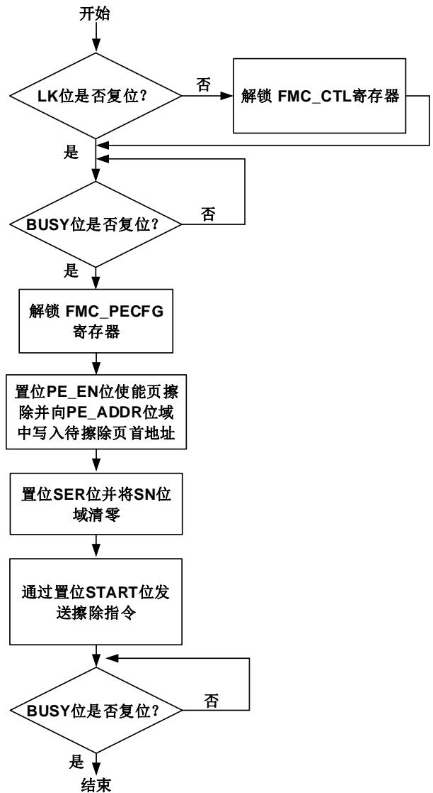
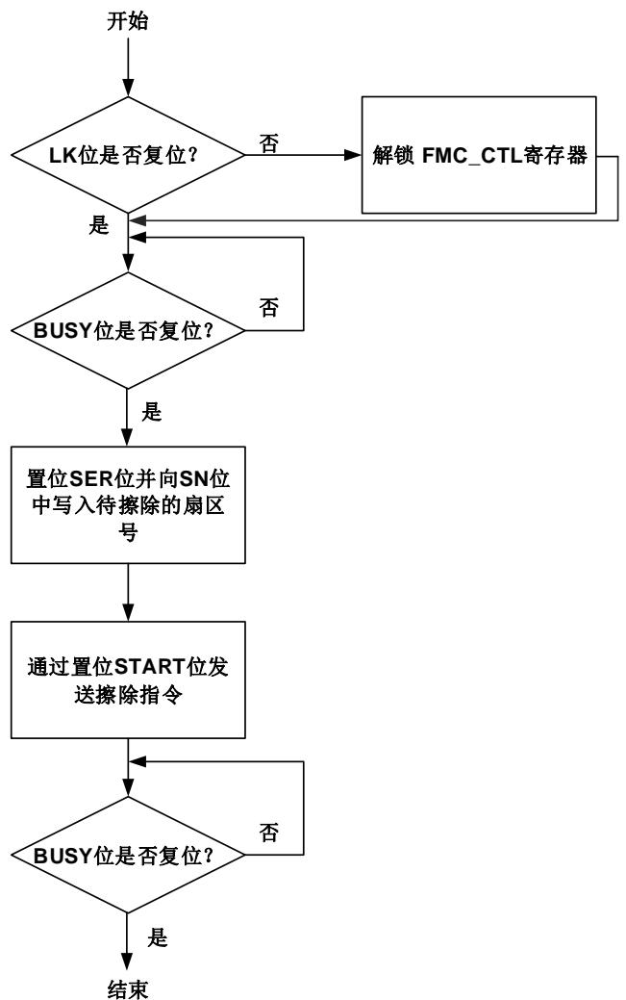
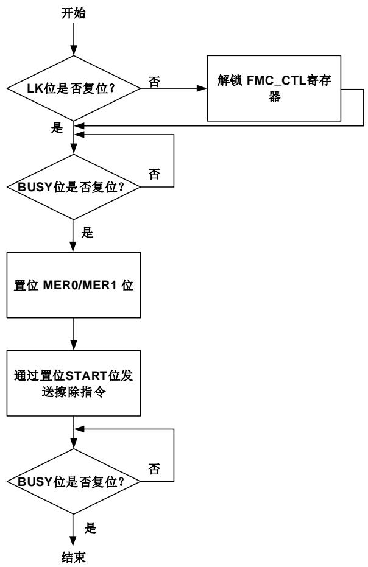
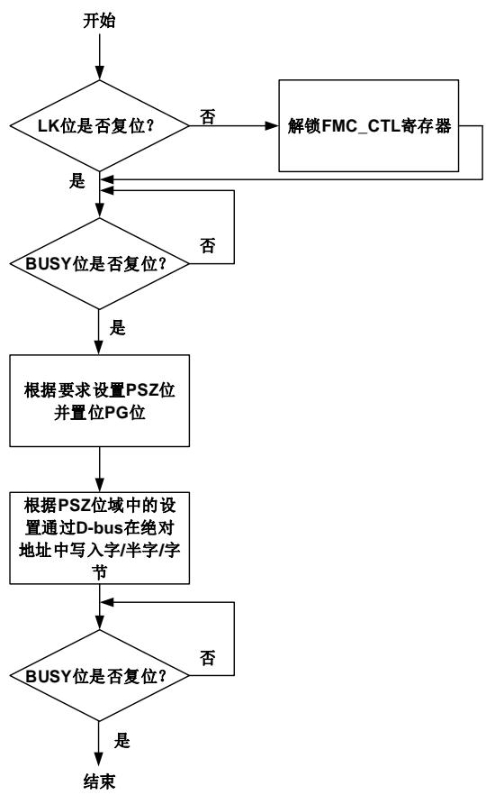

## 2. 闪存控制器（FMC）

## 2.1. 简介

闪存控制器（FMC），提供了片上闪存需要的所有功能。MCU执行指令零等待的区域最大支持到1024K字节空间。FMC也提供了扇区擦除和整片擦除，以及32位整字或16位半字、字节编程等闪存操作。另外GD32F470xx，GD32F427xx和GD32F425xx系列还额外提供了页（4KB）擦除操作。

## 2.2. 主要特征

■ 高达3072K字节的片上闪存可用于存储指令或数据；

■ MCU执行指令零等待区域最大支持到1024K字节空间(在闪存大小等于256K或512K时，闪存全片执行指令零等待)；在此范围外，CPU读取指令存在较长延时；

对于GD32F4xx，使用了两片闪存；前1024KB容量在第0片闪存（bank0）中，后续的容量在第1片闪存（bank1）中；

■ 支持32位整字或16位半字、字节编程，页（4KB）擦除，扇区擦除和整片擦除操作；

■ 2个大小为16字节的选项字节可根据用户需求配置；

■ 512字节OTP块和16字节OTP锁定块（一次性编程），用于存储用户数据；

■ 30K字节信息块（一次性编程），用于引导装载程序；

■ 选项字节会在每次系统复位时装载到选项字节控制寄存器；

■ 具有安全保护状态，可阻止对代码或数据的非法读访问；

■ 具有擦除和编程保护状态，可阻止意外写操作。

## 2.3. 功能说明

## 2.3.1. 闪存结构

对于主存储闪存容量不多于3072KB的GD32F4xx，包含8个16KB的扇区、2个64KB的扇区、14个128KB的扇区、4个256KB的扇区。主存储闪存的每个扇区都可以单独擦除。

闪存结构细节见表2-1.GD32F4xx闪存基地址和构成。

表 2-1. GD32F4xx 闪存基地址和构成

<table><tr><td colspan="2">闪存块</td><td>名称</td><td>地址范围</td><td>大小(字节)</td></tr><tr><td rowspan="3">主存储闪存块</td><td rowspan="3">块01MB</td><td>扇区0</td><td>0x0800 0000 - 0x08003FFF</td><td>16KB</td></tr><tr><td>扇区1</td><td>0x0800 4000 - 0x08007FFF</td><td>16KB</td></tr><tr><td>扇区2</td><td>0x0800 8000 - 0x0800BFFF</td><td>16KB</td></tr><tr><td rowspan="22"></td><td rowspan="7"></td><td>扇区3</td><td>0x0800 C000 - 0x0800 FFFF</td><td>16KB</td></tr><tr><td>扇区4</td><td>0x0801 0000 - 0x0801 FFFF</td><td>64KB</td></tr><tr><td>扇区5</td><td>0x0802 0000 - 0x0803 FFFF</td><td>128KB</td></tr><tr><td>扇区6</td><td>0x0804 0000 - 0x0805 FFFF</td><td>128KB</td></tr><tr><td>.</td><td>.</td><td>.</td></tr><tr><td>.</td><td>.</td><td>.</td></tr><tr><td>扇区11</td><td>0x080E 0000 - 0x080F FFFF</td><td>128KB</td></tr><tr><td rowspan="15">块12816KB</td><td>扇区12</td><td>0x0810 0000 - 0x0810 3FFF</td><td>16KB</td></tr><tr><td>扇区13</td><td>0x0810 4000 - 0x0810 7FFF</td><td>16KB</td></tr><tr><td>扇区14</td><td>0x0810 8000 - 0x0810 BFFF</td><td>16KB</td></tr><tr><td>扇区15</td><td>0x0810 C000 - 0x0810 FFFF</td><td>16KB</td></tr><tr><td>扇区16</td><td>0x0811 0000 - 0x0811 FFFF</td><td>64KB</td></tr><tr><td>扇区17</td><td>0x0812 0000 - 0x0813 FFFF</td><td>128KB</td></tr><tr><td>扇区18</td><td>0x0814 0000 - 0x0815 FFFF</td><td>128KB</td></tr><tr><td>.</td><td>.</td><td>.</td></tr><tr><td>.</td><td>.</td><td>.</td></tr><tr><td>扇区23</td><td>0x081E 0000 - 0x081F FFFF</td><td>128KB</td></tr><tr><td>扇区24</td><td>0x08200000 - 0x0823 FFFF</td><td>256KB</td></tr><tr><td>扇区25</td><td>0x0824 0000 - 0x0827 FFFF</td><td>256KB</td></tr><tr><td>.</td><td>.</td><td>.</td></tr><tr><td>.</td><td>.</td><td>.</td></tr><tr><td>扇区27</td><td>0x082C 0000 - 0x082FFFFF</td><td>256KB</td></tr><tr><td colspan="2">信息块</td><td>引导装载程序</td><td>0x1FFF 0000- 0x1FFF77FF</td><td>30KB</td></tr><tr><td colspan="2">一次性编程块</td><td>一次性编程区域</td><td>0x1FFF 7800 - 0x1FFF7A0F</td><td>528B</td></tr><tr><td colspan="2" rowspan="2">选项字节块</td><td>选项字节块0</td><td>0x1FFF C000 - 0x1FFFC00F</td><td>16B</td></tr><tr><td>选项字节块1</td><td>0x1FFEC000 -0x1FFEC00F</td><td>16B</td></tr></table>

注意：信息块存储了boot loader，不能被用户编程或擦除。

对于闪存大小为1M字节的类型，将选项字节中DBS位置1后的闪存扇区划分如下图表2-2.DBS=1时1M闪存扇区划分，DBS的详细描述参考选项字节说明：

表 2-2. DBS = 1 时 1M 闪存扇区划分

<table><tr><td colspan="2">闪存块</td><td>名称</td><td>地址范围</td><td>大小(字节)</td></tr><tr><td rowspan="12">主存储闪存块</td><td rowspan="8">块0512KB</td><td>扇区0</td><td>0x0800 0000 - 0x08003FFF</td><td>16KB</td></tr><tr><td>扇区1</td><td>0x0800 4000 - 0x08007FFF</td><td>16KB</td></tr><tr><td>扇区2</td><td>0x0800 8000 - 0x0800BFFF</td><td>16KB</td></tr><tr><td>扇区3</td><td>0x0800 C000 - 0x0800FFFF</td><td>16KB</td></tr><tr><td>扇区4</td><td>0x0801 0000 - 0x0801FFFF</td><td>64KB</td></tr><tr><td>扇区5</td><td>0x0802 0000 - 0x0803FFFF</td><td>128KB</td></tr><tr><td>扇区6</td><td>0x0804 0000 - 0x0805FFFF</td><td>128KB</td></tr><tr><td>扇区7</td><td>0x0806 0000 - 0x0807FFFF</td><td>128KB</td></tr><tr><td rowspan="4">块1512KB</td><td>扇区12</td><td>0x0808 0000 - 0x08083FFF</td><td>16KB</td></tr><tr><td>扇区13</td><td>0x0808 4000 - 0x08087FFF</td><td>16KB</td></tr><tr><td>扇区14</td><td>0x0808 8000 - 0x0808BFFF</td><td>16KB</td></tr><tr><td>扇区15扇区16</td><td>0x0808 C000 - 0x0808FFFF0x0809 0000 - 0x0809 FFFF</td><td>16KB64KB</td></tr><tr><td rowspan="3"></td><td rowspan="3"></td><td>扇区17</td><td>0x080A 0000 - 0x080B FFFF</td><td>128KB</td></tr><tr><td>扇区18</td><td>0x080C 0000 - 0x080D FFFF</td><td>128KB</td></tr><tr><td>扇区19</td><td>0x080E 0000 - 0x080F FFFF</td><td>128KB</td></tr></table>

## 2.3.2. 读操作

闪存可以像普通存储空间一样直接寻址访问。对闪存取指令和取数据分别使用CPU的IBUS或DBUS总线。

## 2.3.3. FMC_CTL/FMC_OBCTLx 寄存器解锁

复位后，FMC_CTL寄存器进入锁定状态，LK位置为1。通过先后向FMC_KEY寄存器写入0x45670123和0xCDEF89AB，可以使得FMC_CTL解锁。两次写操作后，FMC_CTL寄存器的LK位被硬件清0。可以通过软件设置FMC_CTL寄存器的LK位为1再次锁定FMC_CTL寄存器。任何对FMC_KEY寄存器的错误操作都会将LK位置1，从而锁定FMC_CTL寄存器，并引发一个总线错误。

FMC_OBCTL0寄存器，在FMC_CTL被解锁后仍然处于被保护状态。解锁过程为两次写操作，向FMC_OBKEY寄存器先后写入0x08192A3B和0x4C5D6E7F，然后硬件将FMC_OBCTL0寄存器中的OB_LK位清零。软件可以将FMC_OBCTLx的OB_LK位置1来锁定FMC_OBCTLx。

## 2.3.4. 页擦除

在GD32F470xx，GD32F427xx以及GD32F425xx系类中，FMC额外提供了页擦除功能使得主存储闪存中大小为4K字节的页内容初始化为高电平。每一页都可以被独立擦除，而不影响其他页内容。FMC页擦除操作步骤如下：

1. 确保FMC_CTL寄存器不处于锁定状态;

2. 检查FMC_STAT寄存器的BUSY位来判定闪存是否正处于擦写访问状态，若BUSY位为1，则需等待该操作结束，BUSY位变为0；

3. 向FMC_PEKEY寄存器写入KEY值0xA9B8C7D6用以解锁FMC_PECFG寄存器；

4. 置位FMC_PECFG寄存器中的PE_EN位以使能页擦除功能；

5. 在FMC_PECFG寄存器中的PE_ADDR[28:0]位域中写入待擦除页的首地址，写入的页地址需要4K字节对齐；

6. 确保FMC_CTL寄存器中SN[4:0]位域为0，并置位寄存器中的SER位；

7. 通过将FMC_CTL寄存器的START位置1来发送页擦除命令到FMC;

8. 等待擦除指令执行完毕，FMC_STAT寄存器的BUSY位清0;

9. 清除PE_EN位和SER位防止下次误操作；

10. 如果需要，使用DBUS读操作验证该页是否擦除成功。

当页擦除成功执行，且FMC_CTL寄存器中的ENDIE位为1时，FMC_STAT寄存器的END位将置位，同时FMC将产生一个中断。需要注意的是，用户需确保写入的是正确的页地址（4K字节对齐），否则当待擦除页被用来取指令或访问数据时，软件将会跑飞。该情况下，FMC不会提供任何出错通知。另一方面，对擦除/编程保护的扇区进行页擦除操作将无效。如果FMC_CTL寄存器的ERRIE位被置位，该操作将触发操作出错中断。中断服务程序可通过检测FMC_STAT寄存器的OPERR位来判断该中断是否发生。图2-1. 页擦除操作流程显示了页擦除操作流程。

图 2-1. 页擦除操作流程

## 2.3.5. 扇区擦除

FMC的扇区擦除功能使得主存储闪存的扇区内容初始化为高电平。每一扇区都可以被独立擦除，而不影响其他扇区内容。FMC扇区擦除操作步骤如下：

1. 确保FMC_CTL寄存器不处于锁定状态;

2. 检查FMC_STAT寄存器的BUSY位来判定闪存是否正处于擦写访问状态，若BUSY位为1，

则需等待该操作结束，BUSY位变为0;

3. 置位FMC_CTL寄存器的SER位;

4. 将待擦除扇区号写到FMC_CTL寄存器SN位;

5. 通过将FMC_CTL寄存器的START位置1来发送扇区擦除命令到FMC;

6. 等待擦除指令执行完毕，FMC_STAT寄存器的BUSY位清0;

7. 如果需要，使用DBUS读操作验证该扇区是否擦除成功。

当扇区擦除成功执行，且FMC_CTL寄存器中的ENDIE位为1时，FMC_STAT寄存器的END位将置位，同时FMC将产生一个中断。需要注意的是，用户需确保写入的是正确的擦除目标扇区号。否则当待擦除目标扇区被用来取指令或访问数据时，软件将会跑飞。该情况下，FMC不会提供任何出错通知。另一方面，对擦/编程保护的扇区进行扇区擦除操作将无效。如果FMC_CTL寄存器的ERRIE位被置位，该操作将触发操作出错中断。中断服务程序可通过检测FMC_STAT寄存器的OPERR位来判断该中断是否发生。图2-2. 扇区擦除操作流程显示了扇区擦除操作流程。

图 2-2. 扇区擦除操作流程

## 2.3.6. 整片擦除

FMC提供了整片擦除功能可以初始化主存储闪存块的内容。当设置MER0为1时，擦除过程仅作用于Bank0，当设置MER1为1时，擦除过程仅作用于Bank1，当设置MER0和MER1为1时，擦除过程作用于整片闪存。FMC整片擦除操作步骤如下：

1. 确保FMC_CTL寄存器不处于锁定状态;

2. 等待FMC_STAT寄存器的BUSY位变为0来确保没有闪存操作在进行，否则等待该操作完成；

3. 置位FMC_CTL寄存器的MER0位，则单独擦除Bank0。置位FMC_CTL寄存器的MER1位，则单独擦除Bank1。同时置位FMC_CTL寄存器的MER0/MER1位，则擦除整片闪存；

4. 通过将FMC_CTL寄存器的START位置1来发送整片擦除命令到FMC;

5. 通过检查FMC_STAT寄存器的BUSY位是否清0，来确定擦除指令执行完毕；

6. 如果需要，使用DBUS读操作验证是否擦除成功。

当整片擦除成功执行，且FMC_CTL寄存器中的ENDIE位为1时，FMC_STAT寄存器的END位置位，同时FMC将产生一个中断。由于所有的闪存数据都将被复位为0xFFFF_FFFF，可以通过运行在SRAM中的程序或使用调试工具直接访问FMC寄存器来实现整片擦除操作。

图2-3. 整片擦除操作流程显示了整片擦除操作流程。

图 2-3. 整片擦除操作流程

## 2.3.7. 主存储闪存块编程

FMC提供了一个32位整字/16位半字/8位字节编程功能，用来修改主存储闪存块内容。FMC闪存编程操作步骤如下：

1. 确保FMC_CTL寄存器不处于锁定状态;

2. 等待FMC_STAT寄存器的BUSY位变为0来确保没有闪存操作在进行，否则等待该操作完成；

3. 按照需求设置PSZ位域，并置位FMC_CTL寄存器的PG位；

4. DBUS写一个32位整字/16位半字/8位字节（必须与FMC_CTL寄存器中的PSZ位匹配）到目的绝对地址（0x08XX XXXX）；

5. 通过检查FMC_STAT寄存器的BUSY位是否清0，来确定写操作执行完毕；

6. 如果需要，使用DBUS读操作验证是否编程成功。

当主存储块编程成功执行，且FMC_CTL寄存器中的ENDIE位为1时，FMC_STAT寄存器的END位置位，同时FMC将产生一个中断。需要注意的是，执行整字/半字/字节编程操作时需要与FMC_CTL寄存器中的PSZ位匹配。如果不匹配，FMC_STAT寄存器中的PGMERR位被置位。需要注意的是，PG位必须在32位整字/16位半字/8位字节编程开始前进行置位，否则

FMC_STAT寄存器中的PGSERR位会被置位。此外，向被保护擦除/编程扇区进行的编程操作会被忽略，同时FMC_STAT寄存器中的WPERR位被置位。在这些情况下，若FMC_CTL寄存器的ERRIE位被置1时，FMC会触发一个闪存操作错误中断。在中断服务程序中，可以检查FMC_STAT寄存器的PGMERR位、PGSERR位和WPERR位来判断哪一种错误发生了。图2-4.闪存编程操作流程显示了字编程操作流程。

图 2-4. 闪存编程操作流程

注意：避免在同一个bank中既进行读操作，又进行擦除或编程操作。当CPU进入省电模式时，对闪存的操作将失败。

## 2.3.8. OTP 闪存块编程

FMC提供了一个32位整字/16位半字/8位字节编程功能，用来修改OTP闪存块内容。编程操作顺序同主闪存块编程操作顺序相同。OTP闪存块不可进行擦除操作。

OTP闪存块可以被划分为16个32字节大小的数据块和1个16字节大小的OTP锁定块。OTP锁定块地址从0x1FFF_7A00到0x1FFF_7A0F。OTP数据块地址从0x1FFF_7800到0x1FFF_79FF。OTP锁定块中每一个锁定字节（0x00表示锁定，0xFF表示未锁定）可以锁定相对应的OTP数据块，以阻止在这些数据块上的编程操作。锁定块0用于锁定地址范围0x1FFF_7800到0x1FFF_781F的OTP数据块0。锁定块1用于锁定地址范围0x1FFF_7820到0x1FFF_783F的OTP数据块1，以此类推。

若OTP数据块未被对应的OTP锁定块锁定，这16个OTP数据块可以编程多次，但是无法擦除。OTP数据块中的每一位只能被编程为从1到0，而不能从0到1，OTP锁定块的每个字节仅在被写为0x00时才能锁定对应的数据块。

## 2.3.9. 选项字节修改

FMC提供了一个擦除功能用来修改闪存中的选项字节。选项字节编程操作步骤如下：

1. 确保FMC_OBCTLx寄存器不处于锁定状态;

2. 等待FMC_STAT寄存器的BUSY位变为0来确保没有闪存操作在进行，否则等待该操作完成；

3. 在FMC_OBCTL0寄存器和FMC_OBCTL1寄存器中进行选项字节值写入；

4. 通过将FMC_OBCTL0寄存器的OB_START位置1来发送选项字节编程命令到FMC;

5. 通过检查FMC_STAT寄存器的BUSY位是否清0，来确定编程指令执行完毕；

6. 如果需要，使用DBUS读操作验证是否编程成功。

当选项字节编程成功执行，且FMC_CTL寄存器中的ENDIE位为1时，FMC_STAT寄存器的END位置位，同时FMC将产生一个中断。

## 2.3.10. 选项字节说明

每次系统复位后，闪存的选项字节被重加载到FMC_OBCTL0和FMC_OBCTL1寄存器后，可选字节生效。可选字节详情见表2-3. 选项字节。

表 2-3. 选项字节

<table><tr><td>地址</td><td>名称</td><td>说明</td></tr><tr><td>0x1fff c000</td><td>USER</td><td>[7]: nRST_STDBY0: 进入待机模式时产生复位1: 进入待机模式时不产生复位(出厂值)[6]: nRST_DPSLP0: 进入深度睡眠模式时产生复位1: 进入深度睡眠模式时不产生复位(出厂值)[5]: nWDG_HW0: 硬件看门狗1: 软件自由看门狗(出厂值)[4]: BB0: 当配置从主存储块启动时, 从bank0启动1: 当配置从主存储块启动时, 若bank1无启动程序, 从bank0启动。否则, 从bank1启动注意: 该功能位仅对GD32F450xx、GD32F470xx具有双BANK闪存系列有效(通过DBS=1除外)[3:2]:BOR_TH (BOR复位阈值)00:BOR复位阈值301:BOR复位阈值210:BOR复位阈值111:BOR关闭(出厂值)[1:0]:保留</td></tr><tr><td>0x1fff c001</td><td>SPC</td><td>安全保护代码0xAA:无保护(出厂值)除0xAA和0xCC其他值:保护级别低0xCC:保护级别高</td></tr><tr><td>0x1fff c008</td><td>WP0[7:0]</td><td>[7:0]:WP0[7:0]扇区擦除/编程保护0:当DRP为1时,无影响。当DRP为0时,擦除/编程保护。1:当DRP为0时,无影响。当DRP为1时,擦除/编程和DBUS读保护。(出厂值)</td></tr><tr><td>0x1fff c009</td><td>WP0</td><td>[7]:DRPDBUS读保护位0:WP0位用于每一个扇区擦除/编程保护(默认值)1:WP0位用于每一个扇区擦除/编程保护和DBUS读保护注意:该功能位仅对GD32F450xx、GD32F470xx系列有效,出厂值为0[6]:DBS当闪存大小为1M字节时,选择为双块或单块0:当闪存大小为1M字节时,选择为单块1:当闪存大小为1M字节时,选择为双块注意:该功能位仅对GD32F450xx、GD32F470xx1M闪存系列有效,出厂值为0[5:4]:保留[3:0]:WP0[11:8]扇区擦除/编程保护0:当DRP为1时,无影响。当DRP为0时,擦除/编程保护。1:当DRP为0时,无影响。当DRP为1时,擦除/编程和DBUS读保护。(出厂值)</td></tr><tr><td>0x1ffec008</td><td>WP1[7:0]</td><td>[7:0]:WP1[7:0]Bank1扇区擦除/编程保护0:当DRP为1时,无影响。当DRP为0时,擦除/编程保护。1:当DRP为0时,无影响。当DRP为1时,擦除/编程和DBUS读保护。(出厂值)</td></tr><tr><td>0x1ffec009</td><td>WP1</td><td>[7:4]:保留[3:0]:WP1[11:8]Bank1扇区擦除/编程保护0:当DRP为1时,无影响。当DRP为0时,擦除/编</td></tr><tr><td></td><td></td><td>程保护。1:当DRP为0时,无影响。当DRP为1时,擦除/编程和DBUS读保护。(出厂值)</td></tr></table>

## 2.3.11. 扇区擦除/编程保护

FMC的扇区擦除/编程保护功能可以阻止对闪存的意外操作。当FMC对被保护扇区进行扇区擦除或编程操作时，操作本身无效且FMC_STAT寄存器的WPERR位将被置1。注意，当MER0/MER1被置位或SN无效时，进行扇区擦除时WPERR仍会被置位。如果WPERR位被置1且ERRIE位也被置1来使能相应的中断，FMC将触发闪存操作出错中断，等待CPU处理。配置选项字节的WP0[11:0]/WP1[11:0]某位为0可以单独使能某几扇区的保护功能。

表 2-4. 扇区保护 WP0/WP1 位

<table><tr><td>WP0/WP1 位</td><td>扇区保护</td></tr><tr><td>WP0[0]</td><td>扇区0</td></tr><tr><td>WP0[1]</td><td>扇区1</td></tr><tr><td>WP0[2]</td><td>扇区2</td></tr><tr><td>.</td><td>.</td></tr><tr><td>.</td><td>.</td></tr><tr><td>.</td><td>.</td></tr><tr><td>WP0[10]</td><td>扇区10</td></tr><tr><td>WP0[11]</td><td>扇区11</td></tr><tr><td>WP1[0]</td><td>扇区12</td></tr><tr><td>WP1[1]</td><td>扇区13</td></tr><tr><td>WP1[2]</td><td>扇区14</td></tr><tr><td>.</td><td>.</td></tr><tr><td>.</td><td>.</td></tr><tr><td>.</td><td>.</td></tr><tr><td>WP1[10]</td><td>扇区22</td></tr><tr><td>WP1[11]</td><td>扇区23~扇区27</td></tr></table>

## 2.3.12. DBUS 读保护

FMC提供了一个DBUS保护功能，当DRP设置为1时禁止对相应扇区进行DBUS读操作。如果DBUS读命令被发送至FMC一个被保护扇区，FMC_STAT寄存器中的RDDERR位会被置位。如果RDDERR位被置1且ERRIE位也被置1来使能相应的中断，FMC将触发闪存操作出错中断，等待CPU处理。配置选项字节的WP0[11:0]/WP1[11:0]某位为1并同时设置DRP为1，可以单独使能某几扇区的保护功能。

如果DRP为1，想要修改DRP为0或者将WP0[11:0]/WP1[11:0]某位值从1变为0时，若芯片处于无安全保护状态，则必须先将芯片设置为低安全保护状态，然后再随着解除低安全保护的过程将DRP或WP0[11:0]/WP1[11:0]某位值清0。否则，选项字节的修改被忽略并且FMC_STAT寄存器中的WPERR位会被FMC置位。如果WPERR位被置1且ERRIE位也被置1来使能相应的中断，FMC将触发闪存操作出错中断，等待CPU处理。

注意：该功能仅对GD32F450xx、GD32F470xx系列有效。

## 2.3.13. 安全保护

FMC提供了一个安全保护功能来阻止非法读取闪存。此功能可以很好地保护软件和固件免受非法的用户操作。安全保护等级划分三等。

无保护状态：当将SPC字节设置为0xAA，闪存将处于非安全保护状态。主存储块和选项字节可以被所有操作模式访问。

保护等级低：当设置SPC字节为除0xAA或0xCC外的任何值，激活低安全保护等级。主存储闪存块仅能被用户代码访问。在调试模式或者从SRAM中启动或者从boot loader模式启动时，这些模式下对主存储块的操作都被禁止。无论是在调试模式或者从SRAM中启动，还是从boot loader模式启动，如果对主存储块执行一次读操作，将会产生一个总线错误。在调试模式或者从SRAM中启动时或者从boot loader模式启动，如果对主存储块执行一次编程/擦除操作，FMC_STAT寄存器中的WPERR位会被置位。在低安全保护等级下，对于选项字节的所有操作都被允许。如果通过设置SPC字节为0xAA进入无保护状态，主存储闪存块将执行一次整片擦除操作。

保护等级高：当设置SPC字节为0xCC，激活高安全保护等级。当编程选择该保护等级时，调试模式，从SRAM中启动，或者从boot loader启动都被禁止。主存储闪存块可由用户代码的所有操作进行访问。选项字节禁止再次编程。所以，如果高保护等级被激活，将不能再降回到低保护等级或无保护等级。

