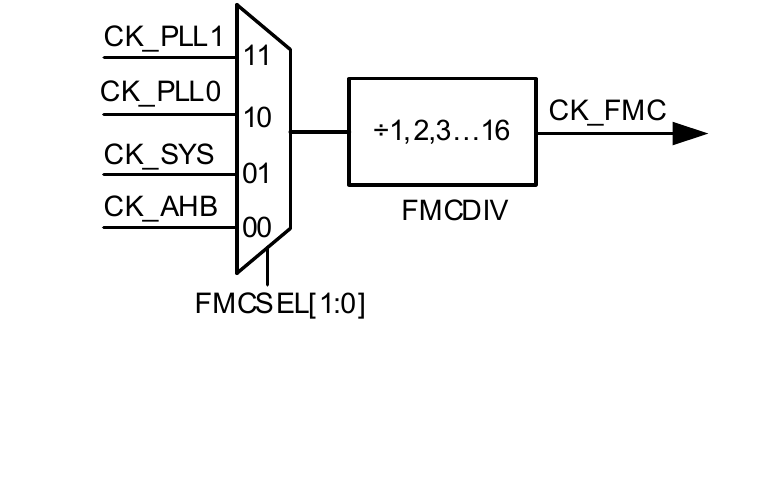

GigaDevice Semiconductor Inc. 

# GD32F50x 软件开发指南

应用笔记

AN270 

1.2 版本

（2026 年 5 月）

## 目录

目录....1
图索引....2
表索引....3
1. 前言....4
2. 软件功能开发....5
2.1. Boot 方式选择和配置....5
2.2. SRAM ECC 配置说明....5
2.2.1. SRAM ECC 使能与失能....5
2.2.2. SRAM ECC 配置....6
2.3. FLASH 配置说明....6
2.3.1. 频率控制....6
2.3.2. PWDN 位说明....6
2.4. RCU 时钟配置限制说明....7
2.4.1. FMC 接口时钟限制....7
2.4.2. 提高 FMC 接口时钟....8
2.5. TIMER 使用说明....9
2.5.1. TIMER 中止极性配置....9
2.5.2. TIMER 通道中止中断配置....9
2.5.3. TIMER 中止外部信号源选择....10
2.5.4. 高级 TIMER 输出配置....10
2.6. CMP 使用说明....10
2.7. PMU 使用说明....10
3. 版本历史....11

## 图索引

图 2-1. FMC 接口时钟....7

## 表索引

表1-1. 适用产品....4  
表2-1. 引导模式....5  
表2-2. FMC接口时钟配置....8  
表2-3. FMC时钟接口 $240\mathrm{MHz}$ 频率配置....8  
表2-4. TIMER中止功能极性配置....9  
表2-5. TIMER通道中止功能极性配置....9  
表2-6. 高级TIMER输出配置....10  
表3-1. 版本历史....11

## 1. 前言

本文是专为GD32F50x系列MCU提供，介绍了如何搭建基于GD32F50x芯片的工程并调试，以及如何使用各个模块。该应用笔记的目的是对 GD32F50x 系列 MCU 上的外设资源进行示例性的功能介绍，使用户能了解如何使用 GD32F50x 系列芯片进行快速软件开发。


表 1-1. 适用产品


<table><tr><td>类型</td><td>型号</td></tr><tr><td>MCU</td><td>GD32F50x系列</td></tr></table>

## 2. 软件功能开发

## 2.1. Boot方式选择和配置

GD32F50x 设备提供四种启动源。启动模式受到安全保护、OTP3 中的 NBTSB 和 BTFOSEL位以及启动引脚的影响，详细说明见表2-1. 引导模式。

在复位后，BOOT0 和 BOOT1 引脚上的值在 CK_SYS 的第 4 个上升沿被锁存。用户可自行选择所需要的引导源，通过设置上电复位和系统复位后的 BOOT0 和 BOOT1 的引脚电平。一旦这两个引脚电平被采样，它们可以被释放并用于其他用途。


表 2-1. 引导模式


<table><tr><td rowspan="2">安全保护</td><td colspan="2">OTP3</td><td colspan="2">启动模式选择引脚</td><td rowspan="2">BOOT_MODE[2:0]</td><td rowspan="2">引导源选择</td></tr><tr><td>NBTSB</td><td>BTFOSEL</td><td>BOOT0</td><td>BOOT1</td></tr><tr><td>无保护/保护等级低</td><td>0</td><td>x</td><td>1</td><td>1</td><td>011</td><td>片上 SRAM</td></tr><tr><td>无保护/保护等级低</td><td>0</td><td>x</td><td>1</td><td>0</td><td>001</td><td>引导装载程序</td></tr><tr><td>无保护/保护等级低</td><td>0</td><td>0</td><td>0</td><td>x</td><td>000</td><td>主 Flash 存储器</td></tr><tr><td>无保护/保护等级低</td><td>0</td><td>1</td><td>0</td><td>x</td><td>101</td><td>OTP1</td></tr><tr><td>x</td><td>1</td><td>0</td><td>x</td><td>x</td><td>000</td><td>主 Flash 存储器</td></tr><tr><td>x</td><td>1</td><td>1</td><td>x</td><td>x</td><td>101</td><td>OTP1</td></tr><tr><td>保护等级高</td><td>x</td><td>0</td><td>x</td><td>x</td><td>000</td><td>主 Flash 存储器</td></tr><tr><td>保护等级高</td><td>x</td><td>1</td><td>x</td><td>x</td><td>101</td><td>OTP1</td></tr></table>

上电序列或系统复位后，Arm® Cortex®-M33 处理器先从 0x0000 0000 地址获取栈顶值，再从0x00000004 地址获得引导代码的基地址，然后从引导代码的基地址开始执行程序。所选引导源对应的存储空间会被映射到引导存储空间，即从 0x0000 0000 开始的地址空间。如果片上SRAM（开始于 0x20000000 的存储空间）被选为引导源，用户必须在应用程序初始化代码中通过修改 NVIC 异常向量表和偏移地址将向量表重置到 SRAM 中。

当主 FLASH 存储器被选择作为引导源，从 0x0800 0000 开始的存储空间会被映射到引导存储空间。当选择 OTP1 作为引导源时，从地址 0x1FF0 0000 开始的内存空间会被映射到引导存储空间。

## 2.2. SRAM ECC 配置说明

## 2.2.1. SRAM ECC 使能与失能

SRAM ECC 的使能与失能通过选项字节 USER 段的第 4 位（ECC_EN 位）进行控制。当 bit4置 0 时，SRAM ECC 功能被失能；当 bit4 置 1 时，SRAM ECC 功能被使能。MCU 出厂默认

使能 SRAM ECC 功能。

## 2.2.2. SRAM ECC 配置

GD32F50x 在读写前 32KB SRAM 时，SRAM 支持 7 比特的 ECC 功能。可纠错 1 比特，发现多比特（两比特）错误。

支持 ECC 功能的前 32KB SRAM 读之前必须先写入，否则很可能会导致 ECC 错误。非对齐的读操作会按照 32 比特的读操作来执行。非对齐的写操作会产生一个读改写的流程。例如，16 比特写，首先会先读 16 比特，再和需要写入的 16 比特一起写入。所以初始化 SRAM 时，只能按照 32 位的来写入。

EEIC（ECC Error Interrupt Control）模块用于管理 SRAM 的 ECC 错误状态及中断配置。当检测到单比特可纠错事件时，SYSCFG_SRAMECCSTAT 寄存器状态位（SRAMECCSEIF）会被置位，并在 SYSCFG_SRAMECCCS 寄存器中记录错误地址，软件可通过写 1 清除该状态；如检测到多比特（两比特）不可纠错事件，则 SYSCFG_SRAMECCSTAT 寄存器状态位(SRAMECCMEIF)会被置位，并在 SYSCFG_SRAMECCCS 寄存器中记录错误地址。通过设置相应中断使能位（SRAMECCSEIE 或 SRAMECCMEIE），上述事件发生时可触发 NMI 和SRAM ECC 中断。

## 2.3. FLASH 配置说明

## 2.3.1. 频率控制

FMC 模块使用时钟为 CK_FMC 访问 sip flash，与 AHB 时钟 CK_AHB 需要满足一定的频率关系，CK_FMC 需要不慢于时钟 CK_AHB，但不高于 AHB时钟的 7 倍：

$$
\mathrm {CK\_FMC} \geqslant \mathrm {CK\_AHB} \geqslant 1 / 7 \mathrm {CK\_FMC}
$$

推荐的切频配置方法如下：

如果升频：

1. 需要保持CK_FMC选择时钟源为时钟CK_AHB，同时将CK_FMC与CK_AHB的频率提高；

2. 再根据需要单独提高CK_FMC频率；

如果降频：

1. 先将CK_FMC选择时钟源为AHB时钟CK_AHB；

CK_FMC 与 CK_AHB 同步降频。

## 2.3.2. PWDN 位说明

FMC_CTL0 寄存器的 PWDN 位能够控制闪存在没有被操作时进入深度掉电模式以减少功耗。PWDN 位由软件设置或清除，系统复位后不复位，上电复位后复位。需要注意以下几点：

1、在省电模式下，闪存仅在 PWDN 位置为 1 时才会进入深度掉电模式。

2、在使能 CPU Cbus 超时（CPUCBUSTO=1）且 PWDN=1 的情况下，闪存进入深度掉电模式后，访问闪存非零等待区（data 区）会导致 CBUS 超时，引发 Hardfault 错误。

3、在未使能 CPU Cbus 超时（CPUCBUSTO=0）且 PWDN=1 的情况下，闪存进入深度掉电模式后，访问闪存非零等待区（data 区）会唤醒闪存，需要等待闪存唤醒时间，访问闪存零等待区（code 区）不会唤醒闪存且无需等待。

## 2.4. RCU时钟配置限制说明

## 2.4.1. FMC 接口时钟限制

FMC 接口时钟可通过 RCU_ADDCTL 寄存器中的 FMCSEL 位域选择为 CK_AHB、CK_SYS、CK_PLL0 和 CK_PLL1 中的一个，并通过 FMCDIV 分频后提供，如图 2-1. FMC 接口时钟和表 2-2. FMC 接口时钟配置所示。

注意：在整个芯片的生命周期中，需确保 FMC 接口时钟大于等于 CK_AHB 时钟，但不超过CK_AHB 时钟的 7 倍，否则可能发生不可预知的问题。

FMC 接口时钟配置示例如下：

1. 当 FMC 接口时钟源输入选择为 CK_AHB 时，FMCDIV只能配置为 1 分频。

2. 当 FMC 接口时钟源输入选择为 CK_SYS时，AHBPSC 只能配置为 1、2、4 分频。如果AHBPSC 配置为 1 分频，则 FMCDIV 只能配置为 1 分频;如果 AHBPSC 配置为 2 分频，则 FMCDIV 只能配置为 1 或 2 分频;如果 AHBPSC 配置为 4 分频，则 FMCDIV 只能配置为 1、2、3 或 4 分频。

3. 当 FMC 接口时钟源输入选择为 CK_PLL0 时，需确保 CK_AHB≤CK_PLL0≤7*CK_AHB。

4. 当 FMC 接口时钟源输入选择为 CK_PLL1 时，需确保 CK_AHB≤CK_PLL1≤7*CK_AHB。

另外在系统升频或降频过程中，依然要遵循以上限制。以 GD32F503xx 举例，如下：

1. 当 FMC 接口时钟源输入选择为 CK_PLL1=220Mhz，当系统时钟从 220MHz 切换到内部IRC8M 时，需确保在降频前先将 FMC 接口时钟源输入切换到 CK_AHB，然后再根据需求，将 FMC 接口时钟配置到[8MHz, 56MHz]。

2. 当 FMC 接口时钟源输入选择为 CK_PLL1=8Mhz，当系统时钟从内部 IRC8M 切换到220MHz 时，需确保在升频前先将 FMC 接口时钟源输入切换到 CK_AHB，然后再根据需求，将 FMC 接口时钟配置到[220MHz, 252MHz]。


图 2-1. FMC 接口时钟





FMCSEL[1:0]


表 2-2. FMC 接口时钟配置


<table><tr><td>位域</td><td>描述</td></tr><tr><td>FMCSEL[1:0]</td><td>FMC时钟源选择通过软件置位和复位控制FMC时钟源00:选择CK_AHB作为FMC时钟源(默认值)01:选择CK_SYS作为FMC时钟源10:选择CK_PLL0作为FMC时钟源11:选择CK_PLL1作为FMC时钟源注意:在整个芯片的生命周期中,需确保FMC接口时钟大于等于CK_AHB时钟,但不超过CK_AHB时钟的7倍,否则可能发生不可预知的问题。</td></tr><tr><td>FMCDIV[3:0]</td><td>FMC分频因子分频因子为FMCDIV +1。注意:在整个芯片的生命周期中,需确保FMC接口时钟大于等于CK_AHB时钟,但不超过CK_AHB时钟的7倍,否则可能发生不可预知的问题。</td></tr></table>

## 2.4.2. 提高 FMC 接口时钟

在限制范围内提高 FMC 接口时钟，可以提高 Data Flash（非零等待区）访问效率。以系统运行时钟 CK_SYS=CK_AHB= 220MHz 且使用外部 8Mhz 时钟源，CK_FMC 配置为 240Mhz 为例，可将表2-3. FMC 时钟接口240MHz 频率配置中的代码片段添加至 system_gd32f50x.c 文件中的 SystemInit 函数末尾。

表 2-3. FMC 时钟接口 240MHz 频率配置

```c
void fmc_clock_240m_by_pll1(void)
{
    /* CK_PLL1P = (CK_IRC8M)/2 * 60 = 240 MHz */
    RCU_CFG1 &= ~(RCU_CFG1_PLL1SEL | RCU_CFG1_PREDIV1);
    RCU_CFG1 |= (RCU_PLL1SRC_HXTAL | RCU_PREDIV1_DIV2);
    RCU_CFG1 &= ~(RCU_CFG1_PLL1MF);
    RCU_CFG1 |= RCU_PLL1_MUL60;

    /* enable PLL1 */
    RCU_CTL |= RCU_CTL_PLL1EN;

    /* wait until PLL1 is stable */
    while(0U == (RCU_CTL & RCU_CTL_PLL1STB)) {
    }
} 
```

## 2.5. TIMER 使用说明

## 2.5.1. TIMER中止极性配置

TIMERx(x=0,7,15,16)具有中止功能，可用于处理系统源、片上外设和外部输入信号源的故障，可以通过 BRK0P 设置 BREAK0 的极性或者 BRK0INP/BRK0CMP0P 设置中止输入信号BRKIN0、CMP0_OUT 的极性翻转。

对于高级定时器 TIMERx(x=0,7)，每对通道都有单独的中止输入 CHyBRKIN（y=0...2），通过在 TIMERx_CCHP0 寄存器中设置 CHBRKP 位，可以配置所有通道中止的极性。或者TIMERx_CHBRKCTL 寄存器中设置 CHyBRKINP（y=0...2）配置单独通道中止的极性翻转。为了避免误触发，TIMERx 的 BRK0P和 CHBRKP 尽量配置为高电平有效。

如果有需要低电平触发 break 的需求，可以选择配置 BRK0INP/BRK0CMP0P 和 CHyBRKINP设置极性翻转。


表 2-4. TIMER 中止功能极性配置


```c
/* BREAK configuration */
timer_break_struct_para_init(&timer_breakpara);
timer_breakpara.runoffstate = TIMER_ROS_STATE_ENABLE;
timer_breakpara.ideloffstate = TIMER_IOS_STATE_ENABLE;
timer_breakpara.deadtime = 255U;
timer_breakpara.outputautostate = TIMER_OUTAUTO_ENABLE;
timer_breakpara.protectmode = TIMER_CCHP0_PROT_OFF;
timer_breakpara.break0state = TIMER_BREAK0_DISABLE;
timer_breakpara.break0filter = 0U;
timer_breakpara.break0polarity = TIMER_BREAK0_POLARITY_HIGH;
timer_break_config(TIMER0, &timer_breakpara);
/* select TIMER0_BRKIN0 with TIMER0_BRKIN0 pin */
timer_break_external_source_config(TIMER0, TIMER_BRKIN0, ENABLE);
/* select TIMER0_BRKIN0 will be inverted */
timer_break_external_polarity_config(TIMER0, TIMER_BRKIN0, TIMER_BRKIN_POLARITY_HIGH); 
```

表 2-5. TIMER 通道中止功能极性配置

```c
/* Channel BREAK configuration */
timer_channel_break_external_status_config(TIMER0, TIMER_CH_0, ENABLE);
timer_channel_break_external_polarity_config(TIMER0, TIMER_CH_0, TIMER_CHx_BREAK_IN_INV);
timer_channel_break_external_status_config(TIMER0, TIMER_CH_1, ENABLE);
timer_channel_break_external_polarity_config(TIMER0, TIMER_CH_1, TIMER_CHx_BREAK_IN_NOT_INV);
timer_channel_break_external_status_config(TIMER0, TIMER_CH_2, ENABLE);
timer_channel_break_external_polarity_config(TIMER0, TIMER_CH_2, TIMER_CHx_BREAK_IN_NOT_INV);
timer_channel_break_config(TIMER0, TIMER_CH_BREAK_ENABLE, TIMER_CH_BREAK_POLARITY_HIGH, 1); 
```

## 2.5.2. TIMER 通道中止中断配置

TIMERx(x=0,7)的通道 y（y=0...2）中止模式中断需要同时使能 TIMERx_DMAINTEN 寄存器中的 BRKIE 和 TIMERx_CHBRKCTL 寄存器中的 CHyBRKIE。当 CHyBRKIF 位被置 1，则会产生通道中止中断。

## 2.5.3. TIMER中止外部信号源选择

TIMERx(x=0,7,15,16)外部信号中止输入源 TIMERx_BRKIN 和 TIMERx_CHyBRKIN（y=0...2）具有默认的 Break 输入信号。

可以通过 TRIGSEL 配置 TRIGSEL_TIMERxBRKIN，TRIGSEL_TIMERxCHBRKIN 寄存器选择 Break 输入信号。寄存器存在默认值，代表具有默认的 Break 输入信号

## 2.5.4. 高级 TIMER 输出配置

TIMERx(x=0,7)的通道 y（y=0...2）输出 CHy_O / CHy_ON 除了需要打开相应的通道使能CHyEN/CHyNEN, 还 需 要 额 外 使 能 TIMERx_CCHP0 寄 存 器 中 的 POEN 和TIMERx_CHBRKCTL 寄存器中的 CHPOENy。

表 2-6. 高级 TIMER 输出配置

```c
/* Channel primary output configuration */
timer_channel_primary_output_config(TIMER0, TIMER_CH_0, ENABLE);
timer_channel_primary_output_config(TIMER0, TIMER_CH_1, ENABLE);
timer_channel_primary_output_config(TIMER0, TIMER_CH_2, ENABLE);
timer_primary_output_config(TIMER0, ENABLE); 
```

## 2.6. CMP 使用说明

GD32F50x 系列芯片在使能 CMP 时，需将 CMP0_CS 寄存器的 CMP0SEN 位和 CMP0EN 位置位，禁能 CMP 时，需将 CMP0_CS 寄存器的 CMP0SEN 位和 CMP0EN 位复位。

## 2.7. PMU使用说明

针对 1.2V 电源域电源检测，在使能 VOVD 前，需要先使能 LVD，延迟 50us 之后，再使能VOVD。否则 VOVD 会有误触发信号产生。后面 LVD 可以维持使能状态也可以关闭。

## 3. 版本历史


表 3-1. 版本历史


<table><tr><td>版本号</td><td>说明</td><td>日期</td></tr><tr><td>1.0</td><td>首次发布</td><td>2025年08月10日</td></tr><tr><td>1.1</td><td>1. 修改2.4.1章节描述。</td><td>2025年10月31日</td></tr><tr><td>1.2</td><td>1. 2.3.1章节描述CK_SYS改为CK_AHB。</td><td>2026年5月11日</td></tr></table>

## Important Notice

This document is the property of GigaDevice Semiconductor Inc. and its subsidiaries (the "Company"). This document, including any product of the Company described in this document (the “Product”), is owned by the Company according to the laws of the People’s Republic of China and other applicable laws. The Company reserves all rights under such laws and no Intellectual Property Rights are transferred (either wholly or partially) or licensed by the Company (either expressly or impliedly) herein. The names and brands of third party referred thereto (if any) are the property of their respective owner and referred to for identification purposes only. 

To the maximum extent permitted by applicable law, the Company makes no representations or warranties of any kind, express or implied, with regard to the merchantability and the fitness for a particular purpose of the Product, nor does the Company assume any liability arising out of the application or use of any Product. Any information provided in this document is provided only for reference purposes. It is the sole responsibility of the user of this document to determine whether the Product is suitable and fit for its applications and products planned, and properly design, program, and test the functionality and safety of its applications and products planned using the Product. The Product is designed, developed, and/or manufactured for ordinary business, industrial, personal, and/or household applications only, and the Product is not designed or intended for use in (i) safety critical applications such as weapons systems, nuclear facilities, atomic energy controller, combustion controller, aeronautic or aerospace applications, traffic signal instruments, pollution control or hazardous substance management; (ii) life-support systems, other medical equipment or systems (including life support equipment and surgical implants); (iii) automotive applications or environments, including but not limited to applications for active and passive safety of automobiles (regardless of front market or aftermarket), fo example, EPS, braking, ADAS (camera/fusion), EMS, TCU, BMS, BSG, TPMS, Airbag, Suspension, DMS, ICMS, Domain, ESC, DCDC, e-clutch, advanced-lighting, etc.. Automobile herein means a vehicle propelled by a selfcontained motor, engine or the like, such as, without limitation, cars, trucks, motorcycles, electric cars, and other transportation devices; and/or (iv) other uses where the failure of the device or the Product can reasonably be expected to result in personal injury, death, or severe property or environmental damage (collectively "Unintended Uses"). Customers shall take any and all actions to ensure the Product meets the applicable laws and regulations. The Company is not liable for, in whole or in part, and customers shall hereby release the Company as well as its suppliers and/o distributors from, any claim, damage, or other liability arising from or related to all Unintended Uses of the Product. Customers shall indemnify and hold the Company, and its officers, employees, subsidiaries, affiliates as well as its suppliers and/or distributors harmless from and against all claims, costs, damages, and other liabilities, including claims for personal injury or death, arising from or related to any Unintended Uses of the Product. 

Information in this document is provided solely in connection with the Product. The Company reserves the right to make changes, corrections, modifications or improvements to this document and the Product described herein at any time without notice. The Company shall have no responsibility whatsoever for conflicts or incompatibilities arising from future changes to them. Information in this document supersedes and replaces information previously supplied in any prior versions of this document. 

© 2026 GigaDevice Semiconductor Inc. – All rights reserved 
