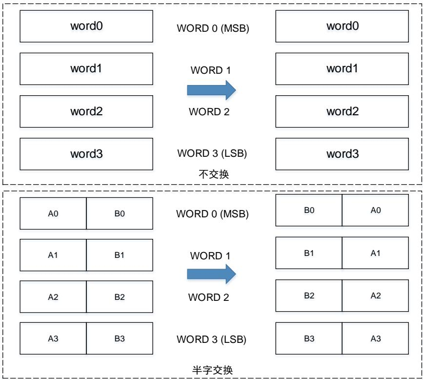
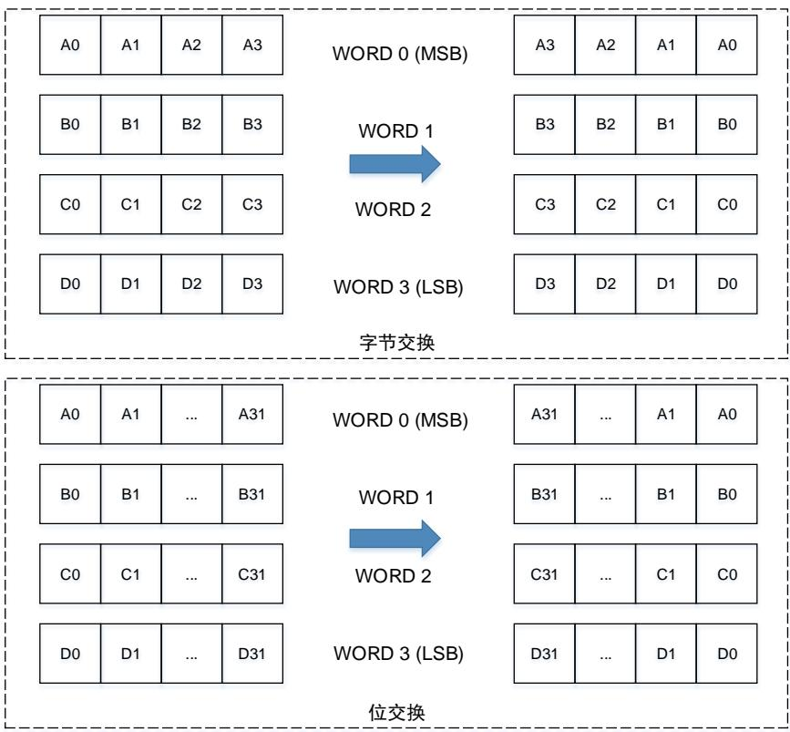
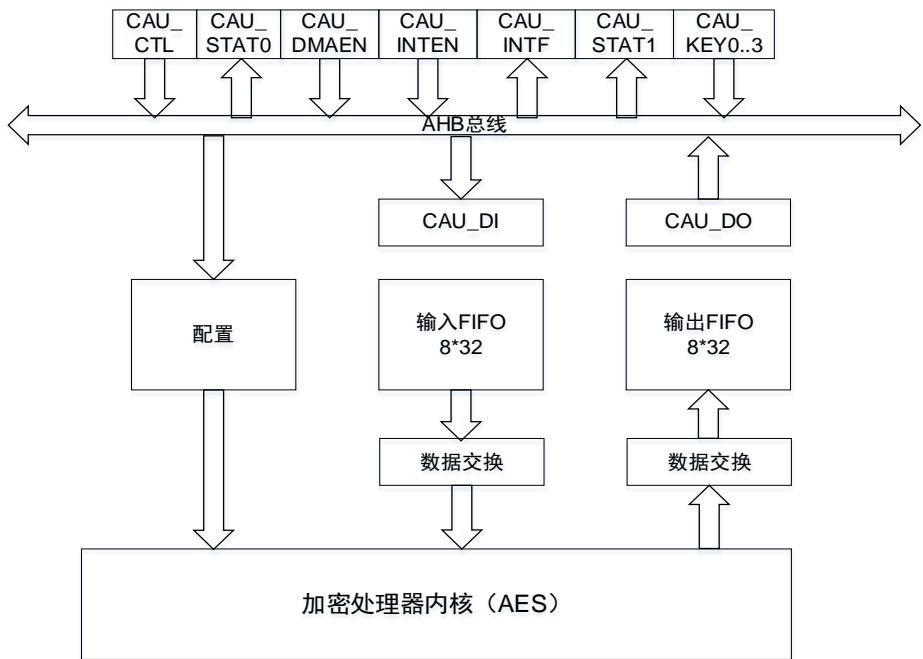
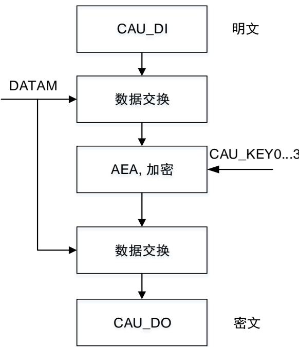
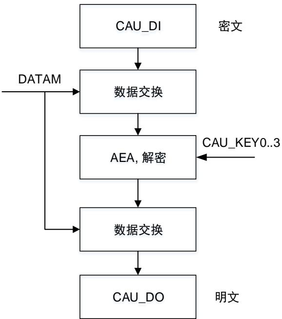

## 19. 加密处理器（CAU）

## 19.1. 简介

加密处理单元支持处理 AES（128，192 或 256）算法，对数据进行加密或解密。加密处理器完全兼容下列标准：

 联邦信息处理标准出版物（FIPS PUB 197，2001年11月26日）规定的高级加密标准（AES）。

CAU 处理器可在多种模式下使用多种长度密钥的 AES算法执行数据加密和解密。

CAU 外设为 32 位 AHB外设，它支持对输入 FIFO 和输出 FIFO 的 DMA 传输。

## 19.2. 主要特征

 支持AES加密解密算法；

 输入与输出FIFO支持DMA传输；

 支持电子密码本（ECB）；

 支持128位、192位或256位密钥；

 输入和输出FIFO各8字深；

 对于输入/输出FIFO的数据支持半字、字节、位交换或不交换；

 数据可通过DMA或CPU中断进行传输，也可以不通过两者进行传输。

## 19.3. CAU数据类型

CAU 处理器一次输入 32 位（字）数据，DES 每 64 位对数据流进行处理，AES 每 128 位对数据流进行处理。对于每个数据块，在其进入 CAU 处理器之前，可对这些数据执行位、字节、半字交换或不交换操作（取决于要加密的数据类型）。在 CAU 数据写入 OUT FIFO 之前，需要对其执行同样的交换操作。注意由于系统存储器结构采用小端模式，无论使用何种数据类型，最低有效数据均占用最低地址位置。

19-1. DATAM / 和 19-2. DATATM / 介绍了 128 位 AES 块在不同数据类型下的数据交换。（对于 DES，数据块大小为 2 个 32 位字，请参考图中前两个字的数据交换）

图 19-1. DATAM 不交换/半字交换

图 19-2. DATATM 字节交换/位交换

## 19.4. 加密处理器流程

加密处理器关于 DES 和 AES加密处理的实现具体请参考章节 AES 。

19-3. CAU 为加密处理器的模块框图。

图 19-3. CAU 框图

## 19.4.1. AES 加密处理流程

AES加密处理器由 AES算法（AEA），多个密钥，以及初始化向量或随机数三部分组成。

AES 支持三种长度的密钥：128、192 和 256 位密钥，根据操作模式的不同使用不同数目的初始化向量或随机数。

使用128位密钥时AES密钥为[KEY3 KEY2]，使用192位密钥时AES密钥为[KEY3 KEY2 KEY1]，使用 256 位密钥时 AES 密钥为[KEY3 KEY2 KEY1 KEY0]。

FIPS PUB 197（2001 年 11 月 26 日）中对 AES 中使用的密钥进行了详细的解释，本手册不再进行赘述。

## AES 电子密码本（ECB）加密

根据数据类型进行数据交换后，首先得到 128 位输入明文数据块。输入数据块通过 AEA使用 128位，或 192 位，或 256 位密钥进行加密处理。处理结果再根据数据类型进行数据交换，生成一个128 位密文输出数据块，并存储在输出 FIFO 中。AES 电子密码本加密流程图见 19-4. AES ECB加密。

图 19-4. AES ECB 加密

## AES电子密码本（ECB）解密

首先需要准备密钥，以用于解密，密钥准备过程的输入密钥与加密处理中的密钥相同。从上述操作中获得的最后一个密钥将作为解密处理用的第一个密钥。密钥准备完成后，首先根据数据类型进行数据交换得到 128 位输入密文数据块。输入数据块在 AEA中读取并使用上面准备的密钥进行解密处理。处理结果输出再根据数据类型值进行数据交换，生成一个 128 位明文输出数据块。AES电子密码本解密流程图见 19-5. AES ECB 。

图 19-5. AES ECB 解密

## 19.5. 操作模式

加密

1. 将CAU_CTL寄存器的CAUEN位清零，以禁用CAU；

2. 若选择了AES算法，则对CAU_CTL寄存器的KEYM位进行选择设置，配置密钥的长度；

3. 将CAU_CTL寄存器中的KEY_SEL位清零，然后根据算法配置CAU_KEY0..3(H/L)寄存器；

4. 设置CAU_CTL寄存器的DATAM位，配置数据交换类型；

5. 设置CAU_CTL寄存器的位，配置算法（AES）和模式（ECB）；

6. 设置CAU_CTL寄存器的CAUDIR位为0，配置为加密操作；

7. 在CAUEN位为0时，设置CAU_CTL寄存器的FFLUSH位，配置刷新输入FIFO和输出FIFO；

8. 设置CAU_CTL寄存器的CAUEN位为1，使能CAU；

9. 当CAU_STAT0寄存器的INF位为1时，向CAU_DI寄存器写数据块。数据可以通过DMA传输或者CPU中断传输，也可不通过两者进行传输；

10. 等待CAU_STAT0寄存器的ONE位为1时，读CAU_DO寄存器。输出数据可以通过DMA传输或者CPU中断传输，也可不通过两者进行传输；

11. 重复步骤9和步骤10，直到所有的数据块都完成加密。

## 解密

1. 将CAU_CTL寄存器的CAUEN位清零，以禁用CAU；

2. 若选择了AES算法，则对CAU_CTL寄存器的KEYM位进行选择设置，配置密钥的长度；

3. 将CAU_CTL寄存器中的KEY_SEL位清零，然后根据算法配置CAU_KEY0..3(H / L)寄存器；

4. 设置CAU_CTL寄存器的DATAM位，配置数据交换类型；

5. 设置CAU_CTL寄存器的ALGM[2:0]位为“111”，配置准备密钥用于解密；

6. 设置CAU_CTL寄存器的CAUEN位为1，使能CAU；

7. 等待BUSY位和CAUEN位为0，确保解密用的密钥已准备好；

8. 设置CAU_CTL寄存器的ALGM[3:0]位，配置算法（AES）和模式（ECB）；

9. 设置CAU_CTL寄存器的CAUDIR位为1，配置为解密操作；

10. 在CAUEN位为0时，设置CAU_CTL寄存器的FFLUSH位，配置刷新输入FIFO和输出FIFO；

11. 设置CAU_CTL寄存器的CAUEN位为1，使能CAU；

12. 当CAU_STAT0寄存器的INF位为1时，向CAU_DI寄存器写数据块。数据可以通过DMA传输或者CPU中断传输，也可不通过两者进行传输；

13. 等待CAU_STAT0寄存器的ONE位为1时，读CAU_DO寄存器。输出数据可以通过DMA传输或者CPU中断传输，也可不通过两者进行传输；

14. 重复步骤12和步骤13，直到所有的数据块都完成解密。

## 19.6. CAU DMA 接口

DMA可用于 CAU 模块的数据块传输。DMA的传输操作由 CAU_DMAEN 寄存器来控制。DMAIEN位用于输入数据的 DMA 请求传输使能，由 DMA 将一个字数据写入 CAU_DI 寄存器。DMAOEN位用于输出数据的 DMA请求传输使能，获得 CAU 输出的一个字。

CAU DMA 接口支持单数据传输和突发传输用以确保即使被传输数据的长度不是突发传输宽度的整数倍也能被正确传输。需要注意的是配置 DMA 控制器突发传输的长度应该不超过四个字以确保数据不会丢失。DMA 输出数据的传输请求优先级高于输入数据的传输请求，因此输出 FIFO 空的事件可能会早于输入 FIFO 满的事件。

## 19.7. CAU 中断

CAU 有两个中断状态寄存器，CAU_STAT1 和 CAU_INTF 寄存器。CAU 中的中断用于指示输入和输出 FIFO 的状态。

可以通过配置 CAU_INTEN 寄存器来使能或禁用输入或输出 FIFO 中断。将寄存器中相应位置 1可以使能相应中断。

## 输入 FIFO 中断

当输入 FIFO 中的数据少于 4 个字时产生输入 FIFO 中断，ISTA 位置位。此时如果 IINTEN 位为1，使能了输入 FIFO 中断，则 IINTF 位将置位。注意当 CAUEN 位为 0 时，ISTA位和 IINTF 位将保持为 0。

## 输出 FIFO 中断

当输出 FIFO 中存在一个或多个字数据时产生输出 FIFO 中断，OSTA位置位。此时如果 OINTEN位为 1 从而使能了输出 FIFO 中断，则 OINTF 位将置位。注意与输入 FIFO 中断不同的是，当CAUEN 位为 0 时，不会影响到 OSTA位与 OINTF 位的状态。

