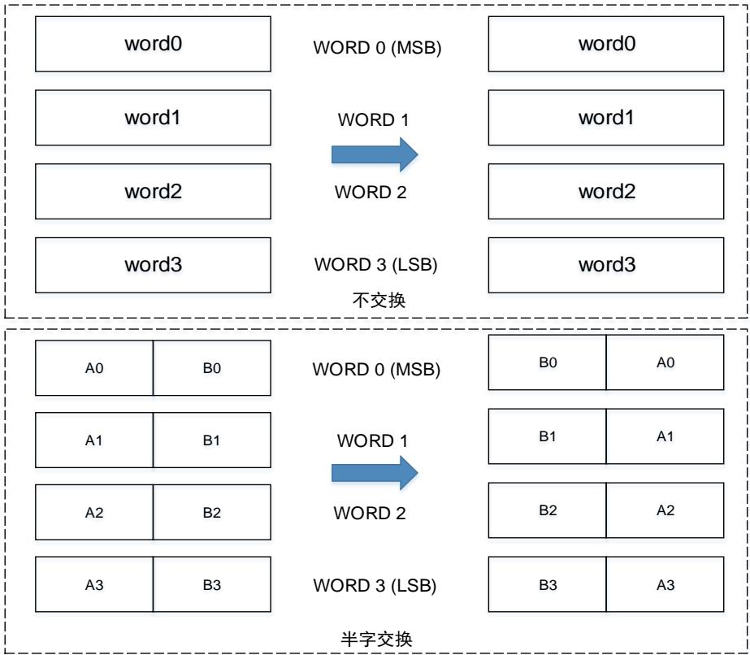
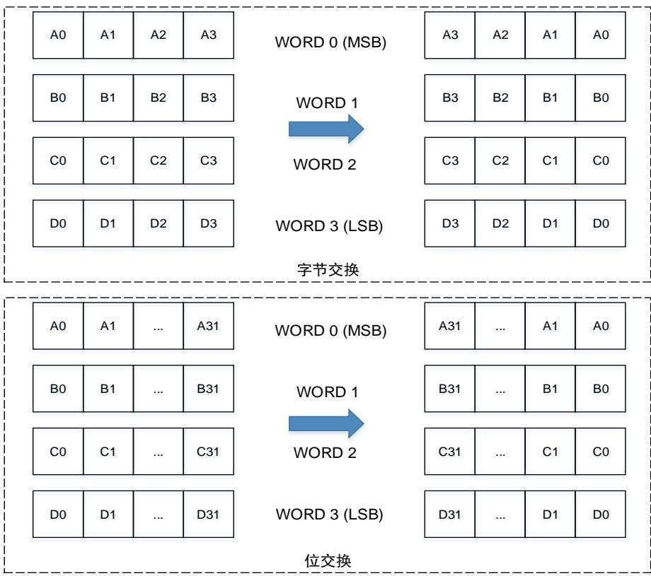
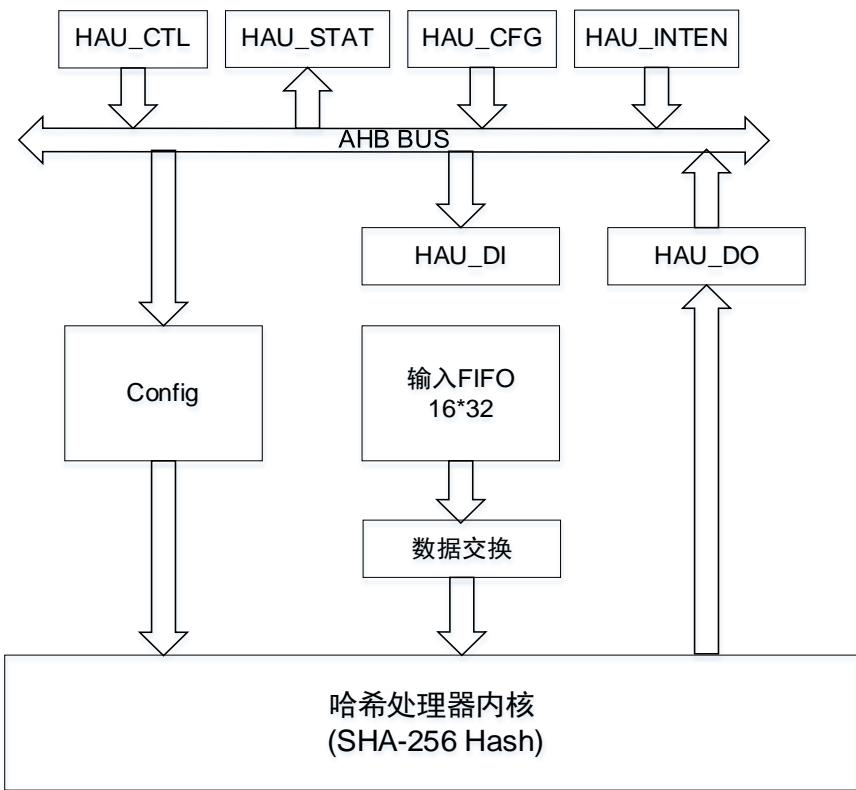

## 20. 哈希处理器（HAU）

## 20.1. 简介

哈希处理器应用于信息安全。支持应用于多种场合的安全哈希算法（SHA-256）。对长达（264-1）位的消息，哈希处理器计算消息摘要长度对应于 SHA-256 为 256 位。

哈希处理器完全兼容下列标准：

 联邦信息处理标准出版物180-4（FIPS PUB 180-4）；

 安全散列标准规范（SHA256）；

## 20.2. 主要特征

 32位AHB从外设；

 高性能的哈希算法运算；

 小端数据表示；

 支持多种数据交换类型，包括32位字不交换，半字交换，字节交换和位交换；

 可自动填充来适应模数为512位（16×32位）消息摘要的计算；

 支持DMA模式的数据流传输；

## 20.3. HAU 数据类型

哈希处理器每次接收 32 位字，但每次计算处理一个 512 位块。对每个输入字，在送入哈希内核之前都会根据数据类型进行位/字节/半字/不交换。同样在数据输出之前也要进行相同的数据交换。注意由于系统存储器结构采用小端模式，无论使用何种数据类型，最低有效数据均占用最低地址位置。SHA-256 的计算均为大端模式。

20-1. DATAM / 和 20-2. DATAM / 介绍了在不同数据类型下的数据交换。

图 20-1. DATAM 不交换/半字交换

图 20-2. DATAM 字节交换/位交换

## 20.4. HAU 内核

哈希处理器使用安全哈希算法对输入消息进行信息压缩计算。对长度为（264-1）位的消息摘要计算结果的长度对应于 SHA-256 为 256 位。哈希处理器可用于生成和验证消息签名，并由于摘要远远小于消息的大小而具有更高的效率。

要由哈希处理器处理的消息应视为位串。消息长度为消息的位数。哈希处理器可以确保信息的安全，因为根据某个给定消息摘要来寻找原对应的消息在计算层面是无法实现的，而在原输入消息上任何的改动都将导致生成完全不同的消息摘要。

图 20-3. HAU 结构框图

## 20.4.1. 自动数据填充

为确保输入 HAU 内核的数据为 512 位的整数倍，需要对输入消息进行填充。消息填充操作由在原始消息的结尾添加一个 1，后跟几个 0 和一个 64 位整数，填充物（0）将消息填充到整个 512 位的前 448 位，实现生成一个长度为 512 的填充消息块。

消息填充完成后，通过配置 HAU_CFG 寄存器的 VBL 位域来设置上面所述的 64 位整数。设置HAU_CFG 寄存器的 CALEN 位为 1，开始计算上个数据块的摘要。

数据填充示例：输入消息为“HAU”，对应的 ASCII 码 16 进制表示为接着根据消息的有效位长度，设置 HAU_CFG 寄存器的 VBL 位域为 24。接着在位串的第 24 位处添加一个”1”，随后填充数个“0”使位串模数为 448，十六进制结果如下所示：

48415580 00000000 00000000 00000000 

00000000 00000000 00000000 00000000 

00000000 00000000 00000000 00000000 

00000000 00000000 

之后，添加 64 位整数到已填充的输入消息后，该 64 位整数十六进制值为 18，则最后的结果应该是：

48415580 00000000 00000000 00000000 

00000000 00000000 00000000 00000000 

00000000 00000000 00000000 00000000 

00000000 00000000 00000000 00000018 

## 20.4.2. 摘要计算

数据填充完成之后，通过 DMA或 CPU 每次将 512 位的数据块送入 HAU 内核，HAU 对每个数据块进行计算。在 HAU 内核开始计算之前，外设需要知道 HAU_DI 寄存器是否包含消息的最后一位。这可以从输入 FIFO 的状态和 HAU_DI 寄存器来确认。

通过 DMA传输数据：

数据块传输的状态将自动通过 DMA 控制器发送的信息来解释。当 HAU_CFG 寄存器的 CALEN 位置 1 时，将自动开始进行数据填充和摘要计算。

注意：如果消息是个大文件并需要多个 DMA 传输，则应将 MDS 位置 1。另外在传输之前需要设置 VBL 位域。在 DMA 的传输完成之后硬件不会自动将 CALEN 位置 1，以便可以接收新的 DMA传输。在最后的 DMA传输期间，需要将 MDS 位清零，从而在最后一个块传输结束时硬件自动将CALEN 位置 1。

若消息不需要多个 DMA 传输，则将 MDS 置 0 即可，这样在一个 DMA 传输完成之后就会硬件自动置位 CALEN 位。同样的，在 DMA传输之前也需要先设置 VBL 位域。

通过 CPU 传输数据：

■ 当HAU_DI寄存器中写入下一个数据块的第一个字时，将开始计算当前数据块的摘要；

 将HAU_CFG寄存器中CALEN位置1，将开始最后一个数据块的摘要计算。

## 20.4.3. 哈希模式

当从 HAU_DI 寄存器和接收 FIFO 中接收到 512 位的消息块时，将根据 DMA 和 CALEN 位状态开

始摘要的计算。

最终的计算结果可以从 HAU_DO0...7 寄存器中读取。

## 20.5. HAU 中断

HAU具有两个独立的中断源，并在HAU_STAT 有相应的状态位。这两个状态位用于指示输入FIFO的状态，以及摘要的计算是否完成。

HAU_INTEN 寄存器为中断使能寄存器。将相应位置 1 可以使能中断。

## 20.5.1. 输入 FIFO 中断

当输入 FIFO 中的数据处理已完成时，输入 FIFO 标志位 DIF 置位。如果置位 DIIE 位使能了输入FIFO 中断，则当输入 FIFO 标志位 DIF 置位时会发生输入 FIFO 中断。

## 20.5.2. 计算完成中断

当摘要计算完成时，计算完成标志位 CCF 将置位。如果置位 CCIE位使能了计算完成中断，则当计算完成标志位 CCF 置位时会发生计算完成中断。

