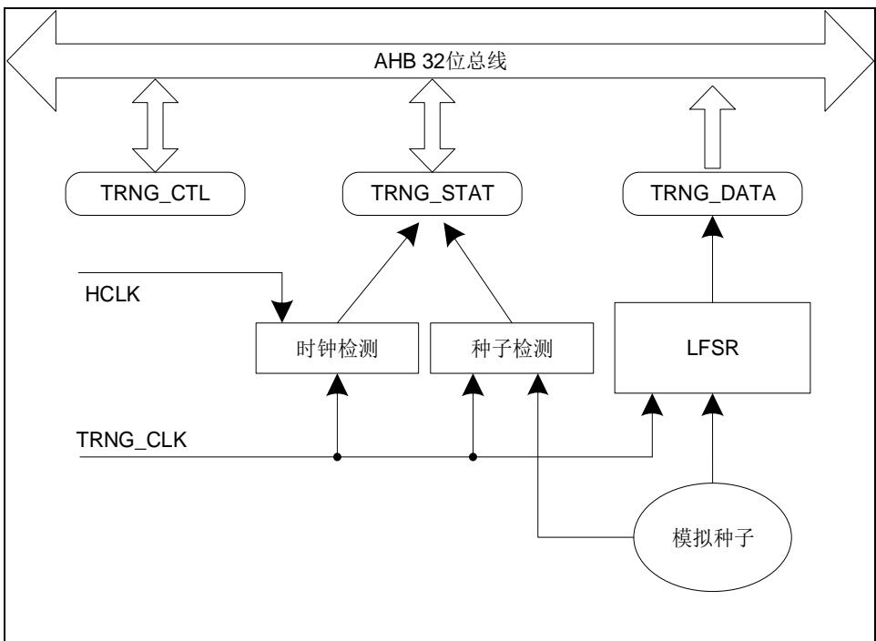

## 10. 真随机数生成器（TRNG）

## 10.1. 简介

真随机数发生器模块（TRNG）能够通过连续模拟噪声生成一个 32 位的随机数值。

## 10.2. 主要特性

- 两个连续随机数的间隔大约为40个TRNG_CLK时钟周期；

- 32位随机数的种子是由模拟噪声产生的，因此该随机数是一个真随机数值。

## 10.3. 功能描述

图 10-1. TRNG 模块框图

随机数种子由模拟电路实现。模拟种子信号输出到一个线性反馈移位寄存器（LFSR）之后在该寄存器中转化成一个 32 位宽度的随机数。

该模拟种子由几个环形振荡器的输出生成。LFSR 由可配置的 TRNG_CLK 时钟（参考 RCU相关章节）驱动，因此随机数质量仅与 TRNG_CLK 时钟有关，与 HCLK 频率无关。

当有足够数量的种子被输入 LFSR 之后，LFSR 会输出 32 位数据到 TRNG_DATA 寄存器。同时，系统会监视模拟种子和 $\mathsf { T R N G \_ C L K }$ 时钟。一旦模拟种子发生错误或者时钟产生错误，TRNG_STAT 寄存器的相关状态位将被置 1，如果 $\mathsf { T R N G \_ C T L }$ 寄存器的 TRNGIE位同时被置1 还将产生中断。

## 10.3.1. 操作流程

以下步骤为 TRNG 模块的推荐操作流程：

1. 根据需要使能中断，这样当随机数或错误产生时，将会触发一个中断；

2. 使能TRNGEN位；

3. 等待中断产生，检测TRGN_STAT寄存器，如果SEIF = 0，CEIF = 0并且DRDY = 1那么数据寄存器中的随机值可以被读取。

按照 FIPS PUB 140-2 的要求，数据寄存器中的第一个随机数需要保留而不是被使用。每一个新生成的随机数应当与之前的随机数相比较。只有当该随机数与前一个随机数不相等时，该数据才可被使用。

## 10.3.2. 错误标志

## 时钟错误

当 TRNG_CLK 时钟频率低于 HCLK 频率的 1/16 时，CECS 和 CEIF 位将被置 1。此时，软件应当检查 TRNG_CLK 和 HCLK时钟频率配置并清除 CEIF 位。时钟错误对上一个产生的随机数没有影响。

## 种子错误

当模拟种子的值在 64 个 TRNG_CLK 时钟周期内不发生变化或连续不断的翻转，SECS 和SEIF 位将被置位。此时，数据寄存器中的随机数值不应当被使用，并且软件需要清除 SEIF 位。之后将 TRNGEN 位清零并置 1 以便重新启动 TRNG 模块。
