## 11. 公钥加密处理器（PKCAU）

## 11.1. 简介

公钥加密又称非对称加密，非对称加密算法加密和解密采用不同的密钥。公钥加密处理器（PKCAU）支持加速GF(p) (伽罗华域)上的RSA（Rivest、Shamir和Adleman）、Diffie-Hellmann（DH 密钥交换）或 ECC（椭圆曲线加密）加密算法。这些操作在蒙哥马利域内执行能提高运算效率。

## 11.2. 主要特征

- 支持操作数高达 3136 位的 RSA/DH 算法；

- 支持操作数高达 640 位的 ECC 算法；

- RSA 模幂运算，RSA CRT 求幂；

- ECC 标量乘法，曲线上点的检查；

- ECDSA（椭圆曲线数字签名算法）签名和验证；

- 支持蒙哥马利模法，加速 RSA，DH 和 ECC 运算；

- 内嵌 3584 字节 RAM；

- 蒙哥马利域和自然域之间的相互转换；

- PKCAU 外设为 32 位外设，只支持 32 位访问。

## 11.3. 功能说明

公钥加速器（PKCAU）用于加速素域 GF(p)上 RSA、DH 以及椭圆曲线加密（ECC）运算。PKCAU 模块包含 PKCAU RAM、PKCAU 内核以及外设寄存器。PKCAU RAM 用于存放运算所需的参数，并在计算完成后，保存计算结果。

PKCAU 的内部结构如图11-1. PKCAU 模块框图所示。

图 11-1. PKCAU 模块框图

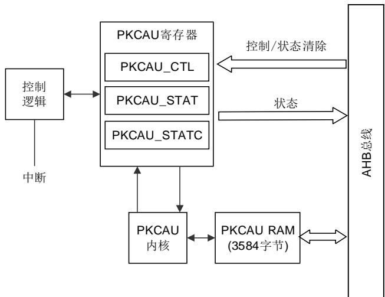

## 11.3.1. 操作数

假设 RSA 操作数长度为 ROS，模长度为 ML，则数据长度ROS = (ML / 32+1)个字。假设 ECC操作数长度为 EOS，模长度为 ML，则数据长度EOS = (ML / 32+1)个字。

PKCAU 支持操作数高达 3136 位（98 个字）的 RSA / DH 算法和操作数高达 640 位（20 个字）的 ECC 算法。ROS最大为 99 个字，EOS最大为 21 个字。

在将输入参数写入 PKCAU RAM 时，必须添加一个 0x00000000。PKCAU RAM 是小端存储，例如，当将用于 ECC 标量乘法的 ECC P256 的输入参数 x 写入 PKCAU RAM，模数长度为 8个字，最低字节存放在偏移为 0x55C 的地址，最高字节存放在偏移为 0x578 的地址，0x00000000 存放在偏移为 0x57C 的地址。

## 11.3.2. RSA 算法

RSA算法是一种常用的公钥密码算法，是应用最广泛的非对称密码算法。RSA算法流程如图11-2. RSA算法流程图所示。

图 11-2. RSA 算法流程图

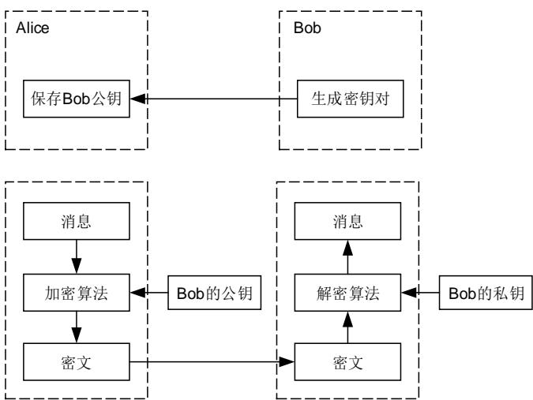

一个完整的公钥密码体制包含密钥对（公钥和私钥）、加密算法和解密算法。

## RSA密钥对生成

1、 选择两个大素数 p 和 q（p≠q）；

2、 计算n=p×q，n 为公钥和私钥的模数；

3、 计算 $\scriptstyle \mathsf { L } = \emptyset ( \mathsf { n } ) = ( \mathsf { p } - 1 ) ( \mathsf { q } - 1 )$ ，其中∅(n)为欧拉函数；

4、选择e，满足1<e<L，同时满足e 和L 互质；

5、计算 d，满足1<d<L，同时满足 $\mathtt { e } ^ { \star } { \mathrm { d } } { \bmod { \mathsf { L } } } = 1$ 。

通过以上计算可以得到表 算法参数中所示参数：

表 11-1. RSA 算法参数

<table><tr><td>参数</td><td>描述</td></tr><tr><td>n</td><td>模数</td></tr><tr><td>e</td><td>公开指数</td></tr><tr><td>d</td><td>私密指数</td></tr><tr><td>(n,e)</td><td>公钥</td></tr><tr><td>(n,d)</td><td>私钥</td></tr></table>

## RSA 加密

Bob生成符合 RSA算法标准的密钥对，包含公钥和私钥，并将公钥发送给 Alice，私钥自己保存。Alice 可以通过 Bob 的公钥对消息 m 进行加密，从而得到密文 c。并将密文发给 Bob。密文 $\mathsf { c } = \mathsf { m } ^ { \mathsf { e } } \mathsf { m o d } \mathsf { n }$ 。

## RSA 解密

Bob收到密文后采用私钥对密文进行解密得到明文。解密过程为 $\mathfrak { m } = \mathfrak { c } ^ { \mathsf { d } }$ mod n。

## 11.3.3. ECC 算法

假设消息为 M，d 为私钥，G 为椭圆曲线上的基点，Q 为椭圆曲线上的某点，椭圆曲线素数阶为 n，散列函数为 HASH()，z 是 HASH(M)最左边的位，Ln是 n 的位长度，ECDSA 签名和验证详细描述如下：

## ECDSA 签名

ECDSA签名结果由 r和 s 两部分组成。ECDSA生成签名流程如图11-3. ECDSA 签名流程图所示。

图 11-3. ECDSA 签名流程图

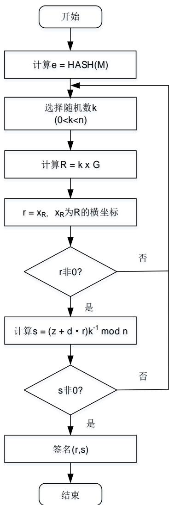

## ECDSA 验证签名

在验证签名之前，确保得到签名者的公钥、消息以及签名(r,s)。ECDSA 验证签名的流程如图11-4. ECDSA 验证流程图所示。

图 11-4. ECDSA 验证流程图

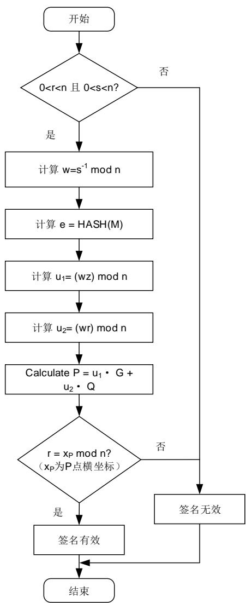

注意：上图中的 HSAH 是约定的散列函数。

## 11.3.4. 整数算术运算模式

通过配置 PKCAU_CTL 寄存器中的 MODSEL[5:0]，可以选择整数算术运算模式。可选运算模式如表11-2. 整数算术运算。

表 11-2. 整数算术运算

<table><tr><td>MODSEL[5:0]</td><td>运算模式</td></tr><tr><td>000000</td><td>蒙哥马利参数计算然后模幂</td></tr><tr><td>000001</td><td>只进行蒙哥马利参数计算</td></tr><tr><td>000010</td><td>只进行模幂运算(蒙哥马利参数必须预先加载)</td></tr><tr><td>000111</td><td>RSA CRT 求幂</td></tr><tr><td>001000</td><td>模逆运算</td></tr><tr><td>001001</td><td>算术加法</td></tr><tr><td>001010</td><td>算术减法</td></tr><tr><td>001011</td><td>算术乘法</td></tr><tr><td>001100</td><td>算术比较</td></tr><tr><td>001101</td><td>取模运算</td></tr><tr><td>001110</td><td>模加法</td></tr><tr><td>001111</td><td>模减法</td></tr><tr><td>010000</td><td>蒙哥马利乘法</td></tr></table>

## 算术加法

将 PKCAU_CTL 寄存器中的 MODSEL[5:0]配置为“001001”，可以选择运算模式为算术加法运算。运算说明如图11-5. 算术加法所示。运算结果为result = A+B。

图 11-5. 算术加法

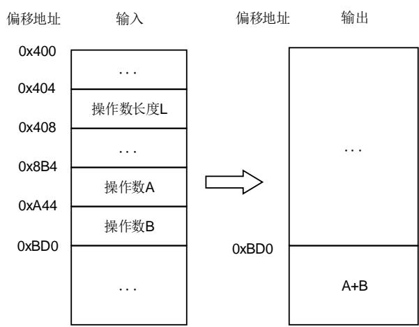

其中， $0 \leq A < 2 ^ { \lfloor }$ $0 \leq B < 2 ^ { \mathsf { L } }$ $0 { \leq } \mathsf { r e s u l t } { < } 2 ^ { \mathsf { L } + 1 }$ $0 { < } \mathsf { L } \mathsf { \leq } 3 1 3 6$

## 算术减法

将 PKCAU_CTL 寄存器中的 MODSEL[5:0]配置为“001010”，可以选择运算模式为算术减法运算。运算说明如图11-6. 算术减法所示。

如果A≥B，运算结果为 $| \boldsymbol { \mathsf { r e s u l t } } = \mathsf { A } { \cdot } \mathsf { B }$ ；

如果A<B，运算结果为 $r e s u \vert \mathrm { t } = A { \cdot } B { + } 2 ^ { \mathsf { L } + \mathsf { c e i l } ( \mathsf { L } ^ { \circ } / \mathsf { \Omega } _ { 0 } 3 2 ) }$ 。

图 11-6. 算术减法

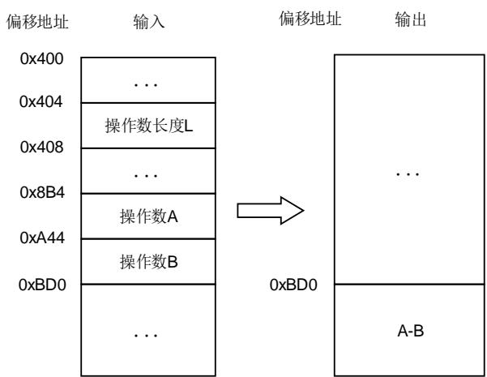

其中， $0 \leq A < 2 ^ { \lfloor }$ $0 \leq B < 2 ^ { \mathsf { L } }$ $0 { \leq } \mathsf { r e s u l t } { < } 2 ^ { \mathsf { L } }$ $0 { < } \mathsf { L } { \leq } 3 1 3 6$

## 算术乘法

将 PKCAU_CTL 寄存器中的 MODSEL[5:0]配置为“001011”，可以选择运算模式为算术乘法运算。运算说明如图11-7. 算术乘法所示。运算结果为result = A×B。

图 11-7. 算术乘法

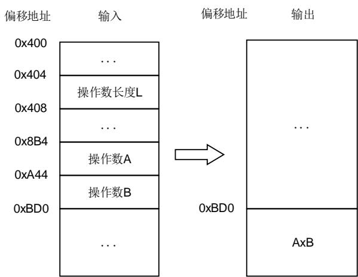

其中， $0 \leq A < 2 ^ { \lfloor }$ $0 \leq B < 2 ^ { \mathsf { L } }$ $0 { \leq } \mathsf { r e s u l t } { < } 2 ^ { 2 \mathsf { L } }$ $0 { < } \mathsf { L } \mathsf { \leq } 3 1 3 6$ 0

## 算术比较

将 PKCAU_CTL 寄存器中的 MODSEL[5:0]配置为 $^ { \dag } 0 0 1 1 0 0 ^ { \dag }$ ，可以选择运算模式为算术比较运算。运算说明如图11-8. 算术比较所示。

如果A = B，运算结果为result = 0x0；

如果A > B，运算结果为result = 0x1；

如果A<B，运算结果为result =0x2。

图 11-8. 算术比较

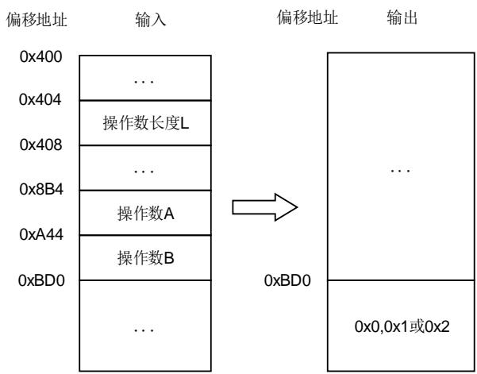

其中， $0 \leq A < 2 ^ { \lfloor }$ $0 \leq B < 2 ^ { \mathrm { l } }$ $\mathsf { r e s u l t } = 0 \times 0$ $0 \times 0 \uparrow$ 或 $_ { 0 \times 2 }$ $0 { < } \mathsf { L } { \leq } 3 1 3 6$

## 取模运算

将 PKCAU_CTL 寄存器中的 MODSEL[5:0]配置为“001101”，可以选择运算模式为取模运算。运算说明如图11-9. 取模运算所示。运算结果为result = A mod n。

图 11-9. 取模运算

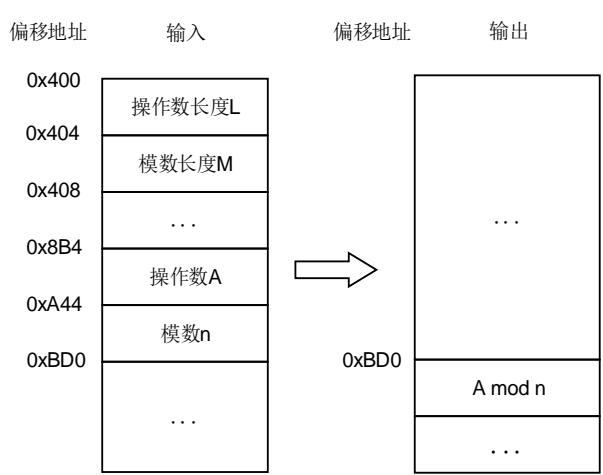

其中， $0 { < } \mathsf { L } \mathsf { \leq } 3 1 3 6$ ，0<M≤3136， $0 \leq A < 2 ^ { \lfloor }$ $0 < n < 2 ^ { \mathsf { M } }$ ，0≤result<n。

## 模加法

将 PKCAU_CTL 寄存器中的 MODSEL[5:0]配置为“001110”，可以选择运算模式为模加法运算，运算说明如图11-10. 模加法所示。运算结果为result = A+B mod n。

PKCAU RAM 

图 11-10. 模加法

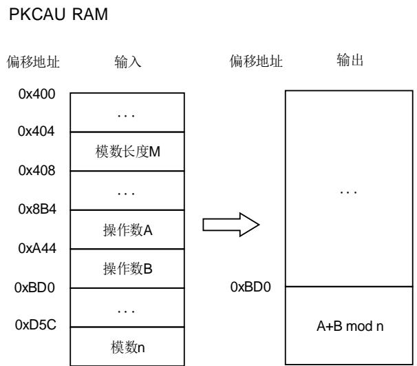

其中，0≤A<n，0≤B<n，0≤result<n， $0 < n < 2 ^ { M }$ ，0<M≤3136。

## 模减法

将 PKCAU_CTL 寄存器中的 MODSEL[5:0]配置为“001111”，可以选择运算模式为模减法运算。运算说明如图11-11. 模减法所示。

如果A≥B，运算结果为result = A-B mod n。

如果A<B，运算结果为result = A-B+n mod n。

图 11-11. 模减法

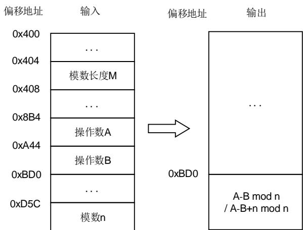

其中，0≤A<n，0≤B<n，0≤result<n， $0 < n < 2 ^ { \mathsf { M } }$ ，0<M≤3136。

## 蒙哥马利参数计算

PKCAU 将操作数转换为蒙哥马利剩余系统表示需要使用到蒙马参数(R2 mod n)。

将 PKCAU_CTL 寄存器中的 MODSEL[5:0]配置为“000001”，可以选择运算模式为只进行蒙哥马利参数计算，说明如图11-12. 蒙哥马利参数计算所示。

图 11-12. 蒙哥马利参数计算

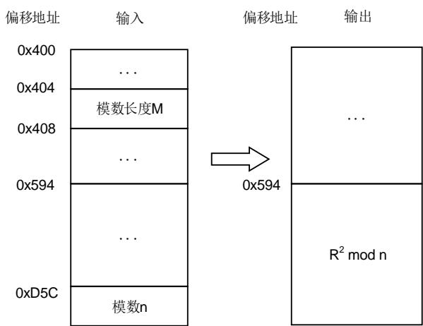

其中，0<M≤3136， $1 < n < 2 ^ { \mathsf { M } }$ （n 为奇数整数）。

## 蒙哥马利乘法

假设 A，B，C 均为自然域中的数。“x”指蒙哥马利乘法。蒙哥马利乘法运算的两个主要用途如下：

1、 蒙哥马利域和自然域之间的相互映射。

如图11-13. 蒙哥马利域和自然域之间的相互映射所示。如果 A是自然域中的整数，蒙哥马利参数 mont para 为R² mod n，AR = A x mont para mod n为蒙哥马利域 A。相反地，如果 BR是蒙哥马利域的整数，计算结果B = BRx1 mod n在自然域。

图 11-13. 蒙哥马利域和自然域之间的相互映射

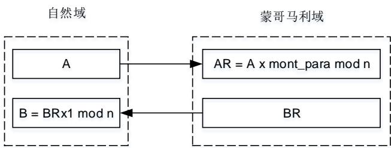

2、 执行模乘运算A x B mod n。

(1)、计算蒙哥马利参数 $\mathsf { m o n t \_ p a r a } = \mathsf { R } ^ { 2 } \mathsf { m o d } \mathsf { n }$ 

(2)、计算AR = A x mont_para mod n，输出在蒙哥马利域；

(3)、计 $\sharp \mathsf { A B } = \mathsf { A R } \times \mathsf { B } \mathsf { m o d n }$ ，输出在自然域。

多元模乘A x B x C mod n步骤如下：

(1)、计算蒙哥马利参数mont_para = R2 mod n；

(2)、计算AR = A x mont_para mod n，输出在蒙哥马利域；

(3)、计算BR = B x mont_para mod n，输出在蒙哥马利域；

(4)、计算ABR = AR x BR mod n，输出在蒙哥马利域；

(5)、计算CR = C x mont_para mod n，输出在蒙哥马利域；

(6)、计算ABCR = ABR x CR mod n，输出在蒙哥马利域；

(7)、计算ABC= ABCR x 1 mod n，输出在自然域。

将 PKCAU_CTL 寄存器中的 MODSEL[5:0]配置为“010000”，可以选择运算模式为蒙哥马利乘，说明如图11-14. 蒙哥马利乘法所示。

图 11-14. 蒙哥马利乘法

PKCAU RAM 

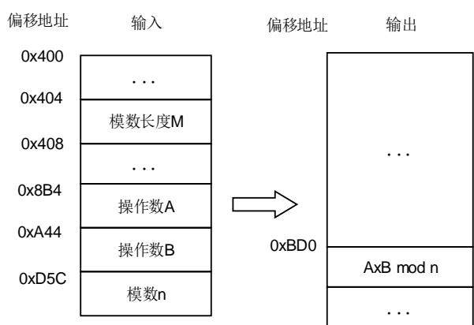

其中，0≤A<n，0≤B<n，0<n<2M，0<M≤3136（n 为奇数整数）。

## 模幂运算

## 普通模式

将 PKCAU_CTL 寄存器中的 MODSEL[5:0]配置为“000000”，可以选择运算模式为普通模幂运算，运算说明如图11-15. 普通模式模幂运算所示。运算结果为result = Ae mod n。

## 图 11-15. 普通模式模幂运算

PKCAU RAM

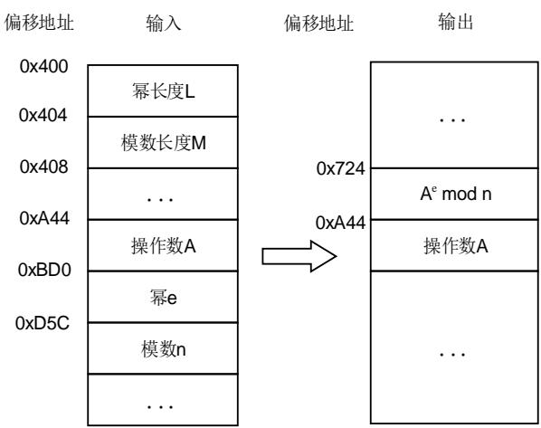

其中， $0 { < } \mathsf { L } \mathsf { \leq } 3 1 3 6$ ， 0<M≤3136，0≤A<n， $0 \leq e < 2 ^ { \lfloor }$ ，0≤result<n， $1 < n < 2 ^ { \mathsf { M } }$ （n 为奇数整数）。

## 快速模式

将 PKCAU_CTL 寄存器中的 MODSEL[5:0]配置为“000010”，可以选择运算模式为快速模幂运算，运算说明如图11-16. 快速模式模幂运算所示。运算结果为result = Ae mod n。

图 11-16. 快速模式模幂运算

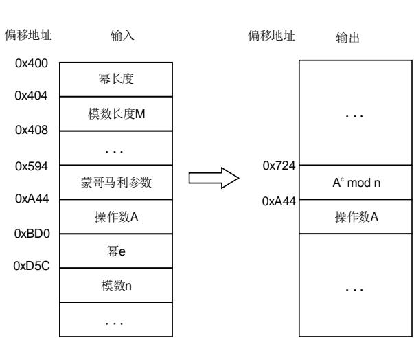

其中，0≤A<n，0≤e<n，0≤result<n， $0 < n < 2 ^ { \mathsf { M } }$ ， 0<M≤3136，0<蒙哥马利参数 $( { \mathsf { R } } ^ { 2 } { \mathsf { m o d } } { \mathsf { n } } ) { \mathsf { < n } }$

## 模逆运算

将 PKCAU_CTL 寄存器中的 MODSEL[5:0]配置为 $^ { \omega } 0 0 1 0 0 0 ^ { \prime \prime }$ ，可以选择运算模式为模逆运算，运算说明如图11-17. 模逆运算所示。运算结果为 $| \boldsymbol { \ r e s u } | \mathbf { t } = \mathsf { A } ^ { - 1 }$ mod n。

图 11-17. 模逆运算

PKCAU RAM

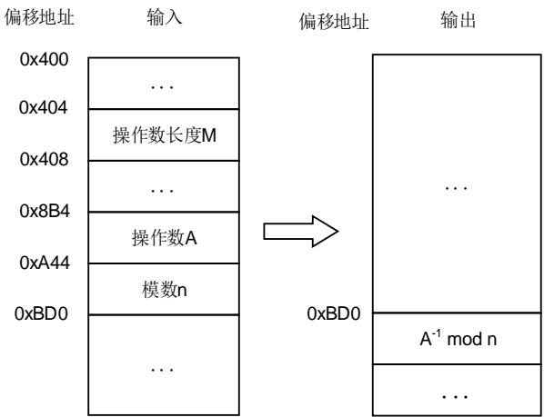

其中，0<A<n，0<result<n， $0 < n < 2 ^ { \mathsf { M } } , 0 < \mathsf { M } \leq 3 1 3 6$

## 注意：

1、如果模数 n 是素数，满足条件1≤A<n的所有 A 的值，都有有效的模逆输出；

2、如果模数 n 不是素数，当 A和 n 的最大公约数为 1 时，才会有有效的模逆输出。

## RSA CRT 求幂

将 PKCAU_CTL 寄存器中的 MODSEL[5:0]配置为 $^ { \dag } 0 0 0 1 1 1 ^ { \prime \prime }$ ，可以选择运算模式为 RSA CRT求幂。

p 和 q 是私钥的一部分，均为素数

$$
\mathrm{d} _ {\mathrm{P}} = \mathrm{d} \mod (\mathrm{p} - 1)
$$

$$
\mathrm{d} _ {\mathrm{Q}} = \mathrm{d} \bmod (\mathrm{q} - 1)
$$

$$
q _ {i n v} = q ^ {- 1} \mod p
$$

以上的参数允许接收方更有效地计算求幂 ${ \mathfrak { m } } = { \mathsf { A } } ^ { \circ } ( { \mathsf { m o d } } { \mathsf { p q } } )$ 

$$
m = A ^ {d} (\text { mod   pq })
$$

$$
m _ {1} = A ^ {d P} \mod p
$$

$$
\mathsf {m} _ {2} = \mathsf {A} ^ {\mathrm{dQ}} \bmod \mathsf {p}
$$

$$
h = q _ {\text { inv }} (m _ {1} - m _ {2}) \mod p, m _ {1} > m _ {2}
$$

$$
m = m _ {2} + h q
$$

运算说明如图11-18. RSA CRT求幂所示。运算结果为result $= \mathsf { A } ^ { ^ { \mathrm { d } } }$ mod pq。

## 图 11-18. RSA CRT 求幂

PKCAU RAM

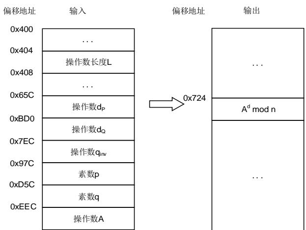

RSA CRT 求幂参数取值范围如表11-3. RSA CRT求幂参数取值范围所示。

表 11-3. RSA CRT 求幂参数取值范围

<table><tr><td colspan="2">参数</td><td>取值范围</td></tr><tr><td rowspan="6">输入</td><td>操作数 $d_P$</td><td>$0 \leq d_P &lt; 2^{L/2}$</td></tr><tr><td>操作数 $d_Q$</td><td>$0 \leq d_Q &lt; 2^{L/2}$</td></tr><tr><td>操作数 $q_{inv}$</td><td>$0 &lt; q_{inv} &lt; 2^{L/2}$</td></tr><tr><td>素数 p</td><td>$0 &lt; p &lt; 2^{L/2}$</td></tr><tr><td>素数 q</td><td>$0 &lt; q &lt; 2^{L/2}$</td></tr><tr><td>操作数 A</td><td>$0 \leq A &lt; 2^L$</td></tr><tr><td>输出</td><td>运算结果:$A^d \mod pq$</td><td>$0 \leq result &lt; pq$</td></tr></table>

## 11.3.5. Fp域椭圆曲线运算模式

通过配置 PKCAU_CTL 寄存器中的 MODSEL[5:0]来选择 Fp 域椭圆曲线相关运算模式。可选运算模式如表11-4. 椭圆曲线运算模式选择。

表 11-4. 椭圆曲线运算模式选择

<table><tr><td>MODSEL[5:0]</td><td>运算模式</td></tr><tr><td>100000</td><td>先进行蒙哥马利参数计算,然后进行 ECC 标量乘法</td></tr><tr><td>100010</td><td>只进行 ECC 标量乘法(蒙哥马利参数必须预先加载)</td></tr><tr><td>100100</td><td>ECDSA 签名</td></tr><tr><td>100110</td><td>ECDSA 验证</td></tr><tr><td>101000</td><td>椭圆曲线在素域 Fp 上点的检查</td></tr></table>

## 椭圆曲线在素域 Fp上点的检查

该运算用于检查点 P(x,y)是否在素域方程 $y ^ { 2 } = x ^ { 3 } + a x + b \ m o d \ p$ 上，其中 a，b 为曲线系数。将PKCAU_CTL 寄存器中的 MODSEL[5:0]配置为“101000”，可以选择运算模式为检查椭圆曲线在 Fp 域上点，运算说明如图11-19. 椭圆曲线在Fp 域上点的检查所示。运算结果如果为 0，则表明 P 点在椭圆曲线上；如果不为 0，则表明 P 点不在椭圆曲线上。

图 11-19. 椭圆曲线在 Fp域上点的检查

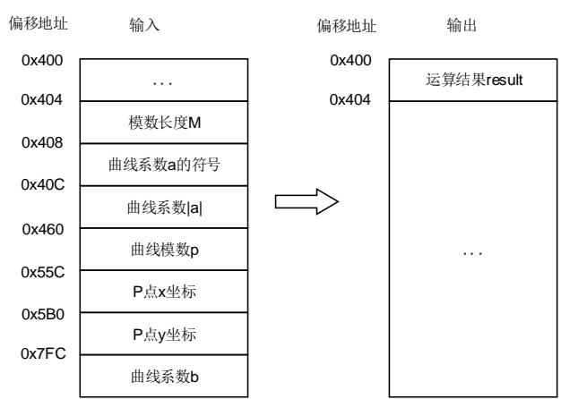

椭圆曲线在Fp域上点的检查范围如表11-5. 椭圆曲线在Fp域上点的检查参数取值范围所示。

表 11-5. 椭圆曲线在 Fp域上点的检查参数取值范围

<table><tr><td>输入参数</td><td>取值范围</td></tr><tr><td>模数长度M</td><td>0</td></tr><tr><td>曲线系数a的符号</td><td>0x0:正数0x1:负数</td></tr><tr><td>曲线系数|a|</td><td>绝对值|a|</td></tr><tr><td>曲线系数b</td><td>绝对值|b|</td></tr><tr><td>曲线模数p</td><td>奇素数0</td></tr><tr><td>P点x坐标</td><td>x</td></tr><tr><td>P点y坐标</td><td>y</td></tr></table>

## ECC标量乘法

ECC 标量乘法操作 $\mathsf { a k } { \times } \mathsf { P } ( \mathsf { x } _ { \mathsf { P } } , \mathsf { y } _ { \mathsf { P } } )$ ，其中 P 是椭圆曲线在素域 Fp 上的点，计算结果依然在曲线上，或者是无穷远点。

## 普通模式

将 PKCAU_CTL 寄存器中的 MODSEL[5:0]配置为“100000”，可以选择运算模式为先进行蒙哥马利参数计算，然后进行 ECC 标量乘法，运算说明如图11-20. 普通模式ECC标量乘法所示。

图 11-20. 普通模式 ECC 标量乘法

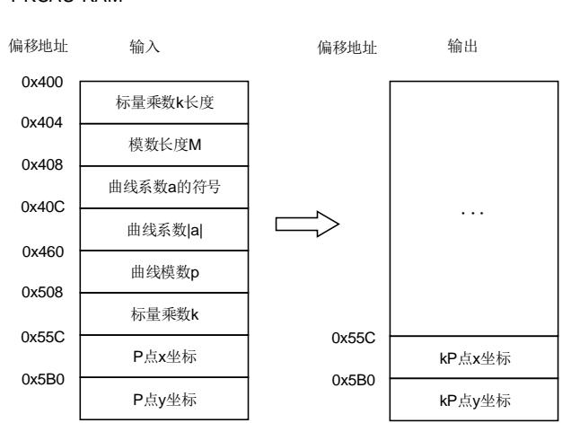

## 快速模式

将 PKCAU_CTL 寄存器中的 MODSEL[5:0]配置为“100010”，可以选择运算模式为只进行 ECC标量乘法，运算说明如图11-21. 快速模式ECC标量乘法所示。

图 11-21. 快速模式 ECC 标量乘法

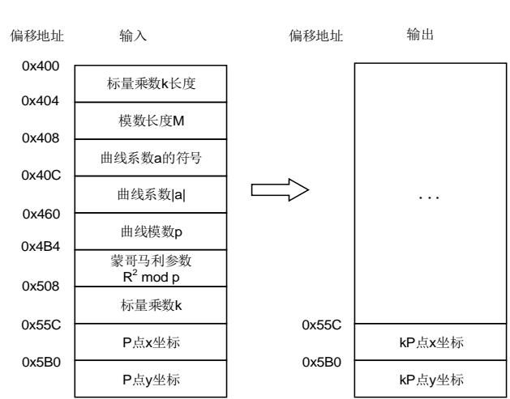

ECC 标量参数取值范围如表11-6. ECC标量乘法参数取值范围所示。

表 11-6. ECC 标量乘法参数取值范围

<table><tr><td colspan="2">参数</td><td>取值范围</td></tr><tr><td rowspan="8">输入</td><td>标量乘数k的长度LEN</td><td>0</td></tr><tr><td>模数长度M</td><td>0</td></tr><tr><td>曲线系数a的符号</td><td>0x0:正数0x1:负数</td></tr><tr><td>曲线系数|a|</td><td>绝对值|a|</td></tr><tr><td>曲线模数p</td><td>奇素数0</td></tr><tr><td>标量乘数k</td><td>0≤k&lt;2LEN(kn是曲线的素数阶)</td></tr><tr><td>P点x坐标$x_P$</td><td>$x_P</td></tr><tr><td>P点y坐标\( y_P$</td><td>\( y_P</td></tr><tr><td rowspan="2">输出</td><td>kP点x坐标x</td><td>x</td></tr><tr><td>kP点y坐标y</td><td>y</td></tr></table>

如果 k = 0，输出是无穷远处的一点。当 k 是曲线素数阶 n 的倍数时，输出也是无穷远处的一点。在这个模块中，如果结果是无穷远处的一个点，则输出为(0,0)。

如果 k < 0，则 k 的绝对值代替 k 作为 ECC 标量乘法的标量乘数。计算完成后，可以用-P = (x, -y)来计算 y的最终结果。

## ECDSA 签名

将 PKCAU_CTL 寄存器中的 MODSEL[5:0]配置为“100100”，可以选择运算模式 ECDSA 签名，运算说明如图11-22. ECDSA 签名所示。

图 11-22. ECDSA 签名

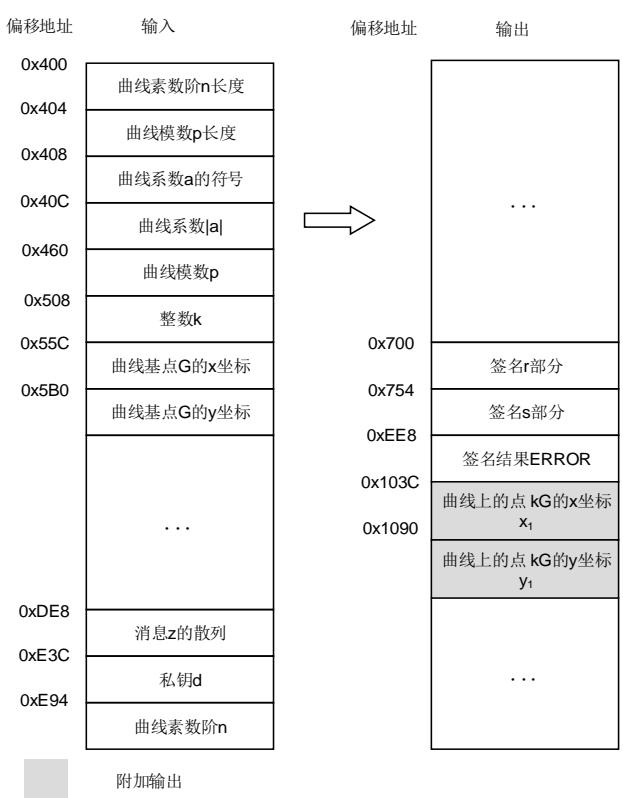

ECDSA签名参数取值范围如表11-7. ECDSA 签名参数取值范围所示。

表 11-7. ECDSA 签名参数取值范围

<table><tr><td colspan="2">参数</td><td>取值范围</td></tr><tr><td rowspan="11">输入</td><td>曲线素数阶n的长度LEN</td><td>0</td></tr><tr><td>曲线模数p的长度M</td><td>0</td></tr><tr><td>曲线系数a的符号</td><td>0x0:正数0x1:负数</td></tr><tr><td>曲线系数|a|</td><td>绝对值|a|</td></tr><tr><td>曲线模数p</td><td>奇素数0</td></tr><tr><td>整数k</td><td>0≤k&lt;2LEN</td></tr><tr><td>曲线基点G的x坐标</td><td>x</td></tr><tr><td>曲线基点G的y坐标</td><td>y</td></tr><tr><td>消息z的散列</td><td>Z&lt;2LEN</td></tr><tr><td>私钥d</td><td>正整数d</td></tr><tr><td>曲线素数阶n</td><td>素数n&lt;2LEN</td></tr><tr><td rowspan="4">输出</td><td>签名r部分</td><td>0</td></tr><tr><td>签名s部分</td><td>0</td></tr><tr><td>签名结果ERROR</td><td>0x0:无错误0x1:签名r部分为00x2:签名s部分为0</td></tr><tr><td>曲线上的点kG的坐标x1</td><td>0≤x1</td></tr><tr><td></td><td>曲线上的点 kG 的坐标 $y_1$</td><td>$0 \leq y_1 &lt; n$</td></tr></table>

如果签名输出结果不为 0，则应该清除 PKCAU RAM 的内容，以避免泄漏私钥相关信息。

## ECDSA 验证

将 PKCAU_CTL 寄存器中的 MODSEL[5:0]配置为“100110”，可以选择运算模式 ECDSA 验证，运算说明如图11-23. ECDSA 验证所示。

图 11-23. ECDSA 验证

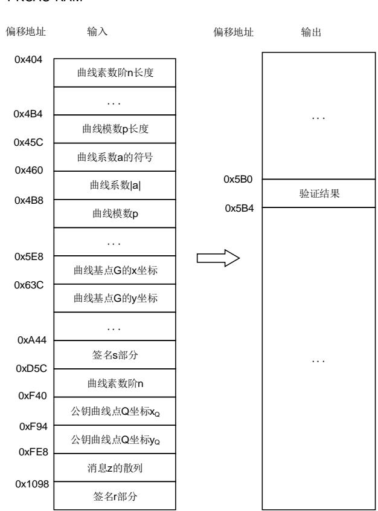

ECDSA验证参数取值范围如表11-8. ECDSA 验证参数取值范围所示。

表 11-8. ECDSA 验证参数取值范围

<table><tr><td colspan="2">参数</td><td>取值范围</td></tr><tr><td rowspan="9">输入</td><td>曲线素数阶n的长度LEN</td><td>0</td></tr><tr><td>曲线模数p的长度M</td><td>0</td></tr><tr><td>曲线系数a的符号</td><td>0x0:正数0x1:负数</td></tr><tr><td>曲线系数|a|</td><td>绝对值|a|</td></tr><tr><td>曲线模数p</td><td>奇素数0</td></tr><tr><td>曲线基点G的x坐标</td><td>x</td></tr><tr><td>曲线基点G的y坐标</td><td>y</td></tr><tr><td>公钥曲线点Q坐标$x_Q$</td><td>$x_Q$</td></tr><tr><td>公钥曲线点Q坐标\( y_Q签名 r 部分</td><td>\( y_Q0</td></tr><tr><td rowspan="3"></td><td>签名 s 部分</td><td>0</td></tr><tr><td>消息 z 的散列</td><td>$Z&lt;2^{LEN}$</td></tr><tr><td>曲线素数阶 n</td><td>素数$n&lt;2^{LEN}$</td></tr><tr><td>输出</td><td>签名验证结果</td><td>0x0:有效签名非 0x0:无效签名</td></tr></table>

## 11.3.6. PKCAU 运算流程

将 PKCAU_CTL 寄存器中的 PKCAUEN 位置 1 可以使能 PKCAU 外设。当 PKCAU 正在进行计算时，将 PKCAUEN 清 0，这种情况下，将终止正在进行的操作，并且 PKCAU RAM 中的内容将无法得到保证。

当 PKCAUEN = 0 时，应用程序仍然可以通过 AHB 接口访问 PKCAU RAM。

## 普通模式运算流程

以下流程适用于 PKCAU_CTL 寄存器 MODSEL[5:0]列出来的所有操作。

1、 系统复位后，PKCAU RAM 全片擦除。在这个过程中，PKCAU_STAT 寄存器中 BUSY 置1。所有对 PKCAU RAM 的操作都应该在 BUSY位为 0 时才执行；

2、 将初始数据加载到位于偏移地址 0x400 的 PKCAU RAM 中；

3、 在 PKCAU_CTL 寄存器 MODSEL[5:0]中写入要执行的操作，然后将 PKCAU_CTL 寄存器中将 START 位置 1；

4、 等待 PKCAU_STAT 寄存器中的 ENDF 位置 1；

5、 从 PKCAU RAM 中读取结果，然后通过在 PKCAU_STATC 中将 ENDFC 位置 1 来清除ENDF 位。

## 快速模式运算流程

快速模式就是在计算很多具有相同模数的操作时，只计算一次蒙哥马利参数。在执行操作时，加载预先计算的蒙哥马利参数来进行计算。

快速模式流程如下：

1、 在位于偏移地址 0x400 的 PKCAU RAM 中加载初始数据；

2、 在 PKCAU_CTL 寄存器中配置 MODSEL[5:0] = 000001，选择蒙马参数计算模式，然后将START 位置 1；

3、 等待 PKCAU_STAT 寄存器中的 ENDF 位置 1；

4、 从 PKCAU RAM 中读取蒙马参数，然后通过在 PKCAU_STATC 中将 ENDFC 位置 1 来清除 ENDF 位；

5、 在 PKCAU RAM 中加载初始数据以及蒙哥马利参数；

6、 在 PKCAU_CTL 寄存器 MODSEL[5:0]中写入要执行的操作，然后将 PKCAU_CTL 寄存器

中将 START 位置 1；

7、 等待 PKCAU_STAT 寄存器中的 ENDF 位置 1；

8、 从 PKCAU 内部 RAM 中读取结果，然后通过在 PKCAU_STATC 中将 ENDFC 位置 1 来清除 ENDF 位。

## 11.3.7. 计算时间

下表总结了以时钟周期表示的 PKCAU 计算时间。

表 11-9. 模幂计算时间

<table><tr><td rowspan="2">幂长度(位)</td><td rowspan="2">模式</td><td colspan="3">操作数长度(位)</td></tr><tr><td>1024</td><td>2048</td><td>3072</td></tr><tr><td rowspan="3">1024</td><td>标准</td><td>6780000</td><td>-</td><td>-</td></tr><tr><td>快速</td><td>6701000</td><td>-</td><td>-</td></tr><tr><td>CRT</td><td>1853000</td><td>-</td><td>-</td></tr><tr><td rowspan="3">2048</td><td>标准</td><td>-</td><td>52196000</td><td>-</td></tr><tr><td>快速</td><td>-</td><td>51910000</td><td>-</td></tr><tr><td>CRT</td><td>-</td><td>13651000</td><td>-</td></tr><tr><td rowspan="3">3072</td><td>标准</td><td>-</td><td>-</td><td>182783000</td></tr><tr><td>快速</td><td>-</td><td>-</td><td>181953000</td></tr><tr><td>CRT</td><td>-</td><td>-</td><td>44905000</td></tr></table>

表 11-10. ECC 标量乘法计算时间

<table><tr><td rowspan="2">模式</td><td colspan="6">模数长度(位)</td></tr><tr><td>160</td><td>192</td><td>256</td><td>320</td><td>384</td><td>512</td></tr><tr><td>标准</td><td>626000</td><td>951000</td><td>1997000</td><td>3617000</td><td>5762000</td><td>13134000</td></tr><tr><td>快速</td><td>623000</td><td>946000</td><td>1990000</td><td>3607000</td><td>5749000</td><td>13111000</td></tr></table>

表 11-11. ECDSA 签名平均计算时间

<table><tr><td colspan="6">模数长度(位)</td></tr><tr><td>160</td><td>192</td><td>256</td><td>320</td><td>384</td><td>512</td></tr><tr><td>634000</td><td>966000</td><td>2029000</td><td>3648000</td><td>5833000</td><td>13177000</td></tr></table>

表 11-12. ECDSA 验证平均计算时间

<table><tr><td colspan="6">模数长度(位)</td></tr><tr><td>160</td><td>192</td><td>256</td><td>320</td><td>384</td><td>512</td></tr><tr><td>1261000</td><td>1901000</td><td>3997000</td><td>7225000</td><td>11477000</td><td>26287000</td></tr></table>

表 11-13. 蒙哥马利参数平均计算时间

<table><tr><td colspan="9">模数长度(位)</td></tr><tr><td>160</td><td>192</td><td>256</td><td>320</td><td>384</td><td>512</td><td>1024</td><td>2048</td><td>3072</td></tr><tr><td>3873</td><td>4658</td><td>7109</td><td>10330</td><td>14526</td><td>22301</td><td>79116</td><td>284359</td><td>626909</td></tr></table>

## 11.3.8. 状态、错误和中断

PKCAU 有一些状态、错误标志位和中断，通过设置一些寄存器位，便可以通过这些标志触发中断。

- 访问地址错误（ADDRERR）：

当访问的 PKCAU RAM 地址超出预期范围，PKCAU_STAT 寄存器中地址错误标志位ADDRERR 位将置 1。如果 PKCAU_CTL 寄存器中的 ADDRERRIE 位置 1，将产生一个中断。将 PKCAU_STATC 寄存器中的 ADDRERRC 置 1 可以清除 ADDRERR 位。

- RAM 错误标志（RAMERR）：

当 PKCAU 内核在使用 PKCAU RAM 时，AHB 也在访问 PKCAU RAM，PKCAU_STAT 寄存器中地址错误标志位 RAMERR 位将置 1。如果此时 AHB 读 PKCAU RAM 将返回 0，写将被忽略。如果 PKCAU_CTL 寄存器中的 RAMERRIE 位置 1，将产生一个中断。将 PKCAU_STATC寄存器中的 RAMERRC 置 1 可以清除 RAMERR 位。

- PKCAU 运算结束标志（ENDF）：

当 PKCAU 完成在 PKCAU_CTL 寄存器 MODSEL[5:0]中指定的操作时，ENDF 将置 1。如果PKCAU_CTL 寄存器中的 ENDIE 位置 1，将产生一个中断。将 PKCAU_STATC 寄存器中的ENDFC 置 1 可以清除 ENDF 位。如果通过设置 START 位执行另一个运算，ENDF 位将由硬件自动清除。

PKCAU 中断事件和标志如表11-14. PKCAU 中断请求所示：

表 11-14. PKCAU 中断请求

<table><tr><td>中断事件</td><td>事件标志</td><td>标志清除</td><td>使能控制位</td></tr><tr><td>访问地址错误</td><td>ADDRERR</td><td>ADDRERRC</td><td>ADDRERRIE</td></tr><tr><td>RAM 错误</td><td>RAMERR</td><td>RAMERRC</td><td>RAMERRIE</td></tr><tr><td>运算结束标志</td><td>ENDF</td><td>ENDFC</td><td>ENDIE</td></tr></table>
