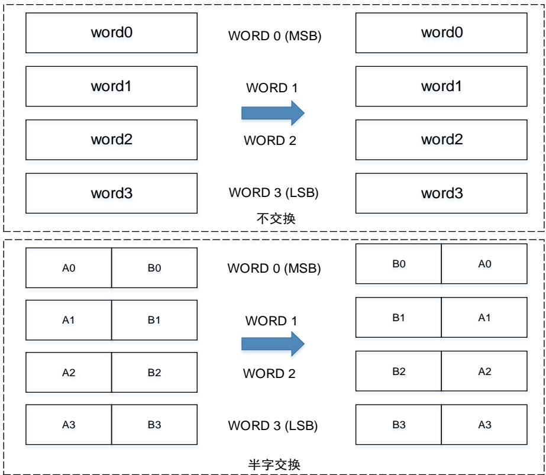
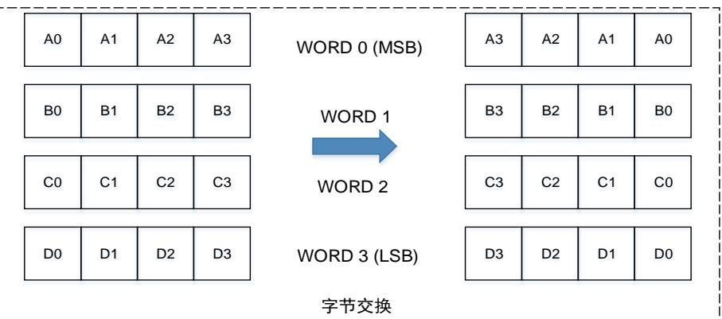
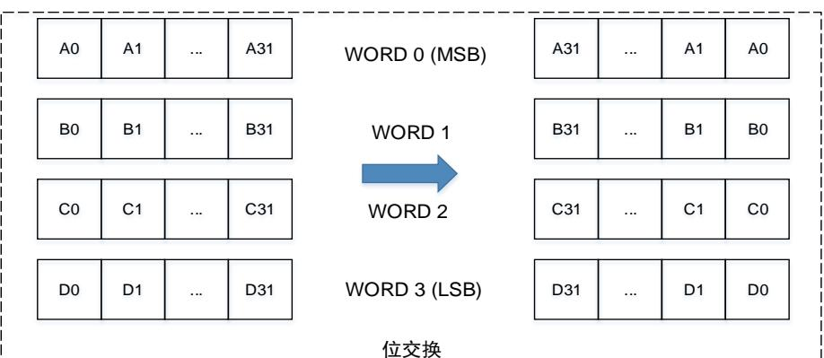
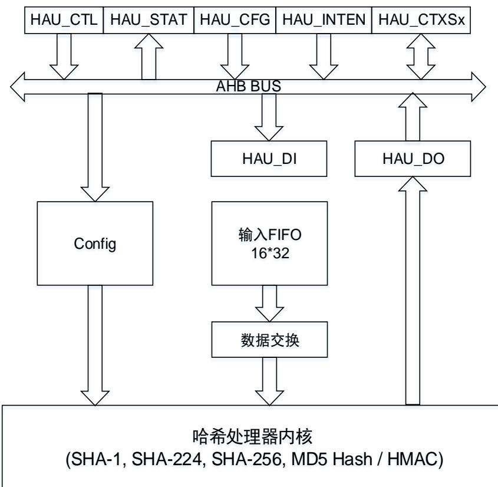

## 12. 哈希处理器（HAU）

## 12.1. 简介

哈希处理器应用于信息安全。支持应用于多种场合的安全哈希算法（SHA-1，SHA-224和SHA-256），消息摘要算法（MD5）和哈希运算消息认证码（HMAC）。对长达（264-1）位的消息，哈希处理器计算消息摘要长度对应于SHA-1，SHA-224，SHA-256，和MD5算法分别为160位，224位，256位，128位。而在HMAC算法中，SHA-1、SHA-224、SHA-256或MD5将作为哈希函数被调用两次，来产生验证消息。

哈希处理器完全兼容下列标准：

- 联邦信息处理标准出版物180-2（FIPS PUB 180-2）；

- 安全散列标准规范（SHA-1，SHA-224，SHA256）；

- 互联网工程任务组征求意见文档编号1321（IETF RFC 1321）规范（MD5）。

## 12.2. 主要特性

- 32位AHB从外设；

- 高性能的哈希算法运算；

- 小端数据表示；

- 支持多种数据交换类型，包括32位字不交换，半字交换，字节交换和位交换；

- 可自动填充来适应模数为512位（16×32位）消息摘要的计算；

- 支持DMA模式的数据流传输；

- 哈希 / HMAC计算挂起模式。

## 12.3. 数据类型

哈希处理器每次接收 位字，但每次计算处理一个 位块。对每个输入字，在送入哈希内核之前都会根据数据类型进行位 / 字节 / 半字 / 不交换。同样在数据输出之前也要进行相同的数据交换。注意由于系统存储器结构采用小端模式，无论使用何种数据类型，最低有效数据均占用最低地址位置。SHA-1，SHA-224，SHA-256的计算均为大端模式。

12-1. DATAM / 和 12-2. DATAM / 介绍了在不同数据类型下的数据交换。

图 12-1. DATAM 不交换 / 半字交换

图 12-2. DATAM 字节交换 / 位交换

位交换

## 12.4. HAU 内核

哈希处理器使用安全哈希算法对输入消息进行信息压缩计算。对长度为（ 64 ）位的消息摘要计算结果的长度对应于 ， ， ，和 算法分别为 位， 位，位，128位。哈希处理器可用于生成和验证消息签名，并由于摘要远远小于消息的大小而具有更高的效率。

要由哈希处理器处理的消息应视为位串。消息长度为消息的位数。哈希处理器可以确保信息的安全，因为根据某个给定消息摘要来寻找原对应的消息在计算层面是无法实现的，而在原输入消息上任何的改动都将导致生成完全不同的消息摘要。

图 12-3. HAU 结构框图

## 12.4.1. 自动数据填充

为确保输入HAU内核的数据为512位的整数倍，需要对输入消息进行填充。消息填充操作由在原始消息的结尾添加一个1，后跟几个0和一个64位整数，填充物（0）将消息填充到整个512位的前448位，实现生成一个长度为512的填充消息块。

消息填充完成后，通过配置HAU_CFG寄存器的VBL位域来设置上面所述的64位整数。设置HAU_CFG寄存器的CALEN位为1，开始计算上个数据块的摘要。

数据填充示例：输入消息为“HAU”，对应的ASCII码16进制表示为

484155 

接着根据消息的有效位长度，设置HAU_CFG寄存器的VBL位域为24。接着在位串的第24位处添加一个”1”，随后填充数个“0”使位串模数为448，十六进制结果如下所示：

48415580 00000000 00000000 00000000 

00000000 00000000 00000000 00000000 

00000000 00000000 00000000 00000000 

00000000 00000000 

之后，添加64位整数到已填充的输入消息后，该64位整数十六进制值为18，则最后的结果应该是：

48415580 00000000 00000000 00000000 

00000000 00000000 00000000 00000000 

00000000 00000000 00000000 00000000 

00000000 00000000 00000000 00000018 

## 12.4.2. 摘要计算

数据填充完成之后，通过DMA或CPU每次将512位的数据块送入HAU内核，HAU对每个数据块进行计算。在HAU内核开始计算之前，外设需要知道HAU_DI寄存器是否包含消息的最后一位。这可以从输入FIFO的状态和HAU_DI寄存器来确认。

## 通过 DMA传输数据

数据块传输的状态将自动通过DMA控制器发送的信息来解释。当HAU_CFG寄存器的CALEN位置1时，将自动开始进行数据填充和摘要计算。

注意：如果消息是个大文件并需要多个DMA传输，则应将MDS位置1。另外在传输之前需要设置VBL位域。在DMA的传输完成之后硬件不会自动将CALEN位置1，以便可以接收新的DMA传输。在最后的DMA传输期间，需要将MDS位清零，从而在最后一个块传输结束时硬件自动将CALEN位置1。

若消息不需要多个DMA传输，则将MDS置0即可，这样在一个DMA传输完成之后就会硬件自动置位CALEN位。同样的，在DMA传输之前也需要先设置VBL位域。

## 通过 CPU传输数据

当HAU_DI寄存器中写入下一个数据块的第一个字时，将开始计算当前数据块的摘要。

将HAU_CFG寄存器中CALEN位置1，将开始最后一个数据块的摘要计算。

## 12.4.3. 哈希模式

将HAU_CTL寄存器的HMS位设为0，选择为哈希模式。则当HAU_CTL寄存器的START位为1时，将根据ALGM位域的配置选择SHA-1，SHA-224，SHA-256或MD5算法进行计算。

当从HAU_DI寄存器和接收FIFO中接收到512位的消息块时，将根据DMA和CALEN位状态开始摘要的计算。

最终的计算结果可以从HAU_DO0...7寄存器中读取。

## 12.4.4. HMAC 模式

HMAC模式根据用户所选的密钥来进行消息验证。更多关于HMAC规范的信息请参阅“HMAC：密钥散列消息认证，H. Krawczyk，M. Bellare，R. Canetti，1997年2月”。

HMAC算法表示如下：

$$
\text { HMAC(input) } = \text { HASH } [ ((\text { key   |   opad }) \text { XOR   0x5c }) \mid \text { HASH } (((\text { key   |   ipad }) \text { XOR   0x36 }) \mid \text { input }) ]
$$

其中“ipad”和“opad”用于将密钥用数个“0”进行填充扩展到512位，“|”为连接符。

HMAC模式需要四个不同阶段：

1. 将HAU_CTL寄存器的HMS位置1，并根据期望的算法设置ALGM位域。若密钥“key”长度超过64个字节，则还需配置HAU_CTL寄存器的KLM位。之后，将START位置位以启动HAU内核；

2. 密钥“key”作为输入消息来进行哈希模式下的计算；

3. 当输入了最后一个字并开始计算之后，HAU生成新的密钥“key”作为内部哈希密钥；

4. 在第一次的哈希计算后，HAU内核开始接收用于外部哈希函数的密钥，通常外部的哈希函数使用与内部哈希密钥相同的新的密钥“key”。当输入了密钥的最后一个字，则开始进行计算，计算结果可从HAU_DO寄存器中读取。

## 12.5. HAU挂起模式

可以暂时挂起哈希或 操作，从而先执行优先级更高的任务，在处理完优先级更高的任务后，再完成被挂起数据块的哈希或HMAC操作。

挂起任务前，必须将被挂起任务的上下文从寄存器保存到存储器，恢复任务时，再从存储器恢复到HAU寄存器。

以下说明由CPU或DMA传输数据时，按照下列的步骤来完成被挂起HAU任务的处理。

## 12.5.1. 通过 CPU加载数据

1. 停止当前数据处理与传输。等待BUSY位为0，若NWIF[3:0]的值大于0，则需等待DIF位置位（若NWIF[3:0]的值等于0，则不等待DIF位置位）。只有在当前未处理任何块时才能保存上下文；

2. 保存当前配置。将HAU_INTEN，HAU_CFG，HAU_CTL，HAU_CTXS0到HAU_CTXS37（如果正在进行HMAC操作，则HAU_CTXS0到HAU_CTXS53）寄存器的内容保存到存储器中；

3. 配置并处理新消息；

4. 恢复之前的配置环境。将存储器中保存的值写入HAU_INTEN，HAU_CFG，HAU_CTL寄存器中；

5. 恢复消息的计算。置位HAU_CTL寄存器的START位来初始化重新开始新消息的摘要计算；

6. 恢复之前的内核状态。将存储器中保存的值写入HAU_CTXS0到HAU_CTXS37寄存器中（如果涉及HMAC操作，则HAU_CTXS0到HAU_CTXS53）；

7. 从之前挂起的地方继续处理。

## 12.5.2. 通过 DMA 加载数据

1. 等待BUSY位为0，此时若HAU_STAT寄存器的CCF位置位，则不需要后续的上下文交换，否则再等待BUSY位为1；

2. 停止当前数据传输。禁能DMA1的通道7数据传输，再将HAU_CTL寄存器中的DMAE位清零以禁能DMA请求；

3. 保存当前配置。等待BUSY位为0，此时若HAU_STAT寄存器的CCF位置位，则不需要后续的上下文交换，否则将HAU_INTEN，HAU_CFG，HAU_CTL，HAU_CTXS0到HAU_CTXS37（如果正在进行HMAC操作，则HAU_CTXS0 到 HAU_CTXS53）寄存器的内容保存到存储器中；

4. 配置并处理新消息；

5. 恢复之前的环境配置。将存储器中保存的值写入HAU_INTEN，HAU_CFG，HAU_CTL寄存器中；

6. 恢复DMA通道传输。重新配置DMA通道以继续数据传输；

7. 恢复消息的计算。置位HAU_CTL寄存器的START位来初始化重新开始新消息的摘要计算；

8. 恢复之前内核的状态。将存储器中保存的值写入HAU_CTXS0到HAU_CTXS37寄存器中（如果涉及HMAC操作，则HAU_CTXS0 到 HAU_CTXS53）；

9. 置位HAU_CTL寄存器的位DMAE，从之前挂起的地方继续处理。

注意：如果HAU_CTL寄存器的位NWIF[3:0]为0，则说明上下文交换发生在在两个块之间，上一个数据块已完全处理，并且下一个块还未推入到输入FIFO，那么此时不需要保存和恢复HAU_CTXS22到HAU_CTXS37寄存器。

## 12.6. HAU 中断

HAU具有两个独立的中断源，并在HAU_STAT有相应的状态位。这两个状态位用于指示输入FIFO的状态，以及摘要的计算是否完成。

HAU_INTEN寄存器为中断使能寄存器。将相应位置1可以使能中断。

## 12.6.1. 输入 FIFO 中断

当输入FIFO中的数据处理已完成时，输入FIFO标志位DIF置位。如果置位DIIE位使能了输入FIFO中断，则当输入FIFO标志位DIF置位时会发生输入FIFO中断。

## 12.6.2. 计算完成中断

当摘要计算完成时，计算完成标志位CCF将置位。如果置位CCIE位使能了计算完成中断，则当计算完成标志位CCF置位时会发生计算完成中断。

<table><tr><td>31</td><td>30</td><td>29</td><td>28</td><td>27</td><td>26</td><td>25</td><td>24</td><td>23</td><td>22</td><td>21</td><td>20</td><td>19</td><td>18</td><td>17</td><td>16</td></tr><tr><td colspan="13">保留</td><td>ALGM[1]</td><td>保留</td><td>KLM</td></tr><tr><td colspan="15">rw</td><td>rw</td></tr><tr><td>15</td><td>14</td><td>13</td><td>12</td><td>11</td><td>10</td><td>9</td><td>8</td><td>7</td><td>6</td><td>5</td><td>4</td><td>3</td><td>2</td><td>1</td><td>0</td></tr><tr><td colspan="2">保留</td><td>MDS</td><td>DINE</td><td colspan="4">NWIF[3:0]</td><td>ALGM[0]</td><td>HMS</td><td colspan="2">DATAM[1:0]</td><td>DMAE</td><td>START</td><td colspan="2">保留</td></tr><tr><td colspan="2"></td><td>rw</td><td>r</td><td colspan="4">r</td><td>rw</td><td>rw</td><td colspan="2">rw</td><td>rw</td><td>w</td><td colspan="2"></td></tr></table>
