## 13. 加密处理器（CAU）

## 13.1. 简介

加密处理单元支持处理DES，三重DES或AES（128，192或256）算法，对数据进行加密或解密。加密处理器完全兼容下列标准：

- 联邦信息处理标准出版物“FIPS PUB 46-3，1999年10月25日”规定的数据加密标准（DES）和三重DES（TDES）。它遵循美国国家标准协会（ANSI）X9.52标准；

- 联邦信息处理标准出版物（FIPS PUB 197，2001年11月26日）规定的高级加密标准（AES）。

CAU处理器可在多种模式下使用DES / 三重DES / 多种长度密钥的AES算法执行数据加密和解密。

CAU外设为32位AHB外设，它支持对输入FIFO和输出FIFO的DMA传输。

## 13.2. 主要特征

- 支持DES，三重DES和AES加密解密算法；

- 支持DES，三重DES和AES下的多种模式，包括电子密码本（ECB）、加密分组链接（CBC）模式、计数器模式（CTR）、伽罗瓦 / 计数器模式（GCM）、伽罗瓦消息验证码模式（GMAC）、加密分组链接-消息验证码模式（CCM）、密码反馈模式（CFB）和输出反馈模式（OFB）；

- 输入与输出FIFO支持DMA传输。

## DES/三重DES

- 支持电子密码本（ECB）或加密分组链接（CBC）模式；

- 支持在CBC模式下使用2×32位初始化向量（IV）；

- 输入FIFO和输出FIFO可存储8x32位数据；

- 对于输入/输出FIFO的数据支持半字、字节、位交换或不交换；

- 数据可通过DMA或CPU中断进行传输，也可以不通过两者进行传输。

## AES

- 支持支持电子密码本（ECB）、加密分组链接（CBC）模式、计数器模式（CTR）、伽罗瓦 / 计数器模式（GCM）、伽罗瓦消息验证码模式（GMAC）、加密分组链接-消息验证码模式（CCM）、密码反馈模式（CFB）和输出反馈模式（OFB）；

- 支持128位、192位或256位密钥；

- 支持在CBC、CTR、GCM、GMAC、CCM、CFB和OFB模式下使用4×32位初始化向量(IV)；

- 输入和输出FIFO各8字深；

- 对于输入/输出FIFO的数据支持半字、字节、位交换或不交换；

- 数据可通过DMA或CPU中断进行传输，也可以不通过两者进行传输。

## 13.3. CAU数据类型和初始化向量

## 13.3.1. 数据类型

CAU处理器一次输入32位（字）数据，DES每64位对数据流进行处理，AES每128位对数据流进行处理。对于每个数据块，在其进入CAU处理器之前，可对这些数据执行位、字节、半字交换或不交换操作（取决于要加密的数据类型）。在CAU数据写入OUT FIFO之前，需要对其执行同样的交换操作。注意由于系统存储器结构采用小端模式，无论使用何种数据类型，最低有效数据均占用最低地址位置。

13-1. DATAM / 和 13-2. DATATM / 介绍了128位AES块在不同数据类型下的数据交换。（对于DES，数据块大小为2个32位字，请参考图中前两个字的数据交换）

图 13-1. DATAM 不交换 / 半字交换

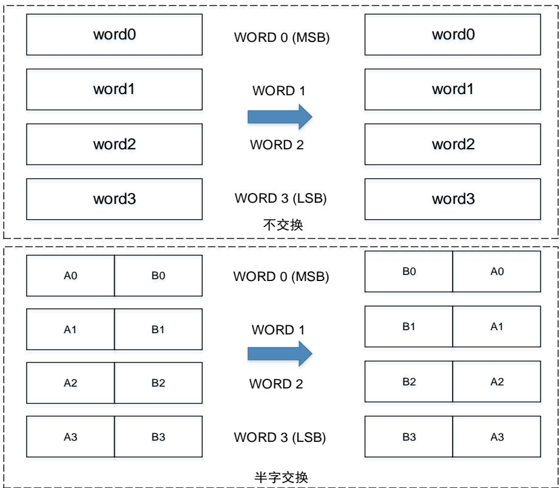

图 13-2. DATATM 字节交换 / 位交换

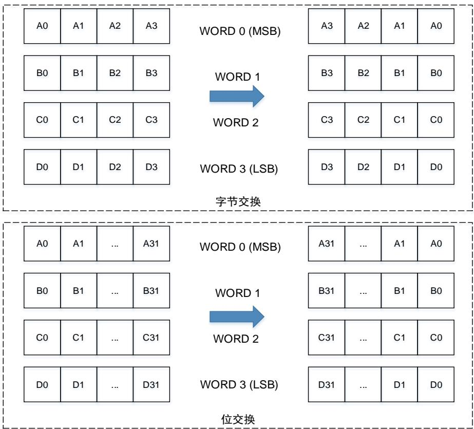

## 13.3.2. 初始化向量

初始化向量用于在CBC、CTR、GCM、GMAC、CCM、CFB和OFB模式下与数据块进行异或。初始化向量与明文或密码数据无关，而且它们不受DATAM值的影响。注意初始化向量寄存器CAU_IV0..1（H / L）只有在BUSY位（CAU_STAT0寄存器位4）为0时才能被修改，否则写操作都是无效的。

## 13.4. 加密处理器流程

加密处理器关于DES和AES加密处理的实现具体请参考章节DES / TDES加密处理流程和AES加密处理流程

13-3. CAU 为加密处理器的模块框图。

图 13-3. CAU 框图

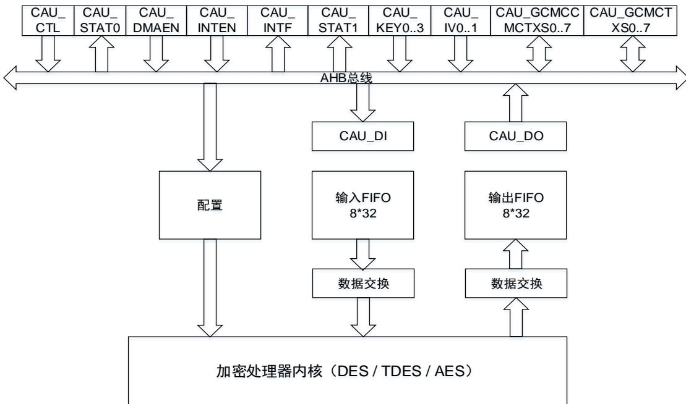

## 13.4.1. DES / TDES 加密处理流程

DES/ 三重DES加密处理器由DES算法（DEA），密钥（DES算法使用1个密钥，TDES算法使用3个密钥），以及在CBC模式下使用的初始化向量组成。

## DES / TDES 密钥

DES模式密钥为[KEY1]，TDES模式密钥为[KEY3 KEY2 KEY1]。当配置使用TDES算法，支持以下三种密钥选项：

## 1. 三个相同密钥

三个密钥KEY3、KEY2和KEY1是相同的，即KEY3=KEY2=KEY1。该选项详见FIPS PUB 46-3-1999（以及ANSI X9.52-1998）。这种模式下实际上与DES是等同的。

## 2. 两个独立密钥

这个选项中，KEY2与KEY1不同，KEY3与KEY1相同，即KEY1与KEY2独立，而KEY3=KEY1。该选项详见FIPS PUB 46-3-1999（以及ANSI X9.52-1998）。

## 3. 三个独立密钥

这个选项中，KEY1，KEY2与KEY3都是独立的。详见FIPS PUB 46-3 -1999（以及ANSI X9.52-1998）。

FIPS PUB 46-3（以及ANSI X9.52-1998）对DES/TDES中密钥的使用进行了详尽的解释，在本手册中不进行赘述。

## DES / TDES 电子密码本（ECB）加密

64位输入明文数据首先经过根据数据类型值进行数据交换后作为输入数据块。若配置使用的是TDES算法，则输入数据块通过DEA使用KEY1进行加密处理。处理结果输出直接反馈到DEA，使用KEY2进行解密处理。之后处理结果输出直接反馈到到最后的DEA，使用KEY3进行加密处理。上述的处理过程的输出需要再次根据数据类型值进行数据交换，生成一个64位密文输出数据块。若配置使用的是DES算法，在通过DEA使用KEY1进行加密处理后的结果直接根据数据类型值进行数据交换，生成一个64位密文输出数据块。DES/TDES电子密码本加密流程图见图13-4. DES /TDES ECB加密。

图 13-4. DES / TDES ECB 加密

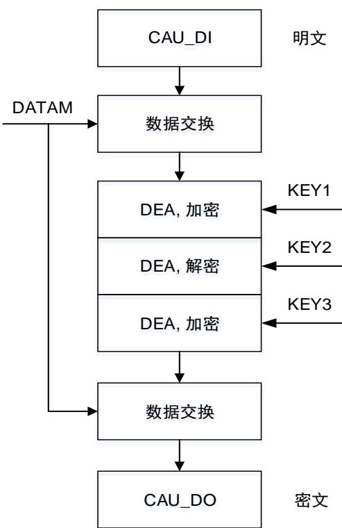

DES / TDES 电子密码本（ECB）解密

根据数据类型进行数据交换后，首先得到 位的输入密文。若配置使用的是 算法，将在DEA中读取输入数据块并使用KEY3进行解密处理。处理结果输出直接反馈到下一个DEA，使用KEY2进行加密处理。之后处理结果输出直接反馈到到最后的DEA，使用KEY1进行解密处理。上述的处理过程的输出需要再次根据数据类型进行数据交换，生成一个 位明文输出数据块。若配置使用的是DES算法，在通过DEA使用KEY1进行解密处理后的结果直接根据数据类型值进行数据交换，生成一个64位明文输出数据块。DES/TDES电子密码本解密流程图见图13-5.DES /TDES ECB解密。

图 13-5. DES / TDES ECB 解密

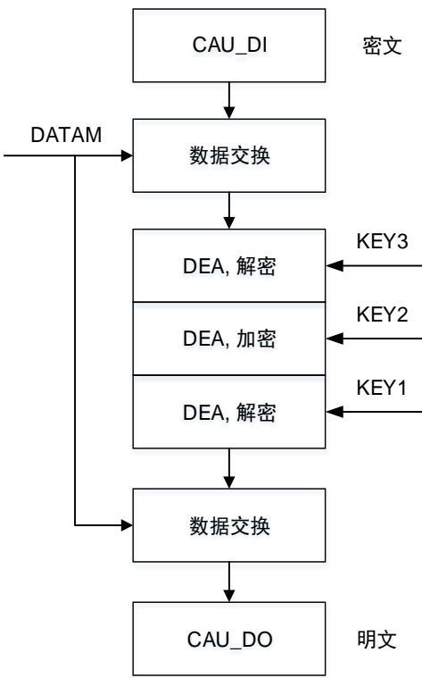

## DES / TDES 加密分组链接（CBC）加密

CBC模式下DEA块的输入包括两部分：根据数据类型进行数据交换后的输入明文数据块，以及初始化向量。若配置使用的是 算法，第一个数据交换后的输入明文数据块与 位初始化向量CAU_IV0..1进行异或运算，结果在DEA中读取并使用KEY1进行加密处理。处理结果输出直接反馈到下一个DEA，使用KEY2进行解密处理。之后处理结果输出直接反馈到到最后的DEA，使用 进行加密处理。上述的处理过程的输出作为下一个初始化向量，并与下一个明文数据块进行异或运算，进行下一轮的加密处理。重复上述的操作，直到完成最后一个明文数据块的加密处理。注意如果明文消息中的数据块数不是整数，则应按指定的方式对最后的不完整数据块进行加密处理。最后，对上述处理结果的输出需要再次根据数据类型进行数据交换，生成密文输出数据块。若配置使用的是DES算法，则在上述的步骤操作中忽略第二次和第三次DEA的运算处理。DES / TDES加密分组链接加密流程图见图13-6. DES/TDES CBC加密。

图 13-6. DES / TDES CBC 加密

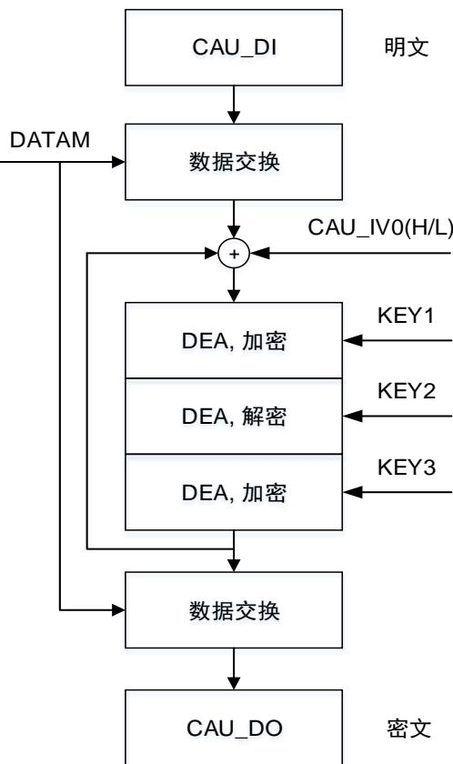

DES / TDES 密码块链接（CBC）解密

使用 模式解密，若配置使用的是 算法，第一个数据交换后的输入密文数据块，通过DEA读取并使用KEY3进行解密处理。处理结果输出直接反馈到下一个DEA，使用进行加密处理。之后处理结果输出直接反馈到到最后的 ，使用 进行解密处理。上述的处理过程的输出再与64位初始化向量CAU_IV0..1进行异或运算。之后，第一个输入密文数据块作为下一个初始化向量，并与后续的DEA解密处理后的输出结果进行异或运算。重复上述的操作，直到完成最后一个密文数据块的解密处理。注意如果密文消息中的数据块数不是整数，则应按指定的方式对最后的不完整数据块进行解密处理。最后，对上述处理结果的输出需要再次根据数据类型进行数据交换，生成明文输出数据块。若配置使用的是DES算法，则在上述的步骤操作中忽略第二次和第三次DEA的运算处理。DES / TDES加密分组链接解密流程图见图13-7. DES /TDES CBC解密。

图 13-7. DES / TDES CBC 解密

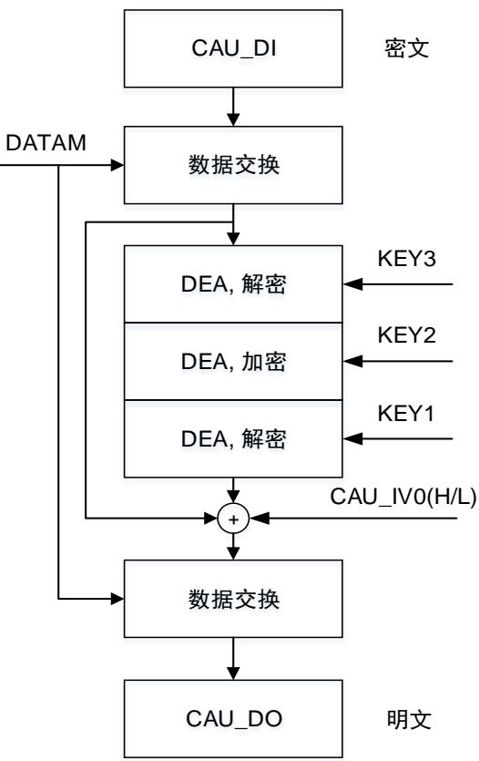

## 13.4.2. AES 加密处理流程

AES加密处理器由AES算法（AEA），多个密钥，以及初始化向量或随机数三部分组成。

AES支持三种长度的密钥：128、192和256位密钥，根据操作模式的不同使用不同数目的初始化向量或随机数。

使用128位密钥时AES密钥为[KEY3 KEY2]，使用192位密钥时AES密钥为[KEY3 KEY2 KEY1]，使用256位密钥时AES密钥为[KEY3 KEY2 KEY1 KEY0]。

FIPS PUB 197（2001年11月26日）中对AES中使用的密钥进行了详细的解释，本手册不再进行赘述。

## AES电子密码本（ECB）加密

根据数据类型进行数据交换后，首先得到128位输入明文数据块。输入数据块通过AEA使用128位，或 位，或 位密钥进行加密处理。处理结果再根据数据类型进行数据交换，生成一个128位密文输出数据块，并存储在输出FIFO中。AES电子密码本加密流程图见图13-8. AESECB加密。

图 13-8. AES ECB 加密

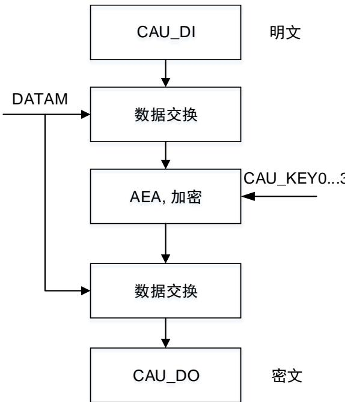

AES电子密码本（ECB）解密

首先需要准备密钥，以用于解密，密钥准备过程的输入密钥与加密处理中的密钥相同。从上述操作中获得的最后一个密钥将作为解密处理用的第一个密钥。密钥准备完成后，首先根据数据类型进行数据交换得到128位输入密文数据块。输入数据块在AEA中读取并使用上面准备的密钥进行解密处理。处理结果输出再根据数据类型值进行数据交换，生成一个128位明文输出数据块。AES电子密码本解密流程图见图13-9. AES ECB解密。

图 13-9. AES ECB 解密

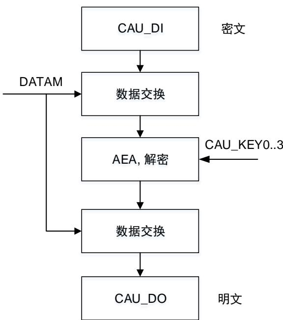

## AES 加密分组链接（CBC）加密

CBC模式下AEA块的输入包括两部分：根据数据类型进行数据交换后的输入明文数据块，以及初始化向量。数据交换后的输入明文数据块与128位初始化向量CAU_IV0..1进行异或运算，结果再通过AEA使用128位，或192位，或256位密钥进行加密处理。处理结果作为下一个初始化向量，并与下一个输入明文数据块进行异或运算，进行下一轮加密处理。重复上述的操作，直到完成最后一个明文数据块的加密处理。注意如果明文消息中的数据块数不是整数，则应按指定的方式对最后的不完整数据块进行加密处理。最后，对上述处理结果的输出需要再次根据数据类型值进行数据交换，生成密文输出数据块。AES加密分组链接加密流程图见图13-10. AESCBC加密。

图 13-10. AES CBC 加密

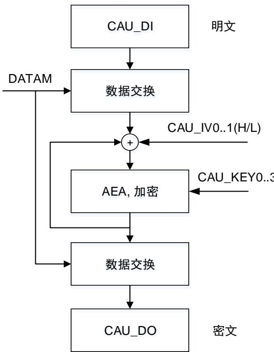

## AES加密分组链接（CBC）解密

与AES电子密码本（ECB）模式解密类似，首先需要准备密钥以用于解密，密钥准备过程的输入密钥与加密处理中的密钥相同。从上述操作中获得的最后一个密钥将作为解密处理用的第一个密钥。密钥准备完成后，首先根据数据类型进行数据交换，得到 位输入密文数据块，输入数据块在 中读取并使用准备的密钥进行解密处理。之后，第一个输入密文数据块作为下一个初始化向量，并与下一个AEA解密处理结果进行异或运算（第一次的初始化向量为输入的初值）。重复上述的操作，直到完成最后一个密文数据块的解密处理。注意如果密文消息中的数据块数不是整数，则应按指定的方式对最后的不完整数据块进行解密处理。最后，对上述处理结果的输出需要再次根据数据类型进行数据交换，生成明文输出数据块。AES加密分组链接解密流程图见图13-11. AES CBC解密。

图 13-11. AES CBC 解密

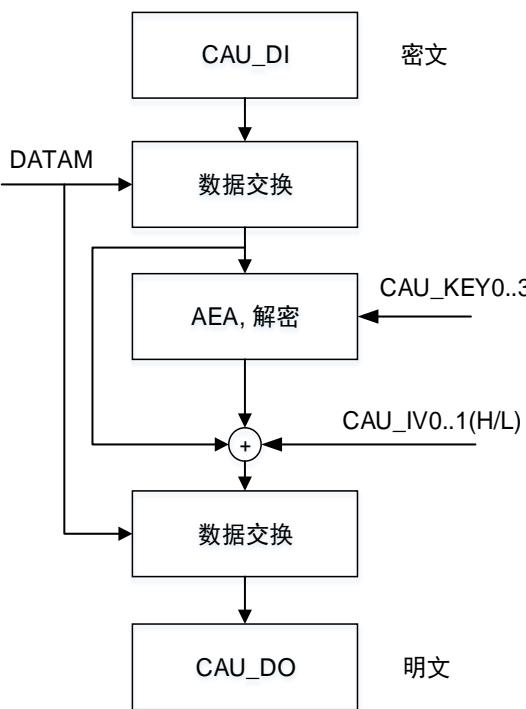

## AES计数器（CTR）模式

在计数器模式下，随机数与计数器的组合会作为AEA计算单元的输入来进行运算，运算结果会与输入的明文或密文进行异或，来求得最终加密或者解密的结果。由于加密和解密处理的计数器值是由相同的初始值进行递增的，因此加密和解密处理用的密钥序列是相同的。解密处理的操作与加密操作的流程完全相同。128位初始化向量的低32位表示为计数器值，这意味着其余位在操作过程中保持不变，并且计数器的初始值应当设置为 。随机数是一个 位一次性值，应当更新到每个通信块。 位的初始化向量应确保每个给定值只用于一个给定密钥。计数器块框图结构见图13-12. 计数器块结构，AES计数器加密/解密流程图见图13-13. AES CTR加密解密。

图 13-12. 计数器块结构

<table><tr><td>随机数</td><td>初始化向量</td><td>计数器</td></tr></table>

图 13-13. AES CTR 加密/解密

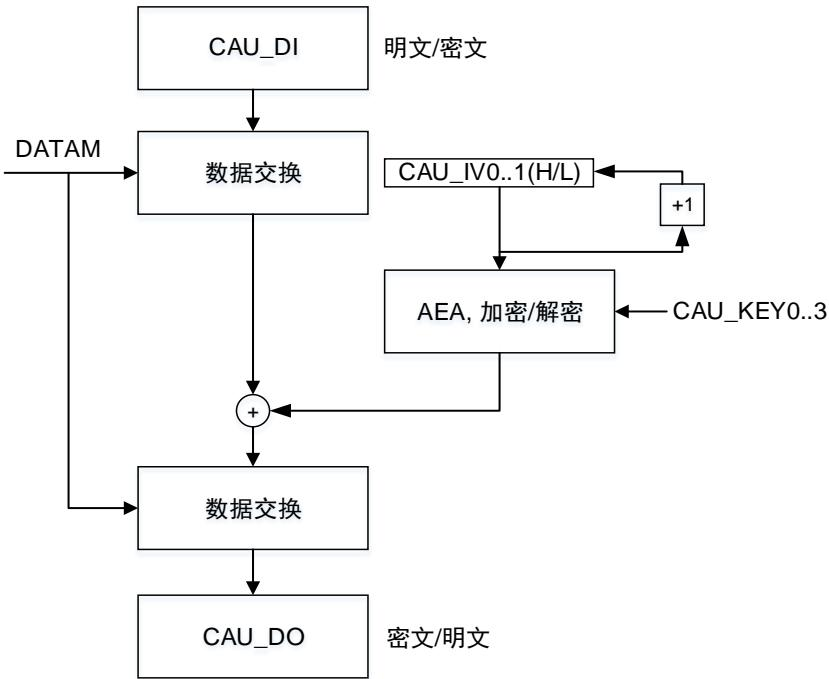

## AES-GCM 模式

AES伽罗瓦 / 计数器模式(GCM)可用于加密或验证消息，来获得密文和标签。该算法基于AES计数器模式，保证了机密性。利用固定的有限域乘法运算来生成标签。

在该模式中，执行加密/解密需要四个步骤：

## 1. GCM准备阶段

内部计算和保存哈希密钥以在后续使用。

(a) 将CAUEN清零，禁能CAU；

(b) 配置ALGM[3:0]位域为‘1000’；

(c) 配置GCM_CCMPH[1:0]位域为‘00’；

(d) 配置密钥寄存器CAU_KEY0..3(H/L)和初始化向量寄存器CAU_IV0..1(H/L)；

(e) 置位CAUEN位，使能CAU；

(f) 等待CAUEN位被硬件清零，然后再置位CAUEN，使能CAU，进行下个步骤。

## 2. GCM AAD（附加身份验证数据）阶段

AAD阶段必须在GCM初始化阶段之后进行，并在加密解密阶段之前。在这个阶段，数据仅进行了验证，而没有被保密。

(g) 配置GCM_CCMPH[1:0]位域为‘01’；

(h) 将AAD数据写入CAU_DI寄存器，并使用CAU_STAT0寄存器的INF和IEM标志来判断输入FIFO是否能接收数据。AAD大小必须为128位的倍数。也可使用DMA来写入AAD数据；

(i) 重复步骤(h)直到所有AAD数据都写入，并等待CAU_STAT0寄存器的BUSY位清零。

## 3. GCM加密解密阶段

加密解密阶段必须在GCM AAD阶段之后进行。在这个阶段，对消息进行了验证，并加密或解密。

(j) 配置GCM_CCMPH[1:0]位为‘10’；

(k) 配置CAUDIR位来选择算法方向；

(l) 将有效负载消息写入CAU_DI寄存器，并使用CAU_STAT0寄存器的INF和IEM标志来判断输入FIFO是否能接收数据。使用CAU_STAT0寄存器的ONE和OFU标志判断输出FIFO是否为空，如果不为空，就读取CAU_DO寄存器。也可使用DMA来写入有效负载消息；

(m) 重复步骤(l)直到所有的有效负载块都完成计算。

## 4. GCM标签阶段

在这个阶段，将生成最后的验证标签。

(n) 配置GCM_CCMPH[1:0]位为‘11’；

(o) 将最后的数据块（由64位AAD大小和64位有效负载消息大小组成）写入CAU_DI寄存器；

(p) 在完成写4次CAU_DI寄存器之后，等待CAU_STAT0寄存器的ONE标志置位，然后读取CAU_DO寄存器4次，这个输出数据就是最后生成的验证标签；

(q) 禁能CAU。

注意：解密时，必须在开始阶段时准备好密钥。

## AES-GMAC 模式

AES伽罗瓦消息验证码（GMAC）模式支持提供对消息的完整性验证。这个模式处理流程可视为AES-GCM模式流程除去加密解密阶段。

## AES-CCM 模式

AES结合了类似于AES-GCM的密码机模式，支持消息的保密，以及完整性验证。AES-CCM模式基于AES-CTR模式来确保了消息的保密性，使用AES-CBC模式来生成128位标签。

CCM标准（RFC 3610 Counter with CBC-MAC (CCM) 标准，2003年9月发布）为首个验证块（在该标准中称为 ）定义了特定的编码规则，具体来说，首个块包括标志、随机数以及以字节计的有效负载大小。 标准为加密 解密指定了另外的格式，称为 或者计数器。计数器在有效负载阶段递增计数，在生成标签阶段计数器低32位有效位初始化为’1’（在CCM标准中称为A0数据包）。

注意：B0数据包的格式化操作需要在软件中处理完成。

在该模式中，执行加密/解密需要四个步骤：

## 1. CCM准备阶段

准备阶段，将B0数据包（首个块）写入CAU_DI寄存器。在这个阶段，CAU_DO寄存器不包含任何输出数据。

(a) 清零CAUEN位，禁能CAU；

(b) 配置ALGM[3:0]位域为‘1001’；

(c) 配置GCM_CCMPH[1:0]位域为‘00’；

(d) 配置密钥寄存器CAU_KEY0..3(H / L)和初始化向量寄存器CAU_IV0..1(H / L)；

(e) 置位CAUEN位，使能CAU；

(f) 将B0数据包写入CAU_DI寄存器；

(g) 等待CAUEN位被硬件清零，然后再置位CAUEN，使能CAU，进行下个步骤。

## 2. CCM AAD（附件身份验证数据）阶段

AAD阶段必须在CCM准备阶段之后进行，并在加密解密阶段之前。在这个阶段，CAU_DO寄存器不包含任何输出数据。

如果没有附加的验证数据，可以跳过这个阶段。

(h) 配置GCM_CCMPH[1:0]位域为‘01’；

(i) 将AAD数据写入到CAU_DI寄存器，并使用CAU_STAT0寄存器的INF和IEM标志来判断输入FIFO是否能接收数据。AAD大小必须为128位的倍数。也可以使用DMA来写入AAD数据；

(j) 重复步骤(i)直到所有的AAD数据都写入，并等待CAU_STAT0寄存器的BUSY位清零。

## 3. CCM加密解密阶段

加密解密阶段必须在CCM AAD阶段之后进行。在这个阶段，对消息进行了验证，并加密或解密。

与GCM类似，CCM链接模式可用于仅由经过验证的原文数据(即只有AAD，没有有效负载)组成的消息。需要注意的是，这种使用CCM的方式不称为CMAC(它与GCM/GMAC不同)。

(k) 配置GCM_CCMPH[1:0]位为‘10’；

(l) 配置CAUDIR位来选择算法方向；

(m) 将有效负载消息写入CAU_DI寄存器，并使用CAU_STAT0寄存器的INF和IEM标志来判断输入FIFO是否能接收数据。使用CAU_STAT0寄存器的ONE和OFU标志判断输出FIFO是否为空，如果不为空，就读取CAU_DO寄存器。也可使用DMA来写入有效负载消息；

(n) 重复步骤(m)直到所有的有效负载块都完成计算。

## 4. CCM标签阶段

在这个阶段，将生成最后的验证标签。

(o) 配置GCM_CCMPH[1:0]位为‘11’；

(p) 将128位A0数据包写入到CAU_DI寄存器，分为4次的写操作；

(q) 等待CAU_STAT0寄存器的ONE标志置位，然后读取CAU_DO寄存器4次，这个输出数据就是最后生成的验证标签；

(r) 禁能CAU。

## AES-CFB 模式

密码反馈(CFB)模式是保密模式，其特征在于将连续密文段反馈到前向密码的输入块中，以生成与明文异或的输出块，从而产生密文，反之解密过程与加密的过程类似。

## AES-OFB 模式

输出反馈(OFB)模式是保密模式，其特征在于在IV上对前向密码进行迭代，以生成与明文异或以产生密文的输出块序列，反之解密过程与加密的过程类似。

## 13.5. 操作模式

## 加密

1. 将CAU_CTL寄存器的CAUEN位清零，以禁用CAU；

2. 将PMU_CTL1寄存器中的CORE1WAKE置位以使能CAU的电源域，再打开CAU的外设时钟；

3. 若选择了AES算法，则对CAU_CTL寄存器的KEYM位进行选择设置，配置密钥的长度；

4. 根据算法配置CAU_KEY0..3(H/L)寄存器；

5. 设置CAU_CTL寄存器的DATAM位，配置数据交换类型；

6. 设 置 CAU_CTL 寄 存 器 的 ALGM[3:0] 位 ， 配 置 算 法 （ DES/TDES/AES ） 和 模 式（ECB/CBC/CTR/GCM/GMAC/CCM/CFB/OFB）；

7. 设置CAU_CTL寄存器的CAUDIR位为0，配置为加密操作；

8. 设置CAU_IV0..1(H/L)寄存器，配置初始化向量；

9. 在CAUEN位为0时，设置CAU_CTL寄存器的FFLUSH位，配置刷新输入FIFO和输出FIFO；

10. 设置CAU_CTL寄存器的CAUEN位为1，使能CAU；

11. 当CAU_STAT0寄存器的INF位为1时，向CAU_DI寄存器写数据块。数据可以通过DMA传输或者CPU中断传输，也可不通过两者进行传输；

12. 等待CAU_STAT0寄存器的ONE位为1时，读CAU_DO寄存器。输出数据可以通过DMA传输或者CPU中断传输，也可不通过两者进行传输；

13. 重复步骤10和步骤11，直到所有的数据块都完成加密。

## 解密

1. 将CAU_CTL寄存器的CAUEN位清零，以禁用CAU；

2. 将PMU_CTL1寄存器中的CORE1WAKE置位以使能CAU的电源域，再打开CAU的外设时钟；

3. 若选择了AES算法，则对CAU_CTL寄存器的KEYM位进行选择设置，配置密钥的长度；

4. 根据算法配置CAU_KEY0..3(H/L)寄存器；

5. 设置CAU_CTL寄存器的DATAM位，配置数据交换类型；

6. 设置CAU_CTL寄存器的ALGM[3:0]位为“0111”，配置准备密钥用于解密；

7. 设置CAU_CTL寄存器的CAUEN位为1，使能CAU；

8. 等待BUSY位和CAUEN位为0，确保解密用的密钥已准备好；

9. 设 置 CAU_CTL 寄 存 器 的 ALGM[3:0] 位 ， 配 置 算 法 （ DES/TDES/AES ） 和 模 式（ECB/CBC/CTR/GCM/GMAC/CCM/CFB/OFB）；

10. 设置CAU_CTL寄存器的CAUDIR位为1，配置为解密操作；

11. 设置CAU_IV0..1(H/L)寄存器，配置初始化向量；

12. 在CAUEN位为0时，设置CAU_CTL寄存器的FFLUSH位，配置刷新输入FIFO和输出FIFO；

13. 设置CAU_CTL寄存器的CAUEN位为1，使能CAU；

14. 当CAU_STAT0寄存器的INF位为1时，向CAU_DI寄存器写数据块。数据可以通过DMA传输或者CPU中断传输，也可不通过两者进行传输；

15. 等待CAU_STAT0寄存器的ONE位为1时，读CAU_DO寄存器。输出数据可以通过DMA传输或者CPU中断传输，也可不通过两者进行传输；

16. 重复步骤13和步骤14，直到所有的数据块都完成解密。

## 数据填充

对于GC 加密和CC 解密，C 模块支持非 比特整数倍的数据块处理。当最后一个数据块不满128比特时，使用‘0’对其剩余位进行填充，然后在CAU_CTL寄存器的NBPILB位域中配置用于填充的字节数，AES会自动去除相应填充数量的填充块后进行加密。需要注意的是，只有在倒数第二个数据块加密完成后，才可以对NBPILB位域进行配置。

## 13.6. CAU DMA 接口

DMA可用于CAU模块的数据块传输。DMA的传输操作由CAU_DMAEN寄存器来控制。DMAIEN位用于输入数据的DMA请求传输使能，由DMA将一个字数据写入CAU_DI寄存器。DMAOEN位用于输出数据的DMA请求传输使能，获得CAU输出的一个字。

DMA输出数据的传输请求优先级高于输入数据的传输请求，因此输出FIFO空的事件可能会早于输入FIFO满的事件。

## 13.7. CAU 中断

CAU有两个中断状态寄存器，CAU_STAT1和CAU_INTF寄存器。CAU中的中断用于指示输入和输出FIFO的状态。

可以通过配置CAU_INTEN寄存器来使能或禁用输入或输出FIFO中断。将寄存器中相应位置1可以使能相应中断。

## 输入 FIFO 中断

当输入FIFO中的数据少于4个字时产生输入FIFO中断，ISTA位置位。此时如果IINTEN位为1，使能了输入FIFO中断，则IINTF位将置位。注意当CAUEN位为0时，ISTA位和IINTF位将保持为0。

## 输出 FIFO 中断

当输出FIFO中存在一个或多个字数据时产生输出FIFO中断，OSTA位置位。此时如果OINTEN位为1从而使能了输出FIFO中断，则OINTF位将置位。注意与输入FIFO中断不同的是，当CAUEN位为0时，不会影响到OSTA位与OINTF位的状态。

## 13.8. CAU挂起模式

当CAU中待处理的新的数据块优先级高于正在处理的数据块，则正在处理的数据块可能被挂起。按照下列的步骤来完成被挂起数据块的加密/解密处理。

## 当使用 DMA进行数据传输：

1. 停止当前输入数据传输。将CAU_DMAEN寄存器的DMAIEN位清零；

2. 若为DES或AES算法，则需等待直到输入和输出FIFO均为空，如果检查到输入FIFO不为空即IEM位为0，则写入一个字的数据，再检查IEM位，直到IEM位为1，则停止写入数据，再等待BUSY位为0，以确保下一个数据块不会被上一个数据块影响。若为TDES算法，则与AES算法相似，但不需要等待输入FIFO为空；

3. 将CAU_DMAEN寄存器中的DMAOEN位清零，停止输出数据传输。并将CAU_CTL寄存器中的CAUEN位清零，禁用CAU；

4. 保存当前配置，包括密钥长度，数据类型，算法模式，算法方向，GCM CCM阶段，以及密钥值。若为CBC / CTR / GCM / GMAC / CCM / CFB / OFB模式，则还需要保存初始化向 量 。 若 为 GCM / GMAC / CCM 模 式 ， 则 还 需 要 保 存 上 下 文 交 换 寄 存 器CAU_GCMCCMCTXSx (x=0 .. 7)和CAU_GCMCTXSx (x = 0..7)；

5. 配置并处理新数据块；

6. 恢复之前的处理环境。将CAU重新用存储的参数进行配置，并准备好密钥和初始化向量，还需恢复CAU_GCMCCMCTXSx (x = 0..7)和CAU_GCMCTXSx (x = 0..7)寄存器。再将CAU_CTL寄存器的CAUEN位置位以使能CAU。

## 当使用 CPU 来传输数据到 CAU_DI 和 CAU_DO：

1. 当使用CPU来进行数据传输，则需要等待第四次读CAU_DO寄存器，并在写CAU_DI之前，以确保一个数据块处理结束的时候再挂起消息处理；

2. 将CAU_CTL寄存器的CAUEN位清零，禁用CAU；

3. 保存当前配置，包括密钥长度，数据类型，算法模式，算法方向，GCM CCM阶段，以及密钥值。若为CBC / CTR / GCM / GMAC / CCM / CFB / OFB模式，则还需要保存初始化向 量 。 若 为 GCM / GMAC / CCM 模 式 ， 则 还 需 要 保 存 上 下 文 交 换 寄 存 器CAU_GCMCCMCTXSx (x = 0..7)和CAU_GCMCTXSx (x = 0..7)；

4. 配置并处理新数据块；

5. 恢复之前的处理环境。将CAU重新用存储的参数进行配置，并准备好密钥和初始化向量，还需恢复CAU_GCMCCMCTXSx (x = 0..7)和CAU_GCMCTXSx (x = 0..7)寄存器。再将CAU_CTL寄存器的CAUEN位置位以使能CAU。
