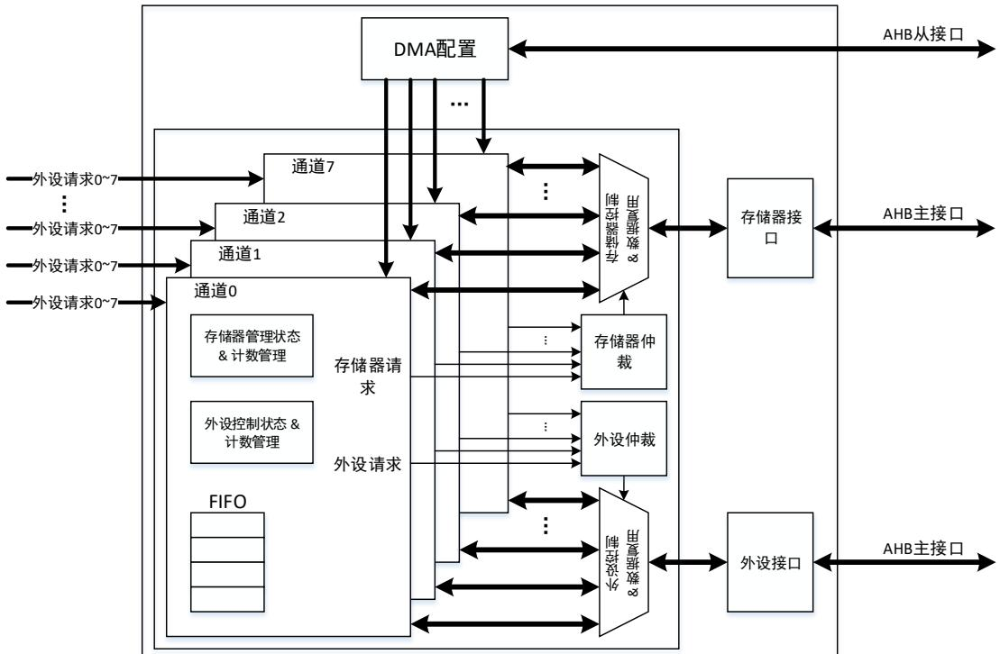
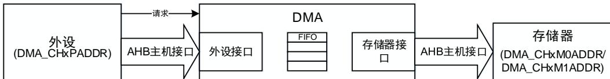
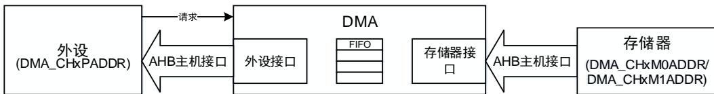
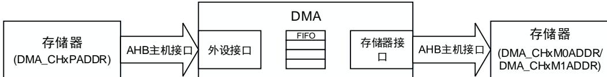
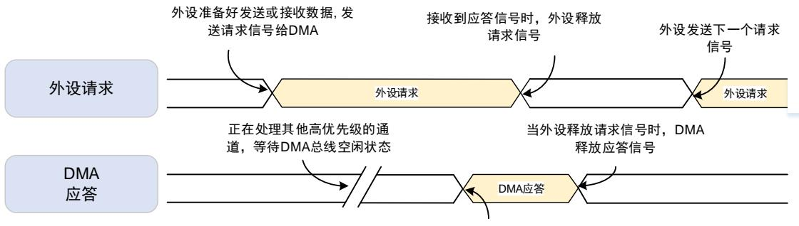
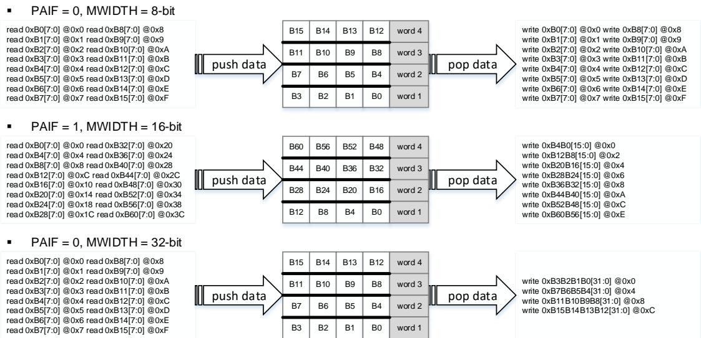
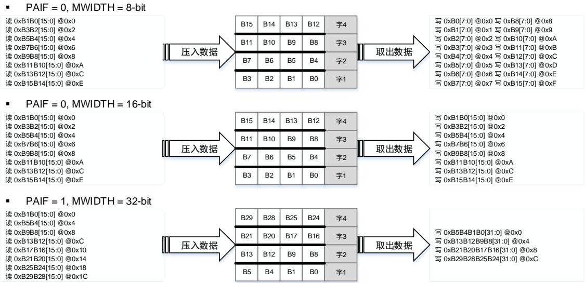
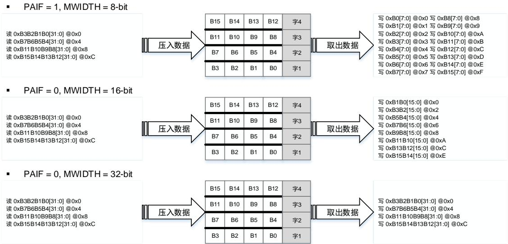
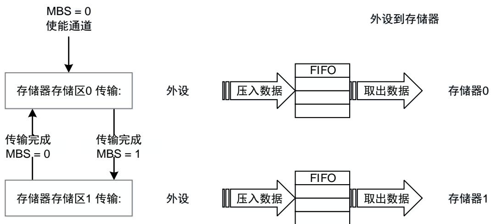
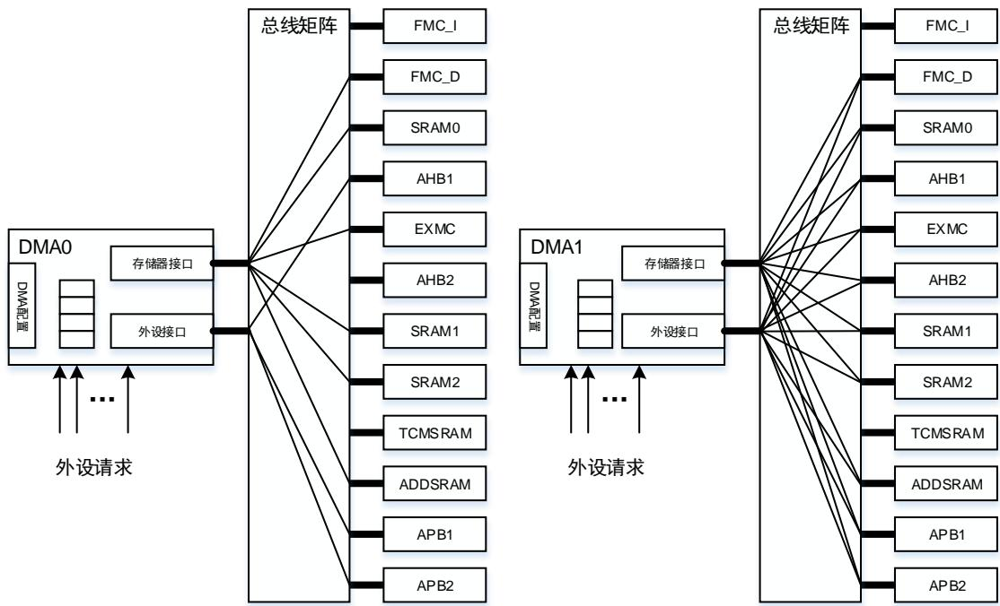

## 14. 直接存储器访问控制器（DMA）

## 14.1. 简介

DMA控制器提供了一种硬件的方式在外设和存储器之间或者存储器和存储器之间传输数据，而无需MCU的介入，避免了MCU多次进入中断进行大规模的数据拷贝，最终提高整体的系统性能。

每个DMA控制器包含了两个AHB总线接口和8个4字深度的FIFO，使DMA可以高效的传输数据。DMA控制器（DMA0，DMA1）共有16个通道，每个通道可以被分配给一个或多个特定的外设进行数据传输。两个内置的总线仲裁器用来处理DMA请求的优先级问题。

Cortex®-M33内核与DMA控制器都是通过系统总线来处理数据，引入仲裁机制来处理它们之间的竞争关系。当MCU和DMA指定相同的外设的时候，MCU将会在特定的总线周期挂起。总线矩阵使用了轮询的算法保证MCU至少占用了一半的带宽。

## 14.2. 主要特征

- 两个 AHB 主机接口传输数据，一个 AHB 从机接口配置 DMA；

- 16 个通道（每个 DMA 控制器有 8 个通道），每个通道连接 8 个特定的外设请求；

- 存储器和外设支持单一传输，4 拍、8 拍和 16 拍增量突发传输；

- 当外设和存储器传输数据时，支持存储器切换；

- 支持软件优先级（低、中、高、超高）和硬件优先级（通道号越低，优先级越高）；

- 存储器和外设的数据传输宽度可配置：字节，半字，字；

- 存储器和外设的数据传输支持固定寻址和增量式寻址；

- 支持循环传输模式；

- 支持三种传输方式：

– 存储器到外设；

外设到存储器；

– 存储器到存储器（仅 DMA1 支持）；

- DMA和外设均可配置为传输控制器：

DMA作为传输控制器：可配置数据传输长度，最大为 65535；

– 外设作为传输控制器：数据传输的完成取决于外设的最后一个传输请求；

- 支持单数据传输和多数据传输模式：

多数据传输模式：在存储器数据宽度和外设数据宽度不同的时候，自动打包 / 解包数据；

单数据传输模式：当且仅当 FIFO 空的时候从源地址读取数据，存进 FIFO，然后把FIFO 的数据写到目标地址；

- 每个通道有 5 种类型的事件标志和独立的中断，支持中断的使能和清除。

## 14.3. 结构框图

图 14-1. 系统架构

14-1. 所示，DMA控制器由 4 部分组成：

- AHB 从接口配置 DMA；

- 两个 AHB 主接口进行数据传输；

- 两个仲裁器进行 DMA 请求的优先级管理；

- 数据处理和计数。

## 14.4. 功能描述

DMA控制器在没有MCU参与的情况下从一个地址向另一个地址传输数据，它支持多种数据宽度，突发类型，地址生成算法，优先级和传输模式，可以灵活的配置以满足应用的需求。所有的寄存器都可以通过AHB从机接口进行32位的操作。

寄存器DMA_CHxCTL的TM位域决定了DMA的数据传输模式，如表14-1. 传输模式所示。

表 14-1. 传输模式

<table><tr><td>传输模式</td><td>TM[1:0]</td><td>源地址</td><td>目的地址</td></tr><tr><td>外设到存储器</td><td>00</td><td>DMA_CHxPADDR</td><td>DMA_CHxM0ADDR / DMA_CHxM1ADDR</td></tr><tr><td>存储器到外设</td><td>01</td><td>DMA_CHxM0ADDR / DMA_CHxM1ADDR</td><td>DMA_CHxPADDR</td></tr><tr><td>存储器到存储器</td><td>10</td><td>DMA_CHxPADDR</td><td>DMA_CHxM0ADDR / DMA_CHxM1ADDR</td></tr></table>

注意：1. 寄存器DMA_CHxCTL的MBS位选择DMA_CHxM0ADDR或者DMA_CHxM1ADDR作为存储器地址。详细请参考存储切换模式。

2. 寄存器DMA_CHxCTL的TM位域禁止配置成‘0b11’，否则通道将会自动关闭。

图 14-2. 三种传输模式的数据流

 读外设写存储器

 读存储器写外设

 读存储器写存储器

如图14-2. 三种传输模式的数据流所示，DMA 控制器的两个 AHB主机接口分别对应存储器和外设的数据访问。

- 外设到存储器：通过 AHB 外设主机接口从外设读取数据，通过 AHB 存储器主机接口向存储器写入数据。

- 存储器到外设：通过 AHB 存储器主机接口从存储器读取数据，通过 AHB 外设主机接口向外设写入数据。

- 存储器到存储器：通过 AHB外设主机接口从存储器读取数据，通过 AHB 存储器主机接口向存储器写入数据。

## 14.4.1. 外设握手

为了保证数据的有效传输，DMA控制器中引入了外设和存储器的握手机制，包括请求信号和应答信号：

- 请求信号：由外设发出，表明外设已经准备好发送或接收数据。

■ 应答信号：由 DMA控制器响应，表明 DMA控制器已经发送 AHB 命令去访问外设。

14-3. 中详细描述了 DMA控制器与外设之间的握手机制。

图 14-3. 握手机制

此时相应通道具有最高优先级，DMA控制器发送应答信号给外设

每个 DMA控制器有 8 个通道，每个通道有多个外设请求。寄存器 DMA_CHxCTL 的 PERIEN位域决定了 DMA 通道选中的外设请求。DMA0 与 DMA1 的外设请求映射分别列于表14-2.DMA0 外设请求与表14-3. DMA1 外设请求。

如表14-2. DMA0 外设请求，表14-3. DMA1 外设请求所示，同一个外设请求可以连接到两个DMA 通道上，这里禁止两个 DMA 通道选择相同的外设请求。例如，在 DMA0 控制器中，SPI2_RX 外设请求连接到通道 0 和通道 2。当寄存器 DMA_CH0CTL，DMA_CH2CTL 的PERIEN 位域同时配置为‘0b000’时，使能通道 0 和通道 2，当 SPI2 发出 DMA 请求时，会造成通道 0 和通道 2 的响应混乱，及数据传输错误。

表 14-2. DMA0 外设请求

<table><tr><td colspan="2">通道</td><td>通道0</td><td>通道1</td><td>通道2</td><td>通道3</td><td>通道4</td><td>通道5</td><td>通道6</td><td>通道7</td></tr><tr><td rowspan="8">PERIEN[2:0]</td><td>000</td><td>SPI2_RX</td><td>I2C3_RX</td><td>SPI2_RX</td><td>SPI1_RX</td><td>SPI1_TX</td><td>SPI2_TX</td><td>I2C3_TX</td><td>SPI2_TX</td></tr><tr><td>001</td><td>I2C0_RX</td><td>I2C4_RX</td><td>TIMER6_UP</td><td>I2C4_TX</td><td>TIMER6_UP</td><td>I2C0_RX</td><td>I2C0_TX</td><td>I2C0_TX</td></tr><tr><td>010</td><td>TIMER3_CH0</td><td>●</td><td>I2S2_ADD_RX</td><td>TIMER3_CH1</td><td>I2S1_ADD_TX</td><td>I2S2_ADD_TX</td><td>TIMER3_UP</td><td>TIMER3_CH2</td></tr><tr><td>011</td><td>I2S2_ADD_RX</td><td>TIMER1_UP TIMER1_CH2</td><td>I2C2_RX</td><td>I2S1_ADD_RX</td><td>I2C2_TX</td><td>TIMER1_CH0</td><td>TIMER1_CH1 TIMER1_CH3</td><td>TIMER1_UP TIMER1_CH3</td></tr><tr><td>100</td><td>UART4_RX</td><td>USART2_RX</td><td>UART3_RX</td><td>USART2_TX</td><td>UART3_TX</td><td>USART1_RX</td><td>USART1_TX</td><td>UART4_TX</td></tr><tr><td>101</td><td>UART7_TX</td><td>UART6_TX</td><td>TIMER2_CH3 TIMER2_UP</td><td>UART6_RX</td><td>TIMER2_CH0 TIMER2_TG</td><td>TIMER2_CH1</td><td>UART7_RX</td><td>TIMER2_CH2</td></tr><tr><td>110</td><td>TIMER4_CH2 TIMER4_UP</td><td>TIMER4_CH3 TIMER4_TG</td><td>TIMER4_CH0</td><td>TIMER4_CH3 TIMER4_TG</td><td>TIMER4_CH1</td><td>I2C5_RX</td><td>TIMER4_UP</td><td>I2C5_TX</td></tr><tr><td>111</td><td>●</td><td>TIMER5_UP</td><td>I2C1_RX</td><td>I2C1_RX</td><td>USART2_TX</td><td>DAC0_OUT0</td><td>DAC0_OUT1</td><td>I2C1_TX</td></tr></table>

表 14-3. DMA1 外设请求

<table><tr><td colspan="2">通道</td><td>通道0</td><td>通道1</td><td>通道2</td><td>通道3</td><td>通道4</td><td>通道5</td><td>通道6</td><td>通道7</td></tr><tr><td rowspan="4">PEREN[2:0]</td><td>000</td><td>ADC0</td><td>SAI0_B0</td><td>TIMER7_CH0TIMER7_CH1TIMER7_CH2</td><td>SAI0_B0</td><td>ADC0</td><td>SAI0_B1</td><td>TIMER0_CH0TIMER0_CH1TIMER0_CH2</td><td>●</td></tr><tr><td>001</td><td>●</td><td>DCI</td><td>ADC1</td><td>ADC1</td><td>SAI0_B1</td><td>SPI5_TX</td><td>SPI5_RX</td><td>DCI</td></tr><tr><td>010</td><td>ADC2</td><td>ADC2</td><td>●</td><td>SPI4_RX</td><td>SPI4_TX</td><td>CAU_OUT</td><td>CAU_IN</td><td>HAU_IN</td></tr><tr><td>011100</td><td>SPI0_RXSPI3_RX</td><td>●SPI3_TX</td><td>SPI0_RXUSART0_RX</td><td>SPI0_TXSDIO</td><td>●●</td><td>SPI0_TXUSART0_RX</td><td>●SDIO</td><td>●USART0_TX</td></tr><tr><td rowspan="3"></td><td>101</td><td>●</td><td>USART5_RX</td><td>USART5_RX</td><td>SPI3_RX</td><td>SPI3_TX</td><td>●</td><td>USART5_TX</td><td>USART5_TX</td></tr><tr><td>110</td><td>TIMER0_TG</td><td>TIMER0_CH0</td><td>TIMER0_CH1</td><td>TIMER0_CH0</td><td>TIMER0_CH3 TIMER0_TG TIMER0_CMT</td><td>TIMER0_UP</td><td>TIMER0_CH2</td><td>●</td></tr><tr><td>111</td><td>●</td><td>TIMER7_UP</td><td>TIMER7_CH0</td><td>TIMER7_CH1</td><td>TIMER7_CH2</td><td>SPI4_RX</td><td>SPI4_TX</td><td>TIMER7_CH3 TIMER7_TG TIMER7_CMT</td></tr></table>

## 14.4.2. 数据处理

仲裁

每个DMA控制器有两个分别对应于外设和存储器的仲裁器。当DMA控制器在同一时间接收到多个外设请求时，仲裁器将根据外设请求的优先级来决定响应哪一个外设请求。优先级规则如下：

- 软件优先级：分为4级，低，中，高和超高。可以通过寄存器DMA_CHxCTL的PRIO位域来配置；

- 硬件优先级：当通道具有相同的软件优先级时，编号低的通道优先级高。例：通道0和通道2配置为相同的软件优先级时，通道0的优先级高于通道2。

## 传输宽度，突发传输和计数

## 传输宽度

寄存器DMA_CHxCTL的PWIDTH和MWIDTH位域决定了外设和存储器的数据传输宽度。DMA控制器支持8位，16位和32位的数据宽度。在多数据传输模式中，如果PWIDTH和MWIDTH不相等，DMA会自动的打包 / 解包数据来进行完整的数据传输。在单数据传输模式中，MWIDTH在通道使能以后，会被硬件强制设置与PWIDTH相等。

## 突发传输类型

寄存器DMA_CHxCTL的PBURST和MBURST位域决定了外设和存储器的突发传输方式。DMA控制器的外设和存储器接口均支持单一传输，4拍，8拍，16拍的增量突发传输。对于单数据传输模式，当使能通道后，PBURST和MBURST会被强制设为0，仅支持单一传输。

在外设到存储器或者存储器到外设传输模式中，如果PBURST不为0，在每次外设请求之后，DMA控制器会根据PBURST的值进行4拍，8拍，16拍的增量突发传输。如果剩余的数据不够一次突发传输，剩余的数据将会进行单一传输。

AMBA协议指定突发传输不能超过1KB的地址边界，否则会产生传输错误。对于外设和存储器，当突发传输超过1KB的地址边界，硬件会自动的把4拍，8拍，16拍（由PBURST和MBURST决定）的突发传输拆分为单一传输。

## 传输计数

当DMA作为传输控制器的时候，寄存器DMA_CHxCN的CNT位域决定了需要传输数据的数量，在使能DMA通道之前，数据的传输量必须完成配置。当外设作为传输控制器的时候，在使能通道后，CNT位会被强制设置为‘0xFFFF’。在传输过程中，CNT表示剩余需要传输的数据数量。

CNT位的大小与外设的数据传输宽度有关，数据传输总量的字节数等于CNT乘以外设数据传输宽度。举例来说，如果PWIDTH的值设置为‘0b10’，则传输的数据总量的字节数等于CNT*4。CNT的值在外设的每次单一传输或者在突发模式中每个节拍传输完成后都会减1。

CNT值的配置需要满足下列要求：

如果关闭循环模式（清除寄存器DMA_CHxCTL的CMEN位），CNT值的配置应该满足表14-4.CNT配置的要求。传输的数据总量的字节数必须是存储器数据传输宽度的整数倍，以保证完整的存储器传输。

注意：如果PBURST和MBURST都不是‘0b00’，传输的数据总量不用是存储器和外设的突发传输数据的整数倍。对于不满足一次突发传输的剩余数据，硬件会自动的拆分成多个单一传输。

表 14-4. CNT 配置

<table><tr><td>PWIDTH</td><td>MWIDTH</td><td>CNT</td></tr><tr><td>8位</td><td>16位</td><td>2的倍数</td></tr><tr><td>8位</td><td>32位</td><td>4的倍数</td></tr><tr><td>16位</td><td>32位</td><td>2的倍数</td></tr><tr><td colspan="2">其他情况</td><td>任意值</td></tr></table>

1. 如果开启循环模式（置位寄存器 DMA_CHxCTL 的 CMEN 位），传输的数据总量必须保证同时是存储器突发传输数据总量和外设突发传输数据总量的整数倍，否则将不能保证数据的正确性：

$$
a. \quad C N T / P B U R S T \_ b e a t s 必 须 是 整 数
$$

$$
b. \quad (C N T \times P W I D T H \_ b y t e s) / (M U R S T \_ b e a t s \times M W I D T H \_ b y t e s) 必 须 是 整 数
$$

注意：

PWIDTH_bytes是外设的数据传输宽度的字节数。8位是1，16位是2，32位是4。

PBURST_beats是外设突发传输的节拍数，单一传输是1，4拍增量突发传输是4，8拍增量突发传输是 ， 拍增量突发传输是 。

MWIDTH_bytes是存储器的数据传输宽度的字节数。8位是1，16位是2，32位是4。

MBURST_beats是存储器突发传输的节拍数，单一传输是1，4拍增量突发传输是4，8拍增量突发传输是8，16拍增量突发传输是16。

举例：

如果PWIDTH是16位，PBURST是4拍增量突发传输，MWIDTH是8位，MBURST是16拍增量突发传输，则CNT / 4与 (CNT * 2) / (1 * 16) 必须是整数，所以CNT必须是8的整数倍。

如果PWIDTH是8位，PBURST是16拍增量突发传输，MWIDTH是16位，MBURST是4拍增量突发传输，则CNT / 16与 (CNT * 1) / (2 * 4)必须是整数，所以CNT必须是16的倍数。

注意：如果使能了存储切换模式（置位寄存器DMA_CHxCTL的SBMEN位），循环模式会被硬件强制打开，所以也必须满足上述要求。

## FIFO

DMA控制器的每个通道都有一个4字深度的FIFO用于缓冲数据，从源地址读取的数据会先暂时保存在FIFO中，再传输到目的地址。根据FIFO的配置，DMA控制器支持两种数据处理模式：单数据传输模式和多数据传输模式。在存储器到存储器模式下，DMA控制器仅支持多数据传输模式。

## 多数据传输模式

多数据传输模式通过把寄存器DMA_CHxFCTL的MDMEN位置1来实现。

在这个模式中，当FIFO有足够的空间时，DMA控制器响应源端的请求，从源地址读取数据存储进FIFO。如果目的端是外设，当FIFO内的数据量满足外设的一次突发传输时，DMA会响应外设的请求。如果目标端是存储器，寄存器DMA_CHxFCTL的FCCV位设置的FIFO临界值决定DMA控制器何时进行将FIFO中的数据写入存储器，当FIFO计数器达到配置的临界值时，FIFO中的所有数据会被写入目标存储器地址。

为了保证正确的数据传输， 的临界值必须配置为存储器一次突发传输数据量的整数倍。这样才能保证 中有足够的数据可以完成存储器突发传输。 计数器的临界值的设置与存储器数据传输宽度和存储器突发传输类型有关，具体见表14-5. FIFO计数器临界值配置。

表 14-5. FIFO 计数器临界值配置

<table><tr><td rowspan="2">MWIDTH</td><td rowspan="2">MBURST</td><td colspan="4">FIFO 计数临界值</td></tr><tr><td>1-word</td><td>2-word</td><td>3-word</td><td>4-word</td></tr><tr><td rowspan="4">8 位</td><td>single</td><td>4 次单一传输</td><td>8 次单一传输</td><td>12 次单一传输</td><td>16 次单一传输</td></tr><tr><td>INCR4</td><td>1 次突发传输</td><td>2 次突发传输</td><td>3 次突发传输</td><td>4 次突发传输</td></tr><tr><td>INCR8</td><td>错误</td><td>1 次突发传输</td><td>错误</td><td>2 次突发传输</td></tr><tr><td>INCR16</td><td>错误</td><td>错误</td><td>错误</td><td>1 次突发传输</td></tr><tr><td rowspan="4">16 位</td><td>single</td><td>2 次单一传输</td><td>4 次单一传输</td><td>6 次单一传输</td><td>8 次单一传输</td></tr><tr><td>INCR4</td><td>错误</td><td>1 次突发传输</td><td>错误</td><td>2 次突发传输</td></tr><tr><td>INCR8</td><td>错误</td><td>错误</td><td>错误</td><td>1 次突发传输</td></tr><tr><td>INCR16</td><td>错误</td><td>错误</td><td>错误</td><td>错误</td></tr><tr><td rowspan="4">32 位</td><td>single</td><td>1 次单一传输</td><td>2 次单一传输</td><td>3 次单一传输</td><td>4 次单一传输</td></tr><tr><td>INCR4</td><td>错误</td><td>错误</td><td>错误</td><td>1 次突发传输</td></tr><tr><td>INCR8</td><td>错误</td><td>错误</td><td>错误</td><td>错误</td></tr><tr><td>INCR16</td><td>错误</td><td>错误</td><td>错误</td><td>错误</td></tr></table>

注意：当传输模式是外设到存储器时，如果PBURST_beats*PWIDTH_bytes = 16，FIFO计数器临界值不能设置成‘0b10’。如果设置成‘0b10’，当接收到外设请求时，DMA控制器从外设中读取数据并填满FIFO，然后DMA会向存储器中写入3个字的数据（这个是由FIFO的临界值决定），同时剩余一个字的数据。这时当新的外设请求来临时，FIFO中没有足够的空间进行下一次的外设突发传输，同时FIFO中的数据没有达到FIFO临界值也不会进行存储器突发传输，会使通道数据传输冻结。

## 单数据传输模式

单数据传输模式通过把寄存器DMA_CHxFCTL的MDMEN位清0来实现。

在这个模式中，DMA控制器一次只能传输一个数据，FIFO计数器临界值的配置（寄存器DMA_CHxFCTL的FCCV位域）没有意义。在这个模式中，当且仅当FIFO空的时候，DMA会响应源端的请求，从源地址读取数据进入FIFO。当FIFO非空时，DMA响应目的端的请求，把FIFO中的数据写入目的地址。

## 打包 / 解包

在单数据传输模式中，MWIDTH会被硬件强制设置与PWIDTH相等，无需使用数据的打包/解包功能。

在多数据传输模式中，MWIDTH与PWIDTH相互独立，配置更为灵活。当MWIDTH与PWIDTH不相等时，DMA的读写传输宽度不同，DMA会自动的对数据打包/解包操作。在传输过程中，外设和寄存器都只支持小端操作。

当CNT被设置为16，PWIDTH为 ‘0b00’，PNAGA和MNAGA被置1。对于不同的MWIDTH，DMA的传输操作如图14-4. PWIDTH为‘0b00’时， 数据的打包/ 解包所示。

## 图 14-4. PWIDTH 为‘0b00’时，数据的打包 / 解包

当 CNT 被设置为 8，PWIDTH 为‘0b01’，PNAGA 和 MNAGA 被置 1。对于不同的 WIDTH，

## DMA 的传输操作如图14-5. PWIDTH 为‘0b01’时 数据的打包 / 解包所示。

图 14-5. PWIDTH 为‘0b01’时，数据的打包 / 解包

当CNT被设置为4，PWIDTH为 ‘0b10’，PNAGA和MNAGA被置1。对于不同的MWIDTH，DMA的传输操作如图14-6. PWIDTH为‘0b10’时 数据的打包/ 解包所示。

图 14-6. PWIDTH 为‘0b10’时，数据的打包 / 解包

## 14.4.3. 地址生成

存储器和外设都独立的支持两种地址生成算法：固定模式和增量模式。寄存器DMA_CHxCTL的PNAGA和MNAGA位用来设置存储器和外设的地址生成算法。

在固定模式中，地址一直固定为初始化的基地址（DMA_CHxPADDR，DMA_CHxM0ADDR，DMA_CHxM1ADDR）。

在增量模式中，下一次传输数据的地址是当前地址加1（或者2，4），这个值取决于数据传输宽度。在多数据传输模式中，若寄存器 的 配置为 ，当寄存器DMA_CHxCTL的PAIF位置1使能时，外设的下一次传输的地址增量被固定为4，与外设的数据

传输宽度无关。PAIF与存储器地址生成无关。

注意：若PAIF配置为’1‘，外设的基地址（寄存器DMA_CHxPADDR）必须配置为4字节对齐。

## 14.4.4. 循环模式

循环模式用来处理连续的外设请求。可以通过寄存器DMA_CHxCTL的CMEN位置1使能。循环模式只在DMA作为传输控制器时有效。当寄存器DMA_CHxCTL的TFCS位被置1时，外设作为传输控制器，在通道使能后，循环模式会被自动关闭。

在循环模式中，当每次DMA传输完成后，CNT值会被重新载入，且传输完成标志位会被置1。DMA会一直响应外设的请求，直到出现传输错误或者通道使能位被清0。

## 14.4.5. 存储切换模式

与循环模式相同，存储切换模式也是用来处理连续的外设请求。可以通过寄存器DMA_CHxCTL的SBMEN位置1使能。若打开了存储切换模式，在通道使能后，硬件会自动打开循环模式。存储切换模式只能应用于外设与存储器之间的数据传输，在存储器到存储器模式中禁止使用。

存储 切换 模式 支持 两 个存 储器 缓冲 区， 两 个存 储器 基地 址可 以 分别 在寄 存器DMA_CHxM0ADDR和DMA_CHxM1ADDR中配置。在每次DMA传输完成后，存储器指针指向另一个存储器缓冲区。在DMA传输过程中，没有被DMA占用的缓冲区可以被其他的AHB主机接口操作，且其基地址可以改变。

软件可以通过设定寄存器 DMA_CHxCTL 的 MBS 位来指定第一次数据传输 DMA 使用的缓冲区。DMA 通道使能以后，MBS 可以视为 DMA 存储器缓冲区的标志位，它会在每次传输完成后自动在‘0‘，‘1’之间切换，如图14-7. 存储切换模式所示。

图 14-7. 存储切换模式

## 14.4.6. 传输控制器

数据传输量的大小由传输控制器决定。寄存器DMA_CHxCTL的TFCS位决定了传输控制器是外设还是DMA。

- DMA 为传输控制器：寄存器 DMA_CHxCNT 的 CNT 位域决定传输数据量的大小，必须在通道使能前配置；

- 外设为传输控制器：在通道使能后寄存器 DMA_CHxCNT 的 CNT 位域为会被硬件强制配置为‘0xFFFF’，因此配置 CNT 没有意义。DMA数据传输完成由外设发送最后一次传输请求决定。

注意：当传输模式是存储器到存储器时，传输控制器只能是DMA。

## 14.4.7. 传输操作

数据传输支持三种操作方式：外设到存储器，存储器到外设，和存储器到存储器。存储器和外设都可以配置为源端和目的端。

## 存储器端数据传输

- 外设到存储器：

单数据传输模式，当 FIFO 非空时，DMA 启动存储器数据传输，写数据到相应的存储器地址中；

多数据传输模式，当 FIFO 计数器达到临界值时，DMA 启动单一或突发数据传输，把 FIFO 的数据全部写入存储器中。

- 存储器到外设：

单数据传输模式，当通道使能时DMA会立刻进行存储器数据传输，读取数据到FIFO。数据传输过程中，当且仅当 FIFO 为空时，DMA控制器就会进行存储器读取操作；

多数据传输模式，当通道使能后，不论是否有外设请求，DMA 都会进行单一或突发数据传输填满 FIFO。在数据传输过程中，当 FIFO 有足够的空间进行一次单一或突发传输时，DMA控制器就会进行存储器读取操作。

存储器到存储器：只支持多数据传输模式。当 FIFO 计数器到达临界值，DMA 进行单一或突发传输把 FIFO 的数据全部写入存储器中。

## 外设端数据传输

- 外设到存储器：当 DMA收到外设请求且 FIFO 有足够的空间进行数据传输，DMA启动外设数据传输从外设读取数据写入 FIFO；

- 存储器到外设：当 收到外设请求且 有足够的数据进行数据传输， 启动外设数据传输从 FIFO 读取数据写入外设；

- 存储器到存储器：只支持多数据传输模式。当通道使能时，DMA 启动单一或突发传输读取数据写满 FIFO。在数据传输过程中，当 FIFO 有足够的空间进行一次单一或突发传输时，DMA 控制器就会进行存储器读取操作。

## 14.4.8. 传输完成

DMA传输由硬件自动完成，寄存器DMA_INTF0与DMA_INTF1位FTFIFx在以下情况下会被置1：

- 传输完成；

- 软件清除；

- 传输错误。

## 传输完成

当DMA使能以后，数据会在外设和存储器之间传输。当寄存器DMA_CHxCNT的CNT中配置的数据量传输完成或处理完最后一次外设请求以后，DMA传输结束，寄存器DMA_CHxCTL的CHEN位自动清零。

- 外设到存储器：如果 DMA 是传输控制器，CNT 减数到 0 且 FIFO 中的数据完全写入到存储器中，传输完成。如果外设是传输控制器，当外设的最后一个请求完成且 FIFO 中的数据完全写入到存储器中，传输完成；

- 存储器到外设：如果 DMA 是传输控制器，当 CNT 减数到 0 时传输完成。如果外设传输流控制器，当外设的最后一个请求完成时，传输完成；

- 存储器到存储器：只支持 DMA为传输控制器，CNT 减数到 0 且 FIFO 中的数据完全写入到存储器中，传输完成。

## 软件清除

DMA传输可以通过对寄存器DMA_CHxCTL的CHEN位清0停止。在清0操作之后，若CHEN仍然为1，代表存储器或者外设仍然处在传输状态，或者FIFO中还有剩余的数据没有传输。

- 外设到存储器：软件清 0 操作后，当前的单次或突发传输完成后，DMA 的外设传输将会停止。为了保证从外设读取的数据完全被写入存储器中，存储器在 FIFO 非空的状态下仍然会进行数据传输，直到 FIFO 中的数据完全被写入存储器中。若 FIFO 中剩余的数据量不满足一次存储器突发传输，这些数据将会被拆分成单一传输。如果 FIFO 总剩余的数据量小于存储器传输宽度，这个数据会被高位补 0，写入存储器中。此时读取 CNT 的值可以计算出存储器中的有效数据量。在 FIFO 中的数据传输完毕之后，CHEN 会被硬件自动清 0，寄存器 DMA_INTF0 或 DMA_INTF1 相应通道标志位 FTFIFx 会被置 1；

- 存储器到外设：软件清 0 操作后，当前的存储器和外设传输完成以后，DMA 传输将会停止。CHEN 会自动清 0，寄存器 DMA_INTF0 或 DMA_INTF1 相应通道标志位 FTFIFx 会被置 1；

存储器到存储器：与外设到存储器相同，其中源端存储器的传输通过外设端口来实现。

## 传输错误

三种类型的错误会关闭DMA传输：

- FIFO 错误：当检测到 FIFO 错误配置，通道会立即关闭且不会进行任何传输。这种情况下，FTFIFx 不会被置 1。更多 FIFO 错误的信息，请参考章节错误；

总线错误：当存储器或者外设端口试图访问超出范围的地址时，DMA 控制器会检测到总线错误，通道停止传输且 FTFIFx 不会被置 1。如果错误是由外设端口引起，CNT 仍会进行一次减 1 操作。更多总线错误的信息，请参考章节错误；

- 寄存器访问错误：在存储切换模式下，当对 DMA正在访问的存储器的基地址寄存器进行写操作时，DMA控制器会检测到寄存器访问错误。发生这个错误后，DMA控制器的操作与软件清 0 时相同。更多寄存器访问错误的信息，请参考章节错误。

## 14.4.9. 通道配置

要启动一次新的DMA数据传输，建议遵循以下步骤进行操作：

1. 读取 CHEN 位，如果为 1（通道已使能），清 0 或等待 DMA传输完成。当 CHEN 为 0 时，请按照下列步骤配置 DMA；

2. 清除寄存器 DMA_INTF0 或 DMA_INTF1 相应通道标志位 FTFIFx，否则无法使能 DMA。

3. 配置寄存器 DMA_CHxCTL 的 TM 位选择数据传输方式；

4. 配置寄存器 DMA_CHxCTL 的 PERIEN 位域选择外设。当数据传输方式是存储器到存储器时，PERIEN 没有具体意义，这一步可以跳过；

5. 在寄存器 DMA_CHxCTL 中配置存储器和外设突发类型，目标存储器（memory 0 或memory1），存储切换模式，通道优先级，存储器和外设的传输宽度，存储器和外设的地址生成算法，循环模式，传输控制器；

6. 在寄存器 DMA_CHxFCTL 中配置数据处理方式，如果使用多数据传输方式，需要配置FCCV 位域以设置 FIFO 计数器临界值；

7. 在寄存器 DMA_CHxCTL 中配置传输完成中断，半传输完成中断，传输错误中断，单数据传输方式异常中断的使能位。在寄存器 DMA_CHxFCTL 中配置 FIFO 错误和异常中断的使能位。中断使能位可根据实际需求配置；

8. 在寄存器 DMA_CHxPADDR 中配置外设基地址；

9. 如果使用存储切换模式，在寄存器 DMA_CHxM0ADDR 和 DMA_CHxM1ADDR 中配置两个存储器基地址。如果只使用一个存储器，寄存器 CHxCTL 的 MBS 位决定配置DMA_CHxM0ADDR 或者 DMA_CHxM1ADDR；

10. 在寄存器 DMA_CHxCNT 中配置数据传输总量；

11. 寄存器 DMA_CHxCTL 的 CHEN 位置 1，使能 DMA 通道。

如果要继续挂起的DMA传输，建议遵循以下步骤进行操作：

1. 读取 CHEN 位，确定 DMA 的挂起操作已经完成。当 CHEN 为 0 时，DMA 处于空闲状态，可以重新配置 DMA以继续挂起 DMA 传输；

2. 清除寄存器 DMA_INTF0 或 DMA_INTF1 相应通道标志位 FTFIFx，否则 DMA 通道可能无法再使能；

3. 读取寄存器 DMA_CHxCNT 计算出已经发送的数据量与剩余待发的数据量；

4. 在寄存器 DMA_CHxPADDR 中更新外设基地址；

5. 在寄存器 DMA_CHxM0ADDR 或 DMA_CHxM1ADDR 中更新存储器基地址；

6. 在寄存器 DMA_CHxCNT 中配置剩余待发的数据总量；

7. 寄存器 DMA_CHxCTL 的 CHEN 位置 1，重新启动 DMA 通道。

## 14.5. 中断

每个DMA通道都有专有的中断，包括5个中断事件，传输完成中断，半传输完成中断，传输错误中断，单数据传输模式异常中断，FIFO错误和异常中断。任何一个中断事件都可以引发DMA中断。

寄存器 DMA_INTF0 或 DMA_INTF1 包含每个中断事件的标志位，寄存器 DMA_INTC0 或DMA_INTC1 包含每个中断事件的标志清除位，寄存器 DMA_CHxCTL 和 DMA_CHxFCTL 包含每个中断事件的使能位，如表14-6. DMA 中断事件所示。

表 14-6. DMA 中断事件

<table><tr><td rowspan="2">中断事件</td><td>标志位</td><td>使能位</td><td>清除位</td></tr><tr><td>DMA_INTF0 or DMA_INTF1</td><td>DMA_CHxCTL or DMA_CHxFCTL</td><td>DMA_INTC0 or DMA_INTC1</td></tr><tr><td>传输完成</td><td>FTFIF</td><td>FTFIE</td><td>FTFIFC</td></tr><tr><td>半传输完成</td><td>HTFIF</td><td>HTFIE</td><td>HTFIFC</td></tr><tr><td>传输错误</td><td>TAEIF</td><td>TAEIE</td><td>TAEIFC</td></tr><tr><td>单数据模式异常</td><td>SDEIF</td><td>SDEIE</td><td>SDEIFC</td></tr><tr><td>FIFO 错误与异常</td><td>FEEIF</td><td>FEPIE</td><td>FEEIFC</td></tr></table>

这5个事件可以分为3种类型：

- 标志：传输完成和半传输完成；

- 异常：单数据传输模式异常和 FIFO 异常；

- 错误：传输错误和 FIFO 错误。

发生异常事件时，正在进行的DMA传输不会被停止，仍将继续传输。发生错误事件时，正在进行的DMA传输会被停止。这三种类型的事件在下一节进行详细描述。

## 14.5.1. 标志

两种标志事件，传输完成事件和半传输完成事件。

发生以下情况时，传输完成标志位将会被置1：

- DMA作为传输控制器时，CNT 计数到 0；

- 外设作为传输控制器时，响应完外设的最后一个数据传输请求后，（如果是读外设写存储器传输方式，还需满足 FIFO 中的数据全部写入存储器中）传输完成；

- 在数据传输完成之前，通过软件清 0 的方式停止数据传输，当前的存储器和外设数据传输完成后，（如果是外设到存储器或存储器到存储器传输模式，还需满足 FIFO 中的数据全部写入存储器中）传输完成；

- 在数据传输完成之前，由于寄存器访问错误导致停止数据传输，当前的存储器和外设数据传输完成后，（如果是外设到存储器或存储器到存储器传输模式，还需满足 FIFO 中的数据全部写入存储器，）传输完成。

当传输完成标志位置1，且传输完成中断使能时，DMA控制器产生传输完成中断。

当DMA作为传输控制器且CNT减数计数达到初始值的一半时，半传输完成标志位会被置1。

当半传输完成标志位置1，且半传输完成中断使能时，DMA控制器产生半传输完成中断。

## 14.5.2. 异常

两种异常事件，单数据传输模式异常和FIFO异常。异常对于DMA传输无影响。

## 单数据传输模式异常

这个异常只有在使能单数据传输模式且传输方式为外设到存储器时才会发生。当FIFO非空时，如果外设请求数据传输，DMA在响应外设请求以后，会有多个数据存储在FIFO中，这可能会对存储器后续的数据处理造成影响，此时单数据传输模式异常标志位置1

当单数据传输模式异常标志位置1，且单数据传输模式异常中断使能，DMA控制器产生单数据传输模式异常中断。

## FIFO 异常

这个异常只有数据在外设和存储器之间传输才会发生，当FIFO发生上溢或下溢时，FIFO异常标志位置1。

当传输模式为外设到存储器时，如果外设请求有效且得到最高优先级时，FIFO的剩余空间不满足单一或突发外设传输，FIFO发生上溢。直到FIFO有足够空间时，DMA控制器才会响应此次外设请求，该异常不会影响到数据传输的正确性。

当传输模式为存储器到外设时，如果外设请求有效且得到最高优先级时，FIFO中的数据不够完成单次或突发外设传输，FIFO发生下溢。直到FIFO有足够数据时，DMA控制器才会响应此次外设请求，该异常不会影响到数据传输的正确性。

当FIFO异常标志位置1，且FIFO异常中断使能时，DMA控制器产生FIFO异常中断。

## 14.5.3. 错误

在数据传输过程中，会发生FIFO错误和传输错误（包含寄存器访问错误和总线错误），此时数据传输会被中止。

## FIFO 错误

当使用多数据传输模式时，FIFO计数器临界值设置必须与存储器和外设数据传输宽度匹配，详细见表14-5. FIFO计数器临界值配置。错误的配置会引发FIFO错误，此时，通道会立即关闭，并不启动任何传输。

当FIFO错误标志位置1，且FIFO错误中断使能时，DMA控制器产生FIFO错误中断。

## 寄存器访问错误

只有在存储切换模式下才会发生寄存器访问错误。如果软件对 正在使用的存储器的基地址寄存器进行写操作，将会发生寄存器访问错误。举例来说，存储器0是DMA控制器正在使用的源端或者目的端地址，如果软件对DMA_CHxM0ADDR寄存器进行写操作，则会产生寄存器访问错误。寄存器访问错误发生后，当前数据传输完成之后（在读外设写存储器传输模式下，FIFO中的数据需要全部写入到memory中），DMA会被自动停止。

当寄存器访问错误标志位置1，且寄存器访问错误中断使能时，DMA控制器产生寄存器访问错误中断。

## 总线错误

当 DMA 的存储器端或外设端的主机端口访问的地址超出了允许的范围，会发生总线错误，同时DMA通道失能。DMA0和DMA1的存储器和外设端口允许访问的地址空间如图14-8. DMA0DMA1 所示。

当总线错误标志位置1，且总线错误中断使能时，DMA控制器产生总线错误中断。

图 14-8. DMA0 与 DMA1 的系统连接

