## 15. 图像处理加速器（IPA）

## 15.1. 简介

IPA 提供从某一个或两个源图像到目标图像的可配置的，灵活的图像处理功能。它支持以下四种转换模式：

- 复制某一源图像到目标图像中；

- 复制某一源图像到目标图像中并同时进行特定的格式转换；

- 将两个不同的源图像进行混合，并将得到的结果进行特定的颜色格式转换；

- 用特定的颜色填充目标图像区域。

两个源图像支持 11 种像素格式，每像素从 4 位到最高 32 位，对于目标图像支持 5 种像素格式，每像素从 16 位到最高 32 位。采用间接像素模式时，IPA为两个源图像分别提供了 256*32的颜色查找表。

## 15.2. 主要特性

- 一个访问存储器的 AHB主设备接口和一个支持 8 位，16 位，32 位的 IPA配置的 AHB 从设备接口；

- 3 个 4 个字深度的 32 位 FIFO：两个源图像 FIFO，一个目标图像 FIFO；

- 支持四种像素格式转换模式：

复制某一源图像到目标图像中；

复制某一源图像到目标图像中并同时进行特定的颜色格式转换；

将两个不同的源图像进行混合，并将得到的结果进行特定的颜色格式转换；

用特定的颜色填充目标图像区域。

- 可配置 LUT 的大小；

- 支持两种 LUT 像素格式；

- 支持 LUT 自动加载；

- 支持传输挂起或停止；

- 对于源图像和目标图像，支持独立配置行偏移量；

- 支持预定义像素值；

- 支持 3 种 alpha 通道值计算算法；

- 对于两个源图像，支持 11 种像素格式；

- 对于目标图像，支持 5 种像素格式；

- 支持配置图像大小；

- 支持 AHB 总线带宽自动调节；

- 支持一个带有六种事件标志位的中断：

– 支持中断使能和清除。

## 15.3. 结构框图

图 15-1. IPA 模块框图

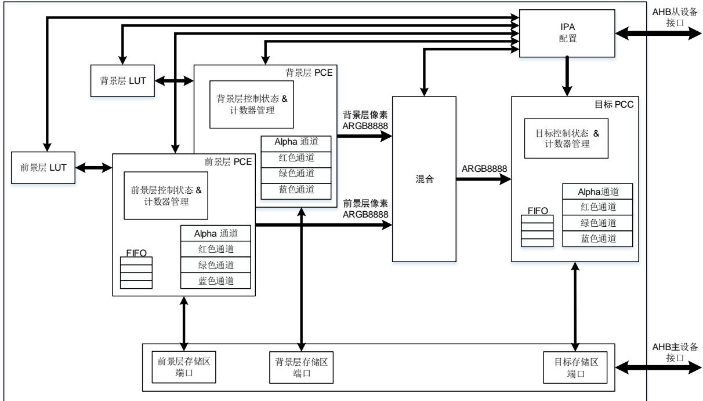

如图15-1. IPA 模块框图所示，IPA包含 6 个主要部分：

- 通过 AHB 从设备接口配置 IPA；

- 通过 AHB 主设备接口访问图像数据；

- 前景层和背景层 LUT；

- 前景层和背景层像素通道扩展（PCE）；

- 前景层和背景层像素混合；

- 目标像素通道压缩（PCC）。

## 15.4. 功能概述

是一个像素格式转换器，它支持多种转换模式，允许用户通过配置 对应寄存器的相应位灵活的配置转换模式，前景层，背景层，目标像素格式及其行偏移。除了 LUT 仅支持 32 位访问外，其他所有 IPA寄存器都可以通过 AHB 从设备接口进行 8 位，16 位或 32 位访问。

IPA 支持 4 种转换模式，它可以通过 IPA_CTL 寄存器的 PFCM 位配置，如表15-1. IPA 转换所示：

- 复制前景层图像到目标图像中

在这种模式中，前景层存储区的像素数据复制到目标存储区而不进行像素转换，所以前景层和目标图像的像素格式没有意义。前景层的像素格式仅定义了每像素的位数。

- 转换前景层图像到目标图像

在这种模式中，前景层的像素数据从前景层的像素格式转换成目标像素格式，然后写入目标存储区中。如果前景层的像素格式是非直接的（L8, AL44, AL88, L4），读取前景层存储区域中的数据作为索引从前景层 LUT 获取像素数据。

- 转换和混合前景层和背景层图像到目标图像

在这种模式中，前景层和背景层的像素数据首先由其原来的格式转换为‘ARGB8888’，然后前景层和背景层像素数据成对的混合并从‘ARGB8888’转换为目标像素格式，写入目标存储区中。

如果前景层的像素格式是非直接的，读取前景层存储区域中的数据作为索引从前景层 LUT获取像素数据。

如果背景层的像素格式是非直接的，读取背景层存储区域中的数据作为索引从背景层 LUT获取像素数据。

- 用特定颜色填充到目标图像中

在这种模式中，目标图像被特定的像素填充，该像素的值被预先定义在对应的目标寄存器中。

表 15-1. IPA 转换模式

<table><tr><td rowspan="2">PFCM[1:0]</td><td colspan="2">转换模式</td><td rowspan="2">像素转换</td><td rowspan="2">混合</td></tr><tr><td>源</td><td>目的</td></tr><tr><td>00</td><td>前景层图像</td><td>目标图像</td><td>否</td><td>否</td></tr><tr><td>01</td><td>前景层图像</td><td>目标图像</td><td>是</td><td>否</td></tr><tr><td>10</td><td>前景层图像和背景层图像</td><td>目标图像</td><td>是</td><td>是</td></tr><tr><td>11</td><td>在寄存器中预定义的像素值</td><td>目标图像</td><td>否</td><td>否</td></tr></table>

## 15.4.1. 传输操作

一次 IPA 操作包含以下 7 个步骤：

1) 从前景层存储区（基地址配置在 IPA_FMADDR 寄存器中）读取数据，如果前景层像素格式是非直接的，则从前景层 LUT 获取像素数据。

2) 扩展前景层像素数据到一个32位的值，并根据IPA_FPCTL寄存器的FAVCA位计算alpha通道的值。

3) 从背景层存储区（基地址配置在 IPA_BMADDR 寄存器中）读取数据，如果背景层像素格式是非直接的，则从背景层 获取像素数据。

4) 扩展背景层像素数据到一个 32 位的值，并根据 IPA_BPCTL 寄存器的 BAVCA 位计算alpha 通道的值。

5) 混合扩展后的前景层和背景层像素数据。

6) 压缩像素数据为 IPA_DPCTL 寄存器 DPF 位指定的目标区像素格式。

7) 将转换后的像素数据写到目标存储区（基地址配置在 IPA_DMADDR 寄存器中）。

针对前景层，背景层和目标层像素数据处理，IPA中提供了 3 个 4 个字深度的 32 位 FIFO。前景层和背景层 FIFO 存储从相对应的源存储区读得的数据，而目标 FIFO 存储处理过的像素数据，当 AHB 总线空闲的时候，这些数据将会被写入目标存储器。

如果 IPA_CTL 寄存器的 PFCM 位域被配置成 ‘00’ 或 ‘01’，只有前景层 FIFO 和目标层 FIFO被激活。如果 IPA的操作为用特定的颜色填充目标图像，则不需要任何一个 FIFO。

## 15.4.2. 前景层和背景层 LUT

IPA提供了两个 LUT 来存储像素值，以便非直接像素格式使用。如果像素格式是非直接的，使能 IPA 传输之前，像素数据必须已经被写入 LUT 中。LUT 中的像素数据可以通过以下两种方法更新：

- 自动加载：

使能 IPA_FPCTL/IPA_BPCTL 寄存器的 FLLEN/BLLEN 位。IPA_FPCTL 或 IPA_BPCTL寄存器的 FCNP 或 BCNP 位定义了要自动加载的像素的数目，它等于 FCNP+1 或BCNP+1。

- 软件编程：

像素数据可直接通过 IPA从设备接口写入相应的 LUT 存储器地址。前景层 LUT 的基地址偏移是 0x0400，背景层 LUT 的基地址偏移是 0x0800。

LUT 支持两种像素格式，分别为‘ARGB8888’和‘RGB888’，由 IPA_FPCTL 或 IPA_BPCTL 寄存器的 FLPF 或 BLPF 位决定，如表15-2. 前景层和背景层CLUT像素格式所示。

表 15-2. 前景层和背景层 CLUT 像素格式

<table><tr><td rowspan="2">BLPF/FLPF</td><td rowspan="2">LUT 像素格式</td><td colspan="4">存储地址</td></tr><tr><td>基地址+0x3</td><td>基地址+0x2</td><td>基地址+0x1</td><td>基地址+0x0</td></tr><tr><td>0</td><td>ARGB8888</td><td>$A_0[7:0]$</td><td>$R_0[7:0]$</td><td>$G_0[7:0]$</td><td>$B_0[7:0]$</td></tr><tr><td rowspan="3">1</td><td rowspan="3">RGB888</td><td>$R_3[7:0]$</td><td>$G_3[7:0]$</td><td>$B_3[7:0]$</td><td>$R_2[7:0]$</td></tr><tr><td>$G_2[7:0]$</td><td>$B_2[7:0]$</td><td>$R_1[7:0]$</td><td>$G_1[7:0]$</td></tr><tr><td>$B_1[7:0]$</td><td>$R_0[7:0]$</td><td>$G_0[7:0]$</td><td>$B_0[7:0]$</td></tr></table>

注意：如果 LUT 的像素格式是‘RGB888’，当自动加载 LUT 的像素数据时，alpha 值为固定的0xFF。

## 15.4.3. 前景层和背景层像素通道扩展（PCE）

若 IPA 传输模式需要进行像素格式转换，前景层或背景层像素数据需要由原来的格式扩展为‘ARGB8888’格式。

IPA_FPCTL 和 IPA_BPCTL 寄存器的 FPF 和 BPF 位定义了前景层和背景层的像素格式。如15-3. 所示。

一个像素包含以下 5 个通道：

- Alpha 通道 A：透明度，0x00：透明的；0xFF：不透明的。

- 红色通道 R：红色值，0x00：没有红色；0xFF：全红色。

- 绿色通道 G：绿色值，0x00：无绿色；0xFF：全绿色。

- 蓝色通道 B：蓝色值，0x00：无蓝色；0xFF：全蓝色。

- 亮度通道：在 IPA 中，亮度通道的值是索引值，从背景层或前景层的 LUT 中获得像素数据。

表 15-3. 前景层和背景层像素格式

<table><tr><td rowspan="2">BPF[2:0]/FPF[2:0]</td><td rowspan="2">像素格式</td><td colspan="4">存储地址</td></tr><tr><td>基地址+0x3</td><td>基地址+0x2</td><td>基地址+0x1</td><td>基地址+0x0</td></tr><tr><td>0000</td><td>ARGB8888</td><td>$A_0$[7:0]</td><td>$R_0$[7:0]</td><td>$G_0$[7:0]</td><td>$B_0$[7:0]</td></tr><tr><td rowspan="3">0001</td><td rowspan="3">RGB888</td><td>$R_3$[7:0]</td><td>$G_3$[7:0]</td><td>$B_3$[7:0]</td><td>$R_2$[7:0]</td></tr><tr><td>$G_2$[7:0]</td><td>$B_2$[7:0]</td><td>$R_1$[7:0]</td><td>$G_1$[7:0]</td></tr><tr><td>$B_1$[7:0]</td><td>$R_0$[7:0]</td><td>$G_0$[7:0]</td><td>$B_0$[7:0]</td></tr><tr><td>0010</td><td>RGB565</td><td>$R_1$[4:0]$G_1$[5:3]</td><td>$G_1$[2:0]$B_1$[4:0]</td><td>$R_0$[4:0]$G_0$[5:3]</td><td>$G_0$[2:0]$B_0$[4:0]</td></tr><tr><td>0011</td><td>ARGB1555</td><td>$A_1$[0]$R_1$[4:0]$G_1$[4:3]</td><td>$G_1$[2:0]$B_1$[4:0]</td><td>$A_0$[0]$R_0$[4:0]$G_0$[4:3]</td><td>$G_0$[2:0]$B_0$[4:0]</td></tr><tr><td>0100</td><td>ARGB4444</td><td>$A_1$[3:0]$R_1$[3:0]</td><td>$G_1$[3:0]$B_1$[3:0]</td><td>$A_0$[3:0]$R_0$[3:0]</td><td>$G_0$[3:0]$B_0$[3:0]</td></tr><tr><td>0101</td><td>L8</td><td>$L_3$[7:0]</td><td>$L_2$[7:0]</td><td>$L_1$[7:0]</td><td>$L_0$[7:0]</td></tr><tr><td>0110</td><td>AL44</td><td>$A_3$[3:0]$L_3$[3:0]</td><td>$A_2$[3:0]$L_2$[3:0]</td><td>$A_1$[3:0]$L_1$[3:0]</td><td>$A_0$[3:0]$L_0$[3:0]</td></tr><tr><td>0111</td><td>AL88</td><td>$A_1$[7:0]</td><td>$L_1$[7:0]</td><td>$A_0$[7:0]</td><td>$L_0$[7:0]</td></tr><tr><td>1000</td><td>L4</td><td>$L_7$[3:0]$L_6$[3:0]</td><td>$L_5$[3:0]$L_4$[3:0]</td><td>$L_3$[3:0]$L_2$[3:0]</td><td>$L_1$[3:0]$L_0$[3:0]</td></tr><tr><td>1001</td><td>A8</td><td>$A_3$[7:0]</td><td>$A_2$[7:0]</td><td>$A_1$[7:0]</td><td>$A_0$[7:0]</td></tr><tr><td>1010</td><td>A4</td><td>$A_7$[3:0]$A_6$[3:0]</td><td>$A_5$[3:0]$A_4$[3:0]</td><td>$A_3$[3:0]$A_2$[3:0]</td><td>$A_1$[3:0]$A_0$[3:0]</td></tr></table>

如果像素格式是‘RGB888’，当扩展像素数据时，alpha 通道值被设置为 0xFF，如图15-2. 从‘RGB888’到‘ARGB8888’像素格式扩展所示。

图 15-2. 从‘RGB888’到‘ARGB8888’像素格式扩展

RGB888 → ARGB8888 

<table><tr><td>R[7]</td><td>R[6]</td><td>R[5]</td><td>R[4]</td><td>R[3]</td><td>R[2]</td><td>R[1]</td><td>R[0]</td></tr><tr><td>G[7]</td><td>G[6]</td><td>G[5]</td><td>G[4]</td><td>G[3]</td><td>G[2]</td><td>G[1]</td><td>G[0]</td></tr><tr><td>B[7]</td><td>B[6]</td><td>B[5]</td><td>B[4]</td><td>B[3]</td><td>B[2]</td><td>B[1]</td><td>B[0]</td></tr></table>

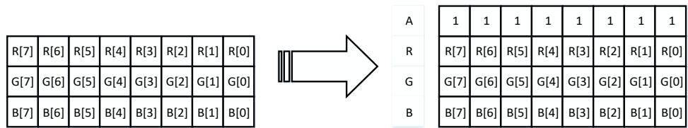

<table><tr><td>1</td><td>1</td><td>1</td><td>1</td><td>1</td><td>1</td><td>1</td></tr><tr><td>R[7]</td><td>R[6]</td><td>R[5]</td><td>R[4]</td><td>R[3]</td><td>R[2]</td><td>R[1]</td></tr><tr><td>G[7]</td><td>G[6]</td><td>G[5]</td><td>G[4]</td><td>G[3]</td><td>G[2]</td><td>G[1]</td></tr><tr><td>B[7]</td><td>B[6]</td><td>B[5]</td><td>B[4]</td><td>B[3]</td><td>B[2]</td><td>B[1]</td></tr></table>

如果像素格式是‘RGB565’，当扩展像素数据时，alpha 通道值等于 0xFF。红绿蓝通道值扩展到 8 位，扩展后高位为通道值，通道值的高位值填充到低位。如图 15-3. 从‘RGB565’到‘ARGB8888’像素格式扩展所示。

图 15-3. 从‘RGB565’到‘ARGB8888’像素格式扩展

RGB565 → ARGB8888 

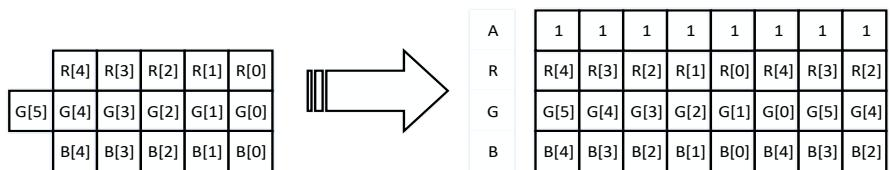

<table><tr><td>1</td><td>1</td><td>1</td><td>1</td><td>1</td><td>1</td><td>1</td><td>1</td></tr><tr><td>R[4]</td><td>R[3]</td><td>R[2]</td><td>R[1]</td><td>R[0]</td><td>R[4]</td><td>R[3]</td><td>R[2]</td></tr><tr><td>G[5]</td><td>G[4]</td><td>G[3]</td><td>G[2]</td><td>G[1]</td><td>G[0]</td><td>G[5]</td><td>G[4]</td></tr><tr><td>B[4]</td><td>B[3]</td><td>B[2]</td><td>B[1]</td><td>B[0]</td><td>B[4]</td><td>B[3]</td><td>B[2]</td></tr></table>

如果像素格式是‘ARGB1555’或‘ARGB4444’，每通道值将扩展到 8 位，扩展后高位为通道值，通道值的高位值填充到低位。如图15-4. 从‘ARGB1555’或‘ARGB4444’到‘ARGB8888’像素格所示。

## 图 15-4. 从‘ARGB1555’或‘ARGB4444’到‘ARGB8888’像素格式扩展

ARGB1555→ARGB8888

<table><tr><td colspan="4"></td><td>A[0]</td></tr><tr><td>R[4]</td><td>R[3]</td><td>R[2]</td><td>R[1]</td><td>R[0]</td></tr><tr><td>G[4]</td><td>G[3]</td><td>G[2]</td><td>G[1]</td><td>G[0]</td></tr><tr><td>B[4]</td><td>B[3]</td><td>B[2]</td><td>B[1]</td><td>B[0]</td></tr></table>

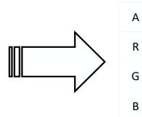

<table><tr><td>A[0]</td><td>A[0]</td><td>A[0]</td><td>A[0]</td><td>A[0]</td><td>A[0]</td><td>A[0]</td><td>A[0]</td></tr><tr><td>R[4]</td><td>R[3]</td><td>R[2]</td><td>R[1]</td><td>R[0]</td><td>R[4]</td><td>R[3]</td><td>R[2]</td></tr><tr><td>G[4]</td><td>G[3]</td><td>G[2]</td><td>G[1]</td><td>G[0]</td><td>G[4]</td><td>G[3]</td><td>G[2]</td></tr><tr><td>B[4]</td><td>B[3]</td><td>B[2]</td><td>B[1]</td><td>B[0]</td><td>B[4]</td><td>B[3]</td><td>B[2]</td></tr></table>

·ARGB4444→ ARGB8888 

<table><tr><td>A[3]</td><td>A[2]</td><td>A[1]</td><td>A[0]</td></tr><tr><td>R[3]</td><td>R[2]</td><td>R[1]</td><td>R[0]</td></tr><tr><td>G[3]</td><td>G[2]</td><td>G[1]</td><td>G[0]</td></tr><tr><td>B[3]</td><td>B[2]</td><td>B[1]</td><td>B[0]</td></tr></table>

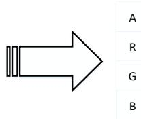

<table><tr><td>A[3]</td><td>A[2]</td><td>A[1]</td><td>A[0]</td><td>A[3]</td><td>A[2]</td><td>A[1]</td><td>A[0]</td></tr><tr><td>R[3]</td><td>R[2]</td><td>R[1]</td><td>R[0]</td><td>R[3]</td><td>R[2]</td><td>R[1]</td><td>R[0]</td></tr><tr><td>G[3]</td><td>G[2]</td><td>G[1]</td><td>G[0]</td><td>G[3]</td><td>G[2]</td><td>G[1]</td><td>G[0]</td></tr><tr><td>B[3]</td><td>B[2]</td><td>B[1]</td><td>B[0]</td><td>B[3]</td><td>B[2]</td><td>B[1]</td><td>B[0]</td></tr></table>

如果像素格式是‘L8’或‘ $^ { . 4 ; 8 }$ 位亮度通道值（当像素格式为‘L4’，高位补 0）作为索引值从 LUT获得像素数据。

如果像素格式是‘AL44’,8 位亮度通道值（高位补 0）作为索引值从 LUT 获得红、绿、蓝通道值。Alpha 通道值将扩展到 8 位，扩展后高位为通道值，填充通道值的高位值到低位。

如果像素格式是‘AL88’，只有红，绿，蓝通道值通过 8 位亮度通道从 LUT 获得。

如果像素格式是‘A8’，红，绿，蓝通道值分别等于 IPA_FPV 寄存器的 FPDRV，FPDGV 位以及 FPDBV 位（或 IPA_BPV 寄存器的 BPDRV 位，BPDGV 位以及 BPDBV 位）。

如果像素格式是‘A4’，Alpha 通道值将扩展到 8 位，扩展后高位为通道值，填充通道的高位值到低位。红，绿，蓝通道值分别等于 IPA_FPV 寄存器的 FPDRV，FPDGV 位以及 FPDBV 位（或 IPA_BPV 寄存器的 BPDRV 位，BPDGV 位以及 BPDBV 位）。

IPA 支持通过 3 种算法调制 alpha 通道值，由 IPA_FPCTL 或 IPA_BPCTL 寄存器的 FAVCA或 BAVCA 位决定。如表15-4. Alpha 通道值调制所述。

表 15-4. Alpha 通道值调制

<table><tr><td>FAVCA/BAVCA[1:0]</td><td>alpha 计算法</td></tr><tr><td>00/11</td><td>无影响,等于原来的值</td></tr><tr><td>01</td><td>等于 IPA_FPCTL 或 IPA_BPCTL 寄存器 FPDAV 或 BPDAV 位的值</td></tr><tr><td>10</td><td>等于 FPDAV 或 BPDAV 位的值乘以原来 alpha 的值再除以 255</td></tr></table>

## 15.4.4. 混合

若 IPA的传输模式需要进行像素混合时，扩展之后的前景层和背景层像素数据需要成对的混合并获得一个 32 位像素值。

Alpha 通道值的混合基于下面的公式 $( A _ { F }$ 是前景层 alpha 值， $A _ { B }$ 是背景层 alpha 值）：

$$
\begin{array}{c} {A _ {m i x} = \frac {A _ {F} \times A _ {B}}{2 5 5}} \\ {A _ {b l e n d} = A _ {F} + A _ {B} - A _ {m i x}} \end{array}
$$

红，绿，蓝通道值的混合基于下面的公式 $( R _ { F } , G _ { F } , B _ { F }$ 是前景层的红，绿，蓝值; $R _ { B } , G _ { B } , B _ { B }$ 是

背景层的红，绿，蓝值）：

$$
\begin{array}{r} R _ {b l e n d} = \frac {R _ {F} \times A _ {F} + R _ {B} \times A _ {B} - R _ {B} \times A _ {m i x}}{A _ {b l e n d}} \\ G _ {b l e n d} = \frac {G _ {F} \times A _ {F} + G _ {B} \times A _ {B} - G _ {B} \times A _ {m i x}}{A _ {b l e n d}} \\ B _ {b l e n d} = \frac {B _ {F} \times A _ {F} + B _ {B} \times A _ {B} - B _ {B} \times A _ {m i x}}{A _ {b l e n d}} \end{array}
$$

注意：1)上述公式中的除法结果是向下取整。2)如果 $A _ { b I e n d }$ 等于 0， $R _ { b I e n d }$ $\widehat { G } _ { b I e n d }$ 和 $B _ { b I e n d }$ 等于‘0xFF’。

## 15.4.5. 目标像素通道压缩（PCC）

如果在 IPA传输模式需要进行像素转换，在像素数据写入目标存储区之前，需要由‘ARGB8888压缩为目标像素格式。

IPA_DPCTL 寄存器的 DPF 位定义了目标图像的像素格式。如表15-5. 目标像素格式所示。

表 15-5. 目标像素格式

<table><tr><td rowspan="2">DPF[2:0]</td><td rowspan="2">像素格式</td><td colspan="4">存储地址</td></tr><tr><td>基地址+0x3</td><td>基地址+0x2</td><td>基地址+0x1</td><td>基地址+0x0</td></tr><tr><td>000</td><td>ARGB8888</td><td>$A_0$[7:0]</td><td>$R_0$[7:0]</td><td>$G_0$[7:0]</td><td>$B_0$[7:0]</td></tr><tr><td rowspan="3">001</td><td rowspan="3">RGB888</td><td>$R_3$[7:0]</td><td>$G_3$[7:0]</td><td>$B_3$[7:0]</td><td>$R_2$[7:0]</td></tr><tr><td>$G_2$[7:0]</td><td>$B_2$[7:0]</td><td>$R_1$[7:0]</td><td>$G_1$[7:0]</td></tr><tr><td>$B_1$[7:0]</td><td>$R_0$[7:0]</td><td>$G_0$[7:0]</td><td>$B_0$[7:0]</td></tr><tr><td>010</td><td>RGB565</td><td>$R_1$[4:0]$G_1$[5:3]</td><td>$G_1$[2:0]$B_1$[4:0]</td><td>$R_0$[4:0]$G_0$[5:3]</td><td>$G_0$[2:0]$B_0$[4:0]</td></tr><tr><td>011</td><td>ARGB1555</td><td>$A_1$[0]$R_1$[4:0]$G_1$[4:3]</td><td>$G_1$[2:0]$B_1$[4:0]</td><td>$A_0$[0]$R_0$[4:0]$G_0$[4:3]</td><td>$G_0$[2:0]$B_0$[4:0]</td></tr><tr><td>100</td><td>ARGB4444</td><td>$A_1$[3:0]$R_1$[3:0]</td><td>$G_1$[3:0]$B_1$[3:0]</td><td>$A_0$[3:0]$R_0$[3:0]</td><td>$G_0$[3:0]$B_0$[3:0]</td></tr></table>

注意：如果 IPA_CTL 寄存器的 PFCM 位等于 $\because 0 0 ^ { \prime }$ （拷贝前景层图像到目标图像），DPF 位无意义，IPA_FPCTL 寄存器的 FPF 位决定了源图像和目标图像每像素的位数。

如图15-5. 像素压缩所示，目标像素通道压缩通过丢弃低位实现。

图 15-5. 像素压缩

ARGB8888 → RGB888

<table><tr><td>A[7]</td><td>A[6]</td><td>A[5]</td><td>A[4]</td><td>A[3]</td><td>A[2]</td><td>A[1]</td><td>A[0]</td></tr><tr><td>R[7]</td><td>R[6]</td><td>R[5]</td><td>R[4]</td><td>R[3]</td><td>R[2]</td><td>R[1]</td><td>R[0]</td></tr><tr><td>G[7]</td><td>G[6]</td><td>G[5]</td><td>G[4]</td><td>G[3]</td><td>G[2]</td><td>G[1]</td><td>G[0]</td></tr><tr><td>B[7]</td><td>B[6]</td><td>B[5]</td><td>B[4]</td><td>B[3]</td><td>B[2]</td><td>B[1]</td><td>B[0]</td></tr></table>

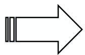

<table><tr><td>R[7]</td><td>R[6]</td><td>R[5]</td><td>R[4]</td><td>R[3]</td><td>R[2]</td><td>R[1]</td><td>R[0]</td></tr><tr><td>G[7]</td><td>G[6]</td><td>G[5]</td><td>G[4]</td><td>G[3]</td><td>G[2]</td><td>G[1]</td><td>G[0]</td></tr><tr><td>B[7]</td><td>B[6]</td><td>B[5]</td><td>B[4]</td><td>B[3]</td><td>B[2]</td><td>B[1]</td><td>B[0]</td></tr></table>

ARGB8888 → RGB565 

<table><tr><td>A[7]</td><td>A[6]</td><td>A[5]</td><td>A[4]</td><td>A[3]</td><td>A[2]</td><td>A[1]</td><td>A[0]</td></tr><tr><td>R[7]</td><td>R[6]</td><td>R[5]</td><td>R[4]</td><td>R[3]</td><td>R[2]</td><td>R[1]</td><td>R[0]</td></tr><tr><td>G[7]</td><td>G[6]</td><td>G[5]</td><td>G[4]</td><td>G[3]</td><td>G[2]</td><td>G[1]</td><td>G[0]</td></tr><tr><td>B[7]</td><td>B[6]</td><td>B[5]</td><td>B[4]</td><td>B[3]</td><td>B[2]</td><td>B[1]</td><td>B[0]</td></tr></table>

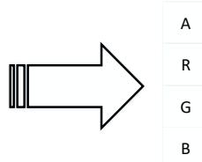

<table><tr><td></td><td>R[7]</td><td>R[6]</td><td>R[5]</td><td>R[4]</td><td>R[3]</td></tr><tr><td>G[7]</td><td>G[6]</td><td>G[5]</td><td>G[4]</td><td>G[3]</td><td>G[2]</td></tr><tr><td></td><td>B[7]</td><td>B[6]</td><td>B[5]</td><td>B[4]</td><td>B[3]</td></tr></table>

ARGB8888 → ARGB1555 

<table><tr><td>A[7]</td><td>A[6]</td><td>A[5]</td><td>A[4]</td><td>A[3]</td><td>A[2]</td><td>A[1]</td><td>A[0]</td></tr><tr><td>R[7]</td><td>R[6]</td><td>R[5]</td><td>R[4]</td><td>R[3]</td><td>R[2]</td><td>R[1]</td><td>R[0]</td></tr><tr><td>G[7]</td><td>G[6]</td><td>G[5]</td><td>G[4]</td><td>G[3]</td><td>G[2]</td><td>G[1]</td><td>G[0]</td></tr><tr><td>B[7]</td><td>B[6]</td><td>B[5]</td><td>B[4]</td><td>B[3]</td><td>B[2]</td><td>B[1]</td><td>B[0]</td></tr></table>

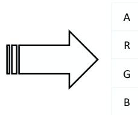

<table><tr><td colspan="4"></td><td>A[7]</td></tr><tr><td>R[7]</td><td>R[6]</td><td>R[5]</td><td>R[4]</td><td>R[3]</td></tr><tr><td>G[7]</td><td>G[6]</td><td>G[5]</td><td>G[4]</td><td>G[3]</td></tr><tr><td>B[7]</td><td>B[6]</td><td>B[5]</td><td>B[4]</td><td>B[3]</td></tr></table>

ARGB8888 → ARGB4444 

<table><tr><td>A[7]</td><td>A[6]</td><td>A[5]</td><td>A[4]</td><td>A[3]</td><td>A[2]</td><td>A[1]</td><td>A[0]</td></tr><tr><td>R[7]</td><td>R[6]</td><td>R[5]</td><td>R[4]</td><td>R[3]</td><td>R[2]</td><td>R[1]</td><td>R[0]</td></tr><tr><td>G[7]</td><td>G[6]</td><td>G[5]</td><td>G[4]</td><td>G[3]</td><td>G[2]</td><td>G[1]</td><td>G[0]</td></tr><tr><td>B[7]</td><td>B[6]</td><td>B[5]</td><td>B[4]</td><td>B[3]</td><td>B[2]</td><td>B[1]</td><td>B[0]</td></tr></table>

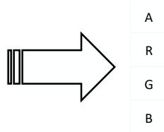

<table><tr><td>A[7]</td><td>A[6]</td><td>A[5]</td><td>A[4]</td></tr><tr><td>R[7]</td><td>R[6]</td><td>R[5]</td><td>R[4]</td></tr><tr><td>G[7]</td><td>G[6]</td><td>G[5]</td><td>G[4]</td></tr><tr><td>B[7]</td><td>B[6]</td><td>B[5]</td><td>B[4]</td></tr></table>

## 15.4.6. 内部定时器

为了减少 IPA 使用的 AHB 总线的带宽，在 IPA 传输与 LUT 自动加载时，IPA 会自动在两个连续的 AHB请求之间插入若干时钟周期，这个功能通过一个内部定时器实现。

置位 C 寄存器的 位，内部寄存器使能； C 寄存器的 CC 位决定了插入的时钟周期数的最小值。若内部定时器没有使能，NCCI 没有意义。

当 IPA 传输或 LUT 自动加载正在进行时，若改变 NCCI 的值，对内部计数器的当前计数没有影响，从下次计数有作用；如图15-6. 内部定时器操作所示。

图 15-6. 内部定时器操作

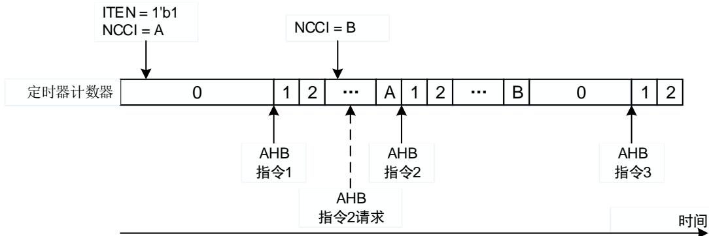

## 15.4.7. 行标记

软件可通过标记行号来了解当前 IPA 传输的进度，被标记的行号可以通过 IPA_LM 寄存器的LM 位配置。当且仅当标记行的最后一个像素数据被写入目标存储区时，IPA_INTF 寄存器中的TLMIF 位会被置起。

注意：如果 LM 位等于 0，无标志位置位.

## 15.4.8. 传输流

软件置位 IPA_FPCTL/IPA_BPCTL 寄存器的 FLLEN/BLLEN 位，前景层或背景层 LUT 开始自动加载。一旦 LUT 自动加载开始，FLLEN/BLLEN 位变为传输标志位，用于指示 LUT 自动加载是否完成，且软件向其写 0 没有意义；当加载完成时，FLLEN/BLLEN 位会被自动清 0。

软件置位 IPA_CTL 寄存器的 TEN 位，IPA 开始传输。一旦传输开始，TEN 位变为传输标志位，用于指示 IPA 传输是否完成，且软件向其写 0 没有意义；当传输完成时，TEN 位会被自动清0。

在 IPA 传输或 LUT 自动加载正在工作时，软件可通过置位 IPA_CTL 寄存器的 THU 位挂起当前传输；当软件清除 THU 位后，传输继续。若无前景层/背景层 LUT 自动加载和 IPA传输使能时，设置 THU 位无影响，读该位的值为 0。

通过置位 IPA_CTL 寄存器的 TST 位可以停止前景层/背景层 LUT 自动加载和 IPA 传输。复位IPA_FPCTL/IPA_BPCTL 寄存器的 FLLEN/BLLEN 位或 IPA_CTL 寄存器的 TEN 位可以让 LUT加载或 IPA 传输立即停止，即使 IPA 传输或 LUT 自动加载正在工作或挂起。当当前的传输停止的后，TST 位自动复位。若无前景层/背景层 LUT 自动加载和 IPA 传输使能时，设置 TST 位无影响，读该位的值为 0。

前景层 LUT 自动加载，背景层 LUT 自动加载和 IPA 传输同一时间只能有一个在工作。例如，当 IPA 传输正在进行的时候，若软件置位 FLLEN 或 BLLEN 位，前景层或背景层 LUT 自动加载不会启动，且 FLLEN 或 BLLEN 位自动复位。

## 15.4.9. 配置

开始任何传输之前，软件需要读 TEN，FLLEN 和 BLLEN 位检查是否有 IPA传输或 LUT 加载正在工作。如果有任何一个正在进行，可以设置 TST 位使其停止或等待其完成。当读取 TEN，FLLEN 和 BLLEN 的值都为 0 时，可以开始一个新的传输。

## 前景层 LUT 加载

当开始一个新的前景层 LUT 加载的时候，建议按如下步骤进行：

1. 配置 IPA_FLMADDR 寄存器设置前景层 LUT 存储区基地址；

2. 配置 IPA_FPCTL 寄存器的 FLPF 位设置前景层 LUT 像素格式；

3. 配置 IPA_FPCTL 寄存器的 FCNP 位设置前景层 LUT 要加载的像素数目；

4. 配置 IPA_CTL 寄存器的错误配置中断，LUT 加载完成中断，LUT 访问冲突中断和传输访问错误中断使能位；

5. 配置 IPA_FPCTL 寄存器的 FLLEN 位为‘1’以使能前景层 LUT 的自动加载。

## 背景层 LUT 加载

当开始一个新的背景层 LUT 加载的时候，建议按如下步骤进行：

1. 配置 IPA_BLMADDR 寄存器设置背景层 LUT 存储区基地址；

2. 配置 IPA_BPCTL 寄存器的 BLPF 位设置背景层 LUT 像素格式；

3. 配置 IPA_BPCTL 寄存器的 BCNP 位设置背景层 LUT 要加载的像素数目；

4. 配置 IPA_CTL 寄存器的错误配置中断，LUT 加载完成中断，LUT 访问冲突中断和传输访问错误中断使能位；

5. 配置 IPA_FPCTL 寄存器的 FLLEN 位为‘1’以使能背景层 LUT 的自动加载。

## IPA 传输

当开始一个新的 IPA 传输的时候，对应不同像素转换模式的配置步骤如下所示：

## 复制前景层图像到目标图像

1. 配置 IPA_FMADDR 和 IPA_DMADDR 寄存器设置前景层和目标层存储区基地址；

2. 配置 IPA_FPCTL 寄存器的 FPF 位设置前景层像素格式；

3. 配置 IPA_FLOFF 和 IPA_DLOFF 寄存器的 FLOFF 和 DLOFF 位设置前景层和目标层行偏移；

4. 配置 IPA_LM 寄存器的 LM 位设置行标记；

5. 配置 IPA_IMS 寄存器的 WIDTH 和 HEIGHT 位设置图像大小；

6. 配置 IPA_CTL 寄存器的错误配置中断，LUT 加载完成中断，LUT 访问冲突中断和传输访问错误中断使能位；

7. 配置 IPA_CTL 寄存器的 TEN 位为‘1’以使能 IPA 传输。

## 转换前景层图像到目标图像

如果前景层像素格式是非直接的，像素数据应在开始 IPA传输之前加载到前景层 LUT。LUT 的自动加载过程可参考前景层LUT加载。

1. 配置 IPA_FMADDR 和 IPA_DMADDR 寄存器设置前景层和目标存储区基地址；

2. 配置 IPA_FPCTL 寄存器的 FAVCA 和 FPF 位设置前景层 alpha 值的计算方法和前景层像素格式；

3. 配置 IPA_FPCTL 和 IPA_FPV寄存器设置预定义像素值，包括 alpha，红，绿，蓝颜色值；

4. 配置 IPA_DPCTL 寄存器的 DPF 位设置目标像素格式；

5. 配置 IPA_FLOFF 和 IPA_DLOFF 寄存器的 FLOFF 和 DLOFF 位设置前景层和目标层行偏移；

6. 配置 IPA_LM 寄存器的 LM 位设置行标记；

7. 配置 IPA_IMS 寄存器的 WIDTH 和 HEIGHT 位设置图像大小；

8. 配置 IPA_CTL 寄存器的错误配置中断，LUT 加载完成中断，LUT 访问冲突中断和传输访问错误中断使能位；

9. 配置 IPA_CTL 寄存器的 TEN 位为‘1’以使能 IPA 传输。

## 转换并混合前景层和背景层图像到目标图像

如果前景层和背景层像素格式是非直接的，开始 IPA传输之前，像素数据必须被加载到对应的LUT。前景层和背景层 LUT 的自动加载过程可参考前景层LUT加载和背景层LUT加载。

1. 配置 IPA_FMADDR, IPA_BMADDR 和 IPA_DMADDR 寄存器设置前景层，背景层和目标存储区基地址；

2. 配置 IPA_FPCTL 寄存器的 FAVCA 和 FPF 位设置前景层 alpha 值的计算方法和前景层像素格式；

3. 配置 IPA_FPCTL 和 IPA_FPV寄存器设置预定义像素值，包括 alpha，红，绿，蓝颜色值；

4. 配置 IPA_BPCTL 寄存器的 BAVCA 和 BPF 位设置背景层 alpha 值的计算方法和背景层像素格式；

5. 配置 IPA_BPCTL 和 IPA_BPV寄存器设置预定义像素值，包括 alpha，红，绿，蓝颜色值；

6. 配置 IPA_DPCTL 寄存器的 DPF 位设置目标像素格式；

7. 配置 IPA_FLOFF, IPA_BLOFF 和 IPA_DLOFF 寄存器的 FLOFF、BLOFF 和 DLOFF，设置背景层，前景层和目标的行偏移；

8. 配置 IPA_LM 寄存器的 LM 位设置行标记；

9. 配置 IPA_IMS 寄存器的 WIDTH 和 HEIGHT 位设置图像大小；

10. 配置 IPA_CTL 寄存器的错误配置中断，LUT 加载完成中断，LUT 访问冲突中断和传输访问错误中断使能位；

11. 配置 IPA_CTL 寄存器的 TEN 位为‘1’以使能 IPA 传输。

## 用特定的颜色填充目标图像

1. 配置 IPA_DMADDR 寄存器设置目标存储区的基地址；

2. 配置 IPA_DPCTL 寄存器的 DPF 设置目标像素格式；

3. 配置 IPA_DPV 寄存器设置目标区预定义像素值，包括 alpha，红，绿，蓝颜色值；

4. 配置 IPA_DLOFF 寄存器的 DLOFF 设置目标的行偏移；

5. 配置 IPA_LM 寄存器的 LM 位设置行标记；

6. 配置 IPA_IMS 寄存器的 WIDTH 和 HEIGHT 位设置图像大小；

7. 配置 IPA_CTL 寄存器的错误配置中断，LUT 加载完成中断，LUT 访问冲突中断和传输访问错误中断使能位；

8. 配置 IPA_CTL 寄存器的 TEN 位为‘1’以使能 IPA 传输。

## 配置规则

IPA配置必须遵守一些规则，否则在它使能之后，传输或加载将会自动复位，IPA_INTF 寄存器

的WCFIF 位将会立即置位。规则描述如下：

当前景层 LUT 自动加载使能：

当 IPA_FPCTL 寄存器的 FLPF 位等于 0 时，寄存器 IPA_FLMADDR 的 FLMADDR 位必须是 32 位对齐的。

当背景层 LUT 自动加载使能：

当 IPA_BPCTL 寄存器的 BLPF 位等于 0 时，寄存器 IPA_BLMADDR 的 BLMADDR 位必须是 32 位对齐的。

当 IPA 传输使能：

1) 当 IPA_FPCTL 寄存器的 FPF 位是‘ARGB8888’时，IPA_FMADDR 寄存器的 FMADDR位必须是 32 位对齐。当 FPF 是 ‘RGB565’, ‘ARGB1555’, ‘ARGB4444’ 或 ‘AL88’，必须是 16 位对齐。

2) 当 IPA_FPCTL 寄存器的 FPF 位是 A4 或 L4 时，IPA_FLOFF 寄存器的 FLOFF 位必须是偶数。

3) 当 IPA_BPCTL 寄存器的 BPF 是 ‘ARGB8888’时，IPA_BMADDR 寄存器的 BMADDR 位必须是 32 位对齐。当 BPF 是 ‘RGB565’, ‘ARGB1555’, ‘ARGB4444’ 或 ‘AL88’，必须是16 位对齐。

4) 当 IPA_BPCTL 寄存器的 BPF 位是 A4 或 L4 时，IPA_BLOFF 寄存器的 BLOFF 位必须是偶数。

5) IPA_FPCTL 寄存器的 FPF 位必须小于或等于‘0b1010’。

6) IPA_BPCTL 寄存器的 BPF 位必须小于或等于‘0b1010’。

7) IPA_DPCTL 寄存器的 DPF 位必须小于或等于‘0b100’。

8) 当 IPA_DPCTL 寄存器的 DPF 是 ‘ARGB8888’时，IPA_ DMADDR 寄存器的 DMADDR位必须是 32 位对齐。当 DPF 是‘RGB565’, ‘ARGB1555’, ‘ARGB4444’ 或 ‘AL88’，必须是 16 位对齐。

9) 当 IPA_FPCTL 寄存器的 FPF 位是 A4 或 L4 时，IPA_DLOFF 寄存器的 DLOFF 位必须是偶数。

10) 当 IPA_FPCTL 寄存器的 FPF 位是 A4 或 L4 时，IPA_IMS 寄存器的 WIDTH 位必须是偶数。

11) 当 IPA_BPCTL 寄存器的 BPF 位是 A4 或 L4 时，IPA_IMS 寄存器的 WIDTH 位必须是偶数。

12) IPA_IMS 寄存器的 WIDTH 位必须大于 0。

13) IPA_IMS 寄存器的 HEIGHT 位必须大于 0。

当 PFCM 位等于‘00’，仅考虑 1)、2)、5)、9)、10)、12)、13)。

当 PFCM 位等于‘01’，仅考虑 1)、2)、5)、7)、8)、10)、12)、13)。

当 PFCM 位等于‘10’，除了 10) 所有的规则都考虑。

当 PFCM 位等于‘11’，仅考虑 12)、13)。

## 15.5. 中断

有 个中断事件连接到 中断，包括错误配置中断， 加载完成中断， 访问冲突中断，传输行标记中断，传输完成中断和传输访问错误中断。任何一个中断事件发生都将产生一

个 IPA 中断。

每一个中断事件在 IPA_INTF 寄存器有一个专用的状态位，在 IPA_INTC 寄存器有一个专门的清除位，在 IPA_CTL 寄存器有一个专用的使能位。相应位之间的关系如表15-6. IPA 中断事件所述。

表 15-6. IPA 中断事件

<table><tr><td rowspan="2">中断事件</td><td>状态位</td><td>使能位</td><td>清除位</td></tr><tr><td>IPA_INTF</td><td>IPA_CTL</td><td>IPA_INTC</td></tr><tr><td>配置错误中断</td><td>WCFIF</td><td>WCFIE</td><td>WCFIFC</td></tr><tr><td>LUT加载完成中断</td><td>LLFIF</td><td>LLFIE</td><td>LLFIFC</td></tr><tr><td>LUT访问冲突中断</td><td>LACIF</td><td>LACIE</td><td>LACIFC</td></tr><tr><td>传输行标记中断</td><td>TLMIF</td><td>TLMIE</td><td>TLMIFC</td></tr><tr><td>全传输完成中断</td><td>FTFIF</td><td>FTFIE</td><td>FTFIFC</td></tr><tr><td>传输访问错误中断</td><td>TAEIF</td><td>TAEIE</td><td>TAEIFC</td></tr></table>

## 配置错误中断

当 LUT 加载或 IPA 传输被使能之后，若配置规则小节列出的任何一个配置规则被破坏，配置错误中断状态位将立即置位。LUT 加载或 IPA 传输将自动停止且不产生任何访问操作。

当配置错误中断状态位被置位并且相应使能位使能时，将产生一个 IPA中断。

## LUT加载完成中断

当最后一个像素数据被写入到前景层或背景层 LUT 后，LUT 加载完成中断状态状态位将立即置位，在加载期间的停止操作不能置位 LUT 加载完成中断状态位。

当 LUT 加载完成中断状态位被置位并且相应使能位使能，将产生一个 IPA 中断。

## LUT访问冲突中断

当通过软件访问前景层和背景层 LUT 时，必须遵守以下规则：

当前景层 LUT 自动加载时，禁止软件访问前景层 LUT；

当背景层 LUT 自动加载时，禁止软件访问背景层 LUT；

当配置 IPA 传输模式 PFCM 位等于 ‘01’ 或 ‘10’时，如果前景层像素格式是非直接的，在IPA传输正在进行时，禁止软件访问前景层 LUT；

当配置 IPA 传输模式 PFCM 位等于‘10’时，如果背景层像素格式是非直接的，在 IPA传输正在进行时，禁止软件访问背景层 LUT。

当违背上述规则之一时，LUT 访问冲突中断状态位置位，且软件访问无作用（写访问不被执行，读访问返回一个无效值）。

当 LUT 访问冲突中断状态位寄存器被置位并且相应使能位使能时，将产生一个 IPA中断。

## 传输行标记中断

当标记行的最后一个像素数据被写入目标存储区后，传输行标记中断状态位立即置位。如果IPA_LM 的 LM 位等于 0，在 IPA传输期间，传输行标记中断状态位不置位。

当传输行标记中断状态位被置位并且相应使能位使能时，将产生一个 IPA 中断。

## 传输完成中断

当最后一个像素数据被写入目标存储区后，传输完成中断状态位立即置位。在 IPA 传输期间的停止操作不置位传输完成中断状态位。

当传输完成中断状态位被置位并且相应使能位使能时，将产生一个 IPA中断。

## 传输访问错误中断

当 IPA 访问的地址超出允许的地址，IPA 将收到一个错误反馈；传输（LUT 加载或 IPA 传输）将被立即禁止并且没有 LUT 加载完成中断状态位或传输完成中断状态位置位。IPA 允许和禁止的访问区域在图15-7. IPA 的系统连接中列出。

当传输访问错误中断状态位被置位并且相应使能位使能时，将产生一个 IPA 中断。

图 15-7. IPA 的系统连接

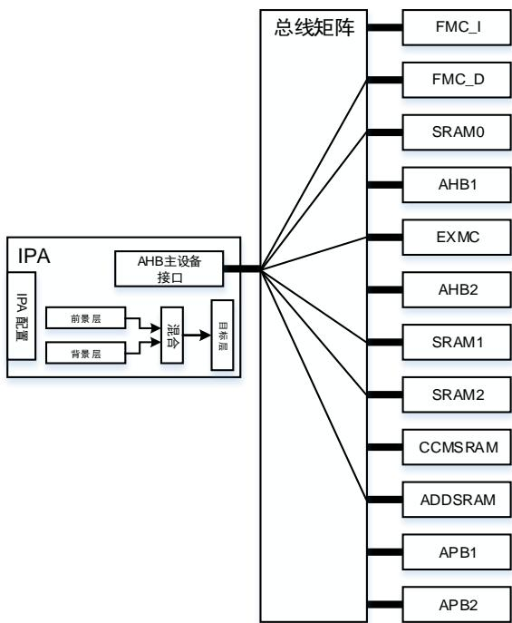
