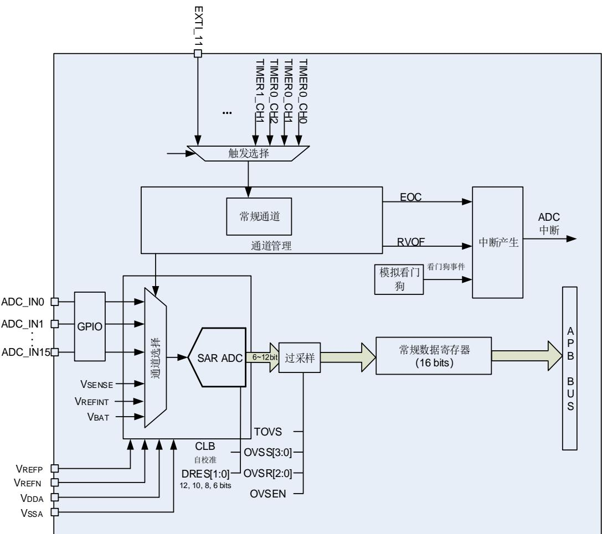
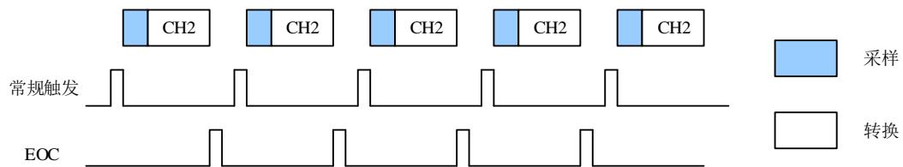
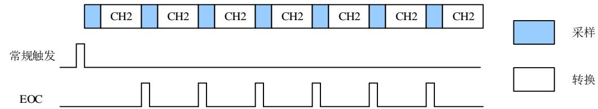
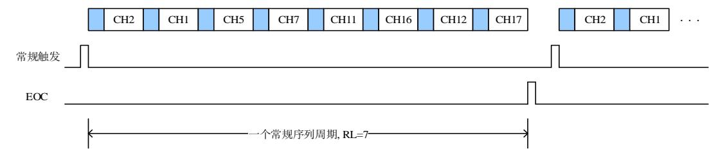
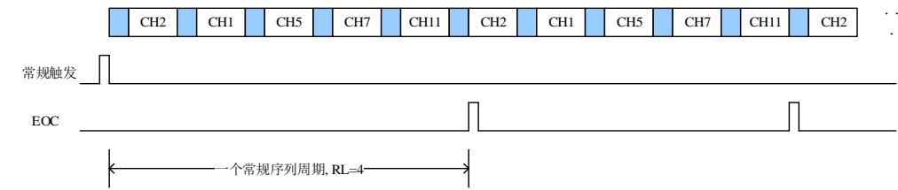
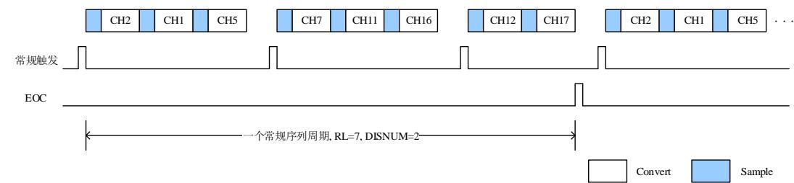
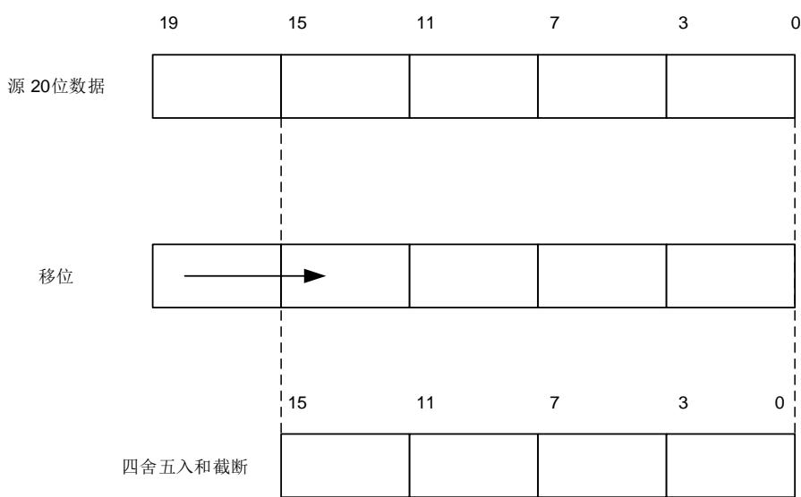
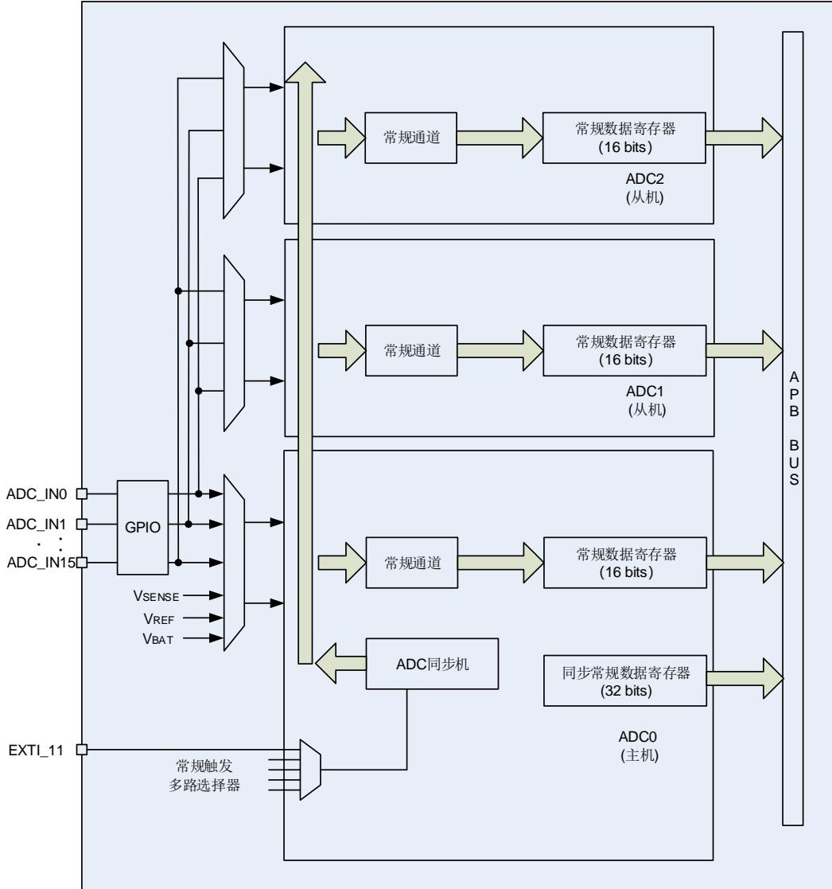
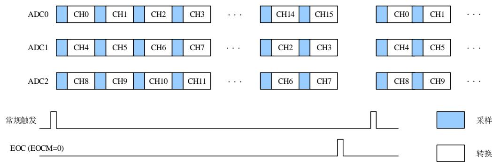
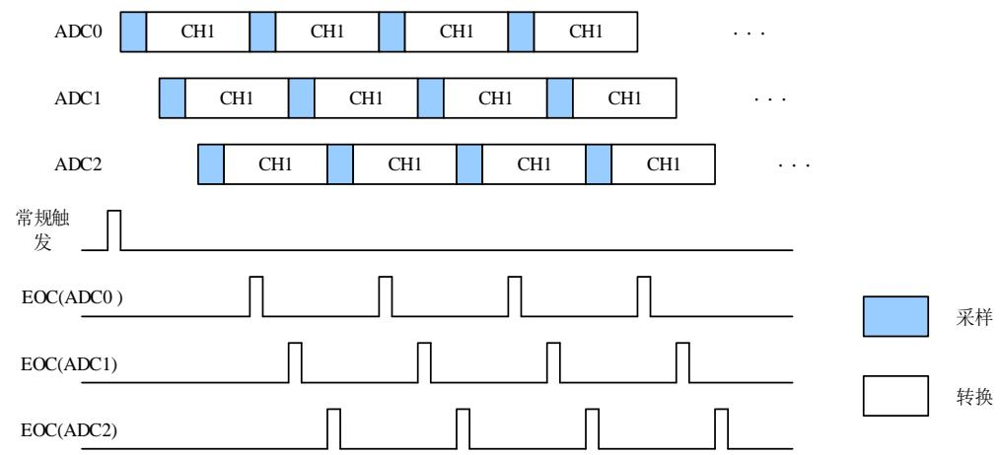

## 18. 模数转换器（ADC）

## 18.1. 简介

MCU 片上集成了 12 位逐次逼近式模数转换器模块（ADC），可以采样来自于 16 个外部通道和 个内部通道和一个电池电压（ ）通道的模拟信号。这 个 采样通道都支持多种运行模式，采样转换后，转换结果可以按照最低有效位对齐或最高有效位对齐的方式保存在相应的数据寄存器中。片上的硬件过采样机制可以通过减少来自 MCU 的相关计算负担来提高性能。对于电机、电源等对 C 有更高需求的应用，可以联系我们的销售，获取更多的 C 详细资料。

## 18.2. 主要特征

- 高性能：

ADC采样分辨率：12位、10位、8位、或者6位分辨率；

ADC采样率：12位分辨率为2.6 MSPs，10位分辨率为3.0 MSPs。分辨率越低，转换越快；

自校准时间：131个ADC时钟周期；

可编程采样时间；

数据存储模式：最高有效位对齐和最低有效位对齐；

DMA请求。

- 模拟输入通道：

16个外部模拟输入通道；

1个内部温度传感通道(VSENSE)；

1个内部参考电压输入通道(VREFINT)；

1个外部监测电池V 供电引脚输入通道。

- 转换开始的发起：

– 软件触发；

硬件触发。

- 运行模式：

转换单个通道，或者扫描一序列的通道；

– 单次运行模式，每次触发转换一次选择的输入通道；

连续运行模式，连续转换所选择的输入通道；

– 间断运行模式；

同步模式（适用于具有两个或多个ADC的设备）。

- 转换结果阈值监测器功能：模拟看门狗。

- 中断产生：

常规转换结束；

– 模拟看门狗事件；

– 溢出事件。

- 过采样：

16位的数据寄存器；

可调整的过采样率，从2x到256x；

– 高达8位的可编程数据移位。

- 模块供电要求：1.8V到3.6V，一般电源电压为3.3V。

- 通道输入范围： $\mathsf { V } _ { \mathsf { R E F N } } \leq \mathsf { V } _ { \mathsf { I N } } \leq \mathsf { V } _ { \mathsf { R E F P } \circ }$ 

## 18.3. 引脚和内部信号

18-1. ADC 给出了 ADC 框图。 18-1. ADC 给出了 ADC 内部信号。表18-2. ADC输入引脚定义给出了ADC 引脚说明。

表 18-1. ADC 内部输入信号

<table><tr><td>内部信号名称</td><td>说明</td></tr><tr><td>$V_{SENSE}$</td><td>内部温度传感器输出电压</td></tr><tr><td>$V_{REFINT}$</td><td>内部参考输出电压</td></tr></table>

表 18-2. ADC 输入引脚定义

<table><tr><td>名称</td><td>说明</td></tr><tr><td>$V_{DDA}$</td><td>模拟电源输入等于$V_{DD}$,$1.8V \leq V_{DDA} \leq 3.6V$</td></tr><tr><td>$V_{SSA}$</td><td>模拟地,等于$V_{SS}$</td></tr><tr><td>$V_{REFP}$</td><td>ADC正参考电压,$1.8V \leq V_{REFP} \leq V_{DDA}$</td></tr><tr><td>$V_{REFN}$</td><td>ADC负参考电压,$V_{REFN} = V_{SSA}$</td></tr><tr><td>ADCx_IN[15:0]</td><td>多达16路外部通道</td></tr><tr><td>$V_{BAT}$</td><td>外部电池电压</td></tr></table>

注意：V 和V 必须分别连接到V 和V 。

## 18.4. 功能说明

图 18-1. ADC 模块框图

## 18.4.1. 前置校准功能

在前置校准期间，ADC 计算一个校准系数，这个系数是应用于 ADC 内部的，它直到 ADC 下次掉电才无效。在校准期间，应用不能使用 ADC，它必须等到校准完成。在 A/D 转换前应执行校准操作。通过软件设置 CLB=1 来对校准进行初始化，在校准期间 CLB 位会一直保持 1，直到校准完成，该位由硬件清 0。

当 ADC 运行条件改变(例如，V 、V 以及温度等)，建议重新执行一次校准操作。

内部的模拟校准通过设置 ADC_CTL1 寄存器的 RSTCLB位来重置。

软件校准过程：

1. 确保ADCON=1；

2. 延迟14个CK_ADC以等待ADC稳定；

3. 设置RSTCLB (可选的)；

4. 设置CLB=1；

5. 等待直到CLB=0。

## 18.4.2. ADC 时钟

CK_ADC 时钟是由时钟控制器提供的，它和 AHB、APB2 时钟保持同步。ADC 时钟可以在ADC_SYNCCTL 寄存器中的 ADCCK[2:0]位中进行分配和配置，ADC_SYNCCTL 寄存器只对ADC0 有效，因此，如需配置 ADC1 和 ADC2 的时钟分频需打开 ADC0 的时钟。

## 18.4.3. ADCON 使能

ADC_CTL1 寄存器中的 ADCON 位是 ADC 模块的使能开关。如果该位为 0，则 ADC 模块保持复位状态。为了省电，当 ADCON 位为 0 时，ADC 模拟子模块将会进入掉电模式。ADC 使能后需等待 t 时间后才能采样，t 数值详见芯片数据手册。

## 18.4.4. 常规序列

通道管理电路可以将采样通道组织成一个序列：常规序列。常规序列支持最多 16 个通道，每个通道称为常规通道。

ADC_RSQ0 寄存器的 RL[3:0]位规定了整个常规序列的长度。ADC_RSQ0~ADC_RSQ2 寄存器规定了常规序列的通道选择。

注意：尽管 ADC 支持 19 个通道，但常规序列一次最多转换 16 个通道。

## 18.4.5. 运行模式

## 单次运行模式

单次运行模式下，ADC_RSQ2 寄存器的 RSQ0[4:0]位规定了 ADC 的转换通道。当 ADCON 位被置 1，一旦相应软件触发或者外部触发发生，ADC 就会采样和转换一个通道。

图 18-2. 单次运行模式

常规通道单次转换结束后，转换数据将被存放于 ADC_RDATA 寄存器中，EOC 将会置 1。如果 EOCIE 位被置 1，将产生一个中断。

常规序列单次运行模式的软件流程：

1. 确保ADC_CTL0寄存器的DISRC和SM位以及ADC_CTL1寄存器的CTN位为0；

2. 用模拟通道编号来配置RSQ0；

3. 配置ADC_SAMPTx寄存器；

4. 如果有需要，可以配置ADC_CTL1寄存器的ETMRC和ETSRC位；

5. 设置SWRCST位，或者为常规序列产生一个外部触发信号；

6. 等到EOC置1；

7. 从ADC_RDATA寄存器中读ADC转换结果；

## 8. 写0清除EOC标志位。

## 连续运行模式

对 ADC_CTL1 寄存器的 CTN 位置 1 可以使能连续运行模式。在此模式下，ADC 执行由RSQ0[4:0]规定的转换通道。当 ADCON 位被置 1，一旦相应软件触发或者外部触发产生，ADC就会采样和转换规定的通道。转换数据保存在 ADC_RDATA寄存器中。

图 18-3. 连续运行模式

常规序列连续运行模式的软件流程：

1. 设置ADC_CTL1寄存器的CTN位为1；

2. 根据模拟通道编号配置RSQ0；

3. 配置ADC_SAMPTx寄存器；

4. 如果有需要，配置ADC_CTL1寄存器的ETMRC和ETSRC位；

5. 设置SWRCST位，或者给常规序列产生一个外部触发信号；

6. 等待EOC标志位置1；

7. 从ADC_RDATA寄存器中读ADC转换结果；

8. 写0清除EOC标志位；

9. 只要还需要进行连续转换，重复步骤6~8。

由于要循环查询 EOC 标志位，DMA可以被用来传输转换数据，软件流程如下：

1. 设置ADC_CTL1寄存器的CTN位为1；

2. 根据模拟通道编号配置RSQ0；

3. 配置ADC_SAMPTx寄存器；

4. 如果有需要，配置ADC_CTL1寄存器的ETMRC和ETSRC位；

5. 准备直接存储器访问控制器 （DMA） 模块，用于传输来自ADC_RDATA的数据；

6. 设置SWRCST位，或者给常规序列产生一个外部触发。

## 扫描运行模式

扫描运行模式可以通过将 ADC_CTL0 寄存器的 SM 位置 1 来使能。在此模式下，ADC 扫描转换所有被 C SQ C SQ 寄存器选中的所有通道。一旦 CO 位被置 ，当相应软件触发或者外部触发产生，ADC 就会一个接一个的采样和转换常规序列通道。转换数据存储在 ADC_RDATA 寄存器中。常规序列转换结束后，EOC 位将被置 1。如果 EOCIE 位被置1，将产生中断。当常规序列工作在扫描模式下时，ADC_CTL1 寄存器的 DMA 位必须设置为1。

如果 ADC_CTL1 寄存器的 CTN 位也被置 1，则在常规序列转换完之后，这个转换自动重新开始。

图 18-4. 扫描运行模式，且连续转换模式失能

常规序列扫描运行模式的软件流程：

1. 设置 ADC_CTL0 寄存器的 SM 位和 ADC_CTL1 寄存器的 DMA 位为 1；

2. 配置 ADC_RSQx 和 ADC_SAMPTx 寄存器；

3. 如果有需要，配置 ADC_CTL1 寄存器中的 ETMRC 和 ETSRC 位；

4. 准备直接存储器访问控制器 （DMA） 模块，用于传输来自 ADC_RDATA 的数据；

5. 设置 SWRCST 位，或者给常规序列产生一个外部触发；

6. 等待 EOC 标志位置 1；

7. 写 0 清除 EOC 标志位。

图 18-5. 扫描运行模式，连续运行模式使能

## 间断运行模式

当 寄存器的 位置 时，常规序列使能间断运行模式。该模式下可以执行一次 n 个通道的短序列转换(n 不超过 8)，该序列是 ADC_RSQ0~RSQ2 寄存器所选择的序列的一部分。数值 n 由 ADC_CTL0 寄存器的 DISCNUM[2:0]位配置。当相应的软件触发或外部触发发生，ADC 就会采样和转换在 ADC_RSQ0~RSQ2 寄存器所配置通道中接下来的 n 个通道，直到常规序列中所有的通道转换完成。每个常规序列转换周期结束后，EOC 位将被置 1。如果 EOCIE 位被置 1 将产生一个中断。

图 18-6. 间断转换模式

常规序列间断运行模式的软件流程：

1. 设置 ADC_CTL0 寄存器的 DISRC 位和 ADC_CTL1 寄存器的 DMA 位为 1；

2. 配置 ADC_CTL0 寄存器的 DISNUM[2:0]位；

3. 配置 ADC_RSQx 和 ADC_SAMPTx 寄存器；

4. 如果有需要，配置 ADC_CTL1 寄存器中的 ETMRC 和 ETSRC 位；

5. 准备直接存储器访问控制器 （DMA） 模块，用于传输来自 ADC_RDATA 的数据；

6. 设置 SWRCST 位，或者给常规序列产生一个外部触发；

7. 如果需要，重复步骤 6；

8. 等待 EOC 标志位置 1；

9. 写 0 清除 EOC 标志位。

## 18.4.6. 转换结果阈值监测功能

ADC_CTL0 寄存器的 RWDEN 位置 1 将使能常规序列模拟看门狗功能。该功能用于监测转换结果是否超过设定的阈值。如果 ADC 的模拟转换电压低于低阈值或高于高阈值时，ADC_STAT状态寄存器的 WDE 位将被置 1。如果 WDEIE 位被置 1，将产生中断。ADC_WDHT 和ADC_WDLT 寄存器用来设定高低阈值。内部数据的比较在对齐之前完成，因此阀值与ADC_CTL1 寄存器的 DAL 位确定的对齐方式无关。ADC_CTL0 寄存器的 RWDEN，WDSC和WDCHSEL[4:0]位可以用来选择模拟看门狗监控单一通道或者多通道。

## 18.4.7. 数据存储模式

ADC_CTL1 寄存器的 DAL 位确定转换后数据存储的对齐方式。

图 18-7. 12 位数据存储模式

<table><tr><td>0</td><td>0</td><td>0</td><td>0</td><td>D11</td><td>D10</td><td>D9</td><td>D8</td><td>D7</td><td>D6</td><td>D5</td><td>D4</td><td>D3</td><td>D2</td><td>D1</td><td>D0</td></tr></table>

<table><tr><td>D11</td><td>D10</td><td>D9</td><td>D8</td><td>D7</td><td>D6</td><td>D5</td><td>D4</td><td>D3</td><td>D2</td><td>D1</td><td>D0</td><td>0</td><td>0</td><td>0</td><td>0</td></tr></table>

图 18-8. 10 位数据存储模式

常规通道数据

<table><tr><td>0</td><td>0</td><td>0</td><td>0</td><td>D9</td><td>D8</td><td>D7</td><td>D6</td><td>D5</td><td>D4</td><td>D3</td><td>D2</td><td>D1</td><td>D0</td><td>0</td><td>0</td></tr></table>

<table><tr><td>D9</td><td>D8</td><td>D7</td><td>D6</td><td>D5</td><td>D4</td><td>D3</td><td>D2</td><td>D1</td><td>D0</td><td>0</td><td>0</td><td>0</td><td>0</td><td>0</td><td>0</td></tr></table>

DAL=1 

图 18-9. 8 位数据存储模式

常规通道数据

<table><tr><td>0</td><td>0</td><td>0</td><td>0</td><td>D7</td><td>D6</td><td>D5</td><td>D4</td><td>D3</td><td>D2</td><td>D1</td><td>D0</td><td>0</td><td>0</td><td>0</td><td>0</td></tr></table>

<table><tr><td>D7</td><td>D6</td><td>D5</td><td>D4</td><td>D3</td><td>D2</td><td>D1</td><td>D0</td><td>0</td><td>0</td><td>0</td><td>0</td><td>0</td><td>0</td><td>0</td><td>0</td></tr></table>

DAL=1 

6 位分辨率的数据存储模式不同于 12 位/10 位/8 位分辨率数据存储模式，如图 18-10. 6位数据存储模式

图 18-10. 6 位数据存储模式

常规通道数据

<table><tr><td>0</td><td>0</td><td>0</td><td>0</td><td>D5</td><td>D4</td><td>D3</td><td>D2</td><td>D1</td><td>D0</td><td>0</td><td>0</td><td>0</td><td>0</td><td>0</td><td>0</td></tr></table>

DAL=0 

## 18.4.8. 采样时间配置

ADC 使用多个 CK_ADC 周期对输入电压采样，采样周期数目可以通过 ADC_SAMPT0 和ADC_SAMPT1 寄存器的 SPTn[2:0]位配置。每个通道可以用不同的采样时间。在 12 位分辨率的情况下，总转换时间=采样时间+12个 CK_ADC 周期。

例如：

CK_ADC = 40MHz ，采样时间为 3 个周期，那么总的转换时间为：“3+12”个 CK_ADC 周期，即 0.375us。

## 18.4.9. 外部触发

外部触发输入的上升沿、下降沿可以触发常规序列的转换。ADC_CTL1 寄存器的 ETMRC[1:0]位控制常规序列的触发模式。常规序列的外部触发源由 ADC_CTL1 寄存器的 ETSRC[3:0]位控制。

表 18-3. 外部触发模式

<table><tr><td>ETMRC[1:0]</td><td>触发模式</td></tr><tr><td>00</td><td>外部触发失能</td></tr><tr><td>01</td><td>外部触发信号上升沿触发使能</td></tr><tr><td>10</td><td>外部触发信号下降沿触发使能</td></tr><tr><td>11</td><td>外部触发信号双边沿触发使能</td></tr></table>

表 18-4. ADC 的外部触发源

<table><tr><td>ETSRC[3:0]</td><td>触发源</td><td>触发类型</td></tr><tr><td>0000</td><td>TIMER0_CH0</td><td rowspan="15">硬件触发</td></tr><tr><td>0001</td><td>TIMER0_CH1</td></tr><tr><td>0010</td><td>TIMER0_CH2</td></tr><tr><td>0011</td><td>TIMER1_CH1</td></tr><tr><td>0100</td><td>TIMER1_CH2</td></tr><tr><td>0101</td><td>TIMER1_CH3</td></tr><tr><td>0110</td><td>TIMER1_TRGO</td></tr><tr><td>0111</td><td>TIMER2_CH0</td></tr><tr><td>1000</td><td>TIMER2_TRGO</td></tr><tr><td>1001</td><td>TIMER3_CH3</td></tr><tr><td>1010</td><td>TIMER4_CH0</td></tr><tr><td>1011</td><td>TIMER4_CH1</td></tr><tr><td>1100</td><td>TIMER4_CH2</td></tr><tr><td>1101</td><td>TIMER7_CH0</td></tr><tr><td>1110</td><td>TIMER7_TRGO</td></tr><tr><td>1111</td><td>EXTI_11</td><td></td></tr></table>

可以实时修改外部触发选择，在修改期间不会出现触发事件。

## 18.4.10. DMA 请求

DMA请求，可以通过设置 ADC_CTL1 寄存器的 DMA 位来使能，它用于常规序列多个通道的转换结果。ADC 在常规序列一个通道转换结束后产生一个 DMA 请求，DMA 接受到请求后可以将转换的数据从 ADC_RDATA寄存器传输到用户指定的目的地址。

## 18.4.11. 溢出检测

当 DMA 使能的时候或者将 ADC_CTL1 寄存器的 EOCM 位置 1，可以使能溢出检测。如果一个常规转换在上一个常规转换数据读出之前已经完成，则会产生一个溢出事件，相应的ADC_STAT 状态寄存器的 ROVF 标志位会置位。如果 ADC_CTL0 寄存器的 ROVFIE 置位，溢出中断产生。

为了使得 ADC 从 ROVF 溢出状态中恢复过来，建议对 DMA 模块重新进行初始化。内部状态机复位，以保证常规转换数据正确的传输。ADC 转换将会停止，直到 ROVF 位被清零。

ADC 从 ROVF 状态恢复的软件流程如下：

1. 将 ADC_CTL1 寄存器的 DMA 位清 0；

2. 将 ADC_CTL1 寄存器的 ADON 位清 0；

3. 将 DMA_CHxCTL 寄存器的 CHEN 位清 0，用于重新初始化 DMA 模块；

4. 将 ADC_STAT 寄存器的 ROVF 位清 0；

5. 将 DMA_CHxCTL 寄存器的 CHEN 位置 1；

6. 将 ADC_CTL1 寄存器的 DMA 位置 1；

7. 将 ADC_CTL1 的 ADON 位置 1；

8. 等待 T(setup)；

9. 通过软件或触发开始 ADC 转换。

## 18.4.12. ADC 内部通道

将 ADC_SYNCCTL 寄存器的 TSVREN 位置 1 可以使能温度传感器通道(ADC0_IN16)和VREFINT 通道(ADC0_IN17)。温度传感器可以用来测量器件周围的温度。传感器输出电压能被ADC 转换成数字量。建议温度传感器的采样时间至少设置为 ts_tempµs。温度传感器不用时，复位 TSVREN 位可以将其置于掉电模式。

温度传感器的输出电压随温度会发生线性变化，由于芯片生产过程的多样化，温度变化曲线的偏移在不同的芯片上会有不同 最多相差 。内部温度传感器更适合于检测温度的变化，而不是测量绝对温度。如果需要测量精确的温度，应该使用一个外置的温度传感器来校准这个偏移错误。

内部电压参考(VREFINT)提供了一个稳定的（带隙基准）电压输出给 ADC 和比较器。VREFINT内部连接到 ADC0_IN17 输入通道。

使用温度传感器：

1. 配置温度传感器通道（ADC0_IN16）的转换序列和采样时间为 $\boldsymbol { \mathrm { I t s \_ t e m p } }$ us。

2. 置位ADC_CTL1寄存器的TSVREN位，使能温度传感器。

3. 置位ADC_CTL1寄存器的ADCON位，或者由外部触发ADC转换。

4. 读取内部温度传感器输出电压Vtemperature，并由下面公式计算出实际温度：

$$
\text { 温度 } \left(^ {\circ} \mathrm{C}\right) = \left\{\left(\mathrm{V} _ {2 5} - \mathrm{V} _ {\text { temperature }}\right) / \text { Avg\_Slope } \right\} + 2 5
$$

$\vee _ { 2 5 } \colon$ 内部温度传感器在 $\boldsymbol { 2 5 ^ { \circ } \mathrm { C } }$ 下的电压，典型值请参考相关型号 datasheet。

Avg_Slope：温度与内部温度传感器输出电压曲线的均值斜率，典型值请参考相关型号datasheet。

## 18.4.13. 电池电压监测

VBAT通道由于监测从 $. \mathsf { V } _ { \mathsf { B A T } }$ 引脚过来的备份电池电压。当ADC_SYNCCTL寄存器中的VBATEN位置1时，使能 $\mathsf { V } _ { \mathsf { B A T } }$ T通道（ADC_IN18），同时一个集成在 $\mathsf { V B A T }$ 引脚上的4分压桥也随之自动被使能。由于 $\cdot \mathsf { V } _ { \mathsf { B A T } }$ 可能比VDDA高，所以使用这个4分压桥用来确保ADC正确操作。它将ADC_IN18输入通道连接到 ${ | V _ { \mathsf { B A T } } / 4 }$ ，所以，ADC_IN18输入通道转换的值是 ${ \mathsf { N } } _ { \mathsf { B A T } } / 4$ 。为了防止不必要的电池能量消耗，推荐仅在需要时才使能4分压桥。

## 18.4.14. 可编程分辨率(DRES)

ADC 分辨率可以通过寄存器 ADC_CTL0 中的 DRES[1:0]位进行配置。对于那些不需要高精度数据的应用，可以使用较低的分辨率来实现更快速地转换。只有在 ADCON 比特为 0 时，才能修改 DRES[1:0]的值。ADC 转换的结果只有 12 位，其余没有被用到的低位读出来都是为 0。较低的分辨率能够减少转换时间。如图表18-5. 不同分辨率对应的tCONV时间所示，较低的分辨率能够减少逐次逼近步骤所需的转换时间 $\mathtt { t _ { A D C } }$ 

表 18-5. 不同分辨率对应的 t 时间

<table><tr><td>DRES[1:0] bits</td><td>tCONV(ADC clock cycles)</td><td>tCONV(ns) at fADC=40MHz</td><td>tSMPL(min)(ADC clock cycles)</td><td>tADC(ADC clock cycles)</td><td>tADC(us) at fADC=40MHz</td></tr><tr><td>12</td><td>12</td><td>300 ns</td><td>3</td><td>15</td><td>375 ns</td></tr><tr><td>10</td><td>10</td><td>250 ns</td><td>3</td><td>13</td><td>325 ns</td></tr><tr><td>8</td><td>8</td><td>200 ns</td><td>3</td><td>11</td><td>275 ns</td></tr><tr><td>6</td><td>6</td><td>150 ns</td><td>3</td><td>9</td><td>225 ns</td></tr></table>

## 18.4.15. 片上硬件过采样

片上硬件过采样单元执行数据预处理以减轻 C 负担。它能够处理多个转换，并将多个转换的结果取平均，得出一个 16 位宽的数据。其结果值根据如下公式计算得出，其中 N 和 M 的值可以被调整，过采样单元可以通过设置 ADC_OVSAMPCTL 寄存器的 OVSEN 位来使能，它是以降低数据输出率为代价，换取较高的数据分辨率。 $\sf D _ { \sf o u t } ( \sf n )$ 是指 ADC 输出的第 n 个数字信号：

$$
\text { Result } = \frac {1}{M} * \sum_ {n = 0} ^ {N - 1} D _ {\text { out }} (n)\tag{18-1}
$$

片上硬件过采样单元执行两个功能：求和和位右移。过采样率 N 是在 ADC_OVSAMPCTL 寄存器的 OVSR[2:0]位定义，它的取值范围为 2x 到 256x。除法系数 M 定义一个多达 8 位的右移，它通过 ADC_OVSAMPCTL 寄存器 OVSS[3:0]位进行配置。

求和单元能够生成一个多达 20 位（256*12 位）的值。首先，将这个值要进行右移，将移位后剩余的部分再通过取整转化一个近似值，最后将高位会被截断，仅保留最低 16 位有效位作为最终值传入对应的数据寄存器中。

图 18-11. 20 位到 16 位的结果截断

注意：如果移位后的中间结果还是超过 16 位，那么该结果的高位就会被直接截掉。

18-11. 20 16 描述一个从原始 20 位的累积数值处理成 16 位结果值的例子。

图 18-12. 右移 5 位和取整的数例

<table><tr><td>19</td><td>15</td><td>11</td><td>7</td><td>3</td><td>0</td></tr><tr><td>2</td><td>A</td><td>C</td><td>D</td><td>6</td><td></td></tr></table>

四舍五入取近似值以及右移5位之后的结果

<table><tr><td>1</td><td>5</td><td>6</td><td>6</td></tr></table>

18-6. N M 给出了 和 各种组合的数据格式，初始转换值为 。

表 18-6. N 和 M 的最大输出值（灰色部分表示截断）

<table><tr><td>Oversampling ratio</td><td>Max Raw data</td><td>No-shift OVSS=0000</td><td>1-bit shift OVSS=0001</td><td>2-bit shift OVSS=0010</td><td>3-bit shift OVSS=0011</td><td>4-bit shift OVSS=0100</td><td>5-bit shift OVSS=0101</td><td>6-bit shift OVSS=0110</td><td>7-bit shift OVSS=0111</td><td>8-bit shift OVSS=1000</td></tr><tr><td>2x</td><td>0x1FFE</td><td>0x1FFE</td><td>0x0FFF</td><td>0x07FF</td><td>0x03FF</td><td>0x01FF</td><td>0x00FF</td><td>0x007F</td><td>0x003F</td><td>0x001F</td></tr><tr><td>4x</td><td>0x3FFC</td><td>0x3FFC</td><td>0x1FFE</td><td>0x0FFF</td><td>0x07FF</td><td>0x03FF</td><td>0x01FF</td><td>0x00FF</td><td>0x007F</td><td>0x003F</td></tr><tr><td>8x</td><td>0x7FF8</td><td>0x7FF8</td><td>0x3FFC</td><td>0x1FFE</td><td>0x0FFF</td><td>0x07FF</td><td>0x03FF</td><td>0x01FF</td><td>0x00FF</td><td>0x007F</td></tr><tr><td>16x</td><td>0xFFFF0</td><td>0xFFFF0</td><td>0x7FF8</td><td>0x3FFC</td><td>0x1FFE</td><td>0x0FFF</td><td>0x07FF</td><td>0x03FF</td><td>0x01FF</td><td>0x00FF</td></tr><tr><td>32x</td><td>0x1FFE0</td><td>0xFFE0</td><td>0xFFFF0</td><td>0x7FF8</td><td>0x3FFC</td><td>0x1FFE</td><td>0x0FFF</td><td>0x07FF</td><td>0x03FF</td><td>0x01FF</td></tr><tr><td>64x</td><td>0x3FFC0</td><td>0xFFC0</td><td>0xFFE0</td><td>0xFFFF0</td><td>0x7FF8</td><td>0x3FFC</td><td>0x1FFE</td><td>0x0FFF</td><td>0x07FF</td><td>0x03FF</td></tr><tr><td>128x</td><td>0x7FF80</td><td>0xFF80</td><td>0xFFC0</td><td>0xFFE0</td><td>0xFFFF0</td><td>0x7FF8</td><td>0x3FFC</td><td>0x1FFE</td><td>0x0FFF</td><td>0x07FF</td></tr><tr><td>256x</td><td>0xFFFF00</td><td>0xFF00</td><td>0xFF80</td><td>0xFFC0</td><td>0xFFE0</td><td>0xFFFF0</td><td>0x7FF8</td><td>0x3FFC</td><td>0x1FFE</td><td>0x0FFF</td></tr></table>

和标准的转换模式相比，过采样模式的转换时间不会改变：在整个过采样序列的过程中采样时间仍然保持相等。每 N 个转换就会产生一个新的数据，一个等价的延迟为：

$$
N \times t _ {A D C} = N \times (t _ {S M P L} + t _ {C O N V})\tag{18-2}
$$

## 18.5. ADC同步模式

在有多个 ADC 模块的产品中，可以使用 ADC 同步模式。在 ADC 同步模式下，根据ADC_SYNCCTL 寄存器中 SYNCM[4:0]位所选的模式，转换的启动可以是 ADC0/ADC1/ADC2的交替触发或同步触发。

在 ADC 同步模式中，当转换配置成外部事件触发时，ADC1 和 ADC2 的外部触发必须失能。常规通道的转换结果存储在 ADC 同步常规数据寄存器(ADC_SYNCDATA)中。

ADC 同步模式如表18-7. ADC 同步模式表所示。

表 18-7. ADC 同步模式表

<table><tr><td>SYNCM[4: 0]</td><td>mode</td></tr><tr><td>00000</td><td>独立模式</td></tr><tr><td>00110</td><td>ADC0和ADC1工作在常规并行模式</td></tr><tr><td>00111</td><td>ADC0和ADC1工作在常规跟随模式</td></tr><tr><td>10110</td><td>所有ADC工作在常规并行模式</td></tr><tr><td>10111</td><td>所有ADC工作在常规跟随模式</td></tr></table>

当 ADC 工作在同步模式，而非独立模式时，如果需要再将 ADC 配置成其他同步模式，则需要在配置成其他同步模式前，首先将 ADC 配置成独立模式。

ADC 同步框图如图18-13. ADC 同步框图所示。

图 18-13. ADC 同步框图

## 18.5.1. 独立模式

在这种模式下，ADC 同步是忽略的，每个 ADC 都独立工作。

## 18.5.2. 常规并行模式

设置 ADC_SYNCCTL 寄存器的 SYNCM[4:0]位为 5’b00110 或 5’b 10110，使能常规并行模式。在常规并行模式中，根据 ADC0 中选择的外部触发，所有的 ADC 并行的转换常规序列通道。触发选择由 ADC0 的 ADC_CTL1 寄存器 ETSRC[3:0]位进行配置。

根据 C C 寄存器中的 OC 位的设置，在转换结束时产生 OC 中断（如果 C 接口使能了该中断）。常规并模式的行为如图18-14. 基于16个通道的常规并行模式所示。

图 18-14. 基于 16 个通道的常规并行模式

注意：

1. 在一个给定的时间，两个ADC不能同时转换同一个通道。（当转换同一通道时，不能覆盖采样时间）

2. 确保在没有任何一个ADC在进行转换的时候才触发ADC。

3. 如果SYNCM=5’b00110，ADC2工作在独立模式。

## 18.5.3. 常规跟随模式

设置 ADC_SYNCCTL 寄存器的 SYNCM[4:0]位为 5’b00111 或 5’b10111，使能常规跟随模式。在常规跟随模式中，根据选择的外部触发，ADC0 开始转换常规序列。外部触发选择由 ADC0的 ADC_CTL1 寄存器 ETSRC[3:0]位进行配置。经过一定的延迟之后，ADC1 开始转换常规序列，再经过另一个延迟之后，ADC2 开始转换常规序列。以上描述中提到的常规序列只能包含一个常规通道。

在两个连续采样阶段之间的延迟时间，由 ADC_SYNCCTL 寄存器的 SYNCDLY[3:0]位进行配置。如果 SYNCDLY[3:0]位配置的延迟时间比采样时间还短，为了避免在一个给定时间，多个ADC 对同一个通道进行采样，会将(采样时间 + 2)CK_ADC 周期作为实际的延迟时间。

如果 C C 寄存器的 C 位置 ，选择的常规序列会被连续的转换。根据 C C寄存器的 EOCM 的配置，在转换事件结束时产生 EOC 中断（如果 ADC 使能了该中断）。跟随模式的行为如图18-15. 一个采用连续运行模式通道上的跟随模式所示。

图 18-15. 一个采用连续运行模式通道上的跟随模式

## 注意：

1. 确保在没有任何一个 ADC 在进行转换的时候才触发 ADC（当有某些转换还没完成时，不

触发 ADC0）；

2. 如果 SYNCM=5’b 00111，ADC2 工作在独立模式。

## 18.5.4. 在 ADC同步模式中使用 DMA

在 ADC 同步模式中，常规序列通道转换的数据存储在 ADC 同步常规数据寄存器(ADC_SYNCDATA)中，DMA可以用来传输 ADC_SYNCDATA寄存器的数据。有以下两种 DMA工作模式，可以和各种 ADC 同步模式很好地配合使用。

ADC 同步 DMA 模式 0

在 ADC 同步 DMA 模式 0 中，DMA传输的位宽为 16。一次 DMA请求传输一个数据，这个数据轮流的从各 ADC 的常规转换结果中取出。对于每次 DMA请求，DMA 通道的源地址固定为ADC_SYNCDATA 寄存器，而这个寄存器的内容会变成 DMA 要被传输的数值。当 ADC0 和ADC1 工作在同步模式时，DMA 的传输序列为：ADC0_RDATA[15:0] -> ADC1_RDATA[15:0]-> ADC0_RDATA[15:0] -> ADC1_RDATA[15:0]。当所有的 ADC 都工作在同步模式时，DMA的 传 输 序 列 为 ： ADC0_RDATA[15:0] -> ADC1_RDATA[15:0] -> ADC2_RDATA[15:0] ->ADC0_RDATA[15:0] -> ADC1_RDATA[15:0] -> ADC2_RDATA[15:0]。

ADC 同步 DMA 模式 0 适用于：

- ADC0 和 ADC1 工作在常规并行模式(SYNCM=5’b00110)；

- 所有的 ADC 工作在常规并行模式(SYNCM=5’b10110)。

## ADC 同步 DMA 模式 1

在 ADC 同步 DMA 模式 1 中，DMA传输的位宽为 32。一次 DMA请求传输两个数据，这些数据轮流的从各 ADC 的常规转换结果中取出。对于每次 DMA请求，DMA 通道的源地址固定为ADC_SYNCDATA 寄存器，而这个寄存器的内容会变成 DMA 要被传输的数值。当 ADC0 和ADC1 工作在同步模式时，DMA的数据每次都为：{ADC1_RDATA[15:0], ADC0_RDATA[15:0]}。当 所 有 的 ADC 都 工 作 在 同 步 模 式 时 ， DMA 的 传 输 序 列 为 ：{ADC1_RDATA[15:0],ADC0_RDATA[15:0]} -> {ADC0_RDATA[15:0],ADC2_RDATA[15:0]} ->{ADC2_RDATA[15:0],ADC1_RDATA[15:0]} -> {ADC1_RDATA[15:0],ADC0_RDATA[15:0]}。

ADC 同步 DMA 模式 1 适用于：

- ADC0 和 ADC1 工作在常规并行模式(SYNCM=5’b 00110)；

- ADC0 和 ADC1 工作在常规跟随模式(SYNCM=5’b 00111)；

- 所有的 ADC 工作在常规跟随模式(SYNCM=5’b 10111)。

## 18.6. 中断

以下任一个事件发生都可以产生中断：

- 常规通道或序列转换结束；

- 模拟看门狗事件；

- 溢出事件。

ADC0、ADC1和ADC2都被映射到同一个中断向量ISR[18]。
