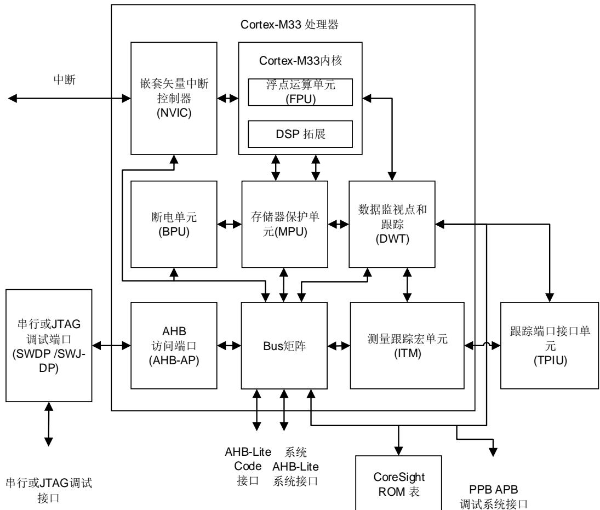
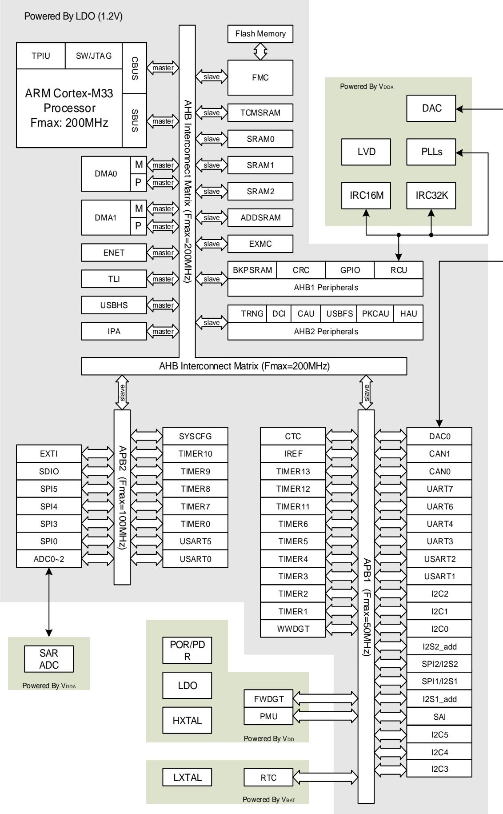
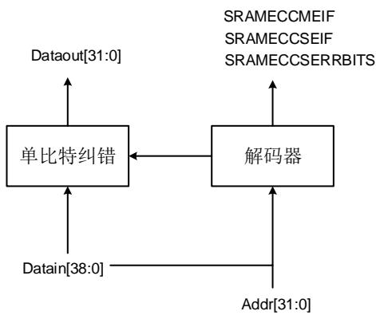

## 1. 系统及存储器架构

GD32F527xx系列器件是基于Arm® Cortex®-M33处理器的32位通用微控制器。Arm® Cortex®-M33处理器包括数据总线和系统总线这两条AHB总线。Cortex®-M33处理器的所有存储访问，根据不同的目的和目标存储空间，都会在这两条AHB总线上执行。存储器的组织采用了哈佛结构，预先定义的存储器映射和高达4 GB的存储空间，充分保证了系统的灵活性和可扩展性。

## 1.1. Arm® Cortex®-M33 处理器

Cortex®-M33处理器是一个32位处理器，具有低中断延迟和低成本调试的特点。集成和先进的特性使Cortex®-M33处理器适合于需要高性能和低功耗微控制器的市场产品。Cortex®-M33处理器基于Armv8架构，支持强大的可扩展指令集，包括通用数据处理I/O控制任务、增强的数据处理位域操作和DSP。下面列出由Cortex®-M33提供的一些系统外围设：

- 与代码总线、系统总线和专用外围总线（PPB）相连的内部总线矩阵和调试访问；

- 嵌套矢量中断控制器（NVIC）；

- 断点单元（BPU）；

- 数据监视点和跟踪（DWT）；

- 测量跟踪宏单元（ITM）；

- 串行JTAG调试端口（SWJ-DP）；

- 跟踪端口接口单元（TPIU）；

- 存储器保护单元（MPU）；

- 浮点运算单元（FPU）；

- DSP拓展（DSP）。

1-1 Cortex®-M33 显示了Cortex®-M33处理器结构框图。欲了解更多信息，请参阅Arm® Cortex®-M33技术参考手册。

图 1-1 Cortex®-M33 处理器结构框图

## 1.2. 系统架构

GD32F527xx 系列器件采用 32 位多层总线结构，该结构可使系统中的多个主机和从机之间的并行通信成为可能。多层总线结构包括一个 AHB 互联矩阵、一个 AHB 总线和两个 APB总线。AHB 互联矩阵的互联关系接下来将进行说明。在表1-1. AHB 互联矩阵的互联关系列表中，”1”表示相应的主机可以通过 互联矩阵访问对应的从机，空白的单元格表示相应的主机不可以通过 AHB 互联矩阵访问对应的从机。

表 1-1. AHB 互联矩阵的互联关系列表

<table><tr><td></td><td>CBUS</td><td>SBUS</td><td>DMA0M</td><td>DMA0P</td><td>DMA1M</td><td>DMA1P</td><td>ENET</td><td>TLI</td><td>USBHS</td><td>IPA</td></tr><tr><td>FMC</td><td>1</td><td></td><td>1</td><td></td><td>1</td><td>1</td><td>1</td><td>1</td><td>1</td><td>1</td></tr><tr><td>TCMSRAM</td><td>1</td><td></td><td></td><td></td><td></td><td></td><td></td><td></td><td></td><td></td></tr><tr><td>SRAM0</td><td>1</td><td>1</td><td>1</td><td></td><td>1</td><td>1</td><td>1</td><td>1</td><td>1</td><td>1</td></tr><tr><td>SRAM1</td><td></td><td>1</td><td>1</td><td></td><td>1</td><td>1</td><td>1</td><td>1</td><td>1</td><td>1</td></tr><tr><td>SRAM2</td><td></td><td>1</td><td>1</td><td></td><td>1</td><td>1</td><td>1</td><td>1</td><td>1</td><td>1</td></tr><tr><td>ADDSRAM</td><td>1</td><td>1</td><td>1</td><td></td><td>1</td><td>1</td><td>1</td><td>1</td><td>1</td><td>1</td></tr><tr><td>EXMC</td><td>1</td><td>1</td><td>1</td><td></td><td>1</td><td>1</td><td>1</td><td>1</td><td>1</td><td>1</td></tr><tr><td>AHB1</td><td></td><td>1</td><td></td><td>1</td><td></td><td>1</td><td></td><td></td><td></td><td></td></tr><tr><td>AHB2</td><td></td><td>1</td><td></td><td></td><td>1</td><td>1</td><td></td><td></td><td></td><td></td></tr><tr><td>APB1</td><td></td><td>1</td><td></td><td>1</td><td>1</td><td>1</td><td></td><td></td><td></td><td></td></tr><tr><td>APB2</td><td></td><td>1</td><td></td><td>1</td><td>1</td><td>1</td><td></td><td></td><td></td><td></td></tr></table>

如表1-1. AHB 互联矩阵的互联关系列表所示，AHB 互联矩阵共连接 10 个主机，分别为：CBUS、SBUS、DMA0M、DMA0P、DMA1M、DMA1P、ENET、TLI、USBHS 和 IPA。CBUS是 Cortex®-M33 内核的指令总线，用于从代码区域中取指令和向量。SBUS 是 Cortex®-M33 内核的系统总线，用于指令和向量获取、数据加载和存储以及系统区域的调试访问。系统区域包括内部 SRAM 区域和外设区域。DMA0M 和 DMA1M 分别是 DMA0 和 DMA1 的存储器总线。DMA0P 和 DMA1P 分别是 DMA0 和 DMA1 的外设总线。ENET 是以太网。TLI 是 TFT LCD接口。USBHS 是高速 USB。IPA 是图像处理加速器。

AHB 互联矩阵也连接了 11 个从机，分别为：FMC、TCMSRAM、SRAM0、SRAM1、SRAM2、ADDSRAM、EXMC、AHB1、AHB2、APB1 和 APB2。FMC 是闪存存储器控制器。TCMSRAM是紧耦合存储器 SRAM。SRAM0、SRAM1 和 SRAM2 是片上静态随机存取存储器。ADDSRAM是附加的 SRAM，仅在一些特殊的 GD32F527xx 器件中有效。EXMC 是外部存储器控制器。AHB1 和 AHB2 是连接所有 AHB 从机的两条 AHB 总线，而 APB1 和 APB2 是连接所有 APB从机的两条 APB 总线。

APB1 和 APB2 是连接所有 APB 从机的两条 APB 总线。APB1 最高可达 50MHz，APB2 可以全速运行（最高可到 100MHz）。

GD32F527xx 系列器件的系统架构如图1-2 GD32F527xx系列器件的系统架构示意图所示。

图 1-2 GD32F527xx 系列器件的系统架构示意图

## 1.3. 存储器映射

Arm® Cortex®-M33 处理器采用哈佛架构，可以使用单独的总线来提取指令和加载/存储数据。程序存储器，数据存储器，寄存器和 端口组织在同一线性 地址空间内，这是 ®M33 的最大地址范围，因为总线地址宽度为 32 位。此外，Cortex®-M33 处理器提供了预定义的内存映射，以减少不同客户在相同应用时的软件复杂度。在内存映射表中，Arm® Cortex®-M33 系统外围设备使用的某些区域无法修改。但是，其他区域可供供应商使用。表 1-2.GD32F527xx 系列器件的存储器映射表显示了 GD32F527xx 系列器件的存储器映射，包括代码、SRAM、外设和其他预先定义的区域。几乎每个外设都分配了 1KB的地址空间，这样可以简化每个外设的地址译码。

表 1-2. GD32F527xx 系列器件的存储器映射表

<table><tr><td>预先定义的地址空间</td><td>总线</td><td>地址</td><td>外设</td></tr><tr><td rowspan="3">External Device</td><td rowspan="6">AHB matrix</td><td>0xC000 0000 - 0xDFFF FFFF</td><td>EXMC - SDRAM</td></tr><tr><td>0xA000 1000 - 0xBFFF FFFF</td><td>保留</td></tr><tr><td>0xA000 0000 - 0xA000 0FFF</td><td>EXMC - SWREG</td></tr><tr><td rowspan="3">External RAM</td><td>0x9000 0000 - 0x9FFF FFFF</td><td>EXMC - PC CARD</td></tr><tr><td>0x7000 0000 - 0x8FFF FFFF</td><td>EXMC - NAND</td></tr><tr><td>0x6000 0000 - 0x6FFF FFFF</td><td>EXMC - NOR / PSRAM / SRAM</td></tr><tr><td rowspan="21">Peripheral</td><td rowspan="10">AHB2</td><td>0x5006 3000 - 0x5FFF FFFF</td><td>保留</td></tr><tr><td>0x5006 1000 - 0x5006 2FFF</td><td>PKCAU</td></tr><tr><td>0x5006 0C00 - 0x5006 0FFF</td><td>保留</td></tr><tr><td>0x5006 0800 - 0x5006 0BFF</td><td>TRNG</td></tr><tr><td>0x5006 0400 - 0x5006 07FF</td><td>HAU</td></tr><tr><td>0x5006 0000 - 0x5006 03FF</td><td>CAU</td></tr><tr><td>0x5005 0400 - 0x5005 FFFF</td><td>保留</td></tr><tr><td>0x5005 0000 - 0x5005 03FF</td><td>DCI</td></tr><tr><td>0x5004 0000 - 0x5004 FFFF</td><td>保留</td></tr><tr><td>0x5000 0000 - 0x5003 FFFF</td><td>USBFS</td></tr><tr><td rowspan="11">AHB1</td><td>0x4008 0000 - 0x4FFF FFFF</td><td>保留(AHB1)</td></tr><tr><td>0x4004 0000 - 0x4007 FFFF</td><td>USBHS</td></tr><tr><td>0x4002 BC00 - 0x4003 FFFF</td><td>保留</td></tr><tr><td>0x4002 B000 - 0x4002 BBFF</td><td>IPA</td></tr><tr><td>0x4002 A000 - 0x4002 AFFF</td><td>保留</td></tr><tr><td>0x4002 8000 - 0x4002 9FFF</td><td>ENET</td></tr><tr><td>0x4002 6800 - 0x4002 7FFF</td><td>保留</td></tr><tr><td>0x4002 6400 - 0x4002 67FF</td><td>DMA1</td></tr><tr><td>0x4002 6000 - 0x4002 63FF</td><td>DMA0</td></tr><tr><td>0x4002 5000 - 0x4002 5FFF</td><td>保留</td></tr><tr><td>0x4002 4000 - 0x4002 4FFF0x4002 3C00 - 0x4002 3FFF</td><td>BKPSRAMFMC</td></tr><tr><td rowspan="38"></td><td rowspan="15"></td><td>0x4002 3800 - 0x4002 3BFF</td><td>RCU</td></tr><tr><td>0x4002 3400 - 0x4002 37FF</td><td>保留</td></tr><tr><td>0x4002 3000 - 0x4002 33FF</td><td>CRC</td></tr><tr><td>0x4002 2C00 - 0x4002 2FFF</td><td>保留</td></tr><tr><td>0x4002 2800 - 0x4002 2BFF</td><td>保留</td></tr><tr><td>0x4002 2400 - 0x4002 27FF</td><td>保留</td></tr><tr><td>0x4002 2000 - 0x4002 23FF</td><td>GPIOI</td></tr><tr><td>0x4002 1C00 - 0x4002 1FFF</td><td>GPIOH</td></tr><tr><td>0x4002 1800 - 0x4002 1BFF</td><td>GPIOG</td></tr><tr><td>0x4002 1400 - 0x4002 17FF</td><td>GPIOF</td></tr><tr><td>0x4002 1000 - 0x4002 13FF</td><td>GPIOE</td></tr><tr><td>0x4002 0C00 - 0x4002 0FFF</td><td>GPIOD</td></tr><tr><td>0x4002 0800 - 0x4002 0BFF</td><td>GPIOC</td></tr><tr><td>0x4002 0400 - 0x4002 07FF</td><td>GPIOB</td></tr><tr><td>0x4002 0000 - 0x4002 03FF</td><td>GPIOA</td></tr><tr><td rowspan="23">APB2</td><td>0x4001 8400 - 0x4001 FFFF</td><td>保留</td></tr><tr><td>0x4001 8000 - 0x4001 83FF</td><td>保留</td></tr><tr><td>0x4001 7C00 - 0x4001 7FFF</td><td>保留</td></tr><tr><td>0x4001 7800 - 0x4001 7BFF</td><td>保留</td></tr><tr><td>0x4001 7400 - 0x4001 77FF</td><td>保留</td></tr><tr><td>0x4001 7000 - 0x4001 73FF</td><td>保留</td></tr><tr><td>0x4001 6C00 - 0x4001 6FFF</td><td>保留</td></tr><tr><td>0x4001 6800 - 0x4001 6BFF</td><td>TLI</td></tr><tr><td>0x4001 5C00 - 0x4001 67FF</td><td>保留</td></tr><tr><td>0x4001 5800 - 0x4001 5BFF</td><td>SAI</td></tr><tr><td>0x4001 5400 - 0x4001 57FF</td><td>SPI5</td></tr><tr><td>0x4001 5000 - 0x4001 53FF</td><td>SPI4</td></tr><tr><td>0x4001 4C00 - 0x4001 4FFF</td><td>保留</td></tr><tr><td>0x4001 4800 - 0x4001 4BFF</td><td>TIMER10</td></tr><tr><td>0x4001 4400 - 0x4001 47FF</td><td>TIMER9</td></tr><tr><td>0x4001 4000 - 0x4001 43FF</td><td>TIMER8</td></tr><tr><td>0x4001 3C00 - 0x4001 3FFF</td><td>EXTI</td></tr><tr><td>0x4001 3800 - 0x4001 3BFF</td><td>SYSCFG</td></tr><tr><td>0x4001 3400 - 0x4001 37FF</td><td>SPI3</td></tr><tr><td>0x4001 3000 - 0x4001 33FF</td><td>SPI0</td></tr><tr><td>0x4001 2C00 - 0x4001 2FFF</td><td>SDIO</td></tr><tr><td>0x4001 2800 - 0x4001 2BFF</td><td>保留</td></tr><tr><td>0x4001 2400 - 0x4001 27FF</td><td>保留</td></tr><tr><td rowspan="39"></td><td rowspan="9"></td><td>0x4001 2000 - 0x4001 23FF</td><td>ADC</td></tr><tr><td>0x4001 1C00 - 0x4001 1FFF</td><td>保留</td></tr><tr><td>0x4001 1800 - 0x4001 1BFF</td><td>保留</td></tr><tr><td>0x4001 1400 - 0x4001 17FF</td><td>USART5</td></tr><tr><td>0x4001 1000 - 0x4001 13FF</td><td>USART0</td></tr><tr><td>0x4001 0C00 - 0x4001 0FFF</td><td>保留</td></tr><tr><td>0x4001 0800 - 0x4001 0BFF</td><td>保留</td></tr><tr><td>0x4001 0400 - 0x4001 07FF</td><td>TIMER7</td></tr><tr><td>0x4001 0000 - 0x4001 03FF</td><td>TIMER0</td></tr><tr><td rowspan="30">APB1</td><td>0x4000 C800 - 0x4000 FFFF</td><td>保留</td></tr><tr><td>0x4000 C400 - 0x4000 C7FF</td><td>IREF</td></tr><tr><td>0x4000 C000 - 0x4000 C3FF</td><td>保留</td></tr><tr><td>0x4000 9000 - 0x4000 BFFF</td><td>保留</td></tr><tr><td>0x4000 8C00 - 0x4000 8FFF</td><td>CAN SRAM 1k-2k bytes</td></tr><tr><td>0x4000 8800 - 0x4000 8BFF</td><td>I2C5</td></tr><tr><td>0x4000 8400 - 0x4000 87FF</td><td>I2C4</td></tr><tr><td>0x4000 8000 - 0x4000 83FF</td><td>I2C3</td></tr><tr><td>0x4000 7C00 - 0x4000 7FFF</td><td>UART7</td></tr><tr><td>0x4000 7800 - 0x4000 7BFF</td><td>UART6</td></tr><tr><td>0x4000 7400 - 0x4000 77FF</td><td>DAC0</td></tr><tr><td>0x4000 7000 - 0x4000 73FF</td><td>PMU</td></tr><tr><td>0x4000 6C00 - 0x4000 6FFF</td><td>CTC</td></tr><tr><td>0x4000 6800 - 0x4000 6BFF</td><td>CAN1</td></tr><tr><td>0x4000 6400 - 0x4000 67FF</td><td>CAN0</td></tr><tr><td>0x4000 6000 - 0x4000 63FF</td><td>CAN SRAM 0-1k bytes</td></tr><tr><td>0x4000 5C00 - 0x4000 5FFF</td><td>I2C2</td></tr><tr><td>0x4000 5800 - 0x4000 5BFF</td><td>I2C1</td></tr><tr><td>0x4000 5400 - 0x4000 57FF</td><td>I2C0</td></tr><tr><td>0x4000 5000 - 0x4000 53FF</td><td>UART4</td></tr><tr><td>0x4000 4C00 - 0x4000 4FFF</td><td>UART3</td></tr><tr><td>0x4000 4800 - 0x4000 4BFF</td><td>USART2</td></tr><tr><td>0x4000 4400 - 0x4000 47FF</td><td>USART1</td></tr><tr><td>0x4000 4000 - 0x4000 43FF</td><td>I2S2_add</td></tr><tr><td>0x4000 3C00 - 0x4000 3FFF</td><td>SPI2/I2S2</td></tr><tr><td>0x4000 3800 - 0x4000 3BFF</td><td>SPI1/I2S1</td></tr><tr><td>0x4000 3400 - 0x4000 37FF</td><td>I2S1_add</td></tr><tr><td>0x4000 3000 - 0x4000 33FF</td><td>FWDGT</td></tr><tr><td>0x4000 2C00 - 0x4000 2FFF</td><td>WWDGT</td></tr><tr><td>0x4000 2800 - 0x4000 2BFF</td><td>RTC</td></tr><tr><td rowspan="10"></td><td rowspan="10"></td><td>0x4000 2400 - 0x4000 27FF</td><td>保留</td></tr><tr><td>0x4000 2000 - 0x4000 23FF</td><td>TIMER13</td></tr><tr><td>0x4000 1C00 - 0x4000 1FFF</td><td>TIMER12</td></tr><tr><td>0x4000 1800 - 0x4000 1BFF</td><td>TIMER11</td></tr><tr><td>0x4000 1400 - 0x4000 17FF</td><td>TIMER6</td></tr><tr><td>0x4000 1000 - 0x4000 13FF</td><td>TIMER5</td></tr><tr><td>0x4000 0C00 - 0x4000 0FFF</td><td>TIMER4</td></tr><tr><td>0x4000 0800 - 0x4000 0BFF</td><td>TIMER3</td></tr><tr><td>0x4000 0400 - 0x4000 07FF</td><td>TIMER2</td></tr><tr><td>0x4000 0000 - 0x4000 03FF</td><td>TIMER1</td></tr><tr><td rowspan="5">SRAM</td><td rowspan="5"></td><td>0x2010 0000 - 0x3FFF FFFF</td><td>保留</td></tr><tr><td>0x2008 0000 - 0x200F FFFF</td><td>ADDSRAM (512KB)</td></tr><tr><td>0x2005 0000 - 0x2007 FFFF</td><td>SRAM2(192KB)</td></tr><tr><td>0x2004 0000 - 0x2004 FFFF</td><td>SRAM1(64KB)</td></tr><tr><td>0x2000 0000 - 0x2003 FFFF</td><td>SRAM0(256KB)</td></tr><tr><td rowspan="23">Code</td><td rowspan="23"></td><td>0x1FFF C010 - 0x1FFF FFFF</td><td>保留</td></tr><tr><td>0x1FFF C000 - 0x1FFF C00F</td><td>Option bytes Block(Bank0 option)</td></tr><tr><td>0x1FFF B000 - 0x1FFF BFFF</td><td>保留</td></tr><tr><td>0x1FFF 7880 - 0x1FFF AFFF</td><td>保留</td></tr><tr><td>0x1FFF 7840 - 0x1FFF 787F</td><td>OTP0 Block (lock)</td></tr><tr><td>0x1FFF 7800 - 0x1FFF 783F</td><td>OTP0 Block (data)</td></tr><tr><td>0x1FFF 0000 - 0x1FFF 77FF</td><td>Boot loader(30KB)</td></tr><tr><td>0x1FFE C010 - 0x1FFE FFFF</td><td>保留</td></tr><tr><td>0x1FFE C000 - 0x1FFE C00F</td><td>Option bytes Block(Bank1 option)</td></tr><tr><td>0x1FF2 0230 - 0x1FFE BFFF</td><td>保留</td></tr><tr><td>0x1FF2 0210 - 0x1FF2 022F</td><td>OTP Block2 (lock)</td></tr><tr><td>0x1FF2 0200 - 0x1FF2 020F</td><td>OTP Block1 (lock)</td></tr><tr><td>0x1FF2 0000 - 0x1FF2 01FF</td><td>OTP Block2 (data)</td></tr><tr><td>0x1FF0 0000 - 0x1FF1 FFFF</td><td>OTP Block1 (data)</td></tr><tr><td>0x1001 0000 - 0x1FEF FFFF</td><td>保留</td></tr><tr><td>0x1000 0000 - 0x1000 FFFF</td><td>TCMSRAM (64KB)</td></tr><tr><td>0x0880 0000 - 0x0FFF FFFF</td><td>保留</td></tr><tr><td>0x0840 0000 - 0x0877 FFFF</td><td>Main Flash(Bank1_Ex 3584kB)</td></tr><tr><td>0x0820 0000 - 0x083F FFFF</td><td>Main Flash(Bank1 2MB)</td></tr><tr><td>0x0800 0000 - 0x081F FFFF</td><td>Main Flash(Bank0 2MB)</td></tr><tr><td>0x0030 0000 - 0x07FF FFFF</td><td rowspan="3">Aliased to the boot device</td></tr><tr><td>0x0010 0000 - 0x002F FFFF</td></tr><tr><td>0x0002 0000 - 0x000F FFFF0x0000 0000 - 0x0001 FFFF</td></tr></table>

## 1.3.1. 片上 SRAM 存储器

GD32F527xx 系列微控制器含有高达 512KB 的片上 SRAM（起始地址为 0x2000 0000）。支持字节、半字（16 比特）和整字（32 比特）访问。

ECC 

SRAM 支持 7 比特的 ECC 功能。可纠错 1 比特，发现多比特（两比特）错误。

读之前必须先写入，否则很可能会导致 ECC 错误。非对齐的读操作会按照 32 比特的读操作来执行。非对齐的写操作会产生一个读改写的流程。例如，16 比特写，首先会先读 16 比特，再和需要写入的 16 比特一起写入。所以初始化 SRAM 时，只能按照 32 位的来写入。

ECC 模块由编码器和解码器两部分构成：

编码器：在进行 SRAM 写操作时，会产生一个 7 比特的 ECC 码，和数据一起写入 SRAM。

解码器：在进行 SRAM 读操作时，使用与编码器相同的算法，解码生成一个 7 比特的 ECC 码。ECC 码包括 ECC 错误状态和 32 位数据中哪位存在单比特位错误的信息。

解码器如下图所示：图1-3ECC解码器示意图

图 1-3 ECC 解码器示意图

## EEIC

EEIC（ECC Error Interrupt Control）模块提供了 ECC 错误状态管理和 ECC 中断配置的功能。

通过设置 SYSCFG_STAT 寄存器和 SYSCFG_SRAM0ECC、SYSCFG_SRAM1ECC、SYSCFG_SRAM2ECC 、 SYSCFG_ADDSRAMECC 、 SYSCFG_TCMSRAMECC 、SYSCFG_BKPSRAMECC 寄存器，可以分别实现对 SRAM0、SRAM1、SRAM2、ADDSRAM和 TCMSRAM 的 ECC 错误检测。下述以 SRAM0 为例介绍 EEIC 的产生过程。SRAM1、SRAM2、ADDSRAM、TCMSRAM、FLASH 的 ECC 配置过程类似于 SRAM0。

## 单比特可纠错事件

当检测到发生了单比特可纠错的事件时，EEIC 模块有如下配置：

SYSCFG_STAT 寄存器中的 ECCSEIF0 位置位，软件写 1 可以清除。

SYSCFG_SRAM0ECC 寄存器中的 ECCADDR0 记录发生单比特可纠错 ECC 事件的地址。

## 多比特（两比特）不可纠错事件

当检测到发生了多比特（两比特）不可纠错的事件时，EEIC 模块有如下配置：

SYSCFG_STAT 寄存器中的 ECCMEIF0 位置位，软件写 1 可以清除。

SYSCFG_SRAM0ECC 寄存器中的 ECCADDR0 记录发生两比特不可纠错 ECC 事件的地址。

## 单比特可纠错中断

在 SYSCFG_SRAM0ECC 寄存器中设置 ECCSEIE0 位，当检测到一个单比特可纠正错误事件时，将产生一个相应的中断。

## 多比特（两比特）不可纠错事件

在 SYSCFG_SRAM0ECC 寄存器中设置 ECCMEIE0 位。当检测到一个多比特（两比特）不可纠错错误事件时，将产生一个 NMI 中断。

## 1.3.2. 片上 FLASH 存储器概述

GD32F527xx 系列微控制器可以提供高密度片上 FLASH 存储器，按以下分类进行组织：

- 高达7680KB主FLASH存储器；

- 高达30KB引导装载程序(boot loader)信息块存储器；

- 器件配置的选项字节。

更多详细说明请参考闪存控制器 （FMC） 章节。

## 1.4. 引导配置

GD32F527xx 系列微控制器提供了四种引导源，可以通过安全保护等级、熔丝、BOOT0 和BOOT1 引脚来进行选择，详细说明见表1-3. 引导模式。该两个引脚的电平状态会在复位后的第四个 CK_SYS（系统时钟）的上升沿进行锁存。用户可自行选择所需要的引导源，通过设置上电复位和系统复位后的 BOOT0 和 BOOT1 的引脚电平。一旦这两个引脚电平被采样，它们可以被释放并用于其他用途。

表 1-3. 引导模式

<table><tr><td>安全保护</td><td colspan="2">熔丝</td><td colspan="2">启动模式选择引脚</td><td>BOOT_MODE[2:0]</td><td>引导源选择</td></tr><tr><td></td><td>NBTSB</td><td>BTFOSEL</td><td>BOOT0</td><td>BOOT1</td><td></td><td></td></tr><tr><td>无保护/保护等级低</td><td>0</td><td>x</td><td>1</td><td>1</td><td>011</td><td>片上 SRAM</td></tr><tr><td>无保护/保护等级低</td><td>0</td><td>x</td><td>1</td><td>0</td><td>001</td><td>引导装载程序</td></tr><tr><td>无保护/保护等级低</td><td>0</td><td>0</td><td>0</td><td>x</td><td>000</td><td>主 Flash 存储器</td></tr><tr><td>无保护/保护等级低</td><td>0</td><td>1</td><td>0</td><td>x</td><td>101</td><td>OTP1</td></tr><tr><td>x</td><td>1</td><td>0</td><td>x</td><td>x</td><td>000</td><td>主 Flash 存储器</td></tr><tr><td>x</td><td>1</td><td>1</td><td>x</td><td>x</td><td>101</td><td>OTP1</td></tr><tr><td>保护等级高</td><td>x</td><td>0</td><td>x</td><td>x</td><td>000</td><td>主 Flash 存储器</td></tr><tr><td>保护等级高</td><td>x</td><td>1</td><td>x</td><td>x</td><td>101</td><td>OTP1</td></tr></table>

上电序列或系统复位后，ARM®Cortex®-M33 处理器先从 0x00000000 地址获取栈顶值，再从0x00000004 地址获得引导代码的基地址，然后从引导代码的基地址开始执行程序。所选引导源对应的存储空间会被映射到引导存储空间，即从 0x0000 0000 开始的地址空间。如果片上SRAM（开始于 0x20000000 的存储空间）被选为引导源，用户必须在应用程序初始化代码中通过修改 NVIC 异常向量表和偏移地址将向量表重置到 SRAM 中。

通过配置安全保护和 EFUSE_CTL 寄存器，可以通过如表1-3. 引导模式的配置选择启动引导模式。

当安全保护等级以及 EFUSE_CTL 寄存器中的 NBTSB 和 BTFOSEL 位被配置时，通过配置BOOT0，BOOT1 引脚的值来决定系统从 SRAM，BootLoader，Main Flash，OTP 启动。BOOT0.BOOT1 引脚的值可以通过 SYSCFG_CFG0 寄存器的 BOOT_MODE[2:0]的配置决定（注意：一旦这些控制位通过软件写入，BOOT0 和 BOOT1 引脚的电平状态将会被忽略）。

当主 FLASH 存储器被选择作为引导源，从 0x0800 0000 开始的存储空间会被映射到引导存储空间。由于主 FLASH 存储器的 Bank0 或 Bank1 均可映射到地址 0x0800 0000(通过配置SYSCFG_CFG0 寄存器的 FMC_SWP 控制位，具体参考 1.6.1)，所以，微控制器可以使用该方法从 Bank0 或 Bank1 中启动。当选择 OTP 作为引导源时，从地址 0x1FF0 0000 开始的内存空间会被映射到引导存储空间。

为了使能引导块功能，选项字节中的 BB 控制位需要被置位。当该控制位被置位并且主 FLASH存储器被选择作为引导源，微控制器从引导装载程序中启动并且引导装载程序跳至主 FLASH存储器的 Bank1 中执行代码。

## 1.5. 系统配置控制器

系统配置控制器的主要功能如下：

- 管理I/O补偿单元

- 管理外部中断线与GPIO的连接
