## 22.1. 高级定时器（TIMERx,x=0,7）

## 22.1.1. 简介

高级定时器（TIMER0 和 TIMER7）是四通道定时器，支持输入捕获和输出比较。可以产生 PWM信号控制电机和电源管理。高级定时器含有一个 16 位无符号计数器。

高级定时器是可编程的，可以被用来计数，其外部事件可以驱动其他定时器

高级定时器包含了一个死区时间插入模块，非常适合电机控制。

定时器和定时器之间是相互独立，但是他们可以被同步在一起形成一个更大的定时器，这些定时器的计数器一致地增加。

## 22.1.2. 主要特性

- 总通道数：4；

- 计数器宽度：16位；

- 时钟源可选：内部时钟，内部触发，外部输入，外部触发；

- 多种计数模式：向上计数，向下计数和中央计数；

- 正交译码器接口：被用来追踪运动和分辨旋转方向和位置；

- 霍尔传感器接口：用来做三相电机控制；

- 可编程的预分频器：16位，运行时可以被改变；

- 每个通道可配置：输入捕获模式，输出比较模式，可编程的PWM模式，单脉冲模式；

- 可编程的死区时间；

- 自动重装载功能；

- 可编程的计数器重复功能；

- 中止输入功能使定时器按照用户的配置输出；

- 中断输出和DMA请求：更新事件，触发事件，比较/捕获事件和中止事件；

- 多个定时器的菊链使得一个定时器可以同时启动多个定时器；

- 定时器的同步允许被选择的定时器在同一个时钟周期开始计数；

- 定时器主-从管理。

## 22.1.3. 功能描述

## 结构框图

22-1. 了高级定时器的内部配置细节。

图 22-1. 高级定时器结构框图

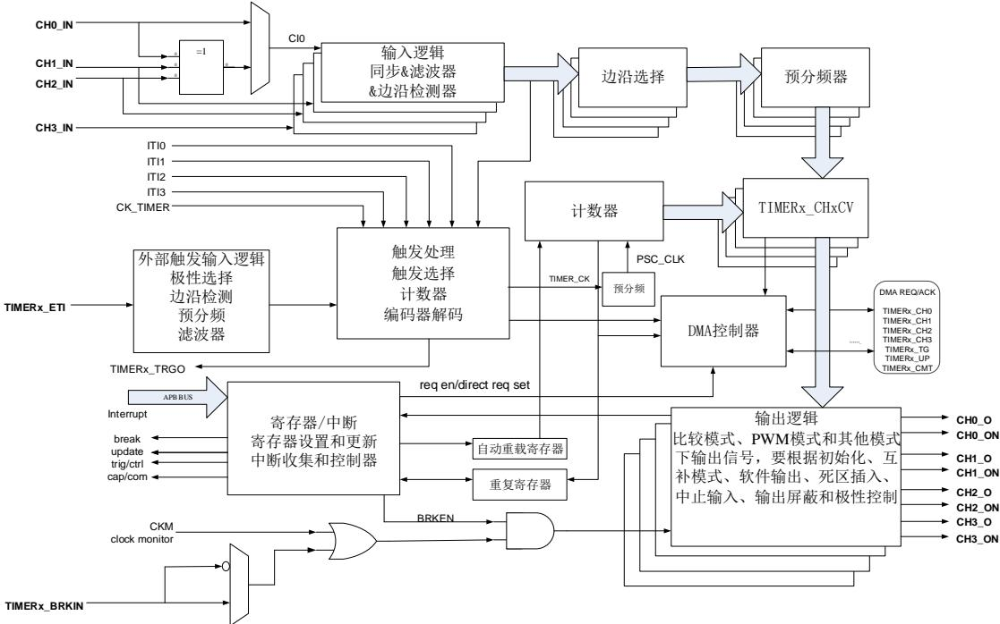

## 时钟源配置

高级定时器可以由内部时钟源 CK_TIMER 或者由 SMC（TIMERx_SMCFG 寄存器位[2:0]）控制的复用时钟源驱动。

- SMC[2:0]==3’b000，定时器选择内部时钟源（连接到RCU模块的CK_TIMER）

如果 SMC[2:0]==3’b000，默认用来驱动计数器预分频器的是内部时钟源 CK_TIMER。当 CEN置位，CK_TIMER 经过预分频器（预分频值由 TIMERx_PSC 寄存器确定）产生 PSC_CLK。

这种模式下，驱动预分频器计数的 TIMER_CK 等于来自于 RCU 模块的 CK_TIMER

如果将 TIMERx_SMCFG 寄存器的 SMC[2:0]设置为 0x1、0x2、0x3 和 0x7，预分频器被其他时钟源（由 TIMERx_SMCFG 寄存器的 TRGS [2:0]区域选择）驱动，在下文说明。当 SMC 位被设置为 0x4、0x5 和 0x6，计数器预分频器时钟源由内部时钟 CK_TIMER 驱动。

图 22-2. 内部时钟分频为 1时，计数器的时序图

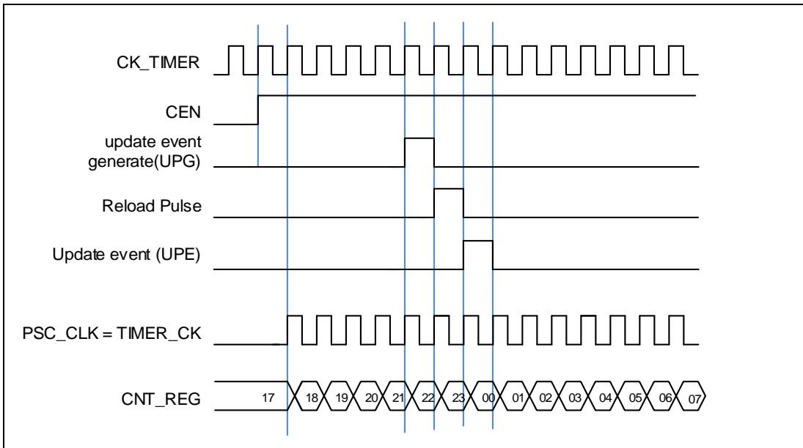

- SMC[2:0]==3’b111（外部时钟模式0），定时器选择外部输入引脚作为时钟源

计数器预分频器可以在 TIMERx_CI0/ TIMERx_CI1 引脚的每个上升沿或下降沿计数。这种模式可以通过设置 SMC [2:0]为 0x7 同时设置 TRGS[2:0]为 0x4，0x5 或 0x6 来选择。

计数器预分频器也可以在内部触发信号 ITI0/1/2/3 的上升沿计数。这种模式可以通过设置 SMC[2:0]为 0x7 同时设置 TRGS [2:0]为 0x0, 0x1, 0x2 或者 0x3。

- SMC1==1’b1（外部时钟模式1），定时器选择外部输入引脚ETI作为时钟源

计数器预分频器可以在外部引脚 ETI 的每个上升沿或下降沿计数。这种模式可以通过设置TIMERx_SMCFG寄存器中的SMC1位为1来选择。另一种选择ETI信号作为时钟源方式是，设置 SMC [2:0]为 0x7 同时设置 TRGS [2:0]为 0x7。注意 ETI 信号是通过数字滤波器采样 ET引脚得到的。如果选择 ETI 信号为时钟源，触发控制器包括边沿监测电路将在每个 ETI 信号上升沿产生一个时钟脉冲来为计数器预分频器提供时钟。

## 时钟预分频器

预分频器可以将定时器的时钟（TIMER_CK）频率按 1 到 65536 之间的任意值分频，分频后的时钟 驱动计数器计数。分频系数受预分频寄存器 控制，这个控制寄存器带有缓冲器，它能够在运行时被改变。新的预分频器的参数在下一次更新事件到来时被采用。

图 22-3. 当 PSC 数值从 0 变到 2 时，计数器的时序图

<table><tr><td>TIMER_CK</td><td></td><td></td><td></td><td></td><td></td><td></td><td></td><td></td><td></td><td></td><td></td></tr><tr><td>CEN</td><td></td><td></td><td></td><td></td><td></td><td></td><td></td><td></td><td></td><td></td><td></td></tr><tr><td>PSC value</td><td>0</td><td></td><td></td><td></td><td></td><td></td><td>2</td><td></td><td></td><td></td><td></td></tr><tr><td>Prescaler shadow</td><td>0</td><td></td><td></td><td></td><td></td><td></td><td>2</td><td></td><td></td><td></td><td></td></tr><tr><td>Prescaler CNT</td><td>0</td><td></td><td></td><td></td><td></td><td>0</td><td>1</td><td>2</td><td>0</td><td>1</td><td>2</td></tr><tr><td>PSC_CLK</td><td></td><td></td><td></td><td></td><td></td><td></td><td></td><td></td><td></td><td></td><td></td></tr><tr><td>CNT_REG</td><td>94</td><td>95</td><td>96</td><td>97</td><td>98</td><td>99</td><td>0</td><td></td><td>1</td><td></td><td>2</td></tr><tr><td>UPG</td><td></td><td></td><td></td><td></td><td></td><td></td><td></td><td></td><td></td><td></td><td></td></tr><tr><td>Reload Pulse</td><td></td><td></td><td></td><td></td><td></td><td></td><td></td><td></td><td></td><td></td><td></td></tr></table>

## 计数器向上计数模式

在这种模式，计数器的计数方向是向上计数。计数器从 开始向上连续计数到自动加载值（定义在 TIMERx_CAR 寄存器中），一旦计数器计数到自动加载值，会重新从 0 开始向上计数。另外，在（TIMERx_CREP+1）次上溢后产生更新事件。在向上计数模式中，TIMERx_CTL0 寄存器中的计数方向控制位 DIR 应该被设置成 0。

当通过 TIMERx_SWEVG 寄存器的 UPG 位置 1 来设置更新事件时，计数值会被清 0，并产生更新事件。

如果 TIMERx_CTL0 寄存器的 UPDIS 置 1，则禁止更新事件。

当发生更新事件时，所有影子寄存器（重复计数器，计数器自动重载寄存器，预分频寄存器）都将被更新。

下面这些图给出了一些例子，当 TIMERx_CAR=0x99 时，计数器在不同预分频因子下的行为。

图 22-4. 向上计数时序图，PSC=0/2

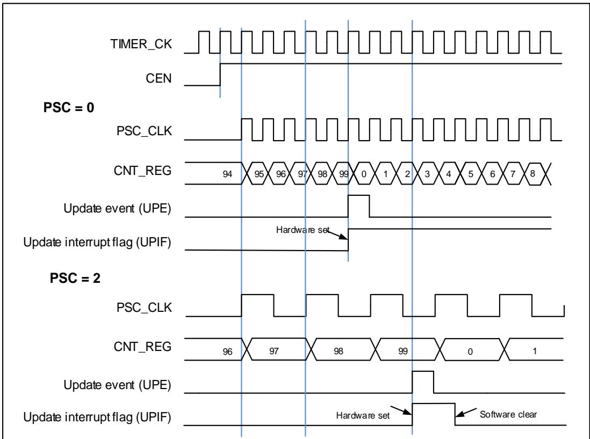

图 22-5. 向上计数时序图，在运行时改变 TIMERx_CAR 寄存器的值

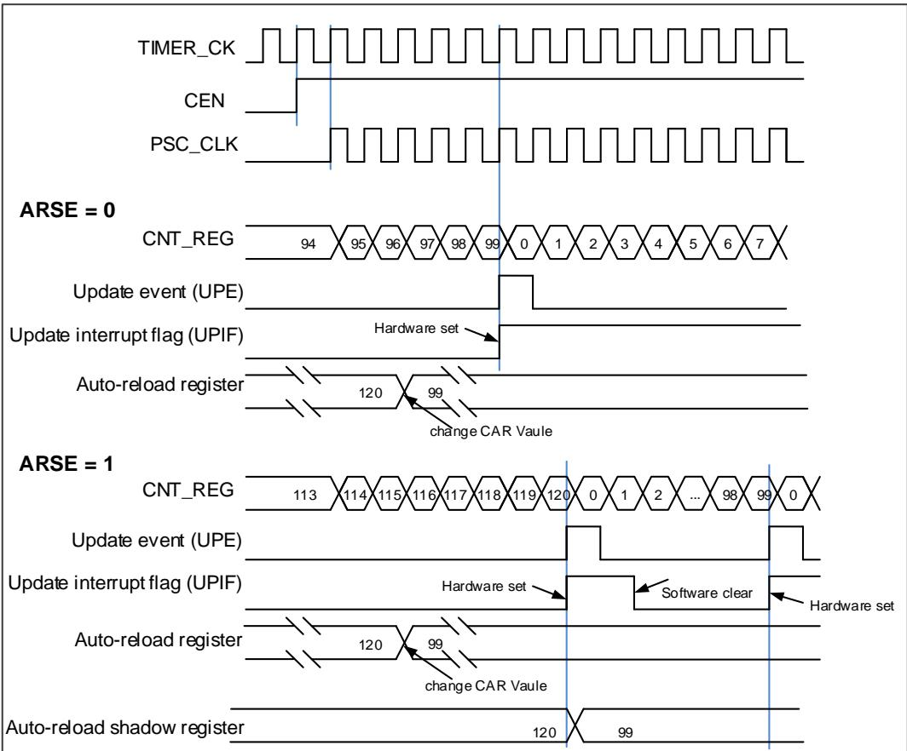

## 计数器向下计数模式

在这种模式，计数器的计数方向是向下计数。计数器从自动加载值（定义在 TIMERx_CAR 寄存器中）向下连续计数到 0。一旦计数器计数到 0，计数器会重新从自动加载值开始计数。另外，在（TIMERx_CREP+1）次下溢后产生更新事件。在向下计数模式中，TIMERx_CTL0 寄存器中的计数方向控制位 DIR 应该被设置成 1。

当通过 TIMERx_SWEVG 寄存器的 UPG 位置 1 来设置更新事件时，计数值会被初始化为自动加载值，并产生更新事件。

如果 TIMERx_CTL0 寄存器的 UPDIS 置 1，则禁止更新事件。

当发生更新事件时，所有影子寄存器（重复计数器，计数器自动重载寄存器，预分频寄存器）都将被更新。

下面这些图给出了一些例子，当 TIMERx_CAR=0x99 时，计数器在不同时钟频率下的行为。

图 22-6. 向下计数时序图，PSC=0/2

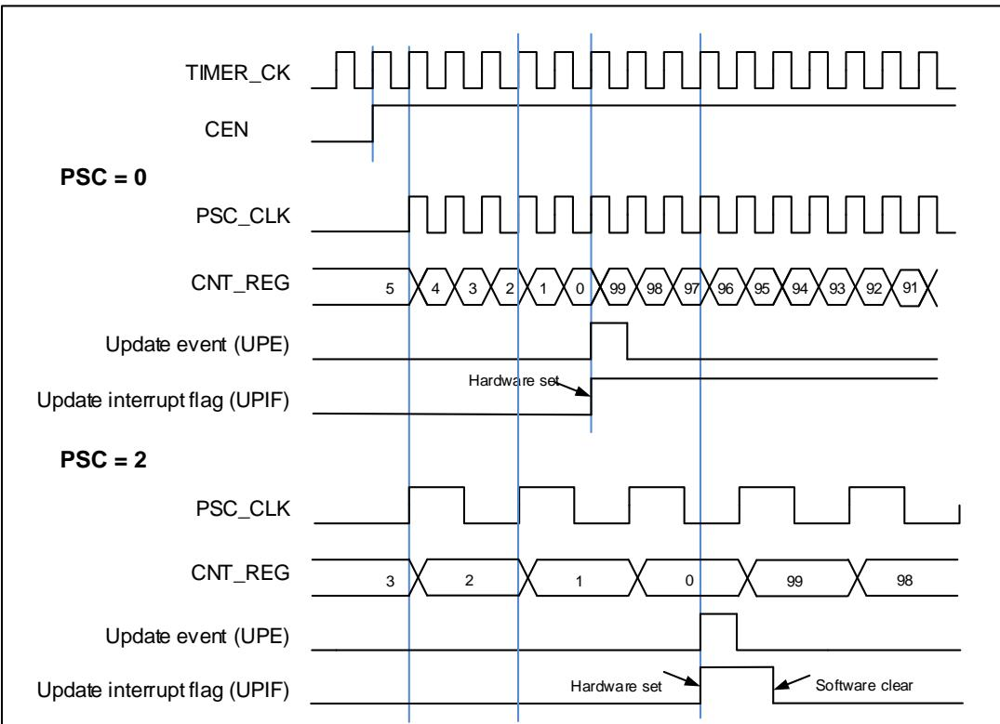

图 22-7. 向下计数时序图，在运行时改变 TIMERx_CAR 寄存器值

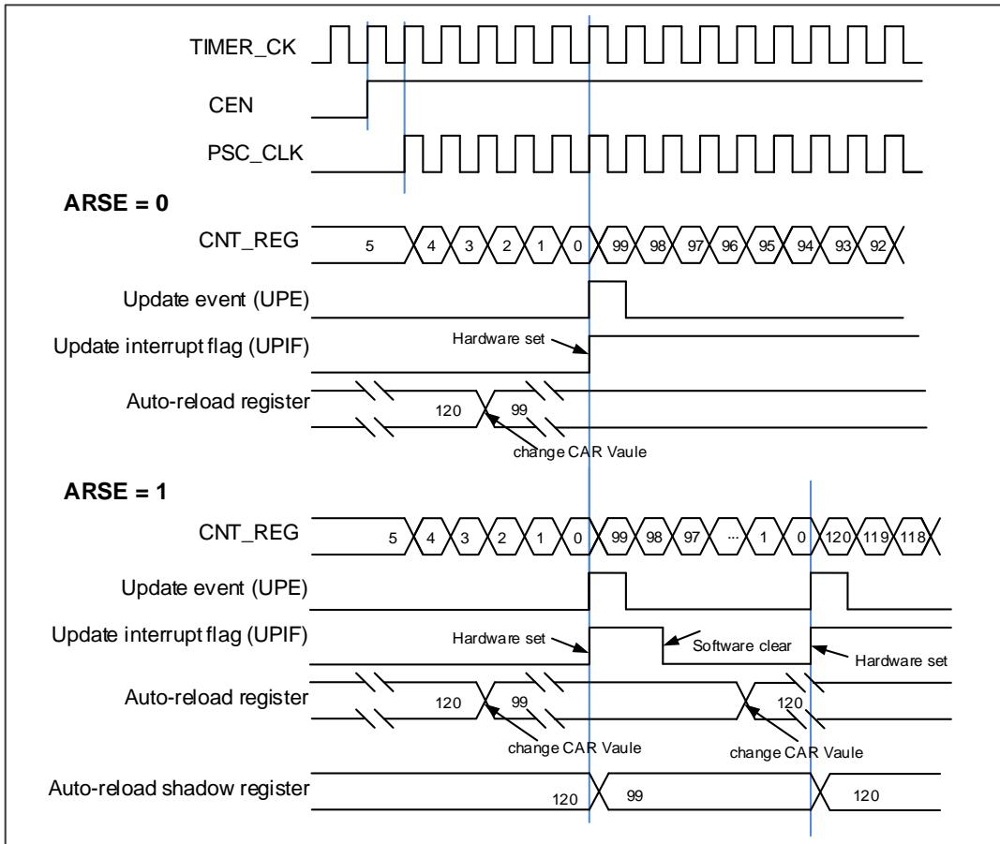

## 计数器中央对齐模式

在中央对齐模式下，计数器交替的从 0 开始向上计数到自动加载值，然后再向下计数到 0。。向上计数模式中， 定时器模块在计数器计数到自动加载值-1 产生一个上溢事件；向下计数模式中，定时器模块在计数器计数到 1 时产生一个下溢事件。在中央计数模式中，TIMERx_CTL0寄存器中的计数方向控制位 只读，表明了的计数方向。

将 TIMERx_SWEVG 寄存器的 UPG 位置 1 可以初始化计数值为 0，并产生一个更新事件，而无需考虑计数器在中央模式下是向上计数还是向下计数。

上溢或者下溢时，TIMERx_INTF 寄存器中的 UPIF 位都会被置 1，然而 CHxIF 位置 1 与TIMERx_CTL0 寄存器中 CAM 的值有关。具体细节参考图22-8. 中央计数模式计数器时序。

如果 TIMERx_CTL0 寄存器的 UPDIS 置 1，则禁止更新事件。

当发生更新事件时，所有影子寄存器（重复计数器，计数器自动重载寄存器，预分频寄存器）都将被更新。

22-8. 给 出 了 一 些 例 子 ， 当 TIMERx_CAR=0x99 ，TIMERx_PSC=0x0 时，计数器的行为。

图 22-8. 中央计数模式计数器时序图

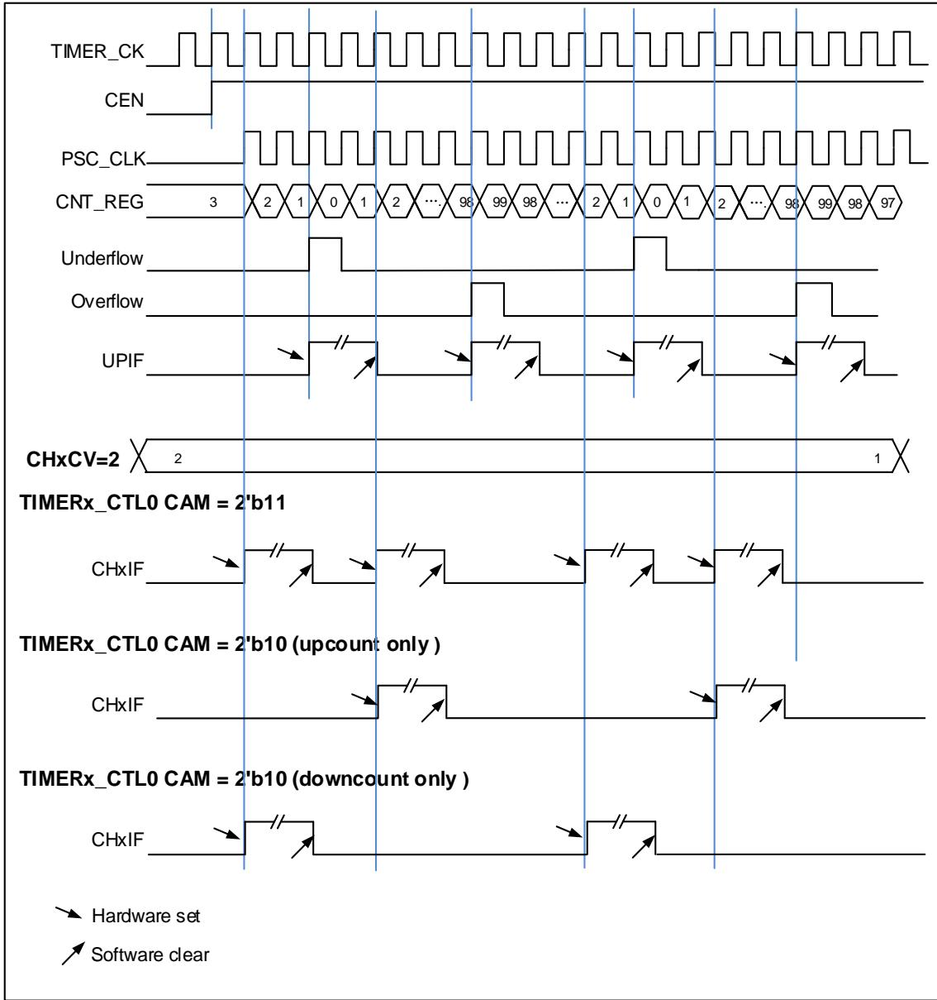

## 更新事件（来自上溢/下溢）频率配置

更新事件的生成频率（来自上溢和下溢事件）可以通过TIMERx_CREP寄存器进行配置。重复计数器是用来在N+1个计数周期之后产生更新事件，更新定时器的寄存器，N为TIMERx_CREP寄存器的CREP。重复计数器在每次计数器上溢和下溢时递减（向上计数模式中不存在下溢事件；向下计数模式中不存在上溢事件）。

将TIMERx_SWEVG寄存器的UPG位置1可以重载TIMERx_CREP寄存器中CREP的值并产生一个更新事件。

新写入的CREP值将在下一次更新事件到来时生效。当CREP的值为奇数，并且计数器在中央对齐模式下计数时，更新事件发生在上溢或下溢取决于写入的C 值何时生效。如果在写入奇数到CREP寄存器后由软件生成更新事件（UPG位置1），则在下溢时产生更新事件。如果在写入奇数到CREP寄存器后下一个更新事件发生在上溢，此后将在上溢时产生更新事件。

图 22-9. 中央计数模式下计数器重复时序图

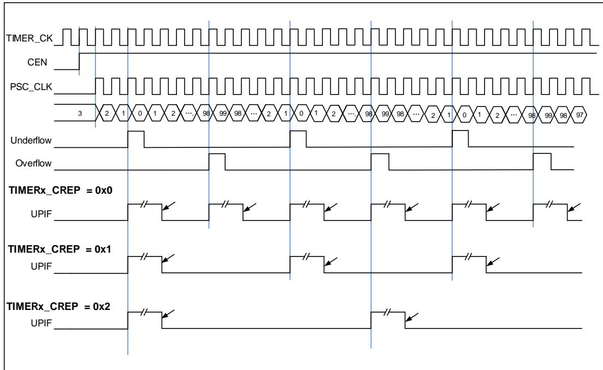

图 22-10. 在向上计数模式下计数器重复时序图

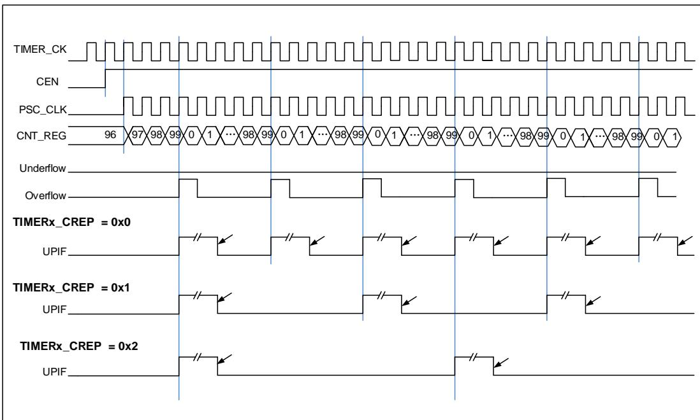

图 22-11. 在向下计数模式下计数器重复时序图

<table><tr><td>TIMER_CK</td><td></td></tr><tr><td>CEN</td><td></td></tr><tr><td>PSC_CLK</td><td></td></tr><tr><td>CNT_REG</td><td>3 2 1 0 99 98 ... 1 0 99 98 ... 1 0 99 98 ... 1 0 99 98 ... 1 0 99 98</td></tr><tr><td>Underflow</td><td></td></tr><tr><td>Overflow</td><td></td></tr><tr><td>TIMERx_CREP = 0x0</td><td></td></tr><tr><td>UPIF</td><td></td></tr><tr><td>TIMERx_CREP = 0x1</td><td></td></tr><tr><td>UPIF</td><td></td></tr><tr><td>TIMERx_CREP = 0x2</td><td></td></tr><tr><td>UPIF</td><td></td></tr></table>

## 输入捕获和输出比较通道

高级定时器拥有四个独立的通道用于捕获输入或比较输出是否匹配。每个通道都围绕一个通道捕获比较寄存器建立，包括一个输入级，通道控制器和输出级。

- 通道输入捕获功能

通道输入捕获功能允许通道测量一个波形时序，频率，周期，占空比等。输入级包括一个数字滤波器，一个通道极性选择，边沿检测和一个通道预分频器。如果在输入引脚上出现被选择的边沿，TIMERx_CHxCV 寄存器会捕获计数器当前的值，同时 CHxIF 位被置 1，如果 CHxIE =1 则产生通道中断。

图 22-12. 通道输入捕获原理

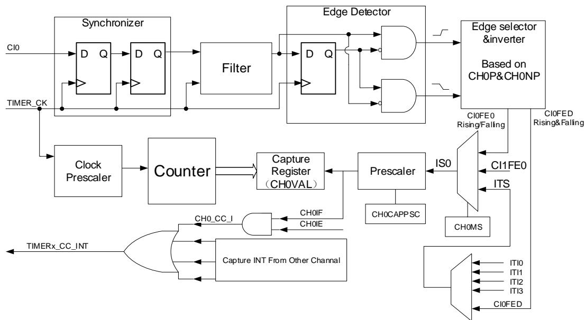

通 道 输 入 信 号 CIx 有 两 种 选 择 ， 一 种 是 TIMERx_CHx 信 号 ， 另 一 种 是TIMERx_CH0,TIMERx_CH1 和 TIMERx_CH2 异或之后的信号。通道输入信号 CIx 先被TIMER_CK 信号同步，然后经过数字滤波器采样，产生一个被滤波后的信号。通过边沿检测器，可以选择检测上升沿或者下降沿。通过配置 CHxP 选择使用上升沿或者下降沿。配置CHxMS，可以选择其他通道的输入信号，内部触发信号。配置 IC 预分频器，使得若干个输入事件后才产生一个有效的捕获事件。捕获事件发生，CxCV 存储计数器的值。

配置步骤如下：

第一步：滤波器配置（TIMERx_CHCTL0寄存器中CHxCAPFLT）：

根据输入信号和请求信号的质量，配置相应的CHxCAPFLT。

第二步：边沿选择（TIMERx_CHCTL2寄存器中CHxP/CHxNP）：

配置CHxP/CHxNP选择上升沿或者下降沿。

第三步：捕获源选择（TIMERx_CHCTL0寄存器中CHxMS）：

一旦通过配置CHxMS选择输入捕获源，必须确保通道配置在输入模式（CHxMS!=0x0），而且TIMERx_CHxCV寄存器不能再被写。

第四步：中断使能（TIMERx_DMAINTEN寄存器中CHxIE和CHxDEN）：使能相应中断，可以获得中断和DMA请求。

第五步：捕获使能（TIMERx_CHCTL2寄存器中CHxEN）。

结果：当期望的输入信号发生时，TIMERx_CHxCV被设置成当前计数器的值，CHxIF位置1。如果CHxIF位已经为1，则CHxOF位置1。根据TIMERx_DMAINTEN寄存器中CHxIE和CHxDEN的配置，相应的中断和DMA请求会被提出。

直接产生：软件设置CHxG位，会直接产生中断和DMA请求。

输入捕获模式也可用来测量 TIMERx_CHx 引脚上信号的脉冲波宽度。例如，一个 PWM 波连接到 CI0。配置 TIMERx_CHCTL0 寄存器中 CH0MS 为 2’b01，选择通道 0 的捕获信号为 CI0并设置上升沿捕获。配置 TIMERx_CHCTL0 寄存器中 CH1MS 为 2’b10，选择通道 1 捕获信号为 CI0 并设置下降沿捕获。计数器配置为复位模式，在通道 0 的上升沿复位。TIMERX_CH0CV寄存器测量PWM的周期值，TIMERx_CH1CV寄存器测量PWM占空比值。

- 通道输出比较功能

在输出比较模式，TIMERx 可以产生时控脉冲，其位置，极性，持续时间和频率都是可编程的。当一个输出通道的 寄存器与计数器的值匹配时，根据 的配置，这个通道的输出可以被置高电平，被置低电平或者反转。当计数器的值与CHxCV寄存器的值匹配时，CHxIF 位被置 1，如果 CHxIE = 1 则会产生中断，如果 CxCDE=1 则会产生 DMA 请求。

配置步骤如下：

第一步：时钟配置：

配置定时器时钟源，预分频器等。

第二步：比较模式配置：

设置CHxCOMSEN位来配置输出比较影子寄存器；

设置CHxCOMCTL位来配置输出模式（置高电平/置低电平/反转）；

设置CHxP/CHxNP位来选择有效电平的极性；

设置CHxEN使能输出。

第三步：通过CHxIE/CxCDE位配置中断/DMA请求使能。

第四步：通过TIMERx_CAR寄存器和TIMERx_CHxCV寄存器配置输出比较时基：

CHxCVAL可以在运行时根据你所期望的波形而改变。

第五步：设置CEN位使能定时器。

22-13. 三种比较输出模式：反转/置高电平/置低电平，CAR=0x63,CHxVAL=0x3。

图 22-13. 三种输出比较模式

<table><tr><td colspan="101">CNT_CLK</td></tr><tr><td colspan="100">CEN</td><td></td></tr><tr><td colspan="96">CNT_REG</td><td></td><td></td><td></td><td></td><td></td></tr><tr><td colspan="95">Overflow</td><td></td><td></td><td></td><td></td><td></td><td></td></tr><tr><td colspan="89">match toggle</td><td></td><td></td><td></td><td></td><td></td><td></td><td></td><td></td><td></td><td></td><td></td><td></td></tr><tr><td colspan="85">OxCPRE</td><td></td><td></td><td></td><td></td><td></td><td></td><td></td><td></td><td></td><td></td><td></td><td></td><td></td><td></td><td></td><td></td></tr><tr><td colspan="80">match set</td><td></td><td></td><td></td><td></td><td></td><td></td><td></td><td></td><td></td><td></td><td></td><td></td><td></td><td></td><td></td><td></td><td></td><td></td><td></td><td></td><td></td></tr><tr><td colspan="15">OxCPRE</td><td></td><td></td><td></td><td></td><td></td><td></td><td></td><td></td><td></td><td></td><td></td><td></td><td></td><td></td><td></td><td></td><td></td><td></td><td></td><td></td><td></td><td></td><td></td><td></td><td></td><td></td><td></td><td></td><td></td><td></td><td></td><td></td><td></td><td></td><td></td><td></td><td></td><td></td><td></td><td></td><td></td><td></td><td></td><td></td><td></td><td></td><td></td><td></td><td></td><td></td><td></td><td></td><td></td><td></td><td></td><td></td><td></td><td></td><td></td><td></td><td></td><td></td><td></td><td></td><td></td><td></td><td></td><td></td><td></td><td></td><td></td><td></td><td></td><td></td><td></td><td></td><td></td><td></td><td></td><td></td><td></td><td></td><td></td><td></td><td></td><td></td></tr><tr><td colspan="15">match clear</td><td></td><td></td><td></td><td></td><td></td><td></td><td></td><td></td><td></td><td></td><td></td><td></td><td></td><td></td><td></td><td></td><td></td><td></td><td></td><td></td><td></td><td></td><td></td><td></td><td></td><td></td><td></td><td></td><td></td><td></td><td></td><td></td><td></td><td></td><td></td><td></td><td></td><td></td><td></td><td></td><td></td><td></td><td></td><td></td><td></td><td></td><td></td><td></td><td></td><td></td><td></td><td></td><td></td><td></td><td></td><td></td><td></td><td></td><td></td><td></td><td></td><td></td><td></td><td></td><td></td><td></td><td></td><td></td><td></td><td></td><td></td><td></td><td></td><td></td><td></td><td></td><td></td><td></td><td></td><td></td><td></td><td></td><td></td><td></td><td></td><td></td></tr><tr><td colspan="15">OxCPRE</td><td></td><td></td><td></td><td></td><td></td><td></td><td></td><td></td><td></td><td></td><td></td><td></td><td></td><td></td><td></td><td></td><td></td><td></td><td></td><td></td><td></td><td></td><td></td><td></td><td></td><td></td><td></td><td></td><td></td><td></td><td></td><td></td><td></td><td></td><td></td><td></td><td></td><td></td><td></td><td></td><td></td><td></td><td></td><td></td><td></td><td></td><td></td><td></td><td></td><td></td><td></td><td></td><td></td><td></td><td></td><td></td><td></td><td></td><td></td><td></td><td></td><td></td><td></td><td></td><td></td><td></td><td></td><td></td><td></td><td></td><td></td><td></td><td></td><td></td><td></td><td></td><td></td><td></td><td></td><td></td><td></td><td></td><td></td><td></td><td></td><td></td></tr></table>

## 输出 PWM 功能

在 PWM 输出模式下（PWM 模式 0 是配置 CHxCOMCTL 为 3’b110，PWM 模式 1 是配置CHxCOMCTL 为 3’b111），通道根据 TIMERx_CAR 寄存器和 TIMERx_CHxCV 寄存器的值，输出 PWM 波形。

根据计数模式，我们可以分为两种 PWM 波：EAPWM（边沿对齐 PWM）和 CAPWM（中央对齐 PWM）。

EAPWM 的周期由 TIMERx_CAR 寄存器值决定，占空比由 TIMERx_CHxCV 寄存器值决定。22-14. EAPWM 显示了 EAPWM 的输出波形和中断。

CAPWM 的周期由（2*TIMERx_CAR 寄存器值）决定，占空比由（2*TIMERx_CHxCV 寄存器值）决定。图22-15. CAPWM 时序图显示了 CAPWM 的输出波形和中断。

在 PWM0 模式下（CHxCOMCTL==3’b110），如果 TIMERx_CHxCV 寄存器的值大于TIMERx_CAR 寄存器的值，通道输出一直为有效电平。

在 PWM0 模式下（CHxCOMCTL==3’b110），如果 TIMERx_CHxCV 寄存器的值等于 0，通道输出一直为无效电平。

图 22-14. EAPWM 时序图

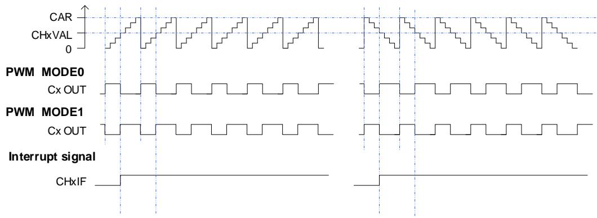

图 22-15. CAPWM 时序图

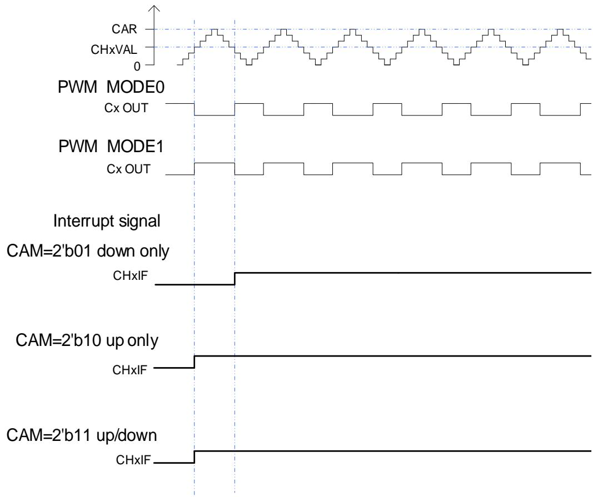

## 复合 PWM 模式

在复合 PWM 模式中（CHxCPWMEN = 1’b1，CHxMS[2:0] = 3’b000 和 CHxCOMCTL = 4’b0110、4’b0111），通道 x（x=0..3）上的 PWM 输出信号由 CHxVAL 和 CHxCOMVAL_ADD 位确定。如果 ${ \mathsf { C H x C O M C T L } } = 4 ^ { \prime } { \mathsf { b 0 1 1 0 ( P W M } }$ 模式 0）且 DIR = 1’b0（向上计数模式），或者 CHxCOMCTL= 4’b0111（PWM 模式 1）且 DIR = 1’b1（向下计数模式），当计数器和 CHxVAL 的值相匹配时通道 x 输出强制为低。当计数器与 CHxCOMVAL_ADD 的值相匹配时，通道 x 输出强制为

高。

如果 CHxCOMCTL =4’b0111（PWM 模式 1）且 DIR = 1’b0（向上计数模式），或者 CHxCOMCTL=4’b0110（PWM 模式 0）且 DIR = 1’b1（向下计数模式），当计数器和 CHxVAL 的值相匹配时通道 x 输出强制为高。当计数器与 CHxCOMVAL_ADD 的值相匹配时，通道 x 输出强制为低。

PWM 的周期取决于（CARL + 0x0001），PWM 脉冲宽度可以下表22-2 复合PWM脉冲宽度计算。

表 22-2 复合 PWM 脉冲宽度

<table><tr><td>条件</td><td>模式</td><td>PWM脉冲宽度</td></tr><tr><td rowspan="2">CHxVAL &lt; CHxCOMVAL_ADD ≤ CARL</td><td>PWM模式0</td><td>(CARL + 0x0001) + (CHxVAL - CHxCOMVAL_ADD)</td></tr><tr><td>PWM模式1</td><td>(CHxCOMVAL_ADD - CHxVAL)</td></tr><tr><td rowspan="2">CHxCOMVAL_ADD &lt; CHxVAL ≤ CARL</td><td>PWM模式0</td><td>(CHxVAL - CHxCOMVAL_ADD)</td></tr><tr><td>PWM模式1</td><td>(CARL + 0x0001) + (CHxCOMVAL_ADD - CHxVAL)</td></tr><tr><td rowspan="2">(CHxVAL = CHxCOMVAL_ADD ≤ CARL)或 (CHxVAL &gt; CARL &gt; CHxCOMVAL_ADD)</td><td>PWM模式0(向上计数)或 PWM模式1(向下计数)</td><td>100%</td></tr><tr><td>PWM模式0(向下计数)或 PWM模式1(向上计数)</td><td>0%</td></tr><tr><td rowspan="2">CHxCOMVAL_ADD &gt; CARL &gt; CHxVAL</td><td>PWM模式0(向上计数)或 PWM模式1(向下计数)</td><td>0%</td></tr><tr><td>PWM模式0(向下计数)或 PWM模式1(向上计数)</td><td>100%</td></tr><tr><td>(CHxVAL&gt;CARL)且 (CHxCOMVAL_ADD &gt; CARL)</td><td>-</td><td>CHx_O输出保持</td></tr></table>

当计数器计数到CHxVAL，CHxIF位置1且如果CHxIE=1通道x产生中断，如果CHxDEN=1，则产生DMA请求。当计数器计数到CHxCOMVAL_ADD时，CHxCOMADDIF位置1（该中断标志位只在复合PWM模式有效，CHxCPWMEN=1），如果CHxCOMADDIE = 1通道x附加比较中断产生（只有中断产生，没有DMA请求响应）。

根据CHxVAL，CHxCOMVAL_ADD和CARL之间的关系，可以分为四种情况：

1） CHxVAL < CHxCOMVAL_ADD，CHxVAL和CHxCOMVAL_ADD值介于0和CARL之间。

图 22-16 通道 x 输出 PWM（CHxVAL < CHxCOMVAL_ADD）

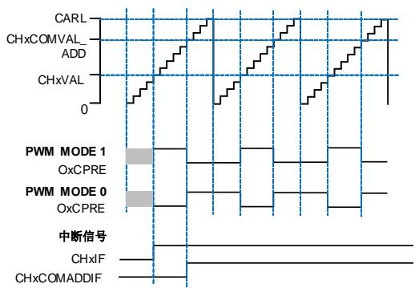

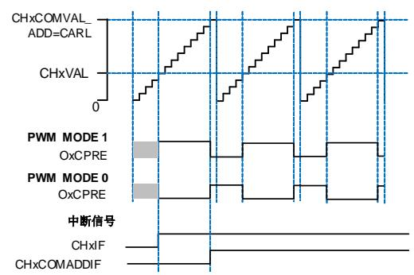

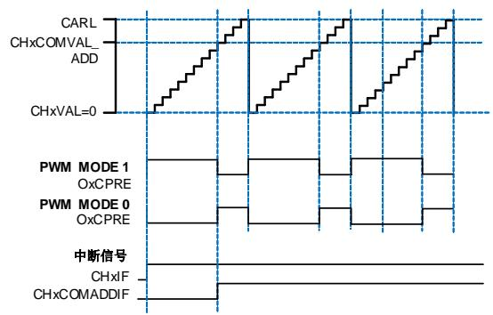

2） CHxVAL = CHxCOMVAL_ADD, CHxVAL和CHxCOMVAL_ADD值介于0和CARL之间。

图 22-17 通道 x 输出 PWM（CHxVAL = CHxCOMVAL_ADD）

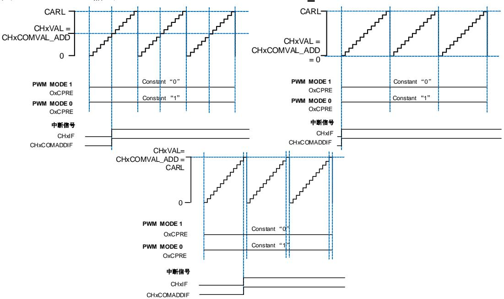

3） CHxVAL > CHxCOMVAL_ADD, CHxVAL和CHxCOMVAL_ADD值介于0和CARL之间。

图 22-18. 通道 x 输出 PWM（CHxVAL > CHxCOMVAL_ADD）

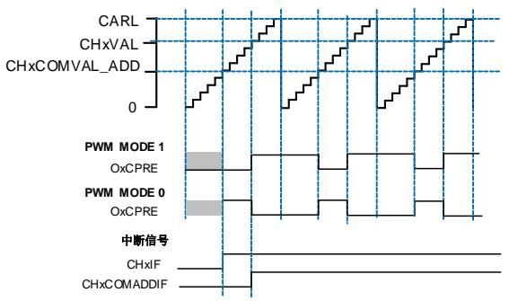

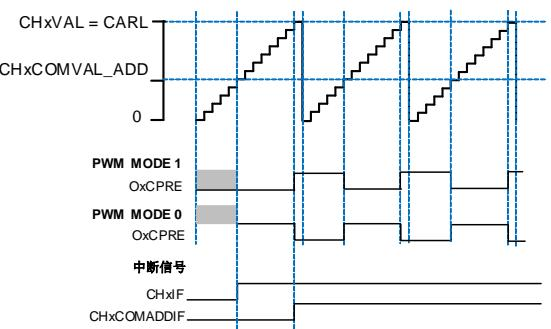

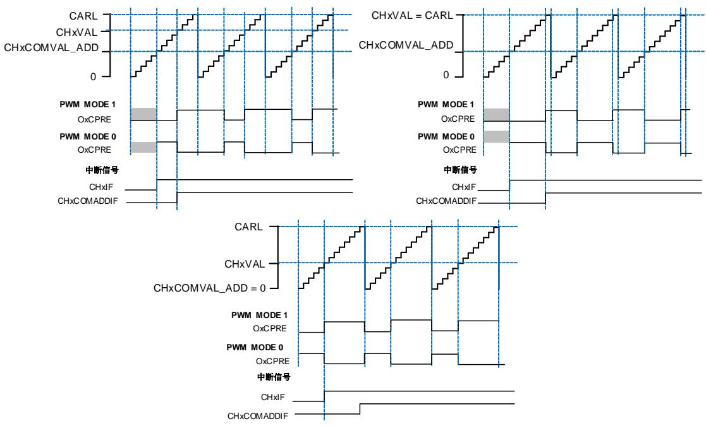

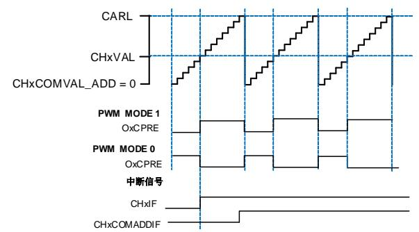

4） CHxVAL或CHxCOMVAL_ADD值大于CARL。

图 22-19. 通道 x 输出 PWM（CHxVAL 或 CHxCOMVAL_ADD > CARL）

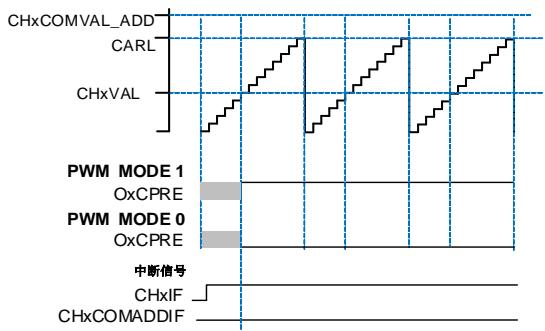

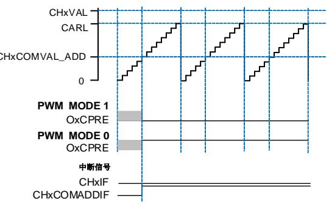

复合PWM模式支持不修改周期只修改占空比的PWM信号的生成。图22-20. 通道x输出PWM占CHxCOMVAL_ADD 显示PWM输出和中断波形。

在 某 些 情 况 下 ， CHxCOMVAL_ADD 的 匹 配 事 件 可 以 发 生 在 下 一 个 计 数 周 期（CHxCOMVAL_ADD值在计数器到达CHxVAL值之后被写入，且CHxCOMVAL_ADD值小于或者等于CHxVAL值）。

图 22-20. 通道 x 输出 PWM 占空比随着 CHxCOMVAL_ADD 值而改变

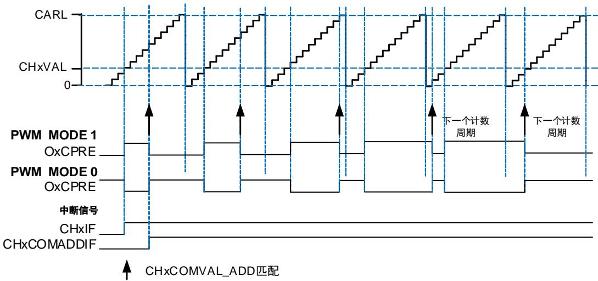

如果多个通道配置为复合PWM模式，可以为每对通道x的匹配边沿设定一个偏移量（相对于其它通道）。这种特性在产生照明PWM控制信号时非常有用，因为在这种情况下，希望彼此边缘不重合，以消除噪声的产生。CHxVAL寄存器值是PWM脉冲相对于计数器周期开始的偏移。

图 22-21. 复合 PWM 模式下四通道输出

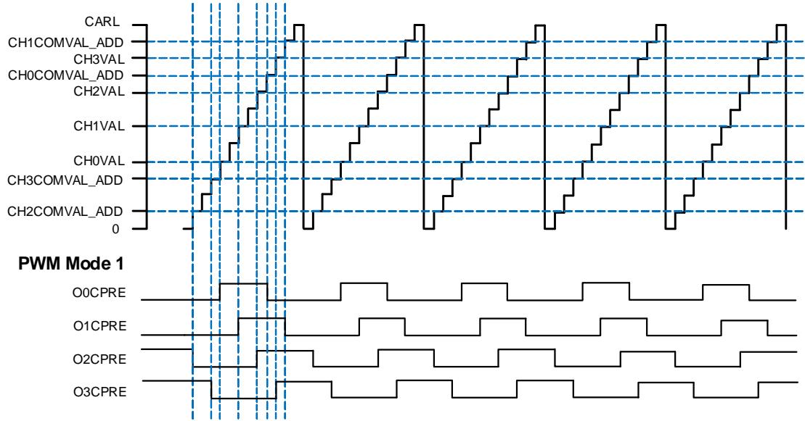

## 通道输出准备信号

当 TIMERx 用于输出匹配比较模式下，设置 CHxCOMCTL 位可以定义 OxCPRE 信号（通道 x准备信号）类型。OxCPRE 信号有若干类型的输出功能，包括，设置 CHxCOMCTL=0x00 可以保持原始电平；设置 CHxCOMCTL=0x01 可以将 OxCPRE 信号设置为高电平；设置CHxCOMCTL=0x02 可以将 OxCPRE 信号设置为低电平；设置 CHxCOMCTL=0x03，在计数器值和 TIMERx_CHxCV 寄存器的值匹配时，可以翻转输出信号。

PWM 模式 0 和 PWM 模式 1 是 OxCPRE 的另一种输出类型，设置 CHxCOMCTL 位域位 0x06或0x07可以配置 PWM模式0/PWM模式1。在这些模式中，根据计数器值和 TIMERx_CHxCV寄存器值的关系以及计数方向，OxCPRE 信号改变其电平。具体细节描述，请参考相应的位。

设置 CHxCOMCTL =0x04 或 0x05 可以实现 OxCPRE 信号的强制输出功能。输出比较信号能够直接由软件强置为有效或无效状态，而不依赖于 TIMERx_CHxCV 的值和计数器值之间间的比较结果。

设置 CHxCOMCEN=1，当由外部 ETI 引脚信号产生的 ETIFE 信号为高电平时，OxCPRE 被强制为低电平。在下一次更新事件到来时，OxCPRE 信号才会回到有效电平状态。

## 通道输出互补 PWM

CHx_O 和 CHx_ON 是一对互补输出通道，这两个信号不能同时有效。互补信号 CHx_O 和CHx_ON 是由一组参数来决定：TIMERx_CHCTL2 寄存器中的 CHxEN 和 CHxNEN 位，TIMERx_CCHP 寄存器中和 TIMERx_CTL1 寄存器中的 POEN, ROS, IOS, ISOx 和 ISOxN位。输出极性由 TIMERx_CHCTL2 寄存器中的 CHxP 和 CHxNP 位来决定。

表 22-3. 由参数控制的互补输出表

<table><tr><td colspan="5">互补参数</td><td colspan="2">输出状态</td></tr><tr><td>POEN</td><td>ROS</td><td>IOS</td><td>CHxEN</td><td>CHxNEN</td><td>CHx_O</td><td>CHx_ON</td></tr><tr><td rowspan="5">0</td><td rowspan="5">0/1</td><td rowspan="4">0</td><td rowspan="2">0</td><td>0</td><td colspan="2">CHx_O / CHx_ON = LOWCHx_O / CHx_ON 输出禁能(1)</td></tr><tr><td>1</td><td colspan="2" rowspan="3">CHx_O/CHx_ON输出关闭状态(2):通道先输出无效电平:CHx_O = CHxP,CHx_ON = CHxNP);如果死区产生时钟未失效,在死区时间之后:CHx_O = ISOx,CHx_ON = ISOxN(3)</td></tr><tr><td rowspan="2">1</td><td>0</td></tr><tr><td>1</td></tr><tr><td>1</td><td>x</td><td>x</td><td colspan="2">CHx_O/CHx_ON输出关闭状态:通道先输出无效电平:CHx_O = CHxP,CHx_ON = CHxNP);如果死区产生时钟未失效,在死区时间之后:CHx_O = ISOx,CHx_ON = ISOxN</td></tr><tr><td rowspan="8">1</td><td rowspan="4">0</td><td rowspan="8">0/1</td><td rowspan="2">0</td><td>0</td><td colspan="2">CHx_O/CHx_ON = LOWCHx_O/CHx_ON输出禁能</td></tr><tr><td>1</td><td>CHx_O = LOWCHx_O输出禁能</td><td>CHx_ON=OxCPRE⊕(4)CHxNPCHx_ON输出使能</td></tr><tr><td rowspan="2">1</td><td>0</td><td>CHx_O=OxCPRE⊕CHxPCHx_O输出使能</td><td>CHx_ON = LOWCHx_ON输出禁能</td></tr><tr><td>1</td><td>CHx_O=OxCPRE⊕CHxPCHx_O输出使能</td><td>CHx_ON=(!OxCPRE)(5)⊕CHxNPCHx_ON输出使能</td></tr><tr><td rowspan="4">1</td><td rowspan="2">0</td><td>0</td><td>CHx_O = CHxPCHx_O输出关闭状态</td><td>CHx_ON = CHxNPCHx_ON输出关闭状态</td></tr><tr><td>1</td><td>CHx_O = CHxPCHx_O输出关闭状态</td><td>CHx_O=OxCPRE⊕CHxNPCHx_ON输出使能</td></tr><tr><td rowspan="2">1</td><td>0</td><td>CHx_O=OxCPRE⊕CHxPCHx_O输出使能</td><td>CHx_ON = CHxNPCHx_ON输出关闭状态</td></tr><tr><td>1</td><td>CHx_O=OxCPRE⊕CHxPCHx_O输出使能</td><td>CHx_ON=(!OxCPRE)⊕CHxNPCHx_ON输出使能</td></tr></table>

注意：

（1） 输出禁能：CHx_O / CHx_ON 输出与对应引脚断开，对应引脚电平受 GPIO 上下拉配置控制，无上下拉时为悬空高阻态；

（2） 输出关闭状态：CHx_O / CHx_ON 输出无效电平（ $\mathsf { C H x \_ O } = 0 \oplus \mathsf { C H x P } = \mathsf { C H x P } )$ 

（3） 详情见中止模式章节。

（4） ⊕：异或操作；

（5） (!OxCPRE)：OxCPRE 信号的互补信号。

## 互补 PWM插入死区时间

设置 CHxEN 和 CHxNEN 为 1’b1 同时设置 POEN，死区插入就会被使能。DTCFG 位域定义了死区时间，死区时间对所有通道有效。死区时间的细节，请参考 TIMERx_CCHP 寄存器。死区时间的插入，确保了通道互补的两路信号不会同时有效。

在 PWM0 模式，当通道 x 匹配发生时（TIMERx 计数器= CxCV），OxCPRE 反转。在图22-22.中的 A点，CHx_O 信号在死区时间内为低电平，直到死区时间过后才变为高电平，而 CHx_ON 信号立刻变为低电平。同样，在 B点，计数器再次匹配（TIMERx 计数器= CxCV），OxCPRE 信号被清 0，CHx_O 信号被立即清零，CHx_ON 信号在死区时间内仍然是低电平，在死区时间过后才变为高电平。

有时会有一些死角事件发生，例如：

- 如果死区延时大于或者等于CHx_O信号的占空比，CHx_O信号一直为无效值（如图22-22.带死区时间的互补输出)。

- 如果死区延时大于或者等于CHx_ON信号的占空比，CHx_ON信号一直为无效值。

图 22-22. 带死区时间的互补输出

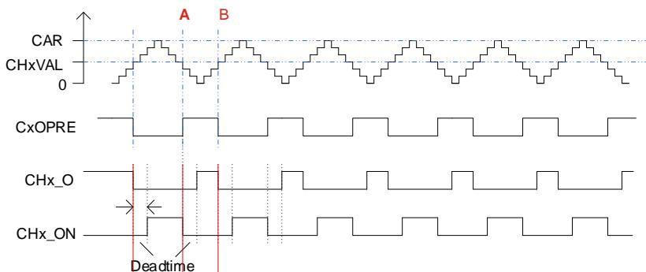

Corner case Deadtime > pulse width

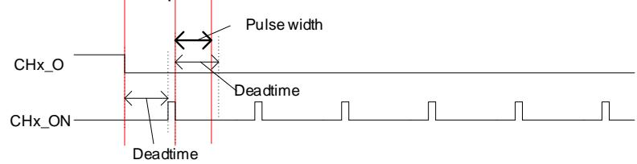

## 中止模式

使用中止模式时，输出 CHx_O 和 CHx_ON 信号电平被以下位控制，TIMERx_CCHP 寄存器的 POEN, IOS 和 ROS 位，TIMERx_CTL1 寄存器的 ISOx 和 ISOxN 位。当中止事件发生时，CHx_O 和 CHx_ON 信号输出不能同时设置为有效电平。中止源可以选择中止输入引脚，也可以选择 HXTAL 时钟失效事件。时钟失败事件由 RCU 中的时钟监视器（CKM）产生。将TIMERx_CCHP 寄存器的 BRKEN 位置 1 可以使能中止功能。TIMERx_CCHP 寄存器的 BRKP位决定了中止输入极性。

发生中止时，POEN 位被异步清除，一旦 POEN 位为 0，CHx_O 和 CHx_ON 被 TIMERx_CTL1寄存器中的 ISOx 位和 ISOxN 驱动。如果 IOS=0，定时器释放输出使能，否则输出使能仍然为高。起初互补输出被置于复位状态，然后死区时间产生器重新被激活，以便在一个死区时间后驱动输出，输出电平由 ISOx 和 ISOxN 位配置。

发生中止时，TIMERx_INTF 寄存器的 BRKIF 位被置 1。如果 BRKIE=1，中断产生。

图 22-23. 通道响应中止输入（高电平有效）时，输出信号的行为

<table><tr><td rowspan="2"></td><td>BRKIN</td><td></td><td></td><td></td></tr><tr><td>OxCPRE</td><td></td><td></td><td></td></tr><tr><td rowspan="2">CHxEN: 1 CHxNEN: 1CHxP : 0 CHxNP : 0ISOx = ~ISOxN</td><td>CHx_O</td><td></td><td colspan="2">= ISOx</td></tr><tr><td>CHx_ON</td><td></td><td colspan="2">= ISOxN</td></tr><tr><td rowspan="2">CHxEN: 1 CHxNEN: 0CHxP: 0 CHxNP : 0ISOx = ~ISOxN</td><td>CHx_O</td><td></td><td colspan="2">= ISOx</td></tr><tr><td>CHx_ON</td><td></td><td colspan="2">= ISOxN</td></tr><tr><td rowspan="2">CHxEN: 1 CHxNEN: 0CHxP : 0 CHxNP : 0ISOx = ISOxN</td><td>CHx_O</td><td></td><td></td><td></td></tr><tr><td>CHx_ON</td><td></td><td></td><td></td></tr></table>

## 正交译码器

正交译码器功能使用由TIMERx_CH0和TIMERx_CH1引脚生成的CI0FE0和CI1FE1正交信号各自相互作用产生计数值。在每个输入源改变期间， 位会发生改变。输入源可以是只有CI0FE0，可以只有CI1FE1，或着可以同时有CI0FE0和 CI1FE1，通过设置SMC=0x01, 0x02或0x03来选择使用哪种模式。计数器计数方向改变的机制如表22-4. 不同译码器模式下的计数所示。正交译码器可以当作一个带有方向选择的外部时钟，这意味着计数器会在0和自动加载值之间连续的计数。因此，用户必须在计数器开始计数前配置TIMERx_CAR寄存器。

表 22-4. 不同译码器模式下的计数方向

<table><tr><td rowspan="2">计数模式</td><td rowspan="2">电平</td><td colspan="2">CI0FE0</td><td colspan="2">CI1FE1</td></tr><tr><td>上升</td><td>下降</td><td>上升</td><td>下降</td></tr><tr><td rowspan="2">译码器模式0SMC[2:0]=3&#x27;b001</td><td>CI1FE1=1</td><td>向下</td><td>向上</td><td>-</td><td>-</td></tr><tr><td>CI1FE1=0</td><td>向上</td><td>向下</td><td>-</td><td>-</td></tr><tr><td rowspan="2">译码器模式1SMC [2:0]=3&#x27;b010</td><td>CI0FE0=1</td><td>-</td><td>-</td><td>向上</td><td>向下</td></tr><tr><td>CI0FE0=0</td><td>-</td><td>-</td><td>向下</td><td>向上</td></tr><tr><td rowspan="4">译码器模式2SMC [2:0]=3&#x27;b011</td><td>CI1FE1=1</td><td>向下</td><td>向上</td><td>X</td><td>X</td></tr><tr><td>CI1FE1=0</td><td>向上</td><td>向下</td><td>X</td><td>X</td></tr><tr><td>CI0FE0=1</td><td>X</td><td>X</td><td>向上</td><td>向下</td></tr><tr><td>CI0FE0=0</td><td>X</td><td>X</td><td>向下</td><td>向上</td></tr></table>

注意："-" 意思是"无计数"; "X" 意思是不可能。"0" 意思是低电平, "1" 意思是高电平

图 22-24. 在译码器模式 2且 CI0FE0极性不反相时计数器行为

<table><tr><td>CI0FE0</td><td></td></tr><tr><td>CI1FE1</td><td></td></tr><tr><td>TIMERx_CAR</td><td>99</td></tr><tr><td>CNT_REG</td><td>20 21 22 23 24 25 24 23 22 21 20 19</td></tr></table>

图 22-25. 在译码器模式 2且 CI0FE0极性反相时计数器行为

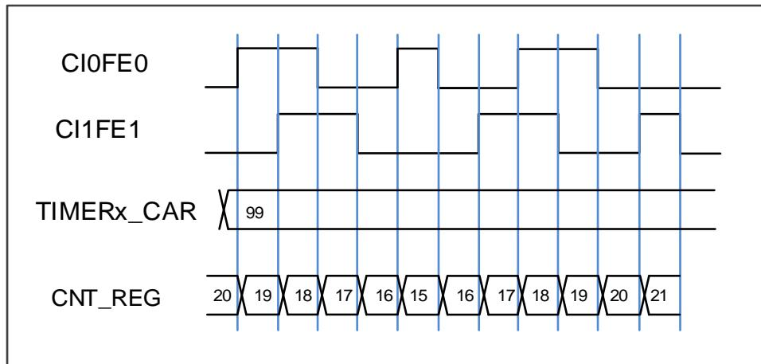

## 霍尔传感器接口功能

高级定时器支持霍尔传感器接口功能，该功能可以用来控制 BLDC 电机。

22-26. BLDC 是定时器和电机的连接示意图。TIMER_in定时

器（可以是高级定时器或者通用L0定时器）接收霍尔传感器的三路信号。

三个霍尔传感器信号与 TIMER_in 定时器的三路输入捕获引脚一一对应连接，每个霍尔传感器输入一路波形到输入引脚，分析三路霍尔信号可以计算出转子的位置和速度。

通过定时器内部连接，例如 TRGO-ITIx，TIMER_in 定时器和 TIMER_out 定时器可以连接在一起。TIMER_out 定时器根据 ITIx 触发信号输出 PWM 波，驱动 BLDC 电机，控制 BLDC 电机的速度。这样，TIMER_in 定时器和 TIMER_out 定时器的连接形成了一个反馈电路，可以根据需求改变配置。

TIMER_in 定时器需要具备输入异或功能，所以可以选择高级定时器和通用 L0 定时器。

TIMER_out 定时器需要具备互补输出和死区插入功能，所以可以选择高级定时器。另外，根据定时器的内部互连关系，可以选择成对的互连定时器，例如:

$$
\text { TIMER\_in } \quad (\text { TIMER0 }) \rightarrow \text { TIMER\_out } \quad (\text { TIMER7   ITI0 })
$$

$$
\text { TIMER\_in } \quad (\text { TIMER1 }) \rightarrow \text { TIMER\_out } \quad (\text { TIMER0   ITI1 })
$$

等等。

选择好合适的互连定时器，定时器和 BLDC 的线路也已经连接好，我们就可以配置定时器了。有以下关键配置：

- 设置TI0S，使能异或功能。三路输入信号的任何一路发生变化，CI0都会反转，CH0VAL此时会捕获计数器的当前值。

- 设置CCUC和CCSE，使能ITIx直接连接到换相功能。

- 根据需求配置PWM参数。

图 22-26. 霍尔传感器用在 BLDC 电机控制中

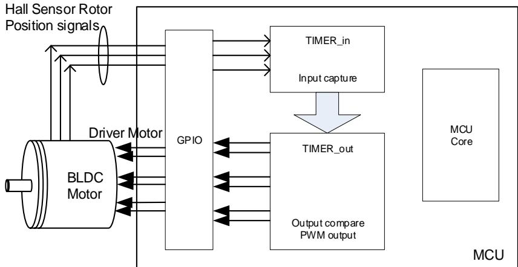

图 22-27. 两个定时器之间的霍尔传感器时序图

Advanced/General L0 TIMER_in under input capture mode

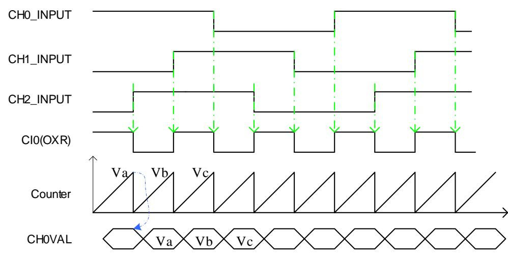

Advanced TIMER_out under output compare mode(PWM with Dead-time)

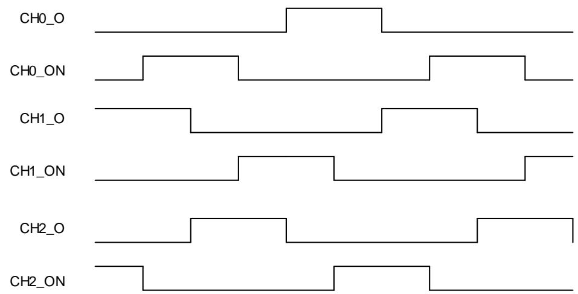

## 主-从管理

TIMERx 能在多种模式下同步外部触发，包括复位模式，暂停模式和事件模式，可以通过设置TIMERx_SMCFG 寄存器中的 SMC [2:0]配置这些模式。这些模式的输入触发源可以通过设置TIMERx_SMCFG 寄存器中的 TRGS [2:0]来选择。

表 22-5. 从模式例子列表和举例

<table><tr><td></td><td>模式选择</td><td>触发源选择</td><td>极性选择</td><td>滤波和预分频</td></tr><tr><td>列举</td><td>SMC[2:0]3'b100(复位模式)3'b101(暂停模式)3'b110(事件模式)</td><td>TRGS[2:0]000: ITI0001: ITI1010: ITI2011: ITI3100: CI0F_ED101: CI0FE0110: CI1FE1111: ETIFP</td><td>如果触发源是CI0FE0或者CI1FE1,配置CHxP和CHxNP来选择极性和反相。如果触发源是ETIFP,配置ETP选择极性和反相。</td><td>若触发源为ITIx,滤波和预分频不可用。若触发源为CIx,可配置CHxCAPFLT设置滤波,预分频不可用。若触发源为ETIFP,滤波和预分频均可用。</td></tr><tr><td rowspan="2">例1</td><td>复位模式当触发输入上升沿到来时,计数器清零重启。</td><td>TRGS[2:0]=3'b000选择ITIO为触发源。</td><td>若触发源是ITIO,极性选择不可用。</td><td>若触发源是ITIO,滤波和预分频不可用。</td></tr><tr><td colspan="4">图22-28. 复位模式</td></tr><tr><td rowspan="2">例2</td><td>暂停模式当触发输入为低的时候,计数器暂停计数,当触发输入为高时,计数器计数。</td><td>TRGS[2:0]=3'b101选择CI0FE0为触发源。</td><td>TIOS=0(非异或)[CHONP=0,CHOP=0]CI0FE0不反相。捕获发生在上升沿。</td><td>在这个例子中滤波被旁路。</td></tr><tr><td colspan="4">图22-29. 暂停模式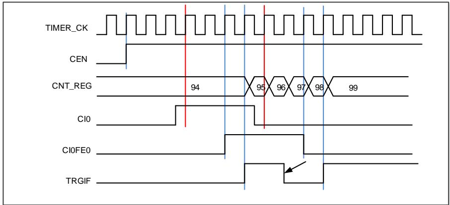</td></tr><tr><td>例3</td><td>事件模式触发输入的上升沿计数器开始计数。</td><td>TRGS[2:0]=3'b111选择ETIFP为触发源。</td><td>ETP = 0,ETI极性不改变。</td><td>ETPSC = 1,ETI 2分频。ETFC = 0,ETI 无滤波。</td></tr><tr><td></td><td colspan="4">图22-30.事件模式</td></tr></table>

## 单脉冲模式

单脉冲模式与重复模式是相反的，设置 TIMERx_CTL0 寄存器的 SPM 位置 1，则使能单脉冲模式。当 SPM 置 1，计数器在下次更新事件到来后清零并停止计数。为了得到脉冲波，可以通过设置 CHxCOMCTL 配置 TIMERx 为 PWM 模式或者比较模式。

一旦设置定时器运行在单脉冲模式下，没有必要设置 TIMERx_CTL0 寄存器的定时器使能位CEN=1 来使能计数器。触发信号沿或者软件写 CEN=1 都可以产生一个脉冲，此后 CEN 位一直保持为 1 直到更新事件发生或者 CEN 位被软件写 0。如果 CEN 位被软件清 0，计数器停止工作， 计数值被保持。

在单脉冲模式下，有效的外部触发边沿会将 CEN 位置 1，使能计数器。然而，执行计数值和TIMERx_CHxCV 寄存器值的比较结果依然存在一些时钟延迟。为了最大限度减少延迟，用户可以将 C C 0/1 寄存器的 C CO 位置 1。单脉冲模式下，触发上升沿产生之后， OxCPRE 信号将被立即强制转换为与发生比较匹配时相同的电平，但是不用考虑比较结果。只有输出通道配置为 PWM0 或 PWM1 输出运行模式下时 CHxCOMFEN 位才可用，触发源来源于触发信号

图 22-31. 单脉冲模式，TIMERx_CHxCV = 0x04 TIMERx_CAR=0x60

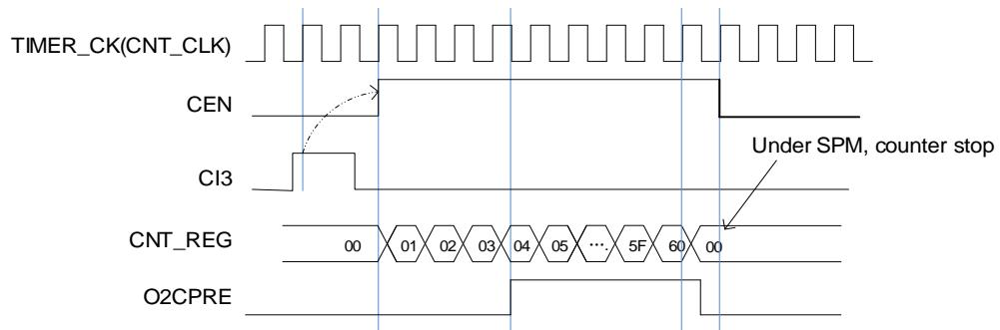

## 定时器互连

定时器之间可配置为内部级联，一个定时器配置为主模式输出TRGO信号，另一个定时器配置为从模式，TRGO信号包括复位事件、使能事件、更新事件、捕获比较脉冲事件、比较事件。从定时器接收到ITIx信号，并执行对应的操作，包括内部时钟模式、正交编码模式、复位模式、暂停模式、事件模式、外部时钟模式。

22-32. 0 / 显示了当定时器 0 配置为从模式时的触发选择。

图 22-32. 定时器 0 主/从模式的例子

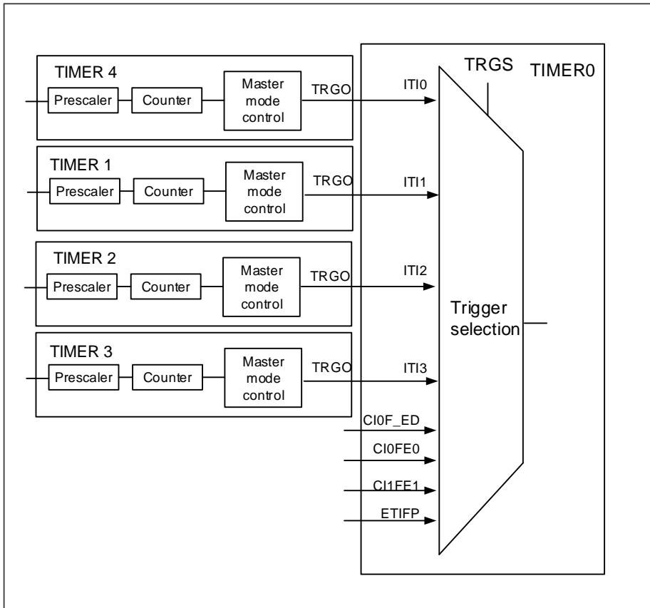

其他定时器互连的例子：

- 定时器2作为定时器0的预分频器

参考图22-32. 定时器0 主/从模式的例子连接配置定时器 2 为定时器 0 的预分频器，步骤如下：

1. 配置定时器 2 为主模式，选择其更新事件（UPE）为触发输出（配置 TIMER2_CTL1 寄存器的 MMC=3’b010）。定时器 2 在每次计数器溢出时，输出一个周期信号；

2. 配置定时器 2 周期（TIMER2_CAR 寄存器）；

3. 选择定时器 0 输入触发源为定时器 2（配置 TIMERx_SMCFG 寄存器的 TRGS=3’b001）

4. 配置定时器 0 在外部时钟模式 0 （配置 TIMERx_SMCFG 寄存器的 SMC=3’b111）；

5. 写 1 到 CEN 位启动定时器 0 （TIMER0_CTL0 寄存器）；

6. 写 1 到 CEN 位启动定时器 2 （TIMER2_CTL0 寄存器）。

- 使用一个外部触发来同步两个定时器

配置定时器 2 的使能信号触发定时器 0 的开启，配置定时器 2 的 CI0 输入信号上升沿来触发定时器 2。为了确保两个定时器同步开启，定时器 2 必须配置在主/从模式。步骤如下：

1. 配置定时器 2 工作在从模式来获取来自 CI0 的触发输入（配置 TIMER2_SMCFG 寄存器的TRGS=3’b100）；

2. 配置定时器 2 工作在事件模式（配置 TIMER2_SMCFG 寄存器的 SMC=3’b110）；

3. 写 MSM=1（TIMER2_SMCFG 寄存器）来配置定时器 2 工作在主/从模式；

4. 配置定时器0的触发输入来自定时器2 （配置TIMERx_SMCFG 寄存器的TRGS=3’b010）；

5. 配置定时器 0 工作在事件模式（配置 TIMER0_SMCFG 寄存器的 SMC=3’b110）。

当定时器 2 的 CI0 信号产生上升沿时，两个定时器的计数器在内部时钟下开始同步计数，二者的 TRGIF 标志位都被置 1。

图 22-33. 用定时器 2 的 CI0 输入来触发定时器 0和定时器 2

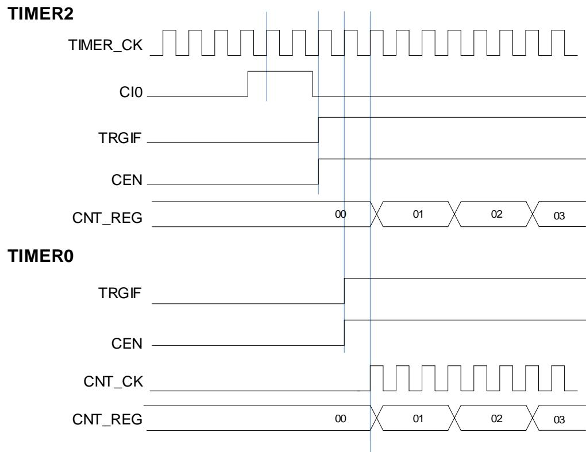

## 定时器 DMA模式

定时器 DMA 模式是指通过 DMA 模块配置定时器的寄存器。有两个跟定时器 DMA 模式相关的寄存器：TIMERx_DMACFG 和 TIMERx_DMATB。当然，必须要使能 DMA 请求，一些内部中断事件可以产生 DMA请求。当中断事件发生，TIMERx 会给 DMA发送请求。DMA配置成M2P 模式，PADDR 是 TIMERx_DMATB 寄存器地址，DMA 就会访问 TIMERx_DMATB 寄存器。实际上，TIMERx_DMATB 寄存器只是一个缓冲，定时器会将 TIMERx_DMATB 映射到一个内部寄存器，这个内部寄存器由 TIMERx_DMACFG 寄存器中的 DMATA 来指定。如果TIMERx_DMACFG 寄存器的 DMATC 位域值为 0，表示 1 次传输，定时器的发送 1 个 DMA请求就可以完成。如果 TIMERx_DMACFG 寄存器的 DMATC 位域值不为 1，例如其值为 3，表示4次传输，定时器就需要再多发3次DMA请求。在这3次请求下，DMA对TIMERx_DMATB寄存器的访问会映射到访问定时器的DMATA+0x4, DMATA+0x8, DMATA+0xc寄存器。总之，发生一次 DMA 内部中断请求，定时器会连续发送（DMATC+1）次请求。如果再来 1 次 DMA请求事件，TIMERx 将会重复上面的过程。

## 定时器调试模式

当 Cortex®-M33 内核停止，DBG_CTL2 寄存器中的 TIMERx_HOLD 配置位被置 1，定时器计数器停止。
