## 24.1. 内部集成电路总线接口（I2Cx，x=0,1,2）

## 24.1.1. 简介

I2C（内部集成电路总线）模块提供了符合工业标准的两线串行制接口，可用于 MCU 和外部I2C 设备的通讯。I2C 总线使用两条串行线：串行数据线 SDA 和串行时钟线 SCL。

I2C 接口模块实现了 I2C 协议的标速模式，快速模式，具备 CRC 计算和校验功能、支持 SMBus（系统管理总线）、PMBus（电源管理总线）和 SAM_V（验证安全控制模块）模式，此外还支持多主机 I2C 总线架构。I2C 接口模块也支持 DMA 模式，可有效减轻 CPU 的负担。

## 24.1.2. 主要特性

- 并行总线至 I2C 总线协议的转换及接口。

- 同一接口既可实现主机功能又可实现从机功能。

- 主从机之间的双向数据传输。

- 支持 7 位和 10 位的地址模式和广播寻址。

- 支持 I2C 多主机模式。

- 支持标速（最高 100 kHz），快速（最高 400 kHz）。

- 从机模式下可配置的 SCL 主动拉低。

- 支持 DMA 模式。

- 兼容 SMBus 2.0 和 PMBus。

- 两个中断：字节成功传输中断和错误事件中断。

- 可选择的 PEC（报文错误校验）生成和校验。

- 支持 SAM_V 模式。

- 支持数字和模拟噪声滤波器。

## 24.1.3. 功能描述

I2C 接口的内部结构如图24-1. I2C模块框图所示。

图 24-1. I2C 模块框图

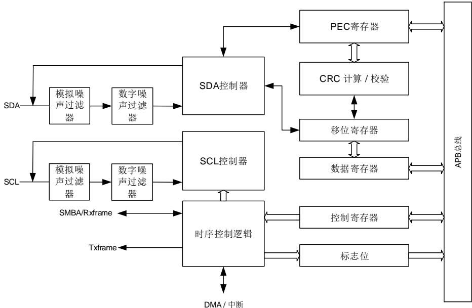

表 24-1. I2C 总线术语说明（参考飞利浦 I2C 规范）

<table><tr><td>术语</td><td>说明</td></tr><tr><td>发送器</td><td>发送数据到总线的设备</td></tr><tr><td>接收器</td><td>从总线接收数据的设备</td></tr><tr><td>主机</td><td>初始化数据传输,产生时钟信号和结束数据传输的设备</td></tr><tr><td>从机</td><td>由主机寻址的设备</td></tr><tr><td>多主</td><td>多个主机可以尝试在不破坏信息的前提下同时控制总线</td></tr><tr><td>同步</td><td>同步两个或更多设备之间的时钟信号的过程</td></tr><tr><td>仲裁</td><td>如果超过一个主机同时试图控制总线,只有一个主机被允许,且获胜主机的信息不被破坏</td></tr></table>

## SDA 线和 SCL 线

I2C 模块有两条接口线：串行数据 SDA线和串行时钟 SCL 线。连接到总线上的设备通过这两根线互相传递信息。

S 和 SC 都是双向线，通过一个电流源或者上拉电阻接到电源正极。当总线空闲时，两条线都是高电平。连接到总线的设备输出极必须是开漏或者开集，以提供线与功能。 总线上的数据在标准模式下可以达到 100 Kbit/s，在快速模式下可以达到 400 Kbit/s。由于 I2C 总线上可能会连接不同工艺的设备（CMOS，NMOS，双极性器件），逻辑‘0’和逻辑‘1’的电平并不是固定的，取决于 V 的实际电平。

## 数据有效性

时钟信号的高电平期间 SDA 线上的数据必须稳定。只有在时钟信号 SCL 变低的时候数据线SDA 的电平状态才能跳变（如图 24-2. 数据有效性）。每个数据比特传输需要一个时钟脉冲。

图 24-2. 数据有效性

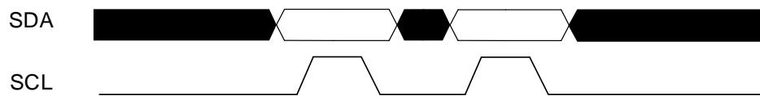

## 开始和停止信号

所有的数据传输起始于一个 START 结束于一个 STOP（参见图 24-3. 起始和停止信号）。START 信号定义为，在 SCL 为高时，SDA 线上出现一个从高到低的电平转换。STOP信号定义为，在 SCL 为高时，SDA线上出现一个从低到高的电平转换。

图 24-3. 起始和停止信号

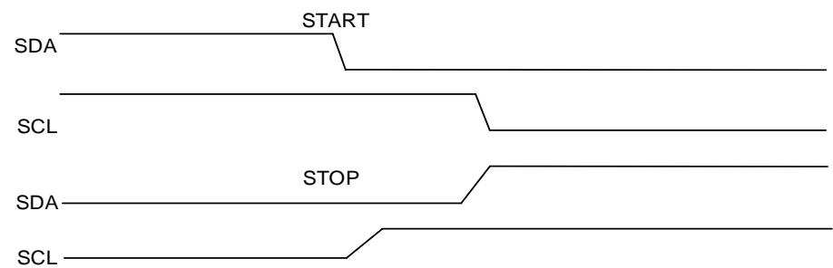

## 时钟同步

两个主机可以同时在空闲总线上开始传送数据，因此必须通过一些机制来决定哪个主机获取总线的控制权并完成传输，这一般是通过时钟同步和仲裁来完成的。单主机系统下不需要时钟同步和仲裁机制。

时钟同步通过 SCL 线的线与来实现。这就是说 SCL 线的高到低切换会使器件开始计数它们的低电平周期，而且当主机的时钟变低电平时，它会使 SCL 线保持这种状态直到到达时钟的高电平（参见图 24-4. 时钟同步）。但是如果另一个时钟仍处于低电平周期，这个时钟的低到高切换不会改变 SCL 线的状态。因此 SCL 线被有最长低电平周期的器件保持低电平。此时低电平周期短的器件会进入高电平的等待状态。

图 24-4. 时钟同步

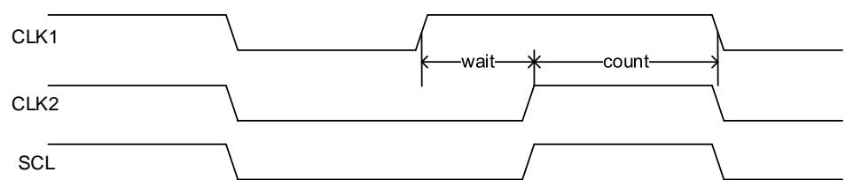

## 仲裁

仲裁和同步一样，都是为了解决多主机情况下的总线控制冲突。仲裁的过程与从机无关。

只有在总线空闲的时候主机才可以启动传输。两个主机可能在START信号的最短保持时间内在总线上产生一个有效的START信号，这种情况下需要仲裁来决定由哪个主机来完成传输。

仲裁逐位进行，在每一位的仲裁期间，当 SCL 为高时，每个主机都检查 SDA电平是否和自己发送的相同。仲裁的过程需要持续很多位。理论上讲，如果两个主机所传输的内容完全相同，那么它们能够成功传输而不出现错误。如果一个主机发送高电平但检测到 SDA 电平为低，则认为自己仲裁失败并关闭自己的 SDA输出驱动，而另一个主机则继续完成自己的传输。

图 24-5. SDA 线仲裁

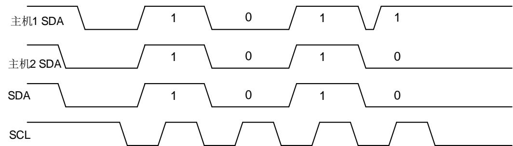

## I2C 通讯流程

每个I2C设备（不管是微控制器，LCD驱动，存储器或者键盘接口）都通过唯一的地址进行识别，根据设备功能，他们既可以是发送器也可作为接收器。

I2C从机检测到I2C总线上的START信号之后，就开始从总线上接收地址，之后会把从总线接收到的地址和自身的地址（通过软件编程）进行比较，当两个地址相同时，I2C从机将发送一个确认应答（ACK），并响应总线的后续命令：发送或接收所需数据。此外，如果软件开启了广播呼叫，则I2C从机始终对一个广播地址（0x00）发送确认应答。I2C模块始终支持7位和10位的地址。

I2C 主机负责产生 START 信号和 STOP 信号来开始和结束一次传输，并且负责产生 SCL 时钟。

图 24-6. 7 位地址的 I2C 通讯流程

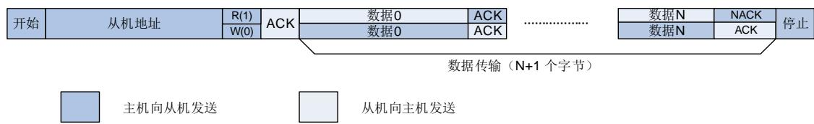

图 24-7. 10 位地址的 I2C 通讯流程（主机发送）

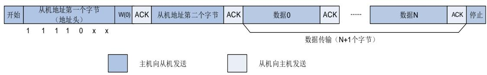

图 24-8. 10 位地址的 I2C 通讯流程（主机接收）

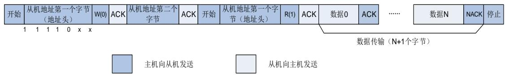

## 软件编程模型

一个 I2C 设备例如 LCD 驱动器可能只是作为一个接收器，但是一个存储器既可以接收数据，也能发送数据。除了按照发送/接收方来区分，I2C 设备也分为数据传输的主机和从机。主机是指负责初始化总线上数据的传输并产生时钟信号的设备，此时任何被寻址的设备都是从机。

不管 I2C 设备是主机还是从机，都可以发送或接收数据，因此，I2C 设备有以下 4 种运行模式：

- 主机发送方

- 主机接收方

- 从机发送方

- 从机接收方

模块支持以上四种模式。系统复位以后， 默认工作在从机模式下。通过软件配置使在总线上发送一个 START 信号之后，I2C 变为主机模式，软件配置在 I2C 总线上发送 STOP信号后，I2C 又变回从机模式。

## 从机发送模式下的软件流程

如图24-9. 从机发送模式 （10位地址模式） 所示，在从机模式下要发送数据，软件应该按照以下步骤来运行操作：

1. 首先，软件应该使能I2C外设时钟，以及配置I2C_CTL1中时钟相关寄存器来确保正确的I2C时序。使能和配置以后，I2C运行在默认的从机模式状态，等待I2C总线上的START信号和地址。

2. 当接收到一个START信号及随后的地址后，地址可以是7位格式也可以是10位格式，I2C硬件将I2C_STAT0寄存器的ADDSEND位置1，此位应该被软件查询或者中断监视，发现置位后，软件应该读I2C_STAT0寄存器然后读I2C_STAT1寄存器来清除ADDSEND位。如果地址是10位格式，I2C主机应该接着再产生一个START并发送一个地址头到I2C总线。从机在检测到START和紧接着的地址头之后会继续将ADDSEND位置1。软件可以通过读I2C_STAT0寄存器和接着读I2C_STAT1寄存器来第二次清除ADDSEND位。

3. 现在I2C进入数据发送状态，由于移位寄存器和数据寄存器I2C_DATA都是空的，硬件将TBE位置1。软件此时可以写入第一个字节数据到I2C_DATA寄存器，但是TBE位并没有被清0，因为写入I2C_DATA寄存器的字节被立即移入内部移位寄存器。当移位寄存器非空的时候，I2C开始发送数据到I2C总线。

4. 第一个字节的发送期间，软件可以写第二个字节到I2C_DATA，此时TBE位被清0，因为I2C_DATA寄存器和移位寄存器都不是空。

5. 第一个字节的发送完成之后，TBE被再次置起，软件可以写第三个字节到I2C_DATA，同时TBE位被清0。在此之后，任何时候TBE被置1，只要依然有数据待被发送，软件都可以写入一个字节到I2C_DATA寄存器。

6. 倒数第二个字节发送期间，软件写最后一个数据到I2C_DATA寄存器来清除TBE标志位，之后就再不用关心TBE的状态。TBE位会在倒数第二个字节发送完成后置起，直到检测到STOP信号时被清0。

7. 根据 I2C 协议，I2C 主机将不会对接收到的最后一个字节发送应答，所以在最后一个字节

软件操作流程

发送结束后，I2C 从机的 AERR（应答错误）会置起以通知软件发送结束。软件写 0 到AERR 位可以清除此位。

图 24-9. 从机发送模式（10 位地址模式）

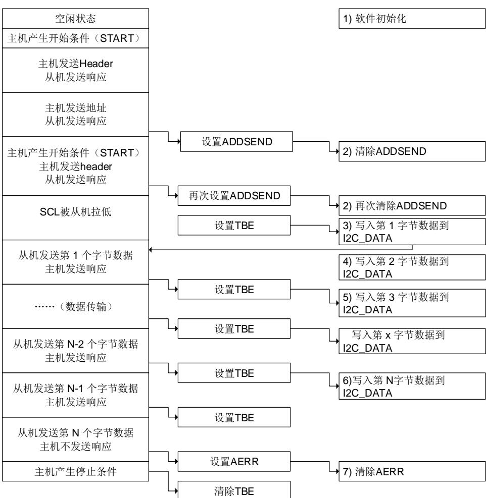

## 从机接收模式下的软件流程

如图 1 从机接收模式 （1 位地址模式） 所示，在从机模式下接收数据时，软件应该遵循这些步骤来操作：

首先，软件应该使能 C外设时钟，以及配置 C C 中时钟相关寄存器来确保正确的I2C时序。使能和配置以后，I2C运行在默认的从机模式状态，等待START信号以及地址。

2. 在接收到START起始信号和匹配的7位或10地址之后，I2C硬件将I2C状态寄存器0的ADDSEND位置1，此位应该通过软件轮询或者中断来检测，发现置起后，软件通过先读I2C_STAT0寄存器然后读I2C_STAT1寄存器来清除ADDSEND位。当ADDSEND位被清0时，I2C就开始接收来自I2C总线的数据。

3. 当接收到第一个字节时，RBNE位被硬件置1，软件可以读取I2C_DATA寄存器的第一个字节，此时RBNE位也被清0。

4. 任何时候RBNE被置1，软件可以从I2C_DATA寄存器读取一个字节。

软件操作流程

5. 接收到最后一个字节后，RBNE被置1，软件可以读取最后的字节。

6. 当 I2C 检测到 I2C 总线上一个 STOP 信号，STPDET 位被置 1，软件通过先读 I2C_STAT0寄存器再写 I2C_CTL0 寄存器来清除 STPDET 位。

图 24-10. 从机接收模式（10 位地址模式）

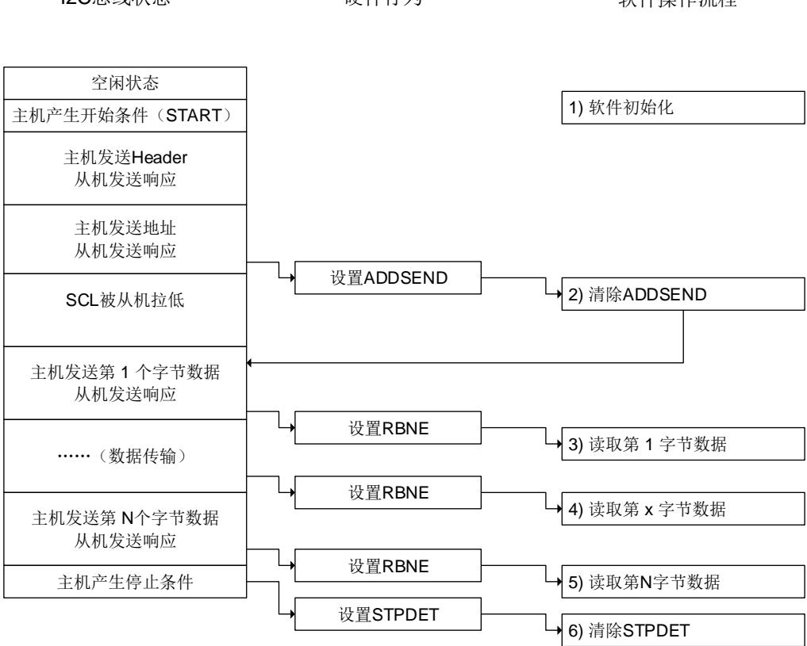

## 主机发送模式下的软件流程

如图24-11. 主机发送模式 （10位地址模式） 所示，在主机模式下发送数据到I2C总线时，软件应该遵循这些步骤来运行I2C模块：

1. 首先，软件应该使能I2C外设时钟，以及配置I2C_CTL1中时钟相关寄存器来确保正确的I2C时序。使能和配置以后，I2C运行在默认的从机模式状态，等待START信号，随后等待I2C总线寻址。

2. 软件将START位置1，在I2C总线上产生一个START信号。

3. 发送一个START信号后，I2C硬件将I2C_STAT0的SBSEND位置1然后进入主机模式。现在软件应该读I2C_STAT0寄存器然后写一个7位地址位或10位地址的地址头到I2C_DATA寄存器来清除SBSEND位。当SBSEND位被清0时，I2C就开始发送地址或者地址头到I2C总线。如果发送的地址是10位地址的地址头，硬件在发送地址头的时候会将ADD10SEND位置1，软件应该通过读I2C_STAT0寄存器然后写10位低地址到I2C_DATA来清除ADD10SEND位。

4. 7位或10位的地址位发送出去之后，I2C硬件将ADDSEND位置1，软件通过读I2C_STAT0寄存器然后读I2C_STAT1寄存器清除ADDSEND位。

5. I2C进入数据发送状态，因为移位寄存器和数据寄存器I2C_DATA都是空的，所以硬件将

TBE位置1。此时软件可以写第一个字节数据到I2C_DATA寄存器，但是TBE位此时不会被清零，因为写入I2C_DATA寄存器的字节会被立即移入内部移位寄存器。当移位寄存器非空时，I2C就开始发送数据到总线。

6. 在第一个字节的发送过程中，软件可以写第二个字节到I2C_DATA，此时TBE会被清零，因为I2C_DATA寄存器和移位寄存器都不为空。

7. 任意时刻TBE被置1，软件都可以向I2C_DATA寄存器写入一个字节，只要还有数据待发送。

8. 在倒数第二个字节发送过程中，软件写入最后一个字节数据到I2C_DATA来清除TBE标志位，此后就不用关心TBE位的状态。TBE位会在倒数第二个字节发送完成后被置起，直到发送STOP信号时被清零。

9. 最后一个字节发送结束后，I2C 主机将 BTC 位置起，因为移位寄存器和 I2C_DATA 寄存器此时都为空。软件此时应该配置 STOP 来发送一个 STOP 信号，此后 TBE 和 BTC 状态位都将被清 0。

图 24-11. 主机发送模式（10 位地址模式）

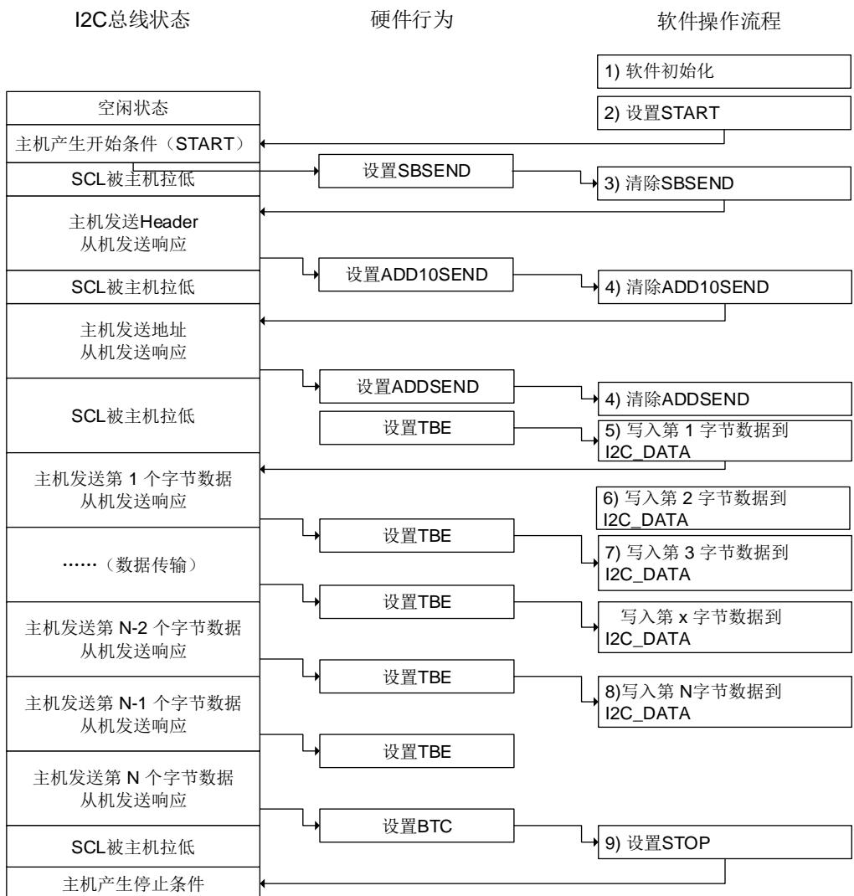

## 主机接收模式下的软件流程

在主机接收模式下，主机需要为最后一个字节接收产生 NACK，然后发送 STOP 信号。因此，需要特别注意以确保最后接收到数据的正确性。下面提供了两种针对主机接收模式的软件编程方案：方案 A 和 B。方案 A 需要保证软件能对 I2C 事件进行快速响应，方案 B 则不需要。

在主机接收模式下，主机需要为最后一个字节接收产生NACK，然后发送STOP信号。因此，需要特别注意以确保最后接收到数据的正确性。下面提供了两种针对主机接收模式的软件编程方案：方案A和B。方案A需要保证软件能对I2C事件进行快速响应，方案B则不需要。

## 方案 A

1. 首先，软件应该使能I2C外设时钟，以及配置I2C_CTL1中时钟相关寄存器来确保正确的I2C时序。使能和配置以后，I2C运行在默认的从机模式状态，等待START信号，随后等待I2C总线寻址。

2. 软件将START位置1，从而在I2C总线上产生一个START信号。

3. 发送一个START信号后，I2C硬件将I2C_STAT0寄存器的SBSEND位置1然后进入主机模式。现在软件应该读I2C_STAT0寄存器然后写一个7位地址位或10位地址的地址头到I2C_DATA寄存器来清除SBSEND位。当SBSEND位被清0时，I2C就开始发送地址或者地址头到I2C总线。如果发送的地址是10位地址的地址头，硬件在发送地址头的时候会先将ADD10SEND位置1，软件应该通过读I2C_STAT0寄存器然后写10位低地址到I2C_DATA来清除ADD10SEND位。

4. 7位或10位的地址位发送出去之后，I2C硬件将ADDSEND位置1，软件应该通过读I2C_STAT0寄存器然后读I2C_STAT1寄存器清除ADDSEND位。如果地址是10位格式，软件应该再次将START位置1来重新产生一个START。在START产生后，SBSEND位会被置1。软件应该通过先读I2C_STAT0然后写地址头到I2C_DATA来清除SBSEND位，然后地址头被发到I2C总线，ADDSEND再次被置1。软件应该再次通过先读I2C_STAT0然后读I2C_STAT1来清除ADDSEND位。

5. 当接收到第一个字节时，硬件会将RBNE位置1。此时软件可以从I2C_DATA寄存器读取第一个字节，之后RBNE位被清0。

6. 此后任何时候RBNE被置1，软件就可以从I2C_DATA寄存器读取一个字节。

7. 接收完倒数第二个字节（N-1）数据之后，软件应该立即将ACKEN位清0，并将STOP位置1，这一过程需要在最后一个字节接收完毕之前完成，以确保NACK发送给最后一个字节。

8. 最后一个字节接收完毕后，RBNE 位被置 1，软件可以读取最后一个字节。由于 ACKEN已经在前一步骤中被清 0，I2C 不再为最后一个字节发送 ACK，并在最后一个字节发送完毕后产生一个 STOP 信号。

以上步骤要求字节数目 N>1，如果 N=1，步骤 7 应该在步骤 4 之后就执行，且需要在字节接收完成之前完成。

图 24-12. 主机接收使用方案 A模式（10 位地址模式）

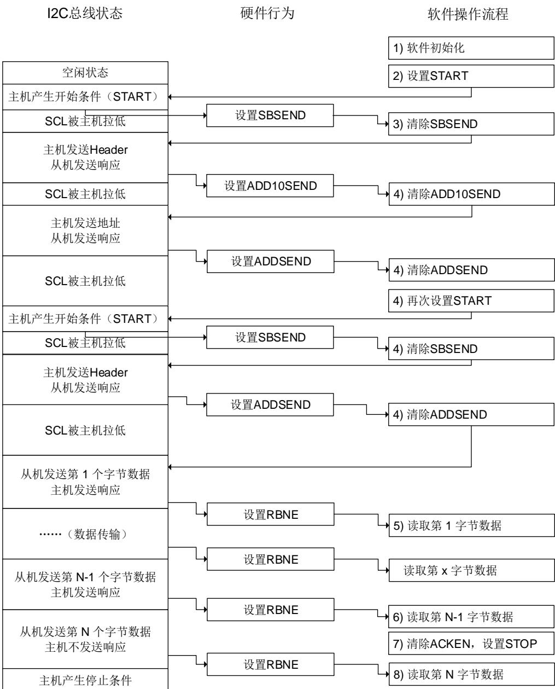

## 方案 B

1. 首先，软件应该使能I2C外设时钟，配置I2C_CTL1中时钟相关寄存器来确保正确的I2C时序。初始化完成之后，I2C运行在默认的从机模式状态，等待START信号和地址。

2. 软件将START位置1，从而在I2C总线上产生一个START信号。

3. 发送一个START信号后，I2C硬件将I2C_STAT0寄存器的SBSEND位置1然后进入主机模式。现在软件应该读I2C_STAT0寄存器然后写一个7位地址位或10位地址的地址头到I2C_DATA寄存器来清除SBSEND位。当SBSEND位被清0时，I2C就开始发送地址或者地址头到I2C总线。如果发送的地址是10位地址的地址头，硬件在发送地址头之后会将ADD10SEND位置1，软件应该通过读I2C_STAT0寄存器然后写10位低地址到I2C_DATA来清除ADD10SEND位。

4. 7位或10位的地址位发送出去之后，I2C硬件将ADDSEND位置1，软件应该通过读

I2C_STAT0寄存器然后读I2C_STAT1寄存器清除ADDSEND位。如果地址是10位格式，软件应该接着将START位再次置1来产生一个开始信号，START被发送出去以后SBSEND位被再次置1。软件应该通过先读I2C_STAT0然后写地址头到I2C_DATA来清除SBSEND位，然后地址头被发到I2C总线，ADDSEND再次被置1。软件应该再次通过先读I2C_STAT0然后读I2C_STAT1来清除ADDSEND位。

5. 当第一个字节被接收时，RBNE位会被硬件置1。此时软件可从I2C_DATA寄存器读取出第一个字节，同时RBNE位被清0。

6. 此后任何时刻，只要 RBNE 位被置 1，软件就可以从 I2C_DATA 寄存器读取一个字节的数据，直到主机接收了 N-3 个字节。

如图24-13. 主机接收使用方案B 模式 （10 位地址模式） 所示，第 N-2 个字节还没被软件读出，之后第 N-1 个字节被接收，此时 BTC 和 RBNE都被置位，总线就会被主机锁死以阻止最后一个字节的接收。然后软件应该清除 ACKEN 位。

7. 软件从I2C_DATA读出倒数第三个（N-2）字节数据，同时也将BTC位清0。此后第N-1个字节从移位寄存器被移到I2C_DATA，总线得到释放然后开始接收最后一个字节，由于ACKEN已经被清除，因此主机不会给最后一个字节数据发送ACK响应。

8. 最后一个字节接收完毕后，硬件再次把BTC位和RBNE置1，并拉低SCL，软件将STOP位置1，主机发出一个STOP信号。

9. 软件读取第N-1个字节，清除BTC。此后最后一个字节从移位寄存器被移动到I2C_DATA。

10. 软件读取最后一个字节，清除RBNE。

以上步骤需要字节数字 N>2，N=1 和 N=2 的情况近似：

## N=1

在第 4 步，软件应该在清除 ADDSEND 位之前将 ACKEN 位清 0，在清除 ADDSEND 位之后将 STOP 位置 1。当 N=1 时步骤 5 是最后一步。

## N=2

在第 2 步，软件应该在 START 置 1 之前将 POAP置 1。在第 4 步，软件应该在清除 ADDSEND位之前将 ACKEN 位清 0。在第 5 步，软件应该一直等到 BTC 位被置 1 然后将 STOP 位置 1且读取 I2C_DATA 两次。

图 24-13. 主机接收使用方案 B 模式（10 位地址模式）

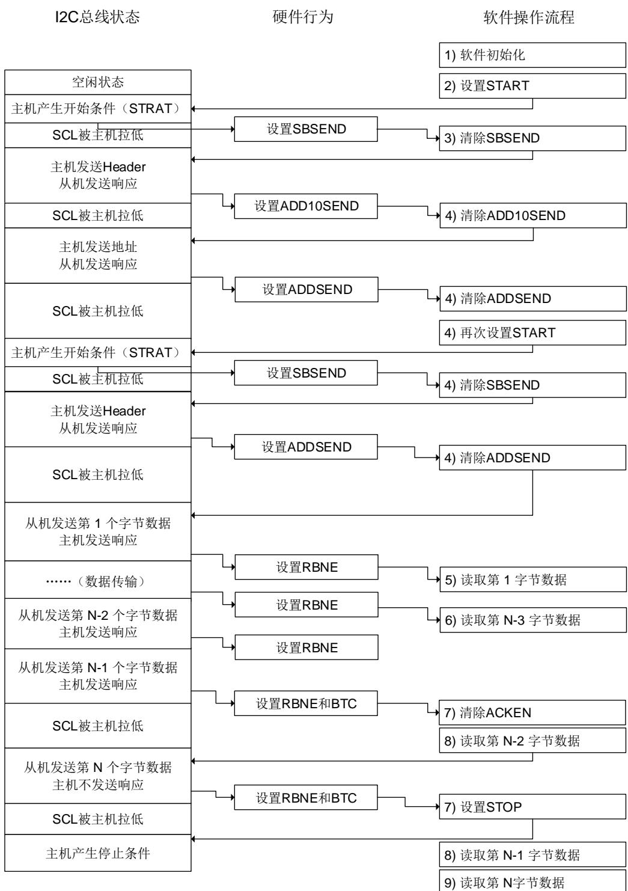

## SCL 线控制

SCL 线拉低功能是为了避免在接收时发生上溢错误以及在发送时发生下溢错误。如在软件编程模型中所示，在发送模式，当 和 C 被置位，发送器保持 SC 线为低电平直到下一个发送数据写入传输缓冲区寄存器。在接收模式，当 RBNE 和 BTC 被置位，发送器保持 SCL线为低电平直到传输缓冲区寄存器里的数据被读出。

当工作在从模式的时候，可以通过置位 I2C_CTL0 寄存器的 SS 位禁止 SCL 线拉低功能。如果该位置位，软件要能足够快的处理 TBE，RBNE 和 BTC 状态，否则上溢或下溢的情况可能会发生。

## DMA 模式下数据传输

按照前面的软件流程，每当 TBE位或 RBNE 位被置 1 之后，软件都应该写或读一个字节，这样将导致 CPU 的负荷较重。I2C 的 DMA 功能可以在 TBE或 RBNE 位置 1 时，自动进行一次写或读操作，从而减轻了 CPU 的负荷，具体 DMA的配置请参看 DMA相关章节。

DMA请求通过 I2C_CTL1 寄存器的 DMAON 位使能。该位应该在清除 ADDSEND 状态位之后被置位。如果一个从机的 SCL 线延长功能被禁止，DMAON 位应该在 ADDSEND 事件前被置位。

参考 DMA 控制器的关于 DMA 的配置方法说明。DMA 必须在 I2C 传输开始之前配置和使能。当指定个数的字节已经传输完成，DMA 会发送一个传输结束（EOT）信号给 I2C 接口，并产生一个 DMA传输完成中断。

当主机接收两个或两个以上字节时，需将 I2C_CTL1 寄存器的 DMALST 位置位。在接收到最后一个字节之后，I2C 主机发送 NACK。在 DMA 传输完成中断 ISR 中，通过置位 STOP 位，产生一个停止信号。

当主机仅接收一个字节时，清除 ADDSEND 状态前 ACKEN 位必须被清除。在清除 ADDSEND状态后或在 DMA 传输完成中断 ISR 中，通过置位 STOP位，产生一个停止信号。

## 报文错误校验

I2C 模块中有一个 PEC（包错误检查）模块，它使用 CRC-8 计算器来执行 I2C 数据的报文校验，CRC 多项式为 x8 + x2 + x + 1，和 SMBus 协议兼容。将 PECEN 位置 1 就可以使能 PEC功能。PEC将会计算所有通过I2C总线发送的数据（包括地址）。软件可以通过配置PECTRANS来控制 I2C 在最后一个字节发送完毕后发送 PEC 值，或者在接收完成后检查接收到的 PEC 值是否正确。在 DMA模式下，如果 PECEN 位和 PECTRANS 位被置 1，I2C 将自动发送或者检查 PEC 值。

## 模拟和数字噪声滤波器

在快速模式下，I2C 协议要求抑制 SDA 和 SCL 线上峰值达到 50ns 的噪声。有两种方法可用来满足这一要求，分别是：模拟噪声滤波器和数字噪声滤波器。

模拟噪声滤波器位于 SCL / SDA的 IO 引脚和 I2C 数字逻辑之间。它是一个抑制峰值达到 50ns的噪声的模拟模块。模拟噪声滤波器默认情况下是使能的，可以通过设置 I2C_FCTL 寄存器的AFD 位禁止。

数字滤波器是位于 I2C 数字逻辑内的一个数字模块。它可以抑制 SCL / SDA 上输入长度达到(DF+1) PCLK 周期的噪声。如果模拟噪声滤波器使能，数字噪声滤波器的输入是模拟噪声滤波器的输出。

模拟和数字滤波器的配置仅在 I2C 禁止时可以改变。

## SMBus 支持

系统管理总线（System Management Bus，简写为 SMBus 或 SMB）是一种结构简单的单端双线制总线，可实现轻量级的通信需求。一般来说， 最常见于计算机主板，主要用于电源传输 ON/OFF 指令的通信。SMBus 是 I2C 的一种衍生总线形式，主要用于计算机主板上的低带宽设备间通信，尤其是与电源相关的芯片，例如笔记本电脑的可充电电池子系统（参见Smart Battery Data）。

## SMBus 协议

SMBus 上每个报文交互都遵从 SMBus 协议中预定义的格式。SMBus 是 I2C 规范中数据传输格式的子集。只要 I2C 设备可通过 SMBus 协议之一进行访问，便视为兼容 SMBus 规范。不符合这些协议的 I2C 设备，将无法被 SMBus 和 ACPI 规范所定义的标准方法访问。

## 地址解析协议

SMBus是基于I2C硬件实现的，它使用了I2C的硬件寻址方式，但在I2C的基础上增加了二级软件处理，建立自己独特的系统。比较特别的是SMBus规范包含一个地址解析协议，可用于实现动态地址分配。动态识别硬件和软件使得总线设备能够支持热插拔，无需重启系统便能即插即用。总线中的设备将被自动识别并分配唯一地址。这个优点非常有利于实现即插即用的用户接口。在此协议中，系统中的host与设备之间有一个重要的区别，即host具有分配地址的功能。

## 超时特性

有一种超时特性：假如某个通信耗时太久，便会自动复位设备。这就解释了为什么最小时钟周期为 10kHz——为了防止长时间锁死总线。I2C 在本质上可以视为一个“直流”总线，也就是说当主机正在访问从机的时候，假如从机正在执行一些子程序无法及时响应，从机可以拉住主机的时钟。这样便可以提醒主机：从机正忙，但并不想放弃当前的通信。从机的当前任务结束之后，将可以继续 I2C 通信。I2C 总线协议中并没有限制这个延时的上限，但在 SMBus系统中，这个时间被限定为 25ms。按照 SMBus 协议的假定，如果某个通信耗时太久，就意味着总线出了问题，此时所有设备都应当复位以消除这种问题。这样就并不允许从设备将时钟拉低太长时间。

## 报文错误校验

SMBus 2.0 以及 1.1 都采用了报文错误校验（Packet Error Checking，缩写为 PEC）。在这种模式中，每次通信最后都将传输 PEC 字节。该字节是按照 CRC-8 校验和的方式计算的，计算范围包括整个报文，包括地址以及读/写位。所采用的多项式为 x8+x2+x+1（CRC-8-ATM HEC算法，初始化为 0）。

## SMBus 警报

SMBus 还有一个额外的中断信号，称为 SMBALERT#。从机上发生事件后，可通过这个信号通知主机来访问从机。SMBus 中还定义了较少见的“主机提醒协议”，基于 I2C 多主模式实现类似的提醒功能，但是可以传递更多数据。

注意：当使用 SMBus 主机模式时，默认检查 I2C_SMBA 引脚，默认分配为 AFIO（I2C0 对应PB5，I2C1 对应 PB12，I2C2 对应 PA9），当使能错误中断且 I2C_SMBA 引脚为低电平时会产生中断。因此当不需要 SMBus 警报时应规避使用 I2C_SMBA 管脚，且保证相关 IO 是高电平。

## SMBus 通讯流程

SMBus的通讯流程和标准I2C的流程相似。为了使用SMBus模式，在程序中需要配置几个SMBus特定的寄存器，响应一些SMBus特定标志位，实现那些在SMBus手册中介绍的上层协议。

1. 在通信之前，需要将I2C_CTL0中SMBEN位置1，并且根据需求，配置SMBSEL和ARPEN的值。

2. 为了支持ARP协议（ARPEN=1），在SMBus主机模式下（SMBSEL=1），软件需要响应标志位HSTSMB（在SMBus从机模式下，响应DEFSMB标志位），并实现ARP协议中的功能。

3. 为了支持 SMBus 警告模式，软件应该响应 SMBALT 标志位，并实现相应的功能。

## SAM_V 支持

为了支持 SAM_V 标准，I2C 模块增加两个附加的引脚：txframe 和 rxframe。Txframe 是一个输出引脚，在主机模式下，当该引脚输出电平为高电平时，表示 I2C 是忙的。Rxframe 是一个输入引脚，应该与 SMBALERT 信号一起多路复用。

SAM_V 模式通过置位 I2C_SAMCS 寄存器的 SAMEN 位使能。txframe 和 rxframe 引脚的状态可以通过 I2C_SAMCS 寄存器的 RFR，RFF，TFR，TFF，RXF 和 TXF 标志反映。如果对应的中断使能位置位，将产生 I2C 中断。

## 状态、错误和中断

I2C 有一些状态、错误标志位，通过设置一些寄存器位，便可以从这些标志触发中断（详情参见 I2C 寄存器）。

表 24-2. 事件状态标志位

<table><tr><td>事件标志位名称</td><td>说明</td></tr><tr><td>SBSEND</td><td>主机发送 START 信号</td></tr><tr><td>ADDSEND</td><td>地址发送和接收</td></tr><tr><td>ADD10SEND</td><td>10 位地址模式中地址头发送</td></tr><tr><td>STPDET</td><td>监测到 STOP 信号</td></tr><tr><td>BTC</td><td>字节发送结束</td></tr><tr><td>TBE</td><td>发送时 I2C_DATA 为空</td></tr><tr><td>RBNE</td><td>接收时 I2C_DATA 非空</td></tr><tr><td>RFR</td><td>SAM_V 模式时检测到 rxframe 上升沿</td></tr><tr><td>RFF</td><td>SAM_V 模式时检测到 rxframe 下降沿</td></tr><tr><td>TFR</td><td>SAM_V 模式时检测到 txframe 上升沿</td></tr><tr><td>TFF</td><td>SAM_V 模式时检测到 txframe 下降沿</td></tr></table>

表 24-3. 错误标志位

<table><tr><td>错误名称</td><td>说明</td></tr><tr><td>BERR</td><td>总线错误</td></tr><tr><td>LOSTARB</td><td>仲裁丢失</td></tr><tr><td>OUERR</td><td>当禁用 SCL 拉低后,发生了上溢或下溢</td></tr><tr><td>AERR</td><td>没有接收到应答</td></tr><tr><td>PECERR</td><td>CRC 值不相同</td></tr><tr><td>SMBTO</td><td>SMBus 模式下总线超时</td></tr><tr><td>SMBALT</td><td>SMBus 警报</td></tr></table>
