## 24.2. 内部集成电路总线接口（I2Cx，x=3,4,5）

## 24.2.1. 简介

I2C（内部集成电路总线）模块提供了符合工业标准的两线串行制接口，可用于 MCU 和外部I2C 设备的通讯。I2C 总线使用两条串行线：串行数据线 SDA 和串行时钟线 SCL。

I2C 接口模块实现了 I2C 协议的标速模式，快速模式以及快速+ 模式，具备 CRC 计算和校验功能、支持 SMBus（系统管理总线）和 PMBus（电源管理总线）。此外，I2C 接口模块还支持多主机 I2C 总线架构。I2C 接口模块也支持 DMA 模式，可有效减轻 CPU 的负担。

## 24.2.2. 主要特征

- 并行总线至 I2C 总线协议的转换及接口。

- 同一接口既可实现主机功能又可实现从机功能。

- 主从机之间的双向数据传输。

- 支持 7 位和 10 位的地址模式和广播寻址。

- 多个 7 位从机地址（两个地址，其中一个可配置地址位屏蔽）。

- 可编程的建立时间和保持时间。

- 支持 I2C 多主机模式。

- 支持标速（最高 100 kHz），快速（最高 400 kHz）和快速+ 模式（最高 1MHz，必须在SYSCFG_CFG1 中使能 I2CxFMP（x = 3，4，5））。

- 从机模式下可配置的 SCL 主动拉低。

- 支持 DMA 模式。

- 兼容 SMBus 3.0 和 PMBus 1.3。

- 可选择的 PEC（报文错误校验）生成和校验。

- 可编程模拟过滤器和数字过滤器。

- I2C 地址匹配时，由睡眠模式，深度睡眠模式唤醒。

- 独立于 PCLK 的时钟。

## 24.2.3. 功能说明

I2C 接口的内部结构如图24-14. I2C模块框图所示。

图 24-14. I2C 模块框图

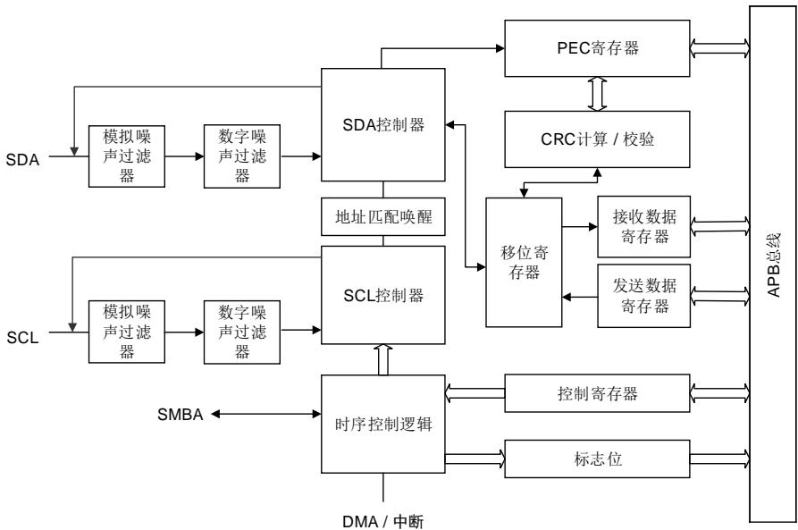

表 24-4. I2C 总线术语说明（参考飞利浦 I2C 规范）

<table><tr><td>术语</td><td>说明</td></tr><tr><td>发送器</td><td>发送数据到总线的设备</td></tr><tr><td>接收器</td><td>从总线接收数据的设备</td></tr><tr><td>主机</td><td>初始化数据传输,产生时钟信号和结束数据传输的设备</td></tr><tr><td>从机</td><td>由主机寻址的设备</td></tr><tr><td>多主</td><td>不破坏信息的前提下同时控制总线的多个主机</td></tr><tr><td>仲裁</td><td>如果超过一个主机同时试图控制总线,只有一个主机被允许,且获胜主机的信息不被破坏,保证上述的过程叫仲裁</td></tr></table>

## 时钟要求

I2C 时钟独立于 PCLK时钟，因此可以独立操作 I2C。

I2C 时钟（I2CCLK）可以从以下三个时钟源中选择：

- APB1 时钟 PCLK1（默认值）

- PLLSAIR：锁相环

- IRC16M：内部 16M RC 时钟

I2C 时钟周期 $\mathtt { t } _ { | 2 \mathsf { C C L K } }$ 必须满足以下条件：

- $\mathsf { t } _ { | 2 \mathsf { C C l } \mathsf { K } } { < } ( \mathsf { t } _ { \mathsf { L O W } } \mathsf { - t } _ { \mathsf { f i l t e r s } } ) / 4$ 

- $\mathsf { t } _ { 1 2 \mathsf { C C L K } } { < } \mathsf { t } _ { \mathsf { H I G H } }$ 

其中：

$\mathsf { t } _ { \mathsf { L O W } } \colon$ SCL 低电平时间

$\mathsf { t } _ { \mathsf { H I G H } } \colon$ SCL 高电平时间

$\sf t _ { f i l t e r s }$ ：在使能滤波器时，表示模拟滤波器和数字滤波器产生的延时总和。模拟滤波器产生

的延时最大值为 260ns，数字滤波器产生的延时为DNF[3:0]×tI2CCLK。

PCLK 时钟周期 $\tt t _ { P C L K } \backslash L$ 须满足以下条件：

$\mathrm { t } _ { \mathsf { P C L K } } { < } 4 / 3 ^ { \star } \mathrm { t } _ { \mathsf { S C L } }$ 

其中：

t ：SCL 周期

注意：当 I2C 内核时钟由 PCLK 提供时，PCLK 必须符合tI2CCLK的条件。

## I2C通讯流程

主机和从机都能实现数据收发，因此，I2C 可以实现四种工作模式：

- 从机发送

- 从机接收

- 主机发送

- 主机接收

## 数据有效性

时钟信号的高电平期间 线上的数据必须稳定。只有在时钟信号 变低的时候数据线SDA 的电平状态才能跳变（如图24-15. 数据有效性。每个数据比特传输需要一个时钟脉冲。

图 24-15. 数据有效性

## 开始和停止信号

所有的数据传输起始于一个 START 结束于一个 STOP（参见图24-16. 开始和停止信号）。START 信号定义为，在 SCL 为高时，SDA 线上出现一个从高到低的电平转换。STOP结束位定义为，在 SCL 为高时，SDA线上出现一个从低到高的电平转换。

图 24-16. 开始和停止信号

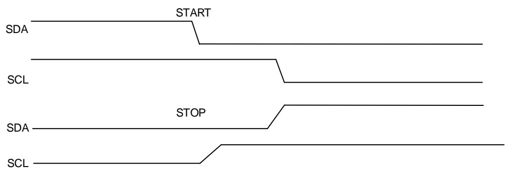

每个 I2C 设备（不管是微控制器，LCD 驱动，存储器或者键盘接口）都通过唯一的地址进行识别，根据设备功能，他们既可以是发送器也可作为接收器。在默认情况下， 设备工作在从机模式下。当 START 信号产生时，I2C 设备由从机模式切换成主机模式。如果仲裁丢失或者STOP 信号产生时，I2C 由主机模式切换成从机模式。支持 I2C 多主机模式。

I2C 从机检测到 I2C 总线上的 START 信号之后，就开始从总线上接收地址，之后会把从总线接收到的地址和自身的地址（通过软件编程）进行比较，当两个地址相同时，I2C 从机将发送一个确认应答（ACK），并响应总线的后续命令：发送或接收所需数据。此外，如果软件开启了广播呼叫，则 I2C 从机始终对一个广播地址（0x00）发送确认应答。I2C 模块支持 7 位和 10位的地址模式。

数据和地址都是 8 位传输，高位在前。START 信号之后的字节（在 7 位地址模式下是一个字节，10 位地址模式下是两个字节）是主机发送的从机地址。

8 个时钟周期字节发送后，第 9 个时钟脉冲期间接收器会发送应答信号至发送器。是否产生ACK 信号可以软件配置。

I2C 主机负责产生 START 信号和 STOP 信号来开始和结束一次传输，并且负责产生 SCL 时钟。

在主机模式下，如果 AUTOEND=1，STOP 信号由硬件产生。如果 AUTOEND=0，STOP 信号由软件产生，或者主机可以产生 RESTART 信号来启动新的数据传输。

图 24-17. 10 位地址的 I2C 通讯流程（主机发送）

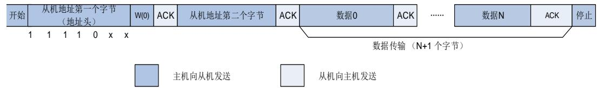

图 24-18. 7 位地址的 I2C 通讯流程（主机发送）

<table><tr><td>开始</td><td>从机地址</td><td>W(0)</td><td>ACK</td><td>数据0</td><td>ACK</td><td>......</td><td>数据N</td><td>ACK</td><td>停止</td></tr></table>

图 24-19. 7 位地址的 I2C 通讯流程（主机接收）

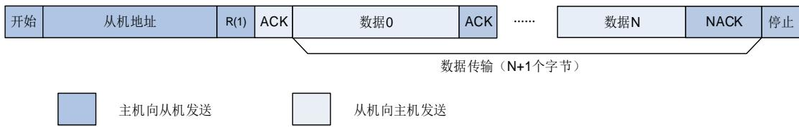

在 10 位寻址模式中，配置 HEAD10R 位可以选择执行完整的寻址序列或只发送地址头。当，执行完整的 位地址寻址读序列 位地址头（写） 第二个地址字节+RESTART+10 位地址头（读），如图 24-20. 10 位地址的 I2C 通讯流程 （主机接收HEAD10R=0） 所示。

在10位寻址模式中，加果主机接收是在主机发送结束后执行，读寻址序列可以是RESTART+10位地址头（读），如图24-21. 10位地址的I2C 通讯流程 （主机接收 HEAD10R=1） 所示

图 24-20. 10 位地址的 I2C 通讯流程（主机接收，HEAD10R=0）

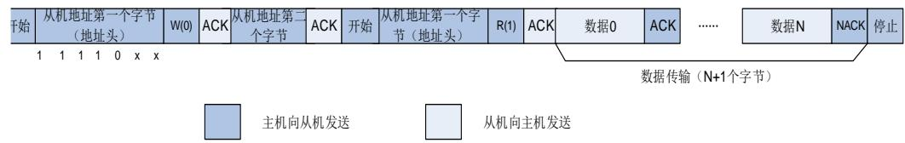

图 24-21. 10 位地址的 I2C 通讯流程（主机接收，HEAD10R=1）

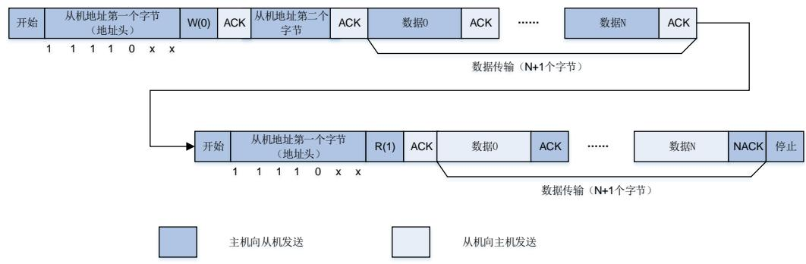

## 噪声滤波器

I2C 外设集成了模拟噪声滤波器和数字噪声滤波器，噪声滤波器可根据实际需要在 I2C 外设启用前进行配置。

将 I2C_CTL0 寄存器中 ANOFF 位置 1 可以禁用模拟噪声滤波器，将 ANOFF 位清 0 时使能模拟噪声滤波器。在快速模式和快速+ 模式下，模拟滤波器需要抑制脉冲宽度高达 50ns 的峰值。

数字滤波器由 I2C_CTL0 寄存器中 DNF[3:0]位来配置。当数字滤波器使能时，SCL 和 SDA 电平保持稳定的时间大于 $\mathsf { D N F } [ 3 : 0 ] \times \mathsf { t } _ { 1 2 \mathsf { C C L K } }$ 才会发生内部变化。抑制峰值宽度可由 DNF[3:0]配置。

## I2C时序配置

在 I2C 通信中，I2C_TIMING 寄存器中 PSC[3:0]，SCLDELY[3:0]和 SDADELY[3:0]用于保证正确的数据保持时间和数据建立时间。

如果数据已经在 I2C_TDATA 寄存器中，在经历 SDADELY 延时后，数据由 SDA 发送，如图24-22. 数据保持时间所示。

图 24-22. 数据保持时间

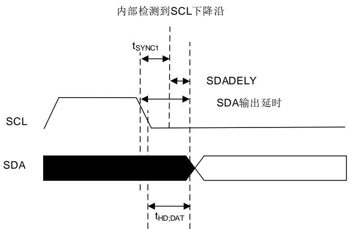

当数据经过 SDA 发送时，SCLDELY计数器开启。如图24-23. 数据建立时间所示。

图 24-23. 数据建立时间

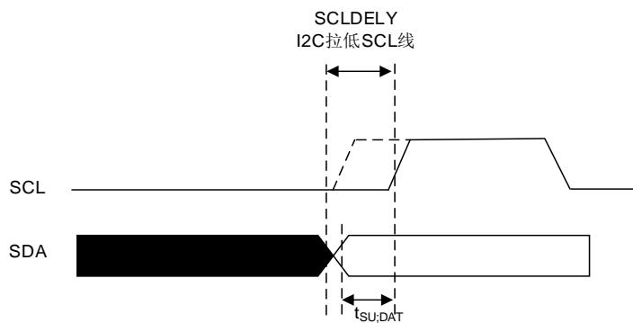

当内部检测到 SCL 下 降沿时，在 SDA 发送 之前会插入一个延时。该延时为$\mathsf { t } _ { \mathsf { S D A D E L Y } } { = } \mathsf { S D A D E L Y } ^ { \star } \mathsf { t } _ { \mathsf { P S C } } { + } \mathsf { t } _ { \mathsf { l } 2 \mathsf { C C L K } } ,$ ，其中 $1 _ { \mathsf { P S C } } = ( \mathsf { P S C } + 1 ) ^ { \star } 1 _ { 1 2 \mathsf { C C L K } ^ { \circ } } \ t _ { \mathsf { S D A D E L Y } }$ 会影响 $\mathfrak { t } _ { \mathsf { H D } ; \mathsf { D A T } }$ 。SDA 输出总延时为 $\mathfrak { t } _ { \mathtt { S Y N C } 1 } + \{ [ \mathtt { S D A D E L Y } ^ { \star } ( \mathsf { P S C } + 1 ) + 1 ] ^ { \star } \mathfrak { t } _ { 1 2 \mathrm { C C L K } } \} ,$ 。tSYNC1由 SCL 下降斜率，模拟滤波器延时，数字滤波器延时和 SCL 与 I2CCLK 时钟的同步延时共同决定。SCL 与 I2CCLK 时钟的同步延时为 2 至 3 个t CC 。

注意： $\yen 123,456,7$ 时， $\mathfrak { t } _ { \mathtt { S D A D E L Y } } = \mathfrak { t } _ { \mathtt { P S C } }$ o

SDADELY必须符合以下条件：

$$
\begin{array}{l l} \blacksquare & S D A D E L Y \geq \left\{t _ {f} (\max) + t _ {H D; D A T} (\min) - t _ {A F} (\min) - [ (D N F + 3) ^ {*} t _ {I 2 C C L K} ] \right\} / [ (P S C + 1) ^ {*} t _ {I 2 C C L K} ] \\ \blacksquare & S D A D E L Y \leq \left\{t _ {H D; D A T} (\max) - t _ {A F} (\max) - [ (D N F + 4) ^ {*} t _ {I 2 C C L K} ] \right\} / [ (P S C + 1) ^ {*} t _ {I 2 C C L K} ] \end{array}
$$

注意： $\mathfrak { t } _ { \mathsf { A F } }$ 为模拟滤波器延时， $\mathfrak { t } _ { \mathsf { H D } ; \mathsf { D A T } }$ 必须小 $\mathrm { F t } _ { \mathsf { V D } ; \mathsf { D A T } }$ 的最大值。

当 SS=0 时，经过延时 ${ \tt t } _ { \tt S D A D E L Y }$ ，在数据写入 I2C_TDATA 寄存器之前，从机会拉低时钟线。在数据建立时间期间 SCL 保持低电平。数据建立时间 $\mathsf { t } _ { \mathsf { S C L D E L Y } } = ( \mathsf { S C L D E L Y + 1 } ) ^ { \star } \mathsf { t } _ { \mathsf { P S C } } \circ \mathsf { t } _ { \mathsf { S C L D E L Y } } .$ 影响 $\mathtt { t _ { S U ; D A T } }$ 。

SCLDELY必须符合以下条件：

$$
\text { SCLDELY } \geq \{[ t _ {r} (\max) + t _ {\text { SU;DAT }} (\min) ] / [ (P S C + 1) ^ {*} t _ {l 2 C C L K} ] \} - 1
$$

在主机模式下，SCL 时钟高低电平由 I2C_TIMING 寄存器中 PSC[3:0]，SCLH[7:0]和 SCLL[7:0]控制。

当内部检测到 SCL 下降沿，在释放 SCL 输出之前会插入一个延时，该延时为$\begin{array} { r } { \mathfrak { t } _ { \mathtt { S C L L } } = ( \mathtt { S C L L } + 1 ) ^ { \star } \mathfrak { t } _ { \mathtt { P S C } } , } \end{array}$ ，其中 $\mathsf { t } _ { \mathsf { P S C } } = ( \mathsf { P S C } + 1 ) ^ { \star } \mathsf { t } _ { \mathsf { I 2 C C L K } ^ { \circ } } \ t _ { \mathsf { S C L L } }$ 影响 SCL 低电平持续时间 $\mathsf { t } _ { \mathsf { L O W } } .$ 

当内部检测 到 SCL 上 升沿，在 将 SCL 拉 低 之前会插入 一个延时 ，该延时为$\mathtt { t _ { S C L H } = ( S C L H + 1 ) ^ { \star } t _ { P S C } }$ ，其中 $\scriptstyle \mathrm { t } _ { \mathsf { P S C } } = ( \mathsf { P S C } + 1 ) ^ { \star } \mathrm { t } _ { 1 2 \mathsf { C C L K } ^ { \circ } } \mathrm { t } _ { \mathsf { S C L H } }$ 影响 SCL 高电平持续时间 $\mathsf { I t } _ { \mathsf { H I G H } }$ 

注意：时序配置和 SS位在 I2C 外设使能时是不能改变的。

表 24-5. 数据建立时间和数据保持时间

<table><tr><td rowspan="2">符号</td><td rowspan="2">参数</td><td colspan="2">标准模式</td><td colspan="2">快速模式</td><td colspan="2">快速 +模式</td><td colspan="2">SMBus</td><td rowspan="2">单位</td></tr><tr><td>最小值</td><td>最大值</td><td>最小值</td><td>最大值</td><td>最小值</td><td>最大值</td><td>最小值</td><td>最大值</td></tr><tr><td>$t_{HD;DAT}$</td><td>数据保持时间</td><td>0</td><td>-</td><td>0</td><td>-</td><td>0</td><td>-</td><td>0.3</td><td>-</td><td rowspan="2">us</td></tr><tr><td>$t_{VD;DAT}$</td><td>数据有效时间</td><td>-</td><td>3.45</td><td>-</td><td>0.9</td><td>-</td><td>0.45</td><td>-</td><td>-</td></tr><tr><td>$t_{SU;DAT}$</td><td>数据建立时间</td><td>250</td><td>-</td><td>100</td><td>-</td><td>50</td><td>-</td><td>250</td><td>-</td><td rowspan="3">ns</td></tr><tr><td>$t_r$</td><td>SCL和SDA信号上升时间</td><td>-</td><td>1000</td><td>-</td><td>300</td><td>-</td><td>120</td><td>-</td><td>1000</td></tr><tr><td>$t_f$</td><td>SCL和SDA信号下降时间</td><td>-</td><td>300</td><td>-</td><td>300</td><td>-</td><td>120</td><td>-</td><td>300</td></tr></table>

## I2C 复位

清除 I2C_CTL0 寄存器中 I2CEN 位可以实现软件复位。当软件复位产生时，SCL 和 SDA 均被释放。通信控制位和状态位也还原成复位值。软件复位对配置寄存器无影响。受到影响的位为 I2C_CTL1 寄存器中 START，STOP 和 NACKEN，I2C_STAT 寄存器中 I2CBSY，TBE，TI，RBNE，ADDSEND，NACK，TCR，TC，STPDET，BERR，LOSTARB 和 OUERR。另外，如果支持 SMBus 模式，I2C_CTL1 寄存器中 PECTRANS 位，I2C_STAT 寄存器中 PECERR，TIMEOUT 和 SMBALT 位也会受到影响。

为了实现软件复位，I2CEN 必须在至少 3 个 APB时钟周期内保持低电平。可以通过以下写软件序列来保证软件复位：

- I2CEN 写 0

- 检查 I2CEN 是否为 0

- I2CEN 写 1

## 数据传输

## 数据发送

在发送数据时，如果 TBE 为 0，表明 I2C_TDATA 寄存器非空，在第九个 SCL 脉冲（应答脉冲）后，I2C_TDATA 寄存器中的数据移入到移位寄存器。移位寄存器中的数据通过 SDA 线移出。如果 TBE 为 1，则表明 I2C_TDATA 寄存器为空，在 I2C_TDATA 不为空之前 SCL 将被拉低。SCL 拉低是在第九个 SCL 脉冲之后。

图 24-24. 数据发送

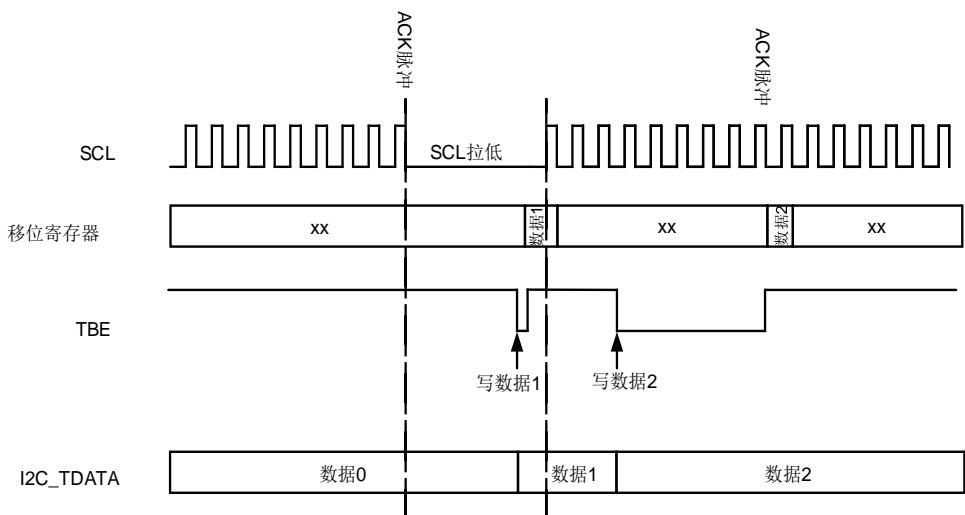

## 数据接收

在接收数据时，数据首先被接收到移位寄存器。如果 RBNE 为 0，移位寄存器中的数据将被移入 I2C_RDATA 寄存器。如果 RBNE为 1，SCL 时钟将被拉低，直到之前接收到的数据字节被读取。这个时钟拉低被插入应答脉冲之前。

图 24-25. 数据接收

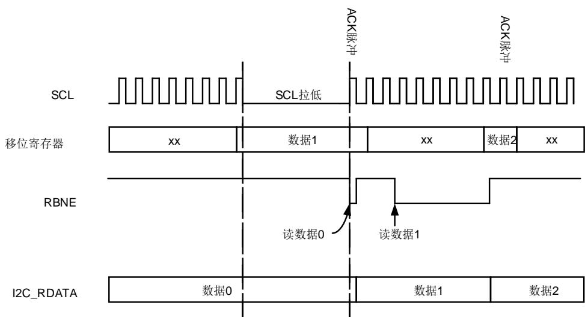

## 硬件传输管理重载和自动结束模式

为了管理字节传输和中断如表24-6. 可关闭通信模式所示几种通信模式，I2C 硬件嵌入了字节计数器。

表 24-6. 可关闭通信模式

<table><tr><td>工作模式</td><td>行为</td></tr><tr><td>主机模式</td><td>产生 NACK, STOP 和 RESTART</td></tr><tr><td>从机接收模式</td><td>ACK 控制</td></tr><tr><td>SMBus 模式</td><td>PEC 生成/校验</td></tr></table>

传输的字节数由 BYTENUM[7:0]在 I2C_CTL1 寄存器中配置。如果 BYTENUM 大于 255，或者处于从机字节控制模式，则必须通过将 I2C_CTL1 寄存器中 RELOAD 位置 1 来使能重载模式。在重载模式下，当 BYTENUM 计数到 0 时，TCR 位将置 1，如果 TCIE 位置 1 将产生中断。当 TCR 位置 1 时，SCL 将被拉低。在 BYTENUM 写一个非零值将清除 TCR 位。

注意：重载模式必须在 BYTENUM[7:0]最后一次重载后禁用。

当使能自动结束模式时，必须禁用重载模式。在自动结束模式下，当 BYTENUM[7:0]计数到 0时，主机将自动发送一个 STOP 信号。

当重载模式和自动结束模式都被禁用时，I2C 通信进程需要由软件终止。如果 BYTENUM[7:0]中的字节数已经传输完成，软件应将 STOP 位置 1 来产生一个 STOP 信号，然后清除 TC。

## I2C从机模式

## 初始化

从机模式下，至少使能一个从机地址。第一个从机地址写在 I2C_SADDR0 寄存器中，第二个从机地址写在 I2C_SADDR1 寄存器中。在使用从机地址时，必须相应地将 I2C_SADDR0 寄存器中 ADDRESSEN 位和 I2C_SADDR1 寄存器中 ADDRESS2EN 置 1。通过设置I2C_SADDR0 寄存器中 ADDFORMAT 位可以选择 7 位地址或 10 位地址，该地址被写在ADDRESS[9:0]。

I2C_CTL2 寄存器中 ADDM[6:0]定义 ADDRESS[7:1]的哪些位和接收到的地址进行比较，哪些位不比较。

ADDMSK2[2:0]用于屏蔽 I2C_SADDR1 寄存器中 ADDRESS2[7:1]，相关详细信息参考I2C_SADDR1 寄存器 ADDMSK2[2:0]位域描述。

当 I2C 接收到的地址与使能的地址其中一个匹配成功时，ADDSEND 将被置 1，如果 ADDMIE置位，将产生中断。I2C_STAT 寄存器 READDR[6:0]将会存储接收到的地址。在 ADDSEND置位时，I2C_STAT 寄存器中 TR 位状态更新。TR 的状态指示从机是作为发送器还是接收器。

## SCL 线控制

当 SS=0 时，时钟拉低功能默认用在从机模式下，在需要的时候 SCL 会被拉低。在下列情况下，SC 会被拉低。

- 当 ADDSEND 置位时 SCL 线拉低，并在 ADDSEND 位清零之后释放。

- 在从机发送模式下，ADDSEND 清零之后，SCL 在第一个字节写入 I2C_TDATA 寄存器之前都是被拉低的。在前一个字节发送完成之后，新的字节写入 I2C_TDATA 寄存器之前，SCL 也是被拉低的。

- 在从机接收模式下，接收过程已完成但是 I2C_RDATA 寄存器中的数据还未被读取，SCL将被拉低。

- 当 SBCTL=1 且 RELOAD=1 时，在最后一个字节传输结束后，TCR 置位。在 TCR 清除之前 SCL 将被拉低。

- SCL 下降沿被检测到之后，在 $[ ( \mathsf { S D A D E L Y + S C L D E L Y + 1 } ) ^ { \star } ( \mathsf { P S C + 1 } ) + 1 ] ^ { \star } \mathsf { I } _ { 1 2 \mathrm { C C L K } }$ 期间 SCL

被拉低。

SCL 线控制可以通过将 I2C_CTL0 寄存器中 SS 位置 1 来禁能。在下列情况下，SCL 不会被拉低。

- 在 ADDSEND 置位时 SCL 将不会被拉低。

- 在从机发送模式下，数据必须在它传输过程产生的第一个 SCL 脉冲之前写入 I2C_TDATA寄存器。否则 I2C_STAT 寄存器中 OUERR 位将会置 1，如果 ERRIE 位也被置 1，将产生一个中断。当 STPDET 位置 1 并且第一个数据开始发送，I2C_STAT 寄存器中 OUERR位也将置 1。

- 在从机接收模式下，数据必须在下一个字节接收产生的第九个 SCL 脉冲（ACK脉冲）之前读取。否则 I2C_STAT 寄存器中 OUERR 位也将置 1。如果 ERRIE 位也被置 1，将产生一个中断。

## 从机字节控制模式

在从机接收模式下要实现字节 ACK 控制，可以通过将 I2C_CTL0 寄存器中 SBCTL 位置 1 来使能从机字节控制模式。当 SS=1 时，从机字节控制模式无效。

在使用从机字节控制模式时，必须通过置位I2C_CTL1寄存器中RELOAD位来使能重载模式。从机字节控制模式中，在 ADDSEND 中断服务程序中 I2C_CTL1 寄存器中 BYTENUM[7:0]必须配置为 1，并且在每个字节接收完成时重载为 1。当接收到一个字节时，I2C_STAT 寄存器中 TCR 位置 1，在第八个和第九个 SCL 时钟脉冲之间从机将 SCL 时钟拉低。然后数据可以从 I2C_RDATA 寄存器中读取出来，通过配置 I2C_CTL1 寄存器中 NACKEN 位，从机可以决定发送 ACK 或者是 NACK。当在 BYTENUM[7:0]写入非零值时，从机释放 SCL 时钟线。

当 BYTENUM[7:0]大于 0x1 时，在 BYTENUM[7:0]数据接收期间，数据流是连续的。

注意：在下列情况下，可以配置 SBCTL 位：

1、 I2CEN=0。 

2、从机还未被寻址。

3、 ADDSEND=1。 

当 ADDSEND=1，或者 TCR=1 时，RELOAD 才可以被修改。

图 24-26. I2C 从机初始化

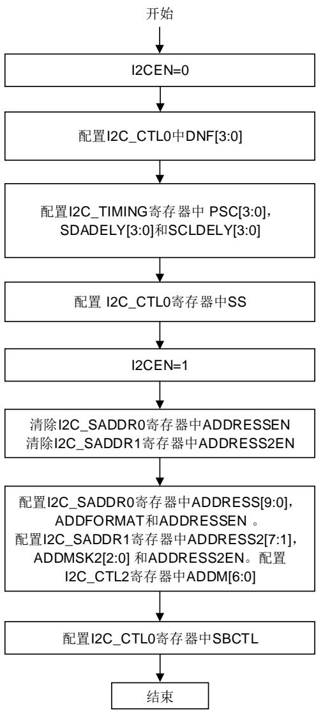

## 从机发送模式下的软件流程

当 I2C_TDATA 寄存器为空，I2C_STAT 寄存器中 TI 位将会置位。如果 I2C_CTL0 寄存器中TIE 位置 1，将产生中断。当接收到 NACK 时，I2C_STAT 寄存器中 NACK 位会置位。如果I2C_CTL0 寄存器中 NACKIE 位置 1，将产生中断。当接收到 NACK 信号时，I2C_STAT 寄存器中 TI 位将不会置位。

当接收到 STOP 信号时，I2C_STAT 寄存器中 STPDET 位将置 1。如果 I2C_CTL0 寄存器中STPDETIE 位置 1，将产生中断。

当 SBCTL=0 时，如果 ADDSEND=1，且 I2C_STAT 寄存器中 TBE 位为 0，可以选择发送I2C_TDATA 寄存器中的数据或者是将 TBE 置 1 来清空 I2C_TDATA 寄存器。

当 SBCTL=1 时，从机工作在字节控制模式，BYTENUM[7:0]必须在 ADDSEND 中断服务程序中配置。TI 事件的数量与 BYTENUM[7:0]的值相等。

当 SS=1 时，I2C_STAT 寄存器中 ADDSEND 位置位时 SCL 时钟线不会被拉低。在这种情况下，I2C_TDATA 寄存器中数据不能在 ADDSEND 中断服务程序中清空。因此待发送的第一个字节应该在 ADDSEND 置位之前就被编程到 I2C_TDATA 寄存器。

- 该数据可以是上一次数据传输最后一次 TI 事件写入的数据。

- 如果该数据不是待发送数据，可通过将 TBE 位置 1 来刷新 I2C_TDATA 寄存器，从而编程新的数据。在数据发送开始时 STPDET 位必须为 0。否则 I2C_STAT 寄存器中 OUERR位将置 1 并产生下溢错误。

- 从机发送模式下使用中断或者 DMA 时，如果需要一个 TI 事件，TI 位和TBE位都必须置1。

图 24-27. I2C 从机发送编程模型（SS=0）

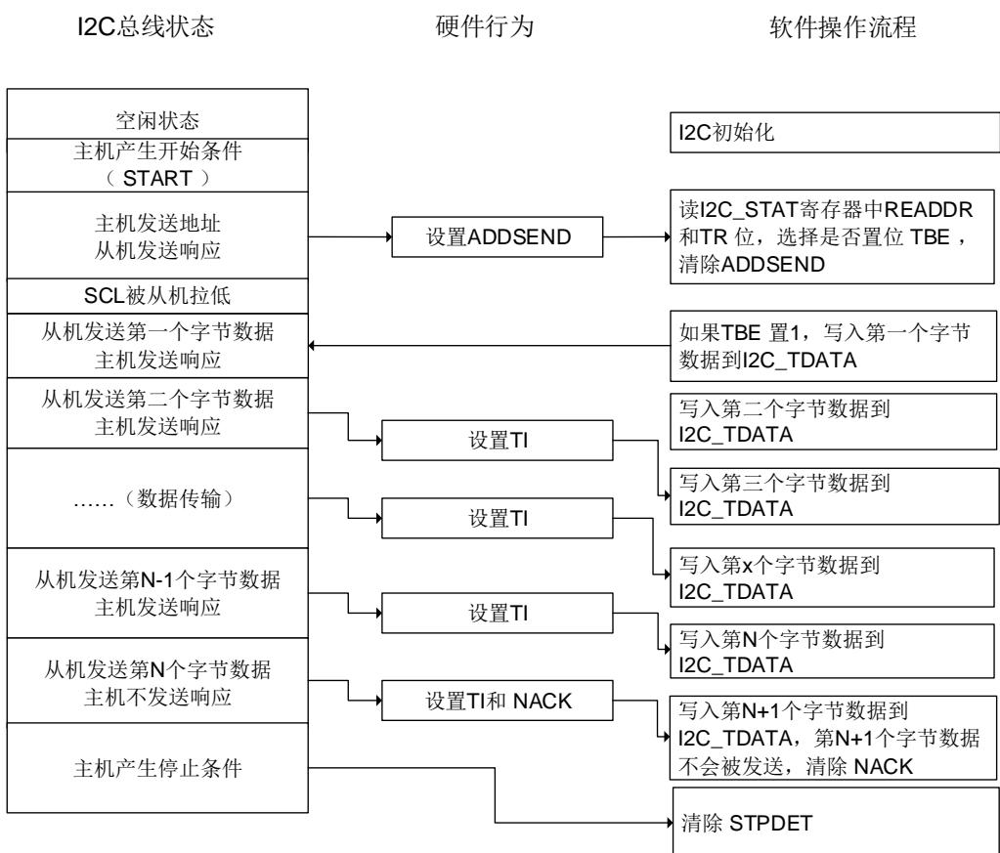

图 24-28. I2C 从机发送编程模型（SS=1）

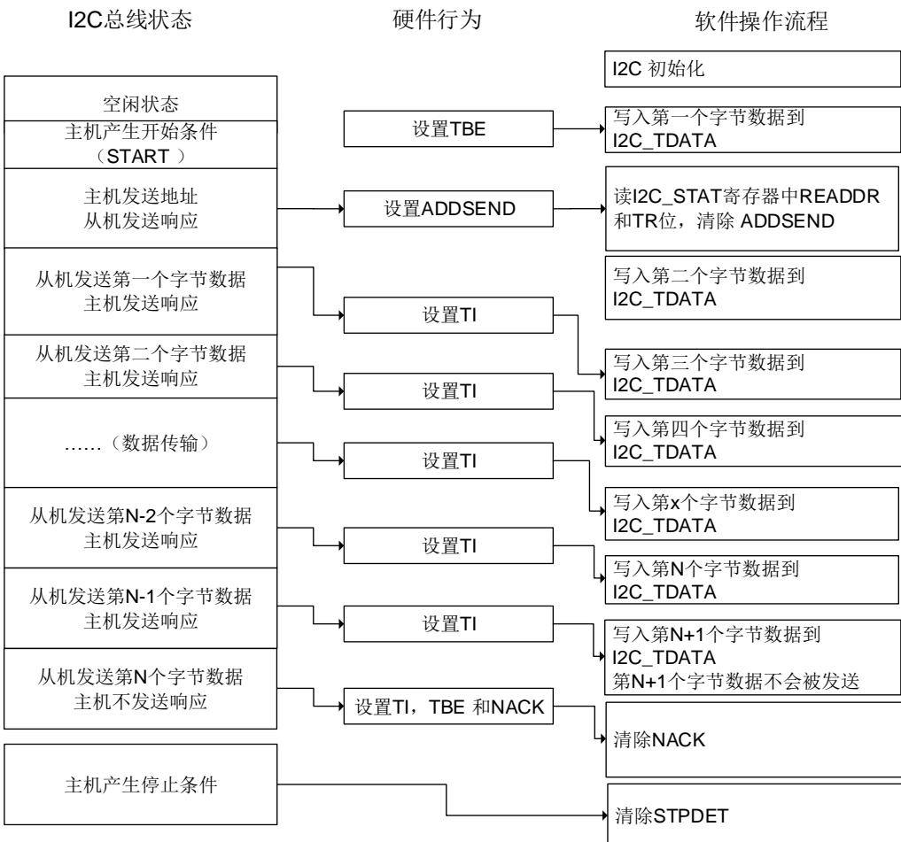

## 从机接收模式下的软件流程

当 I2C_RDATA 寄存器非空，I2C_STAT 寄存器中 RBNE 位置 1，如果 I2C_CTL0 寄存器中RBNEIE 位置 1，将产生中断。当接收到 STOP 信号时，I2C_STAT 寄存器中 STPDET 位将置1。如果 I2C_CTL0 寄存器中 STPDETIE 置 1，将产生中断。

图 24-29. I2C 从机接收编程模型

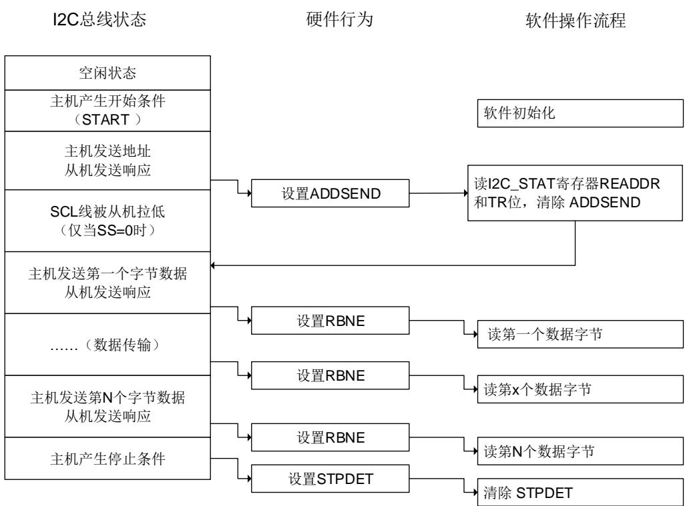

## I2C主机模式

## 初始化

I2C_TIMING 寄存器中 SCLH[7:0]和 SCLL[7:0]必须在 I2CEN=0 时配置。为了支持多主机通信和从机时钟拉低，I2C 实现了时钟同步机制。

SCLL[7:0]和 SCLH[7:0]分别用于低电平计数和高电平计数。经过 $\mathfrak { t } _ { \mathsf { S Y N C } 1 }$ 延时后，当检测到 SCL低电平时，SCLL[7:0]开始计数，如果 SCLL[7:0]计数器的值达到 I2C_TIMING 寄存器中SCLL[7:0]时，I2C 将释放 SCL 时钟。经过 $\mathtt { t } _ { \mathtt { S Y N C 2 } }$ 延时后，当检测到 SCL 高电平时，SCLH[7:0]开始计数，如果 SCLH[7:0]计数器的值达到 I2C_TIMING 寄存器中 SCLH[7:0]时，I2C 将拉低SCL 时钟。

$$
t _ {S C L} = t _ {S Y N C 1} + t _ {S Y N C 2} + \left\{\left[ (S C L H [ 7: 0 ] + 1) + (S L L L [ 7: 0 ] + 1) \right] ^ {*} (P S C + 1) ^ {*} t _ {I 2 C C L K} \right\}
$$

$\mathfrak { t } _ { \mathsf { S Y N C } 1 }$ 取决于 SCL 下降沿斜率，SCL 输入模拟和数字噪声滤波器延时以及 SCL 与 I2CCLK时钟的同步产生的延时，一般为 2 到 3 个 I2CCLK 时钟周期。 $\mathtt { t } _ { \mathtt { S Y N C 2 } }$ 取决于 SCL 上升沿斜率，SCL 输入模拟和数字噪声滤波器延时以及 SCL 与 I2CCLK 时钟的同步产生的延时，一般为 2到 3 个 I2CCLK 时钟周期。数字噪声滤波器产生的延时为DNF[3:0]*tI2CCLK。

在主机模式下，必须配置 I2C_CTL1 寄存器中 ADD10EN，SADDRESS[9:0]以及 TRDIR 位。当在主机接收模式下使用 10 位寻址时，必须配置 HEAD10R 来选择是执行完整的地址寻址序列，还是只发送地址头。待传输的字节数在 I2C_CTL1 寄存器 BYTENUM[7:0]配置。如果待传输的字节数大于或者等于 255，必须将 BYTENUM[7:0]配置为 0xFF。然后主机发送 START 信号。以上提到的所有位必须在START位置1之前配置。START信号发送完成之后，待I2C_STAT寄存器 I2CBSY 位为 0 时，发送从机地址。当仲裁丢失时，主机切换成从机模式，START 位由硬件清零。当从机地址发送完成时，START 位由硬件清零。

注意：BYTENUM[7:0]不能配置为 0。

在 10 位寻址模式下，在发送 10 位地址头之后，如果主机接收到 NACK，主机将重发 10 位地址头直到收到 ACK。将 ADDSENDC 置 1 可以停止重发从机地址。

如果 START 位置 1 时，I2C 作为从机被寻址成功，ADDSEND 置 1，主机将切换为从机模式。START 位将在 ADDSENDC 置 1 时清零。

图 24-30. I2C 主机初始化

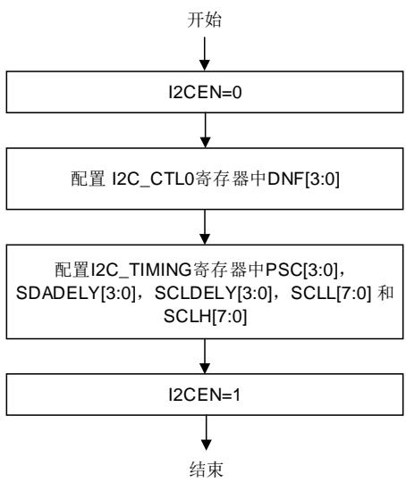

## 主机发送模式下的软件流程

在主机发送模式下，每一个字节发送完成并接收到 ACK信号之后，TI位将置1。如果I2C_CTL0寄存器中TIE位置1，将产生中断。待发送的字节数编程在I2C_CTL1寄存器BYTENUM[7:0]。如果发送字节数大于 255，必须通过将 I2C_CTL1 寄存器 RELOAD 位置 1 来使能重载模式。在重载模式下，当 BYTENUM[7:0]个字节传输完成，I2C_STAT 寄存器 TCR 位将置 1，并且在BYTENUM[7:0]更新一个非零值之前，SCL 被拉低。

如果接收到 NACK，TI 位将不会置 1。

- 如果 BYTENUM[7:0]个字节传输完成且 RELOAD=0，将 I2C_CTL1 寄存器中 AUTOEND置 1 可以自动产生 STOP 信号。当 AUTOEND=0 时，I2C_STAT 寄存器 TC 位将置 1 且SCL 被拉低。在这种情况下，主机可以通过将 I2C_CTL1 寄存器中 STOP 位置 1 来产生STOP 信号。或者产生 RESTART 信号来开始一个新的数据传输过程。将 START / STOP置 1 可以清除 TC 位。

- 如果接收到 NACK 信号，I2C 将自动产生 STOP 信号。I2C_CTL0 寄存器中 NACK 将置1，如果 NACKIE 位置 1，将产生中断。

注意：当 RELOAD=1 时，AUTOEND 位无效。

图 24-31. I2C 主机发送编程模型（N<=255）

<table><tr><td>I2C总线状态</td><td>硬件行为</td><td>软件操作流程</td></tr><tr><td>空闲状态</td><td></td><td>软件初始化</td></tr><tr><td rowspan="2">主机产生开始条件(START)</td><td rowspan="2"></td><td>AUTOEND=0BYTENUM[7:0]=N</td></tr><tr><td>设置START</td></tr><tr><td>主机发送地址从机发送响应</td><td></td><td></td></tr><tr><td>等待从机发送的ACK</td><td>设置TI</td><td>写入第一个字节数据到I2C_TDATA</td></tr><tr><td>主机发送第一个字节数据从机发送响应</td><td></td><td>写入第二个字节数据到I2C_TDATA</td></tr><tr><td rowspan="2">......(数据传输)</td><td>设置TI</td><td>写入第三个字节数据到I2C_TDATA</td></tr><tr><td>设置TI</td><td>写入第x个字节数据到I2C_TDATA</td></tr><tr><td rowspan="2">主机发送第N-2个字节数据从机发送响应</td><td></td><td></td></tr><tr><td>设置TI</td><td>写入第N个字节数据到I2C_TDATA</td></tr><tr><td rowspan="2">主机发送第N-1个字节数据从机发送响应</td><td></td><td></td></tr><tr><td>设置TI</td><td></td></tr><tr><td rowspan="2">主机发送第N个字节数据从机发送响应</td><td></td><td></td></tr><tr><td>设置TC</td><td></td></tr><tr><td>主机产生停止条件,清除TC</td><td></td><td>设置STOP</td></tr></table>

图 24-32. I2C 主机发送编程模型（N>255）

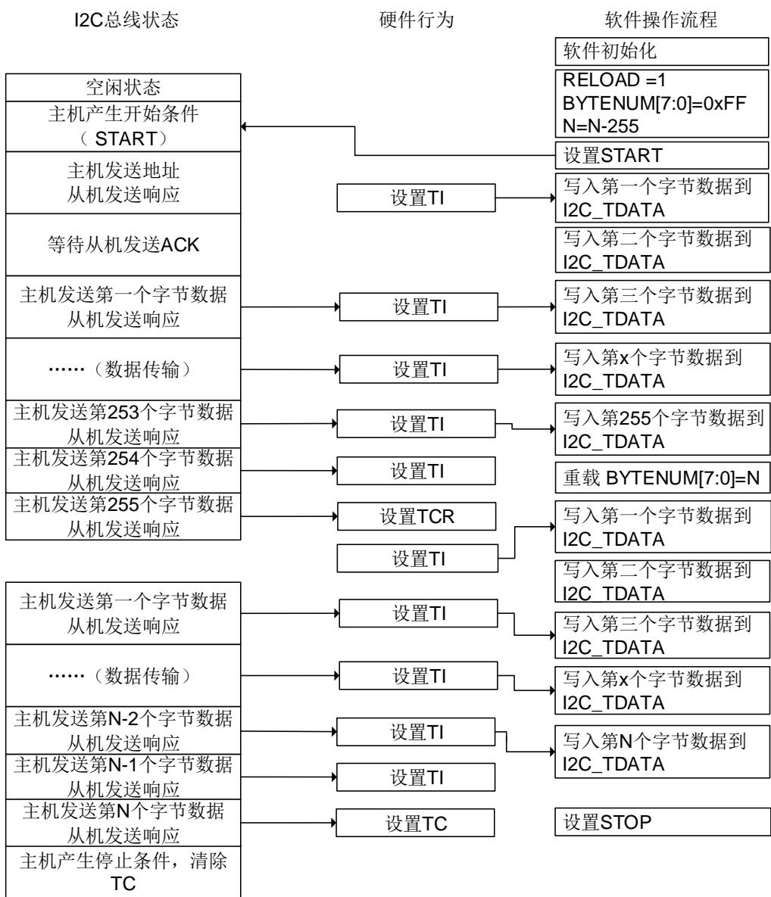

## 主机接收模式下的软件流程

在主机接收模式下，当接收到一个字节时，I2C_STAT 寄存器中 RBNE 位置 1。如果 I2C_CTL0寄存器中 RBNEIE 置 1，将产生一个中断。如果待接收字节数大于 255，必须将 I2C_CTL1 寄存器中 RELOAD 位置 1 来使能重载模式。在重载模式下，当 BYTENUM[7:0]个字节传输完成，I2C_STAT 寄存器中 TCR 位将置 1，在 BYTENUM[7:0]中写入一个非零值之前，SCL 被拉低。

如果 BYTENUM[7:0]个字节传输完成且 RELOAD=0，将 I2C_CTL1 寄存器中 AUTOEND 置 1可以自动产生 STOP 信号。当 AUTOEND=0 时，I2C_STAT 寄存器 TC 位将置 1 且 SCL 被拉低。在这种情况下，主机可以通过将 I2C_CTL1 寄存器中 STOP 位置 1 来产生 STOP 信号。或者产生 RESTART 信号来开始一个新的数据传输过程。将 START / STOP 置 1 可以清除 TC位。

图 24-33. I2C 主机接收编程模型（N<=255）

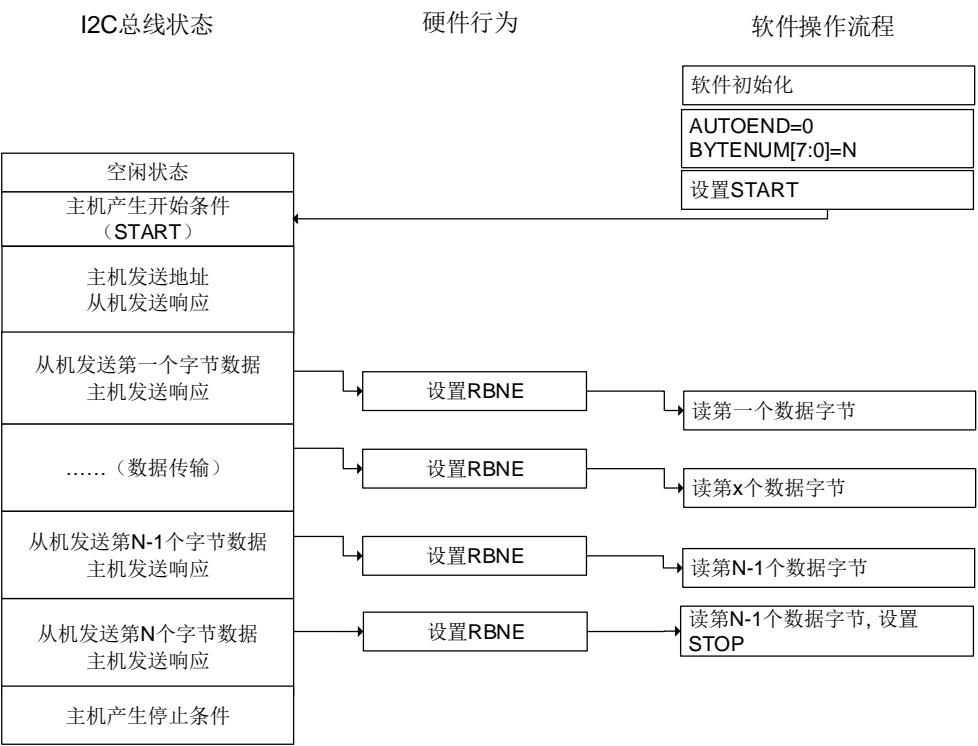

图 24-34. I2C 主机接收编程模型（N>255）

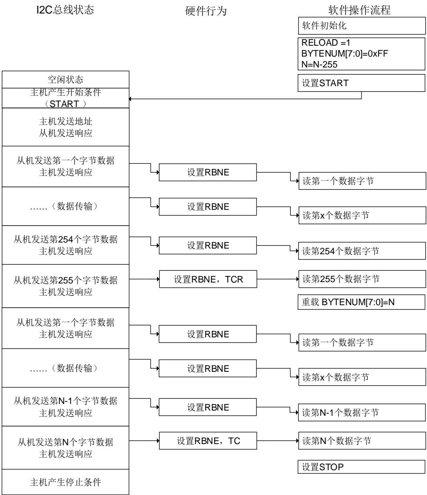

## SMBus 支持

系统管理总线（System Management Bus，简写为 SMBus 或 SMB）是一种结构简单的单端双线制总线，可实现轻量级的通信需求。一般来说，SMBus 最常见于计算机主板，主要用于电源传输 ON/OFF 指令的通信。SMBus 是 I2C 的一种衍生总线形式，主要用于计算机主板上的低带宽设备间通信，尤其是与电源相关的芯片，例如笔记本电脑的可充电电池子系统（参见Smart Battery Data）。

## SMBus 协议

SMBus 上每个报文交互都遵从 SMBus 协议中预定义的格式。SMBus 是 I2C 规范中数据传输格式的子集。只要 I2C 设备可通过 SMBus 协议之一进行访问，便视为兼容 SMBus 规范。不符合这些协议的 I2C 设备，将无法被 SMBus 和 ACPI 规范所定义的标准方法访问。

## 地址解析协议

SMBus 采用了 I2C 硬件以及 I2C 的硬件寻址方式，但在 I2C 的基础上增加了二级软件处理，建立自己独特的系统。比较特别的是 SMBus 规范包含一个地址解析协议，可用于实现动态地址分配。动态识别硬件和软件使得总线设备能够支持热插拔，无需重启系统便能即插即用。总线中的设备将被自动识别并分配唯一地址。这个优点非常有利于实现即插即用的用户界面。在此协议中，系统中的 host 与设备之间有一个重要的区别，即 host 具有分配地址的功能。

## SMBus 从机字节控制

SMBus 接收器从机字节控制与 I2C 一样。它允许 ACK控制每个字节。必须能对接收到的命令或者数据进行 NACK 应答。通过将 I2C_CTL0 寄存器中 SBCTL 位置 1 来使能从机字节控制模式。

## 主机通知协议

通过将 I2C_CTL0 寄存器 SMBHAEN 位置 1，SMBus 可以支持主机通知协议。在该协议中，从设备作为主机，主设备作为从机，主机将应答 SMBus 主机地址。

## 超时特性

SMBus 有一种超时特性：假如某个通信耗时太久，便会自动复位设备。这就解释了为什么最小时钟周期为 10kHz——为了防止长时间锁死总线。I2C 在本质上可以视为一个“直流”总线，也就是说当主机正在访问从机的时候，假如从机正在执行一些子程序无法及时响应，从机可以拉住主机的时钟。这样便可以提醒主机：从机正忙，但并不想放弃当前的通信。从机的当前任务结束之后，将可以继续 I2C 通信。I2C 总线协议中并没有限制这个延时的上限，但在 SMBus系统中，这个时间被限定为 25~35ms。按照 SMBus 协议的假定，如果某个会话耗时太久，就意味着总线出了问题，此时所有设备都应当复位以消除这种（问题）状态。这样就并不允许从设备将时钟拉低太长时间。

将 I2C_TIMEOUT 寄存器中 TOEN 位和 EXTOEN 位置 1 可以使能超时检测。配置定时器必须保证在 SMBus 规范规定的时间最大值之前检测出超时情况。

在 BUSTOA[11:0]中编程的值被用来检查 $\mathsf { t } _ { \mathsf { T I M E O U T } }$ 参数。必须将 TOIDLE 位配置为 0，以检测SCL 低电平超时。将 I2C_TIMEOUT 寄存器中 TOEN 位置 1 来使能定时器，在 TOEN 置 1 之后 ， BUSTOA[11:0] 和 TOIDLE 位 不 能 被 修 改 。 如 果 SCL 低 电 平 时 间 大 于(BUSTOA+1)*2048*t ，I2C_STAT 寄存器中 TIMEOUT 位将置 1。

BUSTOA[11:0]为从机校验t ，为主机校验t 。通过将 I2C_TIMEOUT 寄存器中EXTOEN 位置 1 来使能定时器。在 EXTOEN 置 1 之后，BUSTOB[11:0]不能被修改。如果SMBus 外设 SCL 拉低时间大于(BUSTOB+1)*2048*t ，并且达到了总线空闲检测章节中描述的超时时间间隔，I2C_STAT 寄存器中 TIMEOUT 位将置 1。

## 报文错误校验

I2C 模块中有一个 PEC 模块，它使用 CRC-8 计算器来执行 I2C 数据的报文校验。一个 PEC字节（ 错误码）附加在每次传输结束。 的计算方式是对所有消息字节（包含地址和读/写位）使用 CRC-8 计算校验和。CRC-8 多项式位 $x ^ { 8 } + x ^ { 2 } + x + 1$ （CRC-8-ATM HEC 算法，初始化为 0）。

当 I2C 被禁用时，通过 I2C_CTL0 寄存器中的 PECEN 位置 1 可以使能 PEC。由于 PEC 传输是由 I2C_CTL1 寄存器中 BYTENUM[7:0]管理的，因此在从机模式下必须将 SBCTL 位置 1。

当 PECTRANS 置 1，RELOAD 为 0 时，在 BYTENUM[7:0]-1 数据字节后发送 PEC。PEC 在BYTENUM[7:0]-1 传输完成后发送。当 RELOAD 置 1 时 PECTRANS 无效。

## SMBus 警报

SMBus 还有一个额外的共享的中断信号，称为 SMBALERT#。从机上发生事件后，可通过这个信号通知主机来访问从机。主机会处理该中断，并通过报警响应地址，同时访问所有SMBALERT#设备。如果 SMBALERT#电平被设备拉低，这些设备会应答报警响应地址。当配置为从设备（SMBHAEN = 0）时，通过将 I2C_CTL0 寄存器中 SMBALTEN 置 1 可以将 SMBA引脚电平拉低。同时也使能了报警响应地址。当配置为主设备（SMBHAEN = 1），且 SMBALTEN置 1 时，当在 SMBA 引脚检测到下降沿时，I2C_STAT 寄存器中 SMBALT 位将置 1。如果I2C_CTL0 寄存器中 ERRIE 位置 1，将产生中断。当 SMBALTEN = 0 时，即使外部 SMBA 引脚为低电平，ALERT 线也将被视为高电平。当 SMBALTEN = 0 时，SMBA 引脚可用作标准GPIO。

## 总线空闲检测

如果主机检测到时钟信号和数据信号的高电平持续时间大于 $\mathsf { I } _ { \mathsf { H I G H } , \mathsf { M A X } }$ ，总线被视为空闲。

该时序参数已考虑到主机已动态添加至总线，但可能还未检测到 SMBCLK 或 SMBDAT 线上的状态转换的情况。在这种情况下，为了保证当前没有数据传输正在进行，主机必须等待足够长的时间。

要使能 $\mathrm { \bf t } _ { \vert \mathrm { D L E } }$ 检查，必须将 BUSTOA[11:0]编程为定时器重载值，以获取 $\mathtt { t _ { | D L E } }$ 参数。必须将 TIDLE位置 1，以检测 SCL 和 SDA高电平超时。然后通过将 I2C_TIMEOUT 寄存器中的 TOEN 位置1 来使能定时器。TOEN 置 1 后，BUSTOA[11:0]和 TIDLE 不能被修改。如果 SCL 和 SDA 的高电平持续时间都大于(BUSTOA+1)*4*t ，I2C_STAT 寄存器中 TIMEOUT 位将置位。

## SMBus 从机模式

SMBus 接收器必须能够对接收到的命令和数据进行 NACK 应答。对于从机模式下的 ACK 控制，通过将 I2C_CTL0 寄存器中 SBCTL 位置 1 可以使能从机字节控制模式。

必要时应使能特定的 SMBus 地址。通过将 I2C_CTL0 寄存器中 SMBDAEN 置 1 可以使能SMBus 设备默认地址（0b1100 001）。通过将 I2C_CTL0 寄存器中 SMBHAEN 置 1 可以使能SMBus 主机地址（0b0001 000）。通过将 I2C_CTL0 寄存器中 SMBALTEN 置 1 可以使能报警响应地址（0b0001 100）。

## SMBus 模式

## SMBus 主机发送器和从机接收器

当 SMBus 主机发送 PEC 时，必须在 START 位置 1 前，将 PECTRANS 位置 1 并在BYTENUM[7:0]位域中配置字节数。在这种情况下，总 TI 中断数为 BYTENUM-1。因此，如果BYTENUM=0x1 且 PECTRANS 位置 1，则 I2C_PEC 寄存器的数据将自动发送。如果AUTOEND 为 1，SMBus 主机在 PEC 字节发送完成之后将自动发送 STOP 信号。如果AUTOEND 为 0，SMBus 主机可以在 PEC 字节发送完成之后发送 RESTART 信号。I2C_PEC寄存器中的数据将在 BYTENUM -1 个字节发送完成后发送，PEC 字节发送完成后 TC 位将置1。SCL 线被拉低。RESTART 位必须在 TC 中断服务程序中置 1。

SMBus 作为从机接收器时，为了在数据发送完成时进行 PEC 校验，SBCTL 位必须置 1。要对每个字节进行 ACK 控制，必须通过将 RELOAD 位置 1 来使能 RELOAD 模式。如果要校验PEC 字节，必须将 RELOAD 位清零同时将 PECTRANS 置 1。在 BYTENUM-1 个字节接收完成后，接收的下一个字节将与 I2C_PEC 寄存器中的数据进行比较。如果校验值不匹配，将自动产生 NACK 信号；如果校验值匹配将自动产生 ACK 信号，将忽略 NACKEN 位的值。当接收到 PEC 字节时，PEC 字节会存到 I2C_RDATA 寄存器中，RBNE 位将置 1。如果 I2C_CTL0寄存器中 ERRIE 位置 1，且 PEC 值不匹配，PECERR 将会置 1 并产生中断。如果无须使用ACK 控制，PECTRANS 可以设置为 1，BYTENUM 可以根据待接收字节数来配置。

注意：在 RELOAD 位置 1 之后，PECTRANS 不可以被修改。

图 24-35. SMBus 主机发送器和从机接收器通信流程

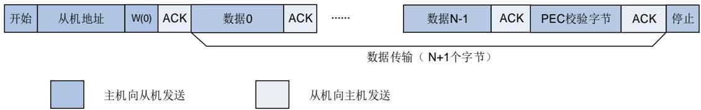

## SMBus 主机接收器和从机发送器

如果 SMBus 主机需要在数据传输完成后接收 PEC 字节，可以使能自动结束模式。在 START信号发送之前，必须将 PECTRANS 位置 1，且配置好从机地址。在接收 BYTENUM-1 数据之后，接收的下一个字节将自动与 I2C_PEC 寄存器中的数据进行比较。在停止信号发送之前，接收 PEC 字节之后会给出 NACK 响应。

如果SMBus主机需要在接收到PEC字节之后产生RESTART 信号，需要禁能自动结束模式。在 START 信号发送之前，PECTRANS 位必须置 1，且配置好从机地址。在接收 BYTENUM-1 数据之后，接收的下一个字节将自动与 I2C_PEC 寄存器中的数据进行比较。在 PEC 字节发送完成之后 TC 位将置 1，SCL 线被拉低。在 TC 中断服务程序中可将 RESTART 位置 1。

当 SMBus 作为从机发送器时，为了在 BYTENUM[7:0]个字节发送完成之后发送 PEC 字节，SBCTL 位必须置 1。如果 PECTRANS 置 1，字节数 BYTENUM[7:0]包含 PEC 字节。在这种情况下，如果主机请求接收的字节数大于BYTENUM-1，总TI中断数为BYTENUM-1，I2C_PEC寄存器中的数据将自动发送。

## 注意：

1. PECTRANS 位在 RELOAD 置 1 之后不能被修改。

2. SMBus 作为从机发送器，并且使用 PEC 功能时，必须在检测到 START 信号前配置BYTENUM[7:0]。

图 24-36. SMBus 主机接收器和从机发送器通信流程

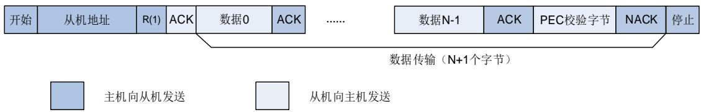

## 从省电模式唤醒

当 I2C 地址匹配成功时，MCU 从睡眠模式，深度睡眠模式被唤醒。为了将 MCU 从这些省电模式唤醒，I2C_CTL0 寄存器中WUEN 位必须置 1，同时 I2CCLK 时钟源选择 IRC16M。在深度睡眠模式下，IRC16M 关闭。当 I2C 检测到 START 信号时，IRC16M 打开，I2C 会将 SCL拉低直到 IRC16M 被唤醒。在接收地址期间，IRC16M 为 I2C 提供时钟。当地址匹配时，在MCU 唤醒期间，I2C 的 SCL 线被拉低。当 ADDSEND 清除时，SCL 线被释放，数据传输过程恢复正常。如果检测到的地址不匹配，IRC16M 会再次关闭，MCU 将不会被唤醒。

只有地址匹配中断（ADDMIE = 1）能唤醒 MCU。如果 I2C 的时钟源是系统时钟，或者WUEN= 0，IRC16M 在接收到 START 信号之后将不会打开。当从省电模式唤醒使能时，数字滤波器必须禁能，I2C_CTL0 寄存器中 SS位也必须清 0。如果禁止从省电模式唤醒（WUEN = 0），则在进入省电模式之前必须禁能 I2C 外设（I2CEN = 0）。

## DMA模式下数据传输

如 I2C 从机模式和主机模式中描述，每当 TI 位和 RBNE位被置 1 之后，软件都应该写或读一个字节，这样将导致 CPU 的负荷较重。I2C 的 DMA 功能可以在 TI 或 RBNE 位置 1 时，自动进行一次写或读操作。

将 I2C_CTL0 寄存器中 DENT 置 1 可以使能 DMA 发送请求。将 I2C_CTL0 寄存器中 DENR置 1 可以使能 DMA接收请求。在主机模式下，由软件写入从机地址，传输方向，待发送字节数和 START 位。DMA 必须在 START 位置 1 之前初始化。在 I2C_CTL1 寄存器 BYTENUM[7:0]位配置待传输字节数。在从机模式下， 必须在地址匹配事件发生之前或 中断服务程序中清除 ADDSEND 标志之前完成初始化。

## I2C 错误和中断

I2C 错误标志如表24-7. I2C错误标志所示。

表 24-7. I2C 错误标志

<table><tr><td>I2C 错误名称</td><td>描述</td></tr><tr><td>BERR</td><td>总线错误</td></tr><tr><td>LOSTARB</td><td>仲裁丢失</td></tr><tr><td>OUERR</td><td>上溢 / 下溢标志</td></tr><tr><td>PECERR</td><td>CRC 值不匹配</td></tr><tr><td>TIMEOUT</td><td>SMBus 模式下总线超时</td></tr><tr><td>SMBALT</td><td>SMBus 报警</td></tr></table>

I2C 中断和事件标志如表24-8. I2C 中断事件所示。

表 24-8. I2C 中断事件

<table><tr><td>中断事件</td><td>事件标志</td><td>使能控制位</td></tr><tr><td>在接收期间 I2C_RDATA 非空</td><td>RBNE</td><td>RBNEIE</td></tr><tr><td>发送中断</td><td>TI</td><td>TIE</td></tr><tr><td>从机模式下检测到 STOP 信号</td><td>STPDET</td><td>STPDETIE</td></tr><tr><td>传输完成重载</td><td>TCR</td><td rowspan="2">TCIE</td></tr><tr><td>传输完成</td><td>TC</td></tr><tr><td>地址匹配</td><td>ADDSEND</td><td>ADDMIE</td></tr><tr><td>接收到 NACK</td><td>NACK</td><td>NACKIE</td></tr><tr><td>总线错误</td><td>BERR</td><td rowspan="6">ERRIE</td></tr><tr><td>仲裁丢失</td><td>LOSTARB</td></tr><tr><td>上溢 / 下溢错误</td><td>OUERR</td></tr><tr><td>PEC 错误</td><td>PECERR</td></tr><tr><td>超时错误</td><td>TIMEOUT</td></tr><tr><td>SMBus 报警</td><td>SMBALT</td></tr></table>

## I2C 调试模式

当为控制器进入调试模式（Cortex®-M33 内核停止），SMBus 超时定时器会根据 DBG 模块中的 I2Cx_HOLD 配置位选择继续正常工作还是停止工作。
