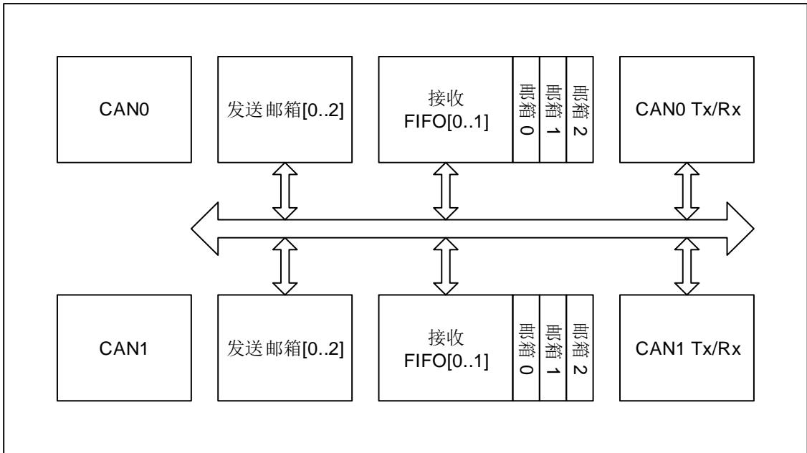
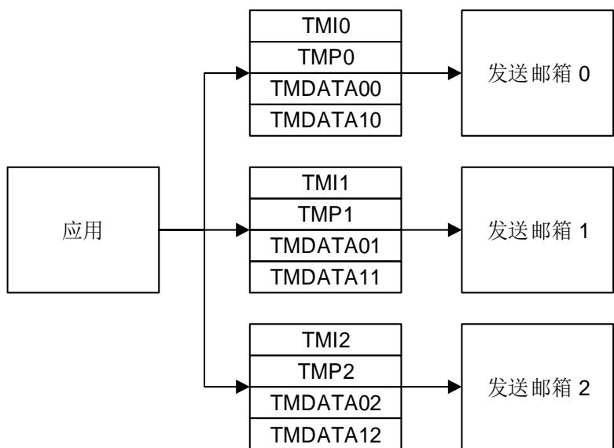
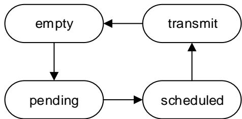
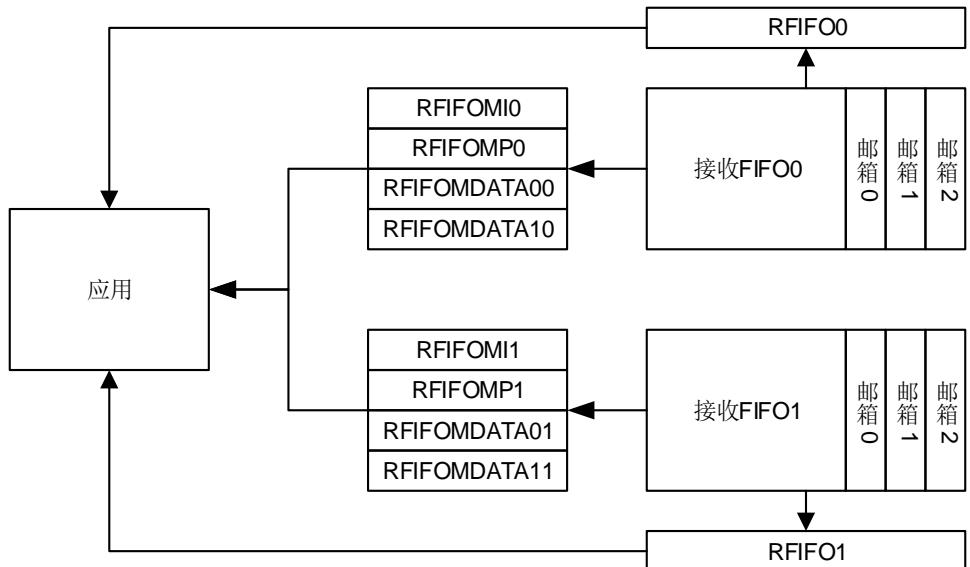
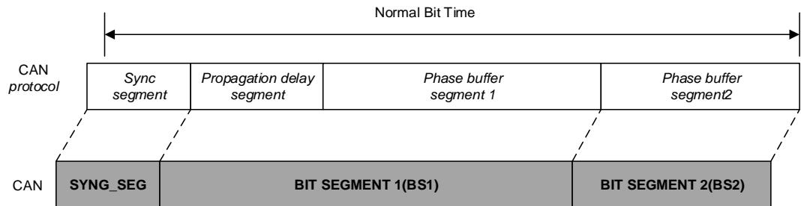
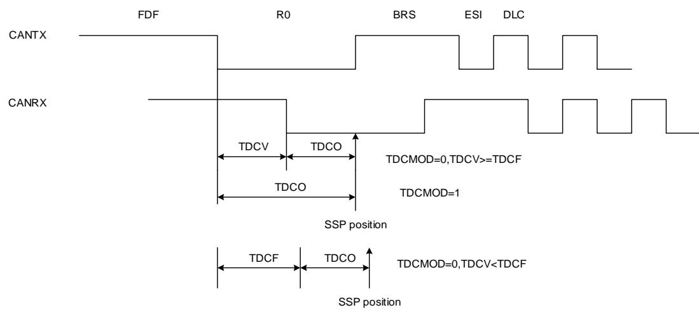

## 31. 控制器局域网络（CAN）

## 31.1. 简介

CAN（Controller Area Network）总线是一种可以在无主机情况下实现微处理器或者设备之间相互通信的总线标准。

CAN 总线控制器作为 CAN 网络接口，遵循 CAN 总线协议 2.0A、2.0B、ISO11898-1:2015 和BOSCHCAN-FD 规范。CAN 总线控制器可以处理总线上的数据收发并具有 28 个过滤器，过滤器用于筛选并接收用户需要的消息。用户可以通过 3 个发送邮箱将待发送数据传输至总线，邮箱发送的顺序由发送调度器决定。并通过 2 个深度为 3 的接收 FIFO 获取总线上的数据，接收 FIFO 的管理完全由硬件控制。同时 CAN 总线控制器硬件支持时间触发通信（Time-triggecommunication）功能。

## 31.2. 主要特征

- 支持 CAN 总线协议 2.0A 和 2.0B；

- 支持 CAN-FD 帧（ISO11898-1 和 CAN-FD 规范 V1.0）；

- 常规帧：通信波特率最大为 1Mbit/s；

- CAN-FD 帧：通信波特率最大为 6Mbit/s；

- 支持传输延迟补偿；

- 支持时间触发通信（Time-triggered communication）；

- 中断使能和清除。

## 发送功能

- 3 个发送邮箱；

- 支持发送优先级；

- 支持发送时间戳。

## 接收功能

- 2 个深度为 3 的接收 FIFO；

- 具有 28 个标识符过滤器；

- FIFO 锁定功能。

## 时间触发通信

- 在时间触发通信模式下禁用自动重传；

- 16 位定时器；

- 接收时间戳；

- 发送时间戳。

## 31.3. 功能说明

CAN模块结构框图如图31-1. CAN模块结构框图所示。

图 31-1. CAN 模块结构框图

## 31.3.1. 工作模式

CAN 总线控制器有 3 种工作模式：

- 睡眠工作模式；

- 初始化工作模式；

- 正常工作模式。

## 睡眠工作模式

芯片复位后，CAN总线控制器处于睡眠工作模式。该模式下CAN总线控制器的时钟停止工作并处于一种低功耗状态。

将CAN_CTL寄存器的SLPWMOD位置1，可以使CAN总线控制器进入睡眠工作模式。当进入睡眠工作模式后，CAN_STAT寄存器的SLPWS位将被硬件置1。

将CAN_CTL寄存器的AWU位置1，并当CAN检测到总线活动时，CAN总线控制器将自动退出睡眠工作模式。将CAN_CTL寄存器的SLPWMOD位清0，也可以退出睡眠工作模式。

由睡眠模式进入初始化工作模式：将CAN_CTL寄存器的IWMOD位置1，SLPWMOD位清0。

由睡眠模式进入正常工作模式：将CAN_CTL寄存器的IWMOD位和SLPWMOD位清0。

## 初始化工作模式

如果需要配置 CAN 总线通信参数，CAN 总线控制器必须进入初始化工作模式。将 CAN_CTL寄存器的 IWMOD 位置 1，使 CAN 总线控制器进入初始化工作模式，将其清 0 则离开初始化工作模式。在进入初始化工作模式后，CAN_STAT 寄存器的 IWS位将被硬件置 1。

由初始化模式进入睡眠模式：CAN_CTL 寄存器的 SLPWMOD 位置 1，IWMOD 位清 0。

由初始化模式进入正常工作模式：CAN_CTL 寄存器的 SLPWMOD 位和 IWMOD 位清 0。

## 正常工作模式

在初始化工作模式中配置完 CAN 总线通信参数后，将 CAN_CTL 寄存器的 IWMOD 位清 0 可以进入正常工作模式并与 CAN 总线网络中的节点进行正常通信。

由正常工作模式进入睡眠工作模式：CAN_CTL 寄存器的 SLPWMOD 位置 1，并等待当前数据收发过程结束。

由正常工作模式初始化工作模式：CAN_CTL 寄存器的 IWMOD 位置 1，并等待当前数据收发过程结束。

## 31.3.2. 通信模式

CAN 总线控制器有 4 种通信模式：

- 静默（Silent）通信模式；

- 回环（Loopback）通信模式；

- 回环静默（Loopback and Silent）通信模式；

- 正常（Normal）通信模式。

## 静默（Silent）通信模式

在静默通信模式下，可以从 CAN 总线接收数据，但不向总线发送任何数据。将 CAN_BT 寄存器中的 SCMOD 位置 1，使 CAN 总线控制器进入静默通信模式，将其清 0 可以退出静默通信模式。

静默通信模式可以用来监控 CAN 网络上的数据传输。

## 回环（Loopback）通信模式

在回环通信模式下，由 CAN 总线控制器发送的数据可以被自己接收并存入接收 FIFO，同时这些发送数据也送至 CAN 网络。将 CAN_BT 寄存器中的 LCMOD 位置 1，使 CAN 总线控制器进入回环通信模式，将其清 0 可以退出回环通信模式。

回环通信模式通常用来进行 CAN 通信自测。

## 回环静默（Loopback and Silent）通信模式

在回环静默通信模式下，CAN 的 RX 和 TX 引脚与 CAN 网络断开。CAN 总线控制器既不从网络接收数据，也不向 网络发送数据，其发送的数据仅可以被自己接收。将寄存器中的 LCMOD 位和 SCMOD 位置 1，使 CAN 总线控制器进入回环静默通信模式，将它们清 0 可以退出回环静默通信模式。

回环静默通信模式通常用来进行 CAN 通信自测。对外 TX 引脚保持隐性状态（逻辑 1），RX 引脚保持高阻态。

## 正常（Normal）通信模式

CAN 总线控制器通常工作在正常通信模式下，可以从 CAN 总线接收数据，也可以向 CAN 总线发送数据。这时需要将 CAN_BT 寄存器的 LCMOD 位和 SCMOD 位清 0。

## 31.3.3. 数据发送

## 发送寄存器

数据发送通过3个发送邮箱进行，可以通过寄存器CAN_TMIx，CAN_TMPx，CAN_TMDATA0x和CAN_TMDATA1x对发送邮箱进行配置。如图31-2. 发送寄存器所示。

图 31-2. 发送寄存器

如果想要发送CAN-FD帧，使用发送邮箱x（x等于0到2）时，仅需要写对应的TMDATA0x（x等于0到2）寄存器。例如软件想要使用发送邮箱0发送64字节数据，需要通过写TMDATA00寄存器16次将待发送数据写入内部专用SRAM区。

## 发送邮箱状态转换

当发送邮箱处于empty状态时，应用程序才可以对邮箱进行配置。当邮箱被配置完成后，可以将CAN_TMIx寄存器的TEN位置1，从而向CAN总线控制器提交发送请求，这时发送邮箱处于pending状态。当超过1个邮箱处于pending状态时，需要对多个邮箱进行调度，这时发送邮箱处于scheduled状态。当调度完成后，发送邮箱中的数据开始向CAN总线上发送，这时发送邮箱处于transmit状态。当数据发送完成，邮箱变为空闲，可以再次交给应用程序使用，这时发送邮箱重新变为empty状态。如图31-3. 发送邮箱状态转换所示。

图 31-3. 发送邮箱状态转换

## 发送状态和错误信息

CAN_TSTAT寄存器中的MTF，MTFNERR，MAL和MTE位用来说明发送状态和错误信息。

- MTF：发送完成标志位。当数据发送完成时，MTF 置 1。

- MTFNERR：无错误发送完成标志位。当数据发送完成且没有错误时，MTFNERR 置 1。

- MAL：仲裁失败标志位。当发送数据过程中出现仲裁失败时，MAL置1。

- MTE：发送错误标志位。当发送过程中检测到总线错误时，MTE置1。

## 数据发送步骤

数据发送步骤如下：

第1步：选择一个空闲发送邮箱；

第2步：根据应用程序要求，配置4个发送寄存器；

第3步：将CAN_TMIx寄存器的TEN置1；

第4步：检测发送状态和错误信息。典型情况是检测到MTF和MTFNERR置1，说明数据被成功发送。

## 发送选项

## 中止数据发送

将CAN_TSTAT寄存器的MST置1，可以中止数据发送。

当发送邮箱处于pending和scheduled状态，CAN_TSTAT寄存器的MST置1可以立即中止数据发送。

当发送邮箱处于transmit状态，则面临两种情况。一种情况是数据发送被成功地完成，MTF和MTFNERR为1，这时发送邮箱将转换为empty状态。相对的，如果数据发送过程中出现了问题，这时发送邮箱将转换为 状态，这时数据发送被中止。

## 发送优先级

当有2个及其以上发送邮箱等待发送时，寄存器CAN_CTL的TFO位的值可以决定发送顺序。

当TFO为1，所有等待发送的邮箱按照先来先发送（FIFO）的顺序进行。

当TFO为0，具有最小标识符（Identifier）的邮箱最先发送。如果所有的标识符（Identifier）相等，具有最小邮箱编号的邮箱最先发送。

## 31.3.4. 数据接收

接收寄存器

应用程序通过2个深度为3的FIFO接收来自CAN网络的数据。

寄 存 器 CAN_RFIFOx 可 以 操 作 FIFO ， 也 包 含 FIFO 状 态 。 寄 存 器 CAN_RFIFOMIx ，CAN_RFIFOMPx，CAN_RFIFOMDATA0x和CAN_RFIFOMDATA1x用于接收数据帧。

如图31-4. 接收寄存器所示。

图 31-4. 接收寄存器

## 接收 FIFO

每个接收FIFO包含3个接收邮箱，用来接收存储数据帧。这些邮箱按照先进先出方式进行组织，最早从 网络接收的数据，最早被应用程序处理。

寄存器CAN_RFIFOx包含FIFO状态信息和帧的数量。当FIFO中包含数据时，可以通过寄存器CAN_RFIFOMIx，CAN_RFIFOMPx，CAN_RFIFOMDATA0x和CAN_RFIFOMDATA1x读取数据，之后将寄存器CAN_RFIFOx的RFD位置1释放邮箱，并且等待其由硬件自动清0。

如 果 接 收 到 CAN-FD 帧 ， 数 据 将 被 存 储 到 内 部 专 用 SRAM 中 ， 并 通 过 多 次 读CAN_RFIFOMDATA0x寄存器将数据取出。FIFO0使用CAN_RFIFOMDATA00，FIFO1使用CAN_RFIFOMDATA01寄存器。例如，如果软件想要从FIFO0中读64字节数据，需要通过读CAN_RFIFOMDATA00寄存器16次将数据全部读出。

## 接收 FIFO状态信息

接收FIFO状态信息包含在寄存器CAN_RFIFOx中。

RFL：FIFO中包含的帧数量。FIFO为空时，RFL为0；FIFO为满时，RFL为3。

RFF：FIFO满状态标志位。这时RFL为3。

RFO：FIFO溢出标志位。当FIFO已经包含了3个数据帧时，新的数据帧到来使FIFO发生溢出。如果CAN_CTL寄存器的RFOD位被置1，新的数据帧将丢弃。如果该位被清0，新的数据帧将覆盖接收FIFO中最后一帧数据。

## 数据接收步骤

第1步：查看FIFO中帧的数量。

第2步：通过CAN_RFIFOMIx，CAN_RFIFOMPx，CAN_RFIFOMDATA0x和CAN_RFIFOMDATA1x读取数据。

第3步：将寄存器CAN_RFIFOx的RFD置1释放邮箱，并且等待其由硬件自动清0。

## 31.3.5. 过滤功能

一个待接收的数据帧会根据其标识符（Identifier）进行过滤：硬件会将通过过滤的帧送至接收FIFO，并丢弃没有通过过滤的帧。

## 过滤器位宽

过滤器包含28个单元，它们是bank0到bank27。

每一个过滤器单元有2个寄存器CAN_FxDATA0和CAN_ FxDATA1，它们可以配置为2种位宽：32-bit位宽和16-bit位宽。

32-bit位宽：CAN_FDATAx包含字段SFID[10:0]，EFID[17:0]，FF和FT。如图31-5. 32-bit位宽所示。

图 31-5. 32-bit 位宽过滤器

<table><tr><td>FDATA[31:21]</td><td>FDATA[20:3]</td><td colspan="3">FDATA[2:0]</td></tr><tr><td></td><td></td><td colspan="3"></td></tr><tr><td>SFID[10:0]</td><td>EFID[17:0]</td><td>FF</td><td>FT</td><td>0</td></tr></table>

16-bit位宽：CAN_FDATAx包含字段：SFID[10:0]，FT，FF和EFID[17:15]。如图31-6. 16-bit位宽过滤器所示。

图 31-6. 16-bit 位宽过滤器

<table><tr><td colspan="2">FDATA[31:21]</td><td colspan="2">FDATA[20:16]</td><td colspan="2">FDATA[15:5]</td><td colspan="2">FDATA[4:0]</td></tr><tr><td>SFID[10:0]</td><td>FT</td><td>FF</td><td>EFID[17:15]</td><td>SFID[10:0]</td><td>FT</td><td>FF</td><td>EFID[17:15]</td></tr></table>

## 掩码模式

对于一个待过滤的数据帧的标识符（Identifier），掩码模式用来指定哪些位必须与预设的标识符相同，哪些位无需判断。

一个 32-bit 位宽掩码模式过滤器如图31-7. 32-bit位宽掩码模式过滤器所示。

图 31-7. 32-bit 位宽掩码模式过滤器

<table><tr><td rowspan="2">IDMask</td><td>FDATA0[31:21]</td><td colspan="2">FDATA0[20:3]</td><td colspan="2">FDATA0[2:0]</td></tr><tr><td>FDATA1[31:21]</td><td colspan="2">FDATA1[20:3]</td><td colspan="2">FDATA1[2:0]</td></tr><tr><td></td><td>SFID[10:0]</td><td>EFID[17:0]</td><td>FF</td><td>FT</td><td>0</td></tr></table>

图 31-8. 16-bit 位宽掩码模式过滤器

<table><tr><td rowspan="2">IDMask</td><td colspan="2">FDATA0[15:5]</td><td colspan="2">FDATA0[4:0]</td><td colspan="2">FDATA1[15:5]</td><td colspan="2">FDATA1[4:0]</td></tr><tr><td colspan="2">FDATA0[31:21]</td><td colspan="2">FDATA0[20:16]</td><td colspan="2">FDATA1[31:21]</td><td colspan="2">FDATA1[20:16]</td></tr><tr><td></td><td>SFID[10:0]</td><td>FT</td><td>FF</td><td>EFID[17:15]</td><td>SFID[10:0]</td><td>FT</td><td>FF</td><td>EFID[17:15]</td></tr></table>

## 列表模式

对于一个待过滤的数据帧的标识符（Identifier），列表模式用来表示与预设的标识符列表中能够匹配则通过，否则丢弃。

一个32-bit位宽列表模式过滤器如图31-9. 32-bit位宽列表模式过滤器所示。

图 31-9. 32-bit 位宽列表模式过滤器

<table><tr><td>ID</td><td>FDATA0[31:21]</td><td>FDATA0[20:3]</td><td colspan="3">FDATA0[2:0]</td></tr><tr><td>ID</td><td>FDATA1[31:21]</td><td>FDATA1[20:3]</td><td colspan="3">FDATA1[2:0]</td></tr><tr><td></td><td>SFID[10:0]</td><td>EFID[17:0]</td><td>FF</td><td>FT</td><td>0</td></tr></table>

图 31-10. 16-bit 位宽列表模式过滤器

<table><tr><td>ID</td><td colspan="2">FDATA0[31:21]</td><td colspan="2">FDATA0[20:16]</td><td colspan="2">FDATA0[15:5]</td><td colspan="2">FDATA0[4:0]</td><td></td></tr><tr><td></td><td colspan="2"></td><td colspan="2"></td><td colspan="2"></td><td colspan="2"></td><td></td></tr><tr><td colspan="2">SFID[10:0]</td><td>FT</td><td>FF</td><td>EFID[17:15]</td><td colspan="2">SFID[10:0]</td><td>FT</td><td>FF</td><td>EFID[17:15]</td></tr></table>

## 过滤序号

过滤器由若干过滤单元（ ）组成，每个过滤单元因为位宽和模式的选择不同，而具有不同的过滤效果。例如表31-1. 32-bit过滤序号所示的2个过滤单元，Bank0是32-bit位宽掩码模式，Bank1是32-bit位宽列表模式。

表 31-1. 32-bit 过滤序号

<table><tr><td>过滤单元</td><td>过滤器数据寄存器</td><td>过滤序号</td></tr><tr><td rowspan="2">0</td><td>F0DATA0-32bit-ID</td><td rowspan="2">0</td></tr><tr><td>F0DATA1-32bit-Mask</td></tr><tr><td rowspan="2">1</td><td>F1DATA0-32bit-ID</td><td>1</td></tr><tr><td>F1DATA1-32bit-ID</td><td>2</td></tr></table>

## 过滤器关联的 FIFO

28个过滤单元均可以关联接收FIFO0或接收FIFO1。一旦一个过滤单元关联到接收FIFO，只有

通过这个过滤单元的帧才会被传送到接收FIFO中存储。

## 过滤器激活控制

一个过滤单元如果被应用程序用到，就必须激活。通过CAN_FW寄存器可以进行配置。

## 过滤索引

一个包含过滤序号（Fiter Number）N的过滤单元通过了某个帧，则该帧数据的过滤索引（Filtering Index）为N。这时CAN_RFIFOMPx中FI的值为N。

在表31-2. 过滤索引中，如果一个帧通过了FIFO0中过滤序号10（Filter Number=10）的过滤单元，那么该帧的过滤索引为10。这时CAN_RFIFOMPx中FI的值为10。

过滤序号不关心对应的过滤单元（Bank）是否处于工作状态。例如Bank3被关联到FIFO0，且为“不激活”状态，但它仍然包含过滤序号3和4。

表 31-2. 过滤索引

<table><tr><td>过滤单元</td><td>FIFO0</td><td>激活</td><td>过滤序号</td><td>过滤单元</td><td>FIFO1</td><td>激活</td><td>过滤序号</td></tr><tr><td rowspan="2">0</td><td>F0DATA0-32bits-ID</td><td rowspan="2">是</td><td rowspan="2">0</td><td rowspan="4">2</td><td>F2DATA0[15:0]-16bits-ID</td><td rowspan="4">是</td><td rowspan="2">0</td></tr><tr><td>F0DATA1-32bits-Mask</td><td>F2DATA0[31:16]-16bits-Mask</td></tr><tr><td rowspan="2">1</td><td>F1DATA0-32bits-ID</td><td rowspan="2">是</td><td>1</td><td>F2DATA1[15:0]-16bits-ID</td><td rowspan="2">1</td></tr><tr><td>F1DATA1-32bits-ID</td><td>2</td><td>F2DATA1[31:16]-16bits-Mask</td></tr><tr><td rowspan="4">3</td><td>F3DATA0[15:0]-16bits-ID</td><td rowspan="4">否</td><td rowspan="2">3</td><td rowspan="2">4</td><td>F4DATA0-32bits-ID</td><td rowspan="2">否</td><td rowspan="2">2</td></tr><tr><td>F3DATA0[31:16]-16bits-Mask</td><td>F4DATA1-32bits-Mask</td></tr><tr><td>F3DATA1[15:0]-16bits-ID</td><td rowspan="2">4</td><td rowspan="2">5</td><td>F5DATA0-32bits-ID</td><td rowspan="2">否</td><td>3</td></tr><tr><td>F3DATA1[31:16]-16bits-Mask</td><td>F5DATA1-32bits-ID</td><td>4</td></tr><tr><td rowspan="4">7</td><td>F7DATA0[15:0]-16bits-ID</td><td rowspan="4">否</td><td>5</td><td rowspan="4">6</td><td>F6DATA0[15:0]-16bits-ID</td><td rowspan="4">是</td><td>5</td></tr><tr><td>F7DATA0[31:16]-16bits-ID</td><td>6</td><td>F6DATA0[31:16]-16bits-ID</td><td>6</td></tr><tr><td>F7DATA1[15:0]-16bits-ID</td><td>7</td><td>F6DATA1[15:0]-16bits-ID</td><td>7</td></tr><tr><td>F7DATA1[31:16]-16bits-ID</td><td>8</td><td>F6DATA1[31:16]-16bits-ID</td><td>8</td></tr><tr><td>8</td><td>F8DATA0[15:0]-16bits-IDF8DATA0[31:16]-16bits-ID</td><td>是</td><td>910</td><td>10</td><td>F10DATA0[15:0]-16bits-IDF10DATA0[31:16]-16bits-Mask</td><td>否</td><td>9</td></tr><tr><td rowspan="2"></td><td>F8DATA1[15:0]-16bits-ID</td><td rowspan="2"></td><td>11</td><td rowspan="2"></td><td>F10DATA1[15:0]-16bits-ID</td><td rowspan="2"></td><td rowspan="2">10</td></tr><tr><td>F8DATA1[31:16]-16bits-ID</td><td>12</td><td>F10DATA1[31:16]-16bits-Mask</td></tr><tr><td rowspan="4">9</td><td>F9DATA0[15:0]-16bits-ID</td><td rowspan="4">是</td><td rowspan="2">13</td><td rowspan="4">11</td><td>F11DATA0[15:0]-16bits-ID</td><td rowspan="4">否</td><td>11</td></tr><tr><td>F9DATA0[31:16]-16bits-Mask</td><td>F11DATA0[31:16]-16bits-ID</td><td>12</td></tr><tr><td>F9DATA1[15:0]-16bits-ID</td><td rowspan="2">14</td><td>F11DATA1[15:0]-16bits-ID</td><td>13</td></tr><tr><td>F9DATA1[31:16]-16bits-Mask</td><td>F11DATA1[31:16]-16bits-ID</td><td>14</td></tr><tr><td rowspan="2">12</td><td>F12DATA0-32bits-ID</td><td rowspan="2">是</td><td rowspan="2">15</td><td rowspan="2">13</td><td>F13DATA0-32bits-ID</td><td rowspan="2">是</td><td>15</td></tr><tr><td>F12DATA1-32bits-Mask</td><td>F13DATA1-32bits-ID</td><td>16</td></tr></table>

## 优先级

过滤器优先级规则如下：

1、32-bits位宽模式高于16-bits位宽模式；

2、列表模式高于掩码模式；

3、较小的过滤序号（Filter Number）具有较高的优先级。

## 31.3.6. 时间触发通信

时间触发通信是CAN数据链路层应用协议。CAN网络中的所有节点都按照一个预先设定的时间序列进行通信，尤其适合于时间周期性应用和时间确定性应用。

在这种通信模式下，一个内部的16-bit计数器开始工作，在每一个CAN位时间（Bit time）增1。这个内部计数器为数据发送和数据接收提供时间戳，这些时间戳存放在寄存器CAN_RFIFOMPx和CAN_TMPx中。

在这种通信模式下，自动重发功能是禁止的。

## 31.3.7. 通信参数

## 自动重发禁止模式

在时间触发通信模式下，要求自动重发必须是禁止的，可以通过将CAN_CTL寄存器的ARD位置1满足要求。

在这种模式下，数据只会被发送一次，如果因为仲裁失败或者总线错误而导致发送失败，CAN总线控制器不会像通常那样进行数据自动重发。

发送结束时，寄存器CAN_TSTAT的MTF位被硬件置1，而发送状态信息可以通过MTFNERR，MAL和MTE获得。

## 位时序（Bit time）

CAN协议采用位同步传输方式。这种方式不仅增大了传输容量，而且意味着需要一种复杂的位同步方法。面向字节传输的位同步方式适用于接收在每个字节前都有起始位的情况，而同步传输协议只要求数据帧的最开始有一个起始位。为保证接收器能正确读取信息，需要不断地进行重新同步。因此，在相位缓冲段采样点前面和后面都应该插入一个帧间隔。

可以通过位操作仲裁方式访问CAN总线。信号从发送器到接收器，再回到发送器必须在一个位时间内完成。为了达到同步的目的，除了相位缓冲段外，还需要一个传输延时段。在信号传输过程中，传输延时段被视为发送或接收延时。

CAN总线控制器将位时间分为3个部分。

同步段（Synchronization segment），记为SYNC_SEG。该段占用1个时间单元 $( 1 \times t _ { C A N } )$ 

位段1（Bit segment 1），记为BS1。相对于CAN协议而言，BS1相当于传播时间段（Propagationdelay segment）和相位缓冲段1（Phase buffer segment 1）。

位段2（Bit segment 2），记为BS2。相对于CAN协议而言，BS2相当于相位缓冲段2（Phasebuffer segment 2）。

对比与CAN协议，位时序如图31-11. 位时序所示。

图 31-11. 位时序

再同步补偿宽度SJW（resynchronization Jump Width）对CAN网络节点同步误差进行补偿。

有效跳变沿定义为只有当在前一个采样点检测到的总线状态为隐性（recessive）时，一个位时间内从隐性位到显性位的第一次转变。

如果有效跳变在BS1期间被检测到，而不是SYNC_SEG期间，BS1将会最多被延长SJW，因此采样点延时。

相反，如果有效跳变在BS2期间被检测到，而不是SYNC_SEG期间，BS2将会最多被缩短SJW，因此采样点提前。

注：有关硬同步和再同步的详细说明，请参考ISO 11898标准。

波特率

波特率计算公式如下：

$$
\text { BaudRate } = \frac {1}{\text { Normal   Bit   Time }}\tag{31-1}
$$

$$
\text { Normal   Bit   Time } = t _ {\text { SYNC\_SEG }} + t _ {\text { BS1 }} + t _ {\text { BS2 }}\tag{31-2}
$$

其中：

$$
\mathsf {t} _ {\text { SYNC\_SEG }} = 1 \times \mathsf {t} _ {\mathsf {q}}\tag{31-3}
$$

$$
t _ {B S 1} = (1 + B T. B S 1) \times t _ {q}\tag{31-4}
$$

$$
\mathsf {t} _ {\mathrm{BS2}} = (1 + \mathsf {B T . B S 2}) \times \mathsf {t} _ {\mathsf {q}}\tag{31-5}
$$

$$
\mathrm{t} _ {\mathrm{q}} = (1 + \text {BT.BAUDPSC}) \times \mathrm{t} _ {\mathrm{PCLK1}}\tag{31-6}
$$

## 31.3.8. CAN FD 操作

通过将 CAN_FDCTL 寄存器的 FDEN 位置 1，可以使能 CAN FD (CAN with Flexible Data rate)功能。如果 FDEN 位被清 0，CAN 总线控制器仅支持常规帧（标准帧和扩展帧）的收发，若FDEN 位被置 1，则 CAN 总线控制器同时支持常规帧（标准帧和扩展帧）以及 FD 帧的收发。根据协议，当前帧是否为 FD 帧是通过帧的 FDF 位来判断（在常规帧中该位为保留位）。如果FDF 位为隐性，表示是 CAN FD 帧；如果为显性，表示是常规帧。

通过配置CAN_FDCTL寄存器的NISO位，可以选择CAN-FD功能支持ISO11898-1或BOSCHCAN FD 规范 V1.0。

在 CAN-FD 帧的帧结构中，FDF 位之后是保留位和 BRS位。BRS位决定数据位速率，当 BRS位为显性时，表示不能通过配置 CAN_DBT 寄存器来切换数据位速率。当 BRS 位为隐性时，可以通过配置 CAN_DBT 寄存器使得数据段（从 BRS 位到 ACK 场之前）的位速率高于仲裁段的位速率。详情请参考 ISO11898-1 或 BOSCH CAN FD 规范 V1.0。

通过将 CAN_FDCTL 寄存器的 PRED 位清 0，可以使能协议异常处理功能。此时，在接收帧数据过程中检测到隐性的保留位时，该功能将使操作状态转变为 并在下一个采样点中止当前帧。反之，将 PRED 位置 1，该功能将被禁止，隐性的保留位将被视为格式错误，并当做错误帧来进行处理，同时 CAN_FDSTAT 寄存器的 PRE位将被置 1。

ISO11898-1 或 BOSCH CAN FD 规范 V1.0 规定的发送 ESL 位（该位位于 CAN FD 帧的 DLC位域之前）功能通过 CAN_FDCTL 寄存器的 ESIMOD 位和 CAN_TMPx 寄存器的 ESI 位来实现。如果将 ESIMOD 位清 0，当 CAN 总线控制器处于被动错误状态时，该位为隐性；当处于主动错误状态时，该位为显性。若将 ESIMOD 位置 1，将根据 CAN_TMPx 寄存器的 ESI 位的值来决定该位为显性还是隐性。

发送帧 FDF 位和 BRS 位的总线电平逻辑由 CAN_TMPx 寄存器的 FDF 位和 BRS 位的值决定。

## 31.3.9. 传输延迟补偿

CAN-FD 协议支持传输延迟补偿机制。由于 CAN 收发器存在回路延迟，因此当发送 CAN-FD帧的高速数据段的位时间长度小于收发器内部回路延迟的限定值时，该机制可以避免当采样点到来时发送节点还没有收到其自己发出的位，从而报错的情况发生。关于传输延迟补偿的具体定义，请参考 ISO11898-1 或 BOSCH CAN FD 规范 V1.0。

将 CAN_FDCTL 寄存器的 TDCEN 位置 1 将使能传输延迟补偿。

传输延迟补偿机制可以调节次级采样点（SSP）的位置。SSP_Delay被定义为 CANTX 上的信号到 SSP 采样点的延迟。如果 CAN_FDCTL 寄存器的 TDCMOD 位被置 1，SSP_Delay 的值由 CAN_FDTDC 寄存器的 TDCO 位域软件配置决定。如果 TDCMOD 位被清 0，硬件将自动计算位速率转换之前的 FDF 位到 RES0 位的下降沿在 CAN_TX 与 CAN_RX 上出现的延迟，并将计算值存入 CAN_FDSTAT 寄存器的 TDCV 位域。由于存在信号毛刺，可能导致硬件自动计算的 SSP 位置比预期的提前，为了避免 TDCV 的值过小，可以使用 CAN_FDTDC 寄存器的 TDCF 位域。如果 TDCV 的值大于 TDCF，SSP_Delay 的值被定义为 TDCO 加上 TDCV，否则 SSP_Delay 的值被定义为 TDCO 加上 TDCF。

SSP_Delay的值不能大于 3 个数据位时间。

图 31-12 传输延迟测量

## 31.3.10. 错误标志

CAN总线的状态可以通过CAN_ERR寄存器的发送错误计数值（Transmit Error Counter，记为TECNT）和接收错误计数值（Receive Error Counter，记为RECNT）反映，其值会根据错误的情况由硬件增加或减少，软件可以通过这些值判断CAN网络的稳定性。关于错误计数值的详细信息请参考CAN协议相关章节。

同时寄存器CAN_ERR还可以表明当前错误状态，这些错误状态在寄存器CAN_INTEN控制下产生中断。

## 离线恢复

当TECNT大于255时，CAN总线控制器进入离线状态，这时寄存器CAN_ERR中的BOERR置1，并且发送和接收失效。

根据寄存器 中的 配置，离线恢复（变为主动错误状态）有 种方式。这两种方式都要求处于离线状态的CAN总线控制器检测到CAN协议所定义的离线恢复序列（在CAN_RX检测到128次连续11个位的隐性位）时，才会自动恢复。

如果ABOR为1，将在检测到离线恢复序列后自动恢复。

如果ABOR为0，则必须先将CAN_CTL中的IWMOD置1进入初始化工作模式，然后进入正常工作模式并在检测到离线恢复序列后恢复。

## 31.3.11. 中断

CAN总线控制器占用4个中断向量，通过寄存器CAN_INTEN进行控制。这4个中断向量对应4类中断源：

- 发送中断；

- FIFO0 中断；

- FIFO1 中断；

- 错误和状态改变中断。

## 发送中断

发送中断包括：

寄存器CAN_TSTAT中的MTF0置1：发送邮箱0变为空闲。

寄存器CAN_TSTAT中的MTF1置1：发送邮箱1变为空闲。

– 寄存器CAN_TSTAT中的MTF2置1：发送邮箱2变为空闲。

## FIFO0 中断

FIFO0中断包括：

FIFO0中包含待接收数据：寄存器CAN_RFIFO0中的RFL0不为0，CAN_INTEN寄存器中RFNEIE0被置位；

FIFO0满：寄存器CAN_RFIFO0中的RFF0为1，CAN_INTEN寄存器中RFFIE0被置位；

FIFO0溢出：寄存器CAN_RFIFO0中的RFO0为1，CAN_INTEN寄存器中RFOIE0被置位。

## FIFO1 中断

FIFO1中断包括：

FIFO1中包含待接收数据：寄存器CAN_RFIFO1中的RFL1不为0，CAN_INTEN寄存器中RFNEIE1被置位；

FIFO1满：寄存器CAN_RFIFO1中的RFF1为1，CAN_INTEN寄存器中RFFIE1被置位；

FIFO1溢出：寄存器CAN_RFIFO1中的RFO1为1，CAN_INTEN寄存器中RFOIE1被置位。

## 错误和工作模式改变中断

错误和工作模式改变中断可由以下条件触发：

错误：CAN_STAT寄存器的ERRIF和CAN_INTEN寄存器的ERRIE被置位，请参考CAN_STAT寄存器中ERRIF位描述；

– 唤醒：CAN_STAT寄存器中的WUIF和CAN_INTEN寄存器的WIE被置位；

进入睡眠模式：CAN_STAT寄存器中的SLPIF和CAN_INTEN寄存器的SLPWIE被置位。

CAN总线控制器的中断产生条件可参考表31-3. CAN事件/中断标志。

表 31-3. CAN 事件/中断标志

<table><tr><td>中断事件</td><td colspan="2">事件/中断标志</td><td colspan="2">使能控制位</td></tr><tr><td rowspan="3">发送中断</td><td colspan="2">发送邮箱0空闲标志MTF0</td><td rowspan="3" colspan="2">TMEIE</td></tr><tr><td colspan="2">发送邮箱1空闲标志MTF1</td></tr><tr><td colspan="2">发送邮箱2空闲标志MTF2</td></tr><tr><td rowspan="3">FIFO0中断</td><td colspan="2">接收FIFO0中帧的数量RFL0[1:0]</td><td colspan="2">RFNEIE0</td></tr><tr><td colspan="2">接收FIFO0满RFF0</td><td colspan="2">RFFIE0</td></tr><tr><td colspan="2">接收FIFO0溢出RFO0</td><td colspan="2">RFOIE0</td></tr><tr><td rowspan="3">FIFO1中断</td><td colspan="2">接收FIFO1中帧的数量RFL1[1:0]</td><td colspan="2">RFNEIE1</td></tr><tr><td colspan="2">接收FIFO1满RFF1</td><td colspan="2">RFFIE1</td></tr><tr><td colspan="2">接收FIFO1溢出RFO1</td><td colspan="2">RFOIE1</td></tr><tr><td rowspan="6">EWMC中断</td><td>警告错误WERR</td><td rowspan="4">错误中断标志ERRIF</td><td>WERRIE</td><td rowspan="4">ERRIE</td></tr><tr><td>被动错误PERR</td><td>PERRIE</td></tr><tr><td>离线错误BOERR</td><td>BOIE</td></tr><tr><td>错误种类1&lt;=ERRN[2:0]&lt;=6</td><td>ERRNIE</td></tr><tr><td colspan="2">从睡眠工作模式唤醒的状态改变中断标志WUIF</td><td colspan="2">WIE</td></tr><tr><td colspan="2">进入睡眠工作模式的状态改变中断标志SLPIF</td><td colspan="2">SLPWIE</td></tr></table>
