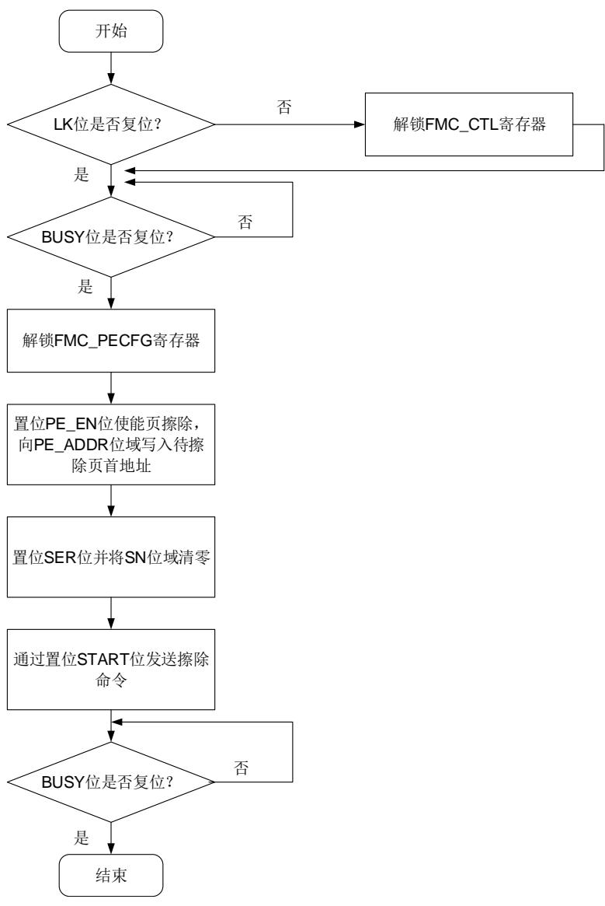
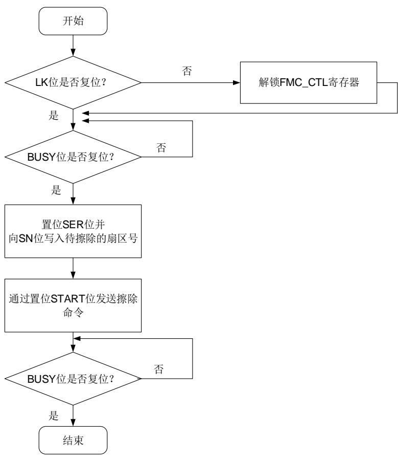
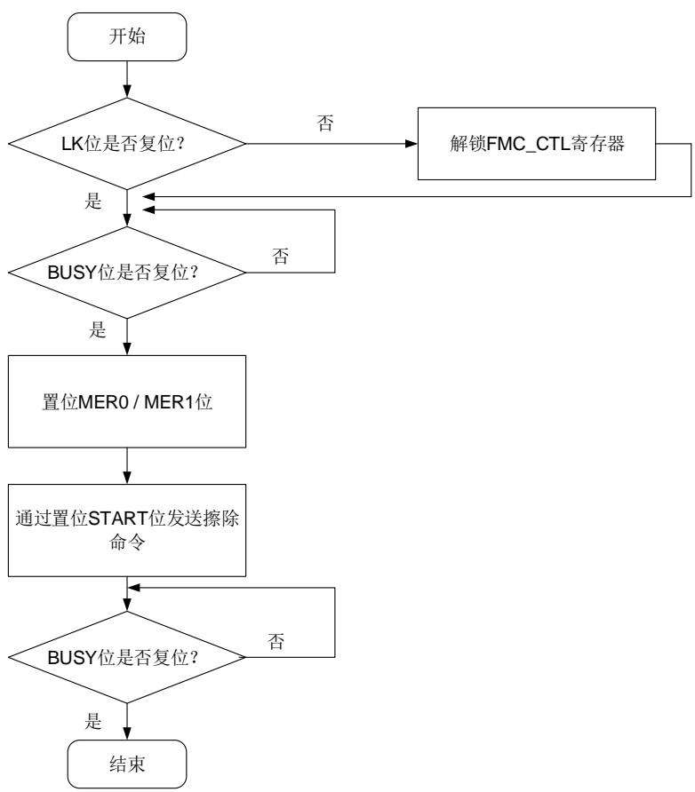
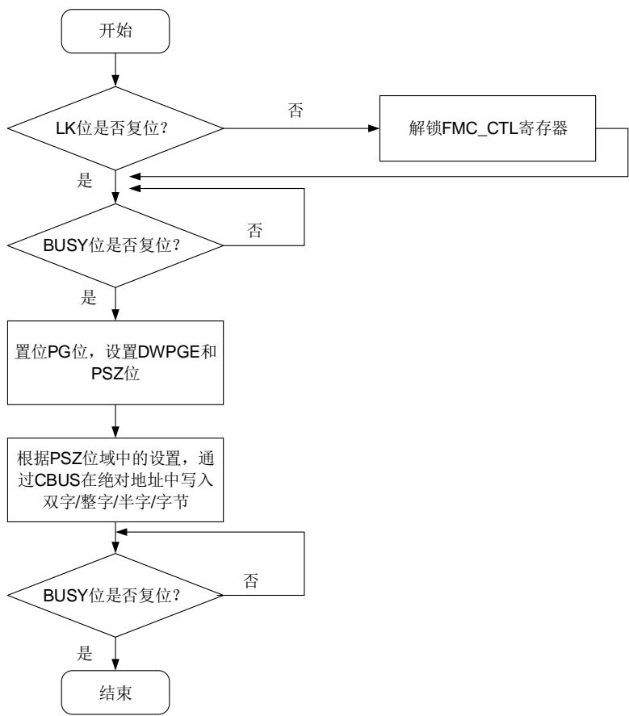

## 3. 闪存控制器（FMC）

## 3.1. 简介

闪存控制器（FMC），提供了片上闪存需要的所有功能。MCU执行指令零等待的区域最大支持到2048K字节空间。FMC提供了页（4KB）擦除、扇区擦除和整片擦除，以及64位双字/32位整字/16位半字/8位字节编程等闪存操作。

熔丝（EFUSE）作为一种非易失性存储单元存储了一些必需的系统参数。其中的每一个比特位只允许从0被改写为1。

## 3.2. 主要特征

- 高达7680K字节的主闪存可用于存储指令和数据；

- MCU执行指令零等待区域最大支持到前2048K字节空间（在闪存大小小于2048KB时，闪存全片执行指令零等待），在此范围外，CPU读取指令存在较长延时；

- 对于GD32F527xx，使用了两片闪存：前2048KB容量在第0片闪存（Bank0）中，后续的容量在第1片闪存（Bank1和Bank1_Ex）中；

- ECC支持单个位错误纠正和双位错误检测；

支持64位双字/32位整字/16位半字/字节编程，页（4KB）擦除，扇区擦除和整片擦除操作；

- 2个大小为16字节的选项字节可根据用户需求配置；

- 64字节OTP0块用于存储用户数据，额外提供128KB的OTP1和128B的OTP2；

- 30K字节信息块，用于引导装载程序；

- 选项字节会在每次系统复位时装载到选项字节控制寄存器；

- 具有安全保护状态，可阻止对代码或数据的非法读访问；

- 具有擦除和编程保护状态，可阻止意外写操作；

- 一次性可编程非易失性EFUSE存储单元；

- EFUSE的所有位不能从1回滚到0；

- EFUSE只能通过相应的寄存器访问。

## 3.3. 功能说明

## 3.3.1. 闪存结构

对于主存储闪存容量不多于7680KB的GD32F527xx，最多包含8个16KB的扇区、2个64KB的扇区、30个128KB的扇区、14个256KB的扇区。主存储闪存的每个扇区都可以单独擦除。

闪存结构分为 双块、 双块、 单块、 单块结构，每种结构均可有拓展闪存（Bank1 Ex），Bank1拓展闪存地址固定从 0x0840.0000开始且操作方式与Bank相同。4MB 双块结构细节见表3-1. GD32F527xx 4MB双块闪存基地址和构成。2MB 双块结构细节见表 3-2. GD32F527xx 2MB 双块闪存基地址和构成。1MB 单块结构细节见表 3-3.GD32F527xx 1MB 单块闪存基地址和构成。512KB 单块结构细节见表 3-4. GD32F527xx

512KB单块闪存基地址和构成。

表 3-1. GD32F527xx 4MB 双块闪存基地址和构成

<table><tr><td colspan="2">闪存块</td><td>名称</td><td>地址</td><td>大小(字节)</td></tr><tr><td rowspan="25">主存储闪存块</td><td rowspan="10">Bank02MB</td><td>扇区0</td><td>0x0800 0000 - 0x0800 3FFF</td><td>16KB</td></tr><tr><td>扇区1</td><td>0x0800 4000 - 0x0800 7FFF</td><td>16KB</td></tr><tr><td>扇区2</td><td>0x0800 8000 - 0x0800 BFFF</td><td>16KB</td></tr><tr><td>扇区3</td><td>0x0800 C000 - 0x0800 FFFF</td><td>16KB</td></tr><tr><td>扇区4</td><td>0x0801 0000 - 0x0801 FFFF</td><td>64KB</td></tr><tr><td>扇区5</td><td>0x0802 0000 - 0x0803 FFFF</td><td>128KB</td></tr><tr><td>扇区6</td><td>0x0804 0000 - 0x0805 FFFF</td><td>128KB</td></tr><tr><td>.</td><td>.</td><td>.</td></tr><tr><td>.</td><td>.</td><td>.</td></tr><tr><td>扇区19</td><td>0x081E 0000 - 0x081F FFFF</td><td>128KB</td></tr><tr><td rowspan="10">Bank12MB</td><td>扇区20</td><td>0x0820 0000 - 0x0820 3FFF</td><td>16KB</td></tr><tr><td>扇区21</td><td>0x0820 4000 - 0x0820 7FFF</td><td>16KB</td></tr><tr><td>扇区22</td><td>0x0820 8000 - 0x0820 BFFF</td><td>16KB</td></tr><tr><td>扇区23</td><td>0x0820 C000 - 0x0820 FFFF</td><td>16KB</td></tr><tr><td>扇区24</td><td>0x0821 0000 - 0x0821 FFFF</td><td>64KB</td></tr><tr><td>扇区25</td><td>0x0822 0000 - 0x0823 FFFF</td><td>128KB</td></tr><tr><td>扇区26</td><td>0x0824 0000 - 0x0825 FFFF</td><td>128KB</td></tr><tr><td>.</td><td>.</td><td>.</td></tr><tr><td>.</td><td>.</td><td>.</td></tr><tr><td>扇区39</td><td>0x083E 0000 - 0x083F FFFF</td><td>128KB</td></tr><tr><td rowspan="5">Bank1_Ex3584KB</td><td>扇区40</td><td>0x0840 0000 - 0x0843 FFFF</td><td>256KB</td></tr><tr><td>扇区41</td><td>0x0844 0000 - 0x0847 FFFF</td><td>256KB</td></tr><tr><td>.</td><td>.</td><td>.</td></tr><tr><td>.</td><td>.</td><td>.</td></tr><tr><td>扇区53</td><td>0x0874 0000 - 0x0877 FFFF</td><td>256KB</td></tr><tr><td colspan="2">信息块</td><td>引导装载程序</td><td>0x1FFF 0000- 0x1FFF 77FF</td><td>30KB</td></tr><tr><td rowspan="2" colspan="2">OTP0 Block</td><td>数据块</td><td>0x1FFF 7800 - 0x1FFF 783F</td><td>64B</td></tr><tr><td>锁定块</td><td>0x1FFF 7840 - 0x1FFF 787F</td><td>64B</td></tr><tr><td rowspan="2" colspan="2">OTP1 Block</td><td>数据块</td><td>0x1FF0 0000 - 0x1FF1 FFFF</td><td>128KB</td></tr><tr><td>锁定块</td><td>0x1FF2 0200 - 0x1FF2 020F</td><td>16B</td></tr><tr><td rowspan="2" colspan="2">OTP2 Block</td><td>数据块</td><td>0x1FF2 0000 - 0x1FF2 01FF</td><td>512B</td></tr><tr><td>锁定块</td><td>0x1FF2 0210 - 0x1FF2 022F</td><td>32B</td></tr><tr><td rowspan="2" colspan="2">Option bytes Block</td><td>选项字节0</td><td>0x1FFF C000 - 0x1FFF C00F</td><td>16B</td></tr><tr><td>选项字节1</td><td>0x1FFE C000 - 0x1FFE C00F</td><td>16B</td></tr></table>

注意：

1、信息块存储了引导装载程序（boot loader），不能被用户编程或擦除。

2、对于 4MB 双块、2MB 双块结构，在 SYSCFG 中设置 FMC_SWP 将交换总线矩阵中的BANK0和BANK1逻辑地址，但不影响原始擦除地址。例如，对于4MB双块结构。若FMC_SWP置 1，擦除 0x0800 0000 中的内容可通过页擦除（PE_ADDR=0x0820 0000）、扇区擦除（扇区 20）、整片擦除（MER1=1）。若 FMC_SWP 清 0，擦除 0x0800 0000 中的内容可通过页擦除（PE_ADDR=0x0800 0000）、扇区擦除（扇区 0）、整片擦除（MER0=1）。

3、对于 1MB 单块、512KB 单块结构，不支持 FMC_SWP 交换功能。

表 3-2. GD32F527xx 2MB 双块闪存基地址和构成

<table><tr><td colspan="2">闪存块</td><td>名称</td><td>地址</td><td>大小(字节)</td></tr><tr><td rowspan="25">主存储闪存块</td><td rowspan="10">Bank01MB</td><td>扇区 0</td><td>0x0800 0000 - 0x0800 3FFF</td><td>16KB</td></tr><tr><td>扇区 1</td><td>0x0800 4000 - 0x0800 7FFF</td><td>16KB</td></tr><tr><td>扇区 2</td><td>0x0800 8000 - 0x0800 BFFF</td><td>16KB</td></tr><tr><td>扇区 3</td><td>0x0800 C000 - 0x0800 FFFF</td><td>16KB</td></tr><tr><td>扇区 4</td><td>0x0801 0000 - 0x0801 FFFF</td><td>64KB</td></tr><tr><td>扇区 5</td><td>0x0802 0000 - 0x0803 FFFF</td><td>128KB</td></tr><tr><td>扇区 6</td><td>0x0804 0000 - 0x0805 FFFF</td><td>128KB</td></tr><tr><td>.</td><td>.</td><td>.</td></tr><tr><td>.</td><td>.</td><td>.</td></tr><tr><td>扇区 11</td><td>0x080E 0000 - 0x080F FFFF</td><td>128KB</td></tr><tr><td rowspan="10">Bank11MB</td><td>扇区 20</td><td>0x0810 0000 - 0x0810 3FFF</td><td>16KB</td></tr><tr><td>扇区 21</td><td>0x0810 4000 - 0x0810 7FFF</td><td>16KB</td></tr><tr><td>扇区 22</td><td>0x0810 8000 - 0x0810 BFFF</td><td>16KB</td></tr><tr><td>扇区 23</td><td>0x0810 C000 - 0x0810 FFFF</td><td>16KB</td></tr><tr><td>扇区 24</td><td>0x0811 0000 - 0x0811 FFFF</td><td>64KB</td></tr><tr><td>扇区 25</td><td>0x0812 0000 - 0x0813 FFFF</td><td>128KB</td></tr><tr><td>扇区 26</td><td>0x0814 0000 - 0x0815 FFFF</td><td>128KB</td></tr><tr><td>.</td><td>.</td><td>.</td></tr><tr><td>.</td><td>.</td><td>.</td></tr><tr><td>扇区 31</td><td>0x081E 0000 - 0x081F FFFF</td><td>128KB</td></tr><tr><td rowspan="5">Bank1_Ex3584KB</td><td>扇区 40</td><td>0x0840 0000 - 0x0843 FFFF</td><td>256KB</td></tr><tr><td>扇区 41</td><td>0x0844 0000 - 0x0847 FFFF</td><td>256KB</td></tr><tr><td>.</td><td>.</td><td>.</td></tr><tr><td>.</td><td>.</td><td>.</td></tr><tr><td>扇区 53</td><td>0x0874 0000 - 0x0877 FFFF</td><td>256KB</td></tr></table>

表 3-3. GD32F527xx 1MB 单块闪存基地址和构成

<table><tr><td colspan="2">闪存块</td><td>名称</td><td>地址</td><td>大小(字节)</td></tr><tr><td rowspan="4">主存储闪存块</td><td rowspan="4">Bank01MB</td><td>扇区 0</td><td>0x0800 0000 - 0x0800 3FFF</td><td>16KB</td></tr><tr><td>扇区 1</td><td>0x0800 4000 - 0x0800 7FFF</td><td>16KB</td></tr><tr><td>扇区 2</td><td>0x0800 8000 - 0x0800 BFFF</td><td>16KB</td></tr><tr><td>扇区 3扇区 4</td><td>0x0800 C000 - 0x0800 FFFF0x0801 0000 - 0x0801 FFFF</td><td>16KB64KB</td></tr><tr><td rowspan="10"></td><td rowspan="5"></td><td>扇区 5</td><td>0x0802 0000 - 0x0803 FFFF</td><td>128KB</td></tr><tr><td>扇区 6</td><td>0x0804 0000 - 0x0805 FFFF</td><td>128KB</td></tr><tr><td>.</td><td>.</td><td>.</td></tr><tr><td>.</td><td>.</td><td>.</td></tr><tr><td>扇区 11</td><td>0x080E 0000 - 0x080F FFFF</td><td>128KB</td></tr><tr><td rowspan="5">Bank1_Ex3584KB</td><td>扇区 40</td><td>0x0840 0000 - 0x0843 FFFF</td><td>256KB</td></tr><tr><td>扇区 41</td><td>0x0844 0000 - 0x0847 FFFF</td><td>256KB</td></tr><tr><td>.</td><td>.</td><td>.</td></tr><tr><td>.</td><td>.</td><td>.</td></tr><tr><td>扇区 53</td><td>0x0874 0000 - 0x0877 FFFF</td><td>256KB</td></tr></table>

表 3-4. GD32F527xx 512KB 单块闪存基地址和构成

<table><tr><td colspan="2">闪存块</td><td>名称</td><td>地址</td><td>大小(字节)</td></tr><tr><td rowspan="14">主存储闪存块</td><td rowspan="8">Bank0512KB</td><td>扇区 0</td><td>0x0800 0000 - 0x0800 3FFF</td><td>16KB</td></tr><tr><td>扇区 1</td><td>0x0800 4000 - 0x0800 7FFF</td><td>16KB</td></tr><tr><td>扇区 2</td><td>0x0800 8000 - 0x0800 BFFF</td><td>16KB</td></tr><tr><td>扇区 3</td><td>0x0800 C000 - 0x0800 FFFF</td><td>16KB</td></tr><tr><td>扇区 4</td><td>0x0801 0000 - 0x0801 FFFF</td><td>64KB</td></tr><tr><td>扇区 5</td><td>0x0802 0000 - 0x0803 FFFF</td><td>128KB</td></tr><tr><td>扇区 6</td><td>0x0804 0000 - 0x0805 FFFF</td><td>128KB</td></tr><tr><td>扇区 7</td><td>0x0806 0000 - 0x0807 FFFF</td><td>128KB</td></tr><tr><td rowspan="6">Bank1_Ex3584KB</td><td>扇区 40</td><td>0x0840 0000 - 0x0843 FFFF</td><td>256KB</td></tr><tr><td>扇区 41</td><td>0x0844 0000 - 0x0847 FFFF</td><td>256KB</td></tr><tr><td>.</td><td>.</td><td>.</td></tr><tr><td>.</td><td>.</td><td>.</td></tr><tr><td>.</td><td>.</td><td>.</td></tr><tr><td>扇区 53</td><td>0x0874 0000 - 0x0877 FFFF</td><td>256KB</td></tr></table>

## 3.3.2. 错误检查和纠正（ECC）

ECC 机制支持：

- 单个位错误检测与纠正

- 双位错误检测

选项字节中的 ECCEN 位决定是否开启 ECC。

当单个位错误被检测与纠正时：

- 当从主闪存 / bootloader / OTP0 / OTP1 / OTP2中读数据时发生错误，SYSCFG_STAT寄存器中的ECCSEIF6位将置1。如果SYSCFG_FLASH_ECC寄存器中ECCSEIE6位置1，将产生IRQ101 中断。SYSCFG_FLASHECC_ADDR 寄存器的ECCEADDR6[31:0]和

SYSCFG_FLASH_ECC寄存器的ECCSERRBITS6[5:0]表示错误偏移地址和位置。

当检测到双位错误时：

- 当从主闪存 / bootloader / OTP1中加载代码时发生错误，FMC_STAT寄存器中的LDECCDET位将置1。如果FMC_CTL寄存器的LDECCIE位置1，则产生NMI中断。FMC_LDECCADDR0 / FMC_LDECCADDR1 / FMC_LDECCADDR2寄存器将按出错顺序表示三个错误偏移地址。必须使用双字编程主闪存 / bootloader / OTP1才能保证正确检测该错误。

- 当从主闪存 / bootloader / OTP0 / OTP1 / OTP2中读数据时发生错误，SYSCFG_STAT寄存器的ECCMEIF6位将置1。如果SYSCFG_FLASH_ECC寄存器的ECCMEIE6位置1，则 产 生 NMI 中 断 。 SYSCFG_FLASHECC_ADDR 寄 存 器 的 ECCEADDR6[31:0] 和SYSCFG_FLASH_ECC寄存器的ECCSERRBITS6[5:0]将显示错误偏移地址和位置。

## 注意:

1. 闪存中的数据是 72 位存储的，每个双字（64 位）后加 8 位纠错码。8 位纠错码由硬件自动计算，用户不可访问。

2. 编程前需进行擦除操作（第一次编程前原数据为全F，也需对该区域先擦除再编程）。

## 3.3.3. 读操作

闪存可以像普通存储空间一样直接寻址访问。任何闪存取指令和取数据都使用 CPU 的 CBUS总线。

## 3.3.4. FMC_CTL/FMC_OBCTLx 寄存器解锁

复位后，FMC_CTL 寄存器进入锁定状态，LK 位置为 1。通过先后向 FMC_KEY 寄存器写入0x45670123 和 0xCDEF89AB，可以使得 FMC_CTL 解锁。两次写操作后，FMC_CTL 寄存器的 LK 位被硬件清 0。可以通过软件设置 FMC_CTL 寄存器的 LK 位为 1 再次锁定 FMC_CTL寄存器。任何对FMC_KEY 寄存器的错误操作都会将 LK位置1，从而锁定FMC_CTL寄存器，并引发一个总线错误。

FMC_OBCTL0寄存器，在FMC_CTL被解锁后仍然处于被保护状态。解锁过程为两次写操作，向 FMC_OBKEY 寄存器先后写入 0x08192A3B 和 0x4C5D6E7F，然后硬件将 FMC_OBCTL0寄存器中的OB_LK位清零。软件可以将FMC_OBCTLx的OB_LK位置1来锁定FMC_OBCTLx。

## 3.3.5. 页擦除

FMC 额外提供了页擦除功能使得主存储闪存中大小为 4K字节的页内容初始化为高电平。每一页都可以被独立擦除，而不影响其他页内容。 页擦除操作步骤如下：

1. 确保FMC_CTL寄存器不处于锁定状态；

2. 检查FMC_STAT寄存器的BUSY位来判定闪存是否正处于擦写访问状态，若BUSY位为1，则需等待该操作结束，BUSY位变为0；

3. 向FMC_PEKEY寄存器写入KEY值0xA9B8C7D6用以解锁FMC_PECFG寄存器；

4. 置位FMC_PECFG寄存器中的PE_EN位以使能页擦除功能；

5. 在FMC_PECFG寄存器中的PE_ADDR[28:0]位域中写入待擦除页的首地址，写入的页地址需要4K字节对齐；

6. 确保FMC_CTL寄存器中SN[4:0]位域为0，并置位寄存器中的SER位；

7. 通过将FMC_CTL寄存器的START位置1来发送页擦除命令到FMC；

8. 等待擦除指令执行完毕，FMC_STAT寄存器的BUSY位清0；

9. 清除PE_EN位和SER位防止下次误操作；

10. 如果需要，使用CBUS读操作验证该页是否擦除成功。

注意：擦除过程中禁止掉电或复位。

当页擦除成功执行，且 EMC CTL寄存器中的 ENDIE位为1时，EMCSTAT寄存器的END位将置位，同时 FMC 将产生一个中断。需要注意的是，用户需确保写入的是正确的页地址（4K字节对齐），否则当待擦除页被用来取指令或访问数据时，软件将会跑飞。该情况下，FMC 不会提供任何出错通知。另一方面，对擦除 编程保护的扇区进行页擦除操作将无效。如果FMC_CTL 寄存器的 ERRIE 位被置位，该操作将触发操作出错中断。中断服务程序可通过检测 FMC_STAT 寄存器的 OPERR 位来判断该中断是否发生。图3-1. 页擦除操作流程显示了页擦除操作流程。

图 3-1. 页擦除操作流程

## 3.3.6. 扇区擦除

FMC 的扇区擦除功能使得主存储闪存的扇区内容初始化为高电平。每一扇区都可以被独立擦除，而不影响其他扇区内容。FMC 扇区擦除操作步骤如下：

1. 确保FMC_CTL寄存器不处于锁定状态；

2. 检查FMC_STAT寄存器的BUSY位来判定闪存是否正处于擦写访问状态，若BUSY位为1，则需等待该操作结束，BUSY位变为0；

3. 置位FMC_CTL寄存器的SER位；

4. 将待擦除扇区号写到FMC_CTL寄存器SN位；

5. 通过将FMC_CTL寄存器的START位置1来发送扇区擦除命令到FMC；

6. 等待擦除指令执行完毕，FMC_STAT寄存器的BUSY位清0；

7. 如果需要，使用CBUS读操作验证该扇区是否擦除成功。

注意：擦除过程中禁止掉电或复位。

当扇区擦除成功执行，且 FMC_CTL 寄存器中的 ENDIE 位为 1 时，FMC_STAT 寄存器的 END位将置位，同时 将产生一个中断。需要注意的是，用户需确保写入的是正确的擦除目标扇区号。否则当待擦除目标扇区被用来取指令或访问数据时，软件将会跑飞。该情况下，FMC不会提供任何出错通知。另一方面，对擦/编程保护的扇区进行扇区擦除操作将无效。如果FMC_CTL 寄存器的 ERRIE 位被置位，该操作将触发操作出错中断。中断服务程序可通过检测 FMC_STAT 寄存器的 OPERR 位来判断该中断是否发生。图3-2. 扇区擦除操作流程显示了扇区擦除操作流程。

图 3-2. 扇区擦除操作流程

## 3.3.7. 整片擦除

FMC 提供了整片擦除功能可以初始化主存储闪存块的内容。当设置 MER0 为 1 时，擦除过程仅作用于 Bank0，当设置 MER1 为 1 时，擦除过程仅作用于 Bank1（包含 Bank1_Ex），当设置 MER0 和 MER1 为 1 时，擦除过程作用于整片闪存。FMC 整片擦除操作步骤如下：

1. 确保FMC_CTL寄存器不处于锁定状态；

2. 等待FMC_STAT寄存器的BUSY位变为0来确保没有闪存操作在进行，否则等待该操作完成；

3. 置位FMC_CTL寄存器的MER0位，则单独擦除Bank0。置位FMC_CTL寄存器的MER1位，则单独擦除Bank1（包含Bank1_Ex）。同时置位FMC_CTL寄存器的MER0/MER1位，则擦除整片闪存；

4. 通过将FMC_CTL寄存器的START位置1来发送整片擦除命令到FMC；

5. 通过检查FMC_STAT寄存器的BUSY位是否清0，来确定擦除指令执行完毕；

6. 如果需要，使用CBUS读操作验证是否擦除成功。

注意：擦除过程中禁止掉电或复位。

当整片擦除成功执行，且 FMC_CTL 寄存器中的 ENDIE 位为 1 时，FMC_STAT 寄存器的 END位置位，同时 将产生一个中断。由于所有的闪存数据都将被复位为 ，可以通过运行在 SRAM 中的程序或使用调试工具直接访问 FMC 寄存器来实现整片擦除操作。

3-3. 显示了整片擦除操作流程。

图 3-3. 整片擦除操作流程

## 3.3.8. 主存储闪存块编程

FMC 提供了一个 64 位双字/32 位整字/16 位半字/8 位字节编程功能，用来修改主存储闪存块内容。FMC 闪存编程操作步骤如下：

1. 确保FMC_CTL寄存器不处于锁定状态；

2. 等待FMC_STAT寄存器的BUSY位变为0来确保没有闪存操作在进行，否则等待该操作完成；

3. 按照需求设置PSZ位域，并置位FMC_CTL寄存器的PG位；

4. 通过CBUS写数据到目的绝对地址（0x08XX XXXX）；

CBUS 为 32 位编程，DWPGE 置为 1（闪存 64 位编程），CBUS先写低 32 位，再写高 32 位以组成 64 位数据。该 64 位数据被编程到闪存中。待编程数据必须双字对齐。

写一个 32 位整字/16 位半字/8 位字节（必须与 FMC_CTL 寄存器中的 PSZ 位匹配）。

注意：多次写将会减弱 ECC 安全性，因此建议仅写一次。

5. 通过检查FMC_STAT寄存器的BUSY位是否清0，来确定写操作执行完毕；

6. 如果需要，使用CBUS读操作验证是否编程成功。

当主存储块编程成功执行，且 FMC_CTL 寄存器中的 ENDIE 位为 1 时，FMC_STAT 寄存器的 END 位置位，同时 FMC 将产生一个中断。需要注意的是，执行双字/整字/半字/字节编程操作时需要与 FMC_CTL 寄存器中的 DWPGE 位和 PSZ 位匹配。如果不匹配，FMC_STAT 寄存器中的 PGMERR 位被置位。需要注意的是，PG 位必须在 32 位整字/16 位半字/8 位字节编程开始前进行置位，否则 FMC_STAT 寄存器中的 PGSERR 位会被置位。此外，向被保护擦除/编程扇区进行的编程操作会被忽略，同时 FMC_STAT 寄存器中的 WPERR 位被置位。在这些情况下，若 FMC_CTL 寄存器的 ERRIE 位被置 1 时，FMC 会触发一个闪存操作错误中断。在中断服务程序中，可以检查 FMC_STAT 寄存器的 PGMERR 位、PGSERR 位和 WPERR位来判断哪一种错误发生了。图3-4. 闪存编程操作流程显示了字编程操作流程。

图 3-4. 闪存编程操作流程

注意：1. 避免在同一个 bank 中既进行读操作，又进行擦除或编程操作。当 CPU 进入省电模式时，对闪存的操作将失败。

2. 编程过程中禁止掉电或复位。

## 3.3.9. OTP 闪存块编程

FMC 提供了一个 64 位双字 / 8 位字节编程功能，用来修改 OTP0 / OTP1 / OTP2 闪存块内容。 数据块和 数据块额外支持 位整字 位半字编程。编程操作顺序同主闪存块编程操作顺序相同。所有 OTP 闪存块仅可编程一次，不可进行擦除操作。每个锁定块字节仅可从 0xFF 到 0x00 编程一次，不可为其他值。

OTP0 闪存块可以被划分为 64 个 1 字节大小的数据块和 1 个 64 字节大小的锁定块。OTP0 锁定块地址从 0x1FFF 7840 到 0x1FFF 787F。OTP0 数据块地址从 0x1FFF 7800 到 0x1FFF783F。锁定块中每一个锁定字节（0x00 表示锁定，0xFF 表示未锁定）可以锁定相对应的数据块，以阻止在这些数据块上的编程操作。地址为 0x1FFF 7840 的锁定字节 0 用于锁定地址为0x1FFF 7800 的数据块 0。地址为 0x1FFF 7841 的锁定字节 0 用于锁定地址为 0x1FFF 7801的数据块 0，以此类推。

表 3-5. OTP0 锁

<table><tr><td>锁定字节</td><td>锁字节地址</td><td>被锁数据块</td><td>锁数据地址</td></tr><tr><td>0</td><td>0x1FFF 7840</td><td>0</td><td>0x1FFF 7800</td></tr><tr><td>1.</td><td>0x1FFF 7841.</td><td>1.</td><td>0x1FFF 7801.</td></tr><tr><td>.</td><td>.</td><td>.</td><td>.</td></tr><tr><td>.</td><td>.</td><td>.</td><td>.</td></tr><tr><td>62</td><td>0x1FFF 787E</td><td>62</td><td>0x1FFF 783E</td></tr><tr><td>63</td><td>0x1FFF 787F</td><td>63</td><td>0x1FFF 783F</td></tr></table>

OTP1 闪存块可以被划分为 16 个 8K 字节大小的数据块和 1 个 16 字节大小的锁定块。OTP1锁定块地址从 0x1FF2 0200 到 0x1FF2 020F。OTP1 数据块地址从 0x1FF0 0000 到 0x1FF1FFFF。锁定块中每一个锁定字节（0x00 表示锁定，0xFF 表示未锁定）可以锁定相对应的数据块，以阻止在这些数据块上的编程操作。地址为 0x1FF2 0200 的锁定字节 0 用于锁定地址为0x1FF0 0000 的数据块 0。地址为 0x1FF2 0201 的锁定字节 0 用于锁定地址为 0x1FF0 2000的数据块 0，以此类推。FMC_OPT1CFG 寄存器中的 OTP1REN[15:0]位决定 OTP1 数据块是否可读。读已锁定数据块会导致总线错误。

表 3-6. OTP1 锁

<table><tr><td>锁定字节</td><td>锁字节地址</td><td>被锁数据块</td><td>锁数据地址</td></tr><tr><td>0</td><td>0x1FF2 0200</td><td>0</td><td>0x1FF0 0000 - 0x1FF0 1FFF</td></tr><tr><td>1</td><td>0x1FF2 0201</td><td>1</td><td>0x1FF0 2000 - 0x1FF0 3FFF</td></tr><tr><td>.</td><td>.</td><td>.</td><td>.</td></tr><tr><td>.</td><td>.</td><td>.</td><td>.</td></tr><tr><td>.</td><td>.</td><td>.</td><td>.</td></tr><tr><td>14</td><td>0x1FF2 020E</td><td>14</td><td>0x1FF1 C000 - 0x1FF1 DFFF</td></tr><tr><td>15</td><td>0x1FF2 020F</td><td>15</td><td>0x1FF1 E000 - 0x1FF1 FFFF</td></tr></table>

OTP2 闪存块可以被划分为 16 个 32 字节大小的数据块和 1 个 32 字节大小的锁定块。锁定块地址从 0x1FF2 0210 到 0x1FF2 022F。数据块地址从 0x1FF2 0000 到 0x1FF2 01FF。

OTP2 写锁定块地址从 0x1FF2 0210 到 0x1FF2 021F。每一个锁定字节（0x00 表示锁定，0xFF 表示未锁定）可以锁定相对应的数据块，以阻止在这些数据块上的编程操作。地址为0x1FF2 0210 的锁定字节 0 用于锁定地址为 0x1FF2 0000 的数据块 0，以此类推。

OTP2 读锁定块地址从 0x1FF2 0220 到 0x1FF2 022F。每一个锁定字节（0x00 表示锁定，0xFF 表示未锁定）可以锁定相对应的数据块，以阻止在这些数据块上的读操作。地址为 0x1FF20220 的锁定字节 0 用于锁定地址为 0x1FF2 0000 的数据块 0，以此类推。当 FMC_CTL 寄存器的 RLBE 位置 1，OTP2 读锁定块对应的数据块无法被读。例如，OTP2 中存放安全校验数据，安全启动程序从 OTP1 中启动后可读取 OTP2 信息进行校验，检验完成后将 RLBE 置位后跳转到其他程序，OTP2 读锁定块对应的数据块将无法被读直到下次复位。

表 3-7. OTP2 锁

<table><tr><td>写锁定字节</td><td>写锁定字节地址</td><td>读锁定字节</td><td>读锁定字节地址</td><td>被锁数据块</td><td>锁数据地址</td></tr><tr><td>0</td><td>0x1FF2 0210</td><td>16</td><td>0x1FF2 0220</td><td>0</td><td>0x1FF2 0000 - 0x1FF2 001F</td></tr><tr><td>1</td><td>0x1FF2 0211</td><td>17</td><td>0x1FF2 0221</td><td>1</td><td>0x1FF2 0020 - 0x1FF2 003F</td></tr><tr><td>.</td><td>.</td><td>.</td><td>.</td><td>.</td><td>.</td></tr><tr><td>.</td><td>.</td><td>.</td><td>.</td><td>.</td><td>.</td></tr><tr><td>.</td><td>.</td><td>.</td><td>.</td><td>.</td><td>.</td></tr><tr><td>15</td><td>0x1FF2 021F</td><td>31</td><td>0x1FF2 022F</td><td>15</td><td>0x1FF2 01E0 - 0x1FF2 01FF</td></tr></table>

## 3.3.10. 选项字节修改

FMC 提供了一个擦除功能用来修改闪存中的选项字节。选项字节编程操作步骤如下：

1. 确保FMC_OBCTLx寄存器不处于锁定状态；

2. 等待FMC_STAT寄存器的BUSY位变为0来确保没有闪存操作在进行，否则等待该操作完成；

3. 在FMC_OBCTL0寄存器和FMC_OBCTL1寄存器中进行选项字节值写入；

4. 通过将FMC_OBCTL0寄存器的OB_START位置1来发送选项字节编程命令到FMC；

5. 通过检查FMC_STAT寄存器的BUSY位是否清0，来确定编程指令执行完毕；

6. 如果需要，使用CBUS读操作验证是否编程成功。

当选项字节编程成功执行，且 FMC_CTL 寄存器中的 ENDIE 位为 1 时，FMC_STAT 寄存器的 END 位置位，同时 FMC 将产生一个中断。

注意：修改过程中禁止掉电或复位，否则可能会导致选项字节异常，从而使程序不能运行，需重新烧录代码及配置选项字节。

## 3.3.11. 选项字节说明

每次系统复位后，闪存的选项字节被重加载到 FMC_OBCTL0 和 FMC_OBCTL1 寄存器后，选项字节生效。可选字节详情见表3-8. 选项字节。

表 3-8. 选项字节

<table><tr><td>地址</td><td>名称</td><td>说明</td></tr><tr><td>0x1FFF C000</td><td>USER</td><td>[7]: nRST_STDBY0: 进入待机模式时产生复位1: 进入待机模式时不产生复位(出厂值)[6]: nRST_DPSLP0: 进入深度睡眠模式时产生复位1: 进入深度睡眠模式时不产生复位(出厂值)[5]: nWDG_HW0: 硬件看门狗1: 软件自由看门狗(出厂值)[4]: BB0: 当配置从主存储块启动时,从bank0启动(出厂值)1: 当配置从主存储块启动时,若bank1无启动程序,从bank0启动。否则,从bank1启动。置位NWA将提高软件性能。[3:2]:BOR_TH(BOR复位阈值)00:BOR复位阈值301:BOR复位阈值210:BOR复位阈值111:BOR关闭(出厂值)[1]:ECCEN0:失能ECC1:使能ECC(出厂值)注意:该位仅电源复位后生效。如果ECCEN从0设为1,备份域SRAM使用前必须重新写入。[0]:保留</td></tr><tr><td>0x1FFF C001</td><td>SPC</td><td>安全保护代码0xAA:无保护(出厂值)除0xAA和0xCC其他值:保护级别低0xCC:保护级别高</td></tr><tr><td>0x1FFF C008</td><td>WP0</td><td>[7:0]:WP0[7:0]Bank0扇区擦除/编程保护位7到00:当DRP为1时,无影响。当DRP为0时,擦除/编程保护。1:当DRP为0时,无影响。当DRP为1时,擦除/编程和CBUS读保护。(出厂值)</td></tr><tr><td>0x1FFF C009</td><td>WP0</td><td>[7]:DRPCBUS读保护位0:WP0位用于每一个扇区擦除/编程保护(出厂值)1:WP0位用于每一个扇区擦除/编程保护和CBUS读保护[6]:保留[5]:NWA选择0等待区0:Bank11:Bank0(出厂值)注意:该位仅电源复位后生效,且仅4MB双块系列有效。[4]:保留[3:0]:WP0[11:8]Bank0扇区擦除/编程保护位11到80:当DRP为1时,无影响。当DRP为0时,擦除/编程保护。1:当DRP为0时,无影响。当DRP为1时,擦除/编程和CBUS读保护。(出厂值)</td></tr><tr><td>0x1FFF C00C</td><td>WP0</td><td>[7:0]:WP0[19:12]Bank0扇区擦除/编程保护位19到120:当DRP为1时,无影响。当DRP为0时,擦除/编程保护。1:当DRP为0时,无影响。当DRP为1时,擦除/编程和CBUS读保护。(出厂值)</td></tr><tr><td>0x1FFE C008</td><td>WP1</td><td>[7:0]:WP1[7:0]Bank1扇区擦除/编程保护位7到00:当DRP为1时,无影响。当DRP为0时,擦除/编程保护。1:当DRP为0时,无影响。当DRP为1时,擦除/编程和CBUS读保护。(出厂值)</td></tr><tr><td>0x1FFE C009</td><td>WP1</td><td>[7:4]:保留[3:0]:WP1[11:8]Bank1扇区擦除/编程保护位11到80:当DRP为1时,无影响。当DRP为0时,擦除/编程保护。1:当DRP为0时,无影响。当DRP为1时,擦除/编程和CBUS读保护。(出厂值)</td></tr><tr><td>0x1FFE C00C</td><td>WP1</td><td>[7:0]:WP1[19:12]Bank1扇区擦除/编程保护位19到120:当DRP为1时,无影响。当DRP为0时,擦除/编程保护。1:当DRP为0时,无影响。当DRP为1时,擦除/编程和CBUS读保护。(出厂值)</td></tr></table>

## 3.3.12. 扇区擦除/编程保护

FMC 的扇区擦除/编程保护功能可以阻止对闪存的意外操作。当 FMC 对被保护扇区进行扇区擦除或编程操作时，操作本身无效且 FMC_STAT 寄存器的 WPERR 位将被置 1。注意，当MER0/MER1 被置位或 SN 无效时，进行扇区擦除时 WPERR 仍会被置位。如果 WPERR 位被置 1 且 ERRIE 位也被置 1 来使能相应的中断，FMC 将触发闪存操作出错中断，等待 CPU处理。配置选项字节的WP0[19:0] / WP1[19:0]某位为 0 可以单独使能某几扇区的保护功能。

表 3-9. 扇区保护 WP0/WP1 位

<table><tr><td>WP0/WP1 位</td><td>扇区保护</td></tr><tr><td>WP0[0]</td><td>扇区0</td></tr><tr><td>WP0[1]</td><td>扇区1</td></tr><tr><td>WP0[2]</td><td>扇区2</td></tr><tr><td>.</td><td>.</td></tr><tr><td>.</td><td>.</td></tr><tr><td>.</td><td>.</td></tr><tr><td>WP0[18]</td><td>扇区18</td></tr><tr><td>WP0[19]</td><td>扇区19</td></tr><tr><td>WP1[0]</td><td>扇区20</td></tr><tr><td>WP1[1]</td><td>扇区21</td></tr><tr><td>WP1[2]</td><td>扇区22</td></tr><tr><td>.</td><td>.</td></tr><tr><td>.</td><td>.</td></tr><tr><td>.</td><td>.</td></tr><tr><td>WP1[18]</td><td>扇区38</td></tr><tr><td>WP1[19]</td><td>扇区39~扇区53</td></tr></table>

## 3.3.13. CBUS 读保护

FMC 提供了一个 CBUS 保护功能，当 DRP 设置为 1 时禁止对相应扇区进行 CBUS 读操作。如果 CBUS 读命令被发送至 FMC 一个被保护扇区，FMC_STAT 寄存器中的 RDCERR 位会被置位。如果 位被置 且 位也被置 来使能相应的中断， 将触发闪存操作出错中断，等待 CPU 处理。配置选项字节的WP0[19:0] / WP1[19:0]某位为 1 并同时设置DRP为 1，可以单独使能某几扇区的保护功能。

如果 DRP 为 1，想要修改 DRP 为 0 或者将 WP0 [19:0]/WP1[19:0]某位值从 1 变为 0 时，若芯片处于无安全保护状态，则必须先将芯片设置为低安全保护状态，然后再随着解除低安全保护的过程将 DRP 或 WP0 [19:0]/WP1[19:0]某位值清 0。否则，选项字节的修改被忽略并且FMC_STAT 寄存器中的 WPERR 位会被 FMC 置位。如果 WPERR 位被置 1 且 ERRIE 位也被置 1 来使能相应的中断，FMC 将触发闪存操作出错中断，等待 CPU 处理。

## 3.3.14. 安全保护

FMC 提供了一个安全保护功能来阻止非法读取闪存。此功能可以很好地保护软件和固件免受非法的用户操作。表3-10. 安全保护表示不同配置的安全保护等级，安全保护等级划分三等。

无保护状态：当 EFUSE 控制段中的 EFSPC 为 0 且 SPC 字节设置为 0xAA，闪存将处于非安全保护状态。主存储块和选项字节可以被所有操作模式访问。

保护等级低：当 EFUSE 控制段中的 EFSPC 为 1 或设置 SPC 字节为除 0xAA 或 0xCC 外的任何值，激活低安全保护等级。主存储闪存块仅能被用户代码访问。在调试模式或者从 SRAM中启动或者从 模式启动时，这些模式下对主存储块的操作都被禁止。无论是在调试模式或者从 SRAM 中启动，还是从 bootloader 模式启动，如果对主存储块执行一次读操作，将会产生一个总线错误。在调试模式或者从 中启动时或者从 模式启动，如果对主存储块执行一次编程/擦除操作，FMC_STAT 寄存器中的WPERR 位会被置位。在低安全保护等级下，对于选项字节的所有操作都被允许。如果通过设置 字节为 进入无保护状态，主存储闪存块将执行一次整片擦除操作。

注意：在整片擦除完成前，用户不应进行其他操作（例如复位）。

保护等级高：当设置 SPC 字节为 0xCC，激活高安全保护等级。当编程选择该保护等级时，调试模式，从 SRAM 中启动，或者从 bootloader 启动都被禁止。主存储闪存块可由用户代码的所有操作进行访问。选项字节禁止再次编程。所以，如果高保护等级被激活，将不能再降回到低保护等级或无保护等级。

表 3-10. 安全保护

<table><tr><td>EFSPC</td><td>SPC[7:0]</td><td>安全保护</td></tr><tr><td>0</td><td>0xAA</td><td>无保护</td></tr><tr><td>1/0</td><td>除0xAA或0xCC之外</td><td>保护等级低</td></tr><tr><td>1</td><td>除0xCC之外</td><td>保护等级低</td></tr><tr><td>1/0</td><td>0xCC</td><td>保护等级高</td></tr></table>

## 3.3.15. 熔丝内容描述

熔丝存储单元中存储了 2 个系统参数。

3-11. 显示了熔丝中存储的系统参数详情。

表 3-11. 系统参数

<table><tr><td>名称</td><td>位宽/字节</td><td>起始地址</td><td>写保护属性</td><td>读保护属性</td><td>描述</td><td>备注</td></tr><tr><td>EFUSE 控制段</td><td>1B</td><td>1</td><td>参数可整体可多次写入,但每个比特位不可回退</td><td>系统复位后生效和读出并保持不变,总线可读</td><td>MCU 启动所需的相关控制参数详细内容请参考熔丝控制寄存器(EFUSE_CTL)</td><td>用户自定义</td></tr><tr><td>用户数据段</td><td>1B</td><td>2</td><td>参数可整体可多次写入,但每个比特位不可回退</td><td>系统复位后读出并保持不变,总线可读</td><td>用户自定义数据,详细内容请参考熔丝用户数据寄存器(EFUSE_USER_DATA)</td><td>用户自定义</td></tr></table>

注意：系统参数必须按相应位宽读取，同时建议按照相应位宽写入。系统复位后加载系统参数。

## 3.3.16. 熔丝读操作

熔丝中的内容只能通过对应寄存器来访问，系统复位后，熔丝中的值被读回至寄存器中并生效。当需要读取熔丝中的 EFUSE控制段和用户数据段时需要遵循以下操作步骤：

1. 确保系统时钟源直接来自IRC16M，且VCO 电压为1.1V；

2. 清除EFUSE_CS寄存器中的RDIF位，并确保没有出现越界错误；

3. 清除EFUSE_CS寄存器的EFRW位；

4. 在EFUSE_ADDR寄存器中填入需要读取的熔丝地址及大小；

5. 将EFUSE_CS寄存器中EFSTR位置1；

6. 等待EFUSE_CS寄存器中的RDIF位置位；

7. 读取对应的寄存器值。

当读取操作成功后，EFUSE_CS寄存器中的RDIF位会置位，如果EFUSE_CS寄存器的RDIE，位置位，熔丝控制器会产生一个完成中断。

## 3.3.17. 熔丝写操作

熔丝中的内容只能通过对应寄存器来写入，操作步骤如下：

1. 确保系统时钟源直接来自IRC16M，且VCORE电压为1.1V；

2. 清除EFUSE_CS寄存器中的PGIF位并确保没有出现越界错误；

3. 将EFUSE_CS寄存器的EFRW位置1；

4. 在EFUSE_ADDR寄存器中填入需要写入的熔丝地址及大小；

5. 在对应的寄存器中写入数据；

6. 将EFUSE_CS寄存器中的EFSTR位置1；

7. 等待EFUSE_CS寄存器中的PGIF位置位。

当写操作完成后，EFUSE_CS 寄存器中的 PGIF 位会置位。如果 EFUSE_CS 中的 PGIE 位置位，熔丝控制器会产生一个完成中断。另外需要注意的是，数据写入的寄存器所对应的熔丝地址以及数据大小应与 EFUSE_ADDR 寄存器中的地址和大小相吻合，否则 EFUSE_CS 寄存器中的 OBERIF 位置位。如果 EFUSE_CS 寄存器中的 OVBERIE 位置位，则会产生一个中断。
