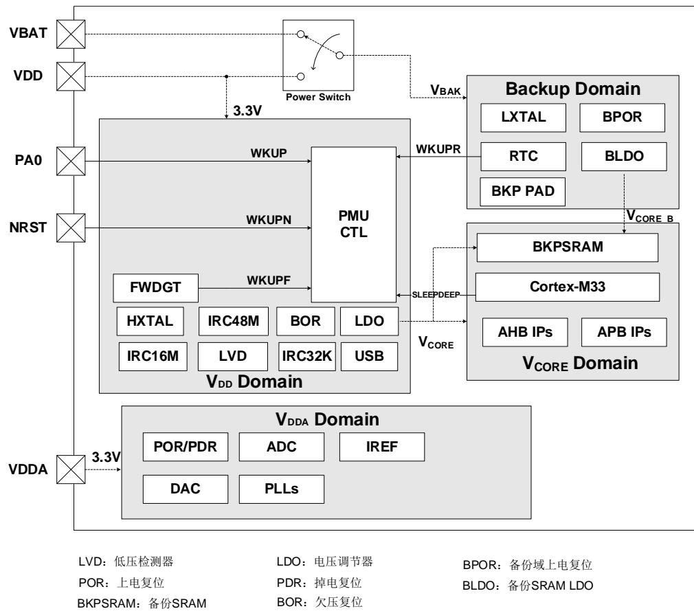
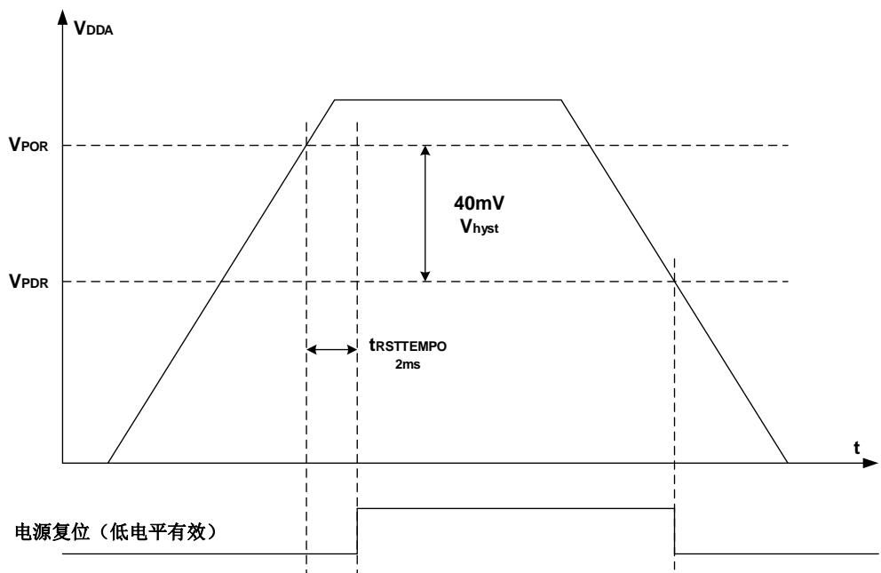
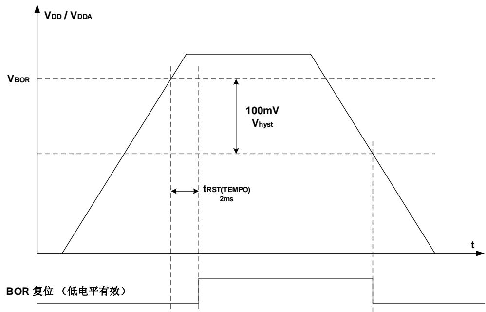
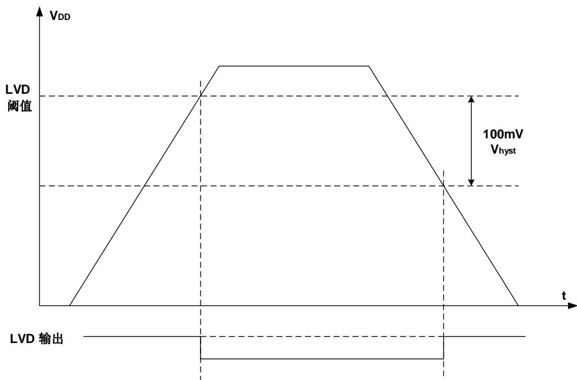

## 4. 电源管理单元（PMU）

## 4.1. 简介

功耗设计是GD32F527xx系列产品比较注重的问题之一。电源管理单元提供了三种省电模式，包括睡眠模式，深度睡眠模式和待机模式。这些模式能减少电源能耗，且使得应用程序可以在CPU运行时间要求、速度和功耗的相互冲突中获得最佳折衷。如图4-1. 电源域概览所示，GD32F527xx系列设备有三个电源域，包括V / V 域，V 域和备份域。V / V 域由电源直接供电。在V / V 域中嵌入了一个LDO，用来为V 域供电。在备份域中有一个电源切换器，当VDD电源关闭时，电源切换器可以将备份域的电源切换到VBAT引脚，此时备份域由V 引脚（电池）供电。

## 4.2. 主要特征

- 三个电源域：备份域、 $\mathsf { V } _ { \mathsf { D D } } / \mathsf { V } _ { \mathsf { D D A } }$ 域和VCO 电源域。

- 三种省电模式：睡眠模式、深度睡眠模式和待机模式。

- 内部电压调节器（LDO）为VCORE域提供VCORE电压和备份SRAM电压调节器（BLDO）专用于备份SRAM。

- 提供低电压检测器，当电压低于所设定的阈值时能发出中断或事件。

- 当VDD供电关闭时，由VBAT（电池）为备份域供电。

- 低驱动模式用于在深度睡眠模式下超低功耗。高驱动模式用在高频模式中。

- 由VCORE（源于VDD或VBAK）电源供电的4K字节的备份SRAM，保证在VDD电源断开的情况下，用户数据也不会丢失。

- LDO输出电压用于节约能耗。

## 4.3. 功能说明

4-1. 提供了 PMU 及相关电源域的内部结构框图。

图4-1. 电源域概览

## 4.3.1. 电池备份域

电池备份域由内部电源切换器来选择VDD供电或VBAT（电池）供电，然后由V 为备份域供电，该备份域包含 （实时时钟）、 （低速外部晶体振荡器）、 （备份域上电复位）、 O（备份S 电压调节器），以及 C 至 C 和 共 个 。为了确保备份域中寄存器的内容及 正常工作，当 关闭时， 引脚可以连接至电池或其他电源等备份源供电。电源切换器是由V / V 域掉电复位电路控制的。对于没有外部电池的应用，建议将VBAT引脚通过100nF的外部陶瓷去耦电容连接到VDD引脚上。

备份域的复位源包括备份域上电复位和备份域软件复位。在 没有完全上电前， 信号强制设备处于复位状态。应用软件可以通过设置RCU_BDCTL寄存器BKPRST位来触发备份域软件复位。

RTC的时钟源可以是低速内部RC振荡器（IRC32K）或低速外部晶体振荡器（LXTAL），或高速外部晶体振荡器（HXTAL）时钟2~31分频。当V 被关闭时，RTC只能选择LXTAL作为时钟源。在通过 / 指令进入省电模式之前，C ® 需要通过 C寄存器设置预期的唤醒时间并启用唤醒功能，以实现RTC定时器唤醒事件。进入省电模式一定时间之后，当经过的时间与预设的唤醒时间匹配时，RTC将唤醒设备。RTC的配置和操作的细节将在实时时钟（RTC）来描述。

当备份域由VDD供电（V 连接至V ）时，以下功能可用：

- PC13和PI8可以作为通用I/O口或RTC功能引脚（参见实时时钟 （RTC） ）。

- PC14和PC15可以作为通用I/O口或LXTAL晶振引脚。

当备份域由VBAT电源供电时（VBAK连接至VBAT），以下功能可用：

- PC13和PI8仅可以作为RTC功能引脚（参见实时时钟 （RTC） ）。

- PC14和PC15仅可作为LXTAL晶振引脚。

注意：由于PC13至PC15和PI8引脚是通过电源切换器供电的，电源切换器仅可通过小电流，因此当PC13至PC15和PI8的GPIO口在输出模式时，其工作的速度不能超过2MHz（最大负载为30pF）。

## 4.3.2. 备份 SRAM

在 VCORE电源域内有 4K 字节备份 SRAM。当 PMU_CS 寄存器中 BLDOON 被置位时，备份SRAM 用于在待机模式或 V 断开时，存储应用数据。在这些情况下，备份 SRAM 由备份电压调节器供电。在其他模式（非待机模式且非 V 断开）下，系统总线访问备份 SRAM 与访问普通 SRAM 的方式一样，由 VDD电压调节器供电。

备份 SRAM 只能在 FMC 处于低级安全保护模式时被用户代码访问，以防止不合法的程序或数据访问。如果 FMC 退出低级安全保护模式进入无保护模式，备份 SRAM 被擦除，所有数据丢失。置位 RCU_BDCTL 寄存器的 BKPRST 位，不会复位备份 SRAM 中存储的数据。

## 4.3.3. VDD / VDDA 电源域

V / V 域包括 V 域和 V 域两部分。V 域包括 HXTAL（高速外部晶体振荡器）、LDO（电压调节器）、POR / PDR（上电/掉电复位）、FWDGT（独立看门狗定时器）和除 PC13、PC14、PC15 和 PI8 之外的所有 PAD 等等。V 域包括 ADC / DAC（AD / DA 转换器）、IRC16M（内部 16M RC 振荡器）、IRC48M（内部 48M RC 振荡器）、IRC32K（内部 32K RC振荡器）PLLs（锁相环）和 LVD（低电压检测器）等等。

## VDD 域

为 V 域供电的 LDO（电压调节器），其复位后保持使能。可以被配置为三种不同的工作状态：包括睡眠模式（全供电状态）、深度睡眠模式（全供电或低功耗状态）和待机模式（关闭状态）。

POR/PDR（上电/掉由复位）由路检测VDDA 并在由压低于特定阈值时产生由源复位信号复位除备份域之外的整个芯片。图4-2. 上电 / 掉电复位波形图显示了供电电压和电源复位信号之间的关系。V 表示上电复位的阈值电压，V 表示掉电复位的阈值电压。V 表示迟滞电压。

图4-2. 上电 / 掉电复位波形图

注意：PDR_ON引脚仅存在于不小于144-pin和BGA100-pin封装上。内部POR / PDR电路由PDR_ON引脚使能。为了保证芯片上电和下电阶段POR / PDR的有效性，PDR_ON引脚需要保持高电平，参考Datasheet中PDR_ON引脚推荐电路图。

BOR电路检测VDD并在电压低于选项字节的BOR_TH定义的阈值且该阈值不为0b11（BOR_TH = 0b11，BOR功能关闭）时产生电源复位信号复位除备份域之外的整个芯片。不管选项字节 O 的值是否为 ， O / （上电 / 掉电复位）电路会一直处于检测状态。图4-3. BOR波形图显示了供电电压和BOR复位信号之间的关系。VBOR表示BOR复位的阈值电压，该值在选项字节BOR_TH中定义。 $\vee _ { \mathsf { h y s t } }$ 为迟滞电压。

图4-3. BOR波形图

## VDDA 域

LVD的功能是检测VDD / VDDA供电电压是否低于低电压检测阈值，该阈值由电源控制寄存器（PMU_CTL）中的LVDT[2:0]位进行配置。LVD通过LVDEN置位使能，位于电源状态寄存器（PMU_CS）中的LVDF位表示低电压事件是否出现，该事件连接至EXTI的第16线，用户可以通过配置EXTI的第16线产生相应的中断。图4-4. LVD阈值波形图显示了V 供电电压和LVD输出信号的关系。（LVD中断信号依赖于EXTI第16线的上升或下降沿配置）。迟滞电压 $\cdot \vee _ { \mathsf { h y s t ^ { \prime } } }$ 值为100mV。

图 4-4. LVD 阈值波形图

一般来说，数字电路由 VDD 供电，而大多数的模拟电路由 VDDA供电。为了提高 ADC 和 DAC的转换精度，为 VDDA独立供电可使模拟电路达到更好的特性。为避免噪声，VDDA通过外部滤波电路连接至 VDD，相应的 VSSA通过特定电路连接至 VSS。当 VDDA / VDD 不是同一个电源提供时，在上电和运行过程中 VDDA 与 VDD 差值不超过 0.3V。

为提高ADC和DAC的精度，可将独立的外部参考电压连接至ADC/DAC引脚VREFP/ VREFN。根据不同的封装，VREFP 可被连接至 VDDA 引脚，或者外部参考电压，外部参考电压的范围请参考表18-2. ADC 输入引脚定义和表19-1. DAC 引脚，VREFN 须被连接至 VSSA 引脚，VREFP 引脚仅存在于不小于 100-pin 封装上，而在 64-pin 或更少引脚封装不存在，因其内部已经连接至 VDDA。VREFN 仅存在于 BGA176-pin 和 BGA100-pin 封装上，在其他封装里，其内部连接至 VSSA。

## 4.3.4. VCORE 电源域

V 电源域为Cortex®-M33内核逻辑、AHB / APB外设、备份域和V / V 域的APB接口等提供电源。当V 电压上电后，POR将在V 域中产生一个复位序列，复位完成后，如果要进入指定的省电模式，须先配置相关的控制位，之后一旦执行WFI或WFE指令，设备便进入该省电模式。关于这方面的详细内容，将在以下章节予以说明。V 电压值请参考数据手册。

## 高驱动模式

如果V 电源域工作在高频状态下，且打开了多种功能，建议进入高驱动模式。使用高驱动模式需要执行以下步骤：

- 选择系统时钟为IRC16M或HXTAL。

- 将PMU_CTL寄存器的HDEN置1，使能高驱动模式。

- 等待PMU_CS寄存器的HDRF被置位。

- 将PMU_CTL寄存器的HDS置1，将LDO切换到高驱动模式。

- 等待PMU_CS寄存器的HDSRF被置位。进入高驱动模式。

- 工作在高频状态。

在选择IRC16M或HXTAL作为系统时钟后，可以通过将PMU_CTL寄存器的HDEN和HDS清0退出高驱动模式。当系统退出深度睡眠模式，将会自动退出高驱动模式。

## 4.3.5. 省电模式

系统复位或电源复位后，GD32F527xx MCU处于全功能状态且电源域全部处于供电状态。实现较低的功耗的方法有三种：减慢系统时钟（HCLK，PCLK1，PCLK2），关闭未使用的外设的时钟或通过PMU_CTL寄存器的LDOVS来配置LDO输出电压。此外，三种省电模式可以实现更低的功耗，它们是睡眠模式、深度睡眠模式和待机模式。

## 睡眠模式

睡眠模式与 ® 的 模式相对应。在睡眠模式下，仅关闭 ® 的时钟。如需进入睡眠模式，只要清除Cortex®-M33系统控制寄存器中的SLEEPDEEP位，并执行一条WFI或WFE指令即可。如果睡眠模式是通过执行WFI指令进入的，任何中断都可以唤醒系统。如果睡眠模式是通过执行WFE指令进入的，任何唤醒事件都可以唤醒系统（如果SEVONPEND为1，任何中断都可以唤醒系统，请参考Cortex®-M33技术手册）。由于无需在进入或退出中断上消耗时间，该模式所需的唤醒时间最短。

根据Cortex®-M33中SCR（系统控制寄存器）的SLEEPONEXIT位，有两种睡眠进入机制可选：

- Sleep-now：如果SLEEPONEXIT位被清零，一旦执行WFI或WFE指令，MCU立即进入睡眠模式。

- Sleep-on-exit：如果SLEEPONEXIT位被置位，当系统从最低优先级的中断处理程序离开后，MCU立即进入睡眠模式。

## 深度睡眠模式

深度睡眠模式与 Cortex®-M33 的 SLEEPDEEP 模式相对应。在深度睡眠模式下，V 域中的所有时钟全部关闭，IRC16M、IRC48M、HXTAL 及 PLLs 也全部被禁用。SRAM 和寄存器中的内容被保留。根据 PMU_CTL 寄存器的 LDOLP 位的配置，可控制 LDO 工作在正常模式或低功耗模式。进入深度睡眠模式之前，先将 Cortex®-M33 系统控制寄存器的 SLEEPDEEP位置 1，再清除 PMU_CTL 寄存器的 STBMOD 位，然后执行WFI 或WFE 指令即可进入深度睡眠模式。如果睡眠模式是通过执行WFI 指令进入的，任何来自 EXTI 的中断可以将系统从深度睡眠模式中唤醒。如果睡眠模式是通过执行 WFE 指令进入的，任何来自 EXTI 的事件可以将系统从深度睡眠模式中唤醒（如果 SEVONPEND 为 1，任何来自 EXTI 的中断都可以唤醒系统，请参考 Cortex®-M33 技术手册）。刚退出深度睡眠模式时，IRC16M 被选中作为系统时钟。请注意，如果 LDO 工作在低功耗模式，那么唤醒时需额外的延时时间。

在深度睡眠模式下，通过配置 PMU_CTL 寄存器的 LDEN，LDNP，LDLP，LDOLP 位可以进入低驱动模式。低驱动模式具有低驱动能力，低能耗。

正常驱动 / 正常功耗：将 PMU_CTL 寄存器的 LDEN 位配置为 00，深度睡眠模式就工作在正常驱动模式下。将 PMU_CTL 寄存器的 LDOLP 清 0 可以使 LDO 处于正常功耗模式

正常驱动 / 低功耗：将 PMU_CTL 寄存器的 LDEN 位配置为 00，深度睡眠模式就工作在正常驱动模式下。将 PMU_CTL 寄存器的 LDOLP 置 1 可以使 LDO 处于低功耗模式。

低驱动 / 正常功耗：将 PMU_CTL 寄存器的 LDEN 设置为 11，LDNP置 1 可以进入深度睡眠模式的低驱动模式。将 PMU_CTL 寄存器的 LDOLP 清 0 可以使 LDO 处于正常功耗模式。

低驱动 / 低功耗：将 PMU_CTL 寄存器的 LDEN 设置为 11，LDLP 置 1 可以进入深度睡眠模式的低驱动模式。将 PMU_CTL 寄存器的 LDOLP 置 1 可以使 LDO 处于低功耗模式。

非低驱动：将 PMU_CTL 寄存器的 LDEN 设置为 00，深度睡眠模式将不会处在低驱动模式。

注意：为了顺利进入深度睡眠模式，所有 EXTI 线上的挂起状态（在 EXTI_PD 寄存器中）和相关外设标志位必须被复位，参考表7-3. EXTI触发源。否则，程序将直接跳过深度睡眠模式进入过程而继续执行下面的程序。

## 待机模式

待机模式是基于 Cortex®-M33 的 SLEEPDEEP 模式实现的。在待机模式下，整个 V 域全部停止供电，同时 LDO 和包括 IRC16M、HXTAL 和 PLL也会被关闭。进入待机模式前，先将Cortex®-M33 系统控制寄存器的 SLEEPDEEP 位置 1，再将 PMU_CTL 寄存器的 STBMOD 位置 1，再清除 PMU_CS 寄存器的WUF 位，然后执行 WFI 或WFE 指令，系统进入待机模式，PMU_CS寄存器的 STBF 位状态表示 MCU 是否已进入待机模式。待机模式有四个唤醒源，包括来自 NRST 引脚的外部复位，RTC 唤醒事件，包括 RTC 侵入事件、RTC 闹钟事件、RTC时间戳事件或 RTC 唤醒事件，FWDGT 复位，WKUP 引脚的上升沿。待机模式可以达到最低的功耗，但唤醒时间最长。另外，一旦进入待机模式，SRAM 和 V 电源域寄存器（除了备份 SRAM，当 BLDOON 置位时）的内容都会丢失。退出待机模式时，会发生 V 域上电复位，复位之后 Cortex®-M33 将从 0x00000000 地址开始执行指令代码。

表 4-1. 节电模式总结

<table><tr><td>模式</td><td>睡眠</td><td>深度睡眠</td><td>待机</td></tr><tr><td>描述</td><td>仅关闭CPU时钟</td><td>1、关闭VCORE电源域的所有时钟2、关闭IRC16M、HXTAL和PLL</td><td>1、关闭VCORE电源域的供电2、关闭IRC16M、HXTAL和PLL</td></tr><tr><td>LDO状态</td><td>开启(正常功耗,正常驱动模式)</td><td>开启(正常功耗或低功耗模式,正常驱动或低驱动模式)</td><td>关闭</td></tr><tr><td>配置</td><td>SLEEPDEEP=0</td><td>SLEEPDEEP=1STBMOD = 0</td><td>SLEEPDEEP=1STBMOD = 1, WURST=1</td></tr><tr><td>进入指令</td><td>WFI 或 WFE</td><td>WFI 或 WFE</td><td>WFI 或 WFE</td></tr><tr><td>唤醒</td><td>若通过 WFI 进入,则任何中断均可唤醒;若通过 WFE 进入,则任何事件(或 SEVONPEND = 1 时的中断)均可唤醒</td><td>若通过 WFI 进入,来自 EXTI 的任何中断可唤醒;若通过 WFE 进入,来自 EXTI 的任何事件(或 SEVONPEND = 1 时的中断)可唤醒</td><td>1、NRST 引脚2、WKUP 引脚3、FWDGT 复位4、RTC</td></tr><tr><td>唤醒延迟</td><td>无</td><td>IRC16M 唤醒时间如果 LDO 处于低功耗模式,需增加 LDO 唤醒时间</td><td>上电序列</td></tr></table>

注意：在待机模式下，除了 NRST 引脚，配置为 RTC 功能的 PC13 和 PI8，用作 LXTAL 晶振引脚的 PC14 和 PC15，使能的WKUP 引脚，其他所有 I / O 都处于高阻态。
