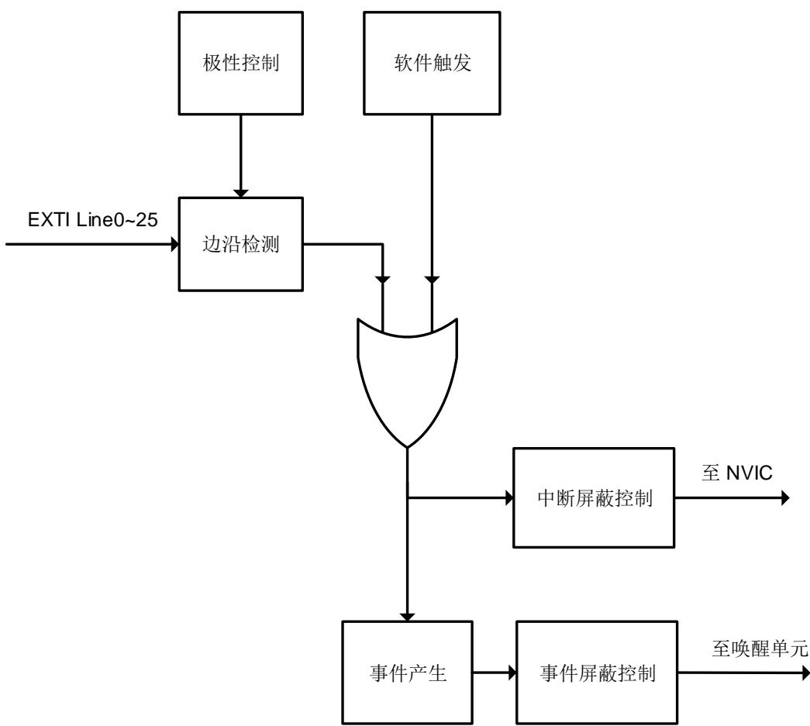

## 7. 中断/事件控制器（EXTI）

## 7.1. 简介

Cortex®-M33 集成了嵌套式矢量型中断控制器（Nested Vectored Interrupt Controller （NVIC））来实现高效的异常和中断处理。NVIC 实现了低延迟的异常和中断处理，以及电源管理控制。它和内核是紧密耦合的。更多关于 NVIC 的说明请参考《Cortex®-M33 技术参考手册》。

EXTI（中断/事件控制器）包括 26 个相互独立的边沿检测电路并且能够向处理器内核产生中断请求或唤醒事件。EXTI 有三种触发类型：上升沿触发、下降沿触发和任意沿触发。EXTI 中的每一个边沿检测电路都可以独立配置和屏蔽。

## 7.2. 主要特征

- Cortex®-M33系统异常；

- 104种可屏蔽的外设中断；

- 4位中断优先级配置位，可提供16个中断优先等级；

- 高效的中断处理；

- 支持异常抢占和咬尾中断；

- 将系统从省电模式唤醒；

- EXTI中有26个相互独立的边沿检测电路；

- 3种触发类型：上升沿触发，下降沿触发和任意沿触发；

- 软件中断或事件触发；

- 可配置的触发源。

## 7.3. 中断功能描述

Arm® Cortex®-M33处理器和嵌套式矢量型中断控制器（NVIC）在处理（Handler）模式下对所有异常进行优先级区分以及处理。当异常发生时，系统自动将当前处理器工作状态压栈，在执行完中断服务子程序（ISR）后自动将其出栈。

取向量是和当前工作态压栈并行进行的，从而提高了中断入口效率。处理器支持咬尾中断，可实现背靠背中断，大幅削减了反复切换工作态所带来的开销。表7-1. Cotrex-M33 中的NVIC和 7-2. 列出了所有的异常类型。

表 7-1. Cotrex-M33 中的 NVIC 异常类型

<table><tr><td>异常类型</td><td>向量编号</td><td>优先级(a)</td><td>向量地址</td><td>描述</td></tr><tr><td>-</td><td>0</td><td>-</td><td>0x0000_0000</td><td>保留</td></tr><tr><td>复位</td><td>1</td><td>-3</td><td>0x0000_0004</td><td>复位</td></tr><tr><td>NMI</td><td>2</td><td>-2</td><td>0x0000_0008</td><td>不可屏蔽中断</td></tr><tr><td>硬件故障</td><td>3</td><td>-1</td><td>0x0000_000C</td><td>各种硬件级别的故障</td></tr><tr><td>存储器管理</td><td>4</td><td>可编程设置</td><td>0x0000_0010</td><td>存储器管理</td></tr><tr><td>总线故障</td><td>5</td><td>可编程设置</td><td>0x0000_0014</td><td>预取指故障,存储器访问故障</td></tr><tr><td>用法故障</td><td>6</td><td>可编程设置</td><td>0x0000_0018</td><td>未定义的指令或非法状态</td></tr><tr><td>-</td><td>7-10</td><td>-</td><td>0x0000_001C - 0x0000_002B</td><td>保留</td></tr><tr><td>SVCall 服务调用</td><td>11</td><td>可编程设置</td><td>0x0000_002C</td><td>通过 SWI 指令实现系统服务调用</td></tr><tr><td>调试监控</td><td>12</td><td>可编程设置</td><td>0x0000_0030</td><td>调试监视器</td></tr><tr><td>-</td><td>13</td><td>-</td><td>0x0000_0034</td><td>保留</td></tr><tr><td>PendSV 挂起服务</td><td>14</td><td>可编程设置</td><td>0x0000_0038</td><td>可挂起的系统服务请求</td></tr><tr><td>系统节拍</td><td>15</td><td>可编程设置</td><td>0x0000_003C</td><td>系统节拍定时器</td></tr></table>

表 7-2. 中断向量表

<table><tr><td>中断编号</td><td>向量编号</td><td>外设中断描述</td><td>向量地址</td></tr><tr><td>IRQ 0</td><td>16</td><td>窗口看门狗中断</td><td>0x0000_0040</td></tr><tr><td>IRQ 1</td><td>17</td><td>连接到EXTI线的LVD中断</td><td>0x0000_0044</td></tr><tr><td>IRQ 2</td><td>18</td><td>连接到EXTI线的RTC侵入和时间戳中断</td><td>0x0000_0048</td></tr><tr><td>IRQ 3</td><td>19</td><td>连接到EXTI线的RTC唤醒中断</td><td>0x0000_004C</td></tr><tr><td>IRQ 4</td><td>20</td><td>FMC全局中断</td><td>0x0000_0050</td></tr><tr><td>IRQ 5</td><td>21</td><td>RCU和CTC中断</td><td>0x0000_0054</td></tr><tr><td>IRQ 6</td><td>22</td><td>EXTI线0中断</td><td>0x0000_0058</td></tr><tr><td>IRQ 7</td><td>23</td><td>EXTI线1中断</td><td>0x0000_005C</td></tr><tr><td>IRQ 8</td><td>24</td><td>EXTI线2中断</td><td>0x0000_0060</td></tr><tr><td>IRQ 9</td><td>25</td><td>EXTI线3中断</td><td>0x0000_0064</td></tr><tr><td>IRQ 10</td><td>26</td><td>EXTI线4中断</td><td>0x0000_0068</td></tr><tr><td>IRQ 11</td><td>27</td><td>DMA0通道0全局中断</td><td>0x0000_006C</td></tr><tr><td>IRQ 12</td><td>28</td><td>DMA0通道1全局中断</td><td>0x0000_0070</td></tr><tr><td>IRQ 13</td><td>29</td><td>DMA0通道2全局中断</td><td>0x0000_0074</td></tr><tr><td>IRQ 14</td><td>30</td><td>DMA0通道3全局中断</td><td>0x0000_0078</td></tr><tr><td>IRQ 15</td><td>31</td><td>DMA0通道4全局中断</td><td>0x0000_007C</td></tr><tr><td>IRQ 16</td><td>32</td><td>DMA0通道5全局中断</td><td>0x0000_0080</td></tr><tr><td>IRQ 17</td><td>33</td><td>DMA0通道6全局中断</td><td>0x0000_0084</td></tr><tr><td>IRQ 18</td><td>34</td><td>ADC全局中断</td><td>0x0000_0088</td></tr><tr><td>IRQ 19</td><td>35</td><td>CAN0 TX中断</td><td>0x0000_008C</td></tr><tr><td>IRQ 20</td><td>36</td><td>CAN0 RX0中断</td><td>0x0000_0090</td></tr><tr><td>IRQ 21</td><td>37</td><td>CAN0 RX1中断</td><td>0x0000_0094</td></tr><tr><td>IRQ 22</td><td>38</td><td>CAN0 EWMC中断</td><td>0x0000_0098</td></tr><tr><td>IRQ 23</td><td>39</td><td>EXTI线[9:5]中断</td><td>0x0000_009C</td></tr><tr><td>IRQ 24</td><td>40</td><td>TIMER0中止中断和TIMER8全局中断</td><td>0x0000_00A0</td></tr><tr><td>IRQ 25</td><td>41</td><td>TIMER0更新中断和TIMER9全局中断</td><td>0x0000_00A4</td></tr><tr><td>IRQ 26</td><td>42</td><td>TIMER0 触发与通道换相中断和 TIMER10全局中断</td><td>0x0000_00A8</td></tr><tr><td>IRQ 27</td><td>43</td><td>TIMER0 捕获比较中断</td><td>0x0000_00AC</td></tr><tr><td>IRQ 28</td><td>44</td><td>TIMER1 全局中断</td><td>0x0000_00B0</td></tr><tr><td>IRQ 29</td><td>45</td><td>TIMER2 全局中断</td><td>0x0000_00B4</td></tr><tr><td>IRQ 30</td><td>46</td><td>TIMER3 全局中断</td><td>0x0000_00B8</td></tr><tr><td>IRQ 31</td><td>47</td><td>I2C0 事件中断</td><td>0x0000_00BC</td></tr><tr><td>IRQ 32</td><td>48</td><td>I2C0 错误中断</td><td>0x0000_00C0</td></tr><tr><td>IRQ 33</td><td>49</td><td>I2C1 事件中断</td><td>0x0000_00C4</td></tr><tr><td>IRQ 34</td><td>50</td><td>I2C1 错误中断</td><td>0x0000_00C8</td></tr><tr><td>IRQ 35</td><td>51</td><td>SPI0 全局中断</td><td>0x0000_00CC</td></tr><tr><td>IRQ 36</td><td>52</td><td>SPI1 全局中断</td><td>0x0000_00D0</td></tr><tr><td>IRQ 37</td><td>53</td><td>USART0 全局中断</td><td>0x0000_00D4</td></tr><tr><td>IRQ 38</td><td>54</td><td>USART1 全局中断</td><td>0x0000_00D8</td></tr><tr><td>IRQ 39</td><td>55</td><td>USART2 全局中断</td><td>0x0000_00DC</td></tr><tr><td>IRQ 40</td><td>56</td><td>EXTI 线[15:10]中断</td><td>0x0000_00E0</td></tr><tr><td>IRQ 41</td><td>57</td><td>连接到EXTI 线的 RTC 闹钟中断</td><td>0x0000_00E4</td></tr><tr><td>IRQ 42</td><td>58</td><td>连接到EXTI 线的 USBFS 唤醒中断</td><td>0x0000_00E8</td></tr><tr><td>IRQ 43</td><td>59</td><td>TIMER7 中止中断和 TIMER11 全局中断</td><td>0x0000_00EC</td></tr><tr><td>IRQ 44</td><td>60</td><td>TIMER7 更新中断和 TIMER12 全局中断</td><td>0x0000_00F0</td></tr><tr><td>IRQ 45</td><td>61</td><td>TIMER7 触发与通道换相中断和 TIMER13全局中断</td><td>0x0000_00F4</td></tr><tr><td>IRQ 46</td><td>62</td><td>TIMER7 捕获比较中断</td><td>0x0000_00F8</td></tr><tr><td>IRQ 47</td><td>63</td><td>DMA0 通道 7 全局中断</td><td>0x0000_00FC</td></tr><tr><td>IRQ 48</td><td>64</td><td>EXMC 全局中断</td><td>0x0000_0100</td></tr><tr><td>IRQ 49</td><td>65</td><td>SDIO 全局中断</td><td>0x0000_0104</td></tr><tr><td>IRQ 50</td><td>66</td><td>TIMER4 全局中断</td><td>0x0000_0108</td></tr><tr><td>IRQ 51</td><td>67</td><td>SPI2 全局中断</td><td>0x0000_010C</td></tr><tr><td>IRQ 52</td><td>68</td><td>UART3 全局中断</td><td>0x0000_0110</td></tr><tr><td>IRQ 53</td><td>69</td><td>UART4 全局中断</td><td>0x0000_0114</td></tr><tr><td>IRQ 54</td><td>70</td><td>TIMER5 全局中断DAC0_OUT0, DAC0_OUT1 下溢错误中断</td><td>0x0000_0118</td></tr><tr><td>IRQ 55</td><td>71</td><td>TIMER6 全局中断</td><td>0x0000_011C</td></tr><tr><td>IRQ 56</td><td>72</td><td>DMA1 通道 0 全局中断</td><td>0x0000_0120</td></tr><tr><td>IRQ 57</td><td>73</td><td>DMA1 通道 1 全局中断</td><td>0x0000_0124</td></tr><tr><td>IRQ 58</td><td>74</td><td>DMA1 通道 2 全局中断</td><td>0x0000_0128</td></tr><tr><td>IRQ 59</td><td>75</td><td>DMA1 通道 3 全局中断</td><td>0x0000_012C</td></tr><tr><td>IRQ 60</td><td>76</td><td>DMA1 通道 4 全局中断</td><td>0x0000_0130</td></tr><tr><td>IRQ 61</td><td>77</td><td>以太网全局中断</td><td>0x0000_0134</td></tr><tr><td>IRQ 62</td><td>78</td><td>连接到EXTI 线的以太网唤醒中断</td><td>0x0000_0138</td></tr><tr><td>IRQ 63</td><td>79</td><td>CAN1 TX 中断</td><td>0x0000_013C</td></tr><tr><td>IRQ 64</td><td>80</td><td>CAN1 RX0 中断</td><td>0x0000_0140</td></tr><tr><td>IRQ 65</td><td>81</td><td>CAN1 RX1 中断</td><td>0x0000_0144</td></tr><tr><td>IRQ 66</td><td>82</td><td>CAN1 EWMC 中断</td><td>0x0000_0148</td></tr><tr><td>IRQ 67</td><td>83</td><td>USBFS 全局中断</td><td>0x0000_014C</td></tr><tr><td>IRQ 68</td><td>84</td><td>DMA1 通道 5 全局中断</td><td>0x0000_0150</td></tr><tr><td>IRQ 69</td><td>85</td><td>DMA1 通道 6 全局中断</td><td>0x0000_0154</td></tr><tr><td>IRQ 70</td><td>86</td><td>DMA1 通道 7 全局中断</td><td>0x0000_0158</td></tr><tr><td>IRQ 71</td><td>87</td><td>USART5 全局中断</td><td>0x0000_015C</td></tr><tr><td>IRQ 72</td><td>88</td><td>I2C2 事件中断</td><td>0x0000_0160</td></tr><tr><td>IRQ 73</td><td>89</td><td>I2C2 错误中断</td><td>0x0000_0164</td></tr><tr><td>IRQ 74</td><td>90</td><td>USBHS 端点 1 输出中断</td><td>0x0000_0168</td></tr><tr><td>IRQ 75</td><td>91</td><td>USBHS 端点 1 输入中断</td><td>0x0000_016C</td></tr><tr><td>IRQ 76</td><td>92</td><td>连接到EXTI线的USBHS唤醒中断</td><td>0x0000_0170</td></tr><tr><td>IRQ 77</td><td>93</td><td>USBHS 全局中断</td><td>0x0000_0174</td></tr><tr><td>IRQ78</td><td>94</td><td>DCI 全局中断</td><td>0x0000_0178</td></tr><tr><td>IRQ79</td><td>95</td><td>保留</td><td>0x0000_017C</td></tr><tr><td>IRQ80</td><td>96</td><td>TRNG 全局中断</td><td>0x0000_0180</td></tr><tr><td>IRQ 81</td><td>97</td><td>FPU 全局中断</td><td>0x0000_0184</td></tr><tr><td>IRQ82</td><td>98</td><td>UART6 全局中断</td><td>0x0000_0188</td></tr><tr><td>IRQ83</td><td>99</td><td>UART7 全局中断</td><td>0x0000_018C</td></tr><tr><td>IRQ84</td><td>100</td><td>SPI3 全局中断</td><td>0x0000_0190</td></tr><tr><td>IRQ85</td><td>101</td><td>SPI4 全局中断</td><td>0x0000_0194</td></tr><tr><td>IRQ86</td><td>102</td><td>SPI5 全局中断</td><td>0x0000_0198</td></tr><tr><td>IRQ87</td><td>103</td><td>SAI 全局中断</td><td>0x0000_019C</td></tr><tr><td>IRQ88</td><td>104</td><td>TLI 全局中断</td><td>0x0000_01A0</td></tr><tr><td>IRQ89</td><td>105</td><td>TLI 错误中断</td><td>0x0000_01A4</td></tr><tr><td>IRQ90</td><td>106</td><td>IPA 全局中断</td><td>0x0000_01A8</td></tr><tr><td>IRQ91</td><td>107</td><td>PKCAU 全局中断</td><td>0x0000_01AC</td></tr><tr><td>IRQ92</td><td>108</td><td>I2C3 事件中断</td><td>0x0000_01B0</td></tr><tr><td>IRQ93</td><td>109</td><td>I2C3 错误中断</td><td>0x0000_01B4</td></tr><tr><td>IRQ94</td><td>110</td><td>I2C4 事件中断</td><td>0x0000_01B8</td></tr><tr><td>IRQ95</td><td>111</td><td>I2C4 错误中断</td><td>0x0000_01BC</td></tr><tr><td>IRQ96</td><td>112</td><td>I2C5 事件中断</td><td>0x0000_01C0</td></tr><tr><td>IRQ97</td><td>113</td><td>I2C5 错误中断</td><td>0x0000_01C4</td></tr><tr><td>IRQ98</td><td>114</td><td>连接到EXTI线的I2C3唤醒中断</td><td>0x0000_01C8</td></tr><tr><td>IRQ99</td><td>115</td><td>连接到EXTI线的I2C4唤醒中断</td><td>0x0000_01CC</td></tr><tr><td>IRQ100</td><td>116</td><td>连接到EXTI线的I2C5唤醒中断</td><td>0x0000_01D0</td></tr><tr><td>IRQ101</td><td>117</td><td>SYSCFG ECC 单比特错误中断</td><td>0x0000_01D4</td></tr><tr><td>IRQ102</td><td>118</td><td>HAU 全局中断</td><td>0x0000_01D8</td></tr><tr><td>IRQ103</td><td>119</td><td>CAU 全局中断</td><td>0x0000_01DC</td></tr></table>

## 7.4. 结构框图

图 7-1. EXTI 的结构框图

## 7.5. 外部中断及事件功能概述

EXTI包含26个相互独立的边沿检测电路并且可以向处理器产生中断请求或事件唤醒。EXTI提供3种触发类型：上升沿触发，下降沿触发和任意沿触发。EXTI中每个边沿检测电路都可以分别予以配置或屏蔽。

EXTI触发源包括来自I/O管脚的16根线以及来自内部模块的10根线，具体细节参考表7-3. EXTI。通过配置SYSCFG_EXTISSx寄存器，所有的GPIO管脚都可以被选作EXTI的触发源，具体细节请参考系统配置寄存器(SYSCFG)。

除了中断，EXTI还可以向处理器提供事件信号。Cortex®-M33内核完全支持等待中断(WFI)，等待事件（ ）和发送事件（ ）指令。芯片内部有一个唤醒中断控制器（ ），用户可以让处理器和NVIC进入功耗极低的省电模式，由WIC来识别中断和事件以及判断优先级。当某些预期的事件发生时，例如一个特定的 管脚电平翻转或者 闹钟动作， 能唤醒处理器及整个系统。

## 硬件触发

硬件触发被用来检测外部或内部信号的电压变化。软件需要按如下步骤配置来使用这项功能：

1. 根据应用需要配置 SYSCFG 模块中的 EXTI 触发源；

2. 配置 EXTI_RTEN 寄存器和 EXTI_FTEN 寄存器以使能相应引脚的上升沿或下降沿检测（软件应当同时配置引脚对应的 RTENx 和 FTENx 位以检测该引脚上升沿和下降沿的变化）；

3. 通过配置引脚对应的 EXTI_INTEN 或 EXTI_EVEN 位，使能中断或事件；

4. EXTI 开始检测被配置的引脚上的电平变化，当这些引脚上期望的变化被检测到时，使能的中断或事件将被触发。如果为中断触发，则对应的 PD 位将立刻被置 1；如果为事件触发，则对应的 PD 位不被置 1。软件需要响应该中断或事件并清除相应 PDx 位。

## 软件触发

按照如下步骤软件也可以触发 EXTI 中断或事件：

1. 配置对应的 EXTI_INTEN 或 EXTI_EVEN 位使能中断或事件；

2. 配置 EXTI_SWIEV 寄存器的对应 SWIEVx 位，使能的中断或事件将被立即触发。如果为中断触发，则对应的 PD 位将立刻被置 1；如果为事件触发，则对应的 PD 位不被置 1。软件需要响应该中断或事件并清除相应 PDx 位。

表 7-3. EXTI 触发源

<table><tr><td>EXTI 线编号</td><td>触发源</td></tr><tr><td>0</td><td>PA0 / PB0 / PC0 / PD0 / PE0 / PF0 / PG0 / PH0 / PI0</td></tr><tr><td>1</td><td>PA1 / PB1 / PC1 / PD1 / PE1 / PF1 / PG1 / PH1 / PI1</td></tr><tr><td>2</td><td>PA2 / PB2 / PC2 / PD2 / PE2 / PF2 / PG2 / PH2 / PI2</td></tr><tr><td>3</td><td>PA3 / PB3 / PC3 / PD3 / PE3 / PF3 / PG3 / PH3 / PI3</td></tr><tr><td>4</td><td>PA4 / PB4 / PC4 / PD4 / PE4 / PF4 / PG4 / PH4 / PI4</td></tr><tr><td>5</td><td>PA5 / PB5 / PC5 / PD5 / PE5 / PF5 / PG5 / PH5 / PI5</td></tr><tr><td>6</td><td>PA6 / PB6 / PC6 / PD6 / PE6 / PF6 / PG6 / PH6 / PI6</td></tr><tr><td>7</td><td>PA7 / PB7 / PC7 / PD7 / PE7 / PF7 / PG7 / PH7 / PI7</td></tr><tr><td>8</td><td>PA8 / PB8 / PC8 / PD8 / PE8 / PF8 / PG8 / PH8 / PI8</td></tr><tr><td>9</td><td>PA9 / PB9 / PC9 / PD9 / PE9 / PF9 / PG9 / PH9 / PI9</td></tr><tr><td>10</td><td>PA10 / PB10 / PC10 / PD10 / PE10 / PF10 / PG10 / PH10 / PI10</td></tr><tr><td>11</td><td>PA11 / PB11 / PC11 / PD11 / PE11 / PF11 / PG11 / PH11 / PI11</td></tr><tr><td>12</td><td>PA12 / PB12 / PC12 / PD12 / PE12 / PF12 / PG12 / PH12</td></tr><tr><td>13</td><td>PA13 / PB13 / PC13 / PD13 / PE13 / PF13 / PG13 / PH13</td></tr><tr><td>14</td><td>PA14 / PB14 / PC14 / PD14 / PE14 / PF14 / PG14 / PH14</td></tr><tr><td>15</td><td>PA15 / PB15 / PC15 / PD15 / PE15 / PF15 / PG15 / PH15</td></tr><tr><td>16</td><td>LVD</td></tr><tr><td>17</td><td>RTC 闹钟</td></tr><tr><td>18</td><td>USBFS 唤醒</td></tr><tr><td>19</td><td>Ethernet 唤醒</td></tr><tr><td>20</td><td>USBHS 唤醒</td></tr><tr><td>21</td><td>RTC 侵入和时间戳事件</td></tr><tr><td>22</td><td>RTC 唤醒</td></tr><tr><td>23</td><td>I2C3 唤醒</td></tr><tr><td>24</td><td>I2C4 唤醒</td></tr><tr><td>25</td><td>I2C5 唤醒</td></tr></table>

<table><tr><td>31</td><td>30</td><td>29</td><td>28</td><td>27</td><td>26</td><td>25</td><td>24</td><td>23</td><td>22</td><td>21</td><td>20</td><td>19</td><td>18</td><td>17</td><td>16</td></tr><tr><td colspan="6">保留</td><td>EVEN25</td><td>EVEN24</td><td>EVEN23</td><td>EVEN22</td><td>EVEN21</td><td>EVEN20</td><td>EVEN19</td><td>EVEN18</td><td>EVEN17</td><td>EVEN16</td></tr><tr><td></td><td></td><td></td><td></td><td></td><td></td><td>rw</td><td>rw</td><td>rw</td><td>rw</td><td>rw</td><td>rw</td><td>rw</td><td>rw</td><td>rw</td><td>rw</td></tr><tr><td>15</td><td>14</td><td>13</td><td>12</td><td>11</td><td>10</td><td>9</td><td>8</td><td>7</td><td>6</td><td>5</td><td>4</td><td>3</td><td>2</td><td>1</td><td>0</td></tr><tr><td>EVEN15</td><td>EVEN14</td><td>EVEN13</td><td>EVEN12</td><td>EVEN11</td><td>EVEN10</td><td>EVEN9</td><td>EVEN8</td><td>EVEN7</td><td>EVEN6</td><td>EVEN5</td><td>EVEN4</td><td>EVEN3</td><td>EVEN2</td><td>EVEN1</td><td>EVEN0</td></tr><tr><td>rw</td><td>rw</td><td>rw</td><td>rw</td><td>rw</td><td>rw</td><td>rw</td><td>rw</td><td>rw</td><td>rw</td><td>rw</td><td>rw</td><td>rw</td><td>rw</td><td>rw</td><td>rw</td></tr><tr><td>位/位域</td><td colspan="4">名称</td><td colspan="11">描述</td></tr><tr><td>31:26</td><td colspan="4">保留</td><td colspan="11">必须保持复位值。</td></tr><tr><td>25:0</td><td colspan="4">EVENx</td><td colspan="11">事件使能位x(x=0...25)0:第x线事件被禁用1:第x线事件被使能</td></tr></table>
