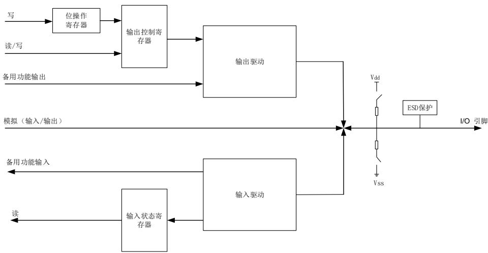
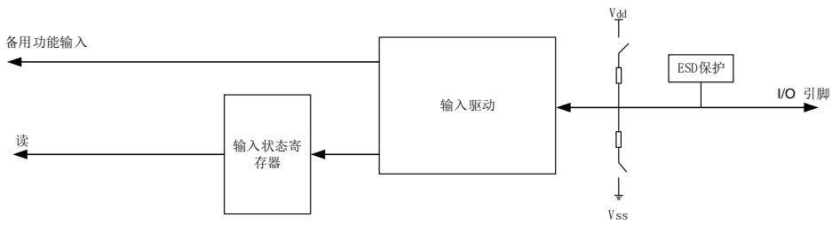
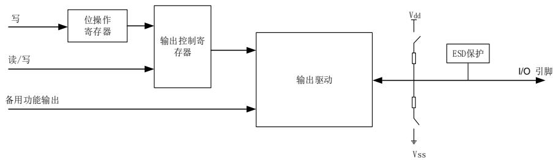
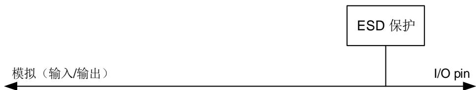
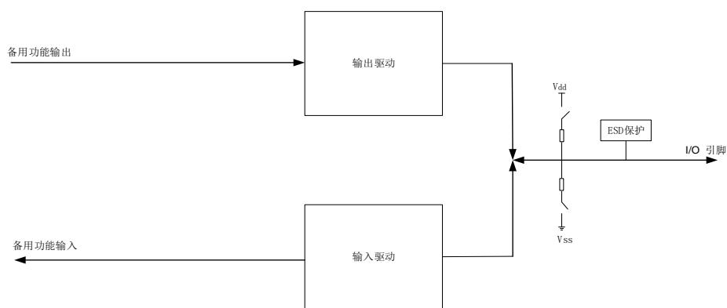

## 8. 通用和备用输入/输出接口（GPIO 和 AFIO）

## 8.1. 简介

最多可支持 140 个通用 I/O 引脚（GPIO），分别为 PA0 ~ PA15，PB0 ~ PB15，PC0 ~ PC15，PD0 ~ PD15，PE0 ~ PE15，PF0 ~ PF15，PG0 ~ PG15，PH0 ~ PH15 和 PI0 ~ PI11，各片上设备用其来实现逻辑输入 / 输出功能。每个 GPIO 端口有相关的控制和配置寄存器以满足特定应用的需求。GPIO 引脚上的外部中断在中断 / 事件控制器（EXTI）中有相关的控制和配置寄存器。

GPIO 端口和其他的备用功能（AFs）共用引脚，在特定的封装下获得最大的灵活性。GPIO 引脚通过配置相关的寄存器可以用作备用功能引脚，备用功能输入 / 输出都可以。

每个 GPIO 引脚可以由软件配置为输出（推挽或开漏）、输入、外设备用功能或者模拟模式。每个 GPIO 引脚都可以配置为上拉、下拉或无上拉 / 下拉。除模拟模式外，所有的 GPIO 引脚都具备大电流驱动能力。

## 8.2. 主要特性

- 输入/输出方向控制；

- 施密特触发器输入功能使能控制；

- 每个引脚都具有弱上拉/下拉功能；

- 推挽/开漏输出使能控制；

- 置位/复位输出使能；

- 可编程触发沿的外部中断-使用EXTI配置寄存器

- 模拟输入/输出配置；

- 备用功能输入/输出配置；

- 端口锁定配置；

- 单周期输出翻转功能。

## 8.3. 功能描述

每个通用 I/O 端口都可以通过 32 位控制寄存器（GPIOx_CTL）配置为 GPIO 输入，GPIO 输出，AF 功能或模拟模式。当选择 AF 功能时，引脚 AF 输入/输出是通过 AF 功能输出使能来选择。当端口配置为输出（GPIO 输出或 AFIO 输出）时，可以通过 GPIO 输出模式寄存器（GPIOx_OMODE）配置为推挽或开漏模式。输出端口的最大速度可以通过 GPIO 输出速度寄存器（GPIOx_OSPD）配置。每个端口可以通过 GPIO 上/下拉寄存器（GPIOx_PUD）配置为浮空（无上拉或下拉），上拉或下拉功能。

表 8-1. GPIO 配置表

<table><tr><td colspan="3">PAD TYPE</td><td>CTLy</td><td>OMy</td><td>PUDy</td></tr><tr><td rowspan="2">GPIO输入</td><td rowspan="2">X</td><td>浮空</td><td rowspan="2">00</td><td rowspan="2">X</td><td>00</td></tr><tr><td>上拉下拉</td><td>0110</td></tr><tr><td rowspan="6">GPIO输出</td><td rowspan="3">推挽</td><td>浮空</td><td rowspan="6">01</td><td rowspan="3">0</td><td>00</td></tr><tr><td>上拉</td><td>01</td></tr><tr><td>下拉</td><td>10</td></tr><tr><td rowspan="3">开漏</td><td>浮空</td><td rowspan="3">1</td><td>00</td></tr><tr><td>上拉</td><td>01</td></tr><tr><td>下拉</td><td>10</td></tr><tr><td rowspan="3">AFIO输入</td><td rowspan="3">X</td><td>浮空</td><td rowspan="3">10</td><td rowspan="3">X</td><td>00</td></tr><tr><td>上拉</td><td>01</td></tr><tr><td>下拉</td><td>10</td></tr><tr><td rowspan="6">AFIO输出</td><td rowspan="3">推挽</td><td>浮空</td><td rowspan="6">10</td><td rowspan="3">0</td><td>00</td></tr><tr><td>上拉</td><td>01</td></tr><tr><td>下拉</td><td>10</td></tr><tr><td rowspan="3">开漏</td><td>浮空</td><td rowspan="3">1</td><td>00</td></tr><tr><td>上拉</td><td>01</td></tr><tr><td>下拉</td><td>10</td></tr><tr><td>模拟</td><td>X</td><td>X</td><td>11</td><td>X</td><td>XX</td></tr></table>

8-1. GPIO 为标准 I/O 端口位的基本结构图。

图 8-1. GPIO 端口位的基本结构

## 8.3.1. GPIO 引脚配置

在复位期间或复位之后，备用功能并未激活，所有 GPIO 端口都被配置成输入浮空模式，这种输入模式禁用上拉（PU）/下拉（PD）电阻。但是复位后，串行线调试端口（JTAG/Serial-WiredDebug pins）为输入 PU/PD 模式：

PA15：JTDI 为上拉模式；

PA14：JTCK / SWCLK 为下拉模式；

PA13：JTMS / SWDIO 为上拉模式；

PB4：NJTRST 为上拉模式。

PB3：JTDO 为浮空模式。

GPIO 引脚可以配置为输入或输出模式，当 GPIO 引脚可配置为输入引脚时，所有的 GPIO 引脚内部都有一个可选择的弱上拉和弱下拉电阻。外部引脚上的数据在每个 AHB 时钟周期时都会装载到数据输入寄存器（GPIOx_ISTAT）。

当 GPIO 引脚配置为输出引脚，用户可以配置端口的输出速度和选择输出驱动模式：推挽或开漏模式。输出寄存器（GPIOx_OCTL）的值将会从相应 I/O 引脚上输出。

当对 GPIOx_OCTL 进行位操作时，不需要先读再写，用户可以通过写‘1’到位操作寄存器（GPIOx_BOP，或用于清 0 的 GPIOx_BC，或用于翻转操作的 GPIOx_TG）修改一位或几位，该过程仅需要一个最小的 AHB 写访问周期，而其他位不受影响。

## 8.3.2. 外部中断/事件线

只有在输入模式下配置，端口才能使用外部中断/事件线。

## 8.3.3. 备用功能（AF）

当端口配置为 AFIO（设置 GPIOx_CTL 寄存器中的 CTLy值为“0b10”）时，该端口用作外设备用功能。通过配置 GPIO 备用功能选择寄存器（GPIOx_AFSELz（z=0,1）），每个端口可以配置 16 个备用功能。端口备用功能分配的详细介绍见芯片数据手册。

## 8.3.4. 附加功能

有些引脚具有附加功能，它们优先于标准 GPIO 寄存器中的配置。当用作 ADC 或 DAC 附加功能时，引脚必须配置成模拟模式。当引脚用作 RTC、WKUPx 和振荡器附加功能时，端口类型通过相关的 RTC、PMU 和 RCU 寄存器自动设置。当附加功能禁用时，这些端口可用作普通GPIO。

## 8.3.5. 输入配置

当 GPIO 引脚配置为输入时：

- 施密特触发输入使能；

- 可选择的弱上拉和下拉电阻；

- 当前I/O引脚上的数据在每个AHB时钟周期都会被采样并存入端口输入状态寄存器；

- 输出缓冲器禁用。

8-2. 显示 I/O 引脚的输入配置。

图 8-2. 输入配置的基本结构

## 8.3.6. 输出配置

当GPIO配置为输出时：

- 施密特触发输入使能；

- 可选择的弱上拉和下拉电阻；

- 输出缓冲器使能；

- 开漏模式：输出控制寄存器设置为“0”时，相应引脚输出低电平；输出控制寄存器设置 为“1”，相应管脚处于高阻状态；

- 推挽模式：输出控制寄存器设置为“0”时，相应引脚输出低电平；输出控制寄存器设置为“1”，相应引脚输出高电平；

- 对端口输出控制寄存器进行读操作，将返回上次写入的值；

- 对端口输入状态寄存器进行读操作，将获得当前I/O口的状态。

8-3. 是 I/O 端口的输出配置。

图 8-3. 输出配置的基本结构

## 8.3.7. 模拟配置

当 GPIO 引脚用于模拟模式时：

- 弱上拉和下拉电阻禁用；

- 输出缓冲器禁用；

- 施密特触发输入禁用；

- 端口输入状态寄存器相应位为“0”。

8-4. 是 I/O 端口的模拟模式配置。

图 8-4. 模拟配置的基本结构

## 8.3.8. 备用功能（AF）配置

为了适应不同的器件封装，GPIO 端口支持软件配置将一些备用功能应用到其他引脚上。当引脚配置为备用功能时：

- 使用开漏或推挽功能时，可使能输出缓冲器；

- 输出缓冲器由外设驱动；

- 施密特触发输入使能；

- 在输入配置时，可选择的弱上拉/下拉电阻；

- I/O引脚上的数据在每个AHB时钟周期采样并存入端口输入状态寄存器；

- 对端口输入状态寄存器进行读操作，将获得I/O口的状态；

- 对端口输出控制寄存器进行读操作，将返回上次写入的值。

8-5. 是 I/O 端口备用功能配置图。

图 8-5. 备用功能配置的基本结构

## 8.3.9. GPIO 锁定功能

GPIO 的锁定机制可以保护 I/O 端口的配置。

被保护的寄存器有：GPIOx_CTL，GPIOx_OMODE，GPIOx_OSPD，GPIOx_PUD 和GPIOx_AFSELz（z=0,1）。通过配置 32 位锁定寄存器（GPIOx_LOCK）可以锁定 I/O 端口的配置。通过特定的锁定序列配置 GPIOx_LOCK 中的 LKK位和 LKy位，相应的端口位被锁定，直到下一个复位前，相应端口位的配置都不能修改。建议在电源驱动模块的配置中使用锁定功能。

## 8.3.10. GPIO 单周期输出翻转功能

通过将 GPIOx_TG 寄存器中对应的位写 1，GPIO 可以在一个 AHB 时钟周期内翻转 I/O 的输出电平。输出信号的频率可以达到 AHB 时钟的一半。
