# GigaDevice Semiconductor Inc.

# GD32H73x_75x 系列硬件开发指南

应用笔记

AN109 

1.6 版本

（2026 年 03 月）

## 目录

目录....2
图索引....4
表索引....6
1. 前言....7
2. 硬件设计....8
2.1. 电源....8
2.1.1. 备份域....9
2.1.2. VDD/VDDA电源域....9
2.1.3. 0.9V电源域....10
2.1.4. USB电源....14
2.1.5. 供电设计....15
2.2. 复位及电源管理....17
2.2.1. LVD....18
2.2.2. POR/PDR....19
2.2.3. BOR....19
2.2.4. NRST引脚....21
2.3. 时钟....22
2.3.1. 外部高速晶体振荡时钟（HXTAL）....24
2.3.2. 外部低速晶体振荡时钟（LXTAL）....25
2.3.3. 时钟输出能力（CKOUT）....26
2.3.4. HXTAL时钟监视器（CKM）....26
2.3.5. LXTAL时钟监视器（LCKM）....27
2.4. 启动配置....27
2.5. 典型外设模块....28
2.5.1. GPIO电路....28
2.5.2. ADC电路....29
2.5.3. 内部温度传感器....30
2.5.4. USB电路....32
2.6. 热管理及低功耗模式....34
2.7. 下载调试电路....35
2.8. 参考原理图设计....37
3. PCB Layout设计....38
3.1. 电源去耦电容....38
3.2. 0.9V电源域电路....38

3.3. 时钟电路....40
3.4. 复位电路....40
3.5. OSPI 电路....41
3.6. USB 电路....41
3.7. BGA 封装的扇出....42
4. 封装说明....43
5. 版本历史....44

## 图索引

图2-1.GD32H73x_75x系列电源域概览....8  
图2-2.LDO供电0.9V电源域....11  
图2-3.SMPS供电0.9V电源域....12  
图2-4.旁路(包含SMPS模块)....13  
图2-5.旁路(不包含SMPS模块)....13  
图2-6.旁路模式上下电时序图....13  
图2-7.USB稳压器供电时连接示意图....15  
图2-8.USB稳压器旁路时连接示意图....15  
图2-9.GD32H73x_75x系列推荐供电设计....16  
图2-10.GD32H73x_75x系列SMPS降压稳压器推荐设计....17  
图2-11.RCU_RSTSCK寄存器....18  
图2-12.系统复位电路....18  
图2-13.LVD阈值波形图....19  
图2-14.上电/掉电复位波形图....19  
图2-15.BOR波形图....20  
图2-16.推荐PDR_ON引脚电路设计....20  
图2-17.推荐外部复位电路....21  
图2-18.NRST引脚上下电MOS管脉冲示意图....22  
图2-19.GD32H73x_75x系列时钟树....23  
图2-20.HXTAL外部晶体电路....24  
图2-21.HXTAL外部时钟电路....24  
图2-22.LXTAL外部晶体电路....25  
图2-23.LXTAL外部时钟电路....25  
图2-24.推荐BOOT电路设计....28  
图2-25.标准IO的基本结构....29  
图2-26.ADC采集电路设计....30  
图2-27.ADC的模拟配置....30  
图2-28.测量方式....32  
图2-29.在主机或设备模式下连接示意图....33  
图2-30.OTG模式下使用内部嵌入式PHY连接示意图....33  
图2-31.使用外部ULPI PHY的连接示意图....34  
图2-32.推荐Standby外部唤醒引脚电路设计....34  
图2-33.推荐JTAG接线参考设计....35  
图2-34.推荐SWD接线参考设计....36  
图2-35.GD32H73x_75x推荐参考原理图设计....37  
图3-1.推荐电源引脚去耦Layout设计....38  
图3-2.BGA176封装SMPS供电模式推荐layout图....39  
图3-3.BGA176封装旁路模式推荐layout图....39  
图3-4.推荐时钟引脚Layout设计（无源晶体）....40  
图3-5.推荐NRST走线Layout设计....40

图3-6.推荐OSPI走线Layout设计 41  
图3-7.BGA100封装的扇出方式 42  
图3-8.BGA176封装的扇出方式 42

## 表索引

表1-1. 适用产品....7  
表2-1. 电源供电模式对应表....10  
表2-2. 默认供电模式寄存器初始状态....11  
表2-3. LDO Supply 寄存器配置表....11  
表2-4. SMPS Supply 寄存器配置表....12  
表2-5. 旁路寄存器配置表....14  
表2-6. SMPS降压稳压器外围器件推荐值....17  
表2-7. 时钟输出0的时钟源选择....26  
表2-8. 时钟输出1的时钟源选择....26  
表2-9. 引导模式选择....27  
表2-10. 引导模式详细描述....27  
表2-11. USBHS信号线描述....32  
表2-12. JTAG下载调试接口分配....35  
表2-13. SWD下载调试接口分配....36  
表4-1. 封装型号说明....43  
表5-1. 版本历史....44

## 1. 前言

本文是专为基于Arm® Cortex®-M7架构的32位通用MCU GD32H73x_75x系列开发者提供的，对GD32H73x_75x系列产品硬件开发做了总体介绍，如电源、复位、时钟、启动模式的设置及下载调试等。该应用笔记的目的是让开发者快速上手使用GD32H73x_75x系列产品，并快速进行产品硬件开发使用，节约研读手册的时间，加快产品开发进度。

本应用开发指南总共分为七部分来讲述：

1. 电源，主要介绍GD32H73x_75x系列电源管理、供电及复位功能的设计；

2. 时钟，主要介绍GD32H73x_75x系列高、低速时钟的功能设计；

3. 启动配置，主要介绍GD32H73x_75x系列BOOT配置及设计；

4. 典型外设模块，主要介绍GD32H73x_75x系列主要功能模块硬件设计；

5. 下载调试电路，主要介绍GD32H73x_75x系列推荐典型下载调试电路；

6. 参考电路及PCB Layout设计，主要介绍GD32H73x_75x系列硬件电路设计及PCB Layout设计注意事项；

7. 封装说明，主要介绍GD32H73x_75x系列所包含的封装形式及命名。

该文档也满足了基于GD32H73x_75x系列产品应用开发中所用到的最小系统硬件资源。

表 1-1. 适用产品

<table><tr><td>类型</td><td>型号</td></tr><tr><td rowspan="3">MCU</td><td>GD32H737xx系列</td></tr><tr><td>GD32H757xx系列</td></tr><tr><td>GD32H759xx系列</td></tr></table>

## 2. 硬件设计

## 2.1. 电源

GD32H73x_75x 系列 VDD / VDDA 工作电压范围为 1.71 V ~ 3.6 V。如图 2-1 所示，GD32H73x_75x 系列设备有三个电源域，包括 VDD / VDDA 域、0.9 V 域和备份域。VDD / VDDA 域由电源直接供电。芯片内置 LDO 和低功率开关电源降压稳压器（SMPS），用于为 0.9 V 域供电。备份域中有一个电源切换器：当 VDD 电源关闭时，电源切换器将备份域的电源切换到 VBAT 引脚，此时备份域由 VBAT 引脚（电池）供电。USB 部分有专用的外部供电引脚和电压调节器，可输入 5 V 或 3.3 V 电源供电。

图2-1. GD32H73x_75x系列电源域概览

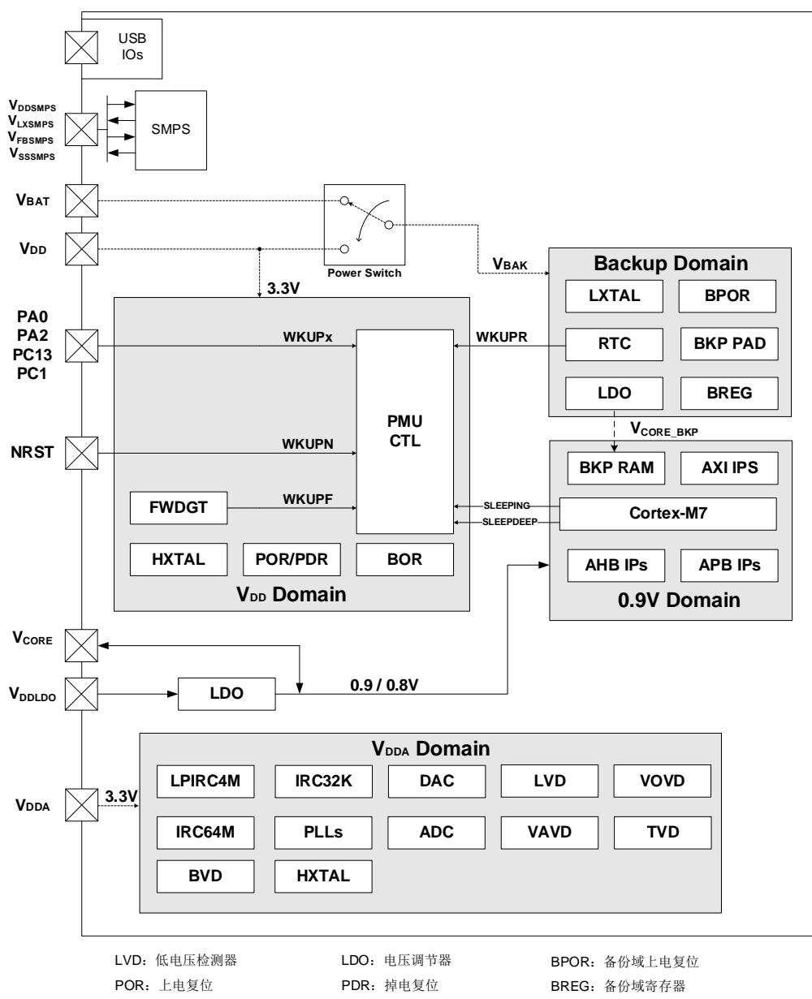

## 2.1.1. 备份域

备份域供电电压范围为 1.71 V ~ 3.6 V，内部电源切换器选择 VDD 或 VBAT（电池）供电，再由 VBAK 为备份域供电。备份域包含 RTC（实时时钟）、LXTAL（低速外部晶体振荡器）、BPOR（备份域上电复位）和 BREG，以及 PC13 ~ PC15 共 3 个 BKP PAD。为了确保备份域寄存器内容及 RTC 正常工作，当 VDD 关闭时，VBAT 引脚可连接电池或其他备份电源。电源切换器由 VDD / VDDA 域掉电复位电路控制。对于没有外部电池的应用，建议将 VBAT 引脚通过 100 nF 电容接地后再连接到 VDD 引脚。

备份域的复位源包括备份域上电复位和备份域软件复位。在 VBAK没有完全上电前，BPOR 信号强制设备处于复位状态。应用软件可以通过设置 RCU_BDCTL 寄存器 BKPRST 位来触发备份域软件复位。

RTC 的时钟源可以是低速内部 32 kHz RC 振荡器（IRC32K）、低速外部晶体振荡器（LXTAL），或由 RCU_CFG0 寄存器 RTCDIV[5:0] 位域控制的高速外部晶体振荡器（HXTAL）分频时钟。当 VDD 关闭时，RTC 只能选择 LXTAL 作为时钟源。在通过 WFI / WFE 指令进入省电模式之前，Cortex®-M7 可通过 RTC 寄存器设置预期唤醒时间并启用唤醒功能，或根据 EXTI 实现 RTC 定时器唤醒事件。经过时间与预设唤醒时间匹配时，RTC 将唤醒设备。

当备份域由 VDD 供电（VBAT 连接至 VDD）时，以下功能可用：

◼ PC13可以作为通用I/O口或RTC功能引脚；

◼ PC14和PC15可以作为通用I/O口或LXTAL晶振引脚。

当备份域由 VBAT 电源供电时（VDD 掉电），以下功能可用：

◼ PC13仅可以作为RTC功能引脚；

◼ PC14和PC15仅可作为LXTAL晶振引脚。

### 注意：

1. 由于 PC13 至 PC15 引脚是通过电源切换器供电的，电源切换器仅可通过小电流，因此当PC13 至 PC15 的 GPIO 口在输出模式时，其工作的速度不能超过 2MHz（最大负载为30pF）；

2. 备份域的 LDO 可以产生 VCORE_BKP 电压，当 VDD/VDDA 上电时，0.9V 电源域的 BKP RAM由 VCORE 供电；当 VDD/VDDA 掉电时，0.9V 电源域的 BKP RAM 由 VCORE_BKP 供电。

VDD 可通过一个内部电阻给外部 VBAT 电池充电。通过配置 PMU_CTL2 寄存器中 VCRSEL 位，可选择 5 kΩ 或 1.5 kΩ 内部电阻；将 VCEN 位置 1 可使能 VBAT 电池充电。在 BKP only 模式下，VBAT 电池充电不可用。

注意：在 BKP only 模式下，VDD 掉电，备份域由 VBAT 引脚供电。

## 2.1.2. VDD / VDDA 电源域

电源域包括 VDD 域和 VDDA 域两部分。如果 VDDA 不等于 VDD，两者之间的压差不能超过 300 mV（芯片内部 VDDA 与 VDD 通过背靠背二极管连接）。为避免噪声，VDDA 可通过外部滤波电路连接至 VDD，相应的 VSSA 通过单点接地电路（0 Ω 电阻或磁珠等）连接至 VSS。

为了提高 ADC 的转换精度，为 VDDA 独立供电可使模拟电路达到更好的特性。GD32H73x_75x 在内部集成有为 ADC 提供参考电压的 VREFP 引脚。使用 12 位 ADC 时，1.71 V ≤ VREFP ≤ VDDA；使用 14 位 ADC 时，若 VDDA ≥ 2.4 V，则 2.4 V ≤ VREFP ≤ VDDA，若 VDDA < 2.4 V，则 1.8 V ≤ VREFP ≤ VDDA。

BGA176 封装中含有 VREFP 和 VREFN 引脚，VREFP 可以使用外部参考电源，也可以直连至 VDDA，VREFN 必须连接到 VSSA；

- LQFP 封装中含有 VREFP 引脚，VREFP 可以使用外部参考电源，也可以直连至 VDDA；

- VREFP 引脚通过内部二极管连接至 VDDA 引脚，当 VREFP ≥ VDDA + 0.3 V 时，会有漏电到 VDDA 引脚上；

- GD32H73x_75x 系列拥有 VREFBUF，当 VREFP 引脚未连接外部参考电源时，可由 VREFBUF 产生 1.5 V ~ 2.5 V 的四个档位参考电压，具体请参考用户指南和数据手册。

## 2.1.3. 0.9V 电源域

使用SMPS降压稳压器和LDO，可以设置0.9V电源域的供电电源。不同配置可提供四种有效的0.9V电源域供电模式，模式对应表如表2-1. 电源供电模式对应表所示。

表 2-1. 电源供电模式对应表

<table><tr><td>电源供电模式</td></tr><tr><td>无配置的供电模式(默认供电模式)</td></tr><tr><td>LDO 供电模式</td></tr><tr><td>SMPS 供电模式</td></tr><tr><td>旁路模式</td></tr></table>

### 无配置的供电模式（默认供电模式）

无配置的供电模式，该模式为初始过渡模式。在芯片复位后，软件若不设置任何电源模式，芯片会保持在此模式状态。此时所有寄存器为复位值， 、 均使能。在此阶段若硬件按如下设置可能出现的情况：

1、 硬件设置为 LDO 供电模式，则 LDO 输出 0.9V，为 V0.9V域供电。该状态与 LDO 供电模式相同。

2、 硬件设置为 SMPS 供电，则 SMPS 输出 1V 至 VCORE。但同时 LDO 也使能，VDDLDO与 VCORE 短接，VCORE 电压存在波动。因此在复位后软件应配置成 SMPS 供电模式以保证系统可靠性。

3、 在 BGA176 与 LQFP176 封装上，硬件设置为旁路模式，LDO 使能但被硬件强制旁路，电源来自外部输入，可能存在未知风险。在 LQFP144、LQFO100、BGA100 封装上，由于内部 LDO 输入默认接 VDD，会导致内部 LDO 输出 0.9V，而外部电源此时也有输出，会造成电压竞争，存在风险。综上所述，该种情况下在复位后软件立即应配置成旁路模式以保证安全。

总之，该模式为芯片启动初始过渡状态，长期使用会有不可预知风险，应当在芯片正常运行时将软硬件配置为其他模式。

寄存器默认状态如表2-2. 默认供电模式寄存器初始状态：

表 2-2. 默认供电模式寄存器初始状态

<table><tr><td>Symbol</td><td>Description</td></tr><tr><td>DVSEN</td><td>1: SMPS 使能</td></tr><tr><td>LDOEN</td><td>1: LDO 使能</td></tr><tr><td>LDOVS[2:0]</td><td>010: LDO 输出 0.9V</td></tr><tr><td>BYPASS</td><td>0: BYPASS 不使能</td></tr></table>

### LDO 供电模式

该模式SMPS关闭，LDO开启，为V 域供电，具体电路可参考图2-2. LDO供电0.9V电源域设计（SMPS模块关闭时，VDDSMPS引脚必须连接到V 或V 上）。使用内部LDO供电可为系统提供稳定的电源。

图 2-2. LDO 供电 0.9V 电源域

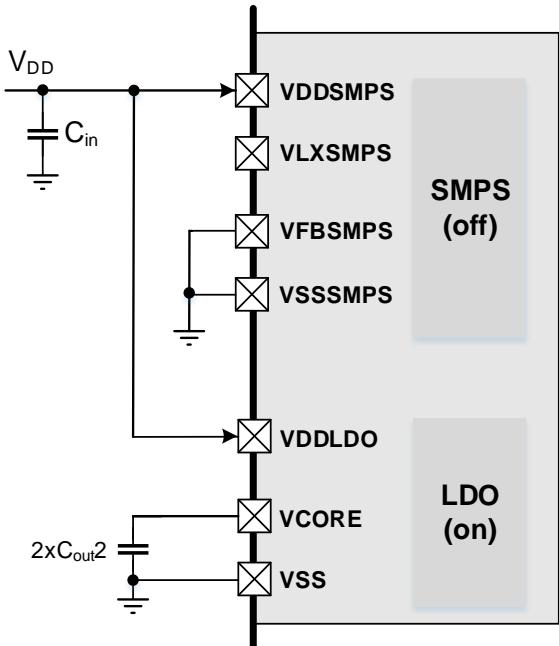

进入该供电模式的配置方式为：DVSEN位为0b0，DVSCFG和DVSVC[1:0]位域的值没有影响，SMPS降压稳压器为关闭状态；LDOEN位为0b1，LDO为开启状态，并为0.9V电源域供电，供电电压由LDOVS[2:0]位域控制，LDO的工作模式与系统的低功耗模式一致；BYPASS位为0b0。SMPS、LDO输出电压的寄存器配置如表2-3. LDO Supply 寄存器配置：

表 2-3. LDO Supply 寄存器配置表

<table><tr><td>Symbol</td><td>Description</td></tr><tr><td>DVSEN</td><td>0: SMPS 不使能</td></tr><tr><td>LDOEN</td><td>1: LDO 使能</td></tr><tr><td>LDOVS[2:0]</td><td>010: LDO 输出 0.9V</td></tr><tr><td>BYPASS</td><td>0: BYPASS 不使能</td></tr></table>

### SMPS 供电模式

该模式SMPS开启，直接为V 域供电，LDO关闭，具体电路可参考图2-3. SMPS供电0.9V电设计。使用SMPS供电可有效降低芯片发热与运行功耗。

图 2-3. SMPS 供电 0.9V 电源域

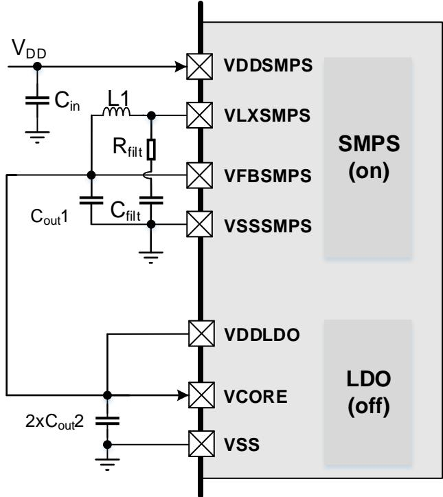

进入该供电模式的配置方式为：DVSEN位为0b1，DVSCFG位为0b1，DVSVC[1:0]位域的值没有影响，SMPS降压稳压器为开启状态，并为0.9V电源域供电，供电电压由LDOVS[2:0]位域控制，SMPS的工作模式与系统的低功耗模式一致；LDOEN位为0b0，LDO为关闭状态；BYPASS位为0b0。SMPS、LDO输出电压的寄存器配置如表2-4. SMPS Supply 寄存器配置表：

表 2-4. SMPS Supply 寄存器配置表

<table><tr><td>Symbol</td><td>Description</td></tr><tr><td>DVSEN</td><td>1: SMPS 使能</td></tr><tr><td>LDOEN</td><td>0: LDO 不使能</td></tr><tr><td>LDOVS[2:0]</td><td>010: SMPS 输出 0.9V</td></tr><tr><td>BYPASS</td><td>0: BYPASS 不使能</td></tr></table>

### 旁路模式

该模式 关闭， 关闭，外部电路通过 引脚为 域供电。在 系列不同的封装上，相关 SMPS 引脚引出情况不一致。BGA176 与 LQFP176 两种封装包含 SMPS 模块，其 SMPS 相关引脚与 VDDLDO 引脚均在封装上引出；LQFP144、LQFP100 与 BGA100封装不包含 SMPS 模块，其封装上无相关引脚。因此工作在旁路模式时的电路接法略微不同，具体电路可参考图 2-4. 旁路 (包含 SMPS 模块)和图 2-5. 旁路 (不包含 SMPS 模块)设计（SMPS 模块关闭时，VDDSMPS引脚必须连接到 V 或 V 上）。

图 2-4. 旁路 (包含 SMPS 模块)

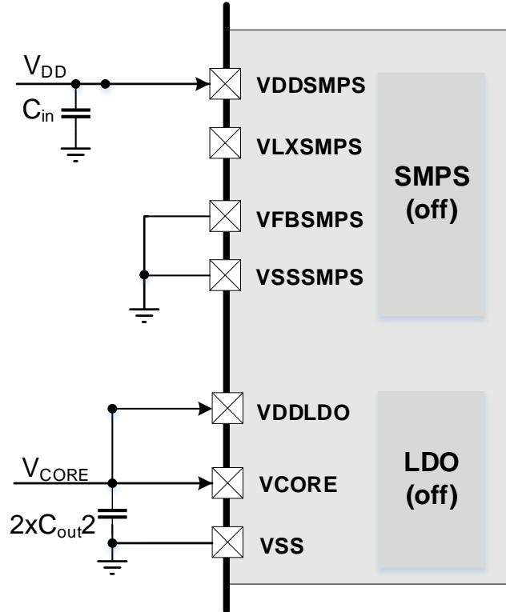

图 2-5. 旁路 (不包含 SMPS 模块)

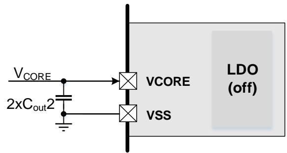

旁路模式上电时序图如图2-6. 旁路模式上下电时序图所示，当 MCU 的 V /V 电压上升到POR 阈值前，需保证 V 电压大于 0.85V；当 MCU 的 V /V 电压跌落到 PDR 阈值前，需保证 VCORE电压大于 0.85V。同时在任何工况下，都需要保证 VDD/VDDA电压大于 VCORE电压。

图 2-6. 旁路模式上下电时序图

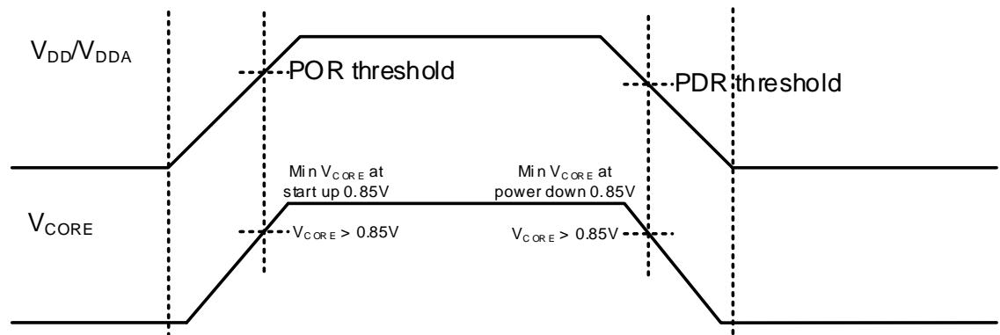

进入该供电模式的配置方式为：DVSEN 位为 0b0，DVSCFG 和 DVSVC[1:0]的值无影响，

SMPS 降压稳压器为关闭状态；LDOEN 位为 0b0，LDO 为关闭状态；BYPASS 位为 0b1，0.9V 电源域由 VCORE 引脚供电。SMPS、LDO 输出电压的寄存器配置如表2-5. 旁路寄存器配置表

表 2-5. 旁路寄存器配置表

<table><tr><td>Symbol</td><td>Description</td></tr><tr><td>DVSEN</td><td>0: SMPS 不使能</td></tr><tr><td>LDOEN</td><td>0: LDO 不使能</td></tr><tr><td>BYPASS</td><td>1: BYPASS 使能</td></tr></table>

### 注意：

1、 旁路模式中，外部器件输出电压到 VCORE，应保证其典型值为 0.9V，电压范围在 0.873V~ 0.955V 以内，在较恶劣的应用场景下也应确保电源波动范围在 50mV 以内；

2、 工作在旁路模式下，会有比较大的电流从外部器件经 VCORE 引脚流入 V 电源域（根据仿真与测试结果，该电流最大会达到 400mA 量级），因此对于外部供电器件的要求较高，我们建议外部器件的带载能力需大于 600mA，且不同负载下的输出电压波动范围也需满足前述 50mV的要求；考虑电源稳定性要求，旁路模式推荐使用外部 LDO 供电。

3、 考虑到 PCB 走线的 ESR 效应与大电流的 IR drop，在 PCB 走线时，需要考虑加宽外部供电到 VCORE 引脚走线的宽度以减小 ESR，保证在芯片 VCORE 引脚处的电压是满足幅值以及波动要求；

4、 封装上多个 VCORE 引脚建议在外部通过走线连接在一起。关于 VCORE 引脚处的去耦与滤波电容，工作在旁路模式时，建议每一个 VCORE 引脚就近放置一颗 100nF 电容，如果封装上有第三个 VCORE 引脚，则只需保证该引脚与其他两个 VCORE 引脚连接在一起，不需添加额外的电容；

5、 当使用旁路模式进入 standby 模式时，先进入 standby 模式，再关闭外部 V 电源，外部 VCORE电源必须关闭；当退出 standby 模式时，先打开外部 VCORE电源，再退出 standby模式。

注意：除上述有效组合外，其它 DVSEN、DVSCFG、DVSVC[1:0]、LDOEN、BYPASS 位或位值的配置组合均无效。0.9V电源域的电源状态在复位后保持不变（无配置的供电模式）。

注意：当 SMPS 降压稳压器为 0.9V 电源域供电，并且 DVSVC[1:0]配置了错误的数值，将使SMPS降压稳压器输出高电压到 0.9V电源域，此时 0.9V电源域将启动硬件过压保护，硬件置位 DVSVC[1:0] 0b00。

注意：最大工作频率与供电电压有关，具体请参考数据手册。

## 2.1.4. USB 电源

GD32H73x_75x系列USB内部集成了一个稳压器，用户可以选择使能该稳压器，将V 引脚连接5 V电源为USB模块提供电源，如图2-7. USB稳压器供电时连接示意图所示；或旁路该稳压器，将 引脚连接 电源为 模块提供电源，如图 稳压器旁路时连接所示。

图 2-7. USB 稳压器供电时连接示意图

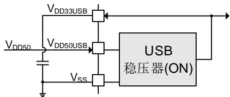

图 2-8. USB 稳压器旁路时连接示意图

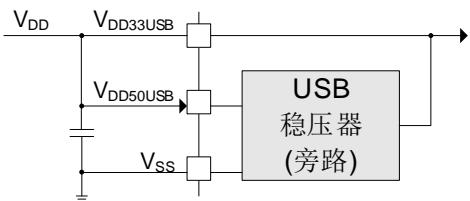

注意：

1. 当 VDD ≥ 3 V 时，USB 电源可使用 USB 稳压器供电模式或旁路模式；当 VDD < 3 V 时，USB 电源只能使用 USB 稳压器供电模式；

2. 若使用ISP 下载功能，需要使用上述两种USB 电源供电方式之一，为VDD33USB供电。

## 2.1.5. 供电设计

系统需要稳定的电源，开发使用的时候有些重要事项需要注意：

◼ VDD 脚必须外接电容（N × 100 nF 陶瓷电容 + 不小于 4.7 uF 钽电容；至少一个 VDD 引脚需要通过不小于 4.7 uF 的电容接至 GND，其他 VDD 引脚各接 100 nF）；

◼ VDDA 脚必须外接电容（建议 10 nF + 1 uF 陶瓷电容）；

◼ VREF 电压可由内部产生，也可直连至 VDDA，且在 VREFP 引脚对地连接 10 nF + 1 uF 陶瓷电容。

图 2-9. GD32H73x_75x 系列推荐供电设计

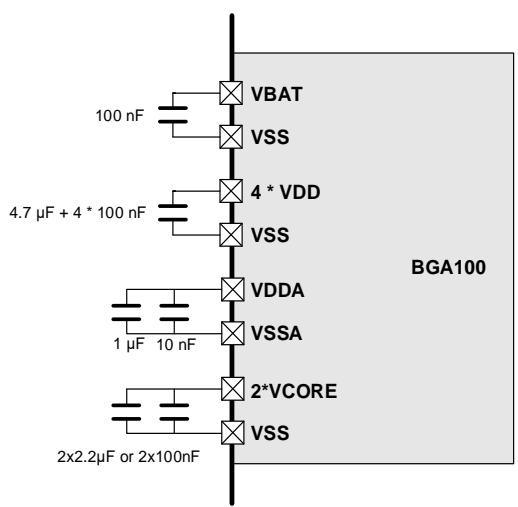

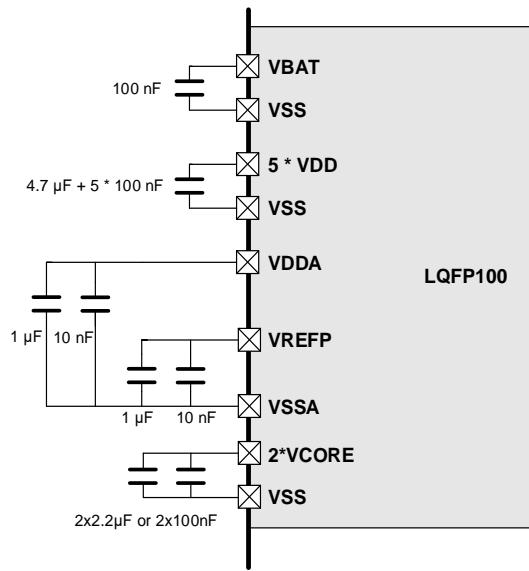

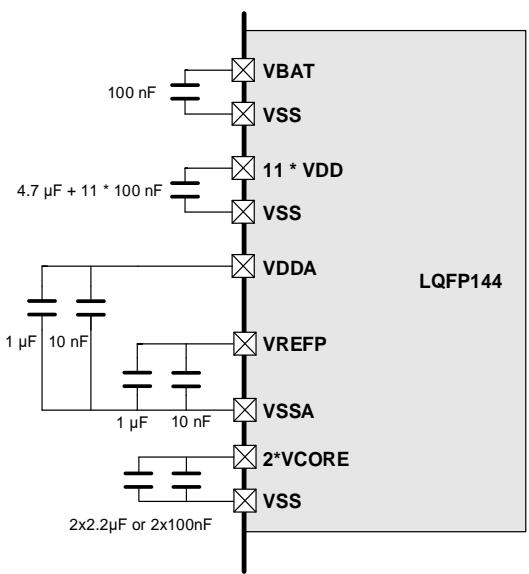

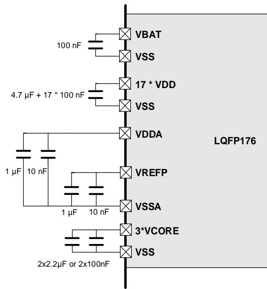

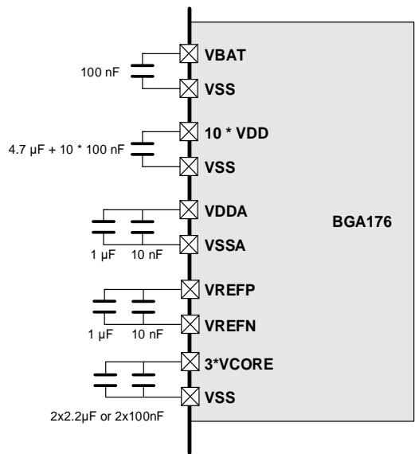

### 注意：

1、所有去耦电容须靠近芯片对应VDD、VDDA、VBAT、VREFP、VCORE引脚放置；

2、无论LDO是否使能，芯片的所有VCORE应连接在一起，所有的VDDLDO应连接在一起，具体参考2.1.3节；

3、 当LDO使能时，建议VCORE对GND接两个2.2uF的陶瓷电容；当LDO旁路时，建议VCORE对GND接两个100nF的陶瓷电容；

4、当MCU电源电压不稳定，或有电压跌落等风险时，建议将VDD的4.7uF电容调整为不低于10uF的电容；

5、 BGA100：VREFP和VDDA在内部连接，VREFN和VSSA在内部连接；

6、 LQFP100：VREFN和VSSA在内部连接；

7、 LQFP144：VREFN和VSSA在内部连接；

8、 LQFP176：VREFN和VSSA在内部连接。

SMPS电路推荐设计如图2-10. GD32H73x_75x系列SMPS降压稳压器推荐设计所示，器件典型值参考表2-6. SMPS降压稳压器外围器件推荐值。

图 2-10. GD32H73x_75x 系列 SMPS 降压稳压器推荐设计

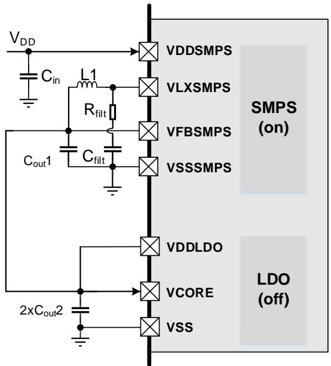

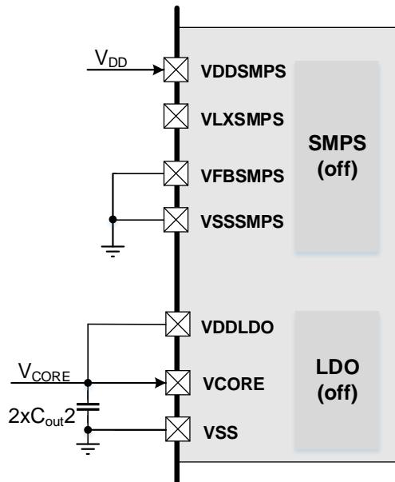

表 2-6. SMPS 降压稳压器外围器件推荐值

<table><tr><td>名称</td><td>描述</td><td>推荐值</td><td>封装</td></tr><tr><td>Cin</td><td>VDDSMPS 外接电容</td><td>10uF</td><td>0805</td></tr><tr><td>Cfilt</td><td>VLXSMPS 外接电容</td><td>220pF</td><td>0603</td></tr><tr><td>Rfilt</td><td>VLXSMPS 外接电阻</td><td>50Ω</td><td>0603</td></tr><tr><td>COUT1</td><td>VFBSMPS 外接电容</td><td>10uF</td><td>0805</td></tr><tr><td>COUT2</td><td>VCORE 外接电容</td><td>100nF / 2.2uF</td><td>0603/0805</td></tr><tr><td>L1</td><td>VLXSMPS 外接电感</td><td>2.2uH</td><td>0806</td></tr></table>

## 2.2. 复位及电源管理

在本节中，默认VDD与VDDA引脚保持连接，由同一电源供电。

GD32H73x_75x系列复位控制包括三种复位：电源复位、系统复位和备份域复位。电源复位为冷复位，电源启动时复位除了备份域的所有系统。

MCU复位源可以通过查询寄存器RCU_RSTSCK (0x40021024)来判断，该寄存器只有上电复位才能清除标志位，所以在使用过程中，获取到复位源后，可通过RSTFC控制位清除复位标志，那样发生看门狗复位或其他复位事件时，才能较准确在RCU_RSTSCK寄存器中体现出来：

图 2-11. RCU_RSTSCK 寄存器

<table><tr><td>31</td><td>30</td><td>29</td><td>28</td><td>27</td><td>26</td><td>25</td><td>24</td><td>23</td><td>22</td><td>21</td><td>20</td><td>19</td><td>18</td><td>17</td><td>16</td></tr><tr><td>LPRSTF</td><td>WWDGTRSTF</td><td>FWDGTRSTF</td><td>SWRSTF</td><td>PORRSTF</td><td>EPRSTF</td><td>BORRSTF</td><td>RSTFC</td><td colspan="8">保留</td></tr><tr><td>r</td><td>r</td><td>r</td><td>r</td><td>r</td><td>r</td><td>r</td><td>rw</td><td></td><td></td><td></td><td></td><td></td><td></td><td></td><td></td></tr><tr><td>15</td><td>14</td><td>13</td><td>12</td><td>11</td><td>10</td><td>9</td><td>8</td><td>7</td><td>6</td><td>5</td><td>4</td><td>3</td><td>2</td><td>1</td><td>0</td></tr><tr><td colspan="14">保留</td><td>IRC32KSTB</td><td>IRC32KEN</td></tr></table>

MCU内部集成有上电/掉电复位电路，当产生复位时，系统复位脉冲发生器保证每一个复位源（外部或内部）都能有至少20μs的低电平脉冲延时。

图2-12. 系统复位电路

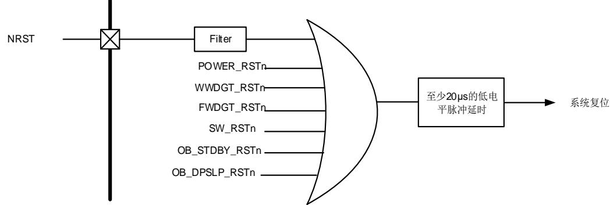

## 2.2.1. LVD

LVD 的功能是检测 VDD 供电电压是否低于低电压检测阈值，该阈值由电源控制寄存器（PMU_CTL0）中的 LVDT[2:0] 位配置。LVD 通过 LVDEN 置位使能，电源控制状态寄存器（PMU_CS）中的 LVDF 位表示低电压事件是否出现。该事件连接至 EXTI 第 16 线，用户可通过配置 EXTI 第 16 线产生相应中断。图 2-13 显示 VDD 供电电压与 LVD 输出信号的关系（LVD 中断信号依赖于 EXTI 第 16 线的上升沿或下降沿配置）。迟滞电压 Vhyst 为 100 mV。

应用场合：当 VDD 电源受到外部干扰（如电压跌落）时，可通过 LVDT[2:0] 设置高于 PDR 值的低电压检测阈值。电压跌落到该阈值后触发 LVD 中断，可在中断函数中执行软复位等操作，避免 MCU 发生其他异常。

图 2-13. LVD 阈值波形图

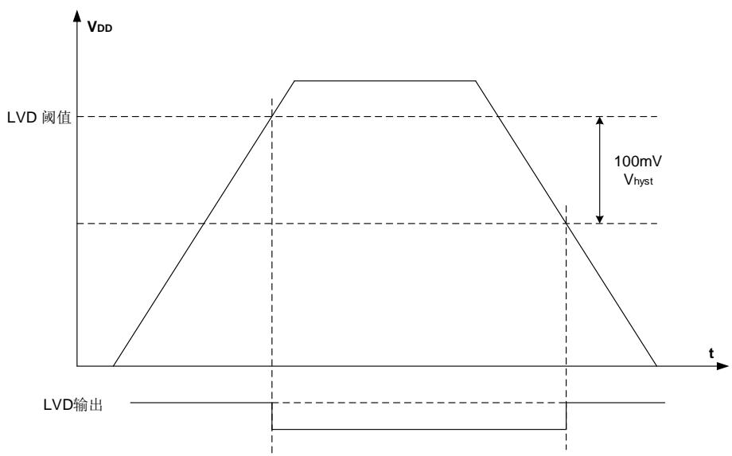

## 2.2.2. POR / PDR

POR / PDR（上电 / 掉电复位）电路检测 VDD，并在电压低于特定阈值时产生电源复位信号，复位除备份域之外的整个芯片。图 2-14 显示禁用 BOR 时电源复位与 VDD 的关系；当 BOR 使能时，需考虑 BOR 对电源复位电平的影响。VPOR 表示上电复位阈值电压，VPDR 表示掉电复位阈值电压，迟滞电压 Vhyst 约为 50 mV。

图2-14. 上电 / 掉电复位波形图

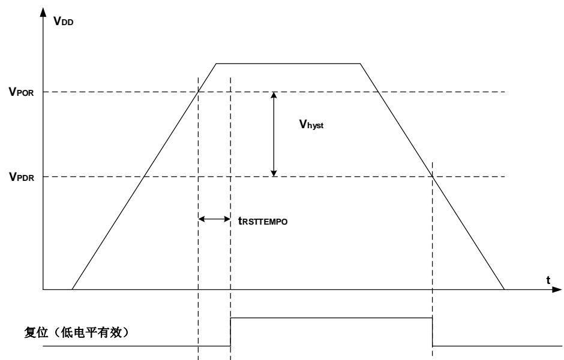

## 2.2.3. BOR

BOR 电路检测 VDD，并在选项字节 BOR_TH 不为 0b11、同时 VDD / VDDA 低于 BOR_TH 定义的 VBOR 阈值时产生电源复位信号，复位除备份域之外的整个芯片。无论 BOR 是否使能，POR / PDR 电路都一直处于检测状态，电源复位电平会在 VDD 上升至 VPOR 时被拉高。当 BOR 使能且 VDD / VDDA 仍低于 VBOR 时，BOR 会将电源复位电平拉低；POR / PDR 检测到 VDD > VPOR 后又将其拉高，如此循环，在 NRST 引脚形成方波。当 VDD / VDDA > VBOR 后，BOR 不再拉低电源复位电平。因此，只有在 VPOR < VDD / VDDA < VBOR 时才会出现方波。图 2-15 显示供电电压与 BOR 复位信号的关系。VBOR 表示 BOR 复位阈值电压，该值由选项字节 BOR_TH 定义，迟滞电压 Vhyst 为 100 mV。

图2-15. BOR波形图

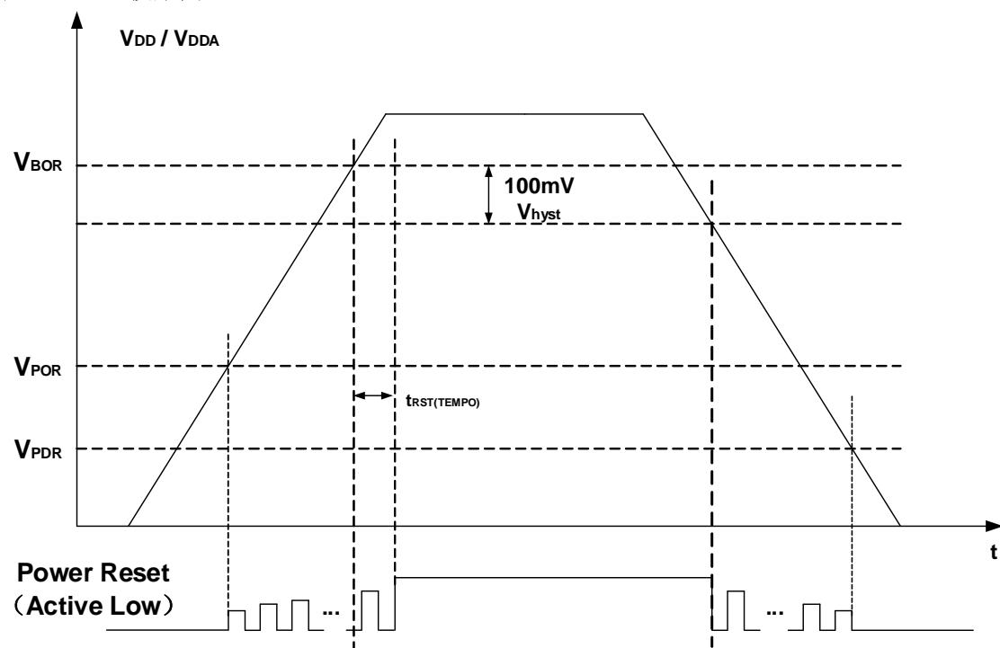

GD32H73x_75x系列内部电源监视器可以通过PDR_ON引脚进行使能或禁用，为确保芯片正常工作及提高抗干扰能力、在上电 / 掉电阶段发生有效的复位信号，PDR_ON的推荐电路如2-16. PDR_ON 所示。

图 2-16. 推荐 PDR_ON 引脚电路设计

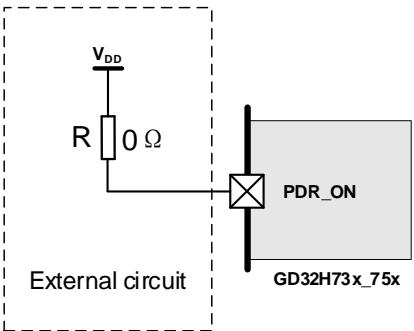

注意：PDR_ON引脚必须保持高电平。用户可以根据具体情况灵活调整上拉电阻R的值以获得更好的性能

当PDR_ON连接到GND时，以下功能将会被禁用：

1. 内部上电复位(POR) / 掉电复位(PDR)禁用；

2. 内部欠压复位(BOR)禁用；

3. 内部低压检测(LVD)禁用；

4. VBAT功能禁用，VBAT引脚应连接至VDD。

## 2.2.4. NRST 引脚

对于MCU的NRST引脚，为防止误触发复位，NRST引脚建议放置一个电容（典型值为100nF）。

图 2-17. 推荐外部复位电路

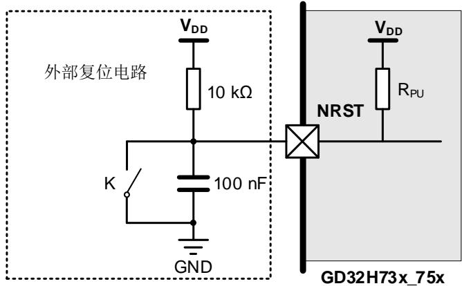

注意：

1. 内部上拉电阻RPU = 40kΩ，建议接外部上拉电阻10kΩ，以使得电压干扰不会导致芯片工作异常；

2. 若考虑静电等影响，可在NRST管脚处放置ESD保护二极管；

3. 尽管MCU内部有硬件POR电路，仍推荐外部加NRST复位阻容电路；

4. 如果MCU启动异常（由于电压波动等），可适当增加NRST对地电容值，拉长MCU复位完成时间，避开上电异常时序区。

因MOS管门限电压特性，在芯片上下电过程中，当VDD / VDDA ＜ 0.7 V时，芯片内部下拉MOS管不会将NRST引脚拉低。即，在芯片上下电过程中，在VDD / VDDA ≈ 0.7 V时，会出现一个微小脉冲，该脉冲不影响芯片正常工作，其示意如图2-18. NRST引脚上下电MOS管脉冲中红色脉冲所示。

图 2-18. NRST 引脚上下电 MOS 管脉冲示意图

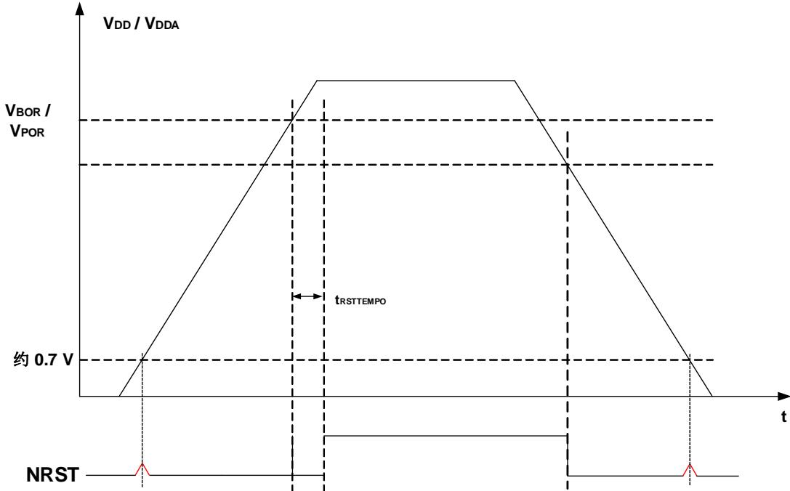

因充电和放电速度差异，下降沿的脉冲持续时间比上升沿长一些，二者持续时间都是ms级。

## 2.3. 时钟

GD32H73x_75x系列内部有完备的时钟系统，可以根据不同的应用场合，选择合适的时钟源，时钟主要特征：

◼ 4到50 MHz外部高速晶体振荡器（HXTAL）

◼ 内部64 MHz RC振荡器（IRC64M）

◼ 内部48 MHz RC振荡器（IRC48M）

◼ 32.768 kHz外部低速晶体振荡器 （LXTAL）

◼ 内部32 kHz RC振荡器（IRC32K）

◼ 低功耗内部4M RC振荡器（LPIRC4M）

◼ PLL时钟源可选HXTAL、LPIRC4M或IRC64M

◼ PLLs支持整数和小数倍频因子

◼ PLLs小数倍频因子可在运行时修改

◼ 外设时钟支持动态切换

◼ HXTAL时钟监视器

◼ LXTAL时钟监视器

图 2-19. GD32H73x_75x 系列时钟树

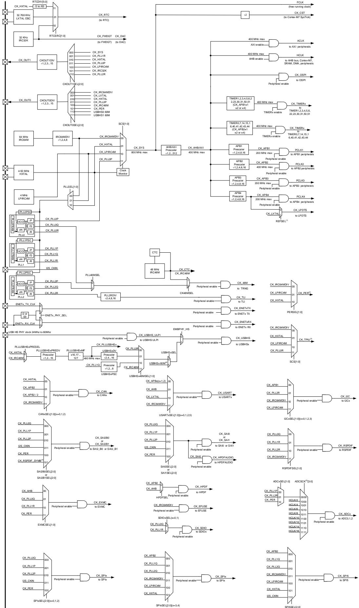

注意：

1. REFSEL为LPDTS参考时钟选择位，可选择CK_PCLK4或CK_LXTAL。

2. CK_PER为外设时钟，该时钟可以为CK_LPIRC64MDIV，CK_LPIRC4M或CK_HXTAL。

3. CK_TPIU 为 跟 踪 端 口 接 口 单 元 （ TPIU ） 时 钟 ， 该 时 钟 可 以 为 CK_IRC64MDIV,CK_LPIRC4M，CK_HXTAL或CK_PLL0R。

4. CK_RSPDIF_SYMB为RSPDIF符号时钟。

5. ADCSCK为ADC同步时钟选择位。

6. USBHSx 60M为USBHSx内部PHY 60M输入时钟源。

## 2.3.1. 外部高速晶体振荡时钟（HXTAL）

4到50MHz的外部高速晶体振荡器可为系统时钟提供更为精确时钟源。带有特定频率的晶体必须与靠近两个HXTAL的引脚连接。和晶体连接的外部电阻和电容必须根据所选择的振荡器来调整。

图 2-20. HXTAL 外部晶体电路

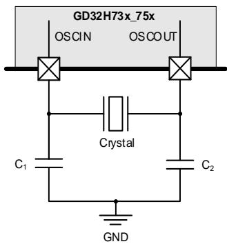

图 2-21. HXTAL 外部时钟电路

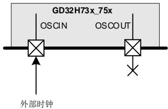

### 注意：

1. 使用旁路输入时，信号从OSCIN输入，OSCOUT保持悬空状态；

2. 外部匹配电容大小可参考公式：C1 = C2 = 2 × (CLOAD - CS)，其中 CS 为 PCB 和 MCU 引脚的杂散电容，典型值为 10 pF。推荐外部高速晶体的负载电容在 20 pF 左右，此时外接匹配电容 C1 和 C2 可取 20 pF，且 PCB Layout 时应尽可能靠近晶振引脚；

3. CS 为 PCB 板走线及 MCU 引脚上的寄生电容。晶体离 MCU 越近，CS 越小，反之越大。当晶体离 MCU 较远导致晶体工作异常时，可适当减小外部匹配电容；

4. 使用外部高速晶体时，建议在晶体两端并联1MΩ电阻，以使得晶体更容易起振；

5. 精度：外部有源晶振＞外部无源晶体＞内部晶体振荡器；

6. 正常使用有源晶振，会打开Bypass，此时要求高电平不低于0.7VDD，低电平不大于0.3VDD；

7. 谐振器与MCU时钟引脚连接的走线可能会因为PCB布局布线的空间限制导致连接到OSCOUT和OSCIN两个引脚的走线长度不一致。这会使两条PCB走线引入的杂散电容不一致，从而导致谐振器两边的负载电容在取值时不能相等，需要存在差值以匹配实际的PCB板。对于这种情况建议联系谐振器厂家测算实际的数值。

## 2.3.2. 外部低速晶体振荡时钟（LXTAL）

LXTAL是一个频率为32.768kHz的外部低速晶体或陶瓷谐振器。它为实时时钟电路提供一个低功耗且高精准的时钟源。LXTAL振荡器可以通过设置备份域控制寄存器（RCU_BDCTL）中的LXTALEN位被启动和关闭。备份域控制寄存器RCU_BDCTL中的LXTALSTB位用来指示LXTAL时钟是否稳定。如果中断寄存器RCU_INT中的相应中断使能位LXTALSTBIE被置‘1’，在LXTAL稳定以后，将产生一个中断。

将备份域控制寄存器RCU_BDCTL的LXTALBPS和LXTALEN位置‘1’可以选择外部时钟旁路模式。CK_LXTAL与连到OSC32IN脚上外部时钟信号一致。

图 2-22. LXTAL 外部晶体电路

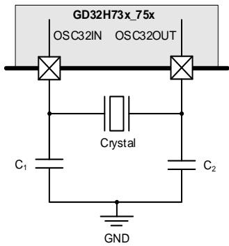

图 2-23. LXTAL 外部时钟电路

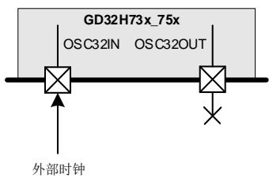

注意：

1. 使用旁路输入时，信号从OSC32IN输入，OSC32OUT保持悬空状态；

2. 外部匹配电容大小可参考公式：C1 = C2 = 2 × (CLOAD - CS)，其中 CS 为 PCB 和 MCU 引脚的杂散电容，经验值为 2 pF ~ 7 pF，建议以 5 pF 为参考值计算。推荐外部晶体的负载电容在 10 pF 左右，此时外接匹配电容 C1 和 C2 可取 10 pF，且 PCB Layout 时应尽可能靠近晶振引脚；

3. 当 RTC 选择 IRC32K 作为时钟源，并且使用 VBAT 外部独立供电时，如果此时 MCU 掉电，RTC 会停止计数，重新上电后 RTC 会接着之前的计数值继续累加计时。若应用需要使用 VBAT 给 RTC 供电时 RTC 仍能正常计时，RTC 须选择 LXTAL 作为时钟源；

4. MCU可以设置LXTAL的驱动能力，若实际调试过程中，发现外部低速晶体难以起振，可尝试将LXTAL的驱动能力调整为高驱动能力；

5. 谐振器与MCU时钟引脚连接的走线可能会应为PCB布局布线的空间限制导致连接到MCU两个晶振引脚的走线长度不一致。这会使两条PCB走线引入的杂散电容不一致，从而导致谐振器两边的负载电容在取值时不能相等，需要存在差值以匹配实际的PCB板。对于这种情况建议联系谐振器厂家测算实际的数值。

## 2.3.3. 时钟输出能力（CKOUT）

GD32H73x_75x系列可输出内部相关时钟信号，可以通过设置时钟配置寄存器0（RCU_CFG2）中的CK_OUT0时钟源选择位域CKOUT0SEL能够选择不同的时钟信号。相应的GPIO引脚应该被配置成备用功能I/O（AFIO）模式来输出选择的时钟信号。CK_OUT1时钟输出源选择通过设置时钟配置寄存器RCU_CFG2中的CKOUT1SEL位域实现。

表 2-7. 时钟输出 0 的时钟源选择

<table><tr><td>CKOUT0SEL[2:0]</td><td>时钟源</td></tr><tr><td>000</td><td>CK_IRC64MDIV</td></tr><tr><td>001</td><td>CK_LXTAL</td></tr><tr><td>010</td><td>CK_HXTAL</td></tr><tr><td>011</td><td>CK_PLL0P</td></tr><tr><td>100</td><td>CK_IRC48M</td></tr><tr><td>101</td><td>CK_PER</td></tr><tr><td>110</td><td>USBHS0 60M</td></tr><tr><td>111</td><td>USBHS1 60M</td></tr></table>

表 2-8. 时钟输出 1 的时钟源选择

<table><tr><td>CKOUT1SEL[2:0]</td><td>时钟源</td></tr><tr><td>000</td><td>CK_SYS</td></tr><tr><td>001</td><td>CK_PLL1R</td></tr><tr><td>010</td><td>CK_HXTAL</td></tr><tr><td>011</td><td>CK_PLL0P</td></tr><tr><td>100</td><td>CK_LPIRC4M</td></tr><tr><td>101</td><td>CK_IRC32K</td></tr><tr><td>110</td><td>CK_PLL2R</td></tr></table>

通过配置RCU_CFG2寄存器的CKOUT0DIV位域，可以将CK_OUT0输出时钟的频率按比例分频，进而降低CK_OUT0的输出频率。

通过配置RCU_CFG0寄存器的CKOUT1DIV位域，可以将CK_OUT1输出时钟的频率按比例分频，进而降低CK_OUT1的输出频率。

## 2.3.4. HXTAL 时钟监视器（CKM）

设置控制寄存器RCU_CTL中的HXTAL时钟监视使能位CKMEN，HXTAL可以使能时钟监视功能。该功能必须在HXTAL启动延迟完毕后使能，在HXTAL停止后禁止。一旦监测到HXTAL故障，HXTAL将自动被禁止，中断寄存器RCU_INT中的HXTAL时钟阻塞中断标志位CKMIF将被置‘1’，产生HXTAL故障事件。这个故障引发的中断和Cortex®-M7的不可屏蔽中断NMI相连。如果HXTAL被选作系统或PLL0的时钟源，HXTAL故障将促使选择IRC64M为系统时钟源且PLL0将被自动禁止。如果HXTAL被选作PLLs的时钟源，HXTAL故障将促使该PLL被自动禁止。

## 2.3.5. LXTAL 时钟监视器（LCKM）

设置时钟控制寄存器RCU BDCTI中的IXTAL时钟监视使能位ICKMEN.IXTAL可以使能时钟监视功能。该功能必须在LXTAL启动延迟完毕后使能。LXTAL上的时钟监视器在除V 以外的所有模式下工作。如果在外部32 kHz振荡器上检测到故障，可以向CPU发送中断。然后，软件必须禁用LCKMEN位，停止有缺陷的32 kHz振荡器，并更改RTC时钟源，或采取任何必要的措施来保护应用程序。

当LCKMEN启用时，一个4位加一个计数器将在IRC32K域工作。如果LXTAL时钟卡在0/1错误或减慢约20KHz，计数器将溢出。将发现LXTAL时钟故障。一旦监测到LXTAL故障，中断寄存器RCU_INT中的LXTAL时钟阻塞中断标志位LCKMIF将被置‘1’，产生LXTAL故障事件。该中断与EXTI 18中断线相连，可用于从睡眠或深度睡眠模式中唤醒。LXTAL故障事件也可将系统从待机模式唤醒。

## 2.4. 启动配置

GD32H73x_75x 系 列 MCU 提 供 不 同 的 引 导 源 ， 可 通 过 Arm® Cortex®-M7 核 心 寄 存 器（FMC_BTADDR_MDF）的引导地址中的引导引脚和引导地址0/1[15:0]进行选择。详情见表2-9. 引导模式选择和表2-10. 引导模式详细描述。BOOT引脚的电平状态会在复位后的第四个CK_SYS(系统时钟)的上升沿进行锁存。用户可自行选择所需要的引导源，通过设置上电复位和系统复位后的BOOT的引脚电平。

BOOT_ADDR0[15:0]和BOOT_ADDR1[15:0]地址允许将引导内存地址配置为0x0000 0000到0x9000 0000 之 间 的 任 何 地 址 。 引 导 模 式 可 由 SYSCFG_USERCFG0 寄 存 器 的BOOT_MODE[2:0]位域中获取。

表 2-9. 引导模式选择

<table><tr><td rowspan="2">引导源地址</td><td>启动模式选择引脚</td></tr><tr><td>BOOT</td></tr><tr><td>引导地址高位:由BOOT_ADDR0[15:0]定义引导地址低位:0x0000</td><td>0</td></tr><tr><td>引导地址高位:由BOOT_ADDR1[15:0]定义引导地址低位:0x0000</td><td>1</td></tr></table>

表 2-10. 引导模式详细描述

<table><tr><td>SCR</td><td>SPC[7:0]</td><td>BOOT_ADDRESS(在BOOT_ADDRx(x=0,1)配置)</td><td>BOOT_MODE</td><td>启动地址</td></tr><tr><td>1</td><td>x</td><td>XXXX</td><td>SECURITY BOOT</td><td>ROM</td></tr><tr><td>0</td><td></td><td>0x9000_0000</td><td>USER BOOT</td><td>OSPI0</td></tr><tr><td rowspan="13"></td><td rowspan="3">安全保护等级高</td><td>0x7000_0000</td><td>USER BOOT</td><td>OSPI1</td></tr><tr><td>0x0800_0000~max user flash</td><td>USER BOOT</td><td>BOOT_ADDRESS</td></tr><tr><td>其他地址</td><td>USER BOOT</td><td>0x0800_0000</td></tr><tr><td rowspan="10">无保护状态/安全保护等级低</td><td>0x9000_0000</td><td>USER BOOT</td><td>OSPI0</td></tr><tr><td>0x7000_0000</td><td>USER BOOT</td><td>OSPI1</td></tr><tr><td>0x2408_000 max RAM shared(ITCM/DTCM/AXI)</td><td>SRAM BOOT(RAM shared)</td><td>BOOT_ADDRESS</td></tr><tr><td>0x2400_0000 ~ max AXI SRAM</td><td>SRAM BOOT(AXI SRAM)</td><td>BOOT_ADDRESS</td></tr><tr><td>0x2000_0000</td><td>SRAM BOOT(DTCM)</td><td>0x2000_0000</td></tr><tr><td>0x0800_0000 ~ max user flash</td><td>USER BOOT</td><td>BOOT_ADDRESS</td></tr><tr><td>0x0000_0000</td><td>SRAM BOOT(ITCM)</td><td>0x0000_0000</td></tr><tr><td>0x1FF0_0000</td><td>SYSTEM BOOT</td><td>BootLoader</td></tr><tr><td rowspan="2">其他地址</td><td>USER BOOT</td><td>0x0800_0000 (BOOT Pin = 0)</td></tr><tr><td>SYSTEM BOOT</td><td>BootLoader (BOOT Pin = 1)</td></tr></table>

图 2-24. 推荐 BOOT 电路设计

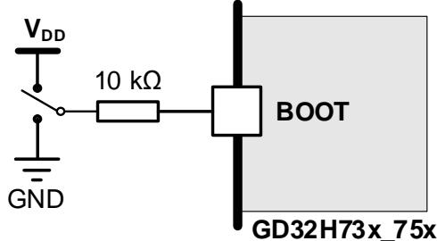

注意：MCU运行后，如果改变BOOT状态，须系统复位后才可生效；

## 2.5. 典型外设模块

## 2.5.1. GPIO 电路

GD32H73x_75x最多可支持135个通用I/O引脚（GPIO），分别为PA0 ~ PA15，PB0 ~ PB15，PC0 ~ PC15，PD0 ~ PD15，PE0 ~ PE15，PF0 ~ PF15，PG0 ~ PG15，PH0 ~ PH15，PJ8， 。各片上设备用其来实现逻辑输入 输出功能。每个 端口有相关的控制和配置寄存器以满足特定应用的需求。片上设备GPIO引脚的外部中断由EXTI模块的寄存器控制和配置。GPIO口的基本结构详见图2-25. 标准IO的基本结构：

图 2-25. 标准 IO 的基本结构

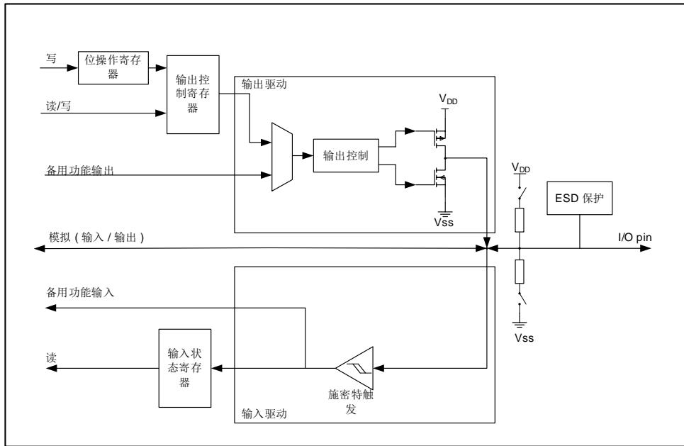

注意：

1. IO口分为5V耐受和非5V耐受，使用时注意区分IO口耐压情况，详见数据手册；

2. 5V耐受的IO口配置为开漏输出模式或输入模式时，可以连接5V电压，配置为推挽输出模式时，禁止连接5V电压；

3. 为提高EMC性能，未使用的IO口引脚建议硬件上拉或者是下拉；

4. PC13、PC14、PC15这三个IO口的驱动能力偏弱，输出电流能力有限（3mA左右），配置为输出模式时，其工作速度不能超过2MHz（最大负载为30pF）；

5. 多组中同一标号PIN仅可配置一个IO口为外部中断，例：PA0、PB0、PC0仅支持三个中的其中一个IO口产生外部中断，不支持三个同为外部中断模式；

6. 非 5V耐受 IO，外接超过 V 的电压时，可能会产生灌电流。

## 2.5.2. ADC 电路

内部集成了 位逐次逼近式模数转换器模块（ ）， 有 个外部通道，1个内部通道（DAC_OUT0通道），ADC1有18个外部通道，3个内部通道（电池电压（V ）通道、参考电压输入通道（V ）和DAC_OUT0通道），ADC2有17个外部通道，4个内部通道（电池电压（V ）通道、参考电压输入通道（V ）、内部温度传感通道（V ）和高精度温度传感器通道（V ））。ADC采样通道均支持多种运行模式，采样转换后，转换结果可以按照最低有效位对齐或最高有效位对齐的方式保存在相应的数据寄存器中（ADC0/1为32位数据寄存器，ADC2为16位数据寄存器）。片上的硬件过采样机制可以通过减少来自MCU的相关计算负担来提高性能。

如果在使用过程中，ADC采集外部输入电压，若采样数据波动较大，可能是由于电源波动引起的干扰，可通过采样内部V 进行校准，反推外部采样电压。

设计ADC电路时，建议在ADC输入管脚处放置个小电容CIN，如图2-26. ADC采集电路设计。

图 2-26. ADC 采集电路设计

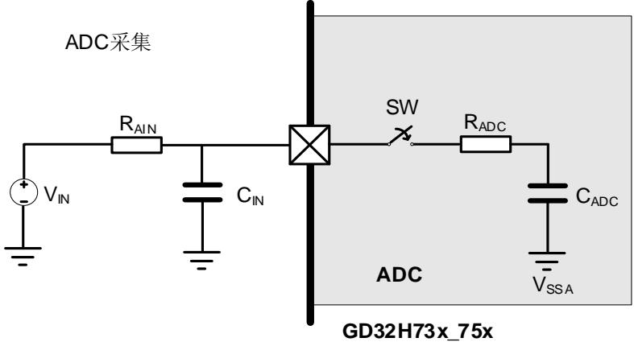

一些引脚直接连接到PA0_C、PA1_C、PC2_C和PC3_C的 ADC模拟输入端（如图2-27. ADC）：Pxy_C和Pxy引脚之间通过模拟开关直接相连。

图2-27. ADC的模拟配置

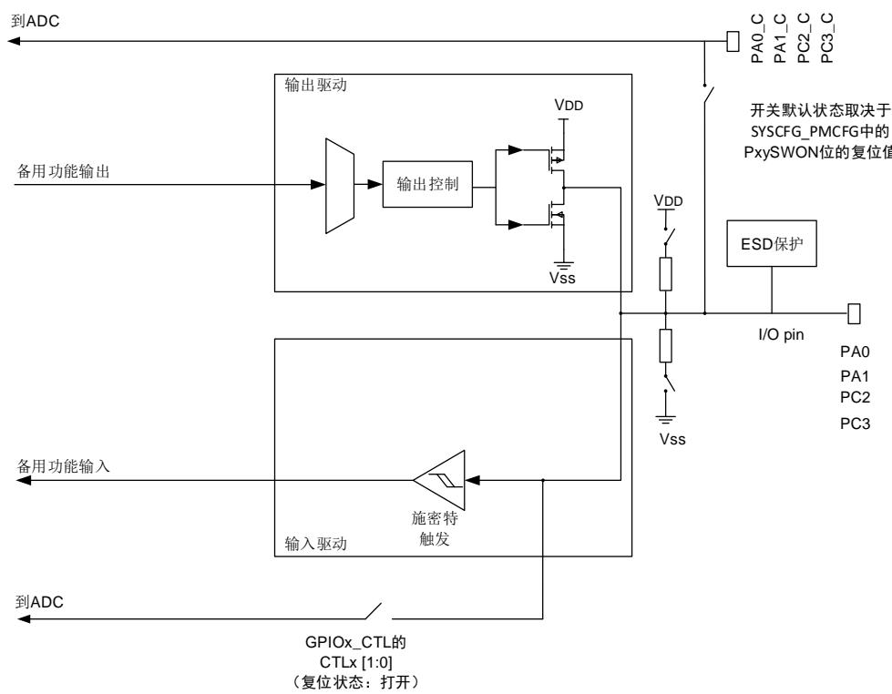

## 2.5.3. 内部温度传感器

GD32H73x_75x 系列 MCU 内部集成了一个温度传感器（ADC2_CH18）、一个高精度温度传感器（ADC2_CH20）和一个 LPDTS 低功耗数字温度传感器。温度传感器的输出电压随温度线性变化。为确保温度测量的准确，需要给 ADC 提供一个准确的、低温漂的参考电压 V 。

温度传感器的输出电压随温度会发生线性变化，由于芯片生产过程的多样化，温度变化曲线的偏差在芯片间会有不同（最多相差 $45 \textdegree C )$ ）。内部温度传感器更适用于检测温度的变化，而不是用于测量绝对温度。如果需要测量精确的温度，应该使用一个外置的温度传感器来校准这个偏移量。

使用温度传感器：

1. 配置温度传感器通道（ADC1_CH18）的转换序列和采样时间为 ts_temp us；

2. 置位 ADC_CTL1 寄存器中的 TSVEN1 位，使能温度传感器；

3. 置位 ADC_CTL1 寄存器的 ADCON 位，或者由外部触发 ADC 转换；

4. 从 ADC 数据寄存器中读取并计算温度传感器数据 Vtemperature，并由下面公式计算出实际温度：

$$
\text { 温度 } \left(^ {\circ} \mathrm{C}\right) = \left\{\left(\mathrm{V} _ {2 5} - \mathrm{V} _ {\text { temperature }}\right) / \text { Avg\_Slope } \right\} + 2 5
$$

V25：内部温度传感器在 25 °C 下的电压，典型值请参考数据手册。

Avg_Slope：温度与内部温度传感器电压曲线的均值斜率，典型值请参考数据手册。

使用高精度温度传感器：

1. 配置温度传感器通道（ADC2_CH20）的转换序列和采样时间为 ts_temp us；

2. 置位 ADC_CTL1 寄存器中的 TSVEN2 位，使能温度传感器；

3. 置位 ADC_CTL1 寄存器的 ADCON 位，或者由外部触发 ADC 转换；

4. 从 ADC 数据寄存器中读取并计算温度传感器数据 Vtemperature，并由下面公式计算出实际温度：

$$
\text { 温度 } \left(^ {\circ} \mathrm{C}\right) = \left\{\left(\mathrm{V} _ {\text { temperature }} - \mathrm{V} _ {2 5}\right) / \text { Avg\_Slope } \right\} + 2 5
$$

V25：内部温度传感器在 25 °C 下的电压，典型值请参考数据手册。

Avg_Slope：温度与内部温度传感器电压曲线的均值斜率，典型值请参考数据手册。

### 注意：

1. 当高精度温度传感器使能，ADC2 时钟不能超过 5MHz；

2. 当高精度温度传感器使能，至少需要等待 3 个 ADC 采样周期，前三个转换数据应当被舍弃；

3. 可以通过过采样和软件平均（一般建议 50 点平均）提高高精度温度传感器准确度。

低功耗温度传感器(LPDTS)可以将温度转换为频率 $\varXi$ 绝对温度（CLK_PTAT）成正比的方波，频率的测量基于 PCLK或 LXTAL 时钟。

温度传感器的模拟部分能够将温度转换为方波信号输出，其中，信号的 频率通常为kHz。LPDTS模块内嵌了两个计数器，其计数方式和选择的参考时钟相关，计数结果存储在LPDTS_DATA寄存器中。

◼ 当参考时钟为 PCLK 时，测量方法为采样一个或多个 FM(T)周期，并在 PCLK上升沿和下降沿计数。

◼ 当参考时钟为 LXTAL 时，测量方法为采样一个或多个 LXTAL 周期，并在 FM(T)上升沿和下降沿计数。

图 2-28. 测量方式

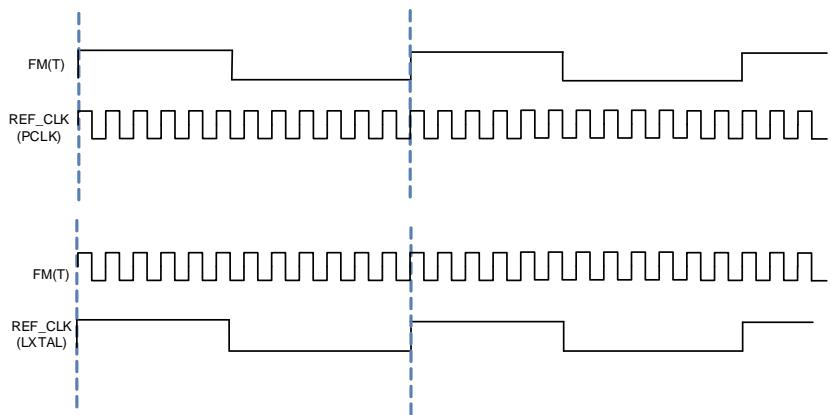

当参考时钟为PCLK时温度计算公式如下：

$$
T = T 0 + ((2 \times F _ {P C L K} / C O V A L) \times S P T - 1 0 0 \times F R E Q) / R F \_ C F
$$

当参考时钟为LXTAL时温度计算公式如下：

$$
T = T 0 + (((F _ {L X T A L} \times C O V A L) / (2 \times S P T)) - (1 0 0 \times F R E Q)) / R F \_ C F
$$

T0：等于 $\mathsf { 2 5 ^ { \circ } C }$ 

COVAL：温度传感器计数器输出值，其值存储在 LPDTS_DATA 寄存器中；

SPT：模块采样时间；

FREQ：温度传感器在温度为 T0 时测量并存储在 LPDTS_SDATA 寄存器中的频率值，其通常为几百 Hz；

RF_CF：温度传感器斜坡系数。

## 2.5.4. USB 电路

GD32H73x_75x系列MCU拥有内嵌的USBHS接口，为便携式设备提供了一套USB互联解决方案。USBHS不仅支持主机模式和设备模式，也支持遵循HNP（主机协商协议）和SRP（会话请求协议）的OTG模式。USBHS包含了一个内部的USB PHY，可以配置成全速或高速，并且不再需要外部PHY芯片。USBHS可以支持USB 2.0协议所定义的所有四种传输方式（控制传输、批量传输、中断传输和同步传输）。另外，在USBHS内部还有一个DMA引擎操作，可作为AHB总线主机在USBHS和系统之间加速数据传输。对于全速设备的操作，还支持电池充电检测（BCD）、附加检测协议（ADP）和链路层电源管理（LPM）。

协议要求时钟精度不低于 ，内部时钟可能无法达到这样的精度，所以建议使用功能时使用外部晶体或有源晶振做为USB模块时钟源。在设计电路时，为了提升USB的ESD性能，USB外壳建议设计阻容放电隔离电路。USBHS信号线描述如表2-11. USBHS信号线描述所示。

表 2-11. USBHS 信号线描述

<table><tr><td>I/O 端口</td><td>类型</td><td>描述</td><td>注意</td></tr><tr><td>VBUS</td><td>输入</td><td>总线电源端口</td><td>仅内部 PHY 使用</td></tr><tr><td>DM</td><td>输入/输出</td><td>差分信号线-端口</td><td>仅内部 PHY 使用</td></tr><tr><td>I/0 端口</td><td>类型</td><td>描述</td><td>注意</td></tr><tr><td>DP</td><td>输入/输出</td><td>差分信号线+端口</td><td>仅内部 PHY 使用</td></tr><tr><td>ID</td><td>输入</td><td>USB 识别:微连接器识别接口</td><td>仅内部 PHY 使用</td></tr><tr><td>ULPI_D[7:0]</td><td>输入/输出</td><td>ULPI 数据线</td><td>外部 ULPI PHY 使用</td></tr><tr><td>ULPI_NXT</td><td>输入</td><td>ULPI 下个信号线</td><td>外部 ULPI PHY 使用</td></tr><tr><td>ULPI_DIR</td><td>输入</td><td>ULPI 方向</td><td>外部 ULPI PHY 使用</td></tr><tr><td>ULPI_STP</td><td>输出</td><td>ULPI 停止</td><td>外部 ULPI PHY 使用</td></tr><tr><td>ULPI_CLK</td><td>输入</td><td>ULPI 时钟</td><td>外部 ULPI PHY 使用</td></tr></table>

USBHS包含一个内部嵌入式 PHY，该内部嵌入式 PHY支持主机模式下的高速、全速和低速、设备模式下高速和全速，以及具备 HNP和 SRP 的 OTG 协议。上拉或下拉电阻已经集成在内部全速 PHY 的内部，并且 USBHS可根据当前模式（主机、设备或 OTG 模式）和连接状态进行自动控制。内部 PHY 的典型连接示意图如图2-29. 在主机或设备模式下连接示意图所示。OTG 模式连接示意图如图2-30. OTG 模式下使用内部嵌入式PHY连接示意图所示。

图 2-29. 在主机或设备模式下连接示意图

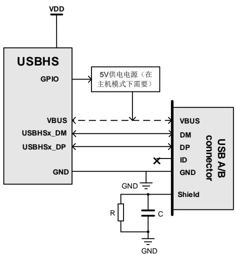

推荐：R = 1MΩ，C = 4700 pF。

图 2-30. OTG 模式下使用内部嵌入式 PHY 连接示意图

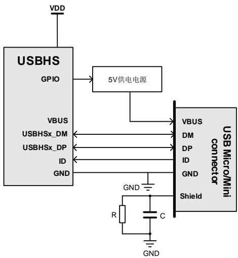

推荐：R = 1MΩ，C = 4700 pF。

为外部 提供了一个 接口。如果需要使用 模块完成高速 应用，那么则需要一个外部高速 ULPI PHY。结合外部 ULPI PHY，USBHS支持高速主机和设备，也支持前文中内部嵌入式全速 PHY 所描述的所有模式。使用外部 ULPI PHY 连接示意图如图2-31. 使用外部ULPI PHY 的连接示意图所示。

图 2-31. 使用外部 ULPI PHY 的连接示意图

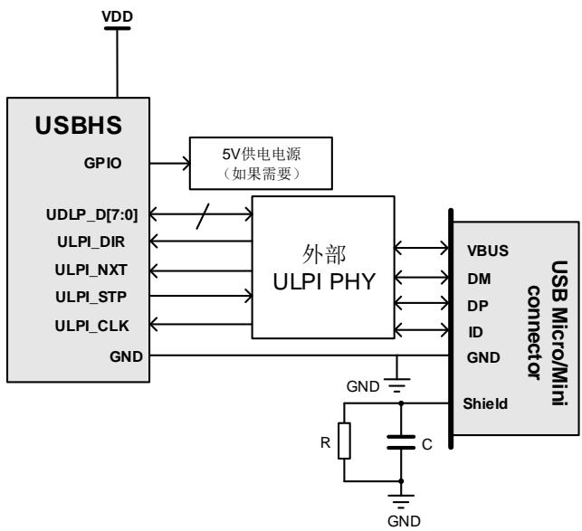

## 2.6. 热管理及低功耗模式

GD32H73x_75x系列在使用较多外设的情况下功耗较高，用户在使用时应确保在任何工况下T$< 1 2 5 ^ { \circ } \mathrm { C } _ { \mathrm { \circ } }$ 。外部电路上可参考《AN060 GD32MCU温度特性管理手册》、《AN166 GD32H73x_75x系列热特性设计指南》，选择合适的散热方式。内部控制上有三种降低芯片功耗的方法：减慢系统时钟（HCLK，PCLK1和PCLK2），关闭未使用的外设的时钟或者通过PMU_CTL3寄存器的LDOVS[2:0]位配置LDO的输出电压，LDOVS[2:0]只有在PLL未使能的时候才能配置。

此外，GD32H73x_75x系列还有三种低功耗模式可以实现更低的功耗，它们是睡眠模式，深度睡眠模式和待机模式。其中功耗最低的是 待机模式，此低功耗模式需要的唤醒时间也是最长的。从Standby模式唤醒可通过WKUP引脚上升沿唤醒，共计5个WKUP引脚，此时无需配置对应GPIO，仅需配置PMU_CS寄存器里的WUPENx位即可。对应WKUP唤醒引脚参考电路设计如图2-32. 推荐Standby外部唤醒引脚电路设计所示：

图 2-32. 推荐 Standby 外部唤醒引脚电路设计

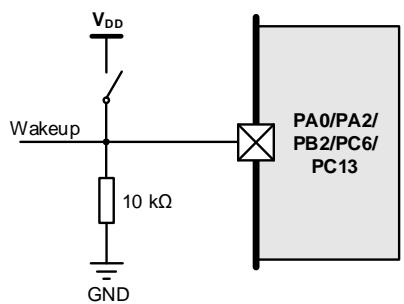

注意：该模式在电路设计时需要注意，WKUP至V 间如果有串电阻，可能会增加额外的功耗。

## 2.7. 下载调试电路

GD32H73x_75x系列支持JTAG调试接口与SWD调试接口，默认支持SWD接口，可以通过efuse修改成JTAG模式，并且支持secure JTAG，但是无法回退到SWD模式，具体参考《AN111GD32H73x_75x软件开发指南》。JTAG接口标准为20针接口，其中5根信号接口，SWD接口标准为5针接口，其中2根信号接口。

注意：复位后，调试相关端口为输入上拉/下拉模式，其中：

PA15：JTDI为上拉模式；

PA14：JTCK / SWCLK为下拉模式；

PA13：JTMS / SWDIO为上拉模式；

PB4：NJTRST为上拉模式；

PB3：JTDO为浮空模式。

表 2-12. JTAG 下载调试接口分配

<table><tr><td>备用功能</td><td>GPIO 端口</td></tr><tr><td>JTMS</td><td>PA13</td></tr><tr><td>JTCK</td><td>PA14</td></tr><tr><td>JTDI</td><td>PA15</td></tr><tr><td>JTDO</td><td>PB3</td></tr><tr><td>NJTRST</td><td>PB4</td></tr></table>

图 2-33. 推荐 JTAG 接线参考设计

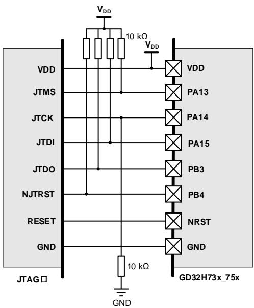

注意：复位后，调试相关端口为输入上拉/下拉模式，其中：

PA13：SWDIO为上拉模式；

PA14：SWCLK为下拉模式。

表 2-13. SWD 下载调试接口分配

<table><tr><td>备用功能</td><td>GPIO 端口</td></tr><tr><td>SWDIO</td><td>PA13</td></tr><tr><td>SWCLK</td><td>PA14</td></tr></table>

图 2-34. 推荐 SWD 接线参考设计

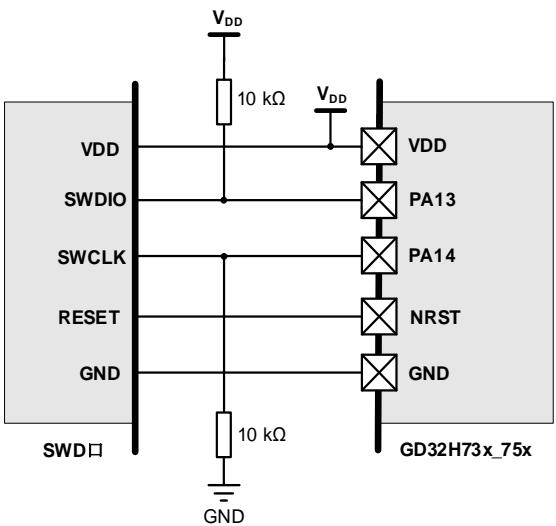

有以下几种方式可以提高SWD下载调试通信的可靠性，增强下载调试的抗干扰能力。

1. 缩短SWD两个信号线长度，最好15 cm以内；

2. 建议SWDIO、SWCLK和GND使用双绞线；

3. 在SWD两根信号线对地各并几十pF小电容；

4. SWD两根信号线任意IO串入100 Ω ~ 1 kΩ电阻。

## 2.8. 参考原理图设计

图 2-35. GD32H73x_75x 推荐参考原理图设计

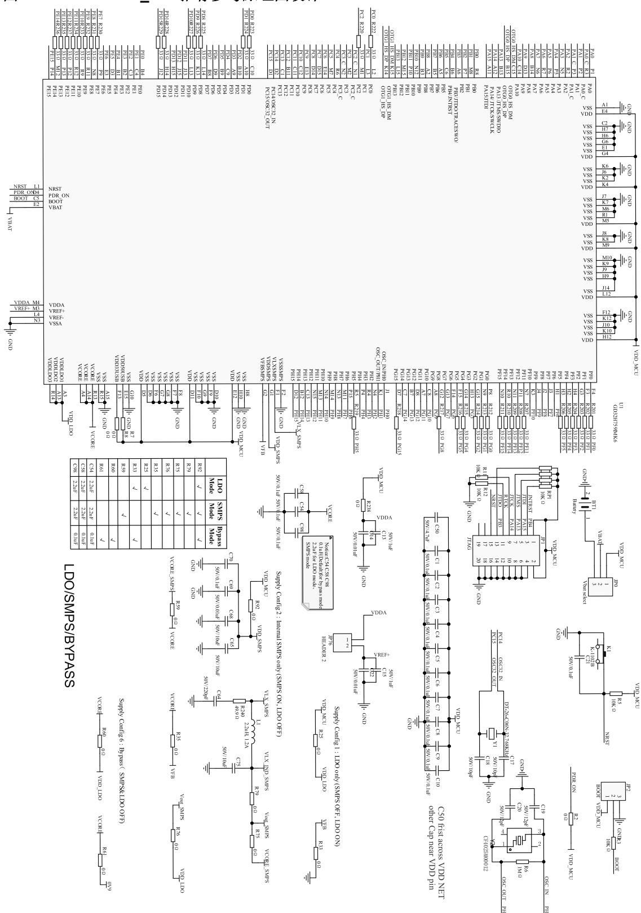

## 3. PCB Layout 设计

为增强MCU的功能稳定性及EMC性能，不仅需要考虑配套外围元器件性能，在PCB Layout上也至关重要。另外，在条件允许的情况下，尽量选用有独立GND层和独立电源层的PCB设计方案，这样可以提供更好的EMC性能。如果条件不允许的情况下，无法提供独立的GND层和电源层，那也需要保证有一个良好的供电和接地设计，如尽量使得MCU下方GND平面的完整性，具有EPAD的封装，PCB Layout建议EPAD接地等。

在有大功率或可产生强干扰的应用下，需要考虑将MCU远离这些强干扰源。

## 3.1. 电源去耦电容

GD32H73x_75x系列电源有VDD、VDDA、VREFP等供电脚，100nF去耦电容采用陶瓷MLCC即可，且需要保证位置尽可能地靠近电源引脚。电源走线要尽量使得经过电容后再到达MCU电源引脚，建议可通过靠近电容PAD处打过孔的形式Layout。

图 3-1. 推荐电源引脚去耦 Layout 设计

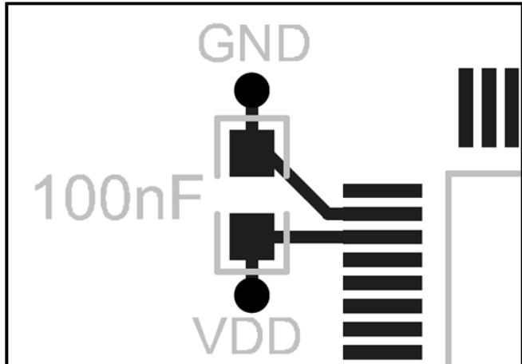

## 3.2. 0.9V电源域电路

当前0.9V电源域推荐使用SMPS供电模式或旁路模式。为了增强MCU的功能稳定性及EMC性能，电源电路不仅需要考虑配套外围元器件性能，还要考虑PCB Layout。

SMPS供电模式的PCB Layout需要遵循以下要求：

1、SMPS的VLXSMPS为2MHz的电压开关信号，其幅值可能会超过VDD或低于VSS。基于系统级EMC防护设计，需要尽可能的与其他信号做好屏蔽；

2、所有该模块走线以及外围器件尽可能放置同一层，且相邻层尽可能为完整地。时钟线、VFBSMPS、以及其他模拟线尽可能与该模块保持距离和线层，并做好包地处理；

3、为增大过电流能力，VDDSMPS和VLXSMPS线宽尽量宽，至少20 ~ 30mil以上；

4、外围器件摆放与走线应遵循输出电流回路di/dt最短原则；

5、为保证输出稳定性，SMPS的VFBSMPS反馈线应从负载端返回；

6、无论LDO是否使能，务必使芯片的所有VDDLDO引脚、VCORE引脚各自连在一起。

BGA176封装SMPS供电模式推荐layout如图3-2. BGA176封装SMPS供电模式推荐layout图所示：

图 3-2. BGA176 封装 SMPS 供电模式推荐 layout 图

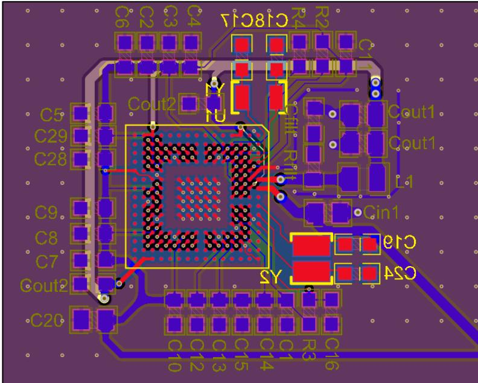

旁路模式的PCB Layout需要遵循以下要求：

1、 使用外部电源给VCORE供电需要注意在输出大电流情况下的线阻导致的线损，避免末端电压低于规定要求；

2、需要采取散热措施避免外部电源发热影响MCU的散热以及其本身性能；

3、务必使芯片的所有VDDLDO引脚、VCORE引脚各自连在一起，接到外部电源输出端。

BGA176封装旁路模式推荐layout如图3-3. BGA176封装旁路模式推荐layout图所示：

图 3-3. BGA176 封装旁路模式推荐 layout 图

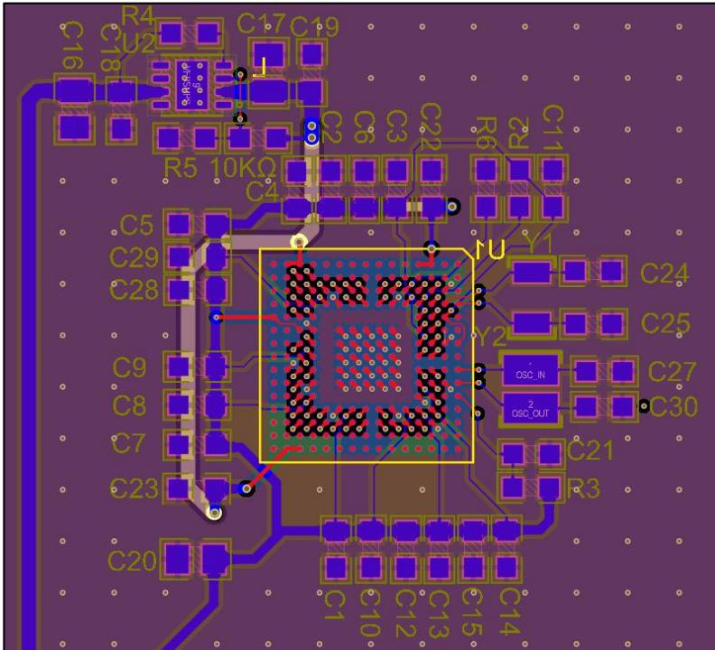

## 3.3. 时钟电路

GD32H73x_75x系列时钟有HXTAL和LXTAL，要求时钟电路（包括晶体或晶振及电容等）靠近MCU时钟引脚放置，且尽量时钟走线由GND包裹起来。

图 3-4. 推荐时钟引脚 Layout 设计（无源晶体）

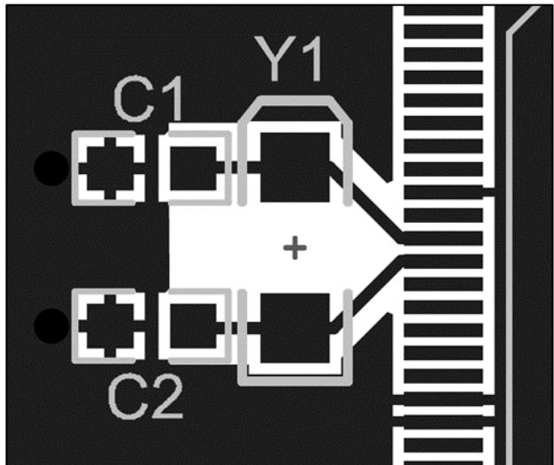

注意：

1. 晶体尽量靠近MCU时钟引脚，匹配电容等尽量靠近晶体；

2. 整个电路尽量与MCU在同层，走线尽量不要穿层；

3. 时钟电路PCB区域尽量禁空，不走任何与时钟无关走线；

4. 大功率、强干扰风险器件及高速走线尽量远离时钟晶体电路；

5. 时钟线进行包地处理，以起到屏蔽效果。

## 3.4. 复位电路

NRST走线PCB Layout参考如下：

图 3-5. 推荐 NRST 走线 Layout 设计

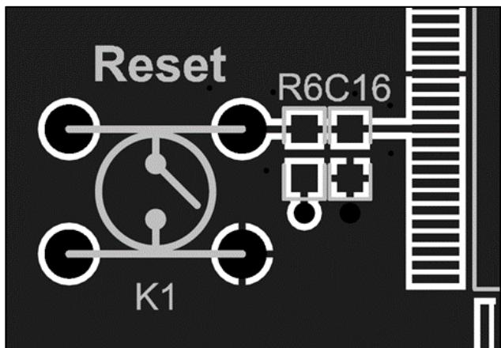

注意：复位电路阻容等尽可能地靠近MCU NRST引脚，且NRST走线尽量远离强干扰风险器件及高速走线等，条件允许的话，最好将NRST走线做包地处理，以起到更好的屏蔽效果。

## 3.5. OSPI 电路

GD32H73x_75x系列MCUOSPI模块支持单线，双线、四线和八线SPI存储器（PSRAMS，NAND，NOR flash等）。OSPI走线PCB Layout参考如下：

图 3-6. 推荐 OSPI 走线 Layout 设计

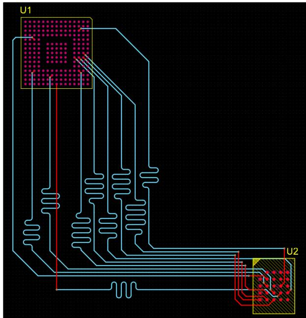

注意：

1. 避免信号走线穿越电源分割区域，并保持信号参考平面完整；

2. OSPI的信号线及时钟线应尽可能的在表层走线并包地，等长应控制在300mil以内（微带线蛇形走线间距建议为7H，带状线蛇形走线间距建议为5H，H为信号走线到参考平面的距离；走线若存在过孔，一般一个过孔算50~100mil线长，视过孔长度决定）；

3. OSPI芯片应尽可能的靠近MCU放置，远离电源及功率器件等干扰源；

4. 若信号线或时钟线信号较差，可以考虑在存储器端增加端接电阻。

## 3.6. USB 电路

对于GD32H73x_75x系列MCU USB FS模块有DM、DP两根差分信号线，对于USB HS模块，连接外部高速PHY后，PHY芯片也会引出DM、DP两根差分信号线，建议PCB走线要求做特性阻抗90Ω，差分走线严格按照等长等距规则来走，且尽量使走线最短。如果两条差分线不等长，可在终端用蛇形线补偿短线。建议DM、DP直连，不串联匹配电阻。

DM、DP差分走线注意事项如下：

1. 布局时摆放合理，以缩短差分走线距离；

优先绘制差分线，一对差分线上尽量不要超过两对过孔，且需要对称放置；

3. 对称平行走线，保证两根线紧密耦合，避免90°、弧形或45°走线方式；

4. 差分走线上所接阻容、EMC等器件，或测试点，也要做到对称原则。

对于USB HS模块，MCU与外部HS PHY之间的数据线与信号控制线也尽量走短，需要用蛇形

线做等长处理，注意事项如下：

1. 布局时摆放合理，USB HS-PHY芯片与MCU之间尽量紧凑；

2. 布线时，以信号线中最长的一根线长度为目标，将其他信号线通过蛇形走线补偿即可。

## 3.7. BGA 封装的扇出

对于GD32H73x_75x 系列 MCU 部分 型 号存 在 BGA100(0.8mm Pitch) 和BGA176(0.65mmPitch)封装，我们推荐以下的走线规则与扇出方式。

对于0.8 mm Pitch的BGA176封装推荐使用规则设置5 mil线宽线距，使用10 / 16 mil过孔进行扇出，扇出后如图3-7. BGA100封装的扇出方式所示。

图 3-7. BGA100 封装的扇出方式

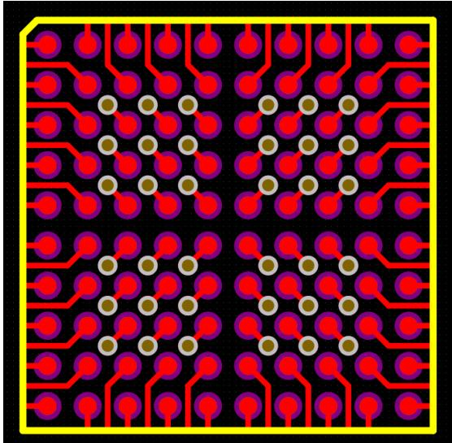

对于 的 封装推荐使用规则设置 线宽线距，使用 （若所过电流较大，8/13 mil亦可，大于8/13 mil 尺寸，4 mil线宽线距无法出线）过孔进行扇出，扇出后如图3-8. BGA176封装的扇出方式所示。

图 3-8. BGA176 封装的扇出方式

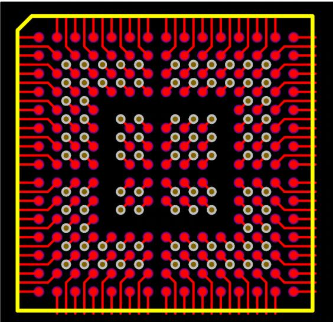

## 4. 封装说明

GD32H73x_75x系列有5种封装形式，LQFP100、LQFP144、LQFP176、BGA100和BGA176。

表 4-1. 封装型号说明

<table><tr><td>产品型号</td><td>封装</td></tr><tr><td>GD32H737VxT6</td><td rowspan="2">LQFP100(14x14, 0.5 pitch)</td></tr><tr><td>GD32H757VxT6</td></tr><tr><td>GD32H737ZxT6</td><td rowspan="2">LQFP144(20x20, 0.5 pitch)</td></tr><tr><td>GD32H757ZxT6</td></tr><tr><td>GD32H737IxT6</td><td rowspan="2">LQFP176(24x24, 0.5 pitch)</td></tr><tr><td>GD32H759IxT6</td></tr><tr><td>GD32H757VxJ6</td><td>BGA100(8x8, 0.8 pitch)</td></tr><tr><td>GD32H737IxK6</td><td rowspan="2">BGA176(10x10, 0.65 pitch)</td></tr><tr><td>GD32H759IxK6</td></tr></table>

(尺寸单位为毫米mm)

## 5. 版本历史

表 5-1. 版本历史

<table><tr><td>版本号.</td><td>说明</td><td>日期</td></tr><tr><td>1.0</td><td>首次发布</td><td>2023年04月14日</td></tr><tr><td>1.1</td><td>新增2.1.4章节;更新2.1.5章节,提供所有封装供电设计图,说明相关引脚在芯片内部连接情况。</td><td>2023年06月21日</td></tr><tr><td>1.2</td><td>更新2.1.3章节,新增各模式寄存器配置表,更新各模式推荐电路设计;更新2.8章节参考原理图设计;新增3.5章节。</td><td>2023年12月19日</td></tr><tr><td>1.3</td><td>更新图2-1,增加备份域LDO相关描述;更新2.1.2章节,新增VREFP与VDDA的描述;更新2.1.3章节,更新各模式寄存器配置;新增SMPS模块关闭时,VDDSMPS引脚的描述;新增旁路模式上电时序及相关说明;更新2.1.4章节,增加注意事项;更新图2-10和表2-6中Cin、COUT1、COUT2相关描述;更新2.2章节中复位电路描述;更新3.2章节,新增图3-3。</td><td>2024年08月13日</td></tr><tr><td>1.4</td><td>更新图2-4;更新图2-6;更新0.9V电源域电源配置描述。</td><td>2024年11月19日</td></tr><tr><td>1.5</td><td>更新0.9V电源域电源配置描述;细化电源检测及复位相关内容,增加2.2节。</td><td>2024年12月15日</td></tr><tr><td>1.6</td><td>文档名称修改为《GD32H73x_75x系列硬件开发指南》;文档内容中涉及GD32H7xx相关内容修改为GD32H73x_H75x相关内容;更新2.1.4章节的图2-8,增加注意事项2。</td><td>2026年03月06日</td></tr></table>

## Important Notice

This document is the property of GigaDevice Semiconductor Inc. and its subsidiaries (the "Company"). This document, including any product of the Company described in this document (the “Product”), is owned by the Company according to the laws of the People’s Republic of China and other applicable laws. The Company reserves all rights under such laws and no Intellectual Property Rights are transferred (either wholly or partially) or licensed by the Company (either expressly or impliedly) herein. The names and brands of third party referred thereto (if any) are the property of their respective owner and referred to for identification purposes only. 

To the maximum extent permitted by applicable law, the Company makes no representations or warranties of any kind, express or implied, with regard to the merchantability and the fitness for a particular purpose of the Product, nor does the Company assume any liability arising out of the application or use of any Product. Any information provided in this document is provided only for reference purposes. It is the sole responsibility of the user of this document to determine whether the Product is suitable and fit for its applications and products planned, and properly design, program, and test the functionality and safety of its applications and products planned using the Product. The Product is designed, developed, and/or manufactured for ordinary business, industrial, personal, and/or household applications only, and the Product is not designed or intended for use in (i) safety critical applications such as weapons systems, nuclear facilities, atomic energy controller, combustion controller, aeronautic or aerospace applications, traffic signal instruments, pollution control or hazardous substance management; (ii) life-support systems, other medical equipment or systems (including life support equipment and surgical implants); (iii) automotive applications or environments, including but not limited to applications for active and passive safety of automobiles (regardless of front market or aftermarket), for example, EPS, braking, ADAS (camera/fusion), EMS, TCU, BMS, BSG, TPMS, Airbag, Suspension, DMS, ICMS, Domain, ESC, DCDC, e-clutch, advanced-lighting, etc.. Automobile herein means a vehicle propelled by a selfcontained motor, engine or the like, such as, without limitation, cars, trucks, motorcycles, electric cars, and other transportation devices; and/or (iv) other uses where the failure of the device or the Product can reasonably be expected to result in personal injury, death, or severe property or environmental damage (collectively "Unintended Uses"). Customers shall take any and all actions to ensure the Product meets the applicable laws and regulations. The Company is not liable for, in whole or in part, and customers shall hereby release the Company as well as its suppliers and/or distributors from, any claim, damage, or other liability arising from or related to all Unintended Uses of the Product. Customers shall indemnify and hold the Company, and its officers, employees, subsidiaries, affiliates as well as its suppliers and/or distributors harmless from and against all claims, costs, damages, and other liabilities, including claims for personal injury or death, arising from or related to any Unintended Uses of the Product. 

Information in this document is provided solely in connection with the Product. The Company reserves the right to make changes, corrections, modifications or improvements to this document and the Product described herein at any time without notice. The Company shall have no responsibility whatsoever for conflicts or incompatibilities arising from future changes to them. Information in this document supersedes and replaces information previously supplied in any prior versions of this document. 

© 2026 GigaDevice Semiconductor Inc. – All rights reserved2026 
