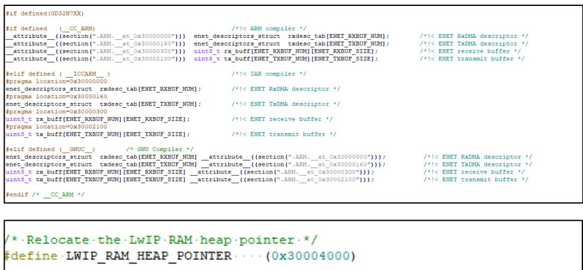
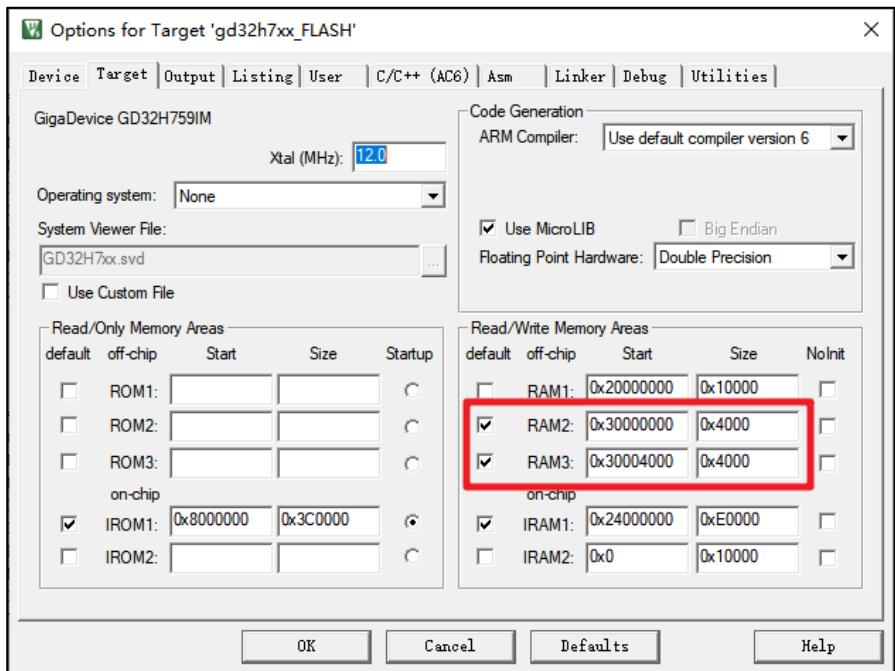
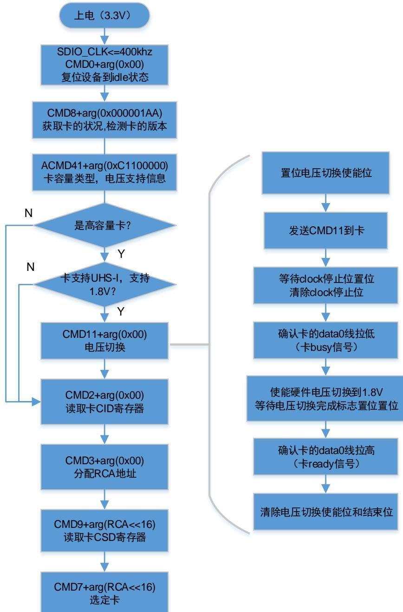
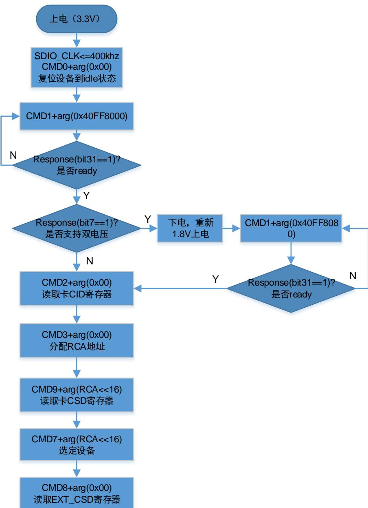
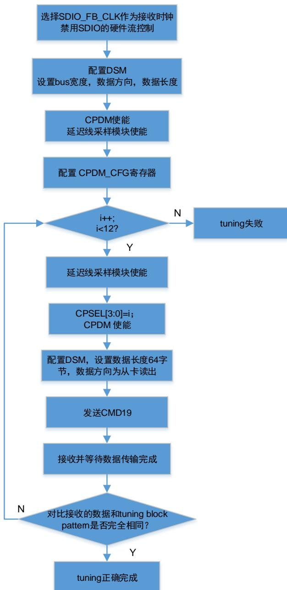
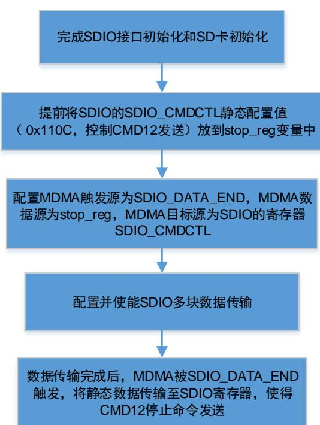
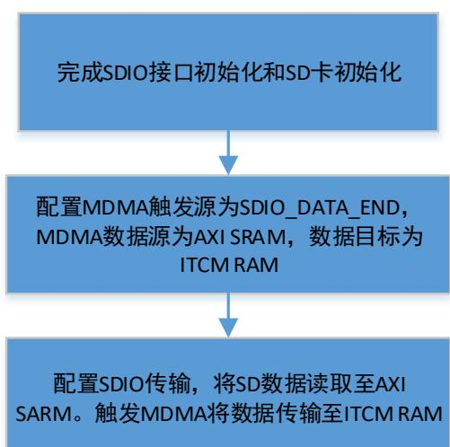

# GigaDevice Semiconductor Inc.

# GD32H73x_75x 系列软件开发指南

应用笔记

AN111 

1.1 版本

（2026 年 2 月）

## 目录

目录....1
图索引....3
表索引....4
1. 前言....5
2. 软件功能开发....6
2.1. Boot 方式选择和配置....6
2.2. PMU 使用问题说明....7
2.2.1. SMPS 初始化配置....7
2.2.2. POR_ON 引脚....7
2.2.3. 睡眠模式下载器链接问题....8
2.2.4. 待机模式下 Pxx 引脚和 Pxx_C 引脚链接问题....8
2.2.5. 软件配置....8
2.3. RCU 使用说明....8
2.4. 结温监控....9
2.4.1. 结温监控的两种方法....9
2.4.2. ADC 监控结温方法....9
2.4.3. JTM 报警功能....10
2.4.4. 高温，高速下的建议....10
2.5. Secure jtag 使用....10
2.6. Jlink 调试问题....12
2.7. Cache 使用说明....13
2.7.1. Dcache 和 DMA 同时使用时的数据一致性问题....13
2.7.2. Cache 的使用和数据对齐配置....14
2.8. CAN 过滤器的使用....14
2.9. EXMC SDRAM 非对齐访问进 hardfault 问题....16
2.10. SAI 使用 DMA 突发传输发送数据注意事项....17
2.11. ENET cache 开启的情况....18
2.12. Bootloader 操作注意事项....20
2.13. USBHS 使用注意事项....20
2.14. SDIO 使用注意事项....20
2.14.1. SDIO 时钟配置....20
2.14.2. SDIO 上电初始化....20
2.14.3. 总线宽度配置....22

2.14.4. 访问 eMMC Boot 分区数据.... 25
2.14.5. MDMA 配置.... 26
2.14.6. IDMA 配置.... 27
3. 版本历史.... 28

## 图索引

图2-1.PMU模式配置....8  
图2-2.DCache使无效....13  
图2-3.32字节对齐的destination数组....13  
图2-4.Cache清理操作....13  
图2-5.32字节对齐的welcome数组....13  
图2-6.RxFIFO标识符过滤表元素的格式配置....16  
图2-7.私有过滤配置....16  
图2-8.ENET工程配置....19  
图2-9.SDIO引脚初始化配置....20  
图2-10.SD卡上电初始化和电压切换流程....21  
图2-11.eMMC上电初始化和电压切换流程....22  
图2-12.CPDM配置....24  
图2-13.SD卡tuning流程....25  
图2-14.访问分区的命令和参数....26  
图2-15.MDMA控制CMD12流程图....26  
图2-16.MDMA控制RAM数据传输流程图....27

## 表索引

表1-1. 适用产品....5  
表2-1. Boot模式选择....6  
表2-2. SecureJTAG.JlinkScript....10  
表2-3. secureJTAG.bat....12  
表2-4. Cache操作API....14  
表2-5.Rx FIFO标识符过滤表元素数目配置....15  
表2-6.ARMv7-M地址映射....16  
表2-7.EXMC SDRAM MPU配置....16  
表2-8.DMA Burst传输和SAI FIFO阈值....17  
表2-9.SD卡总线宽度配置....22  
表2-10.SD卡总线速度配置....23  
表2-11.eMMC总线模式配置....23  
表2-12.eMMC总线速度配置....23  
表3-1. 版本历史....28

## 1. 前言

本文是专为 GD32H73x_75x 系列 MCU 提供，介绍了如何搭建基于 GD32H73x_75x 芯片的工程并调试，以及如何使用各个模块。该应用笔记的目的是对 GD32H73x_75x 系列 MCU 上的外设资源进行示例性的功能介绍，使用户能了解如何使用 GD32H73x_75x 系列芯片进行快速软件开发。本文档适用型号参考表1-1. 适用产品。


表 1-1. 适用产品


<table><tr><td>类型</td><td>型号</td></tr><tr><td>MCU</td><td>GD32H737/GD32H757/GD32H759</td></tr></table>


注意：本应用手册仅作参考，若与用户手册或数据手册内容有冲突，以用户手册或数据手册为准。


## 2. 软件功能开发

## 2.1. Boot方式选择和配置

GD32H73x_75x 提供不同的 Boot 方式，主要是启动的位置不同，总体上分为安全 Boot 模式和标准 Boot 模式。

安全 Boot 模式只能从 ROM 启动，有关的详细内容可以参考 AN113 GD32H73x_75x系列安。正确配置了 option byte 或 EFUSE 中的 SCR，以及安全区域寄存器以后，即可以开启安全模式，下一次启动时会忽略 Boot 有关的其他配置直接进 SECURITY BOOT。

标准 Boot 模式支持三种 Boot 模式，分别是 USER BOOT，SRAM BOOT 和 SYSTEM BOOT。Boot 模式选择通过硬件 BOOT pin 配合 EFUSE 和 option bytes 有关的寄存器来实现，EFUSE中的配置优先级高于 option bytes。BOOT pin 用来选择 Boot address 0/1，当 BOOT 电平为低时，BOOT 地址的高位由 BOOT_ADDR0[15:0]定义，当 BOOT 电平为高时，BOOT 地址的高位由 BOOT_ADDR1[15:0]定义。在标准 Boot 模式下，如果读保护配置为高等级，有一些启动区域是禁止的，具体请参考下表。


表 2-1. Boot 模式选择


<table><tr><td>SCR</td><td>SPC[7:0]</td><td>BOOT_ADDRESS(在BOOT_ADDRx(x=0,1)配置)</td><td>BOOT_MODE</td><td>启动地址</td></tr><tr><td>1</td><td>x</td><td>XXXX</td><td>SECURITY BOOT</td><td>ROM</td></tr><tr><td rowspan="11">0</td><td rowspan="2">安全保护等级高</td><td>0x0800_0000~max user flash</td><td>USER BOOT</td><td>BOOT_ADDRESS</td></tr><tr><td>其他地址</td><td>USER BOOT</td><td>0x0800_0000</td></tr><tr><td rowspan="8">安全保护等级低</td><td>0x2408_0000~max RAM shared(ITCM/DTCM/AXI)</td><td>SRAM BOOT(RAM shared)</td><td>BOOT_ADDRESS</td></tr><tr><td>0x2400_0000~max AXI SRAM</td><td>SRAM BOOT(AXI SRAM)</td><td>BOOT_ADDRESS</td></tr><tr><td>0x2000_0000</td><td>SRAM BOOT(DTCM)</td><td>0x2000_0000</td></tr><tr><td>0x0800_0000~max user flash</td><td>USER BOOT</td><td>BOOT_ADDRESS</td></tr><tr><td>0x0000_0000</td><td>SRAM BOOT(ITCM)</td><td>0x0000_0000</td></tr><tr><td>0x1FF0_0000</td><td>SYSTEM BOOT</td><td>BootLoader</td></tr><tr><td rowspan="2">其他地址</td><td>USER BOOT</td><td>0x0800_0000(BOOT Pin = 0)</td></tr><tr><td>SYSTEM BOOT</td><td>BootLoader(BOOT Pin = 1)</td></tr><tr><td></td><td>0x9000_0000</td><td>USER BOOT</td><td>OSPI0</td></tr><tr><td rowspan="9"></td><td rowspan="9">无保护状态</td><td>0x7000_0000</td><td>USER BOOT</td><td>OSPI1</td></tr><tr><td>0x2408_0000~max RAM shared(ITCM/DTCM/AXI)</td><td>SRAM BOOT(RAM shared)</td><td>BOOT_ADDRESS</td></tr><tr><td>0x2400_0000~max AXI SRAM</td><td>SRAM BOOT(AXI SRAM)</td><td>BOOT_ADDRESS</td></tr><tr><td>0x2000_0000</td><td>SRAM BOOT(DTCM)</td><td>0x2000_0000</td></tr><tr><td>0x0800_0000~max user flash</td><td>USER BOOT</td><td>BOOT_ADDRESS</td></tr><tr><td>0x0000_0000</td><td>SRAM BOOT(ITCM)</td><td>0x0000_0000</td></tr><tr><td>0x1FF0_0000</td><td>SYSTEM BOOT</td><td>BootLoader</td></tr><tr><td rowspan="2">其他地址</td><td>USER BOOT</td><td>0x0800_0000(BOOT Pin = 0)</td></tr><tr><td>SYSTEM BOOT</td><td>BootLoader(BOOT Pin = 1)</td></tr></table>

## 2.2. PMU使用问题说明

功耗设计是 GD32H73x_75x 系列产品比较注重的问题之一，GD32H73x_75x 能够支持低功率开关电源降压稳压器、USB 电源调节器、省电模式等特性，特定的功能在使用时有些问题是比较值得关注和需要说明的。

## 2.2.1. SMPS 初始化配置

使用 SMPS 降压稳压器和 LDO，可以设置为 0.9V电源域的供电。不同配置可提供多种有效的0.9V 电源域供电模式。不同的供电模式能够使得芯片在性能和功耗上获得更好平衡。但 SMPS的配置有以下问题需要注意：

供电模式的配置要在 PLL 配置前，PMU 在默认状态下不能驱动高主频或高负载的应用。

◼ 供电模式的配置要跟外部电路匹配，例如：

当外部电路为 SMPS 单独供电模式时，SMPS 的输出接在 V 上直接给 V 供电。如果软件配置为 SMPS 为 LDO 供电，LDO 为 V<sub>0.9V</sub>电源域供电，SMPS 会输出1.8V 或 2.5V 到 V ，烧坏芯片；

◼ 部分封装下没有 SMPS 相关的引脚，则部分供电模式是不能设置的，但仍然需要在配置PLL前配置为 LDO 供电模式或旁路模式，不能不配置。

## 2.2.2. POR_ON 引脚

POR_ON引脚需要接 VDD，否则 POR复位后，有些寄存器可能不在复位状态。

## 2.2.3. 睡眠模式下载器链接问题

在芯片进入睡眠模式后，目前是无法通过下载器下载和调试的。需要先退出睡眠模式再使用下载器下载和调试。

## 2.2.4. 待机模式下 Pxx 引脚和 Pxx_C引脚链接问题

在待机模式下可以通过 WKUP 引脚的上升沿唤醒芯片，值得注意的是 GD32H73x_75x 的WKUP引脚会有对应的模拟输入端，即会存在 Pxy_C 和 Pxy 引脚对，当芯片进入待机模式时Pxy_C 和 Pxy 引脚对将会短接。

## 2.2.5. 软件配置

为正确配置 PMU 模式，用户需要在固件库 system_gd32h7xx.c 中选择正确的 PMU 模式以匹配外部电路。例如，用户使用 GD32H759I 芯片，外部电路使用 SMPS 供电方式，若需要 SMPS 输出，应取消注释代码“#define SEL_PMU_SMPS_MODE PMU_DIRECT_SMPS_SUPPLY”。如下图所示。


图 2-1. PMU 模式配置


```c
/*
Note: the power mode need to match the mcu selection and external power supply circuit.
    for iar project:
        for 100-pin mcu, need to define macro GD32H7XXV.
        for 144-pin mcu, need to define macro GD32H7XXZ.
        for 176-pin mcu, need to define macro GD32H7XXI.
    for keil project:
        do not need to define these macros extra.

    according to the selected mcu and external power supply circuit to uncomment
    the following macro SEL_PMU_SMPS_MODE.
*/
#if defined(GD32H7XXI)
//#define SEL_PMU_SMPS_MODE PMU_LDO_SUPPLY
//#define SEL_PMU_SMPS_MODE PMU_DIRECT_SMPS_SUPPLY
//#define SEL_PMU_SMPS_MODE PMU_BYPASS
#elif defined(GD32H7XXZ) | defined(GD32H7XXV)
//#define SEL_PMU_SMPS_MODE PMU_LDO_SUPPLY
//#define SEL_PMU_SMPS_MODE PMU_BYPASS
#endif
```

## 2.3. RCU 使用说明

有些外设的时钟是可配置的，用户可以根据需要选择指定的时钟进行配置。但在配置外设时钟之前，应保证相应的时钟已打开且稳定运行。对于支持时钟动态切换的外设，也应保证在切换目标时钟之前，目标时钟已经稳定运行。时钟可配置的外设如下：

1. ADC 时钟由 PLL1P、PLL2R、CK_PER 或由 AHB 时钟经 2、4、6、8、10、12、14、16分频获得；

2. TRNG 的时钟可以选择由 CK_PLL0Q、CK_PLL2P 或 IRC48M 时钟提供，TRNG 支持时钟动态切换；

3. USART 时钟可以选择由 CK_APBx（0，1）、CK_AHB、CK_LXTAL 或 CK_IRC64MDIV

时钟提供，USART 支持时钟动态切换；

4. I2C 时钟可以选择由 CK_APB1、CK_PLL2R、CK_IRC64MDIV 或 CK_LPIRC4M 时钟提供，I2C 支持时钟动态切换；

5. SPI0（I2S0）、SPI1（I2S1）和 SPI2（I2S2）时钟可以选择由 CK_PLL0Q，CK_PLL1P，CK_PLL2P，I2S_CKIN 或 CK_PER 时钟提供，SPI0（I2S0）、SPI1（I2S1）和 SPI2（I2S2）支持时钟动态切换；

6. SPI3 和 SPI4 时钟可以选择由 CK_APB2，CK_PLL1Q，CK_PLL2Q，CK_IRC64MDIV，CK_LPIRC4M 或 CK_HXTAL 时钟提供，SPI3 和 SPI4 支持时钟动态切换；

7. SPI5（I2S5）时钟可以选择由 CK_APB2，CK_PLL1Q，CK_PLL2Q，CK_IRC64MDIV，CK_LPIRC4M，CK_HXTAL 或 I2S_CKIN 时钟提供，SPI5 支持时钟动态切换；

8. LPDTS 时钟可以选择由 CK_APB4 或 CK_LXTAL 时钟提供；

9. CAN 时钟可以选择由 CK_HXTAL、CK_APB2、CK_APB2 / 2 或 CK_IRC64MDIV 时钟提供，CAN 支持时钟动态切换；

10. RSPDIF 时钟可以选择由 CK_PLL0Q、CK_PLL1R、CK_PLL2R 或 CK_IRC64MDIV 时钟提供，RSPDIF 支持时钟动态切换；

11. SAI2 时钟可以选择由 CK_PLL0Q、CK_PLL1P、CK_PLL2P、I2S_CKIN、CK_PER 或CK_RSPDIF_SYMB 时钟提供，SAI2 支持时钟动态切换；

12. SAI0 和 SAI1 时钟可以选择由 CK_PLL0Q、CK_PLL1P、CK_PLL2P、I2S_CKIN 或CK_PER 时钟提供，SAI0 和 SAI1 支持时钟动态切换。

13. HPDF 时钟可以选择由 CK_AHB 或 CK_APB2 时钟提供，HPDF 支持时钟动态切换；

14. HPDF_AUDIO 时钟可以选择由 CK_PLL0Q，CK_PLL1P，CK_PLL2P，I2S_CKIN 或CK_PER 时钟提供；

15. EXMC 时钟可以选择由 CK_AHB，CK_PLL0Q，CK_PLL1R 或 CK_PER 时钟提供，EXMC支持时钟动态切换；

16. SDIO 时钟可以选择由 CK_PLL0Q 或 CK_PLL1R 时钟提供，SDIO 支持时钟动态切换；

17. RTC 时钟可以选择由 LXTAL 时钟、IRC32K 时钟或 HXTAL 时钟的 2-63 分频提供。

## 2.4. 结温监控

在芯片运行过程中 PN 结温度(结温)过高或过低将会导致性能下降，更加严重的情况将会导致芯片毁坏。

## 2.4.1. 结温监控的两种方法

GD32H73x_75x 可以通过读 ADC 高精度温度传感器和 PMU 中的温度监控（JTM 报警功能）两种方法用于监控结温。

## 2.4.2. ADC监控结温方法

可以通过 ADC 的高精度温度传感器监测结温的实时温度，具体流程如下：

1. 配置温度传感器通道（ADC2_CH20）的转换序列和采样时间为 t<sub>s_temp</sub> us，t<sub>s_temp</sub> 典型值请参考数据手册；

2. 置位 ADC_CTL1 寄存器中的 TSVEN2 位，使能温度传感器；

3. 置位 ADC_CTL1 寄存器的 ADCON 位，或者由外部触发 ADC 转换；

4. 从 ADC 数据寄存器中读取并计算温度传感器数据 V<sub>temperature</sub>，并由下面公式计算出实际温度：

$$
\text { 温度 } \left(^ {\circ} \mathrm{C}\right) = \left\{\left(\mathrm{V} _ {\text { temperature }} - \mathrm{V} _ {2 5}\right) / \text { Avg\_Slope } \right\} + 2 5
$$

V<sub>25</sub>：内部温度传感器在 25 °C 下的电压，典型值请参考数据手册。

Avg_Slope：温度与内部温度传感器电压曲线的均值斜率，典型值请参考数据手册。

## 2.4.3. JTM报警功能

当 PMU_CTL1 寄存器中的 VBTMEN 位置位，温度阈值监测将开启，通过与温度高、低两个阈值水平比较可以来监测结温，PMU_CTL1 寄存器中 TEMPH 和 TEMPL 标志能够指示设备温度是否高于或低于阈值。并且 TEMPH 和 TEMPL 唤醒中断可用于 RTC 触发信号。

## 2.4.4. 高温，高速下的建议

当芯片在高速，高温下运行时应该实时监控结温和 JTM 中断，如果超过阈值需要降低时钟频率。

## 2.5. Secure jtag 使用

安全 JTAG 功能只适用于 JTAG 接口，SWD 接口不支持安全功能。另外调试接口由 SWD 接口修改为 JTAG 接口后，不能再由 JTAG 接口恢复为 SWD 调试接口，因为通过修改 EFUSE来实现的，写入 EFUSE 不能再修改。

调试接口 SWD 切换为普通 JTAG 接口的方法：

修改 EFUSE 模块的用户控制寄存器(EFUSE_USER_CTL)的 JTAGNSW 和 NDBG 位域，JTAGNSW 修改为 1，NDBG[1:0]修改为 00。电源复位后只能找到 JTAG 接口。

调试接口 SWD 切换为安全 JTAG 接口的方法：

配置为安全 JTAG 接口调试方式时，需要配置用户密钥，使用时需要密钥解锁。修改 EFUSE 模块的用户控制寄存器（EFUSE_USER_CTL）的 JTAGNSW 和 NDBG 位域，以及调试密码寄存器 EFUSE_DP0 和 EFUSE_DP1。先向 DP0[31:0] 和 DP1[31:0] 写入安全密钥，并将 JTAGNSW 修改为 1、NDBG[1:0] 修改为 01。电源复位后无法直接找到 JTAG 接口，需要上位机使用脚本向 MCU 发送密钥。

脚本使用方法：

首先新建 SecureJTAG1.JlinkScript 文件，复制下面内容到该文件中：


表 2-2. SecureJTAG.JlinkScript


```c
int InitTarget(void)
{
    int v;
    int v1;
    int v2;
    int v3;
    int v4;
    JLINK_CORESIGHT_Configure("IRPre=0;DRPre=0;IRPost=0;DRPost=0;IRLenDevice=5");
    JLINK_JTAG_Reset();

    JLINK_JTAG_WriteIR(0x15);
    JLINK_JTAG_StartDR();
    JLINK_JTAG_WriteDRCont(0xffffffff, 32);
    JLINK_SYS_Report("Writting secure jtag key1...................................");
    JLINK_JTAG_WriteDREnd(0x11223344, 32);

    JLINK_JTAG_WriteIR(0x16);
    JLINK_JTAG_StartDR();
    JLINK_JTAG_WriteDRCont(0xffffffff, 32);
    JLINK_SYS_Report("Writting secure jtag key2...................................");
    JLINK_JTAG_WriteDREnd(0x55667788, 32);

    JLINK_JTAG_WriteIR(0x18);
    JLINK_JTAG_StartDR();
    JLINK_SYS_Report("Reading secure jtag key1...................................");
    JLINK_JTAG_WriteDREnd(0xffffffff, 32);
    v1 = JLINK_JTAG_GetU32(0);
    JLINK_SYS_Report1("secure jtag key1:", v1);

    JLINK_JTAG_WriteIR(0x19);
    JLINK_JTAG_StartDR();
    JLINK_SYS_Report("Reading secure jtag key2...................................");
    JLINK_JTAG_WriteDREnd(0xffffffff, 32);
    v2 = JLINK_JTAG_GetU32(0);
    JLINK_SYS_Report1("secure jtag key2:", v2);

    JLINK_JTAG_WriteIR(0x1e);
    JLINK_JTAG_StartDR();
    JLINK_SYS_Report("Reading boundary scan ID...................................");
    JLINK_JTAG_WriteDREnd(0xffffffff, 32);
    v3 = JLINK_JTAG_GetU32(0);
    JLINK_SYS_Report1("boundary scan ID:", v3);

    JLINK_JTAG_WriteIR(0x1a);
    JLINK_JTAG_StartDR();
    JLINK_SYS_Report("Reading secure jtag state...................................");
    JLINK_JTAG_WriteDREnd(0xffffffff, 32);
    v4 = JLINK_JTAG_GetU32(0);
    JLINK_SYS_Report1("secure jtag state:", v4);

    return 0;
}
```

文件中的 0x11223344 为用户设置密钥时写入 DP0[31:0]中的值，0x55667788 为用户设置密钥时写入 DP1[31:0]中的值。文件中的 0x15 和 0x16 指令代表写密钥指令，0x18 和 0x19 指令代表读取写入的密钥，0x1e 指令是读取 mcu device ID，0x1a 指令是读取 secure jtag 和wrong_seq 标志的状态。

然后在 SecureJTAG1.JlinkScript 同路径下新建一个 secureJTAG.bat 文件，复制下面内容到该文件中：


表 2-3. secureJTAG.bat


```batch
PATH=%PATH%;D:\Keil_v528\ARM\Segger;
jlink.exe -JLinkScriptFile SecureJTAG1.JlinkScript -device Cortex-M7 -if JTAG -speed 100 -autoconnect 1 -JTAGConf -1,-1
pause 
```

其中 D:\Keil_v528\ARM\Segger 为 jlink.exe 的目录。

最后执行 secureJTAG.bat 即可解锁使用 JTAG 调试。

### 注意：

1. 如果密码输入错误，则需电源复位。

2. 发生任何错误的输入序列后，若想重新解密都需要电源复位。

3. 输入正确密码打开 debug，只限于 SPC_L 及以下，不会打开 ROM、内存安全访问模式和SPC_H。

## 2.6. Jlink 调试问题

使用 KEIL IDE 调试 GD32H73x_75x 芯片时，如果调试过程中开启了 exmc 驱动的地址 memory界面，下次重新打开时，KEIL IDE会卡死，需要复位窗口设置。

## 2.7. Cache 使用说明

## 2.7.1. Dcache和 DMA同时使用时的数据一致性问题

DCache 和 DMA 同时使用时存在数据一致性问题。GD32H73x_75x 支持读取分配的高速缓存（cache），在 cache 未命中时将为数据分配高速缓存行，将 32 字节数据从主存储器存放至 cache；后续访问这些主存储器地址时，cache 会被命中，直接从 cache 中读取数据。当 SRAM 上启用 cache 时，CPU 和 DMA 同时访问 SRAM 会存在一致性问题。

CPU 读取 DMA 写入到 SRAM 的数据：

当 DMA 从外设读取数据时并更新到 SRAM 中的接收缓冲区 destination[]时，此时 CPU 尝试读取 destination[]，它将从 cache 中存在的数据，而不是 SRAM 中的新数据。

解决办法如下：

1、 在 DMA 接收数据完成之后，对 cache 中的 destination[]进行无效操作。执行 cache 无效操作后使得 cache 中的 destination[]无效，CPU 在尝试读取 destination[]时，cache 不会被命中。

图 2-2. DCache 使无效

```c
/* invalidate the cache line */
SCB_InvalidateDCache_by_Addr((uint32_t *)destination, BUFFER_SIZE * 2);
```

2、 为保证 cache line 边界对齐，destination[]的大小必须是 32 字节对齐。

图 2-3. 32 字节对齐的 destination 数组

```c
__attribute__((aligned(32))) uint16_t destination[BUFFER_SIZE]; 
```

DMA 读取 CPU 写入到 SRAM 的数据：

当 CPU 在更新传输缓冲区 welcome[]中要待传输数据时，将仅更新 cache 中数据而不会更新SRAM 中数据，当 DMA 读取 welcome[]中数据时，会从 SRAM 中读取，而不是 CPU 更新的cache 中的新数据。

解决办法如下：

1、 在启用 DMA 传输之前，需执行 cache 清理操作，将 cache 中 welcome[]刷新到 SRAM 中。

图 2-4. Cache 清理操作

```c
/* clean the cache lines */
SCB_CleanDCache_by_Addr((uint32_t *)welcome, BUFFER_SIZE);
/* configure DMA1 */
dma_config(); 
```

2、 welcome[]存放的地址必须是 32 字节对齐。

图 2-5. 32 字节对齐的 welcome 数组

```c
__attribute__((aligned(32))) uint8_t welcome[BUFFER_SIZE] =
    "Hi, this is an example: RAM_TO_USART by DMA !\n";
```

## 2.7.2. Cache 的使用和数据对齐配置

以下表格中列出了由官网推荐的几种ARM CMSIS Dcache操作函数。


表 2-4. Cache 操作 API


<table><tr><td>操作 Cache 的 API</td><td>描述</td></tr><tr><td>void SCB_EnableDCache (void)</td><td>使整个数据 cache 无效后,启用数据 cache</td></tr><tr><td>void SCB_DisableDCache (void)</td><td>清理整个数据 cache 后,禁用数据 cache</td></tr><tr><td>void SCB_CleanDCache(void)</td><td>清理整个数据 cache</td></tr><tr><td>void SCB_CleanDCache_by_Addr (uint32_t *addr, int32_t dsize)</td><td>按地址清理数据 cache 行</td></tr><tr><td>void SCB_InvalidateDCache(void)</td><td>使整个数据 cache 无效</td></tr><tr><td>void SCB_InvalidateDCache_by_Addr (uint32_t *addr, int32_t dsize)</td><td>按地址使数据 cache 行无效</td></tr><tr><td>void SCB_CleanInvalidateDCache(void)</td><td>清理并使整个数据 cache 无效</td></tr><tr><td>voidSCB_CleanInvalidateDCache_by_Addr(uint32_t *addr, int32_t dsize)</td><td>按地址清理并使数据 cache 行无效</td></tr></table>

注意：数据cache的行大小为32字节，cache的读写操作都是以行为单位，所以addr必须32字节边界对齐，dsize必须是32字节的整数倍。

Clean cache作用是把cache上标记脏（被改写）的行，强制写到SRAM上，并清除脏的标记，clean cache可以重建cache和SRAM的一致性。防止SRAM被DMA读取时，而最新的数据在cache上，没有及时被获取到。

Invalidate cache是作用是使cache行无效，只是将cache行的有效位清零，没有真正的清除cache行数据。可以防止SRAM数据被更新后，CPU获取的是cache上的数据，不是最新的数据。

另外，为了避免一致性问题的出现，也可以使用存储器保护单元（Memory Protection Unit，MPU）将CPU和DMA共享的SRAM区通过定义为不使用数据cache，同时将只能由 CPU 访问的SRAM保留为使用数据cache的方式来操作，该方法可以参考ARM的MPU配置使用文档。

## 2.8. CAN 过滤器的使用

CAN 总线控制器集成了可灵活配置的邮箱系统用于 CAN 帧的发送和接收。邮箱系统包含一组邮箱，用于存储控制数据，时间戳，消息标识符和消息数据，最大支持 32 个邮箱。每个 CAN控制器内有 512 字节 RAM 空间用于邮箱或 FIFO 描述符的配置。

当 CAN 开启 FIFO 接收时，邮箱占用的 RAM 空间将用于接收 FIFO 描述符。接收 FIFO 具有标识符过滤的功能，最大支持 个扩展标识符的过滤，或者 个标准标识符的过滤，或者 416 个对标识符部分 8 位的过滤，最多有 32 个标识符过滤表元素可通过接收 FIFO/邮箱私有过滤寄存器进行配置。

当禁能Rx FIFO时：

◼ 如果CAN_CTL0寄存器的RPFQEN位为0，则使用CAN_RMPUBF寄存器来配置所有接收邮箱的过滤数据配置。

◼ 如果CAN_CTL0寄存器的RPFQEN位为1，则使用CAN_RFIFOMPFx（x = 0..31）寄存器来分别配置接收邮箱的过滤数据配置。

### 当使能 Rx FIFO 时：

◼ 如果CAN_CTL0寄存器的RPFQEN位为0，则使用CAN_RMPUBF寄存器来配置所有接收邮箱的过滤数据配置，使用CAN_RFIFOPUBF和CAN_RFIFOMPFx（x = 0..31）寄存器来配置所有Rx FIFO标识符过滤表元素，并且所有这些寄存器的值的配置必须相同。

◼ 如果CAN_CTL0寄存器的RPFQEN位为1，则使用CAN_RFIFOMPFx（x=0..31）寄存器来配置由CAN_CTL2寄存器RFFN[3:0]位域设置的Rx FIFO标识符过滤表元素以及接收邮箱（由于接收邮箱描述符和Rx FIFO描述符不能同时占用同一个区域的RAM，因此用一组寄存器进行独立控制过滤数据的配置），由CAN_RFIFOPUBF寄存器来配置剩余所有的RxFIFO标识符过滤表元素。

Rx FIFO标识符过滤表元素数目配置如下表示：


表2-5. Rx FIFO标识符过滤表元素数目配置


<table><tr><td>RFFN[3:0]</td><td>Rx FIFO标识符过滤表元素数目</td><td>Rx FIFO占用的空间</td><td>可用的邮箱</td></tr><tr><td>0000</td><td>8</td><td>邮箱描述符0 - 7</td><td>邮箱8 - 31</td></tr><tr><td>0001</td><td>16</td><td>邮箱描述符0 - 9</td><td>邮箱10 - 31</td></tr><tr><td>0002</td><td>24</td><td>邮箱描述符0 - 11</td><td>邮箱12 - 31</td></tr><tr><td>0003</td><td>32</td><td>邮箱描述符0 - 13</td><td>邮箱14 - 31</td></tr><tr><td>0004</td><td>40</td><td>邮箱描述符0 - 15</td><td>邮箱16 - 31</td></tr><tr><td>0005</td><td>48</td><td>邮箱描述符0 - 17</td><td>邮箱18 - 31</td></tr><tr><td>0006</td><td>56</td><td>邮箱描述符0 – 19</td><td>邮箱20 - 31</td></tr><tr><td>0007</td><td>64</td><td>邮箱描述符0 – 21</td><td>邮箱22 - 31</td></tr><tr><td>0008</td><td>72</td><td>邮箱描述符0 – 23</td><td>邮箱24 - 31</td></tr><tr><td>0009</td><td>80</td><td>邮箱描述符0 – 25</td><td>邮箱26 - 31</td></tr><tr><td>000A</td><td>88</td><td>邮箱描述符0 – 27</td><td>邮箱28 - 31</td></tr><tr><td>000B</td><td>96</td><td>邮箱描述符0 – 29</td><td>邮箱30 - 31</td></tr><tr><td>000C</td><td>104</td><td>邮箱描述符0 – 31</td><td>无</td></tr><tr><td>其他</td><td>104</td><td>邮箱描述符0 - 31</td><td>无</td></tr></table>

以 RFFN[3:0] = 3 为例，此时 Rx FIFO 标识符过滤表元素数目为 32，邮箱描述符 0~13 的空间被 O 描述符占用，剩余邮箱 1 31 可用于邮箱发送或接收。 O 标识符过滤元素有 3种格式，可通过 CAN_CTL0 寄存器 FS[1:0]位域配置 Rx FIFO 标识符过滤表元素的格式。当FS[1:0] = 0 时，为格式 A，此时最大支持 32 个完整的标准或扩展标识符；当 FS[1:0] = 1 时，为格式 B，此时最大支持 64 个完整的标准标识符或扩展标识符中的 14 个 bit；当 FS[1:0] = 2时，为格式 C，此时最大支持 128 个标准标识符或扩展标识符中的 8 个 bit。

Rx FIFO 标识符过滤表元素的格式配置如下：

配置为格式 B，支持 64 个完整的标准标识符或扩展标识符中的 14 个 bit。


图 2-6. RxFIFO 标识符过滤表元素的格式配置


```c
can_fifo_parameter.filter_format_and_number = CAN_RXFIFO_FILTER_B_NUM_64;
/* used for 26-63nd IDs filtering configuration */
can_fifo_parameter.fifo_public_filter = 0xFFFFFFFF;
can_rx_fifo_config(CAN0, &can_fifo_parameter);
```

因 FS[1:0] = 3，邮箱 0~13 被 FIFO 占用，故接收 FIFO/邮箱私有过滤器 0~13 用于 FIFO 接收过滤。其代码配置如下：


图 2-7. 私有过滤配置


```c
for(i=0; i<=13; i++) {
    can_private_filter_config(CAN0, i, 0xFFFFFFFF);
} 
```

## 2.9. EXMC SDRAM 非对齐访问进 hardfault 问题

在默认情况下，即未对 SDRAM 的访问属性做修改，采用非对齐的方式访问 SDRAM 会进hardfault，原因是 0xC0000000-0xDFFFFFFF 默认为 Device 类型，不支持非对齐访问，具体参考下表。


表 2-6. ARMv7-M 地址映射


<table><tr><td>地址</td><td>名称</td><td>内存类型(s)</td><td>XN</td><td>Cache</td><td>描述/支持的存储器</td></tr><tr><td>0xE0000000-0xFFFFFFFF</td><td>System</td><td>Device &amp; Strongly Ordered</td><td>XN</td><td>-</td><td>Vendor system region (VENDOR_SYS) Private Peripheral Bus (PPB)</td></tr><tr><td>0xC0000000-0xDFFFFFFF</td><td>Device</td><td>Device</td><td>XN</td><td>-</td><td>Non-shareable memory</td></tr><tr><td>0xA0000000-0xBFFFFFFF</td><td>Device</td><td>Device, Shareable</td><td>XN</td><td>-</td><td>Shareable memory</td></tr><tr><td>0x80000000-0x9FFFFFFF</td><td>RAM</td><td>Normal</td><td>-</td><td>WT</td><td>Memory with WT cache attributes</td></tr><tr><td>0x60000000-0x7FFFFFFF</td><td>RAM</td><td>Normal</td><td>-</td><td>WBWA</td><td>Write-back, Write-allocate L2/L3</td></tr><tr><td>0x40000000-0x5FFFFFFF</td><td>Peripheral</td><td>Device</td><td>XN</td><td>-</td><td>On-chip peripheral address space</td></tr><tr><td>0x20000000-0x3FFFFFFF</td><td>SRAM</td><td>Normal</td><td>-</td><td>WBWA</td><td>SRAM On-chip RAM</td></tr><tr><td>0x00000000-0x1FFFFFFF</td><td>Code</td><td>Normal</td><td>-</td><td>WT</td><td>ROM Flash Memory</td></tr></table>

如果需要对 SDRAM 非对齐访问，则需要使用 MPU 修改 SDRAM 所在地址空间的类型，如改为 RAM 一样的类型，例如将 0xC0000000 配置为 Write Through 的属性。

表 2-7. EXMC SDRAM MPU 配置

```c
mpu_region_init_struct mpu_init_struct;
mpu_region_struct_para_init(&mpu_init_struct);

/* disable the MPU */
ARM_MPU_Disable();
ARM_MPU_SetRegion(0, 0);

/* configure the MPU attributes for SDRAM */
mpu_init_struct.region_base_address = 0xC0000000;
mpu_init_struct.region_size = MPU_REGION_SIZE_32MB;
mpu_init_struct.access_permission = MPU_AP_FULL_ACCESS;
mpu_init_struct.access_bufferable = MPU_ACCESS_NON_BUFFERABLE;
mpu_init_struct.access_cacheable = MPU_ACCESS_CACHEABLE;
mpu_init_struct.access_shareable = MPU_ACCESS_NON_SHAREABLE;
mpu_init_struct.region_number = MPU_REGION_NUMBER0;
mpu_init_struct.subregion_disable = MPU_SUBREGION_ENABLE;
mpu_init_struct.instruction_exec = MPU_INSTRUCTION_EXEC_PERMIT;
mpu_init_struct.tex_type = MPU_TEX_TYPE0;

mpu_region_config(&mpu_init_struct);
mpu_region_enable();

/* enable the MPU */
ARM_MPU_Enable(MPU_MODE_PRIV_DEFAULT); 
```

## 2.10. SAI 使用 DMA突发传输发送数据注意事项

GD32H73x_75xSAI 每个音频子模块都具有一个 8 字大小的 FIFO，并且每个音频子模块都拥有自己的 DMA 接口。DMA 访问的使能通过 SAI_BxCFG0 寄存器的 DMA 使能位（DMAEN）进行配置。DMA请求和 FIFO 请求（FFREQ）一起产生，而 FIFO 请求产生状态取决于 FIFO阈值（FFTH）和 FIFO 状态（FFSTAT），这在使用 DMA突发传输时是非常重要的。

下表列出了推荐的 DMA Burst 传输和 SAI FIFO 阈值之间的关系。


表 2-8. DMA Burst 传输和 SAI FIFO 阈值


<table><tr><td>DMA 存储器传输宽度</td><td>DMA 突发传输类型</td><td>SAI 数据宽度</td><td>SAI FIFO 阈值</td></tr><tr><td rowspan="2">16</td><td>单一</td><td rowspan="2">16</td><td>空、1/4 满、半满或 3/4 满</td></tr><tr><td>4 拍增量突发传输</td><td>空或 1/4 满</td></tr><tr><td rowspan="2">32</td><td>单一</td><td rowspan="2">32</td><td>空、1/4 满、半满或 3/4 满</td></tr><tr><td>4 拍增量突发传输</td><td>空或 1/4 满</td></tr></table>

当音频子模块配成发送模式时，FIFO 阈值必须设成一个特定的值，以保证在最坏的情况下也有足够的剩余空间来实现一个完整的 DMA 突发写操作，否则有可能出现 FIFO 上溢错误。当音频子模块配成接收模式时，FIFO 阈值必须设成一个特定的值，以保证 FIFO 中有足够的数据来实现一个完整的 DMA 突发读操作，从而避免出现 FIFO 下溢错误。

## 2.11. ENET cache 开启的情况

ENET 模块在使能cache后，同时以太网模块会使用DMA机制；以太网数据由于数据流量大，会通过 DMA 快速更新内存，此时可能会导致 DMA获取数据和 cache 中的数据不一致。

因此我们首先需要指定太网接收/发送描述符，LWIP RAM heap 以及接收/发送缓存所用的内存区域地址。




并通过使用 MPU 模块对所用的内存区域的 cache 访问权进行设置，配置为不缓冲和不缓存，来保证数据的实时性和准确性。

```c
void mpu_config(void)
{
    mpu_region_init_struct mpu_init_struct;
    mpu_region_struct_para_init(&mpu_init_struct);

    /* disable the MPU */
    ARM_MPU_SetRegion(0U, 0U);

    /* Configure the DMA descriptors and Rx/Tx buffer */
    mpu_init_struct.region_base_address = 0x30000000;
    mpu_init_struct.region_size = MPU_REGION_SIZE_16KB;
    mpu_init_struct.access_permission = MPU_AP_FULL_ACCESS;
    mpu_init_struct.access_bufferable = MPU_ACCESS_BUFFERABLE;
    mpu_init_struct.access_cacheable = MPU_ACCESS_NON_CACHEABLE;
    mpu_init_struct.access_shareable = MPU_ACCESS_NON_SHAREABLE;
    mpu_init_struct.region_number = MPU_REGION_NUMBER0;
    mpu_init_struct.subregion_disable = MPU_SUBREGION_ENABLE;
    mpu_init_struct.instruction_exec = MPU_INSTRUCTION_EXEC_PERMIT;
    mpu_init_struct.tex_type = MPU_TEX_TYPE0;
    mpu_region_config(&mpu_init_struct);
    mpu_region_enable();

    /* Configure the LwIP RAM heap */
    mpu_init_struct.region_base_address = 0x30004000;
    mpu_init_struct.region_size = MPU_REGION_SIZE_16KB;
    mpu_init_struct.access_permission = MPU_AP_FULL_ACCESS;
    mpu_init_struct.access_bufferable = MPU_ACCESS_NON_BUFFERABLE;
    mpu_init_struct.access_cacheable = MPU_ACCESS_NON_CACHEABLE;
    mpu_init_struct.access_shareable = MPU_ACCESS_SHAREABLE;
    mpu_init_struct.region_number = MPU_REGION_NUMBER1;
    mpu_init_struct.subregion_disable = MPU_SUBREGION_ENABLE;
    mpu_init_struct.instruction_exec = MPU_INSTRUCTION_EXEC_PERMIT;
    mpu_init_struct.tex_type = MPU_TEX_TYPE1;
    mpu_region_config(&mpu_init_struct);
    mpu_region_enable();

    /* enable the MPU */
    ARM_MPU_Enable(MPU_MODE_PRIV_DEFAULT);
}
```


同时，在工程的相关设置中需要选中所设置的 RAM 区域，否则无效。


图 2-8. ENET 工程配置





## 2.12. Bootloader 操作注意事项

具体内容参见 《AN126_GD32H7xx_BootLoader 操作注意事项》。

## 2.13. USBHS使用注意事项

具体内容参见 《AN117 GD32H7xx 系列USBHS 使用注意事项》。

## 2.14. SDIO使用注意事项

## 2.14.1. SDIO 时钟配置

CK_SDIO 是 SDIO 模块的内核时钟，提供给 SD/eMMC 卡的时钟 SDIO_CLK 由此时钟分频获取，通过 RCU 配置 CK_SDIO 时，工作时钟 CK_SDIO 建议配置不大于 208Mhz。

引脚配置 AF 功能时，建议先修改 GPIOx_AFSELx（0, 1），再改变 GPIO 模式为复用功能。


图 2-9. SDIO 引脚初始化配置


```c
static void gpio_config(void)
{
    /* configure the SDIO_DAT0(PB13), SDIO_DAT1(PC9), SDIO_DAT2(PC10), SDIO_DAT3(PC11), SDIO_CLK(PC12) and SDIO_CMD(PD2) */
    gpio_af_set(GPIOB, GPIO_AF_12, GPIO_PIN_13);
    gpio_af_set(GPIOC, GPIO_AF_12, GPIO_PIN_9 | GPIO_PIN_10 | GPIO_PIN_11 | GPIO_PIN_12);
    gpio_af_set(GPIOD, GPIO_AF_12, GPIO_PIN_2);

    gpio_mode_set(GPIOB, GPIO_MODE_AF, GPIO_PUPD_PULLUP, GPIO_PIN_13);
    gpio_mode_set(GPIOC, GPIO_MODE_AF, GPIO_PUPD_PULLUP, GPIO_PIN_9 | GPIO_PIN_10 | GPIO_PIN_11);

    gpio_output_options_set(GPIOB, GPIO_OTYPE_PP, GPIO_OSPEED_100_220MHZ, GPIO_PIN_13);
    gpio_output_options_set(GPIOC, GPIO_OTYPE_PP, GPIO_OSPEED_100_220MHZ, GPIO_PIN_9 | GPIO_PIN_10 | GPIO_PIN_11);

    gpio_mode_set(GPIOC, GPIO_MODE_AF, GPIO_PUPD_NONE, GPIO_PIN_12);
    gpio_output_options_set(GPIOC, GPIO_OTYPE_PP, GPIO_OSPEED_100_220MHZ, GPIO_PIN_12);

    gpio_mode_set(GPIOD, GPIO_MODE_AF, GPIO_PUPD_PULLUP, GPIO_PIN_2);
    gpio_output_options_set(GPIOD, GPIO_OTYPE_PP, GPIO_OSPEED_100_220MHZ, GPIO_PIN_2);
} 
```

## 2.14.2. SDIO 上电初始化

### UHS-I SD 卡的上电初始化和电压切换

SD3.0 版本的卡支持 UHS-I（即超高速总线速度 I 相）速度模式，具体包括：SDR12、SDR25、SDR50、SDR104 和 DDR50。UHS-I 工作在 1.8V 电压下，而卡上电时是 3.3V 的电压启动，所以 UHS-I 模式需要支持 3.3V 到 1.8V 的电压切换。当电压切换序列成功完成时，卡将以默认 SDR12 进入 UHS-I 模式。

卡上电初始化以及卡的状态和信息的读取，支持 UHS-I 的 卡，在响应 ACMD41 时，会回复支持 的电压切换，然后再进行 的电压切换操作，主要流程如下图所示，另外，需要注意 SDIO0 支持 UHS-I，SDIO1 不支持 UHS-I，即 SDIO1 无法生成控制外部电压转换芯片的信号。


图 2-10. SD 卡上电初始化和电压切换流程





### eMMC 的上电初始化

eMMC 的上电流程如下图所示，首先 host 通过 OCR 寄存器判断 eMMC 是否支持 1.8V，确定支持双电压后，然后再重新选择 1.8V 上电。


图 2-11. eMMC 上电初始化和电压切换流程





## 2.14.3. 总线宽度配置

Host 使用命令配置设备的总线速度，配置总线时需要在接收完 64 字节数据后，再改变主机的宽度、速度模式和 DDR。

SD 卡在上电初始化完成后，可以通过发送命令进行总线宽度和速度配置，具体依据以下表格进行，需要注意的是 UHS-I 模式下不支持 1bit 总线。


表 2-9. SD 卡总线宽度配置


<table><tr><td>选择宽度</td><td>命令</td><td>参数</td></tr><tr><td>1bit</td><td>ACMD6</td><td>0x00</td></tr><tr><td>4bit</td><td>ACMD6</td><td>0x02</td></tr></table>


表 2-10. SD 卡总线速度配置


<table><tr><td>选择速度模式</td><td>电压/V</td><td>命令</td><td>参数</td></tr><tr><td>SDR12</td><td>1.8</td><td rowspan="5">CMD6</td><td>0x80FFFF00</td></tr><tr><td>SDR25</td><td>1.8</td><td>0x80FFFF01</td></tr><tr><td>SDR50</td><td>1.8</td><td>0x80FF1F02</td></tr><tr><td>SDR104</td><td>1.8</td><td>0x80FF1F03</td></tr><tr><td>DDR50</td><td>1.8</td><td>0x80FF1F04</td></tr></table>

eMMC 在上电初始化完成后，可以通过发送命令进行总线宽度和速度配置，具体依据以下表格进行：


表 2-11. eMMC 总线模式配置


<table><tr><td>选择宽度</td><td>命令</td><td>参数</td></tr><tr><td>1BIT SDR</td><td rowspan="5">CMD6</td><td>0x03B70000</td></tr><tr><td>4BIT SDR</td><td>0x03B70100</td></tr><tr><td>8BIT SDR</td><td>0x03B70200</td></tr><tr><td>4BIT DDR</td><td>0x03B70500</td></tr><tr><td>8BIT DDR</td><td>0x03B70600</td></tr></table>


表 2-12. eMMC 总线速度配置


<table><tr><td>选择速度模式</td><td>电压/V</td><td>命令</td><td>参数</td></tr><tr><td>DS</td><td>1.8/3.3</td><td rowspan="3">CMD6</td><td>0x03B90000</td></tr><tr><td>HS</td><td>1.8/3.3</td><td>0x03B90100</td></tr><tr><td>HS200</td><td>1.8</td><td>0x03B90200</td></tr></table>

### SD 卡的高速总线 tuning

支持 UHS-I 的 SD 卡，在 SDR50 和 SDR104 总线速度模式时，可以使用 CPDM 模块对接收数据的采样点进行 tuning，使用 CPDM 后，需要关闭硬件流控制。在发送 CMD19 进行 tuning前，需要先进行 CPDM 配置延迟线长度。

CPDM 配置延迟线长度方式参考代码如下。


图 2-12. CPDM 配置


```c
void cpdm_config(void)
{
    /* apply the delay settings */
    CPDM_CTL(CPDM_SDIO0) = CPDM_CTL_CPDMEN | CPDM_CTL_DLSEN;
    temp = CPDM_MAX_PHASE;

    for(i = 0; i < ((uint32_t)0x00000080U); i++) {
        CPDM_CFG(CPDM_SDIO0) = temp | (i << 8);

        while((CPDM_CFG(CPDM_SDIO0) & CPDM_CFG_DLLENF) == SET);
        while((CPDM_CFG(CPDM_SDIO0) & CPDM_CFG_DLLENF) == RESET);

        if((((CPDM_CFG(CPDM_SDIO0) >> 16) & 0x7FF) > 0) &&
           (((CPDM_CFG(CPDM_SDIO0) & 0x04000000) == RESET) ||
            ((CPDM_CFG(CPDM_SDIO0) & 0x08000000) == RESET))) {
            temp = CPDM_CFG(CPDM_SDIO0);
            temp &= 0xFFFFFFF0;

            CPDM_CFG(CPDM_SDIO0) = temp | 0x0A;
            CPDM_CTL(CPDM_SDIO0) = CPDM_CTL_CPDMEN;
            break;
        }
    }
}
```


图 2-13. SD 卡 tuning 流程





## 2.14.4. 访问 eMMC Boot 分区数据

eMMC 有两个相同大小的 Boot 分区，Boot 分区的 size， host 通过发送 CMD8 获取的EXT_CSD 寄存器计算得到，计算公式为 EXT_CSD[226]*128K byte。Boot 分区的数据读写和其他分区一样，只是 host 在发送读写命令前，需要发送 CMD6 切换到 boot 分区，具体命令如下表格所示，Boot 分区的数据在写入后，可以在上电初始化时自动读取到，具体操作需要依据协议进行，读取 Boot 分区的内容总线配置也需要提前依据协议配置完成。


图 2-14. 访问分区的命令和参数


<table><tr><td>切换分区</td><td>命令</td><td>参数</td></tr><tr><td>用户分区</td><td rowspan="3">CMD6</td><td>0x03B30000</td></tr><tr><td>boot 分区 1</td><td>0x03B30100</td></tr><tr><td>boot 分区 2</td><td>0x03B30200</td></tr></table>

## 2.14.5. MDMA 配置

## 使用 MDMA 控制 SDIO 传输过程

不使用 MDMA 时，CPU 会对 SDIO 传输过程进行控制，例如：多块数据传输完成后，发送CMD12 停止命令；双缓冲传输完成一次缓冲区传输后，改变 IDMA 中缓冲区地址配置等。

如果使用 MDMA，可以在三个时间阶段代替 CPU 对 SDIO 传输进行控制：数据传输结束时刻（SDIO_DATA_END）、命令时序结束时刻（SDIO_CMD_END）、缓冲区传输完成时刻（SDIO_BUF_END）。当 MDMA 在这些时刻被触发时，会将提前配置好的静态数据传输到SDIO 寄存器中，实现对 SDIO 的控制。

以下流程图举例为 SDIO 多块传输完成后，MDMA 控制 CMD12 的发送。


图 2-15. MDMA 控制 CMD12 流程图





另外，MDMA 支持链表，所以可使用多节点链表对 SDIO 进行多次传输控制。


## 使用 MDMA 传输数据至 DTCM/ITCM

下图是SDIO和MDMA一起使用的例程，目的是配置SDIO_DATA_END 作为MDMA触发源，触发将 SD 卡数据传输至 ITCM。


图 2-16. MDMA 控制 RAM 数据传输流程图





## 2.14.6. IDMA 配置

SDIO 有内部 DMA（IDMA），支持单缓冲传输和双缓冲传输。

在单缓冲模式，只需在传输前配置SDIO寄存器SDIO_IDMACTL为单缓冲模式和IDMA使能，从而使用 IDMA 进行单缓冲传输。

在双缓冲模式，SDIO 会轮流在两个缓冲区读取或者写入数据，当 SDIO 在使用一个缓冲区时，CPU 可以对另一个缓冲区进行数据读写。需配置 SDIO 寄存器 SDIO_IDMACTL 为双缓冲模式和 IDMA 使能，配置 SDIO_IDMASIZE 为每个缓冲区的大小，配置 SDIO_IDMAADDR0 和SDIO_IDMAADDR1 为外部两个双缓冲区地址，可选择开启 IDMAEND 中断。使能 SDIO 数据传输，SDIO 会轮流访问两个缓冲区，当一个缓冲区传输完成后，IDMAEND 中断触发，根据SDIO_IDMACTL 中的 BUFSEL，判断哪个缓冲区未被 SDIO 使用，可由 CPU 访问。

## 3. 版本历史


表 3-1. 版本历史


<table><tr><td>版本号</td><td>说明</td><td>日期</td></tr><tr><td>1.0</td><td>首次发布</td><td>2023年04月18日</td></tr><tr><td>1.1</td><td>更新GD32H7xx为GD32H73x_75x</td><td>2026年02月11日</td></tr></table>

## Important Notice

This document is the property of GigaDevice Semiconductor Inc. and its subsidiaries (the "Company"). This document, including any product of the Company described in this document (the “Product”), is owned by the Company according to the laws of the People’s Republic of China and other applicable laws. The Company reserves all rights under such laws and no Intellectual Property Rights are transferred (either wholly or partially) or licensed by the Company (either expressly or impliedly) herein. The names and brands of third party referred thereto (if any) are the property of their respective owner and referred to for identification purposes only. 

To the maximum extent permitted by applicable law, the Company makes no representations or warranties of any kind, express or implied, with regard to the merchantability and the fitness for a particular purpose of the Product, nor does the Company assume any liability arising out of the application or use of any Product. Any information provided in this document is provided only for reference purposes. It is the sole responsibility of the user of this document to determine whether the Product is suitable and fit for its applications and products planned, and properly design, program, and test the functionality and safety of its applications and products planned using the Product. The Product is designed, developed, and/or manufactured for ordinary business, industrial, personal, and/or household applications only, and the Product is not designed or intended for use in (i) safety critical applications such as weapons systems, nuclear facilities, atomic energy controller, combustion controller, aeronautic or aerospace applications, traffic signal instruments, pollution control or hazardous substance management; (ii) life-support systems, other medical equipment or systems (including life support equipment and surgical implants); (iii) automotive applications or environments, including but not limited to applications for active and passive safety of automobiles (regardless of front market or aftermarket), for example, EPS, braking, ADAS (camera/fusion), EMS, TCU, BMS, BSG, TPMS, Airbag, Suspension, DMS, ICMS, Domain, ESC, DCDC, e-clutch, advanced-lighting, etc.. Automobile herein means a vehicle propelled by a selfcontained motor, engine or the like, such as, without limitation, cars, trucks, motorcycles, electric cars, and othe transportation devices; and/or (iv) other uses where the failure of the device or the Product can reasonably be expected to result in personal injury, death, or severe property or environmental damage (collectively "Unintended Uses"). Customers shall take any and all actions to ensure the Product meets the applicable laws and regulations. The Company is not liable for, in whole or in part, and customers shall hereby release the Company as well as its suppliers and/or distributors from, any claim, damage, or other liability arising from or related to all Unintended Uses of the Product. Customers shall indemnify and hold the Company, and its officers, employees, subsidiaries, affiliates as well as its suppliers and/or distributors harmless from and against all claims, costs, damages, and other liabilities, including claims for personal injury or death, arising from or related to any Unintended Uses of the Product. 

Information in this document is provided solely in connection with the Product. The Company reserves the right to make changes, corrections, modifications or improvements to this document and the Product described herein at any time without notice. The Company shall have no responsibility whatsoever for conflicts or incompatibilities arising from future changes to them. Information in this document supersedes and replaces information previously supplied in any prior versions of this document. 
