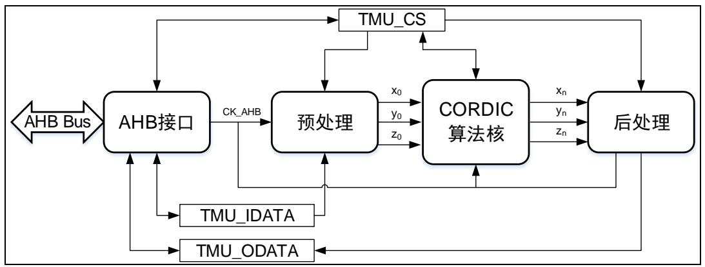

# 15. 三角函数加速器（TMU）

# 15.1. 简介

三角函数加速器（TMU）是一个完全可配置的单元，可执行常见的三角运算和算术运算操作。TMU 可以减轻 CPU 的负担，通常应用于电机控制，信号处理和很多其他应用场景。

TMU 可以计算 10 种函数，输入和输出数据符合 q1.31 或者 q1.15 格式。

# 15.2. 主要特性

10 种函数；

中断和 DMA请求；

定点格式可配置；

精度编程；

◼ CORDIC 算法核：支持两种圆周系统和双曲线系统，支持旋转模式和向量模式。

# 15.3. 结构框图

15-1. TMU TMU 模块内部结构细节。

图 15-1. TMU 模块结构框图

预处理模块将输入数据寄存器（TMU_IDATA）中的数据进行转换，得到 CORDIC 算法核需要的初始数据 $\left( \mathsf { x } _ { 0 } , \mathsf { y } _ { 0 } , \mathsf { z } _ { 0 } \right)$ 。输入数据寄存器中的内容是 q1.31 或者 q1.15 格式。

CORDIC 算法核心模块根据初始数据 $\left( \mathsf { x } _ { 0 } , \mathsf { y } _ { 0 } , \mathsf { z } _ { 0 } \right)$ ，经过迭代和运算，得到 $\left( \mathsf { x } _ { \mathsf { n } } , \mathsf { y } _ { \mathsf { n } } , z _ { \mathsf { n } } \right)$ 。TMU 算法核心模块支持圆周系统和双曲线系统，每种系统支持旋转模式和向量模式。

后处理模块对 $\left( \mathsf { x } _ { \mathsf { n } } , \mathsf { y } _ { \mathsf { n } } , z _ { \mathsf { n } } \right)$ 进行数据转换和缩放等处理，并将处理后的数据写入输出数据寄存器（TMU_ODATA）。输出数据寄存器中的内容是 q1.31 或者 q1.15 格式。

# 15.4. 功能描述

# 15.4.1. 数据格式和配置

TMU 模块的输入数据和输出数据是定点有符号整型格式（q1.31和 q1.15 格式）。

Q1.31 格式第 31 位是符号位，0~30 位是小数位，表达数值范围是 [-1,1-2-31]，对应[0x80000000,0x7FFFFFFF]。

Q1.15 格式第 15 位是符号位，0~14 位是小数位，表达数值范围是[-1,1-2-15]，对应[0x8000,0x7FFF]。

TMU_CS 寄存器的 IWITH 位用来配置输入数据的定点格式。有的模式（例如，模式 0）需要两个输入数据，有的模式只需要一个输入数据，TMU_CS 寄存器的 INUM 位用来配置输入数据的数量。详细配置参考 15-1. 。

注意：当输入数据配置为q1.15格式，只需要写一次 TMU_IDATA 寄存器，第一个输入数据在低半字，第二个输入数据在高半字。如果所配模式只需要一个输入数据，则只使用低半字，高半字的不使用。

表 15-1. 输入数据配置

<table><tr><td>IWIDTH 位</td><td>INUM 位</td><td>定点格式</td><td>写 TMU_IDATA 寄存器</td></tr><tr><td>0</td><td>0</td><td>q1.31</td><td>写一次</td></tr><tr><td>0</td><td>1</td><td>q1.31</td><td>连续写两次</td></tr><tr><td>1</td><td>0</td><td>q1.15</td><td>写一次</td></tr><tr><td>1</td><td>1</td><td>q1.15</td><td>不可用</td></tr></table>

TMU_CS 寄存器的 OWITH 位用来配置输出数据的定点格式。有的模式（例如，模式 0）有两个输出数据，有的模式只有一个输出数据，TMU_CS 寄存器的 ONUM 位用来配置输出数据的数量。详细配置参考 15-2. 。

注意：当输出数据配置为 q1.15 格式，则只需要读一次 TMU_ODATA 寄存器。第一个输出数据在低半字，第二个输出数据在高半字。如果所配模式只有一个输出，则只使用低半字，不使用高半字。

表 15-2. 输出数据配置

<table><tr><td>OWIDTH 位</td><td>ONUM 位</td><td>定点格式</td><td>读 TMU_ODATA 寄存器</td></tr><tr><td>0</td><td>0</td><td>q1.31</td><td>读一次</td></tr><tr><td>0</td><td>1</td><td>q1.31</td><td>连续读两次</td></tr><tr><td>1</td><td>0</td><td>q1.15</td><td>读一次</td></tr><tr><td>1</td><td>1</td><td>q1.15</td><td>不可用</td></tr></table>

# 15.4.2. 模式配置

TMU_CS 寄存器的 MODE[3:0]位域用来配置 CORDIC 算法核模块的运行模式。不同的模式使用不同的系统（圆周系统或者双曲线系统）和不同的模式（旋转模式或者向量模式）。详细信息参考 15-3. TMU 。由于输入和输出数据都是 q1.31 或者 q1.15 格式，所以有些模式需要对实际输入参数进行缩放。TMU_CS 寄存器的 FACTOR[2:0]位域用来配置缩放因子。

表 15-3. TMU 模式配置

<table><tr><td>模式</td><td>第一个输入数据</td><td>第二个输入数据</td><td>第一个输出数据</td><td>第二个输出数据</td><td>使用的系统和模式</td></tr><tr><td>模式0</td><td>θ</td><td>m</td><td><eq>m^* \cos(\theta)</eq></td><td><eq>m^* \sin(\theta)</eq></td><td>圆周系统,旋转模式</td></tr><tr><td>模式1</td><td>θ</td><td>m</td><td><eq>m^* \sin(\theta)</eq></td><td><eq>m^* \cos(\theta)</eq></td><td>圆周系统,旋转模式</td></tr><tr><td>模式2</td><td>x</td><td>y</td><td><eq>tan2(y,x)</eq></td><td><eq>\sqrt{x^2+y^2}</eq></td><td>圆周系统,向量模式</td></tr><tr><td>模式3</td><td>x</td><td>y</td><td><eq>\sqrt{x^2+y^2}</eq></td><td><eq>tan2(y,x)</eq></td><td>圆周系统,向量模式</td></tr><tr><td>模式4</td><td>x</td><td>无</td><td><eq>tan^{-1}(x)</eq></td><td>无</td><td>圆周系统,向量模式</td></tr><tr><td>模式5</td><td>x</td><td>无</td><td><eq>cosh(x)</eq></td><td><eq>sinh(x)</eq></td><td>双曲线系统,旋转模式</td></tr><tr><td>模式6</td><td>x</td><td>无</td><td><eq>sinh(x)</eq></td><td><eq>cosh(x)</eq></td><td>双曲线系统,旋转模式</td></tr><tr><td>模式7</td><td>x</td><td>无</td><td><eq>tanh^{-1}(x)</eq></td><td>无</td><td>双曲线系统,向量模式</td></tr><tr><td>模式8</td><td>x</td><td>无</td><td><eq>ln(x)</eq></td><td>无</td><td>双曲线系统,向量模式</td></tr><tr><td>模式9</td><td>x</td><td>无</td><td><eq>\sqrt{x}</eq></td><td>无</td><td>双曲线系统,向量模式</td></tr></table>

尽管 TMU 算法仅能够直接计算少量的函数，但更多的函数可以通过间接的方法来获得。比如，ex= sinh (x) + cosh (x)。

# 模式 0: $\mathbf { m } ^ { * } \cos ( \theta )$

该模式用来计算余弦函数。有两个输入和两个输出，参考 15-4. 0 。

表 15-4. 模式 0 描述

<table><tr><td>参数</td><td>范围</td><td>描述</td></tr><tr><td>第一个输入数据</td><td><eq>\frac{\theta}{\pi} \in [-1,1)</eq></td><td>角度值θ单位是弧度(rad),范围 θ∈[−π,π)。软件用θ除以π后,转换为[−1,1)范围内,再按照 q1.31或者 q1.15 格式写入 TMU_IDATA 寄存器</td></tr><tr><td>第二个输入数据</td><td>m ∈ [0,1)</td><td>当0 ≤ m &lt; 1时,按照 q1.31 或者 q1.15 格式写入 TMU_IDATA 寄存器。当m ≥ 1时,软件缩小m到[0,1)范围内,按照 q1.31 或者 q1.15 格式写入 TMU_IDATA 寄存器。</td></tr><tr><td>第一个输出数据</td><td>m* cos(θ),范围[-1,1)</td><td>如果之前软件缩小过m,需要对该输出数据进行相应比例的放大,以获得真实结果。</td></tr><tr><td>第二个输出数据</td><td>m * sin(θ),范围[-1,1)</td><td>如果之前软件缩小过m,需要对该输出数据进行相应比例的放大,以获得真实结果。</td></tr><tr><td>缩放因子FACTOR[2:0]</td><td>不可用</td><td>保持复位值 3&#x27;b000</td></tr></table>

注意：当模长m > 1时，缩放比例是自行选择的。

例如，计算 $1 0 0 ^ { * } \cos \left( { \frac { \pi } { 2 } } \right)$ ，默认输入输出配置为 q1.15 格式。可以按照以下步骤进行：

1. 软件处理角度 $: \frac { \pi } { 2 } \circ \ \frac { \frac { \pi } { 2 } } { \pi } = \frac { 1 } { 2 } ,$ ，q1.15 格式为 0x4000。

2. 软件处理模长m。 $\textstyle { \frac { 1 0 0 } { 1 2 8 } } = 0 . 7 8 1 2 5$ ，q1.15 格式为 0x6400。

3. 往寄存器 TMU_IDATA 写第一个输入数据：角度值 0x4000。

4. 往寄存器 TMU_IDATA 写第二个输入数据：模长 0x6400。

5. 等待 ENDF 标志置 1，读 TMU_ODATA 获取第一个输出数据y1= 100128 * $y _ { 1 } = { \frac { 1 0 0 } { 1 2 8 } } \cos \left( { \frac { \pi } { 2 } } \right)$ 100* ，再读一次TMU_ODATA 获取第二个输出数据y2= 100128 * $y _ { 2 } { = } \frac { 1 0 0 } { 1 2 8 } \star \sin ( \frac { \pi } { 2 } )$ 。输出数据是 q1.15 格式。

6. 结果处理。由于之前对模长m缩小了 128 倍，结果需要再乘以 128，则 $1 0 0 ^ { \star } \cos \left( { \frac { \pi } { 2 } } \right) = 1 2 8 ^ { \star } \mathsf { y } _ { 1 }$ 。本例（计算 $1 0 0 ^ { \star } \cos \left( { \frac { \pi } { 2 } } \right) ~ ;$ ）中对模长m和结果处理使用了 128 倍缩放，当然也可以使用其他缩放倍数，比如 101。

# 模式 1: $\mathbf { m } ^ { * } \mathbf { s i n } ( \pmb { \theta } )$

该模式用来计算正弦函数。有两个输入和两个输出，参考 15-5. 1 。

表 15-5. 模式 1 描述

<table><tr><td>参数</td><td>范围</td><td>描述</td></tr><tr><td>第一个输入数据</td><td><eq>\frac{\theta}{\pi} \in [-1,1)</eq></td><td>角度值θ单位是弧度(rad),范围 θ∈[−π,π)。软件用θ除以π后,转换为[−1,1)范围内,再按照 q1.31或者 q1.15 格式写入 TMU_IDATA 寄存器</td></tr><tr><td>第二个输入数据</td><td>m ∈ [0,1)</td><td>当0 ≤ m &lt; 1时,按照 q1.31 或者 q1.15 格式写入 TMU_IDATA 寄存器。当m ≥ 1时,软件缩小m到[0,1)范围内,按照 q1.31 或者 q1.15 格式写入 TMU_IDATA 寄存器。</td></tr><tr><td>第一个输出数据</td><td>m* sin(θ) ∈[−1,1)</td><td>如果之前软件缩小过m,需要对该输出数据进行相应比例的放大,以获得真实结果。</td></tr><tr><td>第二个输出数据</td><td>m * cos(θ) ∈[−1,1)</td><td>如果之前软件缩小过m,需要对该输出数据进行相应比例的放大,以获得真实结果。</td></tr><tr><td>缩放因子FACTOR[2:0]</td><td>不可用</td><td>保持复位值 3&#x27;b000</td></tr></table>

注意：当模长m > 1时，缩放比例是自行选择的。

例如，计算 $1 0 0 ^ { \star } \sin \left( { \frac { \pi } { 2 } } \right)$ ，默认输入输出配置为 q1.15 格式。可以按照以下步骤进行：

1. 软件处理角度?? 。??2π = 0.5，q1.15 格式为0x4000。 ${ \begin{array} { c } { { \frac { \pi } { 2 } } } \\ { { \pi } } \end{array} } = 0 . 5$ 

2. 软件处理模长m。 $\textstyle { \frac { 1 0 0 } { 1 2 8 } } = 0 . 7 8 1 2 5$ ，q1.15 格式为 0x6400。

3. 往寄存器 TMU_IDATA 写第一个输入数据：角度值 0x4000。

4. 往寄存器 TMU_IDATA 写第二个输入数据：模长 0x6400。

5. 等待 ENDF 标志置 1，读 TMU_ODATA 获取第一个输出数据y1= 100128 * $y _ { 1 } = \frac { 1 0 0 } { 1 2 8 } \star \sin ( \frac { \pi } { 2 } )$ sin ( ， 再读一次TMU_ODATA 获取第二个输出数据y2= 100128 * $y _ { 2 } { = } \frac { 1 0 0 } { 1 2 8 } \star \cos \left( \frac { \pi } { 2 } \right)$ cos 。输出数据是 q1.15 格式。

6. 结果处理。由于之前对模长m缩小了128倍，结果需要再乘以128，则 $1 0 0 ^ { \star } \sin \left( { \textstyle { \frac { \pi } { 2 } } } \right) { = } 1 2 8 ^ { \star } \mathsf { y } _ { 1 }$ 。

本例（计算 $1 0 0 ^ { \star } \sin \left( { \frac { \pi } { 2 } } \right) )$ ）中对模长m和结果处理使用了 128 倍缩放，当然也可以使用其他缩放倍数，比如 101。

# 模式 2: phase= atan2 (y,x)

该模式用来计算atan2函数。有两个输入和一个输出，参考 15-6. 2 。

表 15-6. 模式 2 描述

<table><tr><td>参数</td><td>范围</td><td>描述</td></tr><tr><td>第一个输入数据</td><td><eq>x \in [-1,1)</eq></td><td>笛卡尔坐标系中横坐标值。如果<eq>x \geq 1</eq>或者<eq>x &lt; -1</eq>,则需要进行软件缩放。</td></tr><tr><td>第二个输入数据</td><td><eq>y \in [-1,1)</eq></td><td>笛卡尔坐标系中纵坐标。如果<eq>y \geq 1</eq>或者<eq>x &lt; -1</eq>,则需要进行软件缩放。</td></tr><tr><td>第一个输出数据</td><td>角度<eq>\theta \in [-1,1)</eq></td><td>坐标位置对应的角度,<eq>[-1,1)</eq>对应<eq>[-\pi,\pi)</eq>。该输出数据乘以<eq>\pi</eq>得到真实角度值。</td></tr><tr><td>第二个输出数据</td><td>模长<eq>m \in [0,1)</eq></td><td><eq>m = \sqrt{x^2 + y^2}</eq>。如果之前对<eq>x</eq>和<eq>y</eq>进行了缩放,该模长需要进行等比例放大。</td></tr><tr><td>缩放因子FACTOR[2:0]</td><td>不可用</td><td>保持复位值3&#x27;b000</td></tr></table>

# 注意：

1. x和y只要有一个超出范围[-1,1)，需要同时对x和y进行同比例缩放，不能只缩放一个。这样可以保证缩放前后坐标对应的角度不变。

2. 当 $\sqrt { x ^ { 2 } + y ^ { 2 } } \geq 1$ 时，模长 m都只能饱和到定点格式的最大值 $( 1 - 2 ^ { - 1 5 }$ 或者 $1 - 2 ^ { - 3 1 }$ ）。对x和y进行同比例缩放前，要考虑缩放因子的大小，尽量避免出现模长饱和的情况。

例如，计算 $\scriptstyle \Theta = \mathtt { a t a n } ( 5 , 8 0 )$ ，默认输入输出配置为 q1.15 格式。可以按照以下步骤进行：

1. 软 件 缩 放 。 输 入 数 据 (5,80) 除 以 128 ， 得 (0.0390625,0.625) ， q1.15 表 达 形 式 为(0x0500,0x5000)。

2. 往寄存器 TMU_IDATA 写入第一个输入数据0x0500。

3. 往寄存器 TMU_IDATA 写入第二个输入数据0x5000。

4. 等待 ENDF 标志置 1，读 TMU_ODATA 获取第一个输出数据θ（此处角度为 q1.15 格式），再读一次 TMU_ODATA 获取第二个输出数据m。

5. 结果处理。第一个输出数据角度θ乘以π，得到真实弧度。由于之前输入数据缩小了 128 倍，读出的第二个输出数据模长m需要再乘以 128 才是真实模长。

本例（计算θ=atan(5,80)）中对输入和模长使用了 128 倍缩放，当然也可以使用其他缩放倍数，比如 81。

模式 3: $\scriptstyle \mathbf { m o d u l u s } = { \sqrt { x ^ { 2 } + y ^ { 2 } } }$ 

该模式用来计算 $\sqrt { x ^ { 2 } + y ^ { 2 } }$ 函数。有两个输入和两个输出，参考 15-7. 3 。

表 15-7. 模式 3 描述

<table><tr><td>参数</td><td>范围</td><td>描述</td></tr><tr><td>第一个输入数据</td><td><eq>x \in [-1,1)</eq></td><td>笛卡尔坐标系中横坐标值。如果<eq>x \geq 1</eq>或者<eq>x \leq -1</eq>,则需要进行软件缩放。</td></tr><tr><td>第二个输入数据</td><td><eq>y \in [-1,1)</eq></td><td>笛卡尔坐标系中纵坐标。如果<eq>y \geq 1</eq>或者<eq>x \leq -1</eq>,则需要进行软件缩放。</td></tr><tr><td>第一个输出数据</td><td>模长<eq>m \in [0,1)</eq></td><td>模长,<eq>m = \sqrt{x^2 + y^2}</eq>。如果之前对<eq>x</eq>和<eq>y</eq>进行了缩放,该模长需要进行等比例放大。</td></tr><tr><td>第二个输出数据</td><td>角度<eq>\theta \in [-1,1)</eq></td><td>坐标位置对应的角度,<eq>[-1,1)</eq>对应<eq>[-\pi, \pi)</eq>。该输出数据乘以<eq>\pi</eq>得到真实角度值。</td></tr><tr><td>缩放因子FACTOR[2:0]</td><td>不可用</td><td>保持复位值3&#x27;b000</td></tr></table>

# 注意：

1. x和y只要有一个超出范围[-1,1)，需要同时对x和y进行同比例缩放，不能只缩放一个。这样可以保证缩放前后坐标对应的角度不变。

2. 当 $\sqrt { x ^ { 2 } + y ^ { 2 } } \geq 1 \mathbb { H } ,$ ，模长 m都只能饱和到定点格式的最大值 $( 1 - 2 ^ { - 1 5 }$ 或者 $1 - 2 ^ { - 3 1 }$ ）。对x和y进行同比例缩放前，要考虑缩放因子的大小，尽量避免出现模长饱和的情况。

例如，计算 $\sqrt { 5 ^ { 2 } + 8 0 ^ { 2 } }$ ，默认输入输出配置为 q1.15 格式。可以按照以下步骤进行：

1. 软 件 缩 放 。 输 入 数 据 (5,80) 除 以 128 ， 得 (0.0390625,0.625) ， q1.15 表 达 形 式 为(0x0500,0x5000)。

2. 往寄存器 TMU_IDATA 写入第一个输入数据0x0500。

3. 往寄存器 TMU_IDATA 写入第二个输入数据0x5000，TMU 启动计算。

4. 等待 ENDF 标志置 1，读 TMU_ODATA 获取第一个输出数据m，再读一次 TMU_ODATA获取第二个输出数据θ（此处角度为 q1.15 格式）。

5. 软件结果处理。由于之前输入数据缩小了 128 倍，读出的第一个输出数据模长m需要再乘以 128 才是真实模长。第二个输出数据角度θ乘以π，得到真实弧度。

本例（计算 $\sqrt { 5 ^ { 2 } + 8 0 ^ { 2 } } )$ ）中对输入和模长使用了 128 倍缩放，当然也可以使用其他缩放倍数，比如 81。

# 模式 4: $\tan ^ { - 1 } \left( \mathbf { x } \right)$

该模式用来计算 $\tan ^ { - 1 } ( x )$ 函数。有一个输入和一个输出，参考 15-8. 4 。

表 15-8. 模式 4 描述

<table><tr><td>参数</td><td>范围</td><td>描述</td></tr><tr><td>输入数据</td><td><eq>\frac{x}{2^f} \in [-1,1)</eq></td><td>如果<eq>x \in [-1,1]</eq>,软件不需要处理,缩放因子FACTOR[2:0] =3&#x27;b000。如果x超出[-1,1]范围,软件进行缩放,缩放后要保证-<eq>1 \leq x*2^{-f} &lt; 1</eq>,把f写入缩放因子FACTOR[2:0]位域,把缩放后的数据<eq>\frac{x}{2^f}</eq>以q1.15或者q1.31写入TMU_IDATA寄存器。</td></tr><tr><td>输出数据</td><td><eq>\frac{\theta}{2^f} \in [-1,1)</eq></td><td>[-1,1)对应<eq>-\pi,\pi</eq>)。该输出数据乘以<eq>\pi</eq>和<eq>2^f</eq>得到真实角度值。</td></tr><tr><td>缩放因子FACTOR[2:0]</td><td><eq>f \in [0,7]</eq></td><td>FACTOR[2:0]配置为f</td></tr></table>

例如，计算 $\tan ^ { - 1 } ( 1 0 0 )$ ，默认输入输出配置为 q1.15 格式。可以按照以下步骤进行：

1. 软件缩放。输入数据100除以 128（缩放因 $F _ { f } = 7 = 3 6 1 1 1$ ），得0.78125，q1.15 表达形式为0x6400。

2. 缩放因子 $\tan 3 6 7 = 3 3 6 7 1 1$ 写入 TMU_CS 寄存器的 FACTOR[2:0]位域。

3. 往寄存器 TMU_IDATA 写入输入数据0x6400，TMU 开始计算。

4. 等待 ENDF 标志置 1，读 TMU_ODATA 获取输出数据 $i \frac { \theta } { 2 ^ { \dagger } } ,$ ，输出数据为 q1.15 格式。

5. 结果处理。输出数据 $\cdot \frac { \theta } { 2 ^ { \dagger } }$ 需要乘以π和128以得到真实弧度。

# 模式 5: cosh (x)

该模式用来计算cosh(x)函数。有一个输入和两个输出，参考 15-9. 5 。

表 15-9. 模式 5 描述

<table><tr><td>参数</td><td>范围</td><td>描述</td></tr><tr><td>输入数据</td><td><eq>\frac{x}{2} \in [-0.559, 0.559]</eq></td><td>x∈[-1.118,1.118],软件将x除以2,然后以q1.15或者q1.31写入TMU_IDATA寄存器。</td></tr><tr><td>第一个输出数据</td><td><eq>\frac{\cosh(x)}{2} \in [0.5, 0.846)</eq></td><td>该输出数据乘以2可以得到双曲余弦cosh(x)的值。</td></tr><tr><td>第二个输出数据</td><td><eq>\frac{\sinh(x)}{2} \in [-0.683, 0.683]</eq></td><td>该输出数据乘以2可以得到双曲正弦sinh(x)的值</td></tr><tr><td>缩放因子FACTOR[2:0]</td><td>f=1</td><td>FACTOR[2:0]配置为3&#x27;b001</td></tr></table>

注意：缩放因子 FACTOR[2:0]只能配置为 3’b001。

例如，计算cosh(1.0)，默认输入输出配置为 q1.15 格式。可以按照以下步骤进行：

1. 软件缩放。输入数据1.0除以 $2 \left( \mathrm { f } = 3 ^ { \prime } \mathrm { b } 0 0 1 \right)$ ，得0.5，q1.15 表达形式为0x4000。

2. 缩放因子f=3'b001写入 TMU_CS 寄存器的 FACTOR[2:0]位域。

3. 往寄存器 TMU_IDATA 写入输入数据0x4000, TMU 开始计算。

4. 等待 ENDF 标志置 1，读 TMU_ODATA 获取第一个输出数据 $\mathsf { y } _ { 1 } = \frac { \mathsf { c o s h } ( 1 . 0 ) } { 2 }$ ，再读一次获取第二个输出数据 $\mathsf { y } _ { 1 } = \frac { \mathsf { s i n h } \left( 1 . 0 \right) } { 2 } .$ 2 。这两个数据都是 q1.15 格式。

5. 结果处理。两个输出数据都乘以 2，得到双曲余弦cosh (x)和双曲正弦sinh (x)。

# 模式 6: sinh (x)

该模式用来计算sinh (x)函数。有一个输入和两个输出，参考 15-10.  6 。

表 15-10. 模式 6 描述

<table><tr><td>参数</td><td>范围</td><td>描述</td></tr><tr><td>输入数据</td><td><eq>\frac{x}{2} \in [-0.559, 0.559]</eq></td><td>x∈[-1.118,1.118],软件将x除以2,然后以q1.15或者q1.31写入TMU_IDATA寄存器。</td></tr><tr><td>第一个输出数据</td><td><eq>\frac{\sinh(x)}{2} \in [-0.683, 0.683]</eq></td><td>输出数据乘以2得到双曲正弦sinh(x)。</td></tr><tr><td>第二个输出数据</td><td><eq>\frac{\cosh(x)}{2} \in [0.5, 0.846)</eq></td><td>输出数据乘以2得到双曲余弦cosh(x)</td></tr><tr><td>缩放因子FACTOR[2:0]</td><td>f=1</td><td>FACTOR[2:0]配置为3&#x27;b001</td></tr></table>

注意：缩放因子 FACTOR[2:0]只能配置为 3’b001。

例如，计算sinh(1.0)，默认输入输出配置为 q1.15 格式。可以按照以下步骤进行：

1. 软件缩放。输入数据1.0除以 $2 ( t { = } 3 ^ { \cdot } \mathsf { b } 0 0 1 )$ ，得0.5，q1.15 表达形式为0x4000。

2. 缩放因子f=3'b001写入 TMU_CS 寄存器的 FACTOR[2:0]位域。

3. 往寄存器 TMU_IDATA 写入输入数据0x4000，TMU 开始计算。

4. 等待 ENDF 标志置 1，读 TMU_ODATA 获取第一个输出数据 $\mathsf { y } _ { 1 } = \frac { \mathsf { s i n h } \left( 1 . 0 \right) } { 2 }$ 2 ，再读一次获取第二个输出数据 $\mathsf { y } _ { 2 } = \frac { \mathsf { c o s h } \left( 1 . 0 \right) } { 2 }$ = cosh (1.0)。这两个数据都是 q1.15 格式。 2

5. 结果处理。两个输出数据都乘以 2，得到双曲正弦sinh(1.0)和双曲余弦cosh(1.0)。

# 模式 7: $\tan \mathsf { h } ^ { - 1 } \left( \mathsf { x } \right)$

该模式用来计算 $\tan \mathsf { h } ^ { - 1 } \left( \mathsf { x } \right)$ 函数。有一个输入和一个输出，参考 15-11. 7 。

表 15-11. 模式 7 描述

<table><tr><td>参数</td><td>范围</td><td>描述</td></tr><tr><td>输入数据</td><td><eq>\frac{x}{2} \in [-0.403, 0.403]</eq></td><td>x∈[-0.806,0.806],软件将x除以2,然后以q1.15或者q1.31写入TMU_IDATA寄存器。</td></tr><tr><td>输出数据</td><td><eq>\frac{\tanh^{-1}(x)}{2} \in [-0.559, 0.559]</eq></td><td>输出数据乘以2得到反双曲正切<eq>\tanh^{-1}(x)</eq>。</td></tr><tr><td>缩放因子FACTOR[2:0]</td><td>f=1</td><td>FACTOR[2:0]配置为3'b001</td></tr></table>

注意：缩放因子 FACTOR[2:0]只能配置为 3’b001。

例如，计算tanh-1(0.5)，默认输入输出配置为 q1.15 格式。可以按照以下步骤进行：

1. 软件缩放。输入数据0.5除以 $2 ( t { = } 3 ^ { \prime } \mathsf { b } 0 0 1 )$ ，得0.25，q1.15 表达形式为0x2000。

2. 缩放因子f=3'b001写入 TMU_CS 寄存器的 FACTOR[2:0]位域。

3. 往寄存器 TMU_IDATA 写入输入数据0x2000，TMU 开始计算。

4. 等待 ENDF 标志置 1，读 TMU_ODATA 获取输出数据 $\mathsf { y } _ { 1 } = \frac { \mathsf { t a n h } ^ { - 1 } \left( 0 . 5 \right) } { 2 }$ 。输出数据是 q1.15 格式。

5. 结果处理。输出数据乘以 2，得到反双曲正切 $\tan \mathsf { h } ^ { - 1 } ( 0 . 5 )$ 。

# 模式 8：ln (x)

该模式用来计算ln(x)函数。有一个输入和一个输出，参考 15-12. 8 。

表 15-12. 模式 8 描述

<table><tr><td>参数</td><td>范围</td><td>描述</td></tr><tr><td>输入数据</td><td><eq>\frac{x}{2^f} \in [0.0535, 0.875]</eq></td><td><eq>x \in [0.107, 9.35]</eq>。软件进行缩放处理,保证<eq>\frac{x}{2^f} &lt; (1 - \frac{1}{2^f})</eq>,其中<eq>f</eq>为缩放因子,然后将<eq>\frac{x}{2^f}</eq>以<eq>q1.15</eq>或者<eq>q1.31</eq>写入TMU_IDATA寄存器。</td></tr><tr><td>输出数据</td><td><eq>\frac{\ln(x)}{2^{(f+1)}} \in [-0.558, 0.137]</eq></td><td>输出数据乘以<eq>2^{(f+1)}</eq>得到自然对数<eq>\ln(x)</eq>。</td></tr><tr><td>缩放因子FACTOR[2:0]</td><td><eq>f \in [1, 4]</eq></td><td>FACTOR[2:0]配置为<eq>f</eq></td></tr></table>

例如，计算ln(8)，默认输入输出配置为 q1.15 格式。可以按照以下步骤进行：

1. 软件缩放。输入数据 8 除以 16（缩放因子f = 3′b100），得0.5，q1.15 表达形式为0x4000。

2. 缩放因子f=3'b100写入 TMU_CS 寄存器的 FACTOR[2:0]位域。

3. 往寄存器 TMU_IDATA 写入输入数据0x4000，TMU 开始计算。

4. 等待 ENDF 标志置 1，读 TMU_ODATA 获取输出数据 $\mathtt { y } _ { 1 } = \frac { \ln { ( \mathsf { x } ) } } { 2 ^ { ( 4 + 1 ) } }$ 。 输出数据是 q1.15 格式。

5. 结果处理。输出数据乘以2(4+1)，得到自然对数ln (x)。

为保证计算精度，对于不同输入推荐使用 15-13. 8 中的缩放因子。

表 15-13. 模式 8 推荐的缩放因子

<table><tr><td>输入x范围</td><td>缩放因子 FACTOR[2:0]</td><td>输入数据范围</td></tr><tr><td>0.107 ≤ x &lt; 1</td><td>3'b001</td><td>[0.0535,0.5)</td></tr><tr><td>1 ≤ x &lt; 3</td><td>3'b010</td><td>[0.25,0.75)</td></tr><tr><td>3 ≤ x &lt; 7</td><td>3'b011</td><td>[0.375,0.875)</td></tr><tr><td>7 ≤ x &lt; 9.35</td><td>3'b100</td><td>[0.4375,0.584)</td></tr></table>

# 模式 $\pmb { 9 } : \sqrt { \pmb { x } }$

该模式用来计算 $\sqrt { \mathsf { x } } |$ 函数。有一个输入和一个输出，参考 15-14.  9 。

表 15-14. 模式 9 描述

<table><tr><td>参数</td><td>范围</td><td>描述</td></tr><tr><td>输入数据</td><td><eq>\frac{x}{2^f} \in [0.027, 0.875]</eq></td><td><eq>x \in [0.027, 2.34]</eq>。软件进行缩放处理,保证<eq>\frac{x}{2^f} &lt; (1 - \frac{1}{2^{f+2}})</eq>,其中<eq>f</eq>为缩放因子。然后将<eq>\frac{x}{2^f}</eq>以<eq>q1.15</eq>或者<eq>q1.31</eq>写入TMU_IDATA寄存器。</td></tr><tr><td>输出数据</td><td><eq>\frac{\sqrt{x}}{2^f} \in [0.04, 1]</eq></td><td>输出数据乘以<eq>2^f</eq>得到<eq>\sqrt{x}</eq>。</td></tr><tr><td>缩放因子FACTOR[2:0]</td><td><eq>f \in [0, 2]</eq></td><td>FACTOR[2:0]配置为<eq>f</eq></td></tr></table>

例如，计算 ${ \sqrt { 2 } } ,$ ，默认输入输出配置为 q1.15 格式。可以按照以下步骤进行：

1. 软件缩放。输入数据 2 除以 4（缩放因子f=3'b010），得0.5，q1.15 表达形式为0x4000。

2. 缩放因子f=3'b010写入 TMU_CS 寄存器的 FACTOR[2:0]位域。

3. 往寄存器 TMU_IDATA 写入输入数据0x4000，TMU 开始计算。

4. 等待 ENDF 标志置 1，读 TMU_ODATA 获取输出数据 $\mathsf { y } _ { 1 } = \frac { \sqrt { 2 } } { 2 ^ { 2 } } \mathsf { c }$ = 2 。 输出数据是 q1.15 格式。

5. 结果处理。输出数据乘以22，得到 ${ \sqrt { 2 } } .$ 。

为保证计算精度，对于不同输入推荐使用 15-15. 9 中的缩放因子。

表 15-15. 模式 9 推荐的缩放因子

<table><tr><td>输入x范围</td><td>缩放因子 FACTOR[2:0]</td><td>输入数据范围</td></tr><tr><td>0.027&lt;x&lt;0.75</td><td>3&#x27;b000</td><td>[0.027,0.75)</td></tr><tr><td>0.75≤x&lt;1.75</td><td>3&#x27;b001</td><td>[0.375,0.875)</td></tr><tr><td>1.75≤x&lt;2.341</td><td>3&#x27;b010</td><td>[0.4375,0.585)</td></tr></table>

# 15.4.3. TMU 精度

表 15-16. 不同迭代次数下的精度

<table><tr><td rowspan="2">模式</td><td rowspan="2">迭代次数</td><td rowspan="2">计算周期数</td><td colspan="2">最大残差(1)</td></tr><tr><td>q1.31 格式</td><td>q1.15 格式</td></tr><tr><td rowspan="5">模式 0, 模式 1, 模式(2)2, 模式(2)3, 模式(4)4</td><td>4</td><td>1</td><td><eq>2^{-3}</eq></td><td><eq>2^{-3}</eq></td></tr><tr><td>8</td><td>2</td><td><eq>2^{-7}</eq></td><td><eq>2^{-7}</eq></td></tr><tr><td>12</td><td>3</td><td><eq>2^{-11}</eq></td><td><eq>2^{-11}</eq></td></tr><tr><td>16</td><td>4</td><td><eq>2^{-15}</eq></td><td><eq>2^{-15}</eq></td></tr><tr><td>20</td><td>5</td><td><eq>2^{-18}</eq></td><td><eq>2^{-16}</eq></td></tr><tr><td></td><td>24</td><td>6</td><td><eq>2^{-19}</eq></td><td><eq>2^{-16}</eq></td></tr><tr><td rowspan="6">模式5,模式6,模式7,模式(3)8</td><td>4</td><td>1</td><td><eq>2^{-2}</eq></td><td><eq>2^{-2}</eq></td></tr><tr><td>8</td><td>2</td><td><eq>2^{-6}</eq></td><td><eq>2^{-6}</eq></td></tr><tr><td>12</td><td>3</td><td><eq>2^{-10}</eq></td><td><eq>2^{-10}</eq></td></tr><tr><td>16</td><td>4</td><td><eq>2^{-13}</eq></td><td><eq>2^{-13}</eq></td></tr><tr><td>20</td><td>5</td><td><eq>2^{-17}</eq></td><td><eq>2^{-15}</eq></td></tr><tr><td>24</td><td>6</td><td><eq>2^{-18}</eq></td><td><eq>2^{-15}</eq></td></tr><tr><td rowspan="3">模式(4)9</td><td>4</td><td>1</td><td><eq>2^{-7}</eq></td><td><eq>2^{-7}</eq></td></tr><tr><td>8</td><td>2</td><td><eq>2^{-14}</eq></td><td><eq>2^{-14}</eq></td></tr><tr><td>12</td><td>3</td><td><eq>2^{-19}</eq></td><td><eq>2^{-15}</eq></td></tr></table>

1. 最大剩余误差是在给定次数的迭代后，与在双精度浮点中执行的相同计算相比，剩余的最大误差。可能会产生额外的舍入误差，对于 q15 格式最多为 2-16，对于 q31 格式最多为 2-20。

2. 当坐标(x,y)靠近(0,0)时，精度会急剧下降。

3. $\mathsf { F A C T O R } [ 2 : 0 ] = 1 \mathrm { ~ }$ 。如果使用更高的比例因子，则可实现的精度会成比例地降低。

4. $\mathsf { F A C T O R } [ 2 : 0 ] = 0 .$ 。如果使用更高的比例因子，则可实现的精度会成比例地降低。

# 15.4.4. TMU运算挂起

如果当前正在执行 TMU 运算，可以写 TMU_CS 和 TMU_IDATA 寄存器，写入的内容将被挂起。当 TMU 运算完成（结果被读取，ENDF 标志清零）时，如果挂起的输入数据数量符合配置（定义在被挂起的 TMU_CS 中），TMU 模块将按照挂起的配置和数据开始新一次 TMU 运算。

例如，如果配置的TMU模式需要两个32-bit输入数据（ $( \mathsf { M } \mathsf { I } \mathsf { D } \mathsf { T } \mathsf { H } = 0 , \mathsf { I } \mathsf { N } \mathsf { U } \mathsf { M } = 1 )$ ，当往 TMU_IDATA寄存器写入两个 32-bit 的数据后，TMU 启动一次运算。如果第二个输入参数在下一次 TMU 运算中不改变，此时可以修改 INUM=0。当前一次 TMU 运算结束后，往 TMU_IDATA 寄存器写入一个输入数据，TMU 启动运算，只要 TMU 模式没有改变，第二个参数仍使用之前的数值。

注意：复位后，第二个数值 $\forallJ \in 1 ( 0 \land 7 \mathsf { F F F F F F F F F F } )$ ）。

如果当前已经存在挂起的 TMU 数据，再往 TMU_CS 和 TMU_IDATA 寄存器写入新的数据，则新数据覆盖原来数据，新的 TMU 数据被挂起，原数据的挂起失效。

# 15.4.5. 零开销

当一个 TMU 运算开始后，可以直接读取输出数据寄存器，在结果返回之前总线会自动插入等待周期。可以按照以下步骤进行：

1. 根据需要 TMU_CS 寄存器。

2. 往 TMU_IDATA 写入需要的参数，启动一个 TMU 运算。

3. 根据需要配置下一次 TMU 模式，并往 ${ \mathsf { T M U \_ D A T A } }$ 写入下一次需要的数据。

4. 读取 TMU_ODATA。总线自动插入等待周期。当读取 TMU_ODATA 操作完成后，在第 3步骤中配置得 TMU 操作会自动启动。

5. 返回第 3 步。

# 15.4.6. 中断和 DMA

当 ENDF 标志位置 1 时，如果 TMU_CS 寄存器中的 RIE 为 1，则产生中断请求。ENDF 标志清 0 后，中断请求也清除。

如果 TMU_CS 寄存器中的 WDEN 为 1 并且此时没有 TMU 挂起，则产生 DMA请求，DMA 请求的数量却决于 TMU_CS 寄存器中的 INUM 位。如果 TMU_CS 寄存器中的 INUM=0，产生一次 DMA 传输请求。如果 TMU_CS 寄存器中的 INUM=1，产生两次 DMA传输请求。

当 ENDF 标志位置 1 时，如果 TMU_CS 寄存器中的 RDEN 为 1，则产生 DMA请求，DMA请求的数量 TMU_CS 寄存器中的 ONUM 位。如果 TMU_CS 寄存器中的 ONUM=0，产生一次DMA 传输请求。如果 TMU_CS 寄存器中的 ONUM=1，产生两次 DMA 传输请求。

