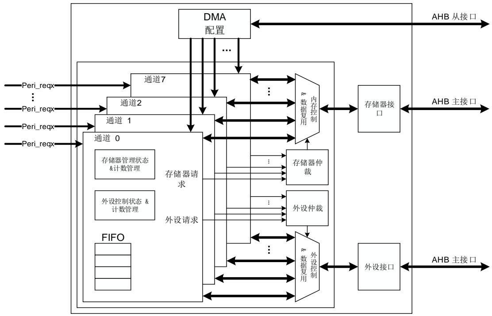
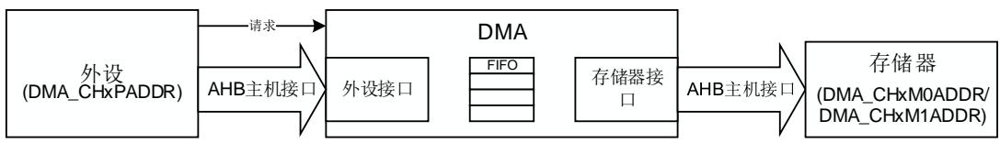
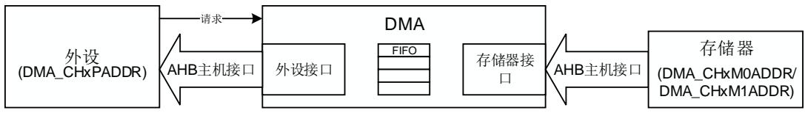
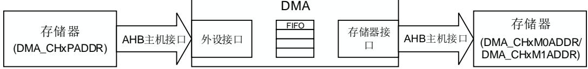
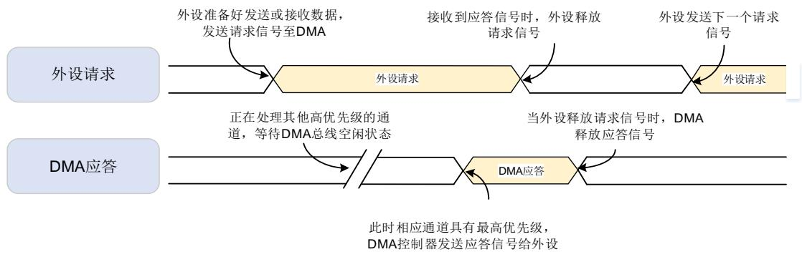
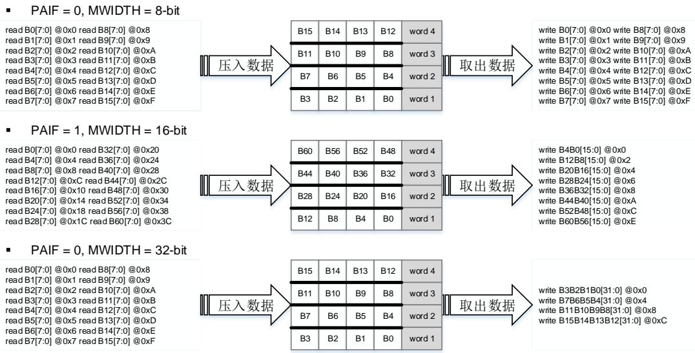
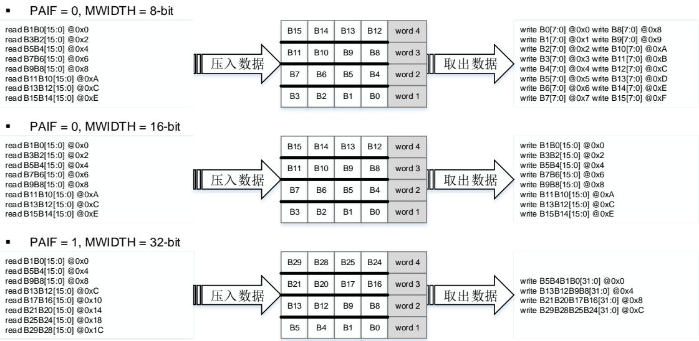
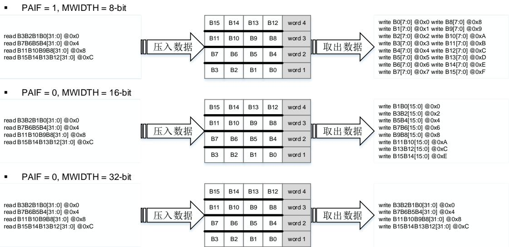
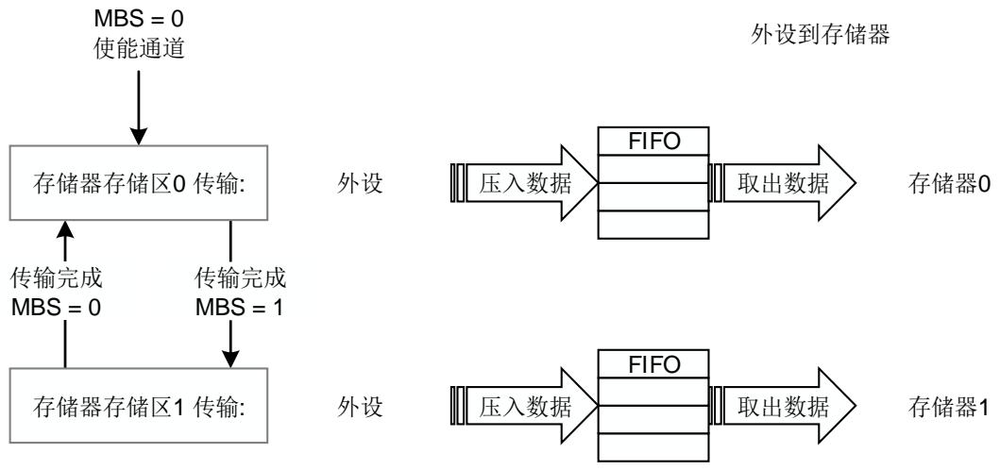
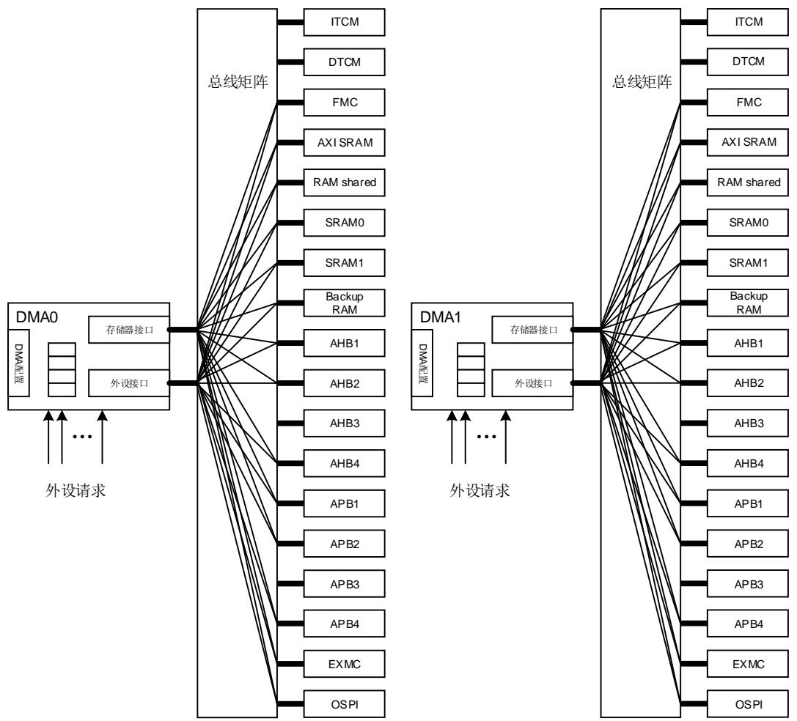

# 16. 直接存储器访问控制器（DMA）

# 16.1. 简介

DMA 控制器提供了一种硬件的方式在外设和存储器之间或者存储器和存储器之间传输数据，而无需 MCU 的介入，避免了 MCU 多次进入中断进行大规模的数据拷贝，最终提高整体的系统性能。

每个 DMA 控制器包含了两个 AHB 总线接口和 8 个 4 字深度的 FIFO，使 DMA 可以高效的传输数据。DMA 控制器共有 16 个通道（DMA0，DMA1 控制器分别有 8 个通道），每个通道可以被分配给一个或多个特定的外设用于存储器访问请求管理。两个内置的总线仲裁器用来处理DMA请求的优先级问题。

DMA 控制器与 Cortex-M7 内核都是通过系统总线来处理数据，引入仲裁机制来处理它们之间的竞争关系。当 MCU 和 DMA指定相同的外设的时候，MCU 将会在特定的总线周期挂起。总线矩阵使用了轮询的算法保证 MCU 至少占用了一半的带宽。

# 16.2. 主要特征

两个 AHB 主机接口传输数据，一个 AHB 从机接口配置 DMA。

◼ 16 个通道（DMA0 有 8 个通道，DMA1 有 8 个通道），并且每个通道都可配置。

存储器和外设支持单一传输，4 拍、8 拍和 16 拍增量突发传输。

当外设和存储器传输数据时，支持缓冲区切换。

◼ 支持软件优先级（低、中、高、超高）和硬件优先级（通道号越低，优先级越高）。

存储器和外设的数据传输宽度可配置：字节，半字，字。

存储器和外设的数据传输支持固定寻址和增量式寻址。

支持循环传输模式。

支持三种传输方式：

存储器到外设；

外设到存储器；

存储器到存储器。

支持单数据传输和多数据传输模式，FIFO 深度最大为 4 个字：

多数据传输模式：在存储器数据宽度和外设数据宽度不同的时候，自动打包/解包数据；

单数据传输模式：当且仅当 FIFO 空的时候从源地址读取数据，存进 FIFO，然后把FIFO 的数据写到目标地址。

每个通道有 5 种类型的事件标志和独立的中断。

支持中断的使能和清除。

# 16.3. 功能说明

# 16.3.1. 结构框图

图 16-1. 系统架构

如 16-1. 所示，DMA控制器由 4 部分组成：

AHB 从接口配置 DMA；

通过两个 AHB 主接口分别为访问存储器和访问外设提供数据传输功能；

两个内置仲裁器用于管理同时发出的多个外设请求；

通道数据管理，以控制数据打包/解包和计数。

DMA控制器在没有 CPU 参与的情况下从一个地址向另一个地址传输数据，它支持多种数据宽度，突发类型，地址生成算法，优先级和传输模式，可以灵活的配置 DMA 寄存器相应位以满足应用的需求。所有的 DMA 寄存器都可以通过 AHB 从机接口进行 32 位的操作。

支持外设到存储器、存储器到外设以及存储器到存储器三种传输模式，具体模式选择通过DMA_CHxCTL 寄存器中的 TM 位域决定，如 16-1. 所示。

表 16-1. 传输模式

<table><tr><td>传输模式</td><td>TM[1:0]</td><td>源地址</td><td>目的地址</td></tr><tr><td>外设到存储器</td><td>00</td><td>DMA_CHxPADDR</td><td>DMA_CHxM0ADDR/DMA_CHxM1ADDR</td></tr><tr><td>存储器到外设</td><td>01</td><td>DMA_CHxM0ADDR/DMA_CHxM1ADDR</td><td>DMA_CHxPADDR</td></tr><tr><td>存储器到存储器</td><td>10</td><td>DMA_CHxPADDR</td><td>DMA_CHxM0ADDR/DMA_CHxM1ADDR</td></tr></table>

注意：

1. 寄存器 DMA_CHxCTL 的 MBS 位选择 DMA_CHxM0ADDR 或者 DMA_CHxM1ADDR 作为存储器地址。详细请参考 。

2. 寄存器 DMA_CHxCTL 的 TM 位域禁止配置成‘0b11’，否则通道将会自动关闭。

图 16-2. 三种传输模式的数据流

读外设写存储器

读存储器写外设

读存储器写存储器

如 16-2. 所示，DMA 控制器的两个 AHB 主机接口分别对应存储器和外设的数据访问。

存储器到外设：通过 AHB 存储器主机接口从存储器读取数据，通过 AHB 外设主机接口向外设写入数据；

外设到存储器：通过 AHB 外设主机接口从外设读取数据，通过 AHB存储器主机接口向存储器写入数据；

存储器到存储器：通过 AHB外设主机接口从存储器读取数据，通过 AHB 存储器主机接口向存储器写入数据。

# 16.3.2. 外设握手

为了保证良好的组织和高效的数据传输，DMA 控制器中引入了 DMA 和外设之间的握手机制，包括请求信号和应答信号：

◼ 请求信号：由外设向 DMA 控制器发出，表明外设已经准备好发送或接收数据；

应答信号：由 DMA 控制器向外设应答，表明 DMA 控制器已经发送 AHB 命令去访问外设。

如 16-3. 详细描述了 DMA控制器与外设之间的握手机制。

图 16-3. 握手机制

# 16.3.3. 数据处理

# 仲裁

每个 DMA 控制器有两个分别对应于外设和存储器的仲裁器。当 DMA 控制器在同一时间接收到多个外设请求时，仲裁器将根据外设请求的优先级来决定响应哪一个外设请求。优先级规则如下：

软件优先级：分为4级，低，中，高和超高。可以通过寄存器DMA_CHxCTL的PRIO位域来配置；

硬件优先级：当通道具有相同的软件优先级时，编号低的通道优先级高。例如，通道0和通道2配置为相同的软件优先级时，通道0的优先级高于通道2。

# 传输宽度，突发传输和计数

# 传输宽度

寄存器 DMA_CHxCTL 的 PWIDTH 和 MWIDTH 位域决定了外设和存储器的数据传输宽度。DMA 控制器支持 8 位，16 位和 32 位的传输宽度。在多数据传输模式中，如果 PWIDTH 和MWIDTH 不相等，DMA会自动的打包/解包数据来进行完整、正确的数据传输。在单数据传输模式中，MWIDTH 在通道使能以后，会被硬件强制设置与 PWIDTH 相等。

# 突发传输类型

寄存器 DMA_CHxCTL 的 PBURST 和 MBURST 位域决定了外设和存储器的突发传输方式。DMA 控制器的外设和存储器接口均支持单一传输，4 拍，8 拍，16 拍的增量突发传输。对于单数据传输模式，当使能通道后，PBURST 和 MBURST 会立即被硬件强制设为 0，仅支持单一传输。

在外设到存储器或者存储器到外设传输模式中，如果 PBURST 不为 0，在每次外设请求之后，DMA控制器会根据 PBURST 的值进行 4 拍，8 拍，16 拍的增量突发传输。如果剩余的数据不够一次突发传输，剩余的数据将会进行单一传输。

AMBA 协议指定突发传输不能超过 1KB 的地址边界，否则将会产生传输错误并响应至主机。对于每个 DMA 的外设和存储器，当突发传输超过 1KB 的地址边界，硬件会自动的把 4 拍，8拍，16 拍（由 PBURST 和 MBURST 决定）的突发传输拆分为单一传输。

# 传输计数

寄存器 DMA_CHxCNT 的 CNT 位域决定了待传输数据的数量，在使能 DMA 通道之前，待传输数据的数量必须完成配置。在传输过程中，CNT 表示剩余待传输的数据数量。

CNT 位的大小与外设的数据传输宽度有关，数据传输总量的字节数等于 CNT 乘以外设数据传输宽度。例如，如果 PWIDTH 的值设置为‘10’，则传输的数据总量的字节数等于 CNT*4。即使是外设到存储器或者存储器到存储器，CNT 的值在外设的每次单一传输或者在突发模式（存储器到存储器中源存储器）中每个节拍传输完成后都会减 1。

CNT 值的配置需要满足下列要求：

1．如果关闭循环模式（清除寄存器 DMA_CHxCTL 的 CMEN 位），DMA_CHxCTL 中 CNT 值的配置应该满足 16-2. CNT 的要求。传输的数据总量的字节数必须是存储器数据传输宽度的整数倍，以保证完整的单次存储器传输。

注意：如果 PBURST 和 MBURST 都不是‘00’，传输的数据总量不需要是存储器和外设的突发传输数据的整数倍。对于不满足一次突发传输的剩余数据，硬件会自动的拆分成多个单一传输。

表 16-2. CNT 配置

<table><tr><td>外设位宽</td><td>存储器位宽</td><td>CNT 值</td></tr><tr><td>8 位</td><td>16 位</td><td>2 的倍数</td></tr><tr><td>8 位</td><td>32 位</td><td>4 的倍数</td></tr><tr><td>16 位</td><td>32 位</td><td>2 的倍数</td></tr><tr><td colspan="2">其他情况</td><td>任意值</td></tr></table>

2．如果开启循环模式（置位寄存器 DMA_CHxCTL 的 CMEN 位），传输的数据总量必须保证同时是存储器突发传输数据总量和外设突发传输数据总量的整数倍，否则将不能保证数据的正确性。

CNT PBURST_beats ⁄ 必须是整数；

(CNT × PWIDTH_bytes) (MBURST_beats × MWIDTH_bytes) ⁄ 必须是整数。

PWIDTH_bytes 是外设的数据传输宽度的字节数。8 位是 1，16 位是 2，32 位是 4。

PBURST_beats 是外设突发传输的节拍数，单一传输是 1，INCR4（4 拍增量突发传输）是 4，INCR8（8 拍增量突发传输）是 8，INCR16（16 拍增量突发传输）是 16。

MWIDTH_bytes 是存储器的数据传输宽度的字节数。8 位是 1，16 位是 2，32 位是4。

MBURST_beats 是存储器突发传输的节拍数，单一传输是 1，4 拍增量突发传输是4，8 拍增量突发传输是 8，16 拍增量突发传输是 16。

例如：

1. 如果PWIDTH是16位，PBURST是INCR4，MWIDTH是8位，MBURST是INCR16，则CNT⁄4与(CNT×2)⁄(1×16)必须是整数，所以CNT必须是8的整数倍。

2. 如果PWIDTH是8位，PBURST是INCR16，MWIDTH是16位，MBURST是INCR4，则CNT⁄16与( CNT×1)⁄(2×4)必须是整数，所以CNT必须是16的倍数。

注意：如果通过将寄存器 DMA_CHxCTL 的 SBMEN 位置位使能了存储切换模式，循环模式会被硬件强制打开，所以也必须满足上述要求。

# FIFO

DMA 控制器的每个通道都有一个 4 字深度的 FIFO 用于缓冲数据，从源地址读取的数据会先暂时保存在 FIFO 中，再传输到目的地址。根据 FIFO 的配置，DMA 控制器支持两种数据处理模式：单数据传输模式和多数据传输模式。在存储器到存储器模式下，DMA 控制器仅支持多数据传输模式。

# 多数据传输模式

通过将寄存器 DMA_CHxFCTL 的 MDMEN 位置 1 来开启多数据传输模式。

在这个模式中，当 FIFO 有足够的空间时，DMA控制器响应源端的请求，将从源地址读取的数据压入 FIFO。如果目的端是外设，当 FIFO 内的数据量满足外设的一次突发传输时，DMA 会响应外设的请求。如果目标端是存储器，寄存器 DMA_CHxFCTL 的 FCCV 位设置的 FIFO 临界值决定 DMA 控制器何时进行将 FIFO 中的数据写入存储器，当 FIFO 计数器达到配置的临界值时，FIFO 中的所有数据会被写入目标存储器地址。

为了保证正确的数据传输，FIFO 的临界值（DMA_CHxFCTL 的 FCCV 位）必须配置为存储器一次突发传输数据量的整数倍。这样才能保证 FIFO 中有足够的数据可以完成存储器突发传输。FIFO 计数器的临界值的设置与存储器数据传输宽度和存储器突发传输类型有关，具体见16-3. FIFO 。

表 16-3. FIFO 计数器临界值配置

<table><tr><td rowspan="2">MWIDTH</td><td rowspan="2">MBURST</td><td colspan="4">FIFO 计数器临界值</td></tr><tr><td>1 字</td><td>2 字</td><td>3 字</td><td>4 字</td></tr><tr><td rowspan="4">8 位</td><td>单一</td><td>4 次单一传输</td><td>8 次单一传输</td><td>12 次单一传输</td><td>16 次单一传输</td></tr><tr><td>INCR4</td><td>1 次突发传输</td><td>2 次突发传输</td><td>3 次突发传输</td><td>4 次突发传输</td></tr><tr><td>INCR8</td><td>错误</td><td>1 次突发传输</td><td>错误</td><td>2 次突发传输</td></tr><tr><td>INCR16</td><td>错误</td><td>错误</td><td>错误</td><td>1 次突发传输</td></tr><tr><td rowspan="4">16 位</td><td>单一</td><td>2 次单一传输</td><td>4 次单一传输</td><td>6 次单一传输</td><td>8 次单一传输</td></tr><tr><td>INCR4</td><td>错误</td><td>1 次突发传输</td><td>错误</td><td>2 次突发传输</td></tr><tr><td>INCR8</td><td>错误</td><td>错误</td><td>错误</td><td>1 次突发传输</td></tr><tr><td>INCR16</td><td>错误</td><td>错误</td><td>错误</td><td>错误</td></tr><tr><td rowspan="4">32 位</td><td>单一</td><td>1 次单一传输</td><td>2 次单一传输</td><td>3 次单一传输</td><td>4 次单一传输</td></tr><tr><td>INCR4</td><td>错误</td><td>错误</td><td>错误</td><td>1 次突发传输</td></tr><tr><td>INCR8</td><td>错误</td><td>错误</td><td>错误</td><td>错误</td></tr><tr><td>INCR16</td><td>错误</td><td>错误</td><td>错误</td><td>错误</td></tr></table>

注意：当传输模式是外设到存储器时，如果 PBURST_beats × PWIDTH_bytes = 16，FIFO 计数器临界值不能设置成‘10’。如果设置成‘10’，当接收到外设请求时，DMA 控制器启动外设突发传输并填满 FIFO，然后 DMA会向存储器中写入 3 个字的数据（这个是由 FIFO 的临界值决定），同时 FIFO 中剩余一个字的数据。这时当新的外设请求来临时，FIFO 中没有足够的空间进行下一次的外设突发传输，同时 FIFO 中的数据没有达到 FIFO 临界值也不会进行存储器突发传输，通道数据传输将被冻结。

# 单数据传输模式

通过将寄存器 DMA_CHxFCTL 的 MDMEN 位清 0 来开启单数据传输模式。在这个模式中，DMA 控制器一次只能传输一个数据，FIFO 计数器临界值的配置（寄存器 DMA_CHxFCTL 的FCCV 位域）没有意义。

在单数据传输模式中，当且仅当 FIFO 空的时候，DMA 会响应源端的请求，不管源传输宽度是多少，从源地址读取数据进入 FIFO。当 FIFO 非空时，DMA 响应目的端的请求，将 FIFO 中的数据写入目的地址。

# 打包/解包

在单数据传输模式中，MWIDTH 会被硬件强制设置与 PWIDTH 相等，无需使用数据的打包/解包功能。

在多数据传输模式中，MWIDTH 与 PWIDTH 相互独立，配置更为灵活。当 MWIDTH 与 PWIDTH不相等时，DMA 的读写传输宽度不同，DMA会自动对数据进行打包/解包操作。在 DMA 传输过程中，存储器和外设都只支持小端操作。

假设当 CNT 被设置为 16，PWIDTH 为‘00’，PNAGA 和 MNAGA 被置 1。对于不同的 MWIDTH，DMA 的传输操作如 16-4. PWIDTH ‘00’ / 所示。

图 16-4. PWIDTH 为‘00’时，数据的打包/解包

假设当 CNT 被设置为 8，PWIDTH 为‘01’，PNAGA 和 MNAGA 被置 1。对于不同的 WIDTH，DMA 的传输操作如 16-5. PWIDTH ‘01’ / 所示。

图 16-5. PWIDTH 为‘01’时，数据的打包/解包

当 CNT 被设置为 4，PWIDTH 为‘10’，PNAGA 和 MNAGA 被置 1。对于不同的 MWIDTH，DMA 的传输操作如 16-6. PWIDTH ‘10’ / 所示。

图 16-6. PWIDTH 为‘10’时，数据的打包/解包

# 16.3.4. 地址生成

存储器和外设都独立的支持两种地址生成算法：固定模式和增量模式。寄存器 DMA_CHxCTL的 PNAGA 和 MNAGA 位用来设置存储器和外设的下一次传输的地址生成算法。

在固定模式中，下一次传输地址一直固定为初始化的基地址（DMA_CHxPADDR，DMA_CHxM0ADDR，DMA_CHxM1ADDR）。

在增量模式中，下一次传输数据的地址是当前地址加 1（或者 2，4），这个值取决于数据传输宽度。在多数据传输模式中，若寄存器 DMA_CHxCTL 的 PBURST 配置为‘00’，当寄存器DMA_CHxCTL 的 PAIF 位置 1 使能时，外设下一次传输的地址增量被固定为 4，与外设的数据传输宽度无关。PAIF 与存储器地址生成无关。

注意：若DMA_CHxCTL寄存器中的PAIF位使能，寄存器DMA_CHxPADDR中配置的外设基地

址必须4字节对齐。

# 16.3.5. 循环模式

循环模式用来处理连续的外设请求。可以通过配置寄存器 DMA_CHxCTL 的 CMEN 位来使能/禁能循环模式。循环模式只在 DMA 作为传输控制器时有效。

在循环模式中，当每次 DMA传输完成后，CNT 值会被重新载入，且传输完成标志位会被置 1。DMA会一直响应外设的请求，直到出现传输错误或者 DMA_CHxCTL 寄存器中 CHEN 位被清0。

# 16.3.6. 存储切换模式

与循环模式类似，存储切换模式也是用来处理连续的外设请求。可以通过配置寄存器DMA_CHxCTL 的 SBMEN 位来使能/禁能存储切换模式。若使能了存储切换模式，在通道使能后，硬件会自动打开循环模式。存储切换模式只能应用于外设到存储器或存储器到外设的数据传输，在存储器到存储器模式中，存储切换模式在通道使能后立即被禁止使用。

存 储 切 换 模 式 支 持 两 个 存 储 器 缓 冲 区 ， 两 个 存 储 器 基 地 址 可 以 分 别 在 寄 存 器DMA_CHxM0ADDR 和 DMA_CHxM1ADDR 中配置。在存储切换模式中，每次 DMA 传输完成后，存储器指针指向另一个存储器缓冲区。在 DMA 传输过程中，没有被 DMA 占用的缓冲区可以被其他的 AHB 主机接口操作，且即使通道使能，其基地址可以改变。

在通道使能之前，软件可以通过设定寄存器 DMA_CHxCTL 的 MBS 位来指定第一次数据传输DMA 使用的缓冲区。MBS 可视为 DMA 在传输过程中访问的当前内存缓冲区的标志，它会在每次传输完成后自动在‘0’，‘1’之间切换，DMA 存储切换模式操作如 16-7. 所示。

图 16-7. 存储切换模式

# 16.3.7. 传输操作

数据传输支持三种操作方式：外设到存储器，存储器到外设，和存储器到存储器。存储器和外设都可以配置为源端和目的端。

# 存储器端数据传输

# 外设到存储器模式：

单数据传输模式，当 FIFO 非空时，DMA 启动存储器数据传输，写数据到相应的存储器地址中；

多数据传输模式，当 FIFO 计数器达到临界值时，DMA 启动单一或突发数据传输，把 FIFO 的数据全部写入存储器中。

# 存储器到外设模式：

单数据传输模式，当通道使能时DMA会立刻进行存储器数据传输，读取数据到FIFO。数据传输过程中，当且仅当 FIFO 为空时，DMA控制器就会进行存储器读取操作；

多数据传输模式，当通道使能后，不论是否有外设请求，DMA 都会进行单一或突发数据传输填满 FIFO。在数据传输过程中，当 FIFO 有足够的空间进行一次单一或突发传输时，DMA控制器就会进行存储器读取操作。

存储器到存储器模式：当 FIFO 计数器到达临界值，DMA进行单一或突发传输把 FIFO 的数据全部写入存储器中。

# 外设端数据传输

外设到存储器模式：当 DMA 收到外设请求且 FIFO 有足够的空间进行数据传输，DMA启动外设数据传输从外设读取数据写入 FIFO；

存储器到外设模式：当 DMA收到外设请求且 FIFO 有足够的数据进行数据传输，DMA启动外设数据传输从 FIFO 读取数据写入外设。

# 16.3.8. 传输完成

DMA 传输由硬件自动完成，DMA_INTF0 寄存器或 DMA_INTF1 寄存器中 FTFIFx 位在以下情况下会被置 1：

传输完成；

软件清除；

传输错误。

# 传输完成

当 DMA 使能以后，数据会在外设和存储器之间传输。当事先配置的数据量传输完成后，DMA传输结束，寄存器 DMA_CHxCTL 的 CHEN 位自动清零。

外设到存储器模式：当 CNT 减数到 0 且 FIFO 中的数据完全写入到存储器中，传输完成。

存储器到外设模式：当 CNT 减数到 0 时传输完成。

存储器到存储器模式：当 CNT 减数到 0 且 FIFO 中的数据完全写入到存储器中，传输完成。

# 软件清除

可以通过将寄存器 DMA_CHxCTL 的 CHEN 位清 0 停止 DMA 传输。在软件清 0 操作之后，若 CHEN 仍然为 1，代表存储器或者外设仍然处在传输状态，或者 FIFO 中还有剩余的数据没有传输完成。

◼ 外设到存储器：软件清 0 操作后，当前的单次或突发传输完成后，DMA 的外设传输将会停止。为了保证从外设读取的数据完全被写入存储器中，存储器在 FIFO 非空的状态下仍然会进行数据传输，直到 FIFO 中的数据完全被写入存储器中。若 FIFO 中剩余的数据量不满足一次存储器突发传输，这些数据将会被拆分成单一传输。如果 FIFO 总剩余的数据量小于存储器传输宽度，这个数据会被高位补 0，写入存储器中。此时读取 CNT 的值可以计算出存储器中的有效数据量。在 FIFO 中的数据传输完毕之后，CHEN 会被硬件自动清 0，寄存器 DMA_INTF0 或 DMA_INTF1 相应通道标志位 FTFIFx 会被置 1；

存储器到外设：软件清 0 操作后，当前的存储器和外设传输完成以后，DMA 传输将会停止。CHEN 会被硬件自动清 0，寄存器 DMA_INTF0 或 DMA_INTF1 相应通道标志位FTFIFx 会被置 1；

◼ 存储器到存储器：与外设到存储器相同，其中源端存储器的传输通过外设端口来实现。

# 传输错误

三种类型的错误会关闭 DMA 传输：

FIFO 错误：当检测到 FIFO 配置错误，通道会立即关闭且不会开始任何传输。这种情况下，FTFIFx 不会被置 1。更多 FIFO 错误的信息，请参考 ；

总线错误：当存储器或者外设端口试图访问超出范围的地址时，DMA 控制器会检测到总线错误，通道立即停止传输且 FTFIFx 不会被置 1。如果错误是由外设端口引起，CNT 仍会进行一次减 1 操作。更多总线错误的信息，请参考 ；

寄存器访问错误：在存储切换模式下，当对 DMA正在访问的存储器的基地址寄存器进行写操作时，DMA控制器会检测到寄存器访问错误。发生这个错误后，DMA控制器的操作与软件清 0 时相同。更多寄存器访问错误的信息，请参考 。

# 16.3.9. 通道配置

要启动一次新的 DMA 数据传输，建议遵循以下步骤进行操作：

1. 读取 CHEN 位，如果为 1（通道已使能），清 0 或等待 DMA传输完成。当 CHEN 为 0 时，请按照下列步骤配置 DMA。

2. 清除寄存器 DMA_INTF0 或 DMA_INTF1 相应通道标志位 FTFIFx，否则无法使能 DMA。

3. 配置寄存器 DMA_CHxCTL 的 TM[1:0]位选择数据传输方式。

4. 在寄存器 DMA_CHxCTL 中配置存储器和外设突发类型，目标存储器（存储器 0 或存储器1），存储切换模式，通道优先级，存储器和外设的传输宽度，存储器和外设的地址生成算法，循环模式。

5. 如果寄存器 DMA_CHxFCTL 中多数据传输方式使能，需要配置 FCCV[1:0]位域以设置FIFO 计数器临界值。

6. 在寄存器 DMA_CHxCTL 中配置传输完成中断，半传输完成中断，传输错误中断，单数据传输方式异常中断的使能位。在寄存器 DMA_CHxFCTL 中配置 FIFO 错误和异常中断的使能位。

7. 在寄存器 DMA_CHxPADDR 中配置外设基地址。

8. 如果使用存储切换模式，在寄存器 DMA_CHxM0ADDR 和 DMA_CHxM1ADDR 中配置两个存储器基地址。如果只使用一个存储器，寄存器 DMA_CHxCTL 的 MBS 位决定配置DMA_CHxM0ADDR 或者 DMA_CHxM1ADDR。

9. 在寄存器 DMA_CHxCNT 中配置数据传输总量。

10. 寄存器 DMA_CHxCTL 的 CHEN 位置 1，使能 DMA 通道。

如果要继续被暂停的DMA传输，建议遵循以下步骤进行操作：

1. 读取 CHEN 位，确定 DMA 的挂起操作已经完成。当 CHEN 为 0 时，DMA 处于空闲状态，可以重新配置 DMA 以继续挂起 DMA 传输。

2. 清除寄存器 DMA_INTF0 或 DMA_INTF1 相应通道标志位 FTFIFx，否则 DMA 通道可能无法再使能。

3. 读取寄存器 DMA_CHxCNT 计算出已经发送的数据量与剩余待发的数据量。

4. 在寄存器 DMA_CHxPADDR 中更新外设地址指针。

5. 在寄存器 DMA_CHxM0ADDR 或 DMA_CHxM1ADDR 中更新存储器地址指针。

6. 在寄存器 DMA_CHxCNT 中配置剩余待发的数据总量。

7. 寄存器 DMA_CHxCTL 的 CHEN 位置 1，重新启动 DMA 通道。

# 16.4. 中断

每个 DMA通道都有专有的中断，包括 5 个中断事件，传输完成中断，半传输完成中断，传输错误中断，单数据传输模式异常中断，FIFO 错误和异常中断。任何一个中断事件都可以引发DMA 中断。

寄存器 DMA_INTF0 或 DMA_INTF1 包含每个中断事件的标志位，寄存器 DMA_INTC0 或DMA_INTC1 包含每个中断事件的标志清除位，寄存器 DMA_CHxCTL 和 DMA_CHxFCTL 包含每个中断事件的使能位，具体如 16-4. DMA 所示。

表 16-4. DMA 中断事件

<table><tr><td rowspan="2">中断事件</td><td>标志位</td><td>使能位</td><td>清除位</td></tr><tr><td>DMA_INTF0 或 DMA_INTF1</td><td>DMA_CHxCTL 或 DMA_CHxFCTL</td><td>DMA_INTC0 或 DMA_INTC1</td></tr><tr><td>传输完成</td><td>FTFIF</td><td>FTFIE</td><td>FTFIFC</td></tr><tr><td>半传输完成</td><td>HTFIF</td><td>HTFIE</td><td>HTFIFC</td></tr><tr><td>传输错误</td><td>TAEIF</td><td>TAEIE</td><td>TAEIFC</td></tr><tr><td>单数据模式异常</td><td>SDEIF</td><td>SDEIE</td><td>SDEIFC</td></tr><tr><td>FIFO 错误与异常</td><td>FEEIF</td><td>FEEIE</td><td>FEEIFC</td></tr></table>

这5个事件可以分为3种类型：

标志：传输完成标志和半传输完成标志；

异常：单数据传输模式异常和 FIFO 异常；

错误：传输错误和 FIFO 错误。

发生异常事件时，正在进行的 DMA 传输不会被停止，仍将继续传输。发生错误事件时，正在进行的 DMA 传输会被停止。这三种类型的事件在进行详细描述。

# 16.4.1. 标志

两种标志事件，传输完成事件和半传输完成事件。

发生以下情况时，传输完成标志位将会被置 1：

CNT[15:0]计数到 0；

在数据传输完成之前，通过软件清 0 的方式停止数据传输，当前的存储器和外设数据传输完成后，如果是外设到存储器或存储器到存储器传输模式，还需满足 FIFO 中的数据全部写入存储器中，传输完成；

◼ 在数据传输完成之前，由于寄存器访问错误导致停止数据传输，当前的存储器和外设数据传输完成后，如果是外设到存储器或存储器到存储器传输模式，还需满足 FIFO 中的数据全部写入存储器，传输完成。

当传输完成标志位置 1，且传输完成中断使能时，DMA控制器产生传输完成中断。

当 DMA 作为传输控制器且 CNT[15:0]减数计数达到初始值的一半时，半传输完成标志位会被置 1。当外设作为传输控制器时，DMA 无法得知是否已经传输一半的数据流，此时半传输完成标志仍为 0。

当半传输完成标志位置 1，且半传输完成中断使能时，DMA控制器产生半传输完成中断。

# 16.4.2. 异常

两种异常事件，单数据传输模式异常和 FIFO 异常。异常对于 DMA 传输无影响。

# 单数据传输模式异常

这个异常只有在使能单数据传输模式且传输方式为外设到存储器时才会发生。当 FIFO非空时，如果外设请求数据传输，DMA在响应外设请求以后，会有多个数据存储在 FIFO 中，这可能会对存储器后续的数据处理造成影响，此时单数据传输模式异常标志位 SDEIFx 置 1。

当单数据传输模式异常标志位置 1，且单数据传输模式异常中断使能，将产生一个中断。

# FIFO 异常

这个异常只有数据在外设和存储器之间传输才会发生，当 FIFO 发生上溢或下溢时，FIFO 异常标志位置 1。

当传输模式为外设到存储器时，如果外设请求有效，但 FIFO 的剩余空间不满足单一或突发外设传输，FIFO 发生上溢。直到 FIFO 有足够空间时，DMA控制器才会响应此次外设请求，该异常不会影响到数据传输的正确性。

当传输模式为存储器到外设时，如果外设请求有效，但 FIFO 中的数据不够完成单一或突发外设传输，FIFO 发生下溢。直到 FIFO 有足够数据时，DMA控制器才会响应此次外设请求，该异常不会影响到数据传输的正确性。

当 FIFO 异常标志位置 1，且 FIFO 异常中断使能时，将产生一个中断。

# 16.4.3. 错误

在数据传输过程中，会发生 FIFO 错误和传输错误（包含寄存器访问错误和总线错误），此时数据传输会被中止。

# FIFO 错误

对于一次 DMA 操作，当启用多数据模式时，内存传输宽度和内存突发类型对应的 FIFO 计数器临界值的正确和错误配置如 16-3. FIFO 。

错误的配置会引发 FIFO 错误，此时，通道会立即关闭，并不启动任何传输。

当 FIFO 错误标志位置 1，且 FIFO 错误和异常中断使能时，将产生一个中断。

# 寄存器访问错误

只有在存储切换模式下才会发生寄存器访问错误。如果软件对 DMA 正在使用的存储器的基地址寄存器进行写操作，将会发生寄存器访问错误。举例来说，存储器 0 是 DMA控制器正在使用的源端或者目的端地址，如果软件对 DMA_CHxM0ADDR 寄存器进行写操作，则会产生寄存器访问错误。寄存器访问错误发生后，当前存储器或外设数据传输完成之后，并且有效的FIFO 数据完全写入存储器中，DMA 会被自动停止。当寄存器访问错误标志位置 1，且寄存器访问错误中断使能时，将产生一个中断。

# 总线错误

当 DMA 控制器访问的地址超出了允许的范围，会发生总线错误，同时 DMA 通道立即失能。DMA0 和 DMA1 允许访问的地址空间如 16-8. DMA0 DMA1 所示。当总线错误标志位置 1，且传输访问错误和异常中断的使能位被设置时，将生成一个中断。

图 16-8. DMA0 与 DMA1 的系统连接

# 16.4.4. DMA请求映射

每个 DMA 通道的请求都连接至由 DMAMUX 请求复用器的对应通道输出来转发的 AHB/APB外设请求，参考 18-2. DMAMUX 。

