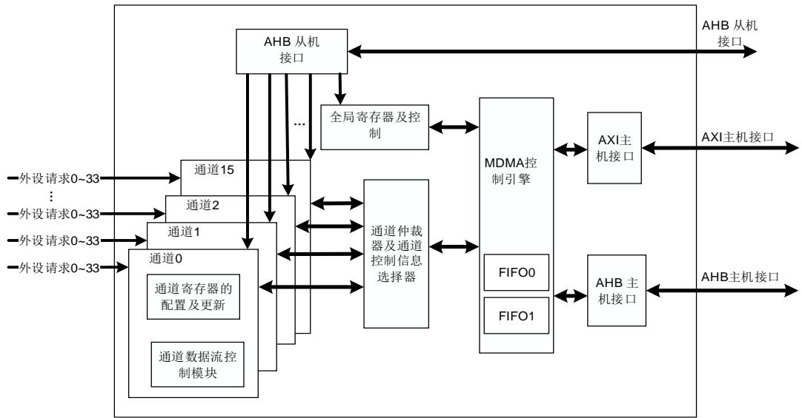
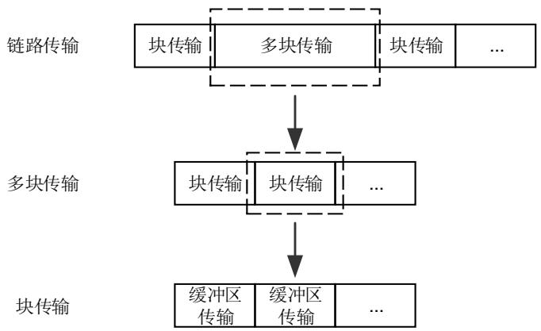
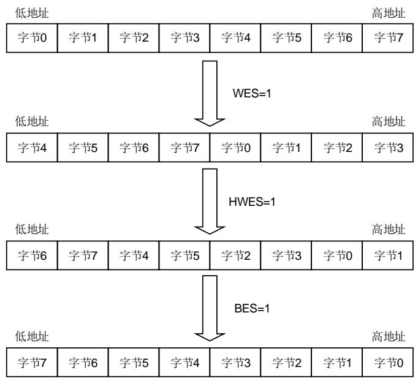
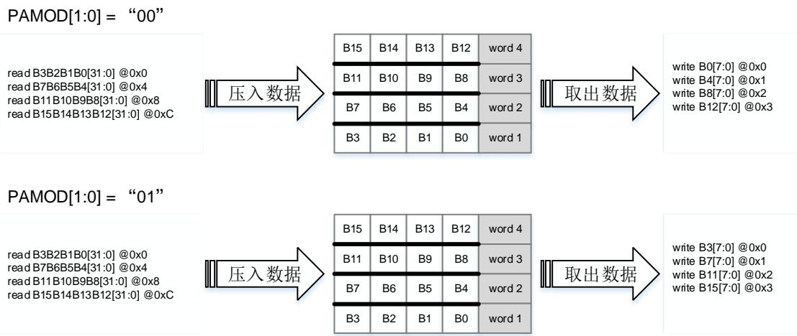
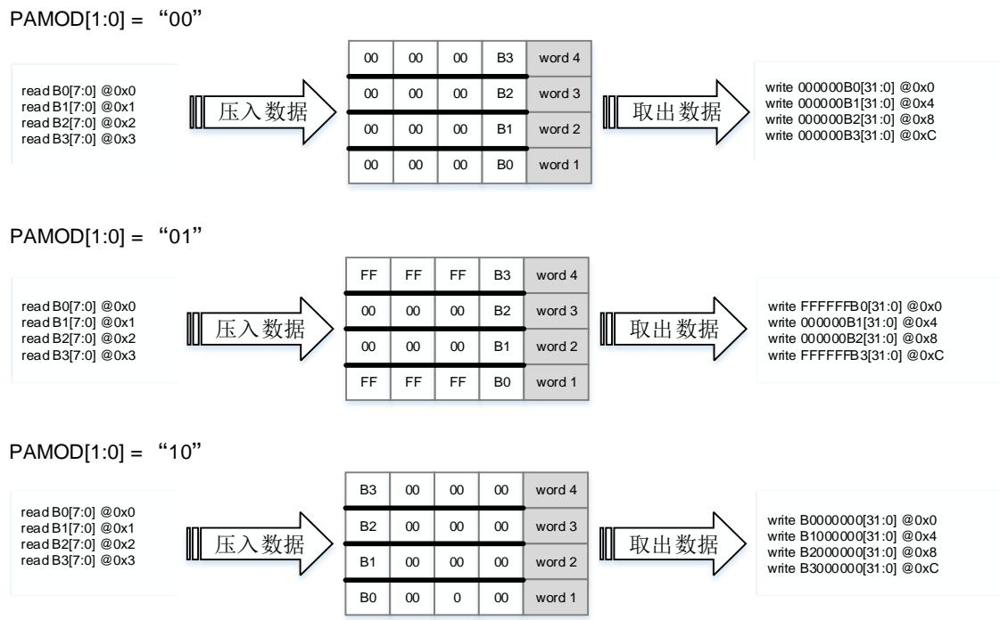
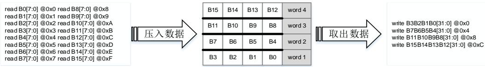
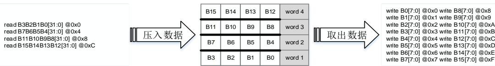
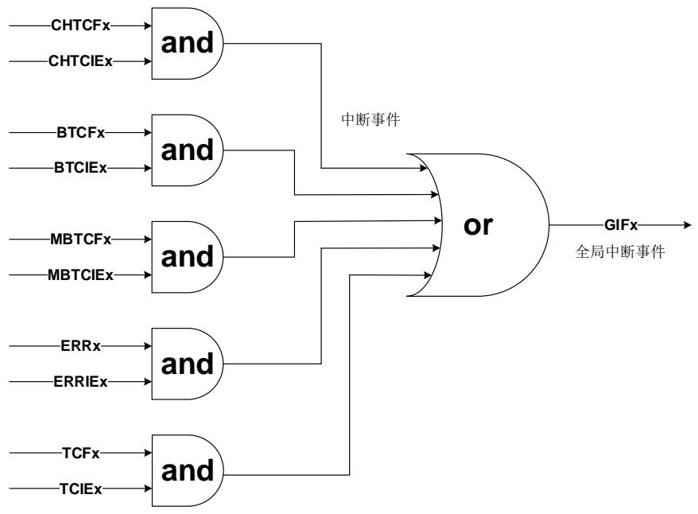

# 17. 主机直接存储器访问控制器（MDMA）

# 17.1. 简介

MDMA控制器提供了一种硬件的方式在外设和存储器之间或者存储器和存储器之间传输数据，而无需 MCU 的介入，避免了 MCU 多次进入中断进行大规模的数据拷贝，最终提高整体的系统性能。

MDMA 控制器包含一个 AXI 总线接口、一个 AHB 总线接口以及两个 16 个双字深度的 FIFO，使 MDMA 可以高效的传输数据。其中 AXI 总线接口用于主存储器和外设寄存器访问（系统访问端口），AHB 总线接口用于 Cortex®-M7 TCM 存储器访问（TCM 访问端口）。MDMA可以与 DMA 控制器（DMA0 或 DMA1）结合使用。MDMA 最多可提供 16 个通道，每个通道请求均可在任何请求源之间选择。内置总线仲裁器用来处理 MDMA 请求的优先级问题。

# 17.2. 主要特征

AXI / AHB 主机接口，AXI 总线接口用于外设与存储器之间的数据传输，AHB总线接口用于 Cortex®-M7 TCM 存储器的访问。

◼ 16 个通道，每个通道都支持软件触发且请求均可在任何请求源之间选择。

存储器和外设支持单一传输，2 拍，4 拍，8 拍，16 拍，32 拍，64 拍，128 拍增量突发传输。

◼ 支持软件优先级（低、中、高、超高）和硬件优先级（通道号越低，优先级越高）。

源和目标的数据传输宽度可配置：字节，半字，字，双字。

源和目标的数据传输支持固定寻址、递增式寻址和递减式寻址。

源和目标的数据长度及地址增量可配。

支持三种传输方式：

存储器到存储器（软件触发）；

外设到存储器（或存储器映射的外设）；

存储器（或存储器映射的外设）到外设。

◼ 在源数据宽度和目标数据宽度不同的时候，自动打包/解包数据优化带宽。

34 个硬件触发源，所有通道均可连接至任意硬件触发源。

两个 16 个双字深度的 FIFO，用于最大化数据带宽和总线使用率。

AHB 总线接口用于 Cortex®-M7 TCM 存储器访问时，仅当增量和数据大小相等且不大于32 位时，支持突发访问。当增量和数据大小大于 32 位时，突发访问被禁止。

每个通道有 5 种类型的事件标志和独立的中断，支持中断的使能和清除。

# 17.3. 功能说明

图 17-1. MDMA 系统框图

如 17-1. MDMA 所示，MDMA 控制器由 4 部分组成：

AHB 从接口配置 MDMA；

一个 AXI 主接口和一个 AHB主接口进行数据传输；

仲裁器进行 MDMA请求的优先级管理；

数据处理和计数。

MDMA 控制器在没有 CPU 参与的情况下从一个地址向另一个地址传输数据，它支持多种数据宽度，突发类型，地址生成算法，优先级和传输模式，可以灵活的配置以满足应用的需求。所有的 MDMA 寄存器都可以通过 AHB从机接口进行 32 位的操作。

MDMA_CHxCFG 寄存器中 TRIGMOD[1:0]决定了 MDMA 的数据传输模式，如 17-1.所示。

表 17-1. 传输模式

<table><tr><td>传输模式</td><td>TRIGMOD[1:0]</td></tr><tr><td>缓冲区传输</td><td>00</td></tr><tr><td>块传输</td><td>01</td></tr><tr><td>多块传输</td><td>10</td></tr><tr><td>链路传输</td><td>11</td></tr></table>

缓冲区传输一次最多传输 128 字节；

块传输一次最多传输 64KB，传输字节数可以通过 MDMA_CHxBTCFG 寄存器中TBNUM[16:0]配置，传输过程由硬件自动拆分成多个缓冲区传输；

多块传输包含多个块传输，待传输块数可以通过 MDMA_CHxBTCFG 寄存器中BRNUM[11:0]配置；

链路传输可以通过 MDMA_CHxLADDR 寄存器配置链路地址，包含多个块/多块传输。

四种模式之间的联系如 17-2. 所示。

图 17-2. 传输模式之间的联系

MDMA 控制器共有 16 个通道，每个通道都支持软件触发且请求均可在如 17-2. MDMA所示任何请求源之间选择。通过配置 MDMA_CHxCTL1 寄存器中 TRIGSEL[5:0]位域，可以选择通道 x 硬件触发源。

表 17-2. MDMA 硬件请求源

<table><tr><td>请求源 TRIGSEL[5:0]</td><td>来源</td></tr><tr><td>0</td><td>DMA0_CH0_TRIG</td></tr><tr><td>1</td><td>DMA0_CH1_TRIG</td></tr><tr><td>2</td><td>DMA0_CH2_TRIG</td></tr><tr><td>3</td><td>DMA0_CH3_TRIG</td></tr><tr><td>4</td><td>DMA0_CH4_TRIG</td></tr><tr><td>5</td><td>DMA0_CH5_TRIG</td></tr><tr><td>6</td><td>DMA0_CH6_TRIG</td></tr><tr><td>7</td><td>DMA0_CH7_TRIG</td></tr><tr><td>8</td><td>DMA1_CH0_TRIG</td></tr><tr><td>9</td><td>DMA1_CH1_TRIG</td></tr><tr><td>10</td><td>DMA1_CH2_TRIG</td></tr><tr><td>11</td><td>DMA1_CH3_TRIG</td></tr><tr><td>12</td><td>DMA1_CH4_TRIG</td></tr><tr><td>13</td><td>DMA1_CH5_TRIG</td></tr><tr><td>14</td><td>DMA1_CH6_TRIG</td></tr><tr><td>15</td><td>DMA1_CH7_TRIG</td></tr><tr><td>16</td><td>TLI_INT</td></tr><tr><td>17</td><td>保留</td></tr><tr><td>18</td><td>保留</td></tr><tr><td>19</td><td>保留</td></tr><tr><td>20</td><td>保留</td></tr><tr><td>21</td><td>保留</td></tr><tr><td>22</td><td>OSPI0_FT</td></tr><tr><td>23</td><td>OSPI0_TC</td></tr><tr><td>24</td><td>IPA_CLUT_TRIG</td></tr><tr><td>25</td><td>IPA_TC_TRIG</td></tr><tr><td>26</td><td>IPA_TWM_TRIG</td></tr><tr><td>27</td><td>保留</td></tr><tr><td>28</td><td>保留</td></tr><tr><td>29</td><td>SDIO0_DATA_END</td></tr><tr><td>30</td><td>SDIO0_BUF_END</td></tr><tr><td>31</td><td>SDIO0_CMD_END</td></tr><tr><td>32</td><td>OSPI1_FT</td></tr><tr><td>33</td><td>OSPI1_TC</td></tr></table>

# 17.3.1. 数据处理

# 仲裁

MDMA 通过仲裁器根据通道请求优先级对请求进行管理。当 MDMA 控制器在同一时间接收到多个外设请求时，仲裁器将根据外设请求的优先级来决定响应哪一个外设请求。优先级规则如下：

软件优先级：分为4级，包含低，中，高和超高。可以通过寄存器MDMA_CHxCTL0的PRIO[1:0]位域来配置；

◼ 硬件优先级：当通道具有相同的软件优先级时，编号低的通道优先级高。例：通道0和通道2配置为相同的软件优先级时，通道0的优先级高于通道2。

# 数据交换模式

通过配置 MDMA_CHxCTL0 寄存器中 WES / HWES / BES 位，可实现对目标数据是否执行字、半字、字节顺序交换操作。交换过程如 17-3. 所示。

图 17-3. 字、半字、字节顺序交换

# 传输宽度

寄存器 MDMA_CHxCFG 的 SWIDTH[1:0]和 DWIDTH[1:0]位域分别决定了源数据宽度和目标数据宽度。MDMA 控制器支持 8 位，16 位，32 位和 64 位的数据宽度。当 PKEN 使能且SWIDTH[1:0]和 DWIDTH[1:0]宽度不相等，MDMA 会自动打包/解包数据来进行数据传输以优化带宽。当 PKEN 禁能且 SWIDTH[1:0]和 DWIDTH[1:0]宽度不相等时，可以通过配置MDMA_CHxCFG 寄存器中 PAMOD[1:0]位域选择填充和对齐方式。

例如，当 SWIDTH[1:0] = 10（32 位），DWIDTH[1:0] = 00（8 位）时，填充和对齐方法如17-4. 所示。

图 17-4. 数据填充和对齐（源大于目的）

假设 B0 和B3的最高位为1，B1和 B2的最高位为0，当 SWIDTH[1:0] = 00（8 位），DWIDTH[1:0]= 10（32 位）时，填充和对齐方法如 17-5. 所示。

图 17-5. 数据填充和对齐（源小于目的）

# 打包/解包

在 MDMA传输中，源数据大小 SWIDTH 和目标数据大小 DWIDTH 相互独立，配置更为灵活。当 SWIDTH 和 DWIDTH 不相等时，MDMA 的读写传输宽度不同，MDMA 会自动的对数据打包/解包操作。将 MDMA_CHxCFG 寄存器 PKEN 位置 1，源数据将通过打包/解包的方式匹配目标数据大小。在对数据进行打包/解包时，采用小端模式。例如，当 SWIDTH[1:0] = 00，DWIDTH[1:0] = 10 时数据的打包以及 SWIDTH[1:0] = 10，DWIDTH[1:0] = 00 时解包过程如17-6. / 所示。

图 17-6. 数据的打包/解包

·SWIDTH[1:0]= 00,DWIDTH[1:0]= 10

·SWIDTH[1:0]= 10,DWIDTH[1:0] = 00

# 突发传输

寄存器 MDMA_CHxCFG 的 SBURST[2:0]和 DBURST[2:0]位域决定了源和目标的突发传输方式。MDMA 控制器的源和目标均支持单一传输，2 拍，4 拍，8 拍，16 拍，32 拍，64 拍和 128拍的增量突发传输。对于单数据传输模式，当使能通道后，SBURST[2:0]和 DBURST[2:0]会被强制设为 0。

注意：必须对 SBURST[2:0]和 DBURST[2:0]的值进行编程，以确保突发大小小于传输长度，否则，结果将无法预测。

# FIFO

MDMA控制器提供一个256字节大小的缓冲区，该缓冲区被分为两个深度为16个双字的FIFO，并为所有通道共用。FIFO 用于在将源数据写入到目标之前，临时存储这些数据。

FIFO0 用于存储当前缓冲区待传输的数据，当 FIFO0 中数据量满足目标突发，MDMA 将会立即启动写操作。在缓冲区待传输的数据全部读到 FIFO0 时，仲裁器开始对通道优先级进行仲裁，并将下一个缓冲区待传输数据写入 FIFO1。

如果在缓冲区传输过程中出错，导致通道被禁止，则 FIFO0 和 FIFO1 中的数据将被丢弃。

# 17.3.2. 地址生成

源和目标都独立的支持三种地址生成算法：固定模式、递增模式和递减模式。寄存器MDMA_CHxCFG 的 DIMOD[1:0]和 SIMOD[1:0]位域分别用于配置目的和源的地址生成算法，如 17-3. 所示。

表 17-3. 源和目标地址生成配置

<table><tr><td colspan="2">SIMOD[1:0]</td><td colspan="2">DIMOD[1:0]</td></tr><tr><td>00</td><td>无增量</td><td>00</td><td>无增量</td></tr><tr><td>10</td><td>源地址增量为 SIOS</td><td>10</td><td>目标地址增量为 DIOS</td></tr><tr><td>11</td><td>源地址减量为 SIOS</td><td>11</td><td>目标地址减量为 DIOS</td></tr></table>

在固定模式下，SIMOD[1:0]或 DIMOD[1:0]配置为“00”，源或目的地址一直固定为初始化的基地址（MDMA_CHxSADDR 和 MDMA_CHxDADDR）。

在递增或递减模式下，下一次传输数据的地址是当前地址加/减 1（或者 2，4，8），这个值取决于 MDMA_CHxCFG 寄存器中 SIOS[1:0]或 DIOS[1:0]的配置。

为优化打包操作，可独立编程增量大小和数据大小。

# 17.3.3. 传输模式

# 缓冲区传输模式

MDMA 控制器支持单一传输，2 拍，4 拍，8 拍，16 拍，32 拍，64 拍和 128 拍传输。寄存器MDMA_CHxCFG 的 SBURST[2:0]和 DBURST[2:0]位域决定了源和目标的突发传输方式。缓冲区传输是以单次或突发方式对数据进行传输。MDMA_CHxCFG 寄存器中 SWIDTH[1:0]和DWIDTH[1:0]用于配置源和目标数据宽度。

当 MDMA 接收到请求时，仲裁器会根据 MDMA 通道请求优先级对其进行管理。如果MDMA_CHxMADDR 寄存器不为 0，向 MADDR[31:0]指定的地址写入掩码数据时会确认该请求。否则，向发出请求的外设写入或者读取数据会复位请求。如果由目标外设完成请求，则必须将 MDMA_CHxCFG 寄存器中 BWMOD 清零，以避免出现错误的新 MDMA请求。

如果 MDMA_CHxCFG 寄存器中 TRIGMOD[1:0]为 00，MDMA 会在一个缓冲区的数据传输完成后在同一个通道（如通道 A）上等待另一个请求。

如果在通道 A下一次请求还未发生，其他通道（如通道 B）发生了请求，不管通道 B的优先级是否高于通道 A，都将响应通道 B的请求；

如果在通道 A一次缓冲区传输完成后检测到下一次请求，并且同时其他通道（通道 C）发生了请求，仲裁器会根据 MDMA通道请求优先级对请求事件进行管理。

当缓冲区传输完成时，MDMA_CHxSTAT0 寄存器中 TCF 位将置 1。通过将 MDMA_CHxSTATC寄存器中 TCFC 位写 1 可以清除 TCF 位。

如果 TRIGMOD[1:0]不为 00，且待传输数据总量大于 128 字节，则当每一次缓冲区传输完成后，仲裁器会根据 MDMA 通道请求优先级对请求事件进行仲裁。如果不存在优先级更高的其他请求，则会继续进行下一次缓冲区传输。如果有优先级更高的其他请求，MDMA 将优先处理优先级别高的请求。

注意：当 TRIGMOD[1:0]为 00，处于缓冲区传输模式时：

当BTLEN[6:0]≥TBNUM[15:0]，将传输 TBNUM[15:0]个字节数据。

当BTLEN[6:0]<TBNUM[15:0]，将传输（BTLEN[6:0] + 1）个字节数据。

# 块传输模式

在块传输模式下，块大小由 MDMA_CHxBTCFG 寄存器中 TBNUM[16:0]位域来配置，块中待传输字节数最大为 64KB。当 TBNUM[16:0]计数到 0，块传输完成，MDMA_CHxSTAT0 寄存器中 TCF 位、BTCF 位和 CHTCF 位将置 1。MDMA_CHxCTL0 寄存器中 CHEN 位将被硬件清零，该通道将不继续接受 MDMA 请求。

在多块传输模式下，如果当前块不是最后一块，在当前块传输完成后，硬件将自动重载第一次块传输长度，并根据 MDMA_CHxMBADDRU 寄存器中 DADDRUV 和 SADDRUV 的值以及MDMA_CHxBTCFG 寄存器中 SADDRUM 位和 DADDRUM 位，计算新的源地址和目标地址，并进行下一次块传输。如果当前块是最后一块，当 TBNUM[16:0]计数到 0，块传输完成，MDMA_CHxSTAT0 寄存器中 TCF 位、BTCF 位、MBTCF 位和 CHTCF 位将置 1。MDMA_CHxCTL0 寄存器中 CHEN 位将被硬件清零，该通道将不继续接受 MDMA 请求。

在链路模式下，如果当前块是单块或者多块的最后一块且 MDMA_CHxLADDR 不为 0，当前块传输完成后，将根据MDMA_CHxLADDR寄存器中LADDR指定的地址处加载新块配置信息，并开始新的块 / 多块传输。如果当前块是单块或者多块的最后一块且 MDMA_CHxLADDR 为0，MDMA_CHxSTAT0 寄存器中 TCF 位、MBTCF / BTCF 位和 CHTCF 位将置 1。MDMA_CHxCTL0 寄存器中 CHEN 位将被硬件清零，该通道将不继续接受 MDMA请求。

当块的大小不是源或目标数据大小的整数倍时，MDMA_CHxSTAT1 寄存器中 BZERR 位将硬件置 1。通过对 MDMA_CHxSTATC 寄存器 ERRC 位写 1 可以清除 BZERR 位。

将 MDMA_CHxSTATC 寄存器中 TCFC 位，BTCFC 位，MBTCF 位和 CHTCFC 位写 1 可以分别清除 TCF 位，BTCF 位，MBTCF 位和 CHTCF 位。

# 多块传输模式

MDMA_CHxBTCFG 寄存器中 BRNUM[11:0]可配置待传输块数，当 BRNUM[11:0]不为 0 时，多块传输模式被使能。BRNUM[11:0]可配置为 0~4095，当完成一次块传输时，BRNUM 的值减1，并且下一次块传输的源地址和目标地址会根据MDMA_CHxBTCFG寄存器中SADDRUM位和 DADDRUM 位配置的源地址和目的地址更新方式更新 MDMA_CHxSADDR 寄存器和MDMA_CHxDADDR 寄存器的值。源和目的地址更新方式如 17-4.所示。MDMA_CHxBTCFG 寄存器中 TBNUM[16:0]将重载第一次块传输时编程的值。当最后一块传输完成时，MDMA_CHxSTAT0 寄存器中 TCF 位、BTCF 位、MBTCF 位和 CHTCF 位将置 1，MDMA_CHxCTL0 寄存器中 CHEN 位将被硬件清零，该通道将不继续接受 MDMA请求。通过对 MDMA_CHxSTATC 寄存器中 TCFC 位、BTCFC 位、MBTCFC 位和 CHTCFC 位写 1 可以分别将 TCF 位、BTCF 位、MBTCF 位和 CHTCF 位清除。

表 17-4. 源和目的地址更新方式

<table><tr><td>源/目的地址</td><td>更新方式配置</td><td>更新后源/目的地址</td></tr><tr><td rowspan="2">SADDR</td><td>SADDRUM = 0</td><td>SADDR = SADDR + SADDRUV</td></tr><tr><td>SADDRUM = 1</td><td>SADDR = SADDR - SADDRUV</td></tr><tr><td rowspan="2">DADDR</td><td>DADDRUM = 0</td><td>DADDR = DADDR + DADDRUV</td></tr><tr><td>DADDRUM = 1</td><td>DADDR = DADDR - DADDRUV</td></tr></table>

注意：当 BRNUM[11:0]计数为 0 时，会将最后一个块传输视为单块传输。

# 链路传输模式

在链路模式下，当多块 / 块传输结束后，当前通道的配置寄存器包括 MDMA_CHxCFG，MDMA_CHxBTCFG，MDMA_CHxSADDR，MDMA_CHxDADDR，MDMA_CHxMBADDRU，MDMA_CHxLADDR，MDMA_CHxCTL1，MDMA_CHxMADDR 和 MDMA_CHxMDATA 将使用 MDMA_CHxLADDR 寄存器中定义的地址 LADDR[31:0]处的数据结构对配置寄存器进行加载。如 17-5. 所示。如果 MDMA_CHxCFG 寄存器中 TRIGMOD[1:0] = 11，在进行配置寄存器加载后，通道将接受新的请求或继续传输。

表 17-5. 寄存器加载地址

<table><tr><td>寄存器</td><td>加载地址</td></tr><tr><td>MDMA_CHxCFG</td><td>LADDR[31:0] + 0x00</td></tr><tr><td>MDMA_CHxBTCFG</td><td>LADDR[31:0] + 0x04</td></tr><tr><td>MDMA_CHxSADDR</td><td>LADDR[31:0] + 0x08</td></tr><tr><td>MDMA_CHxDADDR</td><td>LADDR[31:0] + 0x0C</td></tr><tr><td>MDMA_CHxMBADDRU</td><td>LADDR[31:0] + 0x10</td></tr><tr><td>MDMA_CHxLADDR</td><td>LADDR[31:0] + 0x14</td></tr><tr><td>MDMA_CHxCTL1</td><td>LADDR[31:0] + 0X18</td></tr><tr><td>MDMA_CHxMADDR</td><td>LADDR[31:0] + 0x20</td></tr><tr><td>MDMA_CHxMDATA</td><td>LADDR[31:0] + 0x24</td></tr></table>

如果在对通道配置寄存器加载时，MDMA_CHxCTL1 寄存器中 TRIGSEL[5:0]发生改变，则硬件将自动切换触发源。

注意：在链路传输模式下，MDMA_CHxCFG 寄存器中 SWREQMOD 位和 TRIGMOD[1:0]不能被修改。

# 17.3.4. 传输状态

# 传输完成

MDMA_CHxBTCFG 寄存器中 TBNUM[16:0]，BRNUM[11:0]和 MDMA_CHxLADDR 寄存器中LADDR[31:0]均为 0 时，或者在传输结束前，禁止了通道（CHEN = 0），并且 FIFO 中剩余数据均传输到目标时，通道传输完成后，MDMA_CHxSTAT0 寄存器中 CHTCF 位将置 1。

# 传输中断

传输中断是指在传输过程中将 MDMA_CHxCTL0 寄存器中 CHEN 清零禁止通道，并且在重新使能通道时不继续上一次的数据传输。在通道禁止后，当 FIFO 中剩余数据均传输到目标时，MDMA_CHxSTAT0 寄存器中 CHTCF 位将置 1。通过 MDMA_CHxBTCFG 寄存器中TBNUM[16:0]，BRNUM[11:0]可以查看未传输的字节数或块数。

# 传输暂停

在 MDMA_CHxBTCFG 寄存器中 TBNUM[16:0]计数达到 0 之前，将 MDMA_CHxCTL0 寄存器中 CHEN 清零可以暂停通道传输。当 MDMA_CHxSTAT0 寄存器中 CHTCF 位将置 1 时，表明 FIFO 中剩余数据已传输完成。如果 MDMA_CHxBTCFG 寄存器，MDMA_CHxSADDR寄存器以及 MDMA_CHxDADDR 寄存器的值未被软件修改，将 MDMA_CHxSTAT0 寄存器中CHTCF 位清零并将 CHEN 位重新使能后会继续进行数据传输。

注意：当 TRIGMOD[1:0]为 11 时，建议将下一个节点的数据结构中的 LADDR 字段配置为 0，以暂停通道传输。如果通过清除 MDMA_CHxCTL0 寄存器中的 CHEN 来暂停通道传输，则不能保证结果正确性。

# 17.3.5. MDMA 错误和中断

MDMA 错误标志如 17-6. MDMA 所示。

表 17-6. MDMA 错误标志

<table><tr><td>错误名称</td><td>描述</td></tr><tr><td>BZERR</td><td>块大小错误标志</td></tr><tr><td>ASERR</td><td>地址和大小错误标志</td></tr><tr><td>MDTERR</td><td>掩码数据传输错误标志</td></tr><tr><td>LDTERR</td><td>链路数据传输错误标志</td></tr><tr><td>ERR</td><td>传输错误标志</td></tr></table>

当发生下列情况时，传输错误标志（ERR）将置 1：

MDMA 读或写访问期间发生总线错误；

地址对齐的位置与数据的大小不匹配；

块大小不是（源和/或目标）数据大小的倍数。

对于每个 MDMA 通道，中断事件有五种类型：通道传输完成，缓冲区传输完成，块传输完成，多块传输完成和传输错误。

寄存器 MDMA_CHxSTAT0 包含每个中断事件的标志位，寄存器 MDMA_CHxSTATC 包含每个中断事件的标志清除位，寄存器 MDMA_CHxCTL0 包含每个中断事件的使能位，如 17-7.MDMA 所示。

表 17-7. MDMA 中断事件

<table><tr><td rowspan="2">中断事件</td><td>标志位</td><td>使能位</td><td>清除位</td></tr><tr><td>MDMA_CHxSTAT0</td><td>MDMA_CHxCTL0</td><td>MDMA_CHxSTATC</td></tr><tr><td>通道传输完成</td><td>CHTCF</td><td>CHTCIE</td><td>CHTCFC</td></tr><tr><td>缓冲区传输完成</td><td>TCF</td><td>TCIE</td><td>TCFC</td></tr><tr><td>块传输完成</td><td>BTCF</td><td>BTCIE</td><td>BTCFC</td></tr><tr><td>多块传输完成</td><td>MBTCF</td><td>MBTCIE</td><td>MBTCFC</td></tr><tr><td>传输错误</td><td>ERR</td><td>ERRIE</td><td>ERRC</td></tr></table>

当通道 x 的 BTCF / MBTCF / CHTCF / ERR / TCF 至少有一个标志位置位，并且相应的中断（BTCIE / MBTCIE / CHTCIE / ERRIE / TCIE）已使能，MDMA_GINTF 寄存器中 GIFx 将置1，如果再 NVIC 中 MDMA 中断已使能，将产生一个中断。

MDMA 中断逻辑如 17-7. MDMA 所示，任何类型中断使能时，产生了相应中断事件均会产生中断。

图 17-7. MDMA 中断逻辑图

注意：“x”表示通道数（对应 x=0…15）。


